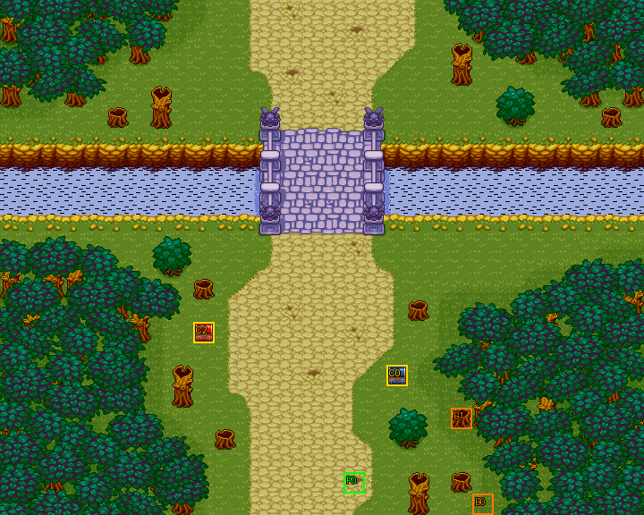

# 第 1 章　英雄之出發

<!-- chapter_docs:header -->
| 項目 | 內容 |
| --- | --- |
| 章號／章節索引 | 1／0 |
| 章名（文字區塊 `0x01`） | 英雄之出發 |
| 勝利條件（`0x02`） | 敵人全滅 |
| 敗北條件（`0x03`） | 蘭迪斯死亡／索爾死亡 |
| 戰場 | `MAP00.DAT`／`MAP00.COD`／`M00.DTL`，30×24 格，我方 slot 1 個，部署記錄 22 筆 |
| 文字區塊 | `FDETXT01.TXT`，16 條 |
| 進入處理（`0x60074`[0]） | `fdps_chapter_01_init`（`0x20e90`） |
| 行動後檢查（`0x6028c`[0]） | `fdps_chapter_01_post_action`（`0x3a3b0`） |
| 勝利處理（`0x60304`[0]） | `fdps_chapter_01_end`（`0x3a410`） |
| 地圖資料呼叫的事件處理（`0x601c4`） | 無 |
| 過場腳本 | `ICON00.DAT`（開場）、`WIN00.DAT`（勝利） |
| 本章之前的村莊 | 無 |
| 光碟 | 第 1 片（音軌見 [CD 音軌](../program_info/cd_audio.md)） |



戰場全圖（第 0 層與同步捲動的圖層）。框線：黃 `C` 寶箱、橘 `B` 埋藏格、青 `R` 重繪格、洋紅 `E` 有處理函式的格子事件格，字母後的數字是事件碼；綠 `P` 是我方 slot 的起始格。

圖由 `python tools/chapter_docs/chapter_facts.py render-maps` 從遊戲檔重畫到 `chapters/maps/`，`verify-maps` 逐 byte 比對版控中的圖。
<!-- /chapter_docs:header -->

## 概要

開場過場 `ICON00.DAT` 先交代身世：巴特離家買藥，妻子瑪茜在家中對嬰兒施行賜福儀式，被村人撞見、誤認為邪教的惡魔化身；村長召集村民把她綁上柴堆燒，瑪茜被一個漆黑的洞吸走，趕來的女武神姐妹質問村民、看過瑪茜的孩子後離去，巴特回家只找到兒子蘭迪斯。若干年後，病重的巴特臨終前告訴蘭迪斯：母親瑪茜並沒有死，只是下落不明。

戰場是一條河與一座石橋隔開的林地。蘭迪斯出門打獵，聽見聲響，一名野武士追著中毒的索爾衝過石橋；野武士叫出同夥，蘭迪斯不肯把中毒的索爾交出去，兩人一起迎戰。

打完之後的 `WIN00.DAT`：羅特帝亞王宮裡，亞雷斯大臣得知國王離宮兩天、已出國境；蘭迪斯家中，解了毒的索爾坦承自己就是羅特帝亞國王，邀蘭迪斯隨他遊歷、學做武士，也順道尋找母親，蘭迪斯答應。出發途中，女武神絲卡蒂亞現身，自稱母親的姐妹，說他與母親的命運之線相連，並喚醒他施展魔法的能力。

## 加入與離隊

蘭迪斯在本章的進入處理函式裡入隊，是名冊的第一人；入隊的方式與名冊記錄見 [`assets/characters.md` 的「加入」](../assets/characters.md#加入)。本章地圖只宣告 1 個我方 slot，上場的只有蘭迪斯。

索爾（角色編號 `0C`，LV10）是陣營 1 的友軍，由開場過場部署、AI 自行行動，不進名冊；他在第 2–6 章同樣以陣營 1 的友軍出現、不進名冊（[`ch02.md`](ch02.md)）。本章沒有人離隊。

## 勝敗條件與特殊機制

**勝利：敵人全滅。**`fdps_chapter_01_post_action`（`0x3a3b0`）先呼叫共用判定 `fdps_battle_check_default_end_conditions`（`0x3a2e0`），陣營 0 的單位全部退場即過關。索爾是陣營 1，不算在內；本章的敵人是開場過場部署的 21 名，沒有援軍。

**敗北：蘭迪斯或索爾死亡，與畫面上的字串一致，但兩者走不同的路。**蘭迪斯是單位 0，由共用判定檢查。索爾是單位 2（開場過場依序部署波次 2 的野武士、波次 1 的索爾，所以他落在第 2 格），由 `fdps_chapter_01_post_action`（`0x3a3b0`）自己檢查：單位 2 已退場就畫出本章文字 `0x0f`（索爾的遺言），再把戰鬥結束碼設成 1。這個寫入不看原本的值，所以最後一名敵人與索爾在同一次行動裡倒下時，結果是敗北而不是過關。

**索爾開場中毒，放著不管第 2 回合就會死。**`fdps_chapter_01_init`（`0x20e90`）在過場之後把索爾的中毒計時設成 11、目前 HP 設成 100，HP 上限維持部署算出的 969（[`assets/characters.md`](../assets/characters.md)）。中毒在每個陣營階段開始時扣 HP 上限的 1/10（`fdps_battle_tick_status_effects`（`0x1fa30`），規則見 [`program_info/battle.md`](../program_info/battle.md)），索爾每次扣 96：第 1 回合的友軍階段剩 4，第 2 回合的友軍階段歸 0 而死，接著的行動後檢查判定敗北。要在第 2 回合的我方階段結束前替他解毒；蘭迪斯入隊時身上就帶著一瓶 `DE` 解毒劑（[`assets/characters.md`](../assets/characters.md)）。

**索爾的遺言可能出現兩次。**索爾的部署記錄（`MAP00.DAT` 第 21 筆）另有死亡腳本 opcode 5、運算元 `0x0f`。在戰鬥中被擊倒時，`fdps_run_death_scripts`（`0x1d990`）先畫 `0x0f` 並判定敗北，同一次行動結束時的 `fdps_chapter_01_post_action`（`0x3a3b0`）看到單位 2 已退場，又畫一次 `0x0f`——它的畫字不看結束碼。毒發身亡則不經過死亡腳本：`fdps_battle_tick_status_effects`（`0x1fa30`）直接結算死亡、再呼叫行動後檢查，遺言只出現一次。索爾這一條敗北因此是靠行動後處理函式才完整的；只留死亡腳本的話，毒死索爾不會結束戰鬥。

**過關獎勵：業火。**`fdps_chapter_01_end`（`0x3a410`）在寫回名冊之前替單位 0（蘭迪斯）加上法術 `00` 業火（[`assets/spells.md`](../assets/spells.md)）。蘭迪斯的出場屬性沒有任何法術，這是他在整個遊戲裡取得業火的唯一途徑；`WIN00.DAT` 裡絲卡蒂亞賜予魔法的橋段就是它的劇情面。

## 敵人配置

敵人全部由開場過場 `ICON00.DAT` 部署，開戰時已全員在場，之後沒有增援。先是追著索爾過橋的 1 名野武士（波次 2），他喊出同夥後，同一段腳本接連部署波次 3 的 7 名野武士（其中 2 名 LV3）、波次 4 的 7 名狼人與波次 5 的 6 名蛇魔女，都放在各自錨點最近的空格。錨點大多在河的北岸與石橋一帶，另有 5 名野武士與狼人的錨點在南岸左右兩側的林地，一開戰就在蘭迪斯附近。

AI：野武士與狼人是行為 0（能打就打，否則走向最近的對手），蛇魔女是行為 1（同 0，但沒有直線距離的後備移動）；沒有守點不動的單位，也沒有搶寶箱的單位。友軍索爾是行為 3，追著角色編號 0 的蘭迪斯走（行為的定義見 [`program_info/map_ai.md`](../program_info/map_ai.md#行為代碼)）。本章沒有頭目。

<!-- chapter_docs:deployments -->
陣營與死亡腳本的意義見 [`resource_info/map.md`](../resource_info/map.md)，AI 行為（低 4 bit）見 [`program_info/map_ai.md`](../program_info/map_ai.md#行為代碼)；錨點是 `MAPnn.COD` 的座標，開場波次放在錨點上，其餘波次依部署方式放在錨點或最近的空格。單位名是全域文字的「角色編號 + 1」條；角色編號 `3C` 以上的敵兵，數值（`ENEMYDAT.DAT`）與種族、職業見 [`assets/enemies.md`](../assets/enemies.md)，以下的見 [`assets/characters.md`](../assets/characters.md)。

我方起始格：slot 0 (16, 22)。

| 波次 | 陣營 | 單位 | 等級 | 數量 |
| ---: | --- | --- | --- | ---: |
| 1 | NPC | `0C` 索爾 | 10 | 1 |
| 2 | 敵方 | `4F` 野武士 | 2 | 1 |
| 3 | 敵方 | `4F` 野武士 | 2 | 5 |
| 3 | 敵方 | `4F` 野武士 | 3 | 2 |
| 4 | 敵方 | `52` 狼人 | 2 | 7 |
| 5 | 敵方 | `4A` 蛇魔女 | 2 | 6 |

### 波次 1

出場：開場過場 `ICON00.DAT` `0x565`（切回地圖 0 之後、找最近空格）部署索爾，成為單位 2；`0x591` 放到 (14, 14)、`0x596` 復歸；由 `fdps_chapter_01_init`（`0x20e90`）播放

| # | 陣營 | 單位 | 等級 | AI 行為 | 錨點 | 死亡腳本 |
| ---: | --- | --- | ---: | --- | --- | --- |
| 21 | NPC | `0C` 索爾 | 10 | 3 追角色：`00` 蘭迪斯 | (14, 5) | 顯示 `0x0f`，之後敗北 |

### 波次 2

出場：開場過場 `ICON00.DAT` `0x553` 部署追索爾的野武士（找最近空格），成為單位 1；由 `fdps_chapter_01_init`（`0x20e90`）播放

| # | 陣營 | 單位 | 等級 | AI 行為 | 錨點 | 死亡腳本 |
| ---: | --- | --- | ---: | --- | --- | --- |
| 0 | 敵方 | `4F` 野武士 | 2 | 0 主動 | (18, 0) | 掉落 `B4` 藥草 |

### 波次 3

出場：開場過場 `ICON00.DAT` `0x5a6`，野武士喊出同夥（`0x0c`）之後部署（找最近空格）；由 `fdps_chapter_01_init`（`0x20e90`）播放

| # | 陣營 | 單位 | 等級 | AI 行為 | 錨點 | 死亡腳本 |
| ---: | --- | --- | ---: | --- | --- | --- |
| 1 | 敵方 | `4F` 野武士 | 2 | 0 主動 | (22, 12) | — |
| 2 | 敵方 | `4F` 野武士 | 2 | 0 主動 | (8, 10) | — |
| 3 | 敵方 | `4F` 野武士 | 3 | 0 主動 | (24, 12) | — |
| 4 | 敵方 | `4F` 野武士 | 2 | 0 主動 | (15, 7) | 掉落 `B4` 藥草 |
| 5 | 敵方 | `4F` 野武士 | 2 | 0 主動 | (14, 6) | 掉落 `DE` 解毒劑 |
| 6 | 敵方 | `4F` 野武士 | 3 | 0 主動 | (9, 10) | 掉落 300 金 |
| 7 | 敵方 | `4F` 野武士 | 2 | 0 主動 | (16, 4) | — |

### 波次 4

出場：開場過場 `ICON00.DAT` `0x5ae`，緊接波次 3 部署（找最近空格）；由 `fdps_chapter_01_init`（`0x20e90`）播放

| # | 陣營 | 單位 | 等級 | AI 行為 | 錨點 | 死亡腳本 |
| ---: | --- | --- | ---: | --- | --- | --- |
| 8 | 敵方 | `52` 狼人 | 2 | 0 主動 | (11, 1) | — |
| 9 | 敵方 | `52` 狼人 | 2 | 0 主動 | (23, 11) | — |
| 10 | 敵方 | `52` 狼人 | 2 | 0 主動 | (13, 4) | — |
| 11 | 敵方 | `52` 狼人 | 2 | 0 主動 | (15, 5) | — |
| 12 | 敵方 | `52` 狼人 | 2 | 0 主動 | (15, 6) | 掉落 500 金 |
| 13 | 敵方 | `52` 狼人 | 2 | 0 主動 | (16, 5) | — |
| 14 | 敵方 | `52` 狼人 | 2 | 0 主動 | (14, 5) | — |

### 波次 5

出場：開場過場 `ICON00.DAT` `0x5b6`，緊接波次 4 部署（找最近空格）；由 `fdps_chapter_01_init`（`0x20e90`）播放

| # | 陣營 | 單位 | 等級 | AI 行為 | 錨點 | 死亡腳本 |
| ---: | --- | --- | ---: | --- | --- | --- |
| 15 | 敵方 | `4A` 蛇魔女 | 2 | 1 追擊 | (9, 0) | — |
| 16 | 敵方 | `4A` 蛇魔女 | 2 | 1 追擊 | (10, 2) | — |
| 17 | 敵方 | `4A` 蛇魔女 | 2 | 1 追擊 | (20, 1) | — |
| 18 | 敵方 | `4A` 蛇魔女 | 2 | 1 追擊 | (20, 3) | 掉落 300 金 |
| 19 | 敵方 | `4A` 蛇魔女 | 2 | 1 追擊 | (19, 4) | 掉落 300 金 |
| 20 | 敵方 | `4A` 蛇魔女 | 2 | 1 追擊 | (19, 2) | — |
<!-- /chapter_docs:deployments -->

## 寶物

蘭迪斯入隊時帶著解毒劑與兩份藥草（[`assets/characters.md`](../assets/characters.md)），本章沒有任何處理函式另外發物品或金錢。

<!-- chapter_docs:treasure -->
搜尋的規則（同碼的格共用一筆記錄與一個旗標、背包滿時的交換）見 [`resource_info/map.md`](../resource_info/map.md)。

| 事件碼 | 格 | 內容 |
| ---: | --- | --- |
| 0 | (18, 17) 寶箱、(22, 23) 埋藏 | `B4` 藥草（2 格共用，只拿得到一次） |
| 1 | (21, 19) 埋藏 | `B4` 藥草 |
| 2 | (9, 15) 寶箱 | 1000 金 |

擊倒後掉落（死亡腳本 opcode 0／1，擊殺者須是存活的我方單位）：

| # | 單位 | 波次 | 掉落 |
| ---: | --- | ---: | --- |
| 0 | `4F` 野武士 | 2 | 掉落 `B4` 藥草 |
| 4 | `4F` 野武士 | 3 | 掉落 `B4` 藥草 |
| 5 | `4F` 野武士 | 3 | 掉落 `DE` 解毒劑 |
| 6 | `4F` 野武士 | 3 | 掉落 300 金 |
| 12 | `52` 狼人 | 4 | 掉落 500 金 |
| 18 | `4A` 蛇魔女 | 5 | 掉落 300 金 |
| 19 | `4A` 蛇魔女 | 5 | 掉落 300 金 |
<!-- /chapter_docs:treasure -->

## 村莊

<!-- chapter_docs:village -->
新遊戲直接進入本章，本章之前沒有村莊。
<!-- /chapter_docs:village -->

## 處理流程

### 進入：`fdps_chapter_01_init`（`0x20e90`）

1. `fdps_roster_add_character`（`0x23bc0`）加入蘭迪斯（角色編號 0）。新遊戲時名冊剛被清空，所以他落在名冊第 0 格。這一步必須在第 3 步的過場之前：過場在 `0x051c` 以 `SWITCH_MAP` 再跑一次 reset、依名冊重建地圖 0，決定上場名單的是那一次重建，所以加入排在第 2 步之前或之後都一樣，排到過場之後蘭迪斯就不在本章地圖上。
2. `fdps_chapter_state_reset`（`0x22750`）建立本章的戰場：地圖 0 只有 1 個我方 slot，部署記錄沒有一筆是波次 0，所以此時單位陣列只有蘭迪斯一人。
3. `fdps_icon_script_run`（`0x21650`）播 `ICON00.DAT`。過場在 `0x051c` 切回地圖 0，之後在這張地圖上依序部署波次 2（單位 1，野武士）、波次 1（單位 2，索爾）、波次 3、4、5；索爾被收起、放到 (14, 14) 再復歸。
4. `fdps_show_chapter_title_card`（`0x20c60`）播章節標題圖。
5. 取單位 2（索爾）的記錄，把中毒計時設成 11、目前 HP 設成 100（16-bit 寫入，HP 上限不動）。這一步必須在過場之後，因為索爾是過場部署的。
6. `fdps_map_cursor_move_to_unit`（`0x2da50`）把游標移到單位 0。

### 行動後檢查：`fdps_chapter_01_post_action`（`0x3a3b0`）

每個單位行動之後，以及每次中毒結算之後執行：

1. 呼叫共用判定 `fdps_battle_check_default_end_conditions`（`0x3a2e0`）：結束碼已非 0 就什麼都不做；否則陣營 0 全滅記 2，單位 0 退場記 1（後者蓋過前者）。
2. 單位 2（索爾）已退場時，以本章文字區塊畫 `0x0f`，然後結束碼設成 1。畫字與寫入都不看結束碼的現值。

### 勝利：`fdps_chapter_01_end`（`0x3a410`）

1. `fdps_set_flag_bit`（`0x282b0`）替單位 0 加上法術 `00` 業火。必須在寫回之前，寫到的是戰場上的單位記錄，法術遮罩隨寫回進名冊。
2. `fdps_roster_write_back_battle_units`（`0x23980`）把戰場單位寫回名冊。
3. `fdps_icon_script_run`（`0x21650`）播 `WIN00.DAT`。
4. `fdps_roster_revive_fallen_members`（`0x39e70`）復活陣亡的隊員。
5. 章節索引設成 1（第 2 章）。沒有先清殘敵。

本章的地圖資料不呼叫任何章節事件處理函式。

## 回合事件與格子事件

<!-- chapter_docs:events -->
觸發時機與陣營階段的意義見 [`resource_info/map.md`](../resource_info/map.md)。

本章沒有回合事件。

本章沒有格子事件。

死亡腳本裡的事件與文字：

| # | 單位 | 波次 | 死亡腳本 |
| ---: | --- | ---: | --- |
| 21 | `0C` 索爾 | 1 | 顯示 `0x0f`，之後敗北 |
<!-- /chapter_docs:events -->

## 過場腳本

`ICON00.DAT` 的前三段（地圖 32、34、35）是身世的回想，只有 `0x051c` 切回地圖 0 之後的部分屬於本章戰場。

<!-- chapter_docs:scripts -->
格式與每個指令的意義見 [`resource_info/cutscene_script.md`](../resource_info/cutscene_script.md)。`FDETXT01#0xNN` 是本章文字區塊的條目，全文在下方「對話」；切到額外場景之後顯示的文字直接列出（那些區塊的正典是 [`assets/text/scene_text.md`](../assets/text/scene_text.md)）。`u3=我方1` 是地圖單位索引 3 對到我方 slot 1，`u12=MAP02#9` 是 `MAP02.DAT` 第 9 筆部署記錄。

### `ICON00.DAT`

- 開場：`fdps_chapter_01_init`（`0x20e90`）
- 1488 byte、372 步；起始地圖 0，切換地圖 32 → 34 → 35 → 0，結束於地圖 0
- 越界：0x0454 FACE_UNITS: unit 1 >= unit count 1, written past the end of the unit array
- 越界：0x048c FACE_UNITS: unit 3 >= unit count 3, written past the end of the unit array

| 偏移 | 指令 | 內容 |
| ---: | --- | --- |
| `0000` | `SWITCH_MAP` | 切換地圖 → 32（MAP32，文字 FDETXT33） |
| `0002` | `SET_MUSIC` | 音樂 7（CD 第 8 軌） |
| `0004` | `SCROLL_VIEW` | 捲動視野到格 (1, 3) |
| `0007` | `WALK_UNITS` | 行走 3 格，每步 3 幀：u1=MAP32#1(角色0x7e)往左 |
| `000d` | `WALK_UNITS` | 行走 1 格，每步 3 幀：u0=MAP32#0(角色0x8b)往右 |
| `0013` | `DRAW_TEXT` | 顯示文字 FDETXT33#0x09 「{speaker char=126}好吧，我該走了！{br}答應為村長買的藥，{br}我親自送去才放心。{page}妳和蘭迪斯在家裡好好{br}待著，別到處亂走。{br}知道嗎？{page}尤其是妳，瑪茜！{br}別再為孩子舉行什麼奇{br}怪的儀式了，{page}若讓村人看見了，{br}不知惹出什麼事情來！{page}妳要小心，{br}不要曝露自己的身份！{speaker char=139}好了～！{br}快去吧！{br}巴特！你放心，{page}你的兒子，{br}是萬神庇護的嬌兒，{br}沒人敢對你的寶貝兒{page}子作什麼的！{speaker char=126}好，親愛的，我走了！{speaker char=139}巴特，你要快去快回喔{br}！」 |
| `0015` | `WALK_UNITS` | 行走 2 格，每步 4 幀：u1=MAP32#1(角色0x7e)往上 |
| `001b` | `RETIRE_UNIT` | 退場 u1=MAP32#1(角色0x7e) |
| `001d` | `SET_MUSIC` | 停止音樂 |
| `001f` | `WALK_UNITS` | 行走 5 格，每步 4 幀：u0=MAP32#0(角色0x8b)往右 |
| `0025` | `SET_MUSIC` | 音樂 4（CD 第 5 軌） |
| `0027` | `SCROLL_VIEW` | 捲動視野到格 (2, 5) |
| `002a` | `WALK_UNITS` | 行走 1 格，每步 4 幀：u0=MAP32#0(角色0x8b)往下 |
| `0030` | `RETIRE_UNIT` | 退場 u0=MAP32#0(角色0x8b) |
| `0032` | `DEPLOY_WAVE` | 部署 MAP32 波次 2（錨點原位）：#3(角色0x8c) |
| `0035` | `DEPLOY_WAVE` | 部署 MAP32 波次 1（錨點原位）：#2(角色0x7d) |
| `0038` | `FACE_UNITS` | 轉向後停 10 幀：u10=MAP32#2(角色0x7d)朝上 |
| `003d` | `WALK_UNITS` | 行走 1 格，每步 4 幀：u10=MAP32#2(角色0x7d)往上 |
| `0043` | `FACE_UNITS` | 轉向後停 3 幀：u10=MAP32#2(角色0x7d)朝下 |
| `0048` | `DRAW_TEXT` | 顯示文字 FDETXT33#0x0a 「{speaker char=125}﹒﹒願以我神力護持，{br}賜我兒天上神鷹之眼，{br}地上雄獅之力量！」 |
| `004a` | `DEPLOY_WAVE` | 部署 MAP32 波次 4（錨點原位）：#5(角色0x8e) |
| `004d` | `DEPLOY_WAVE` | 部署 MAP32 波次 5（錨點原位）：#6(角色0x8e) |
| `0050` | `DRAW_TEXT` | 顯示文字 FDETXT33#0x0b 「{speaker char=125}冥界眾神均迴避身影，{br}野獸與毒蛇聞聲趨避。{br}眾神垂憫憐聽，」 |
| `0052` | `DEPLOY_WAVE` | 部署 MAP32 波次 6（錨點原位）：#7(角色0x8e) |
| `0055` | `DEPLOY_WAVE` | 部署 MAP32 波次 7（錨點原位）：#8(角色0x8e) |
| `0058` | `DEPLOY_WAVE` | 部署 MAP32 波次 8（錨點原位）：#16(角色0x8e) |
| `005b` | `DRAW_TEXT` | 顯示文字 FDETXT33#0x0c 「{speaker char=125}女武神瑪茜以子為誓，{br}謹請光明神賜以奇蹟，{br}願我兒生生世世永為{page}汝之配劍護持﹒﹒」 |
| `005d` | `DEPLOY_WAVE` | 部署 MAP32 波次 9（錨點原位）：#17(角色0x8e) |
| `0060` | `DEPLOY_WAVE` | 部署 MAP32 波次 10（錨點原位）：#18(角色0x8e) |
| `0063` | `DEPLOY_WAVE` | 部署 MAP32 波次 11（錨點原位）：#19(角色0x8e) |
| `0066` | `DEPLOY_WAVE` | 部署 MAP32 波次 3（錨點原位）：#4(角色0x8d) |
| `0069` | `FACE_UNITS` | 轉向後停 20 幀：u9=MAP32#3(角色0x8c)朝左 |
| `006e` | `FACE_UNITS` | 轉向後停 20 幀：u9=MAP32#3(角色0x8c)朝上 |
| `0073` | `RETIRE_UNIT` | 退場 u9=MAP32#3(角色0x8c) |
| `0075` | `DEPLOY_WAVE` | 部署 MAP32 波次 12（錨點原位）：#20(角色0x81) |
| `0078` | `FADE_OUT` | 淡出，每步 40 ms |
| `007a` | `SCROLL_VIEW` | 捲動視野到格 (4, 46) |
| `007d` | `SCROLL_VIEW` | 捲動視野到格 (3, 45) |
| `0080` | `SCROLL_VIEW` | 捲動視野到格 (2, 44) |
| `0083` | `SCROLL_VIEW` | 捲動視野到格 (1, 43) |
| `0086` | `FACE_UNITS` | 轉向後停 25 幀：u20=MAP32#20(角色0x81)朝上 |
| `008b` | `FADE_IN` | 淡入，每步 80 ms |
| `008d` | `FACE_UNITS` | 轉向後停 15 幀：u20=MAP32#20(角色0x81)朝左 |
| `0092` | `FACE_UNITS` | 轉向後停 15 幀：u20=MAP32#20(角色0x81)朝右 |
| `0097` | `WALK_UNITS` | 行走 1 格，每步 4 幀：u20=MAP32#20(角色0x81)往下 |
| `009d` | `RETIRE_UNIT` | 退場 u20=MAP32#20(角色0x81) |
| `009f` | `FADE_OUT` | 淡出，每步 40 ms |
| `00a1` | `SCROLL_VIEW` | 捲動視野到格 (0, 34) |
| `00a4` | `FADE_IN` | 淡入，每步 40 ms |
| `00a6` | `DEPLOY_WAVE` | 部署 MAP32 波次 13（錨點原位）：#21(角色0x81) |
| `00a9` | `WALK_UNITS` | 行走 2 格，每步 4 幀：u21=MAP32#21(角色0x81)往上 |
| `00af` | `DRAW_TEXT` | 顯示文字 FDETXT33#0x0d 「{speaker char=129}不好了！不好了！{speaker char=120}安靜！這裡是神殿！{br}別在這裏大呼小叫！」 |
| `00b1` | `WALK_UNITS` | 行走 4 格，每步 1 幀：u21=MAP32#21(角色0x81)往右 |
| `00b7` | `SCROLL_VIEW` | 捲動視野到格 (5, 27) |
| `00ba` | `WALK_UNITS` | 行走 6 格，每步 1 幀：u21=MAP32#21(角色0x81)往上 |
| `00c0` | `WALK_UNITS` | 行走 4 格，每步 1 幀：u21=MAP32#21(角色0x81)往右 |
| `00c6` | `WALK_UNITS` | 行走 4 格，每步 1 幀：u8=MAP32#15(角色0x78)往左 |
| `00cc` | `DRAW_TEXT` | 顯示文字 FDETXT33#0x0e 「{speaker char=129}事情不好了！不好了！{speaker char=120}什麼事情？{br}這麼慌慌張張的？{br}好像看到了妖怪～{speaker char=129}是啊！是啊！{br}我看見巴特的太太把小{br}孩丟到火裡去，{page}也不知道嘴裡唸了什麼{br}咒語，{br}小孩在火裡沒有燒傷，{page}還在邊爬邊笑呢！{speaker char=120}什麼？有這種事情？！{br}難怪巴特當年出現在我{br}們村莊，{page}懇請我們收留他們時，{br}都不肯說明他們過去的{br}身份。{page}哼～！{br}原來是異教的邪徒。{br}你先別急！{page}且看我怎麼處置他們。」 |
| `00ce` | `WALK_UNITS` | 行走 1 格，每步 1 幀：u8=MAP32#15(角色0x78)往左 |
| `00d4` | `DRAW_TEXT` | 顯示文字 FDETXT33#0x0f 「{speaker char=120}慢！在行動之前，{br}為了慎重起見，{br}我們還是要請示我們{page}的神祇一下﹒﹒﹒」 |
| `00d6` | `SCROLL_VIEW` | 捲動視野到格 (8, 24) |
| `00d9` | `WALK_UNITS` | 行走 5 格，每步 1 幀：u8=MAP32#15(角色0x78)往右 |
| `00df` | `WALK_UNITS` | 行走 1 格，每步 1 幀：u8=MAP32#15(角色0x78)往上 |
| `00e5` | `SCROLL_VIEW` | 捲動視野到格 (13, 23) |
| `00e8` | `DRAW_TEXT` | 顯示文字 FDETXT33#0x10 「{speaker char=120}我偉大崇高的神啊～！{br}世間萬事萬物的真相，{br}逃不過您銳利眼睛。{page}請告訴我吧～！{br}定居在我們村子內，{br}巴特的妻子，{page}究竟是不是邪惡的惡魔{br}化身？」 |
| `00ea` | `SHAKE_VIEW` | 視野位移 32 步，每步 1 幀：(1,0) (1,-1) (0,-1) (0,0) (-1,0) (-1,1) (0,1) (0,0) (1,0) (1,-1) (0,-1) (0,0) (-1,0) (-1,1) (0,1) (0,0) (1,0) (1,-1) (0,-1) (0,0) (-1,0) (-1,1) (0,1) (0,0) (1,0) (1,-1) (0,-1) (0,0) (-1,0) (-1,1) (0,1) (0,0) |
| `012d` | `SCROLL_VIEW` | 捲動視野到格 (13, 24) |
| `0130` | `WALK_UNITS` | 行走 5 格，每步 1 幀：u21=MAP32#21(角色0x81)往右 |
| `0136` | `WALK_UNITS` | 行走 2 格，每步 1 幀：u7=MAP32#14(角色0x86)往上 |
| `013c` | `WALK_UNITS` | 行走 1 格，每步 1 幀：u6=MAP32#13(角色0x85)往上 |
| `0142` | `WALK_UNITS` | 行走 2 格，每步 1 幀：u5=MAP32#12(角色0x84)往上 |
| `0148` | `WALK_UNITS` | 行走 1 格，每步 1 幀：u4=MAP32#11(角色0x83)往上 |
| `014e` | `WALK_UNITS` | 行走 1 格，每步 1 幀：u3=MAP32#10(角色0x82)往上 |
| `0154` | `WALK_UNITS` | 行走 1 格，每步 1 幀：u2=MAP32#9(角色0x83)往上 |
| `015a` | `FACE_UNITS` | 轉向後停 15 幀：u8=MAP32#15(角色0x78)朝下 |
| `015f` | `DRAW_TEXT` | 顯示文字 FDETXT33#0x11 「{speaker char=120}去！{br}去將村民集合起來！{br}我們立刻要將村內{page}的妖孽處置掉！」 |
| `0161` | `FADE_OUT` | 淡出，每步 40 ms |
| `0163` | `RETIRE_UNIT` | 退場 u2=MAP32#9(角色0x83) |
| `0165` | `RETIRE_UNIT` | 退場 u3=MAP32#10(角色0x82) |
| `0167` | `RETIRE_UNIT` | 退場 u4=MAP32#11(角色0x83) |
| `0169` | `RETIRE_UNIT` | 退場 u5=MAP32#12(角色0x84) |
| `016b` | `RETIRE_UNIT` | 退場 u6=MAP32#13(角色0x85) |
| `016d` | `RETIRE_UNIT` | 退場 u7=MAP32#14(角色0x86) |
| `016f` | `RETIRE_UNIT` | 退場 u8=MAP32#15(角色0x78) |
| `0171` | `RETIRE_UNIT` | 退場 u10=MAP32#2(角色0x7d) |
| `0173` | `RETIRE_UNIT` | 退場 u11=MAP32#5(角色0x8e) |
| `0175` | `RETIRE_UNIT` | 退場 u12=MAP32#6(角色0x8e) |
| `0177` | `RETIRE_UNIT` | 退場 u13=MAP32#7(角色0x8e) |
| `0179` | `RETIRE_UNIT` | 退場 u14=MAP32#8(角色0x8e) |
| `017b` | `RETIRE_UNIT` | 退場 u15=MAP32#16(角色0x8e) |
| `017d` | `RETIRE_UNIT` | 退場 u16=MAP32#17(角色0x8e) |
| `017f` | `RETIRE_UNIT` | 退場 u17=MAP32#18(角色0x8e) |
| `0181` | `RETIRE_UNIT` | 退場 u18=MAP32#19(角色0x8e) |
| `0183` | `RETIRE_UNIT` | 退場 u19=MAP32#4(角色0x8d) |
| `0185` | `RETIRE_UNIT` | 退場 u21=MAP32#21(角色0x81) |
| `0187` | `DEPLOY_WAVE` | 部署 MAP32 波次 14（錨點原位）：#22(角色0x8b) |
| `018a` | `SCROLL_VIEW` | 捲動視野到格 (1, 3) |
| `018d` | `FADE_IN` | 淡入，每步 80 ms |
| `018f` | `WALK_UNITS` | 行走 4 格，每步 4 幀：u22=MAP32#22(角色0x8b)往右 |
| `0195` | `WALK_UNITS` | 行走 1 格，每步 4 幀：u22=MAP32#22(角色0x8b)往左 |
| `019b` | `DEPLOY_WAVE` | 部署 MAP32 波次 15（找最近空格）：#23(角色0x81) |
| `019e` | `FACE_UNITS` | 轉向後停 20 幀：u22=MAP32#22(角色0x8b)朝左 |
| `01a3` | `WALK_UNITS` | 行走 2 格，每步 1 幀：u23=MAP32#23(角色0x81)往下 |
| `01a9` | `WALK_UNITS` | 行走 2 格，每步 1 幀：u23=MAP32#23(角色0x81)往右 |
| `01af` | `DEPLOY_WAVE` | 部署 MAP32 波次 16（找最近空格）：#24(角色0x86) |
| `01b2` | `WALK_UNITS` | 行走 3 格，每步 1 幀：u24=MAP32#24(角色0x86)往下 |
| `01b8` | `FACE_UNITS` | 轉向後停 15 幀：u24=MAP32#24(角色0x86)朝右 |
| `01bd` | `DEPLOY_WAVE` | 部署 MAP32 波次 17（找最近空格）：#25(角色0x86) |
| `01c0` | `WALK_UNITS` | 行走 1 格，每步 1 幀：u25=MAP32#25(角色0x86)往下 |
| `01c6` | `WALK_UNITS` | 行走 1 格，每步 1 幀：u25=MAP32#25(角色0x86)往右 |
| `01cc` | `DEPLOY_WAVE` | 部署 MAP32 波次 18（找最近空格）：#26(角色0x78) |
| `01cf` | `FACE_UNITS` | 轉向後停 14 幀：u26=MAP32#26(角色0x78)朝右 |
| `01d4` | `DRAW_TEXT` | 顯示文字 FDETXT33#0x12 「{speaker char=120}把她抓起來！{br}燒了她！」 |
| `01d6` | `WALK_UNITS` | 行走 3 格，每步 1 幀：u24=MAP32#24(角色0x86)往右 |
| `01dc` | `WALK_UNITS` | 行走 2 格，每步 1 幀：u25=MAP32#25(角色0x86)往右 |
| `01e2` | `FADE_OUT` | 淡出，每步 10 ms |
| `01e4` | `SWITCH_MAP` | 切換地圖 → 34（MAP34，文字 FDETXT35） |
| `01e6` | `DEPLOY_WAVE` | 部署 MAP34 波次 1（錨點原位）：#0(角色0x78) |
| `01e9` | `FACE_UNITS` | 轉向後停 1 幀：u0=MAP34#0(角色0x78)朝上 |
| `01ee` | `DEPLOY_WAVE` | 部署 MAP34 波次 2（錨點原位）：#1(角色0x90) |
| `01f1` | `DEPLOY_WAVE` | 部署 MAP34 波次 3（錨點原位）：#2(角色0x8d) |
| `01f4` | `DEPLOY_WAVE` | 部署 MAP34 波次 4（錨點原位）：#3(角色0x81) |
| `01f7` | `FACE_UNITS` | 轉向後停 1 幀：u3=MAP34#3(角色0x81)朝上 |
| `01fc` | `DEPLOY_WAVE` | 部署 MAP34 波次 5（錨點原位）：#4(角色0x82) |
| `01ff` | `FACE_UNITS` | 轉向後停 1 幀：u4=MAP34#4(角色0x82)朝上 |
| `0204` | `DEPLOY_WAVE` | 部署 MAP34 波次 6（錨點原位）：#5(角色0x83) |
| `0207` | `FACE_UNITS` | 轉向後停 1 幀：u5=MAP34#5(角色0x83)朝上 |
| `020c` | `DEPLOY_WAVE` | 部署 MAP34 波次 7（錨點原位）：#6(角色0x84) |
| `020f` | `FACE_UNITS` | 轉向後停 1 幀：u6=MAP34#6(角色0x84)朝上 |
| `0214` | `DEPLOY_WAVE` | 部署 MAP34 波次 8（錨點原位）：#7(角色0x76) |
| `0217` | `FACE_UNITS` | 轉向後停 1 幀：u7=MAP34#7(角色0x76)朝上 |
| `021c` | `DEPLOY_WAVE` | 部署 MAP34 波次 9（錨點原位）：#8(角色0x77) |
| `021f` | `FACE_UNITS` | 轉向後停 1 幀：u8=MAP34#8(角色0x77)朝上 |
| `0224` | `SCROLL_VIEW` | 捲動視野到格 (2, 0) |
| `0227` | `FADE_IN` | 淡入，每步 120 ms |
| `0229` | `FACE_UNITS` | 轉向後停 25 幀：u2=MAP34#2(角色0x8d)朝上 |
| `022e` | `FACE_UNITS` | 轉向後停 25 幀：u2=MAP34#2(角色0x8d)朝右 |
| `0233` | `DRAW_TEXT` | 顯示文字 FDETXT35#0x09 「{speaker char=120}放火！」 |
| `0235` | `SCROLL_VIEW` | 捲動視野到格 (0, 0) |
| `0238` | `SCROLL_VIEW` | 捲動視野到格 (2, 0) |
| `023b` | `WALK_UNITS` | 行走 2 格，每步 2 幀：u3=MAP34#3(角色0x81)往上 |
| `0241` | `WALK_UNITS` | 行走 2 格，每步 2 幀：u4=MAP34#4(角色0x82)往上 |
| `0247` | `DEPLOY_WAVE` | 部署 MAP34 波次 10（錨點原位）：#9(角色0x8e) |
| `024a` | `DEPLOY_WAVE` | 部署 MAP34 波次 11（錨點原位）：#10(角色0x8e) |
| `024d` | `DEPLOY_WAVE` | 部署 MAP34 波次 12（錨點原位）：#11(角色0x8e) |
| `0250` | `DEPLOY_WAVE` | 部署 MAP34 波次 13（錨點原位）：#12(角色0x8e) |
| `0253` | `WALK_UNITS` | 行走 2 格，每步 2 幀：u3=MAP34#3(角色0x81)往下 |
| `0259` | `FACE_UNITS` | 轉向後停 10 幀：u3=MAP34#3(角色0x81)朝上 |
| `025e` | `WALK_UNITS` | 行走 2 格，每步 2 幀：u4=MAP34#4(角色0x82)往下 |
| `0264` | `FACE_UNITS` | 轉向後停 10 幀：u4=MAP34#4(角色0x82)朝上 |
| `0269` | `FACE_UNITS` | 轉向後停 25 幀：u2=MAP34#2(角色0x8d)朝上 |
| `026e` | `FACE_UNITS` | 轉向後停 10 幀：u2=MAP34#2(角色0x8d)朝上 |
| `0273` | `SHAKE_VIEW` | 視野位移 32 步，每步 1 幀：(1,0) (1,-1) (0,-1) (0,0) (-1,0) (-1,1) (0,1) (0,0) (1,0) (1,-1) (0,-1) (0,0) (-1,0) (-1,1) (0,1) (0,0) (1,0) (1,-1) (0,-1) (0,0) (-1,0) (-1,1) (0,1) (0,0) (1,0) (1,-1) (0,-1) (0,0) (-1,0) (-1,1) (0,1) (0,0) |
| `02b6` | `RETIRE_UNIT` | 退場 u1=MAP34#1(角色0x90) |
| `02b8` | `PLAY_SAF` | 播放動畫 ICON0003.SAF |
| `02ba` | `WALK_UNITS` | 行走 1 格，每步 2 幀：u3=MAP34#3(角色0x81)往上 |
| `02c0` | `WALK_UNITS` | 行走 1 格，每步 2 幀：u4=MAP34#4(角色0x82)往上 |
| `02c6` | `WALK_UNITS` | 行走 1 格，每步 2 幀：u7=MAP34#7(角色0x76)往上 |
| `02cc` | `FACE_UNITS` | 轉向後停 10 幀：u7=MAP34#7(角色0x76)朝左 |
| `02d1` | `FACE_UNITS` | 轉向後停 10 幀：u7=MAP34#7(角色0x76)朝右 |
| `02d6` | `FACE_UNITS` | 轉向後停 10 幀：u7=MAP34#7(角色0x76)朝上 |
| `02db` | `DRAW_TEXT` | 顯示文字 FDETXT35#0x0a 「{speaker char=118}這是怎麼回事？{br}你們快看～！」 |
| `02dd` | `PLAY_SAF` | 播放動畫 ICON0002.SAF |
| `02df` | `WALK_UNITS` | 行走 1 格，每步 2 幀：u8=MAP34#8(角色0x77)往下 |
| `02e5` | `FACE_UNITS` | 轉向後停 10 幀：u8=MAP34#8(角色0x77)朝上 |
| `02ea` | `PLAY_SAF` | 播放動畫 ICON0001.SAF |
| `02ec` | `WALK_UNITS` | 行走 1 格，每步 2 幀：u3=MAP34#3(角色0x81)往下 |
| `02f2` | `FACE_UNITS` | 轉向後停 10 幀：u3=MAP34#3(角色0x81)朝上 |
| `02f7` | `PLAY_SAF` | 播放動畫 ICON0000.SAF |
| `02f9` | `PLAY_SAF` | 播放動畫 ICON0005.SAF |
| `02fb` | `DEPLOY_WAVE` | 部署 MAP34 波次 14（錨點原位）：#13(角色0x79) |
| `02fe` | `PLAY_SAF` | 播放動畫 ICON0004.SAF |
| `0300` | `DEPLOY_WAVE` | 部署 MAP34 波次 15（錨點原位）：#14(角色0x7a) |
| `0303` | `PLAY_SAF` | 播放動畫 ICON0006.SAF |
| `0305` | `DEPLOY_WAVE` | 部署 MAP34 波次 16（錨點原位）：#15(角色0x7b) |
| `0308` | `RETIRE_UNIT` | 退場 u9=MAP34#9(角色0x8e) |
| `030a` | `RETIRE_UNIT` | 退場 u10=MAP34#10(角色0x8e) |
| `030c` | `RETIRE_UNIT` | 退場 u11=MAP34#11(角色0x8e) |
| `030e` | `RETIRE_UNIT` | 退場 u12=MAP34#12(角色0x8e) |
| `0310` | `DRAW_TEXT` | 顯示文字 FDETXT35#0x0b 「{speaker char=123}是誰在褻瀆神明？{br}竟然敢將我等之姐妹捆{br}綁在柴柱上燒化！{page}幸而我等即時趕到！{br}我們的姐妹呢？{br}快將她交出來！{page}否則休怪我不客氣了！{speaker char=120}﹒﹒﹒啊？！{br}﹒﹒啊？！﹒﹒﹒{br}女神，請饒命～！{page}我們不知道瑪茜的身份{br}所以誤會她是惡魔﹒﹒{br}可是她已經逃脫了，{page}我們沒有傷害到她﹒﹒{br}真的﹒﹒{br}是真的﹒﹒﹒{speaker char=123}胡說！{br}我等沒有感應到姐妹在{br}這附近，{page}你們將她藏起來了！{br}是不是？！{speaker char=120}啊？！沒有！沒有！{br}剛才這裡明明出現一個{br}漆黑的洞，{page}將瑪茜吸進去後，{br}她便消失了！{speaker char=121}這是妹妹的兒子嗎？{speaker char=122}快讓我看看！～」 |
| `0312` | `SET_VIEW_TILE` | 視野直接設到格 (2, 0) |
| `0315` | `RETIRE_UNIT` | 退場 u2=MAP34#2(角色0x8d) |
| `0317` | `PLAY_SAF` | 播放動畫 ICON0007.SAF |
| `0319` | `RETIRE_UNIT` | 退場 u14=MAP34#14(角色0x7a) |
| `031b` | `DEPLOY_WAVE` | 部署 MAP34 波次 19（錨點原位）：#18(角色0x92) |
| `031e` | `DRAW_TEXT` | 顯示文字 FDETXT35#0x0c 「{speaker char=146}哇～！好可愛的孩子！{br}大姐，妳看，{br}是瑪茜的孩子耶～！{speaker char=123}哼！小妹胡塗，{br}竟跟人類生出了孩子。{speaker char=121}不管怎樣說，{br}他的體內仍有一半神的{br}血統，{page}理應得到神的祝福，{br}這是他的權利。{speaker char=123}不管妳們了！{br}小妹無緣無故消失，{br}這事情要趕快調查。{page}不要在這裡浪費時間，{br}把孩子丟下，{br}我們快走吧！{speaker char=146}唔～！好乖的小孩～！{br}我們先去找你媽媽了，{br}再見啦～！」 |
| `0320` | `SET_VIEW_TILE` | 視野直接設到格 (2, 0) |
| `0323` | `REVIVE_UNIT` | 復歸 u14=MAP34#14(角色0x7a)（清狀態） |
| `0325` | `RETIRE_UNIT` | 退場 u16=MAP34#18(角色0x92) |
| `0327` | `PLAY_SAF` | 播放動畫 ICON0008.SAF |
| `0329` | `REVIVE_UNIT` | 復歸 u2=MAP34#2(角色0x8d)（清狀態） |
| `032b` | `DRAW_TEXT` | 顯示文字 FDETXT35#0x0d 「{speaker char=123}你們這些下界無知的人{br}無法分辨真神與假神，{br}我們並不加以怪罪。{page}但是你們竟聽從讒言，{br}欲加害我等神族，{br}真是罪大惡極！{page}今天便要你們見識神罰{br}的威力！」 |
| `032d` | `PLAY_SAF` | 播放動畫 ICON0001.SAF |
| `032f` | `PLAY_SAF` | 播放動畫 ICON0002.SAF |
| `0331` | `WALK_UNITS` | 行走 4 格，每步 1 幀：u1=MAP34#1(角色0x90)往下、u3=MAP34#3(角色0x81)往下、u4=MAP34#4(角色0x82)往下 |
| `033b` | `PLAY_SAF` | 播放動畫 ICON0000.SAF |
| `033d` | `WALK_UNITS` | 行走 4 格，每步 1 幀：u5=MAP34#5(角色0x83)往下、u6=MAP34#6(角色0x84)往下、u7=MAP34#7(角色0x76)往下、u8=MAP34#8(角色0x77)往下 |
| `0349` | `PLAY_SAF` | 播放動畫 ICON0001.SAF |
| `034b` | `WALK_UNITS` | 行走 3 格，每步 1 幀：u0=MAP34#0(角色0x78)往下 |
| `0351` | `FADE_OUT` | 淡出，每步 20 ms |
| `0353` | `SET_VIEW_TILE` | 視野直接設到格 (8, 10) |
| `0356` | `WALK_UNITS` | 行走 3 格，每步 1 幀：u0=MAP34#0(角色0x78)往左 |
| `035c` | `WALK_UNITS` | 行走 4 格，每步 1 幀：u5=MAP34#5(角色0x83)往上、u6=MAP34#6(角色0x84)往上、u7=MAP34#7(角色0x76)往上、u8=MAP34#8(角色0x77)往上 |
| `0368` | `WALK_UNITS` | 行走 4 格，每步 1 幀：u1=MAP34#1(角色0x90)往上、u3=MAP34#3(角色0x81)往上、u4=MAP34#4(角色0x82)往上 |
| `0372` | `FADE_IN` | 淡入，每步 10 ms |
| `0374` | `PLAY_SAF` | 播放動畫 ICON0010.SAF |
| `0376` | `FADE_OUT` | 淡出，每步 10 ms |
| `0378` | `RETIRE_UNIT` | 退場 u0=MAP34#0(角色0x78) |
| `037a` | `RETIRE_UNIT` | 退場 u2=MAP34#2(角色0x8d) |
| `037c` | `RETIRE_UNIT` | 退場 u3=MAP34#3(角色0x81) |
| `037e` | `RETIRE_UNIT` | 退場 u4=MAP34#4(角色0x82) |
| `0380` | `RETIRE_UNIT` | 退場 u5=MAP34#5(角色0x83) |
| `0382` | `RETIRE_UNIT` | 退場 u6=MAP34#6(角色0x84) |
| `0384` | `RETIRE_UNIT` | 退場 u7=MAP34#7(角色0x76) |
| `0386` | `RETIRE_UNIT` | 退場 u8=MAP34#8(角色0x77) |
| `0388` | `RETIRE_UNIT` | 退場 u13=MAP34#13(角色0x79) |
| `038a` | `RETIRE_UNIT` | 退場 u14=MAP34#14(角色0x7a) |
| `038c` | `RETIRE_UNIT` | 退場 u15=MAP34#15(角色0x7b) |
| `038e` | `DEPLOY_WAVE` | 部署 MAP34 波次 18（錨點原位）：#17(角色0x7e) |
| `0391` | `DEPLOY_WAVE` | 部署 MAP34 波次 17（錨點原位）：#16(角色0x8d) |
| `0394` | `SET_VIEW_TILE` | 視野直接設到格 (10, 28) |
| `0397` | `FACE_UNITS` | 轉向後停 1 幀：u17=MAP34#17(角色0x7e)朝左 |
| `039c` | `FADE_IN` | 淡入，每步 10 ms |
| `039e` | `FACE_UNITS` | 轉向後停 25 幀：u17=MAP34#17(角色0x7e)朝左 |
| `03a3` | `DRAW_TEXT` | 顯示文字 FDETXT35#0x0e 「{speaker char=126}？」 |
| `03a5` | `FACE_UNITS` | 轉向後停 25 幀：u17=MAP34#17(角色0x7e)朝下 |
| `03aa` | `DRAW_TEXT` | 顯示文字 FDETXT35#0x0f 「{speaker char=126}？？？」 |
| `03ac` | `FACE_UNITS` | 轉向後停 25 幀：u17=MAP34#17(角色0x7e)朝上 |
| `03b1` | `DRAW_TEXT` | 顯示文字 FDETXT35#0x10 「{speaker char=126}？？？？？？？？」 |
| `03b3` | `FACE_UNITS` | 轉向後停 5 幀：u17=MAP34#17(角色0x7e)朝左 |
| `03b8` | `DRAW_TEXT` | 顯示文字 FDETXT35#0x11 「{speaker char=126}瑪茜？！」 |
| `03ba` | `WALK_UNITS` | 行走 4 格，每步 1 幀：u17=MAP34#17(角色0x7e)往左 |
| `03c0` | `SET_VIEW_TILE` | 視野直接設到格 (10, 24) |
| `03c3` | `DRAW_TEXT` | 顯示文字 FDETXT35#0x11 「{speaker char=126}瑪茜？！」 |
| `03c5` | `WALK_UNITS` | 行走 6 格，每步 1 幀：u17=MAP34#17(角色0x7e)往上 |
| `03cb` | `FADE_OUT` | 淡出，每步 10 ms |
| `03cd` | `SET_VIEW_TILE` | 視野直接設到格 (10, 20) |
| `03d0` | `FACE_UNITS` | 轉向後停 15 幀：u17=MAP34#17(角色0x7e)朝下 |
| `03d5` | `FADE_IN` | 淡入，每步 10 ms |
| `03d7` | `FACE_UNITS` | 轉向後停 15 幀：u17=MAP34#17(角色0x7e)朝左 |
| `03dc` | `DRAW_TEXT` | 顯示文字 FDETXT35#0x11 「{speaker char=126}瑪茜？！」 |
| `03de` | `FACE_UNITS` | 轉向後停 15 幀：u17=MAP34#17(角色0x7e)朝上 |
| `03e3` | `FACE_UNITS` | 轉向後停 15 幀：u17=MAP34#17(角色0x7e)朝右 |
| `03e8` | `DRAW_TEXT` | 顯示文字 FDETXT35#0x11 「{speaker char=126}瑪茜？！」 |
| `03ea` | `WALK_UNITS` | 行走 1 格，每步 4 幀：u17=MAP34#17(角色0x7e)往左 |
| `03f0` | `FACE_UNITS` | 轉向後停 15 幀：u17=MAP34#17(角色0x7e)朝上 |
| `03f5` | `FACE_UNITS` | 轉向後停 15 幀：u17=MAP34#17(角色0x7e)朝右 |
| `03fa` | `FACE_UNITS` | 轉向後停 15 幀：u17=MAP34#17(角色0x7e)朝左 |
| `03ff` | `DRAW_TEXT` | 顯示文字 FDETXT35#0x12 「{speaker char=126}！」 |
| `0401` | `WALK_UNITS` | 行走 3 格，每步 1 幀：u17=MAP34#17(角色0x7e)往左 |
| `0407` | `FADE_OUT` | 淡出，每步 10 ms |
| `0409` | `SET_VIEW_TILE` | 視野直接設到格 (2, 20) |
| `040c` | `FACE_UNITS` | 轉向後停 1 幀：u17=MAP34#17(角色0x7e)朝左 |
| `0411` | `FADE_IN` | 淡入，每步 10 ms |
| `0413` | `DRAW_TEXT` | 顯示文字 FDETXT35#0x13 「{speaker char=126}蘭迪斯！」 |
| `0415` | `WALK_UNITS` | 行走 3 格，每步 1 幀：u17=MAP34#17(角色0x7e)往左 |
| `041b` | `FACE_UNITS` | 轉向後停 25 幀：u17=MAP34#17(角色0x7e)朝下 |
| `0420` | `FACE_UNITS` | 轉向後停 25 幀：u17=MAP34#17(角色0x7e)朝上 |
| `0425` | `DRAW_TEXT` | 顯示文字 FDETXT35#0x14 「{speaker char=126}﹒﹒﹒﹒﹒﹒？」 |
| `0427` | `FACE_UNITS` | 轉向後停 2 幀：u17=MAP34#17(角色0x7e)朝左 |
| `042c` | `FACE_UNITS` | 轉向後停 15 幀：u17=MAP34#17(角色0x7e)朝下 |
| `0431` | `WALK_UNITS` | 行走 1 格，每步 1 幀：u17=MAP34#17(角色0x7e)往下 |
| `0437` | `RETIRE_UNIT` | 退場 u17=MAP34#17(角色0x7e) |
| `0439` | `RETIRE_UNIT` | 退場 u18=MAP34#16(角色0x8d) |
| `043b` | `DEPLOY_WAVE` | 部署 MAP34 波次 20（錨點原位）：#19(角色0x93) |
| `043e` | `FACE_UNITS` | 轉向後停 25 幀：u19=MAP34#19(角色0x93)朝左 |
| `0443` | `WALK_UNITS` | 行走 6 格，每步 1 幀：u19=MAP34#19(角色0x93)往下 |
| `0449` | `SET_MUSIC` | 停止音樂 |
| `044b` | `FADE_OUT` | 淡出，每步 100 ms |
| `044d` | `SWITCH_MAP` | 切換地圖 → 35（MAP35，文字 FDETXT36） |
| `044f` | `SET_MUSIC` | 音樂 5（CD 第 6 軌） |
| `0451` | `SET_VIEW_TILE` | 視野直接設到格 (0, 11) |
| `0454` | `FACE_UNITS` | 轉向後停 1 幀：u1(越界)朝下 |
| `0459` | `DEPLOY_WAVE` | 部署 MAP35 波次 1（錨點原位）：#1(角色0x93) |
| `045c` | `FADE_IN` | 淡入，每步 10 ms |
| `045e` | `FACE_UNITS` | 轉向後停 2 幀：u1=MAP35#1(角色0x93)朝下 |
| `0463` | `WALK_UNITS` | 行走 1 格，每步 1 幀：u1=MAP35#1(角色0x93)往下 |
| `0469` | `RETIRE_UNIT` | 退場 u1=MAP35#1(角色0x93) |
| `046b` | `DEPLOY_WAVE` | 部署 MAP35 波次 2（錨點原位）：#2(角色0x93) |
| `046e` | `FADE_OUT` | 淡出，每步 100 ms |
| `0470` | `SET_VIEW_TILE` | 視野直接設到格 (0, 20) |
| `0473` | `FACE_UNITS` | 轉向後停 1 幀：u2=MAP35#2(角色0x93)朝下 |
| `0478` | `FADE_IN` | 淡入，每步 10 ms |
| `047a` | `FACE_UNITS` | 轉向後停 10 幀：u2=MAP35#2(角色0x93)朝下 |
| `047f` | `WALK_UNITS` | 行走 1 格，每步 4 幀：u2=MAP35#2(角色0x93)往下 |
| `0485` | `FADE_OUT` | 淡出，每步 100 ms |
| `0487` | `RETIRE_UNIT` | 退場 u2=MAP35#2(角色0x93) |
| `0489` | `SET_VIEW_TILE` | 視野直接設到格 (0, 29) |
| `048c` | `FACE_UNITS` | 轉向後停 1 幀：u3(越界)朝下 |
| `0491` | `FADE_IN` | 淡入，每步 10 ms |
| `0493` | `DRAW_TEXT` | 顯示文字 FDETXT36#0x04 「{speaker char=40}若干年後﹒﹒﹒」 |
| `0495` | `DEPLOY_WAVE` | 部署 MAP35 波次 3（錨點原位）：#3(角色0x8a) |
| `0498` | `WALK_UNITS` | 行走 1 格，每步 4 幀：u3=MAP35#3(角色0x8a)往右 |
| `049e` | `FACE_UNITS` | 轉向後停 10 幀：u3=MAP35#3(角色0x8a)朝下 |
| `04a3` | `FACE_UNITS` | 轉向後停 10 幀：u3=MAP35#3(角色0x8a)朝上 |
| `04a8` | `FACE_UNITS` | 轉向後停 10 幀：u3=MAP35#3(角色0x8a)朝右 |
| `04ad` | `DEPLOY_WAVE` | 部署 MAP35 波次 4（錨點原位）：#4(角色0x00) |
| `04b0` | `WALK_UNITS` | 行走 2 格，每步 2 幀：u4=MAP35#4(角色0x00)往左 |
| `04b6` | `DRAW_TEXT` | 顯示文字 FDETXT36#0x05 「{speaker unit=4}爸爸我回來了。{br}{speaker unit=3}回來了嗎？{br}唉﹒﹒﹒{page}要不是爸爸得了重病，{br}也不會讓你年紀輕輕的{br}就出去工作﹒﹒﹒﹒﹒{page}咳﹒﹒咳﹒﹒咳﹒﹒{br}{speaker unit=4}爸爸請您不要這樣說！{br}這是孩兒應該做的！{page}外頭風大，您就進去裡{br}面休息吧﹒﹒﹒﹒」 |
| `04b8` | `RETIRE_UNIT` | 退場 u3=MAP35#3(角色0x8a) |
| `04ba` | `RETIRE_UNIT` | 退場 u4=MAP35#4(角色0x00) |
| `04bc` | `FADE_OUT` | 淡出，每步 80 ms |
| `04be` | `SET_VIEW_TILE` | 視野直接設到格 (6, 0) |
| `04c1` | `FACE_UNITS` | 轉向後停 1 幀：u0=MAP35#0(角色0x00)朝上 |
| `04c6` | `FADE_IN` | 淡入，每步 40 ms |
| `04c8` | `FACE_UNITS` | 轉向後停 20 幀：u0=MAP35#0(角色0x00)朝上 |
| `04cd` | `FACE_UNITS` | 轉向後停 10 幀：u0=MAP35#0(角色0x00)朝下 |
| `04d2` | `FACE_UNITS` | 轉向後停 10 幀：u0=MAP35#0(角色0x00)朝左 |
| `04d7` | `DRAW_TEXT` | 顯示文字 FDETXT36#0x09 「{speaker char=0}爸爸，您的藥煎好了。」 |
| `04d9` | `WALK_UNITS` | 行走 4 格，每步 4 幀：u0=MAP35#0(角色0x00)往左 |
| `04df` | `DRAW_TEXT` | 顯示文字 FDETXT36#0x0a 「{speaker char=138}咳﹒﹒咳﹒﹒咳﹒﹒{br}﹒﹒﹒﹒﹒﹒﹒﹒{br}{speaker char=0}爸爸！」 |
| `04e1` | `SET_VIEW_TILE` | 視野直接設到格 (2, 0) |
| `04e4` | `WALK_UNITS` | 行走 1 格，每步 1 幀：u0=MAP35#0(角色0x00)往下 |
| `04ea` | `WALK_UNITS` | 行走 6 格，每步 1 幀：u0=MAP35#0(角色0x00)往左 |
| `04f0` | `FACE_UNITS` | 轉向後停 10 幀：u0=MAP35#0(角色0x00)朝上 |
| `04f5` | `WALK_UNITS` | 行走 1 格，每步 4 幀：u0=MAP35#0(角色0x00)往上 |
| `04fb` | `FACE_UNITS` | 轉向後停 10 幀：u0=MAP35#0(角色0x00)朝上 |
| `0500` | `WALK_UNITS` | 行走 2 格，每步 4 幀：u0=MAP35#0(角色0x00)往上 |
| `0506` | `WALK_UNITS` | 行走 1 格，每步 4 幀：u0=MAP35#0(角色0x00)往左 |
| `050c` | `FACE_UNITS` | 轉向後停 10 幀：u0=MAP35#0(角色0x00)朝左 |
| `0511` | `DRAW_TEXT` | 顯示文字 FDETXT36#0x06 「{speaker char=0}爸爸您怎麼了？{br}快把藥喝了吧﹒﹒﹒{br}{speaker char=138}咳﹒﹒咳﹒﹒咳﹒﹒{br}不﹒﹒咳﹒﹒不用了！{page}爸爸的﹒﹒狀況﹒﹒{br}自己﹒﹒最清楚了﹒﹒{page}有件事﹒﹒一定﹒﹒{br}要告訴你﹒﹒﹒﹒{br}{speaker char=0}您別再說了！{br}先把藥喝了吧！{br}{speaker char=138}你讓我﹒﹒說完﹒﹒{br}我﹒﹒一直在騙你﹒﹒{page}你的母親﹒﹒﹒﹒{br}瑪茜﹒﹒其實沒有死。{br}{speaker char=0}母親她﹒﹒﹒﹒{br}沒有死？？？{br}{speaker char=138}我從前﹒﹒對你﹒﹒{br}說過﹒﹒你媽﹒﹒{br}死於﹒﹒天災﹒﹒{page}其實﹒﹒在我﹒﹒{br}找到你﹒﹒的那天﹒﹒{page}並沒有﹒﹒發現﹒﹒{br}你母親﹒﹒的屍體﹒﹒{page}你母親﹒﹒瑪茜她﹒﹒{br}或許是﹒﹒被誰﹒﹒{br}給帶走了﹒﹒﹒﹒{page}雖然我﹒﹒一直﹒﹒{br}在尋找﹒﹒但卻﹒﹒{page}一點蛛﹒﹒絲馬跡﹒﹒{br}也沒有﹒﹒﹒﹒{br}{speaker char=0}爸爸您就別再說了﹒﹒{br}{speaker char=138}蘭迪斯﹒﹒﹒﹒﹒﹒﹒{br}爸爸﹒﹒﹒對不﹒﹒﹒{br}起﹒﹒﹒﹒﹒﹒﹒﹒{br}{speaker char=0}爸爸﹒﹒﹒﹒﹒﹒{br}爸爸！！！！！！！」 |
| `0513` | `FACE_UNITS` | 轉向後停 10 幀：u0=MAP35#0(角色0x00)朝下 |
| `0518` | `DRAW_TEXT` | 顯示文字 FDETXT36#0x0b 「{speaker char=0}爸爸﹒﹒﹒﹒」 |
| `051a` | `FADE_OUT` | 淡出，每步 200 ms |
| `051c` | `SWITCH_MAP` | 切換地圖 → 0（MAP00，文字 FDETXT01） |
| `051e` | `SET_VIEW_TILE` | 視野直接設到格 (10, 16) |
| `0521` | `FACE_UNITS` | 轉向後停 1 幀：u0=我方0朝上 |
| `0526` | `SET_MUSIC` | 音樂 8（CD 第 9 軌） |
| `0528` | `FADE_IN` | 淡入，每步 200 ms |
| `052a` | `WALK_UNITS` | 行走 1 格，每步 4 幀：u0=我方0往上 |
| `0530` | `DRAW_TEXT` | 顯示文字 FDETXT01#0x09 |
| `0532` | `WALK_UNITS` | 行走 2 格，每步 4 幀：u0=我方0往上 |
| `0538` | `DRAW_TEXT` | 顯示文字 FDETXT01#0x0a |
| `053a` | `FACE_UNITS` | 轉向後停 10 幀：u0=我方0朝右 |
| `053f` | `FACE_UNITS` | 轉向後停 10 幀：u0=我方0朝左 |
| `0544` | `FACE_UNITS` | 轉向後停 10 幀：u0=我方0朝下 |
| `0549` | `FACE_UNITS` | 轉向後停 10 幀：u0=我方0朝上 |
| `054e` | `SET_MUSIC` | 停止音樂 |
| `0550` | `SET_VIEW_TILE` | 視野直接設到格 (10, 0) |
| `0553` | `DEPLOY_WAVE` | 部署 MAP00 波次 2（找最近空格）：#0(角色0x4f) |
| `0556` | `SET_MUSIC` | 音樂 9（CD 第 10 軌） |
| `0558` | `WALK_UNITS` | 行走 1 格，每步 1 幀：u1=MAP00#0(角色0x4f)往下 |
| `055e` | `DRAW_TEXT` | 顯示文字 FDETXT01#0x0b |
| `0560` | `SET_VIEW_TILE` | 視野直接設到格 (8, 0) |
| `0563` | `PLAY_SAF` | 播放動畫 ICON0011.SAF |
| `0565` | `DEPLOY_WAVE` | 部署 MAP00 波次 1（找最近空格）：#21(角色0x0c) |
| `0568` | `FACE_UNITS` | 轉向後停 5 幀：u0=我方0朝下 |
| `056d` | `SET_VIEW_TILE` | 視野直接設到格 (8, 6) |
| `0570` | `WALK_UNITS` | 行走 4 格，每步 1 幀：u2=MAP00#21(角色0x0c)往下 |
| `0576` | `SET_VIEW_TILE` | 視野直接設到格 (8, 10) |
| `0579` | `WALK_UNITS` | 行走 2 格，每步 2 幀：u2=MAP00#21(角色0x0c)往下 |
| `057f` | `FACE_UNITS` | 轉向後停 20 幀：u2=MAP00#21(角色0x0c)朝下 |
| `0584` | `WALK_UNITS` | 行走 2 格，每步 4 幀：u2=MAP00#21(角色0x0c)往下 |
| `058a` | `RETIRE_UNIT` | 退場 u2=MAP00#21(角色0x0c) |
| `058c` | `PLAY_SAF` | 播放動畫 ICON0012.SAF |
| `058e` | `SET_VIEW_TILE` | 視野直接設到格 (8, 1) |
| `0591` | `PLACE_UNIT` | 放置 u2=MAP00#21(角色0x0c) 到 (14, 14)，朝下 |
| `0596` | `REVIVE_UNIT` | 復歸 u2=MAP00#21(角色0x0c)（清狀態） |
| `0598` | `WALK_UNITS` | 行走 2 格，每步 1 幀：u1=MAP00#0(角色0x4f)往左 |
| `059e` | `WALK_UNITS` | 行走 3 格，每步 1 幀：u1=MAP00#0(角色0x4f)往下 |
| `05a4` | `DRAW_TEXT` | 顯示文字 FDETXT01#0x0c |
| `05a6` | `DEPLOY_WAVE` | 部署 MAP00 波次 3（找最近空格）：#1(角色0x4f)、#2(角色0x4f)、#3(角色0x4f)、#4(角色0x4f)、#5(角色0x4f)、#6(角色0x4f)、#7(角色0x4f) |
| `05a9` | `FACE_UNITS` | 轉向後停 20 幀：u4=MAP00#2(角色0x4f)朝下 |
| `05ae` | `DEPLOY_WAVE` | 部署 MAP00 波次 4（找最近空格）：#8(角色0x52)、#9(角色0x52)、#10(角色0x52)、#11(角色0x52)、#12(角色0x52)、#13(角色0x52)、#14(角色0x52) |
| `05b1` | `FACE_UNITS` | 轉向後停 20 幀：u4=MAP00#2(角色0x4f)朝下 |
| `05b6` | `DEPLOY_WAVE` | 部署 MAP00 波次 5（找最近空格）：#15(角色0x4a)、#16(角色0x4a)、#17(角色0x4a)、#18(角色0x4a)、#19(角色0x4a)、#20(角色0x4a) |
| `05b9` | `FACE_UNITS` | 轉向後停 20 幀：u4=MAP00#2(角色0x4f)朝下 |
| `05be` | `SET_VIEW_TILE` | 視野直接設到格 (8, 11) |
| `05c1` | `WALK_UNITS` | 行走 2 格，每步 1 幀：u0=我方0往上 |
| `05c7` | `WALK_UNITS` | 行走 1 格，每步 4 幀：u0=我方0往上 |
| `05cd` | `DRAW_TEXT` | 顯示文字 FDETXT01#0x0d |
| `05cf` | `END` | 結束 |

### `WIN00.DAT`

- 勝利：`fdps_chapter_01_end`（`0x3a410`）
- 216 byte、63 步；起始地圖 0，切換地圖 36 → 41 → 42 → 43，結束於地圖 43

| 偏移 | 指令 | 內容 |
| ---: | --- | --- |
| `0000` | `FADE_OUT` | 淡出，每步 40 ms |
| `0002` | `SET_MUSIC` | 音樂 3（CD 第 4 軌） |
| `0004` | `SWITCH_MAP` | 切換地圖 → 36（MAP36，文字 FDETXT37） |
| `0006` | `SET_VIEW_TILE` | 視野直接設到格 (0, 14) |
| `0009` | `FACE_UNITS` | 轉向後停 1 幀：u3=MAP36#3(角色0x89)朝下 |
| `000e` | `FADE_IN` | 淡入，每步 80 ms |
| `0010` | `WALK_UNITS` | 行走 1 格，每步 4 幀：u3=MAP36#3(角色0x89)往下 |
| `0016` | `FACE_UNITS` | 轉向後停 10 幀：u3=MAP36#3(角色0x89)朝左 |
| `001b` | `FACE_UNITS` | 轉向後停 1 幀：u2=MAP36#2(角色0x5b)朝上 |
| `0020` | `DRAW_TEXT` | 顯示文字 FDETXT37#0x09 「{speaker char=137}亞雷斯大臣，{br}宮裡到處找不到國王！{br}國王可能離宮兩天了。{br}{speaker char=14}唉～！知道了！{br}下去吧！{br}{speaker char=137}是！亞雷斯大臣！」 |
| `0022` | `WALK_UNITS` | 行走 1 格，每步 4 幀：u3=MAP36#3(角色0x89)往上 |
| `0028` | `RETIRE_UNIT` | 退場 u3=MAP36#3(角色0x89) |
| `002a` | `FACE_UNITS` | 轉向後停 20 幀：u1=MAP36#1(角色0x0e)朝下 |
| `002f` | `WALK_UNITS` | 行走 5 格，每步 1 幀：u2=MAP36#2(角色0x5b)往上 |
| `0035` | `DRAW_TEXT` | 顯示文字 FDETXT37#0x0a 「{speaker char=91}亞雷斯大臣！{br}國王已經離開國境，{br}要不要派人去追？{br}{speaker char=14}唉～！{br}也只有如此了！{br}什麼時候不選，{page}偏偏選在這個多事之秋{br}﹒﹒﹒﹒{br}快去吧！{br}{speaker char=91}是！」 |
| `0037` | `WALK_UNITS` | 行走 5 格，每步 1 幀：u2=MAP36#2(角色0x5b)往下 |
| `003d` | `RETIRE_UNIT` | 退場 u2=MAP36#2(角色0x5b) |
| `003f` | `FADE_OUT` | 淡出，每步 40 ms |
| `0041` | `SET_VIEW_TILE` | 視野直接設到格 (0, 0) |
| `0044` | `FACE_UNITS` | 轉向後停 2 幀：u0=MAP36#0(角色0x00)朝上 |
| `0049` | `FADE_IN` | 淡入，每步 40 ms |
| `004b` | `WALK_UNITS` | 行走 2 格，每步 4 幀：u0=MAP36#0(角色0x00)往上 |
| `0051` | `FACE_UNITS` | 轉向後停 20 幀：u0=MAP36#0(角色0x00)朝左 |
| `0056` | `DRAW_TEXT` | 顯示文字 FDETXT37#0x0b 「{speaker char=0}你真的實在太逞強了！{br}雖然幫你解了毒，{br}但是你還要多休息！{br}{speaker char=12}看見沒有？{br}這就是武士的精神，{br}只要想幹，{page}沒有什麼辦不﹒不到。{br}哎喲～！痛死了！{br}{speaker char=0}你真是個奇怪的大叔！{br}好好的國王不做，{br}偏偏要出來流浪。{page}結果不但被人暗算，{br}還差點丟了性命。{br}{speaker char=12}哈哈哈～！{br}你說的也對！{br}現在王宮裡的人，{page}一定忙得手忙腳亂！{br}哇哈哈哈～﹒﹒﹒{br}{speaker char=0}你居然笑的這麼開心？{br}你果真是一個怪人！{br}{speaker char=12}唉～！你知道嗎？{br}人有了名譽與地位後，{br}什麼事情都改變了。{page}什麼規矩﹑法度的，{br}弄得生活亂七八糟。{br}我雖是羅特帝亞國王，{page}但是在我心裡，{br}真希望再退回到年青，{br}一天到晚餐風露宿，{page}到處去旅遊冒險，{br}自由地去愛，去恨！{page}那種在王宮裡，{br}錦衣玉食的生活，{br}真像是地獄一樣！{page}等你再長大一點﹒﹒﹒{br}你就明白我說的話了。{br}{speaker char=0}聽了你的話，{br}你當了國王之後，{br}好像不很開心似的？{br}{speaker char=12}哈哈哈！或許是吧！{br}好，暫且不談這個了！{br}蘭迪斯！{page}你父親已經去世了，{br}依我看，{br}你守著這座空屋，{page}也不是辦法。{br}你的練武資質極佳，{br}面對敵人時，{page}既冷靜又不害怕，{br}是塊當武士的料子，{br}如果一生活在山裡，{page}只作個獵人樵夫，{br}實在浪費了你的天賦。{br}不如和我一起走吧！{page}我把一生經驗傳授你，{br}讓你成為鐵錚錚的武士{br}如何？{br}{speaker char=0}﹒﹒﹒﹒{br}{speaker char=12}你父親曾告訴你，{br}你母親在你小時候，{br}因一場意外，{page}而與你們父子失散了。{br}如果你母親尚在人間，{br}難道你不想見見，{page}你世上唯一的親人嗎？{br}何不趁機會出去尋找？{br}也許真能找到線索，{page}與母親團聚也說不定。{br}{speaker char=0}啊﹒﹒﹒﹒﹒{br}是的，{br}父親去世前，{page}仍唸唸不忘著母親。{br}我不應該忘記，{br}我要找回自己母親！{page}我決定了，{br}我跟你離開這裡！{br}{speaker char=12}很好！{br}就是這樣！{br}才像一個武士！{page}蘭迪斯，{br}從今天開始，{br}你就是一個武士了！{page}哈哈哈！有酒嗎？{br}我們來慶祝一下！{br}{speaker char=0}啊？！不行！{br}你的傷還沒好，{br}又要藉機喝酒了！」 |
| `0058` | `FADE_OUT` | 淡出，每步 40 ms |
| `005a` | `SET_MUSIC` | 音樂 7（CD 第 8 軌） |
| `005c` | `SWITCH_MAP` | 切換地圖 → 41（MAP41，文字 FDETXT42） |
| `005e` | `FACE_UNITS` | 轉向後停 1 幀：u0=MAP41#0(角色0x8f)朝右 |
| `0063` | `FACE_UNITS` | 轉向後停 1 幀：u0=MAP41#0(角色0x8f)朝左 |
| `0068` | `FADE_IN` | 淡入，每步 60 ms |
| `006a` | `PLAY_SAF` | 播放動畫 ICON0013.SAF |
| `006c` | `FADE_OUT` | 淡出，每步 40 ms |
| `006e` | `SWITCH_MAP` | 切換地圖 → 42（MAP42，文字 FDETXT43） |
| `0070` | `FACE_UNITS` | 轉向後停 10 幀：u0=MAP42#0(角色0x00)朝右 |
| `0075` | `FADE_IN` | 淡入，每步 20 ms |
| `0077` | `WALK_UNITS` | 行走 6 格，每步 3 幀：u0=MAP42#0(角色0x00)往右 |
| `007d` | `FACE_UNITS` | 轉向後停 1 幀：u0=MAP42#0(角色0x00)朝右 |
| `0082` | `FACE_UNITS` | 轉向後停 10 幀：u0=MAP42#0(角色0x00)朝左 |
| `0087` | `FACE_UNITS` | 轉向後停 10 幀：u0=MAP42#0(角色0x00)朝上 |
| `008c` | `FACE_UNITS` | 轉向後停 10 幀：u0=MAP42#0(角色0x00)朝下 |
| `0091` | `WALK_UNITS` | 行走 7 格，每步 2 幀：u0=MAP42#0(角色0x00)往右 |
| `0097` | `FADE_OUT` | 淡出，每步 20 ms |
| `0099` | `SWITCH_MAP` | 切換地圖 → 43（MAP43，文字 FDETXT44） |
| `009b` | `FACE_UNITS` | 轉向後停 10 幀：u0=MAP43#0(角色0x00)朝右 |
| `00a0` | `FADE_IN` | 淡入，每步 20 ms |
| `00a2` | `WALK_UNITS` | 行走 6 格，每步 2 幀：u0=MAP43#0(角色0x00)往右 |
| `00a8` | `WALK_UNITS` | 行走 1 格，每步 2 幀：u0=MAP43#0(角色0x00)往上 |
| `00ae` | `PLAY_SAF` | 播放動畫 ICON0009.SAF |
| `00b0` | `DEPLOY_WAVE` | 部署 MAP43 波次 1（錨點原位）：#1(角色0x7a) |
| `00b3` | `DRAW_TEXT` | 顯示文字 FDETXT44#0x09 「{speaker char=122}孩子，{br}好久不見了﹒﹒﹒{br}{speaker char=0}妳﹒﹒妳是誰？{br}我以前見過妳嗎？{br}{speaker char=122}你不記得了嗎？唉～！{br}我是女武神絲卡蒂亞，{br}你母親的姐妹，{page}這麼多年了，{br}你終於要出發，{br}去尋找妳母親了嗎？{br}{speaker char=0}是的，{br}妳怎麼會知道的？{br}{speaker char=122}唉！傻孩子，{br}你忘了我是女武神呀！{br}{speaker char=0}啊！{br}那麼妳知道，{br}我母親的下落了？！{br}{speaker char=122}對不起﹒﹒﹒﹒{br}我不知道你母親下落。{br}{speaker char=0}﹒﹒﹒﹒﹒﹒{br}{speaker char=122}不要傷心！{br}雖然我不知道，{br}你母親真正的下落，{page}但是我可以看見你，{br}和你母親的命運之線，{br}它們是連在一起。{page}只要你不放棄希望，{br}命運之線會指引你，{br}讓你見到母親。{br}{speaker char=0}真的？！{br}{speaker char=122}孩子，你記著，{br}你母親是我們的姐妹。{br}你的身上，{page}同樣流著神族血液，{br}是神族的一份子。{br}你要珍惜著，{page}身為神族的榮耀，{br}神將永遠與你同在。{br}蘭迪斯，眼睛閉上。{page}這是你的守護之神—{br}火神送給你的禮物。{br}來，傾聽那聲音﹒﹒{page}讓生命之風，{br}喚醒在軀殼中的靈魂。」 |
| `00b5` | `FACE_UNITS` | 轉向後停 10 幀：u0=MAP43#0(角色0x00)朝下 |
| `00ba` | `RETIRE_UNIT` | 退場 u0=MAP43#0(角色0x00) |
| `00bc` | `PLAY_SAF` | 播放動畫 ICON0015.SAF |
| `00be` | `REVIVE_UNIT` | 復歸 u0=MAP43#0(角色0x00)（清狀態） |
| `00c0` | `FACE_UNITS` | 轉向後停 10 幀：u0=MAP43#0(角色0x00)朝上 |
| `00c5` | `DRAW_TEXT` | 顯示文字 FDETXT44#0x0a 「{speaker char=122}好了﹒﹒﹒{br}你有施展魔法的能力。{br}我的任務達成了，{page}孩子，{br}再見了﹒﹒﹒﹒﹒」 |
| `00c7` | `BLINK_UNITS_OUT` | 閃爍後退場：u1=MAP43#1(角色0x7a) |
| `00ca` | `FACE_UNITS` | 轉向後停 10 幀：u0=MAP43#0(角色0x00)朝下 |
| `00cf` | `DRAW_TEXT` | 顯示文字 FDETXT44#0x0b 「{speaker char=0}真是太不可思議了﹒﹒{br}我真會施展魔法了嗎？{br}來試試看！」 |
| `00d1` | `RETIRE_UNIT` | 退場 u0=MAP43#0(角色0x00) |
| `00d3` | `PLAY_SAF` | 播放動畫 ICON0014.SAF |
| `00d5` | `SET_MUSIC` | 停止音樂 |
| `00d7` | `END` | 結束 |
<!-- /chapter_docs:scripts -->

## 對話

`0x01` 的讀取端是存檔欄位面板，它讀的是 slot 所記章節索引加 1 的文字區塊；slot 只在過關之後寫入，章節索引至少是 1，所以本區塊的 `0x01` 在正常流程中不會被這個面板讀到。

<!-- chapter_docs:dialogue -->
`FDETXT01.TXT` 全部 16 條，依條目編號排列。每條先列讀取端（顯示它的腳本步驟、處理函式或死亡腳本），再列全文：【名稱】是換說話者（頭像取自括號裡的角色編號；【地圖單位 n】取執行當下第 n 個地圖單位），每一行是一次換行，▼ 是換頁（等按鍵）。`{subst1}`、`{subst2}`、`{number}` 是執行期代入的名稱與數字（[`resource_info/text.md`](../resource_info/text.md)）。

空字串的條目：`0x07`、`0x08`。

### `0x00`

永遠不會顯示：章節標題是 `fdps_show_chapter_title_card`（`0x20c60`）依章節索引畫的 `Chapter.saf` 圖，沒有任何程式或腳本讀本區塊的 `0x00`，見 [S13a（排除清單）](../cut_content/_index.md#排除清單)。

### `0x01`

讀取端：`fdps_draw_save_slot_panel`（`0x24a40`）

```text
英雄之出發
```

### `0x02`

讀取端：`fdps_battle_show_win_fail_window`（`0x17ca0`）

```text
敵人全滅
```

### `0x03`

讀取端：`fdps_battle_show_win_fail_window`（`0x17ca0`）

```text
蘭迪斯死亡
索爾死亡
```

### `0x04`

永遠不會顯示：店員台詞只由村莊階段讀，而村莊載入的是「章節索引 + 1」的文字區塊（`fdps_load_field_chapter_resources`（`0x31540`））；章節索引 0 的村莊不存在，所以沒有村莊會讀 `FDETXT01`，見 [S18](../cut_content/story.md#s18-第-1-章區塊裡不存在的村莊的店員台詞格)。

### `0x05`

永遠不會顯示：同 `0x04`：武器店台詞只在村莊讀，而沒有任何村莊載入 `FDETXT01`（`fdps_load_field_chapter_resources`（`0x31540`）），見 [S18](../cut_content/story.md#s18-第-1-章區塊裡不存在的村莊的店員台詞格)。

### `0x06`

永遠不會顯示：同 `0x04`：酒館台詞只在村莊讀，而沒有任何村莊載入 `FDETXT01`（`fdps_load_field_chapter_resources`（`0x31540`）），見 [S18](../cut_content/story.md#s18-第-1-章區塊裡不存在的村莊的店員台詞格)。

### `0x09`

讀取端：`ICON00.DAT` `0x530`

```text
【蘭迪斯】（角色 0）
啊！天氣真好！
今天應該可以獵到不少
野獸吧
```

### `0x0a`

讀取端：`ICON00.DAT` `0x538`

```text
【蘭迪斯】（角色 0）
咦！
好像聽見什麼聲音？
```

### `0x0b`

讀取端：`ICON00.DAT` `0x55e`

```text
【野武士】（角色 79）
這小子！別讓他跑了！
他往這裡來了！
來幾個人阻擋住他！
```

### `0x0c`

讀取端：`ICON00.DAT` `0x5a4`

```text
【野武士】（角色 79）
哈！哈！哈！索爾！
就算你再厲害，
也捱不了多久了！
▼
喂！伙計們！
快出來呀！
```

### `0x0d`

讀取端：`ICON00.DAT` `0x5cd`

```text
【蘭迪斯】（角色 0）
喂？你怎麼了？﹒﹒﹒
不好，
你好像中毒了！
【索爾】（角色 12）
﹒﹒﹒小心﹒﹒﹒﹒
【蘭迪斯】（角色 0）
咦？你說什麼？﹒﹒﹒
【野武士】（角色 79）
小子！
這傢伙是我們要的人，
趕快把他交給我們！
【蘭迪斯】（角色 0）
不行！
這人身上已經中毒了！
再不治療就會死的！
【野武士】（角色 79）
呵呵呵～！
這小子看不出來還蠻有
良心的。
▼
好！
讓你們一起去地獄作伴
省得你會洩露消息。
【索爾】（角色 12）
哼～！
要我死嗎？
恐怕還不到時候呢！
【蘭迪斯】（角色 0）
不行！你身上中了毒，
現在如果亂動，
毒性會加速發作！
【索爾】（角色 12）
年青人！
你叫什麼名字？
你可知道武士是不能
▼
怕死的？
想當年，
我在你這個年紀時，
▼
什麼大風浪沒闖過。
這點區區小毒，
算得了什麼？
▼
看清楚，年青人！
你的敵人在前面，
快拿出你的武器來！
```

### `0x0e`

永遠不會顯示：索爾硬撐後倒下、蘭迪斯帶他回家治療的過關台詞；`fdps_chapter_01_end`（`0x3a410`）不畫字，`WIN00.DAT` 第一步就切到地圖 36，沒有任何處理函式、死亡腳本或過場讀它，見 [S13b（排除清單）](../cut_content/_index.md#排除清單)。

### `0x0f`

讀取端：`fdps_chapter_01_post_action`（`0x3a3b0`）；`MAP00.DAT` 記錄 #21 的死亡腳本

```text
【索爾】（角色 12）
想不到我﹒﹒﹒
會命喪於此﹒﹒﹒
▼
﹒﹒羅特帝亞﹒﹒﹒
```
<!-- /chapter_docs:dialogue -->
