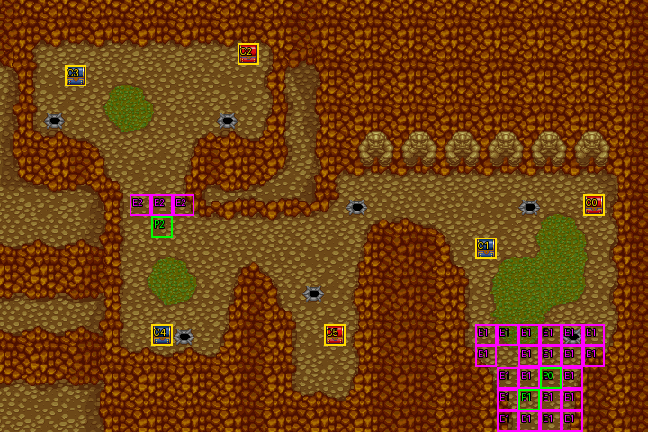

# 第 3 章　石巨神之封印

<!-- chapter_docs:header -->
| 項目 | 內容 |
| --- | --- |
| 章號／章節索引 | 3／2 |
| 章名（文字區塊 `0x01`） | 石巨神之封印 |
| 勝利條件（`0x02`） | 廿二回合內打倒魔導士 |
| 敗北條件（`0x03`） | 蘭迪斯死亡 |
| 戰場 | `MAP02.DAT`／`MAP02.COD`／`M02.DTL`，30×20 格，我方 slot 3 個，部署記錄 80 筆 |
| 文字區塊 | `FDETXT03.TXT`，24 條 |
| 進入處理（`0x60074`[2]） | `fdps_chapter_03_init`（`0x20f30`） |
| 行動後檢查（`0x6028c`[2]） | `fdps_chapter_03_post_action`（`0x3a4b0`） |
| 勝利處理（`0x60304`[2]） | `fdps_chapter_03_end`（`0x3a520`） |
| 地圖資料呼叫的事件處理（`0x601c4`） | slot 0：`fdps_chapter_03_event_deploy_wave_for_turn`（`0x36bb0`）（回合事件）、slot 1：`fdps_chapter_03_event_deploy_wave_1`（`0x36c70`）（格子事件）、slot 4：`fdps_chapter_03_event_deploy_wave_14`（`0x36ea0`）（格子事件）、slot 5：`fdps_chapter_03_event_turn_limit_game_over`（`0x36f10`）（回合事件） |
| 過場腳本 | `ICON02.DAT`（開場）、`WIN02.DAT`（勝利） |
| 本章之前的村莊 | `SHOP02.DAT` |
| 光碟 | 第 1 片（音軌見 [CD 音軌](../program_info/cd_audio.md)） |



戰場全圖（第 0 層與同步捲動的圖層）。框線：黃 `C` 寶箱、橘 `B` 埋藏格、青 `R` 重繪格、洋紅 `E` 有處理函式的格子事件格，字母後的數字是事件碼；綠 `P` 是我方 slot 的起始格。

圖由 `python tools/chapter_docs/chapter_facts.py render-maps` 從遊戲檔重畫到 `chapters/maps/`，`verify-maps` 逐 byte 比對版控中的圖。
<!-- /chapter_docs:header -->

## 概要

蘭迪斯、尤利安與英雄索爾來到上古石巨神的遺跡。卡萊亞的見習騎士亞克追捕一名魔導士已經兩年——此人煽動農民反叛領主、搶劫商人、宣揚邪教——在遺跡深處把他堵住；魔導士嘲笑亞克不自量力，開始唸解除禁制的反咒語，要喚醒封在遺跡裡的石巨神。尤利安認出咒語，說只要在咒語完成前打倒他，禁制就不會解開，只有少數石巨神能先復甦；索爾提醒大家小心埋伏，魔導士則笑亞克「幫手只有三人」。

隊伍一動，魔導士便召出狼人伏兵；之後每回合都有石巨神甦醒，咒語越來越接近完成，逼近魔導士藏身的谷口時又有四隻石巨神擋在他身旁。打倒魔導士時，他詛咒「邪惡的黑暗之力終將支配整個大陸」後死去；戰後亞克自我介紹、道謝，並請求加入隊伍。拖到第 22 回合，咒語完成、所有石巨神醒來，戰鬥以敗北收場。

## 加入與離隊

亞克（騎士，LV7）在本章開場由 `fdps_chapter_03_init`（`0x20f30`）入隊，入隊時機與名冊記錄見 [`assets/characters.md` 的「加入」](../assets/characters.md#加入)。他是名冊第 3 人，本章地圖剛好宣告 3 個我方 slot，所以他以 slot 2 上場，起點 (7, 10) 在地圖左側、魔導士所在谷口的正下方，與右下角的蘭迪斯、尤利安分開。劇情上他到勝利後才開口要求加入，但在程式裡整章都已是我方單位。

索爾是波次 0 的友方英雄（陣營 1、LV10、AI 行為 0），由地圖部署、不在名冊裡，戰鬥結束時不寫回名冊。他死亡不算敗北（行動後檢查不看他），勝利腳本 `WIN02.DAT` 會以 `REVIVE_UNIT` 復歸他再放進場景，所以不論戰況如何他都出現在結尾對話裡。本章沒有人離隊。

## 勝敗條件與特殊機制

- **勝利**：`fdps_chapter_03_post_action`（`0x3a4b0`）在每個單位行動後檢查 slot 4（魔導士，地圖單位順序是我方 3 人、索爾、魔導士）是否退場；是的話畫本章文字 `0x0d`（魔導士的遺言）並判定過關。這支處理函式**不呼叫**共用的勝敗檢查 `fdps_battle_check_default_end_conditions`（`0x3a2e0`），所以打光其他敵人不會過關，只有魔導士死亡才算。索爾在 NPC 階段打倒魔導士同樣過關。
- **敗北**：同一支處理函式先看 slot 0（蘭迪斯），退場就判定敗北；兩個檢查是 else-if，蘭迪斯與魔導士在同一次行動中一起倒下時算敗北。尤利安、亞克、索爾倒下都不影響勝負。
- **回合限制**：勝利條件字串的「廿二回合內」不是在行動後檢查裡實作的，而是 `MAP02.DAT` 回合事件表裡的一筆（第 22 回合、slot 5、敵方階段前）：`fdps_chapter_03_event_turn_limit_game_over`（`0x36f10`）畫 `0x17`、部署波次 15 的 44 隻石巨神，接著直接寫入敗北碼。所以第 22 回合的我方階段與 NPC 階段仍在期限內，敵方階段一開始才判負。
- **伏兵與援軍**：右下我方起點周圍 23 格（事件碼 1）是 `fdps_chapter_03_event_deploy_wave_1`（`0x36c70`）的觸發區，任何陣營的單位走進其中一格，在它行動結束時放出 5 隻狼人；魔導士谷口 (6, 9)–(8, 9)（事件碼 2）由 `fdps_chapter_03_event_deploy_wave_14`（`0x36ea0`）處理，只有陣營不是 0（我方或索爾）的單位走進去才會放出魔導士身邊的 4 隻石巨神。兩者各有一次性旗標（章節事件旗標元素 `0x10` 與 `0x11`），隨存檔保存。第 3–14 回合的石巨神援軍見「敵人配置」。
- 格子事件以「走進」觸發（觸發時機 0），開場腳本 `ICON02.DAT` 讓蘭迪斯往上走一格也踩在觸發區內，但腳本的行走指令不回報格子事件，伏兵要等玩家或索爾實際移動。

## 敵人配置

開場只有魔導士一個敵人：LV8，AI 行為 2（原地，不追擊），站在地圖左上 (5, 4) 的谷底。其餘 78 筆部署記錄全是援軍：

- **狼人伏兵（波次 1）**：5 隻 LV5 狼人，錨點圍著右下的我方起點，第一次有單位走進觸發區時出現。玩家不動也躲不掉：索爾（AI 行為 0）的起點 (24, 17) 四鄰全是觸發格，他在第 1 回合 NPC 階段一移動就會觸發。
- **甦醒的石巨神（波次 2–13）**：`fdps_chapter_03_event_deploy_wave_for_turn`（`0x36bb0`）在第 3–14 回合的敵方階段前各部署一波，波次是「回合 − 1」，共 25 隻 LV6 石巨神，錨點散布在右下我方起點、右上石像列前的第 8 列、中央通道與左側谷地。第 3 回合那波的 4 隻之一落在亞克下方 (8, 15)。
- **谷口守衛（波次 14）**：4 隻石巨神圍在魔導士四周 (4, 4)、(6, 4)、(5, 3)、(5, 5)，其中 (5, 3) 那隻是 AI 行為 1（沒有路徑可達的對手時原地休息，不改走直線），其餘是 0。
- **咒語完成（波次 15）**：44 隻石巨神只在第 22 回合的敗北處理裡部署，部署後戰鬥立刻判負，玩家不會與它們交戰；視野內的那幾隻會留在敗北畫面的底圖上（見「處理流程」的回合限制）。

所有援軍都以「找最近空格」放置，錨點被佔時會偏移。

<!-- chapter_docs:deployments -->
陣營與死亡腳本的意義見 [`resource_info/map.md`](../resource_info/map.md)，AI 行為（低 4 bit）見 [`program_info/map_ai.md`](../program_info/map_ai.md#行為代碼)；錨點是 `MAPnn.COD` 的座標，開場波次放在錨點上，其餘波次依部署方式放在錨點或最近的空格。單位名是全域文字的「角色編號 + 1」條；角色編號 `3C` 以上的敵兵，數值（`ENEMYDAT.DAT`）與種族、職業見 [`assets/enemies.md`](../assets/enemies.md)，以下的見 [`assets/characters.md`](../assets/characters.md)。

我方起始格：slot 0 (25, 17)、slot 1 (24, 18)、slot 2 (7, 10)。

| 波次 | 陣營 | 單位 | 等級 | 數量 |
| ---: | --- | --- | --- | ---: |
| 0 | NPC | `0C` 索爾 | 10 | 1 |
| 0 | 敵方 | `66` 魔導士 | 8 | 1 |
| 1 | 敵方 | `52` 狼人 | 5 | 5 |
| 2 | 敵方 | `47` 石巨神 | 6 | 4 |
| 3 | 敵方 | `47` 石巨神 | 6 | 2 |
| 4 | 敵方 | `47` 石巨神 | 6 | 2 |
| 5 | 敵方 | `47` 石巨神 | 6 | 2 |
| 6 | 敵方 | `47` 石巨神 | 6 | 2 |
| 7 | 敵方 | `47` 石巨神 | 6 | 2 |
| 8 | 敵方 | `47` 石巨神 | 6 | 2 |
| 9 | 敵方 | `47` 石巨神 | 6 | 2 |
| 10 | 敵方 | `47` 石巨神 | 6 | 3 |
| 11 | 敵方 | `47` 石巨神 | 6 | 2 |
| 12 | 敵方 | `47` 石巨神 | 6 | 1 |
| 13 | 敵方 | `47` 石巨神 | 6 | 1 |
| 14 | 敵方 | `47` 石巨神 | 6 | 4 |
| 15 | 敵方 | `47` 石巨神 | 6 | 44 |

### 波次 0

出場：進入戰場時由 `fdps_build_map_unit_array`（`0x22be0`） 部署在錨點上

| # | 陣營 | 單位 | 等級 | AI 行為 | 錨點 | 死亡腳本 |
| ---: | --- | --- | ---: | --- | --- | --- |
| 0 | NPC | `0C` 索爾 | 10 | 0 主動 | (24, 17) | 掉落 `00` 岩石 |
| 1 | 敵方 | `66` 魔導士 | 8 | 2 原地 | (5, 4) | 掉落 `D7` 魔力水晶 |

### 波次 1

出場：任何單位（不分陣營）走進右下我方起點周圍事件碼 1 的 23 格之一、該單位行動結束時，由 `fdps_chapter_03_event_deploy_wave_1`（`0x36c70`）部署，旗標元素 `0x10` 使它只發生一次

| # | 陣營 | 單位 | 等級 | AI 行為 | 錨點 | 死亡腳本 |
| ---: | --- | --- | ---: | --- | --- | --- |
| 2 | 敵方 | `52` 狼人 | 5 | 0 主動 | (23, 16) | — |
| 3 | 敵方 | `52` 狼人 | 5 | 0 主動 | (25, 15) | 掉落 `B5` 回復劑 |
| 4 | 敵方 | `52` 狼人 | 5 | 0 主動 | (24, 15) | — |
| 5 | 敵方 | `52` 狼人 | 5 | 0 主動 | (25, 13) | — |
| 6 | 敵方 | `52` 狼人 | 5 | 0 主動 | (22, 15) | — |

### 波次 2

出場：第 3 回合敵方階段前，`fdps_chapter_03_event_deploy_wave_for_turn`（`0x36bb0`）以「回合 − 1」部署

| # | 陣營 | 單位 | 等級 | AI 行為 | 錨點 | 死亡腳本 |
| ---: | --- | --- | ---: | --- | --- | --- |
| 7 | 敵方 | `47` 石巨神 | 6 | 0 主動 | (26, 15) | — |
| 24 | 敵方 | `47` 石巨神 | 6 | 0 主動 | (8, 15) | 掉落 700 金 |
| 25 | 敵方 | `47` 石巨神 | 6 | 0 主動 | (16, 9) | — |
| 70 | 敵方 | `47` 石巨神 | 6 | 0 主動 | (24, 9) | — |

### 波次 3

出場：第 4 回合敵方階段前，`fdps_chapter_03_event_deploy_wave_for_turn`（`0x36bb0`）以「回合 − 1」部署

| # | 陣營 | 單位 | 等級 | AI 行為 | 錨點 | 死亡腳本 |
| ---: | --- | --- | ---: | --- | --- | --- |
| 8 | 敵方 | `47` 石巨神 | 6 | 0 主動 | (25, 8) | — |
| 71 | 敵方 | `47` 石巨神 | 6 | 0 主動 | (21, 8) | — |

### 波次 4

出場：第 5 回合敵方階段前，`fdps_chapter_03_event_deploy_wave_for_turn`（`0x36bb0`）以「回合 − 1」部署

| # | 陣營 | 單位 | 等級 | AI 行為 | 錨點 | 死亡腳本 |
| ---: | --- | --- | ---: | --- | --- | --- |
| 9 | 敵方 | `47` 石巨神 | 6 | 0 主動 | (23, 8) | — |
| 72 | 敵方 | `47` 石巨神 | 6 | 0 主動 | (16, 8) | — |

### 波次 5

出場：第 6 回合敵方階段前，`fdps_chapter_03_event_deploy_wave_for_turn`（`0x36bb0`）以「回合 − 1」部署

| # | 陣營 | 單位 | 等級 | AI 行為 | 錨點 | 死亡腳本 |
| ---: | --- | --- | ---: | --- | --- | --- |
| 10 | 敵方 | `47` 石巨神 | 6 | 0 主動 | (17, 8) | 掉落 800 金 |
| 73 | 敵方 | `47` 石巨神 | 6 | 0 主動 | (16, 8) | — |

### 波次 6

出場：第 7 回合敵方階段前，`fdps_chapter_03_event_deploy_wave_for_turn`（`0x36bb0`）以「回合 − 1」部署

| # | 陣營 | 單位 | 等級 | AI 行為 | 錨點 | 死亡腳本 |
| ---: | --- | --- | ---: | --- | --- | --- |
| 11 | 敵方 | `47` 石巨神 | 6 | 0 主動 | (7, 15) | — |
| 74 | 敵方 | `47` 石巨神 | 6 | 0 主動 | (16, 8) | — |

### 波次 7

出場：第 8 回合敵方階段前，`fdps_chapter_03_event_deploy_wave_for_turn`（`0x36bb0`）以「回合 − 1」部署

| # | 陣營 | 單位 | 等級 | AI 行為 | 錨點 | 死亡腳本 |
| ---: | --- | --- | ---: | --- | --- | --- |
| 12 | 敵方 | `47` 石巨神 | 6 | 0 主動 | (15, 15) | 掉落 `B4` 藥草 |
| 75 | 敵方 | `47` 石巨神 | 6 | 0 主動 | (16, 8) | — |

### 波次 8

出場：第 9 回合敵方階段前，`fdps_chapter_03_event_deploy_wave_for_turn`（`0x36bb0`）以「回合 − 1」部署

| # | 陣營 | 單位 | 等級 | AI 行為 | 錨點 | 死亡腳本 |
| ---: | --- | --- | ---: | --- | --- | --- |
| 13 | 敵方 | `47` 石巨神 | 6 | 0 主動 | (7, 13) | 掉落 300 金 |
| 76 | 敵方 | `47` 石巨神 | 6 | 0 主動 | (7, 13) | — |

### 波次 9

出場：第 10 回合敵方階段前，`fdps_chapter_03_event_deploy_wave_for_turn`（`0x36bb0`）以「回合 − 1」部署

| # | 陣營 | 單位 | 等級 | AI 行為 | 錨點 | 死亡腳本 |
| ---: | --- | --- | ---: | --- | --- | --- |
| 14 | 敵方 | `47` 石巨神 | 6 | 0 主動 | (19, 8) | — |
| 77 | 敵方 | `47` 石巨神 | 6 | 0 主動 | (7, 13) | — |

### 波次 10

出場：第 11 回合敵方階段前，`fdps_chapter_03_event_deploy_wave_for_turn`（`0x36bb0`）以「回合 − 1」部署

| # | 陣營 | 單位 | 等級 | AI 行為 | 錨點 | 死亡腳本 |
| ---: | --- | --- | ---: | --- | --- | --- |
| 15 | 敵方 | `47` 石巨神 | 6 | 0 主動 | (17, 8) | — |
| 16 | 敵方 | `47` 石巨神 | 6 | 0 主動 | (10, 5) | — |
| 78 | 敵方 | `47` 石巨神 | 6 | 0 主動 | (24, 9) | — |

### 波次 11

出場：第 12 回合敵方階段前，`fdps_chapter_03_event_deploy_wave_for_turn`（`0x36bb0`）以「回合 − 1」部署

| # | 陣營 | 單位 | 等級 | AI 行為 | 錨點 | 死亡腳本 |
| ---: | --- | --- | ---: | --- | --- | --- |
| 17 | 敵方 | `47` 石巨神 | 6 | 0 主動 | (2, 5) | — |
| 79 | 敵方 | `47` 石巨神 | 6 | 0 主動 | (14, 13) | — |

### 波次 12

出場：第 13 回合敵方階段前，`fdps_chapter_03_event_deploy_wave_for_turn`（`0x36bb0`）以「回合 − 1」部署

| # | 陣營 | 單位 | 等級 | AI 行為 | 錨點 | 死亡腳本 |
| ---: | --- | --- | ---: | --- | --- | --- |
| 18 | 敵方 | `47` 石巨神 | 6 | 0 主動 | (8, 15) | — |

### 波次 13

出場：第 14 回合敵方階段前，`fdps_chapter_03_event_deploy_wave_for_turn`（`0x36bb0`）以「回合 − 1」部署

| # | 陣營 | 單位 | 等級 | AI 行為 | 錨點 | 死亡腳本 |
| ---: | --- | --- | ---: | --- | --- | --- |
| 19 | 敵方 | `47` 石巨神 | 6 | 0 主動 | (10, 5) | — |

### 波次 14

出場：陣營不是 0 的單位（我方或索爾）走進魔導士谷口 (6, 9)、(7, 9)、(8, 9) 之一、該單位行動結束時，由 `fdps_chapter_03_event_deploy_wave_14`（`0x36ea0`）部署，旗標元素 `0x11` 使它只發生一次

| # | 陣營 | 單位 | 等級 | AI 行為 | 錨點 | 死亡腳本 |
| ---: | --- | --- | ---: | --- | --- | --- |
| 20 | 敵方 | `47` 石巨神 | 6 | 0 主動 | (4, 4) | — |
| 21 | 敵方 | `47` 石巨神 | 6 | 0 主動 | (6, 4) | — |
| 22 | 敵方 | `47` 石巨神 | 6 | 1 追擊 | (5, 3) | — |
| 23 | 敵方 | `47` 石巨神 | 6 | 0 主動 | (5, 5) | 掉落 `C6` 地之珠 |

### 波次 15

出場：第 22 回合敵方階段前，`fdps_chapter_03_event_turn_limit_game_over`（`0x36f10`）部署後立刻判定敗北，這 44 隻不會與玩家交戰

| # | 陣營 | 單位 | 等級 | AI 行為 | 錨點 | 死亡腳本 |
| ---: | --- | --- | ---: | --- | --- | --- |
| 26 | 敵方 | `47` 石巨神 | 6 | 0 主動 | (2, 2) | 掉落 500 金 |
| 27 | 敵方 | `47` 石巨神 | 6 | 0 主動 | (3, 2) | 掉落 500 金 |
| 28 | 敵方 | `47` 石巨神 | 6 | 0 主動 | (4, 2) | 掉落 500 金 |
| 29 | 敵方 | `47` 石巨神 | 6 | 0 主動 | (5, 2) | 掉落 500 金 |
| 30 | 敵方 | `47` 石巨神 | 6 | 0 主動 | (6, 2) | 掉落 500 金 |
| 31 | 敵方 | `47` 石巨神 | 6 | 0 主動 | (7, 2) | 掉落 500 金 |
| 32 | 敵方 | `47` 石巨神 | 6 | 0 主動 | (8, 2) | 掉落 500 金 |
| 33 | 敵方 | `47` 石巨神 | 6 | 0 主動 | (9, 2) | 掉落 500 金 |
| 34 | 敵方 | `47` 石巨神 | 6 | 0 主動 | (10, 2) | 掉落 500 金 |
| 35 | 敵方 | `47` 石巨神 | 6 | 0 主動 | (11, 2) | 掉落 500 金 |
| 36 | 敵方 | `47` 石巨神 | 6 | 0 主動 | (11, 3) | 掉落 500 金 |
| 37 | 敵方 | `47` 石巨神 | 6 | 0 主動 | (10, 3) | 掉落 500 金 |
| 38 | 敵方 | `47` 石巨神 | 6 | 0 主動 | (9, 3) | 掉落 500 金 |
| 39 | 敵方 | `47` 石巨神 | 6 | 0 主動 | (8, 3) | 掉落 500 金 |
| 40 | 敵方 | `47` 石巨神 | 6 | 0 主動 | (7, 3) | 掉落 500 金 |
| 41 | 敵方 | `47` 石巨神 | 6 | 0 主動 | (6, 3) | 掉落 500 金 |
| 42 | 敵方 | `47` 石巨神 | 6 | 0 主動 | (4, 3) | 掉落 500 金 |
| 43 | 敵方 | `47` 石巨神 | 6 | 0 主動 | (3, 3) | 掉落 500 金 |
| 44 | 敵方 | `47` 石巨神 | 6 | 0 主動 | (2, 3) | 掉落 500 金 |
| 45 | 敵方 | `47` 石巨神 | 6 | 0 主動 | (5, 3) | 掉落 500 金 |
| 46 | 敵方 | `47` 石巨神 | 6 | 0 主動 | (2, 4) | 掉落 500 金 |
| 47 | 敵方 | `47` 石巨神 | 6 | 0 主動 | (3, 4) | 掉落 500 金 |
| 48 | 敵方 | `47` 石巨神 | 6 | 0 主動 | (4, 4) | 掉落 500 金 |
| 49 | 敵方 | `47` 石巨神 | 6 | 0 主動 | (5, 4) | 掉落 500 金 |
| 50 | 敵方 | `47` 石巨神 | 6 | 0 主動 | (6, 4) | 掉落 500 金 |
| 51 | 敵方 | `47` 石巨神 | 6 | 0 主動 | (7, 4) | 掉落 500 金 |
| 52 | 敵方 | `47` 石巨神 | 6 | 0 主動 | (8, 4) | 掉落 500 金 |
| 53 | 敵方 | `47` 石巨神 | 6 | 0 主動 | (9, 4) | 掉落 500 金 |
| 54 | 敵方 | `47` 石巨神 | 6 | 0 主動 | (10, 4) | 掉落 500 金 |
| 55 | 敵方 | `47` 石巨神 | 6 | 0 主動 | (11, 4) | 掉落 500 金 |
| 56 | 敵方 | `47` 石巨神 | 6 | 0 主動 | (11, 5) | 掉落 500 金 |
| 57 | 敵方 | `47` 石巨神 | 6 | 0 主動 | (10, 5) | 掉落 500 金 |
| 58 | 敵方 | `47` 石巨神 | 6 | 0 主動 | (9, 5) | 掉落 500 金 |
| 59 | 敵方 | `47` 石巨神 | 6 | 0 主動 | (8, 5) | 掉落 500 金 |
| 60 | 敵方 | `47` 石巨神 | 6 | 0 主動 | (7, 5) | 掉落 500 金 |
| 61 | 敵方 | `47` 石巨神 | 6 | 0 主動 | (6, 5) | 掉落 500 金 |
| 62 | 敵方 | `47` 石巨神 | 6 | 0 主動 | (5, 5) | 掉落 500 金 |
| 63 | 敵方 | `47` 石巨神 | 6 | 0 主動 | (4, 5) | 掉落 500 金 |
| 64 | 敵方 | `47` 石巨神 | 6 | 0 主動 | (3, 5) | 掉落 500 金 |
| 65 | 敵方 | `47` 石巨神 | 6 | 0 主動 | (2, 5) | 掉落 500 金 |
| 66 | 敵方 | `47` 石巨神 | 6 | 0 主動 | (5, 6) | 掉落 500 金 |
| 67 | 敵方 | `47` 石巨神 | 6 | 0 主動 | (6, 6) | 掉落 500 金 |
| 68 | 敵方 | `47` 石巨神 | 6 | 0 主動 | (7, 6) | 掉落 500 金 |
| 69 | 敵方 | `47` 石巨神 | 6 | 0 主動 | (8, 6) | 掉落 500 金 |
<!-- /chapter_docs:deployments -->

## 寶物

- 擊倒掉落只在擊殺者是存活的我方單位時發放：魔導士的 `D7` 魔力水晶若被索爾打倒就拿不到；過關時 `fdps_battle_destroy_remaining_enemies`（`0x39e10`）清掉場上殘存的敵人，但不跑它們的死亡腳本，還沒打倒的石巨神身上的金錢與物品也就沒了。
- 索爾的部署記錄帶著「掉落 `00` 岩石」的死亡腳本；他是友方，被敵人打倒時擊殺者不是我方單位，這筆不會發放。
- 波次 14 裡 (5, 5) 那隻石巨神帶 `C6` 地之珠，與 (7, 15) 寶箱的地之珠是兩個獨立來源。
- 波次 15 那 44 隻石巨神各帶 500 金的掉落，但牠們出場時戰鬥已經判負，這 22,000 金沒有人拿得到，見 [I13](../cut_content/items.md#i13-第-3-章判負時才出場的-44-隻石巨神身上的-22000-金)。

<!-- chapter_docs:treasure -->
搜尋的規則（同碼的格共用一筆記錄與一個旗標、背包滿時的交換）見 [`resource_info/map.md`](../resource_info/map.md)。

| 事件碼 | 格 | 內容 |
| ---: | --- | --- |
| 0 | (27, 9) 寶箱 | 1000 金 |
| 1 | (22, 11) 寶箱 | `B5` 回復劑 |
| 2 | (11, 2) 寶箱 | `D8` 力量藥水 |
| 3 | (3, 3) 寶箱 | 2500 金 |
| 4 | (7, 15) 寶箱 | `C6` 地之珠 |
| 5 | (15, 15) 寶箱 | `D8` 力量藥水 |

擊倒後掉落（死亡腳本 opcode 0／1，擊殺者須是存活的我方單位）：

| # | 單位 | 波次 | 掉落 |
| ---: | --- | ---: | --- |
| 0 | `0C` 索爾 | 0 | 掉落 `00` 岩石 |
| 1 | `66` 魔導士 | 0 | 掉落 `D7` 魔力水晶 |
| 3 | `52` 狼人 | 1 | 掉落 `B5` 回復劑 |
| 10 | `47` 石巨神 | 5 | 掉落 800 金 |
| 12 | `47` 石巨神 | 7 | 掉落 `B4` 藥草 |
| 13 | `47` 石巨神 | 8 | 掉落 300 金 |
| 23 | `47` 石巨神 | 14 | 掉落 `C6` 地之珠 |
| 24 | `47` 石巨神 | 2 | 掉落 700 金 |
| 26 | `47` 石巨神 | 15 | 掉落 500 金 |
| 27 | `47` 石巨神 | 15 | 掉落 500 金 |
| 28 | `47` 石巨神 | 15 | 掉落 500 金 |
| 29 | `47` 石巨神 | 15 | 掉落 500 金 |
| 30 | `47` 石巨神 | 15 | 掉落 500 金 |
| 31 | `47` 石巨神 | 15 | 掉落 500 金 |
| 32 | `47` 石巨神 | 15 | 掉落 500 金 |
| 33 | `47` 石巨神 | 15 | 掉落 500 金 |
| 34 | `47` 石巨神 | 15 | 掉落 500 金 |
| 35 | `47` 石巨神 | 15 | 掉落 500 金 |
| 36 | `47` 石巨神 | 15 | 掉落 500 金 |
| 37 | `47` 石巨神 | 15 | 掉落 500 金 |
| 38 | `47` 石巨神 | 15 | 掉落 500 金 |
| 39 | `47` 石巨神 | 15 | 掉落 500 金 |
| 40 | `47` 石巨神 | 15 | 掉落 500 金 |
| 41 | `47` 石巨神 | 15 | 掉落 500 金 |
| 42 | `47` 石巨神 | 15 | 掉落 500 金 |
| 43 | `47` 石巨神 | 15 | 掉落 500 金 |
| 44 | `47` 石巨神 | 15 | 掉落 500 金 |
| 45 | `47` 石巨神 | 15 | 掉落 500 金 |
| 46 | `47` 石巨神 | 15 | 掉落 500 金 |
| 47 | `47` 石巨神 | 15 | 掉落 500 金 |
| 48 | `47` 石巨神 | 15 | 掉落 500 金 |
| 49 | `47` 石巨神 | 15 | 掉落 500 金 |
| 50 | `47` 石巨神 | 15 | 掉落 500 金 |
| 51 | `47` 石巨神 | 15 | 掉落 500 金 |
| 52 | `47` 石巨神 | 15 | 掉落 500 金 |
| 53 | `47` 石巨神 | 15 | 掉落 500 金 |
| 54 | `47` 石巨神 | 15 | 掉落 500 金 |
| 55 | `47` 石巨神 | 15 | 掉落 500 金 |
| 56 | `47` 石巨神 | 15 | 掉落 500 金 |
| 57 | `47` 石巨神 | 15 | 掉落 500 金 |
| 58 | `47` 石巨神 | 15 | 掉落 500 金 |
| 59 | `47` 石巨神 | 15 | 掉落 500 金 |
| 60 | `47` 石巨神 | 15 | 掉落 500 金 |
| 61 | `47` 石巨神 | 15 | 掉落 500 金 |
| 62 | `47` 石巨神 | 15 | 掉落 500 金 |
| 63 | `47` 石巨神 | 15 | 掉落 500 金 |
| 64 | `47` 石巨神 | 15 | 掉落 500 金 |
| 65 | `47` 石巨神 | 15 | 掉落 500 金 |
| 66 | `47` 石巨神 | 15 | 掉落 500 金 |
| 67 | `47` 石巨神 | 15 | 掉落 500 金 |
| 68 | `47` 石巨神 | 15 | 掉落 500 金 |
| 69 | `47` 石巨神 | 15 | 掉落 500 金 |
<!-- /chapter_docs:treasure -->

## 村莊

<!-- chapter_docs:village -->
第 2 章勝利後、本章之前的村莊載入 `SHOP02.DAT`，道具店、武器店、秘密商店的貨見 [`assets/shops.md`](../assets/shops.md)。村莊載入的文字區塊是 `FDETXT03`（章節索引 + 1，`fdps_load_field_chapter_resources`（`0x31540`）），也就是本章的區塊，所以村莊畫面的文字是本章區塊的 `0x04`–`0x08`，全文在下方「對話」。
<!-- /chapter_docs:village -->

## 處理流程

### 進入：`fdps_chapter_03_init`（`0x20f30`）

1. `fdps_roster_add_character`（`0x23bc0`）把亞克（角色 `04`）加進名冊。這一步必須在重設之前，否則重建地圖單位時名冊只有 2 人，slot 2 會是退場的空位。
2. `fdps_chapter_state_reset`（`0x22750`）重設章節狀態，依名冊放下我方 3 人，再部署波次 0（索爾、魔導士）。
3. `fdps_icon_script_run`（`0x21650`）播開場腳本 `ICON02.DAT`。
4. `fdps_show_chapter_title_card`（`0x20c60`）顯示章節標題卡。
5. `fdps_map_cursor_move_to_unit`（`0x2da50`）把游標移到單位 0（蘭迪斯）。

### 行動後檢查：`fdps_chapter_03_post_action`（`0x3a4b0`）

1. `fdps_unit_is_retired`（`0x109b0`）問 slot 0；蘭迪斯退場就寫入敗北碼 1，結束。
2. 否則問 slot 4；魔導士退場就以 `fdps_draw_text`（`0x1ff60`）畫 `0x0d`，再寫入過關碼 2。

兩個寫入都不看結束碼原本的值。

### 勝利：`fdps_chapter_03_end`（`0x3a520`）

1. `fdps_battle_destroy_remaining_enemies`（`0x39e10`）清掉場上所有敵方單位。
2. `fdps_roster_write_back_battle_units`（`0x23980`）把戰場上的隊員寫回名冊。
3. `fdps_icon_script_run`（`0x21650`）播勝利腳本 `WIN02.DAT`（亞克請求加入）。
4. `fdps_roster_revive_fallen_members`（`0x39e70`）讓倒下的隊員復活。
5. 把章節索引設為 3，接下來是第 3 章勝利後的村莊（`SHOP03.DAT`）與 [第 4 章](ch04.md)。

本章沒有獎勵物品或法術。

### 回合援軍：`fdps_chapter_03_event_deploy_wave_for_turn`（`0x36bb0`）

由回合事件（slot 0）在第 3–14 回合的敵方階段前呼叫，此時回合計數器仍是剛結束的那一回合。

1. 回合 3 時畫 `0x13`（魔導士召喚石巨神）；回合 14 時改畫 `0x15`（咒語快完成了）。
2. `fdps_deploy_wave`（`0x23830`）以錨點檔 2、波次「回合 − 1」、找最近空格部署。
3. 回合 3 時再畫 `0x14`（尤利安驚呼、亞克發現身旁也有、索爾催促），所以第 3 回合的兩段對話夾著石巨神出現。

沒有旗標，每次呼叫都會部署；每波只出現一次是因為回合表每個回合只列一次。表末的填充筆（`FF`, `00`, `00`）也指向這支，要回合計數器走到 255 才成立，而第 22 回合就已判負，走不到。

### 狼人伏兵：`fdps_chapter_03_event_deploy_wave_1`（`0x36c70`）

格子事件（事件碼 1 → slot 1，觸發時機 0）在走進觸發格的單位行動結束後呼叫。

1. 章節事件旗標元素 `0x10` 不是 0 就直接返回；否則先把它設為 1。
2. 畫 `0x12`（魔導士召出僕人、索爾喊「是陷阱」）。
3. `fdps_deploy_wave`（`0x23830`）部署波次 1。

不檢查觸發者的陣營。

### 谷口守衛：`fdps_chapter_03_event_deploy_wave_14`（`0x36ea0`）

格子事件（事件碼 2 → slot 4，觸發時機 0）以觸發者的單位索引呼叫。

1. `fdps_get_unit_record`（`0x2d210`）取觸發者的記錄。
2. 旗標元素 `0x11` 仍是 0、而且觸發者陣營不是 0 時才繼續；先把旗標設為 1。
3. 畫 `0x16`（魔導士要石巨神懲罰闖入者）。
4. `fdps_deploy_wave`（`0x23830`）部署波次 14。

它用 `0x11` 而不是伏兵的 `0x10`，因為兩個格子事件在同一張地圖上同時有效，共用旗標會讓先觸發的那個擋掉另一個。

### 回合限制：`fdps_chapter_03_event_turn_limit_game_over`（`0x36f10`）

由回合事件（slot 5）在第 22 回合的敵方階段前呼叫一次。

1. 畫 `0x17`（魔導士：「全部醒來吧！」）。
2. `fdps_deploy_wave`（`0x23830`）部署波次 15。
3. 無條件寫入敗北碼 1。

處理函式本身不重畫地圖，但石巨神仍會出現在畫面上：敗北碼讓 `fdps_battle_advance_turn`（`0x1e3f0`）在敵方階段開始前返回，回到 `fdps_battle_player_phase_loop`（`0x2bae0`）後，這一輪迴圈照常在底部以 `fdps_render_view_frame`（`0x2beb0`）畫一幀戰場，之後才讀結束碼離開。這一幀裡目前視野內的石巨神都已在場；接著 `fdps_show_game_over`（`0x2a960`）把當下的螢幕拍下當底圖，在上面播 `GameOver.saf` 並淡出。看得到幾隻取決於視野停在哪裡，不是全部 44 隻。

## 回合事件與格子事件

<!-- chapter_docs:events -->
觸發時機與陣營階段的意義見 [`resource_info/map.md`](../resource_info/map.md)。

| 回合 | 陣營階段 | slot | 處理函式 |
| ---: | --- | ---: | --- |
| 3 | 敵方階段前 | 0 | `fdps_chapter_03_event_deploy_wave_for_turn`（`0x36bb0`） |
| 4 | 敵方階段前 | 0 | `fdps_chapter_03_event_deploy_wave_for_turn`（`0x36bb0`） |
| 5 | 敵方階段前 | 0 | `fdps_chapter_03_event_deploy_wave_for_turn`（`0x36bb0`） |
| 6 | 敵方階段前 | 0 | `fdps_chapter_03_event_deploy_wave_for_turn`（`0x36bb0`） |
| 7 | 敵方階段前 | 0 | `fdps_chapter_03_event_deploy_wave_for_turn`（`0x36bb0`） |
| 8 | 敵方階段前 | 0 | `fdps_chapter_03_event_deploy_wave_for_turn`（`0x36bb0`） |
| 9 | 敵方階段前 | 0 | `fdps_chapter_03_event_deploy_wave_for_turn`（`0x36bb0`） |
| 10 | 敵方階段前 | 0 | `fdps_chapter_03_event_deploy_wave_for_turn`（`0x36bb0`） |
| 11 | 敵方階段前 | 0 | `fdps_chapter_03_event_deploy_wave_for_turn`（`0x36bb0`） |
| 12 | 敵方階段前 | 0 | `fdps_chapter_03_event_deploy_wave_for_turn`（`0x36bb0`） |
| 13 | 敵方階段前 | 0 | `fdps_chapter_03_event_deploy_wave_for_turn`（`0x36bb0`） |
| 14 | 敵方階段前 | 0 | `fdps_chapter_03_event_deploy_wave_for_turn`（`0x36bb0`） |
| 22 | 敵方階段前 | 5 | `fdps_chapter_03_event_turn_limit_game_over`（`0x36f10`） |
| 255 | 敵方階段前（填充筆，回合計數走到 255 才比對成立） | 0 | `fdps_chapter_03_event_deploy_wave_for_turn`（`0x36bb0`） |

| 事件碼 | 格 | 觸發 | slot | 處理函式 |
| ---: | --- | --- | ---: | --- |
| 1 | (22, 15)、(23, 15)、(24, 15)、(25, 15)、(26, 15)、(27, 15)、(22, 16)、(24, 16)、(25, 16)、(26, 16)、(27, 16)、(23, 17)、(24, 17)、(25, 17)、(26, 17)、(23, 18)、(24, 18)、(25, 18)、(26, 18)、(23, 19)、(24, 19)、(25, 19)、(26, 19) | 走進 | 1 | `fdps_chapter_03_event_deploy_wave_1`（`0x36c70`） |
| 2 | (6, 9)、(7, 9)、(8, 9) | 走進 | 4 | `fdps_chapter_03_event_deploy_wave_14`（`0x36ea0`） |
<!-- /chapter_docs:events -->

## 過場腳本

<!-- chapter_docs:scripts -->
格式與每個指令的意義見 [`resource_info/cutscene_script.md`](../resource_info/cutscene_script.md)。`FDETXT03#0xNN` 是本章文字區塊的條目，全文在下方「對話」；切到額外場景之後顯示的文字直接列出（那些區塊的正典是 [`assets/text/scene_text.md`](../assets/text/scene_text.md)）。`u3=我方1` 是地圖單位索引 3 對到我方 slot 1，`u12=MAP02#9` 是 `MAP02.DAT` 第 9 筆部署記錄。

### `ICON02.DAT`

- 開場：`fdps_chapter_03_init`（`0x20f30`）
- 138 byte、21 步；起始地圖 2，切換地圖 無，結束於地圖 2

| 偏移 | 指令 | 內容 |
| ---: | --- | --- |
| `0000` | `SET_MUSIC` | 音樂 6（CD 第 7 軌） |
| `0002` | `SET_VIEW_TILE` | 視野直接設到格 (17, 12) |
| `0005` | `FACE_UNITS` | 轉向後停 1 幀：u0=我方0朝上 |
| `000a` | `FACE_UNITS` | 轉向後停 8 幀：u0=我方0朝下 |
| `000f` | `FACE_UNITS` | 轉向後停 8 幀：u0=我方0朝左 |
| `0014` | `FACE_UNITS` | 轉向後停 8 幀：u0=我方0朝右 |
| `0019` | `FACE_UNITS` | 轉向後停 2 幀：u0=我方0朝上 |
| `001e` | `DRAW_TEXT` | 顯示文字 FDETXT03#0x09 |
| `0020` | `SCROLL_VIEW` | 捲動視野到格 (3, 3) |
| `0023` | `FACE_UNITS` | 轉向後停 1 幀：u2=我方2朝上 |
| `0028` | `DRAW_TEXT` | 顯示文字 FDETXT03#0x0a |
| `002a` | `SHAKE_VIEW` | 視野位移 32 步，每步 1 幀：(1,0) (1,-1) (0,-1) (0,0) (-1,0) (-1,1) (0,1) (0,0) (1,0) (1,-1) (0,-1) (0,0) (-1,0) (-1,1) (0,1) (0,0) (1,0) (1,-1) (0,-1) (0,0) (-1,0) (-1,1) (0,1) (0,0) (1,0) (1,-1) (0,-1) (0,0) (-1,0) (-1,1) (0,1) (0,0) |
| `006d` | `SET_VIEW_TILE` | 視野直接設到格 (17, 12) |
| `0070` | `FACE_UNITS` | 轉向後停 1 幀：u1=我方1朝上 |
| `0075` | `DRAW_TEXT` | 顯示文字 FDETXT03#0x0b |
| `0077` | `WALK_UNITS` | 行走 1 格，每步 1 幀：u0=我方0往上 |
| `007d` | `SCROLL_VIEW` | 捲動視野到格 (3, 3) |
| `0080` | `FACE_UNITS` | 轉向後停 1 幀：u2=我方2朝上 |
| `0085` | `DRAW_TEXT` | 顯示文字 FDETXT03#0x0c |
| `0087` | `SET_MUSIC` | 停止音樂 |
| `0089` | `END` | 結束 |

### `WIN02.DAT`

- 勝利：`fdps_chapter_03_end`（`0x3a520`）
- 38 byte、13 步；起始地圖 2，切換地圖 無，結束於地圖 2

| 偏移 | 指令 | 內容 |
| ---: | --- | --- |
| `0000` | `SET_MUSIC` | 音樂 8（CD 第 9 軌） |
| `0002` | `SET_VIEW_TILE` | 視野直接設到格 (19, 10) |
| `0005` | `REVIVE_UNIT` | 復歸 u0=我方0（清狀態） |
| `0007` | `REVIVE_UNIT` | 復歸 u1=我方1（清狀態） |
| `0009` | `REVIVE_UNIT` | 復歸 u2=我方2（清狀態） |
| `000b` | `REVIVE_UNIT` | 復歸 u3=MAP02#0(角色0x0c)（清狀態） |
| `000d` | `PLACE_UNIT` | 放置 u0=我方0 到 (24, 13)，朝上 |
| `0012` | `PLACE_UNIT` | 放置 u1=我方1 到 (25, 13)，朝上 |
| `0017` | `PLACE_UNIT` | 放置 u2=我方2 到 (24, 11)，朝下 |
| `001c` | `PLACE_UNIT` | 放置 u3=MAP02#0(角色0x0c) 到 (23, 13)，朝上 |
| `0021` | `DRAW_TEXT` | 顯示文字 FDETXT03#0x0e |
| `0023` | `SET_MUSIC` | 停止音樂 |
| `0025` | `END` | 結束 |
<!-- /chapter_docs:scripts -->

## 對話

<!-- chapter_docs:dialogue -->
`FDETXT03.TXT` 全部 24 條，依條目編號排列。每條先列讀取端（顯示它的腳本步驟、處理函式或死亡腳本），再列全文：【名稱】是換說話者（頭像取自括號裡的角色編號；【地圖單位 n】取執行當下第 n 個地圖單位），每一行是一次換行，▼ 是換頁（等按鍵）。`{subst1}`、`{subst2}`、`{number}` 是執行期代入的名稱與數字（[`resource_info/text.md`](../resource_info/text.md)）。

空字串的條目：`0x10`、`0x11`。

### `0x00`

永遠不會顯示：本章沒有任何處理函式或腳本畫條目 0；章節標題卡是 `Chapter.saf` 的圖，存檔面板只畫 `0x01`，見 [S13a（排除清單）](../cut_content/_index.md#排除清單)。

### `0x01`

讀取端：`fdps_draw_save_slot_panel`（`0x24a40`）

```text
石巨神之封印
```

### `0x02`

讀取端：`fdps_battle_show_win_fail_window`（`0x17ca0`）

```text
廿二回合內打倒魔導士
```

### `0x03`

讀取端：`fdps_battle_show_win_fail_window`（`0x17ca0`）

```text
蘭迪斯死亡
```

### `0x04`

讀取端：`fdps_village_item_menu`（`0x35860`）

```text
﹒﹒﹒跟防禦力高的敵人戰鬥時，
必須要多儲備些補血的藥草。
▼
```

### `0x05`

讀取端：`fdps_run_weapon_shop`（`0x35fd0`）

```text
這裡剛打造出幾把不錯的兵器，
看！它的鋒利可不是吹牛的。
剛才來了位騎士，
▼
馬上就買了一柄騎士槍
說是準備要來對付﹒﹒﹒﹒
是說誰來的？
▼
算了！記不得了！
▼
```

### `0x06`

讀取端：`fdps_run_bar_shop`（`0x35cc0`）

```text
請坐！這裡附近有一座廢墟，
傳說是上古石巨神的遺跡。
有興趣就去逛逛吧！
▼
也許有意外的發現也說不定！
嘻嘻！
▼
```

### `0x07`

讀取端：`fdps_run_church_screen`（`0x35aa0`）

```text
願神庇護您。
▼
```

### `0x08`

讀取端：`fdps_run_secret_menu`（`0x36210`）

```text
嗨！又見面了！
店裡有新的商品了喔！
▼
```

### `0x09`

讀取端：`ICON02.DAT` `0x01e`

```text
【蘭迪斯】（角色 0）
這裡是石巨神的遺跡？
看起來真荒涼！
【尤利安】（角色 6）
你們看！
```

### `0x0a`

讀取端：`ICON02.DAT` `0x028`

```text
【亞克】（角色 4）
你不要以為跑到遺跡，
我就會放過你。
我亞克跟蹤你兩年了
▼
這些年來，
你到處興風作浪，
煽動農民反叛領主，
▼
搶劫路過的商人，
還宣揚邪教教義！
今天我要逮捕你！
▼
讓你嘗嘗坐監牢，
關鐵窗的滋味。
【魔導士】（角色 102）
嘿嘿嘿～！
少不經事的小毛頭！
▼
你以為仗你那點功夫，
就想任意擺佈我？
▼
你死纏了我兩年，
破壞了我不少大事，
今天落在我手裡﹒﹒
▼
嘿嘿嘿～！
▼
教你見識見識，
這魔法的厲害！
﹒﹒（咒語）﹒﹒
```

### `0x0b`

讀取端：`ICON02.DAT` `0x075`

```text
【尤利安】（角色 6）
糟了！糟了！
這魔導士唸的是，
解除禁制的反咒語，
▼
看來他想解放這裡所有
的石巨神，神啊！
這件事太瘋狂了！
【索爾】（角色 12）
小和尚，
要怎樣才能阻止它們？
【尤利安】（角色 6）
要在他完成咒語之前，
就將他打倒。
只要咒語未完成，
▼
禁制便不會解開。
這些石巨神，
只有少數可以復甦！
【蘭迪斯】（角色 0）
好，我們衝上去！
【索爾】（角色 12）
喂！喂！慢著！
小心敵人的埋伏！
```

### `0x0c`

讀取端：`ICON02.DAT` `0x085`

```text
【魔導士】（角色 102）
哦？有人來支援你了？
嘿嘿！幫手只有三人，
有什麼用呢？哈哈！
【亞克】（角色 4）
是誰想幫忙我？！﹒﹒
我有這些朋友嗎？﹒﹒
```

### `0x0d`

讀取端：`fdps_chapter_03_post_action`（`0x3a4b0`）

```text
【魔導士】（角色 102）
哈哈～！死吧！
統統下地獄吧！
你們殺我也沒有用，
▼
邪惡的黑暗之力，
終將支配整個大陸。
我在地獄等你！
```

### `0x0e`

讀取端：`WIN02.DAT` `0x021`

```text
【亞克】（角色 4）
我叫亞克，
是卡萊亞的見習騎士。
謝謝你們的幫忙。
▼
呼～！花了兩年功夫，
終於將這巨梟除去了！
情況真是危險啊！
【蘭迪斯】（角色 0）
哪裡，
只要你沒有事就好了！
尤利安，我們走吧！
【亞克】（角色 4）
慢﹒﹒慢著！
請等一下！
【索爾】（角色 12）
年青人，
你還有什麼事嗎？
【亞克】（角色 4）
我看你們好像都很強，
又富有正義感，
▼
幫助我這個陌生人，
也不希望有回報。
我喜歡你們的隊伍，
▼
我可以加入你們嗎？
```

### `0x0f`

永遠不會顯示：蘭迪斯與尤利安歡迎亞克入隊的回話；勝利腳本 `WIN02.DAT` 只畫到 `0x0e`，沒有任何腳本或處理函式畫 `0x0f`，見 [S4](../cut_content/story.md#s4-寫好卻沒被顯示的對白)。

### `0x12`

讀取端：`fdps_chapter_03_event_deploy_wave_1`（`0x36c70`）

```text
【魔導士】（角色 102）
出來吧，
我忠實的僕人們！
▼
為我收拾掉這些
不速之客吧！
【索爾】（角色 12）
是陷阱，
蘭迪斯你們要留心了！
```

### `0x13`

讀取端：`fdps_chapter_03_event_deploy_wave_for_turn`（`0x36bb0`）

```text
【魔導士】（角色 102）
偉大的岩石巨神啊！
請遵照上古的契約，
▼
出來為我消滅這些妨礙
我的人吧！
```

### `0x14`

讀取端：`fdps_chapter_03_event_deploy_wave_for_turn`（`0x36bb0`）

```text
【尤利安】（角色 6）
糟了！
魔導士已經漸漸完成，
召喚的咒語了﹒﹒
▼
石巨神們會漸漸地甦醒
若是讓咒語一完成，
我們就完了！
【亞克】（角色 4）
這裡也有！
【索爾】（角色 12）
大家加把勁，
一定要在他完成咒語之
前把他打倒！
```

### `0x15`

讀取端：`fdps_chapter_03_event_deploy_wave_for_turn`（`0x36bb0`）

```text
【魔導士】（角色 102）
承諾上古完成的契約，
接受我的召喚﹒﹒
﹒﹒﹒﹒﹒﹒﹒﹒
【亞克】（角色 4）
糟糕，
咒語好像快完成了！
【索爾】（角色 12）
蘭迪斯速度再快一點！
```

### `0x16`

讀取端：`fdps_chapter_03_event_deploy_wave_14`（`0x36ea0`）

```text
【魔導士】（角色 102）
偉大的岩石巨神啊！
請給予這些打擾召喚
的人應得的報應吧！
```

### `0x17`

讀取端：`fdps_chapter_03_event_turn_limit_game_over`（`0x36f10`）

```text
【魔導士】（角色 102）
完成上古的契約，
偉大的岩石巨人啊，
全部醒來吧！
```
<!-- /chapter_docs:dialogue -->
