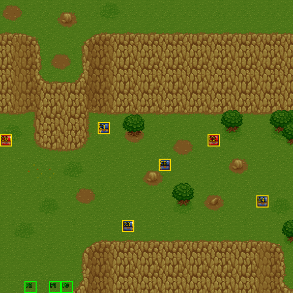

# 第 4 章　謎之女

<!-- chapter_docs:header -->
| 項目 | 內容 |
| --- | --- |
| 章號／章節索引 | 4／3 |
| 章名（文字區塊 `0x01`） | 謎之女 |
| 勝利條件（`0x02`） | 敵人全滅 |
| 敗北條件（`0x03`） | 蘭迪斯﹑法蓮娜﹑索爾／任一人死亡 |
| 戰場 | `MAP03.DAT`／`MAP03.COD`／`M03.DTL`，24×24 格，我方 slot 3 個，部署記錄 33 筆 |
| 文字區塊 | `FDETXT04.TXT`，26 條 |
| 進入處理（`0x60074`[3]） | `fdps_chapter_04_init`（`0x20f70`） |
| 行動後檢查（`0x6028c`[3]） | `fdps_chapter_04_post_action`（`0x3a560`） |
| 勝利處理（`0x60304`[3]） | `fdps_chapter_04_end`（`0x3a590`） |
| 地圖資料呼叫的事件處理（`0x601c4`） | slot 6：`fdps_chapter_04_event_for_turn`（`0x36f70`）（回合事件） |
| 過場腳本 | `ICON03.DAT`（開場）、`WIN03.DAT`（勝利） |
| 本章之前的村莊 | `SHOP03.DAT` |
| 光碟 | 第 1 片（音軌見 [CD 音軌](../program_info/cd_audio.md)） |



戰場全圖（第 0 層與同步捲動的圖層）。框線：黃 `C` 寶箱、橘 `B` 埋藏格、青 `R` 重繪格、洋紅 `E` 有處理函式的格子事件格，字母後的數字是事件碼；綠 `P` 是我方 slot 的起始格。

圖由 `python tools/chapter_docs/chapter_facts.py render-maps` 從遊戲檔重畫到 `chapters/maps/`，`verify-maps` 逐 byte 比對版控中的圖。
<!-- /chapter_docs:header -->

## 概要

魔導士少女法蓮娜被一隊士兵追到懸崖上。士兵說是她父親下了嚴令要帶她回去，法蓮娜不肯，說父親只想利用她的法力做奇怪的事；推擠之間她從崖上跌落，士兵們趕著找路下崖。蘭迪斯、尤利安、亞克與索爾在崖下發現倒地的她：法蓮娜頭部受傷，除了自己的名字什麼都想不起來。索爾看著她喃喃念出「悠妮」，被尤利安一問才說只是想起往事。

追兵隨即包圍過來，冰魔導士要一行人交出「那位小姐」。失憶的法蓮娜認不得他們，只說不想跟他們走；蘭迪斯答應保護她，亞克也嚷著要活動筋骨，戰鬥開始。戰鬥中步兵回報對方陣營有個很厲害的人物（索爾），冰魔導士要他們撐到第二巡邏小隊趕來，第 5 回合援軍果然出現。

擊退追兵後，法蓮娜向眾人道謝。亞克提議在她恢復記憶之前先跟著大家、之後再送她回家，法蓮娜答應同行，索爾沉默不語。勝利過場最後切到另一張地圖：士兵喊著「找到國王了」，被亞雷斯迎回的人笑說自己只是出去透透氣，沒想到鬧出這麼大的騷動。

## 加入與離隊

法蓮娜在本章加入，加入的機制與她實際以哪一筆記錄交到玩家手上見 [`assets/characters.md` 的「加入」](../assets/characters.md#加入)。本章的具體情形：`fdps_chapter_04_init`（`0x20f70`）把她接到名冊第 4 位（名冊索引 3），但 `MAP03.DAT` 只宣告 3 個我方 slot，名冊上的她不會上場；戰場上的法蓮娜是開場過場 `ICON03.DAT` 部署的波次 3（記錄 #21，陣營 2、LV8），由玩家操作。勝利時名冊寫回以角色編號比對，這個 LV8 的單位連同戰鬥中得到的經驗與物品蓋過名冊記錄。

索爾（`0C`，LV10）是波次 0 的友方 NPC，由電腦操作，本章結束後不入隊，下一章仍以 NPC 身分出場（[第 5 章](ch05.md)）。

## 勝敗條件與特殊機制

畫面上的勝敗條件與程式實際判定一致，三個敗北條件分由三個不同的機制負責：

- **勝利（敵人全滅）**：`fdps_chapter_04_post_action`（`0x3a560`）先呼叫共用判定 `fdps_battle_check_default_end_conditions`（`0x3a2e0`）：陣營 0 的單位全部退場就寫過關。開場過場部署後又退場的崖上追兵（波次 2）與替身（波次 4）都是陣營 0 但已退場，不妨礙全滅判定。
- **蘭迪斯死亡**：同一個共用判定看單位 0。
- **索爾死亡**：`fdps_chapter_04_post_action`（`0x3a560`）自己多問一次 `fdps_unit_is_retired`（`0x109b0`）單位 3。本章單位 3 是波次 0 的索爾；同一支函式體在第 5、6 章問的單位 3 是法蓮娜。這個敗北寫入不看結束碼目前的值，同一次行動裡敵人全滅又失去索爾時是敗北。
- **法蓮娜死亡**：沒有任何處理函式檢查她。她的部署記錄 #21 帶死亡腳本 opcode 5、運算元 `0x19`，被打倒時由 `fdps_run_death_scripts`（`0x1d990`）畫出「我﹒﹒我﹒﹒」並把結束碼設為敗北（死亡腳本的規則見 [`resource_info/map.md`](../resource_info/map.md)）。

判定的呼叫時機與結束碼的寫入規則見 [`program_info/chapter.md`](../program_info/chapter.md)。

**援軍可以不必面對。**過關只看「陣營 0 全部退場」，第 5 回合的援軍是 `fdps_chapter_04_event_for_turn`（`0x36f70`）在敵方階段開始時才部署的；在那之前清光波次 1 的 15 名敵兵，戰鬥當場過關，波次 5 永遠不會出場。

**第 5 回合解除東側部隊的固守。**波次 1 東側那一群（冰魔導士 #3、步兵 #6–#8、騎兵 #9，錨點在 (21–23, 11–13)）的 AI 行為是 2（有目標可打就打，否則原地不動）。第 5 回合的援軍事件在部署援軍之後，把單位索引 13 與 15–18 的 AI 行為低 4 bit 改成 0（主動追擊），正好就是這五人，東側部隊從此開始往我方推進。中央北側的魔導士 #2（行為 2）不在範圍內，整場都固守。AI 行為的意義見 [`program_info/map_ai.md`](../program_info/map_ai.md#行為代碼)。

### 本章的單位索引

處理函式以寫死的單位索引指人，而索引是依部署順序附加的，開場過場部署後又退場的單位也佔位置。本章戰鬥開始時與第 5 回合之後的單位陣列：

| 單位索引 | 內容 | 由誰部署 |
| --- | --- | --- |
| 0–2 | 蘭迪斯、尤利安、亞克（名冊前三位） | `fdps_build_map_unit_array`（`0x22be0`） |
| 3 | 索爾（波次 0） | 同上 |
| 4 | 法蓮娜（波次 3） | `ICON03.DAT` `0x00c` |
| 5–9 | 崖上追兵 #4、#17–#20（波次 2），過場中退場 | `ICON03.DAT` `0x014` |
| 10 | 替身 #22（波次 4），過場中退場 | `ICON03.DAT` `0x06e` |
| 11–25 | 波次 1 的 #1–#3、#5–#16，依記錄順序 | `ICON03.DAT` `0x0f6` |
| 26–32 | 波次 5 的 #23–#26、#29–#31，依記錄順序 | `fdps_chapter_04_event_for_turn`（`0x36f70`），第 5 回合 |

所以第 5 回合事件改的 13 是 #3 冰魔導士、15–18 是 #6、#7、#8、#9；游標移到的 `0x1f`（31）是援軍中的步兵 #30。

## 敵人配置

開場的敵人全部是波次 1，由開場過場在最後一段對話前部署，分成三群：

- **中央北側**（(12–14, 9–11)）：魔導士 #2（行為 2，固守）與步兵 #5、#15、#16、騎兵 #11（行為 0，主動）。
- **中央南側**（(16–18, 15–17)）：魔導士 #1、步兵 #12–#14（行為 0）與騎兵 #10（行為 1，只追路徑可達的對手）。
- **東側**（(21–23, 11–13)）：冰魔導士 #3 與步兵 #6–#8、騎兵 #9，全部行為 2，到第 5 回合才被改成主動（見上一節）。

第 5 回合敵方階段開始時，第二巡邏小隊（波次 5：騎兵 2、步兵 4、魔導士 1）出現在我方起始位置附近的左下角（錨點 (2–5, 18–21)，放在最近的空格）。本章沒有頭目，也沒有搶寶箱的 AI。

<!-- chapter_docs:deployments -->
陣營與死亡腳本的意義見 [`resource_info/map.md`](../resource_info/map.md)，AI 行為（低 4 bit）見 [`program_info/map_ai.md`](../program_info/map_ai.md#行為代碼)；錨點是 `MAPnn.COD` 的座標，開場波次放在錨點上，其餘波次依部署方式放在錨點或最近的空格。單位名是全域文字的「角色編號 + 1」條；角色編號 `3C` 以上的敵兵，數值（`ENEMYDAT.DAT`）與種族、職業見 [`assets/enemies.md`](../assets/enemies.md)，以下的見 [`assets/characters.md`](../assets/characters.md)。

我方起始格：slot 0 (5, 23)、slot 1 (4, 23)、slot 2 (2, 23)。

| 波次 | 陣營 | 單位 | 等級 | 數量 |
| ---: | --- | --- | --- | ---: |
| 0 | NPC | `0C` 索爾 | 10 | 1 |
| 1 | 敵方 | `66` 魔導士 | 8 | 2 |
| 1 | 敵方 | `65` 冰魔導士 | 8 | 1 |
| 1 | 敵方 | `62` 步兵 | 7 | 9 |
| 1 | 敵方 | `58` 騎兵 | 6 | 3 |
| 2 | 敵方 | `62` 步兵 | 7 | 2 |
| 2 | 敵方 | `58` 騎兵 | 6 | 3 |
| 3 | 我方 | `01` 法蓮娜 | 8 | 1 |
| 4 | 敵方 | `91` （空白） | 6 | 1 |
| 5 | 敵方 | `58` 騎兵 | 6 | 2 |
| 5 | 敵方 | `62` 步兵 | 7 | 4 |
| 5 | 敵方 | `66` 魔導士 | 8 | 1 |

### 波次 0

出場：進入戰場時由 `fdps_build_map_unit_array`（`0x22be0`） 部署在錨點上

| # | 陣營 | 單位 | 等級 | AI 行為 | 錨點 | 死亡腳本 |
| ---: | --- | --- | ---: | --- | --- | --- |
| 0 | NPC | `0C` 索爾 | 10 | 0 主動 | (3, 23) | — |

### 波次 1

出場：開場過場 `ICON03.DAT` `0x0f6` 在最後一段對話前部署在錨點上（`fdps_chapter_04_init`（`0x20f70`）播放），戰鬥開始時就在場，佔單位索引 11–25

| # | 陣營 | 單位 | 等級 | AI 行為 | 錨點 | 死亡腳本 |
| ---: | --- | --- | ---: | --- | --- | --- |
| 1 | 敵方 | `66` 魔導士 | 8 | 0 主動 | (17, 16) | 掉落 `D7` 魔力水晶 |
| 2 | 敵方 | `66` 魔導士 | 8 | 2 原地 | (13, 10) | 掉落 2000 金 |
| 3 | 敵方 | `65` 冰魔導士 | 8 | 2 原地 | (22, 12) | 掉落 `30` 封咒之杖 |
| 5 | 敵方 | `62` 步兵 | 7 | 0 主動 | (13, 11) | 掉落 `B5` 回復劑 |
| 6 | 敵方 | `62` 步兵 | 7 | 2 原地 | (21, 12) | — |
| 7 | 敵方 | `62` 步兵 | 7 | 2 原地 | (22, 13) | 掉落 1000 金 |
| 8 | 敵方 | `62` 步兵 | 7 | 2 原地 | (22, 11) | 掉落 `B5` 回復劑 |
| 9 | 敵方 | `58` 騎兵 | 6 | 2 原地 | (23, 12) | — |
| 10 | 敵方 | `58` 騎兵 | 6 | 1 追擊 | (18, 16) | 掉落 `20` 戰矛 |
| 11 | 敵方 | `58` 騎兵 | 6 | 0 主動 | (13, 9) | — |
| 12 | 敵方 | `62` 步兵 | 7 | 0 主動 | (17, 15) | — |
| 13 | 敵方 | `62` 步兵 | 7 | 0 主動 | (16, 16) | — |
| 14 | 敵方 | `62` 步兵 | 7 | 0 主動 | (17, 17) | 掉落 `04` 巨劍 |
| 15 | 敵方 | `62` 步兵 | 7 | 0 主動 | (14, 10) | — |
| 16 | 敵方 | `62` 步兵 | 7 | 0 主動 | (12, 10) | — |

### 波次 2

出場：開場過場 `ICON03.DAT` `0x014` 部署在崖上（錨點第 0 列）追趕法蓮娜，同一支腳本在 `0x051`–`0x059` 讓五人退場，只在過場中出現、不參戰；第 25 章勝利過場 `WIN24.DAT` `0x18b` 重演時再部署一次

| # | 陣營 | 單位 | 等級 | AI 行為 | 錨點 | 死亡腳本 |
| ---: | --- | --- | ---: | --- | --- | --- |
| 4 | 敵方 | `62` 步兵 | 7 | 0 主動 | (3, 0) | — |
| 17 | 敵方 | `58` 騎兵 | 6 | 0 主動 | (4, 0) | — |
| 18 | 敵方 | `62` 步兵 | 7 | 0 主動 | (6, 0) | — |
| 19 | 敵方 | `58` 騎兵 | 6 | 0 主動 | (7, 0) | — |
| 20 | 敵方 | `58` 騎兵 | 6 | 0 主動 | (8, 0) | — |

### 波次 3

出場：開場過場 `ICON03.DAT` `0x00c` 部署法蓮娜（單位索引 4），`0x027` 墜崖退場，`0x0bf` 復歸並在 `0x0c1` 放到 (4, 14)，戰鬥中由玩家操作；`WIN24.DAT` `0x183` 重演時再部署一次

| # | 陣營 | 單位 | 等級 | AI 行為 | 錨點 | 死亡腳本 |
| ---: | --- | --- | ---: | --- | --- | --- |
| 21 | 我方 | `01` 法蓮娜 | 8 | 0 主動 | (4, 6) | 顯示 `0x19`，之後敗北 |

### 波次 4

出場：開場過場 `ICON03.DAT` `0x06e` 部署在 (4, 14) 當法蓮娜的替身，`0x0bd` 退場後法蓮娜被放到同一格，只在過場中出現

| # | 陣營 | 單位 | 等級 | AI 行為 | 錨點 | 死亡腳本 |
| ---: | --- | --- | ---: | --- | --- | --- |
| 22 | 敵方 | `91` （空白） | 6 | 0 主動 | (4, 14) | — |

### 波次 5

出場：第 5 回合敵方階段開始時由 `fdps_chapter_04_event_for_turn`（`0x36f70`）部署在錨點最近的空格（左下角）；在那之前清光波次 1 就已過關，不會出場

| # | 陣營 | 單位 | 等級 | AI 行為 | 錨點 | 死亡腳本 |
| ---: | --- | --- | ---: | --- | --- | --- |
| 23 | 敵方 | `58` 騎兵 | 6 | 0 主動 | (4, 21) | — |
| 24 | 敵方 | `58` 騎兵 | 6 | 0 主動 | (2, 19) | — |
| 25 | 敵方 | `62` 步兵 | 7 | 0 主動 | (3, 18) | — |
| 26 | 敵方 | `62` 步兵 | 7 | 0 主動 | (3, 19) | — |
| 29 | 敵方 | `62` 步兵 | 7 | 0 主動 | (4, 20) | — |
| 30 | 敵方 | `62` 步兵 | 7 | 0 主動 | (5, 20) | — |
| 31 | 敵方 | `66` 魔導士 | 8 | 0 主動 | (4, 19) | — |

### 波次 FF

3 筆記錄（#27–#32）永遠不會部署：地圖 3 上唯一的部署處理函式只要波次 5，腳本的 DEPLOY_WAVE 只寫 1–4（腳本的 `0xFF` 表示取選擇分支 0–2，不是 255），沒有任何呼叫以 255 部署，見 [S11](../cut_content/story.md#s11-18-筆波次-0xff-的部署記錄)。
<!-- /chapter_docs:deployments -->

## 寶物

六個寶箱都在戰場中段，沒有埋藏格。擊倒掉落需要由我方單位親手打倒；本章的掉落集中在波次 1，其中封咒之杖在東側固守的冰魔導士 #3 身上，魔力水晶在中央南側的魔導士 #1 身上。處理函式與過場都不發任何物品。

<!-- chapter_docs:treasure -->
搜尋的規則（同碼的格共用一筆記錄與一個旗標、背包滿時的交換）見 [`resource_info/map.md`](../resource_info/map.md)。

| 事件碼 | 格 | 內容 |
| ---: | --- | --- |
| 0 | (0, 11) 寶箱 | 2000 金 |
| 1 | (8, 10) 寶箱 | `B7` 魔法草 |
| 2 | (17, 11) 寶箱 | `C4` 雷之珠 |
| 3 | (10, 18) 寶箱 | `B5` 回復劑 |
| 4 | (21, 16) 寶箱 | `D6` 生命之實 |
| 5 | (13, 13) 寶箱 | 1500 金 |

擊倒後掉落（死亡腳本 opcode 0／1，擊殺者須是存活的我方單位）：

| # | 單位 | 波次 | 掉落 |
| ---: | --- | ---: | --- |
| 1 | `66` 魔導士 | 1 | 掉落 `D7` 魔力水晶 |
| 2 | `66` 魔導士 | 1 | 掉落 2000 金 |
| 3 | `65` 冰魔導士 | 1 | 掉落 `30` 封咒之杖 |
| 5 | `62` 步兵 | 1 | 掉落 `B5` 回復劑 |
| 7 | `62` 步兵 | 1 | 掉落 1000 金 |
| 8 | `62` 步兵 | 1 | 掉落 `B5` 回復劑 |
| 10 | `58` 騎兵 | 1 | 掉落 `20` 戰矛 |
| 14 | `62` 步兵 | 1 | 掉落 `04` 巨劍 |
<!-- /chapter_docs:treasure -->

## 村莊

<!-- chapter_docs:village -->
第 3 章勝利後、本章之前的村莊載入 `SHOP03.DAT`，道具店、武器店、秘密商店的貨見 [`assets/shops.md`](../assets/shops.md)。村莊載入的文字區塊是 `FDETXT04`（章節索引 + 1，`fdps_load_field_chapter_resources`（`0x31540`）），也就是本章的區塊，所以村莊畫面的文字是本章區塊的 `0x04`–`0x08`，全文在下方「對話」。
<!-- /chapter_docs:village -->

## 處理流程

### 進入：`fdps_chapter_04_init`（`0x20f70`）

1. `fdps_roster_add_character`（`0x23bc0`）加入角色 `01` 法蓮娜（名冊索引 3）。
2. `fdps_chapter_state_reset`（`0x22750`）：重建戰場單位陣列（我方 slot 0–2 取名冊前三位，接著部署波次 0 的索爾）、回合計數器設為 1。
3. `fdps_icon_script_run`（`0x21650`）播 `Icon03.dat`（`ICON03.DAT`）：部署法蓮娜（波次 3）與崖上追兵（波次 2），法蓮娜墜崖、追兵退場；切到崖下，部署替身（波次 4）在 (4, 14)，全隊往北走到她身邊，替身退場、法蓮娜復歸並放到 (4, 14)；最後部署波次 1 的敵軍，談判破裂後結束。
4. `fdps_show_chapter_title_card`（`0x20c60`）顯示章名卡。
5. `fdps_map_cursor_move_to_unit`（`0x2da50`）把游標放在單位 0（蘭迪斯）。

### 行動後檢查：`fdps_chapter_04_post_action`（`0x3a560`）

1. `fdps_battle_check_default_end_conditions`（`0x3a2e0`）：結束碼已非 0 就不動；否則陣營 0 全部退場寫 2（過關），單位 0 退場寫 1（敗北）。
2. `fdps_unit_is_retired`（`0x109b0`）問單位 3（索爾），已退場就把結束碼寫成 1，不論前一步寫了什麼。

### 勝利：`fdps_chapter_04_end`（`0x3a590`）

1. `fdps_battle_destroy_remaining_enemies`（`0x39e10`）把陣營 0 的 HP 全部歸零。
2. `fdps_roster_write_back_battle_units`（`0x23980`）把戰場單位寫回名冊，法蓮娜的 LV8 單位在這一步蓋過名冊記錄。
3. `fdps_icon_script_run`（`0x21650`）播 `Win03.dat`（`WIN03.DAT`）。
4. `fdps_roster_revive_fallen_members`（`0x39e70`）復活名冊上的陣亡者。
5. 章節索引設為 4（第 5 章）。不發法術、物品或金錢。

### 回合事件：`fdps_chapter_04_event_for_turn`（`0x36f70`）

`MAP03.DAT` 的回合事件表有兩筆指到 slot 6：第 3 回合與第 5 回合的敵方階段開始時，由 `fdps_battle_run_turn_events`（`0x2e0c0`）呼叫。函式體只比對回合是不是 3，其餘回合一律走援軍路徑；只觸發兩次是回合事件表決定的。

- **第 3 回合**：`fdps_draw_text`（`0x1ff60`）畫本章文字 `0x17`（步兵報告對方有厲害人物、冰魔導士說第二巡邏小隊馬上就到），隨即返回，不部署任何單位。
- **第 5 回合**，依序：
  1. `fdps_deploy_wave`（`0x23830`）以章節索引 3 為地圖、部署波次 5，放在錨點最近的空格。
  2. `fdps_map_cursor_move_to_unit`（`0x2da50`）把游標移到單位 `0x1f`，`fdps_render_view_frame`（`0x2beb0`）停留 12 幀。
  3. 畫本章文字 `0x18`（「第二巡邏小隊，終於趕到了！」）。
  4. 把單位 15–18 與單位 13 的 AI 行為改成 0，保留高 4 bit。

## 回合事件與格子事件

<!-- chapter_docs:events -->
觸發時機與陣營階段的意義見 [`resource_info/map.md`](../resource_info/map.md)。

| 回合 | 陣營階段 | slot | 處理函式 |
| ---: | --- | ---: | --- |
| 3 | 敵方階段前 | 6 | `fdps_chapter_04_event_for_turn`（`0x36f70`） |
| 5 | 敵方階段前 | 6 | `fdps_chapter_04_event_for_turn`（`0x36f70`） |

本章沒有格子事件。

死亡腳本裡的事件與文字：

| # | 單位 | 波次 | 死亡腳本 |
| ---: | --- | ---: | --- |
| 21 | `01` 法蓮娜 | 3 | 顯示 `0x19`，之後敗北 |
<!-- /chapter_docs:events -->

## 過場腳本

`ICON03.DAT` 開頭的崖上追逐（`0x000`–`0x029`）在第 25 章的勝利過場 `WIN24.DAT` 裡不帶對白地重演一次（`0x175` 切回地圖 3，重新部署波次 3 與波次 2，法蓮娜退場、播 `ICON0018.SAF`），見 [第 25 章](ch25.md)。`WIN03.DAT` 在 `0x00b` 與 `0x00d` 復歸了兩次單位 3、沒有復歸單位 4；法蓮娜陣亡就是敗北，勝利時她必然在場，這個重複沒有可見的後果。

<!-- chapter_docs:scripts -->
格式與每個指令的意義見 [`resource_info/cutscene_script.md`](../resource_info/cutscene_script.md)。`FDETXT04#0xNN` 是本章文字區塊的條目，全文在下方「對話」；切到額外場景之後顯示的文字直接列出（那些區塊的正典是 [`assets/text/scene_text.md`](../assets/text/scene_text.md)）。`u3=我方1` 是地圖單位索引 3 對到我方 slot 1，`u12=MAP02#9` 是 `MAP02.DAT` 第 9 筆部署記錄。

### `ICON03.DAT`

- 開場：`fdps_chapter_04_init`（`0x20f70`）
- 293 byte、71 步；起始地圖 3，切換地圖 無，結束於地圖 3

| 偏移 | 指令 | 內容 |
| ---: | --- | --- |
| `0000` | `SET_MUSIC` | 音樂 12（CD 第 13 軌） |
| `0002` | `SET_VIEW_TILE` | 視野直接設到格 (0, 0) |
| `0005` | `FACE_UNITS` | 轉向後停 1 幀：u0=我方0朝上 |
| `000a` | `PLAY_SAF` | 播放動畫 ICON0017.SAF |
| `000c` | `DEPLOY_WAVE` | 部署 MAP03 波次 3（錨點原位）：#21(角色0x01) |
| `000f` | `FACE_UNITS` | 轉向後停 10 幀：u4=MAP03#21(角色0x01)朝上 |
| `0014` | `DEPLOY_WAVE` | 部署 MAP03 波次 2（錨點原位）：#4(角色0x62)、#17(角色0x58)、#18(角色0x62)、#19(角色0x58)、#20(角色0x58) |
| `0017` | `WALK_UNITS` | 行走 2 格，每步 1 幀：u5=MAP03#4(角色0x62)往下、u6=MAP03#17(角色0x58)往下、u7=MAP03#18(角色0x62)往下、u8=MAP03#19(角色0x58)往下、u9=MAP03#20(角色0x58)往下 |
| `0025` | `DRAW_TEXT` | 顯示文字 FDETXT04#0x09 |
| `0027` | `RETIRE_UNIT` | 退場 u4=MAP03#21(角色0x01) |
| `0029` | `PLAY_SAF` | 播放動畫 ICON0018.SAF |
| `002b` | `SHAKE_VIEW` | 視野位移 9 步，每步 1 幀：(0,-2) (0,-4) (0,-8) (0,-4) (0,-2) (0,0) (0,-2) (0,-4) (0,-2) |
| `0040` | `FACE_UNITS` | 轉向後停 12 幀：u4=MAP03#21(角色0x01)朝上 |
| `0045` | `WALK_UNITS` | 行走 4 格，每步 1 幀：u5=MAP03#4(角色0x62)往下 |
| `004b` | `DRAW_TEXT` | 顯示文字 FDETXT04#0x0a |
| `004d` | `FADE_OUT` | 淡出，每步 40 ms |
| `004f` | `SET_MUSIC` | 停止音樂 |
| `0051` | `RETIRE_UNIT` | 退場 u5=MAP03#4(角色0x62) |
| `0053` | `RETIRE_UNIT` | 退場 u6=MAP03#17(角色0x58) |
| `0055` | `RETIRE_UNIT` | 退場 u7=MAP03#18(角色0x62) |
| `0057` | `RETIRE_UNIT` | 退場 u8=MAP03#19(角色0x58) |
| `0059` | `RETIRE_UNIT` | 退場 u9=MAP03#20(角色0x58) |
| `005b` | `SET_VIEW_TILE` | 視野直接設到格 (0, 10) |
| `005e` | `FACE_UNITS` | 轉向後停 1 幀：u0=我方0朝上 |
| `0063` | `FADE_IN` | 淡入，每步 40 ms |
| `0065` | `SET_MUSIC` | 音樂 7（CD 第 8 軌） |
| `0067` | `PLAY_SAF` | 播放動畫 ICON0019.SAF |
| `0069` | `FADE_OUT` | 淡出，每步 40 ms |
| `006b` | `SET_VIEW_TILE` | 視野直接設到格 (0, 15) |
| `006e` | `DEPLOY_WAVE` | 部署 MAP03 波次 4（錨點原位）：#22(角色0x91) |
| `0071` | `FACE_UNITS` | 轉向後停 1 幀：u0=我方0朝上 |
| `0076` | `FADE_IN` | 淡入，每步 40 ms |
| `0078` | `FACE_UNITS` | 轉向後停 2 幀：u0=我方0朝左 |
| `007d` | `WALK_UNITS` | 行走 1 格，每步 4 幀：u0=我方0往上、u2=我方2往上 |
| `0085` | `WALK_UNITS` | 行走 1 格，每步 4 幀：u0=我方0往上、u1=我方1往上、u2=我方2往上、u3=MAP03#0(角色0x0c)往上 |
| `0091` | `FACE_UNITS` | 轉向後停 10 幀：u0=我方0朝上 |
| `0096` | `DRAW_TEXT` | 顯示文字 FDETXT04#0x0b |
| `0098` | `WALK_UNITS` | 行走 4 格，每步 1 幀：u0=我方0往上、u1=我方1往上、u2=我方2往上、u3=MAP03#0(角色0x0c)往上 |
| `00a4` | `SCROLL_VIEW` | 捲動視野到格 (0, 10) |
| `00a7` | `WALK_UNITS` | 行走 3 格，每步 1 幀：u0=我方0往上、u1=我方1往上、u2=我方2往上、u3=MAP03#0(角色0x0c)往上 |
| `00b3` | `FACE_UNITS` | 轉向後停 10 幀：u0=我方0朝左 |
| `00b8` | `FACE_UNITS` | 轉向後停 10 幀：u2=我方2朝右 |
| `00bd` | `RETIRE_UNIT` | 退場 u10=MAP03#22(角色0x91) |
| `00bf` | `REVIVE_UNIT` | 復歸 u4=MAP03#21(角色0x01)（清狀態） |
| `00c1` | `PLACE_UNIT` | 放置 u4=MAP03#21(角色0x01) 到 (4, 14)，朝右 |
| `00c6` | `DRAW_TEXT` | 顯示文字 FDETXT04#0x0c |
| `00c8` | `WALK_UNITS` | 行走 2 格，每步 6 幀：u3=MAP03#0(角色0x0c)往左 |
| `00ce` | `FACE_UNITS` | 轉向後停 25 幀：u3=MAP03#0(角色0x0c)朝左 |
| `00d3` | `SET_MUSIC` | 音樂 9（CD 第 10 軌） |
| `00d5` | `DRAW_TEXT` | 顯示文字 FDETXT04#0x0f |
| `00d7` | `FACE_UNITS` | 轉向後停 25 幀：u3=MAP03#0(角色0x0c)朝左 |
| `00dc` | `FACE_UNITS` | 轉向後停 2 幀：u1=我方1朝左 |
| `00e1` | `DRAW_TEXT` | 顯示文字 FDETXT04#0x10 |
| `00e3` | `FACE_UNITS` | 轉向後停 8 幀：u3=MAP03#0(角色0x0c)朝右 |
| `00e8` | `DRAW_TEXT` | 顯示文字 FDETXT04#0x11 |
| `00ea` | `FACE_UNITS` | 轉向後停 12 幀：u2=我方2朝左 |
| `00ef` | `DRAW_TEXT` | 顯示文字 FDETXT04#0x12 |
| `00f1` | `FACE_UNITS` | 轉向後停 12 幀：u2=我方2朝左 |
| `00f6` | `DEPLOY_WAVE` | 部署 MAP03 波次 1（錨點原位）：#1(角色0x66)、#2(角色0x66)、#3(角色0x65)、#5(角色0x62)、#6(角色0x62)、#7(角色0x62)、#8(角色0x62)、#9(角色0x58)、#10(角色0x58)、#11(角色0x58)、#12(角色0x62)、#13(角色0x62)、#14(角色0x62)、#15(角色0x62)、#16(角色0x62) |
| `00f9` | `DRAW_TEXT` | 顯示文字 FDETXT04#0x0d |
| `00fb` | `FACE_UNITS` | 轉向後停 12 幀：u0=我方0朝右、u1=我方1朝右、u2=我方2朝右、u3=MAP03#0(角色0x0c)朝右 |
| `0106` | `DRAW_TEXT` | 顯示文字 FDETXT04#0x13 |
| `0108` | `FACE_UNITS` | 轉向後停 12 幀：u0=我方0朝左 |
| `010d` | `DRAW_TEXT` | 顯示文字 FDETXT04#0x14 |
| `010f` | `FACE_UNITS` | 轉向後停 12 幀：u0=我方0朝右 |
| `0114` | `DRAW_TEXT` | 顯示文字 FDETXT04#0x15 |
| `0116` | `FACE_UNITS` | 轉向後停 12 幀：u0=我方0朝左 |
| `011b` | `DRAW_TEXT` | 顯示文字 FDETXT04#0x16 |
| `011d` | `FACE_UNITS` | 轉向後停 25 幀：u0=我方0朝右 |
| `0122` | `SET_MUSIC` | 停止音樂 |
| `0124` | `END` | 結束 |

### `WIN03.DAT`

- 勝利：`fdps_chapter_04_end`（`0x3a590`）
- 109 byte、32 步；起始地圖 3，切換地圖 39，結束於地圖 39

| 偏移 | 指令 | 內容 |
| ---: | --- | --- |
| `0000` | `SET_MUSIC` | 音樂 7（CD 第 8 軌） |
| `0002` | `SET_VIEW_TILE` | 視野直接設到格 (0, 12) |
| `0005` | `REVIVE_UNIT` | 復歸 u0=我方0（清狀態） |
| `0007` | `REVIVE_UNIT` | 復歸 u1=我方1（清狀態） |
| `0009` | `REVIVE_UNIT` | 復歸 u2=我方2（清狀態） |
| `000b` | `REVIVE_UNIT` | 復歸 u3=MAP03#0(角色0x0c)（清狀態） |
| `000d` | `REVIVE_UNIT` | 復歸 u3=MAP03#0(角色0x0c)（清狀態） |
| `000f` | `PLACE_UNIT` | 放置 u0=我方0 到 (5, 14)，朝左 |
| `0014` | `PLACE_UNIT` | 放置 u1=我方1 到 (4, 15)，朝上 |
| `0019` | `PLACE_UNIT` | 放置 u2=我方2 到 (3, 15)，朝上 |
| `001e` | `PLACE_UNIT` | 放置 u3=MAP03#0(角色0x0c) 到 (2, 14)，朝右 |
| `0023` | `PLACE_UNIT` | 放置 u4 到 (4, 14)，朝右 |
| `0028` | `DRAW_TEXT` | 顯示文字 FDETXT04#0x0e |
| `002a` | `SET_MUSIC` | 音樂 4（CD 第 5 軌） |
| `002c` | `SWITCH_MAP` | 切換地圖 → 39（MAP39，文字 FDETXT40） |
| `002e` | `FACE_UNITS` | 轉向後停 1 幀：u0=MAP39#0(角色0x0e)朝下 |
| `0033` | `DEPLOY_WAVE` | 部署 MAP39 波次 1（錨點原位）：#2(角色0x5b) |
| `0036` | `WALK_UNITS` | 行走 2 格，每步 1 幀：u1=MAP39#2(角色0x5b)往上 |
| `003c` | `DRAW_TEXT` | 顯示文字 FDETXT40#0x09 「{speaker char=91}找到國王了！{br}國王回來了！{br}{speaker char=14}是真的嗎？」 |
| `003e` | `WALK_UNITS` | 行走 1 格，每步 1 幀：u0=MAP39#0(角色0x0e)往下 |
| `0044` | `DEPLOY_WAVE` | 部署 MAP39 波次 2（錨點原位）：#1(角色0x75) |
| `0047` | `WALK_UNITS` | 行走 2 格，每步 4 幀：u2=MAP39#1(角色0x75)往上 |
| `004d` | `FACE_UNITS` | 轉向後停 1 幀：u0=MAP39#0(角色0x0e)朝左 |
| `0052` | `FACE_UNITS` | 轉向後停 1 幀：u0=MAP39#0(角色0x0e)朝右 |
| `0057` | `WALK_UNITS` | 行走 2 格，每步 4 幀：u2=MAP39#1(角色0x75)往上 |
| `005d` | `FACE_UNITS` | 轉向後停 1 幀：u2=MAP39#1(角色0x75)朝下 |
| `0062` | `DRAW_TEXT` | 顯示文字 FDETXT40#0x0a 「{speaker char=117}啊？！亞雷斯，{br}真不好意思！{br}只是去透透氣而已，{page}沒想到，{br}引起這麼大的騷動。{br}哈哈哈～{br}{speaker char=14}﹒﹒﹒﹒﹒﹒」 |
| `0064` | `RETIRE_UNIT` | 退場 u0=MAP39#0(角色0x0e) |
| `0066` | `RETIRE_UNIT` | 退場 u2=MAP39#1(角色0x75) |
| `0068` | `PLAY_SAF` | 播放動畫 ICON0021.SAF |
| `006a` | `SET_MUSIC` | 停止音樂 |
| `006c` | `END` | 結束 |
<!-- /chapter_docs:scripts -->

## 對話

<!-- chapter_docs:dialogue -->
`FDETXT04.TXT` 全部 26 條，依條目編號排列。每條先列讀取端（顯示它的腳本步驟、處理函式或死亡腳本），再列全文：【名稱】是換說話者（頭像取自括號裡的角色編號；【地圖單位 n】取執行當下第 n 個地圖單位），每一行是一次換行，▼ 是換頁（等按鍵）。`{subst1}`、`{subst2}`、`{number}` 是執行期代入的名稱與數字（[`resource_info/text.md`](../resource_info/text.md)）。

### `0x00`

永遠不會顯示：章名卡是 `Chapter.saf` 的圖（`fdps_show_chapter_title_card`（`0x20c60`）），存檔畫面讀 `0x01`；讀章節區塊 `0x00` 的只有第 16 章的事件，本區塊沒有讀取端，見 [S13a（排除清單）](../cut_content/_index.md#排除清單)。

### `0x01`

讀取端：`fdps_draw_save_slot_panel`（`0x24a40`）

```text
謎之女
```

### `0x02`

讀取端：`fdps_battle_show_win_fail_window`（`0x17ca0`）

```text
敵人全滅
```

### `0x03`

讀取端：`fdps_battle_show_win_fail_window`（`0x17ca0`）

```text
蘭迪斯﹑法蓮娜﹑索爾
任一人死亡
```

### `0x04`

讀取端：`fdps_village_item_menu`（`0x35860`）

```text
啊～！嚇死我了﹒﹒﹒﹒
有一大群士兵追著一位小姐，
往城外的方向去了。
▼
她在我這裡買了不少東西。
那位小姐人很好，
待人也親切，
▼
不知道為什麼招惹了他們？
真是擔心那位小姐啊！
▼
```

### `0x05`

讀取端：`fdps_run_weapon_shop`（`0x35fd0`）

```text
喔，
據說城中有隱藏商店，
專賣一些貴重東西，
▼
聽說這種商店，
在許多城鎮都有。
至於本城的嘛，
▼
或許在城裡，
轉一圈就會看到。
謝謝光臨，歡迎再來
▼
```

### `0x06`

讀取端：`fdps_run_bar_shop`（`0x35cc0`）

```text
剛才這裡來了一位美麗的魔導
士小姐，
可是過沒多久又走了，
▼
抱歉！不能為你引見了，嘻嘻！
▼
```

### `0x07`

讀取端：`fdps_run_church_screen`（`0x35aa0`）

```text
唉～！
世風日下，人心不古。
真替那位小姐擔心！
▼
```

### `0x08`

讀取端：`fdps_run_secret_menu`（`0x36210`）

```text
請多多指教！
▼
```

### `0x09`

讀取端：`ICON03.DAT` `0x025`

```text
【步兵】（角色 98）
小姐，真是對不起！
原諒我們對妳無禮。
但妳父親下了嚴令，
▼
如果不帶妳回去的話，
我們都會受到重罰！
▼
小姐，求求妳，
請妳跟我們回去吧！
【法蓮娜】（角色 1）
不要！
我才不要回去！
我曉得父親的意圖；
▼
他只想利用我的法力，
來幫他作些奇怪的事。
我才不回去呢！
```

### `0x0a`

讀取端：`ICON03.DAT` `0x04b`

```text
【步兵】（角色 98）
啊！小姐～！﹒﹒﹒﹒
大家趕快找路下去，
看看小姐有沒有事！
```

### `0x0b`

讀取端：`ICON03.DAT` `0x096`

```text
【蘭迪斯】（角色 0）
啊！
你們看！
```

### `0x0c`

讀取端：`ICON03.DAT` `0x0c6`

```text
【蘭迪斯】（角色 0）
這位小姐，
妳沒事吧？﹒﹒﹒﹒
【法蓮娜】（角色 1）
﹒﹒我的頭好痛﹒﹒﹒
【亞克】（角色 4）
喂！妳叫什麼名字？
住在哪裡？
看妳好像傷得不輕，
▼
我們護送妳回家，
好不好？
【法蓮娜】（角色 1）
我叫法蓮娜，
家﹒﹒家﹒﹒
啊﹒﹒﹒頭好痛﹒﹒
▼
嗚﹒﹒﹒嗚﹒﹒﹒
我記不起來了！
【尤利安】（角色 6）
不會是從山上跌下來，
撞傷了頭部？
【索爾】（角色 12）
跌下來失去記憶了嗎？
怎麼又是這樣？
```

### `0x0d`

讀取端：`ICON03.DAT` `0x0f9`

```text
【步兵】（角色 98）
找到了！
她就在這裡！
```

### `0x0e`

讀取端：`WIN03.DAT` `0x028`

```text
【法蓮娜】（角色 1）
謝謝你們﹒﹒﹒﹒
【亞克】（角色 4）
我看妳喪失的記憶，
一時也恢復不了，
我們不能置之不管。
▼
不如這樣好了，
妳暫時跟我們在一起，
等妳記憶恢復後，
▼
我們再送妳回家。
【尤利安】（角色 6）
是啊！
我們會照顧你的。
【蘭迪斯】（角色 0）
太好了！
法蓮娜，
妳說是不是？
【法蓮娜】（角色 1）
﹒﹒﹒﹒謝謝你們，
以後請大家多照顧了。
【索爾】（角色 12）
﹒﹒﹒﹒﹒﹒﹒
```

### `0x0f`

讀取端：`ICON03.DAT` `0x0d5`

```text
【索爾】（角色 12）
﹒﹒﹒﹒﹒﹒﹒﹒﹒﹒
﹒﹒﹒﹒悠妮﹒﹒﹒﹒
﹒﹒﹒﹒﹒﹒﹒﹒﹒
```

### `0x10`

讀取端：`ICON03.DAT` `0x0e1`

```text
【尤利安】（角色 6）
索爾？
```

### `0x11`

讀取端：`ICON03.DAT` `0x0e8`

```text
【索爾】（角色 12）
啊？！不﹒﹒不﹒﹒
只是想起一些往事。
```

### `0x12`

讀取端：`ICON03.DAT` `0x0ef`

```text
【亞克】（角色 4）
接下來該怎麼辦呢？
我們總不能把她放在這
裡不管﹒﹒﹒﹒
```

### `0x13`

讀取端：`ICON03.DAT` `0x106`

```text
【蘭迪斯】（角色 0）
你們是誰？
想要作什麼？
【冰魔導士】（角色 101）
你們又是誰？
憑什麼管我們的閒事？
快把那小姐交出來！
```

### `0x14`

讀取端：`ICON03.DAT` `0x10d`

```text
【蘭迪斯】（角色 0）
法蓮娜！
妳認得他們嗎？
【法蓮娜】（角色 1）
我﹒﹒我不記得了﹒
▼
可是，
我不想跟他們走！
```

### `0x15`

讀取端：`ICON03.DAT` `0x114`

```text
【蘭迪斯】（角色 0）
你們聽見沒有？
她不願跟你們走，
你們還有什麼話說？
【冰魔導士】（角色 101）
臭小子！
我跟你沒什麼好說的！
你不交出那位小姐，
▼
可以！
我們就用硬搶的了！
【法蓮娜】（角色 1）
你﹒﹒﹒
你會把我交給他們嗎？
```

### `0x16`

讀取端：`ICON03.DAT` `0x11b`

```text
【蘭迪斯】（角色 0）
法蓮娜，妳放心！
有我們在，
誰也動不了妳的！
【亞克】（角色 4）
嘿嘿！
看你們說話的方式，
大概不是什麼好人？
▼
正好讓亞克大爺我，
鬆散鬆散筋骨！
來呀！來呀！哈哈！
```

### `0x17`

讀取端：`fdps_chapter_04_event_for_turn`（`0x36f70`）

```text
【步兵】（角色 98）
報告！
▼
敵方陣營裡有一個
很厲害的人物，
我們不是對手！
【冰魔導士】（角色 101）
你們再撐一會！
第二巡邏小隊，
馬上就會來支援了！
```

### `0x18`

讀取端：`fdps_chapter_04_event_for_turn`（`0x36f70`）

```text
【冰魔導士】（角色 101）
第二巡邏小隊，
終於趕到了！
夥伴們大家上吧！
```

### `0x19`

讀取端：`MAP03.DAT` 記錄 #21 的死亡腳本

```text
【法蓮娜】（角色 1）
我﹒﹒我﹒﹒
```
<!-- /chapter_docs:dialogue -->
