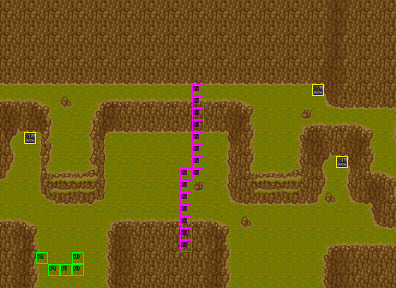

# 第 5 章　疾風之帝國軍

<!-- chapter_docs:header -->
| 項目 | 內容 |
| --- | --- |
| 章號／章節索引 | 5／4 |
| 章名（文字區塊 `0x01`） | 疾風之帝國軍 |
| 勝利條件（`0x02`） | 敵人全滅 |
| 敗北條件（`0x03`） | 蘭迪斯﹑法蓮娜﹑索爾／任一人死亡 |
| 戰場 | `MAP04.DAT`／`MAP04.COD`／`M04.DTL`，33×24 格，我方 slot 5 個，部署記錄 33 筆 |
| 文字區塊 | `FDETXT05.TXT`，17 條 |
| 進入處理（`0x60074`[4]） | `fdps_chapter_05_init`（`0x20fb0`） |
| 行動後檢查（`0x6028c`[4]） | `fdps_chapter_05_post_action`（`0x3a5d0`） |
| 勝利處理（`0x60304`[4]） | `fdps_chapter_05_end`（`0x3a600`） |
| 地圖資料呼叫的事件處理（`0x601c4`） | slot 7：`fdps_chapter_05_event_enemies_advance`（`0x370e0`）（格子事件） |
| 過場腳本 | `ICON04.DAT`（開場）、`WIN04.DAT`（勝利） |
| 本章之前的村莊 | `SHOP04.DAT` |
| 光碟 | 第 1 片（音軌見 [CD 音軌](../program_info/cd_audio.md)） |



戰場全圖（第 0 層與同步捲動的圖層）。框線：黃 `C` 寶箱、橘 `B` 埋藏格、青 `R` 重繪格、洋紅 `E` 有處理函式的格子事件格，字母後的數字是事件碼；綠 `P` 是我方 slot 的起始格。

圖由 `python tools/chapter_docs/chapter_facts.py render-maps` 從遊戲檔重畫到 `chapters/maps/`，`verify-maps` 逐 byte 比對版控中的圖。
<!-- /chapter_docs:header -->

## 概要

羅特帝亞國內傳出國王索爾發瘋、囚禁大臣亞雷斯的消息，離國數日的索爾對蘭迪斯說起一路上的遇伏、中毒、替身與大臣被拘，認定是有人在幕後設局，想立刻回國調查；尤利安與亞克勸他先別貿然回去。這時一名穿羅特帝亞制服的侍衛找上門來，走到索爾面前說「我們終於找到你了」，蘭迪斯才喊出「小心」，索爾已經中招全身麻痺。侍衛閃爍消失，冰魔導士在他站的那一格現身，喊出埋伏的帝國軍，自承只負責讓索爾麻痺、拿了酬勞就先溜走。

帝國步兵聲稱奉「索爾國王」之命捉拿冒充國王的假貨，賞金三千金幣、生死不拘；索爾駁斥現在羅特帝亞的那一位才是冒牌貨，也看出替身連侍衛都換掉了。蘭迪斯決定突圍，讓麻痺的索爾先休息。擊退帝國軍之後，眾人決定先到鎮上歇腳，索爾一語不發。

## 加入與離隊

本章沒有人加入或離隊（人物的入隊處理見 [`assets/characters.md`](../assets/characters.md#加入)）。`fdps_chapter_05_init`（`0x20fb0`）不呼叫入隊，名冊維持第 4 章結束時的蘭迪斯、尤利安、亞克、法蓮娜四人；`MAP04.DAT` 宣告 5 個我方 slot，第 5 個 slot 沒有成員可放，是一個已退場的空位，所以玩家只帶四人上場。

索爾以 NPC（陣營 1）的身分同行：他是地圖本身的波次 0 記錄 #30（LV10），排在 5 個我方 slot 之後、地圖單位索引 5。開場過場讓他全身麻痺（見下節），他不是隊員，戰鬥結束時不會寫進名冊。

## 勝敗條件與特殊機制

- **勝利**：`fdps_chapter_05_post_action`（`0x3a5d0`）先呼叫共用判定 `fdps_battle_check_default_end_conditions`（`0x3a2e0`），只要地圖上沒有未退場的陣營 0 單位就記下過關。開場過場中出場的侍衛與冰魔導士在過場裡就已退場，波次 FF 從未部署，所以「敵人全滅」就是打倒波次 1 的 27 名敵兵。
- **蘭迪斯死亡**：共用判定看地圖單位索引 0，退場即敗北。
- **法蓮娜死亡**：`fdps_chapter_05_post_action`（`0x3a5d0`）自己加的一條，看的是地圖單位索引 3。這是位置不是角色編號：名冊依入隊順序排成蘭迪斯、尤利安、亞克、法蓮娜，索引 3 正好是法蓮娜。這條寫在共用判定之後且不看當下的結束碼，所以同一次行動裡既打倒最後一名敵人又讓法蓮娜倒下時，結果是敗北。
- **索爾死亡**：不是行動後檢查判的，而是他的部署記錄 #30 帶著死亡腳本 opcode 5（不畫文字、判定敗北），由 `fdps_run_death_scripts`（`0x1d990`）在他被打倒時執行（死亡腳本的規則見 [`resource_info/map.md`](../resource_info/map.md)）。
- **索爾的麻痺**：開場過場 `ICON04.DAT` `0x04a` 的 `SET_UNIT_TIMER` 把他的麻痺計時器（`status_timers[4]`，記錄 `+0x26`）設成 255。計時器只在陣營 1 的階段開始時由 `fdps_battle_tick_status_effects`（`0x1fa30`）減 1，麻痺中的 NPC 不行動、不能反擊，所以整場戰鬥他都動不了，除非有人以解除麻痺的法術或道具替他解除（見 [`program_info/spell.md`](../program_info/spell.md)）；解除後他的 AI 行為 3 會去追蘭迪斯。畫面上的敗北條件「蘭迪斯、法蓮娜、索爾任一人死亡」與程式一致，只是三條分屬三個地方。
- **總攻擊**：中央岩塊西側一道 15 格的縱線是格子事件，第一次有單位走進其中任何一格，波次 1 的全部敵兵就從「原地」改成「主動」，見「處理流程」。觸發的單位不限我方：觸發時機 0 在任何單位移動途中走進該格時回報，敵方階段裡被 AI 移動過去的敵兵同樣會觸發。

## 敵人配置

戰場開始時在場的敵兵全是開場過場最後部署的波次 1，27 名，分成四群：

- 我方起始處正北、(9–12, 14–17) 的 10 名（步兵、騎兵、弓兵、魔導士），AI 行為 2，不打就原地不動。
- 左上 (5–6, 9–12) 的騎兵 3、弓兵 3，AI 行為 0，一開場就朝最近的我方單位逼近。
- 右側 (22–24, 12–13) 的弓兵 3、魔導士 2，AI 行為 2。
- 右下 (19–21, 17–20) 的騎兵 2、步兵 3、魔導士 1，AI 行為 2。

格子事件觸發後，四群全部改成 AI 行為 0。本章沒有頭目；侍衛（波次 2）與冰魔導士（波次 3）只在開場過場中出現，過場結束前就退場，不參戰。波次 FF 的騎兵 2、弓兵 1 永遠不會出場。

<!-- chapter_docs:deployments -->
陣營與死亡腳本的意義見 [`resource_info/map.md`](../resource_info/map.md)，AI 行為（低 4 bit）見 [`program_info/map_ai.md`](../program_info/map_ai.md#行為代碼)；錨點是 `MAPnn.COD` 的座標，開場波次放在錨點上，其餘波次依部署方式放在錨點或最近的空格。單位名是全域文字的「角色編號 + 1」條；角色編號 `3C` 以上的敵兵，數值（`ENEMYDAT.DAT`）與種族、職業見 [`assets/enemies.md`](../assets/enemies.md)，以下的見 [`assets/characters.md`](../assets/characters.md)。

我方起始格：slot 0 (6, 21)、slot 1 (5, 22)、slot 2 (3, 21)、slot 3 (6, 22)、slot 4 (4, 22)。

| 波次 | 陣營 | 單位 | 等級 | 數量 |
| ---: | --- | --- | --- | ---: |
| 0 | NPC | `0C` 索爾 | 10 | 1 |
| 1 | 敵方 | `62` 步兵 | 8 | 6 |
| 1 | 敵方 | `58` 騎兵 | 7 | 8 |
| 1 | 敵方 | `5D` 弓兵 | 7 | 8 |
| 1 | 敵方 | `66` 魔導士 | 8 | 5 |
| 2 | 敵方 | `5B` 侍衛 | 8 | 1 |
| 3 | 敵方 | `65` 冰魔導士 | 8 | 1 |

### 波次 0

出場：進入戰場時由 `fdps_build_map_unit_array`（`0x22be0`） 部署在錨點上

| # | 陣營 | 單位 | 等級 | AI 行為 | 錨點 | 死亡腳本 |
| ---: | --- | --- | ---: | --- | --- | --- |
| 30 | NPC | `0C` 索爾 | 10 | 3 追角色：`00` 蘭迪斯 | (5, 21) | 不畫文字，之後敗北 |

### 波次 1

出場：開場過場 `ICON04.DAT` `0x061` 的 `DEPLOY_WAVE`（錨點原位），在玩家取得操作之前；由 `fdps_chapter_05_init`（`0x20fb0`）呼叫 `fdps_icon_script_run`（`0x21650`）執行

| # | 陣營 | 單位 | 等級 | AI 行為 | 錨點 | 死亡腳本 |
| ---: | --- | --- | ---: | --- | --- | --- |
| 0 | 敵方 | `62` 步兵 | 8 | 2 原地 | (11, 17) | 掉落 `B5` 回復劑 |
| 1 | 敵方 | `62` 步兵 | 8 | 2 原地 | (10, 16) | 掉落 1000 金 |
| 2 | 敵方 | `62` 步兵 | 8 | 2 原地 | (9, 15) | — |
| 3 | 敵方 | `58` 騎兵 | 7 | 2 原地 | (10, 14) | — |
| 4 | 敵方 | `58` 騎兵 | 7 | 2 原地 | (12, 16) | 掉落 `B5` 回復劑 |
| 5 | 敵方 | `58` 騎兵 | 7 | 2 原地 | (11, 15) | 掉落 `B7` 魔法草 |
| 6 | 敵方 | `5D` 弓兵 | 7 | 2 原地 | (11, 16) | — |
| 7 | 敵方 | `5D` 弓兵 | 7 | 2 原地 | (10, 15) | — |
| 8 | 敵方 | `66` 魔導士 | 8 | 2 原地 | (12, 17) | — |
| 9 | 敵方 | `66` 魔導士 | 8 | 2 原地 | (9, 14) | — |
| 13 | 敵方 | `58` 騎兵 | 7 | 0 主動 | (5, 11) | — |
| 14 | 敵方 | `58` 騎兵 | 7 | 0 主動 | (6, 11) | — |
| 15 | 敵方 | `58` 騎兵 | 7 | 0 主動 | (6, 12) | — |
| 16 | 敵方 | `5D` 弓兵 | 7 | 0 主動 | (6, 10) | — |
| 17 | 敵方 | `5D` 弓兵 | 7 | 0 主動 | (5, 10) | — |
| 18 | 敵方 | `5D` 弓兵 | 7 | 0 主動 | (6, 9) | — |
| 19 | 敵方 | `5D` 弓兵 | 7 | 2 原地 | (22, 13) | 掉落 `B5` 回復劑 |
| 20 | 敵方 | `5D` 弓兵 | 7 | 2 原地 | (24, 13) | — |
| 21 | 敵方 | `5D` 弓兵 | 7 | 2 原地 | (23, 12) | — |
| 22 | 敵方 | `66` 魔導士 | 8 | 2 原地 | (23, 13) | — |
| 23 | 敵方 | `66` 魔導士 | 8 | 2 原地 | (24, 12) | — |
| 24 | 敵方 | `58` 騎兵 | 7 | 2 原地 | (19, 20) | — |
| 25 | 敵方 | `58` 騎兵 | 7 | 2 原地 | (21, 19) | — |
| 26 | 敵方 | `62` 步兵 | 8 | 2 原地 | (19, 19) | — |
| 27 | 敵方 | `62` 步兵 | 8 | 2 原地 | (21, 18) | — |
| 28 | 敵方 | `62` 步兵 | 8 | 2 原地 | (20, 17) | — |
| 29 | 敵方 | `66` 魔導士 | 8 | 2 原地 | (20, 19) | — |

### 波次 2

出場：開場過場 `ICON04.DAT` `0x02d` 的 `DEPLOY_WAVE`（錨點原位）；同一支腳本在 `0x04e` 以 `BLINK_UNITS_OUT` 讓他退場，戰鬥開始時已不在場

| # | 陣營 | 單位 | 等級 | AI 行為 | 錨點 | 死亡腳本 |
| ---: | --- | --- | ---: | --- | --- | --- |
| 32 | 敵方 | `5B` 侍衛 | 8 | 2 原地 | (5, 16) | 掉落 `B5` 回復劑 |

### 波次 3

出場：開場過場 `ICON04.DAT` `0x051` 的 `DEPLOY_WAVE`（錨點原位）；同一支腳本在 `0x06c` 以 `BLINK_UNITS_OUT` 讓他退場，戰鬥開始時已不在場

| # | 陣營 | 單位 | 等級 | AI 行為 | 錨點 | 死亡腳本 |
| ---: | --- | --- | ---: | --- | --- | --- |
| 31 | 敵方 | `65` 冰魔導士 | 8 | 2 原地 | (5, 18) | — |

### 波次 FF

3 筆記錄（#10–#12）永遠不會部署：本章的處理函式都不呼叫 `fdps_deploy_wave`（`0x23830`），`ICON04.DAT` 只部署波次 1–3，也沒有其他腳本切到地圖 4，見 [S11](../cut_content/story.md#s11-18-筆波次-0xff-的部署記錄)。
<!-- /chapter_docs:deployments -->

## 寶物

擊倒掉落只在擊殺者是存活的我方單位時生效。表中侍衛（#32）的 `B5` 回復劑拿不到：他在開場過場裡就退場，戰鬥中不在場，沒有人能擊倒他，見 [I14](../cut_content/items.md#i14-第-5-章開場就退場的侍衛身上的-b5-回復劑掉落)。本章沒有搶寶箱的敵人，也沒有處理函式另外發放物品。

<!-- chapter_docs:treasure -->
搜尋的規則（同碼的格共用一筆記錄與一個旗標、背包滿時的交換）見 [`resource_info/map.md`](../resource_info/map.md)。

| 事件碼 | 格 | 內容 |
| ---: | --- | --- |
| 0 | (2, 11) 寶箱 | 2000 金 |
| 1 | (28, 13) 寶箱 | `CA` 冰之寶石 |
| 2 | (26, 7) 寶箱 | `D6` 生命之實 |

擊倒後掉落（死亡腳本 opcode 0／1，擊殺者須是存活的我方單位）：

| # | 單位 | 波次 | 掉落 |
| ---: | --- | ---: | --- |
| 0 | `62` 步兵 | 1 | 掉落 `B5` 回復劑 |
| 1 | `62` 步兵 | 1 | 掉落 1000 金 |
| 4 | `58` 騎兵 | 1 | 掉落 `B5` 回復劑 |
| 5 | `58` 騎兵 | 1 | 掉落 `B7` 魔法草 |
| 19 | `5D` 弓兵 | 1 | 掉落 `B5` 回復劑 |
| 32 | `5B` 侍衛 | 2 | 掉落 `B5` 回復劑 |
<!-- /chapter_docs:treasure -->

## 村莊

<!-- chapter_docs:village -->
第 4 章勝利後、本章之前的村莊載入 `SHOP04.DAT`，道具店、武器店、秘密商店的貨見 [`assets/shops.md`](../assets/shops.md)。村莊載入的文字區塊是 `FDETXT05`（章節索引 + 1，`fdps_load_field_chapter_resources`（`0x31540`）），也就是本章的區塊，所以村莊畫面的文字是本章區塊的 `0x04`–`0x08`，全文在下方「對話」。
<!-- /chapter_docs:village -->

## 處理流程

### 進入：`fdps_chapter_05_init`（`0x20fb0`）

1. `fdps_chapter_state_reset`（`0x22750`）重建章節狀態：結束碼歸零，建立地圖單位陣列——名冊四人放進我方 slot 0–3，slot 4 空著，波次 0 的索爾接在後面成為索引 5——再清掉觸發旗標、回合計數器設為 1。
2. `fdps_icon_script_run`（`0x21650`）執行開場過場 `ICON04.DAT`：先部署波次 2 的侍衛（索引 6），再部署波次 3 的冰魔導士（索引 7），最後部署波次 1 的 27 名敵兵（索引 8–34，依記錄順序）；途中把索爾麻痺，侍衛與冰魔導士各以 `BLINK_UNITS_OUT` 退場。
3. `fdps_show_chapter_title_card`（`0x20c60`）顯示章題卡。
4. `fdps_map_cursor_move_to_unit`（`0x2da50`）把游標停在地圖單位 0（蘭迪斯）。

本章不在這裡加人，也不寫任何單位欄位；麻痺完全是腳本做的。

### 行動後檢查：`fdps_chapter_05_post_action`（`0x3a5d0`）

1. 呼叫 `fdps_battle_check_default_end_conditions`（`0x3a2e0`）：已有結束碼就不動；否則先記過關，只要還有一名未退場的陣營 0 單位就改回 0；最後地圖單位 0 已退場就記敗北。
2. `fdps_unit_is_retired`（`0x109b0`）(3) 成立（法蓮娜倒下）就把結束碼寫成 1（敗北），不看它原本的值。

### 勝利：`fdps_chapter_05_end`（`0x3a600`）

1. `fdps_battle_destroy_remaining_enemies`（`0x39e10`）把陣營 0 的單位全部清掉（正常過關時這裡已經沒有在場的敵兵）。
2. `fdps_roster_write_back_battle_units`（`0x23980`）把戰場上的隊員寫回名冊。
3. `fdps_icon_script_run`（`0x21650`）執行勝利過場 `WIN04.DAT`：復歸我方 slot 1–3 與索爾、把索爾的麻痺計時器歸零、排好站位、播完對話。
4. `fdps_roster_revive_fallen_members`（`0x39e70`）讓倒下的隊員復活。
5. 把目前章節索引設成 5，也就是第 6 章（[`ch06.md`](ch06.md)）；接下來的村莊與下一章都讀這個值。

本章勝利不給任何獎勵。

### 格子事件 slot 7：`fdps_chapter_05_event_enemies_advance`（`0x370e0`）

由 15 個事件碼 1 的格子呼叫（觸發時機 0：移動途中走進）。`fdps_map_set_pending_tile_event`（`0x2e030`）在單位走進其中一格時記下待處理事件，那個單位的行動結束後以它的索引呼叫本處理函式；我方、敵方、NPC 階段都一樣。

1. 觸發旗標陣列的元素 `0x10`（`0x640e8`，沒有格子用得到的位置，各章事件共用來當一次性旗標）非 0 就直接返回；否則先設成 1。這一格隨存檔保存，讀檔後不會再觸發。
2. 對地圖單位索引 6 到 `0x22`（含）逐一以 `fdps_get_unit_record`（`0x2d210`）取出記錄，把 AI 行為的低 4 bit 改成 0（主動逼近），高 4 bit 保留。這個範圍正是開場過場依序附加的侍衛、冰魔導士與波次 1 全部 27 名；前兩者已退場，改了也沒有作用。

走進事件格的是哪個單位不影響結果：傳入的單位索引一進來就被覆寫成 0，沒有再讀。

## 回合事件與格子事件

<!-- chapter_docs:events -->
觸發時機與陣營階段的意義見 [`resource_info/map.md`](../resource_info/map.md)。

本章沒有回合事件。

| 事件碼 | 格 | 觸發 | slot | 處理函式 |
| ---: | --- | --- | ---: | --- |
| 1 | (16, 7)、(16, 8)、(16, 9)、(16, 10)、(16, 11)、(16, 12)、(16, 13)、(15, 14)、(16, 14)、(15, 15)、(15, 16)、(15, 17)、(15, 18)、(15, 19)、(15, 20) | 走進 | 7 | `fdps_chapter_05_event_enemies_advance`（`0x370e0`） |

死亡腳本裡的事件與文字：

| # | 單位 | 波次 | 死亡腳本 |
| ---: | --- | ---: | --- |
| 30 | `0C` 索爾 | 0 | 不畫文字，之後敗北 |
<!-- /chapter_docs:events -->

## 過場腳本

`ICON04.DAT` 裡侍衛從錨點 (5, 16) 往下走 2 格停在 (5, 18)，退場後冰魔導士就在同一格 (5, 18) 出現。

<!-- chapter_docs:scripts -->
格式與每個指令的意義見 [`resource_info/cutscene_script.md`](../resource_info/cutscene_script.md)。`FDETXT05#0xNN` 是本章文字區塊的條目，全文在下方「對話」；切到額外場景之後顯示的文字直接列出（那些區塊的正典是 [`assets/text/scene_text.md`](../assets/text/scene_text.md)）。`u3=我方1` 是地圖單位索引 3 對到我方 slot 1，`u12=MAP02#9` 是 `MAP02.DAT` 第 9 筆部署記錄。

### `ICON04.DAT`

- 開場：`fdps_chapter_05_init`（`0x20fb0`）
- 116 byte、31 步；起始地圖 4，切換地圖 無，結束於地圖 4

| 偏移 | 指令 | 內容 |
| ---: | --- | --- |
| `0000` | `SET_MUSIC` | 音樂 5（CD 第 6 軌） |
| `0002` | `SET_VIEW_TILE` | 視野直接設到格 (1, 16) |
| `0005` | `FACE_UNITS` | 轉向後停 1 幀：u0=我方0朝上 |
| `000a` | `FACE_UNITS` | 轉向後停 1 幀：u1=我方1朝上 |
| `000f` | `FACE_UNITS` | 轉向後停 1 幀：u2=我方2朝上 |
| `0014` | `FACE_UNITS` | 轉向後停 1 幀：u3=我方3朝上 |
| `0019` | `FACE_UNITS` | 轉向後停 1 幀：u4=我方4朝上 |
| `001e` | `WALK_UNITS` | 行走 1 格，每步 4 幀：u0=我方0往上、u5=MAP04#30(角色0x0c)往上 |
| `0026` | `FACE_UNITS` | 轉向後停 10 幀：u0=我方0朝左 |
| `002b` | `DRAW_TEXT` | 顯示文字 FDETXT05#0x09 |
| `002d` | `DEPLOY_WAVE` | 部署 MAP04 波次 2（錨點原位）：#32(角色0x5b) |
| `0030` | `DRAW_TEXT` | 顯示文字 FDETXT05#0x0a |
| `0032` | `WALK_UNITS` | 行走 2 格，每步 1 幀：u6=MAP04#32(角色0x5b)往下 |
| `0038` | `DRAW_TEXT` | 顯示文字 FDETXT05#0x0b |
| `003a` | `WALK_UNITS` | 行走 1 格，每步 3 幀：u5=MAP04#30(角色0x0c)往上 |
| `0040` | `WALK_UNITS` | 行走 1 格，每步 1 幀：u0=我方0往上 |
| `0046` | `DRAW_TEXT` | 顯示文字 FDETXT05#0x0c |
| `0048` | `SET_MUSIC` | 音樂 13（CD 第 14 軌） |
| `004a` | `SET_UNIT_TIMER` | u5=MAP04#30(角色0x0c) 狀態計時 [4]（record +0x26）= 255 |
| `004e` | `BLINK_UNITS_OUT` | 閃爍後退場：u6=MAP04#32(角色0x5b) |
| `0051` | `DEPLOY_WAVE` | 部署 MAP04 波次 3（錨點原位）：#31(角色0x65) |
| `0054` | `WALK_UNITS` | 行走 1 格，每步 1 幀：u7=MAP04#31(角色0x65)往上 |
| `005a` | `FACE_UNITS` | 轉向後停 1 幀：u7=MAP04#31(角色0x65)朝下 |
| `005f` | `DRAW_TEXT` | 顯示文字 FDETXT05#0x0d |
| `0061` | `DEPLOY_WAVE` | 部署 MAP04 波次 1（錨點原位）：#0(角色0x62)、#1(角色0x62)、#2(角色0x62)、#3(角色0x58)、#4(角色0x58)、#5(角色0x58)、#6(角色0x5d)、#7(角色0x5d)、#8(角色0x66)、#9(角色0x66)、#13(角色0x58)、#14(角色0x58)、#15(角色0x58)、#16(角色0x5d)、#17(角色0x5d)、#18(角色0x5d)、#19(角色0x5d)、#20(角色0x5d)、#21(角色0x5d)、#22(角色0x66)、#23(角色0x66)、#24(角色0x58)、#25(角色0x58)、#26(角色0x62)、#27(角色0x62)、#28(角色0x62)、#29(角色0x66) |
| `0064` | `DRAW_TEXT` | 顯示文字 FDETXT05#0x0e |
| `0066` | `WALK_UNITS` | 行走 2 格，每步 1 幀：u7=MAP04#31(角色0x65)往左 |
| `006c` | `BLINK_UNITS_OUT` | 閃爍後退場：u7=MAP04#31(角色0x65) |
| `006f` | `DRAW_TEXT` | 顯示文字 FDETXT05#0x0f |
| `0071` | `SET_MUSIC` | 停止音樂 |
| `0073` | `END` | 結束 |

### `WIN04.DAT`

- 勝利：`fdps_chapter_05_end`（`0x3a600`）
- 78 byte、23 步；起始地圖 4，切換地圖 無，結束於地圖 4

| 偏移 | 指令 | 內容 |
| ---: | --- | --- |
| `0000` | `FADE_OUT` | 淡出，每步 40 ms |
| `0002` | `SET_MUSIC` | 音樂 19（CD 第 20 軌） |
| `0004` | `REVIVE_UNIT` | 復歸 u1=我方1（清狀態） |
| `0006` | `REVIVE_UNIT` | 復歸 u2=我方2（清狀態） |
| `0008` | `REVIVE_UNIT` | 復歸 u3=我方3（清狀態） |
| `000a` | `REVIVE_UNIT` | 復歸 u5=MAP04#30(角色0x0c)（清狀態） |
| `000c` | `SET_UNIT_TIMER` | u5=MAP04#30(角色0x0c) 狀態計時 [4]（record +0x26）= 0 |
| `0010` | `SCROLL_VIEW` | 捲動視野到格 (15, 5) |
| `0013` | `PLACE_UNIT` | 放置 u5=MAP04#30(角色0x0c) 到 (23, 8)，朝下 |
| `0018` | `PLACE_UNIT` | 放置 u0=我方0 到 (22, 8)，朝右 |
| `001d` | `PLACE_UNIT` | 放置 u1=我方1 到 (24, 9)，朝左 |
| `0022` | `PLACE_UNIT` | 放置 u2=我方2 到 (23, 10)，朝上 |
| `0027` | `PLACE_UNIT` | 放置 u3=我方3 到 (22, 9)，朝右 |
| `002c` | `FACE_UNITS` | 轉向後停 1 幀：u0=我方0朝右 |
| `0031` | `FADE_IN` | 淡入，每步 40 ms |
| `0033` | `FACE_UNITS` | 轉向後停 25 幀：u5=MAP04#30(角色0x0c)朝下 |
| `0038` | `FACE_UNITS` | 轉向後停 12 幀：u5=MAP04#30(角色0x0c)朝左 |
| `003d` | `FACE_UNITS` | 轉向後停 25 幀：u5=MAP04#30(角色0x0c)朝下 |
| `0042` | `DRAW_TEXT` | 顯示文字 FDETXT05#0x10 |
| `0044` | `FACE_UNITS` | 轉向後停 12 幀：u5=MAP04#30(角色0x0c)朝下 |
| `0049` | `SET_MUSIC` | 停止音樂 |
| `004b` | `FADE_OUT` | 淡出，每步 40 ms |
| `004d` | `END` | 結束 |
<!-- /chapter_docs:scripts -->

## 對話

<!-- chapter_docs:dialogue -->
`FDETXT05.TXT` 全部 17 條，依條目編號排列。每條先列讀取端（顯示它的腳本步驟、處理函式或死亡腳本），再列全文：【名稱】是換說話者（頭像取自括號裡的角色編號；【地圖單位 n】取執行當下第 n 個地圖單位），每一行是一次換行，▼ 是換頁（等按鍵）。`{subst1}`、`{subst2}`、`{number}` 是執行期代入的名稱與數字（[`resource_info/text.md`](../resource_info/text.md)）。

### `0x00`

永遠不會顯示：章題卡是 `Chapter.saf` 的圖（`fdps_show_chapter_title_card`（`0x20c60`）），存檔欄讀的是 `0x01`，本章的處理函式與腳本都不畫 `0x00`，見 [S13a（排除清單）](../cut_content/_index.md#排除清單)。

### `0x01`

讀取端：`fdps_draw_save_slot_panel`（`0x24a40`）

```text
疾風之帝國軍
```

### `0x02`

讀取端：`fdps_battle_show_win_fail_window`（`0x17ca0`）

```text
敵人全滅
```

### `0x03`

讀取端：`fdps_battle_show_win_fail_window`（`0x17ca0`）

```text
蘭迪斯﹑法蓮娜﹑索爾
任一人死亡
```

### `0x04`

讀取端：`fdps_village_item_menu`（`0x35860`）

```text
當今最具權勢的王，
以他無上的威名，
就能夠行遍天下。
▼
```

### `0x05`

讀取端：`fdps_run_weapon_shop`（`0x35fd0`）

```text
最近羅特帝亞，
開始大量收購鐵礦，
不知要做什麼？
▼
該不會是要打造兵器吧？
總之武器的原料缺貨，
它的價格就比較貴了。
▼
```

### `0x06`

讀取端：`fdps_run_bar_shop`（`0x35cc0`）

```text
聽說羅特帝亞的國王，
索爾發瘋了！
不但將忠實的大臣，
▼
亞雷斯等人囚禁起來，
隨身侍衛被趕出宮！
現在整個羅特帝亞，
▼
哦，不，
是整個馬拉大陸，
都開始惶惶不安了。
▼
```

### `0x07`

讀取端：`fdps_run_church_screen`（`0x35aa0`）

```text
願神庇護您。
▼
```

### `0x08`

讀取端：`fdps_run_secret_menu`（`0x36210`）

```text
哈囉！
▼
```

### `0x09`

讀取端：`ICON04.DAT` `0x02b`

```text
【蘭迪斯】（角色 0）
怎麼了？
擔心羅特帝亞的事嗎？
【索爾】（角色 12）
這是當然的。
沒想到才離開幾天，
國內就亂成這樣。
▼
蘭迪斯，
這事情越想越不單純；
你看，
▼
從我離開國家後，
遇伏﹑中毒﹑
替身﹑大臣被拘禁，
▼
彷彿是安排好的陷阱，
一步接一步，
真是可惡！
▼
我一定要查出，
是誰在幕後主導的，
▼
否則，
羅特帝亞將永無寧日！
【蘭迪斯】（角色 0）
是誰設計要陷害你？
【索爾】（角色 12）
唉～！不知道！
我得趕快回國一趟，
將事情調查清楚。
【尤利安】（角色 6）
呀！這件事可要小心！
說不定敵人已經在那裡
佈好了圈套，
▼
只等你回去而已。
【亞克】（角色 4）
嗯～！
尤利安說得很有道理！
大叔，
▼
我看你再等段時間吧！
【索爾】（角色 12）
唉～！
不知亞雷斯他們還好嗎？
都怪我太率性﹒﹒﹒
【法蓮娜】（角色 1）
希望他們都平安無事。
```

### `0x0a`

讀取端：`ICON04.DAT` `0x030`

```text
【索爾】（角色 12）
這是﹒﹒﹒
這是羅特帝亞的制服，
是羅特帝亞士兵！
```

### `0x0b`

讀取端：`ICON04.DAT` `0x038`

```text
【侍衛】（角色 91）
索爾陛下！
我們終於找到你了！
【索爾】（角色 12）
你是﹒﹒
```

### `0x0c`

讀取端：`ICON04.DAT` `0x046`

```text
【蘭迪斯】（角色 0）
小心！
【索爾】（角色 12）
哎呀～！
```

### `0x0d`

讀取端：`ICON04.DAT` `0x05f`

```text
【冰魔導士】（角色 101）
哈哈哈！
得手了～！
你們快出來吧！
```

### `0x0e`

讀取端：`ICON04.DAT` `0x064`

```text
【亞克】（角色 4）
好卑鄙～！
你們竟敢暗算索爾！
【冰魔導士】（角色 101）
哈哈哈！
我又沒要他的老命
只是要他全身麻痺。
▼
喂！交待我的事，
我已經替你們辦成了！
我可要先溜了！
▼
酬勞的事，
我們回頭再算。
```

### `0x0f`

讀取端：`ICON04.DAT` `0x06f`

```text
【步兵】（角色 98）
嘻嘻嘻～嘻！
索爾國王命令我們，
來捉冒充他的假貨，
▼
賞金三千個金幣，
生死不拘。
沒想到讓我碰上了，
▼
真是太幸運了！
哈哈哈～！
【索爾】（角色 12）
胡說！﹒﹒你們﹒﹒
現在在羅特帝亞的，
才是真正的冒牌貨，
▼
你們﹒﹒瞎了眼嗎？
真假都分不清楚了！
【步兵】（角色 98）
嘿嘿嘿～嘿！
對不起了！
我當衛兵不到幾天，
▼
真的假的我才不管，
最重要的那三千金幣，
格老子的，
▼
錢才最重要的！
你們最好乖乖跟我走！
這樣可少吃點苦頭！
【索爾】（角色 12）
唉～！
那替身連侍衛都換了！
他為了要除掉我，
▼
居然肯耗那麼大功夫。
真是可怕啊！
【蘭迪斯】（角色 0）
再怎麼解釋，
看來也是多餘的了，
我們趕快突圍吧！
【亞克】（角色 4）
說得不錯！
先衝出去再作打算！
【蘭迪斯】（角色 0）
你只是全身麻痺！
不要擔心！
我們應付得了。
▼
你先休息一會兒吧！
【索爾】（角色 12）
唉，只有如此了。
你們要小心～！
```

### `0x10`

讀取端：`WIN04.DAT` `0x042`

```text
【蘭迪斯】（角色 0）
暫時沒事了，
大家快走吧！
【尤利安】（角色 6）
前面可能還有追兵。
【法蓮娜】（角色 1）
大家先到鎮上，
休息一下吧！
【索爾】（角色 12）
﹒﹒﹒﹒﹒﹒﹒
```
<!-- /chapter_docs:dialogue -->
