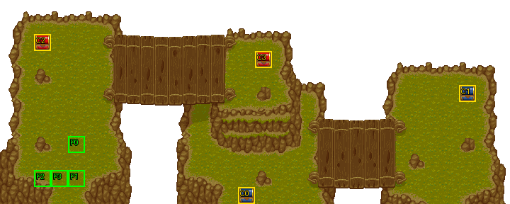

# 第 6 章　帝國軍追擊

<!-- chapter_docs:header -->
| 項目 | 內容 |
| --- | --- |
| 章號／章節索引 | 6／5 |
| 章名（文字區塊 `0x01`） | 帝國軍追擊 |
| 勝利條件（`0x02`） | 敵人全滅 |
| 敗北條件（`0x03`） | 蘭迪斯﹑法蓮娜﹑索爾／任一人死亡 |
| 戰場 | `MAP05.DAT`／`MAP05.COD`／`M05.DTL`，30×12 格，我方 slot 4 個，部署記錄 32 筆 |
| 文字區塊 | `FDETXT06.TXT`，14 條 |
| 進入處理（`0x60074`[5]） | `fdps_chapter_06_init`（`0x20ff0`） |
| 行動後檢查（`0x6028c`[5]） | `fdps_chapter_06_post_action`（`0x3a640`） |
| 勝利處理（`0x60304`[5]） | `fdps_chapter_06_end`（`0x3a670`） |
| 地圖資料呼叫的事件處理（`0x601c4`） | slot 8：`fdps_chapter_06_event_deploy_wave_2`（`0x37170`）（死亡腳本） |
| 過場腳本 | `ICON05.DAT`（開場）、`WIN05.DAT`（勝利） |
| 本章之前的村莊 | `SHOP05.DAT` |
| 光碟 | 第 1 片（音軌見 [CD 音軌](../program_info/cd_audio.md)） |



戰場全圖（第 0 層與同步捲動的圖層）。框線：黃 `C` 寶箱、橘 `B` 埋藏格、青 `R` 重繪格、洋紅 `E` 有處理函式的格子事件格，字母後的數字是事件碼；綠 `P` 是我方 slot 的起始格。

視差圖層另存一張：

圖由 `python tools/chapter_docs/chapter_facts.py render-maps` 從遊戲檔重畫到 `chapters/maps/`，`verify-maps` 逐 byte 比對版控中的圖。
<!-- /chapter_docs:header -->

## 概要

蘭迪斯一行帶著羅特帝亞的國王索爾逃亡，來到一處由兩座橋連起來的斷崖。蘭迪斯說過了這裡就能擺脫追兵，尤利安祈求神的保佑；話才說完，一名步兵從上方的橋走來發現了他們，喊著「賞金是我們的了」，大批穿著羅特帝亞制服的追兵隨即現身。索爾怒斥這群人污辱羅特帝亞，蘭迪斯要他冷靜，決定殺過橋去（開場過場 `ICON05.DAT`）。

戰場由左而右是三塊台地：隊伍與索爾從左側台地的下方出發，左側上方有一群主動出擊的追兵；上方的橋通往中央台地，那裡有一群守在原地的部隊；下方的橋通往右側台地，另一群守軍盤踞在那裡。右側守軍中有一名騎兵是伏兵的暗號：他一倒下，第二批追兵就出現在左下隊伍出發的地方，索爾喊出「是伏兵，大家小心！」，場上所有敵人（連同索爾）改為全力進攻。

敵人全滅後，勝利過場 `WIN05.DAT` 切到另一張場景地圖：索爾向蘭迪斯道歉，說這一切都是他的任性引起，他必須自己負責，感謝這段快樂的日子後獨自離去。蘭迪斯與同伴目送這位羅特帝亞的王者離開。

## 加入與離隊

本章沒有人入隊，隊伍仍是第 1–4 章加入的蘭迪斯、尤利安、亞克、法蓮娜四人（入隊規則見 [`assets/characters.md` 的「加入」](../assets/characters.md#加入)）。`MAP05.DAT` 要 4 個我方 slot，與隊伍人數剛好相同。

索爾（角色編號 `0C`）不是隊員，而是 `MAP05.DAT` 第 31 筆波次 0 部署記錄（陣營 1 的 NPC，LV 10），由電腦控制；他在地圖單位陣列排在四名隊員之後，是單位 5。勝利過場裡他告別離去，這是他以友方英雄同行的最後一章；之後他再以友方身分登場是在 [第 26 章](ch26.md)。

## 勝敗條件與特殊機制

- **勝利**：陣營 0 的單位全部退場。判定在共用的 `fdps_battle_check_default_end_conditions`（`0x3a2e0`），由本章的行動後處理 `fdps_chapter_06_post_action`（`0x3a640`）呼叫。
- **敗北：蘭迪斯**：共用判定看單位索引 0 是否退場。
- **敗北：法蓮娜**：`fdps_chapter_06_post_action`（`0x3a640`）另外呼叫 `fdps_unit_is_retired`（`0x109b0`）看**單位索引 3**，退場就寫敗北。索引 3 是法蓮娜，是因為名冊依入隊順序填進 slot 0–3，程式碼裡是單位位置而不是角色編號。這一寫不看結束碼現值、排在共用判定之後，所以同一次行動裡清光敵人又失去法蓮娜，結果是敗北。
- **敗北：索爾**：不在任何處理函式裡，而是索爾那筆部署記錄的死亡腳本（opcode 5、運算元 255：不畫文字，之後敗北），由 `fdps_run_death_scripts`（`0x1d990`）執行。

畫面上的勝敗條件文字（`0x02`、`0x03`）與程式一致，三個敗北條件各由不同的地方實作。

**伏兵**：`MAP05.DAT` 第 7 筆記錄（右側台地錨點 (23, 8) 的 `58` 騎兵，AI 行為 2 守在原地）帶死亡腳本 opcode 2、事件 slot 8。他被打倒時，`fdps_run_death_scripts`（`0x1d990`）以擊殺者的單位索引呼叫 `fdps_chapter_06_event_deploy_wave_2`（`0x37170`），部署波次 2 並讓全場轉為進攻（步驟見「處理流程」）。死亡腳本在同一次行動的行動後判定之前就執行完，所以用攻擊、法術或道具打倒他時，波次 2 一定在勝負判定之前出場，「敵人全滅」必須連伏兵一起清光。同一個陣營的另一名右側騎兵（第 24 筆，錨點 (26, 9)）沒有死亡腳本，打倒他不會觸發。

**總攻擊連索爾一起改寫**：伏兵事件把單位索引 4 到 `0x22` 的 AI 行為低 4 bit 全部改成 0（最佳行動，否則走向路徑最近的對手）。這個範圍是寫死的常數，包含索引 5 的索爾，所以伏兵出現後索爾不再跟著蘭迪斯（行為 3），改成自己衝向最近的敵人；範圍不含最後一個伏兵（索引 `0x23`），但伏兵的記錄本來就是行為 0，沒有差別。實際被改動的是波次 1 裡 16 名守在原地（行為 2）的敵人與索爾。

**中毒致死不跑死亡腳本**：陣營階段開始時的中毒扣血由 `fdps_battle_tick_status_effects`（`0x1fa30`）結算，它把 HP 歸 0 的單位直接交給 `fdps_play_death_animation_and_mark_dead`（`0x1d6c0`）標成退場，沒有經過收集死亡腳本的 `fdps_collect_death_scripts`（`0x26180`）或 `fdps_collect_death_script_events`（`0x274e0`）。本章因此有兩個後果：

- 第 7 筆騎兵若是中毒而死，波次 2 永遠不出場、伏兵台詞不會出現，清光其餘敵人即可過關。本章之前的武器店（`SHOP05.DAT`）有賣帶中毒效果的黑暗之杖（[`assets/shops.md`](../assets/shops.md)）。
- 敵方魔導士都拿黑暗之杖；索爾若中毒而死，他的敗北死亡腳本不會執行，戰鬥照常繼續。

中毒的扣血與倒數規則見 [`program_info/battle.md`](../program_info/battle.md)。

本章沒有回合事件、格子事件，也沒有回合限制。

## 敵人配置

進入戰場時只有兩筆波次 0 記錄在場：開場過場裡發現隊伍的那名步兵（第 0 筆），與 NPC 索爾。其餘 23 名追兵（波次 1）在開場過場 `ICON05.DAT` 的 `DEPLOY_WAVE` 出場，戰鬥開始時一共 29 個單位：

- 左側台地上方 7 名（錨點 (4–7, 3–4)：步兵、騎兵、弓兵各 2，魔導士 1）是行為 0，主動出擊。
- 中央台地 7 名（錨點 (13–16, 3–5)）與右側台地 9 名（錨點 (23–26, 7–9)）是行為 2，對手不進入攻擊範圍就原地不動。
- 右側的第 7 筆騎兵是伏兵的觸發者。

波次 2 的 7 名（步兵 3、弓兵 2、騎兵 1、魔導士 1，全是行為 0）在第 7 筆騎兵倒下時出現在左下角——錨點 (2–5, 8–9) 正是隊伍的出發區，以找最近空格的方式放置。同時全場守軍改為進攻。本章沒有搶寶箱或會離場的敵人。

<!-- chapter_docs:deployments -->
陣營與死亡腳本的意義見 [`resource_info/map.md`](../resource_info/map.md)，AI 行為（低 4 bit）見 [`program_info/map_ai.md`](../program_info/map_ai.md#行為代碼)；錨點是 `MAPnn.COD` 的座標，開場波次放在錨點上，其餘波次依部署方式放在錨點或最近的空格。單位名是全域文字的「角色編號 + 1」條；角色編號 `3C` 以上的敵兵，數值（`ENEMYDAT.DAT`）與種族、職業見 [`assets/enemies.md`](../assets/enemies.md)，以下的見 [`assets/characters.md`](../assets/characters.md)。

我方起始格：slot 0 (4, 8)、slot 1 (4, 10)、slot 2 (2, 10)、slot 3 (3, 10)。

| 波次 | 陣營 | 單位 | 等級 | 數量 |
| ---: | --- | --- | --- | ---: |
| 0 | 敵方 | `62` 步兵 | 10 | 1 |
| 0 | NPC | `0C` 索爾 | 10 | 1 |
| 1 | 敵方 | `62` 步兵 | 10 | 8 |
| 1 | 敵方 | `58` 騎兵 | 8 | 5 |
| 1 | 敵方 | `5D` 弓兵 | 9 | 7 |
| 1 | 敵方 | `66` 魔導士 | 10 | 3 |
| 2 | 敵方 | `62` 步兵 | 10 | 3 |
| 2 | 敵方 | `5D` 弓兵 | 9 | 2 |
| 2 | 敵方 | `58` 騎兵 | 8 | 1 |
| 2 | 敵方 | `66` 魔導士 | 10 | 1 |

### 波次 0

出場：進入戰場時由 `fdps_build_map_unit_array`（`0x22be0`） 部署在錨點上

| # | 陣營 | 單位 | 等級 | AI 行為 | 錨點 | 死亡腳本 |
| ---: | --- | --- | ---: | --- | --- | --- |
| 0 | 敵方 | `62` 步兵 | 10 | 0 主動 | (15, 4) | — |
| 31 | NPC | `0C` 索爾 | 10 | 3 追角色：`00` 蘭迪斯 | (3, 8) | 不畫文字，之後敗北 |

### 波次 1

出場：開場過場 `ICON05.DAT` `0x053` 的 `DEPLOY_WAVE`（找最近空格），由 `fdps_chapter_06_init`（`0x20ff0`）執行，戰鬥開始前一定出場

| # | 陣營 | 單位 | 等級 | AI 行為 | 錨點 | 死亡腳本 |
| ---: | --- | --- | ---: | --- | --- | --- |
| 1 | 敵方 | `62` 步兵 | 10 | 0 主動 | (5, 4) | — |
| 2 | 敵方 | `62` 步兵 | 10 | 0 主動 | (4, 3) | — |
| 3 | 敵方 | `62` 步兵 | 10 | 2 原地 | (13, 3) | — |
| 4 | 敵方 | `62` 步兵 | 10 | 2 原地 | (13, 4) | — |
| 5 | 敵方 | `58` 騎兵 | 8 | 0 主動 | (5, 3) | — |
| 6 | 敵方 | `58` 騎兵 | 8 | 0 主動 | (7, 3) | — |
| 7 | 敵方 | `58` 騎兵 | 8 | 2 原地 | (23, 8) | 事件 slot 8：`fdps_chapter_06_event_deploy_wave_2`（`0x37170`） |
| 8 | 敵方 | `5D` 弓兵 | 9 | 0 主動 | (6, 3) | — |
| 9 | 敵方 | `5D` 弓兵 | 9 | 0 主動 | (7, 4) | — |
| 10 | 敵方 | `5D` 弓兵 | 9 | 2 原地 | (14, 3) | — |
| 11 | 敵方 | `5D` 弓兵 | 9 | 2 原地 | (14, 4) | — |
| 12 | 敵方 | `66` 魔導士 | 10 | 0 主動 | (6, 4) | — |
| 13 | 敵方 | `66` 魔導士 | 10 | 2 原地 | (14, 5) | — |
| 14 | 敵方 | `5D` 弓兵 | 9 | 2 原地 | (25, 9) | — |
| 15 | 敵方 | `5D` 弓兵 | 9 | 2 原地 | (25, 8) | — |
| 16 | 敵方 | `5D` 弓兵 | 9 | 2 原地 | (16, 5) | — |
| 17 | 敵方 | `62` 步兵 | 10 | 2 原地 | (26, 8) | — |
| 18 | 敵方 | `62` 步兵 | 10 | 2 原地 | (23, 9) | — |
| 23 | 敵方 | `58` 騎兵 | 8 | 2 原地 | (16, 4) | — |
| 24 | 敵方 | `58` 騎兵 | 8 | 2 原地 | (26, 9) | — |
| 27 | 敵方 | `66` 魔導士 | 10 | 2 原地 | (25, 7) | — |
| 29 | 敵方 | `62` 步兵 | 10 | 2 原地 | (24, 8) | — |
| 30 | 敵方 | `62` 步兵 | 10 | 2 原地 | (24, 7) | — |

### 波次 2

出場：第 7 筆記錄（右側錨點 (23, 8) 的 `58` 騎兵）被攻擊、法術或道具打倒時，死亡腳本呼叫事件 slot 8 的 `fdps_chapter_06_event_deploy_wave_2`（`0x37170`），以找最近空格的方式部署在左下；他若中毒而死則不會出場

| # | 陣營 | 單位 | 等級 | AI 行為 | 錨點 | 死亡腳本 |
| ---: | --- | --- | ---: | --- | --- | --- |
| 19 | 敵方 | `62` 步兵 | 10 | 0 主動 | (3, 8) | — |
| 20 | 敵方 | `62` 步兵 | 10 | 0 主動 | (4, 8) | — |
| 21 | 敵方 | `5D` 弓兵 | 9 | 0 主動 | (3, 9) | — |
| 22 | 敵方 | `5D` 弓兵 | 9 | 0 主動 | (4, 9) | — |
| 25 | 敵方 | `58` 騎兵 | 8 | 0 主動 | (2, 9) | — |
| 26 | 敵方 | `66` 魔導士 | 10 | 0 主動 | (5, 9) | — |
| 28 | 敵方 | `62` 步兵 | 10 | 0 主動 | (5, 8) | — |
<!-- /chapter_docs:deployments -->

## 寶物

本章沒有處理函式發放的物品，也沒有搶寶箱（AI 行為 5）的敵人；寶物只有下表四個寶箱。

<!-- chapter_docs:treasure -->
搜尋的規則（同碼的格共用一筆記錄與一個旗標、背包滿時的交換）見 [`resource_info/map.md`](../resource_info/map.md)。

| 事件碼 | 格 | 內容 |
| ---: | --- | --- |
| 0 | (14, 11) 寶箱 | `B5` 回復劑 |
| 1 | (27, 5) 寶箱 | `05` 寬刃劍 |
| 2 | (2, 2) 寶箱 | `B8` 魔法水 |
| 3 | (15, 3) 寶箱 | 2000 金 |

本章沒有擊倒掉落。
<!-- /chapter_docs:treasure -->

## 村莊

<!-- chapter_docs:village -->
第 5 章勝利後、本章之前的村莊載入 `SHOP05.DAT`，道具店、武器店、秘密商店的貨見 [`assets/shops.md`](../assets/shops.md)。村莊載入的文字區塊是 `FDETXT06`（章節索引 + 1，`fdps_load_field_chapter_resources`（`0x31540`）），也就是本章的區塊，所以村莊畫面的文字是本章區塊的 `0x04`–`0x08`，全文在下方「對話」。
<!-- /chapter_docs:village -->

## 處理流程

### 進入：`fdps_chapter_06_init`（`0x20ff0`）

1. `fdps_chapter_state_reset`（`0x22750`）：重建戰場，`fdps_build_map_unit_array`（`0x22be0`）放上四名隊員與波次 0 的兩筆記錄（步兵與索爾）。
2. `fdps_icon_script_run`（`0x21650`）執行開場過場 `ICON05.DAT`：對話 `0x09`、步兵走來、對話 `0x0a`，接著 `DEPLOY_WAVE` 部署波次 1。
3. `fdps_show_chapter_title_card`（`0x20c60`）顯示章名卡（排在開場過場之後）。
4. `fdps_map_cursor_move_to_unit`（`0x2da50`）把游標放在單位 0（蘭迪斯）。

本章沒有名冊加入，也不改任何單位的狀態。

### 行動後檢查：`fdps_chapter_06_post_action`（`0x3a640`）

1. 呼叫共用判定 `fdps_battle_check_default_end_conditions`（`0x3a2e0`）：結束碼已非 0 就不動；否則陣營 0 全部退場記過關，單位 0 退場記敗北。
2. `fdps_unit_is_retired`（`0x109b0`）看單位索引 3（法蓮娜），退場就無條件把結束碼寫成 1（敗北）。

### 勝利：`fdps_chapter_06_end`（`0x3a670`）

1. `fdps_battle_destroy_remaining_enemies`（`0x39e10`）清掉陣營 0 的殘兵（本章到這裡通常已經沒有）。
2. `fdps_roster_write_back_battle_units`（`0x23980`）把戰場上的隊員寫回名冊。
3. `fdps_icon_script_run`（`0x21650`）執行勝利過場 `WIN05.DAT`：切到地圖 46，索爾告別離去。
4. `fdps_roster_revive_fallen_members`（`0x39e70`）讓陣亡的隊員復活。
5. 章節索引設為 6，下一段是第 7 章之前的村莊，接著是 [第 7 章](ch07.md)。

本章不給任何獎勵。

### 伏兵：`fdps_chapter_06_event_deploy_wave_2`（`0x37170`）

由第 7 筆騎兵的死亡腳本（事件 slot 8）呼叫，本體沒有一次性閂鎖也不看回合數，只觸發一次是因為地圖資料只有這一筆記錄指向它。

1. `fdps_deploy_wave`（`0x23830`）部署本地圖的波次 2，以找最近空格的方式放在左下錨點附近；7 名伏兵成為單位 `0x1d`–`0x23`。
2. `fdps_map_cursor_move_to_unit`（`0x2da50`）把游標移到單位 `0x1e`（第二名伏兵）。
3. `fdps_render_view_frame`（`0x2beb0`）停留 12 幀讓玩家看到伏兵。
4. `fdps_draw_text`（`0x1ff60`）顯示本章文字 `0x0d`：索爾說「是伏兵，大家小心！」。
5. 單位索引 4 到 `0x22` 的 AI 行為低 4 bit 改成 0、高 4 bit 保留：全場守軍與索爾轉為進攻。

## 回合事件與格子事件

<!-- chapter_docs:events -->
觸發時機與陣營階段的意義見 [`resource_info/map.md`](../resource_info/map.md)。

本章沒有回合事件。

本章沒有格子事件。

死亡腳本裡的事件與文字：

| # | 單位 | 波次 | 死亡腳本 |
| ---: | --- | ---: | --- |
| 7 | `58` 騎兵 | 1 | 事件 slot 8：`fdps_chapter_06_event_deploy_wave_2`（`0x37170`） |
| 31 | `0C` 索爾 | 0 | 不畫文字，之後敗北 |
<!-- /chapter_docs:events -->

## 過場腳本

<!-- chapter_docs:scripts -->
格式與每個指令的意義見 [`resource_info/cutscene_script.md`](../resource_info/cutscene_script.md)。`FDETXT06#0xNN` 是本章文字區塊的條目，全文在下方「對話」；切到額外場景之後顯示的文字直接列出（那些區塊的正典是 [`assets/text/scene_text.md`](../assets/text/scene_text.md)）。`u3=我方1` 是地圖單位索引 3 對到我方 slot 1，`u12=MAP02#9` 是 `MAP02.DAT` 第 9 筆部署記錄。

### `ICON05.DAT`

- 開場：`fdps_chapter_06_init`（`0x20ff0`）
- 99 byte、19 步；起始地圖 5，切換地圖 無，結束於地圖 5

| 偏移 | 指令 | 內容 |
| ---: | --- | --- |
| `0000` | `SET_MUSIC` | 音樂 19（CD 第 20 軌） |
| `0002` | `SCROLL_VIEW` | 捲動視野到格 (0, 1) |
| `0005` | `FACE_UNITS` | 轉向後停 1 幀：u0=我方0朝上、u1=我方1朝上、u2=我方2朝上、u3=我方3朝上、u5=MAP05#31(角色0x0c)朝上 |
| `0012` | `WALK_UNITS` | 行走 1 格，每步 4 幀：u0=我方0往上、u5=MAP05#31(角色0x0c)往上 |
| `001a` | `FACE_UNITS` | 轉向後停 25 幀：u0=我方0朝左、u5=MAP05#31(角色0x0c)朝右 |
| `0021` | `DRAW_TEXT` | 顯示文字 FDETXT06#0x09 |
| `0023` | `FACE_UNITS` | 轉向後停 25 幀：u0=我方0朝上、u5=MAP05#31(角色0x0c)朝上 |
| `002a` | `FACE_UNITS` | 轉向後停 1 幀：u4=MAP05#0(角色0x62)朝左 |
| `002f` | `WALK_UNITS` | 行走 7 格，每步 4 幀：u4=MAP05#0(角色0x62)往左 |
| `0035` | `FACE_UNITS` | 轉向後停 50 幀：u4=MAP05#0(角色0x62)朝下 |
| `003a` | `WALK_UNITS` | 行走 5 格，每步 1 幀：u4=MAP05#0(角色0x62)往左 |
| `0040` | `WALK_UNITS` | 行走 2 格，每步 2 幀：u4=MAP05#0(角色0x62)往下、u0=我方0往下、u5=MAP05#31(角色0x0c)往下 |
| `004a` | `FACE_UNITS` | 轉向後停 1 幀：u0=我方0朝上、u5=MAP05#31(角色0x0c)朝上 |
| `0051` | `DRAW_TEXT` | 顯示文字 FDETXT06#0x0a |
| `0053` | `DEPLOY_WAVE` | 部署 MAP05 波次 1（找最近空格）：#1(角色0x62)、#2(角色0x62)、#3(角色0x62)、#4(角色0x62)、#5(角色0x58)、#6(角色0x58)、#7(角色0x58)、#8(角色0x5d)、#9(角色0x5d)、#10(角色0x5d)、#11(角色0x5d)、#12(角色0x66)、#13(角色0x66)、#14(角色0x5d)、#15(角色0x5d)、#16(角色0x5d)、#17(角色0x62)、#18(角色0x62)、#23(角色0x58)、#24(角色0x58)、#27(角色0x66)、#29(角色0x62)、#30(角色0x62) |
| `0056` | `FACE_UNITS` | 轉向後停 1 幀：u4=MAP05#0(角色0x62)朝上 |
| `005b` | `FACE_UNITS` | 轉向後停 25 幀：u4=MAP05#0(角色0x62)朝下 |
| `0060` | `SET_MUSIC` | 停止音樂 |
| `0062` | `END` | 結束 |

### `WIN05.DAT`

- 勝利：`fdps_chapter_06_end`（`0x3a670`）
- 136 byte、38 步；起始地圖 5，切換地圖 46，結束於地圖 46

| 偏移 | 指令 | 內容 |
| ---: | --- | --- |
| `0000` | `FADE_OUT` | 淡出，每步 40 ms |
| `0002` | `SET_MUSIC` | 音樂 20（CD 第 21 軌） |
| `0004` | `SWITCH_MAP` | 切換地圖 → 46（MAP46，文字 FDETXT47） |
| `0006` | `FACE_UNITS` | 轉向後停 1 幀：u5=MAP46#9(角色0x0c)朝下 |
| `000b` | `FADE_IN` | 淡入，每步 40 ms |
| `000d` | `WALK_UNITS` | 行走 1 格，每步 4 幀：u5=MAP46#9(角色0x0c)往左 |
| `0013` | `FACE_UNITS` | 轉向後停 10 幀：u5=MAP46#9(角色0x0c)朝右 |
| `0018` | `WALK_UNITS` | 行走 1 格，每步 4 幀：u5=MAP46#9(角色0x0c)往右 |
| `001e` | `FACE_UNITS` | 轉向後停 15 幀：u5=MAP46#9(角色0x0c)朝下 |
| `0023` | `RETIRE_UNIT` | 退場 u5=MAP46#9(角色0x0c) |
| `0025` | `PLAY_SAF` | 播放動畫 ICON0020.SAF |
| `0027` | `REVIVE_UNIT` | 復歸 u5=MAP46#9(角色0x0c)（清狀態） |
| `0029` | `DRAW_TEXT` | 顯示文字 FDETXT47#0x09 「{speaker char=12}對不起，蘭迪斯﹒﹒﹒{br}讓你們捲進這場麻煩，{br}這事自始至終，{page}都是因我的任性引起，{br}我必須要為它負責！{br}謝謝你們，{page}給我這段快樂的日子。{br}蘭迪斯，希望有一天，{br}還能再看見你，{page}再見了！﹒﹒﹒﹒」 |
| `002b` | `FACE_UNITS` | 轉向後停 15 幀：u5=MAP46#9(角色0x0c)朝左 |
| `0030` | `FACE_UNITS` | 轉向後停 15 幀：u5=MAP46#9(角色0x0c)朝左 |
| `0035` | `FACE_UNITS` | 轉向後停 15 幀：u5=MAP46#9(角色0x0c)朝下 |
| `003a` | `WALK_UNITS` | 行走 5 格，每步 2 幀：u5=MAP46#9(角色0x0c)往下 |
| `0040` | `RETIRE_UNIT` | 退場 u5=MAP46#9(角色0x0c) |
| `0042` | `RETIRE_UNIT` | 退場 u0=MAP46#0(角色0x8f) |
| `0044` | `RETIRE_UNIT` | 退場 u1=MAP46#5(角色0x94) |
| `0046` | `DEPLOY_WAVE` | 部署 MAP46 波次 1（錨點原位）：#1(角色0x00) |
| `0049` | `FACE_UNITS` | 轉向後停 15 幀：u6=MAP46#1(角色0x00)朝下 |
| `004e` | `RETIRE_UNIT` | 退場 u2=MAP46#6(角色0x95) |
| `0050` | `DEPLOY_WAVE` | 部署 MAP46 波次 2（錨點原位）：#2(角色0x01) |
| `0053` | `FACE_UNITS` | 轉向後停 15 幀：u7=MAP46#2(角色0x01)朝下 |
| `0058` | `RETIRE_UNIT` | 退場 u3=MAP46#7(角色0x96) |
| `005a` | `DEPLOY_WAVE` | 部署 MAP46 波次 4（錨點原位）：#4(角色0x06) |
| `005d` | `FACE_UNITS` | 轉向後停 15 幀：u8=MAP46#4(角色0x06)朝下 |
| `0062` | `RETIRE_UNIT` | 退場 u4=MAP46#8(角色0x97) |
| `0064` | `DEPLOY_WAVE` | 部署 MAP46 波次 3（錨點原位）：#3(角色0x04) |
| `0067` | `FACE_UNITS` | 轉向後停 15 幀：u9=MAP46#3(角色0x04)朝下 |
| `006c` | `WALK_UNITS` | 行走 1 格，每步 2 幀：u6=MAP46#1(角色0x00)往下 |
| `0072` | `WALK_UNITS` | 行走 2 格，每步 3 幀：u7=MAP46#2(角色0x01)往下 |
| `0078` | `WALK_UNITS` | 行走 2 格，每步 3 幀：u7=MAP46#2(角色0x01)往右 |
| `007e` | `DRAW_TEXT` | 顯示文字 FDETXT47#0x0a 「{speaker char=0}他﹒﹒他還是走了﹒﹒{br}{speaker char=1}蘭迪斯，不要傷心﹒﹒{br}身為羅特帝亞的國王，{br}他有他的尊嚴苦衷﹒﹒{br}{speaker char=4}他不願拖累我們。{br}不論敵人有多可怕，{br}他也要獨自面對敵人。{page}唉～！{br}不愧是傳說中的英雄！{br}{speaker char=6}每個人的一生中，{br}都有順境與逆境。{page}唯一不同之處在於，{br}勇敢的人選擇去面對，{br}膽小的人卻選擇逃避。{page}現在的他，{br}選擇了自己要走的路。{br}再見了！{page}羅特帝亞的王者！{br}我們不會忘記你的。」 |
| `0080` | `FACE_UNITS` | 轉向後停 25 幀：u0=MAP46#0(角色0x8f)朝下 |
| `0085` | `SET_MUSIC` | 停止音樂 |
| `0087` | `END` | 結束 |
<!-- /chapter_docs:scripts -->

## 對話

`0x0b`、`0x0c` 是勝利對話的另一份複本，勝利過場切到地圖 46 之後畫的是那張地圖文字區塊裡的版本，本章區塊的兩條不會出現。

<!-- chapter_docs:dialogue -->
`FDETXT06.TXT` 全部 14 條，依條目編號排列。每條先列讀取端（顯示它的腳本步驟、處理函式或死亡腳本），再列全文：【名稱】是換說話者（頭像取自括號裡的角色編號；【地圖單位 n】取執行當下第 n 個地圖單位），每一行是一次換行，▼ 是換頁（等按鍵）。`{subst1}`、`{subst2}`、`{number}` 是執行期代入的名稱與數字（[`resource_info/text.md`](../resource_info/text.md)）。

### `0x00`

永遠不會顯示：章名卡是 `MISC.VFS` 的 `CHAPTER.SAF` 圖（`fdps_show_chapter_title_card`（`0x20c60`）），沒有任何程式或腳本畫本章的 0x00，見 [S13a（排除清單）](../cut_content/_index.md#排除清單)。

### `0x01`

讀取端：`fdps_draw_save_slot_panel`（`0x24a40`）

```text
帝國軍追擊
```

### `0x02`

讀取端：`fdps_battle_show_win_fail_window`（`0x17ca0`）

```text
敵人全滅
```

### `0x03`

讀取端：`fdps_battle_show_win_fail_window`（`0x17ca0`）

```text
蘭迪斯﹑法蓮娜﹑索爾
任一人死亡
```

### `0x04`

讀取端：`fdps_village_item_menu`（`0x35860`）

```text
噓！不要再問了！
▼
```

### `0x05`

讀取端：`fdps_run_weapon_shop`（`0x35fd0`）

```text
情勢改變了，
您就不要再追問了！
▼
```

### `0x06`

讀取端：`fdps_run_bar_shop`（`0x35cc0`）

```text
隱藏的商店？
「秘密」就是「秘密」
你要自己猜嘛！
▼
```

### `0x07`

讀取端：`fdps_run_church_screen`（`0x35aa0`）

```text
唉！神啊！
請保佑這些勇敢的人！
▼
```

### `0x08`

讀取端：`fdps_run_secret_menu`（`0x36210`）

```text
東西雖然貴了點！
但很實用喔！
▼
```

### `0x09`

讀取端：`ICON05.DAT` `0x021`

```text
【蘭迪斯】（角色 0）
過了這裡，
我們就擺脫追兵了。
【尤利安】（角色 6）
呼～！
感謝神的保佑，
但願是如此！
```

### `0x0a`

讀取端：`ICON05.DAT` `0x051`

```text
【步兵】（角色 98）
找到了！找到了！
快把他們捉起來！
賞金是我們的了！～
【索爾】（角色 12）
可惡！這群無恥的人！
偏偏穿著我國的制服，
簡直污辱羅特帝亞！
【蘭迪斯】（角色 0）
冷靜一點！
來吧！
我們現在就過橋！
```

### `0x0b`

永遠不會顯示：勝利腳本 `WIN05.DAT` 先 `SWITCH_MAP` 到地圖 46 才畫文字，畫的是 `FDETXT47` 的 0x09 副本；本章區塊的 0x0b 沒有讀取端，見 [S13b（排除清單）](../cut_content/_index.md#排除清單)。

### `0x0c`

永遠不會顯示：勝利腳本畫的是 `FDETXT47` 的 0x0a 副本，本章區塊的 0x0c 沒有讀取端，見 [S13b（排除清單）](../cut_content/_index.md#排除清單)。

### `0x0d`

讀取端：`fdps_chapter_06_event_deploy_wave_2`（`0x37170`）

```text
【索爾】（角色 12）
是伏兵，大家小心！
```
<!-- /chapter_docs:dialogue -->
