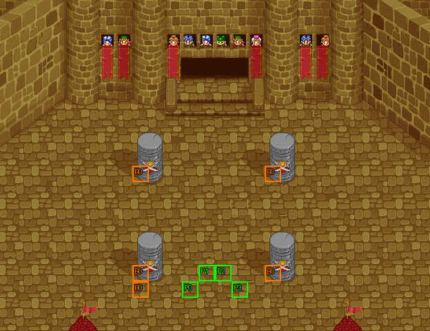

# 第 7 章　競技場戰士

<!-- chapter_docs:header -->
| 項目 | 內容 |
| --- | --- |
| 章號／章節索引 | 7／6 |
| 章名（文字區塊 `0x01`） | 競技場戰士 |
| 勝利條件（`0x02`） | 敵人全滅 |
| 敗北條件（`0x03`） | 蘭迪斯死亡 |
| 戰場 | `MAP06.DAT`／`MAP06.COD`／`M06.DTL`，26×20 格，我方 slot 4 個，部署記錄 5 筆 |
| 文字區塊 | `FDETXT07.TXT`，16 條 |
| 進入處理（`0x60074`[6]） | `fdps_chapter_07_init`（`0x21030`） |
| 行動後檢查（`0x6028c`[6]） | `fdps_chapter_07_post_action`（`0x3a6b0`） |
| 勝利處理（`0x60304`[6]） | `fdps_chapter_07_end`（`0x3a6d0`） |
| 地圖資料呼叫的事件處理（`0x601c4`） | slot 9：`fdps_chapter_07_event_enemies_advance`（`0x37250`）（回合事件） |
| 過場腳本 | `ICON06.DAT`（開場）、`WIN06.DAT`（勝利） |
| 本章之前的村莊 | `SHOP06.DAT` |
| 光碟 | 第 1 片（音軌見 [CD 音軌](../program_info/cd_audio.md)） |



戰場全圖（第 0 層與同步捲動的圖層）。框線：黃 `C` 寶箱、橘 `B` 埋藏格、青 `R` 重繪格、洋紅 `E` 有處理函式的格子事件格，字母後的數字是事件碼；綠 `P` 是我方 slot 的起始格。

圖由 `python tools/chapter_docs/chapter_facts.py render-maps` 從遊戲檔重畫到 `chapters/maps/`，`verify-maps` 逐 byte 比對版控中的圖。
<!-- /chapter_docs:header -->

## 概要

蘭迪斯、法蓮娜、亞克、尤利安來到一座熱鬧的城鎮，看見牆上貼著一張榜單：「有意參加武鬥會者，請將此單撕下。裘娜」。亞克想跟武鬥會的高手較量，尤利安主張只看比賽別惹麻煩，法蓮娜也要大家快走；榜單還是被撕了下來。圍觀的人說好久沒人敢撕榜單，尤利安叫苦，蘭迪斯說現在說什麼也沒用了，亞克則是「打就打嘛」（開場過場 `ICON06.DAT` 的前半，在場景地圖 47 演出，文字取自 `FDETXT48`）。

場景切回競技場：四名傭兵從上方的大門走進場中分列兩側，接著傭兵團的首領裘娜入場，一路走到隊伍面前，高興今年終於有人敢挑戰，要他們拿出壓箱本領、千萬不要手下留情；法蓮娜害怕，尤利安說「如果上帝保佑我的話」就沒問題（對話 `0x0b`）。

打倒全部五人後，勝利過場 `WIN06.DAT` 讓裘娜自我介紹是幹了多年的傭兵，說要把一千個金幣的獎金交給他們（對話 `0x0c`）；一段動畫之後蘭迪斯喊手好痛，裘娜笑說自己還醉著，接著宣布加入隊伍——獎金被贏走了，以後的酒錢飯錢要他們負責；亞克抗議，被裘娜一瞪就改口（對話 `0x0d`）。台詞裡的一千金幣實際上沒有發放，見「勝敗條件與特殊機制」。

## 加入與離隊

裘娜（角色編號 `03`，戰士）在本章的進入處理 `fdps_chapter_07_init`（`0x21030`）一開頭就以 `fdps_roster_add_character`（`0x23bc0`）無條件入隊，落在名冊 slot 4（入隊規則與名冊記錄見 [`assets/characters.md` 的「加入」](../assets/characters.md#加入)）。

她入隊了卻不在本章上場：`MAP06.DAT` 只宣告 4 個我方 slot，由名冊前 4 位的蘭迪斯、尤利安、亞克、法蓮娜填滿；裘娜第一次以隊員身分上場是 [第 8 章](ch08.md)。本章戰場上的「裘娜」是敵方部署記錄（肖像編號 `74`，`ENEMYDAT.DAT` 的另一個角色），與名冊上的裘娜在程式裡是兩個不同的角色，戰鬥結束時的寫回也不會拿敵方裘娜蓋掉名冊記錄。

本章沒有人離隊，也沒有 NPC 同行。

## 勝敗條件與特殊機制

- **勝利**：陣營 0 的單位全部退場。行動後處理 `fdps_chapter_07_post_action`（`0x3a6b0`）只呼叫共用判定 `fdps_battle_check_default_end_conditions`（`0x3a2e0`），沒有別的測試。
- **敗北：蘭迪斯**：同一個共用判定看單位索引 0 是否退場。

畫面上的勝敗條件（`0x02`「敵人全滅」、`0x03`「蘭迪斯死亡」）與程式一致。第 4–6 章的行動後處理都在共用判定之後另測單位索引 3（法蓮娜），本章沒有這一測：法蓮娜在本章陣亡不會敗北，過關後由 `fdps_roster_revive_fallen_members`（`0x39e70`）付費復活。

**五人全部由開場過場帶進場**：`MAP06.DAT` 沒有任何波次 0 的記錄，進入時的重建只放上四名隊員；四名傭兵（波次 1）與裘娜（波次 2）都由 `ICON06.DAT` 的 `DEPLOY_WAVE` 部署，戰鬥開始時一共 9 個單位，敵方是單位索引 4–8（傭兵 4–7、裘娜 8）。

**裘娜第 2 回合才出動**：裘娜的部署記錄是 AI 行為 2（最佳行動，否則原地不動），傭兵是行為 0（主動出擊）。回合事件（第 2 回合、敵方階段開始前、slot 9）呼叫 `fdps_chapter_07_event_enemies_advance`（`0x37250`），把單位索引 4–8 的行為低 4 bit 改成 0，裘娜從此主動進攻。所以第 1 回合敵方階段只有傭兵會衝過來，裘娜要到第 2 回合玩家行動結束後才離開原位（在那之前隊員進入她的攻擊範圍她照樣會打）。這個範圍是寫死的常數，恰好就是五名敵人。

**承諾的一千金幣不會發放**：勝利對話 `0x0c` 說「這是你贏的獎金，一千個金幣！」，但勝利處理 `fdps_chapter_07_end`（`0x3a6d0`）只做清場、寫回、過場、復活與推進章節，勝利過場 `WIN06.DAT` 也沒有任何改動金錢的指令（過場腳本的指令集沒有金錢指令，[`resource_info/cutscene_script.md`](../resource_info/cutscene_script.md)）。本章能拿到的只有埋藏的風精之羽與傭兵掉落的再生藥。

本章沒有格子事件，也沒有回合限制。

## 敵人配置

五名敵人全在開場過場出場，錨點都在競技場上方的大門口（`MAP06.COD`：裘娜 (12, 4)，傭兵 (12, 4)、(11, 4)、(13, 4)、(14, 4)），以找最近空格的方式放置，再由過場腳本走位：傭兵往下走進場、分列左右兩側，裘娜走到隊伍面前說完話後退回傭兵後方的中央。

- 波次 1：LV14 傭兵 4 名（`56`），行為 0，戰鬥一開始就進攻。第 4 筆那名帶死亡腳本，被我方打倒時掉落再生藥。
- 波次 2：LV15 裘娜（`74`），行為 2，第 2 回合敵方階段開始前改成行為 0。

本章沒有援軍、搶寶箱或會離場的敵人。

<!-- chapter_docs:deployments -->
陣營與死亡腳本的意義見 [`resource_info/map.md`](../resource_info/map.md)，AI 行為（低 4 bit）見 [`program_info/map_ai.md`](../program_info/map_ai.md#行為代碼)；錨點是 `MAPnn.COD` 的座標，開場波次放在錨點上，其餘波次依部署方式放在錨點或最近的空格。單位名是全域文字的「角色編號 + 1」條；角色編號 `3C` 以上的敵兵，數值（`ENEMYDAT.DAT`）與種族、職業見 [`assets/enemies.md`](../assets/enemies.md)，以下的見 [`assets/characters.md`](../assets/characters.md)。

我方起始格：slot 0 (11, 17)、slot 1 (12, 16)、slot 2 (13, 16)、slot 3 (14, 17)。

| 波次 | 陣營 | 單位 | 等級 | 數量 |
| ---: | --- | --- | --- | ---: |
| 1 | 敵方 | `56` 傭兵 | 14 | 4 |
| 2 | 敵方 | `74` 裘娜 | 15 | 1 |

### 波次 1

出場：開場過場 `ICON06.DAT` `0x0e4` 的 `DEPLOY_WAVE`（找最近空格，錨點在上方大門口），由 `fdps_chapter_07_init`（`0x21030`）執行，戰鬥開始前一定出場

| # | 陣營 | 單位 | 等級 | AI 行為 | 錨點 | 死亡腳本 |
| ---: | --- | --- | ---: | --- | --- | --- |
| 1 | 敵方 | `56` 傭兵 | 14 | 0 主動 | (12, 4) | — |
| 2 | 敵方 | `56` 傭兵 | 14 | 0 主動 | (11, 4) | — |
| 3 | 敵方 | `56` 傭兵 | 14 | 0 主動 | (13, 4) | — |
| 4 | 敵方 | `56` 傭兵 | 14 | 0 主動 | (14, 4) | 掉落 `B6` 再生藥 |

### 波次 2

出場：開場過場 `ICON06.DAT` `0x112` 的 `DEPLOY_WAVE`（找最近空格，錨點 (12, 4)），由 `fdps_chapter_07_init`（`0x21030`）執行，戰鬥開始前一定出場；第 2 回合敵方階段前 `fdps_chapter_07_event_enemies_advance`（`0x37250`）讓她改為進攻

| # | 陣營 | 單位 | 等級 | AI 行為 | 錨點 | 死亡腳本 |
| ---: | --- | --- | ---: | --- | --- | --- |
| 0 | 敵方 | `74` 裘娜 | 15 | 2 原地 | (12, 4) | — |
<!-- /chapter_docs:deployments -->

## 寶物

風精之羽埋在四根柱子旁的五個格子——(8, 10)、(16, 10)、(8, 16)、(16, 16)、(8, 17)——五格共用可搜尋格記錄 0 與同一個旗標，搜任一格都能拿到，但只拿得到一次；埋藏格搜過之後外觀不變。攻略站只寫了 (8, 17) 一格。

本章沒有處理函式發放的物品，也沒有搶寶箱的敵人；勝利台詞提到的一千金幣不存在（見上一節）。

<!-- chapter_docs:treasure -->
搜尋的規則（同碼的格共用一筆記錄與一個旗標、背包滿時的交換）見 [`resource_info/map.md`](../resource_info/map.md)。

| 事件碼 | 格 | 內容 |
| ---: | --- | --- |
| 0 | (8, 10) 埋藏、(16, 10) 埋藏、(8, 16) 埋藏、(16, 16) 埋藏、(8, 17) 埋藏 | `DD` 風精之羽（5 格共用，只拿得到一次） |

沒有任何格引用、拿不到的記錄：記錄 1（種類 0、內容 `B8`）、記錄 2（種類 0、內容 `B5`）、記錄 3（種類 0、內容 `B8`）、記錄 4（種類 1、內容 `BB8`），見 [I04](../cut_content/items.md#i04-章節地圖上沒有格子引用的寶物記錄)。

擊倒後掉落（死亡腳本 opcode 0／1，擊殺者須是存活的我方單位）：

| # | 單位 | 波次 | 掉落 |
| ---: | --- | ---: | --- |
| 4 | `56` 傭兵 | 1 | 掉落 `B6` 再生藥 |
<!-- /chapter_docs:treasure -->

## 村莊

<!-- chapter_docs:village -->
第 6 章勝利後、本章之前的村莊載入 `SHOP06.DAT`，道具店、武器店、秘密商店的貨見 [`assets/shops.md`](../assets/shops.md)。村莊載入的文字區塊是 `FDETXT07`（章節索引 + 1，`fdps_load_field_chapter_resources`（`0x31540`）），也就是本章的區塊，所以村莊畫面的文字是本章區塊的 `0x04`–`0x08`，全文在下方「對話」。
<!-- /chapter_docs:village -->

## 處理流程

### 進入：`fdps_chapter_07_init`（`0x21030`）

1. `fdps_roster_add_character`（`0x23bc0`）讓裘娜（`03`）入隊，落在名冊 slot 4。
2. `fdps_chapter_state_reset`（`0x22750`）重建戰場：`fdps_build_map_unit_array`（`0x22be0`）放上名冊前 4 位；本地圖沒有波次 0 的記錄，所以沒有敵人。
3. `fdps_icon_script_run`（`0x21650`）執行開場過場 `ICON06.DAT`：先切到場景地圖 47 演出撕榜單（文字 `FDETXT48` `0x09`–`0x0c`），再切回地圖 6 重建戰場，`DEPLOY_WAVE` 部署波次 1（`0x0e4`）與波次 2（`0x112`），裘娜說完對話 `0x0b`。
4. `fdps_show_chapter_title_card`（`0x20c60`）顯示章名卡（排在開場過場之後）。
5. `fdps_map_cursor_move_to_unit`（`0x2da50`）把游標放在單位 0（蘭迪斯）。

不改任何單位的狀態。

### 行動後檢查：`fdps_chapter_07_post_action`（`0x3a6b0`）

只呼叫共用判定 `fdps_battle_check_default_end_conditions`（`0x3a2e0`）：結束碼已非 0 就不動；否則陣營 0 全部退場記過關，單位 0 退場記敗北。

### 勝利：`fdps_chapter_07_end`（`0x3a6d0`）

1. `fdps_battle_destroy_remaining_enemies`（`0x39e10`）清掉陣營 0 的殘兵（到這裡通常已經沒有）。
2. `fdps_roster_write_back_battle_units`（`0x23980`）把戰場上的隊員寫回名冊。
3. `fdps_icon_script_run`（`0x21650`）執行勝利過場 `WIN06.DAT`：把隊員與裘娜擺到場中，對話 `0x0c`、動畫 `ICON0024.SAF`、對話 `0x0d`。
4. `fdps_roster_revive_fallen_members`（`0x39e70`）讓陣亡的隊員付費復活。
5. 章節索引設為 7，下一段是第 8 章之前的村莊，接著是 [第 8 章](ch08.md)。

不給任何獎勵。

### 敵人出動：`fdps_chapter_07_event_enemies_advance`（`0x37250`）

由 `MAP06.DAT` 唯一的回合事件（第 2 回合、陣營階段 0、slot 9）經 `fdps_battle_run_turn_events`（`0x2e0c0`）呼叫。

1. 把傳入的單位索引參數寫成 0（沒有任何效果）。
2. 單位索引 4 到 8（含）逐一以 `fdps_get_unit_record`（`0x2d210`）取出單位記錄，AI 行為低 4 bit 改成 0、高 4 bit 保留。實際改變的只有索引 8 的裘娜（行為 2 → 0）；傭兵本來就是 0。

沒有一次性閂鎖，也不看回合數；只觸發一次是因為地圖資料只有這一筆回合事件。

## 回合事件與格子事件

<!-- chapter_docs:events -->
觸發時機與陣營階段的意義見 [`resource_info/map.md`](../resource_info/map.md)。

| 回合 | 陣營階段 | slot | 處理函式 |
| ---: | --- | ---: | --- |
| 2 | 敵方階段前 | 9 | `fdps_chapter_07_event_enemies_advance`（`0x37250`） |

本章沒有格子事件。
<!-- /chapter_docs:events -->

## 過場腳本

`ICON06.DAT` 前半在場景地圖 47 演出，文字取自 `FDETXT48`；`0x0d2` 的 `SWITCH_MAP` 切回地圖 6 之後才是本章的戰場與本章的文字區塊。

<!-- chapter_docs:scripts -->
格式與每個指令的意義見 [`resource_info/cutscene_script.md`](../resource_info/cutscene_script.md)。`FDETXT07#0xNN` 是本章文字區塊的條目，全文在下方「對話」；切到額外場景之後顯示的文字直接列出（那些區塊的正典是 [`assets/text/scene_text.md`](../assets/text/scene_text.md)）。`u3=我方1` 是地圖單位索引 3 對到我方 slot 1，`u12=MAP02#9` 是 `MAP02.DAT` 第 9 筆部署記錄。

### `ICON06.DAT`

- 開場：`fdps_chapter_07_init`（`0x21030`）
- 557 byte、90 步；起始地圖 6，切換地圖 47 → 6，結束於地圖 6

| 偏移 | 指令 | 內容 |
| ---: | --- | --- |
| `0000` | `SET_MUSIC` | 音樂 15（CD 第 16 軌） |
| `0002` | `SWITCH_MAP` | 切換地圖 → 47（MAP47，文字 FDETXT48） |
| `0004` | `SET_VIEW_TILE` | 視野直接設到格 (7, 3) |
| `0007` | `FACE_UNITS` | 轉向後停 1 幀：u0=MAP47#0(角色0x00)朝左、u1=MAP47#1(角色0x01)朝左、u2=MAP47#2(角色0x04)朝左、u3=MAP47#3(角色0x06)朝左 |
| `0012` | `WALK_UNITS` | 行走 6 格，每步 3 幀：u0=MAP47#0(角色0x00)往左、u1=MAP47#1(角色0x01)往左、u2=MAP47#2(角色0x04)往左、u3=MAP47#3(角色0x06)往左 |
| `001e` | `SHAKE_VIEW` | 視野位移 8 步，每步 1 幀：(-6,0) (-12,0) (-18,0) (-24,0) (-30,0) (-36,0) (-42,0) (-48,0) |
| `0031` | `SET_VIEW_TILE` | 視野直接設到格 (5, 3) |
| `0034` | `FACE_UNITS` | 轉向後停 10 幀：u0=MAP47#0(角色0x00)朝上、u1=MAP47#1(角色0x01)朝上、u2=MAP47#2(角色0x04)朝左、u3=MAP47#3(角色0x06)朝右 |
| `003f` | `FACE_UNITS` | 轉向後停 10 幀：u0=MAP47#0(角色0x00)朝下 |
| `0044` | `DRAW_TEXT` | 顯示文字 FDETXT48#0x09 「{speaker char=1}哇！{br}這裡好熱鬧！」 |
| `0046` | `FACE_UNITS` | 轉向後停 10 幀：u0=MAP47#0(角色0x00)朝上 |
| `004b` | `DRAW_TEXT` | 顯示文字 FDETXT48#0x0a 「{speaker char=0}咦？{br}那裡好像貼著什麼？{br}我們去看看！」 |
| `004d` | `WALK_UNITS` | 行走 1 格，每步 2 幀：u0=MAP47#0(角色0x00)往上 |
| `0053` | `SHAKE_VIEW` | 視野位移 4 步，每步 1 幀：(0,-6) (0,-12) (0,-18) (0,-24) |
| `005e` | `SET_VIEW_TILE` | 視野直接設到格 (5, 2) |
| `0061` | `WALK_UNITS` | 行走 1 格，每步 2 幀：u2=MAP47#2(角色0x04)往上、u3=MAP47#3(角色0x06)往上 |
| `0069` | `FACE_UNITS` | 轉向後停 10 幀：u0=MAP47#0(角色0x00)朝下、u2=MAP47#2(角色0x04)朝左、u3=MAP47#3(角色0x06)朝右 |
| `0072` | `DRAW_TEXT` | 顯示文字 FDETXT48#0x0b 「{speaker char=0}紙上面寫著﹕{br}有意參加武鬥會者，{br}請將此單撕下。裘娜{br}{speaker char=4}不知道他們功夫怎樣？{br}真想和他們較量一下！{br}{speaker char=6}我們是出來旅行的，{br}參觀一下比賽就好了。{br}還是別惹麻煩了！{br}{speaker char=1}說得也是，{br}別到處想惹事生非，{br}我們快走吧！」 |
| `0074` | `FACE_UNITS` | 轉向後停 10 幀：u0=MAP47#0(角色0x00)朝上、u2=MAP47#2(角色0x04)朝上、u3=MAP47#3(角色0x06)朝上 |
| `007d` | `SET_MAP_CELL` | 地形層 0 格 (11, 4) = 0x0019 |
| `0082` | `RETIRE_UNIT` | 退場 u0=MAP47#0(角色0x00) |
| `0084` | `RETIRE_UNIT` | 退場 u1=MAP47#1(角色0x01) |
| `0086` | `RETIRE_UNIT` | 退場 u2=MAP47#2(角色0x04) |
| `0088` | `RETIRE_UNIT` | 退場 u3=MAP47#3(角色0x06) |
| `008a` | `PLAY_SAF` | 播放動畫 ICON0022.SAF |
| `008c` | `REVIVE_UNIT` | 復歸 u0=MAP47#0(角色0x00)（清狀態） |
| `008e` | `FACE_UNITS` | 轉向後停 1 幀：u0=MAP47#0(角色0x00)朝下 |
| `0093` | `REVIVE_UNIT` | 復歸 u1=MAP47#1(角色0x01)（清狀態） |
| `0095` | `FACE_UNITS` | 轉向後停 1 幀：u1=MAP47#1(角色0x01)朝上 |
| `009a` | `REVIVE_UNIT` | 復歸 u2=MAP47#2(角色0x04)（清狀態） |
| `009c` | `FACE_UNITS` | 轉向後停 1 幀：u2=MAP47#2(角色0x04)朝左 |
| `00a1` | `REVIVE_UNIT` | 復歸 u3=MAP47#3(角色0x06)（清狀態） |
| `00a3` | `FACE_UNITS` | 轉向後停 1 幀：u3=MAP47#3(角色0x06)朝右 |
| `00a8` | `SET_MAP_CELL` | 地形層 0 格 (11, 7) = 0x012c |
| `00ad` | `WALK_UNITS` | 行走 3 格，每步 1 幀：u4=MAP47#4(角色0x76)往上、u5=MAP47#5(角色0x77)往上、u6=MAP47#6(角色0x81)往右、u7=MAP47#7(角色0x82)往上、u8=MAP47#8(角色0x83)往上、u9=MAP47#9(角色0x84)往上、u10=MAP47#10(角色0x85)往右、u11=MAP47#11(角色0x86)往上、u12=MAP47#12(角色0x87)往右、u13=MAP47#13(角色0x88)往右 |
| `00c5` | `FACE_UNITS` | 轉向後停 1 幀：u7=MAP47#7(角色0x82)朝左、u8=MAP47#8(角色0x83)朝左 |
| `00cc` | `DRAW_TEXT` | 顯示文字 FDETXT48#0x0c 「{speaker char=118}哎呀呀呀～，{br}好久沒人敢撕榜單了。{br}這下可有好戲看了！{br}{speaker char=119}看這幾位年紀輕輕的，{br}希望不要白白送了性命{br}{speaker char=130}你這是說什麼話？{br}人家要是沒有本事，{br}敢撕這榜單嗎？{page}這才叫來者不善，{br}藝高人膽大，懂嗎？{br}{speaker char=6}﹒﹒慘了，蘭迪斯﹒﹒{br}{speaker char=0}唔，好像，{br}現在說什麼也沒用了。{br}{speaker char=4}打就打嘛！{br}幹嘛愁眉苦臉的﹒﹒{br}{speaker char=6}神呀！﹒﹒{br}{speaker char=1}嗚﹒﹒討厭，{br}受傷很痛的耶～{br}你們這些臭男生！」 |
| `00ce` | `FADE_OUT` | 淡出，每步 40 ms |
| `00d0` | `SET_MUSIC` | 音樂 14（CD 第 15 軌） |
| `00d2` | `SWITCH_MAP` | 切換地圖 → 6（MAP06，文字 FDETXT07） |
| `00d4` | `SCROLL_VIEW` | 捲動視野到格 (7, 2) |
| `00d7` | `FACE_UNITS` | 轉向後停 1 幀：u0=我方0朝上、u1=我方1朝上、u2=我方2朝上、u3=我方3朝上 |
| `00e2` | `FADE_IN` | 淡入，每步 40 ms |
| `00e4` | `DEPLOY_WAVE` | 部署 MAP06 波次 1（找最近空格）：#1(角色0x56)、#2(角色0x56)、#3(角色0x56)、#4(角色0x56) |
| `00e7` | `WALK_UNITS` | 行走 3 格，每步 4 幀：u4=MAP06#1(角色0x56)往下、u5=MAP06#2(角色0x56)往下、u6=MAP06#3(角色0x56)往下、u7=MAP06#4(角色0x56)往下 |
| `00f3` | `WALK_UNITS` | 行走 1 格，每步 4 幀：u4=MAP06#1(角色0x56)往左、u5=MAP06#2(角色0x56)往左、u6=MAP06#3(角色0x56)往右、u7=MAP06#4(角色0x56)往右 |
| `00ff` | `WALK_UNITS` | 行走 1 格，每步 4 幀：u5=MAP06#2(角色0x56)往左、u7=MAP06#4(角色0x56)往右 |
| `0107` | `FACE_UNITS` | 轉向後停 4 幀：u4=MAP06#1(角色0x56)朝下、u5=MAP06#2(角色0x56)朝下、u6=MAP06#3(角色0x56)朝下、u7=MAP06#4(角色0x56)朝下 |
| `0112` | `DEPLOY_WAVE` | 部署 MAP06 波次 2（找最近空格）：#0(角色0x74) |
| `0115` | `WALK_UNITS` | 行走 1 格，每步 4 幀：u8=MAP06#0(角色0x74)往下 |
| `011b` | `RETIRE_UNIT` | 退場 u8=MAP06#0(角色0x74) |
| `011d` | `PLAY_SAF` | 播放動畫 ICON0023.SAF |
| `011f` | `REVIVE_UNIT` | 復歸 u8=MAP06#0(角色0x74)（清狀態） |
| `0121` | `WALK_UNITS` | 行走 2 格，每步 4 幀：u8=MAP06#0(角色0x74)往下 |
| `0127` | `FACE_UNITS` | 轉向後停 14 幀：u8=MAP06#0(角色0x74)朝左 |
| `012c` | `FACE_UNITS` | 轉向後停 14 幀：u8=MAP06#0(角色0x74)朝右 |
| `0131` | `WALK_UNITS` | 行走 3 格，每步 4 幀：u8=MAP06#0(角色0x74)往下 |
| `0137` | `SHAKE_VIEW` | 視野位移 20 步，每步 1 幀：(0,6) (0,12) (0,18) (0,24) (0,30) (0,36) (0,42) (0,48) (0,54) (0,60) (0,66) (0,72) (0,78) (0,84) (0,90) (0,96) (0,102) (0,108) (0,114) (0,120) |
| `0162` | `SET_VIEW_TILE` | 視野直接設到格 (7, 7) |
| `0165` | `WALK_UNITS` | 行走 1 格，每步 3 幀：u8=MAP06#0(角色0x74)往下 |
| `016b` | `SHAKE_VIEW` | 視野位移 4 步，每步 1 幀：(0,6) (0,12) (0,18) (0,24) |
| `0176` | `SET_VIEW_TILE` | 視野直接設到格 (7, 8) |
| `0179` | `WALK_UNITS` | 行走 1 格，每步 3 幀：u8=MAP06#0(角色0x74)往下 |
| `017f` | `SHAKE_VIEW` | 視野位移 4 步，每步 1 幀：(0,6) (0,12) (0,18) (0,24) |
| `018a` | `SET_VIEW_TILE` | 視野直接設到格 (7, 9) |
| `018d` | `WALK_UNITS` | 行走 1 格，每步 3 幀：u8=MAP06#0(角色0x74)往下 |
| `0193` | `SHAKE_VIEW` | 視野位移 4 步，每步 1 幀：(0,6) (0,12) (0,18) (0,24) |
| `019e` | `SET_VIEW_TILE` | 視野直接設到格 (7, 10) |
| `01a1` | `SHAKE_VIEW` | 視野位移 4 步，每步 1 幀：(0,6) (0,12) (0,18) (0,24) |
| `01ac` | `SET_VIEW_TILE` | 視野直接設到格 (7, 11) |
| `01af` | `SHAKE_VIEW` | 視野位移 4 步，每步 1 幀：(0,6) (0,12) (0,18) (0,24) |
| `01ba` | `SET_VIEW_TILE` | 視野直接設到格 (7, 12) |
| `01bd` | `DRAW_TEXT` | 顯示文字 FDETXT07#0x0b |
| `01bf` | `WALK_UNITS` | 行走 3 格，每步 3 幀：u8=MAP06#0(角色0x74)往上 |
| `01c5` | `SHAKE_VIEW` | 視野位移 4 步，每步 2 幀：(0,-6) (0,-12) (0,-18) (0,-24) |
| `01d0` | `SET_VIEW_TILE` | 視野直接設到格 (7, 11) |
| `01d3` | `SHAKE_VIEW` | 視野位移 4 步，每步 2 幀：(0,-6) (0,-12) (0,-18) (0,-24) |
| `01de` | `SET_VIEW_TILE` | 視野直接設到格 (7, 10) |
| `01e1` | `SHAKE_VIEW` | 視野位移 4 步，每步 2 幀：(0,-6) (0,-12) (0,-18) (0,-24) |
| `01ec` | `SET_VIEW_TILE` | 視野直接設到格 (7, 9) |
| `01ef` | `SHAKE_VIEW` | 視野位移 4 步，每步 2 幀：(0,-6) (0,-12) (0,-18) (0,-24) |
| `01fa` | `SET_VIEW_TILE` | 視野直接設到格 (7, 8) |
| `01fd` | `SHAKE_VIEW` | 視野位移 4 步，每步 2 幀：(0,-6) (0,-12) (0,-18) (0,-24) |
| `0208` | `SET_VIEW_TILE` | 視野直接設到格 (7, 7) |
| `020b` | `WALK_UNITS` | 行走 3 格，每步 3 幀：u8=MAP06#0(角色0x74)往上 |
| `0211` | `WALK_UNITS` | 行走 1 格，每步 3 幀：u5=MAP06#2(角色0x56)往右、u7=MAP06#4(角色0x56)往左 |
| `0219` | `WALK_UNITS` | 行走 2 格，每步 3 幀：u4=MAP06#1(角色0x56)往下、u5=MAP06#2(角色0x56)往下、u6=MAP06#3(角色0x56)往下、u7=MAP06#4(角色0x56)往下 |
| `0225` | `FACE_UNITS` | 轉向後停 15 幀：u8=MAP06#0(角色0x74)朝下 |
| `022a` | `SET_MUSIC` | 停止音樂 |
| `022c` | `END` | 結束 |

### `WIN06.DAT`

- 勝利：`fdps_chapter_07_end`（`0x3a6d0`）
- 150 byte、36 步；起始地圖 6，切換地圖 無，結束於地圖 6

| 偏移 | 指令 | 內容 |
| ---: | --- | --- |
| `0000` | `FADE_OUT` | 淡出，每步 40 ms |
| `0002` | `SET_MUSIC` | 音樂 15（CD 第 16 軌） |
| `0004` | `SET_VIEW_TILE` | 視野直接設到格 (7, 8) |
| `0007` | `REVIVE_UNIT` | 復歸 u0=我方0（清狀態） |
| `0009` | `REVIVE_UNIT` | 復歸 u1=我方1（清狀態） |
| `000b` | `REVIVE_UNIT` | 復歸 u2=我方2（清狀態） |
| `000d` | `REVIVE_UNIT` | 復歸 u3=我方3（清狀態） |
| `000f` | `REVIVE_UNIT` | 復歸 u8（清狀態） |
| `0011` | `PLACE_UNIT` | 放置 u0=我方0 到 (13, 9)，朝左 |
| `0016` | `PLACE_UNIT` | 放置 u1=我方1 到 (12, 8)，朝下 |
| `001b` | `PLACE_UNIT` | 放置 u2=我方2 到 (10, 9)，朝右 |
| `0020` | `PLACE_UNIT` | 放置 u3=我方3 到 (14, 8)，朝下 |
| `0025` | `PLACE_UNIT` | 放置 u8 到 (12, 9)，朝右 |
| `002a` | `FACE_UNITS` | 轉向後停 1 幀：u0=我方0朝左、u1=我方1朝下、u2=我方2朝右、u3=我方3朝下、u8朝右 |
| `0037` | `FADE_IN` | 淡入，每步 30 ms |
| `0039` | `SHAKE_VIEW` | 視野位移 4 步，每步 1 幀：(0,-6) (0,-12) (0,-18) (0,-24) |
| `0044` | `SET_VIEW_TILE` | 視野直接設到格 (7, 7) |
| `0047` | `SHAKE_VIEW` | 視野位移 4 步，每步 1 幀：(0,-6) (0,-12) (0,-18) (0,-24) |
| `0052` | `SET_VIEW_TILE` | 視野直接設到格 (7, 6) |
| `0055` | `SHAKE_VIEW` | 視野位移 4 步，每步 1 幀：(0,-6) (0,-12) (0,-18) (0,-24) |
| `0060` | `SET_VIEW_TILE` | 視野直接設到格 (7, 5) |
| `0063` | `SHAKE_VIEW` | 視野位移 4 步，每步 1 幀：(0,-6) (0,-12) (0,-18) (0,-24) |
| `006e` | `SET_VIEW_TILE` | 視野直接設到格 (7, 4) |
| `0071` | `FACE_UNITS` | 轉向後停 8 幀：u8朝右 |
| `0076` | `DRAW_TEXT` | 顯示文字 FDETXT07#0x0c |
| `0078` | `FACE_UNITS` | 轉向後停 8 幀：u8朝上 |
| `007d` | `RETIRE_UNIT` | 退場 u0=我方0 |
| `007f` | `RETIRE_UNIT` | 退場 u8 |
| `0081` | `PLAY_SAF` | 播放動畫 ICON0024.SAF |
| `0083` | `REVIVE_UNIT` | 復歸 u0=我方0（清狀態） |
| `0085` | `REVIVE_UNIT` | 復歸 u8（清狀態） |
| `0087` | `FACE_UNITS` | 轉向後停 8 幀：u8朝右 |
| `008c` | `FACE_UNITS` | 轉向後停 2 幀：u8朝右 |
| `0091` | `DRAW_TEXT` | 顯示文字 FDETXT07#0x0d |
| `0093` | `SET_MUSIC` | 停止音樂 |
| `0095` | `END` | 結束 |
<!-- /chapter_docs:scripts -->

## 對話

`0x09`、`0x0a` 是開場撕榜單對話的另一份複本：開場過場切到地圖 47 之後畫的是 `FDETXT48` 的 `0x0b`、`0x0c`，本章區塊的兩條不會出現（`0x0a` 把「打就打嘛」交給角色 6 尤利安，實際顯示的版本是角色 4 亞克）。`0x0e`、`0x0f` 是索爾被假索爾擒住的另一版台詞，那一段沒有任何腳本演出。

<!-- chapter_docs:dialogue -->
`FDETXT07.TXT` 全部 16 條，依條目編號排列。每條先列讀取端（顯示它的腳本步驟、處理函式或死亡腳本），再列全文：【名稱】是換說話者（頭像取自括號裡的角色編號；【地圖單位 n】取執行當下第 n 個地圖單位），每一行是一次換行，▼ 是換頁（等按鍵）。`{subst1}`、`{subst2}`、`{number}` 是執行期代入的名稱與數字（[`resource_info/text.md`](../resource_info/text.md)）。

### `0x00`

永遠不會顯示：章名卡是 `CHAPTER.SAF` 圖（`fdps_show_chapter_title_card`（`0x20c60`）），沒有任何程式或腳本畫本章的 0x00，見 [S13a（排除清單）](../cut_content/_index.md#排除清單)。

### `0x01`

讀取端：`fdps_draw_save_slot_panel`（`0x24a40`）

```text
競技場戰士
```

### `0x02`

讀取端：`fdps_battle_show_win_fail_window`（`0x17ca0`）

```text
敵人全滅
```

### `0x03`

讀取端：`fdps_battle_show_win_fail_window`（`0x17ca0`）

```text
蘭迪斯死亡
```

### `0x04`

讀取端：`fdps_village_item_menu`（`0x35860`）

```text
請多多光臨！啊！
想知道隱藏商店暗號？
進秘密商店秘訣是，
▼
三人同行，兩人成雙，
其它的，
請自己猜吧！
▼
```

### `0x05`

讀取端：`fdps_run_weapon_shop`（`0x35fd0`）

```text
競技場武鬥會開始了。
託他們的福，
每年這時候，
▼
都賣出去不少武器。
▼
```

### `0x06`

讀取端：`fdps_run_bar_shop`（`0x35cc0`）

```text
如果沒有什麼意外，
今年裘娜的傭兵團，
應該還是會蟬聯，
▼
武鬥會的冠軍。
▼
```

### `0x07`

讀取端：`fdps_run_church_screen`（`0x35aa0`）

```text
人類無知又愛好血腥，
是會觸犯神怒的！
▼
```

### `0x08`

讀取端：`fdps_run_secret_menu`（`0x36210`）

```text
啊！你猜對秘碼了嗎？
蠻聰明的嘛！
▼
```

### `0x09`

永遠不會顯示：開場過場 `ICON06.DAT` 先 `SWITCH_MAP` 到地圖 47 才畫撕榜單對話，畫的是 `FDETXT48` 的 0x0b 副本；本章區塊的 0x09 沒有讀取端，見 [S13b（排除清單）](../cut_content/_index.md#排除清單)。

### `0x0a`

永遠不會顯示：開場過場畫的是 `FDETXT48` 的 0x0c 副本，本章區塊的 0x0a 沒有讀取端，見 [S13b（排除清單）](../cut_content/_index.md#排除清單)。

### `0x0b`

讀取端：`ICON06.DAT` `0x1bd`

```text
【裘娜】（角色 116）
就是你們？
撕了我的挑戰狀是嗎？
哈哈哈～！太好了！
▼
我還以為，
今年會沒人敢挑戰呢！
▼
沒有架打，
拿冠軍又有什麼意思！
來來來，小子！
▼
快來跟我過幾招！
記住！
拿出你壓箱子本領！
▼
千萬不要手下留情！
知道嗎？
【法蓮娜】（角色 1）
嗚～！
好可怕喔﹒﹒﹒﹒
【亞克】（角色 4）
哇塞！
這女人這麼高大，
比男人還壯好幾倍！
【蘭迪斯】（角色 0）
尤利安，
你沒問題吧﹒﹒﹒
【尤利安】（角色 6）
﹒﹒我﹒﹒我﹒﹒
我沒問題，
如果上帝保佑我的話。
```

### `0x0c`

讀取端：`WIN06.DAT` `0x076`

```text
【裘娜】（角色 116）
我自我介紹一下；
我叫裘娜，
幹傭兵這一行，
▼
記不清楚多少年了。
平日沒有仗可打時，
就常跑來競技場。
▼
我告訴你們，
我可不是那種，
會常常輸的對手喔！
▼
你們讓我敗得心服，
真是不簡單！
哈哈哈～哈，
▼
小子，接著！
這是你贏的獎金，
一千個金幣！
```

### `0x0d`

讀取端：`WIN06.DAT` `0x091`

```text
【蘭迪斯】（角色 0）
哇～！手好痛！
﹒﹒妳的力量真大。
【裘娜】（角色 116）
哈哈哈～！對不起！
早上喝了幾杯酒，
酒醉到現在還沒醒！
▼
哈哈哈﹒﹒﹒﹒
對了！
你們既然打敗了我，
▼
有那麼好的本領，
我就加入你們隊伍了。
以後要讓你們照顧了！
【亞克】（角色 4）
什麼？！豈有此理！
【裘娜】（角色 116）
﹒﹒嗯？你說什麼？
是你們贏走我的獎金，
你要我拿什麼，
▼
付以後的酒錢？
還有我的飯錢？
你們不該負責任嗎？
▼
小子！我要加入隊伍，
我看你好像有意見，
是不是啊？
【亞克】（角色 4）
﹒﹒沒﹒﹒沒
﹒﹒﹒我沒有！
【裘娜】（角色 116）
沒有？真的？！
﹒﹒﹒﹒﹒﹒
▼
那就太好了！
我還以為會有波折呢？
你們真是太爽快了，
▼
我越來越喜歡你們了！
哈哈哈～哈！
以後請多多指教了！
```

### `0x0e`

永遠不會顯示：索爾被假索爾擒住的台詞；那一段在沒有任何腳本切過去的地圖 49，本章的處理函式與腳本也都不畫這一條，見 [S1](../cut_content/story.md#s1-地圖-49索爾被假索爾擒住)。

### `0x0f`

永遠不會顯示：同 0x0e，索爾被擒場景的後半，沒有任何讀取端，見 [S1](../cut_content/story.md#s1-地圖-49索爾被假索爾擒住)。
<!-- /chapter_docs:dialogue -->
