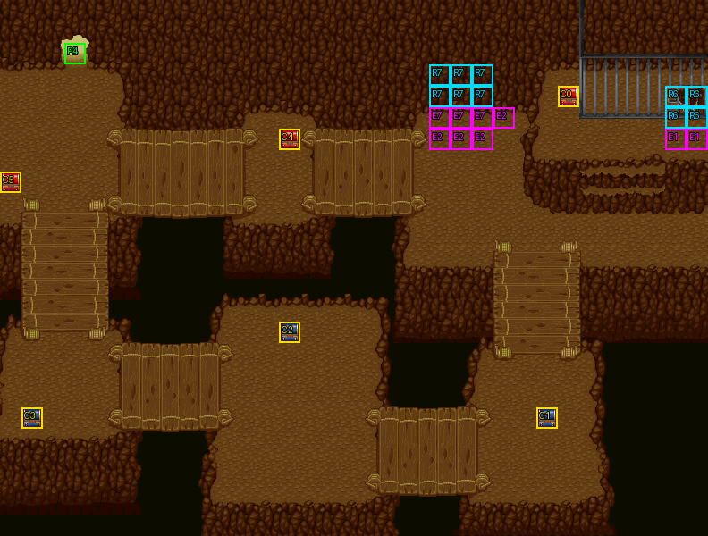

# 第 8 章　地底監獄

<!-- chapter_docs:header -->
| 項目 | 內容 |
| --- | --- |
| 章號／章節索引 | 8／7 |
| 章名（文字區塊 `0x01`） | 地底監獄 |
| 勝利條件（`0x02`） | 村民脫離戰場 |
| 敗北條件（`0x03`） | 蘭迪斯或費塔加死亡／村民全滅 |
| 戰場 | `MAP07.DAT`／`MAP07.COD`／`M07.DTL`，33×25 格，我方 slot 5 個，部署記錄 36 筆 |
| 文字區塊 | `FDETXT08.TXT`，36 條 |
| 進入處理（`0x60074`[7]） | `fdps_chapter_08_init`（`0x21070`） |
| 行動後檢查（`0x6028c`[7]） | `fdps_chapter_08_post_action`（`0x3a710`） |
| 勝利處理（`0x60304`[7]） | `fdps_chapter_08_end`（`0x3a800`） |
| 地圖資料呼叫的事件處理（`0x601c4`） | slot 10：`fdps_chapter_08_event_for_turn`（`0x372d0`）（回合事件）、slot 11：`fdps_chapter_08_event_send_guest_mage_to_cells`（`0x37440`）（死亡腳本）、slot 12：`fdps_chapter_08_event_villagers_leave_cells`（`0x374e0`）（格子事件）、slot 13：`fdps_chapter_08_event_villager_escapes`（`0x37600`）（格子事件） |
| 過場腳本 | `ICON07.DAT`（開場）、`WIN07.DAT`（勝利）、`ICON7-1.DAT`（戰鬥中事件）、`ICON7-2.DAT`（戰鬥中事件）、`ICON7-3.DAT`（戰鬥中事件） |
| 本章之前的村莊 | `SHOP07.DAT` |
| 光碟 | 第 1 片（音軌見 [CD 音軌](../program_info/cd_audio.md)） |



戰場全圖（第 0 層與同步捲動的圖層）。框線：黃 `C` 寶箱、橘 `B` 埋藏格、青 `R` 重繪格、洋紅 `E` 有處理函式的格子事件格，字母後的數字是事件碼；綠 `P` 是我方 slot 的起始格。

圖由 `python tools/chapter_docs/chapter_facts.py render-maps` 從遊戲檔重畫到 `chapters/maps/`，`verify-maps` 逐 byte 比對版控中的圖。
<!-- /chapter_docs:header -->

## 概要

蘭迪斯一行在森林裡聽見怪聲，循聲而去時遇上魔導士費塔加。他說鎮上失蹤的人被囚禁在石窟裡，據說是羅特帝亞國王為了蓋一座教塔下令捉拿奴工；蘭迪斯不相信他認識的索爾會做這種事，尤利安則主張先救人、再一步步查清疑點。費塔加提出分頭行事：隊伍在洞窟前大鬧、把守衛從柵欄引開，他從後方炸開一個洞，打開柵欄放出鎮民，讓他們從洞口逃走（開場過場 `ICON07.DAT`，在場景地圖 48 上演出）。

戰場是一座由吊橋連起的地底洞窟。隊伍從左上的洞口進入，右上角的牢籠關著四名村民，兩名步兵守在牢籠下方。第 3 回合費塔加在牢籠左邊炸開洞口現身；第 4 回合一名守衛跑去通報，另一名開始追擊蘭迪斯。留下的守衛一倒，費塔加便走向牢門，放出村民、指給他們看自己挖的洞；這時敵方魔導士帶著援軍出現在右下方，費塔加留下來擋敵，蘭迪斯要大家保護村民逃走。第 10 回合騎兵從隊伍進來的洞口追到，第 12 回合王國騎士團出現在左下方，費塔加催促大家把事情辦完就撤。

四名村民都離開戰場、而且至少一人是自己逃出時，費塔加說「村民全逃了，我們也該溜了」，戰鬥結束。勝利過場 `WIN07.DAT` 裡費塔加推論這件事背後藏著大陰謀，回到羅特帝亞的索爾必定兇多吉少；眾人決定查清真相、為索爾洗刷冤屈，費塔加也決定同行。

## 加入與離隊

費塔加（角色編號 `02`）在本章入隊，入隊規則與名冊記錄見 [`assets/characters.md` 的「加入」](../assets/characters.md#加入)。`MAP07.DAT` 只要 5 個我方 slot，入隊前的五人（蘭迪斯、尤利安、亞克、法蓮娜、裘娜）剛好填滿，排在名冊 slot 5 的費塔加不會以名冊記錄上場。

戰場上的費塔加是另一筆記錄：`MAP07.DAT` 第 19 筆（陣營 1 的 NPC、LV15、波次 1），第 3 回合才出場，由電腦控制，成為單位 `0x13`。勝利時名冊寫回依角色編號把這筆蓋過名冊，所以他之後以這筆 LV15 的狀態、連同身上的救援獎勵留在隊上。

四名村民（`76` 村民 2 名、`77` 村婦 2 名，陣營 1）是要護送的 NPC，不入隊。

## 勝敗條件與特殊機制

`fdps_chapter_08_post_action`（`0x3a710`）不呼叫共用判定 `fdps_battle_check_default_end_conditions`（`0x3a2e0`），三條規則依序獨立執行（寫入順序的後果見 [`program_info/chapter.md`](../program_info/chapter.md)）：

- **敗北：蘭迪斯**：`fdps_unit_is_retired`（`0x109b0`）看單位索引 0，退場就寫 1。
- **敗北：費塔加**：回合計數大於 3 時看單位索引 `0x13`，退場就寫 1；他在第 3 回合敵方階段前才出場，回合計數 1–3 時這條整條不判。另外第 19 筆記錄本身帶死亡腳本 opcode 5（顯示 `0x1a` 後敗北），由 `fdps_run_death_scripts`（`0x1d990`）執行，所以第 3 回合出場後當回合倒下也會判負。
- **四名村民都已離場**：單位 `0x0f`–`0x12` 全部退場（逃出或被殺都算）時看逃出計數：0 人逃出就寫 1 並顯示 `0x1b`「計劃失敗，村民全部遭到毒手了」；至少 1 人逃出就顯示 `0x23` 並寫 2（過關）。

畫面上的勝利條件「村民脫離戰場」在程式裡只要求一人逃出，其他人可以被殺；「村民全滅」對應的是「四人都離場、而逃出數為 0」。**清光敵人不會過關**，本章沒有這條規則，勝利處理開頭才把殘兵全部清掉。本章也沒有回合限制。

**逃出與獎勵**：村民走進洞口周圍事件碼 2 的格——(23, 5)、(20, 6)、(21, 6)、(22, 6)——時，由 `fdps_chapter_08_event_villager_escapes`（`0x37600`）處理：逃出計數加 1、顯示這名村民的台詞（`0x1c`–`0x1f`），並把他標成退場。處理函式只接受單位 `0x0f`–`0x12`，我方或費塔加走進這些格沒有作用。**最後一名離場的村民是逃出的**、且連他在內逃出人數大於 1 時，他說謝詞（`0x20` 村民／`0x21` 村婦），並依逃出人數把一件物品放進費塔加（單位 `0x13`）的背包：

| 逃出人數 | 獎勵 |
| ---: | --- |
| 1 | 無 |
| 2 | `C8` 炎之寶石 |
| 3 | `DA` 速度藥水 |
| 4 | `DD` 風精之羽 |

判定「最後一名」的方式是先數其他三人是否已退場（等於 3），再標記這一名，所以最後離場的村民若是被殺，已經逃出幾人都拿不到獎勵。費塔加背包 8 格全滿時獎勵直接消失。物品數值見 [`assets/items.md`](../assets/items.md)。

**費塔加什麼時候去開牢門**：他出場時是 AI 行為 0（衝向最近的敵人）。只有第 18 筆步兵（牢籠下方留下的守衛，單位 `0x0e`）的死亡腳本會叫 `fdps_chapter_08_event_send_guest_mage_to_cells`（`0x37440`），把他改成行為 4、走向記錄裡的目的地 (31, 6)，也就是牢門格。這名守衛若在第 3 回合費塔加出場之前就倒下，處理函式照樣改寫單位索引 `0x13`，但那時單位陣列只有 19 筆，寫到陣列之外，出場後的費塔加仍是行為 0，不會自己去開門；守衛中毒而死則根本不跑死亡腳本（見 [`program_info/known_bugs.md`](../program_info/known_bugs.md) 第 23 條），結果相同。這兩種情況下要由我方單位自己走上牢門格。

**牢門**：事件碼 1 的兩格 (31, 6)、(32, 6) 由 `fdps_chapter_08_event_villagers_leave_cells`（`0x374e0`）處理，不看是誰走上去（敵人也算），以章節事件旗標元素 `0x10` 閂住、一章一次：播放 `ICON7-3.DAT` 開門、把村民放到牢外、部署右下的援軍（波次 4），接著讓四名村民走向洞口、費塔加回到行為 0 就地作戰。過場直譯器進入時會清掉全場的「本回合已行動」旗標，由我方單位開門時本回合已行動的我方單位都能再動一次，見 [`program_info/known_bugs.md`](../program_info/known_bugs.md) 第 15 條與 [`program_info/cutscene.md`](../program_info/cutscene.md)。

**守衛轉向追擊**：第 4 回合的回合事件在 `ICON7-2.DAT` 讓第 17 筆守衛走開退場之後，把單位 `0x0e`（第 18 筆守衛）的 AI 行為改成 3，追擊角色編號 0（蘭迪斯）；不檢查這名守衛是否還活著。AI 行為的意義見 [`program_info/map_ai.md`](../program_info/map_ai.md)。

逃出計數存在章節事件旗標元素 `0x11`，進章節時清零、隨存檔保存。

## 敵人配置

進入戰場時有 10 名敵人：左側 (2–3, 11–12) 一群（弓兵 2、步兵 2），上方第一座吊橋一帶 (10–11, 7–9) 一群（步兵 3、魔導士 1），這兩群都是行為 0、主動出擊；牢籠下方 (28–29, 9) 的兩名步兵是行為 2，守在原地。第 4 回合其中一人（第 17 筆）走開退場，另一人（第 18 筆）改為追擊蘭迪斯，他就是費塔加開門的觸發者。

援軍分三批：

- **牢門打開時**（波次 4）：弓兵 2、魔導士 1、步兵 3 出現在右下 (23–25, 16–17)，放在錨點原位。
- **第 10 回合**（波次 2）：LV12 騎兵 4 名從左上洞口 (2–4, 3–4) 進來，各帶一顆雷之珠。放置方式是找錨點最近的空格。
- **第 12 回合**（波次 3）：王國騎士團，LV20 騎士 1 名與 LV30 騎兵 8 名出現在左下 (1–4, 16–18)，同樣找最近空格放置。

五名我方的起始格都在 (3, 2)，開場過場把他們走散到 (2–4, 3–4)。本章沒有搶寶箱的敵人。

<!-- chapter_docs:deployments -->
陣營與死亡腳本的意義見 [`resource_info/map.md`](../resource_info/map.md)，AI 行為（低 4 bit）見 [`program_info/map_ai.md`](../program_info/map_ai.md#行為代碼)；錨點是 `MAPnn.COD` 的座標，開場波次放在錨點上，其餘波次依部署方式放在錨點或最近的空格。單位名是全域文字的「角色編號 + 1」條；角色編號 `3C` 以上的敵兵，數值（`ENEMYDAT.DAT`）與種族、職業見 [`assets/enemies.md`](../assets/enemies.md)，以下的見 [`assets/characters.md`](../assets/characters.md)。

我方起始格：slot 0 (3, 2)、slot 1 (3, 2)、slot 2 (3, 2)、slot 3 (3, 2)、slot 4 (3, 2)。

| 波次 | 陣營 | 單位 | 等級 | 數量 |
| ---: | --- | --- | --- | ---: |
| 0 | 敵方 | `5D` 弓兵 | 12 | 2 |
| 0 | 敵方 | `62` 步兵 | 12 | 7 |
| 0 | 敵方 | `66` 魔導士 | 13 | 1 |
| 0 | NPC | `76` 村民 | 12 | 2 |
| 0 | NPC | `77` 村婦 | 12 | 2 |
| 1 | NPC | `02` 費塔加 | 15 | 1 |
| 2 | 敵方 | `58` 騎兵 | 12 | 4 |
| 3 | 敵方 | `59` 騎士 | 20 | 1 |
| 3 | 敵方 | `58` 騎兵 | 30 | 8 |
| 4 | 敵方 | `5D` 弓兵 | 12 | 2 |
| 4 | 敵方 | `66` 魔導士 | 13 | 1 |
| 4 | 敵方 | `62` 步兵 | 12 | 3 |

### 波次 0

出場：進入戰場時由 `fdps_build_map_unit_array`（`0x22be0`） 部署在錨點上

| # | 陣營 | 單位 | 等級 | AI 行為 | 錨點 | 死亡腳本 |
| ---: | --- | --- | ---: | --- | --- | --- |
| 2 | 敵方 | `5D` 弓兵 | 12 | 0 主動 | (3, 12) | — |
| 3 | 敵方 | `62` 步兵 | 12 | 0 主動 | (10, 8) | 掉落 1500 金 |
| 5 | 敵方 | `66` 魔導士 | 13 | 0 主動 | (11, 8) | 掉落 `B8` 魔法水 |
| 8 | 敵方 | `5D` 弓兵 | 12 | 0 主動 | (2, 12) | — |
| 9 | 敵方 | `62` 步兵 | 12 | 0 主動 | (10, 9) | — |
| 11 | 敵方 | `62` 步兵 | 12 | 0 主動 | (2, 11) | — |
| 12 | 敵方 | `62` 步兵 | 12 | 0 主動 | (3, 11) | — |
| 15 | 敵方 | `62` 步兵 | 12 | 0 主動 | (10, 7) | — |
| 17 | 敵方 | `62` 步兵 | 12 | 2 原地 | (29, 9) | — |
| 18 | 敵方 | `62` 步兵 | 12 | 2 原地 | (28, 9) | 事件 slot 11：`fdps_chapter_08_event_send_guest_mage_to_cells`（`0x37440`） |
| 20 | NPC | `76` 村民 | 12 | 8 靜止 | (28, 4) | 顯示 `0x16` |
| 21 | NPC | `76` 村民 | 12 | 8 靜止 | (29, 4) | 顯示 `0x17` |
| 22 | NPC | `77` 村婦 | 12 | 8 靜止 | (28, 3) | 顯示 `0x18` |
| 23 | NPC | `77` 村婦 | 12 | 8 靜止 | (29, 3) | 顯示 `0x19` |

### 波次 1

出場：第 3 回合敵方階段前，`fdps_chapter_08_event_for_turn`（`0x372d0`）播放 `ICON7-1.DAT`，腳本 `0x010` 的 `DEPLOY_WAVE` 把客將費塔加放在錨點原位，成為單位 `0x13`

| # | 陣營 | 單位 | 等級 | AI 行為 | 錨點 | 死亡腳本 |
| ---: | --- | --- | ---: | --- | --- | --- |
| 19 | NPC | `02` 費塔加 | 15 | 0 主動 | (21, 4) | 顯示 `0x1a`，之後敗北 |

### 波次 2

出場：第 10 回合敵方階段前，`fdps_chapter_08_event_for_turn`（`0x372d0`）以固定波次 2 呼叫 `fdps_deploy_wave`，找錨點最近的空格放置

| # | 陣營 | 單位 | 等級 | AI 行為 | 錨點 | 死亡腳本 |
| ---: | --- | --- | ---: | --- | --- | --- |
| 24 | 敵方 | `58` 騎兵 | 12 | 0 主動 | (3, 4) | 掉落 `C4` 雷之珠 |
| 25 | 敵方 | `58` 騎兵 | 12 | 0 主動 | (2, 3) | 掉落 `C4` 雷之珠 |
| 26 | 敵方 | `58` 騎兵 | 12 | 0 主動 | (3, 3) | 掉落 `C4` 雷之珠 |
| 27 | 敵方 | `58` 騎兵 | 12 | 0 主動 | (4, 3) | 掉落 `C4` 雷之珠 |

### 波次 3

出場：第 12 回合敵方階段前，`fdps_chapter_08_event_for_turn`（`0x372d0`）以固定波次 3 呼叫 `fdps_deploy_wave`，找錨點最近的空格放置

| # | 陣營 | 單位 | 等級 | AI 行為 | 錨點 | 死亡腳本 |
| ---: | --- | --- | ---: | --- | --- | --- |
| 0 | 敵方 | `59` 騎士 | 20 | 0 主動 | (3, 18) | — |
| 28 | 敵方 | `58` 騎兵 | 30 | 0 主動 | (1, 16) | — |
| 29 | 敵方 | `58` 騎兵 | 30 | 0 主動 | (2, 16) | — |
| 30 | 敵方 | `58` 騎兵 | 30 | 0 主動 | (3, 16) | — |
| 31 | 敵方 | `58` 騎兵 | 30 | 0 主動 | (4, 16) | — |
| 32 | 敵方 | `58` 騎兵 | 30 | 0 主動 | (1, 17) | — |
| 33 | 敵方 | `58` 騎兵 | 30 | 0 主動 | (2, 17) | — |
| 34 | 敵方 | `58` 騎兵 | 30 | 0 主動 | (3, 17) | — |
| 35 | 敵方 | `58` 騎兵 | 30 | 0 主動 | (4, 17) | — |

### 波次 4

出場：任何單位走上牢門格 (31, 6)／(32, 6) 時，`fdps_chapter_08_event_villagers_leave_cells`（`0x374e0`）播放 `ICON7-3.DAT`，腳本 `0x081` 的 `DEPLOY_WAVE` 放在錨點原位；閂鎖使它一章只發生一次

| # | 陣營 | 單位 | 等級 | AI 行為 | 錨點 | 死亡腳本 |
| ---: | --- | --- | ---: | --- | --- | --- |
| 1 | 敵方 | `5D` 弓兵 | 12 | 0 主動 | (25, 17) | — |
| 4 | 敵方 | `66` 魔導士 | 13 | 0 主動 | (24, 17) | — |
| 7 | 敵方 | `5D` 弓兵 | 12 | 0 主動 | (23, 17) | — |
| 13 | 敵方 | `62` 步兵 | 12 | 0 主動 | (25, 16) | — |
| 14 | 敵方 | `62` 步兵 | 12 | 0 主動 | (24, 16) | — |
| 16 | 敵方 | `62` 步兵 | 12 | 0 主動 | (23, 16) | — |

### 波次 FF

2 筆記錄（#6–#10）永遠不會部署：本章的四支事件處理函式只部署波次 2、3，三支戰鬥中腳本只部署波次 1、4，沒有任何程式或腳本在地圖 7 上以 255 呼叫部署，見 [S11](../cut_content/story.md#s11-18-筆波次-0xff-的部署記錄)。
<!-- /chapter_docs:deployments -->

## 寶物

除了下表的寶箱與擊倒掉落，救出村民的獎勵（炎之寶石、速度藥水或風精之羽，依逃出人數）由 `fdps_chapter_08_event_villager_escapes`（`0x37600`）放進費塔加的背包，勝利時隨他寫回名冊，條件見上方「勝敗條件與特殊機制」。

<!-- chapter_docs:treasure -->
搜尋的規則（同碼的格共用一筆記錄與一個旗標、背包滿時的交換）見 [`resource_info/map.md`](../resource_info/map.md)。

| 事件碼 | 格 | 內容 |
| ---: | --- | --- |
| 0 | (26, 4) 寶箱 | `D6` 生命之實 |
| 1 | (25, 19) 寶箱 | `76` 符咒皮甲 |
| 2 | (13, 15) 寶箱 | `07` 鋸齒劍 |
| 3 | (1, 19) 寶箱 | `E1` 暗之徽章 |
| 4 | (13, 6) 寶箱 | `C3` 炎之珠 |
| 5 | (0, 8) 寶箱 | 2000 金 |

沒有任何格引用、拿不到的記錄：記錄 6（種類 2、內容 `0`）、記錄 7（種類 2、內容 `0`），見 [I04](../cut_content/items.md#i04-章節地圖上沒有格子引用的寶物記錄)。

擊倒後掉落（死亡腳本 opcode 0／1，擊殺者須是存活的我方單位）：

| # | 單位 | 波次 | 掉落 |
| ---: | --- | ---: | --- |
| 3 | `62` 步兵 | 0 | 掉落 1500 金 |
| 5 | `66` 魔導士 | 0 | 掉落 `B8` 魔法水 |
| 24 | `58` 騎兵 | 2 | 掉落 `C4` 雷之珠 |
| 25 | `58` 騎兵 | 2 | 掉落 `C4` 雷之珠 |
| 26 | `58` 騎兵 | 2 | 掉落 `C4` 雷之珠 |
| 27 | `58` 騎兵 | 2 | 掉落 `C4` 雷之珠 |
<!-- /chapter_docs:treasure -->

## 村莊

<!-- chapter_docs:village -->
第 7 章勝利後、本章之前的村莊載入 `SHOP07.DAT`，道具店、武器店、秘密商店的貨見 [`assets/shops.md`](../assets/shops.md)。村莊載入的文字區塊是 `FDETXT08`（章節索引 + 1，`fdps_load_field_chapter_resources`（`0x31540`）），也就是本章的區塊，所以村莊畫面的文字是本章區塊的 `0x04`–`0x08`，全文在下方「對話」。
<!-- /chapter_docs:village -->

## 處理流程

### 進入：`fdps_chapter_08_init`（`0x21070`）

1. `fdps_roster_add_character`（`0x23bc0`）讓費塔加（角色 `02`）入隊，名冊記錄 LV13，排在名冊 slot 5。
2. `fdps_chapter_state_reset`（`0x22750`）重建戰場：放上 5 名隊員與波次 0 的 14 筆記錄，共 19 個單位。
3. `fdps_icon_script_run`（`0x21650`）執行開場過場 `ICON07.DAT`：切到場景地圖 48 演出與費塔加相遇的對話（`FDETXT49` 的文字），再切回地圖 7 重建戰場，把隊員走散後顯示 `0x0b`。
4. `fdps_show_chapter_title_card`（`0x20c60`）顯示章名卡。
5. `fdps_map_cursor_move_to_unit`（`0x2da50`）把游標放在單位 0（蘭迪斯）。

### 行動後檢查：`fdps_chapter_08_post_action`（`0x3a710`）

1. 單位 0 退場就把結束碼寫成 1。
2. 回合計數大於 3 且單位 `0x13`（費塔加）退場，就寫 1。
3. 單位 `0x0f`–`0x12` 都退場時：逃出計數（旗標元素 `0x11`）為 0 就寫 1 再顯示 `0x1b`；否則顯示 `0x23` 再寫 2。

沒有任何規則成立時不動結束碼。

### 勝利：`fdps_chapter_08_end`（`0x3a800`）

1. `fdps_battle_destroy_remaining_enemies`（`0x39e10`）清掉陣營 0 的殘兵——本章過關時敵人通常還在場上。
2. `fdps_roster_write_back_battle_units`（`0x23980`）依角色編號把戰場單位寫回名冊，戰場上 LV15 的費塔加與他背包裡的獎勵因此蓋過名冊記錄。
3. `fdps_icon_script_run`（`0x21650`）執行勝利過場 `WIN07.DAT`，顯示 `0x0a`。
4. `fdps_roster_revive_fallen_members`（`0x39e70`）讓陣亡的隊員復活。
5. 章節索引設為 8，下一段是第 9 章之前的村莊，接著是 [第 9 章](ch09.md)。

### 回合事件：`fdps_chapter_08_event_for_turn`（`0x372d0`）

地圖資料在第 1、3、4、10、12 回合的敵方階段前各呼叫一次，本體依回合數分支，其他回合什麼都不做：

- **第 1 回合**：`fdps_draw_text`（`0x1ff60`）顯示 `0x0c`，敵方魔導士（單位 7）喊「有人來劫獄了！」。
- **第 3 回合**：播放 `ICON7-1.DAT`：打開格子事件旗標 7、重畫 (20–22, 3–4) 成炸開的洞口，部署波次 1 的費塔加於 (21, 4)，顯示 `0x0d`，他走到 (23, 9)。
- **第 4 回合**：播放 `ICON7-2.DAT`（顯示 `0x0e`，第 17 筆守衛走開退場），接著把單位 `0x0e` 的 AI 行為低 4 bit 改成 3（高 4 bit 保留），讓他追擊蘭迪斯。
- **第 10 回合**：`fdps_deploy_wave`（`0x23830`）部署波次 2（找最近空格），顯示 `0x15`。
- **第 12 回合**：部署波次 3（找最近空格），顯示 `0x22`。

### 守衛倒下：`fdps_chapter_08_event_send_guest_mage_to_cells`（`0x37440`）

由第 18 筆步兵的死亡腳本（事件 slot 11）呼叫，不看是誰打倒他。

1. 把單位 `0x13`（費塔加）的 AI 行為低 4 bit 改成 4（走向記錄裡的目的地 (31, 6)），不檢查單位陣列是否已有這一格。
2. `fdps_draw_text`（`0x1ff60`）顯示 `0x0f`：費塔加說「把守衛解決，接下來就可以安心的救村民了」。

### 牢門：`fdps_chapter_08_event_villagers_leave_cells`（`0x374e0`）

由牢門格 (31, 6)、(32, 6)（事件碼 1、slot 12、走進時觸發）呼叫。

1. 旗標元素 `0x10` 非 0 就返回；否則設為 1。
2. `fdps_icon_script_run`（`0x21650`）播放 `ICON7-3.DAT`：打開格子事件旗標 6、重畫牢門 (31–32, 4–5)，顯示 `0x10`，把四名村民放到 (27–30, 6)，顯示 `0x11`–`0x13`，部署波次 4，顯示 `0x14`。
3. 在單位 `0x13` 的記錄寫入目的地 (21, 4)；這個值隨即失效，因為下一步把他改成不看目的地的行為 0。
4. 單位 `0x0f`–`0x12` 的 AI 行為低 4 bit 改成 4：村民走向各自記錄裡的目的地 (21, 5)，也就是洞口。
5. 單位 `0x13` 的 AI 行為低 4 bit 改成 0：費塔加就地作戰。

### 村民逃出：`fdps_chapter_08_event_villager_escapes`（`0x37600`）

由洞口周圍事件碼 2 的四格（slot 13、走進時觸發）以走進者的單位索引呼叫。

1. 單位索引不在 `0x0f`–`0x12` 就什麼都不做。
2. 旗標元素 `0x11`（逃出計數）加 1，顯示條目「單位索引 + `0x0d`」（`0x1c`–`0x1f`）。
3. 數四名村民中已退場的人數（此時這一名還沒標記）。
4. 已退場的恰為 3 人且逃出計數大於 1：顯示 `0x20`（單位索引小於 `0x11`，村民）或 `0x21`（村婦），再依逃出計數 2／3／其他把 `C8`／`DA`／`DD` 交給 `fdps_unit_add_item`（`0x25d20`）放進單位 `0x13` 的背包，不看成敗。
5. 把這名村民的狀態 byte 整個設成 1（退場）。

沒有閂鎖；同一名村民不會再被呼叫，是因為退場的單位不再行動。

## 回合事件與格子事件

<!-- chapter_docs:events -->
觸發時機與陣營階段的意義見 [`resource_info/map.md`](../resource_info/map.md)。

| 回合 | 陣營階段 | slot | 處理函式 |
| ---: | --- | ---: | --- |
| 1 | 敵方階段前 | 10 | `fdps_chapter_08_event_for_turn`（`0x372d0`） |
| 3 | 敵方階段前 | 10 | `fdps_chapter_08_event_for_turn`（`0x372d0`） |
| 4 | 敵方階段前 | 10 | `fdps_chapter_08_event_for_turn`（`0x372d0`） |
| 10 | 敵方階段前 | 10 | `fdps_chapter_08_event_for_turn`（`0x372d0`） |
| 12 | 敵方階段前 | 10 | `fdps_chapter_08_event_for_turn`（`0x372d0`） |

| 事件碼 | 格 | 觸發 | slot | 處理函式 |
| ---: | --- | --- | ---: | --- |
| 1 | (31, 6)、(32, 6) | 走進 | 12 | `fdps_chapter_08_event_villagers_leave_cells`（`0x374e0`） |
| 2 | (23, 5)、(20, 6)、(21, 6)、(22, 6) | 走進 | 13 | `fdps_chapter_08_event_villager_escapes`（`0x37600`） |

死亡腳本裡的事件與文字：

| # | 單位 | 波次 | 死亡腳本 |
| ---: | --- | ---: | --- |
| 18 | `62` 步兵 | 0 | 事件 slot 11：`fdps_chapter_08_event_send_guest_mage_to_cells`（`0x37440`） |
| 19 | `02` 費塔加 | 1 | 顯示 `0x1a`，之後敗北 |
| 20 | `76` 村民 | 0 | 顯示 `0x16` |
| 21 | `76` 村民 | 0 | 顯示 `0x17` |
| 22 | `77` 村婦 | 0 | 顯示 `0x18` |
| 23 | `77` 村婦 | 0 | 顯示 `0x19` |
<!-- /chapter_docs:events -->

## 過場腳本

`ICON07.DAT` 前半段在場景地圖 48 上演出，畫的是 `FDETXT49` 的條目，切回地圖 7 之後才畫本章區塊的 `0x0b`。

<!-- chapter_docs:scripts -->
格式與每個指令的意義見 [`resource_info/cutscene_script.md`](../resource_info/cutscene_script.md)。`FDETXT08#0xNN` 是本章文字區塊的條目，全文在下方「對話」；切到額外場景之後顯示的文字直接列出（那些區塊的正典是 [`assets/text/scene_text.md`](../assets/text/scene_text.md)）。`u3=我方1` 是地圖單位索引 3 對到我方 slot 1，`u12=MAP02#9` 是 `MAP02.DAT` 第 9 筆部署記錄。

### `ICON07.DAT`

- 開場：`fdps_chapter_08_init`（`0x21070`）
- 251 byte、48 步；起始地圖 7，切換地圖 48 → 7，結束於地圖 7

| 偏移 | 指令 | 內容 |
| ---: | --- | --- |
| `0000` | `SET_MUSIC` | 音樂 17（CD 第 18 軌） |
| `0002` | `SWITCH_MAP` | 切換地圖 → 48（MAP48，文字 FDETXT49） |
| `0004` | `SET_VIEW_TILE` | 視野直接設到格 (2, 7) |
| `0007` | `FACE_UNITS` | 轉向後停 1 幀：u0=MAP48#0(角色0x00)朝上、u1=MAP48#1(角色0x01)朝上、u2=MAP48#2(角色0x04)朝上、u3=MAP48#3(角色0x06)朝上、u4=MAP48#4(角色0x03)朝上 |
| `0014` | `DRAW_TEXT` | 顯示文字 FDETXT49#0x09 「{speaker char=0}這是什麼聲音？」 |
| `0016` | `WALK_UNITS` | 行走 2 格，每步 3 幀：u0=MAP48#0(角色0x00)往上、u1=MAP48#1(角色0x01)往上、u2=MAP48#2(角色0x04)往上、u3=MAP48#3(角色0x06)往上、u4=MAP48#4(角色0x03)往上 |
| `0024` | `FACE_UNITS` | 轉向後停 10 幀：u0=MAP48#0(角色0x00)朝右 |
| `0029` | `FACE_UNITS` | 轉向後停 10 幀：u0=MAP48#0(角色0x00)朝左 |
| `002e` | `FACE_UNITS` | 轉向後停 10 幀：u0=MAP48#0(角色0x00)朝下 |
| `0033` | `DRAW_TEXT` | 顯示文字 FDETXT49#0x0a 「{speaker char=3}好像在前面森林裡。{br}{speaker char=4}去看看是什麼？{br}走啊！{br}還等什麼？」 |
| `0035` | `WALK_UNITS` | 行走 3 格，每步 3 幀：u0=MAP48#0(角色0x00)往上、u1=MAP48#1(角色0x01)往上、u2=MAP48#2(角色0x04)往上、u3=MAP48#3(角色0x06)往上、u4=MAP48#4(角色0x03)往上 |
| `0043` | `FADE_OUT` | 淡出，每步 40 ms |
| `0045` | `WALK_UNITS` | 行走 1 格，每步 3 幀：u0=MAP48#0(角色0x00)往上、u1=MAP48#1(角色0x01)往上、u2=MAP48#2(角色0x04)往上、u3=MAP48#3(角色0x06)往上、u4=MAP48#4(角色0x03)往上 |
| `0053` | `SET_VIEW_TILE` | 視野直接設到格 (2, 0) |
| `0056` | `FACE_UNITS` | 轉向後停 1 幀：u0=MAP48#0(角色0x00)朝上 |
| `005b` | `FADE_IN` | 淡入，每步 40 ms |
| `005d` | `WALK_UNITS` | 行走 2 格，每步 2 幀：u0=MAP48#0(角色0x00)往上、u1=MAP48#1(角色0x01)往上、u2=MAP48#2(角色0x04)往上、u3=MAP48#3(角色0x06)往上、u4=MAP48#4(角色0x03)往上 |
| `006b` | `DEPLOY_WAVE` | 部署 MAP48 波次 1（錨點原位）：#5(角色0x02) |
| `006e` | `FACE_UNITS` | 轉向後停 1 幀：u5=MAP48#5(角色0x02)朝左 |
| `0073` | `WALK_UNITS` | 行走 4 格，每步 3 幀：u5=MAP48#5(角色0x02)往左 |
| `0079` | `RETIRE_UNIT` | 退場 u5=MAP48#5(角色0x02) |
| `007b` | `PLAY_SAF` | 播放動畫 ICON0026.SAF |
| `007d` | `REVIVE_UNIT` | 復歸 u5=MAP48#5(角色0x02)（清狀態） |
| `007f` | `WALK_UNITS` | 行走 1 格，每步 3 幀：u5=MAP48#5(角色0x02)往下 |
| `0085` | `DRAW_TEXT` | 顯示文字 FDETXT49#0x0b 「{speaker char=0}你是誰？{br}為何要引我們到這裡？{br}{speaker char=2}我是魔導士費塔加；{br}請問你們來這裡，{br}是為了尋找鎮民嗎？{br}{speaker char=6}是呀！{br}難道﹒﹒你也是嗎？{br}{speaker char=2}﹒﹒嗯！{br}我剛才發現村人，{br}被囚禁在石窟中。{page}需要有人在前面，{br}引開守衛的注意，{br}另外有人繞到後面，{page}將囚禁的鎮民放出來。{br}太好了！{br}你們來的正是時候！{br}{speaker char=4}你要我們怎麼幫你？{br}{speaker char=2}我需要你們在洞窟前，{br}引誘守衛離開柵欄。{page}然後，{br}我會在後方炸開個洞。{br}從那裡進來，{page}然後將柵欄打開，{br}放出鎮民，{br}送他們從洞口逃脫。{page}只要鎮民逃離洞窟，{br}我們就達成任務了！{br}{speaker char=1}是誰這麼狠心？{br}居然把鎮民捉起來，{br}囚禁在這裡？{br}{speaker char=2}﹒﹒﹒﹒{br}聽說是羅特帝亞國王，{br}為了蓋一座教塔，{page}命令手下捉拿奴工﹒﹒{br}{speaker char=0}這是不可能的！{br}{speaker char=2}﹒﹒﹒為什麼？{br}{speaker char=0}我知道的索爾，{br}是不會幹這種事的！{br}{speaker char=2}哦？是嗎？﹒﹒﹒{br}{speaker char=6}蘭迪斯，{br}這事情還有很多疑點，{br}我們一步步慢慢查，{page}好嗎？{br}我們的當務之急，{br}是拯救無辜的鎮民。{page}費塔加先生，{br}我們分頭行事，{br}請你為我們帶路。{br}{speaker char=2}好，我來替你們帶路。」 |
| `0087` | `WALK_UNITS` | 行走 1 格，每步 3 幀：u5=MAP48#5(角色0x02)往上 |
| `008d` | `WALK_UNITS` | 行走 4 格，每步 3 幀：u5=MAP48#5(角色0x02)往右 |
| `0093` | `SET_MUSIC` | 停止音樂 |
| `0095` | `RETIRE_UNIT` | 退場 u5=MAP48#5(角色0x02) |
| `0097` | `FACE_UNITS` | 轉向後停 12 幀：u0=MAP48#0(角色0x00)朝上 |
| `009c` | `FADE_OUT` | 淡出，每步 20 ms |
| `009e` | `SET_MUSIC` | 音樂 9（CD 第 10 軌） |
| `00a0` | `SWITCH_MAP` | 切換地圖 → 7（MAP07，文字 FDETXT08） |
| `00a2` | `FACE_UNITS` | 轉向後停 1 幀：u0=我方0朝下 |
| `00a7` | `FADE_IN` | 淡入，每步 20 ms |
| `00a9` | `WALK_UNITS` | 行走 1 格，每步 2 幀：u0=我方0往下 |
| `00af` | `WALK_UNITS` | 行走 1 格，每步 2 幀：u0=我方0往下、u1=我方1往下 |
| `00b7` | `WALK_UNITS` | 行走 1 格，每步 3 幀：u0=我方0往右、u1=我方1往右、u2=我方2往下 |
| `00c1` | `WALK_UNITS` | 行走 1 格，每步 3 幀：u2=我方2往下、u3=我方3往下 |
| `00c9` | `WALK_UNITS` | 行走 1 格，每步 3 幀：u3=我方3往左、u4=我方4往下 |
| `00d1` | `FACE_UNITS` | 轉向後停 25 幀：u0=我方0朝右、u1=我方1朝右、u2=我方2朝右、u3=我方3朝右、u4=我方4朝右 |
| `00de` | `SCROLL_VIEW` | 捲動視野到格 (20, 0) |
| `00e1` | `FACE_UNITS` | 轉向後停 50 幀：u0=我方0朝右 |
| `00e6` | `SCROLL_VIEW` | 捲動視野到格 (0, 0) |
| `00e9` | `DRAW_TEXT` | 顯示文字 FDETXT08#0x0b |
| `00eb` | `FACE_UNITS` | 轉向後停 25 幀：u0=我方0朝下、u1=我方1朝下、u2=我方2朝下、u3=我方3朝下、u4=我方4朝下 |
| `00f8` | `SET_MUSIC` | 停止音樂 |
| `00fa` | `END` | 結束 |

### `WIN07.DAT`

- 勝利：`fdps_chapter_08_end`（`0x3a800`）
- 126 byte、32 步；起始地圖 7，切換地圖 無，結束於地圖 7

| 偏移 | 指令 | 內容 |
| ---: | --- | --- |
| `0000` | `FADE_OUT` | 淡出，每步 40 ms |
| `0002` | `SET_MUSIC` | 音樂 8（CD 第 9 軌） |
| `0004` | `REVIVE_UNIT` | 復歸 u1=我方1（清狀態） |
| `0006` | `REVIVE_UNIT` | 復歸 u2=我方2（清狀態） |
| `0008` | `REVIVE_UNIT` | 復歸 u3=我方3（清狀態） |
| `000a` | `REVIVE_UNIT` | 復歸 u4=我方4（清狀態） |
| `000c` | `SET_VIEW_TILE` | 視野直接設到格 (18, 7) |
| `000f` | `PLACE_UNIT` | 放置 u19 到 (28, 8)，朝上 |
| `0014` | `PLACE_UNIT` | 放置 u0=我方0 到 (24, 11)，朝上 |
| `0019` | `PLACE_UNIT` | 放置 u3=我方3 到 (25, 11)，朝上 |
| `001e` | `PLACE_UNIT` | 放置 u1=我方1 到 (23, 10)，朝右 |
| `0023` | `PLACE_UNIT` | 放置 u4=我方4 到 (23, 9)，朝下 |
| `0028` | `PLACE_UNIT` | 放置 u2=我方2 到 (24, 9)，朝下 |
| `002d` | `FACE_UNITS` | 轉向後停 1 幀：u19朝上 |
| `0032` | `FADE_IN` | 淡入，每步 40 ms |
| `0034` | `FACE_UNITS` | 轉向後停 25 幀：u19朝下 |
| `0039` | `WALK_UNITS` | 行走 2 格，每步 4 幀：u19往下 |
| `003f` | `WALK_UNITS` | 行走 4 格，每步 4 幀：u19往左 |
| `0045` | `FACE_UNITS` | 轉向後停 25 幀：u19朝下 |
| `004a` | `SHAKE_VIEW` | 視野位移 4 步，每步 2 幀：(0,6) (0,12) (0,18) (0,24) |
| `0055` | `SET_VIEW_TILE` | 視野直接設到格 (18, 8) |
| `0058` | `SHAKE_VIEW` | 視野位移 4 步，每步 2 幀：(0,6) (0,12) (0,18) (0,24) |
| `0063` | `SET_VIEW_TILE` | 視野直接設到格 (18, 9) |
| `0066` | `RETIRE_UNIT` | 退場 u19 |
| `0068` | `PLAY_SAF` | 播放動畫 ICON0026.SAF |
| `006a` | `PLAY_SAF` | 播放動畫 ICON0026.SAF |
| `006c` | `REVIVE_UNIT` | 復歸 u19（清狀態） |
| `006e` | `WALK_UNITS` | 行走 1 格，每步 2 幀：u3=我方3往上 |
| `0074` | `FACE_UNITS` | 轉向後停 25 幀：u3=我方3朝左 |
| `0079` | `DRAW_TEXT` | 顯示文字 FDETXT08#0x0a |
| `007b` | `SET_MUSIC` | 停止音樂 |
| `007d` | `END` | 結束 |

### `ICON7-1.DAT`

- 戰鬥中事件：`fdps_chapter_08_event_for_turn`（`0x372d0`）
- 88 byte、20 步；起始地圖 7，切換地圖 無，結束於地圖 7

| 偏移 | 指令 | 內容 |
| ---: | --- | --- |
| `0000` | `SCROLL_VIEW` | 捲動視野到格 (16, 0) |
| `0003` | `FACE_UNITS` | 轉向後停 25 幀：u0=我方0朝下 |
| `0008` | `TRIGGER_CELL_EVENT` | 格子事件旗標 [7] = 1，套用地圖變化 |
| `000b` | `FACE_UNITS` | 轉向後停 12 幀：u0=我方0朝下 |
| `0010` | `DEPLOY_WAVE` | 部署 MAP07 波次 1（錨點原位）：#19(角色0x02) |
| `0013` | `FACE_UNITS` | 轉向後停 12 幀：u19朝左 |
| `0018` | `FACE_UNITS` | 轉向後停 12 幀：u19朝右 |
| `001d` | `WALK_UNITS` | 行走 1 格，每步 2 幀：u19往下 |
| `0023` | `FACE_UNITS` | 轉向後停 12 幀：u19朝左 |
| `0028` | `FACE_UNITS` | 轉向後停 12 幀：u19朝右 |
| `002d` | `DRAW_TEXT` | 顯示文字 FDETXT08#0x0d |
| `002f` | `FACE_UNITS` | 轉向後停 12 幀：u19朝右 |
| `0034` | `SCROLL_VIEW` | 捲動視野到格 (16, 3) |
| `0037` | `WALK_UNITS` | 行走 2 格，每步 1 幀：u19往右 |
| `003d` | `FACE_UNITS` | 轉向後停 25 幀：u19朝左 |
| `0042` | `FACE_UNITS` | 轉向後停 6 幀：u19朝下 |
| `0047` | `FACE_UNITS` | 轉向後停 25 幀：u19朝左 |
| `004c` | `WALK_UNITS` | 行走 4 格，每步 1 幀：u19往下 |
| `0052` | `FACE_UNITS` | 轉向後停 25 幀：u19朝左 |
| `0057` | `END` | 結束 |

### `ICON7-2.DAT`

- 戰鬥中事件：`fdps_chapter_08_event_for_turn`（`0x372d0`）
- 45 byte、10 步；起始地圖 7，切換地圖 無，結束於地圖 7

| 偏移 | 指令 | 內容 |
| ---: | --- | --- |
| `0000` | `FACE_UNITS` | 轉向後停 25 幀：u13=MAP07#17(角色0x62)朝左、u14=MAP07#18(角色0x62)朝右 |
| `0007` | `DRAW_TEXT` | 顯示文字 FDETXT08#0x0e |
| `0009` | `WALK_UNITS` | 行走 2 格，每步 1 幀：u13=MAP07#17(角色0x62)往下 |
| `000f` | `WALK_UNITS` | 行走 3 格，每步 1 幀：u13=MAP07#17(角色0x62)往右 |
| `0015` | `FACE_UNITS` | 轉向後停 12 幀：u13=MAP07#17(角色0x62)朝右 |
| `001a` | `RETIRE_UNIT` | 退場 u13=MAP07#17(角色0x62) |
| `001c` | `FACE_UNITS` | 轉向後停 12 幀：u14=MAP07#18(角色0x62)朝右 |
| `0021` | `WALK_UNITS` | 行走 1 格，每步 1 幀：u14=MAP07#18(角色0x62)往下 |
| `0027` | `FACE_UNITS` | 轉向後停 12 幀：u14=MAP07#18(角色0x62)朝左 |
| `002c` | `END` | 結束 |

### `ICON7-3.DAT`

- 戰鬥中事件：`fdps_chapter_08_event_villagers_leave_cells`（`0x374e0`）
- 177 byte、36 步；起始地圖 7，切換地圖 無，結束於地圖 7

| 偏移 | 指令 | 內容 |
| ---: | --- | --- |
| `0000` | `SCROLL_VIEW` | 捲動視野到格 (20, 0) |
| `0003` | `FACE_UNITS` | 轉向後停 25 幀：u19朝上 |
| `0008` | `FACE_UNITS` | 轉向後停 12 幀：u19朝左 |
| `000d` | `FACE_UNITS` | 轉向後停 12 幀：u19朝右 |
| `0012` | `FACE_UNITS` | 轉向後停 12 幀：u19朝上 |
| `0017` | `TRIGGER_CELL_EVENT` | 格子事件旗標 [6] = 1，套用地圖變化 |
| `001a` | `FACE_UNITS` | 轉向後停 25 幀：u19朝上 |
| `001f` | `DRAW_TEXT` | 顯示文字 FDETXT08#0x10 |
| `0021` | `FADE_OUT` | 淡出，每步 5 ms |
| `0023` | `PLACE_UNIT` | 放置 u15=MAP07#20(角色0x76) 到 (30, 6)，朝右 |
| `0028` | `PLACE_UNIT` | 放置 u16=MAP07#21(角色0x76) 到 (29, 6)，朝右 |
| `002d` | `PLACE_UNIT` | 放置 u17=MAP07#22(角色0x77) 到 (28, 6)，朝右 |
| `0032` | `PLACE_UNIT` | 放置 u18=MAP07#23(角色0x77) 到 (27, 6)，朝右 |
| `0037` | `FACE_UNITS` | 轉向後停 1 幀：u19朝左 |
| `003c` | `FADE_IN` | 淡入，每步 5 ms |
| `003e` | `FACE_UNITS` | 轉向後停 25 幀：u19朝左 |
| `0043` | `DRAW_TEXT` | 顯示文字 FDETXT08#0x11 |
| `0045` | `FACE_UNITS` | 轉向後停 12 幀：u15=MAP07#20(角色0x76)朝左、u16=MAP07#21(角色0x76)朝左、u17=MAP07#22(角色0x77)朝左、u18=MAP07#23(角色0x77)朝左 |
| `0050` | `SCROLL_VIEW` | 捲動視野到格 (16, 0) |
| `0053` | `FACE_UNITS` | 轉向後停 25 幀：u19朝左 |
| `0058` | `SCROLL_VIEW` | 捲動視野到格 (20, 0) |
| `005b` | `FACE_UNITS` | 轉向後停 25 幀：u19朝左 |
| `0060` | `FACE_UNITS` | 轉向後停 12 幀：u15=MAP07#20(角色0x76)朝右、u16=MAP07#21(角色0x76)朝右、u17=MAP07#22(角色0x77)朝右、u18=MAP07#23(角色0x77)朝右 |
| `006b` | `DRAW_TEXT` | 顯示文字 FDETXT08#0x12 |
| `006d` | `FACE_UNITS` | 轉向後停 25 幀：u19朝左 |
| `0072` | `DRAW_TEXT` | 顯示文字 FDETXT08#0x13 |
| `0074` | `FACE_UNITS` | 轉向後停 12 幀：u15=MAP07#20(角色0x76)朝下、u16=MAP07#21(角色0x76)朝下、u17=MAP07#22(角色0x77)朝下、u18=MAP07#23(角色0x77)朝下、u19朝下 |
| `0081` | `DEPLOY_WAVE` | 部署 MAP07 波次 4（錨點原位）：#1(角色0x5d)、#4(角色0x66)、#7(角色0x5d)、#13(角色0x62)、#14(角色0x62)、#16(角色0x62) |
| `0084` | `SCROLL_VIEW` | 捲動視野到格 (20, 10) |
| `0087` | `FACE_UNITS` | 轉向後停 25 幀：u19朝下 |
| `008c` | `SCROLL_VIEW` | 捲動視野到格 (20, 0) |
| `008f` | `FACE_UNITS` | 轉向後停 12 幀：u19朝下 |
| `0094` | `FACE_UNITS` | 轉向後停 12 幀：u15=MAP07#20(角色0x76)朝右、u16=MAP07#21(角色0x76)朝右、u17=MAP07#22(角色0x77)朝右、u18=MAP07#23(角色0x77)朝右、u19朝左 |
| `00a1` | `DRAW_TEXT` | 顯示文字 FDETXT08#0x14 |
| `00a3` | `FACE_UNITS` | 轉向後停 12 幀：u15=MAP07#20(角色0x76)朝下、u16=MAP07#21(角色0x76)朝下、u17=MAP07#22(角色0x77)朝下、u18=MAP07#23(角色0x77)朝下、u19朝下 |
| `00b0` | `END` | 結束 |
<!-- /chapter_docs:scripts -->

## 對話

`0x09` 是開場對話的另一版（蘭迪斯問「為什麼要擋住我們？」），開場過場實際畫的是地圖 48 文字區塊裡「為何要引我們到這裡？」的版本，本章區塊的這一條不會出現。

<!-- chapter_docs:dialogue -->
`FDETXT08.TXT` 全部 36 條，依條目編號排列。每條先列讀取端（顯示它的腳本步驟、處理函式或死亡腳本），再列全文：【名稱】是換說話者（頭像取自括號裡的角色編號；【地圖單位 n】取執行當下第 n 個地圖單位），每一行是一次換行，▼ 是換頁（等按鍵）。`{subst1}`、`{subst2}`、`{number}` 是執行期代入的名稱與數字（[`resource_info/text.md`](../resource_info/text.md)）。

### `0x00`

永遠不會顯示：章名卡是 `CHAPTER.SAF` 的圖（`fdps_show_chapter_title_card`（`0x20c60`）），沒有任何處理函式或腳本畫本章的 0x00，見 [S13a（排除清單）](../cut_content/_index.md#排除清單)。

### `0x01`

讀取端：`fdps_draw_save_slot_panel`（`0x24a40`）

```text
地底監獄
```

### `0x02`

讀取端：`fdps_battle_show_win_fail_window`（`0x17ca0`）

```text
村民脫離戰場
```

### `0x03`

讀取端：`fdps_battle_show_win_fail_window`（`0x17ca0`）

```text
蘭迪斯或費塔加死亡
村民全滅
```

### `0x04`

讀取端：`fdps_village_item_menu`（`0x35860`）

```text
這陣子不大平靜，
你們也要小心一點。
▼
```

### `0x05`

讀取端：`fdps_run_weapon_shop`（`0x35fd0`）

```text
隱藏商店的進入法？
我還是保持沈默好了。
▼
知道何謂沈默吧？
····
▼
```

### `0x06`

讀取端：`fdps_run_bar_shop`（`0x35cc0`）

```text
這裡有人失蹤了﹒﹒﹒
噓！
你們不要說是我講的，
▼
北山的洞窟很可疑，
你們可以調查一下。
▼
```

### `0x07`

讀取端：`fdps_run_church_screen`（`0x35aa0`）

```text
你們是武士嗎？﹒﹒﹒
抱歉！
我只是隨口問問。
▼
```

### `0x08`

讀取端：`fdps_run_secret_menu`（`0x36210`）

```text
啊！你們又出現了！
▼
```

### `0x09`

永遠不會顯示：開場對話的另一版（蘭迪斯問「為什麼要擋住我們？」）；開場過場 `ICON07.DAT` 在地圖 48 畫的是 `FDETXT49` 的 0x0b，切回地圖 7 後只畫 0x0b，沒有讀取端畫本章的 0x09，見 [S13b（排除清單）](../cut_content/_index.md#排除清單)。

### `0x0a`

讀取端：`WIN07.DAT` `0x079`

```text
【費塔加】（角色 2）
原來這件事的背後，
藏著這麼大的陰謀。
按照這樣推論，
▼
索爾回到羅特帝亞，
必定兇多吉少了！
【尤利安】（角色 6）
現在只有我們，
才知道事情的真相。
如果讓敵人知道了，
▼
恐怕，
我們也難逃噩運了！
【蘭迪斯】（角色 0）
我們要將真相查清楚，
為索爾洗刷冤屈！
【亞克】（角色 4）
沒錯！蘭迪斯，
我願意支持你！
【裘娜】（角色 3）
嘿嘿，
看來又有架可以打了！
【法蓮娜】（角色 1）
﹒﹒﹒﹒﹒
【費塔加】（角色 2）
嗯！我既然知道真相，
看來，
也不可能置身事外！
▼
在索爾洗刷冤屈前，
大家就一同旅行吧！
【亞克】（角色 4）
哇～！太妙了！
```

### `0x0b`

讀取端：`ICON07.DAT` `0x0e9`

```text
【尤利安】（角色 6）
那些村民就是費塔加，
所說的人了吧！
【法蓮娜】（角色 1）
附近果然有人守著，
現在我們該怎麼做呢？
【裘娜】（角色 3）
那還不簡單大鬧一陣，
把他們的注意力都引
過來就好了！
【亞克】（角色 4）
我贊成！我贊成！
【蘭迪斯】（角色 0）
好吧，
但是不要太過份了，
▼
別忘了我們的目的是在
救人！
【裘娜】（角色 3）
上吧！上吧！
```

### `0x0c`

讀取端：`fdps_chapter_08_event_for_turn`（`0x372d0`）

```text
【地圖單位 7】
有人來劫獄了！
大家小心點！
```

### `0x0d`

讀取端：`ICON7-1.DAT` `0x02d`

```text
【裘娜】（角色 3）
那個魔導士終於來了！
【法蓮娜】（角色 1）
他好像要做什麼的樣子
！
```

### `0x0e`

讀取端：`ICON7-2.DAT` `0x007`

```text
【地圖單位 14】
有奸細！可惡！
我來對付他，
你去報告！
【地圖單位 13】
好！你要小心！
```

### `0x0f`

讀取端：`fdps_chapter_08_event_send_guest_mage_to_cells`（`0x37440`）

```text
【費塔加】（角色 2）
把守衛解決，
接下來就可以安心的
救村民了。
```

### `0x10`

讀取端：`ICON7-3.DAT` `0x01f`

```text
【費塔加】（角色 2）
各位村民，
我來救你們了！
▼
儘快從我挖的洞逃走吧
！
【村民】（角色 118）
我們得救了嗎？
【費塔加】（角色 2）
只要逃出這個洞窟，
光天化日之下他們也就
不敢動手了。
【村婦】（角色 119）
那我們就趕快走吧。
【費塔加】（角色 2）
好。
```

### `0x11`

讀取端：`ICON7-3.DAT` `0x043`

```text
【費塔加】（角色 2）
看！
```

### `0x12`

讀取端：`ICON7-3.DAT` `0x06b`

```text
【費塔加】（角色 2）
那個就是我挖的洞窟
各位可以從那裡逃走。
```

### `0x13`

讀取端：`ICON7-3.DAT` `0x072`

```text
【魔導士】（角色 102）
我想沒有那麼容易！
```

### `0x14`

讀取端：`ICON7-3.DAT` `0x0a1`

```text
【費塔加】（角色 2）
糟糕，
是敵人的援軍！
▼
我來堵住它們，
你們趁機逃走！
【村民】（角色 118）
你自己要小心。
【蘭迪斯】（角色 0）
費塔加那裡似乎不大妙
各位，保護村民逃走！
```

### `0x15`

讀取端：`fdps_chapter_08_event_for_turn`（`0x372d0`）

```text
【騎兵】（角色 88）
我還以為發生了什麼事
這麼吵鬧！
▼
原來只是一些小老鼠
在鬧事。
也好拿來練練筋骨。
【蘭迪斯】（角色 0）
又出現新的敵人，
各位小心了。
```

### `0x16`

讀取端：`MAP07.DAT` 記錄 #20 的死亡腳本

```text
【地圖單位 15】
這﹒﹒我﹒﹒
```

### `0x17`

讀取端：`MAP07.DAT` 記錄 #21 的死亡腳本

```text
【地圖單位 16】
哇﹒﹒﹒啊﹒﹒﹒
```

### `0x18`

讀取端：`MAP07.DAT` 記錄 #22 的死亡腳本

```text
【地圖單位 17】
我﹒﹒﹒要死了嗎？
```

### `0x19`

讀取端：`MAP07.DAT` 記錄 #23 的死亡腳本

```text
【地圖單位 18】
不﹒﹒﹒我﹒﹒﹒
```

### `0x1a`

讀取端：`MAP07.DAT` 記錄 #19 的死亡腳本

```text
【地圖單位 19】
對不起﹒﹒各位﹒﹒
```

### `0x1b`

讀取端：`fdps_chapter_08_post_action`（`0x3a710`）

```text
【費塔加】（角色 2）
計劃失敗，
村民全部遭到毒手了！
```

### `0x1c`

讀取端：`fdps_chapter_08_event_villager_escapes`（`0x37600`）以「單位索引 + `0x0d`」選條目，單位 `0x0f`（第 20 筆村民）逃出時顯示

```text
【地圖單位 15】
得救了！得救了！
```

### `0x1d`

讀取端：`fdps_chapter_08_event_villager_escapes`（`0x37600`）以「單位索引 + `0x0d`」選條目，單位 `0x10`（第 21 筆村民）逃出時顯示

```text
【地圖單位 16】
逃出來了！萬歲！
```

### `0x1e`

讀取端：`fdps_chapter_08_event_villager_escapes`（`0x37600`）以「單位索引 + `0x0d`」選條目，單位 `0x11`（第 22 筆村婦）逃出時顯示

```text
【地圖單位 17】
我得救了嗎﹒﹒神啊！
```

### `0x1f`

讀取端：`fdps_chapter_08_event_villager_escapes`（`0x37600`）以「單位索引 + `0x0d`」選條目，單位 `0x12`（第 23 筆村婦）逃出時顯示

```text
【地圖單位 18】
成功了！逃出來了！
```

### `0x20`

讀取端：`fdps_chapter_08_event_villager_escapes`（`0x37600`）

```text
【村民】（角色 118）
謝謝你們的幫忙，
這是我的一點小心意。
```

### `0x21`

讀取端：`fdps_chapter_08_event_villager_escapes`（`0x37600`）

```text
【村婦】（角色 119）
謝謝你們的幫忙，
這是我的一點小心意。
```

### `0x22`

讀取端：`fdps_chapter_08_event_for_turn`（`0x372d0`）

```text
【騎士】（角色 89）
來劫獄的就是他們嗎？
目無王法的傢伙，
把他們全部解決！
【費塔加】（角色 2）
糟了，是王國騎士團！
我們絕對不是對手的。
▼
蘭迪斯，
趕快把事情辦完，
我們也要溜了。
```

### `0x23`

讀取端：`fdps_chapter_08_post_action`（`0x3a710`）

```text
【費塔加】（角色 2）
村民全逃了，
我們也該溜了。
【尤利安】（角色 6）
溜吧！溜吧！
```
<!-- /chapter_docs:dialogue -->
