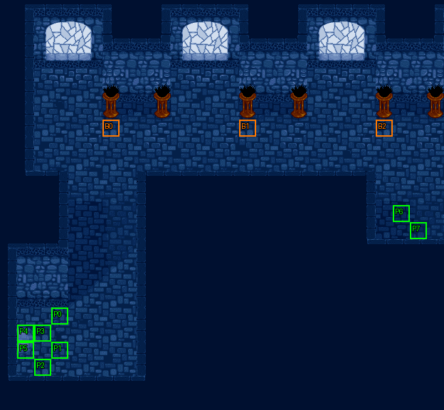

# 第 9 章　布蘭多與蓋亞

<!-- chapter_docs:header -->
| 項目 | 內容 |
| --- | --- |
| 章號／章節索引 | 9／8 |
| 章名（文字區塊 `0x01`） | 布蘭多與蓋亞 |
| 勝利條件（`0x02`） | 敵人全滅 |
| 敗北條件（`0x03`） | 蘭迪斯　布蘭多或蓋亞／其中一人死亡 |
| 戰場 | `MAP08.DAT`／`MAP08.COD`／`M08.DTL`，26×24 格，我方 slot 8 個，部署記錄 31 筆 |
| 文字區塊 | `FDETXT09.TXT`，24 條 |
| 進入處理（`0x60074`[8]） | `fdps_chapter_09_init`（`0x210b0`） |
| 行動後檢查（`0x6028c`[8]） | `fdps_chapter_09_post_action`（`0x3a840`） |
| 勝利處理（`0x60304`[8]） | `fdps_chapter_09_end`（`0x3a880`） |
| 地圖資料呼叫的事件處理（`0x601c4`） | slot 14：`fdps_chapter_09_event_deploy_wave_1`（`0x37730`）（回合事件） |
| 過場腳本 | `ICON08.DAT`（開場）、`WIN08.DAT`（勝利） |
| 本章之前的村莊 | `SHOP08.DAT` |
| 光碟 | 第 1 片（音軌見 [CD 音軌](../program_info/cd_audio.md)） |



戰場全圖（第 0 層與同步捲動的圖層）。框線：黃 `C` 寶箱、橘 `B` 埋藏格、青 `R` 重繪格、洋紅 `E` 有處理函式的格子事件格，字母後的數字是事件碼；綠 `P` 是我方 slot 的起始格。

圖由 `python tools/chapter_docs/chapter_facts.py render-maps` 從遊戲檔重畫到 `chapters/maps/`，`verify-maps` 逐 byte 比對版控中的圖。
<!-- /chapter_docs:header -->

## 概要

蘭迪斯一行趕去看發明家布蘭多的試飛典禮。布蘭多當眾宣布自己將是人類第一個飛上天的人，飛行器真的飛了起來，隨即從眾人眼前掉了下去，法蓮娜喊著「他掉下去了」，大家追了上去（開場過場 `ICON08.DAT` 的前段，在場景地圖 54）。

布蘭多摔進一處不知名的地方，在那裡發現一具機器人，拿口袋裡剩下的飛行器電池接上去，機器人蓋亞就動了起來，從此一直跟著他（`ICON08.DAT` 的中段，在場景地圖 55）。過場回到本章戰場地圖 8：宮殿的暗黑騎兵把布蘭多當成盜賊——那具機器人是索爾王送給這個國家的寶物，而且宮殿的牆壁被敲破了；布蘭多喊冤說是機器人自己要跟著他。法蓮娜趕到，布蘭多向她求救，暗黑騎兵便認定隊伍是同夥，要把所有人一網打盡。

敵人全滅後，勝利過場 `WIN08.DAT` 切到場景地圖 57：隊伍與布蘭多、蓋亞逃出宮殿，法蓮娜說布蘭多大鬧宮殿、搶走機器人，恐怕會被列入懸賞名單；裘娜發現衛兵追了過來，七名騎兵趕到喊著「捉起來」，全體往下方逃走。

## 加入與離隊

布蘭多（角色編號 `08`）與蓋亞（`09`）在本章的進入處理 `fdps_chapter_09_init`（`0x210b0`）一起入隊，是正式隊員而不是客串（入隊規則與名冊記錄見 [`assets/characters.md` 的「加入」](../assets/characters.md#加入)）。本章之前的隊伍是第 1–4、7、8 章各加入一人的六人，兩人依序排在名冊 slot 6、7；`MAP08.DAT` 宣告 8 個我方 slot，剛好全員上場。`MAP08.DAT` 沒有任何一筆部署記錄是這兩人，他們以名冊記錄出戰。

兩人的起始格不在隊伍身邊：slot 6 的布蘭多在 (23, 12)、slot 7 的蓋亞在 (24, 13)，位於地圖右側的平台，與其餘六人所在的左下房間相隔整座宮殿。本章沒有人離隊。

## 勝敗條件與特殊機制

- **勝利**：陣營 0 的單位全部退場，判定在共用的 `fdps_battle_check_default_end_conditions`（`0x3a2e0`），由本章的行動後處理 `fdps_chapter_09_post_action`（`0x3a840`）呼叫。從未部署的波次 FF 記錄不在單位陣列裡，不影響過關；第 15 回合之前清光波次 0 就直接過關，波次 1 不會出場。
- **敗北：蘭迪斯**：共用判定看單位索引 0 是否退場。
- **敗北：布蘭多或蓋亞**：`fdps_chapter_09_post_action`（`0x3a840`）另外以 `fdps_unit_is_retired`（`0x109b0`）看**單位索引 6、7**，任一個退場就寫敗北。這是單位位置而不是角色編號，對到兩人是因為名冊依入隊順序排列、地圖依 slot 從名冊前端取人。這一寫不看結束碼現值、排在共用判定之後，所以同一次行動清光敵人又失去其中一人，結果是敗北（形狀見 [`program_info/chapter.md`](../program_info/chapter.md)）。行動後處理在中毒結算之後也會被呼叫，所以兩人中毒而死同樣判敗北。

畫面上的勝敗條件文字（`0x02`、`0x03`）與程式一致。本章的部署記錄沒有任何敗北用的死亡腳本，三個敗北條件全由行動後處理判定。

**援軍**：`MAP08.DAT` 的回合事件表只有一筆（回合 15、slot 14、陣營階段 0）：第 15 回合我方行動結束、「敵方回合」字卡之後，`fdps_chapter_09_event_deploy_wave_1`（`0x37730`）把波次 1 的六名敵人部署到右側平台——正是布蘭多與蓋亞的起始區——並顯示暗黑騎兵的台詞 `0x17`。處理函式本身沒有任何一次性的保護，只發生一次是因為回合事件表只有這一筆。

本章沒有格子事件，也沒有回合限制。

## 敵人配置

進入戰場時在場的是波次 0 的 24 名敵人，全部等級 13–14，分成三群：

- **左側走道**（錨點 (4–7, 9–13)）：弓兵、冰魔導士、騎兵、暗黑騎兵、傭兵各 2 名，全是行為 2（對手不進入攻擊範圍就原地不動），堵在左下房間通往上方大廳的走道上。
- **大廳中央**（錨點 (11–13, 6–9)）：弓兵 2、魔導士 1、騎兵 3、傭兵 2、暗黑騎兵 1，同樣是行為 2。
- **大廳右上**（錨點 (18–21, 4–8)）：冰魔導士 1、暗黑騎兵 2、傭兵 2，是行為 0，開戰就主動出擊，最近的對手是右側平台上的布蘭多與蓋亞。

第 15 回合的援軍（波次 1）是暗黑騎兵、傭兵、弓兵各 2 名，全是行為 0；錨點 (22–25, 12–13) 與布蘭多、蓋亞的起始格重疊，以找最近空格的方式放置。另有一筆波次 FF 的弓兵記錄沒有任何呼叫部署（見下方波次 FF）。本章沒有搶寶箱或會離場的敵人。

<!-- chapter_docs:deployments -->
陣營與死亡腳本的意義見 [`resource_info/map.md`](../resource_info/map.md)，AI 行為（低 4 bit）見 [`program_info/map_ai.md`](../program_info/map_ai.md#行為代碼)；錨點是 `MAPnn.COD` 的座標，開場波次放在錨點上，其餘波次依部署方式放在錨點或最近的空格。單位名是全域文字的「角色編號 + 1」條；角色編號 `3C` 以上的敵兵，數值（`ENEMYDAT.DAT`）與種族、職業見 [`assets/enemies.md`](../assets/enemies.md)，以下的見 [`assets/characters.md`](../assets/characters.md)。

我方起始格：slot 0 (3, 18)、slot 1 (3, 20)、slot 2 (2, 21)、slot 3 (2, 19)、slot 4 (1, 19)、slot 5 (1, 20)、slot 6 (23, 12)、slot 7 (24, 13)。

| 波次 | 陣營 | 單位 | 等級 | 數量 |
| ---: | --- | --- | --- | ---: |
| 0 | 敵方 | `5D` 弓兵 | 13 | 4 |
| 0 | 敵方 | `66` 魔導士 | 14 | 1 |
| 0 | 敵方 | `65` 冰魔導士 | 14 | 3 |
| 0 | 敵方 | `58` 騎兵 | 13 | 5 |
| 0 | 敵方 | `56` 傭兵 | 13 | 6 |
| 0 | 敵方 | `4C` 暗黑騎兵 | 13 | 5 |
| 1 | 敵方 | `4C` 暗黑騎兵 | 13 | 2 |
| 1 | 敵方 | `56` 傭兵 | 13 | 2 |
| 1 | 敵方 | `5D` 弓兵 | 13 | 2 |

### 波次 0

出場：進入戰場時由 `fdps_build_map_unit_array`（`0x22be0`） 部署在錨點上

| # | 陣營 | 單位 | 等級 | AI 行為 | 錨點 | 死亡腳本 |
| ---: | --- | --- | ---: | --- | --- | --- |
| 0 | 敵方 | `5D` 弓兵 | 13 | 2 原地 | (13, 7) | — |
| 2 | 敵方 | `5D` 弓兵 | 13 | 2 原地 | (6, 9) | — |
| 3 | 敵方 | `5D` 弓兵 | 13 | 2 原地 | (5, 9) | — |
| 4 | 敵方 | `5D` 弓兵 | 13 | 2 原地 | (13, 8) | — |
| 5 | 敵方 | `66` 魔導士 | 14 | 2 原地 | (12, 8) | 掉落 `B6` 再生藥 |
| 6 | 敵方 | `65` 冰魔導士 | 14 | 2 原地 | (6, 10) | — |
| 7 | 敵方 | `65` 冰魔導士 | 14 | 2 原地 | (5, 10) | — |
| 8 | 敵方 | `65` 冰魔導士 | 14 | 0 主動 | (18, 4) | — |
| 9 | 敵方 | `58` 騎兵 | 13 | 2 原地 | (11, 6) | 掉落 3000 金 |
| 10 | 敵方 | `58` 騎兵 | 13 | 2 原地 | (12, 9) | — |
| 11 | 敵方 | `58` 騎兵 | 13 | 2 原地 | (12, 6) | — |
| 12 | 敵方 | `58` 騎兵 | 13 | 2 原地 | (4, 10) | — |
| 13 | 敵方 | `58` 騎兵 | 13 | 2 原地 | (7, 10) | — |
| 14 | 敵方 | `56` 傭兵 | 13 | 2 原地 | (11, 8) | — |
| 15 | 敵方 | `56` 傭兵 | 13 | 0 主動 | (21, 8) | 掉落 `B6` 再生藥 |
| 16 | 敵方 | `56` 傭兵 | 13 | 2 原地 | (11, 7) | — |
| 17 | 敵方 | `56` 傭兵 | 13 | 2 原地 | (6, 13) | — |
| 18 | 敵方 | `56` 傭兵 | 13 | 0 主動 | (21, 7) | — |
| 19 | 敵方 | `56` 傭兵 | 13 | 2 原地 | (5, 13) | — |
| 20 | 敵方 | `4C` 暗黑騎兵 | 13 | 2 原地 | (4, 12) | — |
| 21 | 敵方 | `4C` 暗黑騎兵 | 13 | 2 原地 | (11, 9) | — |
| 22 | 敵方 | `4C` 暗黑騎兵 | 13 | 2 原地 | (7, 12) | — |
| 23 | 敵方 | `4C` 暗黑騎兵 | 13 | 0 主動 | (19, 4) | — |
| 24 | 敵方 | `4C` 暗黑騎兵 | 13 | 0 主動 | (19, 5) | 掉落 1000 金 |

### 波次 1

出場：第 15 回合我方行動結束、敵方階段開始前，`MAP08.DAT` 的回合事件呼叫事件 slot 14 的 `fdps_chapter_09_event_deploy_wave_1`（`0x37730`），以找最近空格的方式部署在右側平台（布蘭多與蓋亞的起始區）；在那之前敵人已全滅就不會出場

| # | 陣營 | 單位 | 等級 | AI 行為 | 錨點 | 死亡腳本 |
| ---: | --- | --- | ---: | --- | --- | --- |
| 25 | 敵方 | `4C` 暗黑騎兵 | 13 | 0 主動 | (23, 12) | — |
| 26 | 敵方 | `4C` 暗黑騎兵 | 13 | 0 主動 | (24, 12) | — |
| 27 | 敵方 | `56` 傭兵 | 13 | 0 主動 | (23, 13) | — |
| 28 | 敵方 | `56` 傭兵 | 13 | 0 主動 | (24, 13) | — |
| 29 | 敵方 | `5D` 弓兵 | 13 | 0 主動 | (22, 12) | — |
| 30 | 敵方 | `5D` 弓兵 | 13 | 0 主動 | (25, 12) | — |

### 波次 FF

1 筆記錄（#1）永遠不會部署：本章唯一的部署處理函式 `fdps_chapter_09_event_deploy_wave_1`（`0x37730`）只要波次 1，`ICON08.DAT` 在地圖 8 上沒有 `DEPLOY_WAVE`，沒有任何呼叫以 255 部署地圖 8，見 [S11](../cut_content/story.md#s11-18-筆波次-0xff-的部署記錄)。
<!-- /chapter_docs:deployments -->

## 寶物

三件寶物都是埋藏格，位在大廳上排火盆的正下方（由左數第 1、3、5 座）。另有四名敵人帶掉落：魔導士（#5）與右上的傭兵（#15）各掉一個再生藥，大廳的騎兵（#9）掉 3000 金，右上的暗黑騎兵（#24）掉 1000 金。沒有處理函式另外發放物品。

<!-- chapter_docs:treasure -->
搜尋的規則（同碼的格共用一筆記錄與一個旗標、背包滿時的交換）見 [`resource_info/map.md`](../resource_info/map.md)。

| 事件碼 | 格 | 內容 |
| ---: | --- | --- |
| 0 | (6, 7) 埋藏 | 8000 金 |
| 1 | (14, 7) 埋藏 | `D6` 生命之實 |
| 2 | (22, 7) 埋藏 | `D7` 魔力水晶 |

擊倒後掉落（死亡腳本 opcode 0／1，擊殺者須是存活的我方單位）：

| # | 單位 | 波次 | 掉落 |
| ---: | --- | ---: | --- |
| 5 | `66` 魔導士 | 0 | 掉落 `B6` 再生藥 |
| 9 | `58` 騎兵 | 0 | 掉落 3000 金 |
| 15 | `56` 傭兵 | 0 | 掉落 `B6` 再生藥 |
| 24 | `4C` 暗黑騎兵 | 0 | 掉落 1000 金 |
<!-- /chapter_docs:treasure -->

## 村莊

本章之前這座村莊的秘密商店暗號是 `B A R N A D O`（[`program_info/village.md`](../program_info/village.md)）；武器店的招呼 `0x05`（「布蘭多爺爺是大紅人，你只要報出他的名字，什麼商店也進得去」，由 `fdps_run_weapon_shop`（`0x35fd0`）顯示）就是這個暗號的提示。

<!-- chapter_docs:village -->
第 8 章勝利後、本章之前的村莊載入 `SHOP08.DAT`，道具店、武器店、秘密商店的貨見 [`assets/shops.md`](../assets/shops.md)。村莊載入的文字區塊是 `FDETXT09`（章節索引 + 1，`fdps_load_field_chapter_resources`（`0x31540`）），也就是本章的區塊，所以村莊畫面的文字是本章區塊的 `0x04`–`0x08`，全文在下方「對話」。
<!-- /chapter_docs:village -->

## 處理流程

### 進入：`fdps_chapter_09_init`（`0x210b0`）

1. `fdps_roster_add_character`（`0x23bc0`）加入角色 `08` 布蘭多，落在名冊 slot 6。
2. 再以同一支加入角色 `09` 蓋亞，落在名冊 slot 7。兩次加入的順序決定誰站 (23, 12)、誰站 (24, 13)。
3. `fdps_chapter_state_reset`（`0x22750`）依名冊重建地圖 8 的單位陣列：8 個我方 slot 與 24 筆波次 0 記錄。這一步建出的陣列在本章不留到戰場：開場過場第一個 `SWITCH_MAP` 就把它換掉，最後的 `SWITCH_MAP` 0x08 再以同一支依名冊重建地圖 8。所以兩次加入必須在開場過場之前，否則 slot 6、7 會被建成退場的空位；排在這一步之前或之後都一樣。
4. `fdps_icon_script_run`（`0x21650`）執行開場過場 `ICON08.DAT`：先後切到場景地圖 54、55（期間以 `DEPLOY_WAVE` 部署的是地圖 55 的波次 1，也就是場景裡的蓋亞），最後 `SWITCH_MAP` 回地圖 8 重建單位陣列，之後沒有 `DEPLOY_WAVE`。
5. `fdps_show_chapter_title_card`（`0x20c60`）顯示章名卡。
6. `fdps_map_cursor_move_to_unit`（`0x2da50`）把游標移到單位 0。

本處理沒有任何分支，也不寫任何單位欄位。

### 行動後檢查：`fdps_chapter_09_post_action`（`0x3a840`）

1. 呼叫 `fdps_battle_check_default_end_conditions`（`0x3a2e0`）：敵人全滅寫 2，單位 0 退場寫 1。
2. `fdps_unit_is_retired`（`0x109b0`）看單位 6；只有它未退場時才再看單位 7。任一個退場就把結束碼寫成 1（敗北），不看目前值，因此會蓋掉步驟 1 剛寫的 2。

### 勝利：`fdps_chapter_09_end`（`0x3a880`）

1. `fdps_battle_destroy_remaining_enemies`（`0x39e10`）清掉陣營 0 的殘存單位。
2. `fdps_roster_write_back_battle_units`（`0x23980`）把戰場上的隊員寫回名冊，布蘭多與蓋亞也照一般隊員寫回。
3. `fdps_icon_script_run`（`0x21650`）執行勝利過場 `WIN08.DAT`（切到場景地圖 57）。
4. `fdps_roster_revive_fallen_members`（`0x39e70`）讓陣亡隊員復活。
5. 章節索引寫成 9，接下來是第 10 章之前的村莊與 [第 10 章](ch10.md)。

本處理不發放任何物品或法術。

### 援軍：`fdps_chapter_09_event_deploy_wave_1`（`0x37730`）

由回合事件（第 15 回合、敵方階段開始前）以事件 slot 14 呼叫。

1. 把收到的單位索引參數寫成 0；之後沒有任何地方讀它。
2. `fdps_deploy_wave`（`0x23830`）以目前章節索引（8）部署波次 1，找最近空格放置：六名敵人出現在右側平台。
3. `fdps_draw_text`（`0x1ff60`）顯示本章文字 `0x17`：暗黑騎兵（肖像角色 `4C`）喊「擾亂宮殿的就是那些人嗎？抓起來！」。先部署、後說話。

沒有回合檢查、沒有一次性旗標。

## 回合事件與格子事件

<!-- chapter_docs:events -->
觸發時機與陣營階段的意義見 [`resource_info/map.md`](../resource_info/map.md)。

| 回合 | 陣營階段 | slot | 處理函式 |
| ---: | --- | ---: | --- |
| 15 | 敵方階段前 | 14 | `fdps_chapter_09_event_deploy_wave_1`（`0x37730`） |

本章沒有格子事件。
<!-- /chapter_docs:events -->

## 過場腳本

`ICON08.DAT` 在地圖 54、55 顯示的對話取自 `FDETXT55`、`FDETXT56`，本章區塊裡同樣內容的複本不會顯示；回到地圖 8 之後的 `0x12`、`0x13` 才是本章區塊。`WIN08.DAT` 一開頭就切到地圖 57，對話全部取自 `FDETXT58`。

<!-- chapter_docs:scripts -->
格式與每個指令的意義見 [`resource_info/cutscene_script.md`](../resource_info/cutscene_script.md)。`FDETXT09#0xNN` 是本章文字區塊的條目，全文在下方「對話」；切到額外場景之後顯示的文字直接列出（那些區塊的正典是 [`assets/text/scene_text.md`](../assets/text/scene_text.md)）。`u3=我方1` 是地圖單位索引 3 對到我方 slot 1，`u12=MAP02#9` 是 `MAP02.DAT` 第 9 筆部署記錄。

### `ICON08.DAT`

- 開場：`fdps_chapter_09_init`（`0x210b0`）
- 885 byte、175 步；起始地圖 8，切換地圖 54 → 55 → 8，結束於地圖 8

| 偏移 | 指令 | 內容 |
| ---: | --- | --- |
| `0000` | `FADE_OUT` | 淡出，每步 40 ms |
| `0002` | `SET_MUSIC` | 音樂 15（CD 第 16 軌） |
| `0004` | `SWITCH_MAP` | 切換地圖 → 54（MAP54，文字 FDETXT55） |
| `0006` | `SCROLL_VIEW` | 捲動視野到格 (2, 5) |
| `0009` | `FACE_UNITS` | 轉向後停 1 幀：u0=MAP54#0(角色0x00)朝上、u9=MAP54#9(角色0x81)朝上、u13=MAP54#13(角色0x85)朝上、u10=MAP54#10(角色0x82)朝右、u11=MAP54#11(角色0x83)朝左 |
| `0016` | `FADE_IN` | 淡入，每步 40 ms |
| `0018` | `WALK_UNITS` | 行走 3 格，每步 4 幀：u0=MAP54#0(角色0x00)往上、u1=MAP54#1(角色0x01)往上、u2=MAP54#2(角色0x02)往上、u3=MAP54#3(角色0x03)往上、u4=MAP54#4(角色0x04)往上、u5=MAP54#5(角色0x06)往上 |
| `0028` | `DRAW_TEXT` | 顯示文字 FDETXT55#0x09 「{speaker char=1}快！快！{br}表演就要開始了！{br}{speaker char=4}人真能靠機器飛上天？{br}哈哈哈～！{br}我才不信呢！」 |
| `002a` | `SHAKE_VIEW` | 視野位移 8 步，每步 1 幀：(0,-6) (0,-12) (0,-18) (0,-24) (0,-30) (0,-36) (0,-42) (0,-48) |
| `003d` | `SET_VIEW_TILE` | 視野直接設到格 (2, 3) |
| `0040` | `SET_MUSIC` | 停止音樂 |
| `0042` | `WALK_UNITS` | 行走 2 格，每步 2 幀：u0=MAP54#0(角色0x00)往上、u1=MAP54#1(角色0x01)往上、u2=MAP54#2(角色0x02)往上、u3=MAP54#3(角色0x03)往上、u4=MAP54#4(角色0x04)往上、u5=MAP54#5(角色0x06)往上 |
| `0052` | `SET_MUSIC` | 音樂 14（CD 第 15 軌） |
| `0054` | `DRAW_TEXT` | 顯示文字 FDETXT55#0x0a 「{speaker char=8}咳～！{br}大家可要睜大眼睛！{br}看清楚啦！{page}這將會是人類第一次，{br}成功地飛上天空，{br}我布蘭多，{page}就是創造這紀錄的人，{br}呵呵呵～！{br}現在我要試飛了！」 |
| `0056` | `RETIRE_UNIT` | 退場 u6=MAP54#6(角色0x08) |
| `0058` | `PLAY_SAF` | 播放動畫 ICON0070.SAF |
| `005a` | `WALK_UNITS` | 行走 1 格，每步 1 幀：u4=MAP54#4(角色0x04)往上 |
| `0060` | `FACE_UNITS` | 轉向後停 8 幀：u4=MAP54#4(角色0x04)朝下 |
| `0065` | `FACE_UNITS` | 轉向後停 8 幀：u4=MAP54#4(角色0x04)朝左 |
| `006a` | `FACE_UNITS` | 轉向後停 8 幀：u4=MAP54#4(角色0x04)朝右 |
| `006f` | `DRAW_TEXT` | 顯示文字 FDETXT55#0x0b 「{speaker char=4}咦？！哎呀？{br}奇怪？{br}這東西真的可以飛！」 |
| `0071` | `WALK_UNITS` | 行走 3 格，每步 1 幀：u0=MAP54#0(角色0x00)往左、u1=MAP54#1(角色0x01)往左 |
| `0079` | `PLAY_SAF` | 播放動畫 ICON0071.SAF |
| `007b` | `FACE_UNITS` | 轉向後停 1 幀：u0=MAP54#0(角色0x00)朝左 |
| `0080` | `WALK_UNITS` | 行走 4 格，每步 1 幀：u2=MAP54#2(角色0x02)往左、u3=MAP54#3(角色0x03)往左、u4=MAP54#4(角色0x04)往左、u5=MAP54#5(角色0x06)往左 |
| `008c` | `PLAY_SAF` | 播放動畫 ICON0072.SAF |
| `008e` | `FACE_UNITS` | 轉向後停 1 幀：u0=MAP54#0(角色0x00)朝左 |
| `0093` | `DRAW_TEXT` | 顯示文字 FDETXT55#0x0c 「{speaker char=1}哎呀～！{page}你們看那裡～！{br}他掉下去了！{page}蘭迪斯，{br}我們快追上去！{br}{speaker char=0}好！我們走！」 |
| `0095` | `WALK_UNITS` | 行走 5 格，每步 1 幀：u0=MAP54#0(角色0x00)往左、u1=MAP54#1(角色0x01)往左、u2=MAP54#2(角色0x02)往左、u3=MAP54#3(角色0x03)往左、u4=MAP54#4(角色0x04)往左、u5=MAP54#5(角色0x06)往左 |
| `00a5` | `FADE_OUT` | 淡出，每步 40 ms |
| `00a7` | `SET_MUSIC` | 音樂 18（CD 第 19 軌） |
| `00a9` | `SWITCH_MAP` | 切換地圖 → 55（MAP55，文字 FDETXT56） |
| `00ab` | `SET_VIEW_TILE` | 視野直接設到格 (7, 9) |
| `00ae` | `FACE_UNITS` | 轉向後停 10 幀：u0=MAP55#0(角色0x08)朝上 |
| `00b3` | `FADE_IN` | 淡入，每步 40 ms |
| `00b5` | `FACE_UNITS` | 轉向後停 10 幀：u0=MAP55#0(角色0x08)朝右 |
| `00ba` | `FACE_UNITS` | 轉向後停 10 幀：u0=MAP55#0(角色0x08)朝左 |
| `00bf` | `FACE_UNITS` | 轉向後停 10 幀：u0=MAP55#0(角色0x08)朝上 |
| `00c4` | `FACE_UNITS` | 轉向後停 10 幀：u0=MAP55#0(角色0x08)朝下 |
| `00c9` | `WALK_UNITS` | 行走 2 格，每步 4 幀：u0=MAP55#0(角色0x08)往左 |
| `00cf` | `DRAW_TEXT` | 顯示文字 FDETXT56#0x09 「{speaker char=8}這裡是哪裡呀？{br}有人在嗎～？」 |
| `00d1` | `WALK_UNITS` | 行走 2 格，每步 4 幀：u0=MAP55#0(角色0x08)往右 |
| `00d7` | `FACE_UNITS` | 轉向後停 10 幀：u0=MAP55#0(角色0x08)朝上 |
| `00dc` | `FACE_UNITS` | 轉向後停 10 幀：u0=MAP55#0(角色0x08)朝左 |
| `00e1` | `FACE_UNITS` | 轉向後停 10 幀：u0=MAP55#0(角色0x08)朝下 |
| `00e6` | `FACE_UNITS` | 轉向後停 10 幀：u0=MAP55#0(角色0x08)朝右 |
| `00eb` | `DRAW_TEXT` | 顯示文字 FDETXT56#0x09 「{speaker char=8}這裡是哪裡呀？{br}有人在嗎～？」 |
| `00ed` | `WALK_UNITS` | 行走 3 格，每步 4 幀：u0=MAP55#0(角色0x08)往上 |
| `00f3` | `FACE_UNITS` | 轉向後停 10 幀：u0=MAP55#0(角色0x08)朝左 |
| `00f8` | `FACE_UNITS` | 轉向後停 10 幀：u0=MAP55#0(角色0x08)朝上 |
| `00fd` | `FACE_UNITS` | 轉向後停 10 幀：u0=MAP55#0(角色0x08)朝下 |
| `0102` | `DRAW_TEXT` | 顯示文字 FDETXT56#0x09 「{speaker char=8}這裡是哪裡呀？{br}有人在嗎～？」 |
| `0104` | `SCROLL_VIEW` | 捲動視野到格 (11, 5) |
| `0107` | `WALK_UNITS` | 行走 9 格，每步 2 幀：u0=MAP55#0(角色0x08)往右 |
| `010d` | `SCROLL_VIEW` | 捲動視野到格 (14, 5) |
| `0110` | `FACE_UNITS` | 轉向後停 10 幀：u0=MAP55#0(角色0x08)朝上 |
| `0115` | `DRAW_TEXT` | 顯示文字 FDETXT56#0x0a 「{speaker char=8}咦？這個機器人是﹒﹒{br}呀！正好口袋裡，{br}還有個飛行器電池！{page}我來試試看吧！」 |
| `0117` | `SCROLL_VIEW` | 捲動視野到格 (14, 2) |
| `011a` | `RETIRE_UNIT` | 退場 u0=MAP55#0(角色0x08) |
| `011c` | `RETIRE_UNIT` | 退場 u1=MAP55#2(角色0x9b) |
| `011e` | `PLAY_SAF` | 播放動畫 ICON0028.SAF |
| `0120` | `REVIVE_UNIT` | 復歸 u0=MAP55#0(角色0x08)（清狀態） |
| `0122` | `PLACE_UNIT` | 放置 u0=MAP55#0(角色0x08) 到 (20, 7)，朝上 |
| `0127` | `DEPLOY_WAVE` | 部署 MAP55 波次 1（錨點原位）：#1(角色0x09) |
| `012a` | `DRAW_TEXT` | 顯示文字 FDETXT56#0x0b 「{speaker char=9}嗶﹒﹒吱吱﹒﹒{br}{speaker char=8}咦？真的動了？」 |
| `012c` | `WALK_UNITS` | 行走 1 格，每步 4 幀：u0=MAP55#0(角色0x08)往下 |
| `0132` | `WALK_UNITS` | 行走 1 格，每步 1 幀：u2=MAP55#1(角色0x09)往下 |
| `0138` | `FACE_UNITS` | 轉向後停 5 幀：u0=MAP55#0(角色0x08)朝上 |
| `013d` | `SCROLL_VIEW` | 捲動視野到格 (14, 5) |
| `0140` | `FACE_UNITS` | 轉向後停 5 幀：u0=MAP55#0(角色0x08)朝下 |
| `0145` | `SCROLL_VIEW` | 捲動視野到格 (14, 7) |
| `0148` | `WALK_UNITS` | 行走 2 格，每步 2 幀：u0=MAP55#0(角色0x08)往下 |
| `014e` | `WALK_UNITS` | 行走 2 格，每步 1 幀：u2=MAP55#1(角色0x09)往下 |
| `0154` | `FACE_UNITS` | 轉向後停 5 幀：u0=MAP55#0(角色0x08)朝上 |
| `0159` | `DRAW_TEXT` | 顯示文字 FDETXT56#0x0c 「{speaker char=8}咦？{br}你不要一直跟著我嘛！{br}真是糟糕！{page}要是能出去就好了！{br}{speaker char=9}嗶﹒﹒吱吱﹒﹒咯咯」 |
| `015b` | `FACE_UNITS` | 轉向後停 8 幀：u2=MAP55#1(角色0x09)朝右 |
| `0160` | `FACE_UNITS` | 轉向後停 8 幀：u2=MAP55#1(角色0x09)朝左 |
| `0165` | `FACE_UNITS` | 轉向後停 8 幀：u2=MAP55#1(角色0x09)朝上 |
| `016a` | `WALK_UNITS` | 行走 2 格，每步 2 幀：u2=MAP55#1(角色0x09)往上 |
| `0170` | `WALK_UNITS` | 行走 1 格，每步 2 幀：u2=MAP55#1(角色0x09)往右 |
| `0176` | `WALK_UNITS` | 行走 2 格，每步 2 幀：u2=MAP55#1(角色0x09)往上 |
| `017c` | `WALK_UNITS` | 行走 2 格，每步 1 幀：u2=MAP55#1(角色0x09)往上 |
| `0182` | `WALK_UNITS` | 行走 2 格，每步 1 幀：u0=MAP55#0(角色0x08)往上 |
| `0188` | `FADE_OUT` | 淡出，每步 40 ms |
| `018a` | `RETIRE_UNIT` | 退場 u0=MAP55#0(角色0x08) |
| `018c` | `RETIRE_UNIT` | 退場 u2=MAP55#1(角色0x09) |
| `018e` | `REVIVE_UNIT` | 復歸 u0=MAP55#0(角色0x08)（清狀態） |
| `0190` | `PLACE_UNIT` | 放置 u0=MAP55#0(角色0x08) 到 (0, 0)，朝下 |
| `0195` | `SET_VIEW_TILE` | 視野直接設到格 (14, 2) |
| `0198` | `FACE_UNITS` | 轉向後停 1 幀：u0=MAP55#0(角色0x08)朝上 |
| `019d` | `FADE_IN` | 淡入，每步 40 ms |
| `019f` | `PLAY_SAF` | 播放動畫 ICON0029.SAF |
| `01a1` | `SET_MUSIC` | 音樂 12（CD 第 13 軌） |
| `01a3` | `FADE_OUT` | 淡出，每步 40 ms |
| `01a5` | `SWITCH_MAP` | 切換地圖 → 8（MAP08，文字 FDETXT09） |
| `01a7` | `SET_VIEW_TILE` | 視野直接設到格 (13, 8) |
| `01aa` | `FACE_UNITS` | 轉向後停 25 幀：u0=我方0朝右、u1=我方1朝右、u2=我方2朝右、u3=我方3朝右、u4=我方4朝右、u5=我方5朝右、u6=我方6朝上、u7=我方7朝上 |
| `01bd` | `FADE_IN` | 淡入，每步 20 ms |
| `01bf` | `FACE_UNITS` | 轉向後停 25 幀：u6=我方6朝上 |
| `01c4` | `SHAKE_VIEW` | 視野位移 3 步，每步 2 幀：(0,-8) (0,-16) (0,-24) |
| `01cd` | `SCROLL_VIEW` | 捲動視野到格 (13, 7) |
| `01d0` | `SHAKE_VIEW` | 視野位移 3 步，每步 2 幀：(0,-8) (0,-16) (0,-24) |
| `01d9` | `SCROLL_VIEW` | 捲動視野到格 (13, 6) |
| `01dc` | `SHAKE_VIEW` | 視野位移 3 步，每步 2 幀：(0,-8) (0,-16) (0,-24) |
| `01e5` | `SCROLL_VIEW` | 捲動視野到格 (13, 5) |
| `01e8` | `SHAKE_VIEW` | 視野位移 3 步，每步 2 幀：(0,-8) (0,-16) (0,-24) |
| `01f1` | `SCROLL_VIEW` | 捲動視野到格 (13, 4) |
| `01f4` | `SHAKE_VIEW` | 視野位移 3 步，每步 2 幀：(0,-8) (0,-16) (0,-24) |
| `01fd` | `SCROLL_VIEW` | 捲動視野到格 (13, 3) |
| `0200` | `SHAKE_VIEW` | 視野位移 3 步，每步 2 幀：(0,-8) (0,-16) (0,-24) |
| `0209` | `SCROLL_VIEW` | 捲動視野到格 (13, 2) |
| `020c` | `SHAKE_VIEW` | 視野位移 3 步，每步 2 幀：(0,-8) (0,-16) (0,-24) |
| `0215` | `SCROLL_VIEW` | 捲動視野到格 (13, 1) |
| `0218` | `SHAKE_VIEW` | 視野位移 3 步，每步 2 幀：(-8,0) (-16,0) (-24,0) |
| `0221` | `SCROLL_VIEW` | 捲動視野到格 (12, 1) |
| `0224` | `SHAKE_VIEW` | 視野位移 3 步，每步 2 幀：(-8,0) (-16,0) (-24,0) |
| `022d` | `SCROLL_VIEW` | 捲動視野到格 (11, 1) |
| `0230` | `SHAKE_VIEW` | 視野位移 3 步，每步 2 幀：(-8,0) (-16,0) (-24,0) |
| `0239` | `SCROLL_VIEW` | 捲動視野到格 (10, 1) |
| `023c` | `SHAKE_VIEW` | 視野位移 3 步，每步 2 幀：(-8,0) (-16,0) (-24,0) |
| `0245` | `SCROLL_VIEW` | 捲動視野到格 (9, 1) |
| `0248` | `SHAKE_VIEW` | 視野位移 3 步，每步 2 幀：(-8,0) (-16,0) (-24,0) |
| `0251` | `SCROLL_VIEW` | 捲動視野到格 (8, 1) |
| `0254` | `SHAKE_VIEW` | 視野位移 3 步，每步 2 幀：(-8,0) (-16,0) (-24,0) |
| `025d` | `SCROLL_VIEW` | 捲動視野到格 (7, 1) |
| `0260` | `SHAKE_VIEW` | 視野位移 3 步，每步 2 幀：(-8,0) (-16,0) (-24,0) |
| `0269` | `SCROLL_VIEW` | 捲動視野到格 (6, 1) |
| `026c` | `SHAKE_VIEW` | 視野位移 3 步，每步 2 幀：(-8,0) (-16,0) (-24,0) |
| `0275` | `SCROLL_VIEW` | 捲動視野到格 (5, 1) |
| `0278` | `SHAKE_VIEW` | 視野位移 3 步，每步 2 幀：(-8,0) (-16,0) (-24,0) |
| `0281` | `SCROLL_VIEW` | 捲動視野到格 (4, 1) |
| `0284` | `SHAKE_VIEW` | 視野位移 3 步，每步 2 幀：(-8,0) (-16,0) (-24,0) |
| `028d` | `SCROLL_VIEW` | 捲動視野到格 (3, 1) |
| `0290` | `SHAKE_VIEW` | 視野位移 3 步，每步 2 幀：(-8,0) (-16,0) (-24,0) |
| `0299` | `SCROLL_VIEW` | 捲動視野到格 (2, 1) |
| `029c` | `SHAKE_VIEW` | 視野位移 3 步，每步 2 幀：(-8,0) (-16,0) (-24,0) |
| `02a5` | `SCROLL_VIEW` | 捲動視野到格 (1, 1) |
| `02a8` | `SHAKE_VIEW` | 視野位移 3 步，每步 2 幀：(-8,0) (-16,0) (-24,0) |
| `02b1` | `SCROLL_VIEW` | 捲動視野到格 (0, 1) |
| `02b4` | `SHAKE_VIEW` | 視野位移 3 步，每步 2 幀：(0,8) (0,16) (0,24) |
| `02bd` | `SCROLL_VIEW` | 捲動視野到格 (0, 2) |
| `02c0` | `SHAKE_VIEW` | 視野位移 3 步，每步 2 幀：(0,8) (0,16) (0,24) |
| `02c9` | `SCROLL_VIEW` | 捲動視野到格 (0, 3) |
| `02cc` | `SHAKE_VIEW` | 視野位移 3 步，每步 2 幀：(0,8) (0,16) (0,24) |
| `02d5` | `SCROLL_VIEW` | 捲動視野到格 (0, 4) |
| `02d8` | `SHAKE_VIEW` | 視野位移 3 步，每步 2 幀：(0,8) (0,16) (0,24) |
| `02e1` | `SCROLL_VIEW` | 捲動視野到格 (0, 5) |
| `02e4` | `SHAKE_VIEW` | 視野位移 3 步，每步 2 幀：(0,8) (0,16) (0,24) |
| `02ed` | `SCROLL_VIEW` | 捲動視野到格 (0, 6) |
| `02f0` | `SHAKE_VIEW` | 視野位移 3 步，每步 2 幀：(0,8) (0,16) (0,24) |
| `02f9` | `SCROLL_VIEW` | 捲動視野到格 (0, 7) |
| `02fc` | `SHAKE_VIEW` | 視野位移 3 步，每步 2 幀：(0,8) (0,16) (0,24) |
| `0305` | `SCROLL_VIEW` | 捲動視野到格 (0, 8) |
| `0308` | `SHAKE_VIEW` | 視野位移 3 步，每步 2 幀：(0,8) (0,16) (0,24) |
| `0311` | `SCROLL_VIEW` | 捲動視野到格 (0, 9) |
| `0314` | `SHAKE_VIEW` | 視野位移 3 步，每步 2 幀：(0,8) (0,16) (0,24) |
| `031d` | `SCROLL_VIEW` | 捲動視野到格 (0, 10) |
| `0320` | `SHAKE_VIEW` | 視野位移 3 步，每步 2 幀：(0,8) (0,16) (0,24) |
| `0329` | `SCROLL_VIEW` | 捲動視野到格 (0, 11) |
| `032c` | `SHAKE_VIEW` | 視野位移 3 步，每步 2 幀：(0,8) (0,16) (0,24) |
| `0335` | `SCROLL_VIEW` | 捲動視野到格 (0, 12) |
| `0338` | `SHAKE_VIEW` | 視野位移 3 步，每步 2 幀：(0,8) (0,16) (0,24) |
| `0341` | `SCROLL_VIEW` | 捲動視野到格 (0, 13) |
| `0344` | `SHAKE_VIEW` | 視野位移 3 步，每步 2 幀：(0,8) (0,16) (0,24) |
| `034d` | `SCROLL_VIEW` | 捲動視野到格 (0, 14) |
| `0350` | `DRAW_TEXT` | 顯示文字 FDETXT09#0x12 |
| `0352` | `WALK_UNITS` | 行走 1 格，每步 2 幀：u3=我方3往右 |
| `0358` | `SCROLL_VIEW` | 捲動視野到格 (0, 14) |
| `035b` | `FACE_UNITS` | 轉向後停 25 幀：u3=我方3朝上 |
| `0360` | `FACE_UNITS` | 轉向後停 50 幀：u3=我方3朝右 |
| `0365` | `FACE_UNITS` | 轉向後停 1 幀：u6=我方6朝左 |
| `036a` | `WALK_UNITS` | 行走 2 格，每步 1 幀：u3=我方3往右 |
| `0370` | `DRAW_TEXT` | 顯示文字 FDETXT09#0x13 |
| `0372` | `SET_MUSIC` | 停止音樂 |
| `0374` | `END` | 結束 |

### `WIN08.DAT`

- 勝利：`fdps_chapter_09_end`（`0x3a880`）
- 174 byte、19 步；起始地圖 8，切換地圖 57，結束於地圖 57

| 偏移 | 指令 | 內容 |
| ---: | --- | --- |
| `0000` | `SWITCH_MAP` | 切換地圖 → 57（MAP57，文字 FDETXT58） |
| `0002` | `SET_MUSIC` | 音樂 14（CD 第 15 軌） |
| `0004` | `SET_VIEW_TILE` | 視野直接設到格 (4, 3) |
| `0007` | `FACE_UNITS` | 轉向後停 1 幀：u0=MAP57#0(角色0x00)朝右、u1=MAP57#1(角色0x01)朝右、u2=MAP57#2(角色0x02)朝下、u4=MAP57#4(角色0x04)朝下、u5=MAP57#5(角色0x06)朝上、u6=MAP57#6(角色0x08)朝左、u7=MAP57#7(角色0x09)朝左 |
| `0018` | `DRAW_TEXT` | 顯示文字 FDETXT58#0x09 「{speaker char=0}還好﹒﹒﹒{br}他們沒有追過來。{br}{speaker char=1}布蘭多爺爺，{br}你大鬧宮殿，{br}搶走他們的機器人，{page}我看你在這裡，{br}恐怕要被列入，{br}懸賞人物名單了！{br}{speaker char=8}哎～呀呀呀！{br}這個話該怎麼講呢？{br}唉～！真是的﹒﹒{br}{speaker char=9}嗶﹒﹒吱吱﹒﹒咯咯」 |
| `001a` | `WALK_UNITS` | 行走 4 格，每步 2 幀：u3=MAP57#3(角色0x03)往下 |
| `0020` | `FACE_UNITS` | 轉向後停 8 幀：u0=MAP57#0(角色0x00)朝上、u1=MAP57#1(角色0x01)朝上、u2=MAP57#2(角色0x02)朝上、u4=MAP57#4(角色0x04)朝上、u5=MAP57#5(角色0x06)朝上、u6=MAP57#6(角色0x08)朝上、u7=MAP57#7(角色0x09)朝上 |
| `0031` | `DRAW_TEXT` | 顯示文字 FDETXT58#0x0a 「{speaker char=3}喂～！{br}我看見衛兵追過來了！{br}還不快跑！」 |
| `0033` | `FACE_UNITS` | 轉向後停 8 幀：u3=MAP57#3(角色0x03)朝上 |
| `0038` | `SHAKE_VIEW` | 視野位移 8 步，每步 1 幀：(0,-6) (0,-12) (0,-18) (0,-24) (0,-30) (0,-36) (0,-42) (0,-48) |
| `004b` | `SET_VIEW_TILE` | 視野直接設到格 (4, 1) |
| `004e` | `WALK_UNITS` | 行走 2 格，每步 1 幀：u8=MAP57#8(角色0x58)往下、u9=MAP57#9(角色0x58)往下、u10=MAP57#10(角色0x58)往下、u11=MAP57#11(角色0x58)往下、u12=MAP57#12(角色0x58)往下、u13=MAP57#13(角色0x58)往下、u14=MAP57#14(角色0x58)往下 |
| `0060` | `WALK_UNITS` | 行走 1 格，每步 1 幀：u8=MAP57#8(角色0x58)往下、u9=MAP57#9(角色0x58)往左、u10=MAP57#10(角色0x58)往右、u14=MAP57#14(角色0x58)往上 |
| `006c` | `WALK_UNITS` | 行走 1 格，每步 1 幀：u12=MAP57#12(角色0x58)往下、u13=MAP57#13(角色0x58)往左、u11=MAP57#11(角色0x58)往右 |
| `0076` | `FACE_UNITS` | 轉向後停 1 幀：u8=MAP57#8(角色0x58)朝下、u9=MAP57#9(角色0x58)朝下、u10=MAP57#10(角色0x58)朝下、u11=MAP57#11(角色0x58)朝下、u12=MAP57#12(角色0x58)朝下、u13=MAP57#13(角色0x58)朝下、u14=MAP57#14(角色0x58)朝下 |
| `0087` | `DRAW_TEXT` | 顯示文字 FDETXT58#0x0b 「{speaker char=76}呀！{br}你們還沒走！{br}捉起來！」 |
| `0089` | `WALK_UNITS` | 行走 6 格，每步 1 幀：u8=MAP57#8(角色0x58)往下、u9=MAP57#9(角色0x58)往下、u10=MAP57#10(角色0x58)往下、u11=MAP57#11(角色0x58)往下、u12=MAP57#12(角色0x58)往下、u13=MAP57#13(角色0x58)往下、u14=MAP57#14(角色0x58)往下、u0=MAP57#0(角色0x00)往下、u1=MAP57#1(角色0x01)往下、u2=MAP57#2(角色0x02)往下、u3=MAP57#3(角色0x03)往下、u4=MAP57#4(角色0x04)往下、u5=MAP57#5(角色0x06)往下、u6=MAP57#6(角色0x08)往下、u7=MAP57#7(角色0x09)往下 |
| `00ab` | `SET_MUSIC` | 停止音樂 |
| `00ad` | `END` | 結束 |
<!-- /chapter_docs:scripts -->

## 對話

<!-- chapter_docs:dialogue -->
`FDETXT09.TXT` 全部 24 條，依條目編號排列。每條先列讀取端（顯示它的腳本步驟、處理函式或死亡腳本），再列全文：【名稱】是換說話者（頭像取自括號裡的角色編號；【地圖單位 n】取執行當下第 n 個地圖單位），每一行是一次換行，▼ 是換頁（等按鍵）。`{subst1}`、`{subst2}`、`{number}` 是執行期代入的名稱與數字（[`resource_info/text.md`](../resource_info/text.md)）。

### `0x00`

永遠不會顯示：章名卡是 `CHAPTER.SAF` 圖（`fdps_show_chapter_title_card`（`0x20c60`）），沒有任何程式或腳本畫本章區塊的 0x00，見 [S13a（排除清單）](../cut_content/_index.md#排除清單)。

### `0x01`

讀取端：`fdps_draw_save_slot_panel`（`0x24a40`）

```text
布蘭多與蓋亞
```

### `0x02`

讀取端：`fdps_battle_show_win_fail_window`（`0x17ca0`）

```text
敵人全滅
```

### `0x03`

讀取端：`fdps_battle_show_win_fail_window`（`0x17ca0`）

```text
蘭迪斯　布蘭多或蓋亞
其中一人死亡
```

### `0x04`

讀取端：`fdps_village_item_menu`（`0x35860`）

```text
這裡是道具店！
▼
```

### `0x05`

讀取端：`fdps_run_weapon_shop`（`0x35fd0`）

```text
布蘭多爺爺是大紅人，
你只要報出他的名字，
什麼商店也進得去。
▼
```

### `0x06`

讀取端：`fdps_run_bar_shop`（`0x35cc0`）

```text
今天城內，
有一場精彩的表演；
布蘭多爺爺，
▼
要舉行他的試飛典禮，
你們可以去參觀參觀。
但是別站太近了，
▼
知道嗎？
他的失事率是很高的！
嘻嘻！
▼
```

### `0x07`

讀取端：`fdps_run_church_screen`（`0x35aa0`）

```text
轉職嗎？
你需要擁有光暗徽章，
才能選非固定職業。
▼
```

### `0x08`

讀取端：`fdps_run_secret_menu`（`0x36210`）

```text
這裡有新奇的東西，
買了不會吃虧喲！
▼
```

### `0x09`

永遠不會顯示：`ICON08.DAT` 在地圖 54 畫的是 `FDETXT55` 的 0x09 副本，本章區塊的 0x09 沒有讀取端，見 [S13b（排除清單）](../cut_content/_index.md#排除清單)。

### `0x0a`

永遠不會顯示：`ICON08.DAT` 在地圖 54 畫的是 `FDETXT55` 的 0x0a 副本，本章區塊的 0x0a 沒有讀取端，見 [S13b（排除清單）](../cut_content/_index.md#排除清單)。

### `0x0b`

永遠不會顯示：`ICON08.DAT` 在地圖 54 畫的是 `FDETXT55` 的 0x0b 副本，本章區塊的 0x0b 沒有讀取端，見 [S13b（排除清單）](../cut_content/_index.md#排除清單)。

### `0x0c`

永遠不會顯示：`ICON08.DAT` 在地圖 54 畫的是 `FDETXT55` 的 0x0c 副本，本章區塊的 0x0c 沒有讀取端，見 [S13b（排除清單）](../cut_content/_index.md#排除清單)。

### `0x0d`

永遠不會顯示：`ICON08.DAT` 在地圖 55 畫的是 `FDETXT56` 的 0x09 副本，本章區塊的 0x0d 沒有讀取端，見 [S13b（排除清單）](../cut_content/_index.md#排除清單)。

### `0x0e`

永遠不會顯示：`ICON08.DAT` 在地圖 55 畫的是 `FDETXT56` 的 0x0a 副本，本章區塊的 0x0e 沒有讀取端，見 [S13b（排除清單）](../cut_content/_index.md#排除清單)。

### `0x0f`

永遠不會顯示：`ICON08.DAT` 在地圖 55 畫的是 `FDETXT56` 的 0x0b 副本，本章區塊的 0x0f 沒有讀取端，見 [S13b（排除清單）](../cut_content/_index.md#排除清單)。

### `0x10`

永遠不會顯示：`ICON08.DAT` 在地圖 55 畫的是 `FDETXT56` 的 0x0c 副本，本章區塊的 0x10 沒有讀取端，見 [S13b（排除清單）](../cut_content/_index.md#排除清單)。

### `0x11`

永遠不會顯示：布蘭多命令蓋亞一起出去的對話；它在 `FDETXT56` 的副本 0x0d 也沒有腳本畫，兩個區塊都沒有讀取端，見 [S4](../cut_content/story.md#s4-寫好卻沒被顯示的對白)。

### `0x12`

讀取端：`ICON08.DAT` `0x350`

```text
【暗黑騎兵】（角色 76）
大膽盜賊！
你知道機器人來歷嗎？
▼
它是索爾王送給我國
的寶物。
你腦筋動到它頭上，
▼
真是太大膽了！
我要把你們全部，
抓起來！
【布蘭多】（角色 8）
哎～！
這不關我的事呀！
是它一直要跟著我。
【暗黑騎兵】（角色 76）
少囉嗦！
牆壁都敲破了，
還敢說是冤枉！
```

### `0x13`

讀取端：`ICON08.DAT` `0x370`

```text
【法蓮娜】（角色 1）
老爺爺～！
你們沒事吧？
摔得疼不疼呀？
【布蘭多】（角色 8）
哎～呀呀呀！
快來幫忙喲！
我被當成是小偷了！
【暗黑騎兵】（角色 76）
呀！你還有後援！
現在，
你可是不打自招了。
▼
我要把你們一網打盡！
全部捉起來！
```

### `0x14`

永遠不會顯示：勝利腳本 `WIN08.DAT` 先切到地圖 57，畫的是 `FDETXT58` 的 0x09，本章區塊的 0x14 沒有讀取端，見 [S13b（排除清單）](../cut_content/_index.md#排除清單)。

### `0x15`

永遠不會顯示：勝利腳本畫的是 `FDETXT58` 的 0x0a 副本，本章區塊的 0x15 沒有讀取端，見 [S13b（排除清單）](../cut_content/_index.md#排除清單)。

### `0x16`

永遠不會顯示：勝利腳本畫的是 `FDETXT58` 的 0x0b 副本，本章區塊的 0x16 沒有讀取端，見 [S13b（排除清單）](../cut_content/_index.md#排除清單)。

### `0x17`

讀取端：`fdps_chapter_09_event_deploy_wave_1`（`0x37730`）

```text
【暗黑騎兵】（角色 76）
擾亂宮殿的就是那些人
嗎？抓起來！
```
<!-- /chapter_docs:dialogue -->
