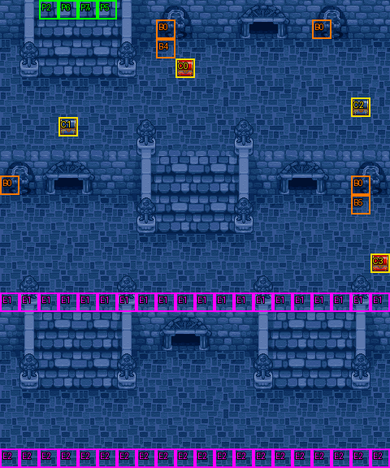

# 第 10 章　宗教法庭

<!-- chapter_docs:header -->
| 項目 | 內容 |
| --- | --- |
| 章號／章節索引 | 10／9 |
| 章名（文字區塊 `0x01`） | 宗教法庭 |
| 勝利條件（`0x02`） | 戰場底部脫離 |
| 敗北條件（`0x03`） | 蘭迪斯死亡 |
| 戰場 | `MAP09.DAT`／`MAP09.COD`／`M09.DTL`，20×24 格，我方 slot 8 個，部署記錄 48 筆 |
| 文字區塊 | `FDETXT10.TXT`，20 條 |
| 進入處理（`0x60074`[9]） | `fdps_chapter_10_init`（`0x21100`） |
| 行動後檢查（`0x6028c`[9]） | `fdps_chapter_10_post_action`（`0x3a8c0`） |
| 勝利處理（`0x60304`[9]） | `fdps_chapter_10_end`（`0x3a960`） |
| 地圖資料呼叫的事件處理（`0x601c4`） | slot 15：`fdps_chapter_10_event_deploy_wave_for_turn`（`0x37780`）（回合事件）、slot 16：`fdps_chapter_10_event_deploy_wave_10`（`0x378a0`）（格子事件） |
| 過場腳本 | `ICON09.DAT`（開場）、`WIN09.DAT`（勝利） |
| 本章之前的村莊 | `SHOP09.DAT` |
| 光碟 | 第 1 片（音軌見 [CD 音軌](../program_info/cd_audio.md)） |



戰場全圖（第 0 層與同步捲動的圖層）。框線：黃 `C` 寶箱、橘 `B` 埋藏格、青 `R` 重繪格、洋紅 `E` 有處理函式的格子事件格，字母後的數字是事件碼；綠 `P` 是我方 slot 的起始格。

圖由 `python tools/chapter_docs/chapter_facts.py render-maps` 從遊戲檔重畫到 `chapters/maps/`，`verify-maps` 逐 byte 比對版控中的圖。
<!-- /chapter_docs:header -->

## 概要

蘭迪斯一行來到一座城的城門前（開場過場 `ICON09.DAT` 先切到場景地圖 37）。守門的步兵要他們交過路稅，看上了機器人蓋亞，要他們留下蓋亞抵稅；亞克出言抗議，士兵便指他們污辱神聖的主教，把全隊抓起來送上宗教法庭，裘娜與法蓮娜被押走時一路抗議。

過場接著切到法庭（場景地圖 38）。主教（`7C` 大祭司）一人兼任法官，用一連串誘導問話讓蘭迪斯「承認」聚眾滋擾城門士兵、干預警務、污辱主教，連同褻瀆法庭判全隊死刑，再改口說只要留下機器人、交出一百萬贖罪金就考慮釋放。這時尤利安站出來，命令主教停止審判、交出職務，表明自己就是當今教皇聖杜克蘭十七世，化裝成僧侶混在隊伍裡。主教為了保住搜括來的財富，下令把他們全部殺掉滅口，蘭迪斯喊尤利安快逃。

戰場是法庭所在的建築（地圖 9）：隊伍從上方進來，要一路往下逃出戰場底部，追兵從上方、中段兩側的門與下方階梯陸續出現。全員脫離後，勝利過場 `WIN09.DAT` 回到城門，隊伍走出城外；亞克抱怨尤利安瞞了大家這麼久，尤利安說怕身分曝光後大家不願再和他在一起，蘭迪斯說大家仍當他是尤利安，布蘭多則要他發誓不會拿教皇身分逼自己一起祈禱。

## 加入與離隊

本章沒有人入隊（`fdps_chapter_10_init`（`0x21100`）沒有名冊加入呼叫），隊伍就是第 9 章結束時的八人：蘭迪斯、尤利安、亞克、法蓮娜、裘娜、費塔加、布蘭多、蓋亞（入隊規則見 [`assets/characters.md` 的「加入」](../assets/characters.md#加入)）。`MAP09.DAT` 宣告 8 個我方 slot，與隊伍人數剛好相同，所以單位索引 0–7 全是隊員、沒有空位。本章也沒有友方 NPC 或客串單位，部署記錄全是敵方。

## 勝敗條件與特殊機制

本章的行動後處理 `fdps_chapter_10_post_action`（`0x3a8c0`）**不呼叫**共用判定 `fdps_battle_check_default_end_conditions`（`0x3a2e0`），所以「敵人全滅」不是過關條件，殺光場上的敵人戰鬥也不會結束。它自己判兩件事：

- **敗北**：`fdps_unit_is_retired`（`0x109b0`）看單位索引 0（蘭迪斯），退場就寫結束碼 1。
- **過關**：對單位索引 0–7 逐一計數，一個單位「`pos_y` 等於 `0x17`（第 23 列，也就是 20×24 戰場的最下面一列）」**或**「已退場」就算一個；剛好 8 個時寫結束碼 2。

兩者是 if／else if，敗北先判，所以蘭迪斯倒下的那一次行動即使湊滿 8 個也是敗北。

畫面上的勝利條件「戰場底部脫離」與程式大致相符，差別在陣亡者：程式把已退場的隊員當成已脫離，蘭迪斯以外的人倒下並不妨礙過關，只要其餘活著的人都站在最下面一列即可。判定是當下的位置，不是「曾經到過」：先到底部的人若又走開，就不再計入，最後一人抵達時所有活著的人必須同時站在第 23 列。

第 23 列的 20 格在事件碼層都標著事件碼 2，但格子事件表的碼 2 沒有處理函式（slot `0xff`），走上去什麼都不會發生；過關完全由上面的座標判定決定。

**回合援軍**：回合事件表在第 3、6–13、19 回合的敵方階段前呼叫 `fdps_chapter_10_event_deploy_wave_for_turn`（`0x37780`）。它只看回合數：第 3 回合部署波次 1 並顯示 `0x12`；13 回合以內的其他回合部署「回合數 − 4」的波次（第 6–13 回合對到波次 2–9），並把視野依序移到左右兩扇門各停 12 幀；超過 13 回合部署波次 11 並顯示 `0x13`。沒有一次性閂鎖，每次被呼叫都完整執行，只出現一次是因為回合事件表每個回合只列一次。

**階梯伏兵**：第 15 列整列 20 格是格子事件碼 1，走進就觸發 `fdps_chapter_10_event_deploy_wave_10`（`0x378a0`）。第一個走進去的非陣營 0 單位（本章就是任何一名隊員）讓波次 10 的 10 名敵人出現在下方階梯底下；共用的一次性閂鎖（旗標元素 `0x10`）在部署前就設起，所以只觸發一次，敵方單位走過這一列不會觸發。

**40 級追兵與裂地術**：第 19 回合出現的波次 11 是 5 名 LV40 騎兵與 1 名 LV40 武士，出現在隊伍進場的左上階梯。其中第 45 筆騎兵（錨點 (3, 1)）的死亡腳本是 opcode 0、運算元 `0xFFFF`：被存活的我方單位打倒時，「撿到〇〇！！」的名稱以帶號的 −1 + `0xC9` 取到 `0xC8` 的空字串，入包的則是低 byte 的物品 `FF`，也就是攻略站所稱的 BUG 物品「裂地術」（物品表邊界見 [`assets/items.md`](../assets/items.md)，兩處寬度不同的陷阱見 [`rebuild_info/pitfalls.md`](../rebuild_info/pitfalls.md)）。在第 19 回合之前全員脫離，這一波就不會出現。

本章沒有回合限制。

## 敵人配置

進入戰場時只有波次 0 的 8 名守在原地（AI 行為 2）的敵人：4 名步兵在第 11 列、2 名騎兵與 2 名魔導士在第 12 列，守在中央階梯的下方。其餘全是陸續出現、主動進攻（行為 0）的援軍，四個出現點如下：

- **右上門**：第 3 回合的波次 1（魔導士 2、步兵 4、弓兵 2），8 筆錨點都是 (13, 2)，依找最近空格的方式散開。
- **中段左右兩門**：第 6–13 回合每回合的波次 2–9，每波 2 筆，一筆錨點 (3, 9)、一筆 (15, 9)，依序是騎兵、魔導士、騎兵、騎兵、步兵、步兵、騎兵、騎兵各一對；第 7 回合的是 LV15 魔導士。
- **下方階梯底**：隊員第一次走進第 15 列時的波次 10（弓兵 2、步兵 4、騎兵 2、魔導士 2），錨點在 (6–13, 20–21)，堵在逃往底部的路上。
- **左上階梯**：第 19 回合的波次 11（LV40 騎兵 5、LV40 武士 1），錨點 (3–5, 1–2)。

所有援軍都以找最近空格的方式放置。本章沒有搶寶箱或會離場的敵人。

<!-- chapter_docs:deployments -->
陣營與死亡腳本的意義見 [`resource_info/map.md`](../resource_info/map.md)，AI 行為（低 4 bit）見 [`program_info/map_ai.md`](../program_info/map_ai.md#行為代碼)；錨點是 `MAPnn.COD` 的座標，開場波次放在錨點上，其餘波次依部署方式放在錨點或最近的空格。單位名是全域文字的「角色編號 + 1」條；角色編號 `3C` 以上的敵兵，數值（`ENEMYDAT.DAT`）與種族、職業見 [`assets/enemies.md`](../assets/enemies.md)，以下的見 [`assets/characters.md`](../assets/characters.md)。

我方起始格：slot 0 (3, 0)、slot 1 (4, 0)、slot 2 (2, 0)、slot 3 (3, 0)、slot 4 (4, 0)、slot 5 (5, 0)、slot 6 (3, 0)、slot 7 (4, 0)。

| 波次 | 陣營 | 單位 | 等級 | 數量 |
| ---: | --- | --- | --- | ---: |
| 0 | 敵方 | `62` 步兵 | 13 | 4 |
| 0 | 敵方 | `58` 騎兵 | 13 | 2 |
| 0 | 敵方 | `66` 魔導士 | 15 | 2 |
| 1 | 敵方 | `66` 魔導士 | 15 | 2 |
| 1 | 敵方 | `62` 步兵 | 13 | 4 |
| 1 | 敵方 | `5D` 弓兵 | 13 | 2 |
| 2 | 敵方 | `58` 騎兵 | 13 | 2 |
| 3 | 敵方 | `66` 魔導士 | 15 | 2 |
| 4 | 敵方 | `58` 騎兵 | 13 | 2 |
| 5 | 敵方 | `58` 騎兵 | 13 | 2 |
| 6 | 敵方 | `62` 步兵 | 13 | 2 |
| 7 | 敵方 | `62` 步兵 | 13 | 2 |
| 8 | 敵方 | `58` 騎兵 | 13 | 2 |
| 9 | 敵方 | `58` 騎兵 | 13 | 2 |
| 10 | 敵方 | `5D` 弓兵 | 13 | 2 |
| 10 | 敵方 | `62` 步兵 | 13 | 4 |
| 10 | 敵方 | `58` 騎兵 | 13 | 2 |
| 10 | 敵方 | `66` 魔導士 | 15 | 2 |
| 11 | 敵方 | `58` 騎兵 | 40 | 5 |
| 11 | 敵方 | `63` 武士 | 40 | 1 |

### 波次 0

出場：進入戰場時由 `fdps_build_map_unit_array`（`0x22be0`） 部署在錨點上

| # | 陣營 | 單位 | 等級 | AI 行為 | 錨點 | 死亡腳本 |
| ---: | --- | --- | ---: | --- | --- | --- |
| 0 | 敵方 | `62` 步兵 | 13 | 2 原地 | (8, 11) | 掉落 `B6` 再生藥 |
| 1 | 敵方 | `62` 步兵 | 13 | 2 原地 | (9, 11) | — |
| 2 | 敵方 | `62` 步兵 | 13 | 2 原地 | (10, 11) | — |
| 3 | 敵方 | `62` 步兵 | 13 | 2 原地 | (11, 11) | — |
| 4 | 敵方 | `58` 騎兵 | 13 | 2 原地 | (8, 12) | — |
| 5 | 敵方 | `58` 騎兵 | 13 | 2 原地 | (11, 12) | — |
| 6 | 敵方 | `66` 魔導士 | 15 | 2 原地 | (9, 12) | — |
| 7 | 敵方 | `66` 魔導士 | 15 | 2 原地 | (10, 12) | — |

### 波次 1

出場：第 3 回合敵方階段前，回合事件（slot 15）呼叫 `fdps_chapter_10_event_deploy_wave_for_turn`（`0x37780`），在右上門 (13, 2) 附近以找最近空格的方式部署，接著顯示 `0x12`

| # | 陣營 | 單位 | 等級 | AI 行為 | 錨點 | 死亡腳本 |
| ---: | --- | --- | ---: | --- | --- | --- |
| 8 | 敵方 | `66` 魔導士 | 15 | 0 主動 | (13, 2) | — |
| 9 | 敵方 | `66` 魔導士 | 15 | 0 主動 | (13, 2) | 掉落 `B8` 魔法水 |
| 10 | 敵方 | `62` 步兵 | 13 | 0 主動 | (13, 2) | — |
| 11 | 敵方 | `62` 步兵 | 13 | 0 主動 | (13, 2) | — |
| 12 | 敵方 | `62` 步兵 | 13 | 0 主動 | (13, 2) | 掉落 1500 金 |
| 13 | 敵方 | `62` 步兵 | 13 | 0 主動 | (13, 2) | — |
| 14 | 敵方 | `5D` 弓兵 | 13 | 0 主動 | (13, 2) | — |
| 15 | 敵方 | `5D` 弓兵 | 13 | 0 主動 | (13, 2) | — |

### 波次 2

出場：第 6 回合敵方階段前，`fdps_chapter_10_event_deploy_wave_for_turn`（`0x37780`）以「回合數 − 4」部署，中段左右門 (3, 9)／(15, 9) 各一

| # | 陣營 | 單位 | 等級 | AI 行為 | 錨點 | 死亡腳本 |
| ---: | --- | --- | ---: | --- | --- | --- |
| 16 | 敵方 | `58` 騎兵 | 13 | 0 主動 | (3, 9) | — |
| 17 | 敵方 | `58` 騎兵 | 13 | 0 主動 | (15, 9) | 掉落 `B6` 再生藥 |

### 波次 3

出場：第 7 回合敵方階段前，`fdps_chapter_10_event_deploy_wave_for_turn`（`0x37780`）以「回合數 − 4」部署，中段左右門各一

| # | 陣營 | 單位 | 等級 | AI 行為 | 錨點 | 死亡腳本 |
| ---: | --- | --- | ---: | --- | --- | --- |
| 18 | 敵方 | `66` 魔導士 | 15 | 0 主動 | (15, 9) | — |
| 19 | 敵方 | `66` 魔導士 | 15 | 0 主動 | (3, 9) | — |

### 波次 4

出場：第 8 回合敵方階段前，`fdps_chapter_10_event_deploy_wave_for_turn`（`0x37780`）以「回合數 − 4」部署，中段左右門各一

| # | 陣營 | 單位 | 等級 | AI 行為 | 錨點 | 死亡腳本 |
| ---: | --- | --- | ---: | --- | --- | --- |
| 20 | 敵方 | `58` 騎兵 | 13 | 0 主動 | (15, 9) | — |
| 21 | 敵方 | `58` 騎兵 | 13 | 0 主動 | (3, 9) | — |

### 波次 5

出場：第 9 回合敵方階段前，`fdps_chapter_10_event_deploy_wave_for_turn`（`0x37780`）以「回合數 − 4」部署，中段左右門各一

| # | 陣營 | 單位 | 等級 | AI 行為 | 錨點 | 死亡腳本 |
| ---: | --- | --- | ---: | --- | --- | --- |
| 22 | 敵方 | `58` 騎兵 | 13 | 0 主動 | (15, 9) | — |
| 23 | 敵方 | `58` 騎兵 | 13 | 0 主動 | (3, 9) | — |

### 波次 6

出場：第 10 回合敵方階段前，`fdps_chapter_10_event_deploy_wave_for_turn`（`0x37780`）以「回合數 − 4」部署，中段左右門各一

| # | 陣營 | 單位 | 等級 | AI 行為 | 錨點 | 死亡腳本 |
| ---: | --- | --- | ---: | --- | --- | --- |
| 24 | 敵方 | `62` 步兵 | 13 | 0 主動 | (15, 9) | — |
| 25 | 敵方 | `62` 步兵 | 13 | 0 主動 | (3, 9) | — |

### 波次 7

出場：第 11 回合敵方階段前，`fdps_chapter_10_event_deploy_wave_for_turn`（`0x37780`）以「回合數 − 4」部署，中段左右門各一

| # | 陣營 | 單位 | 等級 | AI 行為 | 錨點 | 死亡腳本 |
| ---: | --- | --- | ---: | --- | --- | --- |
| 26 | 敵方 | `62` 步兵 | 13 | 0 主動 | (15, 9) | — |
| 27 | 敵方 | `62` 步兵 | 13 | 0 主動 | (3, 9) | — |

### 波次 8

出場：第 12 回合敵方階段前，`fdps_chapter_10_event_deploy_wave_for_turn`（`0x37780`）以「回合數 − 4」部署，中段左右門各一

| # | 陣營 | 單位 | 等級 | AI 行為 | 錨點 | 死亡腳本 |
| ---: | --- | --- | ---: | --- | --- | --- |
| 28 | 敵方 | `58` 騎兵 | 13 | 0 主動 | (15, 9) | — |
| 29 | 敵方 | `58` 騎兵 | 13 | 0 主動 | (3, 9) | — |

### 波次 9

出場：第 13 回合敵方階段前，`fdps_chapter_10_event_deploy_wave_for_turn`（`0x37780`）以「回合數 − 4」部署，中段左右門各一

| # | 陣營 | 單位 | 等級 | AI 行為 | 錨點 | 死亡腳本 |
| ---: | --- | --- | ---: | --- | --- | --- |
| 30 | 敵方 | `58` 騎兵 | 13 | 0 主動 | (15, 9) | — |
| 31 | 敵方 | `58` 騎兵 | 13 | 0 主動 | (3, 9) | — |

### 波次 10

出場：第一名隊員走進第 15 列（格子事件碼 1、slot 16）時，行動結束後由 `fdps_chapter_10_event_deploy_wave_10`（`0x378a0`）部署在下方階梯底 (6–13, 20–21) 附近，只觸發一次

| # | 陣營 | 單位 | 等級 | AI 行為 | 錨點 | 死亡腳本 |
| ---: | --- | --- | ---: | --- | --- | --- |
| 32 | 敵方 | `5D` 弓兵 | 13 | 0 主動 | (12, 20) | — |
| 33 | 敵方 | `5D` 弓兵 | 13 | 0 主動 | (7, 20) | — |
| 34 | 敵方 | `62` 步兵 | 13 | 0 主動 | (13, 20) | — |
| 35 | 敵方 | `62` 步兵 | 13 | 0 主動 | (13, 21) | — |
| 36 | 敵方 | `58` 騎兵 | 13 | 0 主動 | (11, 21) | — |
| 37 | 敵方 | `58` 騎兵 | 13 | 0 主動 | (8, 21) | — |
| 38 | 敵方 | `62` 步兵 | 13 | 0 主動 | (6, 20) | — |
| 39 | 敵方 | `62` 步兵 | 13 | 0 主動 | (6, 21) | — |
| 40 | 敵方 | `66` 魔導士 | 15 | 0 主動 | (7, 21) | — |
| 41 | 敵方 | `66` 魔導士 | 15 | 0 主動 | (12, 21) | — |

### 波次 11

出場：第 19 回合敵方階段前，`fdps_chapter_10_event_deploy_wave_for_turn`（`0x37780`）走「回合數超過 13」那一支部署在左上階梯 (3–5, 1–2) 附近，接著顯示 `0x13`；在此之前全員脫離就不會出現

| # | 陣營 | 單位 | 等級 | AI 行為 | 錨點 | 死亡腳本 |
| ---: | --- | --- | ---: | --- | --- | --- |
| 42 | 敵方 | `58` 騎兵 | 40 | 0 主動 | (5, 1) | — |
| 43 | 敵方 | `63` 武士 | 40 | 0 主動 | (4, 2) | — |
| 44 | 敵方 | `58` 騎兵 | 40 | 0 主動 | (4, 1) | — |
| 45 | 敵方 | `58` 騎兵 | 40 | 0 主動 | (3, 1) | 掉落 `-1`  |
| 46 | 敵方 | `58` 騎兵 | 40 | 0 主動 | (5, 2) | — |
| 47 | 敵方 | `58` 騎兵 | 40 | 0 主動 | (3, 2) | — |
<!-- /chapter_docs:deployments -->

## 寶物

處理函式本身不發放任何物品。除了下表的寶箱與埋藏格，擊倒掉落裡的第 45 筆（波次 11 的 LV40 騎兵）是物品 `FF`「裂地術」，只有撐到第 19 回合並打倒那一名騎兵才拿得到（見上面的「勝敗條件與特殊機制」）。

<!-- chapter_docs:treasure -->
搜尋的規則（同碼的格共用一筆記錄與一個旗標、背包滿時的交換）見 [`resource_info/map.md`](../resource_info/map.md)。

| 事件碼 | 格 | 內容 |
| ---: | --- | --- |
| 0 | (8, 1) 埋藏、(16, 1) 埋藏、(9, 3) 寶箱、(0, 9) 埋藏、(18, 9) 埋藏 | `C3` 炎之珠（5 格共用，只拿得到一次） |
| 1 | (3, 6) 寶箱 | 2000 金 |
| 2 | (18, 5) 寶箱 | `D8` 力量藥水 |
| 3 | (19, 13) 寶箱 | `B6` 再生藥 |
| 4 | (8, 2) 埋藏 | `E0` 光之徽章 |
| 5 | (18, 10) 埋藏 | `00` 岩石 |

擊倒後掉落（死亡腳本 opcode 0／1，擊殺者須是存活的我方單位）：

| # | 單位 | 波次 | 掉落 |
| ---: | --- | ---: | --- |
| 0 | `62` 步兵 | 0 | 掉落 `B6` 再生藥 |
| 9 | `66` 魔導士 | 1 | 掉落 `B8` 魔法水 |
| 12 | `62` 步兵 | 1 | 掉落 1500 金 |
| 17 | `58` 騎兵 | 2 | 掉落 `B6` 再生藥 |
| 45 | `58` 騎兵 | 11 | 掉落 `-1`  |
<!-- /chapter_docs:treasure -->

## 村莊

<!-- chapter_docs:village -->
第 9 章勝利後、本章之前的村莊載入 `SHOP09.DAT`，道具店、武器店、秘密商店的貨見 [`assets/shops.md`](../assets/shops.md)。村莊載入的文字區塊是 `FDETXT10`（章節索引 + 1，`fdps_load_field_chapter_resources`（`0x31540`）），也就是本章的區塊，所以村莊畫面的文字是本章區塊的 `0x04`–`0x08`，全文在下方「對話」。
<!-- /chapter_docs:village -->

## 處理流程

### 進入：`fdps_chapter_10_init`（`0x21100`）

1. `fdps_chapter_state_reset`（`0x22750`）：重建戰場，`fdps_build_map_unit_array`（`0x22be0`）放上 8 名隊員與波次 0 的 8 筆記錄。
2. `fdps_icon_script_run`（`0x21650`）執行開場過場 `ICON09.DAT`：切到地圖 37（城門，對話取自 `FDETXT38`）、再切到地圖 38（法庭，對話取自 `FDETXT39`），最後 `SWITCH_MAP` 回地圖 9，從頭重建一次戰場，所以戰鬥開始時是 8 名隊員加波次 0 共 16 個單位。腳本沒有任何 `DEPLOY_WAVE`。
3. `fdps_show_chapter_title_card`（`0x20c60`）顯示章名卡（排在開場過場之後）。
4. `fdps_map_cursor_move_to_unit`（`0x2da50`）把游標放在單位 0（蘭迪斯）。

`MAP09.COD` 的 8 個我方起始格只有 4 個不同座標（slot 0、3、6 同在 (3, 0)，slot 1、4、7 同在 (4, 0)），`fdps_build_map_unit_array`（`0x22be0`）照座標原樣放，隊員因此疊在最上面一列。開場過場在地圖 9 的最後三個 `WALK_UNITS` 讓他們分三批往下走 3、2、1 格，戰鬥開始時排成 slot 0 (3, 3)、slot 1 (4, 3)、slot 2 (2, 2)、slot 3 (3, 2)、slot 4 (4, 2)、slot 5 (5, 2)、slot 6 (3, 1)、slot 7 (4, 1)。

本處理函式不寫任何單位，也不設章節索引。

### 行動後檢查：`fdps_chapter_10_post_action`（`0x3a8c0`）

1. 計數歸 0，對單位索引 0–7：以 `fdps_get_unit_record`（`0x2d210`）取記錄，`pos_y` 等於 `0x17` 就計一個；否則再問 `fdps_unit_is_retired`（`0x109b0`），已退場也計一個。
2. `fdps_unit_is_retired`（`0x109b0`）看單位 0：退場就寫結束碼 1（敗北）。
3. 否則計數剛好等於 8 時寫結束碼 2（過關）。

兩個寫入都有條件，都不成立時結束碼保持原值。

### 勝利：`fdps_chapter_10_end`（`0x3a960`）

1. `fdps_battle_destroy_remaining_enemies`（`0x39e10`）清掉陣營 0 的殘兵。本章不能靠全滅過關，到這裡時敵人通常還大量在場，這一步就是讓他們退場的唯一動作。
2. `fdps_roster_write_back_battle_units`（`0x23980`）把戰場上的隊員寫回名冊。
3. `fdps_icon_script_run`（`0x21650`）執行勝利過場 `WIN09.DAT`：切到地圖 37，讓所有士兵退場，隊伍依序走出城門後對話。
4. `fdps_roster_revive_fallen_members`（`0x39e70`）讓陣亡的隊員復活。
5. 章節索引設為 10，下一段是第 11 章之前的村莊，接著是 [第 11 章](ch11.md)。

本章不給任何獎勵。

### 回合援軍：`fdps_chapter_10_event_deploy_wave_for_turn`（`0x37780`）

由回合事件（slot 15）在第 3、6–13、19 回合的敵方階段前呼叫，依回合數分三支：

1. **第 3 回合**：`fdps_deploy_wave`（`0x23830`）部署波次 1，接著 `fdps_draw_text`（`0x1ff60`）顯示本章文字 `0x12`「追上了吧，拿下它們！」。說話者頭像取地圖單位 16，也就是進場後第一個被部署的單位，通常是波次 1 的第 8 筆魔導士；若隊員在第 3 回合的敵方階段之前就走進第 15 列，波次 10 先出場，單位 16 就是波次 10 的第 32 筆弓兵。
2. **13 回合以內的其他回合**：部署「回合數 − 4」的波次，再用 `fdps_map_cursor_move_to`（`0x2d7c0`）把視野移到左門（世界座標 (`0x48`, `0xd8`)，即格 (3, 9)），`fdps_render_view_frame`（`0x2beb0`）停 12 幀，再移到右門（(`0x168`, `0xd8`)，格 (15, 9)）停 12 幀。這一支只有「≤ 13」的帶號上界、沒有下界，但回合事件表只在第 6–13 回合走到這裡，對到波次 2–9。
3. **13 回合以後**：部署波次 11，顯示本章文字 `0x13`，說話者是角色 `63`（武士）：「他們就是藐視教庭的人嗎？拿下它們！」。

三支都是先部署、再顯示文字或移動視野，援軍在台詞出現時已經站在場上。

### 階梯伏兵：`fdps_chapter_10_event_deploy_wave_10`（`0x378a0`）

由第 15 列的格子事件（碼 1、slot 16、觸發時機「走進」）在該單位行動結束後以它的單位索引呼叫。

1. `fdps_get_unit_record`（`0x2d210`）取觸發單位的記錄。
2. 一次性旗標（`data_fdps_map_cell_event_triggered_flags` 元素 `0x10`）已設就結束；觸發單位的陣營是 0 也結束。
3. 先設旗標，再 `fdps_deploy_wave`（`0x23830`）部署波次 10。沒有台詞，也不移動視野。

旗標在旗標陣列裡，隨存檔保存，讀檔後不會再觸發一次。

## 回合事件與格子事件

<!-- chapter_docs:events -->
觸發時機與陣營階段的意義見 [`resource_info/map.md`](../resource_info/map.md)。

| 回合 | 陣營階段 | slot | 處理函式 |
| ---: | --- | ---: | --- |
| 3 | 敵方階段前 | 15 | `fdps_chapter_10_event_deploy_wave_for_turn`（`0x37780`） |
| 6 | 敵方階段前 | 15 | `fdps_chapter_10_event_deploy_wave_for_turn`（`0x37780`） |
| 7 | 敵方階段前 | 15 | `fdps_chapter_10_event_deploy_wave_for_turn`（`0x37780`） |
| 8 | 敵方階段前 | 15 | `fdps_chapter_10_event_deploy_wave_for_turn`（`0x37780`） |
| 9 | 敵方階段前 | 15 | `fdps_chapter_10_event_deploy_wave_for_turn`（`0x37780`） |
| 10 | 敵方階段前 | 15 | `fdps_chapter_10_event_deploy_wave_for_turn`（`0x37780`） |
| 11 | 敵方階段前 | 15 | `fdps_chapter_10_event_deploy_wave_for_turn`（`0x37780`） |
| 12 | 敵方階段前 | 15 | `fdps_chapter_10_event_deploy_wave_for_turn`（`0x37780`） |
| 13 | 敵方階段前 | 15 | `fdps_chapter_10_event_deploy_wave_for_turn`（`0x37780`） |
| 19 | 敵方階段前 | 15 | `fdps_chapter_10_event_deploy_wave_for_turn`（`0x37780`） |

| 事件碼 | 格 | 觸發 | slot | 處理函式 |
| ---: | --- | --- | ---: | --- |
| 1 | (0, 15)、(1, 15)、(2, 15)、(3, 15)、(4, 15)、(5, 15)、(6, 15)、(7, 15)、(8, 15)、(9, 15)、(10, 15)、(11, 15)、(12, 15)、(13, 15)、(14, 15)、(15, 15)、(16, 15)、(17, 15)、(18, 15)、(19, 15) | 走進 | 16 | `fdps_chapter_10_event_deploy_wave_10`（`0x378a0`） |
<!-- /chapter_docs:events -->

## 過場腳本

<!-- chapter_docs:scripts -->
格式與每個指令的意義見 [`resource_info/cutscene_script.md`](../resource_info/cutscene_script.md)。`FDETXT10#0xNN` 是本章文字區塊的條目，全文在下方「對話」；切到額外場景之後顯示的文字直接列出（那些區塊的正典是 [`assets/text/scene_text.md`](../assets/text/scene_text.md)）。`u3=我方1` 是地圖單位索引 3 對到我方 slot 1，`u12=MAP02#9` 是 `MAP02.DAT` 第 9 筆部署記錄。

### `ICON09.DAT`

- 開場：`fdps_chapter_10_init`（`0x21100`）
- 854 byte、101 步；起始地圖 9，切換地圖 37 → 38 → 9，結束於地圖 9

| 偏移 | 指令 | 內容 |
| ---: | --- | --- |
| `0000` | `FADE_OUT` | 淡出，每步 0 ms |
| `0002` | `SET_MUSIC` | 音樂 14（CD 第 15 軌） |
| `0004` | `SWITCH_MAP` | 切換地圖 → 37（MAP37，文字 FDETXT38） |
| `0006` | `SET_VIEW_TILE` | 視野直接設到格 (1, 1) |
| `0009` | `FACE_UNITS` | 轉向後停 1 幀：u0=我方0朝上、u1=我方1朝上、u2=我方2朝上、u3=我方3朝上、u4=我方4朝上、u5=我方5朝上、u6=我方6朝上、u7=我方7朝上、u8=MAP37#0(角色0x62)朝右、u9=MAP37#1(角色0x62)朝右、u10=MAP37#2(角色0x62)朝右、u11=MAP37#3(角色0x62)朝左、u12=MAP37#4(角色0x62)朝左、u13=MAP37#5(角色0x62)朝左、u14=MAP37#6(角色0x5a)朝右、u15=MAP37#7(角色0x5a)朝右、u16=MAP37#8(角色0x5a)朝左、u17=MAP37#9(角色0x5a)朝左、u18=MAP37#10(角色0x5a)朝右、u19=MAP37#11(角色0x5a)朝左 |
| `0034` | `FADE_IN` | 淡入，每步 10 ms |
| `0036` | `SHAKE_VIEW` | 視野位移 4 步，每步 1 幀：(0,6) (0,12) (0,18) (0,24) |
| `0041` | `SET_VIEW_TILE` | 視野直接設到格 (1, 2) |
| `0044` | `SHAKE_VIEW` | 視野位移 4 步，每步 1 幀：(0,6) (0,12) (0,18) (0,24) |
| `004f` | `SET_VIEW_TILE` | 視野直接設到格 (1, 3) |
| `0052` | `SHAKE_VIEW` | 視野位移 4 步，每步 1 幀：(0,6) (0,12) (0,18) (0,24) |
| `005d` | `SET_VIEW_TILE` | 視野直接設到格 (1, 4) |
| `0060` | `SHAKE_VIEW` | 視野位移 4 步，每步 1 幀：(0,6) (0,12) (0,18) (0,24) |
| `006b` | `SET_VIEW_TILE` | 視野直接設到格 (1, 5) |
| `006e` | `SHAKE_VIEW` | 視野位移 4 步，每步 1 幀：(0,6) (0,12) (0,18) (0,24) |
| `0079` | `SET_VIEW_TILE` | 視野直接設到格 (1, 6) |
| `007c` | `WALK_UNITS` | 行走 7 格，每步 2 幀：u0=我方0往上、u1=我方1往上、u2=我方2往上、u3=我方3往上、u4=我方4往上、u5=我方5往上、u6=我方6往上、u7=我方7往上 |
| `0090` | `FACE_UNITS` | 轉向後停 2 幀：u9=MAP37#1(角色0x62)朝右、u12=MAP37#4(角色0x62)朝左 |
| `0097` | `WALK_UNITS` | 行走 1 格，每步 2 幀：u9=MAP37#1(角色0x62)往右、u12=MAP37#4(角色0x62)往左 |
| `009f` | `FACE_UNITS` | 轉向後停 4 幀：u9=MAP37#1(角色0x62)朝下、u12=MAP37#4(角色0x62)朝下 |
| `00a6` | `DRAW_TEXT` | 顯示文字 FDETXT38#0x09 「{speaker char=98}慢著！{br}你不交錢，{br}就想進城嗎？{br}{speaker char=0}什麼？{br}我只想進城看看而已。{br}這樣也要收錢？{br}{speaker char=98}呵呵呵～！{br}你們是外地人，{br}不跟你們計較了！{page}嗯﹒﹒﹒{br}這架機器人很特別，{br}留下機器人，{page}就當作你繳了過路稅。{br}好，{br}你們可以進城了！」 |
| `00a8` | `DRAW_TEXT` | 顯示文字 FDETXT38#0x0a 「{speaker char=4}喂！喂！{br}你們太過份了！{br}我旅行這麼多地方，{page}從來沒見過像你們，{br}這麼霸道的！{br}{speaker char=98}什麼！{br}你敢頂嘴？{page}你污辱了神聖的主教。{br}給我全部抓起來！{br}送他們上宗教法庭！」 |
| `00aa` | `WALK_UNITS` | 行走 2 格，每步 2 幀：u18=MAP37#10(角色0x5a)往下、u19=MAP37#11(角色0x5a)往下 |
| `00b2` | `WALK_UNITS` | 行走 2 格，每步 2 幀：u18=MAP37#10(角色0x5a)往右、u19=MAP37#11(角色0x5a)往左 |
| `00ba` | `FACE_UNITS` | 轉向後停 4 幀：u18=MAP37#10(角色0x5a)朝上、u19=MAP37#11(角色0x5a)朝上 |
| `00c1` | `DRAW_TEXT` | 顯示文字 FDETXT38#0x0b 「{speaker char=3}真是豈有此理﹒﹒﹒{br}{speaker char=1}不要碰我！﹒﹒﹒」 |
| `00c3` | `WALK_UNITS` | 行走 8 格，每步 2 幀：u9=MAP37#1(角色0x62)往上、u12=MAP37#4(角色0x62)往上、u0=我方0往上、u1=我方1往上、u2=我方2往上、u3=我方3往上、u4=我方4往上、u5=我方5往上、u6=我方6往上、u7=我方7往上、u18=MAP37#10(角色0x5a)往上、u19=MAP37#11(角色0x5a)往上 |
| `00df` | `FADE_OUT` | 淡出，每步 20 ms |
| `00e1` | `SET_MUSIC` | 音樂 21（CD 第 22 軌） |
| `00e3` | `SWITCH_MAP` | 切換地圖 → 38（MAP38，文字 FDETXT39） |
| `00e5` | `SET_VIEW_TILE` | 視野直接設到格 (3, 0) |
| `00e8` | `FACE_UNITS` | 轉向後停 1 幀：u0=我方0朝上、u1=我方1朝上、u2=我方2朝上、u3=我方3朝上、u4=我方4朝上、u5=我方5朝上、u6=我方6朝上、u7=我方7朝上、u8=MAP38#0(角色0x62)朝下、u9=MAP38#1(角色0x62)朝下、u10=MAP38#2(角色0x62)朝下、u11=MAP38#3(角色0x62)朝下、u12=MAP38#4(角色0x62)朝上、u13=MAP38#5(角色0x62)朝上、u14=MAP38#6(角色0x62)朝上、u15=MAP38#7(角色0x62)朝上、u16=MAP38#8(角色0x62)朝上、u17=MAP38#9(角色0x62)朝上、u18=MAP38#10(角色0x7c)朝下 |
| `0111` | `FADE_IN` | 淡入，每步 20 ms |
| `0113` | `FACE_UNITS` | 轉向後停 10 幀：u18=MAP38#10(角色0x7c)朝下 |
| `0118` | `SHAKE_VIEW` | 視野位移 4 步，每步 2 幀：(0,6) (0,12) (0,18) (0,24) |
| `0123` | `SET_VIEW_TILE` | 視野直接設到格 (3, 1) |
| `0126` | `SHAKE_VIEW` | 視野位移 4 步，每步 2 幀：(0,6) (0,12) (0,18) (0,24) |
| `0131` | `SET_VIEW_TILE` | 視野直接設到格 (3, 2) |
| `0134` | `SHAKE_VIEW` | 視野位移 4 步，每步 2 幀：(0,6) (0,12) (0,18) (0,24) |
| `013f` | `SET_VIEW_TILE` | 視野直接設到格 (3, 3) |
| `0142` | `SHAKE_VIEW` | 視野位移 4 步，每步 2 幀：(0,6) (0,12) (0,18) (0,24) |
| `014d` | `SET_VIEW_TILE` | 視野直接設到格 (3, 4) |
| `0150` | `SHAKE_VIEW` | 視野位移 4 步，每步 2 幀：(0,6) (0,12) (0,18) (0,24) |
| `015b` | `SET_VIEW_TILE` | 視野直接設到格 (3, 5) |
| `015e` | `SHAKE_VIEW` | 視野位移 4 步，每步 2 幀：(0,6) (0,12) (0,18) (0,24) |
| `0169` | `SET_VIEW_TILE` | 視野直接設到格 (3, 6) |
| `016c` | `SHAKE_VIEW` | 視野位移 4 步，每步 2 幀：(0,6) (0,12) (0,18) (0,24) |
| `0177` | `SET_VIEW_TILE` | 視野直接設到格 (3, 7) |
| `017a` | `SHAKE_VIEW` | 視野位移 4 步，每步 2 幀：(0,6) (0,12) (0,18) (0,24) |
| `0185` | `SET_VIEW_TILE` | 視野直接設到格 (3, 8) |
| `0188` | `WALK_UNITS` | 行走 8 格，每步 2 幀：u0=我方0往上、u1=我方1往上、u2=我方2往上、u3=我方3往上、u4=我方4往上、u5=我方5往上、u6=我方6往上、u7=我方7往上、u12=MAP38#4(角色0x62)往上、u13=MAP38#5(角色0x62)往上、u14=MAP38#6(角色0x62)往上、u15=MAP38#7(角色0x62)往上、u16=MAP38#8(角色0x62)往上、u17=MAP38#9(角色0x62)往上 |
| `01a8` | `FACE_UNITS` | 轉向後停 8 幀：u18=MAP38#10(角色0x7c)朝下 |
| `01ad` | `FACE_UNITS` | 轉向後停 8 幀：u12=MAP38#4(角色0x62)朝左、u13=MAP38#5(角色0x62)朝左、u14=MAP38#6(角色0x62)朝左、u15=MAP38#7(角色0x62)朝右、u16=MAP38#8(角色0x62)朝右、u17=MAP38#9(角色0x62)朝右 |
| `01bc` | `WALK_UNITS` | 行走 3 格，每步 2 幀：u12=MAP38#4(角色0x62)往左、u13=MAP38#5(角色0x62)往左、u14=MAP38#6(角色0x62)往左、u15=MAP38#7(角色0x62)往右、u16=MAP38#8(角色0x62)往右、u17=MAP38#9(角色0x62)往右 |
| `01cc` | `WALK_UNITS` | 行走 1 格，每步 2 幀：u12=MAP38#4(角色0x62)往左、u13=MAP38#5(角色0x62)往左、u14=MAP38#6(角色0x62)往下、u15=MAP38#7(角色0x62)往上、u16=MAP38#8(角色0x62)往右、u17=MAP38#9(角色0x62)往右 |
| `01dc` | `WALK_UNITS` | 行走 1 格，每步 2 幀：u12=MAP38#4(角色0x62)往左、u13=MAP38#5(角色0x62)往下、u14=MAP38#6(角色0x62)往下、u15=MAP38#7(角色0x62)往上、u16=MAP38#8(角色0x62)往上、u17=MAP38#9(角色0x62)往右 |
| `01ec` | `WALK_UNITS` | 行走 1 格，每步 2 幀：u12=MAP38#4(角色0x62)往下、u13=MAP38#5(角色0x62)往下、u14=MAP38#6(角色0x62)往下、u15=MAP38#7(角色0x62)往上、u16=MAP38#8(角色0x62)往上、u17=MAP38#9(角色0x62)往上 |
| `01fc` | `FACE_UNITS` | 轉向後停 2 幀：u12=MAP38#4(角色0x62)朝右、u13=MAP38#5(角色0x62)朝右、u14=MAP38#6(角色0x62)朝右、u15=MAP38#7(角色0x62)朝左、u16=MAP38#8(角色0x62)朝左、u17=MAP38#9(角色0x62)朝左 |
| `020b` | `FACE_UNITS` | 轉向後停 10 幀：u18=MAP38#10(角色0x7c)朝下 |
| `0210` | `DRAW_TEXT` | 顯示文字 FDETXT39#0x09 「{speaker char=124}咳～！肅靜！{br}現在要審判的案件是，{br}蘭迪斯等一行人，{page}聚眾滋擾城門士兵，{br}干預警務﹑污辱主教—{br}咳～！污辱本人。{page}被告蘭迪斯，{br}對於上述指控，{br}你有什麼話要說？{br}{speaker char=0}慢一點！{br}我聚眾滋擾城門士兵？{br}怎麼可能？{br}{speaker char=124}哦？{br}那你反對這項指控了？{page}好，我問你，{br}你旁邊這些人，{br}是不是你的朋友？{br}{speaker char=0}是的！{br}{speaker char=124}哦？{br}這些人當時在不在場？{br}{speaker char=0}在場！{br}{speaker char=124}你進城門時，{br}有沒有乖乖的，{br}將過路稅交給士兵？{br}{speaker char=0}沒有！{speaker char=124}你有沒有反抗？{br}{speaker char=0}可是，{br}這是因為﹒﹒﹒﹒{br}{speaker char=124}沒有什麼可是的。{br}好！被告蘭迪斯，{br}承認聚眾滋擾一事。{page}紀錄﹒﹒﹒﹒」 |
| `0212` | `DRAW_TEXT` | 顯示文字 FDETXT39#0x0a 「{speaker char=124}咳～！被告蘭迪斯，{br}你對於你干預警務，{br}和污辱本人的指控。{page}你還有什麼理由，{br}需要為你申訴？{br}{speaker char=0}我沒有干預警務，{br}更沒有污辱主教你！{br}{speaker char=124}哦？你的意思是，{page}要反駁這兩項指控了？{br}好，那我再問你，{br}當士兵特別通融，{page}讓你以機器人抵稅時，{br}你是不是拒絕交出？{br}{speaker char=0}那是當然的！{br}蓋亞又不是你們的﹒﹒{br}{speaker char=124}好！被告蘭迪斯，{br}已承認干預警務一事。{br}紀錄﹒﹒﹒﹒」 |
| `0214` | `DRAW_TEXT` | 顯示文字 FDETXT39#0x0b 「{speaker char=1}這是什麼審判？{br}﹒﹒﹒根本是私刑嘛！{br}{speaker char=124}肅靜～！{br}這裡是神聖的法庭，{br}不許在此大聲說話。{page}有關你褻瀆法庭之罪，{br}等一下再一併加算。{page}被告蘭迪斯，{br}你還有什麼話要說？{br}{speaker char=0}這﹒﹒﹒這﹒﹒﹒{br}在城門口我沒污辱你，{br}是士兵說的，我沒說{br}{speaker char=124}哦？是嗎？{br}你沒有聽從士兵的話，{br}交出你的機器人。{page}是不是違背本城條律？{br}而條律是由我訂定的，{br}你既然不遵守條律，{page}看輕條律，{br}還和執行條律的士兵，{br}大打出手，{page}你說，{br}那是不是已經污辱了，{br}訂定條律的我呢？{br}{speaker char=0}這﹒﹒這個﹒﹒{br}{speaker char=124}好！被告蘭迪斯，{br}已承認污辱本人一事。{br}紀錄﹒﹒﹒﹒{page}現在，{br}宣判被告蘭迪斯罪名；{br}聚眾滋擾士兵﹑{page}干預警務﹑污辱主教，{br}連同褻瀆法庭，{br}嗯﹒﹒﹒﹒{page}被告等人判處死刑！{br}{speaker char=0}什麼？{br}死﹒﹒死刑！{br}你們太過份了！{br}{speaker char=4}簡直是胡來嘛！{br}哪有這種事？{br}{speaker char=6}﹒﹒﹒可惡﹒﹒﹒」 |
| `0216` | `DRAW_TEXT` | 顯示文字 FDETXT39#0x0c 「{speaker char=124}慢著！{br}安靜～！{page}本庭姑念你們，{br}不熟悉本城條律，{br}又是初犯。{page}這件事情，{br}可以給你們一點通融，{br}只要你留下機器人，{page}再交出一百萬贖罪金，{br}本庭就考慮釋放你們{br}{speaker char=6}慢著！」 |
| `0218` | `WALK_UNITS` | 行走 2 格，每步 4 幀：u1=我方1往上 |
| `021e` | `DRAW_TEXT` | 顯示文字 FDETXT39#0x0d 「{speaker char=6}你已經沒有資格，{br}在這裡審判了，{br}主教！{page}我命令你停止審判，{br}並交出職務，{br}等待中央樞機卿處份{br}{speaker char=0}這是怎麼回事？{br}{speaker char=4}喂！尤利安，{br}你是不是急瘋了？{br}{speaker char=3}嘿！{br}看不出來耶！{page}平時愣頭呆腦的，{br}想不到他一站出去，{br}講起話來蠻威嚴的！{br}{speaker char=124}慢著！你是誰？{br}竟敢如此大膽冒犯我！{br}{speaker char=6}你多行不義，{br}今天罪證全在我手中，{br}你還有何面目，{page}在這裡擔任神職？{br}你問我是誰？{br}抬起你的臉，{page}張大眼睛看清楚。{br}我就是當今的教皇，{br}聖杜克蘭十七世，{page}你們每年回到中央，{br}參加聖月彌撒，{page}難道連當今教皇，{br}都不認得了嗎？{br}還不過來跪下參拜！{br}{speaker char=4}這﹒﹒﹒﹒{br}這傻小子﹒﹒{br}教皇﹒﹒{br}{speaker char=2}早聽說當今的教皇，{br}年紀非常輕，{br}沒想到，{page}他竟然會化裝成僧侶，{br}混在我們當中﹒﹒﹒{br}{speaker char=0}教皇﹒﹒﹒﹒{br}尤利安是教皇？{br}{speaker char=124}﹒﹒﹒可惡！﹒﹒﹒{br}我辛辛苦苦聚集財富，{br}怎麼可以輕易放棄？{page}我只要把你們殺了，{br}不讓消息洩露，{br}今天這裡發生的事，{page}永遠不會有人知道了！{br}來人呀！{br}這群人意圖謀刺主教，{page}趕快把他們殺了！{br}{speaker char=0}尤利安，快逃！{br}他們想殺人滅口了！」 |
| `0220` | `WALK_UNITS` | 行走 2 格，每步 4 幀：u0=我方0往上、u2=我方2往上 |
| `0228` | `FACE_UNITS` | 轉向後停 4 幀：u0=我方0朝下、u1=我方1朝下、u2=我方2朝下 |
| `0231` | `WALK_UNITS` | 行走 1 格，每步 4 幀：u0=我方0往下、u1=我方1往下、u2=我方2往下 |
| `023b` | `FACE_UNITS` | 轉向後停 8 幀：u18=MAP38#10(角色0x7c)朝下 |
| `0240` | `WALK_UNITS` | 行走 1 格，每步 4 幀：u8=MAP38#0(角色0x62)往下、u9=MAP38#1(角色0x62)往下、u10=MAP38#2(角色0x62)往下、u11=MAP38#3(角色0x62)往下、u12=MAP38#4(角色0x62)往右、u13=MAP38#5(角色0x62)往右、u14=MAP38#6(角色0x62)往右、u15=MAP38#7(角色0x62)往左、u16=MAP38#8(角色0x62)往左、u17=MAP38#9(角色0x62)往左 |
| `0258` | `FACE_UNITS` | 轉向後停 14 幀：u0=我方0朝左 |
| `025d` | `FACE_UNITS` | 轉向後停 14 幀：u0=我方0朝右 |
| `0262` | `WALK_UNITS` | 行走 1 格，每步 4 幀：u8=MAP38#0(角色0x62)往下、u9=MAP38#1(角色0x62)往下、u10=MAP38#2(角色0x62)往下、u11=MAP38#3(角色0x62)往下 |
| `026e` | `FACE_UNITS` | 轉向後停 8 幀：u0=我方0朝下、u1=我方1朝下、u2=我方2朝下 |
| `0277` | `WALK_UNITS` | 行走 6 格，每步 2 幀：u0=我方0往下、u1=我方1往下、u2=我方2往下、u3=我方3往下、u4=我方4往下、u5=我方5往下、u6=我方6往下、u7=我方7往下 |
| `028b` | `WALK_UNITS` | 行走 1 格，每步 2 幀：u8=MAP38#0(角色0x62)往右、u9=MAP38#1(角色0x62)往右、u10=MAP38#2(角色0x62)往左、u11=MAP38#3(角色0x62)往左、u12=MAP38#4(角色0x62)往右、u13=MAP38#5(角色0x62)往右、u14=MAP38#6(角色0x62)往右、u15=MAP38#7(角色0x62)往左、u16=MAP38#8(角色0x62)往左、u17=MAP38#9(角色0x62)往左 |
| `02a3` | `WALK_UNITS` | 行走 3 格，每步 2 幀：u8=MAP38#0(角色0x62)往下、u9=MAP38#1(角色0x62)往下、u10=MAP38#2(角色0x62)往下、u11=MAP38#3(角色0x62)往下、u12=MAP38#4(角色0x62)往下、u13=MAP38#5(角色0x62)往下、u14=MAP38#6(角色0x62)往下、u15=MAP38#7(角色0x62)往下、u16=MAP38#8(角色0x62)往下、u17=MAP38#9(角色0x62)往下 |
| `02bb` | `FADE_OUT` | 淡出，每步 20 ms |
| `02bd` | `SWITCH_MAP` | 切換地圖 → 9（MAP09，文字 FDETXT10） |
| `02bf` | `SET_VIEW_TILE` | 視野直接設到格 (0, 7) |
| `02c2` | `FACE_UNITS` | 轉向後停 1 幀：u0=我方0朝下 |
| `02c7` | `FADE_IN` | 淡入，每步 20 ms |
| `02c9` | `SHAKE_VIEW` | 視野位移 4 步，每步 2 幀：(0,-6) (0,-12) (0,-18) (0,-24) |
| `02d4` | `SET_VIEW_TILE` | 視野直接設到格 (0, 6) |
| `02d7` | `SHAKE_VIEW` | 視野位移 4 步，每步 2 幀：(0,-6) (0,-12) (0,-18) (0,-24) |
| `02e2` | `SET_VIEW_TILE` | 視野直接設到格 (0, 5) |
| `02e5` | `SHAKE_VIEW` | 視野位移 4 步，每步 2 幀：(0,-6) (0,-12) (0,-18) (0,-24) |
| `02f0` | `SET_VIEW_TILE` | 視野直接設到格 (0, 4) |
| `02f3` | `SHAKE_VIEW` | 視野位移 4 步，每步 2 幀：(0,-6) (0,-12) (0,-18) (0,-24) |
| `02fe` | `SET_VIEW_TILE` | 視野直接設到格 (0, 3) |
| `0301` | `SHAKE_VIEW` | 視野位移 4 步，每步 2 幀：(0,-6) (0,-12) (0,-18) (0,-24) |
| `030c` | `SET_VIEW_TILE` | 視野直接設到格 (0, 2) |
| `030f` | `SHAKE_VIEW` | 視野位移 4 步，每步 2 幀：(0,-6) (0,-12) (0,-18) (0,-24) |
| `031a` | `SET_VIEW_TILE` | 視野直接設到格 (0, 1) |
| `031d` | `FACE_UNITS` | 轉向後停 12 幀：u0=我方0朝下 |
| `0322` | `WALK_UNITS` | 行走 1 格，每步 2 幀：u0=我方0往下、u1=我方1往下 |
| `032a` | `WALK_UNITS` | 行走 1 格，每步 2 幀：u0=我方0往下、u1=我方1往下、u2=我方2往下、u3=我方3往下、u4=我方4往下、u5=我方5往下 |
| `033a` | `WALK_UNITS` | 行走 1 格，每步 2 幀：u0=我方0往下、u1=我方1往下、u2=我方2往下、u3=我方3往下、u4=我方4往下、u5=我方5往下、u6=我方6往下、u7=我方7往下 |
| `034e` | `FACE_UNITS` | 轉向後停 8 幀：u0=我方0朝下 |
| `0353` | `SET_MUSIC` | 停止音樂 |
| `0355` | `END` | 結束 |

### `WIN09.DAT`

- 勝利：`fdps_chapter_10_end`（`0x3a960`）
- 310 byte、53 步；起始地圖 9，切換地圖 37，結束於地圖 37

| 偏移 | 指令 | 內容 |
| ---: | --- | --- |
| `0000` | `FADE_OUT` | 淡出，每步 20 ms |
| `0002` | `SET_MUSIC` | 音樂 15（CD 第 16 軌） |
| `0004` | `SWITCH_MAP` | 切換地圖 → 37（MAP37，文字 FDETXT38） |
| `0006` | `SET_VIEW_TILE` | 視野直接設到格 (0, 0) |
| `0009` | `RETIRE_UNIT` | 退場 u8=MAP37#0(角色0x62) |
| `000b` | `RETIRE_UNIT` | 退場 u9=MAP37#1(角色0x62) |
| `000d` | `RETIRE_UNIT` | 退場 u10=MAP37#2(角色0x62) |
| `000f` | `RETIRE_UNIT` | 退場 u11=MAP37#3(角色0x62) |
| `0011` | `RETIRE_UNIT` | 退場 u12=MAP37#4(角色0x62) |
| `0013` | `RETIRE_UNIT` | 退場 u13=MAP37#5(角色0x62) |
| `0015` | `RETIRE_UNIT` | 退場 u14=MAP37#6(角色0x5a) |
| `0017` | `RETIRE_UNIT` | 退場 u15=MAP37#7(角色0x5a) |
| `0019` | `RETIRE_UNIT` | 退場 u16=MAP37#8(角色0x5a) |
| `001b` | `RETIRE_UNIT` | 退場 u17=MAP37#9(角色0x5a) |
| `001d` | `RETIRE_UNIT` | 退場 u18=MAP37#10(角色0x5a) |
| `001f` | `RETIRE_UNIT` | 退場 u19=MAP37#11(角色0x5a) |
| `0021` | `FACE_UNITS` | 轉向後停 1 幀：u0=我方0朝下 |
| `0026` | `FADE_IN` | 淡入，每步 20 ms |
| `0028` | `SHAKE_VIEW` | 視野位移 4 步，每步 2 幀：(0,6) (0,12) (0,18) (0,24) |
| `0033` | `SET_VIEW_TILE` | 視野直接設到格 (0, 1) |
| `0036` | `SHAKE_VIEW` | 視野位移 4 步，每步 2 幀：(0,6) (0,12) (0,18) (0,24) |
| `0041` | `SET_VIEW_TILE` | 視野直接設到格 (0, 2) |
| `0044` | `SHAKE_VIEW` | 視野位移 4 步，每步 2 幀：(0,6) (0,12) (0,18) (0,24) |
| `004f` | `SET_VIEW_TILE` | 視野直接設到格 (0, 3) |
| `0052` | `SHAKE_VIEW` | 視野位移 4 步，每步 2 幀：(0,6) (0,12) (0,18) (0,24) |
| `005d` | `SET_VIEW_TILE` | 視野直接設到格 (0, 4) |
| `0060` | `FACE_UNITS` | 轉向後停 12 幀：u0=我方0朝下 |
| `0065` | `PLACE_UNIT` | 放置 u0=我方0 到 (6, 5)，朝下 |
| `006a` | `PLACE_UNIT` | 放置 u1=我方1 到 (7, 5)，朝下 |
| `006f` | `WALK_UNITS` | 行走 1 格，每步 3 幀：u0=我方0往下、u1=我方1往下 |
| `0077` | `PLACE_UNIT` | 放置 u2=我方2 到 (6, 5)，朝下 |
| `007c` | `PLACE_UNIT` | 放置 u3=我方3 到 (7, 5)，朝下 |
| `0081` | `WALK_UNITS` | 行走 1 格，每步 3 幀：u0=我方0往下、u1=我方1往下、u2=我方2往下、u3=我方3往下 |
| `008d` | `PLACE_UNIT` | 放置 u4=我方4 到 (6, 5)，朝下 |
| `0092` | `PLACE_UNIT` | 放置 u5=我方5 到 (7, 5)，朝下 |
| `0097` | `WALK_UNITS` | 行走 1 格，每步 3 幀：u0=我方0往下、u1=我方1往下、u2=我方2往下、u3=我方3往下、u4=我方4往下、u5=我方5往下 |
| `00a7` | `PLACE_UNIT` | 放置 u6=我方6 到 (6, 5)，朝下 |
| `00ac` | `PLACE_UNIT` | 放置 u7=我方7 到 (7, 5)，朝下 |
| `00b1` | `WALK_UNITS` | 行走 1 格，每步 3 幀：u0=我方0往下、u1=我方1往下、u2=我方2往下、u3=我方3往下、u4=我方4往下、u5=我方5往下、u6=我方6往下、u7=我方7往下 |
| `00c5` | `FACE_UNITS` | 轉向後停 1 幀：u0=我方0朝右、u1=我方1朝左 |
| `00cc` | `WALK_UNITS` | 行走 1 格，每步 3 幀：u2=我方2往左、u3=我方3往右、u4=我方4往下、u5=我方5往下、u6=我方6往下、u7=我方7往下 |
| `00dc` | `WALK_UNITS` | 行走 1 格，每步 3 幀：u2=我方2往下、u3=我方3往下、u4=我方4往左、u5=我方5往右、u6=我方6往下、u7=我方7往下 |
| `00ec` | `WALK_UNITS` | 行走 1 格，每步 3 幀：u2=我方2往下、u3=我方3往下、u4=我方4往下、u5=我方5往下、u6=我方6往左、u7=我方7往右 |
| `00fc` | `FACE_UNITS` | 轉向後停 4 幀：u2=我方2朝右、u3=我方3朝左、u4=我方4朝右、u5=我方5朝左、u6=我方6朝右、u7=我方7朝左 |
| `010b` | `SHAKE_VIEW` | 視野位移 4 步，每步 2 幀：(0,6) (0,12) (0,18) (0,24) |
| `0116` | `SET_VIEW_TILE` | 視野直接設到格 (0, 5) |
| `0119` | `SHAKE_VIEW` | 視野位移 4 步，每步 2 幀：(0,6) (0,12) (0,18) (0,24) |
| `0124` | `SET_VIEW_TILE` | 視野直接設到格 (0, 6) |
| `0127` | `FACE_UNITS` | 轉向後停 12 幀：u0=我方0朝右 |
| `012c` | `DRAW_TEXT` | 顯示文字 FDETXT38#0x0c 「{speaker char=4}好呀！尤利安，{br}你騙了我們好久，{br}你為什麼不告訴我，{page}你就是教皇啊！{br}{speaker char=6}唉～！{br}今天要不是情況危急，{br}我是不想揭露身份的。{page}因為我怕身份曝露後，{br}你們就不願再和我在一{br}起了。{br}{speaker char=0}怎麼會呢？{br}我們不都是好朋友嗎？{br}怎麼會因為你是教皇，{page}就離開你呢？{br}你們說是不是？{br}{speaker char=0}放心吧！{br}我們仍當你是尤利安！{br}我可不想少一個，{page}能幫我的小伙子啊！{br}呵呵呵～！{br}{speaker char=6}啊！{br}真的嗎？{page}那太好了！{br}從今以後，{br}我還是那個呆頭呆腦，{page}小僧侶尤利安就是了！{br}{speaker char=8}啊！{br}這可不行！{br}除非你發誓；{page}你不會拿出教皇身份，{br}強迫我跟你一起祈禱。{br}{speaker char=6}哈哈哈～哈！」 |
| `012e` | `FACE_UNITS` | 轉向後停 12 幀：u0=我方0朝右 |
| `0133` | `SET_MUSIC` | 停止音樂 |
| `0135` | `END` | 結束 |
<!-- /chapter_docs:scripts -->

## 對話

`0x09`–`0x11` 是開場與勝利對話的另一份複本：`0x09`–`0x0b` 對應城門那段、`0x0c`–`0x10` 對應法庭那段、`0x11` 對應勝利那段。過場腳本畫這些對話時都已經切到場景地圖 37 或 38，讀的是那兩張地圖的文字區塊，本章區塊的這幾條不會出現。複本與實際顯示的版本有幾處不同，例如 `0x0f` 把主教「本庭姑念你們……」那段的頭像標成角色 4（亞克）。

<!-- chapter_docs:dialogue -->
`FDETXT10.TXT` 全部 20 條，依條目編號排列。每條先列讀取端（顯示它的腳本步驟、處理函式或死亡腳本），再列全文：【名稱】是換說話者（頭像取自括號裡的角色編號；【地圖單位 n】取執行當下第 n 個地圖單位），每一行是一次換行，▼ 是換頁（等按鍵）。`{subst1}`、`{subst2}`、`{number}` 是執行期代入的名稱與數字（[`resource_info/text.md`](../resource_info/text.md)）。

### `0x00`

永遠不會顯示：章名卡是 `MISC.VFS` 的 `CHAPTER.SAF` 圖（`fdps_show_chapter_title_card`（`0x20c60`）），沒有任何程式或腳本畫本章的 0x00，見 [S13a（排除清單）](../cut_content/_index.md#排除清單)。

### `0x01`

讀取端：`fdps_draw_save_slot_panel`（`0x24a40`）

```text
宗教法庭
```

### `0x02`

讀取端：`fdps_battle_show_win_fail_window`（`0x17ca0`）

```text
戰場底部脫離
```

### `0x03`

讀取端：`fdps_battle_show_win_fail_window`（`0x17ca0`）

```text
蘭迪斯死亡
```

### `0x04`

讀取端：`fdps_village_item_menu`（`0x35860`）

```text
隱藏商店的進入法？！
反璞歸真，
乃是萬物的真理，
▼
直接說「進去」，
不就成了嗎？
▼
```

### `0x05`

讀取端：`fdps_run_weapon_shop`（`0x35fd0`）

```text
啊？
你們是外地來的嗎？
請儘速離開這裡，
▼
這裡不是久留之地。
▼
```

### `0x06`

讀取端：`fdps_run_bar_shop`（`0x35cc0`）

```text
這裡的主教，
利用自己的權力，
大肆搜括民眾財產，
▼
要是不聽話，
就送到宗教法庭審判。
▼
唉～！
日子越來越難過了！
▼
```

### `0x07`

讀取端：`fdps_run_church_screen`（`0x35aa0`）

```text
主呀！
請寬恕我們！
▼
```

### `0x08`

讀取端：`fdps_run_secret_menu`（`0x36210`）

```text
嗨！又見面了！
▼
```

### `0x09`

永遠不會顯示：開場過場 `ICON09.DAT` 在地圖 37 畫的是 `FDETXT38` 的 0x09 副本；沒有腳本在地圖 9 上畫文字，本章區塊的這一條沒有讀取端，見 [S13b（排除清單）](../cut_content/_index.md#排除清單)。

### `0x0a`

永遠不會顯示：開場過場在地圖 37 畫的是 `FDETXT38` 的 0x0a 副本，本章區塊的這一條沒有讀取端，見 [S13b（排除清單）](../cut_content/_index.md#排除清單)。

### `0x0b`

永遠不會顯示：開場過場在地圖 37 畫的是 `FDETXT38` 的 0x0b 副本，本章區塊的這一條沒有讀取端，見 [S13b（排除清單）](../cut_content/_index.md#排除清單)。

### `0x0c`

永遠不會顯示：開場過場在地圖 38 畫的是 `FDETXT39` 的 0x09 副本，本章區塊的這一條沒有讀取端，見 [S13b（排除清單）](../cut_content/_index.md#排除清單)。

### `0x0d`

永遠不會顯示：開場過場在地圖 38 畫的是 `FDETXT39` 的 0x0a 副本，本章區塊的這一條沒有讀取端，見 [S13b（排除清單）](../cut_content/_index.md#排除清單)。

### `0x0e`

永遠不會顯示：開場過場在地圖 38 畫的是 `FDETXT39` 的 0x0b 副本，本章區塊的這一條沒有讀取端，見 [S13b（排除清單）](../cut_content/_index.md#排除清單)。

### `0x0f`

永遠不會顯示：開場過場在地圖 38 畫的是 `FDETXT39` 的 0x0c 副本（頭像是大祭司，這份複本標成角色 4），本章區塊的這一條沒有讀取端，見 [S13b（排除清單）](../cut_content/_index.md#排除清單)。

### `0x10`

永遠不會顯示：開場過場在地圖 38 畫的是 `FDETXT39` 的 0x0d 副本，本章區塊的這一條沒有讀取端，見 [S13b（排除清單）](../cut_content/_index.md#排除清單)。

### `0x11`

永遠不會顯示：勝利過場 `WIN09.DAT` 先切到地圖 37 才畫文字，畫的是 `FDETXT38` 的 0x0c 副本，本章區塊的這一條沒有讀取端，見 [S13b（排除清單）](../cut_content/_index.md#排除清單)。

### `0x12`

讀取端：`fdps_chapter_10_event_deploy_wave_for_turn`（`0x37780`）

```text
【地圖單位 16】
追上了吧，拿下它們！
```

### `0x13`

讀取端：`fdps_chapter_10_event_deploy_wave_for_turn`（`0x37780`）

```text
【武士】（角色 99）
他們就是藐視教庭的人
嗎？拿下它們！
```
<!-- /chapter_docs:dialogue -->
