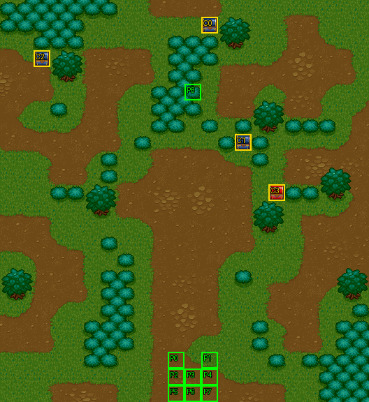

# 第 11 章　琴琴參見

<!-- chapter_docs:header -->
| 項目 | 內容 |
| --- | --- |
| 章號／章節索引 | 11／10 |
| 章名（文字區塊 `0x01`） | 琴琴參見 |
| 勝利條件（`0x02`） | 敵人全滅 |
| 敗北條件（`0x03`） | 蘭迪斯或琴琴死亡 |
| 戰場 | `MAP10.DAT`／`MAP10.COD`／`M10.DTL`，22×24 格，我方 slot 9 個，部署記錄 49 筆 |
| 文字區塊 | `FDETXT11.TXT`，16 條 |
| 進入處理（`0x60074`[10]） | `fdps_chapter_11_init`（`0x21140`） |
| 行動後檢查（`0x6028c`[10]） | `fdps_chapter_11_post_action`（`0x3a9a0`） |
| 勝利處理（`0x60304`[10]） | `fdps_chapter_11_end`（`0x3a9d0`） |
| 地圖資料呼叫的事件處理（`0x601c4`） | slot 17：`fdps_chapter_11_event_deploy_wave_for_turn`（`0x378f0`）（回合事件） |
| 過場腳本 | `ICON10.DAT`（開場）、`WIN10.DAT`（勝利） |
| 本章之前的村莊 | `SHOP10.DAT` |
| 光碟 | 第 1 片（音軌見 [CD 音軌](../program_info/cd_audio.md)） |



戰場全圖（第 0 層與同步捲動的圖層）。框線：黃 `C` 寶箱、橘 `B` 埋藏格、青 `R` 重繪格、洋紅 `E` 有處理函式的格子事件格，字母後的數字是事件碼；綠 `P` 是我方 slot 的起始格。

圖由 `python tools/chapter_docs/chapter_facts.py render-maps` 從遊戲檔重畫到 `chapters/maps/`，`verify-maps` 逐 byte 比對版控中的圖。
<!-- /chapter_docs:header -->

## 概要

蘭迪斯一行在荒郊聽見女孩呼救：一名少女被三個狼人戰士追著跑，蘭迪斯喊大家快去救她，少女一路喊「救命啊」。隊伍趕到時，少女已經一個人把追兵收拾掉了。她自稱琴琴，說喊救命只是想試試他們是不是像師父說的那樣路見不平、拔刀相助；她的師父說要去「羅特什麼的」找一位叫索爾的國王，之後一直沒回來，她才出來找人。尤利安問她師父是誰，她說是卡里斯，亞克驚呼那是傳說中的武聖。話才說完，被她揍昏的那夥人的同伴從四面圍上來，野武士喊著「就是她揍昏老大的」，琴琴反而挑釁對方來抓她（開場過場 `ICON10.DAT`）。

戰場是林木間土路交錯的荒野：隊伍的起始格在最下方中央，開場過場裡往上走了 8 格，玩家接手時站在 (10–12, 13–15)；琴琴在他們正上方的 (11, 11)，左、上、右三面各有一群敵人。第 4 回合與第 7 回合的我方行動結束後（敵方階段開始前）各有一批援軍，第 7 回合那批沿著上緣出現，其中兩隻狼人會去搶上方的兩個寶箱。

敵人全滅後，勝利過場 `WIN10.DAT` 把全員集合到琴琴面前：琴琴說有這麼多大哥哥在不會吃虧，轉頭叫尤利安「小光頭」，裘娜與亞克笑成一團，尤利安只能認了。蘭迪斯邀她同行、一起去找她的師父，琴琴高興地答應。

## 加入與離隊

琴琴（角色編號 `07`，LV15 武道家）在 `fdps_chapter_11_init`（`0x21140`）一開頭無條件入隊，入隊規則與名冊記錄見 [`assets/characters.md` 的「加入」](../assets/characters.md#加入)。第 10 章沒有人入隊，進本章時名冊正好是 8 人，琴琴排在名冊第 9 位（slot 8）；`MAP10.DAT` 宣告 9 個我方 slot，所以她本章就以名冊記錄上場，坐的是地圖單位 8。她的起始格 (11, 5) 只在開場過場的前半有意義：過場後半她被重新放到 (11, 9)，再往下走 2 格，戰鬥開始時站在 (11, 11)。

本章沒有人離隊，也沒有友方 NPC。開場過場裡追著琴琴的三個 LV1 狼人戰士是波次 0 的敵方演員，過場中途就退場，玩家操作時不在場上。

## 勝敗條件與特殊機制

- **勝利**：陣營 0 的單位全部退場。判定在共用的 `fdps_battle_check_default_end_conditions`（`0x3a2e0`），由本章的行動後處理 `fdps_chapter_11_post_action`（`0x3a9a0`）呼叫。開場就退場的三個狼人戰士不影響這個判定。
- **敗北：蘭迪斯**：共用判定看單位索引 0 是否退場。
- **敗北：琴琴**：`fdps_chapter_11_post_action`（`0x3a9a0`）另外以 `fdps_unit_is_retired`（`0x109b0`）看**單位索引 8**，退場就把結束碼寫成 1。索引 8 是琴琴，靠的是名冊依入隊順序填 slot；程式碼裡是單位位置而不是角色編號。這一寫不看結束碼現值、排在共用判定之後，所以同一次行動裡清光敵人又失去琴琴，結果是敗北。

畫面上的勝敗條件文字（`0x02`、`0x03`）與程式一致；本章沒有回合限制、沒有格子事件，也沒有帶敗北或過關的死亡腳本。

**援軍在回合交界才出現，清得快就不會來**：兩批援軍都掛在回合事件上（第 4、7 回合的敵方階段開始前），而過關判定在每次行動後就跑。開場的 14 名敵人若在第 4 回合敵方階段開始前全數退場，戰鬥直接過關，波次 4、5 都不會出場；同理，在第 7 回合敵方階段開始前清光場上所有敵人，波次 4 就不會出場。

**全場敵人都追布蘭多**：本章 49 筆部署記錄中，除了兩隻搶寶箱的狼人，全部是 AI 行為 3、目的地 x 為 `08`。`fdps_map_actor_behavior_step`（`0x10010`）在行為 3 下，找不到值得出手的行動時用 `fdps_battle_find_unit_by_character_id`（`0x2dc20`）找角色編號 8 的單位——隊員布蘭多——朝他移動；布蘭多退場後才改成走向最近的對手（行為的定義見 [`program_info/map_ai.md`](../program_info/map_ai.md#行為代碼)）。敵人鎖定的不是被圍住的琴琴，而是布蘭多。

**搶寶箱的狼人**：第 7 回合的波次 4 裡有兩隻狼人是 AI 行為 5：第 38 筆（右上一群，錨點 (18, 5)）搶事件碼 0 的 (12, 1) 光之徽章，第 42 筆（左上一群，錨點 (2, 6)）搶事件碼 2 的 (2, 3) 聖光之矛。牠們打開寶箱後物品進自己的背包並寫成自己的死亡腳本，行為改成 7，朝部署記錄的目的地走——第 38 筆是 (0, 10)、第 42 筆是 (10, 0)——走到就退場，物品隨之消失；在那之前由存活的我方單位打倒牠，物品就掉給擊殺者。寶箱已被打開時，牠們先跑最佳行動，沒有行動就走向最近的對手，不追布蘭多（見 [`program_info/map_ai.md`](../program_info/map_ai.md#行為-5搶寶箱)）。

## 敵人配置

進入戰場時只有波次 0 的三個狼人戰士在場，它們只是開場過場的演員，過場裡就被退場。開場過場在琴琴轉身時依序以 `DEPLOY_WAVE` 部署三批敵人（全部以找最近空格的方式放置），戰鬥開始時場上一共 14 名敵人：

- 波次 1（琴琴轉向左時）：左側 (2–5, 13–15) 一群 5 名（野武士、狼人 2、弓兵、魔導士），另有魔導士在 (13, 6)、冰魔導士在 (18, 11)。
- 波次 2（轉向上時）：弓兵 (10, 8) 與冰魔導士 (12, 8) 在琴琴 (11, 11) 上方三列，魔導士在左方 (3, 11)。
- 波次 3（轉向右時）：右側 (16–19, 8–10) 拳士 3、弓兵 1。

第 4 回合敵方階段開始前出場的波次 5 共 16 名，分成四群：左上 (1–3, 5–7) 拳士 3、弓兵 1；上方中央 (8–10, 1–2) 狼人 2、野武士 1；左下 (2–4, 21–23) 野武士 2、狼人、弓兵；右下 (17–19, 19–20) 野武士 2、狼人、弓兵、魔導士。第 7 回合敵方階段開始前出場的波次 4 是 16 隻狼人，沿上緣分成左上 (2–5, 4–7) 與右上 (16–20, 1–5) 兩群各 8 隻，各含一隻搶寶箱的狼人。

除搶寶箱的兩隻外，所有敵人都是追布蘭多的行為 3，沒有原地不動或會離場的守軍。

<!-- chapter_docs:deployments -->
陣營與死亡腳本的意義見 [`resource_info/map.md`](../resource_info/map.md)，AI 行為（低 4 bit）見 [`program_info/map_ai.md`](../program_info/map_ai.md#行為代碼)；錨點是 `MAPnn.COD` 的座標，開場波次放在錨點上，其餘波次依部署方式放在錨點或最近的空格。單位名是全域文字的「角色編號 + 1」條；角色編號 `3C` 以上的敵兵，數值（`ENEMYDAT.DAT`）與種族、職業見 [`assets/enemies.md`](../assets/enemies.md)，以下的見 [`assets/characters.md`](../assets/characters.md)。

我方起始格：slot 0 (10, 21)、slot 1 (12, 21)、slot 2 (10, 22)、slot 3 (11, 22)、slot 4 (12, 22)、slot 5 (10, 23)、slot 6 (11, 23)、slot 7 (12, 23)、slot 8 (11, 5)。

| 波次 | 陣營 | 單位 | 等級 | 數量 |
| ---: | --- | --- | --- | ---: |
| 0 | 敵方 | `53` 狼人戰士 | 1 | 3 |
| 1 | 敵方 | `66` 魔導士 | 15 | 2 |
| 1 | 敵方 | `65` 冰魔導士 | 15 | 1 |
| 1 | 敵方 | `4F` 野武士 | 14 | 1 |
| 1 | 敵方 | `52` 狼人 | 13 | 2 |
| 1 | 敵方 | `5D` 弓兵 | 13 | 1 |
| 2 | 敵方 | `66` 魔導士 | 15 | 1 |
| 2 | 敵方 | `65` 冰魔導士 | 15 | 1 |
| 2 | 敵方 | `5D` 弓兵 | 13 | 1 |
| 3 | 敵方 | `6C` 拳士 | 13 | 3 |
| 3 | 敵方 | `5D` 弓兵 | 13 | 1 |
| 4 | 敵方 | `52` 狼人 | 13 | 16 |
| 5 | 敵方 | `6C` 拳士 | 13 | 3 |
| 5 | 敵方 | `5D` 弓兵 | 13 | 3 |
| 5 | 敵方 | `4F` 野武士 | 14 | 5 |
| 5 | 敵方 | `52` 狼人 | 13 | 4 |
| 5 | 敵方 | `66` 魔導士 | 15 | 1 |

### 波次 0

出場：進入戰場時由 `fdps_build_map_unit_array`（`0x22be0`） 部署在錨點上

| # | 陣營 | 單位 | 等級 | AI 行為 | 錨點 | 死亡腳本 |
| ---: | --- | --- | ---: | --- | --- | --- |
| 30 | 敵方 | `53` 狼人戰士 | 1 | 3 追角色：`08` 布蘭多 | (9, 3) | — |
| 31 | 敵方 | `53` 狼人戰士 | 1 | 3 追角色：`08` 布蘭多 | (11, 4) | — |
| 32 | 敵方 | `53` 狼人戰士 | 1 | 3 追角色：`08` 布蘭多 | (13, 3) | — |

### 波次 1

出場：開場過場 `ICON10.DAT` `0x081` 的 `DEPLOY_WAVE`（找最近空格），由 `fdps_chapter_11_init`（`0x21140`）執行，戰鬥開始前一定出場

| # | 陣營 | 單位 | 等級 | AI 行為 | 錨點 | 死亡腳本 |
| ---: | --- | --- | ---: | --- | --- | --- |
| 3 | 敵方 | `66` 魔導士 | 15 | 3 追角色：`08` 布蘭多 | (13, 6) | 掉落 `B6` 再生藥 |
| 4 | 敵方 | `65` 冰魔導士 | 15 | 3 追角色：`08` 布蘭多 | (18, 11) | 掉落 `B8` 魔法水 |
| 12 | 敵方 | `4F` 野武士 | 14 | 3 追角色：`08` 布蘭多 | (3, 14) | — |
| 15 | 敵方 | `52` 狼人 | 13 | 3 追角色：`08` 布蘭多 | (5, 13) | — |
| 17 | 敵方 | `52` 狼人 | 13 | 3 追角色：`08` 布蘭多 | (5, 14) | — |
| 18 | 敵方 | `5D` 弓兵 | 13 | 3 追角色：`08` 布蘭多 | (2, 13) | — |
| 20 | 敵方 | `66` 魔導士 | 15 | 3 追角色：`08` 布蘭多 | (4, 15) | — |

### 波次 2

出場：開場過場 `ICON10.DAT` `0x08e` 的 `DEPLOY_WAVE`（找最近空格），由 `fdps_chapter_11_init`（`0x21140`）執行，戰鬥開始前一定出場

| # | 陣營 | 單位 | 等級 | AI 行為 | 錨點 | 死亡腳本 |
| ---: | --- | --- | ---: | --- | --- | --- |
| 9 | 敵方 | `66` 魔導士 | 15 | 3 追角色：`08` 布蘭多 | (3, 11) | — |
| 10 | 敵方 | `65` 冰魔導士 | 15 | 3 追角色：`08` 布蘭多 | (12, 8) | — |
| 27 | 敵方 | `5D` 弓兵 | 13 | 3 追角色：`08` 布蘭多 | (10, 8) | — |

### 波次 3

出場：開場過場 `ICON10.DAT` `0x09b` 的 `DEPLOY_WAVE`（找最近空格），由 `fdps_chapter_11_init`（`0x21140`）執行，戰鬥開始前一定出場

| # | 陣營 | 單位 | 等級 | AI 行為 | 錨點 | 死亡腳本 |
| ---: | --- | --- | ---: | --- | --- | --- |
| 0 | 敵方 | `6C` 拳士 | 13 | 3 追角色：`08` 布蘭多 | (17, 8) | 掉落 2000 金 |
| 1 | 敵方 | `6C` 拳士 | 13 | 3 追角色：`08` 布蘭多 | (16, 10) | — |
| 2 | 敵方 | `6C` 拳士 | 13 | 3 追角色：`08` 布蘭多 | (19, 9) | — |
| 5 | 敵方 | `5D` 弓兵 | 13 | 3 追角色：`08` 布蘭多 | (18, 9) | 掉落 `B6` 再生藥 |

### 波次 4

出場：第 7 回合敵方階段開始前，回合事件 slot 17 的 `fdps_chapter_11_event_deploy_wave_for_turn`（`0x378f0`）走「不是第 4 回合」的分支部署（找最近空格），游標再依序停在左上、右上兩群；在那之前清光敵人就不會出場

| # | 陣營 | 單位 | 等級 | AI 行為 | 錨點 | 死亡腳本 |
| ---: | --- | --- | ---: | --- | --- | --- |
| 33 | 敵方 | `52` 狼人 | 13 | 3 追角色：`08` 布蘭多 | (18, 1) | — |
| 34 | 敵方 | `52` 狼人 | 13 | 3 追角色：`08` 布蘭多 | (17, 2) | — |
| 35 | 敵方 | `52` 狼人 | 13 | 3 追角色：`08` 布蘭多 | (19, 2) | — |
| 36 | 敵方 | `52` 狼人 | 13 | 3 追角色：`08` 布蘭多 | (20, 3) | — |
| 37 | 敵方 | `52` 狼人 | 13 | 3 追角色：`08` 布蘭多 | (19, 4) | — |
| 38 | 敵方 | `52` 狼人 | 13 | 5 搶寶箱：碼 0 | (18, 5) | — |
| 39 | 敵方 | `52` 狼人 | 13 | 3 追角色：`08` 布蘭多 | (17, 4) | — |
| 40 | 敵方 | `52` 狼人 | 13 | 3 追角色：`08` 布蘭多 | (16, 3) | — |
| 41 | 敵方 | `52` 狼人 | 13 | 3 追角色：`08` 布蘭多 | (5, 4) | — |
| 42 | 敵方 | `52` 狼人 | 13 | 5 搶寶箱：碼 2 | (2, 6) | — |
| 43 | 敵方 | `52` 狼人 | 13 | 3 追角色：`08` 布蘭多 | (4, 5) | — |
| 44 | 敵方 | `52` 狼人 | 13 | 3 追角色：`08` 布蘭多 | (5, 5) | — |
| 45 | 敵方 | `52` 狼人 | 13 | 3 追角色：`08` 布蘭多 | (3, 5) | — |
| 46 | 敵方 | `52` 狼人 | 13 | 3 追角色：`08` 布蘭多 | (4, 6) | — |
| 47 | 敵方 | `52` 狼人 | 13 | 3 追角色：`08` 布蘭多 | (5, 6) | — |
| 48 | 敵方 | `52` 狼人 | 13 | 3 追角色：`08` 布蘭多 | (4, 7) | — |

### 波次 5

出場：第 4 回合敵方階段開始前，回合事件 slot 17 的 `fdps_chapter_11_event_deploy_wave_for_turn`（`0x378f0`）走第 4 回合的分支部署（找最近空格）；在那之前清光開場的 14 名敵人就不會出場

| # | 陣營 | 單位 | 等級 | AI 行為 | 錨點 | 死亡腳本 |
| ---: | --- | --- | ---: | --- | --- | --- |
| 6 | 敵方 | `6C` 拳士 | 13 | 3 追角色：`08` 布蘭多 | (1, 6) | 掉落 2500 金 |
| 7 | 敵方 | `6C` 拳士 | 13 | 3 追角色：`08` 布蘭多 | (2, 5) | — |
| 8 | 敵方 | `6C` 拳士 | 13 | 3 追角色：`08` 布蘭多 | (2, 7) | — |
| 11 | 敵方 | `5D` 弓兵 | 13 | 3 追角色：`08` 布蘭多 | (3, 6) | — |
| 13 | 敵方 | `4F` 野武士 | 14 | 3 追角色：`08` 布蘭多 | (4, 22) | — |
| 14 | 敵方 | `4F` 野武士 | 14 | 3 追角色：`08` 布蘭多 | (2, 22) | — |
| 16 | 敵方 | `52` 狼人 | 13 | 3 追角色：`08` 布蘭多 | (3, 23) | — |
| 19 | 敵方 | `5D` 弓兵 | 13 | 3 追角色：`08` 布蘭多 | (3, 21) | — |
| 21 | 敵方 | `52` 狼人 | 13 | 3 追角色：`08` 布蘭多 | (19, 20) | — |
| 22 | 敵方 | `52` 狼人 | 13 | 3 追角色：`08` 布蘭多 | (8, 1) | — |
| 23 | 敵方 | `52` 狼人 | 13 | 3 追角色：`08` 布蘭多 | (9, 2) | — |
| 24 | 敵方 | `4F` 野武士 | 14 | 3 追角色：`08` 布蘭多 | (17, 20) | — |
| 25 | 敵方 | `4F` 野武士 | 14 | 3 追角色：`08` 布蘭多 | (18, 19) | — |
| 26 | 敵方 | `4F` 野武士 | 14 | 3 追角色：`08` 布蘭多 | (10, 1) | — |
| 28 | 敵方 | `5D` 弓兵 | 13 | 3 追角色：`08` 布蘭多 | (18, 20) | — |
| 29 | 敵方 | `66` 魔導士 | 15 | 3 追角色：`08` 布蘭多 | (19, 19) | — |
<!-- /chapter_docs:deployments -->

## 寶物

本章沒有處理函式發放的物品。四個寶箱中的光之徽章 (12, 1) 與聖光之矛 (2, 3) 是第 7 回合兩隻搶寶箱狼人的目標（見「勝敗條件與特殊機制」），在那之前自己打開就不會被搶走。擊倒掉落的五筆都在開場的波次 1、3 與第 4 回合的波次 5 裡，見下表。

<!-- chapter_docs:treasure -->
搜尋的規則（同碼的格共用一筆記錄與一個旗標、背包滿時的交換）見 [`resource_info/map.md`](../resource_info/map.md)。

| 事件碼 | 格 | 內容 |
| ---: | --- | --- |
| 0 | (12, 1) 寶箱 | `E0` 光之徽章 |
| 1 | (14, 8) 寶箱 | 2000 金 |
| 2 | (2, 3) 寶箱 | `2A` 聖光之矛 |
| 3 | (16, 11) 寶箱 | `B6` 再生藥 |

擊倒後掉落（死亡腳本 opcode 0／1，擊殺者須是存活的我方單位）：

| # | 單位 | 波次 | 掉落 |
| ---: | --- | ---: | --- |
| 0 | `6C` 拳士 | 3 | 掉落 2000 金 |
| 3 | `66` 魔導士 | 1 | 掉落 `B6` 再生藥 |
| 4 | `65` 冰魔導士 | 1 | 掉落 `B8` 魔法水 |
| 5 | `5D` 弓兵 | 3 | 掉落 `B6` 再生藥 |
| 6 | `6C` 拳士 | 5 | 掉落 2500 金 |
<!-- /chapter_docs:treasure -->

## 村莊

<!-- chapter_docs:village -->
第 10 章勝利後、本章之前的村莊載入 `SHOP10.DAT`，道具店、武器店、秘密商店的貨見 [`assets/shops.md`](../assets/shops.md)。村莊載入的文字區塊是 `FDETXT11`（章節索引 + 1，`fdps_load_field_chapter_resources`（`0x31540`）），也就是本章的區塊，所以村莊畫面的文字是本章區塊的 `0x04`–`0x08`，全文在下方「對話」。
<!-- /chapter_docs:village -->

## 處理流程

### 進入：`fdps_chapter_11_init`（`0x21140`）

1. `fdps_roster_add_character`（`0x23bc0`）把角色 7 琴琴加入名冊（第 9 位）。必須排在戰場重建之前，地圖 slot 8 才會是她而不是退場的空位。
2. `fdps_chapter_state_reset`（`0x22750`）：重建戰場，`fdps_build_map_unit_array`（`0x22be0`）放上 9 名隊員與波次 0 的三個狼人戰士。
3. `fdps_icon_script_run`（`0x21650`）執行開場過場 `ICON10.DAT`：琴琴被三個狼人戰士追著往下跑、對話 `0x09`、隊伍往上走、對話 `0x0a`；三個狼人戰士與琴琴一起退場，播放動畫 `ICON0030.SAF`，只有琴琴復歸並放到 (11, 9)；對話 `0x0b` 之後琴琴向左、上、右各轉一次，依序部署波次 1、2、3，最後是對話 `0x0c`。
4. `fdps_show_chapter_title_card`（`0x20c60`）顯示章名卡（排在開場過場之後）。
5. `fdps_map_cursor_move_to_unit`（`0x2da50`）把游標放在單位 0（蘭迪斯）。

### 行動後檢查：`fdps_chapter_11_post_action`（`0x3a9a0`）

1. 呼叫共用判定 `fdps_battle_check_default_end_conditions`（`0x3a2e0`）：結束碼已非 0 就不動；否則陣營 0 全部退場記過關，單位 0 退場記敗北。
2. `fdps_unit_is_retired`（`0x109b0`）看單位索引 8（琴琴），退場就無條件把結束碼寫成 1（敗北）。

### 勝利：`fdps_chapter_11_end`（`0x3a9d0`）

1. `fdps_battle_destroy_remaining_enemies`（`0x39e10`）清掉陣營 0 的殘兵（本章到這裡通常已經沒有）。
2. `fdps_roster_write_back_battle_units`（`0x23980`）把戰場上的隊員（含琴琴）寫回名冊。
3. `fdps_icon_script_run`（`0x21650`）執行勝利過場 `WIN10.DAT`：復歸全員、排好隊形，對話 `0x0d`、`0x0e`。
4. `fdps_roster_revive_fallen_members`（`0x39e70`）讓陣亡的隊員復活。
5. 章節索引設為 11，下一段是第 12 章之前的村莊，接著是 [第 12 章](ch12.md)。

本章不給任何獎勵。

### 回合援軍：`fdps_chapter_11_event_deploy_wave_for_turn`（`0x378f0`）

由 `MAP10.DAT` 回合表的兩筆（第 4、7 回合，敵方階段開始前）經 `fdps_battle_run_turn_events`（`0x2e0c0`）呼叫。本體只比較一次回合計數器是否等於 4，其餘回合一律走另一支，沒有一次性閂鎖；只在第 7 回合走到另一支，是因為回合表只有這兩筆。

- **第 4 回合**：
  1. `fdps_deploy_wave`（`0x23830`）部署本地圖的**波次 5**（四群、找最近空格）。
  2. `fdps_draw_text`（`0x1ff60`）顯示本章文字 `0x0f`：蘭迪斯說「敵方的增援，大家小心了！」。
- **其他回合（第 7 回合）**：
  1. `fdps_deploy_wave`（`0x23830`）部署本地圖的**波次 4**（上緣兩群狼人、找最近空格）。
  2. `fdps_map_cursor_move_to_unit`（`0x2da50`）把游標移到單位 `0x34`（左上一群），`fdps_render_view_frame`（`0x2beb0`）停留 12 幀。
  3. 游標移到單位 `0x2c`（右上一群），再停留 12 幀。
  4. `fdps_draw_text`（`0x1ff60`）顯示同一條 `0x0f`。

回合與波次是交叉的：第 4 回合出的是波次 5、第 7 回合出的是波次 4。兩個游標目標是寫死的單位索引，只有在波次 5 已先接進單位陣列（9 名隊員 + 3 個演員 + 14 名開場敵人 + 16 名波次 5 = 42）之後，波次 4 才會落在 `0x2a`–`0x39`，`0x34` 與 `0x2c` 才分別是左上群與右上群的狼人。

## 回合事件與格子事件

<!-- chapter_docs:events -->
觸發時機與陣營階段的意義見 [`resource_info/map.md`](../resource_info/map.md)。

| 回合 | 陣營階段 | slot | 處理函式 |
| ---: | --- | ---: | --- |
| 4 | 敵方階段前 | 17 | `fdps_chapter_11_event_deploy_wave_for_turn`（`0x378f0`） |
| 7 | 敵方階段前 | 17 | `fdps_chapter_11_event_deploy_wave_for_turn`（`0x378f0`） |

本章沒有格子事件。
<!-- /chapter_docs:events -->

## 過場腳本

<!-- chapter_docs:scripts -->
格式與每個指令的意義見 [`resource_info/cutscene_script.md`](../resource_info/cutscene_script.md)。`FDETXT11#0xNN` 是本章文字區塊的條目，全文在下方「對話」；切到額外場景之後顯示的文字直接列出（那些區塊的正典是 [`assets/text/scene_text.md`](../assets/text/scene_text.md)）。`u3=我方1` 是地圖單位索引 3 對到我方 slot 1，`u12=MAP02#9` 是 `MAP02.DAT` 第 9 筆部署記錄。

### `ICON10.DAT`

- 開場：`fdps_chapter_11_init`（`0x21140`）
- 173 byte、37 步；起始地圖 10，切換地圖 無，結束於地圖 10

| 偏移 | 指令 | 內容 |
| ---: | --- | --- |
| `0000` | `SET_MUSIC` | 音樂 12（CD 第 13 軌） |
| `0002` | `SCROLL_VIEW` | 捲動視野到格 (5, 6) |
| `0005` | `WALK_UNITS` | 行走 6 格，每步 2 幀：u8=我方8往下 |
| `000b` | `FACE_UNITS` | 轉向後停 12 幀：u8=我方8朝上 |
| `0010` | `WALK_UNITS` | 行走 4 格，每步 2 幀：u9=MAP10#30(角色0x53)往下、u10=MAP10#31(角色0x53)往下、u11=MAP10#32(角色0x53)往下 |
| `001a` | `FACE_UNITS` | 轉向後停 12 幀：u8=我方8朝上 |
| `001f` | `DRAW_TEXT` | 顯示文字 FDETXT11#0x09 |
| `0021` | `WALK_UNITS` | 行走 4 格，每步 2 幀：u0=我方0往上、u1=我方1往上、u2=我方2往上、u3=我方3往上、u4=我方4往上、u5=我方5往上、u6=我方6往上、u7=我方7往上 |
| `0035` | `DRAW_TEXT` | 顯示文字 FDETXT11#0x0a |
| `0037` | `WALK_UNITS` | 行走 4 格，每步 2 幀：u0=我方0往上、u1=我方1往上、u2=我方2往上、u3=我方3往上、u4=我方4往上、u5=我方5往上、u6=我方6往上、u7=我方7往上 |
| `004b` | `SHAKE_VIEW` | 視野位移 3 步，每步 1 幀：(0,-24) (0,-48) (0,-72) |
| `0054` | `SET_VIEW_TILE` | 視野直接設到格 (5, 6) |
| `0057` | `FACE_UNITS` | 轉向後停 12 幀：u8=我方8朝上 |
| `005c` | `RETIRE_UNIT` | 退場 u9=MAP10#30(角色0x53) |
| `005e` | `RETIRE_UNIT` | 退場 u10=MAP10#31(角色0x53) |
| `0060` | `RETIRE_UNIT` | 退場 u11=MAP10#32(角色0x53) |
| `0062` | `RETIRE_UNIT` | 退場 u8=我方8 |
| `0064` | `PLAY_SAF` | 播放動畫 ICON0030.SAF |
| `0066` | `SET_MUSIC` | 音樂 16（CD 第 17 軌） |
| `0068` | `REVIVE_UNIT` | 復歸 u8=我方8（清狀態） |
| `006a` | `PLACE_UNIT` | 放置 u8=我方8 到 (11, 9)，朝下 |
| `006f` | `FACE_UNITS` | 轉向後停 1 幀：u8=我方8朝下 |
| `0074` | `WALK_UNITS` | 行走 2 格，每步 4 幀：u8=我方8往下 |
| `007a` | `DRAW_TEXT` | 顯示文字 FDETXT11#0x0b |
| `007c` | `FACE_UNITS` | 轉向後停 2 幀：u8=我方8朝左 |
| `0081` | `DEPLOY_WAVE` | 部署 MAP10 波次 1（找最近空格）：#3(角色0x66)、#4(角色0x65)、#12(角色0x4f)、#15(角色0x52)、#17(角色0x52)、#18(角色0x5d)、#20(角色0x66) |
| `0084` | `FACE_UNITS` | 轉向後停 25 幀：u8=我方8朝左 |
| `0089` | `FACE_UNITS` | 轉向後停 2 幀：u8=我方8朝上 |
| `008e` | `DEPLOY_WAVE` | 部署 MAP10 波次 2（找最近空格）：#9(角色0x66)、#10(角色0x65)、#27(角色0x5d) |
| `0091` | `FACE_UNITS` | 轉向後停 25 幀：u8=我方8朝上 |
| `0096` | `FACE_UNITS` | 轉向後停 2 幀：u8=我方8朝右 |
| `009b` | `DEPLOY_WAVE` | 部署 MAP10 波次 3（找最近空格）：#0(角色0x6c)、#1(角色0x6c)、#2(角色0x6c)、#5(角色0x5d) |
| `009e` | `SET_MUSIC` | 音樂 13（CD 第 14 軌） |
| `00a0` | `FACE_UNITS` | 轉向後停 25 幀：u8=我方8朝右 |
| `00a5` | `FACE_UNITS` | 轉向後停 12 幀：u8=我方8朝左 |
| `00aa` | `DRAW_TEXT` | 顯示文字 FDETXT11#0x0c |
| `00ac` | `END` | 結束 |

### `WIN10.DAT`

- 勝利：`fdps_chapter_11_end`（`0x3a9d0`）
- 98 byte、29 步；起始地圖 10，切換地圖 無，結束於地圖 10

| 偏移 | 指令 | 內容 |
| ---: | --- | --- |
| `0000` | `SET_MUSIC` | 音樂 16（CD 第 17 軌） |
| `0002` | `REVIVE_UNIT` | 復歸 u1=我方1（清狀態） |
| `0004` | `REVIVE_UNIT` | 復歸 u2=我方2（清狀態） |
| `0006` | `REVIVE_UNIT` | 復歸 u3=我方3（清狀態） |
| `0008` | `REVIVE_UNIT` | 復歸 u4=我方4（清狀態） |
| `000a` | `REVIVE_UNIT` | 復歸 u5=我方5（清狀態） |
| `000c` | `REVIVE_UNIT` | 復歸 u6=我方6（清狀態） |
| `000e` | `REVIVE_UNIT` | 復歸 u7=我方7（清狀態） |
| `0010` | `REVIVE_UNIT` | 復歸 u8=我方8（清狀態） |
| `0012` | `SET_VIEW_TILE` | 視野直接設到格 (5, 8) |
| `0015` | `PLACE_UNIT` | 放置 u0=我方0 到 (11, 12)，朝上 |
| `001a` | `PLACE_UNIT` | 放置 u1=我方1 到 (12, 12)，朝上 |
| `001f` | `PLACE_UNIT` | 放置 u2=我方2 到 (10, 12)，朝上 |
| `0024` | `PLACE_UNIT` | 放置 u3=我方3 到 (9, 11)，朝上 |
| `0029` | `PLACE_UNIT` | 放置 u4=我方4 到 (13, 11)，朝上 |
| `002e` | `PLACE_UNIT` | 放置 u5=我方5 到 (10, 13)，朝上 |
| `0033` | `PLACE_UNIT` | 放置 u6=我方6 到 (11, 13)，朝上 |
| `0038` | `PLACE_UNIT` | 放置 u7=我方7 到 (12, 13)，朝上 |
| `003d` | `PLACE_UNIT` | 放置 u8=我方8 到 (11, 9)，朝下 |
| `0042` | `FADE_OUT` | 淡出，每步 10 ms |
| `0044` | `FACE_UNITS` | 轉向後停 1 幀：u8=我方8朝下 |
| `0049` | `FADE_IN` | 淡入，每步 10 ms |
| `004b` | `FACE_UNITS` | 轉向後停 25 幀：u8=我方8朝下 |
| `0050` | `DRAW_TEXT` | 顯示文字 FDETXT11#0x0d |
| `0052` | `WALK_UNITS` | 行走 1 格，每步 4 幀：u0=我方0往上 |
| `0058` | `DRAW_TEXT` | 顯示文字 FDETXT11#0x0e |
| `005a` | `FACE_UNITS` | 轉向後停 12 幀：u8=我方8朝下 |
| `005f` | `SET_MUSIC` | 停止音樂 |
| `0061` | `END` | 結束 |
<!-- /chapter_docs:scripts -->

## 對話

<!-- chapter_docs:dialogue -->
`FDETXT11.TXT` 全部 16 條，依條目編號排列。每條先列讀取端（顯示它的腳本步驟、處理函式或死亡腳本），再列全文：【名稱】是換說話者（頭像取自括號裡的角色編號；【地圖單位 n】取執行當下第 n 個地圖單位），每一行是一次換行，▼ 是換頁（等按鍵）。`{subst1}`、`{subst2}`、`{number}` 是執行期代入的名稱與數字（[`resource_info/text.md`](../resource_info/text.md)）。

### `0x00`

永遠不會顯示：章名卡是 `Chapter.saf` 的圖（`fdps_show_chapter_title_card`（`0x20c60`）），存檔面板只畫 `0x01`；本章的處理函式、`ICON10.DAT`／`WIN10.DAT` 都不畫條目 0，見 [S13a（排除清單）](../cut_content/_index.md#排除清單)。

### `0x01`

讀取端：`fdps_draw_save_slot_panel`（`0x24a40`）

```text
琴琴參見
```

### `0x02`

讀取端：`fdps_battle_show_win_fail_window`（`0x17ca0`）

```text
敵人全滅
```

### `0x03`

讀取端：`fdps_battle_show_win_fail_window`（`0x17ca0`）

```text
蘭迪斯或琴琴死亡
```

### `0x04`

讀取端：`fdps_village_item_menu`（`0x35860`）

```text
喜歡這裡嗎？
▼
```

### `0x05`

讀取端：`fdps_run_weapon_shop`（`0x35fd0`）

```text
客人您知道嗎？
傳說中有三把矛，
是古代留下來的﹒﹒﹒
▼
都是叫什麼光什麼光的，
威力自然不是蓋的。
▼
```

### `0x06`

讀取端：`fdps_run_bar_shop`（`0x35cc0`）

```text
聽過聖符號的箭頭嗎？
若依次序排列的話，
會有意外的收穫喔！
▼
```

### `0x07`

讀取端：`fdps_run_church_screen`（`0x35aa0`）

```text
轉職的等級，
必須達到二十級以上。
▼
```

### `0x08`

讀取端：`fdps_run_secret_menu`（`0x36210`）

```text
試試一些新道具吧！
▼
```

### `0x09`

讀取端：`ICON10.DAT` `0x01f`

```text
【蘭迪斯】（角色 0）
呀！
快去救那個女孩！
```

### `0x0a`

讀取端：`ICON10.DAT` `0x035`

```text
【蘭迪斯】（角色 0）
妳不要怕！
我們來救妳！
【琴琴】（角色 7）
救命啊～！救命呀！
```

### `0x0b`

讀取端：`ICON10.DAT` `0x07a`

```text
【琴琴】（角色 7）
謝謝！你好！
嘻嘻嘻～嘻！
【亞克】（角色 4）
搞什麼嘛！
害我們緊張地跑過來！
妳一個人就對付得了，
▼
幹嘛還喊救命？
還喊的那麼大聲？
【琴琴】（角色 7）
我想試一試你們，
是否和師父說的一樣，
喜歡路見不平，
▼
拔刀相助嘛！
嘻嘻！
【蘭迪斯】（角色 0）
妳師父呢？
為什麼妳不跟著師父，
一人跑到荒郊野外？
【琴琴】（角色 7）
琴琴的師父不見了﹒﹒
嗚嗚嗚﹒﹒﹒
琴琴是來找師父嘛！
【法蓮娜】（角色 1）
唉～好可憐！
妳師父去哪裡了？
我幫妳找看看好嗎？
【琴琴】（角色 7）
師父說他要去羅﹒﹒﹒
羅特什麼的，
要找一個梭爾，
▼
還是索爾的國王﹒﹒﹒
然後好久都沒回來，
琴琴只好來找師父了
【蘭迪斯】（角色 0）
是索爾？！
【尤利安】（角色 6）
妳的師父是誰？
【琴琴】（角色 7）
我師父是卡里斯﹒﹒﹒
【亞克】（角色 4）
是傳說中的武聖？！
```

### `0x0c`

讀取端：`ICON10.DAT` `0x0aa`

```text
【琴琴】（角色 7）
又來了！嘻嘻！
真是陰魂不散！
【野武士】（角色 79）
她在那裡！
那個潑辣的小丫頭，
就是她揍昏老大的。
【琴琴】（角色 7）
呸～咧！
你來抓呀！
抓得到我給你磕頭。
```

### `0x0d`

讀取端：`WIN10.DAT` `0x050`

```text
【琴琴】（角色 7）
嘻嘻！
這裡這麼多大哥哥，
怎麼會讓我吃虧嘛？
▼
你說是不是？
小光頭？
【尤利安】（角色 6）
啊？！﹒﹒
妳﹒﹒妳在說我嗎？
【琴琴】（角色 7）
當然說你囉！
除了你之外，
這裡誰會剃光頭呀？
▼
要不要帽子拿下來？
【裘娜】（角色 3）
哇～哈哈哈！
她說他是﹒﹒﹒
光頭！哈哈哈！
【亞克】（角色 4）
哈哈哈哈！
【尤利安】（角色 6）
是是﹒﹒﹒﹒
我的確是光頭，唉～！
【蘭迪斯】（角色 0）
尤利安，
你不要難過了。
【法蓮娜】（角色 1）
嘻嘻﹒﹒﹒
這個小妹妹真有趣。
```

### `0x0e`

讀取端：`WIN10.DAT` `0x058`

```text
【蘭迪斯】（角色 0）
琴琴，
妳跟我們一起走吧！
我們去找你師父！
【琴琴】（角色 7）
謝謝！哇～！
我最喜歡武士哥哥了！
```

### `0x0f`

讀取端：`fdps_chapter_11_event_deploy_wave_for_turn`（`0x378f0`）

```text
【蘭迪斯】（角色 0）
敵方的增援，
大家小心了！
```
<!-- /chapter_docs:dialogue -->
