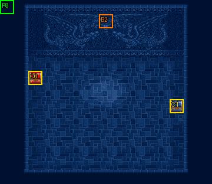

# 第 12 章　火神的宮殿

<!-- chapter_docs:header -->
| 項目 | 內容 |
| --- | --- |
| 章號／章節索引 | 12／11 |
| 章名（文字區塊 `0x01`） | 火神的宮殿 |
| 勝利條件（`0x02`） | 敵人全滅 |
| 敗北條件（`0x03`） | 蘭迪斯死亡 |
| 戰場 | `MAP11.DAT`／`MAP11.COD`／`M11.DTL`，15×13 格，我方 slot 9 個，部署記錄 3 筆 |
| 文字區塊 | `FDETXT12.TXT`，12 條 |
| 進入處理（`0x60074`[11]） | `fdps_chapter_12_init`（`0x21180`） |
| 行動後檢查（`0x6028c`[11]） | `fdps_chapter_12_post_action`（`0x3aa10`） |
| 勝利處理（`0x60304`[11]） | `fdps_chapter_12_end`（`0x3aa30`） |
| 地圖資料呼叫的事件處理（`0x601c4`） | 無 |
| 過場腳本 | `ICON11.DAT`（開場）、`WIN11.DAT`（勝利） |
| 本章之前的村莊 | `SHOP11.DAT` |
| 光碟 | 第 1 片（音軌見 [CD 音軌](../program_info/cd_audio.md)） |



戰場全圖（第 0 層與同步捲動的圖層）。框線：黃 `C` 寶箱、橘 `B` 埋藏格、青 `R` 重繪格、洋紅 `E` 有處理函式的格子事件格，字母後的數字是事件碼；綠 `P` 是我方 slot 的起始格。

圖由 `python tools/chapter_docs/chapter_facts.py render-maps` 從遊戲檔重畫到 `chapters/maps/`，`verify-maps` 逐 byte 比對版控中的圖。
<!-- /chapter_docs:header -->

## 概要

開場過場先切到場景地圖 52：絲卡蒂亞（`7A`）現身，對蘭迪斯說「孩子，來，跟我走！……幫你找一件武器呀！把你的伙伴帶來吧！」（`FDETXT53#0x09`）。接著切到場景地圖 40，她把蘭迪斯介紹給火神（`7F`），說他是武神瑪茜與人類生的孩子，請火神依約賜下武器（`FDETXT41#0x0a`）；火神要求蘭迪斯先證明自己有資格使用神的兵器（`0x0b`），隨後同意（`0x0c`）。一行人被帶進宮殿深處，絲卡蒂亞指出三間房間各藏著一件神兵利器，只能選其中一件，打敗守護獸就能擁有它（`0x0e`、`0x0f`）。

玩家在這裡做三選一：左邊的修佩魯、中間的雷德、右邊的亞德尼恩（`FDETXT41#0x10`–`0x15`）。過場切回本章的地圖 11，戰場是一間 15×13 的石室，九名隊員站在下方，被選中的那一隻守護獸在房間中央。

打倒守護獸後，勝利過場切到場景地圖 53：絲卡蒂亞留下一句「孩子，好好地利用它。……我走了」便離去，蘭迪斯喊住不及（`FDETXT54#0x09`）；尤利安、費塔加、琴琴以為是一場夢，蘭迪斯發現「這不是夢！」（`0x0a`）。

## 加入與離隊

本章沒有人入隊或離隊，也沒有 NPC 同行。`fdps_chapter_12_init`（`0x21180`）不呼叫 `fdps_roster_add_character`，名冊維持第 11 章結束時的九人，恰好填滿 `MAP11.DAT` 宣告的 9 個我方 slot，沒有任何 slot 是退場的空位。入隊順序與各人的名冊記錄見 [`assets/characters.md` 的加入一節](../assets/characters.md#加入)。

絲卡蒂亞與火神只在場景地圖 52、40、53 的過場裡出現，不上戰場。

## 勝敗條件與特殊機制

- **勝利**：陣營 0 全部退場。`fdps_chapter_12_post_action`（`0x3aa10`）只轉呼共用判定 `fdps_battle_check_default_end_conditions`（`0x3a2e0`）；本章的陣營 0 只有被選中的那一隻守護獸，打倒牠就過關，與畫面上的「敵人全滅」一致。
- **敗北**：同一支共用判定在章節索引 11 看地圖單位 0，也就是蘭迪斯；與「蘭迪斯死亡」一致。其他隊員陣亡不算敗北。
- **三選一決定對手**：開場過場 `ICON11.DAT` 在 `0x2c4` 執行 `ASK_THREE_WAY`，由 `fdps_icon_script_prompt_three_way_choice`（`0x22600`）問兩個是非題：先問「左邊（修佩魯）？」，答「是」得 1；否則再問「中間（雷德）？」，答「是」得 2；否則直接是 3（亞德尼恩），右邊房間沒有確認題。兩題的取消都等同「否」，所以答案一定是 1、2、3 之一，整章只問這一次、無法重選。`ICON11.DAT` `0x322` 的 `DEPLOY_WAVE` 運算元是 `0xff`，`fdps_icon_script_run`（`0x21650`）把它換成這個答案，只部署 `MAP11.DAT` 裡同一波次的那一筆記錄（指令格式見 [`resource_info/cutscene_script.md`](../resource_info/cutscene_script.md)）。問題與回應的文字在 `FDETXT41`，不在本章的區塊（[`rebuild_info/pitfalls.md`](../rebuild_info/pitfalls.md)）。
- **神兵是守護獸的掉落**：三筆記錄的死亡腳本都是 opcode 0（物品），分別給 `58` 修佩魯、`59` 雷德、`5A` 亞德尼恩，三者都是物品類型 `01` 的劍（[`assets/items.md`](../assets/items.md)）。`fdps_run_death_scripts`（`0x1d990`）只在擊殺者是存活的我方單位時發放，放進擊殺者的背包，背包滿時可以拿一件交換、不換就消失（規則見 [`resource_info/map.md`](../resource_info/map.md)）。本章沒有第三陣營，敵方階段守護獸攻擊、被我方反擊打倒時，擊殺者也是我方單位，照樣發放。
- **中毒致死拿不到神兵**：守護獸若在敵方階段開始時被中毒扣血致死，`fdps_battle_tick_status_effects`（`0x1fa30`）只結算死亡並呼叫行動後處理，不收集死亡腳本（機制見 [`program_info/battle.md`](../program_info/battle.md)，這是原版 bug，見 [`known_bugs.md` 第 23 條](../program_info/known_bugs.md#23-中毒致死不執行死亡腳本)），所以照樣過關，但那把劍不會掉落，本章也沒有其他途徑拿到它。
- **選擇的後續只靠那把劍本身**：勝利處理 `fdps_chapter_12_end`（`0x3aa30`）不記錄玩家進了哪一間，程式裡沒有任何旗標保存這個選擇。後續章節看的是背包裡有沒有那件物品：第 16 章的流浪鐵匠 `fdps_chapter_16_event_wandering_smith_forge`（`0x37cd0`）只檢查蘭迪斯（地圖單位 0）背包裡的 `58` 修佩魯或 `59` 雷德（[`ch16.md`](ch16.md)），所以劍若落在別的隊員背包，要在那之前交給蘭迪斯。`5A` 亞德尼恩沒有任何處理函式會再檢查。

## 敵人配置

`MAP11.DAT` 只有 3 筆部署記錄，分別是波次 1、2、3，沒有波次 0；每一局只會有其中一筆上場，整章的敵人就是一隻 LV20 守護獸（職業 `21` 守護獸，見 [`assets/enemies.md`](../assets/enemies.md)、[`assets/classes.md`](../assets/classes.md)）。

- 三筆記錄在 `MAP11.COD` 的錨點都是 (7, 6)，房間正中央。部署時我方單位還疊在錨點 (0, 0)，所以守護獸落在 (7, 6) 本格；之後過場才把九名隊員放到 (7, 9)、(6–8, 10)、(5–9, 11)。
- 三隻的 AI 行為都是 `0B`（11，法術優先：法術評分達 6 就施法，否則攻擊，否則走向路徑最近的對手），會主動逼近，定義見 [`program_info/map_ai.md`](../program_info/map_ai.md#行為代碼)。
- 沒有增援、沒有回合事件，也沒有搶寶箱或會離場的單位。

<!-- chapter_docs:deployments -->
陣營與死亡腳本的意義見 [`resource_info/map.md`](../resource_info/map.md)，AI 行為（低 4 bit）見 [`program_info/map_ai.md`](../program_info/map_ai.md#行為代碼)；錨點是 `MAPnn.COD` 的座標，開場波次放在錨點上，其餘波次依部署方式放在錨點或最近的空格。單位名是全域文字的「角色編號 + 1」條；角色編號 `3C` 以上的敵兵，數值（`ENEMYDAT.DAT`）與種族、職業見 [`assets/enemies.md`](../assets/enemies.md)，以下的見 [`assets/characters.md`](../assets/characters.md)。

我方起始格：slot 0 (0, 0)、slot 1 (0, 0)、slot 2 (0, 0)、slot 3 (0, 0)、slot 4 (0, 0)、slot 5 (0, 0)、slot 6 (0, 0)、slot 7 (0, 0)、slot 8 (0, 0)。

| 波次 | 陣營 | 單位 | 等級 | 數量 |
| ---: | --- | --- | --- | ---: |
| 1 | 敵方 | `71` 修佩魯 | 20 | 1 |
| 2 | 敵方 | `72` 雷德 | 20 | 1 |
| 3 | 敵方 | `73` 亞德尼恩 | 20 | 1 |

### 波次 1

出場：開場過場 `ICON11.DAT` `0x2c4` 的三選一中，第一題（左邊房間）答「是」時，`fdps_icon_script_prompt_three_way_choice`（`0x22600`）回傳 1，`0x322` 的 `DEPLOY_WAVE 0xff` 就部署本波次（找最近空格，落在錨點 (7, 6)），由 `fdps_chapter_12_init`（`0x21180`）執行，戰鬥開始前；選了另外兩間則這一局不會出場

| # | 陣營 | 單位 | 等級 | AI 行為 | 錨點 | 死亡腳本 |
| ---: | --- | --- | ---: | --- | --- | --- |
| 0 | 敵方 | `71` 修佩魯 | 20 | 11 法術優先 | (7, 6) | 掉落 `58` 修佩魯 |

### 波次 2

出場：開場過場 `ICON11.DAT` `0x2c4` 的三選一中，第一題答「否」或取消、第二題（中間房間）答「是」時，`fdps_icon_script_prompt_three_way_choice`（`0x22600`）回傳 2，`0x322` 的 `DEPLOY_WAVE 0xff` 就部署本波次（找最近空格，落在錨點 (7, 6)），由 `fdps_chapter_12_init`（`0x21180`）執行，戰鬥開始前；選了另外兩間則這一局不會出場

| # | 陣營 | 單位 | 等級 | AI 行為 | 錨點 | 死亡腳本 |
| ---: | --- | --- | ---: | --- | --- | --- |
| 1 | 敵方 | `72` 雷德 | 20 | 11 法術優先 | (7, 6) | 掉落 `59` 雷德 |

### 波次 3

出場：開場過場 `ICON11.DAT` `0x2c4` 的三選一中，兩題都答「否」或取消時，`fdps_icon_script_prompt_three_way_choice`（`0x22600`）回傳預設的 3，`0x322` 的 `DEPLOY_WAVE 0xff` 就部署本波次（找最近空格，落在錨點 (7, 6)），由 `fdps_chapter_12_init`（`0x21180`）執行，戰鬥開始前；選了另外兩間則這一局不會出場

| # | 陣營 | 單位 | 等級 | AI 行為 | 錨點 | 死亡腳本 |
| ---: | --- | --- | ---: | --- | --- | --- |
| 2 | 敵方 | `73` 亞德尼恩 | 20 | 11 法術優先 | (7, 6) | 掉落 `5A` 亞德尼恩 |
<!-- /chapter_docs:deployments -->

## 寶物

守護獸的掉落就是本章的「神兵」，每局只拿得到被選中的那一把，條件見上方勝敗條件與特殊機制。另外三格可搜尋的寶物與選擇無關，三條路線都一樣。

(7, 1) 的埋藏格（速度藥水）位在地形類別 5 的格上，只有移動消耗表對類別 5 不是 `FF` 的職業走得到（[`resource_info/terrain.md`](../resource_info/terrain.md)、[`assets/classes.md`](../assets/classes.md)）。

<!-- chapter_docs:treasure -->
搜尋的規則（同碼的格共用一筆記錄與一個旗標、背包滿時的交換）見 [`resource_info/map.md`](../resource_info/map.md)。

| 事件碼 | 格 | 內容 |
| ---: | --- | --- |
| 0 | (2, 5) 寶箱 | `CD` 炎之水晶 |
| 1 | (12, 7) 寶箱 | `D6` 生命之實 |
| 2 | (7, 1) 埋藏 | `DA` 速度藥水 |

擊倒後掉落（死亡腳本 opcode 0／1，擊殺者須是存活的我方單位）：

| # | 單位 | 波次 | 掉落 |
| ---: | --- | ---: | --- |
| 0 | `71` 修佩魯 | 1 | 掉落 `58` 修佩魯 |
| 1 | `72` 雷德 | 2 | 掉落 `59` 雷德 |
| 2 | `73` 亞德尼恩 | 3 | 掉落 `5A` 亞德尼恩 |
<!-- /chapter_docs:treasure -->

## 村莊

<!-- chapter_docs:village -->
第 11 章勝利後、本章之前的村莊載入 `SHOP11.DAT`，道具店、武器店、秘密商店的貨見 [`assets/shops.md`](../assets/shops.md)。村莊載入的文字區塊是 `FDETXT12`（章節索引 + 1，`fdps_load_field_chapter_resources`（`0x31540`）），也就是本章的區塊，所以村莊畫面的文字是本章區塊的 `0x04`–`0x08`，全文在下方「對話」。
<!-- /chapter_docs:village -->

## 處理流程

### 進入：`fdps_chapter_12_init`（`0x21180`）

1. `fdps_chapter_state_reset`（`0x22750`）依 `MAP11.DAT` 建立地圖單位陣列：9 個我方 slot 從名冊前端取人，全部放在 `MAP11.COD` 的錨點 (0, 0)；地圖沒有波次 0 的記錄，此時場上沒有敵人。
2. `fdps_icon_script_run`（`0x21650`）播 `Icon11.dat`：切到地圖 52、40 演出開場，在 `0x2c4` 三選一，`0x318` 切回地圖 11（重建單位陣列），`0x322` 以玩家的答案當波次部署一隻守護獸，接著把九名隊員放到 (7, 9)–(9, 11)，停止音樂後結束。
3. `fdps_show_chapter_title_card`（`0x20c60`）顯示章節標題圖（圖像，不讀文字區塊）。
4. `fdps_map_cursor_move_to_unit`（`0x2da50`）把游標放在單位 0 蘭迪斯身上。

進入處理本身不寫任何單位欄位，過場也沒有 `SET_UNIT_TIMER`，所有單位以部署算出的狀態開場。

### 行動後檢查：`fdps_chapter_12_post_action`（`0x3aa10`）

整支只呼叫 `fdps_battle_check_default_end_conditions`（`0x3a2e0`）：結束碼已非 0 就返回；否則先寫 2（勝利），陣營 0 還有未退場的單位就改回 0；最後地圖單位 0 蘭迪斯退場就寫 1（敗北）。三條路線共用這一個判定，沒有針對哪一隻守護獸的條件，也沒有第 11 章（[`ch11.md`](ch11.md)）那種額外的敗北判定。

### 勝利：`fdps_chapter_12_end`（`0x3aa30`）

1. `fdps_battle_destroy_remaining_enemies`（`0x39e10`）把陣營 0 的 HP 歸零；本章過關時守護獸已經退場，這一步沒有可見效果。
2. `fdps_roster_write_back_battle_units`（`0x23980`）把戰場上的隊員寫回名冊，掉落的劍隨擊殺者的背包進名冊。
3. `fdps_icon_script_run`（`0x21650`）播 `Win11.dat`：復歸地圖單位 0–7、播 `ICON0033.SAF`，切到地圖 53 顯示絲卡蒂亞告別與隊員的對話。
4. `fdps_roster_revive_fallen_members`（`0x39e70`）讓陣亡的隊員收費復活。
5. 章節索引寫成 12，也就是第 13 章（[`ch13.md`](ch13.md)），之後進入章間村莊。

## 回合事件與格子事件

<!-- chapter_docs:events -->
觸發時機與陣營階段的意義見 [`resource_info/map.md`](../resource_info/map.md)。

本章沒有回合事件。

本章沒有格子事件。
<!-- /chapter_docs:events -->

## 過場腳本

`ICON11.DAT` 的 `0x322` 部署哪一波次由 `0x2c4` 的答案決定：左邊房間是波次 1 修佩魯、中間是波次 2 雷德、右邊是波次 3 亞德尼恩。`0x0008` 的 `FACE_UNITS` 對地圖 52 上當時還不存在的單位 10 轉向，是原版腳本自己的越界寫入，重建時要照樣保留（[`rebuild_info/pitfalls.md`](../rebuild_info/pitfalls.md)）。

<!-- chapter_docs:scripts -->
格式與每個指令的意義見 [`resource_info/cutscene_script.md`](../resource_info/cutscene_script.md)。`FDETXT12#0xNN` 是本章文字區塊的條目，全文在下方「對話」；切到額外場景之後顯示的文字直接列出（那些區塊的正典是 [`assets/text/scene_text.md`](../assets/text/scene_text.md)）。`u3=我方1` 是地圖單位索引 3 對到我方 slot 1，`u12=MAP02#9` 是 `MAP02.DAT` 第 9 筆部署記錄。

### `ICON11.DAT`

- 開場：`fdps_chapter_12_init`（`0x21180`）
- 900 byte、197 步；起始地圖 11，切換地圖 52 → 40 → 11，結束於地圖 11
- 越界：0x0008 FACE_UNITS: unit 10 >= unit count 9, written past the end of the unit array

| 偏移 | 指令 | 內容 |
| ---: | --- | --- |
| `0000` | `FADE_OUT` | 淡出，每步 10 ms |
| `0002` | `SET_MUSIC` | 音樂 8（CD 第 9 軌） |
| `0004` | `SWITCH_MAP` | 切換地圖 → 52（MAP52，文字 FDETXT53） |
| `0006` | `FADE_IN` | 淡入，每步 10 ms |
| `0008` | `FACE_UNITS` | 轉向後停 40 幀：u10(越界)朝下 |
| `000d` | `PLAY_SAF` | 播放動畫 ICON0031.SAF |
| `000f` | `DEPLOY_WAVE` | 部署 MAP52 波次 1（找最近空格）：#0(角色0x7a) |
| `0012` | `FACE_UNITS` | 轉向後停 25 幀：u9=MAP52#0(角色0x7a)朝上 |
| `0017` | `RETIRE_UNIT` | 退場 u0=MAP52#10(角色0x94) |
| `0019` | `DEPLOY_WAVE` | 部署 MAP52 波次 2（找最近空格）：#1(角色0x00)、#2(角色0x01)、#3(角色0x02)、#4(角色0x03)、#5(角色0x04)、#6(角色0x06)、#7(角色0x07)、#8(角色0x08)、#9(角色0x09) |
| `001c` | `RETIRE_UNIT` | 退場 u11=MAP52#2(角色0x01) |
| `001e` | `RETIRE_UNIT` | 退場 u12=MAP52#3(角色0x02) |
| `0020` | `RETIRE_UNIT` | 退場 u13=MAP52#4(角色0x03) |
| `0022` | `RETIRE_UNIT` | 退場 u14=MAP52#5(角色0x04) |
| `0024` | `RETIRE_UNIT` | 退場 u15=MAP52#6(角色0x06) |
| `0026` | `RETIRE_UNIT` | 退場 u16=MAP52#7(角色0x07) |
| `0028` | `RETIRE_UNIT` | 退場 u17=MAP52#8(角色0x08) |
| `002a` | `RETIRE_UNIT` | 退場 u18=MAP52#9(角色0x09) |
| `002c` | `FACE_UNITS` | 轉向後停 40 幀：u10=MAP52#1(角色0x00)朝下 |
| `0031` | `REVIVE_UNIT` | 復歸 u11=MAP52#2(角色0x01)（清狀態） |
| `0033` | `RETIRE_UNIT` | 退場 u1=MAP52#11(角色0x95) |
| `0035` | `PLACE_UNIT` | 放置 u11=MAP52#2(角色0x01) 到 (5, 3)，朝下 |
| `003a` | `FACE_UNITS` | 轉向後停 15 幀：u11=MAP52#2(角色0x01)朝下 |
| `003f` | `REVIVE_UNIT` | 復歸 u12=MAP52#3(角色0x02)（清狀態） |
| `0041` | `RETIRE_UNIT` | 退場 u5=MAP52#15(角色0x99) |
| `0043` | `PLACE_UNIT` | 放置 u12=MAP52#3(角色0x02) 到 (7, 2)，朝下 |
| `0048` | `FACE_UNITS` | 轉向後停 15 幀：u12=MAP52#3(角色0x02)朝下 |
| `004d` | `REVIVE_UNIT` | 復歸 u13=MAP52#4(角色0x03)（清狀態） |
| `004f` | `RETIRE_UNIT` | 退場 u4=MAP52#14(角色0x98) |
| `0051` | `PLACE_UNIT` | 放置 u13=MAP52#4(角色0x03) 到 (4, 3)，朝下 |
| `0056` | `FACE_UNITS` | 轉向後停 15 幀：u13=MAP52#4(角色0x03)朝下 |
| `005b` | `REVIVE_UNIT` | 復歸 u14=MAP52#5(角色0x04)（清狀態） |
| `005d` | `RETIRE_UNIT` | 退場 u3=MAP52#13(角色0x97) |
| `005f` | `PLACE_UNIT` | 放置 u14=MAP52#5(角色0x04) 到 (7, 4)，朝下 |
| `0064` | `FACE_UNITS` | 轉向後停 15 幀：u14=MAP52#5(角色0x04)朝下 |
| `0069` | `REVIVE_UNIT` | 復歸 u15=MAP52#6(角色0x06)（清狀態） |
| `006b` | `RETIRE_UNIT` | 退場 u2=MAP52#12(角色0x96) |
| `006d` | `PLACE_UNIT` | 放置 u15=MAP52#6(角色0x06) 到 (8, 3)，朝下 |
| `0072` | `FACE_UNITS` | 轉向後停 15 幀：u15=MAP52#6(角色0x06)朝下 |
| `0077` | `REVIVE_UNIT` | 復歸 u16=MAP52#7(角色0x07)（清狀態） |
| `0079` | `RETIRE_UNIT` | 退場 u8=MAP52#18(角色0x9c) |
| `007b` | `PLACE_UNIT` | 放置 u16=MAP52#7(角色0x07) 到 (2, 4)，朝下 |
| `0080` | `FACE_UNITS` | 轉向後停 15 幀：u16=MAP52#7(角色0x07)朝下 |
| `0085` | `REVIVE_UNIT` | 復歸 u17=MAP52#8(角色0x08)（清狀態） |
| `0087` | `RETIRE_UNIT` | 退場 u6=MAP52#16(角色0x9a) |
| `0089` | `PLACE_UNIT` | 放置 u17=MAP52#8(角色0x08) 到 (9, 5)，朝下 |
| `008e` | `FACE_UNITS` | 轉向後停 15 幀：u17=MAP52#8(角色0x08)朝下 |
| `0093` | `REVIVE_UNIT` | 復歸 u18=MAP52#9(角色0x09)（清狀態） |
| `0095` | `RETIRE_UNIT` | 退場 u7=MAP52#17(角色0x9b) |
| `0097` | `PLACE_UNIT` | 放置 u18=MAP52#9(角色0x09) 到 (3, 4)，朝下 |
| `009c` | `FACE_UNITS` | 轉向後停 35 幀：u18=MAP52#9(角色0x09)朝下 |
| `00a1` | `DRAW_TEXT` | 顯示文字 FDETXT53#0x09 「{speaker char=122}孩子，來，跟我走！{br}{speaker char=0}走？我們要去哪裡？{br}{speaker char=122}傻孩子，{br}幫你找一件武器呀！{br}把你的伙伴帶來吧！{page}這件事有點困難，{br}沒他們幫忙不行的。」 |
| `00a3` | `WALK_UNITS` | 行走 4 格，每步 4 幀：u9=MAP52#0(角色0x7a)往下 |
| `00a9` | `WALK_UNITS` | 行走 1 格，每步 4 幀：u10=MAP52#1(角色0x00)往下、u11=MAP52#2(角色0x01)往下、u12=MAP52#3(角色0x02)往下、u13=MAP52#4(角色0x03)往下、u14=MAP52#5(角色0x04)往下、u15=MAP52#6(角色0x06)往下、u16=MAP52#7(角色0x07)往右、u17=MAP52#8(角色0x08)往下、u18=MAP52#9(角色0x09)往下 |
| `00bf` | `WALK_UNITS` | 行走 7 格，每步 4 幀：u10=MAP52#1(角色0x00)往下、u11=MAP52#2(角色0x01)往下、u12=MAP52#3(角色0x02)往下、u13=MAP52#4(角色0x03)往下、u14=MAP52#5(角色0x04)往下、u15=MAP52#6(角色0x06)往下、u16=MAP52#7(角色0x07)往下、u17=MAP52#8(角色0x08)往下、u18=MAP52#9(角色0x09)往下 |
| `00d5` | `FADE_OUT` | 淡出，每步 10 ms |
| `00d7` | `SET_MUSIC` | 音樂 10（CD 第 11 軌） |
| `00d9` | `SWITCH_MAP` | 切換地圖 → 40（MAP40，文字 FDETXT41） |
| `00db` | `SET_VIEW_TILE` | 視野直接設到格 (6, 1) |
| `00de` | `FACE_UNITS` | 轉向後停 1 幀：u0=MAP40#0(角色0x00)朝上 |
| `00e3` | `FADE_IN` | 淡入，每步 10 ms |
| `00e5` | `WALK_UNITS` | 行走 4 格，每步 4 幀：u0=MAP40#0(角色0x00)往上、u1=MAP40#1(角色0x01)往上、u2=MAP40#2(角色0x02)往上、u3=MAP40#3(角色0x03)往上、u4=MAP40#4(角色0x04)往上、u5=MAP40#5(角色0x06)往上、u6=MAP40#6(角色0x07)往上、u7=MAP40#7(角色0x08)往上、u8=MAP40#8(角色0x09)往上、u9=MAP40#9(角色0x7a)往上 |
| `00fd` | `DRAW_TEXT` | 顯示文字 FDETXT41#0x0a 「{speaker char=122}火神，{br}這是武神瑪茜，{br}與人類生的孩子！{page}我已經將他帶來了。{br}請照原先的約定，{br}將武器賜給他！」 |
| `00ff` | `WALK_UNITS` | 行走 1 格，每步 4 幀：u9=MAP40#9(角色0x7a)往上 |
| `0105` | `WALK_UNITS` | 行走 1 格，每步 4 幀：u9=MAP40#9(角色0x7a)往左 |
| `010b` | `FACE_UNITS` | 轉向後停 12 幀：u9=MAP40#9(角色0x7a)朝右 |
| `0110` | `DEPLOY_WAVE` | 部署 MAP40 波次 1（錨點原位）：#10(角色0x7f) |
| `0113` | `FACE_UNITS` | 轉向後停 2 幀：u9=MAP40#9(角色0x7a)朝右 |
| `0118` | `RETIRE_UNIT` | 退場 u10=MAP40#10(角色0x7f) |
| `011a` | `FACE_UNITS` | 轉向後停 2 幀：u9=MAP40#9(角色0x7a)朝右 |
| `011f` | `REVIVE_UNIT` | 復歸 u10=MAP40#10(角色0x7f)（清狀態） |
| `0121` | `FACE_UNITS` | 轉向後停 2 幀：u9=MAP40#9(角色0x7a)朝右 |
| `0126` | `RETIRE_UNIT` | 退場 u10=MAP40#10(角色0x7f) |
| `0128` | `FACE_UNITS` | 轉向後停 2 幀：u9=MAP40#9(角色0x7a)朝右 |
| `012d` | `REVIVE_UNIT` | 復歸 u10=MAP40#10(角色0x7f)（清狀態） |
| `012f` | `FACE_UNITS` | 轉向後停 2 幀：u9=MAP40#9(角色0x7a)朝右 |
| `0134` | `RETIRE_UNIT` | 退場 u10=MAP40#10(角色0x7f) |
| `0136` | `FACE_UNITS` | 轉向後停 2 幀：u9=MAP40#9(角色0x7a)朝右 |
| `013b` | `REVIVE_UNIT` | 復歸 u10=MAP40#10(角色0x7f)（清狀態） |
| `013d` | `FACE_UNITS` | 轉向後停 2 幀：u9=MAP40#9(角色0x7a)朝右 |
| `0142` | `RETIRE_UNIT` | 退場 u10=MAP40#10(角色0x7f) |
| `0144` | `FACE_UNITS` | 轉向後停 2 幀：u9=MAP40#9(角色0x7a)朝右 |
| `0149` | `REVIVE_UNIT` | 復歸 u10=MAP40#10(角色0x7f)（清狀態） |
| `014b` | `FACE_UNITS` | 轉向後停 25 幀：u9=MAP40#9(角色0x7a)朝右 |
| `0150` | `DRAW_TEXT` | 顯示文字 FDETXT41#0x0b 「{speaker char=127}孩子，{br}要使用神的兵器，{page}就要證明你，{br}有擁有它的資格；{page}這是我的規定，{br}就算是神，{br}要取我的兵器，{page}也要遵守這規定。」 |
| `0152` | `FACE_UNITS` | 轉向後停 12 幀：u9=MAP40#9(角色0x7a)朝右 |
| `0157` | `BLINK_UNITS_OUT` | 閃爍後退場：u10=MAP40#10(角色0x7f) |
| `015a` | `FACE_UNITS` | 轉向後停 12 幀：u9=MAP40#9(角色0x7a)朝右 |
| `015f` | `WALK_UNITS` | 行走 1 格，每步 4 幀：u9=MAP40#9(角色0x7a)往右 |
| `0165` | `FACE_UNITS` | 轉向後停 12 幀：u9=MAP40#9(角色0x7a)朝下 |
| `016a` | `DRAW_TEXT` | 顯示文字 FDETXT41#0x0c 「{speaker char=122}火神已同意了，{br}現在你們跟我來吧。」 |
| `016c` | `FACE_UNITS` | 轉向後停 12 幀：u0=MAP40#0(角色0x00)朝上 |
| `0171` | `WALK_UNITS` | 行走 1 格，每步 4 幀：u9=MAP40#9(角色0x7a)往上 |
| `0177` | `FACE_UNITS` | 轉向後停 4 幀：u0=MAP40#0(角色0x00)朝上 |
| `017c` | `RETIRE_UNIT` | 退場 u9=MAP40#9(角色0x7a) |
| `017e` | `WALK_UNITS` | 行走 1 格，每步 4 幀：u0=MAP40#0(角色0x00)往上 |
| `0184` | `FACE_UNITS` | 轉向後停 12 幀：u0=MAP40#0(角色0x00)朝下 |
| `0189` | `WALK_UNITS` | 行走 2 格，每步 4 幀：u0=MAP40#0(角色0x00)往上、u1=MAP40#1(角色0x01)往上、u2=MAP40#2(角色0x02)往上 |
| `0193` | `RETIRE_UNIT` | 退場 u0=MAP40#0(角色0x00) |
| `0195` | `WALK_UNITS` | 行走 1 格，每步 4 幀：u1=MAP40#1(角色0x01)往上、u2=MAP40#2(角色0x02)往上 |
| `019d` | `RETIRE_UNIT` | 退場 u1=MAP40#1(角色0x01) |
| `019f` | `RETIRE_UNIT` | 退場 u2=MAP40#2(角色0x02) |
| `01a1` | `WALK_UNITS` | 行走 2 格，每步 4 幀：u3=MAP40#3(角色0x03)往上、u4=MAP40#4(角色0x04)往上、u5=MAP40#5(角色0x06)往上 |
| `01ab` | `WALK_UNITS` | 行走 2 格，每步 4 幀：u3=MAP40#3(角色0x03)往上、u4=MAP40#4(角色0x04)往上、u5=MAP40#5(角色0x06)往上、u6=MAP40#6(角色0x07)往上、u7=MAP40#7(角色0x08)往上、u8=MAP40#8(角色0x09)往上 |
| `01bb` | `RETIRE_UNIT` | 退場 u3=MAP40#3(角色0x03) |
| `01bd` | `RETIRE_UNIT` | 退場 u4=MAP40#4(角色0x04) |
| `01bf` | `RETIRE_UNIT` | 退場 u5=MAP40#5(角色0x06) |
| `01c1` | `WALK_UNITS` | 行走 3 格，每步 4 幀：u6=MAP40#6(角色0x07)往上、u7=MAP40#7(角色0x08)往上、u8=MAP40#8(角色0x09)往上 |
| `01cb` | `RETIRE_UNIT` | 退場 u6=MAP40#6(角色0x07) |
| `01cd` | `RETIRE_UNIT` | 退場 u7=MAP40#7(角色0x08) |
| `01cf` | `RETIRE_UNIT` | 退場 u8=MAP40#8(角色0x09) |
| `01d1` | `FACE_UNITS` | 轉向後停 12 幀：u0=MAP40#0(角色0x00)朝上 |
| `01d6` | `FADE_OUT` | 淡出，每步 40 ms |
| `01d8` | `SET_VIEW_TILE` | 視野直接設到格 (1, 20) |
| `01db` | `FACE_UNITS` | 轉向後停 1 幀：u0=MAP40#0(角色0x00)朝上 |
| `01e0` | `REVIVE_UNIT` | 復歸 u9=MAP40#9(角色0x7a)（清狀態） |
| `01e2` | `PLACE_UNIT` | 放置 u9=MAP40#9(角色0x7a) 到 (3, 23)，朝下 |
| `01e7` | `REVIVE_UNIT` | 復歸 u0=MAP40#0(角色0x00)（清狀態） |
| `01e9` | `REVIVE_UNIT` | 復歸 u1=MAP40#1(角色0x01)（清狀態） |
| `01eb` | `REVIVE_UNIT` | 復歸 u2=MAP40#2(角色0x02)（清狀態） |
| `01ed` | `REVIVE_UNIT` | 復歸 u3=MAP40#3(角色0x03)（清狀態） |
| `01ef` | `REVIVE_UNIT` | 復歸 u4=MAP40#4(角色0x04)（清狀態） |
| `01f1` | `REVIVE_UNIT` | 復歸 u5=MAP40#5(角色0x06)（清狀態） |
| `01f3` | `REVIVE_UNIT` | 復歸 u6=MAP40#6(角色0x07)（清狀態） |
| `01f5` | `REVIVE_UNIT` | 復歸 u7=MAP40#7(角色0x08)（清狀態） |
| `01f7` | `REVIVE_UNIT` | 復歸 u8=MAP40#8(角色0x09)（清狀態） |
| `01f9` | `PLACE_UNIT` | 放置 u9=MAP40#9(角色0x7a) 到 (3, 23)，朝下 |
| `01fe` | `PLACE_UNIT` | 放置 u0=MAP40#0(角色0x00) 到 (3, 29)，朝上 |
| `0203` | `PLACE_UNIT` | 放置 u1=MAP40#1(角色0x01) 到 (2, 30)，朝上 |
| `0208` | `PLACE_UNIT` | 放置 u2=MAP40#2(角色0x02) 到 (4, 30)，朝上 |
| `020d` | `PLACE_UNIT` | 放置 u3=MAP40#3(角色0x03) 到 (3, 31)，朝上 |
| `0212` | `PLACE_UNIT` | 放置 u4=MAP40#4(角色0x04) 到 (2, 31)，朝上 |
| `0217` | `PLACE_UNIT` | 放置 u5=MAP40#5(角色0x06) 到 (4, 31)，朝上 |
| `021c` | `PLACE_UNIT` | 放置 u6=MAP40#6(角色0x07) 到 (3, 32)，朝上 |
| `0221` | `PLACE_UNIT` | 放置 u7=MAP40#7(角色0x08) 到 (2, 32)，朝上 |
| `0226` | `PLACE_UNIT` | 放置 u8=MAP40#8(角色0x09) 到 (4, 32)，朝上 |
| `022b` | `FACE_UNITS` | 轉向後停 1 幀：u0=MAP40#0(角色0x00)朝上 |
| `0230` | `FADE_IN` | 淡入，每步 10 ms |
| `0232` | `WALK_UNITS` | 行走 4 格，每步 3 幀：u0=MAP40#0(角色0x00)往上、u1=MAP40#1(角色0x01)往上、u2=MAP40#2(角色0x02)往上、u3=MAP40#3(角色0x03)往上、u4=MAP40#4(角色0x04)往上、u5=MAP40#5(角色0x06)往上、u6=MAP40#6(角色0x07)往上、u7=MAP40#7(角色0x08)往上、u8=MAP40#8(角色0x09)往上 |
| `0248` | `FACE_UNITS` | 轉向後停 12 幀：u0=MAP40#0(角色0x00)朝上 |
| `024d` | `FACE_UNITS` | 轉向後停 25 幀：u9=MAP40#9(角色0x7a)朝右 |
| `0252` | `DRAW_TEXT` | 顯示文字 FDETXT41#0x0d 「{speaker char=122}看！」 |
| `0254` | `FACE_UNITS` | 轉向後停 12 幀：u0=MAP40#0(角色0x00)朝右、u1=MAP40#1(角色0x01)朝右、u2=MAP40#2(角色0x02)朝右、u3=MAP40#3(角色0x03)朝右、u4=MAP40#4(角色0x04)朝右、u5=MAP40#5(角色0x06)朝右、u6=MAP40#6(角色0x07)朝右、u7=MAP40#7(角色0x08)朝右、u8=MAP40#8(角色0x09)朝右 |
| `0269` | `SHAKE_VIEW` | 視野位移 29 步，每步 2 幀：(10,0) (20,0) (30,0) (40,0) (50,0) (60,0) (70,0) (80,0) (90,0) (100,0) (110,0) (120,0) (120,0) (120,0) (120,0) (120,0) (120,0) (120,0) (110,0) (100,0) (90,0) (80,0) (70,0) (60,0) (50,0) (40,0) (30,0) (20,0) (10,0) |
| `02a6` | `FACE_UNITS` | 轉向後停 8 幀：u9=MAP40#9(角色0x7a)朝下 |
| `02ab` | `DRAW_TEXT` | 顯示文字 FDETXT41#0x0e 「{speaker char=122}蘭迪斯，{br}這三間房間裡，{br}各藏著一件神兵利器」 |
| `02ad` | `FACE_UNITS` | 轉向後停 12 幀：u0=MAP40#0(角色0x00)朝上、u1=MAP40#1(角色0x01)朝上、u2=MAP40#2(角色0x02)朝上、u3=MAP40#3(角色0x03)朝上、u4=MAP40#4(角色0x04)朝上、u5=MAP40#5(角色0x06)朝上、u6=MAP40#6(角色0x07)朝上、u7=MAP40#7(角色0x08)朝上、u8=MAP40#8(角色0x09)朝上 |
| `02c2` | `DRAW_TEXT` | 顯示文字 FDETXT41#0x0f 「{speaker char=122}你只能選擇其中一件，{br}作為你的武器。{page}只要你打敗守護獸，{br}你就可擁有那件兵器。{page}而你現在必須要決定{br}要進到哪一個房間﹒﹒」 |
| `02c4` | `ASK_THREE_WAY` | 三選一提問：FDETXT41#0x10 「左方的房間裡是修佩魯{br}你要進去左邊的房間嗎{br}？」、FDETXT41#0x11 「{speaker char=122}決定是修配魯了嗎？」、FDETXT41#0x12 「{speaker char=122}那麼去吧，{br}孩子，祝福你！」、FDETXT41#0x13 「中間的房間裡是雷德{br}你要進去中間的房間嗎{br}？」、FDETXT41#0x14 「{speaker char=122}決定是雷德了嗎？」、FDETXT41#0x15 「{speaker char=122}那麼就是右方的{br}亞德尼恩了﹒﹒﹒」 |
| `02c5` | `FACE_UNITS` | 轉向後停 6 幀：u0=MAP40#0(角色0x00)朝上 |
| `02ca` | `BLINK_UNITS_OUT` | 閃爍後退場：u9=MAP40#9(角色0x7a) |
| `02cd` | `FACE_UNITS` | 轉向後停 12 幀：u0=MAP40#0(角色0x00)朝上 |
| `02d2` | `RETIRE_UNIT` | 退場 u0=MAP40#0(角色0x00) |
| `02d4` | `FACE_UNITS` | 轉向後停 4 幀：u0=MAP40#0(角色0x00)朝上 |
| `02d9` | `RETIRE_UNIT` | 退場 u1=MAP40#1(角色0x01) |
| `02db` | `FACE_UNITS` | 轉向後停 4 幀：u0=MAP40#0(角色0x00)朝上 |
| `02e0` | `RETIRE_UNIT` | 退場 u2=MAP40#2(角色0x02) |
| `02e2` | `FACE_UNITS` | 轉向後停 4 幀：u0=MAP40#0(角色0x00)朝上 |
| `02e7` | `RETIRE_UNIT` | 退場 u3=MAP40#3(角色0x03) |
| `02e9` | `FACE_UNITS` | 轉向後停 4 幀：u0=MAP40#0(角色0x00)朝上 |
| `02ee` | `RETIRE_UNIT` | 退場 u4=MAP40#4(角色0x04) |
| `02f0` | `FACE_UNITS` | 轉向後停 4 幀：u0=MAP40#0(角色0x00)朝上 |
| `02f5` | `RETIRE_UNIT` | 退場 u5=MAP40#5(角色0x06) |
| `02f7` | `FACE_UNITS` | 轉向後停 4 幀：u0=MAP40#0(角色0x00)朝上 |
| `02fc` | `RETIRE_UNIT` | 退場 u6=MAP40#6(角色0x07) |
| `02fe` | `FACE_UNITS` | 轉向後停 4 幀：u0=MAP40#0(角色0x00)朝上 |
| `0303` | `RETIRE_UNIT` | 退場 u7=MAP40#7(角色0x08) |
| `0305` | `FACE_UNITS` | 轉向後停 4 幀：u8=MAP40#8(角色0x09)朝上 |
| `030a` | `RETIRE_UNIT` | 退場 u8=MAP40#8(角色0x09) |
| `030c` | `FACE_UNITS` | 轉向後停 4 幀：u0=MAP40#0(角色0x00)朝上 |
| `0311` | `FACE_UNITS` | 轉向後停 25 幀：u8=MAP40#8(角色0x09)朝上 |
| `0316` | `FADE_OUT` | 淡出，每步 10 ms |
| `0318` | `SWITCH_MAP` | 切換地圖 → 11（MAP11，文字 FDETXT12） |
| `031a` | `SET_VIEW_TILE` | 視野直接設到格 (1, 4) |
| `031d` | `FACE_UNITS` | 轉向後停 1 幀：u0=我方0朝上 |
| `0322` | `DEPLOY_WAVE` | 部署 MAP11 的波次＝三選一的答案（找最近空格） |
| `0325` | `FADE_IN` | 淡入，每步 10 ms |
| `0327` | `PLACE_UNIT` | 放置 u0=我方0 到 (7, 9)，朝上 |
| `032c` | `FACE_UNITS` | 轉向後停 4 幀：u0=我方0朝上 |
| `0331` | `PLACE_UNIT` | 放置 u1=我方1 到 (6, 10)，朝上 |
| `0336` | `FACE_UNITS` | 轉向後停 4 幀：u0=我方0朝上 |
| `033b` | `PLACE_UNIT` | 放置 u2=我方2 到 (7, 10)，朝上 |
| `0340` | `FACE_UNITS` | 轉向後停 4 幀：u0=我方0朝上 |
| `0345` | `PLACE_UNIT` | 放置 u3=我方3 到 (8, 10)，朝上 |
| `034a` | `FACE_UNITS` | 轉向後停 4 幀：u0=我方0朝上 |
| `034f` | `PLACE_UNIT` | 放置 u4=我方4 到 (5, 11)，朝上 |
| `0354` | `FACE_UNITS` | 轉向後停 4 幀：u0=我方0朝上 |
| `0359` | `PLACE_UNIT` | 放置 u5=我方5 到 (6, 11)，朝上 |
| `035e` | `FACE_UNITS` | 轉向後停 4 幀：u0=我方0朝上 |
| `0363` | `PLACE_UNIT` | 放置 u6=我方6 到 (7, 11)，朝上 |
| `0368` | `FACE_UNITS` | 轉向後停 4 幀：u0=我方0朝上 |
| `036d` | `PLACE_UNIT` | 放置 u7=我方7 到 (8, 11)，朝上 |
| `0372` | `FACE_UNITS` | 轉向後停 4 幀：u0=我方0朝上 |
| `0377` | `PLACE_UNIT` | 放置 u8=我方8 到 (9, 11)，朝上 |
| `037c` | `FACE_UNITS` | 轉向後停 4 幀：u0=我方0朝上 |
| `0381` | `SET_MUSIC` | 停止音樂 |
| `0383` | `END` | 結束 |

### `WIN11.DAT`

- 勝利：`fdps_chapter_12_end`（`0x3aa30`）
- 75 byte、29 步；起始地圖 11，切換地圖 53，結束於地圖 53

| 偏移 | 指令 | 內容 |
| ---: | --- | --- |
| `0000` | `REVIVE_UNIT` | 復歸 u0=我方0（清狀態） |
| `0002` | `REVIVE_UNIT` | 復歸 u1=我方1（清狀態） |
| `0004` | `REVIVE_UNIT` | 復歸 u2=我方2（清狀態） |
| `0006` | `REVIVE_UNIT` | 復歸 u3=我方3（清狀態） |
| `0008` | `REVIVE_UNIT` | 復歸 u4=我方4（清狀態） |
| `000a` | `REVIVE_UNIT` | 復歸 u5=我方5（清狀態） |
| `000c` | `REVIVE_UNIT` | 復歸 u6=我方6（清狀態） |
| `000e` | `REVIVE_UNIT` | 復歸 u7=我方7（清狀態） |
| `0010` | `SET_VIEW_TILE` | 視野直接設到格 (1, 2) |
| `0013` | `FACE_UNITS` | 轉向後停 1 幀：u0=我方0朝上 |
| `0018` | `RETIRE_UNIT` | 退場 u0=我方0 |
| `001a` | `PLAY_SAF` | 播放動畫 ICON0033.SAF |
| `001c` | `REVIVE_UNIT` | 復歸 u0=我方0（清狀態） |
| `001e` | `FADE_OUT` | 淡出，每步 20 ms |
| `0020` | `SWITCH_MAP` | 切換地圖 → 53（MAP53，文字 FDETXT54） |
| `0022` | `SET_VIEW_TILE` | 視野直接設到格 (0, 0) |
| `0025` | `FACE_UNITS` | 轉向後停 1 幀：u1=MAP53#1(角色0x00)朝下 |
| `002a` | `FACE_UNITS` | 轉向後停 1 幀：u0=MAP53#0(角色0x7a)朝上 |
| `002f` | `FADE_IN` | 淡入，每步 20 ms |
| `0031` | `DRAW_TEXT` | 顯示文字 FDETXT54#0x09 「{speaker char=122}孩子，好好地利用它。{br}﹒﹒﹒我走了﹒﹒﹒{br}{speaker char=0}慢﹒﹒慢著！」 |
| `0033` | `FACE_UNITS` | 轉向後停 1 幀：u0=MAP53#0(角色0x7a)朝下 |
| `0038` | `RETIRE_UNIT` | 退場 u0=MAP53#0(角色0x7a) |
| `003a` | `PLAY_SAF` | 播放動畫 ICON0036.SAF |
| `003c` | `REVIVE_UNIT` | 復歸 u1=MAP53#1(角色0x00)（清狀態） |
| `003e` | `WALK_UNITS` | 行走 2 格，每步 2 幀：u1=MAP53#1(角色0x00)往下 |
| `0044` | `DRAW_TEXT` | 顯示文字 FDETXT54#0x0a 「{speaker char=6}好像是一場夢﹒﹒﹒﹒{br}{speaker char=2}﹒﹒真是不可思議﹒﹒{br}{speaker char=7}哎呀！你們看～！{br}{speaker char=0}這不是夢！」 |
| `0046` | `RETIRE_UNIT` | 退場 u1=MAP53#1(角色0x00) |
| `0048` | `PLAY_SAF` | 播放動畫 ICON0037.SAF |
| `004a` | `END` | 結束 |
<!-- /chapter_docs:scripts -->

## 對話

本章區塊 `0x09`–`0x0b` 是開場與勝利過場台詞的複本，過場實際畫的是切換地圖後載入的 `FDETXT53`、`FDETXT54`，這三條沒有讀取端。

<!-- chapter_docs:dialogue -->
`FDETXT12.TXT` 全部 12 條，依條目編號排列。每條先列讀取端（顯示它的腳本步驟、處理函式或死亡腳本），再列全文：【名稱】是換說話者（頭像取自括號裡的角色編號；【地圖單位 n】取執行當下第 n 個地圖單位），每一行是一次換行，▼ 是換頁（等按鍵）。`{subst1}`、`{subst2}`、`{number}` 是執行期代入的名稱與數字（[`resource_info/text.md`](../resource_info/text.md)）。

### `0x00`

永遠不會顯示：「第十二章」沒有讀取端：章名卡由 `fdps_show_chapter_title_card`（`0x20c60`）畫 `CHAPTER.SAF` 的圖，本章的處理函式、死亡腳本與 `ICON11.DAT`／`WIN11.DAT` 都不畫這一條，見 [S13a（排除清單）](../cut_content/_index.md#排除清單)。

### `0x01`

讀取端：`fdps_draw_save_slot_panel`（`0x24a40`）

```text
火神的宮殿
```

### `0x02`

讀取端：`fdps_battle_show_win_fail_window`（`0x17ca0`）

```text
敵人全滅
```

### `0x03`

讀取端：`fdps_battle_show_win_fail_window`（`0x17ca0`）

```text
蘭迪斯死亡
```

### `0x04`

讀取端：`fdps_village_item_menu`（`0x35860`）

```text
使用魔法道具，
雖然很方便，
但不會得到經驗值。
▼
```

### `0x05`

讀取端：`fdps_run_weapon_shop`（`0x35fd0`）

```text
對不起！
最近鐵礦貴得離譜，
打不出好武器防具，
▼
請多多包涵！
▼
```

### `0x06`

讀取端：`fdps_run_bar_shop`（`0x35cc0`）

```text
啊～！你們是武士嗎？
看看你們的武器，
好像不是很適用了。
▼
再這樣下去，
是很危險的。
▼
用箭頭狀的神聖符號，
描繪神秘的三角圖案，
據說有神奇的效果，
▼
試試看吧！
▼
```

### `0x07`

讀取端：`fdps_run_church_screen`（`0x35aa0`）

```text
轉職前的等級，最高只能達到四十級。
▼
```

### `0x08`

讀取端：`fdps_run_secret_menu`（`0x36210`）

```text
這裡的東西很貴！錢要帶得夠喔！
▼
```

### `0x09`

永遠不會顯示：開場台詞的複本：`ICON11.DAT` 在 `0x004` 先切到地圖 52 才於 `0x0a1` 畫字，畫的是 `FDETXT53` 的 0x09；沒有任何腳本在地圖 11 載入時畫本章區塊的這一條，見 [S13b（排除清單）](../cut_content/_index.md#排除清單)。

### `0x0a`

永遠不會顯示：勝利台詞的複本：`WIN11.DAT` 在 `0x020` 先切到地圖 53 才畫字，畫的是 `FDETXT54` 的 0x09；本章區塊的這一條沒有讀取端，見 [S13b（排除清單）](../cut_content/_index.md#排除清單)。

### `0x0b`

永遠不會顯示：勝利台詞的複本：`WIN11.DAT` 畫的是切到地圖 53 後 `FDETXT54` 的 0x0a；本章區塊的這一條沒有讀取端，見 [S13b（排除清單）](../cut_content/_index.md#排除清單)。
<!-- /chapter_docs:dialogue -->
