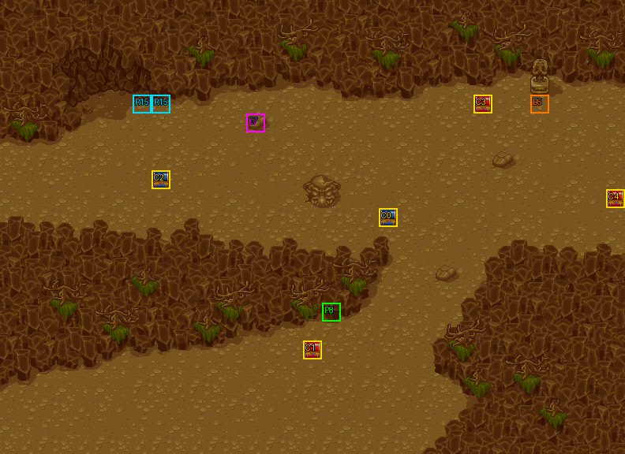

# 第 13 章　地獄三鬥神

<!-- chapter_docs:header -->
| 項目 | 內容 |
| --- | --- |
| 章號／章節索引 | 13／12 |
| 章名（文字區塊 `0x01`） | 地獄三鬥神 |
| 勝利條件（`0x02`） | 敵人全滅 |
| 敗北條件（`0x03`） | 蘭迪斯死亡 |
| 戰場 | `MAP12.DAT`／`MAP12.COD`／`M12.DTL`，33×24 格，我方 slot 9 個，部署記錄 37 筆 |
| 文字區塊 | `FDETXT13.TXT`，20 條 |
| 進入處理（`0x60074`[12]） | `fdps_chapter_13_init`（`0x211c0`） |
| 行動後檢查（`0x6028c`[12]） | `fdps_chapter_13_post_action`（`0x3aa70`） |
| 勝利處理（`0x60304`[12]） | `fdps_chapter_13_end`（`0x3aa90`） |
| 地圖資料呼叫的事件處理（`0x601c4`） | slot 18：`fdps_chapter_13_event_enemies_advance`（`0x379d0`）（死亡腳本） |
| 過場腳本 | `ICON12.DAT`（開場）、`WIN12.DAT`（勝利） |
| 本章之前的村莊 | `SHOP12.DAT` |
| 光碟 | 第 1 片（音軌見 [CD 音軌](../program_info/cd_audio.md)） |



戰場全圖（第 0 層與同步捲動的圖層）。框線：黃 `C` 寶箱、橘 `B` 埋藏格、青 `R` 重繪格、洋紅 `E` 有處理函式的格子事件格，字母後的數字是事件碼；綠 `P` 是我方 slot 的起始格。

圖由 `python tools/chapter_docs/chapter_facts.py render-maps` 從遊戲檔重畫到 `chapters/maps/`，`verify-maps` 逐 byte 比對版控中的圖。
<!-- /chapter_docs:header -->

## 概要

蘭迪斯一行在山谷裡趕到時，琴琴的師父、武聖卡里斯已經倒在地上，薩達特、席拉、巴魯三人圍著他。琴琴哭喊「師父～！」（`0x09`）；薩達特嘲笑她來得正好、可以替師父收屍，席拉說這把老骨頭在他們手下撐了很久，巴魯笑卡里斯為了索爾的事賠上性命。亞克罵三打一沒有武術家風度，裘娜提醒這些人功夫好又殘忍、別被各個擊破，蘭迪斯質問幕後主使是誰，裘娜催大家快救人（`0x0a`）。

戰場是 33×24 的山谷，兩條土路從左下與右上夾著中間的岩壁地帶。隊伍在左下角出發，三鬥神守在左上角卡里斯身邊，其餘敵人分成四群散在中央與右側，開場全部按兵不動。

敵人全滅後，勝利過場 `WIN12.DAT` 把全員集合到卡里斯身旁。尤利安要替他療傷，卡里斯說自己活不成了，問誰是蘭迪斯（`0x0b`）；他告訴蘭迪斯自己見過索爾，索爾和大臣一樣被禁錮，這背後是極大的陰謀，話說到「葛斯洛喀﹒﹒葛斯﹒﹒」就接不下去（`0x0c`）。他把徒弟琴琴託付給眾人，說想再看看故鄉的山水與草原後斷氣（`0x0d`），倒地的身影從地圖上消失。費塔加感嘆一生叱吒風雲的武聖就這麼走了，蘭迪斯仰天怒吼「為什麼？」，法蓮娜被他的表情嚇到，尤利安提議先為卡里斯料理後事（`0x0e`–`0x13`）。

## 加入與離隊

本章沒有人入隊或離隊，也沒有 NPC 同行。`fdps_chapter_13_init`（`0x211c0`）不呼叫 `fdps_roster_add_character`，名冊維持第 12 章（[`ch12.md`](ch12.md)）結束時的九人，恰好填滿 `MAP12.DAT` 宣告的 9 個我方 slot。入隊規則與名冊記錄見 [`assets/characters.md` 的加入一節](../assets/characters.md#加入)。

卡里斯（角色編號 `0D`）在地圖資料裡是第 20 筆部署記錄、陣營 0（敵方），但他只是開場過場的演員：`ICON12.DAT` `0x07d` 讓他退場後再也沒有復歸，玩家操作時他不在場上，也不計入「敵人全滅」。過場之後場上躺著的卡里斯是 (7, 5)、(8, 5) 兩格重繪格的圖磚，不是單位（見下方勝敗條件與特殊機制）。陣營 0 卻不是 `3C` 以上敵兵編號的單位，重建時的陷阱見 [`rebuild_info/pitfalls.md`](../rebuild_info/pitfalls.md)。

## 勝敗條件與特殊機制

- **勝利**：陣營 0 全部退場。`fdps_chapter_13_post_action`（`0x3aa70`）只轉呼共用判定 `fdps_battle_check_default_end_conditions`（`0x3a2e0`），與畫面上的「敵人全滅」一致。開場就退場的卡里斯不算在內，實際要打倒的是 36 名。
- **敗北**：同一支共用判定看地圖單位 0 蘭迪斯是否退場，與「蘭迪斯死亡」一致。琴琴陣亡不算敗北，這一點與第 11 章（[`ch11.md`](ch11.md)）不同。
- **全軍按兵不動，直到中央的暗魔導士倒下**：`MAP12.DAT` 的 37 筆記錄全部是 AI 行為 2（最佳行動，否則原地休息，不為接近對手而移動；定義見 [`program_info/map_ai.md`](../program_info/map_ai.md#行為代碼)），所以敵人只在有值得出手的目標時才行動。第 28 筆記錄——中央那群裡站在 (14, 9) 的暗魔導士——帶死亡腳本 opcode 2、slot 18，被打倒時 `fdps_run_death_scripts`（`0x1d990`）呼叫 `fdps_chapter_13_event_enemies_advance`（`0x379d0`），把地圖單位 9–`0x2c` 的行為低 4 bit 改成 0（最佳行動，否則走向路徑最近的對手），全場敵人轉為主動進攻。
- **最後一名拳士不會跟著出擊**：上述範圍是寫死的常數，包含 `0x2c`、不含 `0x2d`。9 個我方 slot 之後依序接第 0–36 筆記錄，所以範圍涵蓋第 0–35 筆，第 36 筆——(15, 9) 的拳士——保持行為 2，事件觸發後仍然原地不動。範圍裡的第 20 筆卡里斯已經退場，改了也沒有作用。
- **觸發條件只有「那一名暗魔導士被打倒」**：opcode 2 不檢查擊殺者，任何一名我方單位打倒他都會觸發；死亡腳本在單位死亡時只跑一次，處理函式本身沒有一次性旗標。但若他在敵方階段開始時被中毒扣血致死，`fdps_battle_tick_status_effects`（`0x1fa30`）只結算死亡、不收集死亡腳本（[`program_info/battle.md`](../program_info/battle.md)），這時全軍永遠不會轉為進攻。
- **卡里斯倒地的樣子是地圖圖磚**：(7, 5)、(8, 5) 兩格是事件碼 15 的重繪格，底圖是空地（圖磚 `0x1f3`、`0x1f5`）。開場過場 `ICON12.DAT` `0x096` 以 `TRIGGER_CELL_EVENT` 把觸發旗標 15 設成 1，重繪把兩格換成下一號圖磚 `0x1f4`、`0x1f6`，畫出倒地的卡里斯（重繪規則見 [`resource_info/map.md`](../resource_info/map.md)）。勝利過場 `WIN12.DAT` `0x068`–`0x0a9` 以 `SET_MAP_CELL` 把兩格連寫五次，空地與倒地的圖磚交替，最後停在空地的 `0x1f3`、`0x1f5`，表現他斷氣後身影消失。
- **(13, 6) 的事件碼沒有作用**：這一格是事件碼 7 的一般格，但 `MAP12.DAT` 格子事件表的第 7 筆處理函式 slot 是 `0xff`，單位經過或停留都不會觸發任何處理函式。第 31 筆記錄的弓箭手就站在這一格上。

## 敵人配置

全部 37 筆記錄都是波次 0，進入戰場時一次部署完，沒有增援、沒有回合事件，也沒有搶寶箱或會離場的單位。扣掉開場退場的卡里斯，36 名敵人分成五群，都以行為 2 守在原地：

- **左上角 (5–10, 5–7)**：三鬥神薩達特（`44`）、巴魯（`45`）、席拉（`46`），都是 LV20。開場過場讓三人退場、播放動畫 `ICON0038.SAF` 後復歸，重新放到 (6, 7)、(10, 6)、(8, 7)，所以開戰時的位置不是錨點，而是過場給的這三格。數值見 [`assets/enemies.md`](../assets/enemies.md)。
- **中央 (13–15, 6–10)**：第 25–36 筆，暗黑騎兵 3、暗魔導士 2、弓箭手 3、拳士 4，擋在隊伍與三鬥神之間。其中 (14, 9) 的暗魔導士（第 28 筆）是觸發全軍進攻的那一名，(15, 9) 的拳士（第 36 筆）是事件觸發後唯一仍不動的一名。
- **東南 (18–21, 17–20)**：第 3–10 筆，暗黑騎兵 3、弓箭手 2、暗魔導士 1、騎兵 2。第 3 筆暗黑騎兵掉落再生藥、第 8 筆暗魔導士掉落魔法水。
- **東 (21–25, 8–11)**：第 11–19 筆，暗黑騎兵 3、弓箭手 2、暗魔導士 1、拳士 3。
- **東北角 (29–30, 5–6)**：第 21–24 筆，騎士 4 名，守在 (28, 5) 埋藏格與 (25, 5) 寶箱旁。

<!-- chapter_docs:deployments -->
陣營與死亡腳本的意義見 [`resource_info/map.md`](../resource_info/map.md)，AI 行為（低 4 bit）見 [`program_info/map_ai.md`](../program_info/map_ai.md#行為代碼)；錨點是 `MAPnn.COD` 的座標，開場波次放在錨點上，其餘波次依部署方式放在錨點或最近的空格。單位名是全域文字的「角色編號 + 1」條；角色編號 `3C` 以上的敵兵，數值（`ENEMYDAT.DAT`）與種族、職業見 [`assets/enemies.md`](../assets/enemies.md)，以下的見 [`assets/characters.md`](../assets/characters.md)。

我方起始格：slot 0 (17, 16)、slot 1 (17, 16)、slot 2 (17, 16)、slot 3 (17, 16)、slot 4 (17, 16)、slot 5 (17, 16)、slot 6 (17, 16)、slot 7 (17, 16)、slot 8 (17, 16)。

| 波次 | 陣營 | 單位 | 等級 | 數量 |
| ---: | --- | --- | --- | ---: |
| 0 | 敵方 | `44` 薩達特 | 20 | 1 |
| 0 | 敵方 | `45` 巴魯 | 20 | 1 |
| 0 | 敵方 | `46` 席拉 | 20 | 1 |
| 0 | 敵方 | `4C` 暗黑騎兵 | 15 | 9 |
| 0 | 敵方 | `5E` 弓箭手 | 11 | 7 |
| 0 | 敵方 | `67` 暗魔導士 | 13 | 4 |
| 0 | 敵方 | `58` 騎兵 | 17 | 2 |
| 0 | 敵方 | `6C` 拳士 | 16 | 7 |
| 0 | 敵方 | `0D` 卡里斯 | 15 | 1 |
| 0 | 敵方 | `59` 騎士 | 13 | 4 |

### 波次 0

出場：進入戰場時由 `fdps_build_map_unit_array`（`0x22be0`） 部署在錨點上

| # | 陣營 | 單位 | 等級 | AI 行為 | 錨點 | 死亡腳本 |
| ---: | --- | --- | ---: | --- | --- | --- |
| 0 | 敵方 | `44` 薩達特 | 20 | 2 原地 | (5, 7) | — |
| 1 | 敵方 | `45` 巴魯 | 20 | 2 原地 | (9, 5) | — |
| 2 | 敵方 | `46` 席拉 | 20 | 2 原地 | (8, 7) | — |
| 3 | 敵方 | `4C` 暗黑騎兵 | 15 | 2 原地 | (18, 18) | 掉落 `B6` 再生藥 |
| 4 | 敵方 | `4C` 暗黑騎兵 | 15 | 2 原地 | (19, 19) | — |
| 5 | 敵方 | `4C` 暗黑騎兵 | 15 | 2 原地 | (20, 20) | — |
| 6 | 敵方 | `5E` 弓箭手 | 11 | 2 原地 | (19, 17) | — |
| 7 | 敵方 | `5E` 弓箭手 | 11 | 2 原地 | (21, 19) | — |
| 8 | 敵方 | `67` 暗魔導士 | 13 | 2 原地 | (20, 18) | 掉落 `B8` 魔法水 |
| 9 | 敵方 | `58` 騎兵 | 17 | 2 原地 | (19, 18) | — |
| 10 | 敵方 | `58` 騎兵 | 17 | 2 原地 | (20, 19) | — |
| 11 | 敵方 | `4C` 暗黑騎兵 | 15 | 2 原地 | (22, 9) | — |
| 12 | 敵方 | `4C` 暗黑騎兵 | 15 | 2 原地 | (23, 10) | — |
| 13 | 敵方 | `4C` 暗黑騎兵 | 15 | 2 原地 | (24, 9) | — |
| 14 | 敵方 | `5E` 弓箭手 | 11 | 2 原地 | (21, 8) | — |
| 15 | 敵方 | `5E` 弓箭手 | 11 | 2 原地 | (25, 8) | — |
| 16 | 敵方 | `67` 暗魔導士 | 13 | 2 原地 | (23, 8) | — |
| 17 | 敵方 | `6C` 拳士 | 16 | 2 原地 | (21, 11) | — |
| 18 | 敵方 | `6C` 拳士 | 16 | 2 原地 | (23, 11) | — |
| 19 | 敵方 | `6C` 拳士 | 16 | 2 原地 | (25, 11) | — |
| 20 | 敵方 | `0D` 卡里斯 | 15 | 2 原地 | (5, 5) | — |
| 21 | 敵方 | `59` 騎士 | 13 | 2 原地 | (29, 5) | — |
| 22 | 敵方 | `59` 騎士 | 13 | 2 原地 | (30, 5) | — |
| 23 | 敵方 | `59` 騎士 | 13 | 2 原地 | (30, 6) | — |
| 24 | 敵方 | `59` 騎士 | 13 | 2 原地 | (29, 6) | — |
| 25 | 敵方 | `4C` 暗黑騎兵 | 15 | 2 原地 | (15, 6) | — |
| 26 | 敵方 | `4C` 暗黑騎兵 | 15 | 2 原地 | (15, 8) | — |
| 27 | 敵方 | `4C` 暗黑騎兵 | 15 | 2 原地 | (15, 10) | — |
| 28 | 敵方 | `67` 暗魔導士 | 13 | 2 原地 | (14, 9) | 事件 slot 18：`fdps_chapter_13_event_enemies_advance`（`0x379d0`） |
| 29 | 敵方 | `67` 暗魔導士 | 13 | 2 原地 | (14, 7) | — |
| 30 | 敵方 | `5E` 弓箭手 | 11 | 2 原地 | (13, 8) | — |
| 31 | 敵方 | `5E` 弓箭手 | 11 | 2 原地 | (13, 6) | — |
| 32 | 敵方 | `5E` 弓箭手 | 11 | 2 原地 | (13, 10) | — |
| 33 | 敵方 | `6C` 拳士 | 16 | 2 原地 | (13, 9) | — |
| 34 | 敵方 | `6C` 拳士 | 16 | 2 原地 | (13, 7) | — |
| 35 | 敵方 | `6C` 拳士 | 16 | 2 原地 | (15, 7) | — |
| 36 | 敵方 | `6C` 拳士 | 16 | 2 原地 | (15, 9) | — |
<!-- /chapter_docs:deployments -->

## 寶物

兩件掉落（再生藥、魔法水）要由存活的我方單位打倒才會發放（規則見 [`resource_info/map.md`](../resource_info/map.md)）。本章沒有處理函式發放物品，也沒有會搶寶箱的敵人。(28, 5) 的埋藏格在右上角雕像的正下方。

<!-- chapter_docs:treasure -->
搜尋的規則（同碼的格共用一筆記錄與一個旗標、背包滿時的交換）見 [`resource_info/map.md`](../resource_info/map.md)。

| 事件碼 | 格 | 內容 |
| ---: | --- | --- |
| 0 | (20, 11) 寶箱 | 4000 金 |
| 1 | (16, 18) 寶箱 | `B6` 再生藥 |
| 2 | (8, 9) 寶箱 | `D6` 生命之實 |
| 3 | (25, 5) 寶箱 | `CE` 雷之水晶 |
| 4 | (32, 10) 寶箱 | 2000 金 |
| 5 | (28, 5) 埋藏 | `D7` 魔力水晶 |

沒有任何格引用、拿不到的記錄：記錄 6（種類 0、內容 `8`）、記錄 7（種類 0、內容 `1A`），見 [I04](../cut_content/items.md#i04-章節地圖上沒有格子引用的寶物記錄)。

擊倒後掉落（死亡腳本 opcode 0／1，擊殺者須是存活的我方單位）：

| # | 單位 | 波次 | 掉落 |
| ---: | --- | ---: | --- |
| 3 | `4C` 暗黑騎兵 | 0 | 掉落 `B6` 再生藥 |
| 8 | `67` 暗魔導士 | 0 | 掉落 `B8` 魔法水 |
<!-- /chapter_docs:treasure -->

## 村莊

<!-- chapter_docs:village -->
第 12 章勝利後、本章之前的村莊載入 `SHOP12.DAT`，道具店、武器店、秘密商店的貨見 [`assets/shops.md`](../assets/shops.md)。村莊載入的文字區塊是 `FDETXT13`（章節索引 + 1，`fdps_load_field_chapter_resources`（`0x31540`）），也就是本章的區塊，所以村莊畫面的文字是本章區塊的 `0x04`–`0x08`，全文在下方「對話」。
<!-- /chapter_docs:village -->

## 處理流程

### 進入：`fdps_chapter_13_init`（`0x211c0`）

1. `fdps_chapter_state_reset`（`0x22750`）以 `fdps_build_map_unit_array`（`0x22be0`）依 `MAP12.DAT` 建立地圖單位陣列：9 個我方 slot 從名冊前端取人、放在 `MAP12.COD` 的起始格 (17, 16)，接著以 `fdps_deploy_wave`（`0x23830`）把 37 筆波次 0 記錄放在各自的錨點上，共 46 個單位。
2. `fdps_icon_script_run`（`0x21650`）播 `Icon12.dat`：把九名隊員放到左下角 (4–8, 19–22)，視野捲到左上角，讓三鬥神與卡里斯退場、播 `ICON0038.SAF`，三鬥神復歸並放到 (6, 7)、(8, 7)、(10, 6)，設觸發旗標 15 畫出倒地的卡里斯，接著是對話 `0x09`、`0x0a`，停止音樂後結束。腳本沒有 `DEPLOY_WAVE`、`SWITCH_MAP` 或 `SET_UNIT_TIMER`。
3. `fdps_show_chapter_title_card`（`0x20c60`）顯示章節標題圖（圖像，不讀文字區塊）。
4. `fdps_map_cursor_move_to_unit`（`0x2da50`）把游標放在單位 0 蘭迪斯身上。

### 行動後檢查：`fdps_chapter_13_post_action`（`0x3aa70`）

整支只呼叫 `fdps_battle_check_default_end_conditions`（`0x3a2e0`）：結束碼已非 0 就返回；否則先寫 2（勝利），陣營 0 還有未退場的單位就改回 0；最後地圖單位 0 蘭迪斯退場就寫 1（敗北）。沒有額外的敗北條件，也不看三鬥神個別的狀態。

### 勝利：`fdps_chapter_13_end`（`0x3aa90`）

1. `fdps_battle_destroy_remaining_enemies`（`0x39e10`）把陣營 0 的 HP 歸零；過關時敵人已全數退場（卡里斯也早已退場），這一步沒有可見效果。
2. `fdps_roster_write_back_battle_units`（`0x23980`）把戰場上的隊員寫回名冊，掉落物隨擊殺者的背包進名冊。
3. `fdps_icon_script_run`（`0x21650`）播 `Win12.dat`：讓三鬥神退場、淡出，復歸地圖單位 1–8，把全員放到卡里斯周圍 (6–9, 5–8)，演出卡里斯的遺言與死去（見上方過場腳本）。腳本裡的復歸只影響這段演出，名冊已在上一步寫回。
4. `fdps_roster_revive_fallen_members`（`0x39e70`）讓陣亡的隊員收費復活。
5. 章節索引寫成 13，也就是第 14 章（[`ch14.md`](ch14.md)），之後進入章間村莊。

### 死亡腳本事件：`fdps_chapter_13_event_enemies_advance`（`0x379d0`）

由第 28 筆記錄（(14, 9) 的暗魔導士）的死亡腳本 opcode 2、slot 18 呼叫，傳入的單位索引這支處理函式不讀：一開頭就把參數覆寫成 0、之後不再讀取。

1. 對地圖單位 9 到 `0x2c`（含）逐一以 `fdps_get_unit_record`（`0x2d210`）取單位記錄。
2. 把記錄 `+0x34` AI 行為 byte 的低 4 bit 改成 0、高 4 bit 保留。

沒有一次性旗標、沒有對話、不部署任何人、不檢查單位是否退場。改寫後的行為 0 由 `fdps_map_actor_behavior_step`（`0x10010`）執行：`fdps_map_actor_take_best_action`（`0x12c10`）沒有行動時就走向路徑最近的對手。

## 回合事件與格子事件

<!-- chapter_docs:events -->
觸發時機與陣營階段的意義見 [`resource_info/map.md`](../resource_info/map.md)。

本章沒有回合事件。

本章沒有格子事件。

死亡腳本裡的事件與文字：

| # | 單位 | 波次 | 死亡腳本 |
| ---: | --- | ---: | --- |
| 28 | `67` 暗魔導士 | 0 | 事件 slot 18：`fdps_chapter_13_event_enemies_advance`（`0x379d0`） |
<!-- /chapter_docs:events -->

## 過場腳本

`ICON12.DAT` 的 `0x096` 與 `WIN12.DAT` 的 `0x068`–`0x0a9` 動的是 (7, 5)、(8, 5) 兩格圖磚：前者畫出倒地的卡里斯，後者讓他的身影閃爍後消失。`ICON12.DAT` `0x07d` 退場的 u29 是卡里斯，他沒有對應的 `REVIVE_UNIT`。

<!-- chapter_docs:scripts -->
格式與每個指令的意義見 [`resource_info/cutscene_script.md`](../resource_info/cutscene_script.md)。`FDETXT13#0xNN` 是本章文字區塊的條目，全文在下方「對話」；切到額外場景之後顯示的文字直接列出（那些區塊的正典是 [`assets/text/scene_text.md`](../assets/text/scene_text.md)）。`u3=我方1` 是地圖單位索引 3 對到我方 slot 1，`u12=MAP02#9` 是 `MAP02.DAT` 第 9 筆部署記錄。

### `ICON12.DAT`

- 開場：`fdps_chapter_13_init`（`0x211c0`）
- 177 byte、43 步；起始地圖 12，切換地圖 無，結束於地圖 12

| 偏移 | 指令 | 內容 |
| ---: | --- | --- |
| `0000` | `SET_MUSIC` | 音樂 12（CD 第 13 軌） |
| `0002` | `SET_VIEW_TILE` | 視野直接設到格 (0, 16) |
| `0005` | `FACE_UNITS` | 轉向後停 4 幀：u0=我方0朝下 |
| `000a` | `PLACE_UNIT` | 放置 u0=我方0 到 (4, 19)，朝下 |
| `000f` | `FACE_UNITS` | 轉向後停 4 幀：u0=我方0朝下 |
| `0014` | `PLACE_UNIT` | 放置 u1=我方1 到 (5, 20)，朝下 |
| `0019` | `FACE_UNITS` | 轉向後停 4 幀：u0=我方0朝下 |
| `001e` | `PLACE_UNIT` | 放置 u2=我方2 到 (6, 21)，朝下 |
| `0023` | `FACE_UNITS` | 轉向後停 4 幀：u0=我方0朝下 |
| `0028` | `PLACE_UNIT` | 放置 u3=我方3 到 (4, 21)，朝下 |
| `002d` | `FACE_UNITS` | 轉向後停 4 幀：u0=我方0朝下 |
| `0032` | `PLACE_UNIT` | 放置 u4=我方4 到 (8, 19)，朝下 |
| `0037` | `FACE_UNITS` | 轉向後停 4 幀：u0=我方0朝下 |
| `003c` | `PLACE_UNIT` | 放置 u5=我方5 到 (8, 21)，朝下 |
| `0041` | `FACE_UNITS` | 轉向後停 4 幀：u0=我方0朝下 |
| `0046` | `PLACE_UNIT` | 放置 u6=我方6 到 (5, 22)，朝下 |
| `004b` | `FACE_UNITS` | 轉向後停 4 幀：u0=我方0朝下 |
| `0050` | `PLACE_UNIT` | 放置 u7=我方7 到 (6, 19)，朝下 |
| `0055` | `FACE_UNITS` | 轉向後停 4 幀：u0=我方0朝下 |
| `005a` | `PLACE_UNIT` | 放置 u8=我方8 到 (7, 20)，朝下 |
| `005f` | `FACE_UNITS` | 轉向後停 4 幀：u0=我方0朝下 |
| `0064` | `FACE_UNITS` | 轉向後停 25 幀：u8=我方8朝上、u9=MAP12#0(角色0x44)朝上、u10=MAP12#1(角色0x45)朝左、u11=MAP12#2(角色0x46)朝左 |
| `006f` | `SCROLL_VIEW` | 捲動視野到格 (2, 1) |
| `0072` | `FACE_UNITS` | 轉向後停 25 幀：u8=我方8朝上 |
| `0077` | `RETIRE_UNIT` | 退場 u9=MAP12#0(角色0x44) |
| `0079` | `RETIRE_UNIT` | 退場 u10=MAP12#1(角色0x45) |
| `007b` | `RETIRE_UNIT` | 退場 u11=MAP12#2(角色0x46) |
| `007d` | `RETIRE_UNIT` | 退場 u29=MAP12#20(角色0x0d) |
| `007f` | `PLAY_SAF` | 播放動畫 ICON0038.SAF |
| `0081` | `REVIVE_UNIT` | 復歸 u9=MAP12#0(角色0x44)（清狀態） |
| `0083` | `REVIVE_UNIT` | 復歸 u10=MAP12#1(角色0x45)（清狀態） |
| `0085` | `REVIVE_UNIT` | 復歸 u11=MAP12#2(角色0x46)（清狀態） |
| `0087` | `PLACE_UNIT` | 放置 u9=MAP12#0(角色0x44) 到 (6, 7)，朝上 |
| `008c` | `PLACE_UNIT` | 放置 u11=MAP12#2(角色0x46) 到 (8, 7)，朝上 |
| `0091` | `PLACE_UNIT` | 放置 u10=MAP12#1(角色0x45) 到 (10, 6)，朝上 |
| `0096` | `TRIGGER_CELL_EVENT` | 格子事件旗標 [15] = 1，套用地圖變化 |
| `0099` | `FACE_UNITS` | 轉向後停 25 幀：u8=我方8朝上 |
| `009e` | `DRAW_TEXT` | 顯示文字 FDETXT13#0x09 |
| `00a0` | `SCROLL_VIEW` | 捲動視野到格 (2, 1) |
| `00a3` | `FACE_UNITS` | 轉向後停 25 幀：u9=MAP12#0(角色0x44)朝下、u10=MAP12#1(角色0x45)朝下、u11=MAP12#2(角色0x46)朝下 |
| `00ac` | `DRAW_TEXT` | 顯示文字 FDETXT13#0x0a |
| `00ae` | `SET_MUSIC` | 停止音樂 |
| `00b0` | `END` | 結束 |

### `WIN12.DAT`

- 勝利：`fdps_chapter_13_end`（`0x3aa90`）
- 256 byte、63 步；起始地圖 12，切換地圖 無，結束於地圖 12

| 偏移 | 指令 | 內容 |
| ---: | --- | --- |
| `0000` | `SET_MUSIC` | 音樂 20（CD 第 21 軌） |
| `0002` | `RETIRE_UNIT` | 退場 u9=MAP12#0(角色0x44) |
| `0004` | `RETIRE_UNIT` | 退場 u10=MAP12#1(角色0x45) |
| `0006` | `RETIRE_UNIT` | 退場 u11=MAP12#2(角色0x46) |
| `0008` | `FADE_OUT` | 淡出，每步 10 ms |
| `000a` | `REVIVE_UNIT` | 復歸 u1=我方1（清狀態） |
| `000c` | `REVIVE_UNIT` | 復歸 u2=我方2（清狀態） |
| `000e` | `REVIVE_UNIT` | 復歸 u3=我方3（清狀態） |
| `0010` | `REVIVE_UNIT` | 復歸 u4=我方4（清狀態） |
| `0012` | `REVIVE_UNIT` | 復歸 u5=我方5（清狀態） |
| `0014` | `REVIVE_UNIT` | 復歸 u6=我方6（清狀態） |
| `0016` | `REVIVE_UNIT` | 復歸 u7=我方7（清狀態） |
| `0018` | `REVIVE_UNIT` | 復歸 u8=我方8（清狀態） |
| `001a` | `SET_VIEW_TILE` | 視野直接設到格 (2, 3) |
| `001d` | `PLACE_UNIT` | 放置 u0=我方0 到 (7, 7)，朝上 |
| `0022` | `PLACE_UNIT` | 放置 u8=我方8 到 (8, 7)，朝上 |
| `0027` | `PLACE_UNIT` | 放置 u1=我方1 到 (6, 5)，朝右 |
| `002c` | `PLACE_UNIT` | 放置 u2=我方2 到 (9, 7)，朝上 |
| `0031` | `PLACE_UNIT` | 放置 u3=我方3 到 (7, 8)，朝上 |
| `0036` | `PLACE_UNIT` | 放置 u4=我方4 到 (8, 8)，朝上 |
| `003b` | `PLACE_UNIT` | 放置 u5=我方5 到 (6, 8)，朝上 |
| `0040` | `PLACE_UNIT` | 放置 u6=我方6 到 (9, 8)，朝上 |
| `0045` | `PLACE_UNIT` | 放置 u7=我方7 到 (6, 7)，朝上 |
| `004a` | `FACE_UNITS` | 轉向後停 1 幀：u0=我方0朝上 |
| `004f` | `FADE_IN` | 淡入，每步 20 ms |
| `0051` | `WALK_UNITS` | 行走 1 格，每步 4 幀：u8=我方8往上 |
| `0057` | `DRAW_TEXT` | 顯示文字 FDETXT13#0x0b |
| `0059` | `FACE_UNITS` | 轉向後停 12 幀：u0=我方0朝上 |
| `005e` | `WALK_UNITS` | 行走 1 格，每步 4 幀：u0=我方0往上 |
| `0064` | `DRAW_TEXT` | 顯示文字 FDETXT13#0x0c |
| `0066` | `DRAW_TEXT` | 顯示文字 FDETXT13#0x0d |
| `0068` | `SET_MAP_CELL` | 地形層 0 格 (7, 5) = 0x01f3 |
| `006d` | `SET_MAP_CELL` | 地形層 0 格 (8, 5) = 0x01f5 |
| `0072` | `FACE_UNITS` | 轉向後停 4 幀：u0=我方0朝上 |
| `0077` | `SET_MAP_CELL` | 地形層 0 格 (7, 5) = 0x01f4 |
| `007c` | `SET_MAP_CELL` | 地形層 0 格 (8, 5) = 0x01f6 |
| `0081` | `FACE_UNITS` | 轉向後停 4 幀：u0=我方0朝上 |
| `0086` | `SET_MAP_CELL` | 地形層 0 格 (7, 5) = 0x01f3 |
| `008b` | `SET_MAP_CELL` | 地形層 0 格 (8, 5) = 0x01f5 |
| `0090` | `FACE_UNITS` | 轉向後停 4 幀：u0=我方0朝上 |
| `0095` | `SET_MAP_CELL` | 地形層 0 格 (7, 5) = 0x01f4 |
| `009a` | `SET_MAP_CELL` | 地形層 0 格 (8, 5) = 0x01f6 |
| `009f` | `FACE_UNITS` | 轉向後停 4 幀：u0=我方0朝上 |
| `00a4` | `SET_MAP_CELL` | 地形層 0 格 (7, 5) = 0x01f3 |
| `00a9` | `SET_MAP_CELL` | 地形層 0 格 (8, 5) = 0x01f5 |
| `00ae` | `FACE_UNITS` | 轉向後停 25 幀：u0=我方0朝上 |
| `00b3` | `DRAW_TEXT` | 顯示文字 FDETXT13#0x0e |
| `00b5` | `WALK_UNITS` | 行走 1 格，每步 4 幀：u1=我方1往下 |
| `00bb` | `FACE_UNITS` | 轉向後停 25 幀：u1=我方1朝右 |
| `00c0` | `DRAW_TEXT` | 顯示文字 FDETXT13#0x0f |
| `00c2` | `FACE_UNITS` | 轉向後停 12 幀：u1=我方1朝右 |
| `00c7` | `WALK_UNITS` | 行走 1 格，每步 4 幀：u3=我方3往上 |
| `00cd` | `DRAW_TEXT` | 顯示文字 FDETXT13#0x10 |
| `00cf` | `WALK_UNITS` | 行走 1 格，每步 1 幀：u0=我方0往上 |
| `00d5` | `SHAKE_VIEW` | 視野位移 8 步，每步 1 幀：(0,-1) (0,0) (0,-1) (0,0) (0,-1) (0,0) (0,-1) (0,0) |
| `00e8` | `FACE_UNITS` | 轉向後停 50 幀：u0=我方0朝上 |
| `00ed` | `DRAW_TEXT` | 顯示文字 FDETXT13#0x11 |
| `00ef` | `FACE_UNITS` | 轉向後停 2 幀：u0=我方0朝下 |
| `00f4` | `DRAW_TEXT` | 顯示文字 FDETXT13#0x12 |
| `00f6` | `DRAW_TEXT` | 顯示文字 FDETXT13#0x13 |
| `00f8` | `FACE_UNITS` | 轉向後停 25 幀：u0=我方0朝下 |
| `00fd` | `SET_MUSIC` | 停止音樂 |
| `00ff` | `END` | 結束 |
<!-- /chapter_docs:scripts -->

## 對話

<!-- chapter_docs:dialogue -->
`FDETXT13.TXT` 全部 20 條，依條目編號排列。每條先列讀取端（顯示它的腳本步驟、處理函式或死亡腳本），再列全文：【名稱】是換說話者（頭像取自括號裡的角色編號；【地圖單位 n】取執行當下第 n 個地圖單位），每一行是一次換行，▼ 是換頁（等按鍵）。`{subst1}`、`{subst2}`、`{number}` 是執行期代入的名稱與數字（[`resource_info/text.md`](../resource_info/text.md)）。

### `0x00`

永遠不會顯示：「第十三章」沒有讀取端：章名卡由 `fdps_show_chapter_title_card`（`0x20c60`）畫 `CHAPTER.SAF` 的圖，本章的處理函式、死亡腳本與 `ICON12.DAT`／`WIN12.DAT` 都不畫這一條，見 [S13a（排除清單）](../cut_content/_index.md#排除清單)。

### `0x01`

讀取端：`fdps_draw_save_slot_panel`（`0x24a40`）

```text
地獄三鬥神
```

### `0x02`

讀取端：`fdps_battle_show_win_fail_window`（`0x17ca0`）

```text
敵人全滅
```

### `0x03`

讀取端：`fdps_battle_show_win_fail_window`（`0x17ca0`）

```text
蘭迪斯死亡
```

### `0x04`

讀取端：`fdps_village_item_menu`（`0x35860`）

```text
賣東西時要小心喔！
別把寶貴的東西，
以一元價錢賣掉了！
▼
```

### `0x05`

讀取端：`fdps_run_weapon_shop`（`0x35fd0`）

```text
秘密商店嗎？
請你去問別人吧！
我不回答這種問題！
▼
```

### `0x06`

讀取端：`fdps_run_bar_shop`（`0x35cc0`）

```text
來呀！請坐，
你們是從北方來的？
要往南方去呀？﹒﹒
▼
最近那裡不太平靜，
路上可要小心呀～！
▼
```

### `0x07`

讀取端：`fdps_run_church_screen`（`0x35aa0`）

```text
問我秘密商店在哪裡？
那麼？請問你知道，
轉職的等級是多少？
▼
那就是你要的答案！
▼
```

### `0x08`

讀取端：`fdps_run_secret_menu`（`0x36210`）

```text
上次來了一個老頭，
背著一把劍大的嚇人！
▼
開口閉口都是不行不行的，
也不知道在說什麼？
▼
在哪裡？大概往羅特帝亞
的方向去了吧。
▼
```

### `0x09`

讀取端：`ICON12.DAT` `0x09e`

```text
【琴琴】（角色 7）
師父～！
師父～！
```

### `0x0a`

讀取端：`ICON12.DAT` `0x0ac`

```text
【薩達特】（角色 68）
咭咭咭～咭！
你師父油盡燈滅了！
妳來得正好，
▼
妳幫妳師父收屍吧！
【席拉】（角色 70）
這把老骨頭，
還真有兩下把式，
▼
在我們手底下，
還撐了這麼久。
【巴魯】（角色 69）
可笑他空有一身本事，
為了索爾之事，
竟賠上自己的性命，
▼
哈哈哈～哈！
【亞克】（角色 4）
真是卑鄙！
三個打一個，
沒半點武術家風度！
▼
對付這一群小人，
我們還等什麼？
【裘娜】（角色 3）
冷靜一點！
這些人功夫好，
手段又殘忍。
▼
千萬別讓他把我們給各
個擊破了！
【蘭迪斯】（角色 0）
可恨！
究竟是誰在幕後主使？
竟然這麼狠心？！
▼
害得索爾沉冤莫辯，
現在還要將他朋友置於
死地？
【裘娜】（角色 3）
事不宜遲，
快救人要緊！
```

### `0x0b`

讀取端：`WIN12.DAT` `0x057`

```text
【琴琴】（角色 7）
師父～！
師父～！
嗚嗚嗚﹒﹒﹒﹒﹒
【尤利安】（角色 6）
你振作一點！
我用治癒術幫你療傷！
【卡里斯】（角色 13）
不﹒﹒不﹒﹒不用了，
我的情況﹒﹒﹒
▼
我自己很清楚﹒﹒﹒
活不成了﹒﹒
▼
你們﹒﹒
你們之中，
誰是蘭迪斯？﹒﹒﹒
```

### `0x0c`

讀取端：`WIN12.DAT` `0x064`

```text
【蘭迪斯】（角色 0）
是我！
您有什麼事要吩咐我？
【卡里斯】（角色 13）
我見過﹒﹒﹒索爾了，
他很好﹒﹒﹒
只是和大臣一樣，
▼
都被禁錮了，
他們不處死﹒﹒索爾，
這其中﹒﹒﹒﹒
▼
原來包含著極大﹒﹒﹒
極大的陰謀。
你們要快﹒﹒快﹒﹒﹒
▼
葛斯洛喀﹒﹒葛斯﹒﹒
【法蓮娜】（角色 1）
呀？！
【蘭迪斯】（角色 0）
尤利安！
【尤利安】（角色 6）
我盡力而為！
```

### `0x0d`

讀取端：`WIN12.DAT` `0x066`

```text
【卡里斯】（角色 13）
﹒﹒﹒琴琴﹒﹒﹒
師父不在了﹒﹒﹒
沒法幫羅特帝亞什麼忙
▼
你是我徒兒，
就幫師父盡一點心意
【琴琴】（角色 7）
我幫，我幫就是了！
師父！你不要死～！
嗚嗚嗚﹒﹒﹒﹒﹒﹒
【卡里斯】（角色 13）
蘭迪斯﹒﹒﹒﹒
我徒兒﹒﹒﹒
就交給你們管教了﹒﹒
【蘭迪斯】（角色 0）
我們會照顧她的～！
【卡里斯】（角色 13）
我死之前﹒﹒﹒
真想再看看故鄉﹒﹒﹒
那山﹒﹒﹒那水﹒﹒﹒
▼
那草原﹒﹒﹒
那牛羊﹒﹒﹒
好美﹒﹒
```

### `0x0e`

讀取端：`WIN12.DAT` `0x0b3`

```text
【琴琴】（角色 7）
師父～？！
```

### `0x0f`

讀取端：`WIN12.DAT` `0x0c0`

```text
【尤利安】（角色 6）
﹒﹒﹒對不起，
蘭迪斯﹒﹒﹒﹒
【費塔加】（角色 2）
唉～！真是想不到，
一生叱吒風雲的武聖，
就這麼默默走了﹒﹒
【亞克】（角色 4）
﹒﹒﹒﹒
【蘭迪斯】（角色 0）
﹒﹒﹒﹒﹒﹒
```

### `0x10`

讀取端：`WIN12.DAT` `0x0cd`

```text
【法蓮娜】（角色 1）
蘭迪斯，不要這樣﹒﹒
你想叫就叫出來吧！
```

### `0x11`

讀取端：`WIN12.DAT` `0x0ed`

```text
【蘭迪斯】（角色 0）
為什麼？
到底為什麼～？！
```

### `0x12`

讀取端：`WIN12.DAT` `0x0f4`

```text
【蘭迪斯】（角色 0）
為什麼？！
連一個人都不放過？！
究竟為了什麼～？！
```

### `0x13`

讀取端：`WIN12.DAT` `0x0f6`

```text
【法蓮娜】（角色 1）
呀～！
蘭迪斯，不要這樣，
你的臉好可怕！～
【亞克】（角色 4）
冷靜一下！
蘭迪斯！
【尤利安】（角色 6）
﹒﹒﹒我們還是，
先幫卡里斯前輩，
料理一下身後事吧！
【裘娜】（角色 3）
還有琴琴﹒﹒﹒﹒
【費塔加】（角色 2）
﹒﹒﹒﹒﹒
```
<!-- /chapter_docs:dialogue -->
