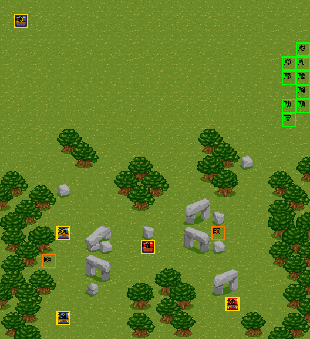

# 第 14 章　天空之騎士

<!-- chapter_docs:header -->
| 項目 | 內容 |
| --- | --- |
| 章號／章節索引 | 14／13 |
| 章名（文字區塊 `0x01`） | 天空之騎士 |
| 勝利條件（`0x02`） | 敵人全滅 |
| 敗北條件（`0x03`） | 蘭迪斯死亡／法蓮娜死亡 |
| 戰場 | `MAP13.DAT`／`MAP13.COD`／`M13.DTL`，22×24 格，我方 slot 9 個，部署記錄 37 筆 |
| 文字區塊 | `FDETXT14.TXT`，18 條 |
| 進入處理（`0x60074`[13]） | `fdps_chapter_14_init`（`0x21200`） |
| 行動後檢查（`0x6028c`[13]） | `fdps_chapter_14_post_action`（`0x3aad0`） |
| 勝利處理（`0x60304`[13]） | `fdps_chapter_14_end`（`0x3aaf0`） |
| 地圖資料呼叫的事件處理（`0x601c4`） | slot 19：`fdps_chapter_14_event_deploy_wave_4`（`0x37a50`）（回合事件） |
| 過場腳本 | `ICON13.DAT`（開場）、`WIN13.DAT`（勝利） |
| 本章之前的村莊 | `SHOP13.DAT` |
| 光碟 | 第 1 片（音軌見 [CD 音軌](../program_info/cd_audio.md)） |



戰場全圖（第 0 層與同步捲動的圖層）。框線：黃 `C` 寶箱、橘 `B` 埋藏格、青 `R` 重繪格、洋紅 `E` 有處理函式的格子事件格，字母後的數字是事件碼；綠 `P` 是我方 slot 的起始格。

圖由 `python tools/chapter_docs/chapter_facts.py render-maps` 從遊戲檔重畫到 `chapters/maps/`，`verify-maps` 逐 byte 比對版控中的圖。
<!-- /chapter_docs:header -->

## 概要

開場過場在地圖 13 的草原上：九人一路往左走，蘭迪斯問起葛斯洛喀教派，費塔加說那是十多年前在大陸西南方興起、信奉掌管力量的混沌神的教派，並懷疑卡里斯臨死前說的「葛斯洛喀」與它有關（`0x09`）。亞克想起在石巨神遺跡差點送命時的那個魔導士就是這個教派的人（[`ch03.md`](ch03.md)）；費塔加解釋他們主張萬物力量均衡，任何一方太強就要設法削弱（`0x0a`），尤利安斥為邪教（`0x0b`）。蘭迪斯推斷他們是為了削弱強盛的羅特帝亞才設計陷害索爾，憤而質問「國家強盛也有罪嗎」，布蘭多附和要找他們算帳（`0x0c`）；費塔加提醒眼下最要緊的是在索爾失去利用價值之前把他救出來（`0x0d`）。

此時左方出現一名武士與一名飛兵。費塔加說敵方有飛兵、這裡是平坦的草原，要大家往前面的森林跑（`0x0e`）。畫面淡出後隊伍已散在地圖中央偏上的 (2–13, 9–11) 一帶，上方是羅特帝亞的追兵；飛兵宣讀國王的命令，以陰謀顛覆王位的罪名逮捕蘭迪斯等人，蘭迪斯斥為假索爾的謊言（`0x0f`）。第 6 回合下方的樹林又冒出兩群武士，蘭迪斯喊出「我們被包圍了」（`0x11`）。

打倒全部敵人後，勝利過場 `WIN13.DAT` 把隊伍聚在 (8–12, 15–19)：裘娜抱怨追兵追得真緊，蘭迪斯決定前往達拉尼亞揭發假索爾的陰謀，亞克歡呼，法蓮娜沉默不語（`0x10`）。

## 加入與離隊

本章沒有人入隊或離隊，也沒有 NPC 同行。`fdps_chapter_14_init`（`0x21200`）不呼叫 `fdps_roster_add_character`，名冊維持第 13 章結束時的九人，恰好填滿 `MAP13.DAT` 的 9 個我方 slot。各人的入隊章節與名冊記錄見 [`assets/characters.md` 的加入一節](../assets/characters.md#加入)；下一位入隊的是第 15 章的瑪麗安（[`ch15.md`](ch15.md)）。

## 勝敗條件與特殊機制

- **勝利**：陣營 0 全部退場。`fdps_chapter_14_post_action`（`0x3aad0`）整支只轉呼共用判定 `fdps_battle_check_default_end_conditions`（`0x3a2e0`），它只數單位陣列裡現有的陣營 0 單位，不知道還有沒部署的波次。所以若開場的 20 名敵人在第 6 回合的回合事件之前就全數倒下，戰鬥當場判定勝利，第 6 回合的援軍與搶寶箱的狼人都不會出現。
- **敗北只看蘭迪斯**：同一支共用判定在章節索引 13 只看地圖單位 0（蘭迪斯）是否退場。畫面上的失敗條件寫著「蘭迪斯死亡／法蓮娜死亡」，但法蓮娜陣亡時戰鬥照常進行：本章的四支處理函式都不檢查其他單位，我方單位建立時的死亡腳本一律是 `0xff`，`MAP13.DAT` 也沒有代表法蓮娜的部署記錄。這是原版就有的落差（[`known_bugs.md` 第 11 條](../program_info/known_bugs.md#11-第-1420-章的法蓮娜死亡不算敗北)），重建時不能補上這條判定（[`pitfalls.md` 的「不能照字面理解的資料」](../rebuild_info/pitfalls.md#不能照字面理解的資料)）。
- **第 6 回合的援軍**：`MAP13.DAT` 的回合事件表只有一筆（回合 6、slot 19、陣營階段 2），在第 5 回合敵方階段結束、第 6 回合我方階段開始前呼叫 `fdps_chapter_14_event_deploy_wave_4`（`0x37a50`），部署波次 4 的 17 名。這支處理函式沒有一次性旗標，只靠回合事件表只列它一次而只觸發一次。
- **搶寶箱的狼人**：波次 4 的第 36 筆 `52` 狼人（LV17）是 AI 行為 5，事件碼 3，目標是 (1, 1) 的寶箱暗之徽章；錨點 (0, 3) 離寶箱只有 3 格。`fdps_map_actor_behavior_step`（`0x10010`）讓牠先找值得出手的行動，沒有就走向寶箱，走到就開箱：暗之徽章放進牠的背包並寫成牠的死亡腳本（物品），寶箱旗標設起、格子重繪，行為改成 7，朝部署記錄的目的地 (11, 0) 走，走到就退場，徽章隨之消失。在牠退場之前由存活的我方單位打倒牠，徽章就掉給擊殺者（掉落規則見 [`resource_info/map.md`](../resource_info/map.md)）。寶箱在牠出現前已被玩家打開時，牠就照行為 0 的方式走向我方。狼人退場也算陣營 0 少一名，不妨礙勝利。
- **擊倒掉落**：開場的波次 1 有四筆帶死亡腳本（3000 金、魔法水、1000 金、再生藥），只在擊殺者是存活的我方單位時發放，見下方寶物一節的表。

## 敵人配置

整章的敵人都不在波次 0，全部由腳本或事件部署：

- **開場 20 名**：`ICON13.DAT` 在 `0x233` 先部署波次 2 的武士與飛兵各一（第 0、14 筆），讓他們從左邊走進畫面，再於 `0x288`、`0x28d` 放到 (8, 4)、(7, 5)；接著 `0x297` 部署波次 1 的 18 名——弓箭手 5、暗魔導士 4、武士 4、飛兵 5——錨點散在上方 y = 0–4 的橫帶上，以找最近空格的方式放置。合計武士 5、飛兵 6、弓箭手 5、暗魔導士 4。
- **第 6 回合的波次 4**：16 名 LV13 武士沿下緣分成兩群，左群錨點 (4–7, 21–22)、右群錨點 (14–18, 21) 與 (14–16, 22)，各 8 名；另有一隻搶寶箱的 LV17 狼人在左上角 (0, 3)。全部以找最近空格的方式放置。
- **AI**：除了那隻狼人，全部是行為 0（能打就打，否則走向路徑最近的對手；定義見 [`program_info/map_ai.md`](../program_info/map_ai.md#行為代碼)），沒有守點不動或會離場的守軍。本章沒有頭目。

<!-- chapter_docs:deployments -->
陣營與死亡腳本的意義見 [`resource_info/map.md`](../resource_info/map.md)，AI 行為（低 4 bit）見 [`program_info/map_ai.md`](../program_info/map_ai.md#行為代碼)；錨點是 `MAPnn.COD` 的座標，開場波次放在錨點上，其餘波次依部署方式放在錨點或最近的空格。單位名是全域文字的「角色編號 + 1」條；角色編號 `3C` 以上的敵兵，數值（`ENEMYDAT.DAT`）與種族、職業見 [`assets/enemies.md`](../assets/enemies.md)，以下的見 [`assets/characters.md`](../assets/characters.md)。

我方起始格：slot 0 (20, 4)、slot 1 (21, 4)、slot 2 (21, 5)、slot 3 (21, 3)、slot 4 (21, 6)、slot 5 (20, 5)、slot 6 (20, 7)、slot 7 (20, 8)、slot 8 (21, 7)。

| 波次 | 陣營 | 單位 | 等級 | 數量 |
| ---: | --- | --- | --- | ---: |
| 1 | 敵方 | `5E` 弓箭手 | 11 | 5 |
| 1 | 敵方 | `67` 暗魔導士 | 13 | 4 |
| 1 | 敵方 | `63` 武士 | 13 | 4 |
| 1 | 敵方 | `60` 飛兵 | 12 | 5 |
| 2 | 敵方 | `63` 武士 | 13 | 1 |
| 2 | 敵方 | `60` 飛兵 | 12 | 1 |
| 4 | 敵方 | `63` 武士 | 13 | 16 |
| 4 | 敵方 | `52` 狼人 | 17 | 1 |

### 波次 1

出場：開場過場 `ICON13.DAT` `0x297` 的 `DEPLOY_WAVE`（找最近空格，錨點在上方 y = 0–4），由 `fdps_chapter_14_init`（`0x21200`）經 `fdps_icon_script_run`（`0x21650`）執行，戰鬥開始前

| # | 陣營 | 單位 | 等級 | AI 行為 | 錨點 | 死亡腳本 |
| ---: | --- | --- | ---: | --- | --- | --- |
| 1 | 敵方 | `5E` 弓箭手 | 11 | 0 主動 | (12, 1) | — |
| 2 | 敵方 | `5E` 弓箭手 | 11 | 0 主動 | (4, 2) | — |
| 3 | 敵方 | `5E` 弓箭手 | 11 | 0 主動 | (0, 0) | — |
| 4 | 敵方 | `5E` 弓箭手 | 11 | 0 主動 | (16, 3) | — |
| 5 | 敵方 | `5E` 弓箭手 | 11 | 0 主動 | (18, 1) | 掉落 3000 金 |
| 6 | 敵方 | `67` 暗魔導士 | 13 | 0 主動 | (15, 1) | — |
| 7 | 敵方 | `67` 暗魔導士 | 13 | 0 主動 | (3, 1) | — |
| 8 | 敵方 | `67` 暗魔導士 | 13 | 0 主動 | (9, 0) | 掉落 `B8` 魔法水 |
| 9 | 敵方 | `67` 暗魔導士 | 13 | 0 主動 | (20, 0) | — |
| 10 | 敵方 | `63` 武士 | 13 | 0 主動 | (20, 3) | — |
| 11 | 敵方 | `63` 武士 | 13 | 0 主動 | (9, 1) | — |
| 12 | 敵方 | `63` 武士 | 13 | 0 主動 | (3, 2) | — |
| 13 | 敵方 | `63` 武士 | 13 | 0 主動 | (13, 1) | 掉落 1000 金 |
| 15 | 敵方 | `60` 飛兵 | 12 | 0 主動 | (12, 2) | — |
| 16 | 敵方 | `60` 飛兵 | 12 | 0 主動 | (4, 3) | 掉落 `B6` 再生藥 |
| 17 | 敵方 | `60` 飛兵 | 12 | 0 主動 | (0, 4) | — |
| 18 | 敵方 | `60` 飛兵 | 12 | 0 主動 | (20, 1) | — |
| 19 | 敵方 | `60` 飛兵 | 12 | 0 主動 | (8, 0) | — |

### 波次 2

出場：開場過場 `ICON13.DAT` `0x233` 的 `DEPLOY_WAVE`（找最近空格），之後 `0x288`、`0x28d` 把兩人放到 (8, 4)、(7, 5)；由 `fdps_chapter_14_init`（`0x21200`）執行，戰鬥開始前

| # | 陣營 | 單位 | 等級 | AI 行為 | 錨點 | 死亡腳本 |
| ---: | --- | --- | ---: | --- | --- | --- |
| 0 | 敵方 | `63` 武士 | 13 | 0 主動 | (2, 3) | — |
| 14 | 敵方 | `60` 飛兵 | 12 | 0 主動 | (1, 4) | — |

### 波次 4

出場：回合事件（回合 6、陣營階段 2）在第 6 回合我方階段開始前呼叫 `fdps_chapter_14_event_deploy_wave_4`（`0x37a50`），以找最近空格部署；開場 20 名若在那之前全滅，戰鬥已判定勝利，本波次不會出現

| # | 陣營 | 單位 | 等級 | AI 行為 | 錨點 | 死亡腳本 |
| ---: | --- | --- | ---: | --- | --- | --- |
| 20 | 敵方 | `63` 武士 | 13 | 0 主動 | (4, 21) | — |
| 21 | 敵方 | `63` 武士 | 13 | 0 主動 | (5, 21) | — |
| 22 | 敵方 | `63` 武士 | 13 | 0 主動 | (6, 21) | — |
| 23 | 敵方 | `63` 武士 | 13 | 0 主動 | (7, 21) | — |
| 24 | 敵方 | `63` 武士 | 13 | 0 主動 | (7, 22) | — |
| 25 | 敵方 | `63` 武士 | 13 | 0 主動 | (6, 22) | — |
| 26 | 敵方 | `63` 武士 | 13 | 0 主動 | (5, 22) | — |
| 27 | 敵方 | `63` 武士 | 13 | 0 主動 | (4, 22) | — |
| 28 | 敵方 | `63` 武士 | 13 | 0 主動 | (14, 21) | — |
| 29 | 敵方 | `63` 武士 | 13 | 0 主動 | (15, 21) | — |
| 30 | 敵方 | `63` 武士 | 13 | 0 主動 | (16, 21) | — |
| 31 | 敵方 | `63` 武士 | 13 | 0 主動 | (17, 21) | — |
| 32 | 敵方 | `63` 武士 | 13 | 0 主動 | (18, 21) | — |
| 33 | 敵方 | `63` 武士 | 13 | 0 主動 | (16, 22) | — |
| 34 | 敵方 | `63` 武士 | 13 | 0 主動 | (15, 22) | — |
| 35 | 敵方 | `63` 武士 | 13 | 0 主動 | (14, 22) | — |
| 36 | 敵方 | `52` 狼人 | 17 | 5 搶寶箱：碼 3 | (0, 3) | — |
<!-- /chapter_docs:deployments -->

## 寶物

(1, 1) 的暗之徽章是第 6 回合那隻狼人的目標，想在牠之前拿到就要在第 6 回合敵方階段之前把寶箱打開；被搶走之後只能趁牠走到 (11, 0) 退場前打倒牠取回（見上方勝敗條件與特殊機制）。暗之徽章在教會轉職時決定路線（[`program_info/village.md`](../program_info/village.md)），本章之前的村莊裡，秘密商店也有一句「徽章是重要的道具……不要拿去賣了」（`0x08`）。

(15, 16) 與 (3, 18) 是埋藏格，要讓單位站在該格、選行動選單的第四格（休息，它同時搜尋腳下的格子），在「發現寶物，要挖掘嗎？」答是才拿得到。本章沒有處理函式另外發放的物品。

<!-- chapter_docs:treasure -->
搜尋的規則（同碼的格共用一筆記錄與一個旗標、背包滿時的交換）見 [`resource_info/map.md`](../resource_info/map.md)。

| 事件碼 | 格 | 內容 |
| ---: | --- | --- |
| 0 | (4, 16) 寶箱 | 3000 金 |
| 1 | (10, 17) 寶箱 | `B6` 再生藥 |
| 2 | (16, 21) 寶箱 | `CF` 冰之水晶 |
| 3 | (1, 1) 寶箱 | `E1` 暗之徽章 |
| 4 | (4, 22) 寶箱 | `D9` 耐力藥水 |
| 5 | (15, 16) 埋藏 | `D8` 力量藥水 |
| 6 | (3, 18) 埋藏 | `DA` 速度藥水 |

擊倒後掉落（死亡腳本 opcode 0／1，擊殺者須是存活的我方單位）：

| # | 單位 | 波次 | 掉落 |
| ---: | --- | ---: | --- |
| 5 | `5E` 弓箭手 | 1 | 掉落 3000 金 |
| 8 | `67` 暗魔導士 | 1 | 掉落 `B8` 魔法水 |
| 13 | `63` 武士 | 1 | 掉落 1000 金 |
| 16 | `60` 飛兵 | 1 | 掉落 `B6` 再生藥 |
<!-- /chapter_docs:treasure -->

## 村莊

<!-- chapter_docs:village -->
第 13 章勝利後、本章之前的村莊載入 `SHOP13.DAT`，道具店、武器店、秘密商店的貨見 [`assets/shops.md`](../assets/shops.md)。村莊載入的文字區塊是 `FDETXT14`（章節索引 + 1，`fdps_load_field_chapter_resources`（`0x31540`）），也就是本章的區塊，所以村莊畫面的文字是本章區塊的 `0x04`–`0x08`，全文在下方「對話」。
<!-- /chapter_docs:village -->

## 處理流程

### 進入：`fdps_chapter_14_init`（`0x21200`）

1. `fdps_chapter_state_reset`（`0x22750`）依 `MAP13.DAT` 建立地圖單位陣列：9 個我方 slot 從名冊前端取人，放在 `MAP13.COD` 的起始格 (20–21, 3–8)；地圖沒有波次 0 的記錄，此時場上沒有敵人。
2. `fdps_icon_script_run`（`0x21650`）播 `Icon13.dat`：隊伍往左走、對話，`0x233` 部署波次 2，淡出後把九名隊員放到 (2–13, 9–11)、兩名追兵放到 (8, 4)、(7, 5)，`0x297` 部署波次 1，淡入後顯示宣讀命令的對話，停止音樂後結束。腳本沒有切換地圖，也沒有寫任何單位狀態。結束時單位陣列共 29 名：我方 0–8、波次 2 是 9–10、波次 1 是 11–28。
3. `fdps_show_chapter_title_card`（`0x20c60`）顯示章節標題圖（圖像，不讀文字區塊）。
4. `fdps_map_cursor_move_to_unit`（`0x2da50`）把游標放在單位 0 蘭迪斯身上。

### 行動後檢查：`fdps_chapter_14_post_action`（`0x3aad0`）

整支只呼叫 `fdps_battle_check_default_end_conditions`（`0x3a2e0`）：結束碼已非 0 就返回；否則先寫 2（勝利），陣營 0 還有未退場的單位就改回 0；最後地圖單位 0 退場就寫 1（敗北），所以同一次行動裡最後一名敵人與蘭迪斯同時倒下時算敗北。沒有任何針對法蓮娜或其他單位的判定。

### 第 6 回合事件：`fdps_chapter_14_event_deploy_wave_4`（`0x37a50`）

1. `fdps_deploy_wave`（`0x23830`）以目前的章節索引部署波次 4，找最近空格放置；17 名接在陣列尾端，成為單位 29–45。
2. `fdps_map_cursor_move_to_unit`（`0x2da50`）把游標移到單位 `0x24`（36，波次 4 的第 27 筆，左群錨點 (4, 22)），以 `fdps_render_view_frame`（`0x2beb0`）重繪 12 幀停留。
3. 同樣把游標移到單位 `0x2a`（42，第 33 筆，右群錨點 (16, 22)），再停 12 幀。這兩個索引是寫死的數字，只因為開場恰好有 29 名單位才落在兩群武士身上。
4. `fdps_draw_text`（`0x1ff60`）顯示本章文字 `0x11`「那裡也有敵人，我們被包圍了！」。

處理函式不改任何單位的 AI，也不設旗標；游標留在右群。

### 勝利：`fdps_chapter_14_end`（`0x3aaf0`）

1. `fdps_battle_destroy_remaining_enemies`（`0x39e10`）把陣營 0 的 HP 歸零；過關時陣營 0 已全數退場，這一步沒有可見效果。
2. `fdps_roster_write_back_battle_units`（`0x23980`）把戰場上的隊員寫回名冊，擊倒掉落的物品與搶回的徽章隨背包進名冊（掉落的金錢在擊倒當下已加進隊伍金錢）。
3. `fdps_icon_script_run`（`0x21650`）播 `Win13.dat`：復歸地圖單位 1–8，把九人放到 (8–12, 15–19)，顯示勝利對話。
4. `fdps_roster_revive_fallen_members`（`0x39e70`）讓陣亡的隊員收費復活。
5. 章節索引寫成 14，也就是第 15 章（[`ch15.md`](ch15.md)），之後進入章間村莊。

## 回合事件與格子事件

<!-- chapter_docs:events -->
觸發時機與陣營階段的意義見 [`resource_info/map.md`](../resource_info/map.md)。

| 回合 | 陣營階段 | slot | 處理函式 |
| ---: | --- | ---: | --- |
| 6 | 下一個我方階段前（回合計數 6） | 19 | `fdps_chapter_14_event_deploy_wave_4`（`0x37a50`） |

本章沒有格子事件。
<!-- /chapter_docs:events -->

## 過場腳本

<!-- chapter_docs:scripts -->
格式與每個指令的意義見 [`resource_info/cutscene_script.md`](../resource_info/cutscene_script.md)。`FDETXT14#0xNN` 是本章文字區塊的條目，全文在下方「對話」；切到額外場景之後顯示的文字直接列出（那些區塊的正典是 [`assets/text/scene_text.md`](../assets/text/scene_text.md)）。`u3=我方1` 是地圖單位索引 3 對到我方 slot 1，`u12=MAP02#9` 是 `MAP02.DAT` 第 9 筆部署記錄。

### `ICON13.DAT`

- 開場：`fdps_chapter_14_init`（`0x21200`）
- 689 byte、105 步；起始地圖 13，切換地圖 無，結束於地圖 13

| 偏移 | 指令 | 內容 |
| ---: | --- | --- |
| `0000` | `SET_MUSIC` | 音樂 17（CD 第 18 軌） |
| `0002` | `SCROLL_VIEW` | 捲動視野到格 (7, 2) |
| `0005` | `WALK_UNITS` | 行走 6 格，每步 1 幀：u8=我方8往左 |
| `000b` | `FACE_UNITS` | 轉向後停 25 幀：u8=我方8朝上 |
| `0010` | `FACE_UNITS` | 轉向後停 25 幀：u8=我方8朝左 |
| `0015` | `FACE_UNITS` | 轉向後停 25 幀：u8=我方8朝下 |
| `001a` | `WALK_UNITS` | 行走 1 格，每步 1 幀：u8=我方8往下 |
| `0020` | `FACE_UNITS` | 轉向後停 50 幀：u8=我方8朝下 |
| `0025` | `WALK_UNITS` | 行走 3 格，每步 4 幀：u4=我方4往左 |
| `002b` | `FACE_UNITS` | 轉向後停 12 幀：u4=我方4朝下 |
| `0030` | `FACE_UNITS` | 轉向後停 12 幀：u8=我方8朝上 |
| `0035` | `WALK_UNITS` | 行走 2 格，每步 1 幀：u8=我方8往上 |
| `003b` | `FACE_UNITS` | 轉向後停 1 幀：u4=我方4朝左 |
| `0040` | `WALK_UNITS` | 行走 2 格，每步 1 幀：u8=我方8往右 |
| `0046` | `FACE_UNITS` | 轉向後停 25 幀：u8=我方8朝右 |
| `004b` | `WALK_UNITS` | 行走 2 格，每步 2 幀：u8=我方8往左、u4=我方4往左 |
| `0053` | `WALK_UNITS` | 行走 1 格，每步 2 幀：u8=我方8往下、u4=我方4往左 |
| `005b` | `WALK_UNITS` | 行走 1 格，每步 2 幀：u8=我方8往下、u4=我方4往下 |
| `0063` | `FACE_UNITS` | 轉向後停 12 幀：u8=我方8朝上 |
| `0068` | `FACE_UNITS` | 轉向後停 1 幀：u8=我方8朝下 |
| `006d` | `WALK_UNITS` | 行走 1 格，每步 4 幀：u4=我方4往右 |
| `0073` | `WALK_UNITS` | 行走 2 格，每步 4 幀：u4=我方4往下 |
| `0079` | `FACE_UNITS` | 轉向後停 25 幀：u4=我方4朝左 |
| `007e` | `WALK_UNITS` | 行走 1 格，每步 4 幀：u0=我方0往左、u5=我方5往左 |
| `0086` | `WALK_UNITS` | 行走 1 格，每步 4 幀：u0=我方0往左、u5=我方5往左、u2=我方2往左 |
| `0090` | `WALK_UNITS` | 行走 2 格，每步 4 幀：u0=我方0往左、u5=我方5往左、u2=我方2往左、u1=我方1往左、u3=我方3往左 |
| `009e` | `FACE_UNITS` | 轉向後停 25 幀：u0=我方0朝下、u5=我方5朝上 |
| `00a5` | `DRAW_TEXT` | 顯示文字 FDETXT14#0x09 |
| `00a7` | `WALK_UNITS` | 行走 1 格，每步 4 幀：u6=我方6往左、u7=我方7往上 |
| `00af` | `WALK_UNITS` | 行走 1 格，每步 4 幀：u6=我方6往左、u7=我方7往左 |
| `00b7` | `FACE_UNITS` | 轉向後停 1 幀：u0=我方0朝右、u5=我方5朝右 |
| `00be` | `WALK_UNITS` | 行走 1 格，每步 4 幀：u2=我方2往左、u1=我方1往左、u3=我方3往左、u6=我方6往左、u7=我方7往左 |
| `00cc` | `DRAW_TEXT` | 顯示文字 FDETXT14#0x0a |
| `00ce` | `WALK_UNITS` | 行走 2 格，每步 4 幀：u6=我方6往左、u7=我方7往左 |
| `00d6` | `FACE_UNITS` | 轉向後停 12 幀：u8=我方8朝上 |
| `00db` | `FACE_UNITS` | 轉向後停 25 幀：u6=我方6朝下 |
| `00e0` | `FACE_UNITS` | 轉向後停 6 幀：u6=我方6朝左 |
| `00e5` | `FACE_UNITS` | 轉向後停 6 幀：u6=我方6朝下 |
| `00ea` | `FACE_UNITS` | 轉向後停 6 幀：u6=我方6朝右 |
| `00ef` | `FACE_UNITS` | 轉向後停 6 幀：u6=我方6朝下 |
| `00f4` | `FACE_UNITS` | 轉向後停 1 幀：u8=我方8朝下 |
| `00f9` | `WALK_UNITS` | 行走 1 格，每步 4 幀：u3=我方3往左 |
| `00ff` | `FACE_UNITS` | 轉向後停 1 幀：u3=我方3朝下、u2=我方2朝上 |
| `0106` | `DRAW_TEXT` | 顯示文字 FDETXT14#0x0b |
| `0108` | `WALK_UNITS` | 行走 1 格，每步 4 幀：u6=我方6往左、u7=我方7往左、u8=我方8往右 |
| `0112` | `FACE_UNITS` | 轉向後停 25 幀：u6=我方6朝上、u4=我方4朝上、u8=我方8朝下 |
| `011b` | `WALK_UNITS` | 行走 1 格，每步 1 幀：u8=我方8往左 |
| `0121` | `FACE_UNITS` | 轉向後停 6 幀：u0=我方0朝下、u1=我方1朝下、u2=我方2朝下、u4=我方4朝左、u5=我方5朝下、u6=我方6朝下、u7=我方7朝下 |
| `0132` | `FACE_UNITS` | 轉向後停 50 幀：u8=我方8朝上 |
| `0137` | `WALK_UNITS` | 行走 3 格，每步 1 幀：u8=我方8往左 |
| `013d` | `FACE_UNITS` | 轉向後停 1 幀：u1=我方1朝左、u2=我方2朝左、u5=我方5朝左、u6=我方6朝左、u7=我方7朝左、u0=我方0朝左、u3=我方3朝左 |
| `014e` | `WALK_UNITS` | 行走 4 格，每步 1 幀：u8=我方8往左 |
| `0154` | `FACE_UNITS` | 轉向後停 75 幀：u5=我方5朝左 |
| `0159` | `WALK_UNITS` | 行走 1 格，每步 4 幀：u5=我方5往左 |
| `015f` | `WALK_UNITS` | 行走 2 格，每步 4 幀：u5=我方5往左、u0=我方0往左、u1=我方1往左、u2=我方2往左、u3=我方3往左、u6=我方6往左、u7=我方7往左、u4=我方4往上 |
| `0173` | `FACE_UNITS` | 轉向後停 1 幀：u6=我方6朝上 |
| `0178` | `WALK_UNITS` | 行走 1 格，每步 4 幀：u0=我方0往左、u1=我方1往左、u2=我方2往左、u3=我方3往左、u4=我方4往左 |
| `0186` | `FACE_UNITS` | 轉向後停 6 幀：u0=我方0朝下 |
| `018b` | `FACE_UNITS` | 轉向後停 12 幀：u5=我方5朝上、u3=我方3朝下、u4=我方4朝上 |
| `0194` | `DRAW_TEXT` | 顯示文字 FDETXT14#0x0c |
| `0196` | `FACE_UNITS` | 轉向後停 1 幀：u1=我方1朝下、u2=我方2朝下、u5=我方5朝下、u4=我方4朝左 |
| `01a1` | `WALK_UNITS` | 行走 1 格，每步 1 幀：u5=我方5往左、u6=我方6往上、u7=我方7往左 |
| `01ab` | `FACE_UNITS` | 轉向後停 50 幀：u5=我方5朝下、u7=我方7朝上、u4=我方4朝上、u2=我方2朝左、u4=我方4朝左 |
| `01b8` | `FACE_UNITS` | 轉向後停 6 幀：u5=我方5朝左 |
| `01bd` | `FACE_UNITS` | 轉向後停 6 幀：u5=我方5朝下 |
| `01c2` | `FACE_UNITS` | 轉向後停 6 幀：u5=我方5朝右 |
| `01c7` | `SET_MUSIC` | 音樂 9（CD 第 10 軌） |
| `01c9` | `FACE_UNITS` | 轉向後停 6 幀：u5=我方5朝下 |
| `01ce` | `DRAW_TEXT` | 顯示文字 FDETXT14#0x0d |
| `01d0` | `FACE_UNITS` | 轉向後停 1 幀：u0=我方0朝左、u1=我方1朝左、u2=我方2朝左、u3=我方3朝左、u4=我方4朝左、u5=我方5朝左、u6=我方6朝左、u7=我方7朝左 |
| `01e3` | `WALK_UNITS` | 行走 5 格，每步 1 幀：u8=我方8往右 |
| `01e9` | `FACE_UNITS` | 轉向後停 1 幀：u0=我方0朝下、u1=我方1朝下、u2=我方2朝下、u3=我方3朝下、u5=我方5朝下、u6=我方6朝下、u7=我方7朝下 |
| `01fa` | `WALK_UNITS` | 行走 3 格，每步 1 幀：u8=我方8往上 |
| `0200` | `FACE_UNITS` | 轉向後停 12 幀：u0=我方0朝下、u1=我方1朝左、u2=我方2朝左、u3=我方3朝下、u4=我方4朝上、u5=我方5朝右、u6=我方6朝上、u7=我方7朝上 |
| `0213` | `FACE_UNITS` | 轉向後停 6 幀：u8=我方8朝左 |
| `0218` | `FACE_UNITS` | 轉向後停 12 幀：u0=我方0朝左、u1=我方1朝左、u2=我方2朝左、u3=我方3朝左、u4=我方4朝左、u5=我方5朝左、u6=我方6朝左、u7=我方7朝左、u8=我方8朝左 |
| `022d` | `SCROLL_VIEW` | 捲動視野到格 (4, 2) |
| `0230` | `SCROLL_VIEW` | 捲動視野到格 (4, 1) |
| `0233` | `DEPLOY_WAVE` | 部署 MAP13 波次 2（找最近空格）：#0(角色0x63)、#14(角色0x60) |
| `0236` | `WALK_UNITS` | 行走 5 格，每步 2 幀：u9=MAP13#0(角色0x63)往右、u10=MAP13#14(角色0x60)往右 |
| `023e` | `DRAW_TEXT` | 顯示文字 FDETXT14#0x0e |
| `0240` | `WALK_UNITS` | 行走 3 格，每步 1 幀：u0=我方0往下、u1=我方1往右、u2=我方2往右、u3=我方3往下、u4=我方4往左、u5=我方5往下、u6=我方6往下、u7=我方7往下、u8=我方8往下 |
| `0256` | `FADE_OUT` | 淡出，每步 5 ms |
| `0258` | `SCROLL_VIEW` | 捲動視野到格 (1, 8) |
| `025b` | `PLACE_UNIT` | 放置 u0=我方0 到 (7, 9)，朝上 |
| `0260` | `PLACE_UNIT` | 放置 u1=我方1 到 (11, 11)，朝上 |
| `0265` | `PLACE_UNIT` | 放置 u2=我方2 到 (3, 9)，朝上 |
| `026a` | `PLACE_UNIT` | 放置 u3=我方3 到 (8, 11)，朝上 |
| `026f` | `PLACE_UNIT` | 放置 u4=我方4 到 (2, 10)，朝上 |
| `0274` | `PLACE_UNIT` | 放置 u5=我方5 到 (9, 10)，朝上 |
| `0279` | `PLACE_UNIT` | 放置 u6=我方6 到 (12, 9)，朝上 |
| `027e` | `PLACE_UNIT` | 放置 u7=我方7 到 (13, 10)，朝上 |
| `0283` | `PLACE_UNIT` | 放置 u8=我方8 到 (4, 11)，朝上 |
| `0288` | `PLACE_UNIT` | 放置 u9=MAP13#0(角色0x63) 到 (8, 4)，朝下 |
| `028d` | `PLACE_UNIT` | 放置 u10=MAP13#14(角色0x60) 到 (7, 5)，朝下 |
| `0292` | `FACE_UNITS` | 轉向後停 1 幀：u0=我方0朝上 |
| `0297` | `DEPLOY_WAVE` | 部署 MAP13 波次 1（找最近空格）：#1(角色0x5e)、#2(角色0x5e)、#3(角色0x5e)、#4(角色0x5e)、#5(角色0x5e)、#6(角色0x67)、#7(角色0x67)、#8(角色0x67)、#9(角色0x67)、#10(角色0x63)、#11(角色0x63)、#12(角色0x63)、#13(角色0x63)、#15(角色0x60)、#16(角色0x60)、#17(角色0x60)、#18(角色0x60)、#19(角色0x60) |
| `029a` | `FADE_IN` | 淡入，每步 20 ms |
| `029c` | `FACE_UNITS` | 轉向後停 25 幀：u0=我方0朝上 |
| `02a1` | `SCROLL_VIEW` | 捲動視野到格 (7, 0) |
| `02a4` | `FACE_UNITS` | 轉向後停 25 幀：u0=我方0朝上 |
| `02a9` | `SCROLL_VIEW` | 捲動視野到格 (1, 3) |
| `02ac` | `DRAW_TEXT` | 顯示文字 FDETXT14#0x0f |
| `02ae` | `SET_MUSIC` | 停止音樂 |
| `02b0` | `END` | 結束 |

### `WIN13.DAT`

- 勝利：`fdps_chapter_14_end`（`0x3aaf0`）
- 85 byte、26 步；起始地圖 13，切換地圖 無，結束於地圖 13

| 偏移 | 指令 | 內容 |
| ---: | --- | --- |
| `0000` | `FADE_OUT` | 淡出，每步 40 ms |
| `0002` | `SET_MUSIC` | 音樂 9（CD 第 10 軌） |
| `0004` | `REVIVE_UNIT` | 復歸 u1=我方1（清狀態） |
| `0006` | `REVIVE_UNIT` | 復歸 u2=我方2（清狀態） |
| `0008` | `REVIVE_UNIT` | 復歸 u3=我方3（清狀態） |
| `000a` | `REVIVE_UNIT` | 復歸 u4=我方4（清狀態） |
| `000c` | `REVIVE_UNIT` | 復歸 u5=我方5（清狀態） |
| `000e` | `REVIVE_UNIT` | 復歸 u6=我方6（清狀態） |
| `0010` | `REVIVE_UNIT` | 復歸 u7=我方7（清狀態） |
| `0012` | `REVIVE_UNIT` | 復歸 u8=我方8（清狀態） |
| `0014` | `SET_VIEW_TILE` | 視野直接設到格 (4, 14) |
| `0017` | `PLACE_UNIT` | 放置 u0=我方0 到 (10, 17)，朝下 |
| `001c` | `PLACE_UNIT` | 放置 u1=我方1 到 (8, 16)，朝右 |
| `0021` | `PLACE_UNIT` | 放置 u2=我方2 到 (8, 19)，朝上 |
| `0026` | `PLACE_UNIT` | 放置 u3=我方3 到 (11, 16)，朝下 |
| `002b` | `PLACE_UNIT` | 放置 u4=我方4 到 (12, 18)，朝左 |
| `0030` | `PLACE_UNIT` | 放置 u5=我方5 到 (10, 19)，朝上 |
| `0035` | `PLACE_UNIT` | 放置 u6=我方6 到 (12, 17)，朝左 |
| `003a` | `PLACE_UNIT` | 放置 u7=我方7 到 (12, 16)，朝左 |
| `003f` | `PLACE_UNIT` | 放置 u8=我方8 到 (10, 15)，朝下 |
| `0044` | `FACE_UNITS` | 轉向後停 1 幀：u0=我方0朝下 |
| `0049` | `FADE_IN` | 淡入，每步 40 ms |
| `004b` | `FACE_UNITS` | 轉向後停 25 幀：u0=我方0朝下 |
| `0050` | `DRAW_TEXT` | 顯示文字 FDETXT14#0x10 |
| `0052` | `FADE_OUT` | 淡出，每步 40 ms |
| `0054` | `END` | 結束 |
<!-- /chapter_docs:scripts -->

## 對話

<!-- chapter_docs:dialogue -->
`FDETXT14.TXT` 全部 18 條，依條目編號排列。每條先列讀取端（顯示它的腳本步驟、處理函式或死亡腳本），再列全文：【名稱】是換說話者（頭像取自括號裡的角色編號；【地圖單位 n】取執行當下第 n 個地圖單位），每一行是一次換行，▼ 是換頁（等按鍵）。`{subst1}`、`{subst2}`、`{number}` 是執行期代入的名稱與數字（[`resource_info/text.md`](../resource_info/text.md)）。

### `0x00`

永遠不會顯示：「第十四章」沒有讀取端：章名卡由 `fdps_show_chapter_title_card`（`0x20c60`）畫 `CHAPTER.SAF` 的圖，本章的處理函式與 `ICON13.DAT`／`WIN13.DAT` 都不畫這一條，見 [S13a（排除清單）](../cut_content/_index.md#排除清單)。

### `0x01`

讀取端：`fdps_draw_save_slot_panel`（`0x24a40`）

```text
天空之騎士
```

### `0x02`

讀取端：`fdps_battle_show_win_fail_window`（`0x17ca0`）

```text
敵人全滅
```

### `0x03`

讀取端：`fdps_battle_show_win_fail_window`（`0x17ca0`）

```text
蘭迪斯死亡
法蓮娜死亡
```

### `0x04`

讀取端：`fdps_village_item_menu`（`0x35860`）

```text
嗨！
請多照顧我們的生意！
▼
```

### `0x05`

讀取端：`fdps_run_weapon_shop`（`0x35fd0`）

```text
在沒有月亮的夜晚，
星光顯得特別璀璨，
你說是麼？
▼
```

### `0x06`

讀取端：`fdps_run_bar_shop`（`0x35cc0`）

```text
最近這裡的天空，
經常有騎飛龍的騎士出沒。
▼
彷彿要發生什麼事，
居民嚇得不敢出門了。
▼
```

### `0x07`

讀取端：`fdps_run_church_screen`（`0x35aa0`）

```text
轉職太早，
雖然可以提高攻擊力，
但技能可能學不全。
▼
```

### `0x08`

讀取端：`fdps_run_secret_menu`（`0x36210`）

```text
徽章是重要的道具，
最好要小心保存，
不要拿去賣了！
▼
```

### `0x09`

讀取端：`ICON13.DAT` `0x0a5`

```text
【蘭迪斯】（角色 0）
什麼？
葛斯洛喀教派？
那是什麼？
【費塔加】（角色 2）
那是近來興起的宗教。
▼
他們教派信奉的神祇，
是傳說中，
掌管力量的混沌神。
▼
這個教派在十多年前，
於大陸西南方興起，
以前一直默默無聞，
▼
直到最近，
聽說顯現了許多神蹟，
招來了許多信徒，
▼
這才日益興盛起來。
﹒﹒﹒﹒
▼
不知卡里斯臨死前，
所說的葛斯洛喀，
是否和這教派有關？
```

### `0x0a`

讀取端：`ICON13.DAT` `0x0cc`

```text
【亞克】（角色 4）
嗯﹒﹒﹒﹒﹒
還記不記得，
我們在石巨神遺跡，
▼
差點送掉性命的事？
那個魔導士，
是葛斯洛喀教派的。
【費塔加】（角色 2）
嗯﹒﹒﹒﹒這樣說來，
就有一點脈絡可尋了。
▼
葛斯洛喀教的教義，
主張世間萬物，
力量都要均衡，
▼
才能同驅的至善境界。
而任何勢力的強大，
都只會破壞均衡。
▼
所以，世間的正義﹑
邪惡﹑光明﹑黑暗，
在他們的眼中來看，
▼
都是天平上的秤鉈。
萬一，不，
應該說，
▼
只要一方勢力太強，
危及他們所謂的平衡，
他們便開始想辦法，
▼
削弱強大的一方，
讓它回到平衡狀態。
```

### `0x0b`

讀取端：`ICON13.DAT` `0x106`

```text
【尤利安】（角色 6）
這是什麼奇怪的教義？
這簡直就是邪教嘛！
【費塔加】（角色 2）
其實話不能這麼講，
你看看，
回顧古大陸的歷史，
▼
你可以發現，
很多與它相近的說法，
可能是出自於恐懼，
▼
這種信仰，
很早就根植大陸上了，
▼
只是，葛斯洛喀教派，
卻將這些想法，
付諸於實際的行動。
```

### `0x0c`

讀取端：`ICON13.DAT` `0x194`

```text
【蘭迪斯】（角色 0）
所以他們認定，
一個強盛的羅特帝亞，
會破壞大陸的和平，
▼
於是就設計陷害索爾，
削弱他們的力量﹒﹒
【費塔加】（角色 2）
恐怕是如此﹒﹒﹒﹒
【蘭迪斯】（角色 0）
太過份了！
國家強盛也有罪嗎？
就算今後發生動亂，
▼
這個責任，
也應該由大家來承擔。
他們憑什麼，
▼
要索爾一人來負責？
他本身有罪嗎？
▼
還有琴琴的師父，
也犧牲了，
難道這也是平衡？
▼
只為著自己的目的，
而任意犧牲別人，
這是正確的嗎？
▼
不，這是野心家的想法
就算因此換得了和平，
這種充滿血腥的和平，
▼
能夠持久嗎？
大家能夠信服嗎？
你們相信這種說法？
【法蓮娜】（角色 1）
﹒﹒﹒﹒﹒﹒
【布蘭多】（角色 8）
呵呵呵～，
你講得真是一針見血！
這種事情，
▼
我怎麼想怎麼不對，
但就是說不清楚。
你今天一講，
▼
我腦筋可就清楚了。
呸！
這損人利己的事情，
▼
我老頭子第一個不服，
走！怕什麼？
找他們算帳去！
```

### `0x0d`

讀取端：`ICON13.DAT` `0x1ce`

```text
【費塔加】（角色 2）
慢著！現在最要緊的，
是要把索爾救出來。
還記得卡里斯前輩，
▼
臨死前講的話嗎？
他們留著索爾不殺，
不是心存仁慈，
▼
而是他還有利用價值。
我們若不先救索爾，
一旦利用價值沒了，
▼
後果不敢想像！
【蘭迪斯】（角色 0）
說得有理！﹒﹒﹒﹒
```

### `0x0e`

讀取端：`ICON13.DAT` `0x23e`

```text
【費塔加】（角色 2）
慢著！
敵方隊伍有飛兵，
這裡是平坦的草原，
▼
敵人凌空而下，
對我們極為不利，
我們到前面的森林去！
【蘭迪斯】（角色 0）
好！
【亞克】（角色 4）
大家快跑喔！
```

### `0x0f`

讀取端：`ICON13.DAT` `0x2ac`

```text
【飛兵】（角色 96）
奉羅特帝亞國王之令；
蘭迪斯等人，
陰謀企圖顛覆王位，
▼
即令騎士逮捕歸國，
欽此！
【蘭迪斯】（角色 0）
胡說八道！
那是假索爾的謊言！
【步兵】（角色 98）
將他們都捉住！
一個也不許跑掉！
```

### `0x10`

讀取端：`WIN13.DAT` `0x050`

```text
【裘娜】（角色 3）
呼！
追得可真緊呢！
▼
話才說完，
追兵就到了！
【蘭迪斯】（角色 0）
敵人矛頭指向我們了，
走！
我們去達拉尼亞，
▼
去揭發假索爾的陰謀！
【亞克】（角色 4）
哇！萬歲！
終於等到這一天了！
【法蓮娜】（角色 1）
﹒﹒﹒﹒﹒
```

### `0x11`

讀取端：`fdps_chapter_14_event_deploy_wave_4`（`0x37a50`）

```text
【蘭迪斯】（角色 0）
那裡也有敵人，
我們被包圍了！
```
<!-- /chapter_docs:dialogue -->
