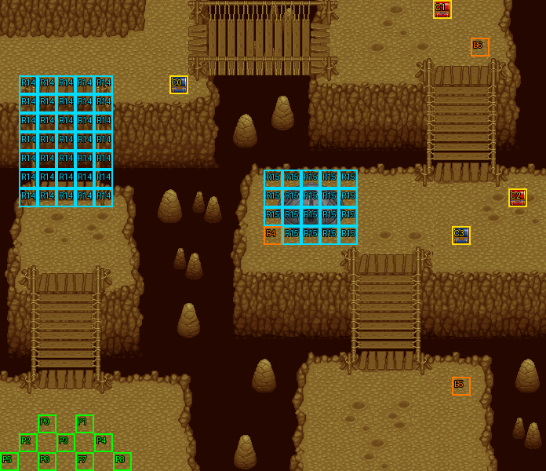

# 第 15 章　要塞砲危機

<!-- chapter_docs:header -->
| 項目 | 內容 |
| --- | --- |
| 章號／章節索引 | 15／14 |
| 章名（文字區塊 `0x01`） | 要塞砲危機 |
| 勝利條件（`0x02`） | 摧毀要塞砲 |
| 敗北條件（`0x03`） | 蘭迪斯或瑪麗安死亡 |
| 戰場 | `MAP14.DAT`／`MAP14.COD`／`M14.DTL`，29×25 格，我方 slot 9 個，部署記錄 45 筆 |
| 文字區塊 | `FDETXT15.TXT`，25 條 |
| 進入處理（`0x60074`[14]） | `fdps_chapter_15_init`（`0x21240`） |
| 行動後檢查（`0x6028c`[14]） | `fdps_chapter_15_post_action`（`0x3ab30`） |
| 勝利處理（`0x60304`[14]） | `fdps_chapter_15_end`（`0x3ac20`） |
| 地圖資料呼叫的事件處理（`0x601c4`） | slot 20：`fdps_chapter_15_event_activate_enemy_group`（`0x37af0`）（死亡腳本）、slot 21：`fdps_chapter_15_event_boss_defeat`（`0x37b70`）（死亡腳本） |
| 過場腳本 | `ICON14.DAT`（開場）、`WIN14.DAT`（勝利） |
| 本章之前的村莊 | `SHOP14.DAT` |
| 光碟 | 第 1 片（音軌見 [CD 音軌](../program_info/cd_audio.md)） |



戰場全圖（第 0 層與同步捲動的圖層）。框線：黃 `C` 寶箱、橘 `B` 埋藏格、青 `R` 重繪格、洋紅 `E` 有處理函式的格子事件格，字母後的數字是事件碼；綠 `P` 是我方 slot 的起始格。

圖由 `python tools/chapter_docs/chapter_facts.py render-maps` 從遊戲檔重畫到 `chapters/maps/`，`verify-maps` 逐 byte 比對版控中的圖。
<!-- /chapter_docs:header -->

## 概要

隊伍從地圖左下角進場，琴琴看見前方有個步兵，要大家跟上他（`0x09`）。步兵發現被跟蹤，往上跑到收起的索橋前，朝對岸喊同伴把橋放下來（`0x0f`、`0x10`）；地面一陣震動，他才想起「我忘記了」（`0x11`），要塞砲隨即沿著他站的那一列開火，把他打倒。琴琴嚇壞了，蘭迪斯說只要算好時間差，火砲打不到他們，尤利安笑琴琴膽小（`0x0a`）。這時一名住在附近森林裡的弓兵少女出現在對岸，索橋一段段放了下來，她自稱瑪麗安，催隊伍趁火砲還沒打來趕快過橋（`0x0b`，開場過場 `ICON14.DAT`）。

戰場是被深谷切開的幾塊台地，以索橋相連：隊伍在左下，過了左側索橋是左上的台地，上方中央與右上各有一群守軍，右上群往下過橋是要塞砲所在的中央平台 (16, 10)。敵人開場都守在原地（上方中央 (18, 1) 的冰魔導士倒下後，右上一群才改為主動逼近），要塞砲只沿自己所在的列與行開火，射程 14 格、一擊 9999 點。

摧毀要塞砲就過關。若在第 25 回合以內摧毀、而且裘娜還在場，一名被琴琴叫作「爺爺」而大為不滿的老人（`？？？？`）姍姍來遲，看中裘娜的刀法，要和她一對一比劃（`0x12`–`0x15`）；接受就只留裘娜與他對打，贏了他把刀送給裘娜（`0x16`–`0x18`）。勝利過場 `WIN14.DAT` 裡，瑪麗安說這群守軍霸佔此地、對路人兇巴巴，她早想教訓他們；聽說隊伍要去羅特帝亞、可以看到海，從小住在山裡的她吵著要同行，琴琴說她「看起來的確很危險」，被尤利安噓了一聲。

## 加入與離隊

瑪麗安（角色編號 `05`）在 `fdps_chapter_15_init`（`0x21240`）一開頭無條件加入名冊，入隊規則與名冊記錄見 [`assets/characters.md` 的「加入」](../assets/characters.md#加入)。這時名冊已有 9 人，她排第 10 位（slot 9），而 `MAP14` 只宣告 9 個我方 slot，所以本章她不以名冊記錄上場；玩家操作的是開場過場部署的波次 1、第 0 筆的 LV20 瑪麗安（陣營 2，起點 (3, 3)）。勝利時名冊寫回依角色編號把這個 LV20 單位蓋過她的名冊記錄，第 16 章起地圖有 10 個我方 slot，她就坐 slot 9。

本章沒有人離隊。第 1 筆的友軍步兵（陣營 1、`62`）只是開場過場的演員，在過場中被要塞砲打倒，戰鬥開始時已不在場。決鬥的挑戰者 `23` 是敵方單位，不會加入。

## 勝敗條件與特殊機制

- **勝利**：光束砲座（第 27 筆，`80`，HP 1600、MV 0）的死亡腳本呼叫事件 slot 21 的 `fdps_chapter_15_event_boss_defeat`（`0x37b70`）。它先以 `fdps_battle_destroy_remaining_enemies`（`0x39e10`）把場上所有陣營 0 的單位一次打倒，再把結束碼寫成 2（過關）——除非決鬥成立（見下）。行動後處理 `fdps_chapter_15_post_action`（`0x3ab30`）平常呼叫共用的 `fdps_battle_check_default_end_conditions`（`0x3a2e0`），它的「陣營 0 全部退場」也算過關，但砲座本身是陣營 0，所以實際上就是「摧毀要塞砲」。
- **敗北：蘭迪斯**：共用判定看單位索引 0 是否退場。
- **敗北：瑪麗安**：不在任何處理函式裡，而是她的部署記錄帶的死亡腳本（opcode 5、不畫文字）把結束碼寫成 1。
- **畫面與程式的差異**：畫面上的勝敗條件（`0x02`、`0x03`）沒有提到決鬥。決鬥期間蘭迪斯與瑪麗安都被設為退場，卻不算敗北；裘娜輸掉決鬥也不是敗北，一樣過關。

**摧毀要塞砲就清場**：砲座一倒，其餘敵人不經死亡腳本直接退場，所以還站著的敵人身上的掉落（第 9、10、38、43 筆）與經驗全部拿不到，要先打倒它們再打砲座。

**決鬥**：`fdps_chapter_15_event_boss_defeat`（`0x37b70`）在清場後檢查兩個條件：回合數 ≤ 25（含第 25 回合）、裘娜（單位索引 4）未退場。任一不成立就直接過關。都成立時：

1. 以 `fdps_deploy_wave`（`0x23830`）部署波次 2 的挑戰者（`23`，LV17，找離錨點 (20, 23) 最近的空格），他接在單位陣列的 `0x35`。
2. 畫出挑戰（`0x12`），在裘娜的頭像下畫 `0x13`，以 `fdps_prompt_two_choice`（`0x17990`）二選一。
3. 選左邊（接受）：畫 `0x14`，把單位 0–8 中除了裘娜以外的 8 人與單位 `0x34`（瑪麗安）的狀態 byte 整個寫成 1（退場），設格子事件旗標元素 `0x10`，**不寫結束碼**，戰鬥繼續。選右邊或取消（拒絕）：畫 `0x15`，結束碼寫成 2，直接過關。

旗標設起之後，`fdps_chapter_15_post_action`（`0x3ab30`）改為只判決鬥：裘娜與挑戰者都還在場就什麼都不做；裘娜退場就畫 `0x16`；挑戰者退場就畫 `0x17`，裘娜背包不是 8 件滿時再畫 `0x18` 並給她 `A5` 妖刀村雨（[`assets/items.md`](../assets/items.md)）。不論勝負，結束碼都寫成 2（過關），輸掉決鬥只是拿不到刀。背包滿時不問換物、不顯示 `0x18`、刀也不給。挑戰者自己的死亡腳本是空的，打倒他不會掉落任何東西。

**要塞砲的射擊**：砲座的 AI 行為是 2（原地，只做打得到的行動），它的武器 `63` 光束砲當道具使用：從砲座所在格朝上下左右之一走 14 格，收進路上所有陣營不是 0 的單位，每個直接扣 9999 點、必中（[`program_info/map_ai.md`](../program_info/map_ai.md)、[`program_info/spell.md`](../program_info/spell.md)）。所以第 10 列與第 16 行上離砲座 14 格以內的我方單位一被瞄到就倒；(27, 10) 的寶箱就在這條線上。向右或向下發射時的軌跡高亮會延伸到地圖外，見 [`program_info/known_bugs.md`](../program_info/known_bugs.md)。開場過場用 opcode `0x62` 讓砲座行動過一次，`fdps_chapter_15_init`（`0x21240`）因此要再清一次「已行動」位元；少了這一次，砲座整個第一個玩家階段與友軍階段都帶著已行動旗標，戰鬥選單的存檔因此反灰（砲座是肖像編號 `80`，沒有地圖單位圖，畫面上看不出別的差別），要到 `fdps_battle_advance_turn`（`0x1e3f0`）在敵方階段前的清除才放掉，所以它照樣在第一個敵方階段開火（[`program_info/cutscene.md`](../program_info/cutscene.md)）。

**右上群的出擊**：上方中央 (18, 1) 的冰魔導士（第 8 筆）被打倒時，死亡腳本呼叫事件 slot 20 的 `fdps_chapter_15_event_activate_enemy_group`（`0x37af0`），把第 21–29 筆（(23–25, 3–5) 的野蠻戰士 3、弓箭手 3、冰魔導士 2，連同砲座本身）的 AI 行為改成 0（主動逼近）。砲座 MV 0，改了也不會移動。

**索橋**：左側 (1–5, 4–10) 是帶旗標 14 的重繪格。開場過場先以 `SET_MAP_CELL` 一列列換掉 (1–5, 5–9)，最後 `TRIGGER_CELL_EVENT` 設旗標 14，`fdps_map_apply_triggered_cell_changes`（`0x2e910`）把整片換成放下的索橋（重繪的規則見 [`resource_info/map.md`](../resource_info/map.md)）。砲座平台 (14–18, 9–12) 另有 19 格帶旗標 15 的重繪格，本章沒有任何東西設旗標 15，它們永遠不換圖（[S20](../cut_content/story.md#s20-map14-砲座平台沒有東西觸發的要塞砲消失重繪)）。

## 敵人配置

開場波次 0 的 42 名敵人全部在場，AI 行為一律是 2：只在這一回合打得到目標時才出手，不會為了接近對手而移動（[`program_info/map_ai.md`](../program_info/map_ai.md)）：

- 左上台地 (8–10, 0–3)：野蠻戰士 6、弓箭手 2，守著 (9, 4) 的寶箱。
- 上方中央 (16–20, 0–3)：冰魔導士 2（(18, 1)、(18, 2)）、野蠻戰士 6、弓箭手 2。(18, 1) 那名是觸發右上群出擊的第 8 筆。
- 右上橋頭 (23–25, 3–9)：(23–25, 3–5) 的野蠻戰士 3、冰魔導士 2、弓箭手 3，是第 8 筆倒下後改為主動逼近的那一群；下方 (23–25, 9) 另有野蠻戰士 3，不受影響。
- 砲座平台 (16–26, 9–13)：光束砲座 (16, 10)，其右側 (20–21, 9–12) 野蠻戰士 8、(19, 11) 冰魔導士、(22, 10) 與 (26, 10) 弓箭手，砲座下方 (16, 13) 暗魔導士。

波次 2 的挑戰者只在決鬥條件成立時出現，AI 行為 0。本章沒有援軍、沒有搶寶箱或會離場的敵人。

<!-- chapter_docs:deployments -->
陣營與死亡腳本的意義見 [`resource_info/map.md`](../resource_info/map.md)，AI 行為（低 4 bit）見 [`program_info/map_ai.md`](../program_info/map_ai.md#行為代碼)；錨點是 `MAPnn.COD` 的座標，開場波次放在錨點上，其餘波次依部署方式放在錨點或最近的空格。單位名是全域文字的「角色編號 + 1」條；角色編號 `3C` 以上的敵兵，數值（`ENEMYDAT.DAT`）與種族、職業見 [`assets/enemies.md`](../assets/enemies.md)，以下的見 [`assets/characters.md`](../assets/characters.md)。

我方起始格：slot 0 (2, 22)、slot 1 (4, 22)、slot 2 (1, 23)、slot 3 (3, 23)、slot 4 (5, 23)、slot 5 (0, 24)、slot 6 (2, 24)、slot 7 (4, 24)、slot 8 (6, 24)。

| 波次 | 陣營 | 單位 | 等級 | 數量 |
| ---: | --- | --- | --- | ---: |
| 0 | NPC | `62` 步兵 | 15 | 1 |
| 0 | 敵方 | `50` 野蠻戰士 | 14 | 26 |
| 0 | 敵方 | `65` 冰魔導士 | 19 | 5 |
| 0 | 敵方 | `5E` 弓箭手 | 15 | 9 |
| 0 | 敵方 | `80` 光束砲座 | 16 | 1 |
| 0 | 敵方 | `67` 暗魔導士 | 18 | 1 |
| 1 | 我方 | `05` 瑪麗安 | 20 | 1 |
| 2 | 敵方 | `23` ？？？？ | 17 | 1 |

### 波次 0

出場：進入戰場時由 `fdps_build_map_unit_array`（`0x22be0`） 部署在錨點上

| # | 陣營 | 單位 | 等級 | AI 行為 | 錨點 | 死亡腳本 |
| ---: | --- | --- | ---: | --- | --- | --- |
| 1 | NPC | `62` 步兵 | 15 | 2 原地 | (3, 14) | 掉落 2000 金 |
| 2 | 敵方 | `50` 野蠻戰士 | 14 | 2 原地 | (8, 1) | — |
| 3 | 敵方 | `50` 野蠻戰士 | 14 | 2 原地 | (8, 2) | — |
| 4 | 敵方 | `50` 野蠻戰士 | 14 | 2 原地 | (9, 0) | — |
| 5 | 敵方 | `50` 野蠻戰士 | 14 | 2 原地 | (9, 1) | — |
| 6 | 敵方 | `50` 野蠻戰士 | 14 | 2 原地 | (9, 2) | — |
| 7 | 敵方 | `50` 野蠻戰士 | 14 | 2 原地 | (9, 3) | — |
| 8 | 敵方 | `65` 冰魔導士 | 19 | 2 原地 | (18, 1) | 事件 slot 20：`fdps_chapter_15_event_activate_enemy_group`（`0x37af0`） |
| 9 | 敵方 | `65` 冰魔導士 | 19 | 2 原地 | (18, 2) | 掉落 `B8` 魔法水 |
| 10 | 敵方 | `50` 野蠻戰士 | 14 | 2 原地 | (17, 1) | 掉落 2000 金 |
| 11 | 敵方 | `50` 野蠻戰士 | 14 | 2 原地 | (17, 2) | — |
| 12 | 敵方 | `50` 野蠻戰士 | 14 | 2 原地 | (16, 1) | — |
| 13 | 敵方 | `50` 野蠻戰士 | 14 | 2 原地 | (16, 2) | — |
| 14 | 敵方 | `50` 野蠻戰士 | 14 | 2 原地 | (19, 3) | — |
| 15 | 敵方 | `50` 野蠻戰士 | 14 | 2 原地 | (19, 0) | — |
| 16 | 敵方 | `5E` 弓箭手 | 15 | 2 原地 | (20, 0) | — |
| 17 | 敵方 | `5E` 弓箭手 | 15 | 2 原地 | (20, 3) | — |
| 18 | 敵方 | `50` 野蠻戰士 | 14 | 2 原地 | (23, 9) | — |
| 19 | 敵方 | `50` 野蠻戰士 | 14 | 2 原地 | (24, 9) | — |
| 20 | 敵方 | `50` 野蠻戰士 | 14 | 2 原地 | (25, 9) | — |
| 21 | 敵方 | `50` 野蠻戰士 | 14 | 2 原地 | (23, 3) | — |
| 22 | 敵方 | `50` 野蠻戰士 | 14 | 2 原地 | (24, 3) | — |
| 23 | 敵方 | `50` 野蠻戰士 | 14 | 2 原地 | (25, 3) | — |
| 24 | 敵方 | `5E` 弓箭手 | 15 | 2 原地 | (23, 5) | — |
| 25 | 敵方 | `5E` 弓箭手 | 15 | 2 原地 | (24, 5) | — |
| 26 | 敵方 | `5E` 弓箭手 | 15 | 2 原地 | (25, 5) | — |
| 27 | 敵方 | `80` 光束砲座 | 16 | 2 原地 | (16, 10) | 事件 slot 21：`fdps_chapter_15_event_boss_defeat`（`0x37b70`） |
| 28 | 敵方 | `65` 冰魔導士 | 19 | 2 原地 | (23, 4) | — |
| 29 | 敵方 | `65` 冰魔導士 | 19 | 2 原地 | (25, 4) | — |
| 30 | 敵方 | `5E` 弓箭手 | 15 | 2 原地 | (22, 10) | — |
| 31 | 敵方 | `5E` 弓箭手 | 15 | 2 原地 | (26, 10) | — |
| 32 | 敵方 | `50` 野蠻戰士 | 14 | 2 原地 | (21, 9) | — |
| 33 | 敵方 | `50` 野蠻戰士 | 14 | 2 原地 | (21, 10) | — |
| 34 | 敵方 | `50` 野蠻戰士 | 14 | 2 原地 | (21, 11) | — |
| 35 | 敵方 | `50` 野蠻戰士 | 14 | 2 原地 | (21, 12) | — |
| 36 | 敵方 | `50` 野蠻戰士 | 14 | 2 原地 | (20, 9) | — |
| 37 | 敵方 | `50` 野蠻戰士 | 14 | 2 原地 | (20, 10) | — |
| 38 | 敵方 | `50` 野蠻戰士 | 14 | 2 原地 | (20, 11) | 掉落 3000 金 |
| 39 | 敵方 | `50` 野蠻戰士 | 14 | 2 原地 | (20, 12) | — |
| 40 | 敵方 | `5E` 弓箭手 | 15 | 2 原地 | (10, 1) | — |
| 41 | 敵方 | `5E` 弓箭手 | 15 | 2 原地 | (10, 2) | — |
| 42 | 敵方 | `65` 冰魔導士 | 19 | 2 原地 | (19, 11) | — |
| 43 | 敵方 | `67` 暗魔導士 | 18 | 2 原地 | (16, 13) | 掉落 `D7` 魔力水晶 |

### 波次 1

出場：開場過場 `ICON14.DAT` `0x11a` 的 `DEPLOY_WAVE`（錨點原位），由 `fdps_chapter_15_init`（`0x21240`）執行，在放下索橋之前、戰鬥開始前一定出場

| # | 陣營 | 單位 | 等級 | AI 行為 | 錨點 | 死亡腳本 |
| ---: | --- | --- | ---: | --- | --- | --- |
| 0 | 我方 | `05` 瑪麗安 | 20 | 0 主動 | (3, 3) | 不畫文字，之後敗北 |

### 波次 2

出場：光束砲座（第 27 筆）被擊倒時，死亡腳本呼叫的 `fdps_chapter_15_event_boss_defeat`（`0x37b70`）在回合數 ≤ 25 且裘娜（單位 4）未退場時部署（找最近空格），接著才問玩家接不接受決鬥；超過第 25 回合或裘娜已退場就不會出場

| # | 陣營 | 單位 | 等級 | AI 行為 | 錨點 | 死亡腳本 |
| ---: | --- | --- | ---: | --- | --- | --- |
| 44 | 敵方 | `23` ？？？？ | 17 | 0 主動 | (20, 23) | — |
<!-- /chapter_docs:deployments -->

## 寶物

處理函式發放的只有決鬥的 `A5` 妖刀村雨：`fdps_chapter_15_post_action`（`0x3ab30`）在裘娜贏得決鬥、背包未滿 8 件時直接放進她的背包（見「勝敗條件與特殊機制」）。

擊倒掉落要在打倒砲座之前拿：砲座倒下時其餘敵人一併退場，不付掉落。第 1 筆友軍步兵的 2000 金掉落拿不到——他在開場過場就被砲座打倒，擊殺者是敵方，而死亡腳本的掉落只付給存活的我方擊殺者（[I15](../cut_content/items.md#i15-第-15-章開場過場友軍步兵身上的-2000-金掉落)）。(27, 10) 寶箱的複式裝甲在砲座第 10 列的射線上。

<!-- chapter_docs:treasure -->
搜尋的規則（同碼的格共用一筆記錄與一個旗標、背包滿時的交換）見 [`resource_info/map.md`](../resource_info/map.md)。

| 事件碼 | 格 | 內容 |
| ---: | --- | --- |
| 0 | (9, 4) 寶箱 | 3000 金 |
| 1 | (23, 0) 寶箱 | `C2` 神聖之水 |
| 2 | (27, 10) 寶箱 | `9A` 複式裝甲 |
| 3 | (24, 12) 寶箱 | `CF` 冰之水晶 |
| 4 | (14, 12) 埋藏 | `D2` 炎之魔石 |
| 5 | (24, 20) 埋藏 | `D3` 雷之魔石 |
| 6 | (25, 2) 埋藏 | `D4` 冰之魔石 |

擊倒後掉落（死亡腳本 opcode 0／1，擊殺者須是存活的我方單位）：

| # | 單位 | 波次 | 掉落 |
| ---: | --- | ---: | --- |
| 1 | `62` 步兵 | 0 | 掉落 2000 金 |
| 9 | `65` 冰魔導士 | 0 | 掉落 `B8` 魔法水 |
| 10 | `50` 野蠻戰士 | 0 | 掉落 2000 金 |
| 38 | `50` 野蠻戰士 | 0 | 掉落 3000 金 |
| 43 | `67` 暗魔導士 | 0 | 掉落 `D7` 魔力水晶 |
<!-- /chapter_docs:treasure -->

## 村莊

<!-- chapter_docs:village -->
第 14 章勝利後、本章之前的村莊載入 `SHOP14.DAT`，道具店、武器店、秘密商店的貨見 [`assets/shops.md`](../assets/shops.md)。村莊載入的文字區塊是 `FDETXT15`（章節索引 + 1，`fdps_load_field_chapter_resources`（`0x31540`）），也就是本章的區塊，所以村莊畫面的文字是本章區塊的 `0x04`–`0x08`，全文在下方「對話」。
<!-- /chapter_docs:village -->

## 處理流程

### 進入：`fdps_chapter_15_init`（`0x21240`）

1. `fdps_roster_add_character`（`0x23bc0`）把角色 5 瑪麗安加入名冊（第 10 位，本章地圖沒有她的 slot）。
2. `fdps_chapter_state_reset`（`0x22750`）：重建戰場，`fdps_build_map_unit_array`（`0x22be0`）放上 9 名隊員與波次 0 的 43 筆（友軍步兵 1、敵人 42）。
3. `fdps_icon_script_run`（`0x21650`）執行開場過場 `ICON14.DAT`：隊伍進場、對話 `0x09`；步兵往上走 4 格到 (3, 10)、對話 `0x0f`、`0x10`，畫面震動、對話 `0x11`；`0x0e5` 讓光束砲座以 `fdps_map_actor_behavior_step`（`0x10010`）跑一回合 AI，沿第 10 列打倒步兵；隊伍再往上一格、對話 `0x0a`；播放 `ICON0087.SAF`，`0x11a` 部署波次 1 的瑪麗安，索橋一列列放下、對話 `0x0b`，設格子事件旗標 14 完成索橋。
4. `fdps_show_chapter_title_card`（`0x20c60`）顯示章名卡。
5. `fdps_units_clear_status_bit7`（`0x2db50`）清掉所有單位的「本回合已行動」位元（遮罩是 `AND 0x7f`，退場位元保留），也就是開場過場讓砲座行動時設上的那一個；少了這次的後果見上方「要塞砲的射擊」與 [`program_info/cutscene.md`](../program_info/cutscene.md)。
6. `fdps_map_cursor_move_to_unit`（`0x2da50`）把游標放在單位 0（蘭迪斯，過場結束時在 (3, 21)）。

### 行動後檢查：`fdps_chapter_15_post_action`（`0x3ab30`）

兩支互斥，由格子事件旗標元素 `0x10` 決定：

- **旗標未設**（平常）：只呼叫共用判定 `fdps_battle_check_default_end_conditions`（`0x3a2e0`）：陣營 0 全部退場記過關，單位 0 退場記敗北。
- **旗標已設**（決鬥中）：不呼叫共用判定。
  1. `fdps_unit_is_retired`（`0x109b0`）問單位 4（裘娜）與單位 `0x35`（挑戰者），兩人都在場就返回，決鬥繼續。
  2. 裘娜退場：`fdps_draw_text`（`0x1ff60`）畫 `0x16`（挑戰者說「程度就只有這樣而已嗎」）。
  3. 挑戰者退場：畫 `0x17`；`fdps_unit_item_count`（`0x25240`）回答不是 8 時，再畫 `0x18` 並以 `fdps_unit_add_item`（`0x25d20`）把 `A5` 妖刀村雨放進裘娜的背包。
  4. 兩種結果都把結束碼寫成 2（過關）。

順序不能反過來：決鬥讓單位 0 退場，先跑共用判定就會變成敗北。

### 勝利：`fdps_chapter_15_end`（`0x3ac20`）

這一支不呼叫 `fdps_battle_destroy_remaining_enemies`（`0x39e10`），清場已由砲座的死亡事件做過。

1. 旗標元素 `0x10` 已設（接受過決鬥）時：以 `fdps_get_unit_record`（`0x2d210`）把單位 0–8 的狀態 byte 整個寫成 0（全部回到場上，裘娜也不例外），再把單位 `0x34`（瑪麗安）的 AI 行為 byte 寫成 0。瑪麗安的狀態 byte 不動，仍是退場。
2. `fdps_roster_write_back_battle_units`（`0x23980`）把戰場上的隊員寫回名冊，LV20 的瑪麗安依角色編號蓋進她的名冊記錄。
3. `fdps_icon_script_run`（`0x21650`）執行勝利過場 `WIN14.DAT`：復歸單位 1–8 與瑪麗安、排好隊形，對話 `0x0c`、`0x0d`、`0x0e`。
4. `fdps_roster_revive_fallen_members`（`0x39e70`）讓陣亡的隊員復活。
5. 章節索引設為 15，下一段是第 16 章之前的村莊，接著是 [第 16 章](ch16.md)。

### 右上群出擊：`fdps_chapter_15_event_activate_enemy_group`（`0x37af0`）

由第 8 筆冰魔導士 (18, 1) 的死亡腳本呼叫（事件 slot 20）。沒有一次性閂鎖，靠「一個單位只會死一次」保證只跑一次。

1. 單位索引 `0x1d`–`0x25`（第 21–29 筆，單位索引 = 記錄編號 + 8）逐一以 `fdps_get_unit_record`（`0x2d210`）取出，AI 行為 byte 的低 4 bit 改成 0、高 4 bit 保留。

### 砲座倒下：`fdps_chapter_15_event_boss_defeat`（`0x37b70`）

由第 27 筆光束砲座的死亡腳本呼叫（事件 slot 21），收到的單位索引不使用。

1. `fdps_battle_destroy_remaining_enemies`（`0x39e10`）把陣營 0 的單位全部打倒退場（不跑它們的死亡腳本）。
2. 回合數 > 25 或 `fdps_unit_is_retired`（`0x109b0`）說裘娜（單位 4）已退場：結束碼寫成 2，結束。
3. 否則 `fdps_deploy_wave`（`0x23830`）部署波次 2（找最近空格），`fdps_draw_text`（`0x1ff60`）全螢幕畫 `0x12`；`fdps_message_window_open`（`0x205b0`）以頭像 3（裘娜）開訊息框、畫 `0x13`，`fdps_prompt_two_choice`（`0x17990`）二選一，`fdps_message_window_close`（`0x20820`）收起訊息框。
4. 回答 0（接受）：畫 `0x14`；單位 0–8 除了 4 以外、以及單位 `0x34`，狀態 byte 整個寫成 1；格子事件旗標元素 `0x10` 設為 1。結束碼不動，戰鬥繼續成為一對一。
5. 其他回答（拒絕或取消）：畫 `0x15`，結束碼寫成 2。

## 回合事件與格子事件

<!-- chapter_docs:events -->
觸發時機與陣營階段的意義見 [`resource_info/map.md`](../resource_info/map.md)。

本章沒有回合事件。

本章沒有格子事件。

死亡腳本裡的事件與文字：

| # | 單位 | 波次 | 死亡腳本 |
| ---: | --- | ---: | --- |
| 0 | `05` 瑪麗安 | 1 | 不畫文字，之後敗北 |
| 8 | `65` 冰魔導士 | 0 | 事件 slot 20：`fdps_chapter_15_event_activate_enemy_group`（`0x37af0`） |
| 27 | `80` 光束砲座 | 0 | 事件 slot 21：`fdps_chapter_15_event_boss_defeat`（`0x37b70`） |
<!-- /chapter_docs:events -->

## 過場腳本

<!-- chapter_docs:scripts -->
格式與每個指令的意義見 [`resource_info/cutscene_script.md`](../resource_info/cutscene_script.md)。`FDETXT15#0xNN` 是本章文字區塊的條目，全文在下方「對話」；切到額外場景之後顯示的文字直接列出（那些區塊的正典是 [`assets/text/scene_text.md`](../assets/text/scene_text.md)）。`u3=我方1` 是地圖單位索引 3 對到我方 slot 1，`u12=MAP02#9` 是 `MAP02.DAT` 第 9 筆部署記錄。

### `ICON14.DAT`

- 開場：`fdps_chapter_15_init`（`0x21240`）
- 443 byte、75 步；起始地圖 14，切換地圖 無，結束於地圖 14

| 偏移 | 指令 | 內容 |
| ---: | --- | --- |
| `0000` | `FADE_OUT` | 淡出，每步 10 ms |
| `0002` | `SET_MUSIC` | 音樂 12（CD 第 13 軌） |
| `0004` | `SET_VIEW_TILE` | 視野直接設到格 (0, 17) |
| `0007` | `FACE_UNITS` | 轉向後停 4 幀：u0=我方0朝下 |
| `000c` | `PLACE_UNIT` | 放置 u0=我方0 到 (3, 24)，朝上 |
| `0011` | `PLACE_UNIT` | 放置 u1=我方1 到 (3, 24)，朝上 |
| `0016` | `PLACE_UNIT` | 放置 u2=我方2 到 (3, 24)，朝上 |
| `001b` | `PLACE_UNIT` | 放置 u3=我方3 到 (3, 24)，朝上 |
| `0020` | `FACE_UNITS` | 轉向後停 4 幀：u0=我方0朝上 |
| `0025` | `WALK_UNITS` | 行走 1 格，每步 2 幀：u0=我方0往上、u1=我方1往上、u2=我方2往上、u3=我方3往上 |
| `0031` | `PLACE_UNIT` | 放置 u4=我方4 到 (3, 24)，朝上 |
| `0036` | `PLACE_UNIT` | 放置 u5=我方5 到 (3, 24)，朝上 |
| `003b` | `PLACE_UNIT` | 放置 u6=我方6 到 (3, 24)，朝上 |
| `0040` | `PLACE_UNIT` | 放置 u7=我方7 到 (3, 24)，朝上 |
| `0045` | `PLACE_UNIT` | 放置 u8=我方8 到 (3, 24)，朝上 |
| `004a` | `FACE_UNITS` | 轉向後停 1 幀：u0=我方0朝上 |
| `004f` | `FADE_IN` | 淡入，每步 10 ms |
| `0051` | `WALK_UNITS` | 行走 1 格，每步 2 幀：u0=我方0往上、u1=我方1往左、u3=我方3往右、u5=我方5往左、u6=我方6往右、u7=我方7往左、u8=我方8往右 |
| `0063` | `WALK_UNITS` | 行走 1 格，每步 2 幀：u7=我方7往左、u8=我方8往右 |
| `006b` | `FACE_UNITS` | 轉向後停 15 幀：u0=我方0朝上、u1=我方1朝上、u2=我方2朝上、u3=我方3朝上、u4=我方4朝上、u5=我方5朝上、u6=我方6朝上、u7=我方7朝上、u8=我方8朝上、u9=MAP14#1(角色0x62)朝上 |
| `0082` | `DRAW_TEXT` | 顯示文字 FDETXT15#0x09 |
| `0084` | `SCROLL_VIEW` | 捲動視野到格 (0, 8) |
| `0087` | `FACE_UNITS` | 轉向後停 10 幀：u9=MAP14#1(角色0x62)朝下 |
| `008c` | `FACE_UNITS` | 轉向後停 10 幀：u9=MAP14#1(角色0x62)朝上 |
| `0091` | `DRAW_TEXT` | 顯示文字 FDETXT15#0x0f |
| `0093` | `WALK_UNITS` | 行走 4 格，每步 1 幀：u9=MAP14#1(角色0x62)往上 |
| `0099` | `DRAW_TEXT` | 顯示文字 FDETXT15#0x10 |
| `009b` | `FACE_UNITS` | 轉向後停 10 幀：u9=MAP14#1(角色0x62)朝上 |
| `00a0` | `SHAKE_VIEW` | 視野位移 32 步，每步 1 幀：(1,0) (1,-1) (0,-1) (0,0) (-1,0) (-1,1) (0,1) (0,0) (1,0) (1,-1) (0,-1) (0,0) (-1,0) (-1,1) (0,1) (0,0) (1,0) (1,-1) (0,-1) (0,0) (-1,0) (-1,1) (0,1) (0,0) (1,0) (1,-1) (0,-1) (0,0) (-1,0) (-1,1) (0,1) (0,0) |
| `00e3` | `DRAW_TEXT` | 顯示文字 FDETXT15#0x11 |
| `00e5` | `ACTOR_BEHAVIOR_STEP` | u35=MAP14#27(角色0x80) 跑一回合 AI（陣營選擇 0） |
| `00e8` | `SCROLL_VIEW` | 捲動視野到格 (11, 8) |
| `00eb` | `FACE_UNITS` | 轉向後停 35 幀：u0=我方0朝上 |
| `00f0` | `SCROLL_VIEW` | 捲動視野到格 (0, 17) |
| `00f3` | `WALK_UNITS` | 行走 1 格，每步 1 幀：u0=我方0往上、u1=我方1往上、u2=我方2往上、u3=我方3往上、u4=我方4往上、u5=我方5往上、u6=我方6往上、u7=我方7往上、u8=我方8往上 |
| `0109` | `FACE_UNITS` | 轉向後停 10 幀：u0=我方0朝上 |
| `010e` | `DRAW_TEXT` | 顯示文字 FDETXT15#0x0a |
| `0110` | `FACE_UNITS` | 轉向後停 10 幀：u0=我方0朝上 |
| `0115` | `SCROLL_VIEW` | 捲動視野到格 (0, 0) |
| `0118` | `PLAY_SAF` | 播放動畫 ICON0087.SAF |
| `011a` | `DEPLOY_WAVE` | 部署 MAP14 波次 1（錨點原位）：#0(角色0x05) |
| `011d` | `SET_MAP_CELL` | 地形層 0 格 (1, 5) = 0x012b |
| `0122` | `SET_MAP_CELL` | 地形層 0 格 (2, 5) = 0x012d |
| `0127` | `SET_MAP_CELL` | 地形層 0 格 (3, 5) = 0x012f |
| `012c` | `SET_MAP_CELL` | 地形層 0 格 (4, 5) = 0x0131 |
| `0131` | `SET_MAP_CELL` | 地形層 0 格 (5, 5) = 0x0133 |
| `0136` | `FACE_UNITS` | 轉向後停 10 幀：u0=我方0朝上 |
| `013b` | `SET_MAP_CELL` | 地形層 0 格 (1, 6) = 0x0135 |
| `0140` | `SET_MAP_CELL` | 地形層 0 格 (2, 6) = 0x0137 |
| `0145` | `SET_MAP_CELL` | 地形層 0 格 (3, 6) = 0x0139 |
| `014a` | `SET_MAP_CELL` | 地形層 0 格 (4, 6) = 0x013b |
| `014f` | `SET_MAP_CELL` | 地形層 0 格 (5, 6) = 0x013d |
| `0154` | `FACE_UNITS` | 轉向後停 10 幀：u0=我方0朝上 |
| `0159` | `SET_MAP_CELL` | 地形層 0 格 (1, 7) = 0x013f |
| `015e` | `SET_MAP_CELL` | 地形層 0 格 (2, 7) = 0x0141 |
| `0163` | `SET_MAP_CELL` | 地形層 0 格 (3, 7) = 0x0143 |
| `0168` | `SET_MAP_CELL` | 地形層 0 格 (4, 7) = 0x0145 |
| `016d` | `SET_MAP_CELL` | 地形層 0 格 (5, 7) = 0x0147 |
| `0172` | `FACE_UNITS` | 轉向後停 10 幀：u0=我方0朝上 |
| `0177` | `SET_MAP_CELL` | 地形層 0 格 (1, 8) = 0x0149 |
| `017c` | `SET_MAP_CELL` | 地形層 0 格 (2, 8) = 0x014b |
| `0181` | `SET_MAP_CELL` | 地形層 0 格 (3, 8) = 0x014d |
| `0186` | `SET_MAP_CELL` | 地形層 0 格 (4, 8) = 0x014f |
| `018b` | `SET_MAP_CELL` | 地形層 0 格 (5, 8) = 0x0151 |
| `0190` | `FACE_UNITS` | 轉向後停 10 幀：u0=我方0朝上 |
| `0195` | `SET_MAP_CELL` | 地形層 0 格 (1, 9) = 0x0153 |
| `019a` | `SET_MAP_CELL` | 地形層 0 格 (2, 9) = 0x0155 |
| `019f` | `SET_MAP_CELL` | 地形層 0 格 (3, 9) = 0x0157 |
| `01a4` | `SET_MAP_CELL` | 地形層 0 格 (4, 9) = 0x0159 |
| `01a9` | `SET_MAP_CELL` | 地形層 0 格 (5, 9) = 0x015b |
| `01ae` | `FACE_UNITS` | 轉向後停 10 幀：u0=我方0朝上 |
| `01b3` | `DRAW_TEXT` | 顯示文字 FDETXT15#0x0b |
| `01b5` | `TRIGGER_CELL_EVENT` | 格子事件旗標 [14] = 1，套用地圖變化 |
| `01b8` | `SET_MUSIC` | 停止音樂 |
| `01ba` | `END` | 結束 |

### `WIN14.DAT`

- 勝利：`fdps_chapter_15_end`（`0x3ac20`）
- 97 byte、30 步；起始地圖 14，切換地圖 無，結束於地圖 14

| 偏移 | 指令 | 內容 |
| ---: | --- | --- |
| `0000` | `FADE_OUT` | 淡出，每步 10 ms |
| `0002` | `SET_MUSIC` | 音樂 15（CD 第 16 軌） |
| `0004` | `REVIVE_UNIT` | 復歸 u1=我方1（清狀態） |
| `0006` | `REVIVE_UNIT` | 復歸 u2=我方2（清狀態） |
| `0008` | `REVIVE_UNIT` | 復歸 u3=我方3（清狀態） |
| `000a` | `REVIVE_UNIT` | 復歸 u4=我方4（清狀態） |
| `000c` | `REVIVE_UNIT` | 復歸 u5=我方5（清狀態） |
| `000e` | `REVIVE_UNIT` | 復歸 u6=我方6（清狀態） |
| `0010` | `REVIVE_UNIT` | 復歸 u7=我方7（清狀態） |
| `0012` | `REVIVE_UNIT` | 復歸 u8=我方8（清狀態） |
| `0014` | `REVIVE_UNIT` | 復歸 u52（清狀態） |
| `0016` | `PLACE_UNIT` | 放置 u0=我方0 到 (20, 21)，朝上 |
| `001b` | `PLACE_UNIT` | 放置 u3=我方3 到 (19, 20)，朝右 |
| `0020` | `PLACE_UNIT` | 放置 u52 到 (20, 19)，朝下 |
| `0025` | `PLACE_UNIT` | 放置 u1=我方1 到 (21, 20)，朝左 |
| `002a` | `PLACE_UNIT` | 放置 u2=我方2 到 (20, 22)，朝上 |
| `002f` | `PLACE_UNIT` | 放置 u4=我方4 到 (19, 22)，朝上 |
| `0034` | `PLACE_UNIT` | 放置 u5=我方5 到 (18, 22)，朝上 |
| `0039` | `PLACE_UNIT` | 放置 u6=我方6 到 (21, 22)，朝上 |
| `003e` | `PLACE_UNIT` | 放置 u7=我方7 到 (19, 23)，朝上 |
| `0043` | `PLACE_UNIT` | 放置 u8=我方8 到 (19, 24)，朝上 |
| `0048` | `SET_VIEW_TILE` | 視野直接設到格 (14, 16) |
| `004b` | `FACE_UNITS` | 轉向後停 1 幀：u0=我方0朝上 |
| `0050` | `FADE_IN` | 淡入，每步 10 ms |
| `0052` | `DRAW_TEXT` | 顯示文字 FDETXT15#0x0c |
| `0054` | `WALK_UNITS` | 行走 1 格，每步 2 幀：u52往下 |
| `005a` | `DRAW_TEXT` | 顯示文字 FDETXT15#0x0d |
| `005c` | `DRAW_TEXT` | 顯示文字 FDETXT15#0x0e |
| `005e` | `SET_MUSIC` | 停止音樂 |
| `0060` | `END` | 結束 |
<!-- /chapter_docs:scripts -->

## 對話

<!-- chapter_docs:dialogue -->
`FDETXT15.TXT` 全部 25 條，依條目編號排列。每條先列讀取端（顯示它的腳本步驟、處理函式或死亡腳本），再列全文：【名稱】是換說話者（頭像取自括號裡的角色編號；【地圖單位 n】取執行當下第 n 個地圖單位），每一行是一次換行，▼ 是換頁（等按鍵）。`{subst1}`、`{subst2}`、`{number}` 是執行期代入的名稱與數字（[`resource_info/text.md`](../resource_info/text.md)）。

### `0x00`

永遠不會顯示：章名卡是 `Chapter.saf` 的圖（`fdps_show_chapter_title_card`（`0x20c60`）），存檔面板只畫 `0x01`；本章的處理函式、死亡腳本與 `ICON14.DAT`／`WIN14.DAT` 都不畫條目 0，見 [S13a（排除清單）](../cut_content/_index.md#排除清單)。

### `0x01`

讀取端：`fdps_draw_save_slot_panel`（`0x24a40`）

```text
要塞砲危機
```

### `0x02`

讀取端：`fdps_battle_show_win_fail_window`（`0x17ca0`）

```text
摧毀要塞砲
```

### `0x03`

讀取端：`fdps_battle_show_win_fail_window`（`0x17ca0`）

```text
蘭迪斯或瑪麗安死亡
```

### `0x04`

讀取端：`fdps_village_item_menu`（`0x35860`）

```text
多買點補體力的藥品。
▼
```

### `0x05`

讀取端：`fdps_run_weapon_shop`（`0x35fd0`）

```text
唉～！
你別看這刀這麼鋒利，
遇上火砲這種武器，
▼
還是無用武之地。
什麼？你要看火砲！
嘿嘿！附近有一座。
▼
但是要小心呀！
別太靠近了，
那砲是自動發射的。
▼
```

### `0x06`

讀取端：`fdps_run_bar_shop`（`0x35cc0`）

```text
哎喲喲喲～
你們是武士，是嗎？
你們剛剛慢了一步，
▼
射箭比賽才結束，
冠軍是一位小姐！
▼
```

### `0x07`

讀取端：`fdps_run_church_screen`（`0x35aa0`）

```text
人們總說，
「月圓人團圓」，
這個日子，
▼
是不是比較特別些？
▼
```

### `0x08`

讀取端：`fdps_run_secret_menu`（`0x36210`）

```text
羅特帝亞真是奇怪！
為何要封鎖邊境呢？
▼
```

### `0x09`

讀取端：`ICON14.DAT` `0x082`

```text
【琴琴】（角色 7）
你們看！
那裡有步兵！
我們快跟著他！
```

### `0x0a`

讀取端：`ICON14.DAT` `0x10e`

```text
【琴琴】（角色 7）
哎呀～！好恐怖呀！
嚇死我了！
【蘭迪斯】（角色 0）
別怕，
只要我們算好時間差，
火砲打不到我們的。
【琴琴】（角色 7）
可是﹒﹒﹒
可是﹒﹒﹒
【尤利安】（角色 6）
怎麼？妳怕了嗎？
嘻嘻！
【琴琴】（角色 7）
我﹒﹒我怕什麼？
走就走嘛！
```

### `0x0b`

讀取端：`ICON14.DAT` `0x1b3`

```text
【瑪麗安】（角色 5）
大哥哥，
你們快點過來吧！
【蘭迪斯】（角色 0）
妳是誰？
【瑪麗安】（角色 5）
我是瑪麗安，
就住在這附近森林裡。
你們快過橋吧！
▼
這火砲很厲害的！
動作要快喲！
【蘭迪斯】（角色 0）
謝謝妳～！
快！我們衝過橋去！
```

### `0x0c`

讀取端：`WIN14.DAT` `0x052`

```text
【蘭迪斯】（角色 0）
謝謝妳的幫忙！
【瑪麗安】（角色 5）
嘻嘻～！別謝了！
不過是幫點小忙而已。
他們佔著這裡這麼久，
▼
對路過的人，
總是兇巴巴的，
哼～！
▼
早想給他們一點教訓。
說起來，嘻嘻！
我該謝謝你們才對，
▼
啊！對了！
你們要去哪裡呀？
【蘭迪斯】（角色 0）
我們要去羅特帝亞。
```

### `0x0d`

讀取端：`WIN14.DAT` `0x05a`

```text
【瑪麗安】（角色 5）
呀～！那麼？！
你們可以看見海﹒﹒
海囉？
```

### `0x0e`

讀取端：`WIN14.DAT` `0x05c`

```text
【亞克】（角色 4）
妳是怎麼了？
聽見海就那麼興奮？
【瑪麗安】（角色 5）
我從小就住在山裡，
只聽奶奶說過，
海好大好大，
▼
比湖要大，
～好幾千倍的大，
我到現在都沒見過。
▼
我要看！我要看！
我要看海嘛！
你們帶我去嘛！
【亞克】（角色 4）
喂！
路上很危險的，
你沒問題吧！
【瑪麗安】（角色 5）
嘻嘻～！沒問題的。
誰要是敢欺負我，
我就一～箭射穿他！
【琴琴】（角色 7）
嗯嗯嗯！
妳看起來的確很危險！
【尤利安】（角色 6）
噓～！琴琴，
妳不要亂說！
【瑪麗安】（角色 5）
什麼？
【琴琴】（角色 7）
哇哈哈哈～沒事，
什麼事也沒有！
哇哈哈哈！
```

### `0x0f`

讀取端：`ICON14.DAT` `0x091`

```text
【步兵】（角色 98）
糟了！
我被跟蹤了！
快跑！
```

### `0x10`

讀取端：`ICON14.DAT` `0x099`

```text
【步兵】（角色 98）
你們快放橋下來！
你們把索橋收起來了，
我過不去呀～！
```

### `0x11`

讀取端：`ICON14.DAT` `0x0e3`

```text
【步兵】（角色 98）
哎呀！
糟了～！
我忘記了﹒﹒﹒
```

### `0x12`

讀取端：`fdps_chapter_15_event_boss_defeat`（`0x37b70`）

```text
【？？？？】（角色 35）
唉呀呀！來的太遲了！
砲台已經被解決了。
▼
喂！小夥子！
看你們年紀輕輕的，
還不錯嘛！
【蘭迪斯】（角色 0）
﹒﹒﹒
【琴琴】（角色 7）
這位爺爺是誰啊？
【？？？？】（角色 35）
去！去！去！
誰是爺爺啊？
小孩子亂說話！
▼
啊！！！
你們還有人用刀﹒﹒﹒
▼
喂！！！
那位長的高高的小妞！
【裘娜】（角色 3）
﹒﹒﹒你叫我小妞﹒﹒
【？？？？】（角色 35）
是啦！是啦！
就是你啦！
▼
看你刀子好像用的不錯
喔！
▼
怎樣！有沒有興趣
來跟我一對一的
比畫比畫啊？
```

### `0x13`

讀取端：`fdps_chapter_15_event_boss_defeat`（`0x37b70`）

```text
﹒﹒﹒﹒﹒﹒﹒﹒﹒
```

### `0x14`

讀取端：`fdps_chapter_15_event_boss_defeat`（`0x37b70`）

```text
【裘娜】（角色 3）
要打架嗎？好是好啦，
可是，你受的了嗎？
老爺爺？
【？？？？】（角色 35）
連你也叫我老爺爺！
▼
算了！算了！
有架可以打都沒有關係
了！
▼
我們就開始吧！
```

### `0x15`

讀取端：`fdps_chapter_15_event_boss_defeat`（`0x37b70`）

```text
【裘娜】（角色 3）
我是很想跟你比劃比劃
啦！
▼
可惜我們現在沒空，
下次再說吧！
【？？？？】（角色 35）
﹒﹒﹒﹒﹒﹒﹒﹒﹒
▼
這樣啊？
難得有一個看的上眼的
﹒﹒﹒﹒
▼
算了！算了！
我們後會有期了！
```

### `0x16`

讀取端：`fdps_chapter_15_post_action`（`0x3ab30`）

```text
【？？？？】（角色 35）
程度就只有這樣而已嗎
？
【裘娜】（角色 3）
﹒﹒﹒﹒﹒﹒﹒﹒﹒
【？？？？】（角色 35）
算了！算了！
我們後會有期了！
```

### `0x17`

讀取端：`fdps_chapter_15_post_action`（`0x3ab30`）

```text
【？？？？】（角色 35）
不錯！不錯！
我果然沒有看錯人！
```

### `0x18`

讀取端：`fdps_chapter_15_post_action`（`0x3ab30`）

```text
【？？？？】（角色 35）
小妞！我很欣賞你！
這把刀就當作是我的
見面禮﹒﹒﹒﹒
▼
我們後會有期了！
```
<!-- /chapter_docs:dialogue -->
