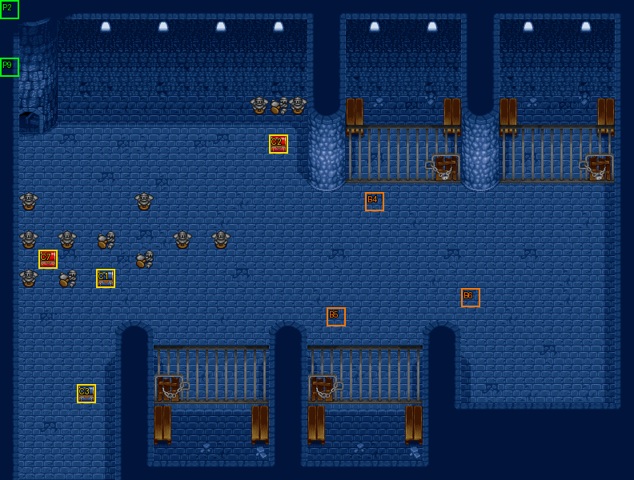

# 第 17 章　人質之危機

<!-- chapter_docs:header -->
| 項目 | 內容 |
| --- | --- |
| 章號／章節索引 | 17／16 |
| 章名（文字區塊 `0x01`） | 人質之危機 |
| 勝利條件（`0x02`） | 敵人全滅 |
| 敗北條件（`0x03`） | 法蓮娜死亡 |
| 戰場 | `MAP16.DAT`／`MAP16.COD`／`M16.DTL`，33×25 格，我方 slot 10 個，部署記錄 30 筆 |
| 文字區塊 | `FDETXT17.TXT`，12 條 |
| 進入處理（`0x60074`[16]） | `fdps_chapter_17_init`（`0x212d0`） |
| 行動後檢查（`0x6028c`[16]） | `fdps_chapter_17_post_action`（`0x3ad10`） |
| 勝利處理（`0x60304`[16]） | `fdps_chapter_17_end`（`0x3ad40`） |
| 地圖資料呼叫的事件處理（`0x601c4`） | slot 24：`fdps_chapter_17_event_deploy_wave_for_turn`（`0x38110`）（回合事件） |
| 過場腳本 | `ICON16.DAT`（開場）、`WIN16.DAT`（勝利） |
| 本章之前的村莊 | 無 |
| 光碟 | 第 1 片（音軌見 [CD 音軌](../program_info/cd_audio.md)） |



戰場全圖（第 0 層與同步捲動的圖層）。框線：黃 `C` 寶箱、橘 `B` 埋藏格、青 `R` 重繪格、洋紅 `E` 有處理函式的格子事件格，字母後的數字是事件碼；綠 `P` 是我方 slot 的起始格。

圖由 `python tools/chapter_docs/chapter_facts.py render-maps` 從遊戲檔重畫到 `chapters/maps/`，`verify-maps` 逐 byte 比對版控中的圖。
<!-- /chapter_docs:header -->

## 概要

隊伍在上一章之後分成兩半：本章由法蓮娜、裘娜、蓋亞、琴琴、瑪麗安五人潛入一座地牢。開場過場先照向右上角牢房裡來回踱步的索爾，再把鏡頭拉到左上角，五人從入口進場，守衛的騎士大喊「有人劫獄啊～！」（`0x09`）。地牢裡有四間牢房，索爾（`0C`）關在右上、一名侍衛（`5B`）關在上方中間、亞雷斯（`0E`）關在下方中間，這三人就是章名裡的人質。

敵人全滅後，勝利過場回到索爾的牢房：他喝令「你們讓開～！」（`0x0a`），畫面震動、播放 `ICON0050.SAF`，腳本把右上牢房一帶 (26–31, 6–13) 的圖磚換掉，索爾破牢而出。眾人在地牢中央會合，索爾吩咐亞雷斯去打開城門、號召義勇軍入宮，自己則要去找「那個冒充我，可惡的混蛋」算帳（`0x0b`），說完便往左衝出，五人隨後跟上。過場最後切到場景地圖 60，索爾一路喊著「你們這些小人！看我來收拾你們～！！」往前衝，裘娜在後面喊跑不動、別丟下她（`FDETXT61`）。

## 加入與離隊

本章沒有人入隊或離隊。`fdps_chapter_17_init`（`0x212d0`）不呼叫入隊，名冊維持第 16 章（[`ch16.md`](ch16.md)）結束時的十人，恰好填滿 `MAP16.DAT` 宣告的 10 個我方 slot。入隊順序與名冊記錄見 [`assets/characters.md` 的加入一節](../assets/characters.md#加入)。

- **只有五人上場**：開場過場 `ICON16.DAT` 在 `0x020`–`0x028` 把地圖單位 0、1、2、5、6（蘭迪斯、尤利安、亞克、費塔加、布蘭多）設為退場，而且整支腳本沒有復歸。這正好是第 16 章 `ICON15.DAT` 退場那五人的補集：上一章出戰的一半本章休息。這五人是被腳本設為退場，HP 並沒有歸零：勝利處理裡 `fdps_roster_write_back_battle_units`（`0x23980`）寫回名冊時略過已退場的蘭迪斯（角色編號 0 的例外），其餘四人照樣寫回；接著的收費復活 `fdps_roster_revive_fallen_members`（`0x39e70`）只挑 HP 為 0 的名冊成員，所以這五人都不收費。
- **人質是 NPC，不入隊**：`MAP16.DAT` 第 18、19、20 筆是陣營 1 的索爾（LV10）、亞雷斯（LV10）與侍衛（`5B`，LV20），AI 行為都是 8（什麼都不做，也跳過行動結束的處理，[`program_info/map_ai.md`](../program_info/map_ai.md#行為代碼)）。三人整場站在牢房裡不動，只在勝利過場裡走位與說話。

## 勝敗條件與特殊機制

- **勝利**：陣營 0 全部退場，與畫面上的「敵人全滅」一致。判定是共用的 `fdps_battle_check_default_end_conditions`（`0x3a2e0`），由 `fdps_chapter_17_post_action`（`0x3ad10`）在每次行動後呼叫（規則見 [`program_info/chapter.md`](../program_info/chapter.md)）。援軍（波次 1、2）只有在場上時才算進「全部」：開場的 20 名敵人若在第 8 回合敵方階段開始前就全數倒下，當下就過關，兩批援軍都不會出場。以行為 7 走到目的地而退場的狼人戰士也算已退場。
- **敗北是法蓮娜（單位 3），不是蘭迪斯**：共用判定平常看地圖單位 0，但章節索引是 `0x10`（本章）時改看單位 3。蘭迪斯（單位 0）在開場過場就被設為退場，所以本章若照一般章節看單位 0，第一次行動後就會判敗北。單位 3 是名冊第 4 位的法蓮娜，與畫面上的「法蓮娜死亡」一致。`fdps_chapter_17_post_action`（`0x3ad10`）在共用判定之後又自己問一次 `fdps_unit_is_retired`（`0x109b0`）單位 3，退場就寫結束碼 1，不看目前的值；同一次行動裡清光敵人又失去法蓮娜，結果是敗北。
- **人質的生死不影響勝敗**：沒有任何處理函式檢查索爾、亞雷斯、侍衛。敵方的物理攻擊對象是陣營 ≠ 0 的單位（[`program_info/map_ai.md`](../program_info/map_ai.md)），陣營 1 的人質在規則上也是目標，但他們退場既不算敗北也不影響過關。
- **第 9 回合的狼人戰士會搶寶箱**：波次 2 的 `53` 狼人戰士 AI 行為是 5（搶寶箱），事件碼 3，目標是 (4, 20) 裝著 `A4` 強化套件的寶箱；它的出生錨點與目的地都是左下角 (3, 24)。拿到之後行為改成 7，走回 (3, 24) 就退場，退場不跑死亡腳本，強化套件就此消失。細節見下方寶物。

## 敵人配置

開場（波次 0）有 20 名敵人：LV15 武士 10、LV11 騎士 6、LV14 弓箭手 2、LV16 暗魔導士 2。分成三群：

- **中央上方**（(11–14, 8–11)）：騎士 #1、#2，武士 #5、#6、#10、#11，暗魔導士 #16，AI 行為都是 0（主動），開場就會殺過來。
- **右側**（(19–21, 11–15)）：騎士 #3、#4、#8、#9，武士 #13、#14、#21、#22，暗魔導士 #17，全是行為 2（有達到門檻的最佳行動才動，否則原地休息、不追擊）。
- **左下**（(1–4, 17–20)）：武士 #0、#12，弓箭手 #7、#15，行為 2。弓箭手 #15 的錨點 (4, 20) 就是強化套件寶箱所在的格。

援軍兩批，都由回合事件在我方行動結束、敵方階段開始前部署，位置在左下角，以「最近的空格」放置：

- **第 8 回合**：波次 1，LV15 武士 6 名，錨點 (2–4, 22–23)，行為 0。
- **第 9 回合**：波次 2，LV14 狼人戰士 1 名，錨點 (3, 24)，搶寶箱（見上）。

<!-- chapter_docs:deployments -->
陣營與死亡腳本的意義見 [`resource_info/map.md`](../resource_info/map.md)，AI 行為（低 4 bit）見 [`program_info/map_ai.md`](../program_info/map_ai.md#行為代碼)；錨點是 `MAPnn.COD` 的座標，開場波次放在錨點上，其餘波次依部署方式放在錨點或最近的空格。單位名是全域文字的「角色編號 + 1」條；角色編號 `3C` 以上的敵兵，數值（`ENEMYDAT.DAT`）與種族、職業見 [`assets/enemies.md`](../assets/enemies.md)，以下的見 [`assets/characters.md`](../assets/characters.md)。

我方起始格：slot 0 (0, 3)、slot 1 (0, 3)、slot 2 (0, 0)、slot 3 (0, 3)、slot 4 (0, 3)、slot 5 (0, 3)、slot 6 (0, 3)、slot 7 (0, 3)、slot 8 (0, 3)、slot 9 (0, 3)。

| 波次 | 陣營 | 單位 | 等級 | 數量 |
| ---: | --- | --- | --- | ---: |
| 0 | 敵方 | `63` 武士 | 15 | 10 |
| 0 | 敵方 | `59` 騎士 | 11 | 6 |
| 0 | 敵方 | `5E` 弓箭手 | 14 | 2 |
| 0 | 敵方 | `67` 暗魔導士 | 16 | 2 |
| 0 | NPC | `0C` 索爾 | 10 | 1 |
| 0 | NPC | `0E` 亞雷斯 | 10 | 1 |
| 0 | NPC | `5B` 侍衛 | 20 | 1 |
| 1 | 敵方 | `63` 武士 | 15 | 6 |
| 2 | 敵方 | `53` 狼人戰士 | 14 | 1 |

### 波次 0

出場：進入戰場時由 `fdps_build_map_unit_array`（`0x22be0`） 部署在錨點上

| # | 陣營 | 單位 | 等級 | AI 行為 | 錨點 | 死亡腳本 |
| ---: | --- | --- | ---: | --- | --- | --- |
| 0 | 敵方 | `63` 武士 | 15 | 2 原地 | (2, 17) | 掉落 2000 金 |
| 1 | 敵方 | `59` 騎士 | 11 | 0 主動 | (14, 9) | 掉落 3000 金 |
| 2 | 敵方 | `59` 騎士 | 11 | 0 主動 | (12, 11) | 掉落 2000 金 |
| 3 | 敵方 | `59` 騎士 | 11 | 2 原地 | (21, 12) | 掉落 2000 金 |
| 4 | 敵方 | `59` 騎士 | 11 | 2 原地 | (21, 14) | 掉落 `B8` 魔法水 |
| 5 | 敵方 | `63` 武士 | 15 | 0 主動 | (13, 9) | 掉落 `B6` 再生藥 |
| 6 | 敵方 | `63` 武士 | 15 | 0 主動 | (11, 11) | 掉落 `B6` 再生藥 |
| 7 | 敵方 | `5E` 弓箭手 | 14 | 2 原地 | (1, 20) | — |
| 8 | 敵方 | `59` 騎士 | 11 | 2 原地 | (19, 13) | — |
| 9 | 敵方 | `59` 騎士 | 11 | 2 原地 | (21, 13) | — |
| 10 | 敵方 | `63` 武士 | 15 | 0 主動 | (14, 8) | 掉落 3000 金 |
| 11 | 敵方 | `63` 武士 | 15 | 0 主動 | (12, 10) | 掉落 1000 金 |
| 12 | 敵方 | `63` 武士 | 15 | 2 原地 | (3, 17) | 掉落 `B6` 再生藥 |
| 13 | 敵方 | `63` 武士 | 15 | 2 原地 | (19, 12) | — |
| 14 | 敵方 | `63` 武士 | 15 | 2 原地 | (19, 14) | 掉落 `B6` 再生藥 |
| 15 | 敵方 | `5E` 弓箭手 | 14 | 2 原地 | (4, 20) | 掉落 5000 金 |
| 16 | 敵方 | `67` 暗魔導士 | 16 | 0 主動 | (13, 10) | — |
| 17 | 敵方 | `67` 暗魔導士 | 16 | 2 原地 | (20, 13) | — |
| 18 | NPC | `0C` 索爾 | 10 | 8 靜止 | (28, 5) | — |
| 19 | NPC | `0E` 亞雷斯 | 10 | 8 靜止 | (18, 23) | — |
| 20 | NPC | `5B` 侍衛 | 20 | 8 靜止 | (20, 5) | — |
| 21 | 敵方 | `63` 武士 | 15 | 2 原地 | (19, 11) | 掉落 `B6` 再生藥 |
| 22 | 敵方 | `63` 武士 | 15 | 2 原地 | (19, 15) | 掉落 `B6` 再生藥 |

### 波次 1

出場：第 8 回合我方行動結束、敵方階段開始前，`fdps_battle_run_turn_events`（`0x2e0c0`）執行 `MAP16.DAT` 回合事件第 0 筆（回合 8、slot 24、陣營階段 0），`fdps_chapter_17_event_deploy_wave_for_turn`（`0x38110`）以回合計數器 − 7 = 1 呼叫 `fdps_deploy_wave`（`0x23830`），放在錨點 (2–4, 22–23) 最近的空格；開場敵人在那之前全滅就已過關，本波次不會出場

| # | 陣營 | 單位 | 等級 | AI 行為 | 錨點 | 死亡腳本 |
| ---: | --- | --- | ---: | --- | --- | --- |
| 23 | 敵方 | `63` 武士 | 15 | 0 主動 | (2, 22) | 掉落 `B6` 再生藥 |
| 24 | 敵方 | `63` 武士 | 15 | 0 主動 | (3, 22) | 掉落 `B6` 再生藥 |
| 25 | 敵方 | `63` 武士 | 15 | 0 主動 | (4, 22) | 掉落 `B6` 再生藥 |
| 26 | 敵方 | `63` 武士 | 15 | 0 主動 | (2, 23) | 掉落 `B6` 再生藥 |
| 27 | 敵方 | `63` 武士 | 15 | 0 主動 | (3, 23) | 掉落 `B6` 再生藥 |
| 28 | 敵方 | `63` 武士 | 15 | 0 主動 | (4, 23) | 掉落 `B6` 再生藥 |

### 波次 2

出場：第 9 回合我方行動結束、敵方階段開始前，`MAP16.DAT` 回合事件第 1 筆（回合 9、slot 24、陣營階段 0）呼叫 `fdps_chapter_17_event_deploy_wave_for_turn`（`0x38110`），回合計數器 − 7 = 2，放在錨點 (3, 24) 最近的空格；在那之前敵人全滅則不會出場

| # | 陣營 | 單位 | 等級 | AI 行為 | 錨點 | 死亡腳本 |
| ---: | --- | --- | ---: | --- | --- | --- |
| 29 | 敵方 | `53` 狼人戰士 | 14 | 5 搶寶箱：碼 3 | (3, 24) | 掉落 `B6` 再生藥 |
<!-- /chapter_docs:deployments -->

## 寶物

- **強化套件的爭奪**：(4, 20) 的寶箱（事件碼 3，`A4` 強化套件）是波次 2 狼人戰士的目標。它每回合先跑最佳行動，沒有可做的才朝寶箱移動；走上寶箱格時把記錄的內容複製成自己的死亡腳本、把強化套件放進自己背包、設旗標（寶箱變成已開啟），行為改成 7 走回 (3, 24) 退場（[`program_info/map_ai.md`](../program_info/map_ai.md)）。所以下表裡它的「掉落 `B6` 再生藥」只在它還沒開箱時成立；開箱後由存活的我方單位擊倒它，掉落的是強化套件，讓它走到 (3, 24) 則強化套件永遠拿不到。寶箱的旗標若在它出場前就已設（玩家先開了），它改走行為 0 的移動、直接找人打。
- **(19, 10) 的埋藏格**是 `CC`，名稱是空字串，遊戲裡顯示成空白，使用後什麼都不發生（[`assets/items.md`](../assets/items.md)）。

<!-- chapter_docs:treasure -->
搜尋的規則（同碼的格共用一筆記錄與一個旗標、背包滿時的交換）見 [`resource_info/map.md`](../resource_info/map.md)。

| 事件碼 | 格 | 內容 |
| ---: | --- | --- |
| 1 | (5, 14) 寶箱 | `C2` 神聖之水 |
| 2 | (14, 7) 寶箱 | `40` 精鋼手套 |
| 3 | (4, 20) 寶箱 | `A4` 強化套件 |
| 4 | (19, 10) 埋藏 | `CC`  |
| 5 | (17, 16) 埋藏 | `D6` 生命之實 |
| 6 | (24, 15) 埋藏 | `DD` 風精之羽 |
| 7 | (2, 13) 寶箱 | 2000 金 |

沒有任何格引用、拿不到的記錄：記錄 0（種類 1、內容 `7D0`），見 [I04](../cut_content/items.md#i04-章節地圖上沒有格子引用的寶物記錄)。

擊倒後掉落（死亡腳本 opcode 0／1，擊殺者須是存活的我方單位）：

| # | 單位 | 波次 | 掉落 |
| ---: | --- | ---: | --- |
| 0 | `63` 武士 | 0 | 掉落 2000 金 |
| 1 | `59` 騎士 | 0 | 掉落 3000 金 |
| 2 | `59` 騎士 | 0 | 掉落 2000 金 |
| 3 | `59` 騎士 | 0 | 掉落 2000 金 |
| 4 | `59` 騎士 | 0 | 掉落 `B8` 魔法水 |
| 5 | `63` 武士 | 0 | 掉落 `B6` 再生藥 |
| 6 | `63` 武士 | 0 | 掉落 `B6` 再生藥 |
| 10 | `63` 武士 | 0 | 掉落 3000 金 |
| 11 | `63` 武士 | 0 | 掉落 1000 金 |
| 12 | `63` 武士 | 0 | 掉落 `B6` 再生藥 |
| 14 | `63` 武士 | 0 | 掉落 `B6` 再生藥 |
| 15 | `5E` 弓箭手 | 0 | 掉落 5000 金 |
| 21 | `63` 武士 | 0 | 掉落 `B6` 再生藥 |
| 22 | `63` 武士 | 0 | 掉落 `B6` 再生藥 |
| 23 | `63` 武士 | 1 | 掉落 `B6` 再生藥 |
| 24 | `63` 武士 | 1 | 掉落 `B6` 再生藥 |
| 25 | `63` 武士 | 1 | 掉落 `B6` 再生藥 |
| 26 | `63` 武士 | 1 | 掉落 `B6` 再生藥 |
| 27 | `63` 武士 | 1 | 掉落 `B6` 再生藥 |
| 28 | `63` 武士 | 1 | 掉落 `B6` 再生藥 |
| 29 | `53` 狼人戰士 | 2 | 掉落 `B6` 再生藥 |
<!-- /chapter_docs:treasure -->

## 村莊

<!-- chapter_docs:village -->
第 16 章勝利後沒有村莊（`CHAPTER_HAS_NO_VILLAGE`，`src/village.c`），直接進存檔畫面再進本章。
<!-- /chapter_docs:village -->

## 處理流程

### 進入：`fdps_chapter_17_init`（`0x212d0`）

1. `fdps_chapter_state_reset`（`0x22750`）依 `MAP16.DAT` 建立地圖單位陣列：10 個我方 slot 依名冊順序取人（單位 0–9），全部疊在 `MAP16.COD` 的起始格 (0, 3)（slot 2 是 (0, 0)）；接著部署波次 0 的 23 筆記錄（單位 10–32），放在錨點上。
2. `fdps_icon_script_run`（`0x21650`）播 `Icon16.dat`：把單位 3、4、7、8、9 暫放到 (18, 18)，把單位 0、1、2、5、6 設為退場；淡入後演索爾在牢房裡踱步，鏡頭拉到左上，把五人移到 (1, 6) 再走進來，法蓮娜停在 (2, 7)；騎士喊「有人劫獄啊～！」（`0x09`）後停止音樂。腳本不部署任何波次，也不寫單位狀態。
3. `fdps_show_chapter_title_card`（`0x20c60`）顯示章節標題圖（圖像，不讀文字區塊）。
4. `fdps_map_cursor_move_to_unit`（`0x2da50`）把游標放在單位 3 法蓮娜身上，而不是一般章節的單位 0（蘭迪斯此時已退場）。

### 行動後檢查：`fdps_chapter_17_post_action`（`0x3ad10`）

1. 呼叫 `fdps_battle_check_default_end_conditions`（`0x3a2e0`）：結束碼已非 0 就直接返回；否則先寫 2，陣營 0 還有未退場的單位就改回 0；最後因為章節索引是 `0x10`，看單位 3 是否退場，退場就寫 1。
2. 再以 `fdps_unit_is_retired`（`0x109b0`）問單位 3，退場就把結束碼寫成 1。這一步不看結束碼目前的值，也不管共用判定剛才是否已經寫過。

### 回合事件：`fdps_chapter_17_event_deploy_wave_for_turn`（`0x38110`）

`MAP16.DAT` 的回合事件表有兩筆，回合 8 與回合 9，陣營階段都是 0（敵方階段開始前），都指向 slot 24 的這支處理函式；`fdps_battle_run_turn_events`（`0x2e0c0`）觸發時回合計數器還是剛結束的那一回合。處理函式只做一件事：以「回合計數器 − 7」當波次呼叫 `fdps_deploy_wave`（`0x23830`），地圖是目前的章節索引，放置方式是 0（找錨點最近的空格）。所以第 8 回合部署波次 1、第 9 回合部署波次 2。處理函式沒有旗標也沒有上下限檢查，每批只出現一次是因為表裡每個回合只寫一筆。傳進來的單位索引被寫成 0 後不再使用。

### 勝利：`fdps_chapter_17_end`（`0x3ad40`）

1. `fdps_battle_destroy_remaining_enemies`（`0x39e10`）把陣營 0 的剩餘單位清掉；過關時陣營 0 已經全數退場，這一步通常沒有可見效果。
2. `fdps_roster_write_back_battle_units`（`0x23980`）把戰場上的隊員寫回名冊。
3. `fdps_icon_script_run`（`0x21650`）播 `Win16.dat`：索爾破牢、復歸五名上場隊員、清掉開場敵人的殘影，眾人在中央會合對話，最後切到地圖 60 演索爾衝出去的場面。
4. `fdps_roster_revive_fallen_members`（`0x39e70`）讓陣亡的隊員收費復活。
5. 章節索引寫成 `0x11`，也就是第 18 章（[`ch18.md`](ch18.md)）。第 17、18 章之間沒有村莊，直接進存檔畫面（[`program_info/save.md`](../program_info/save.md)）。

## 回合事件與格子事件

<!-- chapter_docs:events -->
觸發時機與陣營階段的意義見 [`resource_info/map.md`](../resource_info/map.md)。

| 回合 | 陣營階段 | slot | 處理函式 |
| ---: | --- | ---: | --- |
| 8 | 敵方階段前 | 24 | `fdps_chapter_17_event_deploy_wave_for_turn`（`0x38110`） |
| 9 | 敵方階段前 | 24 | `fdps_chapter_17_event_deploy_wave_for_turn`（`0x38110`） |

本章沒有格子事件。
<!-- /chapter_docs:events -->

## 過場腳本

<!-- chapter_docs:scripts -->
格式與每個指令的意義見 [`resource_info/cutscene_script.md`](../resource_info/cutscene_script.md)。`FDETXT17#0xNN` 是本章文字區塊的條目，全文在下方「對話」；切到額外場景之後顯示的文字直接列出（那些區塊的正典是 [`assets/text/scene_text.md`](../assets/text/scene_text.md)）。`u3=我方1` 是地圖單位索引 3 對到我方 slot 1，`u12=MAP02#9` 是 `MAP02.DAT` 第 9 筆部署記錄。

### `ICON16.DAT`

- 開場：`fdps_chapter_17_init`（`0x212d0`）
- 154 byte、34 步；起始地圖 16，切換地圖 無，結束於地圖 16

| 偏移 | 指令 | 內容 |
| ---: | --- | --- |
| `0000` | `FADE_OUT` | 淡出，每步 0 ms |
| `0002` | `SET_MUSIC` | 音樂 13（CD 第 14 軌） |
| `0004` | `SET_VIEW_TILE` | 視野直接設到格 (20, 2) |
| `0007` | `PLACE_UNIT` | 放置 u3=我方3 到 (18, 18)，朝下 |
| `000c` | `PLACE_UNIT` | 放置 u4=我方4 到 (18, 18)，朝下 |
| `0011` | `PLACE_UNIT` | 放置 u7=我方7 到 (18, 18)，朝下 |
| `0016` | `PLACE_UNIT` | 放置 u8=我方8 到 (18, 18)，朝下 |
| `001b` | `PLACE_UNIT` | 放置 u9=我方9 到 (18, 18)，朝下 |
| `0020` | `RETIRE_UNIT` | 退場 u0=我方0 |
| `0022` | `RETIRE_UNIT` | 退場 u1=我方1 |
| `0024` | `RETIRE_UNIT` | 退場 u2=我方2 |
| `0026` | `RETIRE_UNIT` | 退場 u5=我方5 |
| `0028` | `RETIRE_UNIT` | 退場 u6=我方6 |
| `002a` | `FADE_IN` | 淡入，每步 20 ms |
| `002c` | `FACE_UNITS` | 轉向後停 25 幀：u28=MAP16#18(角色0x0c)朝下 |
| `0031` | `WALK_UNITS` | 行走 1 格，每步 7 幀：u28=MAP16#18(角色0x0c)往左 |
| `0037` | `FACE_UNITS` | 轉向後停 30 幀：u28=MAP16#18(角色0x0c)朝左 |
| `003c` | `WALK_UNITS` | 行走 2 格，每步 7 幀：u28=MAP16#18(角色0x0c)往右 |
| `0042` | `FACE_UNITS` | 轉向後停 30 幀：u28=MAP16#18(角色0x0c)朝右 |
| `0047` | `FACE_UNITS` | 轉向後停 15 幀：u28=MAP16#18(角色0x0c)朝左 |
| `004c` | `SCROLL_VIEW` | 捲動視野到格 (0, 2) |
| `004f` | `FACE_UNITS` | 轉向後停 20 幀：u27=MAP16#17(角色0x67)朝左 |
| `0054` | `PLACE_UNIT` | 放置 u3=我方3 到 (1, 6)，朝下 |
| `0059` | `PLACE_UNIT` | 放置 u4=我方4 到 (1, 6)，朝下 |
| `005e` | `PLACE_UNIT` | 放置 u7=我方7 到 (1, 6)，朝下 |
| `0063` | `PLACE_UNIT` | 放置 u8=我方8 到 (1, 6)，朝下 |
| `0068` | `PLACE_UNIT` | 放置 u9=我方9 到 (1, 6)，朝下 |
| `006d` | `FACE_UNITS` | 轉向後停 4 幀：u9=我方9朝下、u8=我方8朝下、u7=我方7朝下、u4=我方4朝下、u3=我方3朝下 |
| `007a` | `WALK_UNITS` | 行走 1 格，每步 2 幀：u3=我方3往右、u4=我方4往下、u7=我方7往右、u8=我方8往右 |
| `0086` | `WALK_UNITS` | 行走 1 格，每步 2 幀：u3=我方3往下、u7=我方7往右 |
| `008e` | `FACE_UNITS` | 轉向後停 25 幀：u7=我方7朝下、u8=我方8朝下 |
| `0095` | `DRAW_TEXT` | 顯示文字 FDETXT17#0x09 |
| `0097` | `SET_MUSIC` | 停止音樂 |
| `0099` | `END` | 結束 |

### `WIN16.DAT`

- 勝利：`fdps_chapter_17_end`（`0x3ad40`）
- 603 byte、126 步；起始地圖 16，切換地圖 60，結束於地圖 60

| 偏移 | 指令 | 內容 |
| ---: | --- | --- |
| `0000` | `SET_MUSIC` | 音樂 12（CD 第 13 軌） |
| `0002` | `SET_VIEW_TILE` | 視野直接設到格 (19, 5) |
| `0005` | `WALK_UNITS` | 行走 1 格，每步 7 幀：u28=MAP16#18(角色0x0c)往左 |
| `000b` | `FACE_UNITS` | 轉向後停 25 幀：u28=MAP16#18(角色0x0c)朝下 |
| `0010` | `DRAW_TEXT` | 顯示文字 FDETXT17#0x0a |
| `0012` | `SHAKE_VIEW` | 視野位移 8 步，每步 1 幀：(0,3) (0,6) (0,9) (0,12) (0,15) (0,18) (0,21) (0,24) |
| `0025` | `SET_VIEW_TILE` | 視野直接設到格 (19, 5) |
| `0028` | `FACE_UNITS` | 轉向後停 5 幀：u28=MAP16#18(角色0x0c)朝下 |
| `002d` | `RETIRE_UNIT` | 退場 u28=MAP16#18(角色0x0c) |
| `002f` | `PLAY_SAF` | 播放動畫 ICON0050.SAF |
| `0031` | `SET_MAP_CELL` | 地形層 0 格 (26, 6) = 0x0091 |
| `0036` | `SET_MAP_CELL` | 地形層 0 格 (27, 6) = 0x0093 |
| `003b` | `SET_MAP_CELL` | 地形層 0 格 (28, 6) = 0x0097 |
| `0040` | `SET_MAP_CELL` | 地形層 0 格 (29, 6) = 0x0099 |
| `0045` | `SET_MAP_CELL` | 地形層 0 格 (30, 6) = 0x0095 |
| `004a` | `SET_MAP_CELL` | 地形層 0 格 (31, 6) = 0x009b |
| `004f` | `SET_MAP_CELL` | 地形層 0 格 (26, 7) = 0x009d |
| `0054` | `SET_MAP_CELL` | 地形層 0 格 (27, 7) = 0x009f |
| `0059` | `SET_MAP_CELL` | 地形層 0 格 (28, 7) = 0x00a1 |
| `005e` | `SET_MAP_CELL` | 地形層 0 格 (29, 7) = 0x00a3 |
| `0063` | `SET_MAP_CELL` | 地形層 0 格 (30, 7) = 0x00a5 |
| `0068` | `SET_MAP_CELL` | 地形層 0 格 (31, 7) = 0x00a7 |
| `006d` | `SET_MAP_CELL` | 地形層 0 格 (26, 8) = 0x00a9 |
| `0072` | `SET_MAP_CELL` | 地形層 0 格 (27, 8) = 0x00ab |
| `0077` | `SET_MAP_CELL` | 地形層 0 格 (28, 8) = 0x00ad |
| `007c` | `SET_MAP_CELL` | 地形層 0 格 (29, 8) = 0x00af |
| `0081` | `SET_MAP_CELL` | 地形層 0 格 (30, 8) = 0x00b1 |
| `0086` | `SET_MAP_CELL` | 地形層 0 格 (31, 8) = 0x00b3 |
| `008b` | `SET_MAP_CELL` | 地形層 0 格 (26, 9) = 0x00b5 |
| `0090` | `SET_MAP_CELL` | 地形層 0 格 (27, 9) = 0x00b7 |
| `0095` | `SET_MAP_CELL` | 地形層 0 格 (28, 9) = 0x00b9 |
| `009a` | `SET_MAP_CELL` | 地形層 0 格 (29, 9) = 0x00bb |
| `009f` | `SET_MAP_CELL` | 地形層 0 格 (30, 9) = 0x00bd |
| `00a4` | `SET_MAP_CELL` | 地形層 0 格 (31, 9) = 0x00bf |
| `00a9` | `SET_MAP_CELL` | 地形層 0 格 (26, 10) = 0x00c1 |
| `00ae` | `SET_MAP_CELL` | 地形層 0 格 (27, 10) = 0x00c3 |
| `00b3` | `SET_MAP_CELL` | 地形層 0 格 (28, 10) = 0x00c5 |
| `00b8` | `SET_MAP_CELL` | 地形層 0 格 (29, 10) = 0x00c7 |
| `00bd` | `SET_MAP_CELL` | 地形層 0 格 (30, 10) = 0x00c9 |
| `00c2` | `SET_MAP_CELL` | 地形層 0 格 (31, 10) = 0x00cb |
| `00c7` | `SET_MAP_CELL` | 地形層 0 格 (26, 11) = 0x00cd |
| `00cc` | `SET_MAP_CELL` | 地形層 0 格 (27, 11) = 0x00cf |
| `00d1` | `SET_MAP_CELL` | 地形層 0 格 (28, 11) = 0x00d1 |
| `00d6` | `SET_MAP_CELL` | 地形層 0 格 (29, 11) = 0x00d3 |
| `00db` | `SET_MAP_CELL` | 地形層 0 格 (30, 11) = 0x00d5 |
| `00e0` | `SET_MAP_CELL` | 地形層 0 格 (31, 11) = 0x00d7 |
| `00e5` | `SET_MAP_CELL` | 地形層 0 格 (26, 12) = 0x00d9 |
| `00ea` | `SET_MAP_CELL` | 地形層 0 格 (27, 12) = 0x00db |
| `00ef` | `SET_MAP_CELL` | 地形層 0 格 (28, 12) = 0x00dd |
| `00f4` | `SET_MAP_CELL` | 地形層 0 格 (29, 12) = 0x00df |
| `00f9` | `SET_MAP_CELL` | 地形層 0 格 (30, 12) = 0x00e1 |
| `00fe` | `SET_MAP_CELL` | 地形層 0 格 (31, 12) = 0x00e3 |
| `0103` | `SET_MAP_CELL` | 地形層 0 格 (26, 13) = 0x00e5 |
| `0108` | `SET_MAP_CELL` | 地形層 0 格 (27, 13) = 0x00e7 |
| `010d` | `SET_MAP_CELL` | 地形層 0 格 (28, 13) = 0x00e9 |
| `0112` | `SET_MAP_CELL` | 地形層 0 格 (29, 13) = 0x00eb |
| `0117` | `SET_MAP_CELL` | 地形層 0 格 (30, 13) = 0x00ed |
| `011c` | `SET_MAP_CELL` | 地形層 0 格 (31, 13) = 0x00ef |
| `0121` | `REVIVE_UNIT` | 復歸 u28=MAP16#18(角色0x0c)（清狀態） |
| `0123` | `PLACE_UNIT` | 放置 u28=MAP16#18(角色0x0c) 到 (28, 9)，朝左 |
| `0128` | `FACE_UNITS` | 轉向後停 50 幀：u28=MAP16#18(角色0x0c)朝下 |
| `012d` | `FADE_OUT` | 淡出，每步 20 ms |
| `012f` | `SET_VIEW_TILE` | 視野直接設到格 (13, 8) |
| `0132` | `REVIVE_UNIT` | 復歸 u3=我方3（清狀態） |
| `0134` | `REVIVE_UNIT` | 復歸 u4=我方4（清狀態） |
| `0136` | `REVIVE_UNIT` | 復歸 u7=我方7（清狀態） |
| `0138` | `REVIVE_UNIT` | 復歸 u8=我方8（清狀態） |
| `013a` | `REVIVE_UNIT` | 復歸 u9=我方9（清狀態） |
| `013c` | `RETIRE_UNIT` | 退場 u10=MAP16#0(角色0x63) |
| `013e` | `RETIRE_UNIT` | 退場 u11=MAP16#1(角色0x59) |
| `0140` | `RETIRE_UNIT` | 退場 u12=MAP16#2(角色0x59) |
| `0142` | `RETIRE_UNIT` | 退場 u13=MAP16#3(角色0x59) |
| `0144` | `RETIRE_UNIT` | 退場 u14=MAP16#4(角色0x59) |
| `0146` | `RETIRE_UNIT` | 退場 u15=MAP16#5(角色0x63) |
| `0148` | `RETIRE_UNIT` | 退場 u16=MAP16#6(角色0x63) |
| `014a` | `RETIRE_UNIT` | 退場 u17=MAP16#7(角色0x5e) |
| `014c` | `RETIRE_UNIT` | 退場 u18=MAP16#8(角色0x59) |
| `014e` | `RETIRE_UNIT` | 退場 u19=MAP16#9(角色0x59) |
| `0150` | `RETIRE_UNIT` | 退場 u20=MAP16#10(角色0x63) |
| `0152` | `RETIRE_UNIT` | 退場 u21=MAP16#11(角色0x63) |
| `0154` | `RETIRE_UNIT` | 退場 u22=MAP16#12(角色0x63) |
| `0156` | `RETIRE_UNIT` | 退場 u23=MAP16#13(角色0x63) |
| `0158` | `RETIRE_UNIT` | 退場 u24=MAP16#14(角色0x63) |
| `015a` | `RETIRE_UNIT` | 退場 u25=MAP16#15(角色0x5e) |
| `015c` | `RETIRE_UNIT` | 退場 u26=MAP16#16(角色0x67) |
| `015e` | `RETIRE_UNIT` | 退場 u27=MAP16#17(角色0x67) |
| `0160` | `PLACE_UNIT` | 放置 u28=MAP16#18(角色0x0c) 到 (19, 11)，朝右 |
| `0165` | `PLACE_UNIT` | 放置 u3=我方3 到 (19, 10)，朝右 |
| `016a` | `PLACE_UNIT` | 放置 u4=我方4 到 (18, 12)，朝右 |
| `016f` | `PLACE_UNIT` | 放置 u7=我方7 到 (18, 10)，朝右 |
| `0174` | `PLACE_UNIT` | 放置 u8=我方8 到 (17, 12)，朝右 |
| `0179` | `PLACE_UNIT` | 放置 u9=我方9 到 (17, 10)，朝右 |
| `017e` | `PLACE_UNIT` | 放置 u29=MAP16#19(角色0x0e) 到 (21, 11)，朝左 |
| `0183` | `PLACE_UNIT` | 放置 u30=MAP16#20(角色0x5b) 到 (21, 10)，朝左 |
| `0188` | `FACE_UNITS` | 轉向後停 1 幀：u3=我方3朝右 |
| `018d` | `FADE_IN` | 淡入，每步 30 ms |
| `018f` | `FACE_UNITS` | 轉向後停 55 幀：u3=我方3朝右 |
| `0194` | `DRAW_TEXT` | 顯示文字 FDETXT17#0x0b |
| `0196` | `FACE_UNITS` | 轉向後停 40 幀：u28=MAP16#18(角色0x0c)朝上 |
| `019b` | `FACE_UNITS` | 轉向後停 40 幀：u28=MAP16#18(角色0x0c)朝下 |
| `01a0` | `WALK_UNITS` | 行走 3 格，每步 1 幀：u28=MAP16#18(角色0x0c)往左 |
| `01a6` | `FACE_UNITS` | 轉向後停 1 幀：u3=我方3朝左、u4=我方4朝左、u7=我方7朝左、u8=我方8朝左、u9=我方9朝左 |
| `01b3` | `WALK_UNITS` | 行走 5 格，每步 1 幀：u28=MAP16#18(角色0x0c)往左 |
| `01b9` | `FACE_UNITS` | 轉向後停 30 幀：u3=我方3朝左 |
| `01be` | `WALK_UNITS` | 行走 7 格，每步 2 幀：u3=我方3往左、u4=我方4往左、u7=我方7往左、u8=我方8往左、u9=我方9往左 |
| `01cc` | `FADE_OUT` | 淡出，每步 40 ms |
| `01ce` | `SWITCH_MAP` | 切換地圖 → 60（MAP60，文字 FDETXT61） |
| `01d0` | `SET_VIEW_TILE` | 視野直接設到格 (17, 4) |
| `01d3` | `FACE_UNITS` | 轉向後停 1 幀：u5=MAP60#5(角色0x0c)朝左 |
| `01d8` | `FADE_IN` | 淡入，每步 40 ms |
| `01da` | `DRAW_TEXT` | 顯示文字 FDETXT61#0x09 「{speaker char=12}你們這些小人！{br}看我來收拾你們～！！」 |
| `01dc` | `WALK_UNITS` | 行走 1 格，每步 2 幀：u0=MAP60#0(角色0x01)往下、u5=MAP60#5(角色0x0c)往左、u1=MAP60#1(角色0x03)往下、u2=MAP60#2(角色0x05)往下、u3=MAP60#3(角色0x07)往下、u4=MAP60#4(角色0x09)往下 |
| `01ec` | `WALK_UNITS` | 行走 1 格，每步 2 幀：u0=MAP60#0(角色0x01)往左、u5=MAP60#5(角色0x0c)往左、u1=MAP60#1(角色0x03)往下、u2=MAP60#2(角色0x05)往下、u3=MAP60#3(角色0x07)往下、u4=MAP60#4(角色0x09)往左 |
| `01fc` | `WALK_UNITS` | 行走 1 格，每步 2 幀：u0=MAP60#0(角色0x01)往左、u5=MAP60#5(角色0x0c)往左、u1=MAP60#1(角色0x03)往下、u2=MAP60#2(角色0x05)往下、u3=MAP60#3(角色0x07)往左、u4=MAP60#4(角色0x09)往左 |
| `020c` | `WALK_UNITS` | 行走 1 格，每步 2 幀：u0=MAP60#0(角色0x01)往左、u5=MAP60#5(角色0x0c)往左、u1=MAP60#1(角色0x03)往左、u2=MAP60#2(角色0x05)往左、u3=MAP60#3(角色0x07)往左、u4=MAP60#4(角色0x09)往左 |
| `021c` | `WALK_UNITS` | 行走 3 格，每步 2 幀：u0=MAP60#0(角色0x01)往左、u5=MAP60#5(角色0x0c)往左、u1=MAP60#1(角色0x03)往左、u2=MAP60#2(角色0x05)往左、u3=MAP60#3(角色0x07)往左、u4=MAP60#4(角色0x09)往左 |
| `022c` | `DRAW_TEXT` | 顯示文字 FDETXT61#0x0a 「{speaker char=3}慢﹒﹒﹒﹒{br}你們跑慢一點～！{br}我快跟不上了～！！」 |
| `022e` | `SCROLL_VIEW` | 捲動視野到格 (13, 4) |
| `0231` | `WALK_UNITS` | 行走 3 格，每步 2 幀：u0=MAP60#0(角色0x01)往左、u5=MAP60#5(角色0x0c)往左、u1=MAP60#1(角色0x03)往左、u2=MAP60#2(角色0x05)往左、u3=MAP60#3(角色0x07)往左、u4=MAP60#4(角色0x09)往左 |
| `0241` | `DRAW_TEXT` | 顯示文字 FDETXT61#0x0b 「{speaker char=3}喂～！{br}等等我～！{br}我真的跑不動了～！」 |
| `0243` | `RETIRE_UNIT` | 退場 u5=MAP60#5(角色0x0c) |
| `0245` | `SCROLL_VIEW` | 捲動視野到格 (9, 4) |
| `0248` | `WALK_UNITS` | 行走 11 格，每步 2 幀：u0=MAP60#0(角色0x01)往左、u1=MAP60#1(角色0x03)往左、u2=MAP60#2(角色0x05)往左、u3=MAP60#3(角色0x07)往左、u4=MAP60#4(角色0x09)往左 |
| `0256` | `DRAW_TEXT` | 顯示文字 FDETXT61#0x0c 「{speaker char=3}喂～！{br}別留下我一個人～！{br}我會迷路的～！」 |
| `0258` | `SET_MUSIC` | 停止音樂 |
| `025a` | `END` | 結束 |
<!-- /chapter_docs:scripts -->

## 對話

<!-- chapter_docs:dialogue -->
`FDETXT17.TXT` 全部 12 條，依條目編號排列。每條先列讀取端（顯示它的腳本步驟、處理函式或死亡腳本），再列全文：【名稱】是換說話者（頭像取自括號裡的角色編號；【地圖單位 n】取執行當下第 n 個地圖單位），每一行是一次換行，▼ 是換頁（等按鍵）。`{subst1}`、`{subst2}`、`{number}` 是執行期代入的名稱與數字（[`resource_info/text.md`](../resource_info/text.md)）。

空字串的條目：`0x04`、`0x05`、`0x06`、`0x07`、`0x08`。

### `0x00`

永遠不會顯示：「第十七章」沒有讀取端：章名卡由 `fdps_show_chapter_title_card`（`0x20c60`）畫 `CHAPTER.SAF` 的圖，本章的處理函式、死亡腳本與 `ICON16.DAT`／`WIN16.DAT` 都不畫這一條，見 [S13a（排除清單）](../cut_content/_index.md#排除清單)。

### `0x01`

讀取端：`fdps_draw_save_slot_panel`（`0x24a40`）

```text
人質之危機
```

### `0x02`

讀取端：`fdps_battle_show_win_fail_window`（`0x17ca0`）

```text
敵人全滅
```

### `0x03`

讀取端：`fdps_battle_show_win_fail_window`（`0x17ca0`）

```text
法蓮娜死亡
```

### `0x09`

讀取端：`ICON16.DAT` `0x095`

```text
【騎士】（角色 89）
有人劫獄啊～！
```

### `0x0a`

讀取端：`WIN16.DAT` `0x010`

```text
【索爾】（角色 12）
你們讓開～！
```

### `0x0b`

讀取端：`WIN16.DAT` `0x194`

```text
【索爾】（角色 12）
亞雷斯！
你去打開城門，
號召義勇軍入宮！
▼
我去找那個冒充我，
可惡的混蛋算帳！
```
<!-- /chapter_docs:dialogue -->
