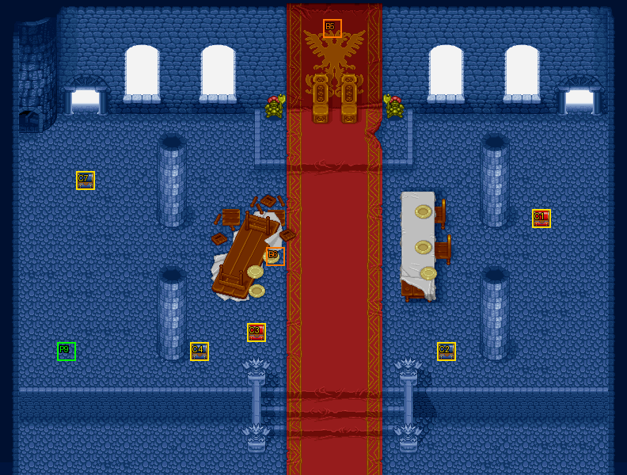

# 第 18 章　咆哮之獅王

<!-- chapter_docs:header -->
| 項目 | 內容 |
| --- | --- |
| 章號／章節索引 | 18／17 |
| 章名（文字區塊 `0x01`） | 咆哮之獅王 |
| 勝利條件（`0x02`） | 敵人全滅 |
| 敗北條件（`0x03`） | 蘭迪斯死亡 |
| 戰場 | `MAP17.DAT`／`MAP17.COD`／`M17.DTL`，33×25 格，我方 slot 10 個，部署記錄 65 筆 |
| 文字區塊 | `FDETXT18.TXT`，18 條 |
| 進入處理（`0x60074`[17]） | `fdps_chapter_18_init`（`0x21310`） |
| 行動後檢查（`0x6028c`[17]） | `fdps_chapter_18_post_action`（`0x3ad80`） |
| 勝利處理（`0x60304`[17]） | `fdps_chapter_18_end`（`0x3ada0`） |
| 地圖資料呼叫的事件處理（`0x601c4`） | slot 25：`fdps_chapter_18_event_deploy_wave_for_turn`（`0x38150`）（回合事件） |
| 過場腳本 | `ICON17.DAT`（開場）、`WIN17-1.DAT`（勝利）、`WIN17.DAT`（勝利） |
| 本章之前的村莊 | 無 |
| 光碟 | 第 1 片（音軌見 [CD 音軌](../program_info/cd_audio.md)） |



戰場全圖（第 0 層與同步捲動的圖層）。框線：黃 `C` 寶箱、橘 `B` 埋藏格、青 `R` 重繪格、洋紅 `E` 有處理函式的格子事件格，字母後的數字是事件碼；綠 `P` 是我方 slot 的起始格。

圖由 `python tools/chapter_docs/chapter_facts.py render-maps` 從遊戲檔重畫到 `chapters/maps/`，`verify-maps` 逐 byte 比對版控中的圖。
<!-- /chapter_docs:header -->

## 概要

分成兩路的隊伍在羅特帝亞王宮的王座廳會合。戰場是王座廳（地圖 17），王座前站著假冒國王的假索爾。開場過場 `ICON17.DAT` 裡，真正的索爾從下方的紅毯一路走上來，蘭迪斯、尤利安、亞克、費塔加、布蘭多跟在後面；索爾喝道「惡賊！竟敢假冒我到處作惡！」一劍砍去，假索爾現出原形，是葛斯洛喀教的凱因巴。凱因巴坦承教主下令拔掉索爾這根釘子，免得羅特帝亞將來成為教團的絆腳石，要在這裡把他們一併解決。

這時法蓮娜、裘娜、蓋亞、琴琴、瑪麗安由左上的門趕到，裘娜抱怨一路追著「更年期男人」跑。凱因巴一見到法蓮娜就大驚失色，喊著要回去向教主報告，往左邊逃去；蘭迪斯要法蓮娜攔住他，法蓮娜卻讓開了路，凱因巴因此逃脫，眾人愕然。索爾打圓場說小女孩被嚇到了，自己去追，把這裡交給隊伍收拾。接著右側湧出敵人的支援部隊，蘭迪斯下令迎擊，戰鬥開始。

殲滅敵軍後，勝利過場切到另一張場景地圖（地圖 45），回來的索爾說沒追到凱因巴、沒想到他還留有伏兵，稱讚蘭迪斯已成為頂天立地的武士，說羅特帝亞還有一堆問題要善後、暫時不能同行，但羅特帝亞的大門永遠為他們而開。蘭迪斯帶著神的聖印且還沒有人轉職過時，播的是另一個版本：索爾看出那枚聖印就是勇者徽章（見下面的「勝敗條件與特殊機制」）。

## 加入與離隊

本章沒有人入隊（`fdps_chapter_18_init`（`0x21310`）沒有名冊加入呼叫），入隊規則見 [`assets/characters.md` 的「加入」](../assets/characters.md#加入)。隊伍就是 [第 17 章](ch17.md) 結束時的十人，`MAP17.DAT` 宣告 10 個我方 slot，剛好全部坐滿：slot 0–9 依入隊順序是蘭迪斯、尤利安、亞克、法蓮娜、裘娜、費塔加、布蘭多、蓋亞、琴琴、瑪麗安。

[第 16 章](ch16.md) 與 [第 17 章](ch17.md) 分開作戰的兩組在開場過場會合：過場先讓 slot 3、4、7、8、9（法蓮娜、裘娜、蓋亞、琴琴、瑪麗安）退場，讓另外五人跟著索爾進場，之後再把那五人復歸、從左上的門帶進來。過場結束時十人都在場上，全員參戰。

友方英雄索爾（`0C`，陣營 1）與凱因巴只在開場過場裡演出，過場結束前兩人都已退場，戰鬥中沒有客串或友方單位。

## 勝敗條件與特殊機制

行動後處理 `fdps_chapter_18_post_action`（`0x3ad80`）只呼叫共用判定 `fdps_battle_check_default_end_conditions`（`0x3a2e0`），沒有本章自己的規則：

- **過關**：陣營 0 沒有未退場的單位就寫結束碼 2。
- **敗北**：本章的章節索引 17 不是共用判定特別處理的 `0x10`、`0x15`，所以看的是單位索引 0（蘭迪斯），退場就寫結束碼 1；敗北寫在過關之後，同一次行動兩者都成立時是敗北。

畫面上的「敵人全滅」「蘭迪斯死亡」與程式一致，但「全滅」指的是**當下場上**的敵人：共用判定不知道後面還有排定的援軍。第 4 回合敵方階段之前就打倒波次 1 的最後一人，戰鬥立刻結束，第 4 回合以後的援軍都不會出現；之後任何一次行動讓場上的敵人歸零也一樣。開場過場留下的假索爾與凱因巴都已退場，不算在內。

**回合援軍**：回合事件表在第 4–11、13 回合的敵方階段前呼叫 `fdps_chapter_18_event_deploy_wave_for_turn`（`0x38150`），它以回合數本身當波次部署，所以第 N 回合來的是波次 N：偶數回合 4、6、8、10 是四名飛兵，奇數回合 5、7、9、11 是四名騎士，第 13 回合是與開場同樣編制的 15 人援軍。第 12 回合沒有事件，地圖也沒有波次 12。

**勇者徽章**：勝利處理 `fdps_chapter_18_end`（`0x3ada0`）在收尾之前先看兩個條件，都成立才把蘭迪斯身上的 `A9` 神的聖印換成 `DB` 勇者徽章，並改播 `WIN17-1.DAT`：

1. 蘭迪斯（單位索引 0）的背包裡有神的聖印。放在別人身上不算。
2. 單位索引 0–8 沒有人轉職過。判定方式是比對單位記錄的肖像編號（`+0x07`）與角色編號（`+0x08`），兩者不同就是轉職過；範圍是固定的 9 個，也就是蘭迪斯到琴琴，slot 9 的瑪麗安不在檢查範圍內，她轉職過也不影響。

神的聖印只能從 [第 16 章](ch16.md) 的流浪工匠事件 `fdps_chapter_16_event_wandering_smith_forge`（`0x37cd0`）取得。換成的勇者徽章是教會讓蘭迪斯走路線 3（英雄）的條件（[`assets/characters.md`](../assets/characters.md) 的「轉職路線」），本章之後的村莊就有教會。交換是先移除聖印、再把徽章放進第一個空格，徽章不一定落在聖印原來的格子。

本章沒有回合限制，也沒有格子事件。

## 敵人配置

進入戰場時 `MAP17.DAT` 只有波次 0 的兩筆：索爾（陣營 1）與假索爾，兩人都在開場過場中退場。真正的敵軍全部由過場與回合事件部署，AI 行為一律是 0（主動進攻），全部以找最近空格的方式放置（波次 2 除外）：

- **王座廳右側**：開場過場最後部署的波次 1，衛兵 5、弓箭手 2、騎士 5、暗黑騎士 2、LV16 暗魔導士 1，錨點集中在 (26–30, 6–10)。戰鬥開始時就在場上。
- **上方四扇窗**：第 4、6、8、10 回合的波次 4、6、8、10，每波四名 LV15 飛兵，錨點 (7, 4)、(11, 4)、(23, 4)、(27, 4)。
- **左上與右上的門**：第 5、7、9、11 回合的波次 5、7、9、11，每波四名 LV13 騎士，兩名錨點在 (4, 5)、兩名在 (30, 5)。
- **下方走廊**：第 13 回合的波次 13，與波次 1 同樣的 15 人編制，錨點在 (15–19, 20–22)。

波次 2 是凱因巴（`43`，LV5），只在開場過場裡以錨點原位出現在假索爾的位置 (16, 7)，過場中就逃走退場，不參戰。本章沒有搶寶箱或會自行離場的敵人。

<!-- chapter_docs:deployments -->
陣營與死亡腳本的意義見 [`resource_info/map.md`](../resource_info/map.md)，AI 行為（低 4 bit）見 [`program_info/map_ai.md`](../program_info/map_ai.md#行為代碼)；錨點是 `MAPnn.COD` 的座標，開場波次放在錨點上，其餘波次依部署方式放在錨點或最近的空格。單位名是全域文字的「角色編號 + 1」條；角色編號 `3C` 以上的敵兵，數值（`ENEMYDAT.DAT`）與種族、職業見 [`assets/enemies.md`](../assets/enemies.md)，以下的見 [`assets/characters.md`](../assets/characters.md)。

我方起始格：slot 0 (3, 18)、slot 1 (3, 18)、slot 2 (3, 18)、slot 3 (3, 18)、slot 4 (3, 18)、slot 5 (3, 18)、slot 6 (3, 18)、slot 7 (3, 18)、slot 8 (3, 18)、slot 9 (3, 18)。

| 波次 | 陣營 | 單位 | 等級 | 數量 |
| ---: | --- | --- | --- | ---: |
| 0 | NPC | `0C` 索爾 | 10 | 1 |
| 0 | 敵方 | `75` 假索爾 | 5 | 1 |
| 1 | 敵方 | `5A` 衛兵 | 14 | 5 |
| 1 | 敵方 | `5E` 弓箭手 | 15 | 2 |
| 1 | 敵方 | `59` 騎士 | 13 | 5 |
| 1 | 敵方 | `4D` 暗黑騎士 | 14 | 2 |
| 1 | 敵方 | `67` 暗魔導士 | 16 | 1 |
| 2 | 敵方 | `43` 凱因巴 | 5 | 1 |
| 4 | 敵方 | `60` 飛兵 | 15 | 4 |
| 5 | 敵方 | `59` 騎士 | 13 | 4 |
| 6 | 敵方 | `60` 飛兵 | 15 | 4 |
| 7 | 敵方 | `59` 騎士 | 13 | 4 |
| 8 | 敵方 | `60` 飛兵 | 15 | 4 |
| 9 | 敵方 | `59` 騎士 | 13 | 4 |
| 10 | 敵方 | `60` 飛兵 | 15 | 4 |
| 11 | 敵方 | `59` 騎士 | 13 | 4 |
| 13 | 敵方 | `5A` 衛兵 | 14 | 5 |
| 13 | 敵方 | `5E` 弓箭手 | 15 | 2 |
| 13 | 敵方 | `59` 騎士 | 13 | 5 |
| 13 | 敵方 | `4D` 暗黑騎士 | 14 | 2 |
| 13 | 敵方 | `67` 暗魔導士 | 16 | 1 |

### 波次 0

出場：進入戰場時由 `fdps_build_map_unit_array`（`0x22be0`） 部署在錨點上

| # | 陣營 | 單位 | 等級 | AI 行為 | 錨點 | 死亡腳本 |
| ---: | --- | --- | ---: | --- | --- | --- |
| 31 | NPC | `0C` 索爾 | 10 | 0 主動 | (18, 7) | — |
| 33 | 敵方 | `75` 假索爾 | 5 | 0 主動 | (16, 7) | — |

### 波次 1

出場：開場過場 `ICON17.DAT` `0x2f1` 的 `DEPLOY_WAVE`（找最近空格），由 `fdps_chapter_18_init`（`0x21310`）執行；戰鬥開始時就在場上

| # | 陣營 | 單位 | 等級 | AI 行為 | 錨點 | 死亡腳本 |
| ---: | --- | --- | ---: | --- | --- | --- |
| 0 | 敵方 | `5A` 衛兵 | 14 | 0 主動 | (26, 6) | — |
| 1 | 敵方 | `5A` 衛兵 | 14 | 0 主動 | (27, 7) | — |
| 2 | 敵方 | `5A` 衛兵 | 14 | 0 主動 | (28, 8) | — |
| 3 | 敵方 | `5A` 衛兵 | 14 | 0 主動 | (29, 9) | — |
| 4 | 敵方 | `5A` 衛兵 | 14 | 0 主動 | (30, 10) | — |
| 5 | 敵方 | `5E` 弓箭手 | 15 | 0 主動 | (27, 6) | — |
| 6 | 敵方 | `5E` 弓箭手 | 15 | 0 主動 | (30, 9) | — |
| 7 | 敵方 | `59` 騎士 | 13 | 0 主動 | (28, 6) | — |
| 8 | 敵方 | `59` 騎士 | 13 | 0 主動 | (29, 6) | — |
| 9 | 敵方 | `59` 騎士 | 13 | 0 主動 | (30, 8) | 掉落 `B6` 再生藥 |
| 10 | 敵方 | `4D` 暗黑騎士 | 14 | 0 主動 | (28, 7) | — |
| 11 | 敵方 | `4D` 暗黑騎士 | 14 | 0 主動 | (29, 8) | — |
| 12 | 敵方 | `67` 暗魔導士 | 16 | 0 主動 | (29, 7) | 掉落 `B8` 魔法水 |
| 13 | 敵方 | `59` 騎士 | 13 | 0 主動 | (30, 7) | — |
| 14 | 敵方 | `59` 騎士 | 13 | 0 主動 | (30, 6) | — |

### 波次 2

出場：開場過場 `ICON17.DAT` `0x18a` 的 `DEPLOY_WAVE`（錨點原位），由 `fdps_chapter_18_init`（`0x21310`）執行；假索爾現出凱因巴的原形，同一腳本在 `0x2a4` 讓他退場逃走，不參戰

| # | 陣營 | 單位 | 等級 | AI 行為 | 錨點 | 死亡腳本 |
| ---: | --- | --- | ---: | --- | --- | --- |
| 32 | 敵方 | `43` 凱因巴 | 5 | 0 主動 | (16, 7) | — |

### 波次 4

出場：第 4 回合敵方階段前，回合事件 slot 25 呼叫 `fdps_chapter_18_event_deploy_wave_for_turn`（`0x38150`），以回合數當波次、找最近空格

| # | 陣營 | 單位 | 等級 | AI 行為 | 錨點 | 死亡腳本 |
| ---: | --- | --- | ---: | --- | --- | --- |
| 15 | 敵方 | `60` 飛兵 | 15 | 0 主動 | (7, 4) | — |
| 16 | 敵方 | `60` 飛兵 | 15 | 0 主動 | (11, 4) | — |
| 17 | 敵方 | `60` 飛兵 | 15 | 0 主動 | (23, 4) | — |
| 18 | 敵方 | `60` 飛兵 | 15 | 0 主動 | (27, 4) | — |

### 波次 5

出場：第 5 回合敵方階段前，回合事件 slot 25 呼叫 `fdps_chapter_18_event_deploy_wave_for_turn`（`0x38150`），以回合數當波次、找最近空格

| # | 陣營 | 單位 | 等級 | AI 行為 | 錨點 | 死亡腳本 |
| ---: | --- | --- | ---: | --- | --- | --- |
| 34 | 敵方 | `59` 騎士 | 13 | 0 主動 | (4, 5) | — |
| 35 | 敵方 | `59` 騎士 | 13 | 0 主動 | (4, 5) | — |
| 36 | 敵方 | `59` 騎士 | 13 | 0 主動 | (30, 5) | — |
| 37 | 敵方 | `59` 騎士 | 13 | 0 主動 | (30, 5) | — |

### 波次 6

出場：第 6 回合敵方階段前，回合事件 slot 25 呼叫 `fdps_chapter_18_event_deploy_wave_for_turn`（`0x38150`），以回合數當波次、找最近空格

| # | 陣營 | 單位 | 等級 | AI 行為 | 錨點 | 死亡腳本 |
| ---: | --- | --- | ---: | --- | --- | --- |
| 19 | 敵方 | `60` 飛兵 | 15 | 0 主動 | (7, 4) | — |
| 20 | 敵方 | `60` 飛兵 | 15 | 0 主動 | (11, 4) | — |
| 21 | 敵方 | `60` 飛兵 | 15 | 0 主動 | (23, 4) | — |
| 22 | 敵方 | `60` 飛兵 | 15 | 0 主動 | (27, 4) | 掉落 2000 金 |

### 波次 7

出場：第 7 回合敵方階段前，回合事件 slot 25 呼叫 `fdps_chapter_18_event_deploy_wave_for_turn`（`0x38150`），以回合數當波次、找最近空格

| # | 陣營 | 單位 | 等級 | AI 行為 | 錨點 | 死亡腳本 |
| ---: | --- | --- | ---: | --- | --- | --- |
| 38 | 敵方 | `59` 騎士 | 13 | 0 主動 | (4, 5) | — |
| 39 | 敵方 | `59` 騎士 | 13 | 0 主動 | (4, 5) | — |
| 40 | 敵方 | `59` 騎士 | 13 | 0 主動 | (30, 5) | — |
| 41 | 敵方 | `59` 騎士 | 13 | 0 主動 | (30, 5) | — |

### 波次 8

出場：第 8 回合敵方階段前，回合事件 slot 25 呼叫 `fdps_chapter_18_event_deploy_wave_for_turn`（`0x38150`），以回合數當波次、找最近空格

| # | 陣營 | 單位 | 等級 | AI 行為 | 錨點 | 死亡腳本 |
| ---: | --- | --- | ---: | --- | --- | --- |
| 23 | 敵方 | `60` 飛兵 | 15 | 0 主動 | (7, 4) | — |
| 24 | 敵方 | `60` 飛兵 | 15 | 0 主動 | (11, 4) | — |
| 25 | 敵方 | `60` 飛兵 | 15 | 0 主動 | (23, 4) | — |
| 26 | 敵方 | `60` 飛兵 | 15 | 0 主動 | (27, 4) | — |

### 波次 9

出場：第 9 回合敵方階段前，回合事件 slot 25 呼叫 `fdps_chapter_18_event_deploy_wave_for_turn`（`0x38150`），以回合數當波次、找最近空格

| # | 陣營 | 單位 | 等級 | AI 行為 | 錨點 | 死亡腳本 |
| ---: | --- | --- | ---: | --- | --- | --- |
| 42 | 敵方 | `59` 騎士 | 13 | 0 主動 | (4, 5) | — |
| 43 | 敵方 | `59` 騎士 | 13 | 0 主動 | (4, 5) | — |
| 44 | 敵方 | `59` 騎士 | 13 | 0 主動 | (30, 5) | — |
| 45 | 敵方 | `59` 騎士 | 13 | 0 主動 | (30, 5) | — |

### 波次 10

出場：第 10 回合敵方階段前，回合事件 slot 25 呼叫 `fdps_chapter_18_event_deploy_wave_for_turn`（`0x38150`），以回合數當波次、找最近空格

| # | 陣營 | 單位 | 等級 | AI 行為 | 錨點 | 死亡腳本 |
| ---: | --- | --- | ---: | --- | --- | --- |
| 27 | 敵方 | `60` 飛兵 | 15 | 0 主動 | (7, 4) | — |
| 28 | 敵方 | `60` 飛兵 | 15 | 0 主動 | (11, 4) | — |
| 29 | 敵方 | `60` 飛兵 | 15 | 0 主動 | (23, 4) | — |
| 30 | 敵方 | `60` 飛兵 | 15 | 0 主動 | (27, 4) | — |

### 波次 11

出場：第 11 回合敵方階段前，回合事件 slot 25 呼叫 `fdps_chapter_18_event_deploy_wave_for_turn`（`0x38150`），以回合數當波次、找最近空格

| # | 陣營 | 單位 | 等級 | AI 行為 | 錨點 | 死亡腳本 |
| ---: | --- | --- | ---: | --- | --- | --- |
| 46 | 敵方 | `59` 騎士 | 13 | 0 主動 | (4, 5) | — |
| 47 | 敵方 | `59` 騎士 | 13 | 0 主動 | (4, 5) | — |
| 48 | 敵方 | `59` 騎士 | 13 | 0 主動 | (30, 5) | — |
| 49 | 敵方 | `59` 騎士 | 13 | 0 主動 | (30, 5) | — |

### 波次 13

出場：第 13 回合敵方階段前，回合事件 slot 25 呼叫 `fdps_chapter_18_event_deploy_wave_for_turn`（`0x38150`），以回合數當波次、找最近空格

| # | 陣營 | 單位 | 等級 | AI 行為 | 錨點 | 死亡腳本 |
| ---: | --- | --- | ---: | --- | --- | --- |
| 50 | 敵方 | `5A` 衛兵 | 14 | 0 主動 | (15, 20) | — |
| 51 | 敵方 | `5A` 衛兵 | 14 | 0 主動 | (16, 20) | — |
| 52 | 敵方 | `5A` 衛兵 | 14 | 0 主動 | (17, 20) | — |
| 53 | 敵方 | `5A` 衛兵 | 14 | 0 主動 | (18, 20) | — |
| 54 | 敵方 | `5A` 衛兵 | 14 | 0 主動 | (19, 20) | — |
| 55 | 敵方 | `5E` 弓箭手 | 15 | 0 主動 | (15, 21) | — |
| 56 | 敵方 | `5E` 弓箭手 | 15 | 0 主動 | (19, 21) | — |
| 57 | 敵方 | `59` 騎士 | 13 | 0 主動 | (15, 22) | — |
| 58 | 敵方 | `59` 騎士 | 13 | 0 主動 | (16, 22) | — |
| 59 | 敵方 | `59` 騎士 | 13 | 0 主動 | (17, 22) | — |
| 60 | 敵方 | `4D` 暗黑騎士 | 14 | 0 主動 | (16, 21) | — |
| 61 | 敵方 | `4D` 暗黑騎士 | 14 | 0 主動 | (18, 21) | — |
| 62 | 敵方 | `67` 暗魔導士 | 16 | 0 主動 | (17, 21) | — |
| 63 | 敵方 | `59` 騎士 | 13 | 0 主動 | (18, 22) | — |
| 64 | 敵方 | `59` 騎士 | 13 | 0 主動 | (19, 22) | — |
<!-- /chapter_docs:deployments -->

## 寶物

處理函式本身不發放一般物品；唯一的獎勵是上面「勇者徽章」一節的神的聖印換勇者徽章。

擊倒掉落中第 22 筆飛兵（2000 金）屬於第 6 回合的波次 6，在那之前就殲滅場上敵人而結束戰鬥時拿不到。

<!-- chapter_docs:treasure -->
搜尋的規則（同碼的格共用一筆記錄與一個旗標、背包滿時的交換）見 [`resource_info/map.md`](../resource_info/map.md)。

| 事件碼 | 格 | 內容 |
| ---: | --- | --- |
| 1 | (28, 11) 寶箱 | `D8` 力量藥水 |
| 2 | (23, 18) 寶箱 | `B6` 再生藥 |
| 3 | (13, 17) 寶箱 | 2000 金 |
| 4 | (10, 18) 寶箱 | `D2` 炎之魔石 |
| 5 | (17, 1) 埋藏 | `A8` 皇家聖弓 |
| 6 | (14, 13) 埋藏 | `D9` 耐力藥水 |
| 7 | (4, 9) 寶箱 | `D2` 炎之魔石 |

擊倒後掉落（死亡腳本 opcode 0／1，擊殺者須是存活的我方單位）：

| # | 單位 | 波次 | 掉落 |
| ---: | --- | ---: | --- |
| 9 | `59` 騎士 | 1 | 掉落 `B6` 再生藥 |
| 12 | `67` 暗魔導士 | 1 | 掉落 `B8` 魔法水 |
| 22 | `60` 飛兵 | 6 | 掉落 2000 金 |
<!-- /chapter_docs:treasure -->

## 村莊

<!-- chapter_docs:village -->
第 17 章勝利後沒有村莊（`CHAPTER_HAS_NO_VILLAGE`，`src/village.c`），直接進存檔畫面再進本章。
<!-- /chapter_docs:village -->

## 處理流程

### 進入：`fdps_chapter_18_init`（`0x21310`）

1. `fdps_chapter_state_reset`（`0x22750`）：重建戰場，放上 10 名隊員與波次 0 的兩筆（索爾成為地圖單位 10、假索爾成為 11）。`MAP17.COD` 給 10 個我方 slot 的起始格都是 (3, 18)。
2. `fdps_icon_script_run`（`0x21650`）執行開場過場 `ICON17.DAT`：
   - 讓 slot 3、4、7、8、9 退場，其餘五人與索爾先放到 (0, 0)；
   - 索爾從 (19, 24) 沿紅毯往上走，五名隊員隨後從 (17, 24) 進場；索爾走到王座前對假索爾說話（`0x09`）；
   - 索爾與假索爾退場，播放 `ICON0051.SAF`，索爾復歸，`DEPLOY_WAVE` 以錨點原位部署波次 2 的凱因巴（`0x0a`、`0x0b`）；
   - 復歸 slot 3、4、7、8、9，從 (1, 6) 走進來（`0x0c`）；
   - 凱因巴往左逃，法蓮娜讓路後他退場（`0x0d`、`0x0e`），索爾向左走出後也退場（`0x10`）；
   - `DEPLOY_WAVE` 以找最近空格部署波次 1（`0x11`），停止音樂後結束。
   
   過場沒有 `SWITCH_MAP`，也不改任何單位的狀態計時。
3. `fdps_show_chapter_title_card`（`0x20c60`）顯示章名卡（排在開場過場之後）。
4. `fdps_map_cursor_move_to_unit`（`0x2da50`）把游標放在單位 0（蘭迪斯）。

本處理函式不寫任何單位，也不設章節索引。

### 行動後檢查：`fdps_chapter_18_post_action`（`0x3ad80`）

整個函式只有一次 `fdps_battle_check_default_end_conditions`（`0x3a2e0`）呼叫：結束碼已非 0 就不動；否則先寫 2，場上有未退場的陣營 0 單位就改回 0，最後單位 0 退場就寫 1。

### 勝利：`fdps_chapter_18_end`（`0x3ada0`）

1. `fdps_unit_find_item_slot`（`0x34520`）找單位 0 背包裡的 `A9` 神的聖印；找不到（-1）就跳過第 2、3 步。
2. 以 `fdps_get_unit_record`（`0x2d210`）逐一取單位索引 0–8 的記錄，肖像編號與角色編號不同就記下「有人轉職過」。迴圈沒有提前結束，9 個都會看完。
3. 沒有人轉職過時，`fdps_unit_remove_item`（`0x25cc0`）移除那一格的聖印，`fdps_unit_add_item`（`0x25d20`）加入 `DB` 勇者徽章，並記下「已交換」。
4. `fdps_battle_destroy_remaining_enemies`（`0x39e10`）清掉陣營 0 的殘兵。本章靠全滅過關，這一步通常沒有對象。
5. `fdps_roster_write_back_battle_units`（`0x23980`）把戰場上的隊員寫回名冊。交換排在這一步之前，所以徽章會跟著蘭迪斯寫回名冊。
6. `fdps_icon_script_run`（`0x21650`）執行勝利過場：已交換時播 `WIN17-1.DAT`，否則播 `WIN17.DAT`。兩者都切到地圖 45 演出索爾的談話，再切回地圖 17；台詞的差別只在 `WIN17-1.DAT` 多了索爾認出勇者徽章的那段；此外 `WIN17.DAT` 切回地圖 17 之前先停止音樂，`WIN17-1.DAT` 沒有這一步，兩者開頭的淡出與設定音樂順序也相反。
7. `fdps_roster_revive_fallen_members`（`0x39e70`）讓陣亡的隊員復活。
8. 章節索引設為 18，下一段是第 19 章之前的村莊，接著是 [第 19 章](ch19.md)。

### 回合援軍：`fdps_chapter_18_event_deploy_wave_for_turn`（`0x38150`）

由回合事件（slot 25）在第 4–11、13 回合的敵方階段前呼叫。整個函式是一次 `fdps_deploy_wave`（`0x23830`）：地圖取目前的章節索引，波次直接取回合數，放置方式是找最近空格。沒有條件判斷、沒有台詞也不移動視野；每波只出現一次，是因為回合事件表每個回合只列一次。

## 回合事件與格子事件

<!-- chapter_docs:events -->
觸發時機與陣營階段的意義見 [`resource_info/map.md`](../resource_info/map.md)。

| 回合 | 陣營階段 | slot | 處理函式 |
| ---: | --- | ---: | --- |
| 4 | 敵方階段前 | 25 | `fdps_chapter_18_event_deploy_wave_for_turn`（`0x38150`） |
| 5 | 敵方階段前 | 25 | `fdps_chapter_18_event_deploy_wave_for_turn`（`0x38150`） |
| 6 | 敵方階段前 | 25 | `fdps_chapter_18_event_deploy_wave_for_turn`（`0x38150`） |
| 7 | 敵方階段前 | 25 | `fdps_chapter_18_event_deploy_wave_for_turn`（`0x38150`） |
| 8 | 敵方階段前 | 25 | `fdps_chapter_18_event_deploy_wave_for_turn`（`0x38150`） |
| 9 | 敵方階段前 | 25 | `fdps_chapter_18_event_deploy_wave_for_turn`（`0x38150`） |
| 10 | 敵方階段前 | 25 | `fdps_chapter_18_event_deploy_wave_for_turn`（`0x38150`） |
| 11 | 敵方階段前 | 25 | `fdps_chapter_18_event_deploy_wave_for_turn`（`0x38150`） |
| 13 | 敵方階段前 | 25 | `fdps_chapter_18_event_deploy_wave_for_turn`（`0x38150`） |

本章沒有格子事件。
<!-- /chapter_docs:events -->

## 過場腳本

兩支勝利過場由 `fdps_chapter_18_end`（`0x3ada0`）二選一：`WIN17-1.DAT` 是完成勇者徽章交換時播的版本，其餘情況播 `WIN17.DAT`。

<!-- chapter_docs:scripts -->
格式與每個指令的意義見 [`resource_info/cutscene_script.md`](../resource_info/cutscene_script.md)。`FDETXT18#0xNN` 是本章文字區塊的條目，全文在下方「對話」；切到額外場景之後顯示的文字直接列出（那些區塊的正典是 [`assets/text/scene_text.md`](../assets/text/scene_text.md)）。`u3=我方1` 是地圖單位索引 3 對到我方 slot 1，`u12=MAP02#9` 是 `MAP02.DAT` 第 9 筆部署記錄。

### `ICON17.DAT`

- 開場：`fdps_chapter_18_init`（`0x21310`）
- 774 byte、139 步；起始地圖 17，切換地圖 無，結束於地圖 17

| 偏移 | 指令 | 內容 |
| ---: | --- | --- |
| `0000` | `FADE_OUT` | 淡出，每步 0 ms |
| `0002` | `SET_MUSIC` | 音樂 13（CD 第 14 軌） |
| `0004` | `SET_VIEW_TILE` | 視野直接設到格 (11, 4) |
| `0007` | `PLACE_UNIT` | 放置 u0=我方0 到 (0, 0)，朝下 |
| `000c` | `PLACE_UNIT` | 放置 u1=我方1 到 (0, 0)，朝下 |
| `0011` | `PLACE_UNIT` | 放置 u2=我方2 到 (0, 0)，朝下 |
| `0016` | `PLACE_UNIT` | 放置 u5=我方5 到 (0, 0)，朝下 |
| `001b` | `PLACE_UNIT` | 放置 u6=我方6 到 (0, 0)，朝下 |
| `0020` | `PLACE_UNIT` | 放置 u10=MAP17#31(角色0x0c) 到 (0, 0)，朝下 |
| `0025` | `RETIRE_UNIT` | 退場 u3=我方3 |
| `0027` | `RETIRE_UNIT` | 退場 u4=我方4 |
| `0029` | `RETIRE_UNIT` | 退場 u7=我方7 |
| `002b` | `RETIRE_UNIT` | 退場 u8=我方8 |
| `002d` | `RETIRE_UNIT` | 退場 u9=我方9 |
| `002f` | `FADE_IN` | 淡入，每步 20 ms |
| `0031` | `FACE_UNITS` | 轉向後停 20 幀：u11=MAP17#33(角色0x75)朝左 |
| `0036` | `FACE_UNITS` | 轉向後停 20 幀：u11=MAP17#33(角色0x75)朝右 |
| `003b` | `FACE_UNITS` | 轉向後停 4 幀：u11=MAP17#33(角色0x75)朝下 |
| `0040` | `SCROLL_VIEW` | 捲動視野到格 (11, 17) |
| `0043` | `PLACE_UNIT` | 放置 u10=MAP17#31(角色0x0c) 到 (19, 24)，朝上 |
| `0048` | `FACE_UNITS` | 轉向後停 4 幀：u10=MAP17#31(角色0x0c)朝上 |
| `004d` | `WALK_UNITS` | 行走 6 格，每步 2 幀：u10=MAP17#31(角色0x0c)往上 |
| `0053` | `FACE_UNITS` | 轉向後停 25 幀：u10=MAP17#31(角色0x0c)朝上 |
| `0058` | `PLACE_UNIT` | 放置 u6=我方6 到 (17, 24)，朝上 |
| `005d` | `PLACE_UNIT` | 放置 u5=我方5 到 (17, 24)，朝上 |
| `0062` | `PLACE_UNIT` | 放置 u2=我方2 到 (17, 24)，朝上 |
| `0067` | `PLACE_UNIT` | 放置 u1=我方1 到 (17, 24)，朝上 |
| `006c` | `PLACE_UNIT` | 放置 u0=我方0 到 (17, 24)，朝上 |
| `0071` | `FACE_UNITS` | 轉向後停 2 幀：u6=我方6朝上、u5=我方5朝上、u2=我方2朝上、u1=我方1朝上、u0=我方0朝上 |
| `007e` | `WALK_UNITS` | 行走 3 格，每步 2 幀：u6=我方6往上、u5=我方5往上、u2=我方2往上、u1=我方1往上、u0=我方0往上 |
| `008c` | `WALK_UNITS` | 行走 1 格，每步 2 幀：u0=我方0往上、u1=我方1往上、u2=我方2往上、u5=我方5往左、u6=我方6往右 |
| `009a` | `WALK_UNITS` | 行走 1 格，每步 2 幀：u0=我方0往上、u1=我方1往左、u2=我方2往右 |
| `00a4` | `FACE_UNITS` | 轉向後停 12 幀：u0=我方0朝上、u1=我方1朝上、u2=我方2朝上、u5=我方5朝上、u6=我方6朝上 |
| `00b1` | `WALK_UNITS` | 行走 2 格，每步 1 幀：u10=MAP17#31(角色0x0c)往上 |
| `00b7` | `SHAKE_VIEW` | 視野位移 4 步，每步 2 幀：(0,-6) (0,-12) (0,-18) (0,-24) |
| `00c2` | `SET_VIEW_TILE` | 視野直接設到格 (11, 16) |
| `00c5` | `SHAKE_VIEW` | 視野位移 4 步，每步 2 幀：(0,-6) (0,-12) (0,-18) (0,-24) |
| `00d0` | `SET_VIEW_TILE` | 視野直接設到格 (11, 15) |
| `00d3` | `SHAKE_VIEW` | 視野位移 4 步，每步 1 幀：(0,-6) (0,-12) (0,-18) (0,-24) |
| `00de` | `SET_VIEW_TILE` | 視野直接設到格 (11, 14) |
| `00e1` | `SHAKE_VIEW` | 視野位移 4 步，每步 1 幀：(0,-6) (0,-12) (0,-18) (0,-24) |
| `00ec` | `SET_VIEW_TILE` | 視野直接設到格 (11, 13) |
| `00ef` | `SHAKE_VIEW` | 視野位移 4 步，每步 1 幀：(0,-6) (0,-12) (0,-18) (0,-24) |
| `00fa` | `SET_VIEW_TILE` | 視野直接設到格 (11, 12) |
| `00fd` | `SHAKE_VIEW` | 視野位移 4 步，每步 1 幀：(0,-6) (0,-12) (0,-18) (0,-24) |
| `0108` | `SET_VIEW_TILE` | 視野直接設到格 (11, 11) |
| `010b` | `WALK_UNITS` | 行走 5 格，每步 2 幀：u10=MAP17#31(角色0x0c)往上 |
| `0111` | `SHAKE_VIEW` | 視野位移 4 步，每步 1 幀：(0,-6) (0,-12) (0,-18) (0,-24) |
| `011c` | `SET_VIEW_TILE` | 視野直接設到格 (11, 10) |
| `011f` | `SHAKE_VIEW` | 視野位移 4 步，每步 1 幀：(0,-6) (0,-12) (0,-18) (0,-24) |
| `012a` | `SET_VIEW_TILE` | 視野直接設到格 (11, 9) |
| `012d` | `SHAKE_VIEW` | 視野位移 4 步，每步 1 幀：(0,-6) (0,-12) (0,-18) (0,-24) |
| `0138` | `SET_VIEW_TILE` | 視野直接設到格 (11, 8) |
| `013b` | `SHAKE_VIEW` | 視野位移 4 步，每步 1 幀：(0,-6) (0,-12) (0,-18) (0,-24) |
| `0146` | `SET_VIEW_TILE` | 視野直接設到格 (11, 7) |
| `0149` | `SHAKE_VIEW` | 視野位移 4 步，每步 1 幀：(0,-6) (0,-12) (0,-18) (0,-24) |
| `0154` | `SET_VIEW_TILE` | 視野直接設到格 (11, 6) |
| `0157` | `SHAKE_VIEW` | 視野位移 4 步，每步 1 幀：(0,-6) (0,-12) (0,-18) (0,-24) |
| `0162` | `SET_VIEW_TILE` | 視野直接設到格 (11, 5) |
| `0165` | `SHAKE_VIEW` | 視野位移 4 步，每步 1 幀：(0,-6) (0,-12) (0,-18) (0,-24) |
| `0170` | `SET_VIEW_TILE` | 視野直接設到格 (11, 4) |
| `0173` | `WALK_UNITS` | 行走 4 格，每步 2 幀：u10=MAP17#31(角色0x0c)往上 |
| `0179` | `FACE_UNITS` | 轉向後停 4 幀：u10=MAP17#31(角色0x0c)朝左、u11=MAP17#33(角色0x75)朝右 |
| `0180` | `DRAW_TEXT` | 顯示文字 FDETXT18#0x09 |
| `0182` | `RETIRE_UNIT` | 退場 u10=MAP17#31(角色0x0c) |
| `0184` | `RETIRE_UNIT` | 退場 u11=MAP17#33(角色0x75) |
| `0186` | `PLAY_SAF` | 播放動畫 ICON0051.SAF |
| `0188` | `REVIVE_UNIT` | 復歸 u10=MAP17#31(角色0x0c)（清狀態） |
| `018a` | `DEPLOY_WAVE` | 部署 MAP17 波次 2（錨點原位）：#32(角色0x43) |
| `018d` | `FACE_UNITS` | 轉向後停 8 幀：u12=MAP17#32(角色0x43)朝右 |
| `0192` | `FACE_UNITS` | 轉向後停 8 幀：u12=MAP17#32(角色0x43)朝下 |
| `0197` | `DRAW_TEXT` | 顯示文字 FDETXT18#0x0a |
| `0199` | `FACE_UNITS` | 轉向後停 10 幀：u12=MAP17#32(角色0x43)朝下 |
| `019e` | `FACE_UNITS` | 轉向後停 15 幀：u12=MAP17#32(角色0x43)朝下 |
| `01a3` | `DRAW_TEXT` | 顯示文字 FDETXT18#0x0b |
| `01a5` | `FACE_UNITS` | 轉向後停 10 幀：u12=MAP17#32(角色0x43)朝下 |
| `01aa` | `SCROLL_VIEW` | 捲動視野到格 (0, 3) |
| `01ad` | `REVIVE_UNIT` | 復歸 u3=我方3（清狀態） |
| `01af` | `REVIVE_UNIT` | 復歸 u4=我方4（清狀態） |
| `01b1` | `REVIVE_UNIT` | 復歸 u7=我方7（清狀態） |
| `01b3` | `REVIVE_UNIT` | 復歸 u8=我方8（清狀態） |
| `01b5` | `REVIVE_UNIT` | 復歸 u9=我方9（清狀態） |
| `01b7` | `PLACE_UNIT` | 放置 u3=我方3 到 (1, 6)，朝下 |
| `01bc` | `PLACE_UNIT` | 放置 u4=我方4 到 (1, 6)，朝下 |
| `01c1` | `PLACE_UNIT` | 放置 u7=我方7 到 (1, 6)，朝下 |
| `01c6` | `PLACE_UNIT` | 放置 u8=我方8 到 (1, 6)，朝下 |
| `01cb` | `PLACE_UNIT` | 放置 u9=我方9 到 (1, 6)，朝下 |
| `01d0` | `FACE_UNITS` | 轉向後停 2 幀：u3=我方3朝下、u4=我方4朝下、u7=我方7朝下、u8=我方8朝下、u9=我方9朝下 |
| `01dd` | `WALK_UNITS` | 行走 1 格，每步 2 幀：u3=我方3往下、u4=我方4往下、u7=我方7往下、u8=我方8往下、u9=我方9往下 |
| `01eb` | `WALK_UNITS` | 行走 1 格，每步 2 幀：u3=我方3往右、u4=我方4往右、u7=我方7往右、u8=我方8往右、u9=我方9往下 |
| `01f9` | `WALK_UNITS` | 行走 1 格，每步 2 幀：u3=我方3往右、u4=我方4往右、u7=我方7往下 |
| `0203` | `WALK_UNITS` | 行走 1 格，每步 2 幀：u3=我方3往右、u4=我方4往下、u7=我方7往下 |
| `020d` | `WALK_UNITS` | 行走 1 格，每步 2 幀：u3=我方3往上 |
| `0213` | `FACE_UNITS` | 轉向後停 4 幀：u3=我方3朝下、u4=我方4朝下、u7=我方7朝下、u8=我方8朝下、u9=我方9朝下 |
| `0220` | `DRAW_TEXT` | 顯示文字 FDETXT18#0x0c |
| `0222` | `WALK_UNITS` | 行走 5 格，每步 2 幀：u12=MAP17#32(角色0x43)往左 |
| `0228` | `SHAKE_VIEW` | 視野位移 4 步，每步 1 幀：(-6,-6) (-12,-12) (-18,-18) (-24,-24) |
| `0233` | `SET_VIEW_TILE` | 視野直接設到格 (5, 4) |
| `0236` | `SHAKE_VIEW` | 視野位移 4 步，每步 1 幀：(-6,0) (-12,0) (-18,0) (-24,0) |
| `0241` | `SET_VIEW_TILE` | 視野直接設到格 (4, 4) |
| `0244` | `SHAKE_VIEW` | 視野位移 4 步，每步 1 幀：(-6,0) (-12,0) (-18,0) (-24,0) |
| `024f` | `SET_VIEW_TILE` | 視野直接設到格 (3, 4) |
| `0252` | `SHAKE_VIEW` | 視野位移 4 步，每步 1 幀：(-6,0) (-12,0) (-18,0) (-24,0) |
| `025d` | `SET_VIEW_TILE` | 視野直接設到格 (2, 4) |
| `0260` | `SHAKE_VIEW` | 視野位移 4 步，每步 1 幀：(-6,0) (-12,0) (-18,0) (-24,0) |
| `026b` | `SET_VIEW_TILE` | 視野直接設到格 (1, 4) |
| `026e` | `SHAKE_VIEW` | 視野位移 4 步，每步 1 幀：(-6,0) (-12,0) (-18,0) (-24,0) |
| `0279` | `SET_VIEW_TILE` | 視野直接設到格 (0, 4) |
| `027c` | `WALK_UNITS` | 行走 1 格，每步 2 幀：u12=MAP17#32(角色0x43)往上 |
| `0282` | `WALK_UNITS` | 行走 5 格，每步 2 幀：u12=MAP17#32(角色0x43)往左 |
| `0288` | `DRAW_TEXT` | 顯示文字 FDETXT18#0x0d |
| `028a` | `SCROLL_VIEW` | 捲動視野到格 (0, 3) |
| `028d` | `FACE_UNITS` | 轉向後停 24 幀：u3=我方3朝右 |
| `0292` | `WALK_UNITS` | 行走 1 格，每步 2 幀：u3=我方3往左 |
| `0298` | `WALK_UNITS` | 行走 2 格，每步 2 幀：u12=MAP17#32(角色0x43)往左 |
| `029e` | `WALK_UNITS` | 行走 1 格，每步 2 幀：u12=MAP17#32(角色0x43)往上 |
| `02a4` | `RETIRE_UNIT` | 退場 u12=MAP17#32(角色0x43) |
| `02a6` | `WALK_UNITS` | 行走 1 格，每步 2 幀：u3=我方3往右 |
| `02ac` | `DRAW_TEXT` | 顯示文字 FDETXT18#0x0e |
| `02ae` | `WALK_UNITS` | 行走 8 格，每步 2 幀：u10=MAP17#31(角色0x0c)往左 |
| `02b4` | `WALK_UNITS` | 行走 1 格，每步 2 幀：u10=MAP17#31(角色0x0c)往上 |
| `02ba` | `WALK_UNITS` | 行走 6 格，每步 2 幀：u10=MAP17#31(角色0x0c)往左 |
| `02c0` | `WALK_UNITS` | 行走 1 格，每步 2 幀：u3=我方3往左、u10=MAP17#31(角色0x0c)往左 |
| `02c8` | `FACE_UNITS` | 轉向後停 12 幀：u3=我方3朝左 |
| `02cd` | `FACE_UNITS` | 轉向後停 12 幀：u3=我方3朝右 |
| `02d2` | `DRAW_TEXT` | 顯示文字 FDETXT18#0x10 |
| `02d4` | `FACE_UNITS` | 轉向後停 50 幀：u3=我方3朝下 |
| `02d9` | `WALK_UNITS` | 行走 1 格，每步 2 幀：u10=MAP17#31(角色0x0c)往上 |
| `02df` | `RETIRE_UNIT` | 退場 u10=MAP17#31(角色0x0c) |
| `02e1` | `FACE_UNITS` | 轉向後停 25 幀：u3=我方3朝上 |
| `02e6` | `WALK_UNITS` | 行走 1 格，每步 2 幀：u3=我方3往右 |
| `02ec` | `FACE_UNITS` | 轉向後停 30 幀：u3=我方3朝上 |
| `02f1` | `DEPLOY_WAVE` | 部署 MAP17 波次 1（找最近空格）：#0(角色0x5a)、#1(角色0x5a)、#2(角色0x5a)、#3(角色0x5a)、#4(角色0x5a)、#5(角色0x5e)、#6(角色0x5e)、#7(角色0x59)、#8(角色0x59)、#9(角色0x59)、#10(角色0x4d)、#11(角色0x4d)、#12(角色0x67)、#13(角色0x59)、#14(角色0x59) |
| `02f4` | `SCROLL_VIEW` | 捲動視野到格 (19, 4) |
| `02f7` | `FACE_UNITS` | 轉向後停 30 幀：u3=我方3朝上 |
| `02fc` | `DRAW_TEXT` | 顯示文字 FDETXT18#0x11 |
| `02fe` | `FACE_UNITS` | 轉向後停 20 幀：u3=我方3朝下 |
| `0303` | `SET_MUSIC` | 停止音樂 |
| `0305` | `END` | 結束 |

### `WIN17-1.DAT`

- 勝利：`fdps_chapter_18_end`（`0x3ada0`）
- 96 byte、20 步；起始地圖 17，切換地圖 45 → 17，結束於地圖 17

| 偏移 | 指令 | 內容 |
| ---: | --- | --- |
| `0000` | `FADE_OUT` | 淡出，每步 20 ms |
| `0002` | `SET_MUSIC` | 音樂 3（CD 第 4 軌） |
| `0004` | `SWITCH_MAP` | 切換地圖 → 45（MAP45，文字 FDETXT46） |
| `0006` | `SET_VIEW_TILE` | 視野直接設到格 (2, 5) |
| `0009` | `PLACE_UNIT` | 放置 u0=我方0 到 (8, 8)，朝上 |
| `000e` | `PLACE_UNIT` | 放置 u1=我方1 到 (7, 8)，朝上 |
| `0013` | `PLACE_UNIT` | 放置 u2=我方2 到 (9, 8)，朝上 |
| `0018` | `PLACE_UNIT` | 放置 u3=我方3 到 (10, 8)，朝上 |
| `001d` | `PLACE_UNIT` | 放置 u4=我方4 到 (7, 9)，朝上 |
| `0022` | `PLACE_UNIT` | 放置 u5=我方5 到 (8, 9)，朝上 |
| `0027` | `PLACE_UNIT` | 放置 u6=我方6 到 (9, 9)，朝上 |
| `002c` | `PLACE_UNIT` | 放置 u7=我方7 到 (10, 9)，朝上 |
| `0031` | `PLACE_UNIT` | 放置 u8=我方8 到 (7, 10)，朝上 |
| `0036` | `PLACE_UNIT` | 放置 u9=我方9 到 (10, 10)，朝上 |
| `003b` | `PLACE_UNIT` | 放置 u10=MAP45#0(角色0x0c) 到 (8, 7)，朝下 |
| `0040` | `FACE_UNITS` | 轉向後停 1 幀：u0=我方0朝上、u1=我方1朝上、u2=我方2朝上、u3=我方3朝上、u4=我方4朝上、u5=我方5朝上、u6=我方6朝上、u7=我方7朝上、u8=我方8朝上、u9=我方9朝上、u10=MAP45#0(角色0x0c)朝下 |
| `0059` | `FADE_IN` | 淡入，每步 10 ms |
| `005b` | `DRAW_TEXT` | 顯示文字 FDETXT46#0x0a 「{speaker char=12}很遺憾，{br}還是沒能追到他！{page}不過沒有想到他還留有{br}伏兵﹒﹒﹒{page}﹒﹒﹒話說回來，{br}真是英雄出少年！{br}蘭迪斯，{page}你終於成為一個，{br}頂天立地的武士了！{br}我真是為你高興！{br}{speaker char=0}謝謝﹒﹒﹒﹒{br}{speaker char=12}呵呵呵～呵！{br}謝什麼？{br}難道你忘了？{page}不久之前，{br}我們還搶著吃一鍋飯！{br}喂！老伙伴，{page}是不是這樣呀？{br}尤利安？{br}亞克？{br}{speaker char=6}哈哈哈～哈！{br}{speaker char=4}哈哈哈～哈！{br}{speaker char=12}你身上的這個徽章真是{br}漂亮。{br}{speaker char=0}這個神的聖印嗎？{br}{speaker char=12}對！就是這個﹒﹒﹒﹒{br}不過我好像在哪裡見過{br}的樣子﹒﹒﹒﹒{page}啊！！！{br}這個不是勇者徽章嗎！{br}{speaker char=0}勇者徽章？{br}{speaker char=12}對對對！就是勇者徽章{br}只是名稱不一樣罷了吧。{br}{speaker char=0}勇者徽章﹒﹒﹒﹒{br}{speaker char=12}現在的羅特帝亞，{br}還有一堆問題，{br}等著我去善後，{page}我暫時無法抽身，{br}跟你們一起離開。{page}不過沒有關係，{br}羅特帝亞的大門，{br}永遠為你們而開。{page}要是你們遇上困難，{br}送來一句話，{br}我立刻趕去，{page}這是武士之間的承諾，{br}知道嗎？{br}{speaker char=0}謝謝你，索爾！{br}{speaker char=12}呵呵呵～呵！{br}真的是好久不見了！{page}看看你，{br}快長的跟我一樣高了。{br}{speaker char=0}﹒﹒﹒﹒﹒」 |
| `005d` | `SWITCH_MAP` | 切換地圖 → 17（MAP17，文字 FDETXT18） |
| `005f` | `END` | 結束 |

### `WIN17.DAT`

- 勝利：`fdps_chapter_18_end`（`0x3ada0`）
- 98 byte、21 步；起始地圖 17，切換地圖 45 → 17，結束於地圖 17

| 偏移 | 指令 | 內容 |
| ---: | --- | --- |
| `0000` | `SET_MUSIC` | 音樂 3（CD 第 4 軌） |
| `0002` | `FADE_OUT` | 淡出，每步 20 ms |
| `0004` | `SWITCH_MAP` | 切換地圖 → 45（MAP45，文字 FDETXT46） |
| `0006` | `SET_VIEW_TILE` | 視野直接設到格 (2, 5) |
| `0009` | `PLACE_UNIT` | 放置 u0=我方0 到 (8, 8)，朝上 |
| `000e` | `PLACE_UNIT` | 放置 u1=我方1 到 (7, 8)，朝上 |
| `0013` | `PLACE_UNIT` | 放置 u2=我方2 到 (9, 8)，朝上 |
| `0018` | `PLACE_UNIT` | 放置 u3=我方3 到 (10, 8)，朝上 |
| `001d` | `PLACE_UNIT` | 放置 u4=我方4 到 (7, 9)，朝上 |
| `0022` | `PLACE_UNIT` | 放置 u5=我方5 到 (8, 9)，朝上 |
| `0027` | `PLACE_UNIT` | 放置 u6=我方6 到 (9, 9)，朝上 |
| `002c` | `PLACE_UNIT` | 放置 u7=我方7 到 (10, 9)，朝上 |
| `0031` | `PLACE_UNIT` | 放置 u8=我方8 到 (7, 10)，朝上 |
| `0036` | `PLACE_UNIT` | 放置 u9=我方9 到 (10, 10)，朝上 |
| `003b` | `PLACE_UNIT` | 放置 u10=MAP45#0(角色0x0c) 到 (8, 7)，朝下 |
| `0040` | `FACE_UNITS` | 轉向後停 1 幀：u0=我方0朝上、u1=我方1朝上、u2=我方2朝上、u3=我方3朝上、u4=我方4朝上、u5=我方5朝上、u6=我方6朝上、u7=我方7朝上、u8=我方8朝上、u9=我方9朝上、u10=MAP45#0(角色0x0c)朝下 |
| `0059` | `FADE_IN` | 淡入，每步 10 ms |
| `005b` | `DRAW_TEXT` | 顯示文字 FDETXT46#0x09 「{speaker char=12}很遺憾，{br}還是沒能追到他！{page}不過沒有想到他還留有{br}伏兵﹒﹒﹒{page}﹒﹒﹒話說回來，{br}真是英雄出少年！{br}蘭迪斯，{page}你終於成為一個，{br}頂天立地的武士了！{br}我真是為你高興！{br}{speaker char=0}謝謝﹒﹒﹒﹒{br}{speaker char=12}呵呵呵～呵！{br}謝什麼？{br}難道你忘了？{page}不久之前，{br}我們還搶著吃一鍋飯！{br}喂！老伙伴，{page}是不是這樣呀？{br}尤利安？{br}亞克？{br}{speaker char=6}哈哈哈～哈！{br}{speaker char=4}哈哈哈～哈！{br}{speaker char=12}現在的羅特帝亞，{br}還有一堆問題，{br}等著我去善後，{page}我暫時無法抽身，{br}跟你們一起離開。{page}不過沒有關係，{br}羅特帝亞的大門，{br}永遠為你們而開。{page}要是你們遇上困難，{br}送來一句話，{br}我立刻趕去，{page}這是武士之間的承諾，{br}知道嗎？{br}{speaker char=0}謝謝你，索爾！{br}{speaker char=12}呵呵呵～呵！{br}真的是好久不見了！{page}看看你，{br}快長的跟我一樣高了。{br}{speaker char=0}﹒﹒﹒﹒﹒」 |
| `005d` | `SET_MUSIC` | 停止音樂 |
| `005f` | `SWITCH_MAP` | 切換地圖 → 17（MAP17，文字 FDETXT18） |
| `0061` | `END` | 結束 |
<!-- /chapter_docs:scripts -->

## 對話

勝利過場的索爾台詞在地圖 45 的文字區塊裡（`FDETXT46` 的 `0x09`／`0x0a`，全文見上面的過場腳本）。本章區塊的 `0x0f` 是同一段台詞的另一個版本，沒有「很遺憾，還是沒能追到他」的開頭，也沒有勇者徽章那段，沒有任何讀取端。

<!-- chapter_docs:dialogue -->
`FDETXT18.TXT` 全部 18 條，依條目編號排列。每條先列讀取端（顯示它的腳本步驟、處理函式或死亡腳本），再列全文：【名稱】是換說話者（頭像取自括號裡的角色編號；【地圖單位 n】取執行當下第 n 個地圖單位），每一行是一次換行，▼ 是換頁（等按鍵）。`{subst1}`、`{subst2}`、`{number}` 是執行期代入的名稱與數字（[`resource_info/text.md`](../resource_info/text.md)）。

空字串的條目：`0x04`、`0x05`、`0x06`、`0x07`、`0x08`。

### `0x00`

永遠不會顯示：「第十八章」沒有讀取端：章名卡由 `fdps_show_chapter_title_card`（`0x20c60`）畫 `CHAPTER.SAF` 的圖，本章的處理函式、死亡腳本與 `ICON17.DAT`／`WIN17.DAT`／`WIN17-1.DAT` 都不畫這一條，見 [S13a（排除清單）](../cut_content/_index.md#排除清單)。

### `0x01`

讀取端：`fdps_draw_save_slot_panel`（`0x24a40`）

```text
咆哮之獅王
```

### `0x02`

讀取端：`fdps_battle_show_win_fail_window`（`0x17ca0`）

```text
敵人全滅
```

### `0x03`

讀取端：`fdps_battle_show_win_fail_window`（`0x17ca0`）

```text
蘭迪斯死亡
```

### `0x09`

讀取端：`ICON17.DAT` `0x180`

```text
【索爾】（角色 12）
惡賊！
竟敢假冒我到處作惡！
吃我一劍！
```

### `0x0a`

讀取端：`ICON17.DAT` `0x197`

```text
【凱因巴】（角色 67）
咯咯咯～咯！
你們見到我真面目了！
▼
但還是奈何不了我的！
咯咯咯～咯！
```

### `0x0b`

讀取端：`ICON17.DAT` `0x1a3`

```text
【索爾】（角色 12）
你們是葛斯洛喀教徒，
是不是？
你們處心積慮，
▼
想要毀滅羅特帝亞，
究竟是為了什麼？
【凱因巴】（角色 67）
咯咯咯～咯！
這可不關你的事！
總之，
▼
羅特帝亞太強了！
我們害怕它，
會成為一塊絆腳石，
▼
影響到我們，
將來所要辦的大事。
▼
拔掉索爾這礙眼釘子！
我們教主是這樣下令。
咯咯咯～咯！
▼
既然都給你發現了，
那就在這裡一併解決！
咯咯咯～咯！
```

### `0x0c`

讀取端：`ICON17.DAT` `0x220`

```text
【裘娜】（角色 3）
呼～！喘死我了！
你這個更年期男人，
跑得還真快！
▼
王宮裡這麼多彎道，
差點就追丟了！
【索爾】（角色 12）
呵呵呵～累死妳好了！
小丫頭！
敢對國王講這種話？
【蘭迪斯】（角色 0）
法蓮娜，
你們沒事吧？
【法蓮娜】（角色 1）
啊？！﹒﹒﹒還好！
【凱因巴】（角色 67）
啊？！﹒﹒﹒小﹒﹒
糟糕！！怎麼會這樣？
快回去跟教主報告！
```

### `0x0d`

讀取端：`ICON17.DAT` `0x288`

```text
【蘭迪斯】（角色 0）
法蓮娜，
快攔住他！
【索爾】（角色 12）
別讓他跑了！
```

### `0x0e`

讀取端：`ICON17.DAT` `0x2ac`

```text
【裘娜】（角色 3）
啊！！
【蘭迪斯】（角色 0）
法蓮娜？！
【亞克】（角色 4）
法蓮娜！！
你在做什麼？！
【尤利安】（角色 6）
法蓮娜！
【索爾】（角色 12）
！！﹒﹒﹒﹒﹒﹒
▼
呵呵呵～算了！算了！
小女孩嘛～
有時候被嚇到了嘛！
▼
我去追他就好了！
【蘭迪斯】（角色 0）
法蓮娜？！﹒﹒﹒﹒
【法蓮娜】（角色 1）
﹒﹒﹒﹒﹒
﹒﹒對不起﹒﹒﹒
```

### `0x0f`

永遠不會顯示：索爾勝利台詞的舊版：`WIN17.DAT`／`WIN17-1.DAT` 都先 `SWITCH_MAP` 到地圖 45 才畫字，畫的是 `FDETXT46` 的 `0x09`／`0x0a`；本章的處理函式與腳本都不畫本章區塊的這一條，見 [S13b（排除清單）](../cut_content/_index.md#排除清單)。

### `0x10`

讀取端：`ICON17.DAT` `0x2d2`

```text
【法蓮娜】（角色 1）
﹒﹒﹒對不起！！
【索爾】（角色 12）
沒有關係的，
妳不要太在意！
▼
我去追他，
這裡就交給你們收拾了。
【法蓮娜】（角色 1）
﹒﹒﹒是﹒﹒﹒
```

### `0x11`

讀取端：`ICON17.DAT` `0x2fc`

```text
【蘭迪斯】（角色 0）
是敵人的支援部隊，
大家準備迎擊！
【裘娜】（角色 3）
喔！！！
```
<!-- /chapter_docs:dialogue -->
