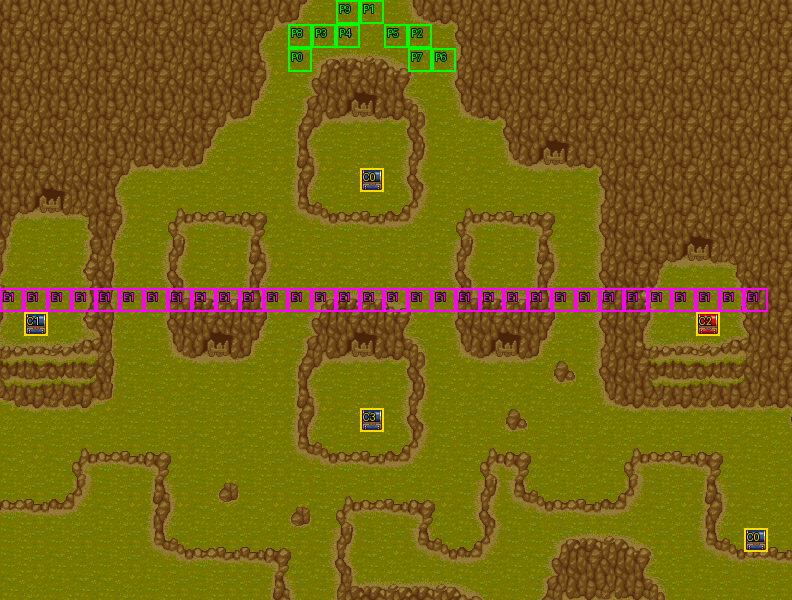

# 第 19 章　蛇口之道

<!-- chapter_docs:header -->
| 項目 | 內容 |
| --- | --- |
| 章號／章節索引 | 19／18 |
| 章名（文字區塊 `0x01`） | 蛇口之道 |
| 勝利條件（`0x02`） | 敵人全滅 |
| 敗北條件（`0x03`） | 蘭迪斯死亡 |
| 戰場 | `MAP18.DAT`／`MAP18.COD`／`M18.DTL`，33×25 格，我方 slot 10 個，部署記錄 68 筆 |
| 文字區塊 | `FDETXT19.TXT`，20 條 |
| 進入處理（`0x60074`[18]） | `fdps_chapter_19_init`（`0x21350`） |
| 行動後檢查（`0x6028c`[18]） | `fdps_chapter_19_post_action`（`0x3ae80`） |
| 勝利處理（`0x60304`[18]） | `fdps_chapter_19_end`（`0x3b0b0`） |
| 地圖資料呼叫的事件處理（`0x601c4`） | slot 26：`fdps_chapter_19_event_lancelot_joins`（`0x38180`）（回合事件）、slot 27：`fdps_chapter_19_event_deploy_wave_6`（`0x381d0`）（格子事件） |
| 過場腳本 | `ICON18.DAT`（開場）、`WIN18.DAT`（勝利） |
| 本章之前的村莊 | `SHOP18.DAT` |
| 光碟 | 第 2 片（音軌見 [CD 音軌](../program_info/cd_audio.md)） |



戰場全圖（第 0 層與同步捲動的圖層）。框線：黃 `C` 寶箱、橘 `B` 埋藏格、青 `R` 重繪格、洋紅 `E` 有處理函式的格子事件格，字母後的數字是事件碼；綠 `P` 是我方 slot 的起始格。

圖由 `python tools/chapter_docs/chapter_facts.py render-maps` 從遊戲檔重畫到 `chapters/maps/`，`verify-maps` 逐 byte 比對版控中的圖。
<!-- /chapter_docs:header -->

## 概要

隊伍往西方去，要經過蛇口之道；本章之前的村莊裡，道具店提醒那裡有陌生人物出沒，神秘商店的人說一個拿著大劍的奇怪老頭也往蛇口之道去了（`0x04`、`0x08`）。開場過場 `ICON18.DAT` 裡，隊伍從地圖上方 (12–18, 0–2) 沿山道往下走，五名暗黑騎士從下方迎上來。蘭迪斯驚覺這裡也有埋伏，尤利安納悶敵人為何知道他們的行蹤，費塔加說「這些教徒真是聰明……我也許明白了」，被問起又改口說只是說說而已，瑪麗安喊敵人來了（`0x09`）；接著整片山道的伏兵現身。

第 6 回合，住在附近的聖騎士蘭斯洛特被門前的打鬥吵醒，聽說隊伍被追殺，自報名號出手相助（`0x0a`）。隊伍一旦往南越過地圖中段的第 12 列，第二批伏兵從左右兩側與上方同時出現，蘭迪斯大喊被包圍了（`0x13`）。

敵人全滅就過關。若在第 20 回合以內清場、而且裘娜還帶著第 15 章贏來的妖刀村雨，那位老人（`？？？？`）再次現身，要和她再比一場（`0x0d`–`0x10`）；贏了他把另一把刀送給裘娜（`0x11`），輸了他嫌她退步（`0x12`）。勝利過場 `WIN18.DAT` 切到地圖 44：魔導王吉歐氣憤「小丫頭」跑去和敵人廝混，凱因巴提議由他去勸，勸不回來就讓她留在敵人之中通風報信；吉歐同意，但仍要設法帶她回來，因為啟封魔神的封印還需要她。

## 加入與離隊

聖騎士蘭斯洛特（角色編號 `0B`）在 `fdps_chapter_19_init`（`0x21350`）一開頭無條件加入名冊，入隊規則與名冊記錄見 [`assets/characters.md` 的「加入」](../assets/characters.md#加入)。他排在名冊第 11 位（slot 10），`MAP18` 只宣告 10 個我方 slot，所以本章開場他不在場上；玩家看到的蘭斯洛特是第 6 回合由 `fdps_chapter_19_event_lancelot_joins`（`0x38180`）部署的波次 1、第 42 筆（陣營 2、LV2，錨點 (22, 7) 附近），可以直接操作。戰鬥結束時名冊寫回依角色編號把這個 LV2 單位蓋進他的名冊記錄；第 6 回合之前就過關則保留入隊時的 LV15 記錄。下一章 `MAP19` 起地圖有 11 個我方 slot，他才以名冊成員上場（[第 20 章](ch20.md)）。

`FDETXT19.TXT` 的 `0x0b` 是蘭斯洛特說「原來你是索爾的朋友……我跟你們一起去，揭發葛斯洛喀教的陰謀」的入隊台詞，沒有任何處理函式或腳本畫它（[刪減與未用](../cut_content/_index.md)）。

本章沒有人離隊。決鬥的挑戰者 `23` 是敵方單位，不會加入。

## 勝敗條件與特殊機制

- **勝利**：行動後檢查 `fdps_chapter_19_post_action`（`0x3ae80`）在決鬥旗標（格子事件旗標元素 `0x11`）未設時呼叫共用的 `fdps_battle_check_default_end_conditions`（`0x3a2e0`）：陣營 0 全部退場就把結束碼寫成 2（過關），與畫面上的「敵人全滅」一致。
- **敗北**：同一個共用判定看單位索引 0（蘭迪斯）是否退場，與畫面上的「蘭迪斯死亡」一致。本章沒有其他敗北條件，蘭斯洛特陣亡不算敗北。
- **畫面與程式的差異**：畫面上的勝敗條件沒有提到決鬥。決鬥期間蘭迪斯被設為退場卻不算敗北；裘娜輸掉決鬥也不是敗北，一樣過關。

**決鬥**：`fdps_chapter_19_post_action`（`0x3ae80`）在共用判定之後，五個條件全部成立時提出挑戰：結束碼剛被寫成 2（也就是清場的那一次行動）、回合數 ≤ 20（有號比較，第 20 回合仍算）、旗標元素 `0x11` 未設、裘娜（單位 4）未退場、`fdps_unit_find_item_slot`（`0x34520`）在她身上找得到 `A5` 妖刀村雨（[`assets/items.md`](../assets/items.md)）。村雨是 [第 15 章](ch15.md) 決鬥的獎品，沒有它就沒有這場決鬥。

1. 以 `fdps_deploy_wave`（`0x23830`）部署波次 2 的挑戰者（`23`，LV18，找離錨點 (13, 24) 最近的空格），畫挑戰 `0x0d`，以挑戰者自己的頭像（`FACE.CEL` 第 `0x23` 筆）開訊息框畫 `0x0e`，`fdps_prompt_two_choice`（`0x17990`）二選一。
2. 選左邊（接受）：畫 `0x10`，單位索引 0–`0x4c` 中除了 4 以外的狀態 byte 整個寫成 1（退場），**把結束碼改回 0**，戰鬥繼續成為裘娜與挑戰者的一對一。選右邊或取消（拒絕）：畫 `0x0f`，結束碼維持 2，直接過關。
3. 兩種回答都設起旗標元素 `0x11`，所以挑戰只提一次。

旗標設起之後，行動後檢查不再呼叫共用判定，改問單位 4 與單位 `0x4d` 有沒有退場：兩人都在場就什麼都不寫，決鬥繼續；挑戰者（`0x4d`）退場就畫 `0x11`，拿掉裘娜身上的 `A5`（還在的話）並以 `fdps_unit_add_item`（`0x25d20`）給她 `A6` 妖刀村正；否則（裘娜退場）畫 `0x12`，刀不換。兩種結果都把結束碼寫成 2（過關）。村正是 [第 24 章](ch24.md) 決鬥的條件。

**挑戰者是寫死的單位索引 `0x4d`**：勝負判定問的是固定的 `0x4d`，不是剛部署的那一筆。10 名隊員、波次 0 的 5 名、波次 5 的 39 名、波次 1 的蘭斯洛特與波次 6 的 22 名合計正好 `0x4d` 名，所以只有波次 1 與波次 6 都已出場時挑戰者才落在 `0x4d`。在第 6 回合之前（蘭斯洛特到場前）或未觸發第 12 列的伏兵就清場並接受決鬥，挑戰者落在較小的索引、被接受時的退場掃描一起設為退場，判定問的 `0x4d` 在陣列之外，戰鬥再也結束不了。這是原版 bug（[`program_info/known_bugs.md`](../program_info/known_bugs.md) 第 12 條，機制見 [`program_info/chapter.md`](../program_info/chapter.md)）；拒絕決鬥則照常過關。

**提出過決鬥就免費全員恢復**：勝利處理 `fdps_chapter_19_end`（`0x3b0b0`）只看旗標元素 `0x11`，它記的是「提出過」而不是「打過」。所以不論接受或拒絕，過關時角色編號 `0B` 以下的每個單位狀態 byte 清 0、HP／MP 補滿——拒絕決鬥的玩家，本章陣亡的隊員也會在付費復活之前免費回到隊上。沒有提出決鬥（超過第 20 回合、裘娜陣亡或沒帶村雨）就沒有這一步。

**第 12 列的伏兵**：(0–31, 12) 整列是格子事件碼 1（slot 27），陣營不是 0 的單位走進任一格就觸發 `fdps_chapter_19_event_deploy_wave_6`（`0x381d0`），敵人踩上去不算。第 12 列以南有多名原地不動的守軍，要打到它們一般得越過這一列。

## 敵人配置

開場的 44 名敵人一半來自地圖、一半來自過場：波次 0 的 5 名暗黑騎士進場即在，開場過場讓它們往上走 3 格，(12, 12)、(11, 13)、(11, 12) 三名主動逼近，(8, 21)、(7, 20) 兩名原地不動；`ICON18.DAT` 的 `DEPLOY_WAVE` 再放上波次 5 的 39 名。

- 北半部（第 7–11 列）：弓箭手、野蠻戰士、暗黑騎士多數主動逼近，從山道兩側夾擊剛進場的隊伍；(15, 7) 寶箱上站著一名原地不動的暗魔導士（第 13 筆），(20, 8) 與 (2, 10)–(2, 11) 另有原地不動的暗魔導士與弓箭手。
- 南半部（第 12 列以南）：(21–24, 15–17) 與 (6–9, 16–18) 兩群以原地不動的暗黑騎士、暗魔導士為主，各夾一名主動的弓箭手；(15, 15) 的暗魔導士、(27, 12)–(27, 13) 的弓箭手與暗魔導士也原地不動；(14, 15)、(16, 15) 的弓箭手與 (11–18, 20) 的 6 名飛兵主動北上。
- 波次 6（第 12 列伏兵）：14 名飛兵分在左 (0–2, 17–19) 與右 (30–32, 17–19)，8 名武鬥家出現在隊伍進場的上方 (13–16, 0–1)，從背後包抄。全部主動逼近。
- 波次 2 的挑戰者只在決鬥條件成立時出現，AI 行為 0。

本章沒有搶寶箱或會離場的敵人。

<!-- chapter_docs:deployments -->
陣營與死亡腳本的意義見 [`resource_info/map.md`](../resource_info/map.md)，AI 行為（低 4 bit）見 [`program_info/map_ai.md`](../program_info/map_ai.md#行為代碼)；錨點是 `MAPnn.COD` 的座標，開場波次放在錨點上，其餘波次依部署方式放在錨點或最近的空格。單位名是全域文字的「角色編號 + 1」條；角色編號 `3C` 以上的敵兵，數值（`ENEMYDAT.DAT`）與種族、職業見 [`assets/enemies.md`](../assets/enemies.md)，以下的見 [`assets/characters.md`](../assets/characters.md)。

我方起始格：slot 0 (12, 2)、slot 1 (15, 0)、slot 2 (17, 1)、slot 3 (13, 1)、slot 4 (14, 1)、slot 5 (16, 1)、slot 6 (18, 2)、slot 7 (17, 2)、slot 8 (12, 1)、slot 9 (14, 0)。

| 波次 | 陣營 | 單位 | 等級 | 數量 |
| ---: | --- | --- | --- | ---: |
| 0 | 敵方 | `4D` 暗黑騎士 | 15 | 5 |
| 1 | 我方 | `0B` 蘭斯洛特 | 2 | 1 |
| 2 | 敵方 | `23` ？？？？ | 18 | 1 |
| 5 | 敵方 | `5E` 弓箭手 | 17 | 14 |
| 5 | 敵方 | `67` 暗魔導士 | 18 | 7 |
| 5 | 敵方 | `50` 野蠻戰士 | 17 | 5 |
| 5 | 敵方 | `60` 飛兵 | 17 | 6 |
| 5 | 敵方 | `4D` 暗黑騎士 | 15 | 7 |
| 6 | 敵方 | `60` 飛兵 | 17 | 14 |
| 6 | 敵方 | `6D` 武鬥家 | 15 | 8 |

### 波次 0

出場：進入戰場時由 `fdps_build_map_unit_array`（`0x22be0`） 部署在錨點上

| # | 陣營 | 單位 | 等級 | AI 行為 | 錨點 | 死亡腳本 |
| ---: | --- | --- | ---: | --- | --- | --- |
| 8 | 敵方 | `4D` 暗黑騎士 | 15 | 0 主動 | (12, 12) | — |
| 9 | 敵方 | `4D` 暗黑騎士 | 15 | 2 原地 | (8, 21) | 掉落 2000 金 |
| 10 | 敵方 | `4D` 暗黑騎士 | 15 | 0 主動 | (11, 13) | — |
| 11 | 敵方 | `4D` 暗黑騎士 | 15 | 0 主動 | (11, 12) | — |
| 12 | 敵方 | `4D` 暗黑騎士 | 15 | 2 原地 | (7, 20) | — |

### 波次 1

出場：第 6 回合我方階段開始前，回合表唯一的一筆（第 6 回合、slot 26、陣營階段 2）呼叫 `fdps_chapter_19_event_lancelot_joins`（`0x38180`）部署（找最近空格）；第 6 回合之前就過關則不出場

| # | 陣營 | 單位 | 等級 | AI 行為 | 錨點 | 死亡腳本 |
| ---: | --- | --- | ---: | --- | --- | --- |
| 42 | 我方 | `0B` 蘭斯洛特 | 2 | 0 主動 | (22, 7) | — |

### 波次 2

出場：清場的那一次行動之後，`fdps_chapter_19_post_action`（`0x3ae80`）在結束碼已是 2、回合數 ≤ 20、格子事件旗標元素 `0x11` 未設、裘娜（單位 4）未退場且帶著 `A5` 妖刀村雨時部署（找最近空格），接著詢問是否接受決鬥；任一條件不成立就不出場

| # | 陣營 | 單位 | 等級 | AI 行為 | 錨點 | 死亡腳本 |
| ---: | --- | --- | ---: | --- | --- | --- |
| 59 | 敵方 | `23` ？？？？ | 18 | 0 主動 | (13, 24) | — |

### 波次 5

出場：開場過場 `ICON18.DAT` `0x0c4` 的 `DEPLOY_WAVE`（找最近空格），由 `fdps_chapter_19_init`（`0x21350`）執行，戰鬥開始前一定出場

| # | 陣營 | 單位 | 等級 | AI 行為 | 錨點 | 死亡腳本 |
| ---: | --- | --- | ---: | --- | --- | --- |
| 0 | 敵方 | `5E` 弓箭手 | 17 | 0 主動 | (9, 10) | — |
| 1 | 敵方 | `5E` 弓箭手 | 17 | 2 原地 | (2, 10) | — |
| 2 | 敵方 | `5E` 弓箭手 | 17 | 0 主動 | (20, 10) | — |
| 3 | 敵方 | `5E` 弓箭手 | 17 | 0 主動 | (21, 8) | — |
| 4 | 敵方 | `5E` 弓箭手 | 17 | 0 主動 | (14, 7) | — |
| 5 | 敵方 | `5E` 弓箭手 | 17 | 0 主動 | (24, 17) | 掉落 `B6` 再生藥 |
| 6 | 敵方 | `5E` 弓箭手 | 17 | 0 主動 | (6, 8) | — |
| 7 | 敵方 | `5E` 弓箭手 | 17 | 0 主動 | (16, 7) | — |
| 13 | 敵方 | `67` 暗魔導士 | 18 | 2 原地 | (15, 7) | — |
| 14 | 敵方 | `67` 暗魔導士 | 18 | 2 原地 | (6, 18) | 掉落 `B8` 魔法水 |
| 15 | 敵方 | `67` 暗魔導士 | 18 | 2 原地 | (23, 17) | — |
| 16 | 敵方 | `50` 野蠻戰士 | 17 | 0 主動 | (20, 7) | — |
| 17 | 敵方 | `50` 野蠻戰士 | 17 | 0 主動 | (21, 7) | — |
| 18 | 敵方 | `50` 野蠻戰士 | 17 | 0 主動 | (6, 7) | — |
| 19 | 敵方 | `50` 野蠻戰士 | 17 | 0 主動 | (7, 7) | 掉落 2000 金 |
| 20 | 敵方 | `50` 野蠻戰士 | 17 | 0 主動 | (7, 8) | — |
| 21 | 敵方 | `60` 飛兵 | 17 | 0 主動 | (11, 20) | — |
| 22 | 敵方 | `60` 飛兵 | 17 | 0 主動 | (13, 20) | — |
| 23 | 敵方 | `60` 飛兵 | 17 | 0 主動 | (12, 20) | — |
| 24 | 敵方 | `60` 飛兵 | 17 | 0 主動 | (17, 20) | — |
| 25 | 敵方 | `60` 飛兵 | 17 | 0 主動 | (18, 20) | 掉落 `B6` 再生藥 |
| 26 | 敵方 | `60` 飛兵 | 17 | 0 主動 | (16, 20) | — |
| 27 | 敵方 | `5E` 弓箭手 | 17 | 2 原地 | (27, 12) | — |
| 28 | 敵方 | `5E` 弓箭手 | 17 | 0 主動 | (7, 18) | — |
| 29 | 敵方 | `5E` 弓箭手 | 17 | 0 主動 | (16, 15) | — |
| 30 | 敵方 | `5E` 弓箭手 | 17 | 0 主動 | (14, 15) | — |
| 31 | 敵方 | `5E` 弓箭手 | 17 | 0 主動 | (9, 11) | — |
| 32 | 敵方 | `5E` 弓箭手 | 17 | 0 主動 | (20, 11) | — |
| 33 | 敵方 | `4D` 暗黑騎士 | 15 | 2 原地 | (23, 16) | — |
| 34 | 敵方 | `4D` 暗黑騎士 | 15 | 2 原地 | (6, 16) | — |
| 35 | 敵方 | `4D` 暗黑騎士 | 15 | 2 原地 | (9, 17) | — |
| 36 | 敵方 | `4D` 暗黑騎士 | 15 | 2 原地 | (24, 15) | — |
| 37 | 敵方 | `4D` 暗黑騎士 | 15 | 2 原地 | (21, 16) | — |
| 38 | 敵方 | `4D` 暗黑騎士 | 15 | 2 原地 | (22, 17) | — |
| 39 | 敵方 | `67` 暗魔導士 | 18 | 2 原地 | (27, 13) | — |
| 40 | 敵方 | `67` 暗魔導士 | 18 | 2 原地 | (20, 8) | — |
| 41 | 敵方 | `67` 暗魔導士 | 18 | 2 原地 | (2, 11) | — |
| 43 | 敵方 | `67` 暗魔導士 | 18 | 2 原地 | (15, 15) | — |
| 44 | 敵方 | `4D` 暗黑騎士 | 15 | 0 主動 | (5, 7) | — |

### 波次 6

出場：陣營不是 0 的單位走進第 12 列 (0–31, 12) 任一格（格子事件碼 1、slot 27）時，`fdps_chapter_19_event_deploy_wave_6`（`0x381d0`）部署（找最近空格），以格子事件旗標元素 `0x10` 閂住只發生一次

| # | 陣營 | 單位 | 等級 | AI 行為 | 錨點 | 死亡腳本 |
| ---: | --- | --- | ---: | --- | --- | --- |
| 45 | 敵方 | `60` 飛兵 | 17 | 0 主動 | (30, 17) | — |
| 46 | 敵方 | `60` 飛兵 | 17 | 0 主動 | (31, 17) | — |
| 47 | 敵方 | `60` 飛兵 | 17 | 0 主動 | (31, 18) | — |
| 48 | 敵方 | `60` 飛兵 | 17 | 0 主動 | (31, 19) | — |
| 49 | 敵方 | `60` 飛兵 | 17 | 0 主動 | (32, 17) | — |
| 50 | 敵方 | `60` 飛兵 | 17 | 0 主動 | (32, 18) | — |
| 51 | 敵方 | `60` 飛兵 | 17 | 0 主動 | (32, 19) | — |
| 52 | 敵方 | `60` 飛兵 | 17 | 0 主動 | (2, 17) | — |
| 53 | 敵方 | `60` 飛兵 | 17 | 0 主動 | (1, 17) | — |
| 54 | 敵方 | `60` 飛兵 | 17 | 0 主動 | (1, 18) | — |
| 55 | 敵方 | `60` 飛兵 | 17 | 0 主動 | (1, 19) | — |
| 56 | 敵方 | `60` 飛兵 | 17 | 0 主動 | (0, 17) | — |
| 57 | 敵方 | `60` 飛兵 | 17 | 0 主動 | (0, 18) | — |
| 58 | 敵方 | `60` 飛兵 | 17 | 0 主動 | (0, 19) | — |
| 60 | 敵方 | `6D` 武鬥家 | 15 | 0 主動 | (13, 0) | — |
| 61 | 敵方 | `6D` 武鬥家 | 15 | 0 主動 | (14, 0) | — |
| 62 | 敵方 | `6D` 武鬥家 | 15 | 0 主動 | (15, 0) | — |
| 63 | 敵方 | `6D` 武鬥家 | 15 | 0 主動 | (16, 0) | — |
| 64 | 敵方 | `6D` 武鬥家 | 15 | 0 主動 | (13, 1) | — |
| 65 | 敵方 | `6D` 武鬥家 | 15 | 0 主動 | (14, 1) | — |
| 66 | 敵方 | `6D` 武鬥家 | 15 | 0 主動 | (15, 1) | — |
| 67 | 敵方 | `6D` 武鬥家 | 15 | 0 主動 | (16, 1) | — |
<!-- /chapter_docs:deployments -->

## 寶物

處理函式發放的只有決鬥的 `A6` 妖刀村正：`fdps_chapter_19_post_action`（`0x3ae80`）在裘娜贏得決鬥時換掉她的 `A5` 妖刀村雨（見「勝敗條件與特殊機制」）。

(15, 7) 寶箱被原地不動的暗魔導士（第 13 筆）站著，要先打倒他才開得到；它與 (31, 22) 共用事件碼 0，炎之魔石兩處只拿得到一次。

<!-- chapter_docs:treasure -->
搜尋的規則（同碼的格共用一筆記錄與一個旗標、背包滿時的交換）見 [`resource_info/map.md`](../resource_info/map.md)。

| 事件碼 | 格 | 內容 |
| ---: | --- | --- |
| 0 | (15, 7) 寶箱、(31, 22) 寶箱 | `D2` 炎之魔石（2 格共用，只拿得到一次） |
| 1 | (1, 13) 寶箱 | `D6` 生命之實 |
| 2 | (29, 13) 寶箱 | `D7` 魔力水晶 |
| 3 | (15, 17) 寶箱 | 3000 金 |

沒有任何格引用、拿不到的記錄：記錄 4（種類 0、內容 `D9`），見 [I04](../cut_content/items.md#i04-章節地圖上沒有格子引用的寶物記錄)。

擊倒後掉落（死亡腳本 opcode 0／1，擊殺者須是存活的我方單位）：

| # | 單位 | 波次 | 掉落 |
| ---: | --- | ---: | --- |
| 5 | `5E` 弓箭手 | 5 | 掉落 `B6` 再生藥 |
| 9 | `4D` 暗黑騎士 | 0 | 掉落 2000 金 |
| 14 | `67` 暗魔導士 | 5 | 掉落 `B8` 魔法水 |
| 19 | `50` 野蠻戰士 | 5 | 掉落 2000 金 |
| 25 | `60` 飛兵 | 5 | 掉落 `B6` 再生藥 |
<!-- /chapter_docs:treasure -->

## 村莊

<!-- chapter_docs:village -->
第 18 章勝利後、本章之前的村莊載入 `SHOP18.DAT`，道具店、武器店、秘密商店的貨見 [`assets/shops.md`](../assets/shops.md)。村莊載入的文字區塊是 `FDETXT19`（章節索引 + 1，`fdps_load_field_chapter_resources`（`0x31540`）），也就是本章的區塊，所以村莊畫面的文字是本章區塊的 `0x04`–`0x08`，全文在下方「對話」。
<!-- /chapter_docs:village -->

## 處理流程

### 進入：`fdps_chapter_19_init`（`0x21350`）

1. `fdps_roster_add_character`（`0x23bc0`）把角色 11 蘭斯洛特加入名冊（第 11 位，本章地圖沒有他的 slot）。
2. `fdps_chapter_state_reset`（`0x22750`）：重建戰場，`fdps_build_map_unit_array`（`0x22be0`）放上 10 名隊員與波次 0 的 5 名暗黑騎士。
3. `fdps_icon_script_run`（`0x21650`）執行開場過場 `ICON18.DAT`：隊伍往下走進山道，5 名暗黑騎士往上走 3 格，對話 `0x09`；視野移到左側，`0x0c4` 部署波次 5（找最近空格），再依序掃過 (10, 17)、(19, 7)、(6, 8)。
4. `fdps_show_chapter_title_card`（`0x20c60`）顯示章名卡。
5. `fdps_map_cursor_move_to_unit`（`0x2da50`）把游標放在單位 0（蘭迪斯，過場結束時在 (11, 6)）。

### 行動後檢查：`fdps_chapter_19_post_action`（`0x3ae80`）

前後兩段依序執行。

- **前段**：旗標元素 `0x11` 未設時只呼叫 `fdps_battle_check_default_end_conditions`（`0x3a2e0`）。已設（決鬥中）時不呼叫共用判定，改以 `fdps_unit_is_retired`（`0x109b0`）問單位 4 與 `0x4d`：兩人都在場就不寫任何東西；挑戰者退場畫 `0x11`、以 `fdps_unit_remove_item`（`0x25cc0`）拿掉 `A5`（找得到的話）、`fdps_unit_add_item`（`0x25d20`）給 `A6`；否則畫 `0x12`。兩種結果都把結束碼寫成 2。
- **後段**：回合數 ≤ 20、結束碼是 2、旗標未設、裘娜未退場、她帶著 `A5` 時：`fdps_deploy_wave`（`0x23830`）部署波次 2，`fdps_draw_text`（`0x1ff60`）全螢幕畫 `0x0d`；`fdps_message_window_open`（`0x205b0`）以頭像 `0x23` 開訊息框、畫 `0x0e`，`fdps_prompt_two_choice`（`0x17990`）二選一，`fdps_message_window_close`（`0x20820`）收起訊息框。回答 0（接受）：畫 `0x10`，以 `fdps_get_unit_record`（`0x2d210`）把單位 0–`0x4c` 除 4 以外的狀態 byte 寫成 1，結束碼寫回 0。其他回答：在已收起的訊息框位置畫 `0x0f`。最後設旗標元素 `0x11`。

順序不能反過來：決鬥讓單位 0 退場，旗標設起後再跑共用判定就會變成敗北。

### 勝利：`fdps_chapter_19_end`（`0x3b0b0`）

這一支不呼叫 `fdps_battle_destroy_remaining_enemies`（`0x39e10`），不清殘敵。

1. 旗標元素 `0x11` 已設（提出過決鬥）時：走過目前的每個單位，角色編號 ≤ `0B`（無號比較）的單位狀態 byte 整個寫成 0、HP 與 MP 補滿到上限。
2. `fdps_roster_write_back_battle_units`（`0x23980`）把戰場上的隊員寫回名冊，LV2 的蘭斯洛特（若已到場）依角色編號蓋進他的名冊記錄。恢復必須在寫回之前，否則退場位元跟著寫進名冊。
3. `fdps_icon_script_run`（`0x21650`）執行勝利過場 `WIN18.DAT`：切到地圖 44，吉歐與凱因巴的對話（`FDETXT45` 的 `0x09`）。
4. `fdps_roster_revive_fallen_members`（`0x39e70`）讓陣亡的隊員復活。
5. 章節索引設為 19，下一段是第 20 章之前的村莊，接著是 [第 20 章](ch20.md)。

### 蘭斯洛特到場：`fdps_chapter_19_event_lancelot_joins`（`0x38180`）

由 `MAP18` 回合表唯一的一筆（第 6 回合、slot 26、陣營階段 2）在第 6 回合的我方階段開始前呼叫。沒有一次性閂鎖，靠回合表只列一次保證只跑一次。

1. `fdps_deploy_wave`（`0x23830`）部署波次 1 的蘭斯洛特（找最近空格）。
2. `fdps_draw_text`（`0x1ff60`）畫 `0x0a`。這一條以「依角色編號找說話者」開頭，要先部署才找得到他的單位與頭像。

### 第 12 列伏兵：`fdps_chapter_19_event_deploy_wave_6`（`0x381d0`）

由第 12 列 (0–31, 12) 的格子事件碼 1（slot 27）呼叫。

1. 格子事件旗標元素 `0x10` 已設就結束；否則以 `fdps_get_unit_record`（`0x2d210`）取觸發者，陣營是 0（敵方）也結束。
2. 隱藏游標，`fdps_deploy_wave`（`0x23830`）部署波次 6 的 22 名（找最近空格）。
3. `fdps_map_cursor_move_to`（`0x2d7c0`）依序移到上緣 (11, 0)、左側 (0, 22)、右側 (32, 22)，每處以 `fdps_render_view_frame`（`0x2beb0`）停 12 幀。
4. 游標改回一般方框，`fdps_draw_text`（`0x1ff60`）畫 `0x13`，設旗標元素 `0x10`。

## 回合事件與格子事件

<!-- chapter_docs:events -->
觸發時機與陣營階段的意義見 [`resource_info/map.md`](../resource_info/map.md)。

| 回合 | 陣營階段 | slot | 處理函式 |
| ---: | --- | ---: | --- |
| 6 | 下一個我方階段前（回合計數 6） | 26 | `fdps_chapter_19_event_lancelot_joins`（`0x38180`） |

| 事件碼 | 格 | 觸發 | slot | 處理函式 |
| ---: | --- | --- | ---: | --- |
| 1 | (0, 12)、(1, 12)、(2, 12)、(3, 12)、(4, 12)、(5, 12)、(6, 12)、(7, 12)、(8, 12)、(9, 12)、(10, 12)、(11, 12)、(12, 12)、(13, 12)、(14, 12)、(15, 12)、(16, 12)、(17, 12)、(18, 12)、(19, 12)、(20, 12)、(21, 12)、(22, 12)、(23, 12)、(24, 12)、(25, 12)、(26, 12)、(27, 12)、(28, 12)、(29, 12)、(30, 12)、(31, 12) | 走進 | 27 | `fdps_chapter_19_event_deploy_wave_6`（`0x381d0`） |
<!-- /chapter_docs:events -->

## 過場腳本

<!-- chapter_docs:scripts -->
格式與每個指令的意義見 [`resource_info/cutscene_script.md`](../resource_info/cutscene_script.md)。`FDETXT19#0xNN` 是本章文字區塊的條目，全文在下方「對話」；切到額外場景之後顯示的文字直接列出（那些區塊的正典是 [`assets/text/scene_text.md`](../assets/text/scene_text.md)）。`u3=我方1` 是地圖單位索引 3 對到我方 slot 1，`u12=MAP02#9` 是 `MAP02.DAT` 第 9 筆部署記錄。

### `ICON18.DAT`

- 開場：`fdps_chapter_19_init`（`0x21350`）
- 231 byte、29 步；起始地圖 18，切換地圖 無，結束於地圖 18

| 偏移 | 指令 | 內容 |
| ---: | --- | --- |
| `0000` | `FADE_OUT` | 淡出，每步 40 ms |
| `0002` | `SET_MUSIC` | 音樂 3（CD 第 4 軌） |
| `0004` | `SCROLL_VIEW` | 捲動視野到格 (8, 3) |
| `0007` | `FADE_IN` | 淡入，每步 40 ms |
| `0009` | `FACE_UNITS` | 轉向後停 25 幀：u0=我方0朝下 |
| `000e` | `WALK_UNITS` | 行走 1 格，每步 4 幀：u0=我方0往下 |
| `0014` | `WALK_UNITS` | 行走 1 格，每步 4 幀：u0=我方0往左、u1=我方1往下、u2=我方2往右、u3=我方3往左、u4=我方4往左、u5=我方5往右、u6=我方6往下、u7=我方7往右、u8=我方8往下、u9=我方9往下 |
| `002c` | `WALK_UNITS` | 行走 1 格，每步 4 幀：u0=我方0往下、u1=我方1往右、u2=我方2往下、u3=我方3往下、u4=我方4往左、u5=我方5往下、u6=我方6往下、u7=我方7往下、u8=我方8往左、u9=我方9往左 |
| `0044` | `WALK_UNITS` | 行走 1 格，每步 4 幀：u0=我方0往下、u1=我方1往右、u2=我方2往下、u3=我方3往下、u4=我方4往左、u5=我方5往右、u6=我方6往下、u7=我方7往下、u8=我方8往下、u9=我方9往左 |
| `005c` | `WALK_UNITS` | 行走 1 格，每步 4 幀：u0=我方0往下、u1=我方1往下、u2=我方2往下、u3=我方3往左、u4=我方4往下、u5=我方5往下、u6=我方6往右、u7=我方7往下、u8=我方8往下、u9=我方9往下 |
| `0074` | `FACE_UNITS` | 轉向後停 1 幀：u6=我方6朝下 |
| `0079` | `WALK_UNITS` | 行走 1 格，每步 4 幀：u0=我方0往下、u1=我方1往下、u3=我方3往下、u4=我方4往下、u8=我方8往下、u9=我方9往下 |
| `0089` | `FACE_UNITS` | 轉向後停 1 幀：u0=我方0朝下、u1=我方1朝下、u2=我方2朝下、u3=我方3朝下、u4=我方4朝下、u5=我方5朝下、u6=我方6朝下、u7=我方7朝下、u8=我方8朝下、u9=我方9朝下 |
| `00a0` | `WALK_UNITS` | 行走 1 格，每步 4 幀：u0=我方0往下 |
| `00a6` | `WALK_UNITS` | 行走 2 格，每步 1 幀：u0=我方0往上 |
| `00ac` | `FACE_UNITS` | 轉向後停 25 幀：u0=我方0朝下 |
| `00b1` | `WALK_UNITS` | 行走 3 格，每步 4 幀：u10=MAP18#8(角色0x4d)往上、u11=MAP18#9(角色0x4d)往上、u12=MAP18#10(角色0x4d)往上、u13=MAP18#11(角色0x4d)往上、u14=MAP18#12(角色0x4d)往上 |
| `00bf` | `DRAW_TEXT` | 顯示文字 FDETXT19#0x09 |
| `00c1` | `SCROLL_VIEW` | 捲動視野到格 (0, 6) |
| `00c4` | `DEPLOY_WAVE` | 部署 MAP18 波次 5（找最近空格）：#0(角色0x5e)、#1(角色0x5e)、#2(角色0x5e)、#3(角色0x5e)、#4(角色0x5e)、#5(角色0x5e)、#6(角色0x5e)、#7(角色0x5e)、#13(角色0x67)、#14(角色0x67)、#15(角色0x67)、#16(角色0x50)、#17(角色0x50)、#18(角色0x50)、#19(角色0x50)、#20(角色0x50)、#21(角色0x60)、#22(角色0x60)、#23(角色0x60)、#24(角色0x60)、#25(角色0x60)、#26(角色0x60)、#27(角色0x5e)、#28(角色0x5e)、#29(角色0x5e)、#30(角色0x5e)、#31(角色0x5e)、#32(角色0x5e)、#33(角色0x4d)、#34(角色0x4d)、#35(角色0x4d)、#36(角色0x4d)、#37(角色0x4d)、#38(角色0x4d)、#39(角色0x67)、#40(角色0x67)、#41(角色0x67)、#43(角色0x67)、#44(角色0x4d) |
| `00c7` | `FACE_UNITS` | 轉向後停 25 幀：u0=我方0朝下 |
| `00cc` | `SCROLL_VIEW` | 捲動視野到格 (10, 17) |
| `00cf` | `FACE_UNITS` | 轉向後停 25 幀：u0=我方0朝下 |
| `00d4` | `SCROLL_VIEW` | 捲動視野到格 (19, 7) |
| `00d7` | `FACE_UNITS` | 轉向後停 25 幀：u0=我方0朝下 |
| `00dc` | `SCROLL_VIEW` | 捲動視野到格 (6, 8) |
| `00df` | `FACE_UNITS` | 轉向後停 25 幀：u0=我方0朝下 |
| `00e4` | `SET_MUSIC` | 停止音樂 |
| `00e6` | `END` | 結束 |

### `WIN18.DAT`

- 勝利：`fdps_chapter_19_end`（`0x3b0b0`）
- 258 byte、48 步；起始地圖 18，切換地圖 44，結束於地圖 44

| 偏移 | 指令 | 內容 |
| ---: | --- | --- |
| `0000` | `FADE_OUT` | 淡出，每步 20 ms |
| `0002` | `SET_MUSIC` | 音樂 4（CD 第 5 軌） |
| `0004` | `SWITCH_MAP` | 切換地圖 → 44（MAP44，文字 FDETXT45） |
| `0006` | `SET_VIEW_TILE` | 視野直接設到格 (2, 0) |
| `0009` | `FACE_UNITS` | 轉向後停 1 幀：u0=MAP44#0(角色0x3f)朝上、u1=MAP44#1(角色0x40)朝上、u2=MAP44#2(角色0x41)朝上、u3=MAP44#3(角色0x42)朝上、u4=MAP44#4(角色0x43)朝上 |
| `0016` | `FADE_IN` | 淡入，每步 40 ms |
| `0018` | `FACE_UNITS` | 轉向後停 75 幀：u0=MAP44#0(角色0x3f)朝上 |
| `001d` | `FACE_UNITS` | 轉向後停 25 幀：u0=MAP44#0(角色0x3f)朝下 |
| `0022` | `FACE_UNITS` | 轉向後停 50 幀：u0=MAP44#0(角色0x3f)朝上 |
| `0027` | `WALK_UNITS` | 行走 1 格，每步 4 幀：u0=MAP44#0(角色0x3f)往左 |
| `002d` | `FACE_UNITS` | 轉向後停 50 幀：u0=MAP44#0(角色0x3f)朝左 |
| `0032` | `WALK_UNITS` | 行走 1 格，每步 4 幀：u0=MAP44#0(角色0x3f)往左 |
| `0038` | `FACE_UNITS` | 轉向後停 75 幀：u0=MAP44#0(角色0x3f)朝左 |
| `003d` | `WALK_UNITS` | 行走 1 格，每步 4 幀：u0=MAP44#0(角色0x3f)往右 |
| `0043` | `FACE_UNITS` | 轉向後停 50 幀：u0=MAP44#0(角色0x3f)朝右 |
| `0048` | `WALK_UNITS` | 行走 1 格，每步 4 幀：u0=MAP44#0(角色0x3f)往右 |
| `004e` | `FACE_UNITS` | 轉向後停 25 幀：u0=MAP44#0(角色0x3f)朝右 |
| `0053` | `FACE_UNITS` | 轉向後停 25 幀：u0=MAP44#0(角色0x3f)朝上 |
| `0058` | `SHAKE_VIEW` | 視野位移 4 步，每步 2 幀：(0,6) (0,12) (0,18) (0,24) |
| `0063` | `SCROLL_VIEW` | 捲動視野到格 (2, 1) |
| `0066` | `SHAKE_VIEW` | 視野位移 4 步，每步 2 幀：(0,6) (0,12) (0,18) (0,24) |
| `0071` | `SCROLL_VIEW` | 捲動視野到格 (2, 2) |
| `0074` | `WALK_UNITS` | 行走 3 格，每步 4 幀：u4=MAP44#4(角色0x43)往上 |
| `007a` | `FACE_UNITS` | 轉向後停 25 幀：u4=MAP44#4(角色0x43)朝上 |
| `007f` | `WALK_UNITS` | 行走 1 格，每步 4 幀：u4=MAP44#4(角色0x43)往上 |
| `0085` | `FACE_UNITS` | 轉向後停 12 幀：u4=MAP44#4(角色0x43)朝右 |
| `008a` | `FACE_UNITS` | 轉向後停 25 幀：u1=MAP44#1(角色0x40)朝下、u2=MAP44#2(角色0x41)朝下、u3=MAP44#3(角色0x42)朝左 |
| `0093` | `FACE_UNITS` | 轉向後停 6 幀：u3=MAP44#3(角色0x42)朝上 |
| `0098` | `FACE_UNITS` | 轉向後停 6 幀：u3=MAP44#3(角色0x42)朝左 |
| `009d` | `FACE_UNITS` | 轉向後停 6 幀：u3=MAP44#3(角色0x42)朝下 |
| `00a2` | `FACE_UNITS` | 轉向後停 25 幀：u3=MAP44#3(角色0x42)朝左 |
| `00a7` | `FACE_UNITS` | 轉向後停 6 幀：u0=MAP44#0(角色0x3f)朝下 |
| `00ac` | `FACE_UNITS` | 轉向後停 25 幀：u1=MAP44#1(角色0x40)朝上、u2=MAP44#2(角色0x41)朝上、u3=MAP44#3(角色0x42)朝上、u4=MAP44#4(角色0x43)朝上 |
| `00b7` | `WALK_UNITS` | 行走 1 格，每步 4 幀：u0=MAP44#0(角色0x3f)往下 |
| `00bd` | `WALK_UNITS` | 行走 2 格，每步 2 幀：u4=MAP44#4(角色0x43)往上 |
| `00c3` | `FACE_UNITS` | 轉向後停 12 幀：u0=MAP44#0(角色0x3f)朝下 |
| `00c8` | `DRAW_TEXT` | 顯示文字 FDETXT45#0x09 「{speaker char=63}可惡！{br}這個小丫頭，{br}真是天不怕地不怕，{page}居然跑去和敵人廝混。{br}真不知道她在想什麼？{br}凱因巴，帶她回來！{br}{speaker char=67}教主，{br}小姐恐怕不會理會您。{br}不如這樣吧！{page}讓屬下和小姐談一談，{br}若小姐肯回來，{br}自然上上大吉。{page}若小姐不肯回來，{br}讓她留在敵人中，{br}為我們通風報信。{page}豈不更容易掌握敵蹤？{br}這是屬下的一點意見，{br}不知教主以為如何？{br}{speaker char=63}嗯～！很好，{br}就這麼辦！{br}不過，{page}最好是能帶她回來。{br}要啟封魔神的封印，{br}還是需要她呀！{br}{speaker char=67}是！{br}屬下知道了。」 |
| `00ca` | `FACE_UNITS` | 轉向後停 12 幀：u4=MAP44#4(角色0x43)朝上 |
| `00cf` | `WALK_UNITS` | 行走 3 格，每步 2 幀：u4=MAP44#4(角色0x43)往下 |
| `00d5` | `FACE_UNITS` | 轉向後停 1 幀：u1=MAP44#1(角色0x40)朝下、u2=MAP44#2(角色0x41)朝下、u3=MAP44#3(角色0x42)朝下 |
| `00de` | `WALK_UNITS` | 行走 3 格，每步 2 幀：u4=MAP44#4(角色0x43)往下 |
| `00e4` | `FACE_UNITS` | 轉向後停 50 幀：u0=MAP44#0(角色0x3f)朝下 |
| `00e9` | `FACE_UNITS` | 轉向後停 12 幀：u1=MAP44#1(角色0x40)朝上、u2=MAP44#2(角色0x41)朝上、u3=MAP44#3(角色0x42)朝上 |
| `00f2` | `FACE_UNITS` | 轉向後停 25 幀：u0=MAP44#0(角色0x3f)朝上 |
| `00f7` | `WALK_UNITS` | 行走 1 格，每步 6 幀：u0=MAP44#0(角色0x3f)往上 |
| `00fd` | `SET_MUSIC` | 停止音樂 |
| `00ff` | `FADE_OUT` | 淡出，每步 40 ms |
| `0101` | `END` | 結束 |
<!-- /chapter_docs:scripts -->

## 對話

<!-- chapter_docs:dialogue -->
`FDETXT19.TXT` 全部 20 條，依條目編號排列。每條先列讀取端（顯示它的腳本步驟、處理函式或死亡腳本），再列全文：【名稱】是換說話者（頭像取自括號裡的角色編號；【地圖單位 n】取執行當下第 n 個地圖單位），每一行是一次換行，▼ 是換頁（等按鍵）。`{subst1}`、`{subst2}`、`{number}` 是執行期代入的名稱與數字（[`resource_info/text.md`](../resource_info/text.md)）。

### `0x00`

永遠不會顯示：章名卡是 `Chapter.saf` 的圖（`fdps_show_chapter_title_card`（`0x20c60`）），存檔面板只畫 `0x01`；本章的處理函式與 `ICON18.DAT`／`WIN18.DAT` 都不畫條目 0，見 [S13a（排除清單）](../cut_content/_index.md#排除清單)。

### `0x01`

讀取端：`fdps_draw_save_slot_panel`（`0x24a40`）

```text
蛇口之道
```

### `0x02`

讀取端：`fdps_battle_show_win_fail_window`（`0x17ca0`）

```text
敵人全滅
```

### `0x03`

讀取端：`fdps_battle_show_win_fail_window`（`0x17ca0`）

```text
蘭迪斯死亡
```

### `0x04`

讀取端：`fdps_village_item_menu`（`0x35860`）

```text
啊？！
你們要往西方去，
要經過蛇口之道？
▼
你們要小心，
那裡有陌生人物出沒。
不知他們要做什麼？
▼
```

### `0x05`

讀取端：`fdps_run_weapon_shop`（`0x35fd0`）

```text
我們武器店的武器，
都是最好的。
▼
```

### `0x06`

讀取端：`fdps_run_bar_shop`（`0x35cc0`）

```text
哎呀～！
▼
你們就是那群，
拯救羅特帝亞的英雄！
快請坐，請坐！
▼
時間很多，
就讓我來幫你算命吧！
▼
你們可知道
星空中充滿了神秘，
在天河星座中，
▼
隱藏著奧妙的數字··
嗯，關鍵握在你手中，
請加油努力吧！
▼
```

### `0x07`

讀取端：`fdps_run_church_screen`（`0x35aa0`）

```text
你要祈禱嗎？
讓我們一起來，
感謝神的恩寵吧
▼
```

### `0x08`

讀取端：`fdps_run_secret_menu`（`0x36210`）

```text
拿著大劍的奇怪老頭？
往蛇口之道去了！
▼
```

### `0x09`

讀取端：`ICON18.DAT` `0x0bf`

```text
【蘭迪斯】（角色 0）
這裡也設有埋伏？！
大家快迎敵！
【尤利安】（角色 6）
它為何知道我們行蹤？
我們已經很小心了呀！
【費塔加】（角色 2）
這些教徒真是聰明﹒﹒
﹒﹒我也許明白了﹒﹒
【蘭迪斯】（角色 0）
你明白什麼了？
【費塔加】（角色 2）
不，沒有什麼﹒﹒
我只是說說而已﹒﹒
【瑪麗安】（角色 5）
小心！
敵人來了！
```

### `0x0a`

讀取端：`fdps_chapter_19_event_lancelot_joins`（`0x38180`）

```text
【蘭斯洛特】（角色 11）
呼～啊啊啊！
你們一早就在我門前，
乒乒乓乓，
▼
吵吵鬧鬧在幹什麼呀？
啊？！是被追殺的？
誰那麼大膽，
▼
敢在我這裡為非作歹？
難道你們不知道，
聖騎士蘭斯洛特的厲害
▼
你讓開！
讓我來擊敗他們！
```

### `0x0b`

永遠不會顯示：蘭斯洛特的入隊台詞；本章處理函式只畫 `0x0a`、`0x0d`–`0x13`，`ICON18.DAT` 只畫 `0x09`，`WIN18.DAT` 在唯一的 `DRAW_TEXT` 之前已切到地圖 44（改讀 `FDETXT45`），也沒有其他腳本切回地圖 18，見 [S4](../cut_content/story.md#s4-寫好卻沒被顯示的對白)。

### `0x0c`

永遠不會顯示：`WIN18.DAT` 切到地圖 44 後畫的是 `FDETXT45` 的 `0x09`（同一段對話，只少一次換頁）；本區塊的這一份沒有任何處理函式或腳本讀取，見 [S13b（排除清單）](../cut_content/_index.md#排除清單)。

### `0x0d`

讀取端：`fdps_chapter_19_post_action`（`0x3ae80`）

```text
【？？？？】（角色 35）
喂！
小妞我們又見面了！
```

### `0x0e`

讀取端：`fdps_chapter_19_post_action`（`0x3ae80`）

```text
有沒有興趣再和我比
試一場？
```

### `0x0f`

讀取端：`fdps_chapter_19_post_action`（`0x3ae80`）

```text
【？？？？】（角色 35）
是嗎？那真是遺憾！
再會吧！
```

### `0x10`

讀取端：`fdps_chapter_19_post_action`（`0x3ae80`）

```text
【裘娜】（角色 3）
又要打架嗎？
我當然奉陪！
【？？？？】（角色 35）
好，很好！
我們就開始吧！
```

### `0x11`

讀取端：`fdps_chapter_19_post_action`（`0x3ae80`）

```text
【？？？？】（角色 35）
不錯！
小妞你又進步了，
▼
這把刀再給你做為獎勵
吧！
```

### `0x12`

讀取端：`fdps_chapter_19_post_action`（`0x3ae80`）

```text
【？？？？】（角色 35）
不行！不行！
小妞你退步了！
真是令我失望！
【裘娜】（角色 3）
·········
```

### `0x13`

讀取端：`fdps_chapter_19_event_deploy_wave_6`（`0x381d0`）

```text
【蘭迪斯】（角色 0）
是伏兵，
我們被包圍了！
```
<!-- /chapter_docs:dialogue -->
