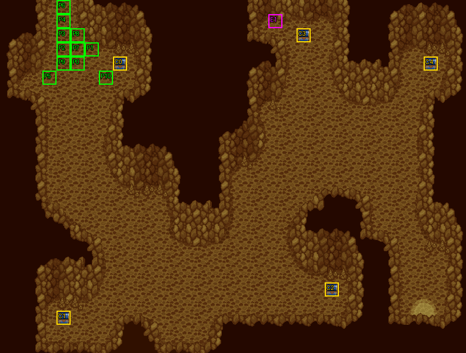

# 第 20 章　迷走之隧道

<!-- chapter_docs:header -->
| 項目 | 內容 |
| --- | --- |
| 章號／章節索引 | 20／19 |
| 章名（文字區塊 `0x01`） | 迷走之隧道 |
| 勝利條件（`0x02`） | 敵人全滅 |
| 敗北條件（`0x03`） | 蘭迪斯死亡／法蓮娜死亡 |
| 戰場 | `MAP19.DAT`／`MAP19.COD`／`M19.DTL`，33×25 格，我方 slot 11 個，部署記錄 55 筆 |
| 文字區塊 | `FDETXT20.TXT`，20 條 |
| 進入處理（`0x60074`[19]） | `fdps_chapter_20_init`（`0x21390`） |
| 行動後檢查（`0x6028c`[19]） | `fdps_chapter_20_post_action`（`0x3b150`） |
| 勝利處理（`0x60304`[19]） | `fdps_chapter_20_end`（`0x3b1d0`） |
| 地圖資料呼叫的事件處理（`0x601c4`） | slot 28：`fdps_chapter_20_event_upgrade_randis_sword`（`0x382f0`）（格子事件） |
| 過場腳本 | `ICON19.DAT`（開場）、`WIN19.DAT`（勝利） |
| 本章之前的村莊 | `SHOP19.DAT` |
| 光碟 | 第 2 片（音軌見 [CD 音軌](../program_info/cd_audio.md)） |



戰場全圖（第 0 層與同步捲動的圖層）。框線：黃 `C` 寶箱、橘 `B` 埋藏格、青 `R` 重繪格、洋紅 `E` 有處理函式的格子事件格，字母後的數字是事件碼；綠 `P` 是我方 slot 的起始格。

圖由 `python tools/chapter_docs/chapter_facts.py render-maps` 從遊戲檔重畫到 `chapters/maps/`，`verify-maps` 逐 byte 比對版控中的圖。
<!-- /chapter_docs:header -->

## 概要

隊伍前往西大陸，要穿過山中的隧道。開場過場 `ICON19.DAT` 先切到另一張場景地圖（地圖 58），是夜裡營火旁的一段：費塔加私下對蘭迪斯說法蓮娜的身份太可疑——在羅特帝亞王宮裡她當著大家的面放走了假冒索爾的首領，索爾事後一字不提，是為了不傷害蘭迪斯才背下縱放原兇的罪名。蘭迪斯不願相信，要求讓他靜一靜，費塔加先回營火。躲在一旁的法蓮娜聽見了，默默離開。接著最年長的女武神凱倫諾特現身，對蘭迪斯說他的命運之輪已經開始轉動，他、法蓮娜、他的母親都在漩渦當中，他需要的是作抉擇；蘭迪斯求她告訴自己該怎麼做，她只說「你以後會知道」便消失，蘭迪斯大喊她什麼都知道卻不肯說。

過場切回隧道（地圖 19）：裘娜問出了隧道是不是就到西之大陸邊境，費塔加說那裡也是葛斯洛喀教的本營，尤利安趁機數落琴琴到處亂跑，兩人拌嘴被布蘭多喝止；裘娜察覺有敵人。棲息在隧道裡的蛇魔使與狼人戰士不准人類通過，蘭迪斯求和不成，蘭斯洛特提醒他們還要趕時間，戰鬥開始。

殲滅敵軍後，勝利過場 `WIN19.DAT` 裡眾人往下方出口走去，法蓮娜落在後面。凱因巴從上方現身，說「小姐記得暗號」，傳達教主要她回去的命令；法蓮娜拒絕，凱因巴便請她旅行時留下聯絡的記號，方便他保護、尋找她。凱因巴離開後蘭迪斯折回來問她是不是有人在說話，法蓮娜推說是自言自語，兩人跟上大家。

## 加入與離隊

本章沒有人入隊，`fdps_chapter_20_init`（`0x21390`）沒有名冊加入呼叫，入隊規則見 [`assets/characters.md` 的「加入」](../assets/characters.md#加入)。隊伍就是 [第 19 章](ch19.md) 結束時的 11 人，`MAP19.DAT` 宣告 11 個我方 slot，是第一張要 11 人的地圖，剛好全部坐滿：slot 0–10 依入隊順序是蘭迪斯、尤利安、亞克、法蓮娜、裘娜、費塔加、布蘭多、蓋亞、琴琴、瑪麗安、蘭斯洛特。第 19 章入隊的蘭斯洛特在本章第一次以名冊記錄上場。

沒有客串或友方單位。開場過場裡的凱倫諾特（角色編號 `7B`）是地圖 58 的波次 1，過場切回地圖 19 時連同那張地圖一起丟棄；勝利過場的凱因巴（`43`）是本章的波次 1，只在戰鬥結束後的過場裡出現。

## 勝敗條件與特殊機制

行動後處理 `fdps_chapter_20_post_action`（`0x3b150`）先依回合數放出一批原地待命的敵人（見「敵人配置」），再呼叫共用判定 `fdps_battle_check_default_end_conditions`（`0x3a2e0`），沒有本章自己的勝敗規則：

- **過關**：陣營 0 沒有未退場的單位就寫結束碼 2。
- **敗北**：本章的章節索引 19 不是共用判定特別處理的 `0x10`、`0x15`，所以只看單位索引 0（蘭迪斯），退場就寫結束碼 1。

**畫面上的「法蓮娜死亡」不是敗北條件。** 敗北條件文字（`0x03`）寫的是「蘭迪斯死亡／法蓮娜死亡」，但程式只檢查單位 0；法蓮娜是 slot 3，她倒下戰鬥照常進行，勝利處理的 `fdps_roster_revive_fallen_members`（`0x39e70`）會讓她復活，勝利過場也照常演出她與凱因巴的對話。

**火神的劍（格子事件）**：格 (19, 1) 是事件碼 1、觸發時機 0（移動中每走進一格就回報），掛的是 slot 28 的 `fdps_chapter_20_event_upgrade_randis_sword`（`0x382f0`）。單位的行動結束後以它的單位索引呼叫一次，三個條件都成立才換劍：

1. 單位索引是 0（蘭迪斯）。
2. 回合數 ≤ 20（含第 20 回合）。
3. 背包裡有 `A0` 灼烈之劍。

成立時火神說「蘭迪斯，你很努力！這把劍給你做獎勵吧！」（`0x13`），移除灼烈之劍、把 `A1` 火光之劍放進背包第一個空格，重算戰鬥數值。只要走過這一格就算，不必停在上面。事件沒有一次性旗標：別人走過、或蘭迪斯沒帶劍時走過都不會關掉它，換過一次之後因為背包裡已經沒有灼烈之劍而不會再觸發；第 21 回合以後就永遠換不到。

換上的火光之劍**沒有裝備**：移除會連同裝備標記一起拿掉，加入時把那一格的旗標整個清成 0。蘭迪斯原本裝備著灼烈之劍的話，換完手上沒有武器，要自己在選單裡重新裝備。

灼烈之劍來自 [第 16 章](ch16.md) 流浪工匠的事件 `fdps_chapter_16_event_wandering_smith_forge`（`0x37cd0`）；火光之劍是 [第 25 章](ch25.md) `fdps_chapter_25_event_upgrade_randis_sword`（`0x38fd0`）換成 `A2` 真炎龍劍的前提。

本章沒有回合限制（回合只限制換劍）。

## 敵人配置

開場就有 54 名敵人：`65` 冰魔導士 8、`50` 野蠻戰士 13、`53` 狼人戰士 10、`4B` 蛇魔使 23，數值見 [`assets/enemies.md`](../assets/enemies.md)。除了第 0 筆之外全部是 AI 行為 2（最佳行動；否則原地休息）：對手進入移動加攻擊的範圍時會上前攻擊，否則不動（[`program_info/map_ai.md`](../program_info/map_ai.md)）。

**逐批放出**：`fdps_chapter_20_post_action`（`0x3b150`）在第 1–17 回合，把單位索引「回合數 + 12」「回合數 + 29」「回合數 + 46」三個單位的 AI 行為低 4 bit 改成 0（最佳行動；否則走向最近的對手），高 4 bit 保留。行動後處理每回合會跑很多次，第一次一定在該回合的敵方階段之前（第 1 回合是我方單位行動結束時，最遲在友軍陣營的狀態結算裡；第 2 回合起是回合數加一後、我方陣營的狀態結算裡），所以第 t 回合放出的三人從第 t 回合的敵方階段開始往我方移動；同一回合後面幾次只是重寫同樣的三個單位。單位索引 11 對到部署記錄 0、依序往後，記錄 40（波次 1）不在陣列裡、後面的記錄往前遞補，換算成部署記錄是：

| 回合 | 放出的部署記錄 |
| ---: | --- |
| 1 | #2 狼人戰士 (29, 4)、#19 蛇魔使 (8, 16)、#36 冰魔導士 (7, 15) |
| 2 | #3 狼人戰士 (25, 8)、#20 蛇魔使 (13, 19)、#37 冰魔導士 (13, 23) |
| 3 | #4 狼人戰士 (11, 19)、#21 狼人戰士 (17, 16)、#38 冰魔導士 (10, 17) |
| 4 | #5 狼人戰士 (5, 12)、#22 狼人戰士 (20, 18)、#39 冰魔導士 (16, 18) |
| 5 | #6 狼人戰士 (21, 11)、#23 野蠻戰士 (14, 18)、#41 蛇魔使 (10, 14) |
| 6 | #7 狼人戰士 (19, 8)、#24 野蠻戰士 (7, 22)、#42 蛇魔使 (19, 16) |
| 7 | #8 冰魔導士 (17, 14)、#25 野蠻戰士 (21, 5)、#43 蛇魔使 (23, 8) |
| 8 | #9 冰魔導士 (22, 7)、#26 野蠻戰士 (4, 13)、#44 蛇魔使 (26, 10) |
| 9 | #10 冰魔導士 (27, 8)、#27 野蠻戰士 (19, 21)、#45 蛇魔使 (28, 12) |
| 10 | #11 冰魔導士 (29, 5)、#28 野蠻戰士 (19, 10)、#46 蛇魔使 (27, 13) |
| 11 | #12 蛇魔使 (24, 10)、#29 野蠻戰士 (19, 14)、#47 蛇魔使 (6, 13) |
| 12 | #13 蛇魔使 (18, 18)、#30 野蠻戰士 (27, 15)、#48 蛇魔使 (29, 17) |
| 13 | #14 蛇魔使 (3, 11)、#31 野蠻戰士 (23, 12)、#49 蛇魔使 (30, 19) |
| 14 | #15 蛇魔使 (23, 20)、#32 野蠻戰士 (10, 21)、#50 蛇魔使 (5, 23) |
| 15 | #16 蛇魔使 (21, 21)、#33 野蠻戰士 (14, 21)、#51 蛇魔使 (18, 12) |
| 16 | #17 蛇魔使 (12, 21)、#34 野蠻戰士 (9, 14)、#52 蛇魔使 (21, 9) |
| 17 | #18 蛇魔使 (8, 19)、#35 野蠻戰士 (25, 12)、#53 蛇魔使 (17, 20) |

三組的起點刻意跳過單位索引 11、12，最後一組只到 63：**#1 狼人戰士 (22, 3)** 與 **#54 蛇魔使 (20, 12)** 永遠不會被放出，整場都是原地待命。#1 就站在古代砲寶箱 (21, 2) 與換劍格 (19, 1) 旁邊。

**搶寶箱的狼人**：#0 狼人戰士（左下 (4, 22)，站在 2000 金的寶箱上）是 AI 行為 5，開場就會行動，不在放出名單裡。對手在範圍內時它先攻擊，否則朝事件碼 3 的寶箱——地圖上方 (21, 2) 的 `AC` 古代砲——移動。走到寶箱上就把古代砲放進自己背包、死亡腳本改成掉落古代砲（原本是 `DE` 解毒劑）、設起寶箱的旗標（玩家不能再開），並改成行為 7，走向目的地 (29, 12)，到達就退場，古代砲跟著消失。在它到達之前擊倒它，古代砲會掉給擊殺者。玩家先開了那個寶箱的話，它改成像行為 0 一樣走向最近的對手。規則見 [`program_info/map_ai.md`](../program_info/map_ai.md) 的「行為 5：搶寶箱」。

波次 1 的凱因巴只在勝利過場出場，戰鬥中不存在，不影響「敵人全滅」。

<!-- chapter_docs:deployments -->
陣營與死亡腳本的意義見 [`resource_info/map.md`](../resource_info/map.md)，AI 行為（低 4 bit）見 [`program_info/map_ai.md`](../program_info/map_ai.md#行為代碼)；錨點是 `MAPnn.COD` 的座標，開場波次放在錨點上，其餘波次依部署方式放在錨點或最近的空格。單位名是全域文字的「角色編號 + 1」條；角色編號 `3C` 以上的敵兵，數值（`ENEMYDAT.DAT`）與種族、職業見 [`assets/enemies.md`](../assets/enemies.md)，以下的見 [`assets/characters.md`](../assets/characters.md)。

我方起始格：slot 0 (5, 4)、slot 1 (6, 3)、slot 2 (4, 3)、slot 3 (4, 2)、slot 4 (4, 1)、slot 5 (3, 5)、slot 6 (4, 0)、slot 7 (5, 3)、slot 8 (5, 2)、slot 9 (4, 4)、slot 10 (7, 5)。

| 波次 | 陣營 | 單位 | 等級 | 數量 |
| ---: | --- | --- | --- | ---: |
| 0 | 敵方 | `53` 狼人戰士 | 17 | 10 |
| 0 | 敵方 | `65` 冰魔導士 | 28 | 8 |
| 0 | 敵方 | `4B` 蛇魔使 | 17 | 23 |
| 0 | 敵方 | `50` 野蠻戰士 | 18 | 13 |
| 1 | 敵方 | `43` 凱因巴 | 17 | 1 |

### 波次 0

出場：進入戰場時由 `fdps_build_map_unit_array`（`0x22be0`） 部署在錨點上

| # | 陣營 | 單位 | 等級 | AI 行為 | 錨點 | 死亡腳本 |
| ---: | --- | --- | ---: | --- | --- | --- |
| 0 | 敵方 | `53` 狼人戰士 | 17 | 5 搶寶箱：碼 3 | (4, 22) | 掉落 `DE` 解毒劑 |
| 1 | 敵方 | `53` 狼人戰士 | 17 | 2 原地 | (22, 3) | — |
| 2 | 敵方 | `53` 狼人戰士 | 17 | 2 原地 | (29, 4) | — |
| 3 | 敵方 | `53` 狼人戰士 | 17 | 2 原地 | (25, 8) | — |
| 4 | 敵方 | `53` 狼人戰士 | 17 | 2 原地 | (11, 19) | — |
| 5 | 敵方 | `53` 狼人戰士 | 17 | 2 原地 | (5, 12) | — |
| 6 | 敵方 | `53` 狼人戰士 | 17 | 2 原地 | (21, 11) | — |
| 7 | 敵方 | `53` 狼人戰士 | 17 | 2 原地 | (19, 8) | — |
| 8 | 敵方 | `65` 冰魔導士 | 28 | 2 原地 | (17, 14) | — |
| 9 | 敵方 | `65` 冰魔導士 | 28 | 2 原地 | (22, 7) | — |
| 10 | 敵方 | `65` 冰魔導士 | 28 | 2 原地 | (27, 8) | — |
| 11 | 敵方 | `65` 冰魔導士 | 28 | 2 原地 | (29, 5) | — |
| 12 | 敵方 | `4B` 蛇魔使 | 17 | 2 原地 | (24, 10) | — |
| 13 | 敵方 | `4B` 蛇魔使 | 17 | 2 原地 | (18, 18) | — |
| 14 | 敵方 | `4B` 蛇魔使 | 17 | 2 原地 | (3, 11) | — |
| 15 | 敵方 | `4B` 蛇魔使 | 17 | 2 原地 | (23, 20) | 掉落 `DF` 退麻劑 |
| 16 | 敵方 | `4B` 蛇魔使 | 17 | 2 原地 | (21, 21) | — |
| 17 | 敵方 | `4B` 蛇魔使 | 17 | 2 原地 | (12, 21) | — |
| 18 | 敵方 | `4B` 蛇魔使 | 17 | 2 原地 | (8, 19) | — |
| 19 | 敵方 | `4B` 蛇魔使 | 17 | 2 原地 | (8, 16) | — |
| 20 | 敵方 | `4B` 蛇魔使 | 17 | 2 原地 | (13, 19) | — |
| 21 | 敵方 | `53` 狼人戰士 | 17 | 2 原地 | (17, 16) | — |
| 22 | 敵方 | `53` 狼人戰士 | 17 | 2 原地 | (20, 18) | — |
| 23 | 敵方 | `50` 野蠻戰士 | 18 | 2 原地 | (14, 18) | — |
| 24 | 敵方 | `50` 野蠻戰士 | 18 | 2 原地 | (7, 22) | — |
| 25 | 敵方 | `50` 野蠻戰士 | 18 | 2 原地 | (21, 5) | — |
| 26 | 敵方 | `50` 野蠻戰士 | 18 | 2 原地 | (4, 13) | — |
| 27 | 敵方 | `50` 野蠻戰士 | 18 | 2 原地 | (19, 21) | — |
| 28 | 敵方 | `50` 野蠻戰士 | 18 | 2 原地 | (19, 10) | — |
| 29 | 敵方 | `50` 野蠻戰士 | 18 | 2 原地 | (19, 14) | — |
| 30 | 敵方 | `50` 野蠻戰士 | 18 | 2 原地 | (27, 15) | — |
| 31 | 敵方 | `50` 野蠻戰士 | 18 | 2 原地 | (23, 12) | — |
| 32 | 敵方 | `50` 野蠻戰士 | 18 | 2 原地 | (10, 21) | — |
| 33 | 敵方 | `50` 野蠻戰士 | 18 | 2 原地 | (14, 21) | — |
| 34 | 敵方 | `50` 野蠻戰士 | 18 | 2 原地 | (9, 14) | — |
| 35 | 敵方 | `50` 野蠻戰士 | 18 | 2 原地 | (25, 12) | — |
| 36 | 敵方 | `65` 冰魔導士 | 28 | 2 原地 | (7, 15) | — |
| 37 | 敵方 | `65` 冰魔導士 | 28 | 2 原地 | (13, 23) | — |
| 38 | 敵方 | `65` 冰魔導士 | 28 | 2 原地 | (10, 17) | — |
| 39 | 敵方 | `65` 冰魔導士 | 28 | 2 原地 | (16, 18) | — |
| 41 | 敵方 | `4B` 蛇魔使 | 17 | 2 原地 | (10, 14) | 掉落 `DF` 退麻劑 |
| 42 | 敵方 | `4B` 蛇魔使 | 17 | 2 原地 | (19, 16) | — |
| 43 | 敵方 | `4B` 蛇魔使 | 17 | 2 原地 | (23, 8) | — |
| 44 | 敵方 | `4B` 蛇魔使 | 17 | 2 原地 | (26, 10) | — |
| 45 | 敵方 | `4B` 蛇魔使 | 17 | 2 原地 | (28, 12) | — |
| 46 | 敵方 | `4B` 蛇魔使 | 17 | 2 原地 | (27, 13) | — |
| 47 | 敵方 | `4B` 蛇魔使 | 17 | 2 原地 | (6, 13) | — |
| 48 | 敵方 | `4B` 蛇魔使 | 17 | 2 原地 | (29, 17) | — |
| 49 | 敵方 | `4B` 蛇魔使 | 17 | 2 原地 | (30, 19) | — |
| 50 | 敵方 | `4B` 蛇魔使 | 17 | 2 原地 | (5, 23) | — |
| 51 | 敵方 | `4B` 蛇魔使 | 17 | 2 原地 | (18, 12) | — |
| 52 | 敵方 | `4B` 蛇魔使 | 17 | 2 原地 | (21, 9) | — |
| 53 | 敵方 | `4B` 蛇魔使 | 17 | 2 原地 | (17, 20) | — |
| 54 | 敵方 | `4B` 蛇魔使 | 17 | 2 原地 | (20, 12) | — |

### 波次 1

出場：勝利過場 `WIN19.DAT` `0x054` 的 `DEPLOY_WAVE`（錨點原位），由 `fdps_chapter_20_end`（`0x3b1d0`）在清場與寫回名冊之後執行；凱因巴只在過場裡與法蓮娜交談，不參戰

| # | 陣營 | 單位 | 等級 | AI 行為 | 錨點 | 死亡腳本 |
| ---: | --- | --- | ---: | --- | --- | --- |
| 40 | 敵方 | `43` 凱因巴 | 17 | 2 原地 | (28, 6) | — |
<!-- /chapter_docs:deployments -->

## 寶物

- **火光之劍**：格 (19, 1) 的格子事件，蘭迪斯帶著灼烈之劍在第 20 回合以內走過，灼烈之劍換成 `A1` 火光之劍（未裝備），見「勝敗條件與特殊機制」。
- **古代砲**：(21, 2) 的寶箱是 #0 狼人戰士要搶的目標；被它開走之後只能在它走到 (29, 12) 退場之前擊倒它取回。
- 開場時 #0 狼人戰士站在 (4, 22) 的 2000 金寶箱上、#15 蛇魔使站在 (23, 20) 的雷之水晶寶箱上；前者開場就離開，後者第 14 回合才會被放出。

<!-- chapter_docs:treasure -->
搜尋的規則（同碼的格共用一筆記錄與一個旗標、背包滿時的交換）見 [`resource_info/map.md`](../resource_info/map.md)。

| 事件碼 | 格 | 內容 |
| ---: | --- | --- |
| 0 | (8, 4) 寶箱 | `DE` 解毒劑 |
| 1 | (4, 22) 寶箱 | 2000 金 |
| 2 | (23, 20) 寶箱 | `CE` 雷之水晶 |
| 3 | (21, 2) 寶箱 | `AC` 古代砲 |
| 4 | (30, 4) 寶箱 | `D6` 生命之實 |

擊倒後掉落（死亡腳本 opcode 0／1，擊殺者須是存活的我方單位）：

| # | 單位 | 波次 | 掉落 |
| ---: | --- | ---: | --- |
| 0 | `53` 狼人戰士 | 0 | 掉落 `DE` 解毒劑 |
| 15 | `4B` 蛇魔使 | 0 | 掉落 `DF` 退麻劑 |
| 41 | `4B` 蛇魔使 | 0 | 掉落 `DF` 退麻劑 |
<!-- /chapter_docs:treasure -->

## 村莊

<!-- chapter_docs:village -->
第 19 章勝利後、本章之前的村莊載入 `SHOP19.DAT`，道具店、武器店、秘密商店的貨見 [`assets/shops.md`](../assets/shops.md)。村莊載入的文字區塊是 `FDETXT20`（章節索引 + 1，`fdps_load_field_chapter_resources`（`0x31540`）），也就是本章的區塊，所以村莊畫面的文字是本章區塊的 `0x04`–`0x08`，全文在下方「對話」。
<!-- /chapter_docs:village -->

## 處理流程

### 進入：`fdps_chapter_20_init`（`0x21390`）

1. `fdps_chapter_state_reset`（`0x22750`）：以地圖 19 重建戰場，放上 11 名隊員與波次 0 的 54 筆，共 65 個單位；我方 slot 0 的起始格是 (5, 4)。
2. `fdps_icon_script_run`（`0x21650`）執行開場過場 `ICON19.DAT`：
   - `SWITCH_MAP` 切到地圖 58（文字 `FDETXT59`），那張地圖的波次 0 是蘭迪斯、法蓮娜、費塔加；
   - 費塔加與蘭迪斯的對話（`FDETXT59` `0x09`），費塔加走開退場，蘭迪斯的獨白（`0x0a`）；
   - 視野往下移，法蓮娜「……」（`0x0b`），退場、播放 `ICON0079.SAF`、復歸後往左走開；
   - 視野移回，`DEPLOY_WAVE` 以錨點原位部署地圖 58 的波次 1 凱倫諾特，與蘭迪斯對話（`0x0c`），她退場後蘭迪斯大喊（`0x0d`）；
   - 停止音樂，`SWITCH_MAP` 切回地圖 19 重建戰場——前面對地圖 58 單位做的退場、復歸、部署都隨那張地圖一起丟棄；
   - 換音樂，顯示隧道裡的對話 `0x0e` 與蛇魔使的對話 `0x12` 後結束。
3. `fdps_show_chapter_title_card`（`0x20c60`）顯示章名卡（排在開場過場之後）。
4. `fdps_map_cursor_move_to_unit`（`0x2da50`）把游標放在單位 0（蘭迪斯），也就是 (5, 4)——過場的移動都發生在第二次切換地圖之前，不影響地圖 19 的站位。

本處理函式不寫任何單位，也不設章節索引。

### 行動後檢查：`fdps_chapter_20_post_action`（`0x3b150`）

1. 回合數 ≤ 17 時，呼叫三次 `fdps_object_set_field34_low_nibble_range`（`0x36b60`），範圍分別是單位索引「回合數 + 12」「回合數 + 29」「回合數 + 46」各一個，把 AI 行為的低 4 bit 改成 0、保留高 4 bit。比較是帶號的，第 17 回合仍會放出、第 18 回合起不再動作。
2. 不論回合，呼叫 `fdps_battle_check_default_end_conditions`（`0x3a2e0`）：結束碼已非 0 就不動；否則先寫 2，場上有未退場的陣營 0 單位就改回 0，最後單位 0 退場就寫 1。

### 勝利：`fdps_chapter_20_end`（`0x3b1d0`）

1. `fdps_battle_destroy_remaining_enemies`（`0x39e10`）清掉陣營 0 的殘兵。本章靠全滅過關，這一步通常沒有對象。
2. `fdps_roster_write_back_battle_units`（`0x23980`）把戰場上的隊員寫回名冊。
3. `fdps_icon_script_run`（`0x21650`）執行勝利過場 `WIN19.DAT`：
   - 復歸 slot 1–9、讓 slot 10（蘭斯洛特）退場，把 10 人放到 (24–28, 8–12) 一帶；
   - `DEPLOY_WAVE` 以錨點原位部署本章的波次 1（凱因巴，部署記錄 40）；
   - 蘭迪斯說「我們出去吧！」（`0x0f`），眾人往下走、陸續退場，只剩 slot 3 法蓮娜；
   - 凱因巴往下走到法蓮娜面前對話（`0x10`），再走回去；
   - 復歸蘭迪斯，他走回來與法蓮娜對話（`0x11`），兩人往下走出退場，停止音樂後結束。
4. `fdps_roster_revive_fallen_members`（`0x39e70`）讓陣亡的隊員復活。
5. 章節索引設為 20，下一段是第 21 章之前的村莊，接著是 [第 21 章](ch21.md)。

本處理函式沒有條件、不發任何物品。

### 換劍：`fdps_chapter_20_event_upgrade_randis_sword`（`0x382f0`）

由格 (19, 1) 的格子事件（slot 28，觸發時機 0）在單位行動結束後以該單位索引呼叫。

1. 先無條件以 `fdps_unit_find_item_slot`（`0x34520`）找這個單位背包裡的 `A0` 灼烈之劍。
2. 單位索引不是 0、回合數大於 20、或找不到劍（-1），就什麼都不做。
3. `fdps_draw_text`（`0x1ff60`）在畫面左上角顯示 `0x13`（火神的台詞）。
4. `fdps_unit_remove_item`（`0x25cc0`）移除那一格的灼烈之劍，後面的物品往前補。
5. `fdps_unit_add_item`（`0x25d20`）把 `A1` 火光之劍放進單位 0 的第一個空格，旗標清成 0（未裝備）。
6. `fdps_unit_recompute_combat_stats`（`0x24d70`）重算戰鬥數值。

不寫任何觸發旗標；灼烈之劍被換掉就是這個事件不再成立的原因。

## 回合事件與格子事件

<!-- chapter_docs:events -->
觸發時機與陣營階段的意義見 [`resource_info/map.md`](../resource_info/map.md)。

本章沒有回合事件。

| 事件碼 | 格 | 觸發 | slot | 處理函式 |
| ---: | --- | --- | ---: | --- |
| 1 | (19, 1) | 走進 | 28 | `fdps_chapter_20_event_upgrade_randis_sword`（`0x382f0`） |
<!-- /chapter_docs:events -->

## 過場腳本

<!-- chapter_docs:scripts -->
格式與每個指令的意義見 [`resource_info/cutscene_script.md`](../resource_info/cutscene_script.md)。`FDETXT20#0xNN` 是本章文字區塊的條目，全文在下方「對話」；切到額外場景之後顯示的文字直接列出（那些區塊的正典是 [`assets/text/scene_text.md`](../assets/text/scene_text.md)）。`u3=我方1` 是地圖單位索引 3 對到我方 slot 1，`u12=MAP02#9` 是 `MAP02.DAT` 第 9 筆部署記錄。

### `ICON19.DAT`

- 開場：`fdps_chapter_20_init`（`0x21390`）
- 210 byte、48 步；起始地圖 19，切換地圖 58 → 19，結束於地圖 19

| 偏移 | 指令 | 內容 |
| ---: | --- | --- |
| `0000` | `FADE_OUT` | 淡出，每步 40 ms |
| `0002` | `SET_MUSIC` | 音樂 8（CD 第 9 軌） |
| `0004` | `SWITCH_MAP` | 切換地圖 → 58（MAP58，文字 FDETXT59） |
| `0006` | `SET_VIEW_TILE` | 視野直接設到格 (0, 1) |
| `0009` | `FACE_UNITS` | 轉向後停 1 幀：u0=MAP58#0(角色0x00)朝左 |
| `000e` | `FACE_UNITS` | 轉向後停 1 幀：u2=MAP58#2(角色0x02)朝右 |
| `0013` | `FADE_IN` | 淡入，每步 40 ms |
| `0015` | `FACE_UNITS` | 轉向後停 10 幀：u0=MAP58#0(角色0x00)朝左 |
| `001a` | `FACE_UNITS` | 轉向後停 10 幀：u2=MAP58#2(角色0x02)朝右 |
| `001f` | `DRAW_TEXT` | 顯示文字 FDETXT59#0x09 「{speaker char=0}不！{br}我不會相信的！{br}你走吧！{br}{speaker char=2}不，你聽我說，{br}蘭迪斯，{br}我又何嘗願意相信？{page}法蓮娜身份太可疑了；{br}還記得嗎？{br}在羅特帝亞王宮中，{page}法蓮娜在大家的面前，{br}放走假冒索爾的首領。{br}索爾事後一字不提。{page}以他嫉惡如仇的個性，{br}居然按捺得下性子，{br}你不覺得反常嗎？{page}唉～！﹒﹒﹒﹒{br}蘭迪斯，{br}那是因為你呀！{page}索爾不揭穿法蓮娜，{br}還放過假冒他的原兇，{br}不追查背後主使者。{page}為了什麼？{br}是為了怕傷害到你！{br}唉～為了你，{page}他必須背負著，{br}縱放原兇的罪名；{br}還有臣民的不滿，{page}來自各界的懷疑，{br}他的犧牲太大了﹒﹒{br}{speaker char=0}我﹒﹒﹒﹒{br}我對不起大家～！{br}這件事，可﹒﹒﹒{page}可不可以讓我靜一靜，{br}讓我再想一想？{br}求求你～！{br}{speaker char=2}唉～也好！{br}你先想一想，{br}再把結果告訴我們。{page}我先回去營火那裡了，{br}離開太久，{br}別人會懷疑﹒﹒﹒﹒」 |
| `0021` | `WALK_UNITS` | 行走 1 格，每步 4 幀：u2=MAP58#2(角色0x02)往上 |
| `0027` | `WALK_UNITS` | 行走 4 格，每步 4 幀：u2=MAP58#2(角色0x02)往左 |
| `002d` | `RETIRE_UNIT` | 退場 u2=MAP58#2(角色0x02) |
| `002f` | `FACE_UNITS` | 轉向後停 15 幀：u0=MAP58#0(角色0x00)朝下 |
| `0034` | `DRAW_TEXT` | 顯示文字 FDETXT59#0x0a 「{speaker char=0}我﹒﹒對不起大家！{br}我﹒﹒我該怎麼辦？{br}法蓮娜不會背叛我，{page}她的笑容那麼天真，{br}她是個好女孩！{br}真的！我相信！」 |
| `0036` | `SHAKE_VIEW` | 視野位移 12 步，每步 1 幀：(0,6) (0,12) (0,18) (0,24) (0,30) (0,36) (0,42) (0,48) (0,54) (0,60) (0,66) (0,72) |
| `0051` | `SET_VIEW_TILE` | 視野直接設到格 (0, 4) |
| `0054` | `FACE_UNITS` | 轉向後停 10 幀：u1=MAP58#1(角色0x01)朝下 |
| `0059` | `DRAW_TEXT` | 顯示文字 FDETXT59#0x0b 「{speaker char=1}﹒﹒﹒﹒﹒﹒﹒」 |
| `005b` | `FACE_UNITS` | 轉向後停 15 幀：u1=MAP58#1(角色0x01)朝下 |
| `0060` | `RETIRE_UNIT` | 退場 u1=MAP58#1(角色0x01) |
| `0062` | `PLAY_SAF` | 播放動畫 ICON0079.SAF |
| `0064` | `REVIVE_UNIT` | 復歸 u1=MAP58#1(角色0x01)（清狀態） |
| `0066` | `FACE_UNITS` | 轉向後停 30 幀：u1=MAP58#1(角色0x01)朝下 |
| `006b` | `WALK_UNITS` | 行走 2 格，每步 2 幀：u1=MAP58#1(角色0x01)往左 |
| `0071` | `RETIRE_UNIT` | 退場 u2=MAP58#2(角色0x02) |
| `0073` | `SHAKE_VIEW` | 視野位移 12 步，每步 1 幀：(0,-6) (0,-12) (0,-18) (0,-24) (0,-30) (0,-36) (0,-42) (0,-48) (0,-54) (0,-60) (0,-66) (0,-72) |
| `008e` | `SET_VIEW_TILE` | 視野直接設到格 (0, 1) |
| `0091` | `FACE_UNITS` | 轉向後停 10 幀：u0=MAP58#0(角色0x00)朝右 |
| `0096` | `WALK_UNITS` | 行走 2 格，每步 4 幀：u0=MAP58#0(角色0x00)往右 |
| `009c` | `FACE_UNITS` | 轉向後停 10 幀：u0=MAP58#0(角色0x00)朝左 |
| `00a1` | `WALK_UNITS` | 行走 1 格，每步 4 幀：u0=MAP58#0(角色0x00)往左 |
| `00a7` | `DEPLOY_WAVE` | 部署 MAP58 波次 1（錨點原位）：#3(角色0x7b) |
| `00aa` | `FACE_UNITS` | 轉向後停 15 幀：u0=MAP58#0(角色0x00)朝上 |
| `00af` | `DRAW_TEXT` | 顯示文字 FDETXT59#0x0c 「{speaker char=123}﹒﹒﹒可憐的孩子，{br}難過嗎？﹒﹒﹒﹒{br}{speaker char=0}﹒﹒﹒﹒{br}我認識妳嗎？{br}﹒﹒﹒﹒{page}妳和以前的女武神，{br}看起來並不太一樣。{br}{speaker char=123}不錯！{br}我是最年長的女武神，{br}我叫凱倫諾特。{page}﹒﹒﹒孩子，{br}你很喜歡法蓮娜，{br}是嗎？{br}{speaker char=0}我﹒﹒﹒{br}我相信法蓮娜，{br}不是這種人﹒﹒﹒{br}{speaker char=123}但是，{br}萬一她真的背叛你，{br}你就無法接受了。{page}所以你既不願去追查，{br}也不願面對事實，{br}很苦惱，是不是？{br}{speaker char=0}我﹒﹒﹒{br}我﹒﹒﹒{br}{speaker char=123}孩子，{br}只要身是為人類，{br}就逃避不開命運糾纏{page}這是永遠擺脫不了的。{br}孩子，{br}你需要的是作抉擇。{page}如果你所擁有的，{br}是平凡的命運，{br}那也就算了。{page}可是你的命運，{br}卻比尋常人，{br}還要沉重得多﹒﹒﹒{page}孩子，你看到了嗎？{br}你的命運之輪，{br}已經開始轉動了。{page}看！你﹑法蓮娜﹑{br}你的母親﹑所有的人，{br}都在漩渦當中﹒﹒﹒{br}{speaker char=0}﹒﹒﹒﹒﹒{br}告訴我怎麼作，{br}好嗎？{page}我已經不想再失去，{br}身邊最親愛的人了！{br}{speaker char=123}﹒﹒﹒﹒﹒{br}抱歉，我不能﹒﹒﹒{br}你以後會知道﹒﹒﹒{page}唉～可憐的孩子，{br}可憐的孩子﹒﹒﹒﹒」 |
| `00b1` | `RETIRE_UNIT` | 退場 u3=MAP58#3(角色0x7b) |
| `00b3` | `WALK_UNITS` | 行走 1 格，每步 1 幀：u0=MAP58#0(角色0x00)往上 |
| `00b9` | `DRAW_TEXT` | 顯示文字 FDETXT59#0x0d 「{speaker char=0}妳騙我～！！{br}妳什麼都不告訴我！{br}可惡～！{page}其實妳什麼都知道的，{br}對不對！﹒﹒{br}﹒﹒﹒﹒﹒﹒」 |
| `00bb` | `SET_MUSIC` | 停止音樂 |
| `00bd` | `FADE_OUT` | 淡出，每步 40 ms |
| `00bf` | `SWITCH_MAP` | 切換地圖 → 19（MAP19，文字 FDETXT20） |
| `00c1` | `SET_VIEW_TILE` | 視野直接設到格 (0, 0) |
| `00c4` | `FACE_UNITS` | 轉向後停 1 幀：u0=我方0朝下 |
| `00c9` | `FADE_IN` | 淡入，每步 40 ms |
| `00cb` | `SET_MUSIC` | 音樂 9（CD 第 10 軌） |
| `00cd` | `DRAW_TEXT` | 顯示文字 FDETXT20#0x0e |
| `00cf` | `DRAW_TEXT` | 顯示文字 FDETXT20#0x12 |
| `00d1` | `END` | 結束 |

### `WIN19.DAT`

- 勝利：`fdps_chapter_20_end`（`0x3b1d0`）
- 641 byte、90 步；起始地圖 19，切換地圖 無，結束於地圖 19

| 偏移 | 指令 | 內容 |
| ---: | --- | --- |
| `0000` | `FADE_OUT` | 淡出，每步 20 ms |
| `0002` | `SET_VIEW_TILE` | 視野直接設到格 (19, 7) |
| `0005` | `REVIVE_UNIT` | 復歸 u1=我方1（清狀態） |
| `0007` | `REVIVE_UNIT` | 復歸 u2=我方2（清狀態） |
| `0009` | `REVIVE_UNIT` | 復歸 u3=我方3（清狀態） |
| `000b` | `REVIVE_UNIT` | 復歸 u4=我方4（清狀態） |
| `000d` | `REVIVE_UNIT` | 復歸 u5=我方5（清狀態） |
| `000f` | `REVIVE_UNIT` | 復歸 u6=我方6（清狀態） |
| `0011` | `REVIVE_UNIT` | 復歸 u7=我方7（清狀態） |
| `0013` | `REVIVE_UNIT` | 復歸 u8=我方8（清狀態） |
| `0015` | `REVIVE_UNIT` | 復歸 u9=我方9（清狀態） |
| `0017` | `RETIRE_UNIT` | 退場 u10=我方10 |
| `0019` | `PLACE_UNIT` | 放置 u0=我方0 到 (26, 9)，朝下 |
| `001e` | `PLACE_UNIT` | 放置 u1=我方1 到 (24, 10)，朝右 |
| `0023` | `PLACE_UNIT` | 放置 u2=我方2 到 (25, 11)，朝上 |
| `0028` | `PLACE_UNIT` | 放置 u3=我方3 到 (25, 8)，朝下 |
| `002d` | `PLACE_UNIT` | 放置 u4=我方4 到 (25, 12)，朝上 |
| `0032` | `PLACE_UNIT` | 放置 u5=我方5 到 (26, 11)，朝上 |
| `0037` | `PLACE_UNIT` | 放置 u6=我方6 到 (28, 9)，朝左 |
| `003c` | `PLACE_UNIT` | 放置 u7=我方7 到 (28, 10)，朝左 |
| `0041` | `PLACE_UNIT` | 放置 u8=我方8 到 (26, 8)，朝下 |
| `0046` | `PLACE_UNIT` | 放置 u9=我方9 到 (27, 11)，朝上 |
| `004b` | `FACE_UNITS` | 轉向後停 1 幀：u0=我方0朝下 |
| `0050` | `SET_MUSIC` | 音樂 10（CD 第 11 軌） |
| `0052` | `FADE_IN` | 淡入，每步 40 ms |
| `0054` | `DEPLOY_WAVE` | 部署 MAP19 波次 1（錨點原位）：#40(角色0x43) |
| `0057` | `FACE_UNITS` | 轉向後停 50 幀：u0=我方0朝下 |
| `005c` | `FACE_UNITS` | 轉向後停 25 幀：u0=我方0朝左 |
| `0061` | `FACE_UNITS` | 轉向後停 25 幀：u0=我方0朝右 |
| `0066` | `FACE_UNITS` | 轉向後停 50 幀：u0=我方0朝下 |
| `006b` | `DRAW_TEXT` | 顯示文字 FDETXT20#0x0f |
| `006d` | `FACE_UNITS` | 轉向後停 25 幀：u0=我方0朝下 |
| `0072` | `WALK_UNITS` | 行走 1 格，每步 4 幀：u0=我方0往下、u1=我方1往右、u2=我方2往右、u3=我方3往右、u4=我方4往右、u5=我方5往右、u6=我方6往左、u7=我方7往上、u8=我方8往右、u9=我方9往下 |
| `008a` | `WALK_UNITS` | 行走 1 格，每步 4 幀：u0=我方0往右、u1=我方1往右、u2=我方2往右、u3=我方3往右、u4=我方4往右、u5=我方5往右、u6=我方6往下、u7=我方7往左、u8=我方8往下、u9=我方9往下 |
| `00a2` | `WALK_UNITS` | 行走 1 格，每步 4 幀：u0=我方0往下、u1=我方1往右、u2=我方2往右、u3=我方3往下、u4=我方4往下、u5=我方5往下、u6=我方6往右、u7=我方7往下、u8=我方8往下、u9=我方9往下 |
| `00ba` | `WALK_UNITS` | 行走 1 格，每步 4 幀：u0=我方0往右、u1=我方1往右、u2=我方2往下、u3=我方3往下、u4=我方4往下、u5=我方5往下、u6=我方6往下、u7=我方7往右、u8=我方8往下、u9=我方9往下 |
| `00d2` | `WALK_UNITS` | 行走 1 格，每步 4 幀：u0=我方0往下、u1=我方1往下、u2=我方2往下、u3=我方3往下、u4=我方4往下、u5=我方5往下、u6=我方6往下、u7=我方7往下、u8=我方8往下、u9=我方9往右 |
| `00ea` | `WALK_UNITS` | 行走 1 格，每步 4 幀：u0=我方0往下、u1=我方1往下、u2=我方2往下、u3=我方3往下、u4=我方4往右、u5=我方5往下、u6=我方6往下、u7=我方7往下、u8=我方8往下、u9=我方9往下 |
| `0102` | `WALK_UNITS` | 行走 1 格，每步 4 幀：u0=我方0往下、u1=我方1往下、u2=我方2往下、u3=我方3往下、u4=我方4往下、u5=我方5往下、u6=我方6往下、u7=我方7往下、u8=我方8往下、u9=我方9往右 |
| `011a` | `WALK_UNITS` | 行走 1 格，每步 4 幀：u0=我方0往下、u1=我方1往下、u2=我方2往下、u3=我方3往下、u4=我方4往右、u5=我方5往右、u6=我方6往下、u7=我方7往下、u8=我方8往下、u9=我方9往下 |
| `0132` | `SCROLL_VIEW` | 捲動視野到格 (19, 15) |
| `0135` | `WALK_UNITS` | 行走 1 格，每步 4 幀：u0=我方0往下、u1=我方1往下、u2=我方2往右、u3=我方3往下、u4=我方4往下、u5=我方5往下、u6=我方6往下、u7=我方7往下、u8=我方8往右、u9=我方9往下 |
| `014d` | `WALK_UNITS` | 行走 1 格，每步 4 幀：u0=我方0往右、u1=我方1往下、u2=我方2往下、u3=我方3往右、u4=我方4往下、u5=我方5往下、u6=我方6往右、u7=我方7往下、u8=我方8往下、u9=我方9往下 |
| `0165` | `FACE_UNITS` | 轉向後停 1 幀：u3=我方3朝下 |
| `016a` | `WALK_UNITS` | 行走 1 格，每步 4 幀：u0=我方0往下、u1=我方1往右、u2=我方2往下、u4=我方4往下、u5=我方5往右、u6=我方6往下、u7=我方7往右、u8=我方8往右、u9=我方9往下 |
| `0180` | `WALK_UNITS` | 行走 1 格，每步 4 幀：u0=我方0往下、u1=我方1往下、u2=我方2往右、u4=我方4往下、u5=我方5往下、u6=我方6往下、u7=我方7往下、u8=我方8往下、u9=我方9往下 |
| `0196` | `RETIRE_UNIT` | 退場 u9=我方9 |
| `0198` | `WALK_UNITS` | 行走 1 格，每步 4 幀：u0=我方0往下、u1=我方1往下、u2=我方2往下、u4=我方4往下、u5=我方5往下、u6=我方6往右、u7=我方7往下、u8=我方8往下 |
| `01ac` | `RETIRE_UNIT` | 退場 u4=我方4 |
| `01ae` | `WALK_UNITS` | 行走 1 格，每步 4 幀：u0=我方0往下、u1=我方1往右、u2=我方2往下、u5=我方5往下、u6=我方6往下、u7=我方7往右、u8=我方8往下 |
| `01c0` | `RETIRE_UNIT` | 退場 u5=我方5 |
| `01c2` | `WALK_UNITS` | 行走 1 格，每步 4 幀：u0=我方0往下、u1=我方1往下、u2=我方2往下、u6=我方6往下、u7=我方7往下、u8=我方8往下 |
| `01d2` | `RETIRE_UNIT` | 退場 u0=我方0 |
| `01d4` | `RETIRE_UNIT` | 退場 u2=我方2 |
| `01d6` | `WALK_UNITS` | 行走 1 格，每步 4 幀：u1=我方1往下、u6=我方6往下、u7=我方7往下、u8=我方8往下 |
| `01e2` | `RETIRE_UNIT` | 退場 u6=我方6 |
| `01e4` | `RETIRE_UNIT` | 退場 u8=我方8 |
| `01e6` | `WALK_UNITS` | 行走 1 格，每步 4 幀：u1=我方1往下、u7=我方7往下 |
| `01ee` | `RETIRE_UNIT` | 退場 u1=我方1 |
| `01f0` | `RETIRE_UNIT` | 退場 u7=我方7 |
| `01f2` | `FACE_UNITS` | 轉向後停 50 幀：u3=我方3朝下 |
| `01f7` | `FACE_UNITS` | 轉向後停 6 幀：u3=我方3朝上 |
| `01fc` | `SCROLL_VIEW` | 捲動視野到格 (19, 9) |
| `01ff` | `WALK_UNITS` | 行走 7 格，每步 4 幀：u65往下 |
| `0205` | `FACE_UNITS` | 轉向後停 25 幀：u3=我方3朝右 |
| `020a` | `DRAW_TEXT` | 顯示文字 FDETXT20#0x10 |
| `020c` | `FACE_UNITS` | 轉向後停 12 幀：u3=我方3朝下 |
| `0211` | `WALK_UNITS` | 行走 7 格，每步 1 幀：u65往上 |
| `0217` | `SCROLL_VIEW` | 捲動視野到格 (19, 15) |
| `021a` | `REVIVE_UNIT` | 復歸 u0=我方0（清狀態） |
| `021c` | `FACE_UNITS` | 轉向後停 25 幀：u0=我方0朝上 |
| `0221` | `FACE_UNITS` | 轉向後停 12 幀：u0=我方0朝左 |
| `0226` | `FACE_UNITS` | 轉向後停 12 幀：u0=我方0朝右 |
| `022b` | `FACE_UNITS` | 轉向後停 25 幀：u0=我方0朝上 |
| `0230` | `WALK_UNITS` | 行走 4 格，每步 4 幀：u0=我方0往上 |
| `0236` | `SCROLL_VIEW` | 捲動視野到格 (19, 13) |
| `0239` | `WALK_UNITS` | 行走 1 格，每步 4 幀：u0=我方0往上、u3=我方3往下 |
| `0241` | `FACE_UNITS` | 轉向後停 6 幀：u0=我方0朝左、u3=我方3朝右 |
| `0248` | `DRAW_TEXT` | 顯示文字 FDETXT20#0x11 |
| `024a` | `FACE_UNITS` | 轉向後停 25 幀：u0=我方0朝左、u3=我方3朝右 |
| `0251` | `WALK_UNITS` | 行走 1 格，每步 4 幀：u0=我方0往下、u3=我方3往右 |
| `0259` | `WALK_UNITS` | 行走 1 格，每步 4 幀：u0=我方0往下、u3=我方3往下 |
| `0261` | `WALK_UNITS` | 行走 1 格，每步 4 幀：u0=我方0往右、u3=我方3往下 |
| `0269` | `FACE_UNITS` | 轉向後停 12 幀：u0=我方0朝左、u3=我方3朝右 |
| `0270` | `WALK_UNITS` | 行走 3 格，每步 4 幀：u0=我方0往下、u3=我方3往下 |
| `0278` | `RETIRE_UNIT` | 退場 u0=我方0 |
| `027a` | `RETIRE_UNIT` | 退場 u3=我方3 |
| `027c` | `SET_MUSIC` | 停止音樂 |
| `027e` | `FADE_OUT` | 淡出，每步 40 ms |
| `0280` | `END` | 結束 |
<!-- /chapter_docs:scripts -->

## 對話

`0x09`–`0x0d` 是開場過場台詞的複本：過場在地圖 58 上畫的是 `FDETXT59` 的同號條目。其中 `0x0c` 與實際顯示的版本字句不同：本章區塊寫「做抉擇」「告訴我怎麼做」「我不想再失去」，實際顯示的 `FDETXT59` 寫「作抉擇」「告訴我怎麼作」「我已經不想再失去」，蘭迪斯最後那段的斷行與換頁也不同。

<!-- chapter_docs:dialogue -->
`FDETXT20.TXT` 全部 20 條，依條目編號排列。每條先列讀取端（顯示它的腳本步驟、處理函式或死亡腳本），再列全文：【名稱】是換說話者（頭像取自括號裡的角色編號；【地圖單位 n】取執行當下第 n 個地圖單位），每一行是一次換行，▼ 是換頁（等按鍵）。`{subst1}`、`{subst2}`、`{number}` 是執行期代入的名稱與數字（[`resource_info/text.md`](../resource_info/text.md)）。

### `0x00`

永遠不會顯示：「第廿章」沒有讀取端：章名卡由 `fdps_show_chapter_title_card`（`0x20c60`）畫 `CHAPTER.SAF` 的圖，本章的處理函式與 `ICON19.DAT`／`WIN19.DAT` 都不畫這一條，見 [S13a（排除清單）](../cut_content/_index.md#排除清單)。

### `0x01`

讀取端：`fdps_draw_save_slot_panel`（`0x24a40`）

```text
迷走之隧道
```

### `0x02`

讀取端：`fdps_battle_show_win_fail_window`（`0x17ca0`）

```text
敵人全滅
```

### `0x03`

讀取端：`fdps_battle_show_win_fail_window`（`0x17ca0`）

```text
蘭迪斯死亡
法蓮娜死亡
```

### `0x04`

讀取端：`fdps_village_item_menu`（`0x35860`）

```text
你們要去西大陸？
沒錯，
這裡是有一條捷徑。
▼
前面那座山裡，
聽說有條隧道，
可以通到那裡。
▼
可是，
很少人會走那條路，
隧道裡實在很危險。
▼
```

### `0x05`

讀取端：`fdps_run_weapon_shop`（`0x35fd0`）

```text
你好。
▼
```

### `0x06`

讀取端：`fdps_run_bar_shop`（`0x35cc0`）

```text
嗯，我想起了一件事，
這年頭只聽過，
依山而住會被土埋，
▼
可沒聽過會餓死的··
你們覺得呢？
呵呵呵，有趣吧！
▼
```

### `0x07`

讀取端：`fdps_run_church_screen`（`0x35aa0`）

```text
····
▼
```

### `0x08`

讀取端：`fdps_run_secret_menu`（`0x36210`）

```text
知道嗎？
火神做的武器雖然都非常強，
但是只給看的上眼的人！
▼
```

### `0x09`

永遠不會顯示：開場過場的複本：`ICON19.DAT` 在 `0x004` 切到地圖 58 後才畫字，畫的是 `FDETXT59` 的 0x09（內容相同）；本章區塊的這一條沒有讀取端，見 [S13b（排除清單）](../cut_content/_index.md#排除清單)。

### `0x0a`

永遠不會顯示：開場過場在地圖 58 畫的是 `FDETXT59` 的 0x0a 複本（內容相同），本章區塊的這一條沒有讀取端，見 [S13b（排除清單）](../cut_content/_index.md#排除清單)。

### `0x0b`

永遠不會顯示：開場過場在地圖 58 畫的是 `FDETXT59` 的 0x0b 複本（內容相同），本章區塊的這一條沒有讀取端，見 [S13b（排除清單）](../cut_content/_index.md#排除清單)。

### `0x0c`

永遠不會顯示：凱倫諾特那段的另一個版本：開場過場在地圖 58 畫的是 `FDETXT59` 的 0x0c（「作抉擇」「怎麼作」「我已經不想」三處用字不同，蘭迪斯最後那段的斷行與換頁也不同），本章區塊的這一條沒有讀取端，見 [S13b（排除清單）](../cut_content/_index.md#排除清單)。

### `0x0d`

永遠不會顯示：開場過場在地圖 58 畫的是 `FDETXT59` 的 0x0d 複本（內容相同），本章區塊的這一條沒有讀取端，見 [S13b（排除清單）](../cut_content/_index.md#排除清單)。

### `0x0e`

讀取端：`ICON19.DAT` `0x0cd`

```text
【裘娜】（角色 3）
出了這個隧道，
就是西之大陸邊境嗎？
【費塔加】（角色 2）
對！
也是葛斯洛喀教的本營
▼
我們要步步為營，
隨時提高警覺，
防範敵人意外偷襲。
【尤利安】（角色 6）
說得沒錯！
這是一定的。
▼
信仰狂熱的教徒，
什麼事都幹得出來的。
我們一定要小心！
▼
尤其是妳，
琴琴，
別再到處亂跑了，
▼
每次找妳，
都不知道在哪裡，
▼
妳知不知道，
這樣是很危險的！
【琴琴】（角色 7）
呸～咧！
才不要你管咧！
▼
說話就說話，
扯到我作什麼？
【布蘭多】（角色 8）
好了！別吵了！
你們是冤家對頭嗎？
一講話就吵架！
【裘娜】（角色 3）
噓﹒﹒﹒﹒﹒
▼
有敵人！
注意！
```

### `0x0f`

讀取端：`WIN19.DAT` `0x06b`

```text
【蘭迪斯】（角色 0）
我們出去吧！
```

### `0x10`

讀取端：`WIN19.DAT` `0x20a`

```text
【凱因巴】（角色 67）
果然！
小姐記得暗號！
【法蓮娜】（角色 1）
﹒﹒﹒你﹒﹒
你回來做什麼？
【凱因巴】（角色 67）
小姐，
是教主的命令，
教主希望妳回去﹒﹒
【法蓮娜】（角色 1）
我﹒﹒我不回去！
【凱因巴】（角色 67）
是，教主吩咐過屬下，
不可為難小姐﹒﹒﹒﹒
▼
但是小姐的安危，
卻是屬下的責任，
並非屬下強迫小姐。
▼
屬下希望小姐旅行時，
能留下聯絡的記號。
▼
若屬下要保護小姐﹑
尋找小姐，
也能方便一些﹒﹒﹒
```

### `0x11`

讀取端：`WIN19.DAT` `0x248`

```text
【蘭迪斯】（角色 0）
法蓮娜，妳沒事吧？
我好像聽到，
有人說話的聲音。
【法蓮娜】（角色 1）
啊？是我在自言自語，
我們走吧！
別讓大家等久了。
```

### `0x12`

讀取端：`ICON19.DAT` `0x0cf`

```text
【蛇魔使】（角色 75）
你們是誰，
這裡是我們棲息之地，
誰都不可以通過的！
【蘭迪斯】（角色 0）
我們只是要從這裡經過
而已，
不會打擾你們的！
【蛇魔使】（角色 75）
不成！不成！
怎麼可以讓人類大大
方方的通過這裡！
【亞克】（角色 4）
我看用講的他們也不會
聽，強行突破算了！
【蘭迪斯】（角色 0）
拜託你們不要逼我動武
！
【蛇魔使】（角色 75）
他們說要用武力耶！
【狼人戰士】（角色 83）
用武力耶！
哈哈哈哈！
【蘭斯洛特】（角色 11）
看樣子是說不通了！
蘭迪斯，
我們還要趕時間﹒﹒
【蘭迪斯】（角色 0）
那就對不起各位了！
【裘娜】（角色 3）
好耶！打架打架！
```

### `0x13`

讀取端：`fdps_chapter_20_event_upgrade_randis_sword`（`0x382f0`）

```text
【火神】（角色 127）
蘭迪斯，你很努力！
這把劍給你做獎勵吧！
```
<!-- /chapter_docs:dialogue -->
