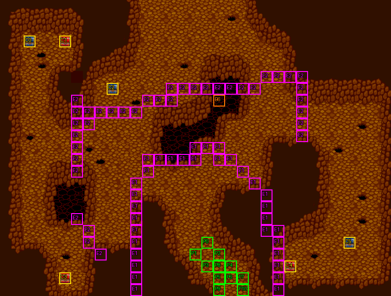

# 第 21 章　地底神殿

<!-- chapter_docs:header -->
| 項目 | 內容 |
| --- | --- |
| 章號／章節索引 | 21／20 |
| 章名（文字區塊 `0x01`） | 地底神殿 |
| 勝利條件（`0x02`） | 敵人全滅 |
| 敗北條件（`0x03`） | 蘭迪斯死亡 |
| 戰場 | `MAP20.DAT`／`MAP20.COD`／`M20.DTL`，33×25 格，我方 slot 11 個，部署記錄 70 筆 |
| 文字區塊 | `FDETXT21.TXT`，22 條 |
| 進入處理（`0x60074`[20]） | `fdps_chapter_21_init`（`0x213d0`） |
| 行動後檢查（`0x6028c`[20]） | `fdps_chapter_21_post_action`（`0x3b210`） |
| 勝利處理（`0x60304`[20]） | `fdps_chapter_21_end`（`0x3b230`） |
| 地圖資料呼叫的事件處理（`0x601c4`） | slot 29：`fdps_chapter_21_event_deploy_wave_1`（`0x38380`）（格子事件）、slot 30：`fdps_chapter_21_event_deploy_wave_2`（`0x38400`）（格子事件） |
| 過場腳本 | `ICON20.DAT`（開場）、`WIN20.DAT`（勝利） |
| 本章之前的村莊 | `SHOP20.DAT` |
| 光碟 | 第 2 片（音軌見 [CD 音軌](../program_info/cd_audio.md)） |



戰場全圖（第 0 層與同步捲動的圖層）。框線：黃 `C` 寶箱、橘 `B` 埋藏格、青 `R` 重繪格、洋紅 `E` 有處理函式的格子事件格，字母後的數字是事件碼；綠 `P` 是我方 slot 的起始格。

圖由 `python tools/chapter_docs/chapter_facts.py render-maps` 從遊戲檔重畫到 `chapters/maps/`，`verify-maps` 逐 byte 比對版控中的圖。
<!-- /chapter_docs:header -->

## 概要

隊伍進入地底神殿（地圖 20）。開場過場 `ICON20.DAT` 裡，蘭迪斯從下方的入口 (19, 24) 走進洞窟中央，四下張望，其餘十人隨後跟進；神殿深處的黑暗祭司喝道「你們是誰？竟然敢擅闖聖地！絕不能讓你們活著！」，戰鬥開始。洞窟裡四處都是按兵不動的蛇魔使、狼人戰士、冰魔導士與狂戰士。隊伍一離開入口一帶，教團的正規軍就從背後的入口湧進來，暗魔導士說「那些就是教團指定要的人！」，蘭斯洛特提醒蘭迪斯小心；再往各處敵陣推進，第二批正規軍又從入口出現，瑪麗安喊著「我們被包圍了！」，洞裡所有的敵人同時發動攻勢。

殲滅敵軍後，勝利過場 `WIN20.DAT` 切到另一張場景地圖（地圖 51）：費塔加認出這裡是葛斯洛喀教祭祀用的神殿，正面就是他們的主神平衡之神。蘭迪斯上前調查神像，一陣光芒之後倒地不起；法蓮娜衝上去呼喊，裘娜驚叫「死了！」，尤利安說蘭迪斯的生命之火已經熄滅、救不活了。這時凱因巴出現，說他有救蘭迪斯的方法，條件是讓他帶走一個人——教主命他迎接「小姐」回去，要法蓮娜救回蘭迪斯之後跟他回教團。法蓮娜答應了。凱因巴說出救法：蘭迪斯的魂魄已渡過死河，只有到巫湯婆婆那裡取得失魂藥，喝下後魂魄暫時離開軀殼，才能渡過死河奪回蘭迪斯的魂魄；失敗的話，他們的魂魄也會留在死神那裡。凱因巴消失後，法蓮娜說「走！去找巫湯婆婆，我們要拿到失魂藥！」，接到 [第 22 章](ch22.md)。

## 加入與離隊

本章沒有人入隊，也沒有人離隊（`fdps_chapter_21_init`（`0x213d0`）沒有名冊加入呼叫），入隊規則見 [`assets/characters.md` 的「加入」](../assets/characters.md#加入)。隊伍就是 [第 20 章](ch20.md) 結束時的十一人，`MAP20.DAT` 宣告 11 個我方 slot，剛好全部坐滿：slot 0–10 依入隊順序是蘭迪斯、尤利安、亞克、法蓮娜、裘娜、費塔加、布蘭多、蓋亞、琴琴、瑪麗安、蘭斯洛特。戰鬥中沒有客串或友方單位。

勝利過場裡蘭迪斯倒下只是演出：過場在切到地圖 51 之後重建的單位陣列上讓他退場，而 `fdps_chapter_21_end`（`0x3b230`）把戰場寫回名冊排在過場之前、陣亡復活排在之後，名冊上的蘭迪斯不受影響。凱因巴（`43`）只在勝利過場裡出現。

## 勝敗條件與特殊機制

行動後處理 `fdps_chapter_21_post_action`（`0x3b210`）只呼叫共用判定 `fdps_battle_check_default_end_conditions`（`0x3a2e0`），沒有本章自己的規則：

- **過關**：陣營 0 沒有未退場的單位就寫結束碼 2。
- **敗北**：本章的章節索引 20 不是共用判定特別處理的 `0x10`、`0x15`，所以看的是單位索引 0（蘭迪斯），退場就寫結束碼 1；敗北寫在過關之後，同一次行動兩者都成立時是敗北。

畫面上的「敵人全滅」「蘭迪斯死亡」與程式一致，但「全滅」指的是**當下場上**的敵人：共用判定不知道還有沒觸發的援軍，兩波援軍都還沒出現時把場上的敵人清空也一樣過關。

**兩波伏兵**：地圖在兩圈格子上掛了格子事件，觸發時機都是 0（單位移動中每走進一格就回報）：

- 事件碼 1 的 33 格圍在我方起始區域外緣（左 x = 11、右 x = 22–23、上 y = 12–13），走出入口一帶就會踩到，呼叫 `fdps_chapter_21_event_deploy_wave_1`（`0x38380`）部署波次 1。
- 事件碼 2 的 37 格是更外一圈，靠近左側、左下、上方與中上的敵陣（x = 6–11、y = 6–8、x = 25 一帶），呼叫 `fdps_chapter_21_event_deploy_wave_2`（`0x38400`）部署波次 2，並把全場敵人改為主動進攻。

兩支都只接受陣營 2（我方）的單位：比對是「陣營等於 2」而不是「陣營不為 0」，敵兵走過這些格時處理函式被呼叫但什麼都不做。各自用事件旗標陣列的一格當一次性旗標（`0x10`、`0x11`），重開本章時清除、存檔時一起保存，所以兩波各只來一次、互不影響。依 [`resource_info/map.md`](../resource_info/map.md) 的格子事件規則，一次移動經過多個觸發格時只有最後一格的事件會執行，所以一口氣從內圈走到外圈時，先來的是波次 2，波次 1 要等之後再有我方單位踩到內圈。

**全面進攻**：開場的 38 名敵兵裡，黑暗祭司以外的 37 名 AI 行為是 2（原地，對手進入攻擊範圍才出手、不會為了接近而移動），黑暗祭司是 8（完全不行動，[`program_info/map_ai.md`](../program_info/map_ai.md) 的「行為代碼」）。波次 2 觸發時，`fdps_chapter_21_event_deploy_wave_2`（`0x38400`）把單位索引 11–80 的 AI 行為低 4 bit 一律改成 0（主動進攻），黑暗祭司也在內；兩波援軍本身記錄的 AI 就是 0。範圍的兩端是寫死的常數，11 是 11 名隊員之後的第一個敵兵、80 是三批敵兵（38 + 16 + 16）全部到齊時的最後一個索引。

本章沒有回合限制，也沒有回合事件。

## 敵人配置

開場（波次 0）的 38 人分成幾群守在洞窟各處，全部原地待命：

- **最上方祭壇**：黑暗祭司（LV17，行為 8）在 (15, 0)，前面是三名 LV16 狂戰士、三名蛇魔使與兩名 LV28 冰魔導士。
- **左側**：(9–11, 7–9) 一群蛇魔使、狼人戰士與冰魔導士，最左邊 (2–3, 5–7) 另有四名蛇魔使。
- **左下**：(5–7, 19–21) 蛇魔使、狼人戰士與冰魔導士。
- **右下**：(28–31, 18–21) 蛇魔使、狼人戰士與冰魔導士。
- **中上**：(21–24, 8–10) 六名蛇魔使。

兩波援軍都是教團正規軍，各 16 人（衛兵 4、武鬥家 4、弓箭手 3、騎士 4、暗魔導士 1），錨點都在我方起始的入口一帶 (15–20, 20–24)，以找最近空格的方式放置，也就是從隊伍背後出現。波次 1 的暗魔導士 LV18，波次 2 的 LV17。本章沒有搶寶箱或會自行離場的敵人。

<!-- chapter_docs:deployments -->
陣營與死亡腳本的意義見 [`resource_info/map.md`](../resource_info/map.md)，AI 行為（低 4 bit）見 [`program_info/map_ai.md`](../program_info/map_ai.md#行為代碼)；錨點是 `MAPnn.COD` 的座標，開場波次放在錨點上，其餘波次依部署方式放在錨點或最近的空格。單位名是全域文字的「角色編號 + 1」條；角色編號 `3C` 以上的敵兵，數值（`ENEMYDAT.DAT`）與種族、職業見 [`assets/enemies.md`](../assets/enemies.md)，以下的見 [`assets/characters.md`](../assets/characters.md)。

我方起始格：slot 0 (17, 20)、slot 1 (16, 21)、slot 2 (18, 21)、slot 3 (17, 22)、slot 4 (19, 22)、slot 5 (18, 23)、slot 6 (19, 23)、slot 7 (20, 23)、slot 8 (18, 22)、slot 9 (18, 24)、slot 10 (20, 24)。

| 波次 | 陣營 | 單位 | 等級 | 數量 |
| ---: | --- | --- | --- | ---: |
| 0 | 敵方 | `51` 狂戰士 | 16 | 3 |
| 0 | 敵方 | `4B` 蛇魔使 | 18 | 22 |
| 0 | 敵方 | `65` 冰魔導士 | 28 | 5 |
| 0 | 敵方 | `68` 黑暗祭司 | 17 | 1 |
| 0 | 敵方 | `53` 狼人戰士 | 18 | 7 |
| 1 | 敵方 | `5A` 衛兵 | 18 | 4 |
| 1 | 敵方 | `6D` 武鬥家 | 18 | 4 |
| 1 | 敵方 | `5E` 弓箭手 | 18 | 3 |
| 1 | 敵方 | `59` 騎士 | 18 | 4 |
| 1 | 敵方 | `67` 暗魔導士 | 18 | 1 |
| 2 | 敵方 | `5A` 衛兵 | 18 | 4 |
| 2 | 敵方 | `6D` 武鬥家 | 18 | 4 |
| 2 | 敵方 | `5E` 弓箭手 | 18 | 3 |
| 2 | 敵方 | `59` 騎士 | 18 | 4 |
| 2 | 敵方 | `67` 暗魔導士 | 17 | 1 |

### 波次 0

出場：進入戰場時由 `fdps_build_map_unit_array`（`0x22be0`） 部署在錨點上

| # | 陣營 | 單位 | 等級 | AI 行為 | 錨點 | 死亡腳本 |
| ---: | --- | --- | ---: | --- | --- | --- |
| 0 | 敵方 | `51` 狂戰士 | 16 | 2 原地 | (13, 2) | — |
| 1 | 敵方 | `51` 狂戰士 | 16 | 2 原地 | (15, 2) | — |
| 2 | 敵方 | `51` 狂戰士 | 16 | 2 原地 | (17, 2) | — |
| 3 | 敵方 | `4B` 蛇魔使 | 18 | 2 原地 | (14, 1) | — |
| 4 | 敵方 | `4B` 蛇魔使 | 18 | 2 原地 | (15, 1) | — |
| 5 | 敵方 | `4B` 蛇魔使 | 18 | 2 原地 | (16, 1) | — |
| 6 | 敵方 | `65` 冰魔導士 | 28 | 2 原地 | (14, 2) | 掉落 `B8` 魔法水 |
| 7 | 敵方 | `65` 冰魔導士 | 28 | 2 原地 | (16, 2) | — |
| 8 | 敵方 | `68` 黑暗祭司 | 17 | 8 靜止 | (15, 0) | — |
| 9 | 敵方 | `4B` 蛇魔使 | 18 | 2 原地 | (30, 21) | — |
| 10 | 敵方 | `4B` 蛇魔使 | 18 | 2 原地 | (10, 8) | — |
| 11 | 敵方 | `4B` 蛇魔使 | 18 | 2 原地 | (9, 8) | — |
| 12 | 敵方 | `4B` 蛇魔使 | 18 | 2 原地 | (29, 19) | 掉落 `B6` 再生藥 |
| 13 | 敵方 | `4B` 蛇魔使 | 18 | 2 原地 | (5, 19) | — |
| 14 | 敵方 | `53` 狼人戰士 | 18 | 2 原地 | (31, 20) | — |
| 15 | 敵方 | `53` 狼人戰士 | 18 | 2 原地 | (9, 9) | — |
| 16 | 敵方 | `53` 狼人戰士 | 18 | 2 原地 | (31, 19) | — |
| 17 | 敵方 | `53` 狼人戰士 | 18 | 2 原地 | (11, 9) | — |
| 18 | 敵方 | `53` 狼人戰士 | 18 | 2 原地 | (6, 20) | 掉落 2000 金 |
| 19 | 敵方 | `53` 狼人戰士 | 18 | 2 原地 | (7, 19) | — |
| 20 | 敵方 | `53` 狼人戰士 | 18 | 2 原地 | (6, 19) | — |
| 21 | 敵方 | `65` 冰魔導士 | 28 | 2 原地 | (10, 7) | — |
| 22 | 敵方 | `65` 冰魔導士 | 28 | 2 原地 | (5, 21) | — |
| 23 | 敵方 | `65` 冰魔導士 | 28 | 2 原地 | (30, 18) | — |
| 24 | 敵方 | `4B` 蛇魔使 | 18 | 2 原地 | (2, 7) | 掉落 3000 金 |
| 25 | 敵方 | `4B` 蛇魔使 | 18 | 2 原地 | (28, 20) | — |
| 26 | 敵方 | `4B` 蛇魔使 | 18 | 2 原地 | (28, 21) | — |
| 27 | 敵方 | `4B` 蛇魔使 | 18 | 2 原地 | (3, 6) | — |
| 28 | 敵方 | `4B` 蛇魔使 | 18 | 2 原地 | (5, 20) | — |
| 29 | 敵方 | `4B` 蛇魔使 | 18 | 2 原地 | (3, 5) | — |
| 30 | 敵方 | `4B` 蛇魔使 | 18 | 2 原地 | (22, 8) | — |
| 31 | 敵方 | `4B` 蛇魔使 | 18 | 2 原地 | (23, 8) | — |
| 32 | 敵方 | `4B` 蛇魔使 | 18 | 2 原地 | (21, 9) | — |
| 33 | 敵方 | `4B` 蛇魔使 | 18 | 2 原地 | (23, 9) | — |
| 34 | 敵方 | `4B` 蛇魔使 | 18 | 2 原地 | (22, 10) | — |
| 35 | 敵方 | `4B` 蛇魔使 | 18 | 2 原地 | (24, 10) | — |
| 36 | 敵方 | `4B` 蛇魔使 | 18 | 2 原地 | (2, 6) | — |
| 37 | 敵方 | `4B` 蛇魔使 | 18 | 2 原地 | (10, 9) | — |

### 波次 1

出場：我方陣營（2）的單位移動中走進事件碼 1 的格（圍住起始區域的內圈 33 格）後，該單位行動結束時由 `fdps_chapter_21_event_deploy_wave_1`（`0x38380`）以找最近空格的方式部署，只一次（事件旗標陣列第 `0x10` 格）

| # | 陣營 | 單位 | 等級 | AI 行為 | 錨點 | 死亡腳本 |
| ---: | --- | --- | ---: | --- | --- | --- |
| 38 | 敵方 | `5A` 衛兵 | 18 | 0 主動 | (15, 20) | — |
| 39 | 敵方 | `5A` 衛兵 | 18 | 0 主動 | (16, 20) | — |
| 40 | 敵方 | `5A` 衛兵 | 18 | 0 主動 | (17, 20) | — |
| 41 | 敵方 | `5A` 衛兵 | 18 | 0 主動 | (16, 21) | — |
| 42 | 敵方 | `6D` 武鬥家 | 18 | 0 主動 | (17, 21) | — |
| 43 | 敵方 | `6D` 武鬥家 | 18 | 0 主動 | (18, 21) | — |
| 44 | 敵方 | `6D` 武鬥家 | 18 | 0 主動 | (17, 22) | — |
| 45 | 敵方 | `6D` 武鬥家 | 18 | 0 主動 | (18, 22) | — |
| 46 | 敵方 | `5E` 弓箭手 | 18 | 0 主動 | (19, 22) | — |
| 47 | 敵方 | `5E` 弓箭手 | 18 | 0 主動 | (20, 22) | — |
| 48 | 敵方 | `5E` 弓箭手 | 18 | 0 主動 | (17, 23) | — |
| 49 | 敵方 | `59` 騎士 | 18 | 0 主動 | (18, 23) | — |
| 50 | 敵方 | `59` 騎士 | 18 | 0 主動 | (19, 23) | — |
| 51 | 敵方 | `59` 騎士 | 18 | 0 主動 | (20, 23) | — |
| 52 | 敵方 | `59` 騎士 | 18 | 0 主動 | (18, 24) | — |
| 53 | 敵方 | `67` 暗魔導士 | 18 | 0 主動 | (19, 24) | — |

### 波次 2

出場：我方陣營（2）的單位移動中走進事件碼 2 的格（靠近各敵群據點的外圈 37 格）後，該單位行動結束時由 `fdps_chapter_21_event_deploy_wave_2`（`0x38400`）以找最近空格的方式部署，只一次（事件旗標陣列第 `0x11` 格），同時把單位索引 11–80 全部改成主動進攻

| # | 陣營 | 單位 | 等級 | AI 行為 | 錨點 | 死亡腳本 |
| ---: | --- | --- | ---: | --- | --- | --- |
| 54 | 敵方 | `5A` 衛兵 | 18 | 0 主動 | (15, 20) | — |
| 55 | 敵方 | `5A` 衛兵 | 18 | 0 主動 | (16, 20) | — |
| 56 | 敵方 | `5A` 衛兵 | 18 | 0 主動 | (17, 20) | — |
| 57 | 敵方 | `5A` 衛兵 | 18 | 0 主動 | (16, 21) | — |
| 58 | 敵方 | `6D` 武鬥家 | 18 | 0 主動 | (17, 21) | — |
| 59 | 敵方 | `6D` 武鬥家 | 18 | 0 主動 | (18, 21) | — |
| 60 | 敵方 | `6D` 武鬥家 | 18 | 0 主動 | (17, 22) | — |
| 61 | 敵方 | `6D` 武鬥家 | 18 | 0 主動 | (18, 22) | — |
| 62 | 敵方 | `5E` 弓箭手 | 18 | 0 主動 | (19, 22) | — |
| 63 | 敵方 | `5E` 弓箭手 | 18 | 0 主動 | (20, 22) | — |
| 64 | 敵方 | `5E` 弓箭手 | 18 | 0 主動 | (17, 23) | — |
| 65 | 敵方 | `59` 騎士 | 18 | 0 主動 | (18, 23) | — |
| 66 | 敵方 | `59` 騎士 | 18 | 0 主動 | (19, 23) | — |
| 67 | 敵方 | `59` 騎士 | 18 | 0 主動 | (20, 23) | — |
| 68 | 敵方 | `59` 騎士 | 18 | 0 主動 | (18, 24) | — |
| 69 | 敵方 | `67` 暗魔導士 | 17 | 0 主動 | (19, 24) | — |
<!-- /chapter_docs:deployments -->

## 寶物

處理函式不發放任何物品；寶箱、埋藏物與擊倒掉落都在下表。

<!-- chapter_docs:treasure -->
搜尋的規則（同碼的格共用一筆記錄與一個旗標、背包滿時的交換）見 [`resource_info/map.md`](../resource_info/map.md)。

| 事件碼 | 格 | 內容 |
| ---: | --- | --- |
| 0 | (2, 3) 寶箱 | 2000 金 |
| 1 | (5, 3) 寶箱 | `AD` 強化套件 |
| 2 | (9, 7) 寶箱 | `C2` 神聖之水 |
| 3 | (5, 23) 寶箱 | `D3` 雷之魔石 |
| 4 | (24, 22) 寶箱 | `D9` 耐力藥水 |
| 5 | (29, 20) 寶箱 | `B9` 水晶粒 |
| 6 | (18, 8) 埋藏 | `24` 神光之矛 |

擊倒後掉落（死亡腳本 opcode 0／1，擊殺者須是存活的我方單位）：

| # | 單位 | 波次 | 掉落 |
| ---: | --- | ---: | --- |
| 6 | `65` 冰魔導士 | 0 | 掉落 `B8` 魔法水 |
| 12 | `4B` 蛇魔使 | 0 | 掉落 `B6` 再生藥 |
| 18 | `53` 狼人戰士 | 0 | 掉落 2000 金 |
| 24 | `4B` 蛇魔使 | 0 | 掉落 3000 金 |
<!-- /chapter_docs:treasure -->

## 村莊

<!-- chapter_docs:village -->
第 20 章勝利後、本章之前的村莊載入 `SHOP20.DAT`，道具店、武器店、秘密商店的貨見 [`assets/shops.md`](../assets/shops.md)。村莊載入的文字區塊是 `FDETXT21`（章節索引 + 1，`fdps_load_field_chapter_resources`（`0x31540`）），也就是本章的區塊，所以村莊畫面的文字是本章區塊的 `0x04`–`0x08`，全文在下方「對話」。
<!-- /chapter_docs:village -->

## 處理流程

### 進入：`fdps_chapter_21_init`（`0x213d0`）

1. `fdps_chapter_state_reset`（`0x22750`）：重建戰場，放上 11 名隊員與波次 0 的 38 名敵兵，共 49 個單位；事件旗標陣列整塊清零。
2. `fdps_icon_script_run`（`0x21650`）執行開場過場 `ICON20.DAT`：
   - 視野先捲到 (2, 2)，11 人都先放到 (30, 22)，再把視野捲到入口一帶；
   - 蘭迪斯從 (19, 24) 進場，往上、往左走到 (16, 20)，向四面張望；
   - 尤利安、亞克、法蓮娜、裘娜、費塔加與其餘五人陸續從 (18–20, 24) 進場；
   - 黑暗祭司說話（`0x0a`），停止音樂後結束。

   過場沒有 `SWITCH_MAP`、`DEPLOY_WAVE`，也不改任何單位的狀態。
3. `fdps_show_chapter_title_card`（`0x20c60`）顯示章名卡（排在開場過場之後）。
4. `fdps_map_cursor_move_to_unit`（`0x2da50`）把游標放在單位 0（蘭迪斯），也就是過場讓他停下的 (16, 20)。

本處理函式不寫任何單位，也不設章節索引。

### 行動後檢查：`fdps_chapter_21_post_action`（`0x3b210`）

整個函式只有一次 `fdps_battle_check_default_end_conditions`（`0x3a2e0`）呼叫：結束碼已非 0 就不動；否則先寫 2，場上有未退場的陣營 0 單位就改回 0，最後單位 0 退場就寫 1。

### 勝利：`fdps_chapter_21_end`（`0x3b230`）

1. `fdps_battle_destroy_remaining_enemies`（`0x39e10`）清掉陣營 0 的殘兵。本章靠全滅過關，這一步通常沒有對象。
2. `fdps_roster_write_back_battle_units`（`0x23980`）把戰場上的隊員寫回名冊。
3. `fdps_icon_script_run`（`0x21650`）執行勝利過場 `WIN20.DAT`：切到地圖 51 演出蘭迪斯倒下與凱因巴的交換條件，最後切回地圖 20 結束。
4. `fdps_roster_revive_fallen_members`（`0x39e70`）讓陣亡的隊員復活。
5. 章節索引設為 `0x15`，下一段是第 22 章之前的村莊，接著是 [第 22 章](ch22.md)。第 22 章的敗北條件看的是單位索引 3（法蓮娜），由它自己的行動後處理判定；共用判定對 `0x15` 雖然也改看單位 3，但第 22 章不呼叫共用判定，那一支走不到（[第 22 章](ch22.md)）。

### 第一波伏兵：`fdps_chapter_21_event_deploy_wave_1`（`0x38380`）

由格子事件碼 1（slot 29）在單位行動結束後以該單位的索引呼叫。

1. `fdps_get_unit_record`（`0x2d210`）取觸發單位的記錄（不論旗標，一定先取）。
2. 事件旗標陣列第 `0x10` 格不為 0，或觸發單位的陣營不是 2，就什麼都不做。
3. `fdps_deploy_wave`（`0x23830`）以目前的章節索引、波次 1、找最近空格的方式部署 16 人。
4. `fdps_draw_text`（`0x1ff60`）顯示本章文字 `0x14`（暗魔導士、蘭斯洛特、蘭迪斯的對話），這時援軍已經站在場上。
5. 把第 `0x10` 格設為 1。

### 第二波伏兵：`fdps_chapter_21_event_deploy_wave_2`（`0x38400`）

由格子事件碼 2（slot 30）在單位行動結束後以該單位的索引呼叫。

1. `fdps_get_unit_record`（`0x2d210`）取觸發單位的記錄。
2. 事件旗標陣列第 `0x11` 格不為 0，或觸發單位的陣營不是 2，就什麼都不做。
3. `fdps_deploy_wave`（`0x23830`）以目前的章節索引、波次 2、找最近空格的方式部署 16 人。
4. `fdps_draw_text`（`0x1ff60`）顯示本章文字 `0x15`（瑪麗安、蘭迪斯的對話）。
5. 把第 `0x11` 格設為 1。
6. 單位索引 11 到 80（含兩端）逐一取記錄，AI 行為 byte 保留高 4 bit、低 4 bit 改成 0。範圍不看目前的單位數：波次 1 還沒來時場上只有 65 個單位，索引 65–80 落在單位陣列之外，原版照樣寫入。

## 回合事件與格子事件

<!-- chapter_docs:events -->
觸發時機與陣營階段的意義見 [`resource_info/map.md`](../resource_info/map.md)。

本章沒有回合事件。

| 事件碼 | 格 | 觸發 | slot | 處理函式 |
| ---: | --- | --- | ---: | --- |
| 1 | (16, 12)、(17, 12)、(18, 12)、(12, 13)、(13, 13)、(14, 13)、(15, 13)、(16, 13)、(18, 13)、(19, 13)、(12, 14)、(20, 14)、(11, 15)、(21, 15)、(11, 16)、(22, 16)、(11, 17)、(22, 17)、(11, 18)、(22, 18)、(11, 19)、(22, 19)、(23, 19)、(11, 20)、(23, 20)、(11, 21)、(23, 21)、(11, 22)、(23, 22)、(11, 23)、(23, 23)、(11, 24)、(23, 24) | 走進 | 29 | `fdps_chapter_21_event_deploy_wave_1`（`0x38380`） |
| 2 | (22, 6)、(23, 6)、(24, 6)、(25, 6)、(14, 7)、(15, 7)、(16, 7)、(17, 7)、(18, 7)、(19, 7)、(20, 7)、(21, 7)、(25, 7)、(6, 8)、(12, 8)、(13, 8)、(14, 8)、(25, 8)、(6, 9)、(7, 9)、(8, 9)、(9, 9)、(10, 9)、(11, 9)、(25, 9)、(6, 10)、(7, 10)、(25, 10)、(6, 11)、(25, 11)、(6, 12)、(6, 13)、(6, 14)、(6, 18)、(7, 19)、(7, 20)、(8, 21) | 走進 | 30 | `fdps_chapter_21_event_deploy_wave_2`（`0x38400`） |
<!-- /chapter_docs:events -->

## 過場腳本

<!-- chapter_docs:scripts -->
格式與每個指令的意義見 [`resource_info/cutscene_script.md`](../resource_info/cutscene_script.md)。`FDETXT21#0xNN` 是本章文字區塊的條目，全文在下方「對話」；切到額外場景之後顯示的文字直接列出（那些區塊的正典是 [`assets/text/scene_text.md`](../assets/text/scene_text.md)）。`u3=我方1` 是地圖單位索引 3 對到我方 slot 1，`u12=MAP02#9` 是 `MAP02.DAT` 第 9 筆部署記錄。

### `ICON20.DAT`

- 開場：`fdps_chapter_21_init`（`0x213d0`）
- 259 byte、45 步；起始地圖 20，切換地圖 無，結束於地圖 20

| 偏移 | 指令 | 內容 |
| ---: | --- | --- |
| `0000` | `SCROLL_VIEW` | 捲動視野到格 (2, 2) |
| `0003` | `SET_MUSIC` | 音樂 3（CD 第 4 軌） |
| `0005` | `PLACE_UNIT` | 放置 u0=我方0 到 (30, 22)，朝下 |
| `000a` | `PLACE_UNIT` | 放置 u1=我方1 到 (30, 22)，朝下 |
| `000f` | `PLACE_UNIT` | 放置 u2=我方2 到 (30, 22)，朝下 |
| `0014` | `PLACE_UNIT` | 放置 u5=我方5 到 (30, 22)，朝下 |
| `0019` | `PLACE_UNIT` | 放置 u6=我方6 到 (30, 22)，朝下 |
| `001e` | `PLACE_UNIT` | 放置 u7=我方7 到 (30, 22)，朝下 |
| `0023` | `PLACE_UNIT` | 放置 u8=我方8 到 (30, 22)，朝下 |
| `0028` | `PLACE_UNIT` | 放置 u9=我方9 到 (30, 22)，朝下 |
| `002d` | `PLACE_UNIT` | 放置 u10=我方10 到 (30, 22)，朝下 |
| `0032` | `PLACE_UNIT` | 放置 u3=我方3 到 (30, 22)，朝下 |
| `0037` | `PLACE_UNIT` | 放置 u4=我方4 到 (30, 22)，朝下 |
| `003c` | `SCROLL_VIEW` | 捲動視野到格 (13, 17) |
| `003f` | `PLACE_UNIT` | 放置 u0=我方0 到 (19, 24)，朝上 |
| `0044` | `FACE_UNITS` | 轉向後停 4 幀：u0=我方0朝上 |
| `0049` | `WALK_UNITS` | 行走 2 格，每步 2 幀：u0=我方0往上 |
| `004f` | `WALK_UNITS` | 行走 2 格，每步 2 幀：u0=我方0往左 |
| `0055` | `WALK_UNITS` | 行走 2 格，每步 2 幀：u0=我方0往上 |
| `005b` | `WALK_UNITS` | 行走 1 格，每步 2 幀：u0=我方0往左 |
| `0061` | `FACE_UNITS` | 轉向後停 12 幀：u0=我方0朝上 |
| `0066` | `FACE_UNITS` | 轉向後停 25 幀：u0=我方0朝左 |
| `006b` | `FACE_UNITS` | 轉向後停 25 幀：u0=我方0朝右 |
| `0070` | `FACE_UNITS` | 轉向後停 8 幀：u0=我方0朝下 |
| `0075` | `PLACE_UNIT` | 放置 u1=我方1 到 (19, 24)，朝上 |
| `007a` | `PLACE_UNIT` | 放置 u2=我方2 到 (19, 24)，朝上 |
| `007f` | `PLACE_UNIT` | 放置 u3=我方3 到 (19, 24)，朝上 |
| `0084` | `PLACE_UNIT` | 放置 u4=我方4 到 (19, 24)，朝上 |
| `0089` | `PLACE_UNIT` | 放置 u5=我方5 到 (19, 24)，朝上 |
| `008e` | `FACE_UNITS` | 轉向後停 8 幀：u1=我方1朝上、u2=我方2朝上、u3=我方3朝上、u4=我方4朝上、u5=我方5朝上 |
| `009b` | `WALK_UNITS` | 行走 2 格，每步 2 幀：u1=我方1往上、u2=我方2往上、u3=我方3往上、u4=我方4往上、u5=我方5往上 |
| `00a9` | `WALK_UNITS` | 行走 1 格，每步 2 幀：u1=我方1往左、u2=我方2往左、u3=我方3往左、u4=我方4往左、u5=我方5往左 |
| `00b7` | `WALK_UNITS` | 行走 1 格，每步 2 幀：u1=我方1往上、u2=我方2往上、u3=我方3往左、u5=我方5往右 |
| `00c3` | `WALK_UNITS` | 行走 1 格，每步 2 幀：u1=我方1往左 |
| `00c9` | `FACE_UNITS` | 轉向後停 1 幀：u1=我方1朝上、u2=我方2朝上、u3=我方3朝上、u4=我方4朝上、u5=我方5朝上 |
| `00d6` | `PLACE_UNIT` | 放置 u6=我方6 到 (18, 24)，朝上 |
| `00db` | `PLACE_UNIT` | 放置 u9=我方9 到 (18, 24)，朝上 |
| `00e0` | `PLACE_UNIT` | 放置 u7=我方7 到 (19, 24)，朝上 |
| `00e5` | `PLACE_UNIT` | 放置 u8=我方8 到 (20, 24)，朝上 |
| `00ea` | `PLACE_UNIT` | 放置 u10=我方10 到 (20, 24)，朝上 |
| `00ef` | `WALK_UNITS` | 行走 1 格，每步 2 幀：u6=我方6往上、u7=我方7往上、u8=我方8往上 |
| `00f9` | `FACE_UNITS` | 轉向後停 8 幀：u0=我方0朝上 |
| `00fe` | `DRAW_TEXT` | 顯示文字 FDETXT21#0x0a |
| `0100` | `SET_MUSIC` | 停止音樂 |
| `0102` | `END` | 結束 |

### `WIN20.DAT`

- 勝利：`fdps_chapter_21_end`（`0x3b230`）
- 1513 byte、254 步；起始地圖 20，切換地圖 51 → 20，結束於地圖 20

| 偏移 | 指令 | 內容 |
| ---: | --- | --- |
| `0000` | `FADE_OUT` | 淡出，每步 20 ms |
| `0002` | `SET_MUSIC` | 音樂 10（CD 第 11 軌） |
| `0004` | `SWITCH_MAP` | 切換地圖 → 51（MAP51，文字 FDETXT52） |
| `0006` | `SET_VIEW_TILE` | 視野直接設到格 (9, 2) |
| `0009` | `PLACE_UNIT` | 放置 u0=我方0 到 (32, 24)，朝上 |
| `000e` | `PLACE_UNIT` | 放置 u1=我方1 到 (32, 24)，朝上 |
| `0013` | `PLACE_UNIT` | 放置 u2=我方2 到 (32, 24)，朝上 |
| `0018` | `PLACE_UNIT` | 放置 u3=我方3 到 (32, 24)，朝上 |
| `001d` | `PLACE_UNIT` | 放置 u4=我方4 到 (32, 24)，朝上 |
| `0022` | `PLACE_UNIT` | 放置 u5=我方5 到 (32, 24)，朝上 |
| `0027` | `PLACE_UNIT` | 放置 u6=我方6 到 (32, 24)，朝上 |
| `002c` | `PLACE_UNIT` | 放置 u7=我方7 到 (32, 24)，朝上 |
| `0031` | `PLACE_UNIT` | 放置 u8=我方8 到 (32, 24)，朝上 |
| `0036` | `PLACE_UNIT` | 放置 u9=我方9 到 (32, 24)，朝上 |
| `003b` | `PLACE_UNIT` | 放置 u10=我方10 到 (32, 24)，朝上 |
| `0040` | `PLACE_UNIT` | 放置 u11=MAP51#0(角色0x43) 到 (32, 24)，朝上 |
| `0045` | `FACE_UNITS` | 轉向後停 1 幀：u0=我方0朝上 |
| `004a` | `FADE_IN` | 淡入，每步 40 ms |
| `004c` | `FACE_UNITS` | 轉向後停 10 幀：u0=我方0朝上 |
| `0051` | `SCROLL_VIEW` | 捲動視野到格 (9, 17) |
| `0054` | `PLACE_UNIT` | 放置 u0=我方0 到 (15, 25)，朝上 |
| `0059` | `PLACE_UNIT` | 放置 u5=我方5 到 (15, 25)，朝上 |
| `005e` | `FACE_UNITS` | 轉向後停 4 幀：u0=我方0朝上 |
| `0063` | `WALK_UNITS` | 行走 3 格，每步 2 幀：u0=我方0往上、u5=我方5往上 |
| `006b` | `WALK_UNITS` | 行走 1 格，每步 2 幀：u0=我方0往右 |
| `0071` | `WALK_UNITS` | 行走 2 格，每步 2 幀：u0=我方0往上、u5=我方5往上 |
| `0079` | `PLACE_UNIT` | 放置 u1=我方1 到 (15, 25)，朝上 |
| `007e` | `WALK_UNITS` | 行走 1 格，每步 2 幀：u1=我方1往上 |
| `0084` | `PLACE_UNIT` | 放置 u3=我方3 到 (16, 25)，朝上 |
| `0089` | `WALK_UNITS` | 行走 1 格，每步 2 幀：u1=我方1往上、u3=我方3往上 |
| `0091` | `PLACE_UNIT` | 放置 u4=我方4 到 (14, 25)，朝上 |
| `0096` | `WALK_UNITS` | 行走 1 格，每步 2 幀：u1=我方1往上、u3=我方3往上、u4=我方4往上 |
| `00a0` | `PLACE_UNIT` | 放置 u2=我方2 到 (14, 25)，朝上 |
| `00a5` | `WALK_UNITS` | 行走 1 格，每步 2 幀：u3=我方3往上、u4=我方4往上、u2=我方2往上 |
| `00af` | `PLACE_UNIT` | 放置 u7=我方7 到 (16, 25)，朝上 |
| `00b4` | `WALK_UNITS` | 行走 1 格，每步 2 幀：u4=我方4往上、u2=我方2往上、u7=我方7往上 |
| `00be` | `PLACE_UNIT` | 放置 u6=我方6 到 (15, 25)，朝上 |
| `00c3` | `WALK_UNITS` | 行走 1 格，每步 2 幀：u7=我方7往上、u6=我方6往上 |
| `00cb` | `PLACE_UNIT` | 放置 u9=我方9 到 (15, 25)，朝上 |
| `00d0` | `WALK_UNITS` | 行走 1 格，每步 2 幀：u6=我方6往上、u9=我方9往上 |
| `00d8` | `PLACE_UNIT` | 放置 u8=我方8 到 (14, 25)，朝上 |
| `00dd` | `WALK_UNITS` | 行走 1 格，每步 2 幀：u8=我方8往上 |
| `00e3` | `PLACE_UNIT` | 放置 u10=我方10 到 (16, 25)，朝上 |
| `00e8` | `WALK_UNITS` | 行走 1 格，每步 2 幀：u10=我方10往上 |
| `00ee` | `DRAW_TEXT` | 顯示文字 FDETXT52#0x0b 「{speaker char=2}這裡就是葛斯洛喀教，{br}用來祭祀的神殿？！{br}看！{page}那是他們祭祀的主神，{br}平衡之神！」 |
| `00f0` | `FACE_UNITS` | 轉向後停 16 幀：u0=我方0朝上 |
| `00f5` | `SHAKE_VIEW` | 視野位移 4 步，每步 1 幀：(0,-6) (0,-12) (0,-18) (0,-24) |
| `0100` | `SET_VIEW_TILE` | 視野直接設到格 (9, 16) |
| `0103` | `SHAKE_VIEW` | 視野位移 4 步，每步 1 幀：(0,-6) (0,-12) (0,-18) (0,-24) |
| `010e` | `SET_VIEW_TILE` | 視野直接設到格 (9, 15) |
| `0111` | `SHAKE_VIEW` | 視野位移 4 步，每步 1 幀：(0,-6) (0,-12) (0,-18) (0,-24) |
| `011c` | `SET_VIEW_TILE` | 視野直接設到格 (9, 14) |
| `011f` | `SHAKE_VIEW` | 視野位移 4 步，每步 1 幀：(0,-6) (0,-12) (0,-18) (0,-24) |
| `012a` | `SET_VIEW_TILE` | 視野直接設到格 (9, 13) |
| `012d` | `SHAKE_VIEW` | 視野位移 4 步，每步 1 幀：(0,-6) (0,-12) (0,-18) (0,-24) |
| `0138` | `SET_VIEW_TILE` | 視野直接設到格 (9, 12) |
| `013b` | `SHAKE_VIEW` | 視野位移 4 步，每步 1 幀：(0,-6) (0,-12) (0,-18) (0,-24) |
| `0146` | `SET_VIEW_TILE` | 視野直接設到格 (9, 11) |
| `0149` | `SHAKE_VIEW` | 視野位移 4 步，每步 1 幀：(0,-6) (0,-12) (0,-18) (0,-24) |
| `0154` | `SET_VIEW_TILE` | 視野直接設到格 (9, 10) |
| `0157` | `SHAKE_VIEW` | 視野位移 4 步，每步 1 幀：(0,-6) (0,-12) (0,-18) (0,-24) |
| `0162` | `SET_VIEW_TILE` | 視野直接設到格 (9, 9) |
| `0165` | `SHAKE_VIEW` | 視野位移 4 步，每步 2 幀：(0,-6) (0,-12) (0,-18) (0,-24) |
| `0170` | `SET_VIEW_TILE` | 視野直接設到格 (9, 8) |
| `0173` | `SHAKE_VIEW` | 視野位移 4 步，每步 2 幀：(0,-6) (0,-12) (0,-18) (0,-24) |
| `017e` | `SET_VIEW_TILE` | 視野直接設到格 (9, 7) |
| `0181` | `SHAKE_VIEW` | 視野位移 4 步，每步 2 幀：(0,-6) (0,-12) (0,-18) (0,-24) |
| `018c` | `SET_VIEW_TILE` | 視野直接設到格 (9, 6) |
| `018f` | `SHAKE_VIEW` | 視野位移 4 步，每步 2 幀：(0,-6) (0,-12) (0,-18) (0,-24) |
| `019a` | `SET_VIEW_TILE` | 視野直接設到格 (9, 5) |
| `019d` | `SHAKE_VIEW` | 視野位移 4 步，每步 2 幀：(0,-6) (0,-12) (0,-18) (0,-24) |
| `01a8` | `SET_VIEW_TILE` | 視野直接設到格 (9, 4) |
| `01ab` | `SHAKE_VIEW` | 視野位移 4 步，每步 3 幀：(0,-6) (0,-12) (0,-18) (0,-24) |
| `01b6` | `SET_VIEW_TILE` | 視野直接設到格 (9, 3) |
| `01b9` | `SHAKE_VIEW` | 視野位移 4 步，每步 3 幀：(0,-6) (0,-12) (0,-18) (0,-24) |
| `01c4` | `SET_VIEW_TILE` | 視野直接設到格 (9, 2) |
| `01c7` | `FACE_UNITS` | 轉向後停 35 幀：u0=我方0朝上 |
| `01cc` | `SHAKE_VIEW` | 視野位移 4 步，每步 1 幀：(0,6) (0,12) (0,18) (0,24) |
| `01d7` | `SET_VIEW_TILE` | 視野直接設到格 (9, 3) |
| `01da` | `SHAKE_VIEW` | 視野位移 4 步，每步 1 幀：(0,6) (0,12) (0,18) (0,24) |
| `01e5` | `SET_VIEW_TILE` | 視野直接設到格 (9, 4) |
| `01e8` | `SHAKE_VIEW` | 視野位移 4 步，每步 1 幀：(0,6) (0,12) (0,18) (0,24) |
| `01f3` | `SET_VIEW_TILE` | 視野直接設到格 (9, 5) |
| `01f6` | `SHAKE_VIEW` | 視野位移 4 步，每步 1 幀：(0,6) (0,12) (0,18) (0,24) |
| `0201` | `SET_VIEW_TILE` | 視野直接設到格 (9, 6) |
| `0204` | `SHAKE_VIEW` | 視野位移 4 步，每步 1 幀：(0,6) (0,12) (0,18) (0,24) |
| `020f` | `SET_VIEW_TILE` | 視野直接設到格 (9, 7) |
| `0212` | `SHAKE_VIEW` | 視野位移 4 步，每步 1 幀：(0,6) (0,12) (0,18) (0,24) |
| `021d` | `SET_VIEW_TILE` | 視野直接設到格 (9, 8) |
| `0220` | `SHAKE_VIEW` | 視野位移 4 步，每步 1 幀：(0,6) (0,12) (0,18) (0,24) |
| `022b` | `SET_VIEW_TILE` | 視野直接設到格 (9, 9) |
| `022e` | `SHAKE_VIEW` | 視野位移 4 步，每步 1 幀：(0,6) (0,12) (0,18) (0,24) |
| `0239` | `SET_VIEW_TILE` | 視野直接設到格 (9, 10) |
| `023c` | `SHAKE_VIEW` | 視野位移 4 步，每步 1 幀：(0,6) (0,12) (0,18) (0,24) |
| `0247` | `SET_VIEW_TILE` | 視野直接設到格 (9, 11) |
| `024a` | `SHAKE_VIEW` | 視野位移 4 步，每步 1 幀：(0,6) (0,12) (0,18) (0,24) |
| `0255` | `SET_VIEW_TILE` | 視野直接設到格 (9, 12) |
| `0258` | `SHAKE_VIEW` | 視野位移 4 步，每步 1 幀：(0,6) (0,12) (0,18) (0,24) |
| `0263` | `SET_VIEW_TILE` | 視野直接設到格 (9, 13) |
| `0266` | `SHAKE_VIEW` | 視野位移 4 步，每步 2 幀：(0,6) (0,12) (0,18) (0,24) |
| `0271` | `SET_VIEW_TILE` | 視野直接設到格 (9, 14) |
| `0274` | `SHAKE_VIEW` | 視野位移 4 步，每步 2 幀：(0,6) (0,12) (0,18) (0,24) |
| `027f` | `SET_VIEW_TILE` | 視野直接設到格 (9, 15) |
| `0282` | `SHAKE_VIEW` | 視野位移 4 步，每步 2 幀：(0,6) (0,12) (0,18) (0,24) |
| `028d` | `SET_VIEW_TILE` | 視野直接設到格 (9, 16) |
| `0290` | `FACE_UNITS` | 轉向後停 20 幀：u0=我方0朝上 |
| `0295` | `DRAW_TEXT` | 顯示文字 FDETXT52#0x13 「{speaker char=0}那是什麼！{br}去看看～！{br}{speaker char=2}小心！{br}說不定是敵人的詭計！」 |
| `0297` | `WALK_UNITS` | 行走 4 格，每步 2 幀：u0=我方0往上 |
| `029d` | `SHAKE_VIEW` | 視野位移 4 步，每步 1 幀：(0,-6) (0,-12) (0,-18) (0,-24) |
| `02a8` | `SET_VIEW_TILE` | 視野直接設到格 (9, 15) |
| `02ab` | `SHAKE_VIEW` | 視野位移 4 步，每步 1 幀：(0,-6) (0,-12) (0,-18) (0,-24) |
| `02b6` | `SET_VIEW_TILE` | 視野直接設到格 (9, 14) |
| `02b9` | `SHAKE_VIEW` | 視野位移 4 步，每步 1 幀：(0,-6) (0,-12) (0,-18) (0,-24) |
| `02c4` | `SET_VIEW_TILE` | 視野直接設到格 (9, 13) |
| `02c7` | `SHAKE_VIEW` | 視野位移 4 步，每步 1 幀：(0,-6) (0,-12) (0,-18) (0,-24) |
| `02d2` | `SET_VIEW_TILE` | 視野直接設到格 (9, 12) |
| `02d5` | `SHAKE_VIEW` | 視野位移 4 步，每步 1 幀：(0,-6) (0,-12) (0,-18) (0,-24) |
| `02e0` | `SET_VIEW_TILE` | 視野直接設到格 (9, 11) |
| `02e3` | `SHAKE_VIEW` | 視野位移 4 步，每步 1 幀：(0,-6) (0,-12) (0,-18) (0,-24) |
| `02ee` | `SET_VIEW_TILE` | 視野直接設到格 (9, 10) |
| `02f1` | `WALK_UNITS` | 行走 2 格，每步 2 幀：u0=我方0往上 |
| `02f7` | `WALK_UNITS` | 行走 1 格，每步 2 幀：u0=我方0往左 |
| `02fd` | `WALK_UNITS` | 行走 3 格，每步 2 幀：u0=我方0往上 |
| `0303` | `SHAKE_VIEW` | 視野位移 4 步，每步 1 幀：(0,-6) (0,-12) (0,-18) (0,-24) |
| `030e` | `SET_VIEW_TILE` | 視野直接設到格 (9, 9) |
| `0311` | `SHAKE_VIEW` | 視野位移 4 步，每步 1 幀：(0,-6) (0,-12) (0,-18) (0,-24) |
| `031c` | `SET_VIEW_TILE` | 視野直接設到格 (9, 8) |
| `031f` | `SHAKE_VIEW` | 視野位移 4 步，每步 1 幀：(0,-6) (0,-12) (0,-18) (0,-24) |
| `032a` | `SET_VIEW_TILE` | 視野直接設到格 (9, 7) |
| `032d` | `SHAKE_VIEW` | 視野位移 4 步，每步 1 幀：(0,-6) (0,-12) (0,-18) (0,-24) |
| `0338` | `SET_VIEW_TILE` | 視野直接設到格 (9, 6) |
| `033b` | `DRAW_TEXT` | 顯示文字 FDETXT52#0x0c 「{speaker char=0}這是什麼？{br}調查一下看看！」 |
| `033d` | `RETIRE_UNIT` | 退場 u0=我方0 |
| `033f` | `PLAY_SAF` | 播放動畫 ICON0053.SAF |
| `0341` | `SET_MAP_CELL` | 地形層 0 格 (16, 11) = 0x0123 |
| `0346` | `SHAKE_VIEW` | 視野位移 4 步，每步 1 幀：(0,6) (0,12) (0,18) (0,24) |
| `0351` | `SET_VIEW_TILE` | 視野直接設到格 (9, 7) |
| `0354` | `SHAKE_VIEW` | 視野位移 4 步，每步 1 幀：(0,6) (0,12) (0,18) (0,24) |
| `035f` | `SET_VIEW_TILE` | 視野直接設到格 (9, 8) |
| `0362` | `PLACE_UNIT` | 放置 u1=我方1 到 (16, 17)，朝上 |
| `0367` | `PLACE_UNIT` | 放置 u2=我方2 到 (17, 17)，朝上 |
| `036c` | `PLACE_UNIT` | 放置 u3=我方3 到 (15, 17)，朝上 |
| `0371` | `PLACE_UNIT` | 放置 u4=我方4 到 (16, 17)，朝上 |
| `0376` | `PLACE_UNIT` | 放置 u5=我方5 到 (15, 17)，朝上 |
| `037b` | `PLACE_UNIT` | 放置 u6=我方6 到 (14, 17)，朝上 |
| `0380` | `PLACE_UNIT` | 放置 u7=我方7 到 (14, 17)，朝上 |
| `0385` | `PLACE_UNIT` | 放置 u8=我方8 到 (15, 17)，朝上 |
| `038a` | `PLACE_UNIT` | 放置 u9=我方9 到 (16, 17)，朝上 |
| `038f` | `PLACE_UNIT` | 放置 u10=我方10 到 (15, 17)，朝上 |
| `0394` | `WALK_UNITS` | 行走 3 格，每步 1 幀：u3=我方3往上 |
| `039a` | `WALK_UNITS` | 行走 3 格，每步 1 幀：u3=我方3往上、u1=我方1往上 |
| `03a2` | `FACE_UNITS` | 轉向後停 2 幀：u3=我方3朝右 |
| `03a7` | `DRAW_TEXT` | 顯示文字 FDETXT52#0x0d 「{speaker char=1}蘭迪斯！蘭迪斯！～」 |
| `03a9` | `WALK_UNITS` | 行走 1 格，每步 2 幀：u1=我方1往上、u6=我方6往上、u8=我方8往上 |
| `03b3` | `WALK_UNITS` | 行走 1 格，每步 2 幀：u1=我方1往上、u6=我方6往上、u8=我方8往上、u2=我方2往上、u5=我方5往上 |
| `03c1` | `WALK_UNITS` | 行走 1 格，每步 2 幀：u6=我方6往上、u8=我方8往上、u2=我方2往上、u5=我方5往上、u4=我方4往上、u7=我方7往上 |
| `03d1` | `WALK_UNITS` | 行走 1 格，每步 2 幀：u6=我方6往上、u8=我方8往上、u2=我方2往上、u5=我方5往上、u4=我方4往上、u7=我方7往上、u9=我方9往上、u10=我方10往上 |
| `03e5` | `WALK_UNITS` | 行走 1 格，每步 2 幀：u6=我方6往上、u8=我方8往上、u2=我方2往上、u5=我方5往上、u4=我方4往上、u7=我方7往上、u9=我方9往上、u10=我方10往上 |
| `03f9` | `WALK_UNITS` | 行走 1 格，每步 2 幀：u2=我方2往上、u4=我方4往上、u7=我方7往上、u9=我方9往上、u10=我方10往上 |
| `0407` | `FACE_UNITS` | 轉向後停 4 幀：u1=我方1朝上、u2=我方2朝上、u4=我方4朝上、u5=我方5朝上、u6=我方6朝上、u7=我方7朝上、u8=我方8朝上、u9=我方9朝上、u10=我方10朝上 |
| `041c` | `DRAW_TEXT` | 顯示文字 FDETXT52#0x0e 「{speaker char=3}？！﹒﹒﹒﹒{br}死﹒﹒死了！{br}不好了！尤利安！{br}{speaker char=6}？！﹒﹒﹒﹒{br}什麼？！{br}不可能的！{page}蘭迪斯的生命之火，{br}已經熄滅了﹒﹒﹒{br}救不活了﹒﹒﹒﹒{br}{speaker char=7}大哥哥～！{br}醒一醒！{br}你不要死呀！{br}{speaker char=5}嗚嗚嗚～嗚﹒﹒﹒{br}怎麼會這樣呢？{br}{speaker char=4}可惡～！！{br}這些狗賊，{br}這麼卑鄙！{br}{speaker char=8}尤利安！！{br}真的沒有辦法了嗎？{br}{speaker char=6}﹒﹒我﹒﹒﹒{br}﹒﹒十分抱歉﹒﹒」 |
| `041e` | `SCROLL_VIEW` | 捲動視野到格 (9, 17) |
| `0421` | `PLACE_UNIT` | 放置 u11=MAP51#0(角色0x43) 到 (16, 25)，朝上 |
| `0426` | `FACE_UNITS` | 轉向後停 20 幀：u11=MAP51#0(角色0x43)朝上 |
| `042b` | `WALK_UNITS` | 行走 2 格，每步 6 幀：u11=MAP51#0(角色0x43)往上 |
| `0431` | `FACE_UNITS` | 轉向後停 20 幀：u11=MAP51#0(角色0x43)朝上 |
| `0436` | `SCROLL_VIEW` | 捲動視野到格 (9, 10) |
| `0439` | `FACE_UNITS` | 轉向後停 25 幀：u1=我方1朝下、u2=我方2朝下、u3=我方3朝下、u4=我方4朝下、u5=我方5朝下、u6=我方6朝下、u7=我方7朝下、u8=我方8朝下、u9=我方9朝下、u10=我方10朝下 |
| `0450` | `FACE_UNITS` | 轉向後停 16 幀：u11=MAP51#0(角色0x43)朝上 |
| `0455` | `WALK_UNITS` | 行走 7 格，每步 1 幀：u1=我方1往下、u2=我方2往下、u4=我方4往下、u5=我方5往下、u6=我方6往下、u7=我方7往下、u8=我方8往下、u9=我方9往下、u10=我方10往下 |
| `046b` | `SHAKE_VIEW` | 視野位移 4 步，每步 1 幀：(0,6) (0,12) (0,18) (0,24) |
| `0476` | `SET_VIEW_TILE` | 視野直接設到格 (9, 11) |
| `0479` | `SHAKE_VIEW` | 視野位移 4 步，每步 1 幀：(0,6) (0,12) (0,18) (0,24) |
| `0484` | `SET_VIEW_TILE` | 視野直接設到格 (9, 12) |
| `0487` | `SHAKE_VIEW` | 視野位移 4 步，每步 1 幀：(0,6) (0,12) (0,18) (0,24) |
| `0492` | `SET_VIEW_TILE` | 視野直接設到格 (9, 13) |
| `0495` | `SHAKE_VIEW` | 視野位移 4 步，每步 1 幀：(0,6) (0,12) (0,18) (0,24) |
| `04a0` | `SET_VIEW_TILE` | 視野直接設到格 (9, 14) |
| `04a3` | `SHAKE_VIEW` | 視野位移 4 步，每步 1 幀：(0,6) (0,12) (0,18) (0,24) |
| `04ae` | `SET_VIEW_TILE` | 視野直接設到格 (9, 15) |
| `04b1` | `SHAKE_VIEW` | 視野位移 4 步，每步 1 幀：(0,6) (0,12) (0,18) (0,24) |
| `04bc` | `SET_VIEW_TILE` | 視野直接設到格 (9, 16) |
| `04bf` | `SHAKE_VIEW` | 視野位移 4 步，每步 1 幀：(0,6) (0,12) (0,18) (0,24) |
| `04ca` | `SET_VIEW_TILE` | 視野直接設到格 (9, 17) |
| `04cd` | `DRAW_TEXT` | 顯示文字 FDETXT52#0x0f 「{speaker char=3}可惡～！{br}惡賊，看刀！{br}{speaker char=4}殺了這個惡賊，{br}替蘭迪斯報仇！{br}{speaker char=67}咯咯咯～咯！{br}慢著！慢著！{br}我不是為打架而來。{page}你們救不成蘭迪斯，{br}我倒有個方法可救他。{page}你們殺了我，{br}就救不成他了！{br}{speaker char=4}亞克！{br}裘娜！{br}慢一點動手！{page}你說，{br}你有什麼方法，{br}可以救活蘭迪斯？{br}{speaker char=67}咯咯咯～咯！{br}要我說出方法是可以，{br}但我有一個交換條件；{page}你們必須答應我，{br}讓我帶走一個人。{page}如果你們願意的話，{br}我就把方法告訴你們！{br}{speaker char=6}一個人？！{br}{speaker char=67}小姐！{br}教主命令屬下{br}迎接小姐回去，{page}小姐卻執意不肯，{br}屬下只有出此下策，{br}希望小姐見諒。{page}屬下可以說出，{br}救蘭迪斯的方法，{br}但要談一個條件；{page}希望小姐救了蘭迪斯，{br}能夠跟屬下一同回去，{br}讓屬下交差了事。{page}小姐！{br}不知妳同意不同意？」 |
| `04cf` | `DRAW_TEXT` | 顯示文字 FDETXT52#0x10 「{speaker char=6}法蓮娜﹒﹒妳﹒﹒{br}{speaker char=2}唉﹒﹒﹒﹒﹒﹒{br}{speaker char=4}﹒﹒﹒真不敢相信，{br}法蓮娜你﹒﹒﹒？！{br}{speaker char=7}大姐姐？！」 |
| `04d1` | `DRAW_TEXT` | 顯示文字 FDETXT52#0x11 「{speaker char=1}﹒﹒﹒﹒﹒﹒{br}你﹒﹒你說吧﹒﹒{br}我答應﹒﹒﹒{page}我跟你回去﹒﹒﹒﹒{br}{speaker char=3}法蓮娜﹒﹒﹒﹒{br}{speaker char=67}謝謝小姐！{br}蘭迪斯的生命之火，{br}已經熄滅，{page}魂魄已經渡過了死河。{br}現在要救蘭迪斯，{br}方法只有一個，{page}就是到巫湯婆婆那裡，{br}取得失魂藥。{page}人喝下失魂藥，{br}魂魄會暫時離開軀殼。{page}你們喝下失魂藥，{br}就可以渡過死河，{br}奪回蘭迪斯的魂魄。{page}不過要小心呀！{br}萬一你們失敗了，{br}你們的魂魄，{page}就只有留在死神那裡。{br}咯咯咯～咯！{br}﹒﹒﹒我走了！」 |
| `04d3` | `FACE_UNITS` | 轉向後停 20 幀：u11=MAP51#0(角色0x43)朝上 |
| `04d8` | `RETIRE_UNIT` | 退場 u11=MAP51#0(角色0x43) |
| `04da` | `FACE_UNITS` | 轉向後停 4 幀：u11=MAP51#0(角色0x43)朝上 |
| `04df` | `REVIVE_UNIT` | 復歸 u11=MAP51#0(角色0x43)（清狀態） |
| `04e1` | `FACE_UNITS` | 轉向後停 4 幀：u11=MAP51#0(角色0x43)朝上 |
| `04e6` | `RETIRE_UNIT` | 退場 u11=MAP51#0(角色0x43) |
| `04e8` | `FACE_UNITS` | 轉向後停 4 幀：u11=MAP51#0(角色0x43)朝上 |
| `04ed` | `REVIVE_UNIT` | 復歸 u11=MAP51#0(角色0x43)（清狀態） |
| `04ef` | `FACE_UNITS` | 轉向後停 4 幀：u11=MAP51#0(角色0x43)朝上 |
| `04f4` | `RETIRE_UNIT` | 退場 u11=MAP51#0(角色0x43) |
| `04f6` | `FACE_UNITS` | 轉向後停 2 幀：u11=MAP51#0(角色0x43)朝上 |
| `04fb` | `REVIVE_UNIT` | 復歸 u11=MAP51#0(角色0x43)（清狀態） |
| `04fd` | `FACE_UNITS` | 轉向後停 2 幀：u11=MAP51#0(角色0x43)朝上 |
| `0502` | `RETIRE_UNIT` | 退場 u11=MAP51#0(角色0x43) |
| `0504` | `FACE_UNITS` | 轉向後停 2 幀：u11=MAP51#0(角色0x43)朝上 |
| `0509` | `REVIVE_UNIT` | 復歸 u11=MAP51#0(角色0x43)（清狀態） |
| `050b` | `FACE_UNITS` | 轉向後停 2 幀：u11=MAP51#0(角色0x43)朝上 |
| `0510` | `RETIRE_UNIT` | 退場 u11=MAP51#0(角色0x43) |
| `0512` | `FACE_UNITS` | 轉向後停 2 幀：u11=MAP51#0(角色0x43)朝上 |
| `0517` | `REVIVE_UNIT` | 復歸 u11=MAP51#0(角色0x43)（清狀態） |
| `0519` | `FACE_UNITS` | 轉向後停 2 幀：u11=MAP51#0(角色0x43)朝上 |
| `051e` | `RETIRE_UNIT` | 退場 u11=MAP51#0(角色0x43) |
| `0520` | `FACE_UNITS` | 轉向後停 1 幀：u11=MAP51#0(角色0x43)朝上 |
| `0525` | `REVIVE_UNIT` | 復歸 u11=MAP51#0(角色0x43)（清狀態） |
| `0527` | `FACE_UNITS` | 轉向後停 1 幀：u11=MAP51#0(角色0x43)朝上 |
| `052c` | `RETIRE_UNIT` | 退場 u11=MAP51#0(角色0x43) |
| `052e` | `FACE_UNITS` | 轉向後停 1 幀：u11=MAP51#0(角色0x43)朝上 |
| `0533` | `REVIVE_UNIT` | 復歸 u11=MAP51#0(角色0x43)（清狀態） |
| `0535` | `FACE_UNITS` | 轉向後停 1 幀：u11=MAP51#0(角色0x43)朝上 |
| `053a` | `RETIRE_UNIT` | 退場 u11=MAP51#0(角色0x43) |
| `053c` | `FACE_UNITS` | 轉向後停 1 幀：u11=MAP51#0(角色0x43)朝上 |
| `0541` | `REVIVE_UNIT` | 復歸 u11=MAP51#0(角色0x43)（清狀態） |
| `0543` | `FACE_UNITS` | 轉向後停 1 幀：u11=MAP51#0(角色0x43)朝上 |
| `0548` | `RETIRE_UNIT` | 退場 u11=MAP51#0(角色0x43) |
| `054a` | `FACE_UNITS` | 轉向後停 1 幀：u11=MAP51#0(角色0x43)朝上 |
| `054f` | `REVIVE_UNIT` | 復歸 u11=MAP51#0(角色0x43)（清狀態） |
| `0551` | `FACE_UNITS` | 轉向後停 1 幀：u11=MAP51#0(角色0x43)朝上 |
| `0556` | `RETIRE_UNIT` | 退場 u11=MAP51#0(角色0x43) |
| `0558` | `FACE_UNITS` | 轉向後停 1 幀：u11=MAP51#0(角色0x43)朝上 |
| `055d` | `REVIVE_UNIT` | 復歸 u11=MAP51#0(角色0x43)（清狀態） |
| `055f` | `FACE_UNITS` | 轉向後停 1 幀：u11=MAP51#0(角色0x43)朝上 |
| `0564` | `RETIRE_UNIT` | 退場 u11=MAP51#0(角色0x43) |
| `0566` | `FACE_UNITS` | 轉向後停 1 幀：u11=MAP51#0(角色0x43)朝上 |
| `056b` | `REVIVE_UNIT` | 復歸 u11=MAP51#0(角色0x43)（清狀態） |
| `056d` | `FACE_UNITS` | 轉向後停 1 幀：u11=MAP51#0(角色0x43)朝上 |
| `0572` | `RETIRE_UNIT` | 退場 u11=MAP51#0(角色0x43) |
| `0574` | `FACE_UNITS` | 轉向後停 1 幀：u11=MAP51#0(角色0x43)朝上 |
| `0579` | `REVIVE_UNIT` | 復歸 u11=MAP51#0(角色0x43)（清狀態） |
| `057b` | `FACE_UNITS` | 轉向後停 1 幀：u11=MAP51#0(角色0x43)朝上 |
| `0580` | `RETIRE_UNIT` | 退場 u11=MAP51#0(角色0x43) |
| `0582` | `FACE_UNITS` | 轉向後停 30 幀：u3=我方3朝上 |
| `0587` | `SCROLL_VIEW` | 捲動視野到格 (9, 10) |
| `058a` | `WALK_UNITS` | 行走 5 格，每步 4 幀：u3=我方3往下 |
| `0590` | `SHAKE_VIEW` | 視野位移 4 步，每步 1 幀：(0,6) (0,12) (0,18) (0,24) |
| `059b` | `SET_VIEW_TILE` | 視野直接設到格 (9, 11) |
| `059e` | `SHAKE_VIEW` | 視野位移 4 步，每步 1 幀：(0,6) (0,12) (0,18) (0,24) |
| `05a9` | `SET_VIEW_TILE` | 視野直接設到格 (9, 12) |
| `05ac` | `SHAKE_VIEW` | 視野位移 4 步，每步 1 幀：(0,6) (0,12) (0,18) (0,24) |
| `05b7` | `SET_VIEW_TILE` | 視野直接設到格 (9, 13) |
| `05ba` | `SHAKE_VIEW` | 視野位移 4 步，每步 1 幀：(0,6) (0,12) (0,18) (0,24) |
| `05c5` | `SET_VIEW_TILE` | 視野直接設到格 (9, 14) |
| `05c8` | `FACE_UNITS` | 轉向後停 4 幀：u1=我方1朝上、u2=我方2朝上、u4=我方4朝上、u5=我方5朝上、u6=我方6朝上、u7=我方7朝上、u8=我方8朝上、u9=我方9朝上、u10=我方10朝上 |
| `05dd` | `DRAW_TEXT` | 顯示文字 FDETXT52#0x12 「{speaker char=1}走！{br}去找巫湯婆婆，{br}我們要拿到失魂藥！」 |
| `05df` | `FACE_UNITS` | 轉向後停 20 幀：u11=MAP51#0(角色0x43)朝上 |
| `05e4` | `SET_MUSIC` | 停止音樂 |
| `05e6` | `SWITCH_MAP` | 切換地圖 → 20（MAP20，文字 FDETXT21） |
| `05e8` | `END` | 結束 |
<!-- /chapter_docs:scripts -->

## 對話

勝利過場的台詞在地圖 51 的文字區塊裡（`FDETXT52` 的 `0x0b`–`0x13`，全文見上面的過場腳本）。本章區塊的 `0x0b`–`0x13` 是同一批台詞的另一個版本，沒有讀取端；兩者只差兩處說話者：`0x0f` 的「亞克！裘娜！慢一點動手！」這裡是尤利安說的，`FDETXT52` 標成亞克本人；`0x13` 的「小心！說不定是敵人的詭計！」這裡標成蘭迪斯，`FDETXT52` 是費塔加。

<!-- chapter_docs:dialogue -->
`FDETXT21.TXT` 全部 22 條，依條目編號排列。每條先列讀取端（顯示它的腳本步驟、處理函式或死亡腳本），再列全文：【名稱】是換說話者（頭像取自括號裡的角色編號；【地圖單位 n】取執行當下第 n 個地圖單位），每一行是一次換行，▼ 是換頁（等按鍵）。`{subst1}`、`{subst2}`、`{number}` 是執行期代入的名稱與數字（[`resource_info/text.md`](../resource_info/text.md)）。

### `0x00`

永遠不會顯示：「第廿一章」沒有讀取端：章名卡由 `fdps_show_chapter_title_card`（`0x20c60`）畫 `CHAPTER.SAF` 的圖，本章的處理函式與 `ICON20.DAT`／`WIN20.DAT` 都不畫這一條，見 [S13a（排除清單）](../cut_content/_index.md#排除清單)。

### `0x01`

讀取端：`fdps_draw_save_slot_panel`（`0x24a40`）

```text
地底神殿
```

### `0x02`

讀取端：`fdps_battle_show_win_fail_window`（`0x17ca0`）

```text
敵人全滅
```

### `0x03`

讀取端：`fdps_battle_show_win_fail_window`（`0x17ca0`）

```text
蘭迪斯死亡
```

### `0x04`

讀取端：`fdps_village_item_menu`（`0x35860`）

```text
傳說的火焰的守護者，
只有他們有勇氣
去面對真正的邪惡，
▼
所有的門
都將為他們之名而開。
▼
```

### `0x05`

讀取端：`fdps_run_weapon_shop`（`0x35fd0`）

```text
你知道地底宮殿嗎？
聽說那裡有很多寶物～
呵呵呵！
▼
```

### `0x06`

讀取端：`fdps_run_bar_shop`（`0x35cc0`）

```text
你們呀～！
要小心哪！
我話只能說到這裡，
▼
你們知道就好。
▼
```

### `0x07`

讀取端：`fdps_run_church_screen`（`0x35aa0`）

```text
要小心啊！
這裡﹒﹒﹒
▼
```

### `0x08`

讀取端：`fdps_run_secret_menu`（`0x36210`）

```text
歡迎光臨！
▼
```

### `0x09`

永遠不會顯示：亞克與蘭迪斯談神殿祭祀平衡之神的對話，`ICON20.DAT` 只畫 `0x0a`、兩支章節事件只畫 `0x14`／`0x15`，沒有任何腳本或處理函式畫這一條，見 [S4](../cut_content/story.md#s4-寫好卻沒被顯示的對白)。

### `0x0a`

讀取端：`ICON20.DAT` `0x0fe`

```text
【黑暗祭司】（角色 104）
你們是誰？
竟然敢擅闖聖地！
絕不能讓你們活著！
```

### `0x0b`

永遠不會顯示：勝利過場台詞的舊版副本：`WIN20.DAT` 先 `SWITCH_MAP` 到地圖 51 才畫字，畫的是 `FDETXT52` 的同號條目；切回地圖 20 之後立刻結束，見 [S13b（排除清單）](../cut_content/_index.md#排除清單)。

### `0x0c`

永遠不會顯示：勝利過場台詞的舊版副本：`WIN20.DAT` 在地圖 51 上畫的是 `FDETXT52` 的 `0x0c`，本章區塊的這一條沒有讀取端，見 [S13b（排除清單）](../cut_content/_index.md#排除清單)。

### `0x0d`

永遠不會顯示：勝利過場台詞的舊版副本：`WIN20.DAT` 在地圖 51 上畫的是 `FDETXT52` 的 `0x0d`，本章區塊的這一條沒有讀取端，見 [S13b（排除清單）](../cut_content/_index.md#排除清單)。

### `0x0e`

永遠不會顯示：勝利過場台詞的舊版副本：`WIN20.DAT` 在地圖 51 上畫的是 `FDETXT52` 的 `0x0e`，本章區塊的這一條沒有讀取端，見 [S13b（排除清單）](../cut_content/_index.md#排除清單)。

### `0x0f`

永遠不會顯示：勝利過場台詞的舊版副本（「亞克！裘娜！慢一點動手！」在這裡是尤利安說的）：`WIN20.DAT` 在地圖 51 上畫的是 `FDETXT52` 的 `0x0f`，見 [S13b（排除清單）](../cut_content/_index.md#排除清單)。

### `0x10`

永遠不會顯示：勝利過場台詞的舊版副本：`WIN20.DAT` 在地圖 51 上畫的是 `FDETXT52` 的 `0x10`，本章區塊的這一條沒有讀取端，見 [S13b（排除清單）](../cut_content/_index.md#排除清單)。

### `0x11`

永遠不會顯示：勝利過場台詞的舊版副本：`WIN20.DAT` 在地圖 51 上畫的是 `FDETXT52` 的 `0x11`，本章區塊的這一條沒有讀取端，見 [S13b（排除清單）](../cut_content/_index.md#排除清單)。

### `0x12`

永遠不會顯示：勝利過場台詞的舊版副本：`WIN20.DAT` 在地圖 51 上畫的是 `FDETXT52` 的 `0x12`，本章區塊的這一條沒有讀取端，見 [S13b（排除清單）](../cut_content/_index.md#排除清單)。

### `0x13`

永遠不會顯示：勝利過場台詞的舊版副本（「小心！」在這裡也標成蘭迪斯說的）：`WIN20.DAT` 在地圖 51 上畫的是 `FDETXT52` 的 `0x13`，見 [S13b（排除清單）](../cut_content/_index.md#排除清單)。

### `0x14`

讀取端：`fdps_chapter_21_event_deploy_wave_1`（`0x38380`）

```text
【暗魔導士】（角色 103）
那些就是教團指定要
的人！
▼
拿下他們！
一個也不要留！
【蘭斯洛特】（角色 11）
蘭迪斯，
那些是教團的正規軍，
你們要小心點！
【蘭迪斯】（角色 0）
知道了！
```

### `0x15`

讀取端：`fdps_chapter_21_event_deploy_wave_2`（`0x38400`）

```text
【瑪麗安】（角色 5）
又出現了！
我們被包圍了！
【蘭迪斯】（角色 0）
敵人很多，留意了！
```
<!-- /chapter_docs:dialogue -->
