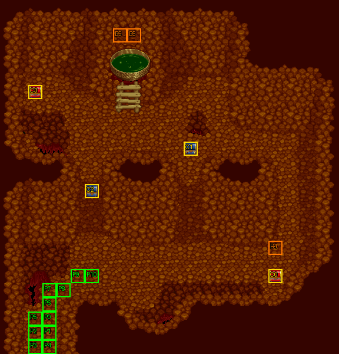

# 第 22 章　巫湯婆婆

<!-- chapter_docs:header -->
| 項目 | 內容 |
| --- | --- |
| 章號／章節索引 | 22／21 |
| 章名（文字區塊 `0x01`） | 巫湯婆婆 |
| 勝利條件（`0x02`） | 擊倒巫湯婆婆 |
| 敗北條件（`0x03`） | 法蓮娜死亡 |
| 戰場 | `MAP21.DAT`／`MAP21.COD`／`M21.DTL`，24×25 格，我方 slot 11 個，部署記錄 55 筆 |
| 文字區塊 | `FDETXT22.TXT`，19 條 |
| 進入處理（`0x60074`[21]） | `fdps_chapter_22_init`（`0x21410`） |
| 行動後檢查（`0x6028c`[21]） | `fdps_chapter_22_post_action`（`0x3b270`） |
| 勝利處理（`0x60304`[21]） | `fdps_chapter_22_end`（`0x3b2a0`） |
| 地圖資料呼叫的事件處理（`0x601c4`） | slot 31：`fdps_chapter_22_event_for_turn`（`0x384e0`）（回合事件）、slot 32：`fdps_chapter_22_event_boss_defeat`（`0x388b0`）（死亡腳本） |
| 過場腳本 | `ICON21.DAT`（開場）、`WIN21.DAT`（勝利） |
| 本章之前的村莊 | 無 |
| 光碟 | 第 2 片（音軌見 [CD 音軌](../program_info/cd_audio.md)） |



戰場全圖（第 0 層與同步捲動的圖層）。框線：黃 `C` 寶箱、橘 `B` 埋藏格、青 `R` 重繪格、洋紅 `E` 有處理函式的格子事件格，字母後的數字是事件碼；綠 `P` 是我方 slot 的起始格。

圖由 `python tools/chapter_docs/chapter_facts.py render-maps` 從遊戲檔重畫到 `chapters/maps/`，`verify-maps` 逐 byte 比對版控中的圖。
<!-- /chapter_docs:header -->

## 概要

法蓮娜一行人來到巫湯婆婆的洞窟求取失魂藥。開場過場裡隊伍從左下角進場，巫湯婆婆笑說三百年沒有客人、一來就是一大群；法蓮娜與裘娜急著討藥救人，被問到「死的是什麼人」時法蓮娜支吾說不出口。巫湯婆婆表示藥可以給，但「要拿藥的人，可得憑本事」，尤利安喊出「救人要緊！老婆婆，得罪妳了！」，戰鬥開始（`0x09`）。

戰鬥中巫湯婆婆坐鎮地圖上方的湯盆前，一波波放出「小寵物」：狼人戰士與蛇魔使（`0x0c`、`0x0d`），接著召喚惡靈（幽魂）與骷顱兵，尤利安向同伴解釋惡靈不怕拳腳刀劍、骷顱兵不怕魔法（`0x0e`、`0x0f`、`0x10`），第 8 回合她宣告「這是最後的攻擊」（`0x11`）。若最後一擊出自法蓮娜，倒下的巫湯婆婆追問她要救的是誰，法蓮娜說那是她這輩子最重要的人；巫湯婆婆看著她的臉驚覺「怎麼會這樣」，把一件東西交給她帶在身上（`0x12`，即死神契約）。

勝利過場中巫湯婆婆稱讚眾人的功夫，把藥交給法蓮娜，提醒藥效很短、救不出人後果嚴重，又意有所指地勸她「該要看開時，還是要看開一點」（`0x0a`）；接著鏡頭上移，法蓮娜退場、播放 `ICON0054.SAF` 動畫後再復歸。眾人服藥前的一段對話（`0x0b`）沒有任何讀取端。

## 加入與離隊

本章沒有人入隊或離隊。`fdps_chapter_22_init`（`0x21410`）不呼叫入隊，名冊維持第 21 章（[`ch21.md`](ch21.md)）結束時的十一人，恰好填滿 `MAP21.DAT` 宣告的 11 個我方 slot。入隊順序與名冊記錄見 [`assets/characters.md` 的加入一節](../assets/characters.md#加入)。

- **蘭迪斯不上場**：開場過場 `ICON21.DAT` 在最後的 `0x116` 把地圖單位 0（蘭迪斯）設為退場，整支腳本沒有復歸，所以玩家指揮的是其餘十人。他只是被設為退場，HP 沒有歸零。第 23 章的開場過場同樣先讓他退場（[`ch23.md`](ch23.md)）。
- 本章沒有友方或第三陣營單位：`MAP21.DAT` 的 55 筆部署記錄全是陣營 0。

## 勝敗條件與特殊機制

- **勝利只來自巫湯婆婆的死亡事件**：`fdps_chapter_22_post_action`（`0x3b270`）只判敗北，不呼叫共用的 `fdps_battle_check_default_end_conditions`（`0x3a2e0`），所以「敵人全滅」在本章不算過關，場上援軍全數倒下而巫湯婆婆還站著時戰鬥照常進行。過關碼 2 由巫湯婆婆部署記錄的死亡腳本（opcode 2、slot 32）呼叫的 `fdps_chapter_22_event_boss_defeat`（`0x388b0`）寫入，而且在每條路徑上都寫——不論有沒有交出死神契約，擊倒她就過關，與畫面上的「擊倒巫湯婆婆」一致。
- **敗北只看法蓮娜（單位 3）**：`fdps_chapter_22_post_action`（`0x3b270`）以 `fdps_unit_is_retired`（`0x109b0`）問單位 3，退場就把結束碼寫成 1，與畫面上的「法蓮娜死亡」一致。單位 3 是名冊第 4 位的法蓮娜。其他隊員全滅而法蓮娜還在時不算敗北。這次寫入不看結束碼目前的值：同一次行動裡巫湯婆婆倒下、法蓮娜也退場，結果是敗北。共用判定雖然對章節索引 `0x15` 也改看單位 3，但本章不呼叫它，那一支走不到（[`program_info/chapter.md`](../program_info/chapter.md)）。
- **死神契約要法蓮娜擊倒她、而且背包有空位**：`fdps_chapter_22_event_boss_defeat`（`0x388b0`）收到的是死亡腳本執行時的擊殺者參數，比對的是該單位的角色編號（`01` 法蓮娜），不是單位位置。依 [`program_info/battle.md`](../program_info/battle.md) 的規則，這個參數在我方回合是攻擊或施法的人，在敵方回合是被巫湯婆婆攻擊的單位——所以法蓮娜在敵方回合被她攻擊、以反擊擊倒她也算。條件成立且 `fdps_unit_item_count`（`0x25240`）不是 8 時，先把巫湯婆婆（單位 `0x0b`）的 `+5` 整個清成 0，再畫 `0x12`，然後以 `fdps_unit_add_item`（`0x25d20`）把 `BA` 死神契約（[`assets/items.md`](../assets/items.md)）放進法蓮娜背包。背包滿 8 格時什麼都不給、也不提示，`0x12` 也不顯示。
- **死神契約是隱藏路線的第一環**：第 23 章的死神由帶著死神契約的法蓮娜擊倒時，`fdps_chapter_23_event_boss_defeat`（`0x38950`）把它換成反禁制器（[`ch23.md`](ch23.md)），之後的隱藏路線要用到。本章拿不到死神契約，這條路線就關了。
- **第 9 回合巫湯婆婆開始行動**：她開場的 AI 行為是 2（有達到門檻的最佳行動才出手，否則原地休息，不會為了接近對手移動）。第 9 回合 `fdps_chapter_22_event_for_turn`（`0x384e0`）把她改成行為 11：先評分法術、達門檻就施法，接著不論施法與否再評分物理攻擊，達門檻就移動並攻擊，否則朝最近可達的對手移動（[`program_info/map_ai.md`](../program_info/map_ai.md)）。同一回合所有援軍也被改成行為 0，唯一受影響的是波次 4 原地待命的幽魂與骷顱兵。

## 敵人配置

開場只有巫湯婆婆一人（LV20，錨點 (9, 8)，湯盆正下方），其餘 54 名全是回合事件部署的援軍，由 `fdps_chapter_22_event_for_turn`（`0x384e0`）在我方行動結束、敵方階段開始前以「錨點最近的空格」放置：

- **第 1 回合**：波次 1，狼人戰士 8、蛇魔使 8，分在三條通道口（(6, 11–12)、(13, 11–12)、(20–21, 11–12)）與巫湯婆婆左右後方（(4–5, 5–6)、(14–15, 5–6)），行為 0。
- **第 3 回合**：波次 2，狼人戰士 4、蛇魔使 4，圍在巫湯婆婆身旁 (7–11, 8–9)，行為 0。
- **第 5 回合**：先出波次 3 的幽魂 4（巫湯婆婆左右後方 (4–5, 5)、(14–15, 5)），再出波次 5 的骷顱兵 4（(4–5, 6)、(14–15, 6)），都是行為 0。
- **第 8 回合**：波次 4，共 22 名：狼人戰士 3 與蛇魔使 3 在右下 (18–19, 17–19)，狼人戰士 4 與蛇魔使 4 在左右後方，行為 0；幽魂 4 與骷顱兵 4 在巫湯婆婆身旁 (7–11, 8–9)，行為 2（原地），第 9 回合才改成行為 0。

波次編號與出場順序不一致：第 5 回合出的是波次 3 與 5，波次 4 到第 8 回合才出。這些援軍都不影響過關，勝利處理會把剩下的清掉。

<!-- chapter_docs:deployments -->
陣營與死亡腳本的意義見 [`resource_info/map.md`](../resource_info/map.md)，AI 行為（低 4 bit）見 [`program_info/map_ai.md`](../program_info/map_ai.md#行為代碼)；錨點是 `MAPnn.COD` 的座標，開場波次放在錨點上，其餘波次依部署方式放在錨點或最近的空格。單位名是全域文字的「角色編號 + 1」條；角色編號 `3C` 以上的敵兵，數值（`ENEMYDAT.DAT`）與種族、職業見 [`assets/enemies.md`](../assets/enemies.md)，以下的見 [`assets/characters.md`](../assets/characters.md)。

我方起始格：slot 0 (3, 22)、slot 1 (3, 23)、slot 2 (2, 23)、slot 3 (2, 24)、slot 4 (3, 24)、slot 5 (2, 22)、slot 6 (3, 21)、slot 7 (3, 20)、slot 8 (4, 20)、slot 9 (5, 19)、slot 10 (6, 19)。

| 波次 | 陣營 | 單位 | 等級 | 數量 |
| ---: | --- | --- | --- | ---: |
| 0 | 敵方 | `49` 巫湯婆婆 | 20 | 1 |
| 1 | 敵方 | `53` 狼人戰士 | 19 | 8 |
| 1 | 敵方 | `4B` 蛇魔使 | 18 | 8 |
| 2 | 敵方 | `53` 狼人戰士 | 19 | 4 |
| 2 | 敵方 | `4B` 蛇魔使 | 18 | 4 |
| 3 | 敵方 | `69` 幽魂 | 17 | 4 |
| 4 | 敵方 | `53` 狼人戰士 | 19 | 7 |
| 4 | 敵方 | `4B` 蛇魔使 | 18 | 7 |
| 4 | 敵方 | `69` 幽魂 | 17 | 4 |
| 4 | 敵方 | `54` 骷顱兵 | 17 | 4 |
| 5 | 敵方 | `54` 骷顱兵 | 17 | 4 |

### 波次 0

出場：進入戰場時由 `fdps_build_map_unit_array`（`0x22be0`） 部署在錨點上

| # | 陣營 | 單位 | 等級 | AI 行為 | 錨點 | 死亡腳本 |
| ---: | --- | --- | ---: | --- | --- | --- |
| 7 | 敵方 | `49` 巫湯婆婆 | 20 | 2 原地 | (9, 8) | 事件 slot 32：`fdps_chapter_22_event_boss_defeat`（`0x388b0`） |

### 波次 1

出場：第 1 回合我方行動結束、敵方階段開始前，`fdps_battle_run_turn_events`（`0x2e0c0`）執行 `MAP21.DAT` 回合事件第 0 筆（回合 1、slot 31），`fdps_chapter_22_event_for_turn`（`0x384e0`）先畫 `0x0c` 再以波次 1 呼叫 `fdps_deploy_wave`（`0x23830`），放在錨點最近的空格

| # | 陣營 | 單位 | 等級 | AI 行為 | 錨點 | 死亡腳本 |
| ---: | --- | --- | ---: | --- | --- | --- |
| 0 | 敵方 | `53` 狼人戰士 | 19 | 0 主動 | (6, 12) | — |
| 1 | 敵方 | `53` 狼人戰士 | 19 | 0 主動 | (13, 12) | 掉落 `B6` 再生藥 |
| 2 | 敵方 | `53` 狼人戰士 | 19 | 0 主動 | (20, 12) | — |
| 3 | 敵方 | `53` 狼人戰士 | 19 | 0 主動 | (21, 12) | — |
| 4 | 敵方 | `53` 狼人戰士 | 19 | 0 主動 | (5, 6) | — |
| 5 | 敵方 | `53` 狼人戰士 | 19 | 0 主動 | (14, 6) | — |
| 6 | 敵方 | `53` 狼人戰士 | 19 | 0 主動 | (4, 6) | — |
| 8 | 敵方 | `53` 狼人戰士 | 19 | 0 主動 | (15, 6) | 掉落 4000 金 |
| 9 | 敵方 | `4B` 蛇魔使 | 18 | 0 主動 | (6, 11) | — |
| 10 | 敵方 | `4B` 蛇魔使 | 18 | 0 主動 | (13, 11) | — |
| 11 | 敵方 | `4B` 蛇魔使 | 18 | 0 主動 | (20, 11) | — |
| 12 | 敵方 | `4B` 蛇魔使 | 18 | 0 主動 | (21, 11) | — |
| 13 | 敵方 | `4B` 蛇魔使 | 18 | 0 主動 | (4, 5) | — |
| 14 | 敵方 | `4B` 蛇魔使 | 18 | 0 主動 | (5, 5) | — |
| 15 | 敵方 | `4B` 蛇魔使 | 18 | 0 主動 | (14, 5) | — |
| 16 | 敵方 | `4B` 蛇魔使 | 18 | 0 主動 | (15, 5) | — |

### 波次 2

出場：第 3 回合敵方階段開始前，`fdps_chapter_22_event_for_turn`（`0x384e0`）先畫 `0x0d` 再部署波次 2，放在錨點最近的空格

| # | 陣營 | 單位 | 等級 | AI 行為 | 錨點 | 死亡腳本 |
| ---: | --- | --- | ---: | --- | --- | --- |
| 17 | 敵方 | `53` 狼人戰士 | 19 | 0 主動 | (7, 9) | — |
| 18 | 敵方 | `53` 狼人戰士 | 19 | 0 主動 | (8, 9) | — |
| 19 | 敵方 | `53` 狼人戰士 | 19 | 0 主動 | (10, 9) | — |
| 20 | 敵方 | `53` 狼人戰士 | 19 | 0 主動 | (11, 9) | — |
| 21 | 敵方 | `4B` 蛇魔使 | 18 | 0 主動 | (7, 8) | — |
| 22 | 敵方 | `4B` 蛇魔使 | 18 | 0 主動 | (8, 8) | — |
| 23 | 敵方 | `4B` 蛇魔使 | 18 | 0 主動 | (10, 8) | — |
| 24 | 敵方 | `4B` 蛇魔使 | 18 | 0 主動 | (11, 8) | — |

### 波次 3

出場：第 5 回合敵方階段開始前，`fdps_chapter_22_event_for_turn`（`0x384e0`）先畫 `0x0e` 再部署波次 3，放在錨點最近的空格，接著鏡頭掃過地圖左上與右上

| # | 陣營 | 單位 | 等級 | AI 行為 | 錨點 | 死亡腳本 |
| ---: | --- | --- | ---: | --- | --- | --- |
| 25 | 敵方 | `69` 幽魂 | 17 | 0 主動 | (4, 5) | — |
| 26 | 敵方 | `69` 幽魂 | 17 | 0 主動 | (5, 5) | — |
| 27 | 敵方 | `69` 幽魂 | 17 | 0 主動 | (14, 5) | — |
| 28 | 敵方 | `69` 幽魂 | 17 | 0 主動 | (15, 5) | — |

### 波次 4

出場：第 8 回合敵方階段開始前，`fdps_chapter_22_event_for_turn`（`0x384e0`）先畫 `0x11` 再部署波次 4，放在錨點最近的空格；波次 4 在波次 5 之後才出場，幽魂與骷顱兵到第 9 回合才由同一支函式改成行為 0

| # | 陣營 | 單位 | 等級 | AI 行為 | 錨點 | 死亡腳本 |
| ---: | --- | --- | ---: | --- | --- | --- |
| 33 | 敵方 | `53` 狼人戰士 | 19 | 0 主動 | (18, 17) | — |
| 34 | 敵方 | `53` 狼人戰士 | 19 | 0 主動 | (18, 18) | — |
| 35 | 敵方 | `53` 狼人戰士 | 19 | 0 主動 | (18, 19) | — |
| 36 | 敵方 | `53` 狼人戰士 | 19 | 0 主動 | (4, 6) | — |
| 37 | 敵方 | `53` 狼人戰士 | 19 | 0 主動 | (5, 6) | — |
| 38 | 敵方 | `53` 狼人戰士 | 19 | 0 主動 | (14, 6) | — |
| 39 | 敵方 | `53` 狼人戰士 | 19 | 0 主動 | (15, 6) | — |
| 40 | 敵方 | `4B` 蛇魔使 | 18 | 0 主動 | (19, 17) | — |
| 41 | 敵方 | `4B` 蛇魔使 | 18 | 0 主動 | (19, 18) | — |
| 42 | 敵方 | `4B` 蛇魔使 | 18 | 0 主動 | (19, 19) | — |
| 43 | 敵方 | `4B` 蛇魔使 | 18 | 0 主動 | (4, 5) | — |
| 44 | 敵方 | `4B` 蛇魔使 | 18 | 0 主動 | (5, 5) | — |
| 45 | 敵方 | `4B` 蛇魔使 | 18 | 0 主動 | (14, 5) | — |
| 46 | 敵方 | `4B` 蛇魔使 | 18 | 0 主動 | (15, 5) | — |
| 47 | 敵方 | `69` 幽魂 | 17 | 2 原地 | (7, 8) | — |
| 48 | 敵方 | `69` 幽魂 | 17 | 2 原地 | (8, 8) | — |
| 49 | 敵方 | `69` 幽魂 | 17 | 2 原地 | (10, 8) | — |
| 50 | 敵方 | `69` 幽魂 | 17 | 2 原地 | (11, 8) | — |
| 51 | 敵方 | `54` 骷顱兵 | 17 | 2 原地 | (7, 9) | — |
| 52 | 敵方 | `54` 骷顱兵 | 17 | 2 原地 | (8, 9) | — |
| 53 | 敵方 | `54` 骷顱兵 | 17 | 2 原地 | (10, 9) | — |
| 54 | 敵方 | `54` 骷顱兵 | 17 | 2 原地 | (11, 9) | — |

### 波次 5

出場：第 5 回合敵方階段開始前，與波次 3 同一次呼叫：`fdps_chapter_22_event_for_turn`（`0x384e0`）部署波次 3、掃鏡頭、畫 `0x0f` 後部署波次 5，放在錨點最近的空格

| # | 陣營 | 單位 | 等級 | AI 行為 | 錨點 | 死亡腳本 |
| ---: | --- | --- | ---: | --- | --- | --- |
| 29 | 敵方 | `54` 骷顱兵 | 17 | 0 主動 | (4, 6) | — |
| 30 | 敵方 | `54` 骷顱兵 | 17 | 0 主動 | (5, 6) | — |
| 31 | 敵方 | `54` 骷顱兵 | 17 | 0 主動 | (14, 6) | — |
| 32 | 敵方 | `54` 骷顱兵 | 17 | 0 主動 | (15, 6) | 掉落 `6D` 地獄鎧甲 |
<!-- /chapter_docs:deployments -->

## 寶物

- **死神契約**（`BA`）：不在寶箱裡，由 `fdps_chapter_22_event_boss_defeat`（`0x388b0`）在法蓮娜擊倒巫湯婆婆且背包有空位時交給她，條件見上方勝敗條件。
- **擊倒掉落**：下表三筆掉落都掛在援軍身上，擊殺者必須是存活的我方單位；過關時剩下的援軍由勝利處理直接清掉、不跑死亡腳本，沒在巫湯婆婆倒下前擊倒它們就拿不到。

<!-- chapter_docs:treasure -->
搜尋的規則（同碼的格共用一筆記錄與一個旗標、背包滿時的交換）見 [`resource_info/map.md`](../resource_info/map.md)。

| 事件碼 | 格 | 內容 |
| ---: | --- | --- |
| 0 | (19, 19) 寶箱 | `9B` 強化裝甲 |
| 1 | (13, 10) 寶箱 | 3000 金 |
| 2 | (6, 13) 寶箱 | `D2` 炎之魔石 |
| 3 | (2, 6) 寶箱 | `B8` 魔法水 |
| 4 | (19, 17) 埋藏 | `D6` 生命之實 |
| 5 | (8, 2) 埋藏、(9, 2) 埋藏 | `D7` 魔力水晶（2 格共用，只拿得到一次） |

擊倒後掉落（死亡腳本 opcode 0／1，擊殺者須是存活的我方單位）：

| # | 單位 | 波次 | 掉落 |
| ---: | --- | ---: | --- |
| 1 | `53` 狼人戰士 | 1 | 掉落 `B6` 再生藥 |
| 8 | `53` 狼人戰士 | 1 | 掉落 4000 金 |
| 32 | `54` 骷顱兵 | 5 | 掉落 `6D` 地獄鎧甲 |
<!-- /chapter_docs:treasure -->

## 村莊

<!-- chapter_docs:village -->
第 21 章勝利後沒有村莊（`CHAPTER_HAS_NO_VILLAGE`，`src/village.c`），直接進存檔畫面再進本章。
<!-- /chapter_docs:village -->

## 處理流程

### 進入：`fdps_chapter_22_init`（`0x21410`）

1. `fdps_chapter_state_reset`（`0x22750`）依 `MAP21.DAT` 建立地圖單位陣列：11 個我方 slot 依名冊順序取人（單位 0–10），接著部署唯一一筆波次 0 記錄巫湯婆婆（單位 `0x0b`），放在錨點 (9, 8)。
2. `fdps_icon_script_run`（`0x21650`）播 `Icon21.dat`：把全隊先疊到 (23, 23)，淡入後鏡頭從 (5, 13) 一格格往左下移到 (1, 17)，再把隊員分批放到 (3, 24)／(2, 24) 走進來，法蓮娜停在 (6, 19)；畫 `0x09` 後讓單位 0 蘭迪斯退場、停止音樂。腳本不部署任何波次。
3. `fdps_show_chapter_title_card`（`0x20c60`）顯示章節標題圖（圖像，不讀文字區塊）。
4. `fdps_map_cursor_move_to_unit`（`0x2da50`）把游標放在單位 3 法蓮娜身上，而不是一般章節的單位 0。

### 行動後檢查：`fdps_chapter_22_post_action`（`0x3b270`）

1. 以 `fdps_unit_is_retired`（`0x109b0`）問單位 3（法蓮娜），退場就把結束碼寫成 1。
2. 沒有其他步驟：不呼叫共用判定、不寫 2，勝利完全交給死亡事件。

### 回合事件：`fdps_chapter_22_event_for_turn`（`0x384e0`）

`MAP21.DAT` 的回合事件表有五筆，回合 1、3、5、8、9，陣營階段都是 0（敵方階段開始前），都指向 slot 31 的這支處理函式；`fdps_battle_run_turn_events`（`0x2e0c0`）觸發時回合計數器還是剛結束的那一回合。處理函式依回合計數器逐一比對相等，沒有對上的回合什麼都不做；傳進來的參數不讀。以下的部署都是 `fdps_deploy_wave`（`0x23830`），地圖是目前的章節索引，放置方式 0（錨點最近的空格）；文字都以 `fdps_draw_text`（`0x1ff60`）畫在畫面左上角。

1. **回合 1**：畫 `0x0c`，部署波次 1。
2. **回合 3**：畫 `0x0d`，部署波次 2。
3. **回合 5**：畫 `0x0e`，部署波次 3；隱藏游標，以 `fdps_map_cursor_move_to`（`0x2d7c0`）把鏡頭移到地圖左上（像素 (0, `0x60`)）、再移到右上（(`0x1b0`, `0x60`)），每處停 12 幀，恢復游標。畫 `0x0f`，部署波次 5，同樣掃左上、右上一次；最後畫 `0x10`。
4. **回合 8**：畫 `0x11`，部署波次 4；隱藏游標，鏡頭依序移到左上、右上、右下（(`0x1b0`, `0x1f8`)），每處停 12 幀，恢復游標。
5. **回合 9**：把單位 `0x0b`（巫湯婆婆）的 AI 行為低 4 bit 改成 11，再把單位 `0x0c`–`0x41`（五批援軍 54 人）的低 4 bit 改成 0，兩者都保留高 4 bit。這兩個範圍是寫死的單位索引。

### 死亡事件：`fdps_chapter_22_event_boss_defeat`（`0x388b0`）

巫湯婆婆 HP 歸零時由死亡腳本（slot 32）以擊殺者參數呼叫；這個參數不一定是真正的擊殺者，各情境傳的是誰見 [`program_info/battle.md`](../program_info/battle.md)。

1. 取擊殺者的單位記錄；角色編號是 `01`（法蓮娜）且 `fdps_unit_item_count`（`0x25240`）不等於 8 時：
   1. 把單位 `0x0b` 的 `+5` 整個寫成 0，取消死亡流程剛設的退場。`0x12` 開頭的說話者代碼以角色編號找人，找到未退場的巫湯婆婆才從她的格子以縮放動畫開窗；少了這一步她只剩退場記錄，頭像照畫、改以滑入動畫開窗（[`program_info/dialog.md`](../program_info/dialog.md)）。
   2. 畫 `0x12`。
   3. `fdps_unit_add_item`（`0x25d20`）把 `BA` 死神契約放進擊殺者背包。
2. 不論上面是否執行，結束碼寫成 2（過關）。

### 勝利：`fdps_chapter_22_end`（`0x3b2a0`）

1. `fdps_battle_destroy_remaining_enemies`（`0x39e10`）把陣營 0 每個單位的 HP 清成 0，再對所有未退場、HP 為 0 的單位播死亡動畫並設為退場；不跑死亡腳本。本章過關時場上通常還有援軍，這一步會真的把它們送下場。交出死神契約的路徑上巫湯婆婆的 `+5` 已被清成 0，她也在這一批裡，會再被播一次死亡動畫。
2. `fdps_roster_write_back_battle_units`（`0x23980`）把戰場上的隊員寫回名冊。
3. `fdps_icon_script_run`（`0x21650`）播 `Win21.dat`：復歸巫湯婆婆並把她放到 (8, 8)，隊員圍在她身旁；畫 `0x0a`，鏡頭上移，法蓮娜退場、播 `ICON0054.SAF`、再復歸法蓮娜。
4. `fdps_roster_revive_fallen_members`（`0x39e70`）讓陣亡的隊員收費復活。
5. 章節索引寫成 `0x16`，也就是第 23 章（[`ch23.md`](ch23.md)）。第 22、23 章之間沒有村莊，直接進存檔畫面（[`program_info/save.md`](../program_info/save.md)）。

## 回合事件與格子事件

<!-- chapter_docs:events -->
觸發時機與陣營階段的意義見 [`resource_info/map.md`](../resource_info/map.md)。

| 回合 | 陣營階段 | slot | 處理函式 |
| ---: | --- | ---: | --- |
| 1 | 敵方階段前 | 31 | `fdps_chapter_22_event_for_turn`（`0x384e0`） |
| 3 | 敵方階段前 | 31 | `fdps_chapter_22_event_for_turn`（`0x384e0`） |
| 5 | 敵方階段前 | 31 | `fdps_chapter_22_event_for_turn`（`0x384e0`） |
| 8 | 敵方階段前 | 31 | `fdps_chapter_22_event_for_turn`（`0x384e0`） |
| 9 | 敵方階段前 | 31 | `fdps_chapter_22_event_for_turn`（`0x384e0`） |

本章沒有格子事件。

死亡腳本裡的事件與文字：

| # | 單位 | 波次 | 死亡腳本 |
| ---: | --- | ---: | --- |
| 7 | `49` 巫湯婆婆 | 0 | 事件 slot 32：`fdps_chapter_22_event_boss_defeat`（`0x388b0`） |
<!-- /chapter_docs:events -->

## 過場腳本

`WIN21.DAT` 在 `0x036` 把我方 9（瑪麗安）放在 (32, 24)，超出本圖 24 格的寬度。

<!-- chapter_docs:scripts -->
格式與每個指令的意義見 [`resource_info/cutscene_script.md`](../resource_info/cutscene_script.md)。`FDETXT22#0xNN` 是本章文字區塊的條目，全文在下方「對話」；切到額外場景之後顯示的文字直接列出（那些區塊的正典是 [`assets/text/scene_text.md`](../assets/text/scene_text.md)）。`u3=我方1` 是地圖單位索引 3 對到我方 slot 1，`u12=MAP02#9` 是 `MAP02.DAT` 第 9 筆部署記錄。

### `ICON21.DAT`

- 開場：`fdps_chapter_22_init`（`0x21410`）
- 283 byte、51 步；起始地圖 21，切換地圖 無，結束於地圖 21

| 偏移 | 指令 | 內容 |
| ---: | --- | --- |
| `0000` | `FADE_OUT` | 淡出，每步 0 ms |
| `0002` | `SET_MUSIC` | 音樂 10（CD 第 11 軌） |
| `0004` | `SCROLL_VIEW` | 捲動視野到格 (5, 13) |
| `0007` | `PLACE_UNIT` | 放置 u0=我方0 到 (23, 23)，朝下 |
| `000c` | `PLACE_UNIT` | 放置 u1=我方1 到 (23, 23)，朝下 |
| `0011` | `PLACE_UNIT` | 放置 u2=我方2 到 (23, 23)，朝下 |
| `0016` | `PLACE_UNIT` | 放置 u5=我方5 到 (23, 23)，朝下 |
| `001b` | `PLACE_UNIT` | 放置 u6=我方6 到 (23, 23)，朝下 |
| `0020` | `PLACE_UNIT` | 放置 u7=我方7 到 (23, 23)，朝下 |
| `0025` | `PLACE_UNIT` | 放置 u8=我方8 到 (23, 23)，朝下 |
| `002a` | `PLACE_UNIT` | 放置 u9=我方9 到 (23, 23)，朝下 |
| `002f` | `PLACE_UNIT` | 放置 u10=我方10 到 (23, 23)，朝下 |
| `0034` | `PLACE_UNIT` | 放置 u3=我方3 到 (23, 23)，朝下 |
| `0039` | `PLACE_UNIT` | 放置 u4=我方4 到 (23, 23)，朝下 |
| `003e` | `FACE_UNITS` | 轉向後停 1 幀：u0=我方0朝上 |
| `0043` | `FADE_IN` | 淡入，每步 20 ms |
| `0045` | `SHAKE_VIEW` | 視野位移 4 步，每步 2 幀：(-6,6) (-12,12) (-18,18) (-24,24) |
| `0050` | `SET_VIEW_TILE` | 視野直接設到格 (4, 14) |
| `0053` | `SHAKE_VIEW` | 視野位移 4 步，每步 2 幀：(-6,6) (-12,12) (-18,18) (-24,24) |
| `005e` | `SET_VIEW_TILE` | 視野直接設到格 (3, 15) |
| `0061` | `SHAKE_VIEW` | 視野位移 4 步，每步 2 幀：(-6,6) (-12,12) (-18,18) (-24,24) |
| `006c` | `SET_VIEW_TILE` | 視野直接設到格 (2, 16) |
| `006f` | `SHAKE_VIEW` | 視野位移 4 步，每步 2 幀：(-6,6) (-12,12) (-18,18) (-24,24) |
| `007a` | `SET_VIEW_TILE` | 視野直接設到格 (1, 17) |
| `007d` | `PLACE_UNIT` | 放置 u3=我方3 到 (3, 24)，朝上 |
| `0082` | `PLACE_UNIT` | 放置 u4=我方4 到 (3, 24)，朝上 |
| `0087` | `FACE_UNITS` | 轉向後停 4 幀：u0=我方0朝上 |
| `008c` | `WALK_UNITS` | 行走 4 格，每步 2 幀：u3=我方3往上、u4=我方4往上 |
| `0094` | `WALK_UNITS` | 行走 2 格，每步 2 幀：u3=我方3往右、u4=我方4往右 |
| `009c` | `WALK_UNITS` | 行走 1 格，每步 2 幀：u3=我方3往上、u4=我方4往上 |
| `00a4` | `WALK_UNITS` | 行走 1 格，每步 2 幀：u3=我方3往右 |
| `00aa` | `FACE_UNITS` | 轉向後停 25 幀：u3=我方3朝上 |
| `00af` | `PLACE_UNIT` | 放置 u1=我方1 到 (3, 24)，朝上 |
| `00b4` | `PLACE_UNIT` | 放置 u2=我方2 到 (3, 24)，朝上 |
| `00b9` | `PLACE_UNIT` | 放置 u5=我方5 到 (3, 24)，朝上 |
| `00be` | `FACE_UNITS` | 轉向後停 4 幀：u3=我方3朝上 |
| `00c3` | `WALK_UNITS` | 行走 2 格，每步 2 幀：u1=我方1往上、u2=我方2往上、u5=我方5往上 |
| `00cd` | `PLACE_UNIT` | 放置 u6=我方6 到 (2, 24)，朝上 |
| `00d2` | `PLACE_UNIT` | 放置 u7=我方7 到 (3, 24)，朝上 |
| `00d7` | `PLACE_UNIT` | 放置 u8=我方8 到 (2, 24)，朝上 |
| `00dc` | `PLACE_UNIT` | 放置 u9=我方9 到 (3, 24)，朝上 |
| `00e1` | `PLACE_UNIT` | 放置 u10=我方10 到 (2, 24)，朝上 |
| `00e6` | `FACE_UNITS` | 轉向後停 1 幀：u3=我方3朝上 |
| `00eb` | `WALK_UNITS` | 行走 1 格，每步 2 幀：u1=我方1往上、u2=我方2往上、u5=我方5往上、u6=我方6往上、u7=我方7往上、u8=我方8往上、u9=我方9往上 |
| `00fd` | `WALK_UNITS` | 行走 1 格，每步 2 幀：u1=我方1往上、u2=我方2往上、u6=我方6往上、u7=我方7往上 |
| `0109` | `WALK_UNITS` | 行走 1 格，每步 2 幀：u1=我方1往右 |
| `010f` | `FACE_UNITS` | 轉向後停 8 幀：u1=我方1朝上 |
| `0114` | `DRAW_TEXT` | 顯示文字 FDETXT22#0x09 |
| `0116` | `RETIRE_UNIT` | 退場 u0=我方0 |
| `0118` | `SET_MUSIC` | 停止音樂 |
| `011a` | `END` | 結束 |

### `WIN21.DAT`

- 勝利：`fdps_chapter_22_end`（`0x3b2a0`）
- 135 byte、32 步；起始地圖 21，切換地圖 無，結束於地圖 21

| 偏移 | 指令 | 內容 |
| ---: | --- | --- |
| `0000` | `FADE_OUT` | 淡出，每步 20 ms |
| `0002` | `SET_MUSIC` | 音樂 11（CD 第 12 軌） |
| `0004` | `REVIVE_UNIT` | 復歸 u11=MAP21#7(角色0x49)（清狀態） |
| `0006` | `SET_VIEW_TILE` | 視野直接設到格 (3, 6) |
| `0009` | `PLACE_UNIT` | 放置 u11=MAP21#7(角色0x49) 到 (8, 8)，朝右 |
| `000e` | `PLACE_UNIT` | 放置 u1=我方1 到 (8, 9)，朝上 |
| `0013` | `PLACE_UNIT` | 放置 u2=我方2 到 (9, 9)，朝上 |
| `0018` | `PLACE_UNIT` | 放置 u3=我方3 到 (9, 8)，朝左 |
| `001d` | `PLACE_UNIT` | 放置 u4=我方4 到 (10, 8)，朝左 |
| `0022` | `PLACE_UNIT` | 放置 u5=我方5 到 (10, 9)，朝上 |
| `0027` | `PLACE_UNIT` | 放置 u6=我方6 到 (10, 10)，朝上 |
| `002c` | `PLACE_UNIT` | 放置 u7=我方7 到 (9, 10)，朝上 |
| `0031` | `PLACE_UNIT` | 放置 u8=我方8 到 (8, 10)，朝上 |
| `0036` | `PLACE_UNIT` | 放置 u9=我方9 到 (32, 24)，朝上 |
| `003b` | `PLACE_UNIT` | 放置 u10=我方10 到 (8, 11)，朝上 |
| `0040` | `FACE_UNITS` | 轉向後停 1 幀：u3=我方3朝左 |
| `0045` | `FADE_IN` | 淡入，每步 20 ms |
| `0047` | `FACE_UNITS` | 轉向後停 10 幀：u3=我方3朝左 |
| `004c` | `DRAW_TEXT` | 顯示文字 FDETXT22#0x0a |
| `004e` | `FACE_UNITS` | 轉向後停 15 幀：u3=我方3朝左 |
| `0053` | `FACE_UNITS` | 轉向後停 15 幀：u3=我方3朝下 |
| `0058` | `SHAKE_VIEW` | 視野位移 4 步，每步 2 幀：(0,-6) (0,-12) (0,-18) (0,-24) |
| `0063` | `SET_VIEW_TILE` | 視野直接設到格 (3, 5) |
| `0066` | `SHAKE_VIEW` | 視野位移 4 步，每步 2 幀：(0,-6) (0,-12) (0,-18) (0,-24) |
| `0071` | `SET_VIEW_TILE` | 視野直接設到格 (3, 4) |
| `0074` | `FACE_UNITS` | 轉向後停 15 幀：u3=我方3朝下 |
| `0079` | `RETIRE_UNIT` | 退場 u3=我方3 |
| `007b` | `PLAY_SAF` | 播放動畫 ICON0054.SAF |
| `007d` | `FACE_UNITS` | 轉向後停 15 幀：u3=我方3朝下 |
| `0082` | `REVIVE_UNIT` | 復歸 u3=我方3（清狀態） |
| `0084` | `SET_MUSIC` | 停止音樂 |
| `0086` | `END` | 結束 |
<!-- /chapter_docs:scripts -->

## 對話

`0x12` 只在法蓮娜擊倒巫湯婆婆、而且背包有空位時顯示；其他情況下巫湯婆婆倒下時沒有台詞。

<!-- chapter_docs:dialogue -->
`FDETXT22.TXT` 全部 19 條，依條目編號排列。每條先列讀取端（顯示它的腳本步驟、處理函式或死亡腳本），再列全文：【名稱】是換說話者（頭像取自括號裡的角色編號；【地圖單位 n】取執行當下第 n 個地圖單位），每一行是一次換行，▼ 是換頁（等按鍵）。`{subst1}`、`{subst2}`、`{number}` 是執行期代入的名稱與數字（[`resource_info/text.md`](../resource_info/text.md)）。

空字串的條目：`0x04`、`0x05`、`0x06`、`0x07`、`0x08`。

### `0x00`

永遠不會顯示：「第廿二章」沒有讀取端：章名卡由 `fdps_show_chapter_title_card`（`0x20c60`）畫 `CHAPTER.SAF` 的圖，本章的處理函式、死亡腳本與 `ICON21.DAT`／`WIN21.DAT` 都不畫這一條，見 [S13a（排除清單）](../cut_content/_index.md#排除清單)。

### `0x01`

讀取端：`fdps_draw_save_slot_panel`（`0x24a40`）

```text
巫湯婆婆
```

### `0x02`

讀取端：`fdps_battle_show_win_fail_window`（`0x17ca0`）

```text
擊倒巫湯婆婆
```

### `0x03`

讀取端：`fdps_battle_show_win_fail_window`（`0x17ca0`）

```text
法蓮娜死亡
```

### `0x09`

讀取端：`ICON21.DAT` `0x114`

```text
【巫湯婆婆】（角色 73）
呵呵呵～呵！
300年沒有客人了，
一來就是一大群，
▼
你們來這裡幹什麼？
這麼兇巴巴的，
▼
真是嚇著我了～
呵呵呵！
【法蓮娜】（角色 1）
聽說老婆婆這裡有
失魂藥，
請給我們失魂藥！
【裘娜】（角色 3）
是呀！是呀！
趕快給我們！
我們要趕著救人哪！
【巫湯婆婆】（角色 73）
呵呵呵～呵！
年輕人真不懂規矩，
▼
見了面，
就伸手跟人要東西，
也不先打聲招呼。
▼
看妳們急成這樣，
死的是什麼人啊？
【法蓮娜】（角色 1）
是我﹒﹒我﹒﹒
我﹒﹒我最﹒﹒
【裘娜】（角色 3）
我我我還我什麼，
講清楚啦！
【法蓮娜】（角色 1）
這﹒﹒﹒
【巫湯婆婆】（角色 73）
呵呵呵～呵！
藥，我可以給妳，
但是規矩可不能廢；
▼
要拿藥的人，
可得憑本事，
知道嗎？
【尤利安】（角色 6）
救人要緊！
老婆婆，得罪妳了！
```

### `0x0a`

讀取端：`WIN21.DAT` `0x04c`

```text
【巫湯婆婆】（角色 73）
呵呵呵～呵！
年輕人，
你們的功夫不錯。
▼
藥，我給妳，
但是記著，
這藥效可是很短的，
▼
要是無法救出他來，
後果可就嚴重了，
知道了嗎？
【法蓮娜】（角色 1）
是的，謝謝妳，
巫湯婆婆﹒﹒﹒﹒
【巫湯婆婆】（角色 73）
呵呵呵～呵！
年輕人重感情是很好，
可是呢，
▼
世界上有很多事，
本來就不該勉強的，
該要看開時，
▼
還是要看開一點﹒﹒﹒
﹒﹒呵呵呵呵
```

### `0x0b`

永遠不會顯示：眾人服下失魂藥前的對話；勝利過場 `WIN21.DAT` 只畫 `0x0a`，沒有任何處理函式、死亡腳本或其他地圖的腳本畫 `FDETXT22` 的這一條，見 [S4](../cut_content/story.md#s4-寫好卻沒被顯示的對白)。

### `0x0c`

讀取端：`fdps_chapter_22_event_for_turn`（`0x384e0`）

```text
【巫湯婆婆】（角色 73）
呵呵呵～呵！
去吧！我的小寵物們！
```

### `0x0d`

讀取端：`fdps_chapter_22_event_for_turn`（`0x384e0`）

```text
【巫湯婆婆】（角色 73）
呵呵呵～呵！
還有！還有！
你們要小心了！
```

### `0x0e`

讀取端：`fdps_chapter_22_event_for_turn`（`0x384e0`）

```text
【巫湯婆婆】（角色 73）
呵呵呵～呵！
你們還真是不錯！
▼
沒想到你們可以
支撐到現在，
真令我刮目相看！
【法蓮娜】（角色 1）
那麼失魂藥﹒﹒﹒
【巫湯婆婆】（角色 73）
呵呵呵～呵！
還早還早！
好戲現在才要開始呢！
▼
出來吧！
我的小寵物們！
```

### `0x0f`

讀取端：`fdps_chapter_22_event_for_turn`（`0x384e0`）

```text
【尤利安】（角色 6）
是惡靈！
天啊！沒想到巫湯婆婆
可以召喚出惡靈﹒﹒
【琴琴】（角色 7）
那個像棉花糖的東西
有那麼可怕嗎？
【裘娜】（角色 3）
是啊！看它軟軟的樣子
連我一刀也檔不住的！
【尤利安】（角色 6）
你們太天真了！
▼
惡靈不是屬於這個世上
的東西，
▼
所以你們的拳腳跟刀子
幾乎是沒有用的！
【巫湯婆婆】（角色 73）
呵呵呵～呵！
▼
看這位小僧侶年紀輕輕
的倒很有見識！
▼
那這個你認識嗎？
```

### `0x10`

讀取端：`fdps_chapter_22_event_for_turn`（`0x384e0`）

```text
【尤利安】（角色 6）
骷顱兵！
【亞克】（角色 4）
這次又是怎麼了？
【尤利安】（角色 6）
骷顱兵是人死後用魔法
復生的亡靈，
▼
所以魔法對它幾乎沒有
用的！
【琴琴】（角色 7）
那琴琴給它兩拳，
把它給打碎不就得了！
【尤利安】（角色 6）
妳要小心點！
骷顱兵是很凶的！
【琴琴】（角色 7）
我知道了！
```

### `0x11`

讀取端：`fdps_chapter_22_event_for_turn`（`0x384e0`）

```text
【巫湯婆婆】（角色 73）
呵呵呵～呵！
不錯！不錯！
▼
婆婆我已經有
300年沒這麼快樂
過了！
▼
這是最後的攻擊，
你們可要注意了！
```

### `0x12`

讀取端：`fdps_chapter_22_event_boss_defeat`（`0x388b0`）

```text
【巫湯婆婆】（角色 73）
呵呵呵～呵！
▼
小女孩，
妳還沒有告訴我要救的
是誰呢？
【法蓮娜】（角色 1）
他﹒﹒﹒他﹒﹒﹒
▼
他是我這輩子最重要
的人﹒﹒﹒﹒
▼
沒有他我﹒﹒﹒﹒
我﹒﹒﹒﹒
【巫湯婆婆】（角色 73）
﹒﹒﹒﹒﹒﹒﹒﹒﹒﹒
▼
小女孩，
你不要難過婆婆把藥
給你就是了。
▼
﹒﹒﹒﹒﹒﹒唉！
婆婆這輩子沒見過像妳
這麼深情的人﹒﹒﹒
▼
等等﹒﹒﹒﹒﹒﹒
妳的臉﹒﹒﹒﹒﹒
【法蓮娜】（角色 1）
臉？
【巫湯婆婆】（角色 73）
怎麼會﹒﹒﹒﹒﹒﹒
▼
怎麼會這樣！
▼
﹒﹒﹒﹒﹒﹒﹒﹒﹒﹒
﹒﹒﹒﹒﹒﹒﹒﹒﹒﹒
﹒﹒﹒﹒﹒﹒﹒﹒﹒
▼
﹒﹒﹒好吧﹒﹒﹒﹒﹒
▼
小女孩，
把這個帶在身上，
會對妳有所幫助的。
▼
婆婆能幫你的就只有
如此了﹒﹒﹒
▼
唉！
怎麼會這樣﹒﹒﹒﹒﹒
【法蓮娜】（角色 1）
﹒﹒﹒﹒﹒﹒﹒﹒﹒﹒
婆婆謝謝妳。
```
<!-- /chapter_docs:dialogue -->
