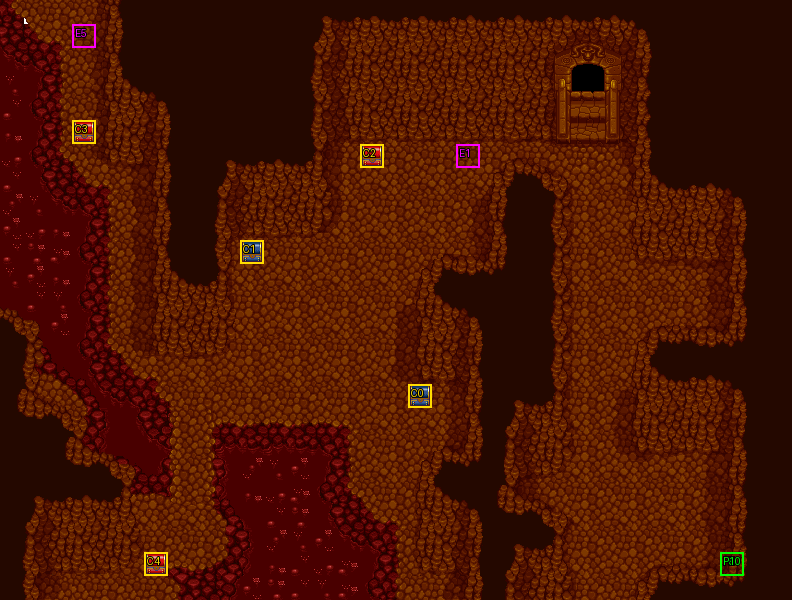

# 第 23 章　死神冥河

<!-- chapter_docs:header -->
| 項目 | 內容 |
| --- | --- |
| 章號／章節索引 | 23／22 |
| 章名（文字區塊 `0x01`） | 死神冥河 |
| 勝利條件（`0x02`） | 擊倒死神 |
| 敗北條件（`0x03`） | 法蓮娜死亡／蘭迪斯從戰場上方消失 |
| 戰場 | `MAP22.DAT`／`MAP22.COD`／`M22.DTL`，33×25 格，我方 slot 11 個，部署記錄 80 筆 |
| 文字區塊 | `FDETXT23.TXT`，28 條 |
| 進入處理（`0x60074`[22]） | `fdps_chapter_23_init`（`0x21450`） |
| 行動後檢查（`0x6028c`[22]） | `fdps_chapter_23_post_action`（`0x3b2e0`） |
| 勝利處理（`0x60304`[22]） | `fdps_chapter_23_end`（`0x3b350`） |
| 地圖資料呼叫的事件處理（`0x601c4`） | slot 33：`fdps_chapter_23_event_boss_defeat`（`0x38950`）（死亡腳本）、slot 34：`fdps_chapter_23_event_deploy_wave_for_turn`（`0x38a30`）（回合事件）、slot 35：`fdps_chapter_23_event_give_martial_artist_ring`（`0x38b60`）（格子事件） |
| 過場腳本 | `ICON22.DAT`（開場）、`WIN22.DAT`（勝利） |
| 本章之前的村莊 | 無 |
| 光碟 | 第 2 片（音軌見 [CD 音軌](../program_info/cd_audio.md)） |



戰場全圖（第 0 層與同步捲動的圖層）。框線：黃 `C` 寶箱、橘 `B` 埋藏格、青 `R` 重繪格、洋紅 `E` 有處理函式的格子事件格，字母後的數字是事件碼；綠 `P` 是我方 slot 的起始格。

圖由 `python tools/chapter_docs/chapter_facts.py render-maps` 從遊戲檔重畫到 `chapters/maps/`，`verify-maps` 逐 byte 比對版控中的圖。
<!-- /chapter_docs:header -->

## 概要

隊伍追到冥界（地圖 22），來救奄奄一息的蘭迪斯。開場過場 `ICON22.DAT` 先讓蘭迪斯退場、播放 `ICON0055.SAF`，其餘十人出現在地圖左側，視野一路往上捲。瑪麗安說這裡氣氛古怪、好冷，法蓮娜看見了蘭迪斯；布蘭多大聲呼喊，裘娜說他好像失去意識、喊不醒，費塔加說那道門是地獄之門，亡靈一進去就再也出不來，要大家在他進門之前把他拉出來。視野在震動中往右上捲，死神現身，嘲笑他們自身難保還想救人，說想帶人走就要憑真本事；蘭斯洛特說時間不多了，費塔加提醒死神相當強，死神的手下隨即出現，戰鬥開始。

擊倒死神後，死神承認他們贏了、讓他們把人帶走。擊倒它的是帶著死神契約的法蓮娜時，死神認出那是它給巫湯婆婆的契約，說巫湯婆婆竟有這種同情心，於是把反禁制器交給法蓮娜，說它可以救她一命、但要有夠強的魔力才能發動。勝利過場 `WIN22.DAT` 裡法蓮娜走到地獄之門前，播放 `ICON0056.SAF` 之後尤利安說「呼～！沒事了！真是千鈞一髮！」。

接著過場切到地圖 50：法蓮娜說「我走了，你們好好照顧他吧」，瑪麗安哭著喊大姐姐；蘭迪斯追出來問她是不是真的要離開，法蓮娜道歉說她不是故意對他說謊的；凱因巴（`43`）先走，法蓮娜也跟著離去。蘭迪斯喊著法蓮娜倒下，亞克說他病體初癒、受的刺激太大，費塔加要大家把他抬進去。

## 加入與離隊

本章沒有人入隊：`fdps_chapter_23_init`（`0x21450`）不呼叫入隊，名冊維持 [第 22 章](ch22.md) 結束時的十一人，恰好坐滿 `MAP22.DAT` 宣告的 11 個我方 slot（入隊順序與名冊記錄見 [`assets/characters.md` 的加入一節](../assets/characters.md#加入)）。開場過場在 `0x004` 以 `RETIRE_UNIT` 讓單位 0（蘭迪斯）退場而且不再復歸，所以玩家帶的是蘭迪斯以外的十人，游標停在單位 3（法蓮娜）。已退場的角色 0 不會被名冊寫回蓋掉，蘭迪斯的名冊記錄維持第 22 章結束時的樣子。

戰場上另有陣營 1 的亡靈群：波次 0 的 21 名與第 1–5 回合各來 1 名（角色編號 `24`–`27`，名稱空白、HP 1、MV 1，見 [`assets/characters.md`](../assets/characters.md#非隊員角色與沒有讀取端的索引)），全部以 AI 行為 7 走向地獄之門 (24, 3)、到達就退場。排在隊伍最後、起點 (24, 24) 的部署記錄 21（地圖單位 31）就是敗北條件裡的「蘭迪斯」。卡里斯（`0D`）只在形見指環事件裡以亡靈出現一次。他們都不進名冊。

法蓮娜在本章的勝利過場離開隊伍。程式側沒有把她從名冊刪除：第 24 章起（章節索引 >= `0x17`）村莊選單鎖住名冊第 3 格（[`program_info/village.md`](../program_info/village.md)），之後各章的開場過場讓單位 3 退場（[第 24 章](ch24.md)）。

## 勝敗條件與特殊機制

行動後處理 `fdps_chapter_23_post_action`（`0x3b2e0`）不呼叫共用判定 `fdps_battle_check_default_end_conditions`（`0x3a2e0`），只判敗北；過關只由死神的死亡腳本寫入：

- **過關**：死神（部署記錄 52）被擊倒時，死亡腳本呼叫 `fdps_chapter_23_event_boss_defeat`（`0x38950`），無條件寫結束碼 2。殲滅其他敵人不算過關，場上只剩死神以外的敵人全滅也照樣繼續。
- **敗北 1**：單位 3（法蓮娜）退場就寫結束碼 1，不畫任何字。
- **敗北 2**：否則，地圖單位 31（`0x1f`）退場就先畫 `0x14`（尤利安「蘭迪斯！！！」、法蓮娜「不～要～～～！」）再寫結束碼 1。地圖單位 31 是部署記錄 21（地圖單位索引的排法見 [`resource_info/map.md`](../resource_info/map.md#地圖單位索引不是部署記錄索引)：slot 0–10 之後接波次 0 的第 1–21 筆），也就是亡靈隊伍最後面、從 (24, 24) 出發的那一個，不是隊員蘭迪斯（單位 0 開場就已退場）。

畫面上的「法蓮娜死亡」「蘭迪斯從戰場上方消失」與程式一致，但**沒有回合計數的判定**。時間限制來自那名亡靈：它 MV 1、AI 行為 7，友軍階段 `fdps_battle_npc_turn_phase`（`0x12b20`）每回合讓它以 `fdps_battle_move_unit_toward`（`0x119e0`）朝 (24, 3) 走，走到的那一刻由 `fdps_map_actor_behavior_step`（`0x10010`）讓它退場。

- **不受干擾時是第 21 回合**：(24, 3)–(24, 24) 這一列全是地形類別 0，對亡靈的職業 `06` 每格消耗 1（地形消耗見 [`assets/classes.md`](../assets/classes.md)），路線是直直往上；緊鄰敵人的格只是「走進去就停」，而 MV 1 本來就只走一格，控制區拖不慢它（規則見 [`program_info/movement.md`](../program_info/movement.md)）。前面 20 名亡靈索引較小，同一個友軍階段裡先往前走一格，第一名第 1 回合就進門，整列同步前進。回合流程是我方 → 友軍 → 敵方（`fdps_battle_advance_turn`（`0x1e3f0`）），第 1 回合就有友軍階段，所以它走 21 格，在**第 21 回合的友軍階段**走進門，也就是玩家第 21 個我方階段結束之後。MV 1 一回合最多一格，這也是最早的一回合。攻略站寫「二十回合」。
- **擋住它就能延後**：它不繞路。前方那一格（包括門格 (24, 3) 本身）有任何單位站著時，`fdps_battle_move_unit_toward`（`0x119e0`）選出的落腳格就是原地，因為往旁邊走只會離目的地更遠，於是它休息。它前面任何一名亡靈被擋住，後面整列也跟著停。第 1–5 回合新來的亡靈排在隊伍後面，索引也較大，擋不到它。

它只有 1 HP，而敵方的物理攻擊對象包括陣營 1（[`program_info/map_ai.md`](../program_info/map_ai.md)），被敵人打倒同樣是退場、同樣敗北。

兩條敗北寫入都沒有「結束碼仍是 0 才寫」的保護，排在死亡腳本寫的 2 之後，同一次行動兩者成立時是敗北。

**反禁制器**：擊倒死神的單位角色編號是 1（法蓮娜）而且背包裡有 `BA` 死神契約時，`fdps_chapter_23_event_boss_defeat`（`0x38950`）多畫 `0x1b`，把死神契約移除、再加入 `DC` 反禁制器。死神契約是 [第 22 章](ch22.md) 由 `fdps_chapter_22_event_boss_defeat`（`0x388b0`）發給擊倒巫湯婆婆的法蓮娜的；反禁制器是 [第 27 章](ch27.md) `fdps_chapter_27_end`（`0x3b8f0`）開啟隱藏關的兩件物品之一（要在單位 3 身上）。交換是先移除再加入，所以背包滿也一定換得成，但反禁制器落在第一個空格，不一定是契約原本的格子。

**形見指環**：琴琴移動後停在 (19, 6)（死神右邊第二格）結束行動，格子事件呼叫 `fdps_chapter_23_event_give_martial_artist_ring`（`0x38b60`），師父卡里斯的亡靈出現、兩人對話後離去，琴琴得到 `B1` 形見指環。只認角色編號 7；背包 8 格全滿時整個事件不發生、也不消耗，騰出空位再回來仍可觸發。一次性旗標是觸發旗標陣列的元素 `0x10`，隨存檔保存。

**死神的行動**：死神開場是 AI 行為 2（有好的行動才做、不移動）；第 15 回合敵方階段前 `fdps_chapter_23_event_deploy_wave_for_turn`（`0x38a30`）把它改成行為 11（法術優先，會走向我方）。

## 敵人配置

敵軍全部是妖鬼，由開場過場與回合事件部署，全部以找最近空格放置：

- **開場**：過場先部署波次 2 的 LV23 死神（錨點 (17, 6)，在地獄之門的左方），再部署波次 1 的十名 LV18 地獄犬、幽魂、骷顱兵圍在它下方 (15–19, 7–8)。波次 1 全部是 AI 行為 3，追的是角色 `01` 法蓮娜。
- **第 3 回合敵方階段前**：波次 3 的十五名出現在死神身旁 (15–19, 7–9)，其中四名幽魂追法蓮娜、其餘主動進攻。
- **第 7 回合我方階段前**：波次 4 的二十七名分三處：死神身旁 (15–19, 7–9) 十六名（大多是原地不動的行為 2）、地圖中下方 (15–17, 16–18) 七名、左下 (7–8, 19–21) 四名地獄犬與兩名幽魂；幽魂中有四名追法蓮娜。

死神第 15 回合前不移動，見上一節。陣營 1 的亡靈不攻擊，只走向 (24, 3)。本章沒有搶寶箱的敵人。

<!-- chapter_docs:deployments -->
陣營與死亡腳本的意義見 [`resource_info/map.md`](../resource_info/map.md)，AI 行為（低 4 bit）見 [`program_info/map_ai.md`](../program_info/map_ai.md#行為代碼)；錨點是 `MAPnn.COD` 的座標，開場波次放在錨點上，其餘波次依部署方式放在錨點或最近的空格。單位名是全域文字的「角色編號 + 1」條；角色編號 `3C` 以上的敵兵，數值（`ENEMYDAT.DAT`）與種族、職業見 [`assets/enemies.md`](../assets/enemies.md)，以下的見 [`assets/characters.md`](../assets/characters.md)。

我方起始格：slot 0 (30, 23)、slot 1 (30, 23)、slot 2 (30, 23)、slot 3 (30, 23)、slot 4 (30, 23)、slot 5 (30, 23)、slot 6 (30, 23)、slot 7 (30, 23)、slot 8 (30, 23)、slot 9 (30, 23)、slot 10 (30, 23)。

| 波次 | 陣營 | 單位 | 等級 | 數量 |
| ---: | --- | --- | --- | ---: |
| 0 | NPC | `25` （空白） | 1 | 8 |
| 0 | NPC | `26` （空白） | 1 | 5 |
| 0 | NPC | `27` （空白） | 1 | 4 |
| 0 | NPC | `27` （空白） | 21 | 1 |
| 0 | NPC | `25` （空白） | 21 | 1 |
| 0 | NPC | `26` （空白） | 21 | 1 |
| 0 | NPC | `24` （空白） | 21 | 1 |
| 1 | 敵方 | `6B` 地獄犬 | 18 | 5 |
| 1 | 敵方 | `69` 幽魂 | 18 | 2 |
| 1 | 敵方 | `54` 骷顱兵 | 18 | 3 |
| 2 | 敵方 | `48` 死神 | 23 | 1 |
| 3 | 敵方 | `6B` 地獄犬 | 18 | 5 |
| 3 | 敵方 | `69` 幽魂 | 18 | 4 |
| 3 | 敵方 | `54` 骷顱兵 | 18 | 6 |
| 4 | 敵方 | `54` 骷顱兵 | 18 | 9 |
| 4 | 敵方 | `69` 幽魂 | 18 | 9 |
| 4 | 敵方 | `6B` 地獄犬 | 18 | 9 |
| 5 | NPC | `26` （空白） | 1 | 1 |
| 6 | NPC | `27` （空白） | 1 | 1 |
| 7 | NPC | `27` （空白） | 1 | 1 |
| 8 | NPC | `25` （空白） | 1 | 1 |
| 9 | NPC | `26` （空白） | 1 | 1 |
| 10 | NPC | `0D` 卡里斯 | 1 | 1 |

### 波次 0

出場：進入戰場時由 `fdps_build_map_unit_array`（`0x22be0`） 部署在錨點上

| # | 陣營 | 單位 | 等級 | AI 行為 | 錨點 | 死亡腳本 |
| ---: | --- | --- | ---: | --- | --- | --- |
| 1 | NPC | `25` （空白） | 1 | 7 撤離：(24, 3) | (24, 4) | — |
| 2 | NPC | `26` （空白） | 1 | 7 撤離：(24, 3) | (24, 5) | — |
| 3 | NPC | `25` （空白） | 1 | 7 撤離：(24, 3) | (24, 6) | — |
| 4 | NPC | `26` （空白） | 1 | 7 撤離：(24, 3) | (24, 7) | — |
| 5 | NPC | `27` （空白） | 1 | 7 撤離：(24, 3) | (24, 8) | — |
| 6 | NPC | `25` （空白） | 1 | 7 撤離：(24, 3) | (24, 9) | — |
| 7 | NPC | `25` （空白） | 1 | 7 撤離：(24, 3) | (24, 10) | — |
| 8 | NPC | `27` （空白） | 21 | 7 撤離：(24, 3) | (24, 11) | — |
| 9 | NPC | `25` （空白） | 1 | 7 撤離：(24, 3) | (24, 12) | — |
| 10 | NPC | `25` （空白） | 21 | 7 撤離：(24, 3) | (24, 13) | — |
| 11 | NPC | `26` （空白） | 1 | 7 撤離：(24, 3) | (24, 14) | — |
| 12 | NPC | `26` （空白） | 21 | 7 撤離：(24, 3) | (24, 15) | — |
| 13 | NPC | `26` （空白） | 1 | 7 撤離：(24, 3) | (24, 16) | — |
| 14 | NPC | `25` （空白） | 1 | 7 撤離：(24, 3) | (24, 17) | — |
| 15 | NPC | `25` （空白） | 1 | 7 撤離：(24, 3) | (24, 18) | — |
| 16 | NPC | `27` （空白） | 1 | 7 撤離：(24, 3) | (24, 19) | — |
| 17 | NPC | `27` （空白） | 1 | 7 撤離：(24, 3) | (24, 20) | — |
| 18 | NPC | `26` （空白） | 1 | 7 撤離：(24, 3) | (24, 21) | — |
| 19 | NPC | `25` （空白） | 1 | 7 撤離：(24, 3) | (24, 22) | — |
| 20 | NPC | `27` （空白） | 1 | 7 撤離：(24, 3) | (24, 23) | — |
| 21 | NPC | `24` （空白） | 21 | 7 撤離：(24, 3) | (24, 24) | — |

### 波次 1

出場：開場過場 `ICON22.DAT` `0x25c` 的 `DEPLOY_WAVE`（找最近空格），由 `fdps_chapter_23_init`（`0x21450`）執行，排在死神之後；戰鬥開始時就在場上

| # | 陣營 | 單位 | 等級 | AI 行為 | 錨點 | 死亡腳本 |
| ---: | --- | --- | ---: | --- | --- | --- |
| 27 | 敵方 | `6B` 地獄犬 | 18 | 3 追角色：`01` 法蓮娜 | (15, 7) | — |
| 28 | 敵方 | `6B` 地獄犬 | 18 | 3 追角色：`01` 法蓮娜 | (16, 7) | — |
| 29 | 敵方 | `6B` 地獄犬 | 18 | 3 追角色：`01` 法蓮娜 | (17, 7) | — |
| 30 | 敵方 | `6B` 地獄犬 | 18 | 3 追角色：`01` 法蓮娜 | (18, 7) | — |
| 31 | 敵方 | `6B` 地獄犬 | 18 | 3 追角色：`01` 法蓮娜 | (19, 7) | — |
| 32 | 敵方 | `69` 幽魂 | 18 | 3 追角色：`01` 法蓮娜 | (15, 8) | — |
| 33 | 敵方 | `69` 幽魂 | 18 | 3 追角色：`01` 法蓮娜 | (19, 8) | — |
| 34 | 敵方 | `54` 骷顱兵 | 18 | 3 追角色：`01` 法蓮娜 | (16, 8) | — |
| 35 | 敵方 | `54` 骷顱兵 | 18 | 3 追角色：`01` 法蓮娜 | (17, 8) | — |
| 36 | 敵方 | `54` 骷顱兵 | 18 | 3 追角色：`01` 法蓮娜 | (18, 8) | — |

### 波次 2

出場：開場過場 `ICON22.DAT` `0x1d5` 的 `DEPLOY_WAVE`（找最近空格），由 `fdps_chapter_23_init`（`0x21450`）執行；死神在波次 1 之前出場，因此落在地圖單位 32（`0x20`），也就是兩支事件處理寫死的索引

| # | 陣營 | 單位 | 等級 | AI 行為 | 錨點 | 死亡腳本 |
| ---: | --- | --- | ---: | --- | --- | --- |
| 52 | 敵方 | `48` 死神 | 23 | 2 原地 | (17, 6) | 事件 slot 33：`fdps_chapter_23_event_boss_defeat`（`0x38950`） |

### 波次 3

出場：第 3 回合敵方階段前，回合事件 slot 34 呼叫 `fdps_chapter_23_event_deploy_wave_for_turn`（`0x38a30`），在同一次呼叫裡先部署波次 7、再畫 `0x15` 並部署波次 3（找最近空格）

| # | 陣營 | 單位 | 等級 | AI 行為 | 錨點 | 死亡腳本 |
| ---: | --- | --- | ---: | --- | --- | --- |
| 37 | 敵方 | `6B` 地獄犬 | 18 | 0 主動 | (15, 7) | — |
| 38 | 敵方 | `6B` 地獄犬 | 18 | 0 主動 | (16, 7) | — |
| 39 | 敵方 | `6B` 地獄犬 | 18 | 0 主動 | (17, 7) | — |
| 40 | 敵方 | `6B` 地獄犬 | 18 | 0 主動 | (18, 7) | — |
| 41 | 敵方 | `6B` 地獄犬 | 18 | 0 主動 | (19, 7) | — |
| 42 | 敵方 | `69` 幽魂 | 18 | 3 追角色：`01` 法蓮娜 | (15, 9) | — |
| 43 | 敵方 | `69` 幽魂 | 18 | 3 追角色：`01` 法蓮娜 | (15, 8) | — |
| 44 | 敵方 | `69` 幽魂 | 18 | 3 追角色：`01` 法蓮娜 | (19, 9) | — |
| 45 | 敵方 | `69` 幽魂 | 18 | 3 追角色：`01` 法蓮娜 | (19, 8) | — |
| 46 | 敵方 | `54` 骷顱兵 | 18 | 0 主動 | (16, 9) | — |
| 47 | 敵方 | `54` 骷顱兵 | 18 | 0 主動 | (17, 9) | — |
| 48 | 敵方 | `54` 骷顱兵 | 18 | 0 主動 | (18, 9) | — |
| 49 | 敵方 | `54` 骷顱兵 | 18 | 0 主動 | (16, 8) | — |
| 50 | 敵方 | `54` 骷顱兵 | 18 | 0 主動 | (17, 8) | — |
| 51 | 敵方 | `54` 骷顱兵 | 18 | 0 主動 | (18, 8) | — |

### 波次 4

出場：第 7 回合我方階段開始前（陣營階段 2 的回合事件），slot 34 呼叫 `fdps_chapter_23_event_deploy_wave_for_turn`（`0x38a30`），畫 `0x16` 後部署（找最近空格）

| # | 陣營 | 單位 | 等級 | AI 行為 | 錨點 | 死亡腳本 |
| ---: | --- | --- | ---: | --- | --- | --- |
| 53 | 敵方 | `54` 骷顱兵 | 18 | 2 原地 | (16, 9) | — |
| 54 | 敵方 | `54` 骷顱兵 | 18 | 2 原地 | (17, 9) | — |
| 55 | 敵方 | `54` 骷顱兵 | 18 | 2 原地 | (18, 9) | — |
| 56 | 敵方 | `54` 骷顱兵 | 18 | 2 原地 | (18, 8) | — |
| 57 | 敵方 | `54` 骷顱兵 | 18 | 2 原地 | (17, 8) | — |
| 58 | 敵方 | `54` 骷顱兵 | 18 | 0 主動 | (16, 8) | — |
| 59 | 敵方 | `54` 骷顱兵 | 18 | 0 主動 | (17, 17) | — |
| 60 | 敵方 | `54` 骷顱兵 | 18 | 0 主動 | (16, 17) | — |
| 61 | 敵方 | `54` 骷顱兵 | 18 | 0 主動 | (17, 16) | — |
| 62 | 敵方 | `69` 幽魂 | 18 | 3 追角色：`01` 法蓮娜 | (15, 17) | — |
| 63 | 敵方 | `69` 幽魂 | 18 | 3 追角色：`01` 法蓮娜 | (7, 19) | — |
| 64 | 敵方 | `69` 幽魂 | 18 | 3 追角色：`01` 法蓮娜 | (8, 19) | — |
| 65 | 敵方 | `69` 幽魂 | 18 | 3 追角色：`01` 法蓮娜 | (15, 18) | — |
| 66 | 敵方 | `69` 幽魂 | 18 | 2 原地 | (16, 18) | — |
| 67 | 敵方 | `69` 幽魂 | 18 | 2 原地 | (15, 8) | — |
| 68 | 敵方 | `69` 幽魂 | 18 | 2 原地 | (15, 9) | — |
| 69 | 敵方 | `69` 幽魂 | 18 | 2 原地 | (19, 8) | — |
| 70 | 敵方 | `69` 幽魂 | 18 | 2 原地 | (19, 9) | — |
| 71 | 敵方 | `6B` 地獄犬 | 18 | 0 主動 | (7, 21) | — |
| 72 | 敵方 | `6B` 地獄犬 | 18 | 0 主動 | (8, 21) | — |
| 73 | 敵方 | `6B` 地獄犬 | 18 | 0 主動 | (8, 20) | — |
| 74 | 敵方 | `6B` 地獄犬 | 18 | 0 主動 | (7, 20) | — |
| 75 | 敵方 | `6B` 地獄犬 | 18 | 2 原地 | (15, 7) | — |
| 76 | 敵方 | `6B` 地獄犬 | 18 | 2 原地 | (16, 7) | — |
| 77 | 敵方 | `6B` 地獄犬 | 18 | 2 原地 | (17, 7) | — |
| 78 | 敵方 | `6B` 地獄犬 | 18 | 2 原地 | (18, 7) | — |
| 79 | 敵方 | `6B` 地獄犬 | 18 | 2 原地 | (19, 7) | — |

### 波次 5

出場：第 1 回合敵方階段前，`fdps_chapter_23_event_deploy_wave_for_turn`（`0x38a30`）以「回合 + 4」部署（找最近空格）；一名走向地獄之門的亡靈

| # | 陣營 | 單位 | 等級 | AI 行為 | 錨點 | 死亡腳本 |
| ---: | --- | --- | ---: | --- | --- | --- |
| 22 | NPC | `26` （空白） | 1 | 7 撤離：(24, 3) | (24, 24) | — |

### 波次 6

出場：第 2 回合敵方階段前，`fdps_chapter_23_event_deploy_wave_for_turn`（`0x38a30`）以「回合 + 4」部署（找最近空格）；一名走向地獄之門的亡靈

| # | 陣營 | 單位 | 等級 | AI 行為 | 錨點 | 死亡腳本 |
| ---: | --- | --- | ---: | --- | --- | --- |
| 23 | NPC | `27` （空白） | 1 | 7 撤離：(24, 3) | (24, 24) | — |

### 波次 7

出場：第 3 回合敵方階段前，`fdps_chapter_23_event_deploy_wave_for_turn`（`0x38a30`）以「回合 + 4」部署（找最近空格），排在同一次呼叫的波次 3 之前；一名走向地獄之門的亡靈

| # | 陣營 | 單位 | 等級 | AI 行為 | 錨點 | 死亡腳本 |
| ---: | --- | --- | ---: | --- | --- | --- |
| 24 | NPC | `27` （空白） | 1 | 7 撤離：(24, 3) | (24, 24) | — |

### 波次 8

出場：第 4 回合敵方階段前，`fdps_chapter_23_event_deploy_wave_for_turn`（`0x38a30`）以「回合 + 4」部署（找最近空格）；一名走向地獄之門的亡靈

| # | 陣營 | 單位 | 等級 | AI 行為 | 錨點 | 死亡腳本 |
| ---: | --- | --- | ---: | --- | --- | --- |
| 25 | NPC | `25` （空白） | 1 | 7 撤離：(24, 3) | (24, 24) | — |

### 波次 9

出場：第 5 回合敵方階段前，`fdps_chapter_23_event_deploy_wave_for_turn`（`0x38a30`）以「回合 + 4」部署（找最近空格）；一名走向地獄之門的亡靈

| # | 陣營 | 單位 | 等級 | AI 行為 | 錨點 | 死亡腳本 |
| ---: | --- | --- | ---: | --- | --- | --- |
| 26 | NPC | `26` （空白） | 1 | 7 撤離：(24, 3) | (24, 24) | — |

### 波次 10

出場：琴琴移動後停在 (19, 6) 結束行動時，格子事件 slot 35 呼叫 `fdps_chapter_23_event_give_martial_artist_ring`（`0x38b60`）部署（找最近空格）；卡里斯的亡靈在同一個事件裡對話後就被設為退場，只出現一次

| # | 陣營 | 單位 | 等級 | AI 行為 | 錨點 | 死亡腳本 |
| ---: | --- | --- | ---: | --- | --- | --- |
| 0 | NPC | `0D` 卡里斯 | 1 | 7 撤離：(24, 3) | (24, 3) | — |
<!-- /chapter_docs:deployments -->

## 寶物

處理函式另外發的兩件物品：琴琴在 (19, 6) 得到的 `B1` 形見指環，與法蓮娜帶著死神契約擊倒死神時換到的 `DC` 反禁制器（條件見「勝敗條件與特殊機制」）。物品數值見 [`assets/items.md`](../assets/items.md)。

<!-- chapter_docs:treasure -->
搜尋的規則（同碼的格共用一筆記錄與一個旗標、背包滿時的交換）見 [`resource_info/map.md`](../resource_info/map.md)。

| 事件碼 | 格 | 內容 |
| ---: | --- | --- |
| 0 | (17, 16) 寶箱 | `C2` 神聖之水 |
| 1 | (10, 10) 寶箱 | 4000 金 |
| 2 | (15, 6) 寶箱 | `D4` 冰之魔石 |
| 3 | (3, 5) 寶箱 | `B2` 地獄弓 |
| 4 | (6, 23) 寶箱 | `B9` 水晶粒 |

沒有任何格引用、拿不到的記錄：記錄 5（種類 0、內容 `D9`）、記錄 6（種類 0、內容 `CE`）、記錄 7（種類 0、內容 `D6`），見 [I04](../cut_content/items.md#i04-章節地圖上沒有格子引用的寶物記錄)。

本章沒有擊倒掉落。
<!-- /chapter_docs:treasure -->

## 村莊

<!-- chapter_docs:village -->
第 22 章勝利後沒有村莊（`CHAPTER_HAS_NO_VILLAGE`，`src/village.c`），直接進存檔畫面再進本章。
<!-- /chapter_docs:village -->

## 處理流程

### 進入：`fdps_chapter_23_init`（`0x21450`）

1. `fdps_chapter_state_reset`（`0x22750`）：重建戰場，放上 11 名隊員（地圖單位 0–10）與波次 0 的 21 名亡靈（地圖單位 11–31）。`MAP22.COD` 給 11 個我方 slot 的起始格都是 (30, 23)，實際位置由過場決定。
2. `fdps_icon_script_run`（`0x21650`）執行 `ICON22.DAT`：
   - 讓單位 0（蘭迪斯）退場，播放 `ICON0055.SAF`，把單位 1–10 放到 (9, 16)、(11, 16)、(13, 16) 三格再散開；
   - 視野往上捲，`0x09`–`0x0b` 的對話；
   - 在 `0x1d5` 部署波次 2（死神，成為地圖單位 32）、讓它轉身現形，`0x0c`；
   - 在 `0x25c` 部署波次 1（地圖單位 33–42），停止音樂後結束。

   兩次部署的順序決定死神的地圖單位索引是 `0x20`，事件處理都寫死這個索引。
3. `fdps_show_chapter_title_card`（`0x20c60`）顯示章名卡。
4. `fdps_map_cursor_move_to_unit`（`0x2da50`）把游標放在單位 3（法蓮娜），也就是過場讓她走到的 (11, 15)。

本處理函式不寫任何單位，也不設章節索引。

### 行動後檢查：`fdps_chapter_23_post_action`（`0x3b2e0`）

1. `fdps_unit_is_retired`（`0x109b0`）問單位 3：已退場就寫結束碼 1，結束。
2. 否則問地圖單位 `0x1f`：已退場就以 `fdps_draw_text`（`0x1ff60`）畫 `0x14`，再寫結束碼 1。

沒有呼叫共用判定，也不看結束碼目前的值。

### 勝利：`fdps_chapter_23_end`（`0x3b350`）

1. `fdps_battle_destroy_remaining_enemies`（`0x39e10`）清掉陣營 0 的殘兵。
2. 從地圖單位 11 掃到目前的單位數（每圈重讀，所以也掃到第 1–5 回合與形見指環事件附加的單位），陣營 1 的單位狀態 byte 整個設成 1（退場）：亡靈與卡里斯從地圖上消失。
3. `fdps_roster_write_back_battle_units`（`0x23980`）寫回名冊。亡靈的角色編號不在名冊裡，不受影響。
4. `fdps_icon_script_run`（`0x21650`）執行 `WIN22.DAT`：退場波次 0 的 20 名亡靈、復歸單位 1–10 並排在門下方，地圖單位 31 放到門前再退場，法蓮娜走向門，播放 `ICON0056.SAF`，`0x0d`；之後 `SWITCH_MAP` 到地圖 50 演出法蓮娜離去。
5. `fdps_roster_revive_fallen_members`（`0x39e70`）讓陣亡的隊員復活。
6. 章節索引設為 23，下一章是 [第 24 章](ch24.md)。

### 死神被擊倒：`fdps_chapter_23_event_boss_defeat`（`0x38950`）

由死神（部署記錄 52）的死亡腳本以 slot 33 呼叫，參數是擊殺者的單位索引。

1. `fdps_get_unit_record`（`0x2d210`）取地圖單位 `0x20`（死神），把狀態 byte 整個清 0：死亡流程剛設的退場位元被清掉，`0x1a` 開頭的說話者肖像才找得到死神。
2. 畫 `0x1a`（死神「你們贏了，把人帶走吧！」、瑪麗安「成功了～～」）。這一步無條件。
3. 取擊殺者的記錄，並以 `fdps_unit_find_item_slot`（`0x34520`）找 `BA` 死神契約；搜尋在判斷之前一定會跑。
4. 擊殺者的角色編號是 1、且找到契約時：畫 `0x1b`，`fdps_unit_remove_item`（`0x25cc0`）移除契約，`fdps_unit_add_item`（`0x25d20`）加入 `DC` 反禁制器。
5. 結束碼寫 2（不論第 4 步是否成立）。

### 回合事件：`fdps_chapter_23_event_deploy_wave_for_turn`（`0x38a30`）

回合事件表的七筆都呼叫 slot 34：第 1–5、15 回合的敵方階段前，以及第 7 回合的我方階段前。函式依回合計數器做兩段獨立的判斷，參數不讀：

1. 回合 ≤ 5：以 `fdps_deploy_wave`（`0x23830`）部署波次「回合 + 4」（找最近空格），所以第 1–5 回合依序是波次 5–9，各一名亡靈，錨點都是 (24, 24)，接在亡靈隊伍後面。
2. 接著（不是上一步的 else）：
   - 回合 = 3：畫 `0x15`（死神「別以為這樣就結束了」），部署波次 3；
   - 否則回合 = 7：畫 `0x16`（死神「我也要盡全力才行」），部署波次 4；
   - 否則回合 = 15：地圖單位 `0x20`（死神）的 AI 行為低 4 bit 改成 11，高 4 bit 保留。

所以第 3 回合一次呼叫部署兩個波次：先波次 7 的亡靈，再波次 3 的十五名敵人。

### 形見指環：`fdps_chapter_23_event_give_martial_artist_ring`（`0x38b60`）

由 (19, 6) 的格子事件（觸發時機 1，移動後停在這格結束行動）以 slot 35 呼叫，參數是停在那裡的單位索引。

1. 三道條件依序短路：觸發旗標元素 `0x10` 還是 0、單位的角色編號是 7（琴琴）、`fdps_unit_item_count`（`0x25240`）不等於 8。任一不成立就什麼都不做。
2. 畫 `0x17`（有人呼喚琴琴）。
3. 部署波次 10（卡里斯，找最近空格，錨點 (24, 3)）。
4. 游標暫時不畫，`fdps_map_cursor_move_to`（`0x2d7c0`）把視野移到地圖右上（像素 (`0x2a0`, 0)），`fdps_render_view_frame`（`0x2beb0`）停 12 格，恢復游標。
5. 畫 `0x18`（琴琴與師父的對話）。
6. 把最新的一個單位（剛部署的卡里斯）狀態 byte 設成 1（退場），再停 12 格。
7. 畫 `0x19`，`fdps_unit_add_item`（`0x25d20`）把 `B1` 形見指環給琴琴，最後才把旗標元素 `0x10` 設成 1。

## 回合事件與格子事件

(3, 1) 的事件碼 5 指到格子事件表的空筆（沒有處理函式），走過或停下都沒有作用。

<!-- chapter_docs:events -->
觸發時機與陣營階段的意義見 [`resource_info/map.md`](../resource_info/map.md)。

| 回合 | 陣營階段 | slot | 處理函式 |
| ---: | --- | ---: | --- |
| 1 | 敵方階段前 | 34 | `fdps_chapter_23_event_deploy_wave_for_turn`（`0x38a30`） |
| 2 | 敵方階段前 | 34 | `fdps_chapter_23_event_deploy_wave_for_turn`（`0x38a30`） |
| 3 | 敵方階段前 | 34 | `fdps_chapter_23_event_deploy_wave_for_turn`（`0x38a30`） |
| 4 | 敵方階段前 | 34 | `fdps_chapter_23_event_deploy_wave_for_turn`（`0x38a30`） |
| 5 | 敵方階段前 | 34 | `fdps_chapter_23_event_deploy_wave_for_turn`（`0x38a30`） |
| 7 | 下一個我方階段前（回合計數 7） | 34 | `fdps_chapter_23_event_deploy_wave_for_turn`（`0x38a30`） |
| 15 | 敵方階段前 | 34 | `fdps_chapter_23_event_deploy_wave_for_turn`（`0x38a30`） |

| 事件碼 | 格 | 觸發 | slot | 處理函式 |
| ---: | --- | --- | ---: | --- |
| 1 | (19, 6) | 停留 | 35 | `fdps_chapter_23_event_give_martial_artist_ring`（`0x38b60`） |

死亡腳本裡的事件與文字：

| # | 單位 | 波次 | 死亡腳本 |
| ---: | --- | ---: | --- |
| 52 | `48` 死神 | 2 | 事件 slot 33：`fdps_chapter_23_event_boss_defeat`（`0x38950`） |
<!-- /chapter_docs:events -->

## 過場腳本

`WIN22.DAT` 在 `0x0dc` 切到地圖 50 之後畫的是 `FDETXT51` 的文字；本章區塊裡同一段道別台詞的副本（`0x0e`–`0x13`）沒有讀取端。

<!-- chapter_docs:scripts -->
格式與每個指令的意義見 [`resource_info/cutscene_script.md`](../resource_info/cutscene_script.md)。`FDETXT23#0xNN` 是本章文字區塊的條目，全文在下方「對話」；切到額外場景之後顯示的文字直接列出（那些區塊的正典是 [`assets/text/scene_text.md`](../assets/text/scene_text.md)）。`u3=我方1` 是地圖單位索引 3 對到我方 slot 1，`u12=MAP02#9` 是 `MAP02.DAT` 第 9 筆部署記錄。

### `ICON22.DAT`

- 開場：`fdps_chapter_23_init`（`0x21450`）
- 626 byte、107 步；起始地圖 22，切換地圖 無，結束於地圖 22

| 偏移 | 指令 | 內容 |
| ---: | --- | --- |
| `0000` | `FADE_OUT` | 淡出，每步 10 ms |
| `0002` | `SET_MUSIC` | 音樂 9（CD 第 10 軌） |
| `0004` | `RETIRE_UNIT` | 退場 u0=我方0 |
| `0006` | `FADE_IN` | 淡入，每步 40 ms |
| `0008` | `SCROLL_VIEW` | 捲動視野到格 (5, 16) |
| `000b` | `PLAY_SAF` | 播放動畫 ICON0055.SAF |
| `000d` | `FADE_OUT` | 淡出，每步 60 ms |
| `000f` | `PLACE_UNIT` | 放置 u6=我方6 到 (9, 16)，朝上 |
| `0014` | `PLACE_UNIT` | 放置 u5=我方5 到 (9, 16)，朝上 |
| `0019` | `PLACE_UNIT` | 放置 u7=我方7 到 (9, 16)，朝上 |
| `001e` | `PLACE_UNIT` | 放置 u9=我方9 到 (11, 16)，朝上 |
| `0023` | `PLACE_UNIT` | 放置 u3=我方3 到 (11, 16)，朝上 |
| `0028` | `PLACE_UNIT` | 放置 u10=我方10 到 (11, 16)，朝上 |
| `002d` | `PLACE_UNIT` | 放置 u8=我方8 到 (11, 16)，朝上 |
| `0032` | `PLACE_UNIT` | 放置 u4=我方4 到 (13, 16)，朝上 |
| `0037` | `PLACE_UNIT` | 放置 u1=我方1 到 (13, 16)，朝上 |
| `003c` | `PLACE_UNIT` | 放置 u2=我方2 到 (13, 16)，朝上 |
| `0041` | `FACE_UNITS` | 轉向後停 1 幀：u0=我方0朝下 |
| `0046` | `FADE_IN` | 淡入，每步 60 ms |
| `0048` | `SHAKE_VIEW` | 視野位移 4 步，每步 2 幀：(0,-6) (0,-12) (0,-18) (0,-24) |
| `0053` | `SCROLL_VIEW` | 捲動視野到格 (5, 15) |
| `0056` | `SHAKE_VIEW` | 視野位移 4 步，每步 2 幀：(0,-6) (0,-12) (0,-18) (0,-24) |
| `0061` | `SCROLL_VIEW` | 捲動視野到格 (5, 14) |
| `0064` | `SHAKE_VIEW` | 視野位移 4 步，每步 2 幀：(0,-6) (0,-12) (0,-18) (0,-24) |
| `006f` | `SCROLL_VIEW` | 捲動視野到格 (5, 13) |
| `0072` | `SHAKE_VIEW` | 視野位移 4 步，每步 2 幀：(0,-6) (0,-12) (0,-18) (0,-24) |
| `007d` | `SCROLL_VIEW` | 捲動視野到格 (5, 12) |
| `0080` | `WALK_UNITS` | 行走 1 格，每步 4 幀：u2=我方2往上、u3=我方3往上、u4=我方4往右、u7=我方7往左、u6=我方6往上、u8=我方8往左、u9=我方9往右 |
| `0092` | `FACE_UNITS` | 轉向後停 25 幀：u4=我方4朝上、u7=我方7朝上、u8=我方8朝上、u9=我方9朝上 |
| `009d` | `WALK_UNITS` | 行走 1 格，每步 4 幀：u9=我方9往上 |
| `00a3` | `FACE_UNITS` | 轉向後停 25 幀：u9=我方9朝左 |
| `00a8` | `FACE_UNITS` | 轉向後停 25 幀：u9=我方9朝右 |
| `00ad` | `FACE_UNITS` | 轉向後停 25 幀：u9=我方9朝上 |
| `00b2` | `DRAW_TEXT` | 顯示文字 FDETXT23#0x09 |
| `00b4` | `FACE_UNITS` | 轉向後停 25 幀：u1=我方1朝右、u2=我方2朝右、u3=我方3朝右、u4=我方4朝右、u5=我方5朝右、u6=我方6朝右、u7=我方7朝右、u8=我方8朝右、u9=我方9朝右、u10=我方10朝右 |
| `00cb` | `SCROLL_VIEW` | 捲動視野到格 (19, 17) |
| `00ce` | `FACE_UNITS` | 轉向後停 25 幀：u3=我方3朝右 |
| `00d3` | `SCROLL_VIEW` | 捲動視野到格 (5, 12) |
| `00d6` | `WALK_UNITS` | 行走 1 格，每步 1 幀：u6=我方6往右、u7=我方7往上 |
| `00de` | `WALK_UNITS` | 行走 1 格，每步 1 幀：u6=我方6往上、u7=我方7往右 |
| `00e6` | `FACE_UNITS` | 轉向後停 1 幀：u6=我方6朝右 |
| `00eb` | `WALK_UNITS` | 行走 1 格，每步 1 幀：u7=我方7往右 |
| `00f1` | `FACE_UNITS` | 轉向後停 1 幀：u7=我方7朝上 |
| `00f6` | `DRAW_TEXT` | 顯示文字 FDETXT23#0x0a |
| `00f8` | `WALK_UNITS` | 行走 1 格，每步 1 幀：u6=我方6往右、u7=我方7往上 |
| `0100` | `WALK_UNITS` | 行走 2 格，每步 1 幀：u4=我方4往上、u6=我方6往右、u7=我方7往右 |
| `010a` | `FACE_UNITS` | 轉向後停 25 幀：u1=我方1朝上、u2=我方2朝上、u4=我方4朝左、u9=我方9朝上 |
| `0115` | `FACE_UNITS` | 轉向後停 6 幀：u4=我方4朝上 |
| `011a` | `FACE_UNITS` | 轉向後停 6 幀：u4=我方4朝左 |
| `011f` | `FACE_UNITS` | 轉向後停 6 幀：u4=我方4朝下 |
| `0124` | `FACE_UNITS` | 轉向後停 6 幀：u4=我方4朝左 |
| `0129` | `WALK_UNITS` | 行走 1 格，每步 1 幀：u5=我方5往上 |
| `012f` | `WALK_UNITS` | 行走 1 格，每步 1 幀：u5=我方5往右 |
| `0135` | `DRAW_TEXT` | 顯示文字 FDETXT23#0x0b |
| `0137` | `FACE_UNITS` | 轉向後停 25 幀：u1=我方1朝右、u2=我方2朝右、u3=我方3朝右、u4=我方4朝右、u5=我方5朝右、u6=我方6朝右、u7=我方7朝右、u8=我方8朝右、u9=我方9朝右、u10=我方10朝右 |
| `014e` | `FACE_UNITS` | 轉向後停 12 幀：u1=我方1朝上、u2=我方2朝上、u3=我方3朝上、u4=我方4朝上、u5=我方5朝上、u6=我方6朝上、u7=我方7朝上、u8=我方8朝上、u9=我方9朝上、u10=我方10朝上 |
| `0165` | `SHAKE_VIEW` | 視野位移 4 步，每步 2 幀：(6,-6) (12,-12) (18,-18) (24,-24) |
| `0170` | `SCROLL_VIEW` | 捲動視野到格 (6, 11) |
| `0173` | `SHAKE_VIEW` | 視野位移 4 步，每步 2 幀：(6,-6) (12,-12) (18,-18) (24,-24) |
| `017e` | `SCROLL_VIEW` | 捲動視野到格 (7, 10) |
| `0181` | `SHAKE_VIEW` | 視野位移 4 步，每步 2 幀：(6,-6) (12,-12) (18,-18) (24,-24) |
| `018c` | `SCROLL_VIEW` | 捲動視野到格 (8, 9) |
| `018f` | `SHAKE_VIEW` | 視野位移 4 步，每步 2 幀：(6,-6) (12,-12) (18,-18) (24,-24) |
| `019a` | `SCROLL_VIEW` | 捲動視野到格 (9, 8) |
| `019d` | `SHAKE_VIEW` | 視野位移 4 步，每步 2 幀：(6,-6) (12,-12) (18,-18) (24,-24) |
| `01a8` | `SCROLL_VIEW` | 捲動視野到格 (10, 7) |
| `01ab` | `SHAKE_VIEW` | 視野位移 4 步，每步 2 幀：(6,-6) (12,-12) (18,-18) (24,-24) |
| `01b6` | `SCROLL_VIEW` | 捲動視野到格 (11, 6) |
| `01b9` | `SHAKE_VIEW` | 視野位移 4 步，每步 2 幀：(0,-6) (0,-12) (0,-18) (0,-24) |
| `01c4` | `SCROLL_VIEW` | 捲動視野到格 (11, 5) |
| `01c7` | `SHAKE_VIEW` | 視野位移 4 步，每步 2 幀：(0,-6) (0,-12) (0,-18) (0,-24) |
| `01d2` | `SCROLL_VIEW` | 捲動視野到格 (11, 4) |
| `01d5` | `DEPLOY_WAVE` | 部署 MAP22 波次 2（找最近空格）：#52(角色0x48) |
| `01d8` | `FACE_UNITS` | 轉向後停 1 幀：u32=MAP22#52(角色0x48)朝下 |
| `01dd` | `FACE_UNITS` | 轉向後停 1 幀：u32=MAP22#52(角色0x48)朝右 |
| `01e2` | `FACE_UNITS` | 轉向後停 1 幀：u32=MAP22#52(角色0x48)朝上 |
| `01e7` | `FACE_UNITS` | 轉向後停 1 幀：u32=MAP22#52(角色0x48)朝左 |
| `01ec` | `FACE_UNITS` | 轉向後停 2 幀：u32=MAP22#52(角色0x48)朝下 |
| `01f1` | `FACE_UNITS` | 轉向後停 2 幀：u32=MAP22#52(角色0x48)朝右 |
| `01f6` | `FACE_UNITS` | 轉向後停 2 幀：u32=MAP22#52(角色0x48)朝上 |
| `01fb` | `FACE_UNITS` | 轉向後停 2 幀：u32=MAP22#52(角色0x48)朝左 |
| `0200` | `FACE_UNITS` | 轉向後停 3 幀：u32=MAP22#52(角色0x48)朝下 |
| `0205` | `FACE_UNITS` | 轉向後停 3 幀：u32=MAP22#52(角色0x48)朝右 |
| `020a` | `FACE_UNITS` | 轉向後停 3 幀：u32=MAP22#52(角色0x48)朝上 |
| `020f` | `FACE_UNITS` | 轉向後停 4 幀：u32=MAP22#52(角色0x48)朝左 |
| `0214` | `FACE_UNITS` | 轉向後停 4 幀：u32=MAP22#52(角色0x48)朝下 |
| `0219` | `FACE_UNITS` | 轉向後停 4 幀：u32=MAP22#52(角色0x48)朝右 |
| `021e` | `FACE_UNITS` | 轉向後停 5 幀：u32=MAP22#52(角色0x48)朝上 |
| `0223` | `FACE_UNITS` | 轉向後停 5 幀：u32=MAP22#52(角色0x48)朝左 |
| `0228` | `FACE_UNITS` | 轉向後停 5 幀：u32=MAP22#52(角色0x48)朝下 |
| `022d` | `FACE_UNITS` | 轉向後停 6 幀：u32=MAP22#52(角色0x48)朝右 |
| `0232` | `FACE_UNITS` | 轉向後停 6 幀：u32=MAP22#52(角色0x48)朝上 |
| `0237` | `FACE_UNITS` | 轉向後停 6 幀：u32=MAP22#52(角色0x48)朝左 |
| `023c` | `FACE_UNITS` | 轉向後停 7 幀：u32=MAP22#52(角色0x48)朝下 |
| `0241` | `FACE_UNITS` | 轉向後停 7 幀：u32=MAP22#52(角色0x48)朝右 |
| `0246` | `FACE_UNITS` | 轉向後停 7 幀：u32=MAP22#52(角色0x48)朝上 |
| `024b` | `FACE_UNITS` | 轉向後停 8 幀：u32=MAP22#52(角色0x48)朝左 |
| `0250` | `FACE_UNITS` | 轉向後停 8 幀：u32=MAP22#52(角色0x48)朝下 |
| `0255` | `FACE_UNITS` | 轉向後停 50 幀：u32=MAP22#52(角色0x48)朝下 |
| `025a` | `DRAW_TEXT` | 顯示文字 FDETXT23#0x0c |
| `025c` | `DEPLOY_WAVE` | 部署 MAP22 波次 1（找最近空格）：#27(角色0x6b)、#28(角色0x6b)、#29(角色0x6b)、#30(角色0x6b)、#31(角色0x6b)、#32(角色0x69)、#33(角色0x69)、#34(角色0x54)、#35(角色0x54)、#36(角色0x54) |
| `025f` | `FACE_UNITS` | 轉向後停 25 幀：u3=我方3朝上 |
| `0264` | `SCROLL_VIEW` | 捲動視野到格 (11, 4) |
| `0267` | `FACE_UNITS` | 轉向後停 25 幀：u3=我方3朝上 |
| `026c` | `SCROLL_VIEW` | 捲動視野到格 (5, 12) |
| `026f` | `SET_MUSIC` | 停止音樂 |
| `0271` | `END` | 結束 |

### `WIN22.DAT`

- 勝利：`fdps_chapter_23_end`（`0x3b350`）
- 686 byte、150 步；起始地圖 22，切換地圖 50，結束於地圖 50

| 偏移 | 指令 | 內容 |
| ---: | --- | --- |
| `0000` | `FADE_OUT` | 淡出，每步 10 ms |
| `0002` | `SET_MUSIC` | 音樂 9（CD 第 10 軌） |
| `0004` | `SET_VIEW_TILE` | 視野直接設到格 (18, 2) |
| `0007` | `RETIRE_UNIT` | 退場 u11=MAP22#1(角色0x25) |
| `0009` | `RETIRE_UNIT` | 退場 u12=MAP22#2(角色0x26) |
| `000b` | `RETIRE_UNIT` | 退場 u13=MAP22#3(角色0x25) |
| `000d` | `RETIRE_UNIT` | 退場 u14=MAP22#4(角色0x26) |
| `000f` | `RETIRE_UNIT` | 退場 u15=MAP22#5(角色0x27) |
| `0011` | `RETIRE_UNIT` | 退場 u16=MAP22#6(角色0x25) |
| `0013` | `RETIRE_UNIT` | 退場 u17=MAP22#7(角色0x25) |
| `0015` | `RETIRE_UNIT` | 退場 u18=MAP22#8(角色0x27) |
| `0017` | `RETIRE_UNIT` | 退場 u19=MAP22#9(角色0x25) |
| `0019` | `RETIRE_UNIT` | 退場 u20=MAP22#10(角色0x25) |
| `001b` | `RETIRE_UNIT` | 退場 u21=MAP22#11(角色0x26) |
| `001d` | `RETIRE_UNIT` | 退場 u22=MAP22#12(角色0x26) |
| `001f` | `RETIRE_UNIT` | 退場 u23=MAP22#13(角色0x26) |
| `0021` | `RETIRE_UNIT` | 退場 u24=MAP22#14(角色0x25) |
| `0023` | `RETIRE_UNIT` | 退場 u25=MAP22#15(角色0x25) |
| `0025` | `RETIRE_UNIT` | 退場 u26=MAP22#16(角色0x27) |
| `0027` | `RETIRE_UNIT` | 退場 u27=MAP22#17(角色0x27) |
| `0029` | `RETIRE_UNIT` | 退場 u28=MAP22#18(角色0x26) |
| `002b` | `RETIRE_UNIT` | 退場 u29=MAP22#19(角色0x25) |
| `002d` | `RETIRE_UNIT` | 退場 u30=MAP22#20(角色0x27) |
| `002f` | `REVIVE_UNIT` | 復歸 u1=我方1（清狀態） |
| `0031` | `REVIVE_UNIT` | 復歸 u2=我方2（清狀態） |
| `0033` | `REVIVE_UNIT` | 復歸 u3=我方3（清狀態） |
| `0035` | `REVIVE_UNIT` | 復歸 u4=我方4（清狀態） |
| `0037` | `REVIVE_UNIT` | 復歸 u5=我方5（清狀態） |
| `0039` | `REVIVE_UNIT` | 復歸 u6=我方6（清狀態） |
| `003b` | `REVIVE_UNIT` | 復歸 u7=我方7（清狀態） |
| `003d` | `REVIVE_UNIT` | 復歸 u8=我方8（清狀態） |
| `003f` | `REVIVE_UNIT` | 復歸 u9=我方9（清狀態） |
| `0041` | `REVIVE_UNIT` | 復歸 u10=我方10（清狀態） |
| `0043` | `PLACE_UNIT` | 放置 u31=MAP22#21(角色0x24) 到 (24, 4)，朝上 |
| `0048` | `PLACE_UNIT` | 放置 u1=我方1 到 (24, 12)，朝右 |
| `004d` | `PLACE_UNIT` | 放置 u2=我方2 到 (25, 13)，朝右 |
| `0052` | `PLACE_UNIT` | 放置 u3=我方3 到 (25, 12)，朝下 |
| `0057` | `PLACE_UNIT` | 放置 u4=我方4 到 (25, 14)，朝上 |
| `005c` | `PLACE_UNIT` | 放置 u5=我方5 到 (26, 14)，朝上 |
| `0061` | `PLACE_UNIT` | 放置 u6=我方6 到 (28, 11)，朝左 |
| `0066` | `PLACE_UNIT` | 放置 u7=我方7 到 (28, 12)，朝左 |
| `006b` | `PLACE_UNIT` | 放置 u8=我方8 到 (26, 11)，朝下 |
| `0070` | `PLACE_UNIT` | 放置 u9=我方9 到 (27, 11)，朝下 |
| `0075` | `PLACE_UNIT` | 放置 u10=我方10 到 (23, 12)，朝右 |
| `007a` | `PLACE_UNIT` | 放置 u31=MAP22#21(角色0x24) 到 (24, 3)，朝上 |
| `007f` | `FACE_UNITS` | 轉向後停 1 幀：u11=MAP22#1(角色0x25)朝上 |
| `0084` | `FADE_IN` | 淡入，每步 10 ms |
| `0086` | `WALK_UNITS` | 行走 3 格，每步 2 幀：u3=我方3往上 |
| `008c` | `RETIRE_UNIT` | 退場 u31=MAP22#21(角色0x24) |
| `008e` | `WALK_UNITS` | 行走 1 格，每步 4 幀：u0=我方0往上 |
| `0094` | `WALK_UNITS` | 行走 1 格，每步 2 幀：u3=我方3往上 |
| `009a` | `FACE_UNITS` | 轉向後停 6 幀：u3=我方3朝左 |
| `009f` | `FACE_UNITS` | 轉向後停 6 幀：u3=我方3朝上 |
| `00a4` | `FACE_UNITS` | 轉向後停 6 幀：u3=我方3朝右 |
| `00a9` | `FACE_UNITS` | 轉向後停 6 幀：u3=我方3朝上 |
| `00ae` | `RETIRE_UNIT` | 退場 u0=我方0 |
| `00b0` | `RETIRE_UNIT` | 退場 u3=我方3 |
| `00b2` | `PLAY_SAF` | 播放動畫 ICON0056.SAF |
| `00b4` | `FADE_OUT` | 淡出，每步 10 ms |
| `00b6` | `SET_VIEW_TILE` | 視野直接設到格 (17, 9) |
| `00b9` | `REVIVE_UNIT` | 復歸 u3=我方3（清狀態） |
| `00bb` | `SET_MAP_CELL` | 地形層 0 格 (26, 12) = 0x0160 |
| `00c0` | `PLACE_UNIT` | 放置 u3=我方3 到 (27, 12)，朝左 |
| `00c5` | `FACE_UNITS` | 轉向後停 1 幀：u3=我方3朝左 |
| `00ca` | `FADE_IN` | 淡入，每步 10 ms |
| `00cc` | `FACE_UNITS` | 轉向後停 25 幀：u3=我方3朝左 |
| `00d1` | `DRAW_TEXT` | 顯示文字 FDETXT23#0x0d |
| `00d3` | `FACE_UNITS` | 轉向後停 25 幀：u3=我方3朝左 |
| `00d8` | `FADE_OUT` | 淡出，每步 10 ms |
| `00da` | `SET_MUSIC` | 音樂 8（CD 第 9 軌） |
| `00dc` | `SWITCH_MAP` | 切換地圖 → 50（MAP50，文字 FDETXT51） |
| `00de` | `SET_VIEW_TILE` | 視野直接設到格 (3, 1) |
| `00e1` | `FACE_UNITS` | 轉向後停 1 幀：u1=我方1朝上、u2=我方2朝上、u3=我方3朝下、u4=我方4朝左、u5=我方5朝左、u6=我方6朝下、u7=我方7朝下、u8=我方8朝上、u9=我方9朝左、u11=MAP50#0(角色0x43)朝右 |
| `00f8` | `FADE_IN` | 淡入，每步 40 ms |
| `00fa` | `FACE_UNITS` | 轉向後停 50 幀：u3=我方3朝下 |
| `00ff` | `FACE_UNITS` | 轉向後停 50 幀：u3=我方3朝右 |
| `0104` | `DRAW_TEXT` | 顯示文字 FDETXT51#0x09 「{speaker char=1}我﹒﹒﹒我走了，{br}他﹒﹒﹒他﹒﹒﹒﹒{br}你們好好照顧他吧！{br}{speaker char=6}法蓮娜﹒﹒﹒﹒{br}{speaker char=5}嗚嗚～嗚！{br}大姐姐﹒﹒﹒﹒﹒」 |
| `0106` | `FACE_UNITS` | 轉向後停 50 幀：u3=我方3朝右 |
| `010b` | `FACE_UNITS` | 轉向後停 6 幀：u9=我方9朝上 |
| `0110` | `FACE_UNITS` | 轉向後停 6 幀：u9=我方9朝左 |
| `0115` | `FACE_UNITS` | 轉向後停 6 幀：u9=我方9朝下 |
| `011a` | `FACE_UNITS` | 轉向後停 6 幀：u9=我方9朝左 |
| `011f` | `FACE_UNITS` | 轉向後停 6 幀：u9=我方9朝上 |
| `0124` | `FACE_UNITS` | 轉向後停 50 幀：u9=我方9朝左 |
| `0129` | `WALK_UNITS` | 行走 1 格，每步 2 幀：u9=我方9往右 |
| `012f` | `FACE_UNITS` | 轉向後停 1 幀：u8=我方8朝右 |
| `0134` | `WALK_UNITS` | 行走 5 格，每步 2 幀：u9=我方9往右 |
| `013a` | `RETIRE_UNIT` | 退場 u9=我方9 |
| `013c` | `FACE_UNITS` | 轉向後停 50 幀：u3=我方3朝右 |
| `0141` | `FACE_UNITS` | 轉向後停 6 幀：u8=我方8朝上 |
| `0146` | `FACE_UNITS` | 轉向後停 50 幀：u3=我方3朝下 |
| `014b` | `FACE_UNITS` | 轉向後停 25 幀：u3=我方3朝左 |
| `0150` | `WALK_UNITS` | 行走 1 格，每步 4 幀：u3=我方3往左 |
| `0156` | `FACE_UNITS` | 轉向後停 50 幀：u8=我方8朝左 |
| `015b` | `FACE_UNITS` | 轉向後停 25 幀：u4=我方4朝右 |
| `0160` | `WALK_UNITS` | 行走 1 格，每步 4 幀：u4=我方4往上 |
| `0166` | `FACE_UNITS` | 轉向後停 50 幀：u3=我方3朝上 |
| `016b` | `WALK_UNITS` | 行走 1 格，每步 2 幀：u8=我方8往左 |
| `0171` | `FACE_UNITS` | 轉向後停 6 幀：u8=我方8朝上 |
| `0176` | `FACE_UNITS` | 轉向後停 25 幀：u3=我方3朝下 |
| `017b` | `FACE_UNITS` | 轉向後停 6 幀：u5=我方5朝左、u6=我方6朝左、u7=我方7朝左 |
| `0184` | `FACE_UNITS` | 轉向後停 50 幀：u3=我方3朝右 |
| `0189` | `WALK_UNITS` | 行走 1 格，每步 5 幀：u3=我方3往左 |
| `018f` | `FACE_UNITS` | 轉向後停 1 幀：u1=我方1朝左、u2=我方2朝左、u8=我方8朝左 |
| `0198` | `WALK_UNITS` | 行走 1 格，每步 5 幀：u3=我方3往左 |
| `019e` | `WALK_UNITS` | 行走 2 格，每步 1 幀：u0=我方0往左 |
| `01a4` | `FACE_UNITS` | 轉向後停 1 幀：u1=我方1朝右、u2=我方2朝右、u4=我方4朝右、u5=我方5朝右、u6=我方6朝右、u7=我方7朝右、u8=我方8朝右 |
| `01b5` | `DRAW_TEXT` | 顯示文字 FDETXT51#0x0a 「{speaker char=0}法蓮娜～！」 |
| `01b7` | `WALK_UNITS` | 行走 1 格，每步 5 幀：u3=我方3往左 |
| `01bd` | `FACE_UNITS` | 轉向後停 50 幀：u1=我方1朝左、u2=我方2朝左、u4=我方4朝左、u5=我方5朝左、u6=我方6朝左、u7=我方7朝左、u8=我方8朝左 |
| `01ce` | `WALK_UNITS` | 行走 1 格，每步 4 幀：u3=我方3往左 |
| `01d4` | `FACE_UNITS` | 轉向後停 1 幀：u1=我方1朝右、u2=我方2朝右、u4=我方4朝右、u5=我方5朝右、u6=我方6朝右、u7=我方7朝右、u8=我方8朝右 |
| `01e5` | `WALK_UNITS` | 行走 1 格，每步 1 幀：u0=我方0往左 |
| `01eb` | `DRAW_TEXT` | 顯示文字 FDETXT51#0x0b 「{speaker char=0}法蓮娜～！{br}妳真的要離開我嗎？」 |
| `01ed` | `FACE_UNITS` | 轉向後停 75 幀：u1=我方1朝左、u2=我方2朝左、u4=我方4朝左、u5=我方5朝左、u6=我方6朝左、u7=我方7朝左、u8=我方8朝左、u11=MAP50#0(角色0x43)朝上 |
| `0200` | `DRAW_TEXT` | 顯示文字 FDETXT51#0x0c 「{speaker char=1}﹒﹒﹒﹒對不起，{br}我不是故意要對你說謊{br}的﹒﹒﹒﹒」 |
| `0202` | `FACE_UNITS` | 轉向後停 6 幀：u11=MAP50#0(角色0x43)朝上 |
| `0207` | `FACE_UNITS` | 轉向後停 25 幀：u11=MAP50#0(角色0x43)朝右 |
| `020c` | `FACE_UNITS` | 轉向後停 25 幀：u11=MAP50#0(角色0x43)朝上 |
| `0211` | `WALK_UNITS` | 行走 1 格，每步 4 幀：u11=MAP50#0(角色0x43)往下 |
| `0217` | `WALK_UNITS` | 行走 2 格，每步 4 幀：u11=MAP50#0(角色0x43)往左 |
| `021d` | `RETIRE_UNIT` | 退場 u11=MAP50#0(角色0x43) |
| `021f` | `FACE_UNITS` | 轉向後停 25 幀：u3=我方3朝左 |
| `0224` | `WALK_UNITS` | 行走 2 格，每步 2 幀：u3=我方3往下 |
| `022a` | `WALK_UNITS` | 行走 2 格，每步 2 幀：u3=我方3往左 |
| `0230` | `RETIRE_UNIT` | 退場 u3=我方3 |
| `0232` | `WALK_UNITS` | 行走 1 格，每步 1 幀：u0=我方0往左 |
| `0238` | `DRAW_TEXT` | 顯示文字 FDETXT51#0x0d 「{speaker char=0}法蓮娜～！！」 |
| `023a` | `WALK_UNITS` | 行走 1 格，每步 1 幀：u0=我方0往左 |
| `0240` | `FACE_UNITS` | 轉向後停 1 幀：u0=我方0朝左、u1=我方1朝右、u2=我方2朝右、u4=我方4朝右、u5=我方5朝上、u6=我方6朝下、u7=我方7朝下、u8=我方8朝右 |
| `0253` | `FADE_OUT` | 淡出，每步 5 ms |
| `0255` | `FADE_IN` | 淡入，每步 5 ms |
| `0257` | `FADE_OUT` | 淡出，每步 5 ms |
| `0259` | `FADE_IN` | 淡入，每步 5 ms |
| `025b` | `FADE_OUT` | 淡出，每步 20 ms |
| `025d` | `FADE_IN` | 淡入，每步 40 ms |
| `025f` | `FACE_UNITS` | 轉向後停 50 幀：u0=我方0朝下 |
| `0264` | `RETIRE_UNIT` | 退場 u0=我方0 |
| `0266` | `SET_MAP_CELL` | 地形層 0 格 (12, 4) = 0x013f |
| `026b` | `FACE_UNITS` | 轉向後停 25 幀：u8=我方8朝右 |
| `0270` | `WALK_UNITS` | 行走 1 格，每步 1 幀：u1=我方1往上、u2=我方2往上、u4=我方4往下、u5=我方5往右、u8=我方8往上 |
| `027e` | `WALK_UNITS` | 行走 1 格，每步 1 幀：u1=我方1往右、u2=我方2往右、u4=我方4往右、u5=我方5往上、u8=我方8往右 |
| `028c` | `FACE_UNITS` | 轉向後停 1 幀：u5=我方5朝左 |
| `0291` | `WALK_UNITS` | 行走 1 格，每步 1 幀：u1=我方1往右、u2=我方2往右、u4=我方4往右、u8=我方8往右 |
| `029d` | `FACE_UNITS` | 轉向後停 6 幀：u2=我方2朝上 |
| `02a2` | `DRAW_TEXT` | 顯示文字 FDETXT51#0x0e 「{speaker char=4}糟糕！他暈過去了！{br}他病體初癒，{br}受的刺激太大了﹒﹒﹒{br}{speaker char=2}快把他抬進去！{br}{speaker char=7}嗚嗚嗚～嗚﹒﹒﹒{br}大哥哥﹒﹒﹒」 |
| `02a4` | `FACE_UNITS` | 轉向後停 50 幀：u8=我方8朝右 |
| `02a9` | `FADE_OUT` | 淡出，每步 40 ms |
| `02ab` | `SET_MUSIC` | 停止音樂 |
| `02ad` | `END` | 結束 |
<!-- /chapter_docs:scripts -->

## 對話

<!-- chapter_docs:dialogue -->
`FDETXT23.TXT` 全部 28 條，依條目編號排列。每條先列讀取端（顯示它的腳本步驟、處理函式或死亡腳本），再列全文：【名稱】是換說話者（頭像取自括號裡的角色編號；【地圖單位 n】取執行當下第 n 個地圖單位），每一行是一次換行，▼ 是換頁（等按鍵）。`{subst1}`、`{subst2}`、`{number}` 是執行期代入的名稱與數字（[`resource_info/text.md`](../resource_info/text.md)）。

空字串的條目：`0x04`、`0x05`、`0x06`、`0x07`、`0x08`。

### `0x00`

永遠不會顯示：「第廿三章」沒有讀取端：章名卡由 `fdps_show_chapter_title_card`（`0x20c60`）畫圖，本章的處理函式、死亡腳本與 `ICON22.DAT`／`WIN22.DAT` 都不畫這一條，見 [S13a（排除清單）](../cut_content/_index.md#排除清單)。

### `0x01`

讀取端：`fdps_draw_save_slot_panel`（`0x24a40`）

```text
死神冥河
```

### `0x02`

讀取端：`fdps_battle_show_win_fail_window`（`0x17ca0`）

```text
擊倒死神
```

### `0x03`

讀取端：`fdps_battle_show_win_fail_window`（`0x17ca0`）

```text
法蓮娜死亡
蘭迪斯從戰場上方消失
```

### `0x09`

讀取端：`ICON22.DAT` `0x0b2`

```text
【瑪麗安】（角色 5）
這裡氣氛好古怪～
好冷﹒﹒﹒﹒
【法蓮娜】（角色 1）
看！！
蘭迪斯在那裡！
【亞克】（角色 4）
啊？！在哪裡？
【法蓮娜】（角色 1）
在那裡！！
```

### `0x0a`

讀取端：`ICON22.DAT` `0x0f6`

```text
【布蘭多】（角色 8）
蘭迪斯～！！
蘭迪斯～！！
```

### `0x0b`

讀取端：`ICON22.DAT` `0x135`

```text
【裘娜】（角色 3）
不行，
他好像失去意識了！
這樣喊沒有效！
【費塔加】（角色 2）
快！
那道門是地獄之門，
亡靈進去後，
▼
就再也出不來了！
▼
快把他拉出來，
別讓他進入那道門！
【布蘭多】（角色 8）
什麼？！
有這種事？！～
快！大家快去！
```

### `0x0c`

讀取端：`ICON22.DAT` `0x25a`

```text
【死神】（角色 72）
咭咭咭！～
自己都自身難保了，
還想著要救人。
▼
真是太傻了，
讓這裡多了幾條冤魂，
咭咭咭！～
【法蓮娜】（角色 1）
拜託你
好不容易才來到這裡的
我一定要帶他走。
【死神】（角色 72）
咭咭咭～咭！
▼
不成！不成！
這裡豈能讓你們人類
說來就來的。
▼
想帶走人要憑真本事！
【法蓮娜】（角色 1）
﹒﹒﹒﹒﹒
【蘭斯洛特】（角色 11）
時間不多了！
▼
我們要在蘭迪斯進地獄
之門之前把他拉回來！
【費塔加】（角色 2）
死神相當強的，
大家要小心點！
```

### `0x0d`

讀取端：`WIN22.DAT` `0x0d1`

```text
【尤利安】（角色 6）
呼～！沒事了！
真是千鈞一髮！
```

### `0x0e`

永遠不會顯示：法蓮娜道別台詞的本章版本：`WIN22.DAT` 在 `0x0dc` 先 `SWITCH_MAP` 到地圖 50 才畫字，畫的是 `FDETXT51` 的 `0x09`（內容相同）；沒有處理函式或腳本畫本章區塊的這一條，見 [S13b（排除清單）](../cut_content/_index.md#排除清單)。

### `0x0f`

永遠不會顯示：法蓮娜道別台詞的本章副本：`WIN22.DAT` 切到地圖 50 後畫的是 `FDETXT51` 的 `0x0a`（內容相同），本章區塊的這一條沒有讀取端，見 [S13b（排除清單）](../cut_content/_index.md#排除清單)。

### `0x10`

永遠不會顯示：法蓮娜道別台詞的本章副本：`WIN22.DAT` 畫的是 `FDETXT51` 的 `0x0b`（內容相同），本章區塊的這一條沒有讀取端，見 [S13b（排除清單）](../cut_content/_index.md#排除清單)。

### `0x11`

永遠不會顯示：法蓮娜道別台詞的本章副本：`WIN22.DAT` 畫的是 `FDETXT51` 的 `0x0c`（內容相同），本章區塊的這一條沒有讀取端，見 [S13b（排除清單）](../cut_content/_index.md#排除清單)。

### `0x12`

永遠不會顯示：法蓮娜道別台詞的本章副本：`WIN22.DAT` 畫的是 `FDETXT51` 的 `0x0d`（內容相同），本章區塊的這一條沒有讀取端，見 [S13b（排除清單）](../cut_content/_index.md#排除清單)。

### `0x13`

永遠不會顯示：`WIN22.DAT` 畫的是 `FDETXT51` 的 `0x0e`；本章區塊這一條把「快把他抬進去！」標成蘭迪斯（角色 0）說，實際顯示的版本是費塔加（角色 2），本章區塊的這一條沒有讀取端，見 [S13b（排除清單）](../cut_content/_index.md#排除清單)。

### `0x14`

讀取端：`fdps_chapter_23_post_action`（`0x3b2e0`）

```text
【尤利安】（角色 6）
蘭迪斯！！！
【法蓮娜】（角色 1）
不～要～～～！
```

### `0x15`

讀取端：`fdps_chapter_23_event_deploy_wave_for_turn`（`0x38a30`）

```text
【死神】（角色 72）
咭咭咭～咭！
別以為這樣就結束了，
好戲才剛開始呢！
```

### `0x16`

讀取端：`fdps_chapter_23_event_deploy_wave_for_turn`（`0x38a30`）

```text
【死神】（角色 72）
咭咭咭～咭！
▼
我必須承認你們相當的
強，
▼
這樣的話我也要盡全力
才行！
```

### `0x17`

讀取端：`fdps_chapter_23_event_give_martial_artist_ring`（`0x38b60`）

```text
【（空白）】（角色 40）
琴琴～～琴琴～～
【琴琴】（角色 7）
誰？是誰在叫我？
【（空白）】（角色 40）
琴琴～～
```

### `0x18`

讀取端：`fdps_chapter_23_event_give_martial_artist_ring`（`0x38b60`）

```text
【琴琴】（角色 7）
師父！真的是師父
▼
我好想你～～～～
你怎麼會在這裡？
【卡里斯】（角色 13）
傻孩子，
這裡是冥界啊！
▼
只要死去的人都會經過
這條路的。
【琴琴】（角色 7）
師父！你真的死了嗎？
我不要～～我不要～～
▼
我還要你陪我玩，
我還要你教我功夫，
▼
您還說要帶我去旅行，
看看這個世界的～～
【卡里斯】（角色 13）
﹒﹒﹒﹒﹒﹒﹒﹒﹒
師父可能不能陪你了。
▼
不過，你現在不是有
許多大哥哥大姊姊
陪你嗎？
【琴琴】（角色 7）
不要！不要！
我只要師父您～～
▼
我只要﹒﹒﹒我﹒﹒﹒
嗚～～～～～～～
▼
師父您不要走好不好？
▼
我會做個好小孩，
我也會好好的練功，
▼
乖乖的不調皮，
再也不惹您生氣了！
▼
您不要走好不好！
【卡里斯】（角色 13）
﹒﹒﹒﹒﹒﹒﹒﹒﹒
傻孩子！
天下沒有不散的筵席，
▼
總有一天，
你也會離開師父的﹒﹒
▼
這個日子，
不過早一點來到罷了。
▼
﹒﹒﹒﹒﹒﹒﹒好了
師父也差不多該走了。
【琴琴】（角色 7）
﹒﹒﹒師父﹒﹒﹒﹒
【卡里斯】（角色 13）
﹒﹒﹒對了﹒﹒﹒
▼
這個指環是師父
生前愛用的寶物，
就交給你了。
▼
﹒﹒你自己要保重﹒﹒
﹒﹒﹒﹒﹒﹒﹒﹒﹒
師父走了﹒﹒﹒﹒
```

### `0x19`

讀取端：`fdps_chapter_23_event_give_martial_artist_ring`（`0x38b60`）

```text
【琴琴】（角色 7）
﹒﹒師父您不要走﹒﹒
師父！！！
```

### `0x1a`

讀取端：`fdps_chapter_23_event_boss_defeat`（`0x38950`）

```text
【死神】（角色 72）
﹒﹒﹒﹒﹒﹒﹒﹒
你們贏了﹒﹒﹒﹒
把人帶走吧！
【瑪麗安】（角色 5）
成功了～～
```

### `0x1b`

讀取端：`fdps_chapter_23_event_boss_defeat`（`0x38950`）

```text
【死神】（角色 72）
﹒﹒﹒等等﹒﹒﹒
【亞克】（角色 4）
怎樣！你想後悔嗎？
【死神】（角色 72）
小姑娘，妳身上帶的
不是我給巫湯婆婆
的契約證書嗎？
▼
怎麼會在妳的身上？
【法蓮娜】（角色 1）
這個死神契約？
這是巫湯婆婆給我的。
【死神】（角色 72）
有這個契約的人，
可以要求死神做一件事
的！
▼
妳要是早點拿出來，
我們就不用打了。
【法蓮娜】（角色 1）
巫湯婆婆並沒有說﹒﹒
【死神】（角色 72）
沒有說？真奇怪？
那麼就不是這件事了。
▼
等等，我來看看。
﹒﹒﹒﹒﹒﹒﹒﹒﹒﹒
▼
咭咭咭！～
▼
想不到巫湯婆婆活了
這麼大把年紀了，
還會有這種同情心！
▼
好吧！既然巫湯婆婆
都這麼做了，
我也不能太小氣﹒﹒
▼
這個反禁制器
妳就帶著吧，
它可以救妳一命的！
▼
但是，
記得要有夠強的魔力
才能發動它。
▼
好了！
這裡並不是妳們能夠
久留的地方，
▼
救了人之後，
趕快離開吧！
【法蓮娜】（角色 1）
﹒﹒﹒﹒﹒謝謝你！
```
<!-- /chapter_docs:dialogue -->
