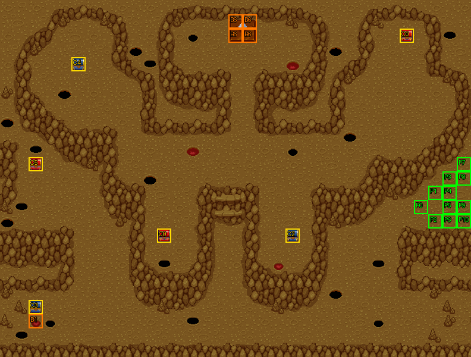

# 第 24 章　魔精石之秘密

<!-- chapter_docs:header -->
| 項目 | 內容 |
| --- | --- |
| 章號／章節索引 | 24／23 |
| 章名（文字區塊 `0x01`） | 魔精石之秘密 |
| 勝利條件（`0x02`） | 敵人全滅 |
| 敗北條件（`0x03`） | 蘭迪斯死亡 |
| 戰場 | `MAP23.DAT`／`MAP23.COD`／`M23.DTL`，33×25 格，我方 slot 11 個，部署記錄 80 筆 |
| 文字區塊 | `FDETXT24.TXT`，30 條 |
| 進入處理（`0x60074`[23]） | `fdps_chapter_24_init`（`0x21490`） |
| 行動後檢查（`0x6028c`[23]） | `fdps_chapter_24_post_action`（`0x3b3d0`） |
| 勝利處理（`0x60304`[23]） | `fdps_chapter_24_end`（`0x3b600`） |
| 地圖資料呼叫的事件處理（`0x601c4`） | slot 36：`fdps_chapter_24_event_deploy_wave_for_turn`（`0x38cc0`）（回合事件） |
| 過場腳本 | `ICON23.DAT`（開場）、`WIN23.DAT`（勝利） |
| 本章之前的村莊 | `SHOP23.DAT` |
| 光碟 | 第 2 片（音軌見 [CD 音軌](../program_info/cd_audio.md)） |



戰場全圖（第 0 層與同步捲動的圖層）。框線：黃 `C` 寶箱、橘 `B` 埋藏格、青 `R` 重繪格、洋紅 `E` 有處理函式的格子事件格，字母後的數字是事件碼；綠 `P` 是我方 slot 的起始格。

圖由 `python tools/chapter_docs/chapter_facts.py render-maps` 從遊戲檔重畫到 `chapters/maps/`，`verify-maps` 逐 byte 比對版控中的圖。
<!-- /chapter_docs:header -->

## 概要

法蓮娜離隊後，蘭迪斯一行在洞窟裡聽見唸咒聲，上前看見黑暗祭司在禁地舉行祭祀。祭司說自己法力不足，但手上的魔精石可以，本想找無辜者試驗它的威力，正好拿闖進來的人當試驗品，於是唸咒召喚出幽魂與骷髏兵（開場過場 `ICON23.DAT`，文字 `0x09`–`0x0c`）。

戰鬥中祭司兩度再召喚死靈（第 5、13 回合），第 8 回合抱怨法力所剩不多。第 7 回合開始時，索爾從前的戰友、法師珊從右上方趕到：她接到索爾的信，要她照料一批「邊打邊逃」的小子，看他們似乎遇上麻煩，決定先幫忙解決眼前的事（`0x0e`）。第 10 回合教團的精銳突擊隊從兩側殺到，要捉拿反教團的叛亂份子（`0x12`）；第 13 回合祭司見教團出現，想趁火打劫，第 15 回合孤注一擲把冥界的住民全部叫出來（`0x13`、`0x14`）。

勝利過場 `WIN23.DAT` 裡費塔加向珊說明來龍去脈，珊覺得救人這麼有趣的事不能少了她，決定同行（`0x1b`）。接著地面震動，魔精石碎裂（播 `ICON0058.SAF`，並把魔精石所在的 (16, 1)–(17, 2) 四格地形換掉），珊惋惜連碎片都沒留下，眾人往北前往目的地（`0x1c`、`0x1d`）。實際上魔精石四格底下埋著 `B3` 魔精石碎片，戰鬥中就挖得到（見「寶物」）。

裘娜帶著妖刀村正在第 25 回合以前過關時，第 15、19 章出現過的「？？？？」會再次現身，說這是最後一次見面、要不要比試（`0x15`、`0x16`）。

## 加入與離隊

- **珊**（`0A`）在本章入隊。入隊當下建立的是 LV10 的名冊記錄；第 7 回合的到場事件部署 `MAP23` 的 LV15 珊（陣營 2，玩家操作），她在場的話戰鬥結束時的寫回以她蓋過名冊記錄，沒等到她到場就過關則保留 LV10 的記錄。規則與表見 [`assets/characters.md` 的「加入」](../assets/characters.md#加入)。
- **法蓮娜**不上場：開場過場 `ICON23.DAT` 的第二條指令以 `RETIRE_UNIT` 讓地圖單位 3（名冊第 4 位的法蓮娜）退場，之後沒有復歸，攻略站的「法蓮娜以外的所有人」就是這樣來的。她在第 23 章之後離隊，見 [第 23 章](ch23.md)。
- 本章沒有客串單位。接受決鬥時裘娜以外的全員被暫時設為退場，勝利處理再把他們恢復（見下節）。

## 勝敗條件與特殊機制

- **一般情況**：`fdps_chapter_24_post_action`（`0x3b3d0`）在決鬥旗標（觸發旗標陣列元素 `0x11`）未設時只轉呼共用判定 `fdps_battle_check_default_end_conditions`（`0x3a2e0`）：場上沒有未退場的陣營 0 單位就過關，單位 0 蘭迪斯退場就敗北（同一次行動兩者都成立時敗北優先）。與畫面上的「敵人全滅／蘭迪斯死亡」一致。本章沒有回合限制的敗北。
- **援軍只看回合**：`fdps_chapter_24_event_deploy_wave_for_turn`（`0x38cc0`）只比對回合數，黑暗祭司死了援軍照樣按回合出現；反過來，場上敵人一旦全滅就立刻過關，之後的波次不會再來。
- **裘娜的第二場決鬥**（可選）：清場的那次行動之後，`fdps_chapter_24_post_action`（`0x3b3d0`）在五個條件都成立時部署波次 7 的「？？？？」（LV40，拿著妖刀正宗）並詢問裘娜：回合數 ≤ 25（有號比較）、結束碼已是 2、決鬥旗標未設、裘娜（單位 4）未退場、裘娜背包裡有 `A6` 妖刀村正。村正是 [第 19 章](ch19.md) 的決鬥換來的。
  - **接受**：把索引 0 到「目前單位數 − 2」之中裘娜以外的每個單位的狀態 byte 整個寫成 1（退場，連同蘭迪斯與珊），結束碼改回 0，戰鬥繼續成為一對一。旗標設起後處理函式不再呼叫共用判定，所以蘭迪斯退場不會敗北；改判「裘娜或挑戰者任一方退場」就寫結束碼 2 過關——**決鬥輸了本章照樣過關**。挑戰者退場（裘娜贏）時畫 `0x19`，拿走裘娜身上的村正（還在的話）並給她 `A7` 妖刀正宗；裘娜退場時畫 `0x1a`，什麼都不給。
  - **拒絕或取消**：畫 `0x18`，結束碼維持 2，本章結束。兩種答案都會設起旗標，所以只問一次。
  - 挑戰者由寫死的單位索引 `0x52` 判定勝負。`0x52`（82）正好是五個回合波次與珊全部出場後的單位數（11 個我方 slot、祭司、波次 1、2、6、4、3、5），只有在第 15 回合的波次 5 出場之後過關，挑戰者才落在這一格；在那之前過關，判定讀的是陣列之外的記錄，攻略站記載的「狂戰士自動認輸」即此，見 [`known_bugs.md` 第 13 條](../program_info/known_bugs.md) 與 [`program_info/chapter.md`](../program_info/chapter.md)。
- **決鬥被提出過就免費全員恢復**：`fdps_chapter_24_end`（`0x3b600`）在旗標已設時，把角色編號 ≤ `0B` 的每個單位狀態 byte 清 0、HP／MP 補滿。旗標不記得玩家怎麼回答，所以**拒絕決鬥也會得到這次恢復**，戰鬥中倒下的隊員因此在付費復活之前就被免費救回。
- `B3` 魔精石碎片帶在身上每回合回復 MP，見 [`assets/items.md`](../assets/items.md)。

## 敵人配置

開場時場上只有黑暗祭司（LV20，AI 2 原地）守在魔精石正下方的 (17, 3)，開場過場讓他召喚出第一批 4 幽魂＋5 骷髏兵（波次 1），圍在他身邊。第 5、13 回合的波次 2、3 是同樣的組成、同樣的錨點，全部 AI 0 主動出擊；第 15 回合的波次 5 是 4 幽魂＋11 骷髏兵，AI 2，站在祭司周圍與魔精石下方的通道（16–17, 5–7）不追擊。

第 10 回合的波次 4 是教團的突擊隊，兩路包夾：2 暗魔導士、6 鎧甲武士、4 神箭手錨在我方起始的右側入口 (29–32, 13–15)，15 名天空騎士分成三組、各 5 名，錨在左緣的 (1–3, 1–3)、(1–3, 11–13)、(1–3, 21–23)。所有回合波次都是找最近空格放置，錨點被占時會落在附近。

決鬥的挑戰者「？？？？」（`23`，LV40）是波次 7，錨點 (15, 23)。`MAP23` 另有 8 名野蠻戰士（波次 FF）沒有任何部署路徑。

<!-- chapter_docs:deployments -->
陣營與死亡腳本的意義見 [`resource_info/map.md`](../resource_info/map.md)，AI 行為（低 4 bit）見 [`program_info/map_ai.md`](../program_info/map_ai.md#行為代碼)；錨點是 `MAPnn.COD` 的座標，開場波次放在錨點上，其餘波次依部署方式放在錨點或最近的空格。單位名是全域文字的「角色編號 + 1」條；角色編號 `3C` 以上的敵兵，數值（`ENEMYDAT.DAT`）與種族、職業見 [`assets/enemies.md`](../assets/enemies.md)，以下的見 [`assets/characters.md`](../assets/characters.md)。

我方起始格：slot 0 (29, 14)、slot 1 (30, 13)、slot 2 (30, 15)、slot 3 (31, 12)、slot 4 (31, 13)、slot 5 (31, 14)、slot 6 (31, 15)、slot 7 (32, 11)、slot 8 (32, 12)、slot 9 (32, 14)、slot 10 (32, 15)。

| 波次 | 陣營 | 單位 | 等級 | 數量 |
| ---: | --- | --- | --- | ---: |
| 0 | 敵方 | `68` 黑暗祭司 | 20 | 1 |
| 1 | 敵方 | `69` 幽魂 | 19 | 4 |
| 1 | 敵方 | `54` 骷顱兵 | 19 | 5 |
| 2 | 敵方 | `69` 幽魂 | 19 | 4 |
| 2 | 敵方 | `54` 骷顱兵 | 19 | 5 |
| 3 | 敵方 | `69` 幽魂 | 19 | 4 |
| 3 | 敵方 | `54` 骷顱兵 | 19 | 5 |
| 4 | 敵方 | `67` 暗魔導士 | 20 | 2 |
| 4 | 敵方 | `64` 鎧甲武士 | 16 | 6 |
| 4 | 敵方 | `5F` 神箭手 | 16 | 4 |
| 4 | 敵方 | `61` 天空騎士 | 16 | 15 |
| 5 | 敵方 | `69` 幽魂 | 19 | 4 |
| 5 | 敵方 | `54` 骷顱兵 | 19 | 11 |
| 6 | 我方 | `0A` 珊 | 15 | 1 |
| 7 | 敵方 | `23` ？？？？ | 40 | 1 |

### 波次 0

出場：進入戰場時由 `fdps_build_map_unit_array`（`0x22be0`） 部署在錨點上

| # | 陣營 | 單位 | 等級 | AI 行為 | 錨點 | 死亡腳本 |
| ---: | --- | --- | ---: | --- | --- | --- |
| 0 | 敵方 | `68` 黑暗祭司 | 20 | 2 原地 | (17, 3) | 掉落 `B9` 水晶粒 |

### 波次 1

出場：開場過場 `ICON23.DAT` `0x105` 的 `DEPLOY_WAVE`（找最近空格），由 `fdps_chapter_24_init`（`0x21490`）執行；黑暗祭司唸完咒召喚出來，戰鬥開始時就在場上

| # | 陣營 | 單位 | 等級 | AI 行為 | 錨點 | 死亡腳本 |
| ---: | --- | --- | ---: | --- | --- | --- |
| 1 | 敵方 | `69` 幽魂 | 19 | 0 主動 | (15, 3) | — |
| 2 | 敵方 | `69` 幽魂 | 19 | 0 主動 | (16, 3) | — |
| 3 | 敵方 | `69` 幽魂 | 19 | 0 主動 | (18, 3) | — |
| 4 | 敵方 | `69` 幽魂 | 19 | 0 主動 | (19, 3) | — |
| 5 | 敵方 | `54` 骷顱兵 | 19 | 0 主動 | (17, 4) | — |
| 6 | 敵方 | `54` 骷顱兵 | 19 | 0 主動 | (16, 4) | — |
| 7 | 敵方 | `54` 骷顱兵 | 19 | 0 主動 | (18, 4) | 掉落 4000 金 |
| 8 | 敵方 | `54` 骷顱兵 | 19 | 0 主動 | (15, 4) | 掉落 `C2` 神聖之水 |
| 9 | 敵方 | `54` 骷顱兵 | 19 | 0 主動 | (19, 4) | — |

### 波次 2

出場：第 5 回合敵方階段前，回合事件 slot 36 呼叫 `fdps_chapter_24_event_deploy_wave_for_turn`（`0x38cc0`），先畫文字 `0x10` 再部署（找最近空格）

| # | 陣營 | 單位 | 等級 | AI 行為 | 錨點 | 死亡腳本 |
| ---: | --- | --- | ---: | --- | --- | --- |
| 11 | 敵方 | `69` 幽魂 | 19 | 0 主動 | (15, 3) | — |
| 12 | 敵方 | `69` 幽魂 | 19 | 0 主動 | (16, 3) | — |
| 13 | 敵方 | `69` 幽魂 | 19 | 0 主動 | (18, 3) | — |
| 14 | 敵方 | `69` 幽魂 | 19 | 0 主動 | (19, 3) | — |
| 15 | 敵方 | `54` 骷顱兵 | 19 | 0 主動 | (17, 4) | — |
| 16 | 敵方 | `54` 骷顱兵 | 19 | 0 主動 | (16, 4) | 掉落 `C2` 神聖之水 |
| 17 | 敵方 | `54` 骷顱兵 | 19 | 0 主動 | (18, 4) | — |
| 18 | 敵方 | `54` 骷顱兵 | 19 | 0 主動 | (15, 4) | — |
| 19 | 敵方 | `54` 骷顱兵 | 19 | 0 主動 | (19, 4) | — |

### 波次 3

出場：第 13 回合敵方階段前，回合事件 slot 36 呼叫 `fdps_chapter_24_event_deploy_wave_for_turn`（`0x38cc0`），先畫文字 `0x13` 再部署（找最近空格）

| # | 陣營 | 單位 | 等級 | AI 行為 | 錨點 | 死亡腳本 |
| ---: | --- | --- | ---: | --- | --- | --- |
| 20 | 敵方 | `69` 幽魂 | 19 | 0 主動 | (15, 3) | — |
| 21 | 敵方 | `69` 幽魂 | 19 | 0 主動 | (16, 3) | — |
| 22 | 敵方 | `69` 幽魂 | 19 | 0 主動 | (18, 3) | — |
| 23 | 敵方 | `69` 幽魂 | 19 | 0 主動 | (19, 3) | — |
| 24 | 敵方 | `54` 骷顱兵 | 19 | 0 主動 | (17, 4) | — |
| 25 | 敵方 | `54` 骷顱兵 | 19 | 0 主動 | (16, 4) | — |
| 26 | 敵方 | `54` 骷顱兵 | 19 | 0 主動 | (18, 4) | — |
| 27 | 敵方 | `54` 骷顱兵 | 19 | 0 主動 | (15, 4) | — |
| 28 | 敵方 | `54` 骷顱兵 | 19 | 0 主動 | (19, 4) | — |

### 波次 4

出場：第 10 回合敵方階段前，回合事件 slot 36 呼叫 `fdps_chapter_24_event_deploy_wave_for_turn`（`0x38cc0`），先部署（找最近空格）再畫文字 `0x12`

| # | 陣營 | 單位 | 等級 | AI 行為 | 錨點 | 死亡腳本 |
| ---: | --- | --- | ---: | --- | --- | --- |
| 29 | 敵方 | `67` 暗魔導士 | 20 | 0 主動 | (30, 14) | — |
| 30 | 敵方 | `67` 暗魔導士 | 20 | 0 主動 | (31, 14) | — |
| 31 | 敵方 | `64` 鎧甲武士 | 16 | 0 主動 | (29, 13) | — |
| 32 | 敵方 | `64` 鎧甲武士 | 16 | 0 主動 | (30, 13) | — |
| 33 | 敵方 | `64` 鎧甲武士 | 16 | 0 主動 | (31, 13) | — |
| 34 | 敵方 | `64` 鎧甲武士 | 16 | 0 主動 | (32, 13) | — |
| 35 | 敵方 | `64` 鎧甲武士 | 16 | 0 主動 | (29, 14) | — |
| 36 | 敵方 | `64` 鎧甲武士 | 16 | 0 主動 | (32, 14) | — |
| 37 | 敵方 | `5F` 神箭手 | 16 | 0 主動 | (29, 15) | — |
| 38 | 敵方 | `5F` 神箭手 | 16 | 0 主動 | (30, 15) | — |
| 39 | 敵方 | `5F` 神箭手 | 16 | 0 主動 | (31, 15) | — |
| 40 | 敵方 | `5F` 神箭手 | 16 | 0 主動 | (32, 15) | — |
| 41 | 敵方 | `61` 天空騎士 | 16 | 0 主動 | (3, 2) | — |
| 42 | 敵方 | `61` 天空騎士 | 16 | 0 主動 | (2, 1) | — |
| 43 | 敵方 | `61` 天空騎士 | 16 | 0 主動 | (2, 2) | — |
| 44 | 敵方 | `61` 天空騎士 | 16 | 0 主動 | (2, 3) | — |
| 45 | 敵方 | `61` 天空騎士 | 16 | 0 主動 | (1, 2) | — |
| 46 | 敵方 | `61` 天空騎士 | 16 | 0 主動 | (3, 12) | — |
| 47 | 敵方 | `61` 天空騎士 | 16 | 0 主動 | (2, 11) | — |
| 48 | 敵方 | `61` 天空騎士 | 16 | 0 主動 | (2, 12) | — |
| 49 | 敵方 | `61` 天空騎士 | 16 | 0 主動 | (2, 13) | — |
| 50 | 敵方 | `61` 天空騎士 | 16 | 0 主動 | (1, 12) | — |
| 51 | 敵方 | `61` 天空騎士 | 16 | 0 主動 | (3, 22) | — |
| 52 | 敵方 | `61` 天空騎士 | 16 | 0 主動 | (2, 21) | — |
| 53 | 敵方 | `61` 天空騎士 | 16 | 0 主動 | (2, 22) | — |
| 54 | 敵方 | `61` 天空騎士 | 16 | 0 主動 | (2, 23) | — |
| 55 | 敵方 | `61` 天空騎士 | 16 | 0 主動 | (1, 22) | — |

### 波次 5

出場：第 15 回合敵方階段前，回合事件 slot 36 呼叫 `fdps_chapter_24_event_deploy_wave_for_turn`（`0x38cc0`），先畫文字 `0x14` 再部署（找最近空格）

| # | 陣營 | 單位 | 等級 | AI 行為 | 錨點 | 死亡腳本 |
| ---: | --- | --- | ---: | --- | --- | --- |
| 56 | 敵方 | `69` 幽魂 | 19 | 2 原地 | (15, 3) | — |
| 57 | 敵方 | `69` 幽魂 | 19 | 2 原地 | (16, 3) | — |
| 58 | 敵方 | `69` 幽魂 | 19 | 2 原地 | (18, 3) | — |
| 59 | 敵方 | `69` 幽魂 | 19 | 2 原地 | (19, 3) | — |
| 60 | 敵方 | `54` 骷顱兵 | 19 | 2 原地 | (17, 4) | — |
| 61 | 敵方 | `54` 骷顱兵 | 19 | 2 原地 | (16, 4) | — |
| 62 | 敵方 | `54` 骷顱兵 | 19 | 2 原地 | (18, 4) | — |
| 63 | 敵方 | `54` 骷顱兵 | 19 | 2 原地 | (15, 4) | — |
| 64 | 敵方 | `54` 骷顱兵 | 19 | 2 原地 | (19, 4) | — |
| 65 | 敵方 | `54` 骷顱兵 | 19 | 2 原地 | (16, 7) | — |
| 66 | 敵方 | `54` 骷顱兵 | 19 | 2 原地 | (17, 7) | — |
| 67 | 敵方 | `54` 骷顱兵 | 19 | 2 原地 | (16, 6) | — |
| 68 | 敵方 | `54` 骷顱兵 | 19 | 2 原地 | (17, 6) | — |
| 69 | 敵方 | `54` 骷顱兵 | 19 | 2 原地 | (16, 5) | — |
| 70 | 敵方 | `54` 骷顱兵 | 19 | 2 原地 | (17, 5) | — |

### 波次 6

出場：回合計數 7 的我方階段前，回合事件 slot 36 呼叫 `fdps_chapter_24_event_deploy_wave_for_turn`（`0x38cc0`），先部署珊（找最近空格）再畫文字 `0x0e`

| # | 陣營 | 單位 | 等級 | AI 行為 | 錨點 | 死亡腳本 |
| ---: | --- | --- | ---: | --- | --- | --- |
| 10 | 我方 | `0A` 珊 | 15 | 0 主動 | (27, 2) | — |

### 波次 7

出場：第 25 回合（含）以前清完敵人、裘娜（單位 4）未退場且背包裡有 `A6` 妖刀村正時，`fdps_chapter_24_post_action`（`0x3b3d0`）在清場的那次行動後部署（找最近空格），只發生一次

| # | 陣營 | 單位 | 等級 | AI 行為 | 錨點 | 死亡腳本 |
| ---: | --- | --- | ---: | --- | --- | --- |
| 71 | 敵方 | `23` ？？？？ | 40 | 0 主動 | (15, 23) | — |

### 波次 FF

8 筆記錄（#72–#79）永遠不會部署：沒有任何呼叫以 255 部署：回合事件處理函式只部署 2、6、4、3、5，行動後檢查只部署 7，`ICON23.DAT` 只部署 1，`WIN23.DAT` 沒有 `DEPLOY_WAVE`，見 [S11](../cut_content/story.md#s11-18-筆波次-0xff-的部署記錄)。
<!-- /chapter_docs:deployments -->

## 寶物

- **魔精石碎片**：魔精石本身的四格 (16, 1)、(17, 1)、(16, 2)、(17, 2) 是共用記錄 6 的埋藏格，任一格挖到 `B3` 魔精石碎片後其他三格就挖不到。它是 [第 27 章](ch27.md) 勝利時走隱藏路線的兩件道具之一：`fdps_chapter_27_end`（`0x3b8f0`）要蘭迪斯帶著它、法蓮娜帶著 [第 23 章](ch23.md) 的反禁制器。
- **高能量裝置**：埋在 (2, 22)，就在 (2, 21) 寶箱的下一格。布蘭多帶著 [第 16 章](ch16.md) 流浪工匠給的 `A3` 金屬礦時使用它，會換成 `BE` 高能量砲（效果見 [`assets/items.md`](../assets/items.md)）。
- 搜尋不限角色：`fdps_battle_search_cell_at_cursor`（`0x184f0`）只看格子類別與旗標，攻略站寫的「須由布蘭多去拿」不是程式條件。
- **妖刀正宗**：裘娜打贏決鬥時由 `fdps_chapter_24_post_action`（`0x3b3d0`）直接放進她的背包，不經寶箱。

<!-- chapter_docs:treasure -->
搜尋的規則（同碼的格共用一筆記錄與一個旗標、背包滿時的交換）見 [`resource_info/map.md`](../resource_info/map.md)。

| 事件碼 | 格 | 內容 |
| ---: | --- | --- |
| 0 | (28, 2) 寶箱、(11, 16) 寶箱 | 8000 金（2 格共用，只拿得到一次） |
| 1 | (2, 22) 埋藏 | `BB` 高能量裝置 |
| 2 | (20, 16) 寶箱 | `D2` 炎之魔石 |
| 3 | (2, 21) 寶箱 | `41` 魔力拳套 |
| 4 | (5, 4) 寶箱 | `D8` 力量藥水 |
| 5 | (2, 11) 寶箱 | `D6` 生命之實 |
| 6 | (16, 1) 埋藏、(17, 1) 埋藏、(16, 2) 埋藏、(17, 2) 埋藏 | `B3` 魔精石碎片（4 格共用，只拿得到一次） |

沒有任何格引用、拿不到的記錄：記錄 10（種類 0、內容 `1C`），見 [I04](../cut_content/items.md#i04-章節地圖上沒有格子引用的寶物記錄)。

擊倒後掉落（死亡腳本 opcode 0／1，擊殺者須是存活的我方單位）：

| # | 單位 | 波次 | 掉落 |
| ---: | --- | ---: | --- |
| 0 | `68` 黑暗祭司 | 0 | 掉落 `B9` 水晶粒 |
| 7 | `54` 骷顱兵 | 1 | 掉落 4000 金 |
| 8 | `54` 骷顱兵 | 1 | 掉落 `C2` 神聖之水 |
| 16 | `54` 骷顱兵 | 2 | 掉落 `C2` 神聖之水 |
<!-- /chapter_docs:treasure -->

## 村莊

<!-- chapter_docs:village -->
第 23 章勝利後、本章之前的村莊載入 `SHOP23.DAT`，道具店、武器店、秘密商店的貨見 [`assets/shops.md`](../assets/shops.md)。村莊載入的文字區塊是 `FDETXT24`（章節索引 + 1，`fdps_load_field_chapter_resources`（`0x31540`）），也就是本章的區塊，所以村莊畫面的文字是本章區塊的 `0x04`–`0x08`，全文在下方「對話」。
<!-- /chapter_docs:village -->

## 處理流程

### `fdps_chapter_24_init`（`0x21490`）

1. `fdps_chapter_state_reset`（`0x22750`）：從名冊填滿地圖 23 的 11 個我方 slot（名冊此時正好 11 人），部署波次 0 的黑暗祭司，清空觸發旗標（含決鬥旗標）。
2. `fdps_roster_add_character`（`0x23bc0`）加入珊（`0A`），她是名冊第 12 位，本章不以名冊記錄上場。這是整個家族裡唯一把入隊排在 reset 之後的一支；在這張地圖上兩種順序結果相同，見 [`program_info/chapter.md`](../program_info/chapter.md)。
3. `fdps_icon_script_run`（`0x21650`）播 `ICON23.DAT`：法蓮娜退場、對話 `0x09`–`0x0b`、畫面震動並捲到祭司，`0x105` 部署波次 1，最後 `0x0c`。腳本在 `0x108`、`0x10D` 兩處對單位 38 轉向，但當時只有 21 個單位，方向 byte 寫到陣列之外，見 [`resource_info/cutscene_script.md`](../resource_info/cutscene_script.md)。
4. `fdps_show_chapter_title_card`（`0x20c60`）顯示章名卡。
5. `fdps_map_cursor_move_to_unit`（`0x2da50`）把游標放在單位 0（蘭迪斯，起始格 (29, 14)）。

### `fdps_chapter_24_event_deploy_wave_for_turn`（`0x38cc0`）

`MAP23` 的六筆回合事件都指向 slot 36 的這一支，它依回合計數分派，參數不用：

| 回合 | 時機 | 動作 |
| ---: | --- | --- |
| 5 | 敵方階段前 | 畫 `0x10`，部署波次 2 |
| 7 | 我方階段前 | 部署波次 6（珊），畫 `0x0e` |
| 8 | 敵方階段前 | 只畫 `0x11` |
| 10 | 敵方階段前 | 部署波次 4，畫 `0x12` |
| 13 | 敵方階段前 | 畫 `0x13`，部署波次 3 |
| 15 | 敵方階段前 | 畫 `0x14`，部署波次 5 |

波次編號是每個分支的常數，不是由回合算出；全部以找最近空格放置。

### `fdps_chapter_24_post_action`（`0x3b3d0`）

每次行動後執行，分兩半：

1. **判定**：決鬥旗標（元素 `0x11`）未設 → 呼叫 `fdps_battle_check_default_end_conditions`（`0x3a2e0`）。旗標已設 → 以 `fdps_unit_is_retired`（`0x109b0`）問裘娜（單位 4）或挑戰者（單位 `0x52`）有沒有退場；兩人都在場就什麼都不寫，決鬥繼續。有一方退場時再問一次挑戰者：他退場就畫 `0x19`、移除裘娜的 `A6`（有的話）、以 `fdps_unit_add_item`（`0x25d20`）給 `A7`；否則畫 `0x1a`。兩者都把結束碼寫成 2。
2. **提出決鬥**：回合 ≤ 25、結束碼是 2、旗標未設、裘娜未退場、她帶著 `A6` 五項都成立時：以 `fdps_deploy_wave`（`0x23830`）部署波次 7（找最近空格）；畫 `0x15`；開啟帶挑戰者頭像（`FACE.CEL` 第 `0x23` 筆）的訊息面板畫 `0x16`；`fdps_prompt_two_choice`（`0x17990`）等待回答；關閉面板。回答 0（左格）是接受：畫 `0x17`，把索引 0 到單位數 − 2 中裘娜以外的單位狀態 byte 設成 1，結束碼改回 0。其他回答（右格、取消）畫 `0x18`。最後設起旗標。拒絕的那一行畫在已經關掉的面板內側位置，接受的那一行畫在畫面左上角。

### `fdps_chapter_24_end`（`0x3b600`）

1. 決鬥旗標已設時，走遍所有單位，把角色編號 ≤ `0B` 者的狀態 byte 清 0、HP 與 MP 補回上限。
2. `fdps_battle_destroy_remaining_enemies`（`0x39e10`）清掉殘敵（拒絕決鬥、或接受後裘娜輸了時，還在場的挑戰者在這裡被清掉）。
3. `fdps_roster_write_back_battle_units`（`0x23980`）寫回名冊；第 1 步必須在這之前，否則被設為退場的隊員會以死亡狀態進名冊。
4. `fdps_icon_script_run`（`0x21650`）播 `WIN23.DAT`。
5. `fdps_roster_revive_fallen_members`（`0x39e70`）付費復活倒下的隊員。
6. 章節索引設為 24，下一章是 [第 25 章](ch25.md)。

`WIN23.DAT` 裡的 u30 是珊：第 5 回合的波次 2 占掉單位 21–29，第 7 回合的珊接在 30。在她到場之前過關時，u30 指到什麼看當時的單位數：

- **第 5 回合的波次 2 出場前過關，或之後過關但沒有被提出決鬥**：單位數不到 31，u30 在陣列之外。`REVIVE_UNIT` 與 `PLACE_UNIT` 檢查單位數，整條略過；`WALK_UNITS` 的 `fdps_icon_script_walk_units`（`0x21f60`）與 `FACE_UNITS` 不檢查，照樣把方向、座標與步伐 byte 寫進單位陣列之後的堆積（那裡是什麼由 [`program_info/memory_layout.md`](../program_info/memory_layout.md) 的佈局決定）。`fdps_draw_map_units`（`0x2d240`）只畫單位數以內的單位，所以過場裡沒有珊的身影，她的台詞照常顯示。
- **波次 2 出場後、第 7 回合之前過關並被提出決鬥**：挑戰者附加在索引 30，u30 就是他。戰鬥結束時他一定已退場（裘娜打贏時被打倒，其他情況由 `fdps_battle_destroy_remaining_enemies`（`0x39e10`）清掉），過場的 `REVIVE_UNIT` 把他復歸，於是由「？？？？」站上 (25, 0)、走完珊的全部走位。

## 回合事件與格子事件

<!-- chapter_docs:events -->
觸發時機與陣營階段的意義見 [`resource_info/map.md`](../resource_info/map.md)。

| 回合 | 陣營階段 | slot | 處理函式 |
| ---: | --- | ---: | --- |
| 5 | 敵方階段前 | 36 | `fdps_chapter_24_event_deploy_wave_for_turn`（`0x38cc0`） |
| 8 | 敵方階段前 | 36 | `fdps_chapter_24_event_deploy_wave_for_turn`（`0x38cc0`） |
| 7 | 下一個我方階段前（回合計數 7） | 36 | `fdps_chapter_24_event_deploy_wave_for_turn`（`0x38cc0`） |
| 10 | 敵方階段前 | 36 | `fdps_chapter_24_event_deploy_wave_for_turn`（`0x38cc0`） |
| 13 | 敵方階段前 | 36 | `fdps_chapter_24_event_deploy_wave_for_turn`（`0x38cc0`） |
| 15 | 敵方階段前 | 36 | `fdps_chapter_24_event_deploy_wave_for_turn`（`0x38cc0`） |

本章沒有格子事件。
<!-- /chapter_docs:events -->

## 過場腳本

<!-- chapter_docs:scripts -->
格式與每個指令的意義見 [`resource_info/cutscene_script.md`](../resource_info/cutscene_script.md)。`FDETXT24#0xNN` 是本章文字區塊的條目，全文在下方「對話」；切到額外場景之後顯示的文字直接列出（那些區塊的正典是 [`assets/text/scene_text.md`](../assets/text/scene_text.md)）。`u3=我方1` 是地圖單位索引 3 對到我方 slot 1，`u12=MAP02#9` 是 `MAP02.DAT` 第 9 筆部署記錄。

### `ICON23.DAT`

- 開場：`fdps_chapter_24_init`（`0x21490`）
- 277 byte、42 步；起始地圖 23，切換地圖 無，結束於地圖 23
- 越界：0x0108 FACE_UNITS: unit 38 >= unit count 21, written past the end of the unit array
- 越界：0x010d FACE_UNITS: unit 38 >= unit count 21, written past the end of the unit array

| 偏移 | 指令 | 內容 |
| ---: | --- | --- |
| `0000` | `SET_MUSIC` | 音樂 3（CD 第 4 軌） |
| `0002` | `RETIRE_UNIT` | 退場 u3=我方3 |
| `0004` | `SCROLL_VIEW` | 捲動視野到格 (20, 10) |
| `0007` | `FACE_UNITS` | 轉向後停 25 幀：u4=我方4朝上、u7=我方7朝上、u8=我方8朝上、u9=我方9朝上 |
| `0012` | `WALK_UNITS` | 行走 1 格，每步 4 幀：u9=我方9往上 |
| `0018` | `FACE_UNITS` | 轉向後停 25 幀：u9=我方9朝左 |
| `001d` | `FACE_UNITS` | 轉向後停 25 幀：u9=我方9朝右 |
| `0022` | `FACE_UNITS` | 轉向後停 25 幀：u9=我方9朝上 |
| `0027` | `DRAW_TEXT` | 顯示文字 FDETXT24#0x09 |
| `0029` | `FACE_UNITS` | 轉向後停 25 幀：u1=我方1朝左、u2=我方2朝左、u3=我方3朝左、u4=我方4朝左、u5=我方5朝左、u6=我方6朝左、u7=我方7朝左、u8=我方8朝左、u9=我方9朝左 |
| `003e` | `FACE_UNITS` | 轉向後停 1 幀：u6=我方6朝右 |
| `0043` | `FACE_UNITS` | 轉向後停 1 幀：u7=我方7朝上 |
| `0048` | `DRAW_TEXT` | 顯示文字 FDETXT24#0x0a |
| `004a` | `FACE_UNITS` | 轉向後停 25 幀：u1=我方1朝上、u2=我方2朝上、u4=我方4朝左、u9=我方9朝上 |
| `0055` | `FACE_UNITS` | 轉向後停 6 幀：u4=我方4朝上 |
| `005a` | `FACE_UNITS` | 轉向後停 6 幀：u4=我方4朝左 |
| `005f` | `FACE_UNITS` | 轉向後停 6 幀：u4=我方4朝下 |
| `0064` | `FACE_UNITS` | 轉向後停 6 幀：u4=我方4朝左 |
| `0069` | `DRAW_TEXT` | 顯示文字 FDETXT24#0x0b |
| `006b` | `FACE_UNITS` | 轉向後停 25 幀：u1=我方1朝右、u2=我方2朝右、u3=我方3朝右、u4=我方4朝右、u5=我方5朝右、u6=我方6朝右、u7=我方7朝右、u8=我方8朝右、u9=我方9朝右 |
| `0080` | `FACE_UNITS` | 轉向後停 12 幀：u1=我方1朝上、u2=我方2朝上、u3=我方3朝上、u4=我方4朝上、u5=我方5朝上、u6=我方6朝上、u7=我方7朝上、u8=我方8朝上、u9=我方9朝上 |
| `0095` | `SHAKE_VIEW` | 視野位移 4 步，每步 2 幀：(6,-6) (12,-12) (18,-18) (24,-24) |
| `00a0` | `SCROLL_VIEW` | 捲動視野到格 (6, 11) |
| `00a3` | `SHAKE_VIEW` | 視野位移 4 步，每步 2 幀：(6,-6) (12,-12) (18,-18) (24,-24) |
| `00ae` | `SCROLL_VIEW` | 捲動視野到格 (7, 10) |
| `00b1` | `SHAKE_VIEW` | 視野位移 4 步，每步 2 幀：(6,-6) (12,-12) (18,-18) (24,-24) |
| `00bc` | `SCROLL_VIEW` | 捲動視野到格 (8, 9) |
| `00bf` | `SHAKE_VIEW` | 視野位移 4 步，每步 2 幀：(6,-6) (12,-12) (18,-18) (24,-24) |
| `00ca` | `SCROLL_VIEW` | 捲動視野到格 (9, 8) |
| `00cd` | `SHAKE_VIEW` | 視野位移 4 步，每步 2 幀：(6,-6) (12,-12) (18,-18) (24,-24) |
| `00d8` | `SCROLL_VIEW` | 捲動視野到格 (10, 7) |
| `00db` | `SHAKE_VIEW` | 視野位移 4 步，每步 2 幀：(6,-6) (12,-12) (18,-18) (24,-24) |
| `00e6` | `SCROLL_VIEW` | 捲動視野到格 (11, 6) |
| `00e9` | `SHAKE_VIEW` | 視野位移 4 步，每步 2 幀：(0,-6) (0,-12) (0,-18) (0,-24) |
| `00f4` | `SCROLL_VIEW` | 捲動視野到格 (11, 5) |
| `00f7` | `SHAKE_VIEW` | 視野位移 4 步，每步 2 幀：(0,-6) (0,-12) (0,-18) (0,-24) |
| `0102` | `SCROLL_VIEW` | 捲動視野到格 (11, 4) |
| `0105` | `DEPLOY_WAVE` | 部署 MAP23 波次 1（找最近空格）：#1(角色0x69)、#2(角色0x69)、#3(角色0x69)、#4(角色0x69)、#5(角色0x54)、#6(角色0x54)、#7(角色0x54)、#8(角色0x54)、#9(角色0x54) |
| `0108` | `FACE_UNITS` | 轉向後停 8 幀：u38(越界)朝下 |
| `010d` | `FACE_UNITS` | 轉向後停 50 幀：u38(越界)朝下 |
| `0112` | `DRAW_TEXT` | 顯示文字 FDETXT24#0x0c |
| `0114` | `END` | 結束 |

### `WIN23.DAT`

- 勝利：`fdps_chapter_24_end`（`0x3b600`）
- 585 byte、90 步；起始地圖 23，切換地圖 無，結束於地圖 23

| 偏移 | 指令 | 內容 |
| ---: | --- | --- |
| `0000` | `FADE_OUT` | 淡出，每步 20 ms |
| `0002` | `SET_MUSIC` | 音樂 10（CD 第 11 軌） |
| `0004` | `SET_VIEW_TILE` | 視野直接設到格 (11, 0) |
| `0007` | `RETIRE_UNIT` | 退場 u1=我方1 |
| `0009` | `RETIRE_UNIT` | 退場 u10=我方10 |
| `000b` | `RETIRE_UNIT` | 退場 u2=我方2 |
| `000d` | `RETIRE_UNIT` | 退場 u3=我方3 |
| `000f` | `RETIRE_UNIT` | 退場 u4=我方4 |
| `0011` | `RETIRE_UNIT` | 退場 u6=我方6 |
| `0013` | `RETIRE_UNIT` | 退場 u7=我方7 |
| `0015` | `REVIVE_UNIT` | 復歸 u30（清狀態） |
| `0017` | `REVIVE_UNIT` | 復歸 u5=我方5（清狀態） |
| `0019` | `REVIVE_UNIT` | 復歸 u8=我方8（清狀態） |
| `001b` | `REVIVE_UNIT` | 復歸 u9=我方9（清狀態） |
| `001d` | `PLACE_UNIT` | 放置 u0=我方0 到 (17, 4)，朝上 |
| `0022` | `PLACE_UNIT` | 放置 u30 到 (25, 0)，朝左 |
| `0027` | `PLACE_UNIT` | 放置 u5=我方5 到 (15, 3)，朝上 |
| `002c` | `PLACE_UNIT` | 放置 u8=我方8 到 (16, 4)，朝上 |
| `0031` | `PLACE_UNIT` | 放置 u9=我方9 到 (18, 3)，朝上 |
| `0036` | `FACE_UNITS` | 轉向後停 1 幀：u0=我方0朝上 |
| `003b` | `FADE_IN` | 淡入，每步 10 ms |
| `003d` | `FACE_UNITS` | 轉向後停 25 幀：u0=我方0朝上 |
| `0042` | `FACE_UNITS` | 轉向後停 25 幀：u0=我方0朝左 |
| `0047` | `FACE_UNITS` | 轉向後停 25 幀：u8=我方8朝右 |
| `004c` | `WALK_UNITS` | 行走 2 格，每步 2 幀：u30往左 |
| `0052` | `FACE_UNITS` | 轉向後停 12 幀：u30朝下 |
| `0057` | `FACE_UNITS` | 轉向後停 12 幀：u30朝左 |
| `005c` | `FACE_UNITS` | 轉向後停 12 幀：u30朝下 |
| `0061` | `FACE_UNITS` | 轉向後停 12 幀：u30朝左 |
| `0066` | `FACE_UNITS` | 轉向後停 12 幀：u0=我方0朝上 |
| `006b` | `FACE_UNITS` | 轉向後停 12 幀：u8=我方8朝上 |
| `0070` | `WALK_UNITS` | 行走 3 格，每步 2 幀：u30往下 |
| `0076` | `FACE_UNITS` | 轉向後停 25 幀：u30朝左 |
| `007b` | `FACE_UNITS` | 轉向後停 25 幀：u0=我方0朝右、u5=我方5朝右、u8=我方8朝右、u9=我方9朝右 |
| `0086` | `WALK_UNITS` | 行走 1 格，每步 2 幀：u30往右 |
| `008c` | `WALK_UNITS` | 行走 7 格，每步 2 幀：u30往下 |
| `0092` | `WALK_UNITS` | 行走 8 格，每步 2 幀：u30往左 |
| `0098` | `FACE_UNITS` | 轉向後停 1 幀：u0=我方0朝下、u5=我方5朝下、u8=我方8朝下、u9=我方9朝下 |
| `00a3` | `WALK_UNITS` | 行走 5 格，每步 2 幀：u30往上 |
| `00a9` | `FACE_UNITS` | 轉向後停 1 幀：u0=我方0朝左、u9=我方9朝左 |
| `00b0` | `WALK_UNITS` | 行走 1 格，每步 2 幀：u30往上、u8=我方8往左 |
| `00b8` | `WALK_UNITS` | 行走 1 格，每步 2 幀：u30往上 |
| `00be` | `FACE_UNITS` | 轉向後停 12 幀：u5=我方5朝右、u8=我方8朝右 |
| `00c5` | `WALK_UNITS` | 行走 1 格，每步 4 幀：u8=我方8往右 |
| `00cb` | `FACE_UNITS` | 轉向後停 12 幀：u8=我方8朝右 |
| `00d0` | `DRAW_TEXT` | 顯示文字 FDETXT24#0x1b |
| `00d2` | `FACE_UNITS` | 轉向後停 6 幀：u0=我方0朝上、u8=我方8朝上 |
| `00d9` | `SHAKE_VIEW` | 視野位移 8 步，每步 1 幀：(-6,0) (-12,0) (-6,0) (0,0) (6,0) (12,0) (6,0) (0,0) |
| `00ec` | `FACE_UNITS` | 轉向後停 1 幀：u8=我方8朝右 |
| `00f1` | `DRAW_TEXT` | 顯示文字 FDETXT24#0x1c |
| `00f3` | `SHAKE_VIEW` | 視野位移 8 步，每步 1 幀：(-6,0) (-12,0) (-6,0) (0,0) (6,0) (12,0) (6,0) (0,0) |
| `0106` | `FACE_UNITS` | 轉向後停 1 幀：u0=我方0朝下 |
| `010b` | `SHAKE_VIEW` | 視野位移 8 步，每步 1 幀：(-6,0) (-12,0) (-6,0) (0,0) (6,0) (12,0) (6,0) (0,0) |
| `011e` | `FACE_UNITS` | 轉向後停 1 幀：u5=我方5朝上、u9=我方9朝下 |
| `0125` | `SHAKE_VIEW` | 視野位移 8 步，每步 1 幀：(-6,0) (-12,0) (-6,0) (0,0) (6,0) (12,0) (6,0) (0,0) |
| `0138` | `SHAKE_VIEW` | 視野位移 8 步，每步 1 幀：(-6,0) (-12,0) (-6,0) (0,0) (6,0) (12,0) (6,0) (0,0) |
| `014b` | `FACE_UNITS` | 轉向後停 1 幀：u0=我方0朝左、u9=我方9朝下 |
| `0152` | `SHAKE_VIEW` | 視野位移 8 步，每步 1 幀：(-6,0) (-12,0) (-6,0) (0,0) (6,0) (12,0) (6,0) (0,0) |
| `0165` | `SHAKE_VIEW` | 視野位移 8 步，每步 2 幀：(-6,0) (-12,0) (-6,0) (0,0) (6,0) (12,0) (6,0) (0,0) |
| `0178` | `FACE_UNITS` | 轉向後停 1 幀：u5=我方5朝右、u8=我方8朝上 |
| `017f` | `SHAKE_VIEW` | 視野位移 8 步，每步 2 幀：(-6,0) (-12,0) (-6,0) (0,0) (6,0) (12,0) (6,0) (0,0) |
| `0192` | `SHAKE_VIEW` | 視野位移 8 步，每步 3 幀：(-6,0) (-12,0) (-6,0) (0,0) (6,0) (12,0) (6,0) (0,0) |
| `01a5` | `FACE_UNITS` | 轉向後停 1 幀：u9=我方9朝左 |
| `01aa` | `SHAKE_VIEW` | 視野位移 8 步，每步 4 幀：(-6,0) (-12,0) (-6,0) (0,0) (6,0) (12,0) (6,0) (0,0) |
| `01bd` | `SHAKE_VIEW` | 視野位移 8 步，每步 5 幀：(-6,0) (-12,0) (-6,0) (0,0) (6,0) (12,0) (6,0) (0,0) |
| `01d0` | `FACE_UNITS` | 轉向後停 12 幀：u0=我方0朝上 |
| `01d5` | `PLAY_SAF` | 播放動畫 ICON0058.SAF |
| `01d7` | `SET_MAP_CELL` | 地形層 0 格 (16, 1) = 0x0029 |
| `01dc` | `SET_MAP_CELL` | 地形層 0 格 (16, 2) = 0x003f |
| `01e1` | `SET_MAP_CELL` | 地形層 0 格 (17, 1) = 0x002a |
| `01e6` | `SET_MAP_CELL` | 地形層 0 格 (17, 2) = 0x0040 |
| `01eb` | `FACE_UNITS` | 轉向後停 1 幀：u0=我方0朝上 |
| `01f0` | `FACE_UNITS` | 轉向後停 50 幀：u30朝上 |
| `01f5` | `WALK_UNITS` | 行走 1 格，每步 2 幀：u30往上 |
| `01fb` | `FACE_UNITS` | 轉向後停 25 幀：u30朝上、u5=我方5朝上、u9=我方9朝上 |
| `0204` | `WALK_UNITS` | 行走 1 格，每步 2 幀：u30往右 |
| `020a` | `FACE_UNITS` | 轉向後停 25 幀：u30朝上 |
| `020f` | `WALK_UNITS` | 行走 1 格，每步 2 幀：u30往上 |
| `0215` | `FACE_UNITS` | 轉向後停 50 幀：u30朝左 |
| `021a` | `WALK_UNITS` | 行走 2 格，每步 4 幀：u30往下 |
| `0220` | `FACE_UNITS` | 轉向後停 12 幀：u30朝下、u5=我方5朝右、u9=我方9朝左 |
| `0229` | `DRAW_TEXT` | 顯示文字 FDETXT24#0x1d |
| `022b` | `FACE_UNITS` | 轉向後停 12 幀：u30朝下 |
| `0230` | `FACE_UNITS` | 轉向後停 6 幀：u30朝左 |
| `0235` | `FACE_UNITS` | 轉向後停 6 幀：u30朝下 |
| `023a` | `FACE_UNITS` | 轉向後停 6 幀：u30朝右 |
| `023f` | `FACE_UNITS` | 轉向後停 50 幀：u30朝下 |
| `0244` | `SET_MUSIC` | 停止音樂 |
| `0246` | `FADE_OUT` | 淡出，每步 20 ms |
| `0248` | `END` | 結束 |
<!-- /chapter_docs:scripts -->

## 對話

<!-- chapter_docs:dialogue -->
`FDETXT24.TXT` 全部 30 條，依條目編號排列。每條先列讀取端（顯示它的腳本步驟、處理函式或死亡腳本），再列全文：【名稱】是換說話者（頭像取自括號裡的角色編號；【地圖單位 n】取執行當下第 n 個地圖單位），每一行是一次換行，▼ 是換頁（等按鍵）。`{subst1}`、`{subst2}`、`{number}` 是執行期代入的名稱與數字（[`resource_info/text.md`](../resource_info/text.md)）。

### `0x00`

永遠不會顯示：「第廿四章」沒有讀取端：章名卡由 `fdps_show_chapter_title_card`（`0x20c60`）畫 `CHAPTER.SAF` 的圖，本章的處理函式、死亡腳本與 `ICON23.DAT`／`WIN23.DAT` 都不畫這一條，見 [S13a（排除清單）](../cut_content/_index.md#排除清單)。

### `0x01`

讀取端：`fdps_draw_save_slot_panel`（`0x24a40`）

```text
魔精石之秘密
```

### `0x02`

讀取端：`fdps_battle_show_win_fail_window`（`0x17ca0`）

```text
敵人全滅
```

### `0x03`

讀取端：`fdps_battle_show_win_fail_window`（`0x17ca0`）

```text
蘭迪斯死亡
```

### `0x04`

讀取端：`fdps_village_item_menu`（`0x35860`）

```text
四個相同的神秘符號，
將會開啟未知之門。
你試試看就知道了！
▼
```

### `0x05`

讀取端：`fdps_run_weapon_shop`（`0x35fd0`）

```text
在前往西大陸的路上，
城鎮與商店會變少，
你需要留意！
▼
```

### `0x06`

讀取端：`fdps_run_bar_shop`（`0x35cc0`）

```text
魔導士？
你們沒有見到她嗎？
她的魔法可真厲害！
▼
不過她不常到我這裡，
唉～！她就算是來，
只坐一下子就走了，
▼
有什麼意思？
▼
```

### `0x07`

讀取端：`fdps_run_church_screen`（`0x35aa0`）

```text
你知道勇者徽章嗎？
聽說只有真正的英雄才有
資格擁有喔！
▼
```

### `0x08`

讀取端：`fdps_run_secret_menu`（`0x36210`）

```text
這裡的裝備是高級品，
不要空手而回喔！
▼
```

### `0x09`

讀取端：`ICON23.DAT` `0x027`

```text
【蘭迪斯】（角色 0）
咦？
我好像聽見什麼聲音？
是唸咒的聲音嗎？
```

### `0x0a`

讀取端：`ICON23.DAT` `0x048`

```text
【費塔加】（角色 2）
是在舉行祭祀典禮嗎？
【尤利安】（角色 6）
我們上前看清楚一點。
```

### `0x0b`

讀取端：`ICON23.DAT` `0x069`

```text
【黑暗祭司】（角色 104）
你們是什麼人？
竟敢擅闖禁地？
你們知不知道，
▼
你們已經犯了死罪嗎？
小心我召喚惡靈出來，
讓你們死無葬身之地！
【尤利安】（角色 6）
哈哈哈～哈！
別聽他危言聳聽！
▼
我看他的法力，
根本就沒那麼大。
【黑暗祭司】（角色 104）
呵呵呵～呵！是嗎？
也許我是不行，
這顆魔精石卻可以。
▼
本來想找幾個無辜者，
來試驗魔精石的威力。
哈哈哈～哈！
▼
正巧你們闖進來，
就當我的試驗品吧！
呵呵呵～呵！
▼
今天讓你們開開眼界。
﹒﹒﹒（咒語）﹒﹒﹒
```

### `0x0c`

讀取端：`ICON23.DAT` `0x112`

```text
【尤利安】（角色 6）
哇～啊啊啊！
真的出來了！
【尤利安】（角色 6）
小心！
這些骷髏兵很兇狠！
```

### `0x0d`

永遠不會顯示：珊的「哎～呀呀呀！來遲一步了！」：到場事件畫的是 `0x0e`，本章的處理函式、死亡腳本與 `ICON23.DAT`／`WIN23.DAT` 都不畫這一條，見 [S4](../cut_content/story.md#s4-寫好卻沒被顯示的對白)。

### `0x0e`

讀取端：`fdps_chapter_24_event_deploy_wave_for_turn`（`0x38cc0`）

```text
【珊】（角色 10）
喂～！
你們怎麼搞的，
跑到這裡來亂闖一通，
▼
你看看我這一身土，
▼
咳咳咳～咳！
你們是誰啊？
【蘭迪斯】（角色 0）
我的名字叫做蘭迪斯。
【珊】（角色 10）
咦？蘭迪斯？
你就是前一陣子，
救了索爾的人？
【蘭迪斯】（角色 0）
妳也知道索爾？
【珊】（角色 10）
我是索爾從前的戰友。
前陣子接到索爾來信，
▼
說一批冒失的小子，
邊打邊逃地往這裡來，
要我幫忙照料一下。
▼
我原先預想，
你們會過些日子才到，
沒想到這麼快就來了？
▼
怎麼了？
是發生了什麼事情？
【蘭迪斯】（角色 0）
唉～！一言難盡﹒﹒
【珊】（角色 10）
看樣子，
你們似乎遇到了一些
麻煩﹒﹒﹒﹒
▼
﹒﹒﹒﹒﹒好吧！
先解決眼前的事情再說
了！
```

### `0x0f`

永遠不會顯示：蘭迪斯的「﹒﹒﹒﹒﹒﹒」：本章的處理函式、死亡腳本與 `ICON23.DAT`／`WIN23.DAT` 都不畫這一條，見 [S4](../cut_content/story.md#s4-寫好卻沒被顯示的對白)。

### `0x10`

讀取端：`fdps_chapter_24_event_deploy_wave_for_turn`（`0x38cc0`）

```text
【黑暗祭司】（角色 104）
可惡！
這些死靈跟骷髏兵竟然
還阻止不了他們！
▼
﹒﹒﹒﹒﹒﹒﹒﹒﹒﹒
﹒﹒﹒﹒﹒﹒﹒﹒﹒﹒
▼
出來吧！
來自冥界的住民們！
▼
幫助我吧！
打倒這些外來的
妨礙者吧！
【尤利安】（角色 6）
他又要召喚死靈跟
骷髏兵了，
大家小心點！
```

### `0x11`

讀取端：`fdps_chapter_24_event_deploy_wave_for_turn`（`0x38cc0`）

```text
【黑暗祭司】（角色 104）
看樣子這些死靈與
骷髏兵還是奈何不了
他們﹒﹒﹒﹒﹒﹒
▼
我的法力又所剩不多了
怎麼辦！怎麼辦！
```

### `0x12`

讀取端：`fdps_chapter_24_event_deploy_wave_for_turn`（`0x38cc0`）

```text
【暗魔導士】（角色 103）
教團的精銳突擊隊奉命
來追拿反教團的叛亂份
子！
▼
你們最好束手就擒！
【蘭斯洛特】（角色 11）
是教團的人！
怎麼剛好挑這個時候
出現？
【珊】（角色 10）
咦？
那不是教團的人嗎？
▼
你們怎麼又跟教團扯上
關係了？
【蘭迪斯】（角色 0）
說來話長﹒﹒﹒
【珊】（角色 10）
那就先解決眼前的事！
其餘的，
有時間再慢慢說吧！
```

### `0x13`

讀取端：`fdps_chapter_24_event_deploy_wave_for_turn`（`0x38cc0`）

```text
【黑暗祭司】（角色 104）
是教團的人！
想不到他們跟教團
有所瓜葛！
▼
太好了！
真是天助我也！
▼
﹒﹒﹒﹒﹒﹒﹒﹒﹒﹒
﹒﹒﹒﹒﹒﹒﹒﹒﹒﹒
▼
出來吧！
來自冥界的住民們！
▼
幫助我吧！
打倒這些外來的
妨礙者吧！
【費塔加】（角色 2）
他又要召喚死靈跟
骷髏兵了！
▼
這個卑鄙的魔導士他想
趁火打劫！
大家小心點！
```

### `0x14`

讀取端：`fdps_chapter_24_event_deploy_wave_for_turn`（`0x38cc0`）

```text
【黑暗祭司】（角色 104）
想不到他們這麼強！
連教團的人也阻止不了
我跟你們拼了！
▼
﹒﹒﹒﹒﹒﹒﹒﹒﹒﹒
﹒﹒﹒﹒﹒﹒﹒﹒﹒﹒
﹒﹒﹒﹒﹒﹒﹒﹒﹒﹒
▼
出來吧！
來自冥界的住民們！
全部出來吧！
▼
幫助我吧！
打倒這些外來的
妨礙者吧！
【尤利安】（角色 6）
看樣子他好像要
孤注一擲了！
▼
大家加把勁，
就快結束了。
```

### `0x15`

讀取端：`fdps_chapter_24_post_action`（`0x3b3d0`）

```text
【？？？？】（角色 35）
小妞，
這是我最後一次和妳
見面了。
```

### `0x16`

讀取端：`fdps_chapter_24_post_action`（`0x3b3d0`）

```text
怎樣，
要來比試一場嗎？
```

### `0x17`

讀取端：`fdps_chapter_24_post_action`（`0x3b3d0`）

```text
【裘娜】（角色 3）
正如所願！
【？？？？】（角色 35）
很好！
這次我將會盡全力，
所以你要小心了！
```

### `0x18`

讀取端：`fdps_chapter_24_post_action`（`0x3b3d0`）

```text
【？？？？】（角色 35）
這樣嗎？
我太失望了！
▼
算了！
我們後會無期了！
```

### `0x19`

讀取端：`fdps_chapter_24_post_action`（`0x3b3d0`）

```text
【？？？？】（角色 35）
妳贏了，小妞！
▼
其實這些妖刀
都是我的作品。
▼
只有一流的人才配
使用它們﹒﹒﹒﹒
▼
把這把刀拿去吧！
▼
它是我畢生的傑作，
就送給妳做紀念了！
▼
【裘娜】（角色 3）
﹒﹒﹒﹒﹒﹒﹒﹒
﹒﹒﹒﹒謝謝你﹒﹒﹒﹒
【？？？？】（角色 35）
哈！哈！哈！哈！！！
小妞妳怎麼也學人家
彆扭起來了！
▼
我走了！
有緣再會了！
```

### `0x1a`

讀取端：`fdps_chapter_24_post_action`（`0x3b3d0`）

```text
【？？？？】（角色 35）
不成！不成！
程度還是不夠﹒﹒
▼
﹒﹒﹒﹒唉﹒﹒﹒﹒
再另外尋找別人吧！
```

### `0x1b`

讀取端：`WIN23.DAT` `0x0d0`

```text
【珊】（角色 10）
好了！
現在你們可以慢慢的
告訴我﹒﹒﹒﹒
▼
到底發生了什麼事？
【費塔加】（角色 2）
簡單的說﹒﹒﹒﹒﹒﹒
﹒﹒﹒﹒﹒﹒﹒﹒﹒
﹒﹒﹒﹒﹒﹒﹒﹒﹒
▼
就是這樣了！
【珊】（角色 10）
救人啊！
▼
這麼有趣的事怎麼可以
少了我一份？
▼
決定了！
我也要和你們一起去！
怎麼樣？
【費塔加】（角色 2）
當然歡迎！
多一分人手就多一分
力量！
```

### `0x1c`

讀取端：`WIN23.DAT` `0x0f1`

```text
【珊】（角色 10）
發生了什麼事？
【費塔加】（角色 2）
魔精石﹒﹒﹒﹒﹒
```

### `0x1d`

讀取端：`WIN23.DAT` `0x229`

```text
【費塔加】（角色 2）
魔精石碎掉了！
【珊】（角色 10）
魔精石可以產生強大
的魔力，
▼
是施法的人夢寐以求
的寶物﹒﹒﹒﹒
▼
現在連一點碎片也沒留
真是可惜！！！
【費塔加】（角色 2）
既然碎掉了，
也沒辦法了﹒﹒﹒
【珊】（角色 10）
沒錯，
還是辦正事要緊。
▼
從這裡往北去，
很快就到目的地了！
【蘭迪斯】（角色 0）
那我們出發吧！
```
<!-- /chapter_docs:dialogue -->
