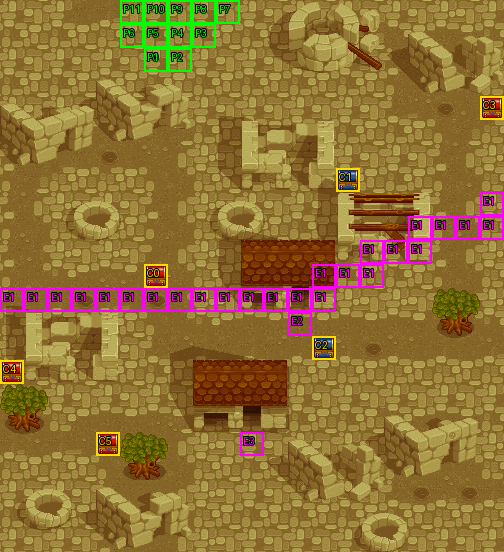

# 第 25 章　魔戰將軍

<!-- chapter_docs:header -->
| 項目 | 內容 |
| --- | --- |
| 章號／章節索引 | 25／24 |
| 章名（文字區塊 `0x01`） | 魔戰將軍 |
| 勝利條件（`0x02`） | 魔戰將軍死亡 |
| 敗北條件（`0x03`） | 蘭迪斯死亡 |
| 戰場 | `MAP24.DAT`／`MAP24.COD`／`M24.DTL`，21×23 格，我方 slot 12 個，部署記錄 59 筆 |
| 文字區塊 | `FDETXT25.TXT`，28 條 |
| 進入處理（`0x60074`[24]） | `fdps_chapter_25_init`（`0x214d0`） |
| 行動後檢查（`0x6028c`[24]） | `fdps_chapter_25_post_action`（`0x3b6b0`） |
| 勝利處理（`0x60304`[24]） | `fdps_chapter_25_end`（`0x3b720`） |
| 地圖資料呼叫的事件處理（`0x601c4`） | slot 37：`fdps_chapter_25_event_deploy_wave_1`（`0x38e60`）（格子事件）、slot 38：`fdps_chapter_25_event_upgrade_randis_sword`（`0x38fd0`）（格子事件）、slot 39：`fdps_chapter_25_event_marian_buys_wind_god_bow`（`0x39060`）（格子事件） |
| 過場腳本 | `ICON24.DAT`（開場）、`WIN24.DAT`（勝利） |
| 本章之前的村莊 | `SHOP24.DAT` |
| 光碟 | 第 2 片（音軌見 [CD 音軌](../program_info/cd_audio.md)） |



戰場全圖（第 0 層與同步捲動的圖層）。框線：黃 `C` 寶箱、橘 `B` 埋藏格、青 `R` 重繪格、洋紅 `E` 有處理函式的格子事件格，字母後的數字是事件碼；綠 `P` 是我方 slot 的起始格。

圖由 `python tools/chapter_docs/chapter_facts.py render-maps` 從遊戲檔重畫到 `chapters/maps/`，`verify-maps` 逐 byte 比對版控中的圖。
<!-- /chapter_docs:header -->

## 概要

開場過場 `ICON24.DAT` 先切到地圖 56：凱因巴把私自離開城堡的法蓮娜帶回教主（角色 `3F`）面前，教主責備女兒；法蓮娜質問為什麼一定要讓魔神降臨人間，教主說神允諾給他們永生、永遠握有財富與權勢。凱因巴接著報告蘭迪斯一行已經追來，教主命四位魔戰將軍除掉他們，自己要和法蓮娜舉行降神的儀式，把這件事交給凱因巴（文字 `FDETXT57` `0x09`）。

場景切回地圖 24，蘭迪斯一行從左上角進入狂信者之塔前的廢墟。費塔加認出魔戰將軍——素有鐵壁之稱、侍衛隊中的菁英；塞克斯下令護衛把他們死活不拘全部捉起來（`0x0a`）。戰鬥中我方越過地圖中段的一條線時，塞克斯與布魯森喊出埋伏，天空騎士從左上與右方殺出（`0x12`、`0x13`）。三名魔戰將軍倒下時各留一句退場台詞（`0x19`–`0x1b`），布魯森喊的是「撤退」、汎拉沛是「給我記住」，三人在 [第 26 章](ch26.md) 與凱因巴一起再度出現。戰場上還有兩個小插曲：火神在上方屋子門口把蘭迪斯的火光之劍解開封印成真炎龍劍（`0x14`），下方屋子門口的村婦以三萬元向瑪麗安兜售風神弓（`0x15`–`0x18`）。

勝利過場 `WIN24.DAT` 不在這張地圖上演：蘭迪斯在地圖 59 遇見自稱是他母親姐妹的女武神艾芙羅拉，她告訴他要像風一樣走自己的路，隨後與他永別（`FDETXT60` `0x09`–`0x0d`）。蘭迪斯往前走見到法蓮娜、喊她的名字（`0x0e`、`0x0f`），畫面接著不帶對白地依序切到地圖 3（[第 4 章](ch04.md) 崖上的追逐）、地圖 47、地圖 51、地圖 22 重現過去的場面，最後回到地圖 59，法蓮娜的身影出現又消失，蘭迪斯只喊出「法蓮娜……」（`0x10`）。

## 加入與離隊

- 本章沒有人入隊或離隊，也沒有客串單位。名冊是 [第 24 章](ch24.md) 結束時的 12 人，`MAP24.DAT` 宣告 12 個我方 slot，正好全部有人；入隊規則見 [`assets/characters.md` 的「加入」](../assets/characters.md#加入)。
- **法蓮娜**不上場：開場過場回到地圖 24 之後的第一條指令（`ICON24.DAT` `0x0b9`）以 `RETIRE_UNIT` 讓地圖單位 3（名冊第 4 位的法蓮娜）退場，之後沒有復歸，就是攻略站的「法蓮娜以外的所有人」。她的 slot 仍然保留，所以敵方從單位 12 開始排。
- 開場過場把其餘 11 人重新放在左上角 (0–5, 0–3)，蘭迪斯在 (4, 2)；下方表格的「我方起始格」是 `MAP24.COD` 的座標，實際開戰位置以過場放置的為準。

## 勝敗條件與特殊機制

- **勝利只看三名魔戰將軍**：`fdps_chapter_25_post_action`（`0x3b6b0`）依序問單位 12、13、14（`MAP24.DAT` 記錄 0–2 的塞克斯、布魯森、汎拉沛）是否都已退場，三人都倒下就寫結束碼 2。它不呼叫共用判定 `fdps_battle_check_default_end_conditions`（`0x3a2e0`），所以把其他敵人全部清光也不會過關；反過來，魔戰將軍一死光，場上其餘敵兵（含尚未觸發的伏兵）都不必打，由勝利處理清掉。與畫面上的「魔戰將軍死亡」一致。
- **敗北**：同一支接著無條件檢查單位 0（蘭迪斯），退場就寫結束碼 1。兩個寫入都不看目前的值，敗北排在後面，所以同一次行動裡最後一名魔戰將軍與蘭迪斯同時倒下是敗北。與畫面上的「蘭迪斯死亡」一致；本章沒有回合限制。
- **伏兵與全面進攻**：地圖上一條由 25 個事件格組成的線——第 12 列的 x 0–13，再經 (13–15, 11)、(15–17, 10)、(17–20, 9) 斜上到 (20, 8)——從西緣連到東緣，把北半部與南半部完全隔開（攻略站說的「中央紅箱下一格的水平線」）。這些格的觸發時機是 0（每走進一格就回報），由 `fdps_chapter_25_event_deploy_wave_1`（`0x38e60`）處理：第一個走進線上的**我方陣營**單位在行動結束後引出波次 1 的 18 名天空騎士，接著把場上單位 12 以後**所有**敵兵（含三名魔戰將軍、原地守衛的護衛與剛出場的天空騎士）的 AI 行為改成 11（施法之後再物理攻擊，見 [`program_info/map_ai.md`](../program_info/map_ai.md)），全軍離開崗位壓上來。只發生一次（觸發旗標陣列元素 `0x10`）；敵兵走過這條線不會觸發，也不會用掉它。
- **停在屋前會蓋掉伏兵**：同一次行動裡回報了好幾個事件時只有最後一個會執行（[`resource_info/map.md`](../resource_info/map.md)）。穿過這條線、在同一次移動裡停在 (12, 13) 的屋前格，行動結束時報的是 slot 38，伏兵這次不會觸發（旗標沒被設，下一個越線的單位照樣引出它）。
- **真炎龍劍**（可選）：蘭迪斯（單位 0）移動後停在 (12, 13)、身上帶著 `A1` 火光之劍時，`fdps_chapter_25_event_upgrade_randis_sword`（`0x38fd0`）畫火神的台詞 `0x14`，把火光之劍換成 `A2` 真炎龍劍。沒有回合限制、沒有單次旗標，換過之後身上已沒有火光之劍，所以不會重複；其他隊員停上去什麼都不發生。火光之劍是 [第 20 章](ch20.md) 第 20 回合（含）以前以灼烈之劍換來的，灼烈之劍來自 [第 16 章](ch16.md)。
- **風神弓**（可選、只問一次）：角色編號 `05` 的瑪麗安移動後停在 (10, 18)，而且全隊金錢 ≥ 30000（有號比較）、觸發旗標陣列元素 `0x11` 未設、背包未滿 8 格時，`fdps_chapter_25_event_marian_buys_wind_god_bow`（`0x39060`）由村婦兜售 `4A` 風神弓，價格與物品表的定價相同（[`assets/items.md`](../assets/items.md)）。選左格買下，扣 30000 並把弓放進她的背包；右格或取消都是拒絕。**兩種回答都會設起旗標**，拒絕一次之後本章就不會再問；四個條件任一不成立時則什麼都不做、旗標不動，之後可以再來。
- **勝利後的真炎龍劍檢查**：[第 26 章](ch26.md) 的勝利處理只在蘭迪斯身上沒有真炎龍劍、背包未滿時送 `62` 炎龍劍；本章換到真炎龍劍的話，那邊就不送。

## 敵人配置

開場的波次 0 共 41 人，分成五群：

- **三名魔戰將軍**（LV30，AI 2 原地）各帶 3 名鎧甲武士與 3 名神箭手守在南半部：塞克斯在正南 (10, 20)，護衛排在他身後 (9–11, 21–22)；布魯森在西南 (2, 17)，護衛在 (1–3, 18–19)；汎拉沛在東南 (18, 15)，護衛在 (19–20, 14–16)。三人死亡時由死亡腳本（opcode 3）說退場台詞。
- **中央部隊**（AI 0 主動）：黑暗祭司、4 名地獄騎士、5 名鎧甲武士，就站在觸發線正下方的 (5–9, 13–14)，開戰即北上迎擊。
- **東北部隊**（AI 0 主動）：2 名神箭手、4 名地獄騎士、4 名鎧甲武士在 (16–18, 4–7)。

波次 1 是 18 名天空騎士（LV16），伏兵觸發時以找最近空格的方式出場，9 名錨在左上角 (0–4, 0–2)——也就是我方開戰時站的地方——另 9 名錨在右方 (18–20, 6–10)；畫面隨即捲到這兩處各停 12 幀。記錄本身寫的是 AI 0，但伏兵處理函式在部署之後才掃描，所以他們與全軍一起變成 AI 11。

<!-- chapter_docs:deployments -->
陣營與死亡腳本的意義見 [`resource_info/map.md`](../resource_info/map.md)，AI 行為（低 4 bit）見 [`program_info/map_ai.md`](../program_info/map_ai.md#行為代碼)；錨點是 `MAPnn.COD` 的座標，開場波次放在錨點上，其餘波次依部署方式放在錨點或最近的空格。單位名是全域文字的「角色編號 + 1」條；角色編號 `3C` 以上的敵兵，數值（`ENEMYDAT.DAT`）與種族、職業見 [`assets/enemies.md`](../assets/enemies.md)，以下的見 [`assets/characters.md`](../assets/characters.md)。

我方起始格：slot 0 (6, 2)、slot 1 (6, 2)、slot 2 (7, 2)、slot 3 (8, 1)、slot 4 (7, 1)、slot 5 (6, 1)、slot 6 (5, 1)、slot 7 (9, 0)、slot 8 (8, 0)、slot 9 (7, 0)、slot 10 (6, 0)、slot 11 (5, 0)。

| 波次 | 陣營 | 單位 | 等級 | 數量 |
| ---: | --- | --- | --- | ---: |
| 0 | 敵方 | `40` 塞克斯 | 30 | 1 |
| 0 | 敵方 | `41` 布魯森 | 30 | 1 |
| 0 | 敵方 | `42` 汎拉沛 | 30 | 1 |
| 0 | 敵方 | `64` 鎧甲武士 | 16 | 18 |
| 0 | 敵方 | `5F` 神箭手 | 16 | 11 |
| 0 | 敵方 | `68` 黑暗祭司 | 16 | 1 |
| 0 | 敵方 | `4E` 地獄騎士 | 16 | 8 |
| 1 | 敵方 | `61` 天空騎士 | 16 | 18 |

### 波次 0

出場：進入戰場時由 `fdps_build_map_unit_array`（`0x22be0`） 部署在錨點上

| # | 陣營 | 單位 | 等級 | AI 行為 | 錨點 | 死亡腳本 |
| ---: | --- | --- | ---: | --- | --- | --- |
| 0 | 敵方 | `40` 塞克斯 | 30 | 2 原地 | (10, 20) | 顯示 `0x19` |
| 1 | 敵方 | `41` 布魯森 | 30 | 2 原地 | (2, 17) | 顯示 `0x1a` |
| 2 | 敵方 | `42` 汎拉沛 | 30 | 2 原地 | (18, 15) | 顯示 `0x1b` |
| 3 | 敵方 | `64` 鎧甲武士 | 16 | 2 原地 | (9, 21) | — |
| 4 | 敵方 | `64` 鎧甲武士 | 16 | 2 原地 | (10, 21) | — |
| 5 | 敵方 | `64` 鎧甲武士 | 16 | 2 原地 | (11, 21) | — |
| 6 | 敵方 | `5F` 神箭手 | 16 | 2 原地 | (9, 22) | — |
| 7 | 敵方 | `5F` 神箭手 | 16 | 2 原地 | (10, 22) | — |
| 8 | 敵方 | `5F` 神箭手 | 16 | 2 原地 | (11, 22) | — |
| 9 | 敵方 | `64` 鎧甲武士 | 16 | 2 原地 | (1, 18) | — |
| 10 | 敵方 | `64` 鎧甲武士 | 16 | 2 原地 | (2, 18) | — |
| 11 | 敵方 | `64` 鎧甲武士 | 16 | 2 原地 | (3, 18) | — |
| 12 | 敵方 | `5F` 神箭手 | 16 | 2 原地 | (1, 19) | — |
| 13 | 敵方 | `5F` 神箭手 | 16 | 2 原地 | (2, 19) | — |
| 14 | 敵方 | `5F` 神箭手 | 16 | 2 原地 | (3, 19) | — |
| 15 | 敵方 | `64` 鎧甲武士 | 16 | 2 原地 | (19, 14) | — |
| 16 | 敵方 | `64` 鎧甲武士 | 16 | 2 原地 | (19, 15) | — |
| 17 | 敵方 | `64` 鎧甲武士 | 16 | 2 原地 | (19, 16) | — |
| 18 | 敵方 | `5F` 神箭手 | 16 | 2 原地 | (20, 16) | — |
| 19 | 敵方 | `5F` 神箭手 | 16 | 2 原地 | (20, 15) | — |
| 20 | 敵方 | `5F` 神箭手 | 16 | 2 原地 | (20, 14) | — |
| 21 | 敵方 | `68` 黑暗祭司 | 16 | 0 主動 | (7, 14) | — |
| 22 | 敵方 | `4E` 地獄騎士 | 16 | 0 主動 | (5, 14) | — |
| 23 | 敵方 | `4E` 地獄騎士 | 16 | 0 主動 | (6, 14) | — |
| 24 | 敵方 | `4E` 地獄騎士 | 16 | 0 主動 | (8, 14) | — |
| 25 | 敵方 | `4E` 地獄騎士 | 16 | 0 主動 | (9, 14) | — |
| 26 | 敵方 | `64` 鎧甲武士 | 16 | 0 主動 | (5, 13) | — |
| 27 | 敵方 | `64` 鎧甲武士 | 16 | 0 主動 | (6, 13) | — |
| 28 | 敵方 | `64` 鎧甲武士 | 16 | 0 主動 | (7, 13) | — |
| 29 | 敵方 | `64` 鎧甲武士 | 16 | 0 主動 | (8, 13) | — |
| 30 | 敵方 | `64` 鎧甲武士 | 16 | 0 主動 | (9, 13) | — |
| 31 | 敵方 | `5F` 神箭手 | 16 | 0 主動 | (17, 4) | — |
| 32 | 敵方 | `5F` 神箭手 | 16 | 0 主動 | (17, 7) | — |
| 33 | 敵方 | `4E` 地獄騎士 | 16 | 0 主動 | (18, 4) | — |
| 34 | 敵方 | `4E` 地獄騎士 | 16 | 0 主動 | (18, 5) | — |
| 35 | 敵方 | `4E` 地獄騎士 | 16 | 0 主動 | (18, 6) | — |
| 36 | 敵方 | `4E` 地獄騎士 | 16 | 0 主動 | (18, 7) | — |
| 37 | 敵方 | `64` 鎧甲武士 | 16 | 0 主動 | (16, 4) | — |
| 38 | 敵方 | `64` 鎧甲武士 | 16 | 0 主動 | (16, 7) | — |
| 39 | 敵方 | `64` 鎧甲武士 | 16 | 0 主動 | (16, 5) | — |
| 40 | 敵方 | `64` 鎧甲武士 | 16 | 0 主動 | (16, 6) | — |

### 波次 1

出場：第一個我方陣營單位走進觸發線（第 12 列 x 0–13 與 (13, 11)–(20, 8) 的斜線，共 25 格，觸發時機 0）的那次行動結束後，slot 37 的 `fdps_chapter_25_event_deploy_wave_1`（`0x38e60`）先畫 `0x12` 再部署（找最近空格），接著把全軍改成 AI 11；只發生一次（觸發旗標 `0x10`）

| # | 陣營 | 單位 | 等級 | AI 行為 | 錨點 | 死亡腳本 |
| ---: | --- | --- | ---: | --- | --- | --- |
| 41 | 敵方 | `61` 天空騎士 | 16 | 0 主動 | (2, 2) | — |
| 42 | 敵方 | `61` 天空騎士 | 16 | 0 主動 | (1, 1) | — |
| 43 | 敵方 | `61` 天空騎士 | 16 | 0 主動 | (2, 1) | — |
| 44 | 敵方 | `61` 天空騎士 | 16 | 0 主動 | (3, 1) | — |
| 45 | 敵方 | `61` 天空騎士 | 16 | 0 主動 | (0, 0) | — |
| 46 | 敵方 | `61` 天空騎士 | 16 | 0 主動 | (1, 0) | — |
| 47 | 敵方 | `61` 天空騎士 | 16 | 0 主動 | (2, 0) | — |
| 48 | 敵方 | `61` 天空騎士 | 16 | 0 主動 | (3, 0) | — |
| 49 | 敵方 | `61` 天空騎士 | 16 | 0 主動 | (4, 0) | — |
| 50 | 敵方 | `61` 天空騎士 | 16 | 0 主動 | (18, 8) | — |
| 51 | 敵方 | `61` 天空騎士 | 16 | 0 主動 | (19, 7) | — |
| 52 | 敵方 | `61` 天空騎士 | 16 | 0 主動 | (19, 8) | — |
| 53 | 敵方 | `61` 天空騎士 | 16 | 0 主動 | (19, 9) | — |
| 54 | 敵方 | `61` 天空騎士 | 16 | 0 主動 | (20, 6) | — |
| 55 | 敵方 | `61` 天空騎士 | 16 | 0 主動 | (20, 7) | — |
| 56 | 敵方 | `61` 天空騎士 | 16 | 0 主動 | (20, 8) | — |
| 57 | 敵方 | `61` 天空騎士 | 16 | 0 主動 | (20, 9) | — |
| 58 | 敵方 | `61` 天空騎士 | 16 | 0 主動 | (20, 10) | — |
<!-- /chapter_docs:deployments -->

## 寶物

- **真炎龍劍**：不在寶箱裡，是蘭迪斯帶著火光之劍停在 (12, 13) 時由 `fdps_chapter_25_event_upgrade_randis_sword`（`0x38fd0`）換給他的（見上節）。
- **風神弓**：瑪麗安停在 (10, 18) 以 30000 元向村婦買下，由 `fdps_chapter_25_event_marian_buys_wind_god_bow`（`0x39060`）直接放進她的背包。
- 六個寶箱中 (6, 11)、(14, 7)、(20, 4) 在觸發線的北側，不引出伏兵就拿得到；(13, 14)、(0, 15)、(4, 18) 在南側，要先越線。

<!-- chapter_docs:treasure -->
搜尋的規則（同碼的格共用一筆記錄與一個旗標、背包滿時的交換）見 [`resource_info/map.md`](../resource_info/map.md)。

| 事件碼 | 格 | 內容 |
| ---: | --- | --- |
| 0 | (6, 11) 寶箱 | 4000 金 |
| 1 | (14, 7) 寶箱 | `D4` 冰之魔石 |
| 2 | (13, 14) 寶箱 | `C2` 神聖之水 |
| 3 | (20, 4) 寶箱 | `D6` 生命之實 |
| 4 | (0, 15) 寶箱 | `D9` 耐力藥水 |
| 5 | (4, 18) 寶箱 | 3000 金 |

本章沒有擊倒掉落。
<!-- /chapter_docs:treasure -->

## 村莊

酒館台詞 `0x06`「除非太陽西邊升起」是這座村莊（章節索引 24）神秘商店暗號 `W E S T` 的提示，暗號表見 [`program_info/village.md`](../program_info/village.md)。本章之後、第 26 章之前那座村莊的神秘商店進不去，見 [`program_info/known_bugs.md`](../program_info/known_bugs.md) 第 19 條。

<!-- chapter_docs:village -->
第 24 章勝利後、本章之前的村莊載入 `SHOP24.DAT`，道具店、武器店、秘密商店的貨見 [`assets/shops.md`](../assets/shops.md)。村莊載入的文字區塊是 `FDETXT25`（章節索引 + 1，`fdps_load_field_chapter_resources`（`0x31540`）），也就是本章的區塊，所以村莊畫面的文字是本章區塊的 `0x04`–`0x08`，全文在下方「對話」。
<!-- /chapter_docs:village -->

## 處理流程

### `fdps_chapter_25_init`（`0x214d0`）

1. `fdps_chapter_state_reset`（`0x22750`）：從名冊填滿地圖 24 的 12 個我方 slot，部署波次 0 的 41 人，清空觸發旗標。
2. `fdps_icon_script_run`（`0x21650`）播 `ICON24.DAT`：切到地圖 56 演出凱因巴帶回法蓮娜（`FDETXT57` `0x09`），再切回地圖 24（重建一次戰場），讓單位 3 法蓮娜退場，把其餘 11 人放到左上角並往下走位，最後畫 `0x0a`。腳本沒有 `DEPLOY_WAVE`。
3. `fdps_show_chapter_title_card`（`0x20c60`）顯示章名卡。
4. `fdps_map_cursor_move_to_unit`（`0x2da50`）把游標放在單位 0（蘭迪斯，過場放下的 (4, 2)）。

本章 init 不呼叫 `fdps_roster_add_character`。

### `fdps_chapter_25_event_deploy_wave_1`（`0x38e60`）

slot 37，由觸發線上 25 格（事件碼 1、觸發時機 0）引發，參數是觸發的單位索引。

1. 先取觸發單位的記錄，再檢查兩個條件：觸發旗標陣列元素 `0x10` 仍為 0、觸發單位的陣營是 2（我方）。任一不成立就直接結束，旗標不動。
2. 畫 `0x12`。
3. `fdps_deploy_wave`（`0x23830`）部署波次 1（找最近空格）。
4. 隱藏游標，`fdps_map_cursor_move_to`（`0x2d7c0`）捲到地圖左上角 (0, 0) 停 12 幀，再捲到 (20, 11) 停 12 幀（`fdps_render_view_frame`（`0x2beb0`）），恢復游標模式 1。
5. 畫 `0x13`。
6. 以部署**之後**的單位數，把單位 12 到最後一個單位的 AI 行為低 4 bit 改成 11（保留高 4 bit 旗標）。
7. 設起觸發旗標 `0x10`。

### `fdps_chapter_25_event_upgrade_randis_sword`（`0x38fd0`）

slot 38，由 (12, 13)（事件碼 2、觸發時機 1：移動後停在這格）引發。

1. 無條件以 `fdps_unit_find_item_slot`（`0x34520`）找觸發單位背包裡的 `A1` 火光之劍。
2. 觸發單位是單位 0 且找到時：畫 `0x14`，`fdps_unit_remove_item`（`0x25cc0`）移除火光之劍，`fdps_unit_add_item`（`0x25d20`）加入 `A2` 真炎龍劍，`fdps_unit_recompute_combat_stats`（`0x24d70`）重算能力值。先移除再加入，背包滿的蘭迪斯也換得到。
3. 其他情況什麼都不做。沒有旗標、沒有回合限制。

### `fdps_chapter_25_event_marian_buys_wind_god_bow`（`0x39060`）

slot 39，由 (10, 18)（事件碼 3、觸發時機 1）引發。

1. 依序檢查：觸發單位的角色編號是 `05`、全隊金錢 ≥ 30000、觸發旗標陣列元素 `0x11` 為 0、`fdps_unit_item_count`（`0x25240`）不是 8。任一不成立就結束，旗標不動。
2. 在畫面左上角畫 `0x15`。
3. `fdps_message_window_open`（`0x205b0`）開啟村婦頭像（`FACE.CEL` 第 `0x77` 筆）的訊息面板，畫 `0x16`，`fdps_prompt_two_choice`（`0x17990`）等待回答，`fdps_message_window_close`（`0x20820`）關閉面板。
4. 回答 0（左格）：畫 `0x17`，加入 `4A` 風神弓，金錢減 30000。其他回答（右格 1、取消 −1）：畫 `0x18`。兩行都畫在已經關掉的面板內側位置。
5. 無論買不買，設起觸發旗標 `0x11`。

### `fdps_chapter_25_post_action`（`0x3b6b0`）

每次行動後執行：

1. `fdps_unit_is_retired`（`0x109b0`）依序問單位 12、13、14，短路求值；三個都退場時結束碼寫 2。
2. 無條件問單位 0，退場時結束碼寫 1（蓋過第 1 步的 2）。

### `fdps_chapter_25_end`（`0x3b720`）

1. `fdps_battle_destroy_remaining_enemies`（`0x39e10`）清掉場上殘敵——本章是擊倒三名頭目過關，其餘敵兵進來時通常還在場。
2. `fdps_roster_write_back_battle_units`（`0x23980`）寫回名冊。
3. `fdps_icon_script_run`（`0x21650`）播 `WIN24.DAT`（切到地圖 59、3、47、51、22、59，戰場本身不再出現）。
4. `fdps_roster_revive_fallen_members`（`0x39e70`）付費復活倒下的隊員。
5. 章節索引設為 25，下一章是 [第 26 章](ch26.md)。

## 回合事件與格子事件

<!-- chapter_docs:events -->
觸發時機與陣營階段的意義見 [`resource_info/map.md`](../resource_info/map.md)。

本章沒有回合事件。

| 事件碼 | 格 | 觸發 | slot | 處理函式 |
| ---: | --- | --- | ---: | --- |
| 1 | (20, 8)、(17, 9)、(18, 9)、(19, 9)、(20, 9)、(15, 10)、(16, 10)、(17, 10)、(13, 11)、(14, 11)、(15, 11)、(0, 12)、(1, 12)、(2, 12)、(3, 12)、(4, 12)、(5, 12)、(6, 12)、(7, 12)、(8, 12)、(9, 12)、(10, 12)、(11, 12)、(12, 12)、(13, 12) | 走進 | 37 | `fdps_chapter_25_event_deploy_wave_1`（`0x38e60`） |
| 2 | (12, 13) | 停留 | 38 | `fdps_chapter_25_event_upgrade_randis_sword`（`0x38fd0`） |
| 3 | (10, 18) | 停留 | 39 | `fdps_chapter_25_event_marian_buys_wind_god_bow`（`0x39060`） |

死亡腳本裡的事件與文字：

| # | 單位 | 波次 | 死亡腳本 |
| ---: | --- | ---: | --- |
| 0 | `40` 塞克斯 | 0 | 顯示 `0x19` |
| 1 | `41` 布魯森 | 0 | 顯示 `0x1a` |
| 2 | `42` 汎拉沛 | 0 | 顯示 `0x1b` |
<!-- /chapter_docs:events -->

## 過場腳本

`ICON24.DAT` 的第一段與 `WIN24.DAT` 全段在別的地圖上演，畫的是那些地圖的文字區塊（`FDETXT57`、`FDETXT60`）；本章區塊只有 `0x0a` 由過場畫出。

<!-- chapter_docs:scripts -->
格式與每個指令的意義見 [`resource_info/cutscene_script.md`](../resource_info/cutscene_script.md)。`FDETXT25#0xNN` 是本章文字區塊的條目，全文在下方「對話」；切到額外場景之後顯示的文字直接列出（那些區塊的正典是 [`assets/text/scene_text.md`](../assets/text/scene_text.md)）。`u3=我方1` 是地圖單位索引 3 對到我方 slot 1，`u12=MAP02#9` 是 `MAP02.DAT` 第 9 筆部署記錄。

### `ICON24.DAT`

- 開場：`fdps_chapter_25_init`（`0x214d0`）
- 507 byte、89 步；起始地圖 24，切換地圖 56 → 24，結束於地圖 24

| 偏移 | 指令 | 內容 |
| ---: | --- | --- |
| `0000` | `FADE_OUT` | 淡出，每步 20 ms |
| `0002` | `SET_MUSIC` | 音樂 4（CD 第 5 軌） |
| `0004` | `SWITCH_MAP` | 切換地圖 → 56（MAP56，文字 FDETXT57） |
| `0006` | `SET_VIEW_TILE` | 視野直接設到格 (2, 0) |
| `0009` | `FACE_UNITS` | 轉向後停 1 幀：u3=我方3朝下 |
| `000e` | `FADE_IN` | 淡入，每步 30 ms |
| `0010` | `FACE_UNITS` | 轉向後停 15 幀：u12=MAP56#1(角色0x3f)朝下 |
| `0015` | `WALK_UNITS` | 行走 1 格，每步 6 幀：u12=MAP56#1(角色0x3f)往下 |
| `001b` | `FACE_UNITS` | 轉向後停 25 幀：u12=MAP56#1(角色0x3f)朝下 |
| `0020` | `WALK_UNITS` | 行走 1 格，每步 6 幀：u12=MAP56#1(角色0x3f)往上 |
| `0026` | `FACE_UNITS` | 轉向後停 25 幀：u12=MAP56#1(角色0x3f)朝上 |
| `002b` | `FACE_UNITS` | 轉向後停 8 幀：u12=MAP56#1(角色0x3f)朝下 |
| `0030` | `SHAKE_VIEW` | 視野位移 4 步，每步 2 幀：(0,6) (0,12) (0,18) (0,24) |
| `003b` | `SET_VIEW_TILE` | 視野直接設到格 (2, 1) |
| `003e` | `SHAKE_VIEW` | 視野位移 4 步，每步 2 幀：(0,6) (0,12) (0,18) (0,24) |
| `0049` | `SET_VIEW_TILE` | 視野直接設到格 (2, 2) |
| `004c` | `SHAKE_VIEW` | 視野位移 4 步，每步 2 幀：(0,6) (0,12) (0,18) (0,24) |
| `0057` | `SET_VIEW_TILE` | 視野直接設到格 (2, 3) |
| `005a` | `PLACE_UNIT` | 放置 u3=我方3 到 (8, 11)，朝上 |
| `005f` | `PLACE_UNIT` | 放置 u11=MAP56#0(角色0x43) 到 (7, 11)，朝上 |
| `0064` | `FACE_UNITS` | 轉向後停 8 幀：u12=MAP56#1(角色0x3f)朝下 |
| `0069` | `WALK_UNITS` | 行走 4 格，每步 4 幀：u3=我方3往上、u11=MAP56#0(角色0x43)往上 |
| `0071` | `SHAKE_VIEW` | 視野位移 4 步，每步 2 幀：(0,-6) (0,-12) (0,-18) (0,-24) |
| `007c` | `SET_VIEW_TILE` | 視野直接設到格 (2, 2) |
| `007f` | `SHAKE_VIEW` | 視野位移 4 步，每步 2 幀：(0,-6) (0,-12) (0,-18) (0,-24) |
| `008a` | `SET_VIEW_TILE` | 視野直接設到格 (2, 1) |
| `008d` | `WALK_UNITS` | 行走 3 格，每步 4 幀：u3=我方3往上、u11=MAP56#0(角色0x43)往上 |
| `0095` | `FACE_UNITS` | 轉向後停 30 幀：u12=MAP56#1(角色0x3f)朝下 |
| `009a` | `WALK_UNITS` | 行走 1 格，每步 4 幀：u11=MAP56#0(角色0x43)往左 |
| `00a0` | `FACE_UNITS` | 轉向後停 4 幀：u11=MAP56#0(角色0x43)朝右 |
| `00a5` | `DRAW_TEXT` | 顯示文字 FDETXT57#0x09 「{speaker char=67}教主，{br}屬下將小姐帶回來了。{br}{speaker char=63}嗯～！幹得很好。{br}法蓮娜，{br}頑皮也要有限度。{page}妳私自離開城堡，{br}為了妳，{br}我犧牲了多少時間？{page}妳看看，{br}為了迎接魔神的降臨，{br}父親花了多少心血，{page}在這個重要的時刻，{br}妳還要讓父親分心，{br}擔心妳的事嗎？{br}{speaker char=1}我這次出去，{br}看見外面不少東西。{br}爸爸，{page}我們真的有必要，{br}讓魔神降臨到人間嗎？{page}難道世間的事情，{br}人類難道就辦不到？{br}都要靠神來解決嗎？{br}{speaker char=63}住口～！{br}妳這樣褻瀆神，{br}不怕祂降罪？{page}妳懂什麼？{br}神是無所不能的，{br}最重要的是，{page}祂還允諾給我們永生。{br}永生是什麼意思？{page}妳不必為生﹑老﹑病﹑{br}死擔憂苦惱；{br}妳能夠享受妳的財富﹑{page}權勢﹑幸運，{br}十﹑二十﹑一百年，{br}哈哈哈～哈，{page}它永遠握在你手掌中，{br}這才是我真正要的，{br}妳懂嗎？{br}{speaker char=1}爸爸，{br}你太瘋狂了！﹒﹒﹒{br}{speaker char=67}教主，{br}有件事情要向你報告，{br}蘭迪斯這批人，{page}似乎還不死心的樣子，{br}據教徒密報，{br}他們已經來了！{br}{speaker char=63}哦？！有這種事？{br}你們四位魔戰將軍，{br}身為本教護法，{page}居然容許他如此猖狂？{br}將他們除去，{br}不要手下留情。{page}我和法蓮娜，{br}要舉行降神的儀式，{br}沒有辦法分心照顧，{page}凱因巴，{br}這件事交給你去辦！{br}{speaker char=1}爸爸！！{br}{speaker char=67}是！屬下知道了！{br}屬下立刻去辦！」 |
| `00a7` | `WALK_UNITS` | 行走 1 格，每步 4 幀：u11=MAP56#0(角色0x43)往右 |
| `00ad` | `WALK_UNITS` | 行走 5 格，每步 4 幀：u11=MAP56#0(角色0x43)往下 |
| `00b3` | `FADE_OUT` | 淡出，每步 0 ms |
| `00b5` | `SET_MUSIC` | 音樂 11（CD 第 12 軌） |
| `00b7` | `SWITCH_MAP` | 切換地圖 → 24（MAP24，文字 FDETXT25） |
| `00b9` | `RETIRE_UNIT` | 退場 u3=我方3 |
| `00bb` | `SET_VIEW_TILE` | 視野直接設到格 (12, 17) |
| `00be` | `PLACE_UNIT` | 放置 u0=我方0 到 (20, 0)，朝下 |
| `00c3` | `PLACE_UNIT` | 放置 u1=我方1 到 (20, 0)，朝下 |
| `00c8` | `PLACE_UNIT` | 放置 u2=我方2 到 (20, 0)，朝下 |
| `00cd` | `PLACE_UNIT` | 放置 u3=我方3 到 (20, 0)，朝下 |
| `00d2` | `PLACE_UNIT` | 放置 u4=我方4 到 (20, 0)，朝下 |
| `00d7` | `PLACE_UNIT` | 放置 u5=我方5 到 (20, 0)，朝下 |
| `00dc` | `PLACE_UNIT` | 放置 u6=我方6 到 (20, 0)，朝下 |
| `00e1` | `PLACE_UNIT` | 放置 u7=我方7 到 (20, 0)，朝下 |
| `00e6` | `PLACE_UNIT` | 放置 u8=我方8 到 (20, 0)，朝下 |
| `00eb` | `PLACE_UNIT` | 放置 u9=我方9 到 (20, 0)，朝下 |
| `00f0` | `PLACE_UNIT` | 放置 u10=我方10 到 (20, 0)，朝下 |
| `00f5` | `PLACE_UNIT` | 放置 u11=我方11 到 (20, 2)，朝下 |
| `00fa` | `FACE_UNITS` | 轉向後停 1 幀：u0=我方0朝上 |
| `00ff` | `FADE_IN` | 淡入，每步 20 ms |
| `0101` | `FACE_UNITS` | 轉向後停 12 幀：u0=我方0朝上 |
| `0106` | `SCROLL_VIEW` | 捲動視野到格 (2, 17) |
| `0109` | `SCROLL_VIEW` | 捲動視野到格 (2, 0) |
| `010c` | `FACE_UNITS` | 轉向後停 12 幀：u0=我方0朝上 |
| `0111` | `PLACE_UNIT` | 放置 u0=我方0 到 (4, 0)，朝下 |
| `0116` | `PLACE_UNIT` | 放置 u1=我方1 到 (3, 0)，朝下 |
| `011b` | `PLACE_UNIT` | 放置 u2=我方2 到 (4, 0)，朝下 |
| `0120` | `PLACE_UNIT` | 放置 u3=我方3 到 (3, 0)，朝下 |
| `0125` | `PLACE_UNIT` | 放置 u4=我方4 到 (5, 0)，朝下 |
| `012a` | `PLACE_UNIT` | 放置 u5=我方5 到 (2, 0)，朝下 |
| `012f` | `PLACE_UNIT` | 放置 u6=我方6 到 (2, 0)，朝下 |
| `0134` | `PLACE_UNIT` | 放置 u7=我方7 到 (1, 0)，朝下 |
| `0139` | `PLACE_UNIT` | 放置 u8=我方8 到 (1, 0)，朝下 |
| `013e` | `PLACE_UNIT` | 放置 u9=我方9 到 (0, 0)，朝下 |
| `0143` | `PLACE_UNIT` | 放置 u10=我方10 到 (0, 0)，朝下 |
| `0148` | `PLACE_UNIT` | 放置 u11=我方11 到 (0, 0)，朝下 |
| `014d` | `FACE_UNITS` | 轉向後停 4 幀：u0=我方0朝下 |
| `0152` | `WALK_UNITS` | 行走 1 格，每步 2 幀：u1=我方1往下、u8=我方8往下、u11=我方11往下 |
| `015c` | `WALK_UNITS` | 行走 1 格，每步 2 幀：u1=我方1往下、u8=我方8往下、u11=我方11往下、u0=我方0往下、u6=我方6往下、u10=我方10往下 |
| `016c` | `WALK_UNITS` | 行走 1 格，每步 2 幀：u1=我方1往下、u8=我方8往下、u11=我方11往下、u0=我方0往下、u6=我方6往下、u10=我方10往下、u2=我方2往下、u3=我方3往下、u7=我方7往下 |
| `0182` | `FACE_UNITS` | 轉向後停 8 幀：u0=我方0朝右、u1=我方1朝右、u2=我方2朝右、u3=我方3朝右、u4=我方4朝右、u5=我方5朝右、u6=我方6朝右、u7=我方7朝右、u8=我方8朝右、u9=我方9朝右、u10=我方10朝右、u11=我方11朝右 |
| `019d` | `SHAKE_VIEW` | 視野位移 4 步，每步 1 幀：(6,0) (12,0) (18,0) (24,0) |
| `01a8` | `SET_VIEW_TILE` | 視野直接設到格 (3, 0) |
| `01ab` | `SHAKE_VIEW` | 視野位移 4 步，每步 1 幀：(6,0) (12,0) (18,0) (24,0) |
| `01b6` | `SET_VIEW_TILE` | 視野直接設到格 (4, 0) |
| `01b9` | `SHAKE_VIEW` | 視野位移 4 步，每步 1 幀：(6,0) (12,0) (18,0) (24,0) |
| `01c4` | `SET_VIEW_TILE` | 視野直接設到格 (5, 0) |
| `01c7` | `SHAKE_VIEW` | 視野位移 4 步，每步 1 幀：(6,0) (12,0) (18,0) (24,0) |
| `01d2` | `SET_VIEW_TILE` | 視野直接設到格 (6, 0) |
| `01d5` | `SHAKE_VIEW` | 視野位移 4 步，每步 1 幀：(6,0) (12,0) (18,0) (24,0) |
| `01e0` | `SET_VIEW_TILE` | 視野直接設到格 (7, 0) |
| `01e3` | `SHAKE_VIEW` | 視野位移 4 步，每步 1 幀：(6,0) (12,0) (18,0) (24,0) |
| `01ee` | `SET_VIEW_TILE` | 視野直接設到格 (8, 0) |
| `01f1` | `FACE_UNITS` | 轉向後停 20 幀：u0=我方0朝右 |
| `01f6` | `DRAW_TEXT` | 顯示文字 FDETXT25#0x0a |
| `01f8` | `SET_MUSIC` | 停止音樂 |
| `01fa` | `END` | 結束 |

### `WIN24.DAT`

- 勝利：`fdps_chapter_25_end`（`0x3b720`）
- 812 byte、212 步；起始地圖 24，切換地圖 59 → 3 → 47 → 51 → 22 → 59，結束於地圖 59

| 偏移 | 指令 | 內容 |
| ---: | --- | --- |
| `0000` | `FADE_OUT` | 淡出，每步 40 ms |
| `0002` | `SET_MUSIC` | 音樂 8（CD 第 9 軌） |
| `0004` | `SWITCH_MAP` | 切換地圖 → 59（MAP59，文字 FDETXT60） |
| `0006` | `SET_VIEW_TILE` | 視野直接設到格 (0, 3) |
| `0009` | `FACE_UNITS` | 轉向後停 15 幀：u0=MAP59#0(角色0x00)朝上 |
| `000e` | `FADE_IN` | 淡入，每步 40 ms |
| `0010` | `FACE_UNITS` | 轉向後停 15 幀：u0=MAP59#0(角色0x00)朝上 |
| `0015` | `FACE_UNITS` | 轉向後停 10 幀：u0=MAP59#0(角色0x00)朝上 |
| `001a` | `WALK_UNITS` | 行走 1 格，每步 4 幀：u0=MAP59#0(角色0x00)往右 |
| `0020` | `FACE_UNITS` | 轉向後停 10 幀：u0=MAP59#0(角色0x00)朝右 |
| `0025` | `FACE_UNITS` | 轉向後停 10 幀：u0=MAP59#0(角色0x00)朝左 |
| `002a` | `WALK_UNITS` | 行走 3 格，每步 4 幀：u0=MAP59#0(角色0x00)往左 |
| `0030` | `PLAY_SAF` | 播放動畫 ICON0073.SAF |
| `0032` | `DEPLOY_WAVE` | 部署 MAP59 波次 2（錨點原位）：#2(角色0x79) |
| `0035` | `FACE_UNITS` | 轉向後停 10 幀：u0=MAP59#0(角色0x00)朝上 |
| `003a` | `WALK_UNITS` | 行走 1 格，每步 4 幀：u0=MAP59#0(角色0x00)往上 |
| `0040` | `DRAW_TEXT` | 顯示文字 FDETXT60#0x09 「{speaker char=0}啊～！妳是﹒﹒﹒{br}{speaker char=121}是的，孩子，{br}我叫艾芙羅拉，{br}也是你母親的姐妹。{br}{speaker char=0}我越來越來不了解，{br}妳們為什麼要幫助我？{br}{speaker char=121}用人類的言語解釋，{br}這就叫作命運吧？{br}{speaker char=0}我實在不明瞭，{br}我能為大家做什麼？{br}我既使再如何努力，{page}終究還是有人，{br}會為我哭泣。{br}我真的不明白﹒﹒﹒﹒」 |
| `0042` | `FACE_UNITS` | 轉向後停 10 幀：u0=MAP59#0(角色0x00)朝下 |
| `0047` | `FACE_UNITS` | 轉向後停 25 幀：u0=MAP59#0(角色0x00)朝下 |
| `004c` | `FACE_UNITS` | 轉向後停 10 幀：u0=MAP59#0(角色0x00)朝下 |
| `0051` | `DRAW_TEXT` | 顯示文字 FDETXT60#0x0a 「{speaker char=121}你後悔了？」 |
| `0053` | `FACE_UNITS` | 轉向後停 8 幀：u0=MAP59#0(角色0x00)朝上 |
| `0058` | `FACE_UNITS` | 轉向後停 10 幀：u0=MAP59#0(角色0x00)朝上 |
| `005d` | `DRAW_TEXT` | 顯示文字 FDETXT60#0x0b 「{speaker char=0}不，我不後悔！{br}{speaker char=121}那麼，{br}就不要再苛責自己了，{br}沒有人是完美的。{page}事情都能如願以償，{br}或許，{br}人就不需要命運了！{page}但是，這是辦不到的。{br}就算是神，也是一樣。{br}知道嗎？{br}{speaker char=0}就算是妳也一樣？{br}{speaker char=121}是的！{br}{speaker char=0}﹒﹒﹒﹒{br}{speaker char=121}不要去想太多，孩子，{br}你這生要做的事太多，{br}時間卻太短暫了！{page}來，聽呀！{br}你聽見風的呼喚嗎？{br}它正催促你起程呢！{br}{speaker char=0}什麼？我？{br}{speaker char=121}傻孩子！{br}你已經有足夠的智慧，{br}去了解我的話了。{page}但是，你的腦海中，{br}卻有太多回憶，{br}害怕失去，{page}害怕遺忘，{br}所以不敢展開翅膀，{br}朝向真理之海飛翔。{br}{speaker char=0}不！我不懂！{br}我該怎麼作？{br}妳教我好嗎？{br}{speaker char=121}傾聽你心中的風聲，{br}來，放開你的感覺，{br}將記憶中的臉孔忘去。{page}孩子，記著！{br}這個世界是你的，{br}用自己的眼睛看世界。{page}孩子，感覺到了嗎？{br}在這個世界裡，{br}沒有索爾，沒有我，{page}沒有法蓮娜，{br}也沒有尤利安，{br}和你遇到的朋友。{page}你在找尋的，{br}是自己的荊棘之路，{br}不是別人走過的路。{page}在這個世界上，{br}完美，{br}並不是唯一的標準，{page}世界上有太多東西，{br}比完美還要偉大！{br}去吧！孩子，{page}那才是你要走的道路，{br}像風一樣，{br}知道嗎？{br}{speaker char=0}要像風一樣﹒﹒﹒﹒{br}是呀！{br}我好像有點了解了。{br}{speaker char=121}是嗎？{br}那就祝福你，{br}蘭迪斯，{page}我們的使命已經結束。{br}從今而後，{br}我們要與你永別了。{br}{speaker char=0}妳們﹒﹒﹒﹒{br}妳們終於﹒﹒﹒﹒{br}也要離我而去了嗎？{br}{speaker char=121}蘭迪斯，再見了。{br}不要難過，{br}你的道路雖然遙遠，{page}但只要有信心，{br}一步步地走下去，{br}相信你在未來，{page}一定也能找到，{br}屬於自己的幸福。{br}再見了！{page}永遠記得身為神族，{br}你的尊嚴與榮耀，{br}我們將與你同在﹒﹒」 |
| `005f` | `RETIRE_UNIT` | 退場 u1=MAP59#2(角色0x79) |
| `0061` | `PLAY_SAF` | 播放動畫 ICON0076.SAF |
| `0063` | `FACE_UNITS` | 轉向後停 25 幀：u0=MAP59#0(角色0x00)朝上 |
| `0068` | `DRAW_TEXT` | 顯示文字 FDETXT60#0x0c 「{speaker char=0}再見了，{br}女武神，{br}我會永遠記得妳的。」 |
| `006a` | `WALK_UNITS` | 行走 3 格，每步 4 幀：u0=MAP59#0(角色0x00)往右 |
| `0070` | `WALK_UNITS` | 行走 3 格，每步 4 幀：u0=MAP59#0(角色0x00)往上 |
| `0076` | `SHAKE_VIEW` | 視野位移 4 步，每步 2 幀：(0,-6) (0,-12) (0,-18) (0,-24) |
| `0081` | `SET_VIEW_TILE` | 視野直接設到格 (0, 2) |
| `0084` | `FACE_UNITS` | 轉向後停 15 幀：u0=MAP59#0(角色0x00)朝上 |
| `0089` | `DRAW_TEXT` | 顯示文字 FDETXT60#0x0d 「{speaker char=0}像風一樣﹒﹒﹒﹒」 |
| `008b` | `FACE_UNITS` | 轉向後停 25 幀：u0=MAP59#0(角色0x00)朝上 |
| `0090` | `SHAKE_VIEW` | 視野位移 4 步，每步 2 幀：(0,-6) (0,-12) (0,-18) (0,-24) |
| `009b` | `SET_VIEW_TILE` | 視野直接設到格 (0, 1) |
| `009e` | `FACE_UNITS` | 轉向後停 50 幀：u0=MAP59#0(角色0x00)朝上 |
| `00a3` | `FACE_UNITS` | 轉向後停 1 幀：u0=MAP59#0(角色0x00)朝左 |
| `00a8` | `WALK_UNITS` | 行走 3 格，每步 4 幀：u0=MAP59#0(角色0x00)往右 |
| `00ae` | `SHAKE_VIEW` | 視野位移 20 步，每步 2 幀：(6,0) (12,0) (18,0) (24,0) (30,0) (36,0) (42,0) (48,0) (54,0) (60,0) (66,0) (72,0) (78,0) (84,0) (90,0) (96,0) (102,0) (108,0) (114,0) (120,0) |
| `00d9` | `SET_VIEW_TILE` | 視野直接設到格 (5, 1) |
| `00dc` | `DEPLOY_WAVE` | 部署 MAP59 波次 1（錨點原位）：#1(角色0x01) |
| `00df` | `FACE_UNITS` | 轉向後停 1 幀：u2=MAP59#1(角色0x01)朝右 |
| `00e4` | `FACE_UNITS` | 轉向後停 15 幀：u0=MAP59#0(角色0x00)朝右 |
| `00e9` | `WALK_UNITS` | 行走 3 格，每步 4 幀：u0=MAP59#0(角色0x00)往右 |
| `00ef` | `SHAKE_VIEW` | 視野位移 12 步，每步 2 幀：(6,0) (12,0) (18,0) (24,0) (30,0) (36,0) (42,0) (48,0) (54,0) (60,0) (66,0) (72,0) |
| `010a` | `SET_VIEW_TILE` | 視野直接設到格 (8, 1) |
| `010d` | `SHAKE_VIEW` | 視野位移 12 步，每步 2 幀：(6,0) (12,0) (18,0) (24,0) (30,0) (36,0) (42,0) (48,0) (54,0) (60,0) (66,0) (72,0) |
| `0128` | `SET_VIEW_TILE` | 視野直接設到格 (11, 1) |
| `012b` | `WALK_UNITS` | 行走 2 格，每步 1 幀：u0=MAP59#0(角色0x00)往右 |
| `0131` | `SHAKE_VIEW` | 視野位移 12 步，每步 2 幀：(6,0) (12,0) (18,0) (24,0) (30,0) (36,0) (42,0) (48,0) (54,0) (60,0) (66,0) (72,0) |
| `014c` | `SET_VIEW_TILE` | 視野直接設到格 (14, 1) |
| `014f` | `WALK_UNITS` | 行走 2 格，每步 1 幀：u0=MAP59#0(角色0x00)往右 |
| `0155` | `DRAW_TEXT` | 顯示文字 FDETXT60#0x0e 「{speaker char=0}法蓮娜～！！」 |
| `0157` | `FACE_UNITS` | 轉向後停 15 幀：u2=MAP59#1(角色0x01)朝上 |
| `015c` | `FACE_UNITS` | 轉向後停 15 幀：u2=MAP59#1(角色0x01)朝下 |
| `0161` | `FACE_UNITS` | 轉向後停 15 幀：u2=MAP59#1(角色0x01)朝左 |
| `0166` | `WALK_UNITS` | 行走 2 格，每步 1 幀：u2=MAP59#1(角色0x01)往左 |
| `016c` | `DRAW_TEXT` | 顯示文字 FDETXT60#0x0f 「{speaker char=1}啊？！蘭迪斯﹒﹒﹒﹒」 |
| `016e` | `FACE_UNITS` | 轉向後停 45 幀：u2=MAP59#1(角色0x01)朝左 |
| `0173` | `FADE_OUT` | 淡出，每步 40 ms |
| `0175` | `SWITCH_MAP` | 切換地圖 → 3（MAP03，文字 FDETXT04） |
| `0177` | `SET_VIEW_TILE` | 視野直接設到格 (0, 0) |
| `017a` | `FACE_UNITS` | 轉向後停 1 幀：u0=我方0朝上 |
| `017f` | `FADE_IN` | 淡入，每步 40 ms |
| `0181` | `PLAY_SAF` | 播放動畫 ICON0017.SAF |
| `0183` | `DEPLOY_WAVE` | 部署 MAP03 波次 3（錨點原位）：#21(角色0x01) |
| `0186` | `FACE_UNITS` | 轉向後停 10 幀：u4=MAP03#21(角色0x01)朝上 |
| `018b` | `DEPLOY_WAVE` | 部署 MAP03 波次 2（錨點原位）：#4(角色0x62)、#17(角色0x58)、#18(角色0x62)、#19(角色0x58)、#20(角色0x58) |
| `018e` | `WALK_UNITS` | 行走 2 格，每步 1 幀：u5=MAP03#4(角色0x62)往下、u6=MAP03#17(角色0x58)往下、u7=MAP03#18(角色0x62)往下、u8=MAP03#19(角色0x58)往下、u9=MAP03#20(角色0x58)往下 |
| `019c` | `RETIRE_UNIT` | 退場 u4=MAP03#21(角色0x01) |
| `019e` | `PLAY_SAF` | 播放動畫 ICON0018.SAF |
| `01a0` | `FADE_OUT` | 淡出，每步 40 ms |
| `01a2` | `SWITCH_MAP` | 切換地圖 → 47（MAP47，文字 FDETXT48） |
| `01a4` | `SET_VIEW_TILE` | 視野直接設到格 (5, 2) |
| `01a7` | `PLACE_UNIT` | 放置 u0=MAP47#0(角色0x00) 到 (11, 6)，朝下 |
| `01ac` | `PLACE_UNIT` | 放置 u1=MAP47#1(角色0x01) 到 (11, 8)，朝上 |
| `01b1` | `PLACE_UNIT` | 放置 u2=MAP47#2(角色0x04) 到 (12, 7)，朝右 |
| `01b6` | `PLACE_UNIT` | 放置 u3=MAP47#3(角色0x06) 到 (10, 7)，朝左 |
| `01bb` | `FACE_UNITS` | 轉向後停 1 幀：u0=MAP47#0(角色0x00)朝下 |
| `01c0` | `FADE_IN` | 淡入，每步 40 ms |
| `01c2` | `SET_MAP_CELL` | 地形層 0 格 (11, 4) = 0x0019 |
| `01c7` | `RETIRE_UNIT` | 退場 u0=MAP47#0(角色0x00) |
| `01c9` | `RETIRE_UNIT` | 退場 u1=MAP47#1(角色0x01) |
| `01cb` | `RETIRE_UNIT` | 退場 u2=MAP47#2(角色0x04) |
| `01cd` | `RETIRE_UNIT` | 退場 u3=MAP47#3(角色0x06) |
| `01cf` | `PLAY_SAF` | 播放動畫 ICON0022.SAF |
| `01d1` | `FADE_OUT` | 淡出，每步 40 ms |
| `01d3` | `SWITCH_MAP` | 切換地圖 → 51（MAP51，文字 FDETXT52） |
| `01d5` | `SET_VIEW_TILE` | 視野直接設到格 (9, 6) |
| `01d8` | `FACE_UNITS` | 轉向後停 1 幀：u0=我方0朝上 |
| `01dd` | `FADE_IN` | 淡入，每步 40 ms |
| `01df` | `PLACE_UNIT` | 放置 u0=我方0 到 (16, 11)，朝上 |
| `01e4` | `RETIRE_UNIT` | 退場 u0=我方0 |
| `01e6` | `PLAY_SAF` | 播放動畫 ICON0053.SAF |
| `01e8` | `SET_MAP_CELL` | 地形層 0 格 (16, 11) = 0x0123 |
| `01ed` | `FADE_OUT` | 淡出，每步 20 ms |
| `01ef` | `SWITCH_MAP` | 切換地圖 → 22（MAP22，文字 FDETXT23） |
| `01f1` | `SET_VIEW_TILE` | 視野直接設到格 (18, 2) |
| `01f4` | `RETIRE_UNIT` | 退場 u11=MAP22#1(角色0x25) |
| `01f6` | `RETIRE_UNIT` | 退場 u12=MAP22#2(角色0x26) |
| `01f8` | `RETIRE_UNIT` | 退場 u13=MAP22#3(角色0x25) |
| `01fa` | `RETIRE_UNIT` | 退場 u14=MAP22#4(角色0x26) |
| `01fc` | `RETIRE_UNIT` | 退場 u15=MAP22#5(角色0x27) |
| `01fe` | `RETIRE_UNIT` | 退場 u16=MAP22#6(角色0x25) |
| `0200` | `RETIRE_UNIT` | 退場 u17=MAP22#7(角色0x25) |
| `0202` | `RETIRE_UNIT` | 退場 u18=MAP22#8(角色0x27) |
| `0204` | `RETIRE_UNIT` | 退場 u19=MAP22#9(角色0x25) |
| `0206` | `RETIRE_UNIT` | 退場 u20=MAP22#10(角色0x25) |
| `0208` | `RETIRE_UNIT` | 退場 u21=MAP22#11(角色0x26) |
| `020a` | `RETIRE_UNIT` | 退場 u22=MAP22#12(角色0x26) |
| `020c` | `RETIRE_UNIT` | 退場 u23=MAP22#13(角色0x26) |
| `020e` | `RETIRE_UNIT` | 退場 u24=MAP22#14(角色0x25) |
| `0210` | `RETIRE_UNIT` | 退場 u25=MAP22#15(角色0x25) |
| `0212` | `RETIRE_UNIT` | 退場 u26=MAP22#16(角色0x27) |
| `0214` | `RETIRE_UNIT` | 退場 u27=MAP22#17(角色0x27) |
| `0216` | `RETIRE_UNIT` | 退場 u28=MAP22#18(角色0x26) |
| `0218` | `RETIRE_UNIT` | 退場 u29=MAP22#19(角色0x25) |
| `021a` | `RETIRE_UNIT` | 退場 u30=MAP22#20(角色0x27) |
| `021c` | `RETIRE_UNIT` | 退場 u31=MAP22#21(角色0x24) |
| `021e` | `RETIRE_UNIT` | 退場 u32(越界) |
| `0220` | `RETIRE_UNIT` | 退場 u33(越界) |
| `0222` | `RETIRE_UNIT` | 退場 u34(越界) |
| `0224` | `RETIRE_UNIT` | 退場 u35(越界) |
| `0226` | `RETIRE_UNIT` | 退場 u36(越界) |
| `0228` | `RETIRE_UNIT` | 退場 u37(越界) |
| `022a` | `RETIRE_UNIT` | 退場 u38(越界) |
| `022c` | `RETIRE_UNIT` | 退場 u39(越界) |
| `022e` | `RETIRE_UNIT` | 退場 u40(越界) |
| `0230` | `RETIRE_UNIT` | 退場 u41(越界) |
| `0232` | `RETIRE_UNIT` | 退場 u42(越界) |
| `0234` | `RETIRE_UNIT` | 退場 u43(越界) |
| `0236` | `RETIRE_UNIT` | 退場 u44(越界) |
| `0238` | `RETIRE_UNIT` | 退場 u45(越界) |
| `023a` | `RETIRE_UNIT` | 退場 u46(越界) |
| `023c` | `RETIRE_UNIT` | 退場 u47(越界) |
| `023e` | `RETIRE_UNIT` | 退場 u48(越界) |
| `0240` | `RETIRE_UNIT` | 退場 u49(越界) |
| `0242` | `RETIRE_UNIT` | 退場 u50(越界) |
| `0244` | `RETIRE_UNIT` | 退場 u51(越界) |
| `0246` | `RETIRE_UNIT` | 退場 u52(越界) |
| `0248` | `RETIRE_UNIT` | 退場 u53(越界) |
| `024a` | `RETIRE_UNIT` | 退場 u54(越界) |
| `024c` | `RETIRE_UNIT` | 退場 u55(越界) |
| `024e` | `RETIRE_UNIT` | 退場 u56(越界) |
| `0250` | `RETIRE_UNIT` | 退場 u57(越界) |
| `0252` | `RETIRE_UNIT` | 退場 u58(越界) |
| `0254` | `RETIRE_UNIT` | 退場 u59(越界) |
| `0256` | `RETIRE_UNIT` | 退場 u60(越界) |
| `0258` | `RETIRE_UNIT` | 退場 u61(越界) |
| `025a` | `RETIRE_UNIT` | 退場 u62(越界) |
| `025c` | `RETIRE_UNIT` | 退場 u63(越界) |
| `025e` | `RETIRE_UNIT` | 退場 u64(越界) |
| `0260` | `RETIRE_UNIT` | 退場 u65(越界) |
| `0262` | `RETIRE_UNIT` | 退場 u66(越界) |
| `0264` | `REVIVE_UNIT` | 復歸 u1=我方1（清狀態） |
| `0266` | `REVIVE_UNIT` | 復歸 u2=我方2（清狀態） |
| `0268` | `REVIVE_UNIT` | 復歸 u3=我方3（清狀態） |
| `026a` | `REVIVE_UNIT` | 復歸 u4=我方4（清狀態） |
| `026c` | `REVIVE_UNIT` | 復歸 u5=我方5（清狀態） |
| `026e` | `REVIVE_UNIT` | 復歸 u6=我方6（清狀態） |
| `0270` | `REVIVE_UNIT` | 復歸 u7=我方7（清狀態） |
| `0272` | `REVIVE_UNIT` | 復歸 u8=我方8（清狀態） |
| `0274` | `REVIVE_UNIT` | 復歸 u9=我方9（清狀態） |
| `0276` | `REVIVE_UNIT` | 復歸 u11=MAP22#1(角色0x25)（清狀態） |
| `0278` | `PLACE_UNIT` | 放置 u0=我方0 到 (24, 4)，朝上 |
| `027d` | `PLACE_UNIT` | 放置 u1=我方1 到 (24, 12)，朝右 |
| `0282` | `PLACE_UNIT` | 放置 u2=我方2 到 (25, 13)，朝右 |
| `0287` | `PLACE_UNIT` | 放置 u3=我方3 到 (25, 12)，朝下 |
| `028c` | `PLACE_UNIT` | 放置 u4=我方4 到 (25, 14)，朝上 |
| `0291` | `PLACE_UNIT` | 放置 u5=我方5 到 (26, 14)，朝上 |
| `0296` | `PLACE_UNIT` | 放置 u6=我方6 到 (28, 11)，朝左 |
| `029b` | `PLACE_UNIT` | 放置 u7=我方7 到 (28, 12)，朝左 |
| `02a0` | `PLACE_UNIT` | 放置 u8=我方8 到 (26, 11)，朝下 |
| `02a5` | `PLACE_UNIT` | 放置 u9=我方9 到 (27, 11)，朝下 |
| `02aa` | `PLACE_UNIT` | 放置 u11=MAP22#1(角色0x25) 到 (24, 3)，朝上 |
| `02af` | `FACE_UNITS` | 轉向後停 1 幀：u11=MAP22#1(角色0x25)朝上 |
| `02b4` | `FADE_IN` | 淡入，每步 40 ms |
| `02b6` | `WALK_UNITS` | 行走 3 格，每步 2 幀：u3=我方3往上 |
| `02bc` | `RETIRE_UNIT` | 退場 u11=MAP22#1(角色0x25) |
| `02be` | `WALK_UNITS` | 行走 1 格，每步 4 幀：u0=我方0往上 |
| `02c4` | `WALK_UNITS` | 行走 1 格，每步 2 幀：u3=我方3往上 |
| `02ca` | `FACE_UNITS` | 轉向後停 6 幀：u3=我方3朝左 |
| `02cf` | `FACE_UNITS` | 轉向後停 6 幀：u3=我方3朝上 |
| `02d4` | `FACE_UNITS` | 轉向後停 6 幀：u3=我方3朝右 |
| `02d9` | `FACE_UNITS` | 轉向後停 6 幀：u3=我方3朝上 |
| `02de` | `RETIRE_UNIT` | 退場 u0=我方0 |
| `02e0` | `RETIRE_UNIT` | 退場 u3=我方3 |
| `02e2` | `PLAY_SAF` | 播放動畫 ICON0056.SAF |
| `02e4` | `FADE_OUT` | 淡出，每步 40 ms |
| `02e6` | `SWITCH_MAP` | 切換地圖 → 59（MAP59，文字 FDETXT60） |
| `02e8` | `SET_VIEW_TILE` | 視野直接設到格 (14, 1) |
| `02eb` | `PLACE_UNIT` | 放置 u0=MAP59#0(角色0x00) 到 (17, 6)，朝右 |
| `02f0` | `DEPLOY_WAVE` | 部署 MAP59 波次 1（錨點原位）：#1(角色0x01) |
| `02f3` | `PLACE_UNIT` | 放置 u1=MAP59#1(角色0x01) 到 (22, 5)，朝左 |
| `02f8` | `FACE_UNITS` | 轉向後停 20 幀：u1=MAP59#1(角色0x01)朝左 |
| `02fd` | `FADE_IN` | 淡入，每步 40 ms |
| `02ff` | `FACE_UNITS` | 轉向後停 60 幀：u1=MAP59#1(角色0x01)朝左 |
| `0304` | `PLAY_SAF` | 播放動畫 ICON0075.SAF |
| `0306` | `FACE_UNITS` | 轉向後停 40 幀：u1=MAP59#1(角色0x01)朝左 |
| `030b` | `RETIRE_UNIT` | 退場 u1=MAP59#1(角色0x01) |
| `030d` | `PLAY_SAF` | 播放動畫 ICON0074.SAF |
| `030f` | `REVIVE_UNIT` | 復歸 u1=MAP59#1(角色0x01)（清狀態） |
| `0311` | `PLACE_UNIT` | 放置 u22(越界) 到 (5, 0)，朝上 |
| `0316` | `WALK_UNITS` | 行走 1 格，每步 1 幀： |
| `031a` | `WALK_UNITS` | 行走 2 格，每步 1 幀：u1=MAP59#1(角色0x01)往右 |
| `0320` | `RETIRE_UNIT` | 退場 u1=MAP59#1(角色0x01) |
| `0322` | `DRAW_TEXT` | 顯示文字 FDETXT60#0x10 「{speaker char=0}法蓮娜﹒﹒﹒﹒」 |
| `0324` | `FACE_UNITS` | 轉向後停 25 幀：u1=MAP59#1(角色0x01)朝右 |
| `0329` | `SET_MUSIC` | 停止音樂 |
| `032b` | `END` | 結束 |
<!-- /chapter_docs:scripts -->

## 對話

<!-- chapter_docs:dialogue -->
`FDETXT25.TXT` 全部 28 條，依條目編號排列。每條先列讀取端（顯示它的腳本步驟、處理函式或死亡腳本），再列全文：【名稱】是換說話者（頭像取自括號裡的角色編號；【地圖單位 n】取執行當下第 n 個地圖單位），每一行是一次換行，▼ 是換頁（等按鍵）。`{subst1}`、`{subst2}`、`{number}` 是執行期代入的名稱與數字（[`resource_info/text.md`](../resource_info/text.md)）。

### `0x00`

永遠不會顯示：章名卡是 `Chapter.saf` 的圖（`fdps_show_chapter_title_card`（`0x20c60`）），沒有任何讀取端畫章節區塊第 0 條，見 [S13a（排除清單）](../cut_content/_index.md#排除清單)。

### `0x01`

讀取端：`fdps_draw_save_slot_panel`（`0x24a40`）

```text
魔戰將軍
```

### `0x02`

讀取端：`fdps_battle_show_win_fail_window`（`0x17ca0`）

```text
魔戰將軍死亡
```

### `0x03`

讀取端：`fdps_battle_show_win_fail_window`（`0x17ca0`）

```text
蘭迪斯死亡
```

### `0x04`

讀取端：`fdps_village_item_menu`（`0x35860`）

```text
終於到決戰的時候了？
▼
```

### `0x05`

讀取端：`fdps_run_weapon_shop`（`0x35fd0`）

```text
火神最強的武器？
炎龍劍？不對吧﹒﹒﹒﹒
▼
傳說中火神的最強武器
是真炎龍劍喔。
▼
```

### `0x06`

讀取端：`fdps_run_bar_shop`（`0x35cc0`）

```text
秘密商店嗎？
要我告訴你？
除非太陽西邊升起。
▼
你看看窗外，
遠遠那座高塔，
就是狂信者之塔。
▼
```

### `0x07`

讀取端：`fdps_run_church_screen`（`0x35aa0`）

```text
你們要去狂信者之塔？
聽說去那裡的人，
都是有進無出，
▼
再也沒有回來過，
你們﹒﹒﹒﹒
▼
```

### `0x08`

讀取端：`fdps_run_secret_menu`（`0x36210`）

```text
你有沒有在戰場上，
撿到秘密寶物過？
▼
```

### `0x09`

永遠不會顯示：與 `FDETXT57` `0x09` 相同的舊稿；`ICON24.DAT` 畫這段對話時已切到地圖 56，讀的是 `FDETXT57`，見 [S13b（排除清單）](../cut_content/_index.md#排除清單)。

### `0x0a`

讀取端：`ICON24.DAT` `0x1f6`

```text
【費塔加】（角色 2）
小心！是魔戰將軍！
他們素來有鐵壁之稱，
是侍衛隊中的菁英！
【塞克斯】（角色 64）
凱因巴說的，
就是這群傢伙！
哼！
▼
不知天高地厚的小子，
竟敢如此囂張？
▼
護衛們！
死活不拘，
全部捉起來！
```

### `0x0b`

永遠不會顯示：塞克斯的撤退台詞，沒有腳本或處理函式畫它；實際的退場台詞是死亡腳本畫的 `0x19`–`0x1b`，見 [S4](../cut_content/story.md#s4-寫好卻沒被顯示的對白)。

### `0x0c`

永遠不會顯示：塞克斯的撤退台詞，沒有腳本或處理函式畫它；實際的退場台詞是死亡腳本畫的 `0x19`–`0x1b`，見 [S4](../cut_content/story.md#s4-寫好卻沒被顯示的對白)。

### `0x0d`

永遠不會顯示：勝利後的「窮寇莫追」；`WIN24.DAT` 開頭就切到地圖 59，之後沒有回到地圖 24，唯一切回地圖 24 的腳本是 `ICON24.DAT` `0x0b7`，其後只畫 `0x0a`，見 [S4](../cut_content/story.md#s4-寫好卻沒被顯示的對白)。

### `0x0e`

永遠不會顯示：艾芙羅拉對話的舊稿；`WIN24.DAT` 在地圖 59 畫的是改寫過的 `FDETXT60` `0x09`–`0x0b`，見 [S13b（排除清單）](../cut_content/_index.md#排除清單)。

### `0x0f`

永遠不會顯示：與 `FDETXT60` `0x0c` 相同的舊稿；`WIN24.DAT` 畫的是地圖 59 的那一條，見 [S13b（排除清單）](../cut_content/_index.md#排除清單)。

### `0x10`

永遠不會顯示：與 `FDETXT60` `0x0e` 相同的舊稿；`WIN24.DAT` 畫的是地圖 59 的那一條，見 [S13b（排除清單）](../cut_content/_index.md#排除清單)。

### `0x11`

永遠不會顯示：與 `FDETXT60` `0x0f` 相同的舊稿；`WIN24.DAT` 畫的是地圖 59 的那一條，見 [S13b（排除清單）](../cut_content/_index.md#排除清單)。

### `0x12`

讀取端：`fdps_chapter_25_event_deploy_wave_1`（`0x38e60`）

```text
【塞克斯】（角色 64）
他們進入陷井了！
【布魯森】（角色 65）
出來吧！
把他們全部解決掉！
```

### `0x13`

讀取端：`fdps_chapter_25_event_deploy_wave_1`（`0x38e60`）

```text
【亞克】（角色 4）
糟了！是伏兵！
【蘭斯洛特】（角色 11）
你們太卑鄙了！
【塞克斯】（角色 64）
哈！哈！哈！
只要打倒你們，
▼
什麼手段
都是沒有關係的。
【布魯森】（角色 65）
大家上！
【珊】（角色 10）
他們過來了，小心點！
```

### `0x14`

讀取端：`fdps_chapter_25_event_upgrade_randis_sword`（`0x38fd0`）

```text
【火神】（角色 127）
蘭迪斯﹒﹒﹒
【蘭迪斯】（角色 0）
火神﹒﹒﹒
【火神】（角色 127）
蘭迪斯，
你很努力﹒﹒﹒
▼
我就再幫你一次吧﹒﹒
把你身上的劍
拿出來﹒﹒﹒
【蘭迪斯】（角色 0）
是！
【火神】（角色 127）
只要解開封印的話
威力會更驚人。
▼
﹒﹒﹒﹒﹒﹒﹒﹒﹒
﹒﹒﹒﹒﹒﹒﹒﹒﹒
﹒﹒﹒﹒﹒﹒﹒﹒﹒
▼
生於火中的不死鳥啊，
使出你的力量吧！
▼
生於炎中的神龍啊，
使出你的力量吧！
▼
﹒﹒﹒﹒﹒﹒﹒﹒﹒
﹒﹒﹒﹒﹒﹒﹒﹒﹒
完成了﹒﹒﹒﹒﹒
▼
這把真炎龍劍你帶著，
我走了﹒﹒﹒﹒
【蘭迪斯】（角色 0）
火神﹒﹒﹒
謝謝你﹒﹒﹒
```

### `0x15`

讀取端：`fdps_chapter_25_event_marian_buys_wind_god_bow`（`0x39060`）

```text
【村婦】（角色 119）
妳好！
【瑪麗安】（角色 5）
妳好﹒﹒﹒
【村婦】（角色 119）
看妳身上背著大弓，
想必也是使弓的了。
```

### `0x16`

讀取端：`fdps_chapter_25_event_marian_buys_wind_god_bow`（`0x39060`）

```text
想不想買一把好弓，
只要30000元！
```

### `0x17`

讀取端：`fdps_chapter_25_event_marian_buys_wind_god_bow`（`0x39060`）

```text
【瑪麗安】（角色 5）
好，我買了！
【村婦】（角色 119）
妳真有眼光！
▼
那這把風神弓
是妳的了！
```

### `0x18`

讀取端：`fdps_chapter_25_event_marian_buys_wind_god_bow`（`0x39060`）

```text
【瑪麗安】（角色 5）
30000元
實在太貴了﹒﹒﹒
【村婦】（角色 119）
那真是遺憾﹒﹒﹒
```

### `0x19`

讀取端：`MAP24.DAT` 記錄 #0 的死亡腳本

```text
【塞克斯】（角色 64）
可恨我竟然會輸﹒﹒﹒
```

### `0x1a`

讀取端：`MAP24.DAT` 記錄 #1 的死亡腳本

```text
【布魯森】（角色 65）
﹒﹒﹒撤退﹒﹒﹒
```

### `0x1b`

讀取端：`MAP24.DAT` 記錄 #2 的死亡腳本

```text
【汎拉沛】（角色 66）
給我記住！
```
<!-- /chapter_docs:dialogue -->
