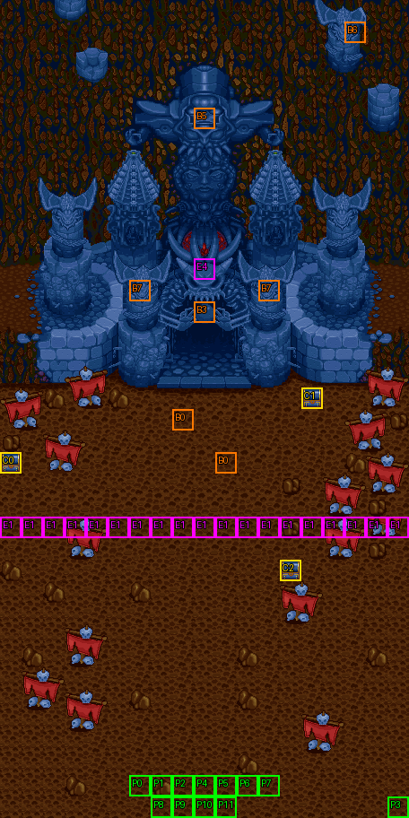

# 第 26 章　狂信人之塔

<!-- chapter_docs:header -->
| 項目 | 內容 |
| --- | --- |
| 章號／章節索引 | 26／25 |
| 章名（文字區塊 `0x01`） | 狂信人之塔 |
| 勝利條件（`0x02`） | 擊倒魔戰將軍 |
| 敗北條件（`0x03`） | 蘭迪斯死亡　索爾死亡 |
| 戰場 | `MAP25.DAT`／`MAP25.COD`／`M25.DTL`，19×38 格，我方 slot 12 個，部署記錄 80 筆 |
| 文字區塊 | `FDETXT26.TXT`，25 條 |
| 進入處理（`0x60074`[25]） | `fdps_chapter_26_init`（`0x21510`） |
| 行動後檢查（`0x6028c`[25]） | `fdps_chapter_26_post_action`（`0x3b760`） |
| 勝利處理（`0x60304`[25]） | `fdps_chapter_26_end`（`0x3b800`） |
| 地圖資料呼叫的事件處理（`0x601c4`） | slot 40：`fdps_chapter_26_event_enemies_advance`（`0x39190`）（回合事件）、slot 41：`fdps_chapter_26_event_deploy_waves_2_and_3`（`0x39230`）（格子事件）、slot 42：`fdps_chapter_26_event_wave_2_defeated_line`（`0x393b0`）（死亡腳本） |
| 過場腳本 | `ICON25.DAT`（開場）、`WIN25.DAT`（勝利） |
| 本章之前的村莊 | `SHOP25.DAT` |
| 光碟 | 第 2 片（音軌見 [CD 音軌](../program_info/cd_audio.md)） |



戰場全圖（第 0 層與同步捲動的圖層）。框線：黃 `C` 寶箱、橘 `B` 埋藏格、青 `R` 重繪格、洋紅 `E` 有處理函式的格子事件格，字母後的數字是事件碼；綠 `P` 是我方 slot 的起始格。

圖由 `python tools/chapter_docs/chapter_facts.py render-maps` 從遊戲檔重畫到 `chapters/maps/`，`verify-maps` 逐 byte 比對版控中的圖。
<!-- /chapter_docs:header -->

## 概要

蘭迪斯一行攻到狂信者教團的總壇之塔。開場過場 `ICON25.DAT` 先只讓蘭迪斯一人走向塔前，畫面沿著塔身繞一圈，其餘隊員才現身；魔戰將軍凱因巴下令「把他們攔下來」，蘭迪斯要大家一口氣衝進總壇，裘娜、尤利安、琴琴各自應聲（`0x09`）。第 4 回合凱因巴命第二、第三小隊前進（`0x16`）。

我方一踏上塔前廣場中段的那一排，凱因巴要他們「看看後面」：教團援軍出現在我方的出發地（`0x0a`）。費塔加、裘娜叫苦，尤利安建議先撤退，蘭迪斯以「萬一魔神真的降臨就沒法制服了、教主現在無法分心」堅持衝進去，這時索爾笑著出現（`0x0b`）。索爾帶著羅特帝亞的精銳趕到，說教團外圍的教眾都已被他的軍隊攔下，勸凱因巴投降；珊與蘭斯洛特和他寒暄。凱因巴以「只要教祖召喚出魔神，再有十個羅特帝亞也不夠看」拒絕，命塞克斯、布魯森、汎拉沛出擊（`0x0c`）。背後的援軍被清光時，索爾說要看看蘭迪斯這些日子成長了多少（`0x17`）。

四名魔戰將軍被打倒時各留一句話，凱因巴說「我先撤退了」（`0x0d`–`0x10`）。勝利後索爾在蘭迪斯沒有真炎龍劍時把炎龍劍交給他（`0x18`）。勝利過場 `WIN25.DAT` 裡四名將軍退進塔內，凱因巴撂下「有膽量就進來送死吧」（`0x15`）；索爾要眾人把這裡交給羅特帝亞軍、趕快進去（`0x11`），隊員依序進塔，最後索爾叫住蘭迪斯，要他「去把她救出來、盡全力」，說事情他都知道了、不會介意（`0x13`、`0x14`），蘭迪斯道謝後衝進塔中。

## 加入與離隊

- 本章沒有人加入，名冊是第 24 章結束時的 12 人，`MAP25` 的 12 個我方 slot 正好全部有人。入隊規則見 [`assets/characters.md` 的「加入」](../assets/characters.md#加入)。
- **法蓮娜**不上場：開場過場 `ICON25.DAT` 先以 `RETIRE_UNIT` 讓地圖單位 1–11 全部退場，之後只復歸 1、2、4–11，地圖單位 3（名冊第 4 位的法蓮娜，起始格在右下角 (18, 37)）沒有復歸。攻略站的「法蓮娜以外的所有人」就是這樣來的；她在 [第 23 章](ch23.md) 之後離隊。
- **索爾與四名侍衛**是客串（陣營 1，NPC，電腦操作）：波次 3 的 LV40 索爾（`0C`）與 LV40 侍衛（`3B`）×4，在中段伏擊時出場。索爾的 AI 是 2（原地，不追擊），侍衛是 3（追角色編號 `0C`，也就是跟著索爾）。他們不入隊。

## 勝敗條件與特殊機制

- **勝利**：`fdps_chapter_26_post_action`（`0x3b760`）以 `fdps_unit_is_retired`（`0x109b0`）依序問單位 `0x0c`–`0x0f`（塞克斯、布魯森、汎拉沛、凱因巴，`MAP25` 記錄 0–3），四人都退場才寫結束碼 2。本章**不呼叫**共用判定 `fdps_battle_check_default_end_conditions`（`0x3a2e0`），所以勝負與其他七十多名敵兵無關，與畫面上的「擊倒魔戰將軍」一致。
- **敗北一：蘭迪斯**：單位 0 退場就寫結束碼 1，與畫面一致。
- **敗北二：畫面寫「索爾死亡」，程式看的是最後一名侍衛**。同一支處理函式在事件旗標（觸發旗標陣列元素 `0x10`）**等於 1** 時才問單位 `0x5b` 有沒有退場。伏擊事件先部署波次 2 的 7 人（單位 `0x50`–`0x56`），再部署波次 3，索爾落在 `0x57`、四名侍衛落在 `0x58`–`0x5b`，所以 `0x5b` 是第四名侍衛（記錄 66），不是索爾。索爾本人與前三名侍衛倒下都不會敗北，只有最後一名侍衛倒下才會。旗標在伏擊事件的最後一步才設成 1，伏擊之前 `0x5b` 還不存在，這個判定也就不跑。
- 三個判定互不為 else，各自無條件覆寫結束碼，後寫的蓋掉先寫的：同一次行動裡打倒最後一名將軍又失去蘭迪斯（或第四名侍衛），結果是敗北。
- **中段伏擊**：地圖第 24 列 (0, 24)–(18, 24) 整排 19 格都是事件碼 1 的觸發格（觸發時機 0，走進就回報），要往上接近將軍就一定得跨過這一排。我方單位（陣營 2）第一次走進其中一格、該次行動結束後，`fdps_chapter_26_event_deploy_waves_2_and_3`（`0x39230`）部署敵方波次 2（7 名鎧甲武士，錨在我方出發地 (6–12, 36)）與友方波次 3（索爾與侍衛），然後把單位 `0x0c`–`0x4f`（開場的全部 68 名敵人，四名將軍也在內）的 AI 行為改成 0（主動出擊）。NPC 或敵人走過這排不會觸發，也不會耗掉事件。
- **第 4 回合的推進**：`fdps_chapter_26_event_enemies_advance`（`0x39190`）把單位 `0x1a`–`0x2d`（記錄 14–33，塔前左右兩組各 10 人：黑暗祭司、地獄騎士、神箭手、鎧甲武士）由原地改為主動出擊。開場就是主動出擊的是正面的 18 人（記錄 34–51）；其餘開場敵人（四名將軍、中央一組、兩側天空騎士）要等伏擊才會動。
- **不會前進的援軍**：兩次改 AI 的範圍都是寫死的常數，伏擊那一次止於 `0x4f`，剛出場的波次 2 七名鎧甲武士（AI 2）與波次 3 都不在範圍內，所以背後那批援軍整場站在我方出發地附近，只攻擊走進射程的目標；索爾也留在原地。
- **背後援軍全滅的台詞**：波次 2 的 7 筆記錄死亡腳本都是 slot 42。`fdps_chapter_26_event_wave_2_defeated_line`（`0x393b0`）每次被呼叫都檢查單位 `0x50`–`0x56` 是否都已退場，全部退場時由索爾說 `0x17`，並以觸發旗標陣列元素 `0x12` 鎖住，只說一次。這句話沒有獎勵。
- **炎龍劍**：勝利時蘭迪斯背包裡沒有 `A2` 真炎龍劍、且背包不滿 8 件，就得到 `62` 炎龍劍（見「寶物」）。
- (9, 12) 是事件碼 4 的格子，但 `MAP25` 的格子事件表在碼 4 沒有處理函式，走上去什麼都不會發生。

## 敵人配置

開場的 68 名敵人都是波次 0，由四名 LV30 魔戰將軍與 64 名 LV18 教眾組成：

- **塔門前**：四名將軍守在 (8–10, 16–17)，身後排著黑暗祭司、地獄騎士、神箭手、鎧甲武士各一組（記錄 4–13，(7–11, 18–19)），全部 AI 2 原地不動，直到中段伏擊。
- **左右兩組**：(4–8, 20–21) 與 (10–14, 20–21) 各 10 人（記錄 14–33），AI 2，第 4 回合改為主動出擊，就是凱因巴說的「第二小隊，第三小隊」。
- **正面**：(5–13, 22–23) 的 18 人（記錄 34–51）開場就是 AI 0，第 1 回合起就往我方壓過來。
- **天空騎士**：16 名分成左右兩群停在塔的兩側 (4–7, 12–13) 與 (11–14, 12–13)，AI 2，伏擊之後才出動。
- **背後援軍**：波次 2 的 7 名鎧甲武士在伏擊時出現在我方出發地，AI 2 且不會被改成主動，見上節。
- 各將軍與教眾的數值與法術見 [`assets/enemies.md`](../assets/enemies.md)。

<!-- chapter_docs:deployments -->
陣營與死亡腳本的意義見 [`resource_info/map.md`](../resource_info/map.md)，AI 行為（低 4 bit）見 [`program_info/map_ai.md`](../program_info/map_ai.md#行為代碼)；錨點是 `MAPnn.COD` 的座標，開場波次放在錨點上，其餘波次依部署方式放在錨點或最近的空格。單位名是全域文字的「角色編號 + 1」條；角色編號 `3C` 以上的敵兵，數值（`ENEMYDAT.DAT`）與種族、職業見 [`assets/enemies.md`](../assets/enemies.md)，以下的見 [`assets/characters.md`](../assets/characters.md)。

我方起始格：slot 0 (6, 36)、slot 1 (7, 36)、slot 2 (8, 36)、slot 3 (18, 37)、slot 4 (9, 36)、slot 5 (10, 36)、slot 6 (11, 36)、slot 7 (12, 36)、slot 8 (7, 37)、slot 9 (8, 37)、slot 10 (9, 37)、slot 11 (10, 37)。

| 波次 | 陣營 | 單位 | 等級 | 數量 |
| ---: | --- | --- | --- | ---: |
| 0 | 敵方 | `40` 塞克斯 | 30 | 1 |
| 0 | 敵方 | `41` 布魯森 | 30 | 1 |
| 0 | 敵方 | `42` 汎拉沛 | 30 | 1 |
| 0 | 敵方 | `43` 凱因巴 | 30 | 1 |
| 0 | 敵方 | `68` 黑暗祭司 | 18 | 4 |
| 0 | 敵方 | `4E` 地獄騎士 | 18 | 10 |
| 0 | 敵方 | `5F` 神箭手 | 18 | 10 |
| 0 | 敵方 | `64` 鎧甲武士 | 18 | 24 |
| 0 | 敵方 | `61` 天空騎士 | 18 | 16 |
| 2 | 敵方 | `64` 鎧甲武士 | 18 | 7 |
| 3 | NPC | `0C` 索爾 | 40 | 1 |
| 3 | NPC | `3B` 侍衛 | 40 | 4 |

### 波次 0

出場：進入戰場時由 `fdps_build_map_unit_array`（`0x22be0`） 部署在錨點上

| # | 陣營 | 單位 | 等級 | AI 行為 | 錨點 | 死亡腳本 |
| ---: | --- | --- | ---: | --- | --- | --- |
| 0 | 敵方 | `40` 塞克斯 | 30 | 2 原地 | (8, 17) | 顯示 `0x0d` |
| 1 | 敵方 | `41` 布魯森 | 30 | 2 原地 | (9, 17) | 顯示 `0x0e` |
| 2 | 敵方 | `42` 汎拉沛 | 30 | 2 原地 | (10, 17) | 顯示 `0x0f` |
| 3 | 敵方 | `43` 凱因巴 | 30 | 2 原地 | (9, 16) | 顯示 `0x10` |
| 4 | 敵方 | `68` 黑暗祭司 | 18 | 2 原地 | (9, 18) | — |
| 5 | 敵方 | `4E` 地獄騎士 | 18 | 2 原地 | (8, 18) | — |
| 6 | 敵方 | `4E` 地獄騎士 | 18 | 2 原地 | (10, 18) | — |
| 7 | 敵方 | `5F` 神箭手 | 18 | 2 原地 | (7, 18) | — |
| 8 | 敵方 | `5F` 神箭手 | 18 | 2 原地 | (11, 18) | 掉落 `C2` 神聖之水 |
| 9 | 敵方 | `64` 鎧甲武士 | 18 | 2 原地 | (7, 19) | 掉落 `C2` 神聖之水 |
| 10 | 敵方 | `64` 鎧甲武士 | 18 | 2 原地 | (8, 19) | — |
| 11 | 敵方 | `64` 鎧甲武士 | 18 | 2 原地 | (9, 19) | — |
| 12 | 敵方 | `64` 鎧甲武士 | 18 | 2 原地 | (10, 19) | — |
| 13 | 敵方 | `64` 鎧甲武士 | 18 | 2 原地 | (11, 19) | — |
| 14 | 敵方 | `68` 黑暗祭司 | 18 | 2 原地 | (6, 20) | — |
| 15 | 敵方 | `4E` 地獄騎士 | 18 | 2 原地 | (5, 20) | — |
| 16 | 敵方 | `4E` 地獄騎士 | 18 | 2 原地 | (7, 20) | — |
| 17 | 敵方 | `5F` 神箭手 | 18 | 2 原地 | (4, 20) | — |
| 18 | 敵方 | `5F` 神箭手 | 18 | 2 原地 | (8, 20) | — |
| 19 | 敵方 | `64` 鎧甲武士 | 18 | 2 原地 | (4, 21) | — |
| 20 | 敵方 | `64` 鎧甲武士 | 18 | 2 原地 | (5, 21) | 掉落 `C2` 神聖之水 |
| 21 | 敵方 | `64` 鎧甲武士 | 18 | 2 原地 | (6, 21) | — |
| 22 | 敵方 | `64` 鎧甲武士 | 18 | 2 原地 | (7, 21) | — |
| 23 | 敵方 | `64` 鎧甲武士 | 18 | 2 原地 | (8, 21) | — |
| 24 | 敵方 | `68` 黑暗祭司 | 18 | 2 原地 | (12, 20) | — |
| 25 | 敵方 | `4E` 地獄騎士 | 18 | 2 原地 | (11, 20) | — |
| 26 | 敵方 | `4E` 地獄騎士 | 18 | 2 原地 | (13, 20) | — |
| 27 | 敵方 | `5F` 神箭手 | 18 | 2 原地 | (10, 20) | 掉落 `C2` 神聖之水 |
| 28 | 敵方 | `5F` 神箭手 | 18 | 2 原地 | (14, 20) | — |
| 29 | 敵方 | `64` 鎧甲武士 | 18 | 2 原地 | (10, 21) | — |
| 30 | 敵方 | `64` 鎧甲武士 | 18 | 2 原地 | (11, 21) | — |
| 31 | 敵方 | `64` 鎧甲武士 | 18 | 2 原地 | (12, 21) | — |
| 32 | 敵方 | `64` 鎧甲武士 | 18 | 2 原地 | (13, 21) | — |
| 33 | 敵方 | `64` 鎧甲武士 | 18 | 2 原地 | (14, 21) | — |
| 34 | 敵方 | `68` 黑暗祭司 | 18 | 0 主動 | (9, 22) | — |
| 35 | 敵方 | `4E` 地獄騎士 | 18 | 0 主動 | (8, 22) | 掉落 `C2` 神聖之水 |
| 36 | 敵方 | `4E` 地獄騎士 | 18 | 0 主動 | (10, 22) | — |
| 37 | 敵方 | `4E` 地獄騎士 | 18 | 0 主動 | (7, 22) | — |
| 38 | 敵方 | `4E` 地獄騎士 | 18 | 0 主動 | (11, 22) | — |
| 39 | 敵方 | `5F` 神箭手 | 18 | 0 主動 | (6, 22) | — |
| 40 | 敵方 | `5F` 神箭手 | 18 | 0 主動 | (5, 22) | — |
| 41 | 敵方 | `5F` 神箭手 | 18 | 0 主動 | (12, 22) | — |
| 42 | 敵方 | `5F` 神箭手 | 18 | 0 主動 | (13, 22) | — |
| 43 | 敵方 | `64` 鎧甲武士 | 18 | 0 主動 | (9, 23) | — |
| 44 | 敵方 | `64` 鎧甲武士 | 18 | 0 主動 | (8, 23) | — |
| 45 | 敵方 | `64` 鎧甲武士 | 18 | 0 主動 | (10, 23) | — |
| 46 | 敵方 | `64` 鎧甲武士 | 18 | 0 主動 | (7, 23) | — |
| 47 | 敵方 | `64` 鎧甲武士 | 18 | 0 主動 | (11, 23) | — |
| 48 | 敵方 | `64` 鎧甲武士 | 18 | 0 主動 | (6, 23) | — |
| 49 | 敵方 | `64` 鎧甲武士 | 18 | 0 主動 | (12, 23) | — |
| 50 | 敵方 | `64` 鎧甲武士 | 18 | 0 主動 | (5, 23) | — |
| 51 | 敵方 | `64` 鎧甲武士 | 18 | 0 主動 | (13, 23) | — |
| 52 | 敵方 | `61` 天空騎士 | 18 | 2 原地 | (7, 13) | — |
| 53 | 敵方 | `61` 天空騎士 | 18 | 2 原地 | (6, 13) | — |
| 54 | 敵方 | `61` 天空騎士 | 18 | 2 原地 | (5, 13) | — |
| 55 | 敵方 | `61` 天空騎士 | 18 | 2 原地 | (4, 13) | — |
| 56 | 敵方 | `61` 天空騎士 | 18 | 2 原地 | (7, 12) | — |
| 57 | 敵方 | `61` 天空騎士 | 18 | 2 原地 | (6, 12) | — |
| 58 | 敵方 | `61` 天空騎士 | 18 | 2 原地 | (5, 12) | — |
| 59 | 敵方 | `61` 天空騎士 | 18 | 2 原地 | (4, 12) | — |
| 60 | 敵方 | `61` 天空騎士 | 18 | 2 原地 | (11, 13) | — |
| 61 | 敵方 | `61` 天空騎士 | 18 | 2 原地 | (12, 13) | — |
| 67 | 敵方 | `61` 天空騎士 | 18 | 2 原地 | (13, 13) | — |
| 68 | 敵方 | `61` 天空騎士 | 18 | 2 原地 | (14, 13) | — |
| 69 | 敵方 | `61` 天空騎士 | 18 | 2 原地 | (11, 12) | — |
| 70 | 敵方 | `61` 天空騎士 | 18 | 2 原地 | (12, 12) | — |
| 71 | 敵方 | `61` 天空騎士 | 18 | 2 原地 | (13, 12) | — |
| 72 | 敵方 | `61` 天空騎士 | 18 | 2 原地 | (14, 12) | — |

### 波次 2

出場：我方單位第一次走進第 24 列（(0, 24)–(18, 24) 任一格）的那次行動結束後，格子事件 slot 41 呼叫 `fdps_chapter_26_event_deploy_waves_2_and_3`（`0x39230`），第一步就部署（找最近空格，錨點是我方出發地 (6–12, 36)），接著畫文字 `0x0a`；只發生一次

| # | 陣營 | 單位 | 等級 | AI 行為 | 錨點 | 死亡腳本 |
| ---: | --- | --- | ---: | --- | --- | --- |
| 73 | 敵方 | `64` 鎧甲武士 | 18 | 2 原地 | (6, 36) | 事件 slot 42：`fdps_chapter_26_event_wave_2_defeated_line`（`0x393b0`） |
| 74 | 敵方 | `64` 鎧甲武士 | 18 | 2 原地 | (7, 36) | 事件 slot 42：`fdps_chapter_26_event_wave_2_defeated_line`（`0x393b0`） |
| 75 | 敵方 | `64` 鎧甲武士 | 18 | 2 原地 | (8, 36) | 事件 slot 42：`fdps_chapter_26_event_wave_2_defeated_line`（`0x393b0`） |
| 76 | 敵方 | `64` 鎧甲武士 | 18 | 2 原地 | (9, 36) | 事件 slot 42：`fdps_chapter_26_event_wave_2_defeated_line`（`0x393b0`） |
| 77 | 敵方 | `64` 鎧甲武士 | 18 | 2 原地 | (10, 36) | 事件 slot 42：`fdps_chapter_26_event_wave_2_defeated_line`（`0x393b0`） |
| 78 | 敵方 | `64` 鎧甲武士 | 18 | 2 原地 | (11, 36) | 事件 slot 42：`fdps_chapter_26_event_wave_2_defeated_line`（`0x393b0`） |
| 79 | 敵方 | `64` 鎧甲武士 | 18 | 2 原地 | (12, 36) | 事件 slot 42：`fdps_chapter_26_event_wave_2_defeated_line`（`0x393b0`） |

### 波次 3

出場：同一次 `fdps_chapter_26_event_deploy_waves_2_and_3`（`0x39230`）裡，波次 2 出場、視野移到地圖底部停 12 幀、畫完 `0x0b` 之後部署（找最近空格），接著畫 `0x0c`

| # | 陣營 | 單位 | 等級 | AI 行為 | 錨點 | 死亡腳本 |
| ---: | --- | --- | ---: | --- | --- | --- |
| 62 | NPC | `0C` 索爾 | 40 | 2 原地 | (9, 37) | — |
| 63 | NPC | `3B` 侍衛 | 40 | 3 追角色：`0C` 索爾 | (8, 37) | — |
| 64 | NPC | `3B` 侍衛 | 40 | 3 追角色：`0C` 索爾 | (10, 37) | — |
| 65 | NPC | `3B` 侍衛 | 40 | 3 追角色：`0C` 索爾 | (7, 37) | — |
| 66 | NPC | `3B` 侍衛 | 40 | 3 追角色：`0C` 索爾 | (11, 37) | — |
<!-- /chapter_docs:deployments -->

## 寶物

- **炎龍劍**：`fdps_chapter_26_end`（`0x3b800`）在蘭迪斯（單位 0）不帶 `A2` 真炎龍劍、背包不是 8 件時，畫 `0x18` 並把 `62` 炎龍劍放進他的背包。檢查只看蘭迪斯自己的背包，所以真炎龍劍放在別人身上時他照樣會拿到炎龍劍；背包滿時台詞與劍都沒有。真炎龍劍是 [第 25 章](ch25.md) 火神把火光之劍換成的，數值見 [`assets/items.md`](../assets/items.md)。
- 敵兵掉落的神聖之水（死亡腳本 opcode 0）要由存活的我方單位打倒才會掉；伏擊後索爾與侍衛也會參戰，被他們打倒的那幾名不會掉任何東西。
- 雷之魔石的記錄 0 有三格引用：(0, 21) 寶箱、(8, 19) 與 (10, 21) 埋藏，只拿得到一次。

<!-- chapter_docs:treasure -->
搜尋的規則（同碼的格共用一筆記錄與一個旗標、背包滿時的交換）見 [`resource_info/map.md`](../resource_info/map.md)。

| 事件碼 | 格 | 內容 |
| ---: | --- | --- |
| 0 | (8, 19) 埋藏、(0, 21) 寶箱、(10, 21) 埋藏 | `D3` 雷之魔石（3 格共用，只拿得到一次） |
| 1 | (14, 18) 寶箱 | `D8` 力量藥水 |
| 2 | (13, 26) 寶箱 | `D9` 耐力藥水 |
| 3 | (9, 14) 埋藏 | `B9` 水晶粒 |
| 5 | (9, 5) 埋藏 | `42` 烈神拳套 |
| 6 | (16, 1) 埋藏 | `28` 極光之矛 |
| 7 | (6, 13) 埋藏、(12, 13) 埋藏 | `D6` 生命之實（2 格共用，只拿得到一次） |

沒有任何格引用、拿不到的記錄：記錄 4（種類 0、內容 `D7`），見 [I04](../cut_content/items.md#i04-章節地圖上沒有格子引用的寶物記錄)。

擊倒後掉落（死亡腳本 opcode 0／1，擊殺者須是存活的我方單位）：

| # | 單位 | 波次 | 掉落 |
| ---: | --- | ---: | --- |
| 8 | `5F` 神箭手 | 0 | 掉落 `C2` 神聖之水 |
| 9 | `64` 鎧甲武士 | 0 | 掉落 `C2` 神聖之水 |
| 20 | `64` 鎧甲武士 | 0 | 掉落 `C2` 神聖之水 |
| 27 | `5F` 神箭手 | 0 | 掉落 `C2` 神聖之水 |
| 35 | `4E` 地獄騎士 | 0 | 掉落 `C2` 神聖之水 |
<!-- /chapter_docs:treasure -->

## 村莊

<!-- chapter_docs:village -->
第 25 章勝利後、本章之前的村莊載入 `SHOP25.DAT`，道具店、武器店、秘密商店的貨見 [`assets/shops.md`](../assets/shops.md)。村莊載入的文字區塊是 `FDETXT26`（章節索引 + 1，`fdps_load_field_chapter_resources`（`0x31540`）），也就是本章的區塊，所以村莊畫面的文字是本章區塊的 `0x04`–`0x08`，全文在下方「對話」。
<!-- /chapter_docs:village -->

## 處理流程

### `fdps_chapter_26_init`（`0x21510`）

1. `fdps_chapter_state_reset`（`0x22750`）：從名冊填滿地圖 25 的 12 個我方 slot，部署波次 0 的 68 名敵人（單位 `0x0c`–`0x4f`），清空觸發旗標。
2. `fdps_icon_script_run`（`0x21650`）播 `ICON25.DAT`：地圖單位 1–11 退場，蘭迪斯往上走 4 格到 (6, 32)，畫面繞塔一圈，復歸 1、2、4–11（法蓮娜的 3 不復歸）並讓他們往上走 2 格，最後畫 `0x09`。腳本不切換地圖、不部署波次。
3. `fdps_show_chapter_title_card`（`0x20c60`）顯示章名卡。
4. `fdps_map_cursor_move_to_unit`（`0x2da50`）把游標放在單位 0（蘭迪斯，此時在 (6, 32)）。

### `fdps_chapter_26_event_enemies_advance`（`0x39190`）

`MAP25` 唯一的回合事件（第 4 回合、敵方階段前，slot 40），由 `fdps_battle_run_turn_events`（`0x2e0c0`）呼叫；參數不用。

1. 畫 `0x16`（凱因巴：「第二小隊，第三小隊，前進！」）。
2. 把單位 `0x1a`–`0x2d`（含兩端）的 AI 行為低 4 bit 改成 0，高 4 bit 保留。

### `fdps_chapter_26_event_deploy_waves_2_and_3`（`0x39230`）

第 24 列 19 格的格子事件（slot 41），以走進那一格的單位索引呼叫。

1. 取得觸發單位的記錄；觸發旗標陣列元素 `0x10` 已非 0、或觸發者不是陣營 2 時什麼都不做（旗標不設）。
2. `fdps_deploy_wave`（`0x23830`）部署波次 2（找最近空格），畫 `0x0a`。
3. 游標繪製模式設為 0（不畫游標），`fdps_map_cursor_move_to`（`0x2d7c0`）把視野移到地圖底部 (10, 37)，以 `fdps_render_view_frame`（`0x2beb0`）停 12 幀，游標模式設回 1。視野不捲回。
4. 畫 `0x0b`，部署波次 3（找最近空格），畫 `0x0c`。敵方援軍是先出現再開口，友方援軍是先聽到索爾的笑聲才出現。
5. 把單位 `0x0c`–`0x4f`（含兩端）的 AI 行為低 4 bit 改成 0。範圍是常數，正好是開場的 68 名敵人，不含剛出場的 `0x50`–`0x5b`。
6. 觸發旗標陣列元素 `0x10` 設為 1。

### `fdps_chapter_26_event_wave_2_defeated_line`（`0x393b0`）

波次 2 七筆記錄的死亡腳本（opcode 2，slot 42），由 `fdps_run_death_scripts`（`0x1d990`）以擊殺者的索引呼叫；參數不用。

1. 觸發旗標陣列元素 `0x12` 非 0 時什麼都不做。
2. 對單位 `0x50`–`0x56` 七個都問一次 `fdps_unit_is_retired`（`0x109b0`），不提前結束。
3. 七個都已退場時畫 `0x17`（索爾），元素 `0x12` 設為 1。

### `fdps_chapter_26_post_action`（`0x3b760`）

每次行動後執行，三個判定依序、互不為 else：

1. 單位 `0x0c`、`0x0d`、`0x0e`、`0x0f` 依序問是否退場（短路，遇到未退場就停），四個都退場 → 結束碼 2。
2. 單位 0 退場 → 結束碼 1。
3. 觸發旗標陣列元素 `0x10` 等於 1 且單位 `0x5b` 退場 → 結束碼 1。

### `fdps_chapter_26_end`（`0x3b800`）

1. `fdps_unit_find_item_slot`（`0x34520`）找蘭迪斯背包裡的 `A2`；找不到時再以 `fdps_unit_item_count`（`0x25240`）數背包，不是 8 件就畫 `0x18` 並以 `fdps_unit_add_item`（`0x25d20`）給 `62` 炎龍劍。這一步在寫回名冊之前，劍才會留下來。
2. `fdps_battle_destroy_remaining_enemies`（`0x39e10`）清掉殘敵。
3. `fdps_roster_write_back_battle_units`（`0x23980`）寫回名冊。
4. `fdps_icon_script_run`（`0x21650`）播 `WIN25.DAT`。
5. `fdps_roster_revive_fallen_members`（`0x39e70`）付費復活倒下的隊員。
6. 章節索引設為 26，下一章是 [第 27 章](ch27.md)。

`WIN25.DAT` 以地圖單位 87 指索爾、88–91 指四名侍衛（腳本讓侍衛退場、只放置索爾），並把四名將軍（單位 12–15）復歸後讓他們走進塔門再退場。將軍在伏擊前原地不動，我方要接近他們就得走過整排都是觸發格的第 24 列，所以過關時伏擊實際上都已發生，這些索引落在已部署的單位上。

## 回合事件與格子事件

<!-- chapter_docs:events -->
觸發時機與陣營階段的意義見 [`resource_info/map.md`](../resource_info/map.md)。

| 回合 | 陣營階段 | slot | 處理函式 |
| ---: | --- | ---: | --- |
| 4 | 敵方階段前 | 40 | `fdps_chapter_26_event_enemies_advance`（`0x39190`） |

| 事件碼 | 格 | 觸發 | slot | 處理函式 |
| ---: | --- | --- | ---: | --- |
| 1 | (0, 24)、(1, 24)、(2, 24)、(3, 24)、(4, 24)、(5, 24)、(6, 24)、(7, 24)、(8, 24)、(9, 24)、(10, 24)、(11, 24)、(12, 24)、(13, 24)、(14, 24)、(15, 24)、(16, 24)、(17, 24)、(18, 24) | 走進 | 41 | `fdps_chapter_26_event_deploy_waves_2_and_3`（`0x39230`） |

死亡腳本裡的事件與文字：

| # | 單位 | 波次 | 死亡腳本 |
| ---: | --- | ---: | --- |
| 0 | `40` 塞克斯 | 0 | 顯示 `0x0d` |
| 1 | `41` 布魯森 | 0 | 顯示 `0x0e` |
| 2 | `42` 汎拉沛 | 0 | 顯示 `0x0f` |
| 3 | `43` 凱因巴 | 0 | 顯示 `0x10` |
| 73 | `64` 鎧甲武士 | 2 | 事件 slot 42：`fdps_chapter_26_event_wave_2_defeated_line`（`0x393b0`） |
| 74 | `64` 鎧甲武士 | 2 | 事件 slot 42：`fdps_chapter_26_event_wave_2_defeated_line`（`0x393b0`） |
| 75 | `64` 鎧甲武士 | 2 | 事件 slot 42：`fdps_chapter_26_event_wave_2_defeated_line`（`0x393b0`） |
| 76 | `64` 鎧甲武士 | 2 | 事件 slot 42：`fdps_chapter_26_event_wave_2_defeated_line`（`0x393b0`） |
| 77 | `64` 鎧甲武士 | 2 | 事件 slot 42：`fdps_chapter_26_event_wave_2_defeated_line`（`0x393b0`） |
| 78 | `64` 鎧甲武士 | 2 | 事件 slot 42：`fdps_chapter_26_event_wave_2_defeated_line`（`0x393b0`） |
| 79 | `64` 鎧甲武士 | 2 | 事件 slot 42：`fdps_chapter_26_event_wave_2_defeated_line`（`0x393b0`） |
<!-- /chapter_docs:events -->

## 過場腳本

<!-- chapter_docs:scripts -->
格式與每個指令的意義見 [`resource_info/cutscene_script.md`](../resource_info/cutscene_script.md)。`FDETXT26#0xNN` 是本章文字區塊的條目，全文在下方「對話」；切到額外場景之後顯示的文字直接列出（那些區塊的正典是 [`assets/text/scene_text.md`](../assets/text/scene_text.md)）。`u3=我方1` 是地圖單位索引 3 對到我方 slot 1，`u12=MAP02#9` 是 `MAP02.DAT` 第 9 筆部署記錄。

### `ICON25.DAT`

- 開場：`fdps_chapter_26_init`（`0x21510`）
- 1564 byte、143 步；起始地圖 25，切換地圖 無，結束於地圖 25

| 偏移 | 指令 | 內容 |
| ---: | --- | --- |
| `0000` | `FADE_OUT` | 淡出，每步 80 ms |
| `0002` | `SET_MUSIC` | 音樂 12（CD 第 13 軌） |
| `0004` | `SCROLL_VIEW` | 捲動視野到格 (3, 18) |
| `0007` | `RETIRE_UNIT` | 退場 u1=我方1 |
| `0009` | `RETIRE_UNIT` | 退場 u2=我方2 |
| `000b` | `RETIRE_UNIT` | 退場 u3=我方3 |
| `000d` | `RETIRE_UNIT` | 退場 u4=我方4 |
| `000f` | `RETIRE_UNIT` | 退場 u5=我方5 |
| `0011` | `RETIRE_UNIT` | 退場 u6=我方6 |
| `0013` | `RETIRE_UNIT` | 退場 u7=我方7 |
| `0015` | `RETIRE_UNIT` | 退場 u8=我方8 |
| `0017` | `RETIRE_UNIT` | 退場 u9=我方9 |
| `0019` | `RETIRE_UNIT` | 退場 u10=我方10 |
| `001b` | `RETIRE_UNIT` | 退場 u11=我方11 |
| `001d` | `FACE_UNITS` | 轉向後停 1 幀：u0=我方0朝上 |
| `0022` | `FADE_IN` | 淡入，每步 5 ms |
| `0024` | `FADE_OUT` | 淡出，每步 80 ms |
| `0026` | `SCROLL_VIEW` | 捲動視野到格 (3, 10) |
| `0029` | `FADE_IN` | 淡入，每步 5 ms |
| `002b` | `FADE_OUT` | 淡出，每步 80 ms |
| `002d` | `SCROLL_VIEW` | 捲動視野到格 (3, 0) |
| `0030` | `FADE_IN` | 淡入，每步 5 ms |
| `0032` | `FADE_OUT` | 淡出，每步 80 ms |
| `0034` | `SCROLL_VIEW` | 捲動視野到格 (3, 28) |
| `0037` | `FACE_UNITS` | 轉向後停 50 幀：u0=我方0朝上 |
| `003c` | `FADE_IN` | 淡入，每步 60 ms |
| `003e` | `FACE_UNITS` | 轉向後停 50 幀：u0=我方0朝上 |
| `0043` | `WALK_UNITS` | 行走 4 格，每步 4 幀：u0=我方0往上 |
| `0049` | `FACE_UNITS` | 轉向後停 50 幀：u0=我方0朝上 |
| `004e` | `FACE_UNITS` | 轉向後停 25 幀：u0=我方0朝左 |
| `0053` | `FACE_UNITS` | 轉向後停 25 幀：u0=我方0朝右 |
| `0058` | `FACE_UNITS` | 轉向後停 12 幀：u0=我方0朝上 |
| `005d` | `SCROLL_VIEW` | 捲動視野到格 (3, 20) |
| `0060` | `SHAKE_VIEW` | 視野位移 12 步，每步 2 幀：(-2,-2) (-4,-4) (-6,-6) (-8,-8) (-10,-10) (-12,-12) (-14,-14) (-16,-16) (-18,-18) (-20,-20) (-22,-22) (-24,-24) |
| `007b` | `SET_VIEW_TILE` | 視野直接設到格 (2, 19) |
| `007e` | `SHAKE_VIEW` | 視野位移 12 步，每步 2 幀：(-2,-2) (-4,-4) (-6,-6) (-8,-8) (-10,-10) (-12,-12) (-14,-14) (-16,-16) (-18,-18) (-20,-20) (-22,-22) (-24,-24) |
| `0099` | `SET_VIEW_TILE` | 視野直接設到格 (1, 18) |
| `009c` | `SHAKE_VIEW` | 視野位移 12 步，每步 2 幀：(-2,-2) (-4,-4) (-6,-6) (-8,-8) (-10,-10) (-12,-12) (-14,-14) (-16,-16) (-18,-18) (-20,-20) (-22,-22) (-24,-24) |
| `00b7` | `SET_VIEW_TILE` | 視野直接設到格 (0, 17) |
| `00ba` | `SHAKE_VIEW` | 視野位移 12 步，每步 2 幀：(0,-2) (0,-4) (0,-6) (0,-8) (0,-10) (0,-12) (0,-14) (0,-16) (0,-18) (0,-20) (0,-22) (0,-24) |
| `00d5` | `SET_VIEW_TILE` | 視野直接設到格 (0, 16) |
| `00d8` | `SHAKE_VIEW` | 視野位移 12 步，每步 2 幀：(0,-2) (0,-4) (0,-6) (0,-8) (0,-10) (0,-12) (0,-14) (0,-16) (0,-18) (0,-20) (0,-22) (0,-24) |
| `00f3` | `SET_VIEW_TILE` | 視野直接設到格 (0, 15) |
| `00f6` | `SHAKE_VIEW` | 視野位移 12 步，每步 2 幀：(0,-2) (0,-4) (0,-6) (0,-8) (0,-10) (0,-12) (0,-14) (0,-16) (0,-18) (0,-20) (0,-22) (0,-24) |
| `0111` | `SET_VIEW_TILE` | 視野直接設到格 (0, 14) |
| `0114` | `SHAKE_VIEW` | 視野位移 12 步，每步 2 幀：(0,-2) (0,-4) (0,-6) (0,-8) (0,-10) (0,-12) (0,-14) (0,-16) (0,-18) (0,-20) (0,-22) (0,-24) |
| `012f` | `SET_VIEW_TILE` | 視野直接設到格 (0, 13) |
| `0132` | `SHAKE_VIEW` | 視野位移 12 步，每步 2 幀：(0,-2) (0,-4) (0,-6) (0,-8) (0,-10) (0,-12) (0,-14) (0,-16) (0,-18) (0,-20) (0,-22) (0,-24) |
| `014d` | `SET_VIEW_TILE` | 視野直接設到格 (0, 12) |
| `0150` | `SHAKE_VIEW` | 視野位移 12 步，每步 2 幀：(0,-2) (0,-4) (0,-6) (0,-8) (0,-10) (0,-12) (0,-14) (0,-16) (0,-18) (0,-20) (0,-22) (0,-24) |
| `016b` | `SET_VIEW_TILE` | 視野直接設到格 (0, 11) |
| `016e` | `SHAKE_VIEW` | 視野位移 12 步，每步 2 幀：(0,-2) (0,-4) (0,-6) (0,-8) (0,-10) (0,-12) (0,-14) (0,-16) (0,-18) (0,-20) (0,-22) (0,-24) |
| `0189` | `SET_VIEW_TILE` | 視野直接設到格 (0, 10) |
| `018c` | `SHAKE_VIEW` | 視野位移 12 步，每步 2 幀：(0,-2) (0,-4) (0,-6) (0,-8) (0,-10) (0,-12) (0,-14) (0,-16) (0,-18) (0,-20) (0,-22) (0,-24) |
| `01a7` | `SET_VIEW_TILE` | 視野直接設到格 (0, 9) |
| `01aa` | `SHAKE_VIEW` | 視野位移 12 步，每步 2 幀：(0,-2) (0,-4) (0,-6) (0,-8) (0,-10) (0,-12) (0,-14) (0,-16) (0,-18) (0,-20) (0,-22) (0,-24) |
| `01c5` | `SET_VIEW_TILE` | 視野直接設到格 (0, 8) |
| `01c8` | `SHAKE_VIEW` | 視野位移 12 步，每步 2 幀：(0,-2) (0,-4) (0,-6) (0,-8) (0,-10) (0,-12) (0,-14) (0,-16) (0,-18) (0,-20) (0,-22) (0,-24) |
| `01e3` | `SET_VIEW_TILE` | 視野直接設到格 (0, 7) |
| `01e6` | `SHAKE_VIEW` | 視野位移 12 步，每步 2 幀：(0,-2) (0,-4) (0,-6) (0,-8) (0,-10) (0,-12) (0,-14) (0,-16) (0,-18) (0,-20) (0,-22) (0,-24) |
| `0201` | `SET_VIEW_TILE` | 視野直接設到格 (0, 6) |
| `0204` | `SHAKE_VIEW` | 視野位移 12 步，每步 2 幀：(0,-2) (0,-4) (0,-6) (0,-8) (0,-10) (0,-12) (0,-14) (0,-16) (0,-18) (0,-20) (0,-22) (0,-24) |
| `021f` | `SET_VIEW_TILE` | 視野直接設到格 (0, 5) |
| `0222` | `SHAKE_VIEW` | 視野位移 12 步，每步 2 幀：(0,-2) (0,-4) (0,-6) (0,-8) (0,-10) (0,-12) (0,-14) (0,-16) (0,-18) (0,-20) (0,-22) (0,-24) |
| `023d` | `SET_VIEW_TILE` | 視野直接設到格 (0, 4) |
| `0240` | `SHAKE_VIEW` | 視野位移 12 步，每步 2 幀：(0,-2) (0,-4) (0,-6) (0,-8) (0,-10) (0,-12) (0,-14) (0,-16) (0,-18) (0,-20) (0,-22) (0,-24) |
| `025b` | `SET_VIEW_TILE` | 視野直接設到格 (0, 3) |
| `025e` | `SHAKE_VIEW` | 視野位移 12 步，每步 2 幀：(0,-2) (0,-4) (0,-6) (0,-8) (0,-10) (0,-12) (0,-14) (0,-16) (0,-18) (0,-20) (0,-22) (0,-24) |
| `0279` | `SET_VIEW_TILE` | 視野直接設到格 (0, 2) |
| `027c` | `SHAKE_VIEW` | 視野位移 12 步，每步 2 幀：(0,-2) (0,-4) (0,-6) (0,-8) (0,-10) (0,-12) (0,-14) (0,-16) (0,-18) (0,-20) (0,-22) (0,-24) |
| `0297` | `SET_VIEW_TILE` | 視野直接設到格 (0, 1) |
| `029a` | `SHAKE_VIEW` | 視野位移 12 步，每步 2 幀：(0,-2) (0,-4) (0,-6) (0,-8) (0,-10) (0,-12) (0,-14) (0,-16) (0,-18) (0,-20) (0,-22) (0,-24) |
| `02b5` | `SET_VIEW_TILE` | 視野直接設到格 (0, 0) |
| `02b8` | `REVIVE_UNIT` | 復歸 u1=我方1（清狀態） |
| `02ba` | `REVIVE_UNIT` | 復歸 u2=我方2（清狀態） |
| `02bc` | `REVIVE_UNIT` | 復歸 u4=我方4（清狀態） |
| `02be` | `REVIVE_UNIT` | 復歸 u5=我方5（清狀態） |
| `02c0` | `REVIVE_UNIT` | 復歸 u6=我方6（清狀態） |
| `02c2` | `REVIVE_UNIT` | 復歸 u7=我方7（清狀態） |
| `02c4` | `REVIVE_UNIT` | 復歸 u8=我方8（清狀態） |
| `02c6` | `REVIVE_UNIT` | 復歸 u9=我方9（清狀態） |
| `02c8` | `REVIVE_UNIT` | 復歸 u10=我方10（清狀態） |
| `02ca` | `REVIVE_UNIT` | 復歸 u11=我方11（清狀態） |
| `02cc` | `SHAKE_VIEW` | 視野位移 12 步，每步 2 幀：(2,0) (4,0) (6,0) (8,0) (10,0) (12,0) (14,0) (16,0) (18,0) (20,0) (22,0) (24,0) |
| `02e7` | `SET_VIEW_TILE` | 視野直接設到格 (1, 0) |
| `02ea` | `SHAKE_VIEW` | 視野位移 12 步，每步 2 幀：(2,0) (4,0) (6,0) (8,0) (10,0) (12,0) (14,0) (16,0) (18,0) (20,0) (22,0) (24,0) |
| `0305` | `SET_VIEW_TILE` | 視野直接設到格 (2, 0) |
| `0308` | `SHAKE_VIEW` | 視野位移 12 步，每步 2 幀：(2,0) (4,0) (6,0) (8,0) (10,0) (12,0) (14,0) (16,0) (18,0) (20,0) (22,0) (24,0) |
| `0323` | `SET_VIEW_TILE` | 視野直接設到格 (3, 0) |
| `0326` | `SHAKE_VIEW` | 視野位移 12 步，每步 2 幀：(2,0) (4,0) (6,0) (8,0) (10,0) (12,0) (14,0) (16,0) (18,0) (20,0) (22,0) (24,0) |
| `0341` | `SET_VIEW_TILE` | 視野直接設到格 (4, 0) |
| `0344` | `SHAKE_VIEW` | 視野位移 12 步，每步 2 幀：(2,0) (4,0) (6,0) (8,0) (10,0) (12,0) (14,0) (16,0) (18,0) (20,0) (22,0) (24,0) |
| `035f` | `SET_VIEW_TILE` | 視野直接設到格 (5, 0) |
| `0362` | `SHAKE_VIEW` | 視野位移 12 步，每步 2 幀：(2,0) (4,0) (6,0) (8,0) (10,0) (12,0) (14,0) (16,0) (18,0) (20,0) (22,0) (24,0) |
| `037d` | `SET_VIEW_TILE` | 視野直接設到格 (6, 0) |
| `0380` | `FACE_UNITS` | 轉向後停 1 幀：u1=我方1朝上、u2=我方2朝上、u4=我方4朝上、u5=我方5朝上、u6=我方6朝上、u7=我方7朝上、u8=我方8朝上、u9=我方9朝上、u10=我方10朝上、u11=我方11朝上 |
| `0397` | `SHAKE_VIEW` | 視野位移 12 步，每步 2 幀：(0,2) (0,4) (0,6) (0,8) (0,10) (0,12) (0,14) (0,16) (0,18) (0,20) (0,22) (0,24) |
| `03b2` | `SET_VIEW_TILE` | 視野直接設到格 (6, 1) |
| `03b5` | `SHAKE_VIEW` | 視野位移 12 步，每步 2 幀：(0,2) (0,4) (0,6) (0,8) (0,10) (0,12) (0,14) (0,16) (0,18) (0,20) (0,22) (0,24) |
| `03d0` | `SET_VIEW_TILE` | 視野直接設到格 (6, 2) |
| `03d3` | `SHAKE_VIEW` | 視野位移 12 步，每步 2 幀：(0,2) (0,4) (0,6) (0,8) (0,10) (0,12) (0,14) (0,16) (0,18) (0,20) (0,22) (0,24) |
| `03ee` | `SET_VIEW_TILE` | 視野直接設到格 (6, 3) |
| `03f1` | `SHAKE_VIEW` | 視野位移 12 步，每步 2 幀：(0,2) (0,4) (0,6) (0,8) (0,10) (0,12) (0,14) (0,16) (0,18) (0,20) (0,22) (0,24) |
| `040c` | `SET_VIEW_TILE` | 視野直接設到格 (6, 4) |
| `040f` | `SHAKE_VIEW` | 視野位移 12 步，每步 2 幀：(0,2) (0,4) (0,6) (0,8) (0,10) (0,12) (0,14) (0,16) (0,18) (0,20) (0,22) (0,24) |
| `042a` | `SET_VIEW_TILE` | 視野直接設到格 (6, 5) |
| `042d` | `SHAKE_VIEW` | 視野位移 12 步，每步 2 幀：(0,2) (0,4) (0,6) (0,8) (0,10) (0,12) (0,14) (0,16) (0,18) (0,20) (0,22) (0,24) |
| `0448` | `SET_VIEW_TILE` | 視野直接設到格 (6, 6) |
| `044b` | `SHAKE_VIEW` | 視野位移 12 步，每步 2 幀：(0,2) (0,4) (0,6) (0,8) (0,10) (0,12) (0,14) (0,16) (0,18) (0,20) (0,22) (0,24) |
| `0466` | `SET_VIEW_TILE` | 視野直接設到格 (6, 7) |
| `0469` | `SHAKE_VIEW` | 視野位移 12 步，每步 2 幀：(0,2) (0,4) (0,6) (0,8) (0,10) (0,12) (0,14) (0,16) (0,18) (0,20) (0,22) (0,24) |
| `0484` | `SET_VIEW_TILE` | 視野直接設到格 (6, 8) |
| `0487` | `SHAKE_VIEW` | 視野位移 12 步，每步 2 幀：(0,2) (0,4) (0,6) (0,8) (0,10) (0,12) (0,14) (0,16) (0,18) (0,20) (0,22) (0,24) |
| `04a2` | `SET_VIEW_TILE` | 視野直接設到格 (6, 9) |
| `04a5` | `SHAKE_VIEW` | 視野位移 12 步，每步 2 幀：(0,2) (0,4) (0,6) (0,8) (0,10) (0,12) (0,14) (0,16) (0,18) (0,20) (0,22) (0,24) |
| `04c0` | `SET_VIEW_TILE` | 視野直接設到格 (6, 10) |
| `04c3` | `SHAKE_VIEW` | 視野位移 12 步，每步 2 幀：(0,2) (0,4) (0,6) (0,8) (0,10) (0,12) (0,14) (0,16) (0,18) (0,20) (0,22) (0,24) |
| `04de` | `SET_VIEW_TILE` | 視野直接設到格 (6, 11) |
| `04e1` | `SHAKE_VIEW` | 視野位移 12 步，每步 2 幀：(0,2) (0,4) (0,6) (0,8) (0,10) (0,12) (0,14) (0,16) (0,18) (0,20) (0,22) (0,24) |
| `04fc` | `SET_VIEW_TILE` | 視野直接設到格 (6, 12) |
| `04ff` | `SHAKE_VIEW` | 視野位移 12 步，每步 2 幀：(0,2) (0,4) (0,6) (0,8) (0,10) (0,12) (0,14) (0,16) (0,18) (0,20) (0,22) (0,24) |
| `051a` | `SET_VIEW_TILE` | 視野直接設到格 (6, 13) |
| `051d` | `SHAKE_VIEW` | 視野位移 12 步，每步 2 幀：(0,2) (0,4) (0,6) (0,8) (0,10) (0,12) (0,14) (0,16) (0,18) (0,20) (0,22) (0,24) |
| `0538` | `SET_VIEW_TILE` | 視野直接設到格 (6, 14) |
| `053b` | `SHAKE_VIEW` | 視野位移 12 步，每步 2 幀：(0,2) (0,4) (0,6) (0,8) (0,10) (0,12) (0,14) (0,16) (0,18) (0,20) (0,22) (0,24) |
| `0556` | `SET_VIEW_TILE` | 視野直接設到格 (6, 15) |
| `0559` | `SHAKE_VIEW` | 視野位移 12 步，每步 2 幀：(0,2) (0,4) (0,6) (0,8) (0,10) (0,12) (0,14) (0,16) (0,18) (0,20) (0,22) (0,24) |
| `0574` | `SET_VIEW_TILE` | 視野直接設到格 (6, 16) |
| `0577` | `SHAKE_VIEW` | 視野位移 12 步，每步 2 幀：(0,2) (0,4) (0,6) (0,8) (0,10) (0,12) (0,14) (0,16) (0,18) (0,20) (0,22) (0,24) |
| `0592` | `SET_VIEW_TILE` | 視野直接設到格 (6, 17) |
| `0595` | `SHAKE_VIEW` | 視野位移 12 步，每步 2 幀：(-2,2) (-4,4) (-6,6) (-8,8) (-10,10) (-12,12) (-14,14) (-16,16) (-18,18) (-20,20) (-22,22) (-24,24) |
| `05b0` | `SET_VIEW_TILE` | 視野直接設到格 (5, 18) |
| `05b3` | `SHAKE_VIEW` | 視野位移 12 步，每步 2 幀：(-2,2) (-4,4) (-6,6) (-8,8) (-10,10) (-12,12) (-14,14) (-16,16) (-18,18) (-20,20) (-22,22) (-24,24) |
| `05ce` | `SET_VIEW_TILE` | 視野直接設到格 (4, 19) |
| `05d1` | `SHAKE_VIEW` | 視野位移 12 步，每步 2 幀：(-2,2) (-4,4) (-6,6) (-8,8) (-10,10) (-12,12) (-14,14) (-16,16) (-18,18) (-20,20) (-22,22) (-24,24) |
| `05ec` | `SET_VIEW_TILE` | 視野直接設到格 (3, 20) |
| `05ef` | `SCROLL_VIEW` | 捲動視野到格 (3, 28) |
| `05f2` | `FACE_UNITS` | 轉向後停 50 幀：u0=我方0朝上 |
| `05f7` | `FACE_UNITS` | 轉向後停 25 幀：u0=我方0朝下 |
| `05fc` | `WALK_UNITS` | 行走 2 格，每步 4 幀：u1=我方1往上、u2=我方2往上、u4=我方4往上、u5=我方5往上、u6=我方6往上、u7=我方7往上、u8=我方8往上、u9=我方9往上、u10=我方10往上、u11=我方11往上 |
| `0614` | `FACE_UNITS` | 轉向後停 25 幀：u0=我方0朝上 |
| `0619` | `DRAW_TEXT` | 顯示文字 FDETXT26#0x09 |
| `061b` | `END` | 結束 |

### `WIN25.DAT`

- 勝利：`fdps_chapter_26_end`（`0x3b800`）
- 682 byte、127 步；起始地圖 25，切換地圖 無，結束於地圖 25

| 偏移 | 指令 | 內容 |
| ---: | --- | --- |
| `0000` | `FADE_OUT` | 淡出，每步 20 ms |
| `0002` | `SET_MUSIC` | 音樂 13（CD 第 14 軌） |
| `0004` | `SCROLL_VIEW` | 捲動視野到格 (3, 13) |
| `0007` | `RETIRE_UNIT` | 退場 u3=我方3 |
| `0009` | `RETIRE_UNIT` | 退場 u88 |
| `000b` | `RETIRE_UNIT` | 退場 u89 |
| `000d` | `RETIRE_UNIT` | 退場 u90 |
| `000f` | `RETIRE_UNIT` | 退場 u91 |
| `0011` | `REVIVE_UNIT` | 復歸 u1=我方1（清狀態） |
| `0013` | `REVIVE_UNIT` | 復歸 u2=我方2（清狀態） |
| `0015` | `REVIVE_UNIT` | 復歸 u4=我方4（清狀態） |
| `0017` | `REVIVE_UNIT` | 復歸 u5=我方5（清狀態） |
| `0019` | `REVIVE_UNIT` | 復歸 u6=我方6（清狀態） |
| `001b` | `REVIVE_UNIT` | 復歸 u7=我方7（清狀態） |
| `001d` | `REVIVE_UNIT` | 復歸 u8=我方8（清狀態） |
| `001f` | `REVIVE_UNIT` | 復歸 u9=我方9（清狀態） |
| `0021` | `REVIVE_UNIT` | 復歸 u10=我方10（清狀態） |
| `0023` | `REVIVE_UNIT` | 復歸 u11=我方11（清狀態） |
| `0025` | `REVIVE_UNIT` | 復歸 u12=MAP25#0(角色0x40)（清狀態） |
| `0027` | `REVIVE_UNIT` | 復歸 u13=MAP25#1(角色0x41)（清狀態） |
| `0029` | `REVIVE_UNIT` | 復歸 u14=MAP25#2(角色0x42)（清狀態） |
| `002b` | `REVIVE_UNIT` | 復歸 u15=MAP25#3(角色0x43)（清狀態） |
| `002d` | `PLACE_UNIT` | 放置 u0=我方0 到 (9, 24)，朝上 |
| `0032` | `PLACE_UNIT` | 放置 u1=我方1 到 (6, 25)，朝上 |
| `0037` | `PLACE_UNIT` | 放置 u2=我方2 到 (7, 24)，朝上 |
| `003c` | `PLACE_UNIT` | 放置 u4=我方4 到 (11, 24)，朝上 |
| `0041` | `PLACE_UNIT` | 放置 u5=我方5 到 (11, 25)，朝上 |
| `0046` | `PLACE_UNIT` | 放置 u6=我方6 到 (8, 24)，朝上 |
| `004b` | `PLACE_UNIT` | 放置 u7=我方7 到 (8, 25)，朝上 |
| `0050` | `PLACE_UNIT` | 放置 u8=我方8 到 (10, 24)，朝上 |
| `0055` | `PLACE_UNIT` | 放置 u9=我方9 到 (9, 25)，朝上 |
| `005a` | `PLACE_UNIT` | 放置 u10=我方10 到 (8, 26)，朝上 |
| `005f` | `PLACE_UNIT` | 放置 u11=我方11 到 (10, 26)，朝上 |
| `0064` | `PLACE_UNIT` | 放置 u12=MAP25#0(角色0x40) 到 (8, 22)，朝上 |
| `0069` | `PLACE_UNIT` | 放置 u13=MAP25#1(角色0x41) 到 (9, 22)，朝上 |
| `006e` | `PLACE_UNIT` | 放置 u14=MAP25#2(角色0x42) 到 (10, 22)，朝上 |
| `0073` | `PLACE_UNIT` | 放置 u15=MAP25#3(角色0x43) 到 (9, 22)，朝上 |
| `0078` | `PLACE_UNIT` | 放置 u87 到 (9, 26)，朝上 |
| `007d` | `FACE_UNITS` | 轉向後停 1 幀：u0=我方0朝上 |
| `0082` | `FADE_IN` | 淡入，每步 10 ms |
| `0084` | `WALK_UNITS` | 行走 1 格，每步 2 幀：u12=MAP25#0(角色0x40)往上 |
| `008a` | `WALK_UNITS` | 行走 2 格，每步 2 幀：u12=MAP25#0(角色0x40)往上、u13=MAP25#1(角色0x41)往上、u14=MAP25#2(角色0x42)往上 |
| `0094` | `WALK_UNITS` | 行走 2 格，每步 2 幀：u12=MAP25#0(角色0x40)往上、u13=MAP25#1(角色0x41)往上、u14=MAP25#2(角色0x42)往上、u15=MAP25#3(角色0x43)往上 |
| `00a0` | `SCROLL_VIEW` | 捲動視野到格 (3, 16) |
| `00a3` | `FACE_UNITS` | 轉向後停 1 幀：u12=MAP25#0(角色0x40)朝下 |
| `00a8` | `WALK_UNITS` | 行走 1 格，每步 2 幀：u0=我方0往上、u13=MAP25#1(角色0x41)往上、u14=MAP25#2(角色0x42)往上、u15=MAP25#3(角色0x43)往上 |
| `00b4` | `FACE_UNITS` | 轉向後停 1 幀：u13=MAP25#1(角色0x41)朝下、u14=MAP25#2(角色0x42)朝下、u15=MAP25#3(角色0x43)朝下 |
| `00bd` | `WALK_UNITS` | 行走 1 格，每步 2 幀：u0=我方0往上、u8=我方8往上、u9=我方9往上 |
| `00c7` | `WALK_UNITS` | 行走 1 格，每步 2 幀：u1=我方1往上、u2=我方2往上、u4=我方4往上、u5=我方5往上、u6=我方6往上、u7=我方7往上、u8=我方8往上、u9=我方9往上 |
| `00db` | `WALK_UNITS` | 行走 1 格，每步 2 幀：u1=我方1往上、u2=我方2往上、u4=我方4往上、u5=我方5往上、u6=我方6往上、u7=我方7往上 |
| `00eb` | `FACE_UNITS` | 轉向後停 50 幀：u15=MAP25#3(角色0x43)朝下 |
| `00f0` | `FACE_UNITS` | 轉向後停 25 幀：u15=MAP25#3(角色0x43)朝上 |
| `00f5` | `FACE_UNITS` | 轉向後停 25 幀：u15=MAP25#3(角色0x43)朝下 |
| `00fa` | `DRAW_TEXT` | 顯示文字 FDETXT26#0x15 |
| `00fc` | `FACE_UNITS` | 轉向後停 25 幀：u15=MAP25#3(角色0x43)朝下 |
| `0101` | `WALK_UNITS` | 行走 1 格，每步 2 幀：u12=MAP25#0(角色0x40)往上、u13=MAP25#1(角色0x41)往上、u14=MAP25#2(角色0x42)往上 |
| `010b` | `RETIRE_UNIT` | 退場 u12=MAP25#0(角色0x40) |
| `010d` | `RETIRE_UNIT` | 退場 u13=MAP25#1(角色0x41) |
| `010f` | `RETIRE_UNIT` | 退場 u14=MAP25#2(角色0x42) |
| `0111` | `WALK_UNITS` | 行走 1 格，每步 2 幀：u15=MAP25#3(角色0x43)往上 |
| `0117` | `WALK_UNITS` | 行走 1 格，每步 2 幀：u0=我方0往上、u15=MAP25#3(角色0x43)往上 |
| `011f` | `WALK_UNITS` | 行走 1 格，每步 2 幀：u0=我方0往上、u15=MAP25#3(角色0x43)往上 |
| `0127` | `RETIRE_UNIT` | 退場 u15=MAP25#3(角色0x43) |
| `0129` | `FACE_UNITS` | 轉向後停 50 幀：u0=我方0朝上 |
| `012e` | `FACE_UNITS` | 轉向後停 6 幀：u0=我方0朝下 |
| `0133` | `WALK_UNITS` | 行走 1 格，每步 2 幀：u8=我方8往上、u9=我方9往上 |
| `013b` | `WALK_UNITS` | 行走 1 格，每步 2 幀：u1=我方1往上、u2=我方2往上、u4=我方4往上、u5=我方5往上、u6=我方6往上、u7=我方7往上 |
| `014b` | `FACE_UNITS` | 轉向後停 12 幀：u0=我方0朝下 |
| `0150` | `WALK_UNITS` | 行走 1 格，每步 2 幀：u87往上 |
| `0156` | `WALK_UNITS` | 行走 2 格，每步 2 幀：u10=我方10往上、u11=我方11往上 |
| `015e` | `SCROLL_VIEW` | 捲動視野到格 (3, 18) |
| `0161` | `FACE_UNITS` | 轉向後停 25 幀：u1=我方1朝下、u2=我方2朝下、u4=我方4朝下、u5=我方5朝下、u6=我方6朝下、u7=我方7朝下、u8=我方8朝下、u9=我方9朝下 |
| `0174` | `WALK_UNITS` | 行走 1 格，每步 2 幀：u9=我方9往右 |
| `017a` | `FACE_UNITS` | 轉向後停 12 幀：u9=我方9朝下 |
| `017f` | `WALK_UNITS` | 行走 1 格，每步 2 幀：u0=我方0往下 |
| `0185` | `FACE_UNITS` | 轉向後停 12 幀：u0=我方0朝下 |
| `018a` | `DRAW_TEXT` | 顯示文字 FDETXT26#0x11 |
| `018c` | `FACE_UNITS` | 轉向後停 25 幀：u0=我方0朝下 |
| `0191` | `FACE_UNITS` | 轉向後停 12 幀：u0=我方0朝左 |
| `0196` | `FACE_UNITS` | 轉向後停 25 幀：u1=我方1朝右、u2=我方2朝右、u6=我方6朝右、u7=我方7朝右 |
| `01a1` | `FACE_UNITS` | 轉向後停 12 幀：u0=我方0朝右 |
| `01a6` | `FACE_UNITS` | 轉向後停 25 幀：u4=我方4朝左、u5=我方5朝左、u8=我方8朝左、u9=我方9朝左 |
| `01b1` | `FACE_UNITS` | 轉向後停 25 幀：u0=我方0朝下 |
| `01b6` | `DRAW_TEXT` | 顯示文字 FDETXT26#0x12 |
| `01b8` | `FACE_UNITS` | 轉向後停 12 幀：u0=我方0朝上 |
| `01bd` | `SCROLL_VIEW` | 捲動視野到格 (3, 16) |
| `01c0` | `WALK_UNITS` | 行走 3 格，每步 2 幀：u1=我方1往上、u2=我方2往上、u4=我方4往上、u5=我方5往上、u6=我方6往上、u7=我方7往上、u8=我方8往上、u9=我方9往上 |
| `01d4` | `FACE_UNITS` | 轉向後停 1 幀：u2=我方2朝右、u4=我方4朝左 |
| `01db` | `WALK_UNITS` | 行走 1 格，每步 2 幀：u1=我方1往右、u5=我方5往左、u6=我方6往上、u7=我方7往上、u8=我方8往上、u9=我方9往上 |
| `01eb` | `FACE_UNITS` | 轉向後停 1 幀：u5=我方5朝上 |
| `01f0` | `WALK_UNITS` | 行走 1 格，每步 2 幀：u1=我方1往右、u2=我方2往右、u4=我方4往左、u6=我方6往上、u7=我方7往上、u8=我方8往上、u9=我方9往上 |
| `0202` | `RETIRE_UNIT` | 退場 u6=我方6 |
| `0204` | `RETIRE_UNIT` | 退場 u8=我方8 |
| `0206` | `WALK_UNITS` | 行走 1 格，每步 2 幀：u1=我方1往上、u2=我方2往上、u4=我方4往上、u5=我方5往上、u7=我方7往上、u9=我方9往上 |
| `0216` | `RETIRE_UNIT` | 退場 u7=我方7 |
| `0218` | `RETIRE_UNIT` | 退場 u9=我方9 |
| `021a` | `WALK_UNITS` | 行走 1 格，每步 2 幀：u0=我方0往上、u1=我方1往上、u2=我方2往上、u4=我方4往上、u5=我方5往上 |
| `0228` | `RETIRE_UNIT` | 退場 u2=我方2 |
| `022a` | `RETIRE_UNIT` | 退場 u4=我方4 |
| `022c` | `WALK_UNITS` | 行走 1 格，每步 2 幀：u0=我方0往上、u1=我方1往上、u5=我方5往上 |
| `0236` | `RETIRE_UNIT` | 退場 u1=我方1 |
| `0238` | `RETIRE_UNIT` | 退場 u5=我方5 |
| `023a` | `DRAW_TEXT` | 顯示文字 FDETXT26#0x13 |
| `023c` | `FACE_UNITS` | 轉向後停 25 幀：u0=我方0朝下 |
| `0241` | `WALK_UNITS` | 行走 1 格，每步 4 幀：u87往上 |
| `0247` | `WALK_UNITS` | 行走 1 格，每步 2 幀：u0=我方0往下 |
| `024d` | `FACE_UNITS` | 轉向後停 12 幀：u10=我方10朝右、u11=我方11朝左 |
| `0254` | `WALK_UNITS` | 行走 4 格，每步 4 幀：u10=我方10往上、u11=我方11往上 |
| `025c` | `FACE_UNITS` | 轉向後停 1 幀：u11=我方11朝左 |
| `0261` | `WALK_UNITS` | 行走 4 格，每步 4 幀：u10=我方10往上 |
| `0267` | `RETIRE_UNIT` | 退場 u10=我方10 |
| `0269` | `FACE_UNITS` | 轉向後停 25 幀：u11=我方11朝下 |
| `026e` | `WALK_UNITS` | 行走 4 格，每步 4 幀：u11=我方11往上 |
| `0274` | `RETIRE_UNIT` | 退場 u11=我方11 |
| `0276` | `FACE_UNITS` | 轉向後停 12 幀：u0=我方0朝下 |
| `027b` | `WALK_UNITS` | 行走 1 格，每步 4 幀：u87往上 |
| `0281` | `DRAW_TEXT` | 顯示文字 FDETXT26#0x14 |
| `0283` | `FACE_UNITS` | 轉向後停 25 幀：u0=我方0朝下 |
| `0288` | `WALK_UNITS` | 行走 4 格，每步 2 幀：u0=我方0往上 |
| `028e` | `RETIRE_UNIT` | 退場 u0=我方0 |
| `0290` | `FACE_UNITS` | 轉向後停 25 幀：u87朝上 |
| `0295` | `WALK_UNITS` | 行走 1 格，每步 4 幀：u87往上 |
| `029b` | `FACE_UNITS` | 轉向後停 25 幀：u87朝上 |
| `02a0` | `FACE_UNITS` | 轉向後停 6 幀：u87朝下 |
| `02a5` | `SET_MUSIC` | 停止音樂 |
| `02a7` | `FADE_OUT` | 淡出，每步 20 ms |
| `02a9` | `END` | 結束 |
<!-- /chapter_docs:scripts -->

## 對話

<!-- chapter_docs:dialogue -->
`FDETXT26.TXT` 全部 25 條，依條目編號排列。每條先列讀取端（顯示它的腳本步驟、處理函式或死亡腳本），再列全文：【名稱】是換說話者（頭像取自括號裡的角色編號；【地圖單位 n】取執行當下第 n 個地圖單位），每一行是一次換行，▼ 是換頁（等按鍵）。`{subst1}`、`{subst2}`、`{number}` 是執行期代入的名稱與數字（[`resource_info/text.md`](../resource_info/text.md)）。

### `0x00`

永遠不會顯示：「第廿六章」沒有讀取端：章名卡由 `fdps_show_chapter_title_card`（`0x20c60`）畫 `CHAPTER.SAF` 的圖，本章的處理函式、死亡腳本與 `ICON25.DAT`／`WIN25.DAT` 都不畫這一條，見 [S13a（排除清單）](../cut_content/_index.md#排除清單)。

### `0x01`

讀取端：`fdps_draw_save_slot_panel`（`0x24a40`）

```text
狂信人之塔
```

### `0x02`

讀取端：`fdps_battle_show_win_fail_window`（`0x17ca0`）

```text
擊倒魔戰將軍
```

### `0x03`

讀取端：`fdps_battle_show_win_fail_window`（`0x17ca0`）

```text
蘭迪斯死亡　索爾死亡
```

### `0x04`

讀取端：`fdps_village_item_menu`（`0x35860`）

```text
這是最後的商店了！
買些道具補充吧！
▼
```

### `0x05`

讀取端：`fdps_run_weapon_shop`（`0x35fd0`）

```text
最後的秘密商店中，
有不少好武器，
是這裡所沒有的吧？
▼
```

### `0x06`

讀取端：`fdps_run_bar_shop`（`0x35cc0`）

```text
在迎戰的前夕，
喝杯酒解解悶。
算你免費！
▼
```

### `0x07`

讀取端：`fdps_run_church_screen`（`0x35aa0`）

```text
魔精石可以發出強大的魔力！
哪怕只是放碎片在身上，
就可以有源源不絕的魔力。
▼
是術者夢寐以求的秘寶。
▼
```

### `0x08`

讀取端：`fdps_run_secret_menu`（`0x36210`）

```text
終於要說再見了！
▼
```

### `0x09`

讀取端：`ICON25.DAT` `0x619`

```text
【凱因巴】（角色 67）
攔下來！
把他們攔下來！
【蘭迪斯】（角色 0）
總壇就在裡面！
大家加把勁，
一口氣衝進去！
【裘娜】（角色 3）
好！這麼多敵人，
打起來才有意思！
【尤利安】（角色 6）
琴琴，
不要離隊伍太遠了！
【琴琴】（角色 7）
好啦！好啦！
我知道了！
```

### `0x0a`

讀取端：`fdps_chapter_26_event_deploy_waves_2_and_3`（`0x39230`）

```text
【凱因巴】（角色 67）
小伙子，
看看你們後面吧！
```

### `0x0b`

讀取端：`fdps_chapter_26_event_deploy_waves_2_and_3`（`0x39230`）

```text
【費塔加】（角色 2）
是對方的增援！
【凱因巴】（角色 67）
你們再厲害也敵不過
我廣大的教眾的，
哈！哈！哈！哈！
【裘娜】（角色 3）
呼～呼～呼～！
敵人跟野豬一樣野蠻，
一點都不怕死。
【尤利安】（角色 6）
蘭迪斯，
這樣下去也不是辦法，
▼
是不是要先撤退，
再做打算？
【蘭迪斯】（角色 0）
不行！
再遲一會兒，
萬一魔神真的降臨，
▼
我們就沒法制服牠了！
不要放棄希望，
你看！
▼
他們的教主，
現在無法分心他顧，
再堅持一陣子，
▼
只要我們一鼓作氣，
就可以衝進去了！
【尤利安】（角色 6）
可是﹒﹒﹒﹒
【索爾】（角色 12）
哈哈哈～哈！
```

### `0x0c`

讀取端：`fdps_chapter_26_event_deploy_waves_2_and_3`（`0x39230`）

```text
【索爾】（角色 12）
怎麼樣？小毛頭們，
嚇到臉色發白了嗎？
▼
哈哈哈！！！
【凱因巴】（角色 67）
羅特帝亞王！
【蘭迪斯】（角色 0）
索爾？！
你怎麼來了﹒﹒﹒﹒
【索爾】（角色 12）
你叫﹒﹒﹒﹒
凱因巴是吧？
▼
你說對了，
羅特帝亞果真成了
你們最大的阻礙！
【凱因巴】（角色 67）
﹒﹒﹒﹒﹒﹒﹒﹒
【索爾】（角色 12）
你們外圍的教眾都被
我羅特帝亞的精銳軍
給攔下來了﹒﹒﹒
▼
投降吧！
你們已經沒有任何幫手
了！
【塞克斯】（角色 64）
﹒﹒﹒可惡﹒﹒﹒
【珊】（角色 10）
幹的好耶！
不愧是索爾！
【索爾】（角色 12）
珊﹒﹒﹒？
不是珊嗎？
好久不見了！
▼
﹒﹒﹒﹒﹒﹒咦？
那不是蘭斯洛特嗎？
怎麼連你也來了？
【珊】（角色 10）
我接到妳的來信啦！
這等有趣的事，
怎麼可以少了我？
【蘭斯洛特】（角色 11）
現在似乎不是聊天的
時候。
▼
等這事結束了，
再好好的敘敘舊吧！
【索爾】（角色 12）
說的也是﹒﹒﹒
▼
你看我一見到老朋友，
連正經事也給忘了！
哈！哈！哈！哈
▼
我說﹒﹒﹒凱因巴！
你們已經沒有勝算了，
投降吧！
【凱因巴】（角色 67）
投降﹒﹒﹒﹒﹒﹒
哈！哈！哈！哈！
▼
只要我們教祖召喚出
魔神，
▼
再有十個羅特帝亞也不
夠看！
▼
塞克斯　布魯森
汎拉沛，我們上！
【索爾】（角色 12）
真是不到黃河心不死！
【珊】（角色 10）
是嘛！是嘛！
這樣才有趣啊！
【蘭斯洛特】（角色 11）
珊﹒﹒﹒﹒﹒
【凱因巴】（角色 67）
大家上！
```

### `0x0d`

讀取端：`MAP25.DAT` 記錄 #0 的死亡腳本

```text
【塞克斯】（角色 64）
算你們狠！
```

### `0x0e`

讀取端：`MAP25.DAT` 記錄 #1 的死亡腳本

```text
【布魯森】（角色 65）
啊﹒﹒可恨～！
```

### `0x0f`

讀取端：`MAP25.DAT` 記錄 #2 的死亡腳本

```text
【汎拉沛】（角色 66）
啊﹒﹒啊！
```

### `0x10`

讀取端：`MAP25.DAT` 記錄 #3 的死亡腳本

```text
【凱因巴】（角色 67）
對不起﹒﹒﹒﹒
我先撤退了！
```

### `0x11`

讀取端：`WIN25.DAT` `0x18a`

```text
【索爾】（角色 12）
好了！好了！
這裡就交給我們，
讓羅特帝亞軍來處理，
▼
時間不多了！
你們快進去吧！
遲了就來不及了！
```

### `0x12`

讀取端：`WIN25.DAT` `0x1b6`

```text
【蘭迪斯】（角色 0）
走！
我們衝進去！
```

### `0x13`

讀取端：`WIN25.DAT` `0x23a`

```text
【索爾】（角色 12）
蘭迪斯！
```

### `0x14`

讀取端：`WIN25.DAT` `0x281`

```text
【蘭迪斯】（角色 0）
什麼事？
【索爾】（角色 12）
去把她救出來，
蘭迪斯，盡全力！
【蘭迪斯】（角色 0）
索爾？！
【索爾】（角色 12）
呵呵呵～呵，
事情我都知道了，
放心，我不會介意。
▼
總之，
加油了～！去吧！
不要讓自己留下遺憾！
【蘭迪斯】（角色 0）
﹒﹒﹒﹒﹒﹒﹒﹒
﹒﹒﹒﹒﹒﹒﹒﹒
嗯，是的！謝謝你！
```

### `0x15`

讀取端：`WIN25.DAT` `0x0fa`

```text
【凱因巴】（角色 67）
你們若是有膽量，
就進來送死吧～！
```

### `0x16`

讀取端：`fdps_chapter_26_event_enemies_advance`（`0x39190`）

```text
【凱因巴】（角色 67）
第二小隊，第三小隊，
前進！
```

### `0x17`

讀取端：`fdps_chapter_26_event_wave_2_defeated_line`（`0x393b0`）

```text
【索爾】（角色 12）
好了，蘭迪斯，
就讓我看看你這些日子
又成長了多少吧！
```

### `0x18`

讀取端：`fdps_chapter_26_end`（`0x3b800`）

```text
【索爾】（角色 12）
不錯，蘭迪斯，
▼
你現在已經有資格接受
這把劍了！
拿去吧！
【蘭迪斯】（角色 0）
這不是炎龍劍嗎？
【索爾】（角色 12）
沒錯，拿去吧！
它現在是屬於你的了！
```
<!-- /chapter_docs:dialogue -->
