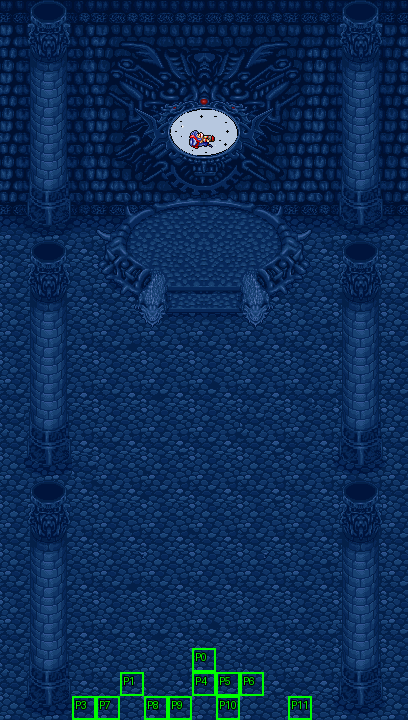

# 第 27 章　魔導士的野望

<!-- chapter_docs:header -->
| 項目 | 內容 |
| --- | --- |
| 章號／章節索引 | 27／26 |
| 章名（文字區塊 `0x01`） | 魔導士的野望 |
| 勝利條件（`0x02`） | 魔導王死亡 |
| 敗北條件（`0x03`） | 蘭迪斯死亡 |
| 戰場 | `MAP26.DAT`／`MAP26.COD`／`M26.DTL`，17×30 格，我方 slot 12 個，部署記錄 55 筆 |
| 文字區塊 | `FDETXT27.TXT`，38 條 |
| 進入處理（`0x60074`[26]） | `fdps_chapter_27_init`（`0x21550`） |
| 行動後檢查（`0x6028c`[26]） | `fdps_chapter_27_post_action`（`0x3b8a0`） |
| 勝利處理（`0x60304`[26]） | `fdps_chapter_27_end`（`0x3b8f0`） |
| 地圖資料呼叫的事件處理（`0x601c4`） | slot 43：`fdps_chapter_27_event_deploy_wave_1`（`0x39440`）（死亡腳本） |
| 過場腳本 | `ICON26.DAT`（開場）、`WIN26.DAT`（勝利）、`WINGA26.DAT`（勝利） |
| 本章之前的村莊 | 無 |
| 光碟 | 第 2 片（音軌見 [CD 音軌](../program_info/cd_audio.md)） |



戰場全圖（第 0 層與同步捲動的圖層）。框線：黃 `C` 寶箱、橘 `B` 埋藏格、青 `R` 重繪格、洋紅 `E` 有處理函式的格子事件格，字母後的數字是事件碼；綠 `P` 是我方 slot 的起始格。

圖由 `python tools/chapter_docs/chapter_facts.py render-maps` 從遊戲檔重畫到 `chapters/maps/`，`verify-maps` 逐 byte 比對版控中的圖。
<!-- /chapter_docs:header -->

## 概要

蘭迪斯一行追進魔導王吉歐的神殿，看見法蓮娜被放在最深處的祭壇上。吉歐說法蓮娜的強大魔力是開啟異界封印的鑰匙，「永恆的春天」就要降臨這個世界；蘭迪斯罵他是野心家，尤利安說「我們的世界，我們自己會管理，不需要什麼神來代勞」，被琴琴吐槽沒說服力之後大笑著承認說錯話。吉歐喊教徒們全部出來，要把他們送入地獄（開場過場 `ICON26.DAT`，文字 `0x09`）。戰鬥中四名魔戰將軍全部倒下時，吉歐說「想不到還是要我親自出手」，叫出忠實的僕人們（`0x14`），自己也離開祭壇前的位置。

擊倒吉歐之後的結局有兩條，由勝利處理檢查兩件道具決定（見「勝敗條件與特殊機制」）：

- **一般結局**（`WIN26.DAT`）：吉歐閃爍消失後，蘭迪斯走向祭壇呼喚法蓮娜（`0x0a`），祭壇上的法蓮娜被放到祭壇前、蘭迪斯身旁；已從地圖上消失的吉歐只以頭像說話，對哭著的女兒說計算還是有錯誤——沒有反禁制器的幫忙，這些裝置撐不住與異空間交會的衝擊；他不怕死，只要世上還有不平等，總有一天會有人替他完成（`0x0b`）。接著畫面震動、祭壇前的地形被整片換掉，場景切到地圖 62 播一段沒有文字的收尾，之後是每位隊員的後日談字幕與結局影片，遊戲在這裡結束。字幕裡蘭迪斯那一段說他從倒塌的神殿中逃得一命，卻來不及救出法蓮娜，將她的遺體火化後獨自踏上旅程（`0x19`）。
- **隱藏路線**（`WINGA26.DAT`）：同樣的開頭之後，祭壇一帶的地形被整片換掉、播放動畫，法蓮娜被救下、回到隊伍（攻略站的說法是蘭迪斯擲出魔精石碎片救下她，對話本身沒有提到碎片）。吉歐卻說「爸爸成功了」，封印已經解除，魔神就要來了（`0x0f`）；蘭迪斯向法蓮娜道歉，法蓮娜說她只恨自己（`0x10`）。隨後邪惡的力量逼近、四周變冷（`0x11`、`0x12`），場景切到地圖 61：法蓮娜說異界的入口開了，要在魔神降臨人間之前擊敗牠、重新封印，眾人一起出發（`FDETXT62` 的 `0x09`、`0x0a`），進入第 28 章。

## 加入與離隊

- 本章沒有人入隊。入隊規則見 [`assets/characters.md` 的「加入」](../assets/characters.md#加入)。
- **法蓮娜不上場**：地圖要 12 個我方 slot，名冊正好 12 人全部填入，但開場過場 `ICON26.DAT` 的 `0x004` 以 `RETIRE_UNIT` 讓地圖單位 3（名冊第 4 位的法蓮娜）退場，之後沒有復歸，所以上場的是她以外的 11 人。這與 [第 24 章](ch24.md) 起的做法相同。
- **隱藏路線讓法蓮娜歸隊**：`WINGA26.DAT` 在 `0x151` 復歸單位 3，`0x15F` 的 opcode `0x61` 給她十輪各 99 點經驗，再把整個單位陣列寫回名冊（[`resource_info/cutscene_script.md`](../resource_info/cutscene_script.md)）。每輪最多升一級、每級 100 點，所以十輪共升 9 或 10 級（原有經驗餘數達 10 才是 10 級），到等級上限為止。
- **一般結局沒有歸隊**：`WIN26.DAT` 讓法蓮娜在過場裡出現後又退場，片尾字幕也跳過她那一格（見「處理流程」）。
- 本章沒有客串單位。

## 勝敗條件與特殊機制

- **勝利只看吉歐**：`fdps_chapter_27_post_action`（`0x3b8a0`）以 `fdps_unit_is_retired`（`0x109b0`）問單位 12（`MAP26.DAT` 的記錄 0，LV40 魔導王吉歐），退場就寫結束碼 2。四名魔戰將軍、其餘守軍與援軍都不必消滅，這支處理函式也不呼叫共用的全滅判定 `fdps_battle_check_default_end_conditions`（`0x3a2e0`）。與畫面上的「魔導王死亡」一致。
- **敗北只看蘭迪斯**：接著無條件問單位 0，退場就寫結束碼 1。兩個寫入互不為 else，後寫的敗北蓋過勝利，所以蘭迪斯與吉歐在同一次行動中倒下是敗北。與畫面上的「蘭迪斯死亡」一致；法蓮娜不在場，沒有她的判定。
- **援軍在第四名將軍倒下時出現**：塞克斯、布魯森、汎拉沛、凱因巴（單位 13–16）的死亡腳本都是 opcode 2、slot 43，每倒下一人就執行一次 `fdps_chapter_27_event_deploy_wave_1`（`0x39440`）。它檢查四人是否全部退場，只有最後一人倒下的那一次才畫 `0x14`、部署波次 1 的 30 名援軍，並把吉歐的 AI 行為從 2（原地不追擊）改成 11（法術優先、會移動）。以觸發旗標陣列的元素 `0x12` 鎖住，只發生一次。先擊倒吉歐的話本章直接結束，援軍與吉歐的移動都不會發生。
- **結局分歧**：`fdps_chapter_27_end`（`0x3b8f0`）檢查單位 0（蘭迪斯）身上有沒有 `B3` 魔精石碎片、單位 3（法蓮娜）身上有沒有 `DC` 反禁制器。兩件都在才走隱藏路線：收走這兩件、播 `WINGA26.DAT`、下一章是第 28 章。缺任何一件就播 `WIN26.DAT`、片尾字幕與結局影片，然後設起離場旗標結束遊戲（[`program_info/chapter.md`](../program_info/chapter.md)）。
  - 法蓮娜整章都是退場狀態，但判定照樣讀單位 3 的背包，所以反禁制器必須在她離隊前就已在她身上——它由 [第 23 章](ch23.md) 的死神事件直接放進她的背包，本章無法再交給她。魔精石碎片可以在戰鬥中交給蘭迪斯。
  - 魔精石碎片埋在 [第 24 章](ch24.md) 的魔精石底下；反禁制器要先在 [第 22 章](ch22.md) 讓法蓮娜拿到死神契約。
  - 一般結局不寫章節索引，也不做名冊寫回；隱藏路線的處理函式本身也不寫回，寫回由 `WINGA26.DAT` 的 opcode `0x61` 代做。

## 敵人配置

開場時場上是波次 0 的 25 人：吉歐（LV40，AI 2）守在祭壇前，開場過場把他放到 (8, 10)、往上走兩格再退一格，戰鬥開始時站在 (8, 9)。他在四名將軍倒下之前不離開原地，但會對射程內的單位出手。四名魔戰將軍（LV30）分立在 (6, 14)、(10, 14)、(4, 16)、(12, 16)，每人身邊各有 2 名神箭手與 3 名鎧甲武士（LV18），全部 AI 0 主動出擊，從神殿中央往下推向我方。

第四名將軍倒下時出現的波次 1 分兩路：20 名天空騎士錨在吉歐兩側 (3–7, 8–9) 與 (9–13, 8–9)，10 名地獄騎士錨在最下方、我方起始的第 29 列 (4–13, 29)，全部 AI 0；部署時錨點被占就放到最近的空格，所以留在下方的隊員會把地獄騎士擠到附近。攻略站說的「援軍立即出現在下方和魔導王身旁」即此。

<!-- chapter_docs:deployments -->
陣營與死亡腳本的意義見 [`resource_info/map.md`](../resource_info/map.md)，AI 行為（低 4 bit）見 [`program_info/map_ai.md`](../program_info/map_ai.md#行為代碼)；錨點是 `MAPnn.COD` 的座標，開場波次放在錨點上，其餘波次依部署方式放在錨點或最近的空格。單位名是全域文字的「角色編號 + 1」條；角色編號 `3C` 以上的敵兵，數值（`ENEMYDAT.DAT`）與種族、職業見 [`assets/enemies.md`](../assets/enemies.md)，以下的見 [`assets/characters.md`](../assets/characters.md)。

我方起始格：slot 0 (8, 27)、slot 1 (5, 28)、slot 2 (6, 29)、slot 3 (3, 29)、slot 4 (8, 28)、slot 5 (9, 28)、slot 6 (10, 28)、slot 7 (4, 29)、slot 8 (6, 29)、slot 9 (7, 29)、slot 10 (9, 29)、slot 11 (12, 29)。

| 波次 | 陣營 | 單位 | 等級 | 數量 |
| ---: | --- | --- | --- | ---: |
| 0 | 敵方 | `3F` 魔導王吉歐 | 40 | 1 |
| 0 | 敵方 | `40` 塞克斯 | 30 | 1 |
| 0 | 敵方 | `41` 布魯森 | 30 | 1 |
| 0 | 敵方 | `42` 汎拉沛 | 30 | 1 |
| 0 | 敵方 | `43` 凱因巴 | 30 | 1 |
| 0 | 敵方 | `5F` 神箭手 | 18 | 8 |
| 0 | 敵方 | `64` 鎧甲武士 | 18 | 12 |
| 1 | 敵方 | `61` 天空騎士 | 18 | 20 |
| 1 | 敵方 | `4E` 地獄騎士 | 18 | 10 |

### 波次 0

出場：進入戰場時由 `fdps_build_map_unit_array`（`0x22be0`） 部署在錨點上

| # | 陣營 | 單位 | 等級 | AI 行為 | 錨點 | 死亡腳本 |
| ---: | --- | --- | ---: | --- | --- | --- |
| 0 | 敵方 | `3F` 魔導王吉歐 | 40 | 2 原地 | (8, 8) | — |
| 1 | 敵方 | `40` 塞克斯 | 30 | 0 主動 | (6, 14) | 事件 slot 43：`fdps_chapter_27_event_deploy_wave_1`（`0x39440`） |
| 2 | 敵方 | `41` 布魯森 | 30 | 0 主動 | (10, 14) | 事件 slot 43：`fdps_chapter_27_event_deploy_wave_1`（`0x39440`） |
| 3 | 敵方 | `42` 汎拉沛 | 30 | 0 主動 | (4, 16) | 事件 slot 43：`fdps_chapter_27_event_deploy_wave_1`（`0x39440`） |
| 4 | 敵方 | `43` 凱因巴 | 30 | 0 主動 | (12, 16) | 事件 slot 43：`fdps_chapter_27_event_deploy_wave_1`（`0x39440`） |
| 5 | 敵方 | `5F` 神箭手 | 18 | 0 主動 | (5, 14) | — |
| 6 | 敵方 | `5F` 神箭手 | 18 | 0 主動 | (7, 14) | — |
| 7 | 敵方 | `64` 鎧甲武士 | 18 | 0 主動 | (5, 15) | — |
| 8 | 敵方 | `64` 鎧甲武士 | 18 | 0 主動 | (6, 15) | — |
| 9 | 敵方 | `64` 鎧甲武士 | 18 | 0 主動 | (7, 15) | — |
| 10 | 敵方 | `5F` 神箭手 | 18 | 0 主動 | (9, 14) | — |
| 11 | 敵方 | `5F` 神箭手 | 18 | 0 主動 | (11, 14) | — |
| 12 | 敵方 | `64` 鎧甲武士 | 18 | 0 主動 | (9, 15) | — |
| 13 | 敵方 | `64` 鎧甲武士 | 18 | 0 主動 | (10, 15) | — |
| 14 | 敵方 | `64` 鎧甲武士 | 18 | 0 主動 | (11, 15) | — |
| 15 | 敵方 | `5F` 神箭手 | 18 | 0 主動 | (3, 16) | — |
| 16 | 敵方 | `5F` 神箭手 | 18 | 0 主動 | (5, 16) | — |
| 17 | 敵方 | `64` 鎧甲武士 | 18 | 0 主動 | (3, 17) | — |
| 18 | 敵方 | `64` 鎧甲武士 | 18 | 0 主動 | (4, 17) | — |
| 19 | 敵方 | `64` 鎧甲武士 | 18 | 0 主動 | (5, 17) | — |
| 20 | 敵方 | `5F` 神箭手 | 18 | 0 主動 | (11, 16) | — |
| 21 | 敵方 | `5F` 神箭手 | 18 | 0 主動 | (13, 16) | — |
| 22 | 敵方 | `64` 鎧甲武士 | 18 | 0 主動 | (11, 17) | — |
| 23 | 敵方 | `64` 鎧甲武士 | 18 | 0 主動 | (12, 17) | — |
| 24 | 敵方 | `64` 鎧甲武士 | 18 | 0 主動 | (13, 17) | — |

### 波次 1

出場：四名魔戰將軍（地圖單位 13–16）全部退場時，由他們共用的死亡腳本（opcode 2、slot 43）執行 `fdps_chapter_27_event_deploy_wave_1`（`0x39440`）：畫 `0x14` 後以找最近空格的方式部署，只觸發一次

| # | 陣營 | 單位 | 等級 | AI 行為 | 錨點 | 死亡腳本 |
| ---: | --- | --- | ---: | --- | --- | --- |
| 25 | 敵方 | `61` 天空騎士 | 18 | 0 主動 | (7, 9) | — |
| 26 | 敵方 | `61` 天空騎士 | 18 | 0 主動 | (6, 9) | — |
| 27 | 敵方 | `61` 天空騎士 | 18 | 0 主動 | (5, 9) | — |
| 28 | 敵方 | `61` 天空騎士 | 18 | 0 主動 | (4, 9) | — |
| 29 | 敵方 | `61` 天空騎士 | 18 | 0 主動 | (3, 9) | — |
| 30 | 敵方 | `61` 天空騎士 | 18 | 0 主動 | (7, 8) | — |
| 31 | 敵方 | `61` 天空騎士 | 18 | 0 主動 | (6, 8) | — |
| 32 | 敵方 | `61` 天空騎士 | 18 | 0 主動 | (5, 8) | — |
| 33 | 敵方 | `61` 天空騎士 | 18 | 0 主動 | (4, 8) | — |
| 34 | 敵方 | `61` 天空騎士 | 18 | 0 主動 | (3, 8) | — |
| 35 | 敵方 | `61` 天空騎士 | 18 | 0 主動 | (9, 9) | — |
| 36 | 敵方 | `61` 天空騎士 | 18 | 0 主動 | (10, 9) | — |
| 37 | 敵方 | `61` 天空騎士 | 18 | 0 主動 | (11, 9) | — |
| 38 | 敵方 | `61` 天空騎士 | 18 | 0 主動 | (12, 9) | — |
| 39 | 敵方 | `61` 天空騎士 | 18 | 0 主動 | (13, 9) | — |
| 40 | 敵方 | `61` 天空騎士 | 18 | 0 主動 | (9, 8) | — |
| 41 | 敵方 | `61` 天空騎士 | 18 | 0 主動 | (10, 8) | — |
| 42 | 敵方 | `61` 天空騎士 | 18 | 0 主動 | (11, 8) | — |
| 43 | 敵方 | `61` 天空騎士 | 18 | 0 主動 | (12, 8) | — |
| 44 | 敵方 | `61` 天空騎士 | 18 | 0 主動 | (13, 8) | — |
| 45 | 敵方 | `4E` 地獄騎士 | 18 | 0 主動 | (8, 29) | — |
| 46 | 敵方 | `4E` 地獄騎士 | 18 | 0 主動 | (9, 29) | — |
| 47 | 敵方 | `4E` 地獄騎士 | 18 | 0 主動 | (7, 29) | — |
| 48 | 敵方 | `4E` 地獄騎士 | 18 | 0 主動 | (10, 29) | — |
| 49 | 敵方 | `4E` 地獄騎士 | 18 | 0 主動 | (6, 29) | — |
| 50 | 敵方 | `4E` 地獄騎士 | 18 | 0 主動 | (11, 29) | — |
| 51 | 敵方 | `4E` 地獄騎士 | 18 | 0 主動 | (5, 29) | — |
| 52 | 敵方 | `4E` 地獄騎士 | 18 | 0 主動 | (12, 29) | — |
| 53 | 敵方 | `4E` 地獄騎士 | 18 | 0 主動 | (4, 29) | — |
| 54 | 敵方 | `4E` 地獄騎士 | 18 | 0 主動 | (13, 29) | — |
<!-- /chapter_docs:deployments -->

## 寶物

本章沒有任何處理函式發放物品，也沒有搶寶箱的 AI。唯一與道具有關的機制是勝利時收走蘭迪斯的魔精石碎片與法蓮娜的反禁制器（隱藏路線，見上節）。

<!-- chapter_docs:treasure -->
本章地圖沒有寶箱或埋藏格。

沒有任何格引用、拿不到的記錄：記錄 0（種類 0、內容 `1C`）、記錄 1（種類 1、內容 `D8`）、記錄 2（種類 1、內容 `D5`）、記錄 3（種類 0、內容 `BC`）、記錄 4（種類 0、內容 `B9`）、記錄 7（種類 0、內容 `B9`）、記錄 8（種類 0、內容 `D3`）、記錄 9（種類 0、內容 `B`）、記錄 10（種類 0、內容 `C`）、記錄 11（種類 0、內容 `BD`），見 [I04](../cut_content/items.md#i04-章節地圖上沒有格子引用的寶物記錄)。

本章沒有擊倒掉落。
<!-- /chapter_docs:treasure -->

## 村莊

<!-- chapter_docs:village -->
第 26 章勝利後沒有村莊（`CHAPTER_HAS_NO_VILLAGE`，`src/village.c`），直接進存檔畫面再進本章。
<!-- /chapter_docs:village -->

## 處理流程

### `fdps_chapter_27_init`（`0x21550`）

1. `fdps_chapter_state_reset`（`0x22750`）：從名冊填滿地圖 26 的 12 個我方 slot，部署波次 0 的 25 名敵人（吉歐是單位 12，四名將軍是 13–16），清空觸發旗標。
2. `fdps_icon_script_run`（`0x21650`）播 `ICON26.DAT`：法蓮娜（單位 3）退場；吉歐被放到祭壇前；鏡頭從祭壇往下捲到我方，蘭迪斯往上走四格到 (8, 23)，對話 `0x09`；鏡頭再捲回神殿深處。腳本不切換地圖、不部署波次。
3. `fdps_show_chapter_title_card`（`0x20c60`）顯示章名卡。
4. `fdps_map_cursor_move_to_unit`（`0x2da50`）把游標放在單位 0（蘭迪斯，(8, 23)）。

### `fdps_chapter_27_event_deploy_wave_1`（`0x39440`）

四名魔戰將軍（`MAP26.DAT` 記錄 1–4）的死亡腳本 opcode 2 以 slot 43 呼叫它，傳入的單位索引不讀。

1. 觸發旗標陣列元素 `0x12` 不為 0 就結束。
2. 以 `fdps_unit_is_retired`（`0x109b0`）逐一問單位 13–16，四個都問完；有任何一人未退場就結束（前三名將軍倒下時都停在這裡）。
3. 以 `fdps_draw_text`（`0x1ff60`）在畫面左上角畫 `0x14`（吉歐的台詞）。
4. `fdps_deploy_wave`（`0x23830`）以找最近空格的方式部署波次 1。
5. 以 `fdps_get_unit_record`（`0x2d210`）取單位 12（吉歐），把 AI 行為的低 4 bit 改成 11、保留高 4 bit。
6. 設起元素 `0x12`。

### `fdps_chapter_27_post_action`（`0x3b8a0`）

每次行動後執行：單位 12 退場 → 結束碼 2；接著單位 0 退場 → 結束碼 1。不呼叫共用判定。

### `fdps_chapter_27_end`（`0x3b8f0`）

1. `fdps_battle_destroy_remaining_enemies`（`0x39e10`）清掉殘敵（兩條路線都做）。
2. 以 `fdps_unit_find_item_slot`（`0x34520`）先後找單位 0 的 `B3` 與單位 3 的 `DC`，兩次搜尋都做完才判斷。
3. **任一件找不到**：`fdps_icon_script_run`（`0x21650`）播 `WIN26.DAT`；`fdps_play_ending_credit_roll`（`0x1ba40`）播片尾字幕與 `End` 影片；設起離場旗標。章節索引與兩件道具都不動，也不復活、不寫回名冊。
4. **兩件都在**：`fdps_unit_remove_item`（`0x25cc0`）先移除蘭迪斯的魔精石碎片、再移除法蓮娜的反禁制器；播 `WINGA26.DAT`（其中的 opcode `0x61` 給法蓮娜經驗並寫回名冊）；`fdps_roster_revive_fallen_members`（`0x39e70`）付費復活倒下的隊員；章節索引設為 27，下一章是 [第 28 章](ch28.md)。

**片尾字幕讀的是本章的文字區塊。** `WIN26.DAT` 最後以 `SWITCH_MAP` 切回地圖 26，重新載入 `FDETXT27`，`fdps_play_ending_credit_roll`（`0x1ba40`）接著依名冊順序每人一張卡片，字幕取 `0x19` + 名冊索引。章節索引是 26 時它跳過名冊第 3 格（法蓮娜，`0x1c` 不顯示），迴圈上界含名冊人數本身，所以在第 12 位的珊（`0x24`）之後還有一張固定用 12 號造型的卡片，配 `0x25` 索爾王的後日談。名冊在本章恆為 12 人，對應是：`0x19` 蘭迪斯、`0x1a` 尤利安、`0x1b` 亞克、`0x1d` 裘娜、`0x1e` 費塔加、`0x1f` 布蘭多、`0x20` 蓋亞、`0x21` 琴琴、`0x22` 瑪麗安、`0x23` 蘭斯洛特、`0x24` 珊、`0x25` 索爾。

## 回合事件與格子事件

<!-- chapter_docs:events -->
觸發時機與陣營階段的意義見 [`resource_info/map.md`](../resource_info/map.md)。

本章沒有回合事件。

本章沒有格子事件。

死亡腳本裡的事件與文字：

| # | 單位 | 波次 | 死亡腳本 |
| ---: | --- | ---: | --- |
| 1 | `40` 塞克斯 | 0 | 事件 slot 43：`fdps_chapter_27_event_deploy_wave_1`（`0x39440`） |
| 2 | `41` 布魯森 | 0 | 事件 slot 43：`fdps_chapter_27_event_deploy_wave_1`（`0x39440`） |
| 3 | `42` 汎拉沛 | 0 | 事件 slot 43：`fdps_chapter_27_event_deploy_wave_1`（`0x39440`） |
| 4 | `43` 凱因巴 | 0 | 事件 slot 43：`fdps_chapter_27_event_deploy_wave_1`（`0x39440`） |
<!-- /chapter_docs:events -->

## 過場腳本

`WIN26.DAT` 是一般結局，`WINGA26.DAT` 是隱藏路線；兩者開頭的演出骨架相同（吉歐閃爍退場、`ICON0085.SAF`、隊伍往祭壇走、對話 `0x0a`），但不是同一段指令：`WINGA26.DAT` 另外讓地圖單位 10、11（蘭斯洛特、珊）退場再重新排位，單位 8、9 的站位不同，蘭迪斯也改到 `0x0a` 之後才往上走。劇情從 `0x0a` 之後分歧。

<!-- chapter_docs:scripts -->
格式與每個指令的意義見 [`resource_info/cutscene_script.md`](../resource_info/cutscene_script.md)。`FDETXT27#0xNN` 是本章文字區塊的條目，全文在下方「對話」；切到額外場景之後顯示的文字直接列出（那些區塊的正典是 [`assets/text/scene_text.md`](../assets/text/scene_text.md)）。`u3=我方1` 是地圖單位索引 3 對到我方 slot 1，`u12=MAP02#9` 是 `MAP02.DAT` 第 9 筆部署記錄。

### `ICON26.DAT`

- 開場：`fdps_chapter_27_init`（`0x21550`）
- 719 byte、75 步；起始地圖 26，切換地圖 無，結束於地圖 26

| 偏移 | 指令 | 內容 |
| ---: | --- | --- |
| `0000` | `FADE_OUT` | 淡出，每步 5 ms |
| `0002` | `SET_MUSIC` | 音樂 10（CD 第 11 軌） |
| `0004` | `RETIRE_UNIT` | 退場 u3=我方3 |
| `0006` | `PLACE_UNIT` | 放置 u12=MAP26#0(角色0x3f) 到 (8, 10)，朝下 |
| `000b` | `SCROLL_VIEW` | 捲動視野到格 (2, 0) |
| `000e` | `FADE_IN` | 淡入，每步 60 ms |
| `0010` | `SCROLL_VIEW` | 捲動視野到格 (2, 7) |
| `0013` | `SHAKE_VIEW` | 視野位移 4 步，每步 2 幀：(0,-6) (0,-12) (0,-18) (0,-24) |
| `001e` | `SET_VIEW_TILE` | 視野直接設到格 (2, 6) |
| `0021` | `SHAKE_VIEW` | 視野位移 6 步，每步 2 幀：(0,-4) (0,-8) (0,-12) (0,-16) (0,-20) (0,-24) |
| `0030` | `SET_VIEW_TILE` | 視野直接設到格 (2, 5) |
| `0033` | `SHAKE_VIEW` | 視野位移 8 步，每步 2 幀：(0,-3) (0,-6) (0,-9) (0,-12) (0,-15) (0,-18) (0,-21) (0,-24) |
| `0046` | `SET_VIEW_TILE` | 視野直接設到格 (2, 4) |
| `0049` | `SHAKE_VIEW` | 視野位移 12 步，每步 2 幀：(0,-2) (0,-4) (0,-6) (0,-8) (0,-10) (0,-12) (0,-14) (0,-16) (0,-18) (0,-20) (0,-22) (0,-24) |
| `0064` | `SET_VIEW_TILE` | 視野直接設到格 (2, 3) |
| `0067` | `SHAKE_VIEW` | 視野位移 12 步，每步 2 幀：(0,-2) (0,-4) (0,-6) (0,-8) (0,-10) (0,-12) (0,-14) (0,-16) (0,-18) (0,-20) (0,-22) (0,-24) |
| `0082` | `SET_VIEW_TILE` | 視野直接設到格 (2, 2) |
| `0085` | `SHAKE_VIEW` | 視野位移 12 步，每步 2 幀：(0,-2) (0,-4) (0,-6) (0,-8) (0,-10) (0,-12) (0,-14) (0,-16) (0,-18) (0,-20) (0,-22) (0,-24) |
| `00a0` | `SET_VIEW_TILE` | 視野直接設到格 (2, 1) |
| `00a3` | `FACE_UNITS` | 轉向後停 75 幀：u12=MAP26#0(角色0x3f)朝上、u13=MAP26#1(角色0x40)朝上、u14=MAP26#2(角色0x41)朝上、u15=MAP26#3(角色0x42)朝上、u16=MAP26#4(角色0x43)朝上 |
| `00b0` | `WALK_UNITS` | 行走 2 格，每步 6 幀：u12=MAP26#0(角色0x3f)往上 |
| `00b6` | `FACE_UNITS` | 轉向後停 75 幀：u12=MAP26#0(角色0x3f)朝上 |
| `00bb` | `FACE_UNITS` | 轉向後停 75 幀：u12=MAP26#0(角色0x3f)朝下 |
| `00c0` | `WALK_UNITS` | 行走 1 格，每步 6 幀：u12=MAP26#0(角色0x3f)往下 |
| `00c6` | `SHAKE_VIEW` | 視野位移 4 步，每步 2 幀：(0,6) (0,12) (0,18) (0,24) |
| `00d1` | `SET_VIEW_TILE` | 視野直接設到格 (2, 2) |
| `00d4` | `SHAKE_VIEW` | 視野位移 4 步，每步 2 幀：(0,6) (0,12) (0,18) (0,24) |
| `00df` | `SET_VIEW_TILE` | 視野直接設到格 (2, 3) |
| `00e2` | `SHAKE_VIEW` | 視野位移 4 步，每步 2 幀：(0,6) (0,12) (0,18) (0,24) |
| `00ed` | `SET_VIEW_TILE` | 視野直接設到格 (2, 4) |
| `00f0` | `SHAKE_VIEW` | 視野位移 4 步，每步 2 幀：(0,6) (0,12) (0,18) (0,24) |
| `00fb` | `SET_VIEW_TILE` | 視野直接設到格 (2, 5) |
| `00fe` | `SHAKE_VIEW` | 視野位移 4 步，每步 2 幀：(0,6) (0,12) (0,18) (0,24) |
| `0109` | `SET_VIEW_TILE` | 視野直接設到格 (2, 6) |
| `010c` | `SHAKE_VIEW` | 視野位移 4 步，每步 2 幀：(0,6) (0,12) (0,18) (0,24) |
| `0117` | `SET_VIEW_TILE` | 視野直接設到格 (2, 7) |
| `011a` | `FACE_UNITS` | 轉向後停 12 幀：u12=MAP26#0(角色0x3f)朝下 |
| `011f` | `FACE_UNITS` | 轉向後停 25 幀：u13=MAP26#1(角色0x40)朝下、u14=MAP26#2(角色0x41)朝下、u15=MAP26#3(角色0x42)朝下、u16=MAP26#4(角色0x43)朝下 |
| `012a` | `FACE_UNITS` | 轉向後停 1 幀：u0=我方0朝上、u1=我方1朝上、u2=我方2朝上、u4=我方4朝上、u5=我方5朝上、u6=我方6朝上、u7=我方7朝上、u8=我方8朝上、u9=我方9朝上、u10=我方10朝上、u11=我方11朝上 |
| `0143` | `SCROLL_VIEW` | 捲動視野到格 (2, 18) |
| `0146` | `WALK_UNITS` | 行走 1 格，每步 1 幀：u0=我方0往上 |
| `014c` | `WALK_UNITS` | 行走 1 格，每步 1 幀：u0=我方0往上、u1=我方1往上、u5=我方5往上、u8=我方8往上、u9=我方9往上 |
| `015a` | `FACE_UNITS` | 轉向後停 25 幀：u0=我方0朝上 |
| `015f` | `WALK_UNITS` | 行走 1 格，每步 1 幀：u0=我方0往上 |
| `0165` | `DRAW_TEXT` | 顯示文字 FDETXT27#0x09 |
| `0167` | `FACE_UNITS` | 轉向後停 12 幀：u0=我方0朝上 |
| `016c` | `SCROLL_VIEW` | 捲動視野到格 (2, 17) |
| `016f` | `WALK_UNITS` | 行走 1 格，每步 1 幀：u0=我方0往上 |
| `0175` | `FACE_UNITS` | 轉向後停 25 幀：u0=我方0朝上 |
| `017a` | `SCROLL_VIEW` | 捲動視野到格 (2, 13) |
| `017d` | `SHAKE_VIEW` | 視野位移 12 步，每步 2 幀：(0,-2) (0,-4) (0,-6) (0,-8) (0,-10) (0,-12) (0,-14) (0,-16) (0,-18) (0,-20) (0,-22) (0,-24) |
| `0198` | `SET_VIEW_TILE` | 視野直接設到格 (2, 12) |
| `019b` | `SHAKE_VIEW` | 視野位移 12 步，每步 2 幀：(0,-2) (0,-4) (0,-6) (0,-8) (0,-10) (0,-12) (0,-14) (0,-16) (0,-18) (0,-20) (0,-22) (0,-24) |
| `01b6` | `SET_VIEW_TILE` | 視野直接設到格 (2, 11) |
| `01b9` | `SHAKE_VIEW` | 視野位移 12 步，每步 2 幀：(0,-2) (0,-4) (0,-6) (0,-8) (0,-10) (0,-12) (0,-14) (0,-16) (0,-18) (0,-20) (0,-22) (0,-24) |
| `01d4` | `SET_VIEW_TILE` | 視野直接設到格 (2, 10) |
| `01d7` | `SHAKE_VIEW` | 視野位移 12 步，每步 2 幀：(0,-2) (0,-4) (0,-6) (0,-8) (0,-10) (0,-12) (0,-14) (0,-16) (0,-18) (0,-20) (0,-22) (0,-24) |
| `01f2` | `SET_VIEW_TILE` | 視野直接設到格 (2, 9) |
| `01f5` | `SHAKE_VIEW` | 視野位移 12 步，每步 2 幀：(0,-2) (0,-4) (0,-6) (0,-8) (0,-10) (0,-12) (0,-14) (0,-16) (0,-18) (0,-20) (0,-22) (0,-24) |
| `0210` | `SET_VIEW_TILE` | 視野直接設到格 (2, 8) |
| `0213` | `SHAKE_VIEW` | 視野位移 12 步，每步 2 幀：(0,-2) (0,-4) (0,-6) (0,-8) (0,-10) (0,-12) (0,-14) (0,-16) (0,-18) (0,-20) (0,-22) (0,-24) |
| `022e` | `SET_VIEW_TILE` | 視野直接設到格 (2, 7) |
| `0231` | `SHAKE_VIEW` | 視野位移 12 步，每步 2 幀：(0,-2) (0,-4) (0,-6) (0,-8) (0,-10) (0,-12) (0,-14) (0,-16) (0,-18) (0,-20) (0,-22) (0,-24) |
| `024c` | `SET_VIEW_TILE` | 視野直接設到格 (2, 6) |
| `024f` | `SHAKE_VIEW` | 視野位移 12 步，每步 2 幀：(0,-2) (0,-4) (0,-6) (0,-8) (0,-10) (0,-12) (0,-14) (0,-16) (0,-18) (0,-20) (0,-22) (0,-24) |
| `026a` | `SET_VIEW_TILE` | 視野直接設到格 (2, 5) |
| `026d` | `SHAKE_VIEW` | 視野位移 12 步，每步 2 幀：(0,-2) (0,-4) (0,-6) (0,-8) (0,-10) (0,-12) (0,-14) (0,-16) (0,-18) (0,-20) (0,-22) (0,-24) |
| `0288` | `SET_VIEW_TILE` | 視野直接設到格 (2, 4) |
| `028b` | `SHAKE_VIEW` | 視野位移 12 步，每步 2 幀：(0,-2) (0,-4) (0,-6) (0,-8) (0,-10) (0,-12) (0,-14) (0,-16) (0,-18) (0,-20) (0,-22) (0,-24) |
| `02a6` | `SET_VIEW_TILE` | 視野直接設到格 (2, 3) |
| `02a9` | `SHAKE_VIEW` | 視野位移 12 步，每步 2 幀：(0,-2) (0,-4) (0,-6) (0,-8) (0,-10) (0,-12) (0,-14) (0,-16) (0,-18) (0,-20) (0,-22) (0,-24) |
| `02c4` | `SET_VIEW_TILE` | 視野直接設到格 (2, 2) |
| `02c7` | `FACE_UNITS` | 轉向後停 50 幀：u0=我方0朝上 |
| `02cc` | `FADE_OUT` | 淡出，每步 20 ms |
| `02ce` | `END` | 結束 |

### `WIN26.DAT`

- 勝利：`fdps_chapter_27_end`（`0x3b8f0`）
- 840 byte、123 步；起始地圖 26，切換地圖 62 → 26，結束於地圖 26

| 偏移 | 指令 | 內容 |
| ---: | --- | --- |
| `0000` | `SET_VIEW_TILE` | 視野直接設到格 (2, 3) |
| `0003` | `SET_MUSIC` | 音樂 12（CD 第 13 軌） |
| `0005` | `REVIVE_UNIT` | 復歸 u1=我方1（清狀態） |
| `0007` | `REVIVE_UNIT` | 復歸 u2=我方2（清狀態） |
| `0009` | `REVIVE_UNIT` | 復歸 u4=我方4（清狀態） |
| `000b` | `REVIVE_UNIT` | 復歸 u5=我方5（清狀態） |
| `000d` | `REVIVE_UNIT` | 復歸 u6=我方6（清狀態） |
| `000f` | `REVIVE_UNIT` | 復歸 u7=我方7（清狀態） |
| `0011` | `REVIVE_UNIT` | 復歸 u8=我方8（清狀態） |
| `0013` | `REVIVE_UNIT` | 復歸 u9=我方9（清狀態） |
| `0015` | `REVIVE_UNIT` | 復歸 u12=MAP26#0(角色0x3f)（清狀態） |
| `0017` | `PLACE_UNIT` | 放置 u0=我方0 到 (8, 11)，朝上 |
| `001c` | `PLACE_UNIT` | 放置 u2=我方2 到 (7, 13)，朝上 |
| `0021` | `PLACE_UNIT` | 放置 u1=我方1 到 (9, 13)，朝上 |
| `0026` | `PLACE_UNIT` | 放置 u4=我方4 到 (8, 14)，朝上 |
| `002b` | `PLACE_UNIT` | 放置 u5=我方5 到 (7, 14)，朝上 |
| `0030` | `PLACE_UNIT` | 放置 u6=我方6 到 (9, 14)，朝上 |
| `0035` | `PLACE_UNIT` | 放置 u7=我方7 到 (8, 15)，朝上 |
| `003a` | `PLACE_UNIT` | 放置 u8=我方8 到 (7, 15)，朝上 |
| `003f` | `PLACE_UNIT` | 放置 u9=我方9 到 (9, 15)，朝上 |
| `0044` | `PLACE_UNIT` | 放置 u12=MAP26#0(角色0x3f) 到 (8, 9)，朝下 |
| `0049` | `FACE_UNITS` | 轉向後停 1 幀：u0=我方0朝上 |
| `004e` | `BLINK_UNITS_OUT` | 閃爍後退場：u12=MAP26#0(角色0x3f) |
| `0051` | `PLAY_SAF` | 播放動畫 ICON0085.SAF |
| `0053` | `SET_MAP_CELL` | 地形層 0 格 (7, 9) = 0x00f7 |
| `0058` | `FACE_UNITS` | 轉向後停 20 幀：u0=我方0朝上 |
| `005d` | `WALK_UNITS` | 行走 1 格，每步 1 幀：u0=我方0往上 |
| `0063` | `WALK_UNITS` | 行走 1 格，每步 1 幀：u2=我方2往上、u1=我方1往上、u4=我方4往上、u5=我方5往上、u6=我方6往上、u7=我方7往上、u8=我方8往上、u9=我方9往上 |
| `0077` | `DRAW_TEXT` | 顯示文字 FDETXT27#0x0a |
| `0079` | `WALK_UNITS` | 行走 1 格，每步 1 幀：u0=我方0往上 |
| `007f` | `SHAKE_VIEW` | 視野位移 8 步，每步 1 幀：(0,-3) (0,-6) (0,-9) (0,-12) (0,-15) (0,-18) (0,-21) (0,-24) |
| `0092` | `SET_VIEW_TILE` | 視野直接設到格 (2, 3) |
| `0095` | `RETIRE_UNIT` | 退場 u0=我方0 |
| `0097` | `SET_MAP_CELL` | 地形層 0 格 (7, 5) = 0x00f8 |
| `009c` | `SET_MAP_CELL` | 地形層 0 格 (8, 5) = 0x00f9 |
| `00a1` | `SET_MAP_CELL` | 地形層 0 格 (7, 6) = 0x00fb |
| `00a6` | `SET_MAP_CELL` | 地形層 0 格 (8, 6) = 0x00fc |
| `00ab` | `SET_MAP_CELL` | 地形層 0 格 (7, 9) = 0x0089 |
| `00b0` | `PLAY_SAF` | 播放動畫 ICON0080.SAF |
| `00b2` | `SET_MAP_CELL` | 地形層 0 格 (7, 9) = 0x00f7 |
| `00b7` | `REVIVE_UNIT` | 復歸 u3=我方3（清狀態） |
| `00b9` | `PLACE_UNIT` | 放置 u3=我方3 到 (8, 9)，朝左 |
| `00be` | `REVIVE_UNIT` | 復歸 u0=我方0（清狀態） |
| `00c0` | `PLACE_UNIT` | 放置 u0=我方0 到 (9, 9)，朝左 |
| `00c5` | `SHAKE_VIEW` | 視野位移 16 步，每步 1 幀：(0,3) (0,6) (0,9) (0,12) (0,15) (0,18) (0,21) (0,24) (0,27) (0,30) (0,33) (0,36) (0,39) (0,42) (0,45) (0,48) |
| `00e8` | `SET_VIEW_TILE` | 視野直接設到格 (2, 5) |
| `00eb` | `DRAW_TEXT` | 顯示文字 FDETXT27#0x0b |
| `00ed` | `SCROLL_VIEW` | 捲動視野到格 (2, 6) |
| `00f0` | `SHAKE_VIEW` | 視野位移 32 步，每步 1 幀：(1,0) (1,-1) (0,-1) (0,0) (-1,0) (-1,1) (0,1) (0,0) (1,0) (1,-1) (0,-1) (0,0) (-1,0) (-1,1) (0,1) (0,0) (1,0) (1,-1) (0,-1) (0,0) (-1,0) (-1,1) (0,1) (0,0) (1,0) (1,-1) (0,-1) (0,0) (-1,0) (-1,1) (0,1) (0,0) |
| `0133` | `RETIRE_UNIT` | 退場 u0=我方0 |
| `0135` | `PLAY_SAF` | 播放動畫 ICON0086.SAF |
| `0137` | `RETIRE_UNIT` | 退場 u3=我方3 |
| `0139` | `SET_MAP_CELL` | 地形層 0 格 (4, 8) = 0x0180 |
| `013e` | `SET_MAP_CELL` | 地形層 0 格 (5, 8) = 0x0181 |
| `0143` | `SET_MAP_CELL` | 地形層 0 格 (6, 8) = 0x0182 |
| `0148` | `SET_MAP_CELL` | 地形層 0 格 (7, 8) = 0x0183 |
| `014d` | `SET_MAP_CELL` | 地形層 0 格 (8, 8) = 0x0184 |
| `0152` | `SET_MAP_CELL` | 地形層 0 格 (9, 8) = 0x0185 |
| `0157` | `SET_MAP_CELL` | 地形層 0 格 (10, 8) = 0x0186 |
| `015c` | `SET_MAP_CELL` | 地形層 0 格 (11, 8) = 0x0187 |
| `0161` | `SET_MAP_CELL` | 地形層 0 格 (4, 9) = 0x018c |
| `0166` | `SET_MAP_CELL` | 地形層 0 格 (5, 9) = 0x018d |
| `016b` | `SET_MAP_CELL` | 地形層 0 格 (6, 9) = 0x018e |
| `0170` | `SET_MAP_CELL` | 地形層 0 格 (7, 9) = 0x018f |
| `0175` | `SET_MAP_CELL` | 地形層 0 格 (8, 9) = 0x0190 |
| `017a` | `SET_MAP_CELL` | 地形層 0 格 (9, 9) = 0x0191 |
| `017f` | `SET_MAP_CELL` | 地形層 0 格 (10, 9) = 0x0192 |
| `0184` | `SET_MAP_CELL` | 地形層 0 格 (11, 9) = 0x0193 |
| `0189` | `SET_MAP_CELL` | 地形層 0 格 (4, 10) = 0x0198 |
| `018e` | `SET_MAP_CELL` | 地形層 0 格 (5, 10) = 0x0199 |
| `0193` | `SET_MAP_CELL` | 地形層 0 格 (6, 10) = 0x019a |
| `0198` | `SET_MAP_CELL` | 地形層 0 格 (7, 10) = 0x019b |
| `019d` | `SET_MAP_CELL` | 地形層 0 格 (8, 10) = 0x019c |
| `01a2` | `SET_MAP_CELL` | 地形層 0 格 (9, 10) = 0x019d |
| `01a7` | `SET_MAP_CELL` | 地形層 0 格 (10, 10) = 0x019e |
| `01ac` | `SET_MAP_CELL` | 地形層 0 格 (11, 10) = 0x019f |
| `01b1` | `REVIVE_UNIT` | 復歸 u0=我方0（清狀態） |
| `01b3` | `PLACE_UNIT` | 放置 u0=我方0 到 (8, 11)，朝上 |
| `01b8` | `WALK_UNITS` | 行走 4 格，每步 1 幀：u2=我方2往下、u1=我方1往下、u4=我方4往下、u5=我方5往下、u6=我方6往下、u7=我方7往下、u8=我方8往下、u9=我方9往下 |
| `01cc` | `RETIRE_UNIT` | 退場 u0=我方0 |
| `01ce` | `PLAY_SAF` | 播放動畫 ICON0081.SAF |
| `01d0` | `PLAY_SAF` | 播放動畫 ICON0039.SAF |
| `01d2` | `PLAY_SAF` | 播放動畫 ICON0040.SAF |
| `01d4` | `FADE_OUT` | 淡出，每步 60 ms |
| `01d6` | `SET_MUSIC` | 音樂 8（CD 第 9 軌） |
| `01d8` | `SWITCH_MAP` | 切換地圖 → 62（MAP62，文字 FDETXT63） |
| `01da` | `SET_VIEW_TILE` | 視野直接設到格 (3, 0) |
| `01dd` | `FACE_UNITS` | 轉向後停 1 幀：u0=MAP62#0(角色0x00)朝上、u1=MAP62#1(角色0x5b)朝上、u2=MAP62#2(角色0x02)朝上、u3=MAP62#3(角色0x03)朝上、u4=MAP62#4(角色0x04)朝上、u5=MAP62#5(角色0x05)朝上、u6=MAP62#6(角色0x06)朝上、u7=MAP62#7(角色0x07)朝上、u8=MAP62#8(角色0x08)朝上、u9=MAP62#9(角色0x09)朝上、u10=MAP62#10(角色0x0b)朝上、u11=MAP62#11(角色0x0c)朝上、u12=MAP62#12(角色0x5b)朝上、u13=MAP62#13(角色0x5b)朝上、u14=MAP62#14(角色0x5b)朝上、u15=MAP62#15(角色0x5b)朝上、u16=MAP62#16(角色0x5b)朝上、u17=MAP62#17(角色0x5b)朝上 |
| `0204` | `FADE_IN` | 淡入，每步 120 ms |
| `0206` | `SHAKE_VIEW` | 視野位移 8 步，每步 1 幀：(0,3) (0,6) (0,9) (0,12) (0,15) (0,18) (0,21) (0,24) |
| `0219` | `SET_VIEW_TILE` | 視野直接設到格 (3, 1) |
| `021c` | `SHAKE_VIEW` | 視野位移 8 步，每步 1 幀：(0,3) (0,6) (0,9) (0,12) (0,15) (0,18) (0,21) (0,24) |
| `022f` | `SET_VIEW_TILE` | 視野直接設到格 (3, 2) |
| `0232` | `SHAKE_VIEW` | 視野位移 8 步，每步 1 幀：(0,3) (0,6) (0,9) (0,12) (0,15) (0,18) (0,21) (0,24) |
| `0245` | `SET_VIEW_TILE` | 視野直接設到格 (3, 3) |
| `0248` | `SHAKE_VIEW` | 視野位移 8 步，每步 1 幀：(0,3) (0,6) (0,9) (0,12) (0,15) (0,18) (0,21) (0,24) |
| `025b` | `SET_VIEW_TILE` | 視野直接設到格 (3, 4) |
| `025e` | `SHAKE_VIEW` | 視野位移 8 步，每步 1 幀：(0,3) (0,6) (0,9) (0,12) (0,15) (0,18) (0,21) (0,24) |
| `0271` | `SET_VIEW_TILE` | 視野直接設到格 (3, 5) |
| `0274` | `SHAKE_VIEW` | 視野位移 8 步，每步 1 幀：(0,3) (0,6) (0,9) (0,12) (0,15) (0,18) (0,21) (0,24) |
| `0287` | `SET_VIEW_TILE` | 視野直接設到格 (3, 6) |
| `028a` | `SHAKE_VIEW` | 視野位移 8 步，每步 1 幀：(0,3) (0,6) (0,9) (0,12) (0,15) (0,18) (0,21) (0,24) |
| `029d` | `SET_VIEW_TILE` | 視野直接設到格 (3, 7) |
| `02a0` | `SHAKE_VIEW` | 視野位移 8 步，每步 1 幀：(0,3) (0,6) (0,9) (0,12) (0,15) (0,18) (0,21) (0,24) |
| `02b3` | `SET_VIEW_TILE` | 視野直接設到格 (3, 8) |
| `02b6` | `SHAKE_VIEW` | 視野位移 8 步，每步 1 幀：(0,3) (0,6) (0,9) (0,12) (0,15) (0,18) (0,21) (0,24) |
| `02c9` | `SET_VIEW_TILE` | 視野直接設到格 (3, 9) |
| `02cc` | `SHAKE_VIEW` | 視野位移 8 步，每步 1 幀：(0,3) (0,6) (0,9) (0,12) (0,15) (0,18) (0,21) (0,24) |
| `02df` | `SET_VIEW_TILE` | 視野直接設到格 (3, 10) |
| `02e2` | `SHAKE_VIEW` | 視野位移 8 步，每步 1 幀：(0,3) (0,6) (0,9) (0,12) (0,15) (0,18) (0,21) (0,24) |
| `02f5` | `SET_VIEW_TILE` | 視野直接設到格 (3, 11) |
| `02f8` | `SHAKE_VIEW` | 視野位移 8 步，每步 1 幀：(0,3) (0,6) (0,9) (0,12) (0,15) (0,18) (0,21) (0,24) |
| `030b` | `SET_VIEW_TILE` | 視野直接設到格 (3, 12) |
| `030e` | `SHAKE_VIEW` | 視野位移 8 步，每步 1 幀：(0,3) (0,6) (0,9) (0,12) (0,15) (0,18) (0,21) (0,24) |
| `0321` | `SET_VIEW_TILE` | 視野直接設到格 (3, 13) |
| `0324` | `SHAKE_VIEW` | 視野位移 8 步，每步 1 幀：(0,3) (0,6) (0,9) (0,12) (0,15) (0,18) (0,21) (0,24) |
| `0337` | `SET_VIEW_TILE` | 視野直接設到格 (3, 14) |
| `033a` | `FACE_UNITS` | 轉向後停 45 幀：u0=MAP62#0(角色0x00)朝上 |
| `033f` | `RETIRE_UNIT` | 退場 u0=MAP62#0(角色0x00) |
| `0341` | `PLAY_SAF` | 播放動畫 ICON0041.SAF |
| `0343` | `FADE_OUT` | 淡出，每步 200 ms |
| `0345` | `SWITCH_MAP` | 切換地圖 → 26（MAP26，文字 FDETXT27） |
| `0347` | `END` | 結束 |

### `WINGA26.DAT`

- 勝利：`fdps_chapter_27_end`（`0x3b8f0`）
- 1194 byte、161 步；起始地圖 26，切換地圖 61，結束於地圖 61

| 偏移 | 指令 | 內容 |
| ---: | --- | --- |
| `0000` | `SET_VIEW_TILE` | 視野直接設到格 (2, 3) |
| `0003` | `SET_MUSIC` | 音樂 12（CD 第 13 軌） |
| `0005` | `REVIVE_UNIT` | 復歸 u1=我方1（清狀態） |
| `0007` | `REVIVE_UNIT` | 復歸 u2=我方2（清狀態） |
| `0009` | `REVIVE_UNIT` | 復歸 u4=我方4（清狀態） |
| `000b` | `REVIVE_UNIT` | 復歸 u5=我方5（清狀態） |
| `000d` | `REVIVE_UNIT` | 復歸 u6=我方6（清狀態） |
| `000f` | `REVIVE_UNIT` | 復歸 u7=我方7（清狀態） |
| `0011` | `REVIVE_UNIT` | 復歸 u8=我方8（清狀態） |
| `0013` | `REVIVE_UNIT` | 復歸 u9=我方9（清狀態） |
| `0015` | `RETIRE_UNIT` | 退場 u10=我方10 |
| `0017` | `RETIRE_UNIT` | 退場 u11=我方11 |
| `0019` | `REVIVE_UNIT` | 復歸 u12=MAP26#0(角色0x3f)（清狀態） |
| `001b` | `PLACE_UNIT` | 放置 u0=我方0 到 (8, 11)，朝上 |
| `0020` | `PLACE_UNIT` | 放置 u2=我方2 到 (7, 13)，朝上 |
| `0025` | `PLACE_UNIT` | 放置 u1=我方1 到 (9, 13)，朝上 |
| `002a` | `PLACE_UNIT` | 放置 u4=我方4 到 (8, 14)，朝上 |
| `002f` | `PLACE_UNIT` | 放置 u5=我方5 到 (7, 14)，朝上 |
| `0034` | `PLACE_UNIT` | 放置 u6=我方6 到 (9, 14)，朝上 |
| `0039` | `PLACE_UNIT` | 放置 u7=我方7 到 (8, 15)，朝上 |
| `003e` | `PLACE_UNIT` | 放置 u8=我方8 到 (9, 15)，朝上 |
| `0043` | `PLACE_UNIT` | 放置 u9=我方9 到 (8, 13)，朝上 |
| `0048` | `PLACE_UNIT` | 放置 u10=我方10 到 (7, 15)，朝上 |
| `004d` | `PLACE_UNIT` | 放置 u11=我方11 到 (8, 16)，朝上 |
| `0052` | `PLACE_UNIT` | 放置 u12=MAP26#0(角色0x3f) 到 (8, 9)，朝下 |
| `0057` | `FACE_UNITS` | 轉向後停 1 幀：u0=我方0朝上 |
| `005c` | `BLINK_UNITS_OUT` | 閃爍後退場：u12=MAP26#0(角色0x3f) |
| `005f` | `PLAY_SAF` | 播放動畫 ICON0085.SAF |
| `0061` | `SET_MAP_CELL` | 地形層 0 格 (7, 9) = 0x00f7 |
| `0066` | `FACE_UNITS` | 轉向後停 20 幀：u0=我方0朝上 |
| `006b` | `SHAKE_VIEW` | 視野位移 8 步，每步 1 幀：(0,3) (0,6) (0,9) (0,12) (0,15) (0,18) (0,21) (0,24) |
| `007e` | `SET_VIEW_TILE` | 視野直接設到格 (2, 4) |
| `0081` | `WALK_UNITS` | 行走 1 格，每步 1 幀：u2=我方2往上、u1=我方1往上、u4=我方4往上、u5=我方5往上、u6=我方6往上、u7=我方7往上、u8=我方8往上、u9=我方9往上 |
| `0095` | `DRAW_TEXT` | 顯示文字 FDETXT27#0x0a |
| `0097` | `WALK_UNITS` | 行走 1 格，每步 1 幀：u0=我方0往上 |
| `009d` | `SHAKE_VIEW` | 視野位移 15 步，每步 1 幀：(0,-3) (0,-6) (0,-9) (0,-12) (0,-15) (0,-18) (0,-21) (0,-24) (0,-27) (0,-30) (0,-33) (0,-36) (0,-39) (0,-42) (0,-45) |
| `00be` | `SET_VIEW_TILE` | 視野直接設到格 (2, 3) |
| `00c1` | `RETIRE_UNIT` | 退場 u0=我方0 |
| `00c3` | `SET_MAP_CELL` | 地形層 0 格 (5, 4) = 0x0121 |
| `00c8` | `SET_MAP_CELL` | 地形層 0 格 (6, 4) = 0x0123 |
| `00cd` | `SET_MAP_CELL` | 地形層 0 格 (7, 4) = 0x0125 |
| `00d2` | `SET_MAP_CELL` | 地形層 0 格 (8, 4) = 0x0127 |
| `00d7` | `SET_MAP_CELL` | 地形層 0 格 (9, 4) = 0x0129 |
| `00dc` | `SET_MAP_CELL` | 地形層 0 格 (10, 4) = 0x012b |
| `00e1` | `SET_MAP_CELL` | 地形層 0 格 (11, 4) = 0x012d |
| `00e6` | `SET_MAP_CELL` | 地形層 0 格 (5, 5) = 0x012f |
| `00eb` | `SET_MAP_CELL` | 地形層 0 格 (6, 5) = 0x0131 |
| `00f0` | `SET_MAP_CELL` | 地形層 0 格 (7, 5) = 0x0133 |
| `00f5` | `SET_MAP_CELL` | 地形層 0 格 (8, 5) = 0x0135 |
| `00fa` | `SET_MAP_CELL` | 地形層 0 格 (9, 5) = 0x0137 |
| `00ff` | `SET_MAP_CELL` | 地形層 0 格 (10, 5) = 0x0139 |
| `0104` | `SET_MAP_CELL` | 地形層 0 格 (11, 5) = 0x013b |
| `0109` | `SET_MAP_CELL` | 地形層 0 格 (5, 6) = 0x013d |
| `010e` | `SET_MAP_CELL` | 地形層 0 格 (6, 6) = 0x013f |
| `0113` | `SET_MAP_CELL` | 地形層 0 格 (7, 6) = 0x0141 |
| `0118` | `SET_MAP_CELL` | 地形層 0 格 (8, 6) = 0x0143 |
| `011d` | `SET_MAP_CELL` | 地形層 0 格 (9, 6) = 0x0145 |
| `0122` | `SET_MAP_CELL` | 地形層 0 格 (10, 6) = 0x0147 |
| `0127` | `SET_MAP_CELL` | 地形層 0 格 (11, 6) = 0x0149 |
| `012c` | `SET_MAP_CELL` | 地形層 0 格 (5, 7) = 0x014b |
| `0131` | `SET_MAP_CELL` | 地形層 0 格 (6, 7) = 0x014d |
| `0136` | `SET_MAP_CELL` | 地形層 0 格 (7, 7) = 0x014f |
| `013b` | `SET_MAP_CELL` | 地形層 0 格 (8, 7) = 0x0151 |
| `0140` | `SET_MAP_CELL` | 地形層 0 格 (9, 7) = 0x0153 |
| `0145` | `SET_MAP_CELL` | 地形層 0 格 (10, 7) = 0x0155 |
| `014a` | `SET_MAP_CELL` | 地形層 0 格 (11, 7) = 0x0157 |
| `014f` | `PLAY_SAF` | 播放動畫 ICON0082.SAF |
| `0151` | `REVIVE_UNIT` | 復歸 u3=我方3（清狀態） |
| `0153` | `PLACE_UNIT` | 放置 u3=我方3 到 (8, 8)，朝下 |
| `0158` | `REVIVE_UNIT` | 復歸 u0=我方0（清狀態） |
| `015a` | `PLACE_UNIT` | 放置 u0=我方0 到 (8, 9)，朝上 |
| `015f` | `AWARD_XP_UNIT_3` | u3=我方3 十輪各 99 經驗，寫回名冊 |
| `0160` | `SHAKE_VIEW` | 視野位移 16 步，每步 1 幀：(0,3) (0,6) (0,9) (0,12) (0,15) (0,18) (0,21) (0,24) (0,27) (0,30) (0,33) (0,36) (0,39) (0,42) (0,45) (0,48) |
| `0183` | `SET_VIEW_TILE` | 視野直接設到格 (2, 5) |
| `0186` | `SHAKE_VIEW` | 視野位移 16 步，每步 1 幀：(0,3) (0,6) (0,9) (0,12) (0,15) (0,18) (0,21) (0,24) (0,27) (0,30) (0,33) (0,36) (0,39) (0,42) (0,45) (0,48) |
| `01a9` | `SET_VIEW_TILE` | 視野直接設到格 (2, 7) |
| `01ac` | `DRAW_TEXT` | 顯示文字 FDETXT27#0x0e |
| `01ae` | `WALK_UNITS` | 行走 1 格，每步 2 幀：u0=我方0往右 |
| `01b4` | `FACE_UNITS` | 轉向後停 4 幀：u0=我方0朝左 |
| `01b9` | `WALK_UNITS` | 行走 1 格，每步 1 幀：u3=我方3往下 |
| `01bf` | `FACE_UNITS` | 轉向後停 4 幀：u3=我方3朝左 |
| `01c4` | `SHAKE_VIEW` | 視野位移 32 步，每步 1 幀：(1,0) (1,-1) (0,-1) (0,0) (-1,0) (-1,1) (0,1) (0,0) (1,0) (1,-1) (0,-1) (0,0) (-1,0) (-1,1) (0,1) (0,0) (1,0) (1,-1) (0,-1) (0,0) (-1,0) (-1,1) (0,1) (0,0) (1,0) (1,-1) (0,-1) (0,0) (-1,0) (-1,1) (0,1) (0,0) |
| `0207` | `DRAW_TEXT` | 顯示文字 FDETXT27#0x0f |
| `0209` | `SET_MAP_CELL` | 地形層 0 格 (7, 9) = 0x0089 |
| `020e` | `FACE_UNITS` | 轉向後停 7 幀：u1=我方1朝左 |
| `0213` | `SET_MAP_CELL` | 地形層 0 格 (7, 9) = 0x00f7 |
| `0218` | `FACE_UNITS` | 轉向後停 5 幀：u1=我方1朝左 |
| `021d` | `SET_MAP_CELL` | 地形層 0 格 (7, 9) = 0x0089 |
| `0222` | `FACE_UNITS` | 轉向後停 3 幀：u1=我方1朝左 |
| `0227` | `SET_MAP_CELL` | 地形層 0 格 (7, 9) = 0x00f7 |
| `022c` | `FACE_UNITS` | 轉向後停 3 幀：u1=我方1朝左 |
| `0231` | `SET_MAP_CELL` | 地形層 0 格 (7, 9) = 0x0089 |
| `0236` | `FACE_UNITS` | 轉向後停 45 幀：u1=我方1朝左 |
| `023b` | `WALK_UNITS` | 行走 1 格，每步 4 幀：u3=我方3往下 |
| `0241` | `FACE_UNITS` | 轉向後停 35 幀：u3=我方3朝下 |
| `0246` | `FACE_UNITS` | 轉向後停 25 幀：u0=我方0朝下 |
| `024b` | `DRAW_TEXT` | 顯示文字 FDETXT27#0x10 |
| `024d` | `SHAKE_VIEW` | 視野位移 32 步，每步 1 幀：(1,0) (1,-1) (0,-1) (0,0) (-1,0) (-1,1) (0,1) (0,0) (1,0) (1,-1) (0,-1) (0,0) (-1,0) (-1,1) (0,1) (0,0) (1,0) (1,-1) (0,-1) (0,0) (-1,0) (-1,1) (0,1) (0,0) (1,0) (1,-1) (0,-1) (0,0) (-1,0) (-1,1) (0,1) (0,0) |
| `0290` | `WALK_UNITS` | 行走 1 格，每步 2 幀：u0=我方0往下 |
| `0296` | `FACE_UNITS` | 轉向後停 8 幀：u0=我方0朝上 |
| `029b` | `FACE_UNITS` | 轉向後停 8 幀：u0=我方0朝右 |
| `02a0` | `FACE_UNITS` | 轉向後停 8 幀：u0=我方0朝左 |
| `02a5` | `FACE_UNITS` | 轉向後停 8 幀：u0=我方0朝下 |
| `02aa` | `DRAW_TEXT` | 顯示文字 FDETXT27#0x11 |
| `02ac` | `SHAKE_VIEW` | 視野位移 32 步，每步 1 幀：(1,0) (1,-1) (0,-1) (0,0) (-1,0) (-1,1) (0,1) (0,0) (1,0) (1,-1) (0,-1) (0,0) (-1,0) (-1,1) (0,1) (0,0) (1,0) (1,-1) (0,-1) (0,0) (-1,0) (-1,1) (0,1) (0,0) (1,0) (1,-1) (0,-1) (0,0) (-1,0) (-1,1) (0,1) (0,0) |
| `02ef` | `DRAW_TEXT` | 顯示文字 FDETXT27#0x12 |
| `02f1` | `SHAKE_VIEW` | 視野位移 8 步，每步 1 幀：(0,-3) (0,-6) (0,-9) (0,-12) (0,-15) (0,-18) (0,-21) (0,-24) |
| `0304` | `SET_VIEW_TILE` | 視野直接設到格 (2, 6) |
| `0307` | `SHAKE_VIEW` | 視野位移 8 步，每步 1 幀：(0,-3) (0,-6) (0,-9) (0,-12) (0,-15) (0,-18) (0,-21) (0,-24) |
| `031a` | `SET_VIEW_TILE` | 視野直接設到格 (2, 5) |
| `031d` | `SHAKE_VIEW` | 視野位移 8 步，每步 1 幀：(0,-3) (0,-6) (0,-9) (0,-12) (0,-15) (0,-18) (0,-21) (0,-24) |
| `0330` | `SET_VIEW_TILE` | 視野直接設到格 (2, 4) |
| `0333` | `SHAKE_VIEW` | 視野位移 8 步，每步 1 幀：(0,-3) (0,-6) (0,-9) (0,-12) (0,-15) (0,-18) (0,-21) (0,-24) |
| `0346` | `SET_VIEW_TILE` | 視野直接設到格 (2, 3) |
| `0349` | `SHAKE_VIEW` | 視野位移 8 步，每步 1 幀：(0,-3) (0,-6) (0,-9) (0,-12) (0,-15) (0,-18) (0,-21) (0,-24) |
| `035c` | `SET_VIEW_TILE` | 視野直接設到格 (2, 2) |
| `035f` | `SHAKE_VIEW` | 視野位移 8 步，每步 1 幀：(0,-3) (0,-6) (0,-9) (0,-12) (0,-15) (0,-18) (0,-21) (0,-24) |
| `0372` | `SET_VIEW_TILE` | 視野直接設到格 (2, 1) |
| `0375` | `PLAY_SAF` | 播放動畫 ICON0083.SAF |
| `0377` | `FADE_OUT` | 淡出，每步 40 ms |
| `0379` | `SWITCH_MAP` | 切換地圖 → 61（MAP61，文字 FDETXT62） |
| `037b` | `SET_VIEW_TILE` | 視野直接設到格 (2, 2) |
| `037e` | `FACE_UNITS` | 轉向後停 1 幀：u0=MAP61#0(角色0x00)朝下、u1=MAP61#1(角色0x01)朝上、u2=MAP61#2(角色0x02)朝上、u3=MAP61#3(角色0x03)朝上、u4=MAP61#4(角色0x04)朝上、u5=MAP61#5(角色0x05)朝上、u6=MAP61#6(角色0x06)朝上、u7=MAP61#7(角色0x07)朝上、u8=MAP61#8(角色0x08)朝上、u9=MAP61#9(角色0x09)朝上 |
| `0395` | `FADE_IN` | 淡入，每步 40 ms |
| `0397` | `SHAKE_VIEW` | 視野位移 8 步，每步 1 幀：(0,3) (0,6) (0,9) (0,12) (0,15) (0,18) (0,21) (0,24) |
| `03aa` | `SET_VIEW_TILE` | 視野直接設到格 (2, 3) |
| `03ad` | `SHAKE_VIEW` | 視野位移 8 步，每步 1 幀：(0,3) (0,6) (0,9) (0,12) (0,15) (0,18) (0,21) (0,24) |
| `03c0` | `SET_VIEW_TILE` | 視野直接設到格 (2, 4) |
| `03c3` | `SHAKE_VIEW` | 視野位移 8 步，每步 1 幀：(0,3) (0,6) (0,9) (0,12) (0,15) (0,18) (0,21) (0,24) |
| `03d6` | `SET_VIEW_TILE` | 視野直接設到格 (2, 5) |
| `03d9` | `WALK_UNITS` | 行走 1 格，每步 2 幀：u1=MAP61#1(角色0x01)往上 |
| `03df` | `FACE_UNITS` | 轉向後停 35 幀：u1=MAP61#1(角色0x01)朝上 |
| `03e4` | `FACE_UNITS` | 轉向後停 10 幀：u0=MAP61#0(角色0x00)朝上 |
| `03e9` | `FACE_UNITS` | 轉向後停 20 幀：u0=MAP61#0(角色0x00)朝左、u1=MAP61#1(角色0x01)朝右 |
| `03f0` | `DRAW_TEXT` | 顯示文字 FDETXT62#0x09 「{speaker char=1}異界的入口開了！{br}魔神就要降臨了！{br}只要在牠來人間前，{page}先將它擊敗，{br}我們就有機會，{br}把牠重新封印了。{page}時間已經剩下不多！{br}快！{br}{speaker char=0}法蓮娜！﹒﹒﹒」 |
| `03f2` | `WALK_UNITS` | 行走 1 格，每步 1 幀：u1=MAP61#1(角色0x01)往下 |
| `03f8` | `FACE_UNITS` | 轉向後停 10 幀：u0=MAP61#0(角色0x00)朝下、u1=MAP61#1(角色0x01)朝下 |
| `03ff` | `DRAW_TEXT` | 顯示文字 FDETXT62#0x0a 「{speaker char=1}對不起！{br}因為我父親的任性，{br}帶給大家很多痛苦，{page}請讓我盡一份力量，{br}來阻止魔神的降臨，{br}彌補父親的罪過！{br}{speaker char=7}大姐姐！{br}{speaker char=4}太好了！{br}我們的人都到齊了！{br}這是勝利的好預兆！{br}{speaker char=8}快！{br}我們趕快行動吧！」 |
| `0401` | `FACE_UNITS` | 轉向後停 8 幀：u0=MAP61#0(角色0x00)朝上 |
| `0406` | `FACE_UNITS` | 轉向後停 8 幀：u1=MAP61#1(角色0x01)朝上 |
| `040b` | `SHAKE_VIEW` | 視野位移 8 步，每步 1 幀：(0,-3) (0,-6) (0,-9) (0,-12) (0,-15) (0,-18) (0,-21) (0,-24) |
| `041e` | `SET_VIEW_TILE` | 視野直接設到格 (2, 4) |
| `0421` | `SHAKE_VIEW` | 視野位移 8 步，每步 1 幀：(0,-3) (0,-6) (0,-9) (0,-12) (0,-15) (0,-18) (0,-21) (0,-24) |
| `0434` | `SET_VIEW_TILE` | 視野直接設到格 (2, 3) |
| `0437` | `SHAKE_VIEW` | 視野位移 8 步，每步 1 幀：(0,-3) (0,-6) (0,-9) (0,-12) (0,-15) (0,-18) (0,-21) (0,-24) |
| `044a` | `SET_VIEW_TILE` | 視野直接設到格 (2, 2) |
| `044d` | `WALK_UNITS` | 行走 2 格，每步 3 幀：u0=MAP61#0(角色0x00)往上、u1=MAP61#1(角色0x01)往上、u2=MAP61#2(角色0x02)往上、u3=MAP61#3(角色0x03)往上、u4=MAP61#4(角色0x04)往上、u5=MAP61#5(角色0x05)往上、u6=MAP61#6(角色0x06)往上、u7=MAP61#7(角色0x07)往上、u8=MAP61#8(角色0x08)往上、u9=MAP61#9(角色0x09)往上 |
| `0465` | `RETIRE_UNIT` | 退場 u0=MAP61#0(角色0x00) |
| `0467` | `WALK_UNITS` | 行走 1 格，每步 3 幀：u1=MAP61#1(角色0x01)往上、u2=MAP61#2(角色0x02)往上、u3=MAP61#3(角色0x03)往上、u4=MAP61#4(角色0x04)往上、u5=MAP61#5(角色0x05)往上、u6=MAP61#6(角色0x06)往上、u7=MAP61#7(角色0x07)往上、u8=MAP61#8(角色0x08)往上、u9=MAP61#9(角色0x09)往上 |
| `047d` | `RETIRE_UNIT` | 退場 u1=MAP61#1(角色0x01) |
| `047f` | `RETIRE_UNIT` | 退場 u8=MAP61#8(角色0x08) |
| `0481` | `RETIRE_UNIT` | 退場 u2=MAP61#2(角色0x02) |
| `0483` | `WALK_UNITS` | 行走 1 格，每步 3 幀：u3=MAP61#3(角色0x03)往上、u4=MAP61#4(角色0x04)往上、u5=MAP61#5(角色0x05)往上、u6=MAP61#6(角色0x06)往上、u7=MAP61#7(角色0x07)往上、u9=MAP61#9(角色0x09)往上 |
| `0493` | `RETIRE_UNIT` | 退場 u4=MAP61#4(角色0x04) |
| `0495` | `RETIRE_UNIT` | 退場 u7=MAP61#7(角色0x07) |
| `0497` | `RETIRE_UNIT` | 退場 u6=MAP61#6(角色0x06) |
| `0499` | `WALK_UNITS` | 行走 1 格，每步 3 幀：u5=MAP61#5(角色0x05)往上、u3=MAP61#3(角色0x03)往上、u9=MAP61#9(角色0x09)往上 |
| `04a3` | `RETIRE_UNIT` | 退場 u5=MAP61#5(角色0x05) |
| `04a5` | `RETIRE_UNIT` | 退場 u3=MAP61#3(角色0x03) |
| `04a7` | `RETIRE_UNIT` | 退場 u9=MAP61#9(角色0x09) |
| `04a9` | `END` | 結束 |
<!-- /chapter_docs:scripts -->

## 對話

`0x19`–`0x25` 是一般結局的後日談字幕，只在 `WIN26.DAT` 之後出現；隱藏路線不播字幕。

<!-- chapter_docs:dialogue -->
`FDETXT27.TXT` 全部 38 條，依條目編號排列。每條先列讀取端（顯示它的腳本步驟、處理函式或死亡腳本），再列全文：【名稱】是換說話者（頭像取自括號裡的角色編號；【地圖單位 n】取執行當下第 n 個地圖單位），每一行是一次換行，▼ 是換頁（等按鍵）。`{subst1}`、`{subst2}`、`{number}` 是執行期代入的名稱與數字（[`resource_info/text.md`](../resource_info/text.md)）。

空字串的條目：`0x04`、`0x05`、`0x06`、`0x07`、`0x08`。

### `0x00`

永遠不會顯示：章名卡是 `fdps_show_chapter_title_card`（`0x20c60`）畫的 `Chapter.saf` 圖，存檔面板只畫 `0x01`；本章的處理函式、死亡腳本與三支過場都不畫條目 0，見 [S13a（排除清單）](../cut_content/_index.md#排除清單)。

### `0x01`

讀取端：`fdps_draw_save_slot_panel`（`0x24a40`）

```text
魔導士的野望
```

### `0x02`

讀取端：`fdps_battle_show_win_fail_window`（`0x17ca0`）

```text
魔導王死亡
```

### `0x03`

讀取端：`fdps_battle_show_win_fail_window`（`0x17ca0`）

```text
蘭迪斯死亡
```

### `0x09`

讀取端：`ICON26.DAT` `0x165`

```text
【蘭迪斯】（角色 0）
法蓮娜～！
可惡，
你把法蓮娜怎麼了！
【魔導王吉歐】（角色 63）
哈哈哈～哈！
你們來遲了！
法蓮娜的強大魔力，
▼
是開啟異界封印，
珍貴的鑰匙！
永恆的春天﹒﹒﹒
▼
哈哈哈，
永恆的春天，
將要降臨這個世界了！
▼
哈哈哈～哈！
【蘭迪斯】（角色 0）
你這個野心家！
我們不會讓你如願的！
【尤利安】（角色 6）
我們的世界，
我們自己會管理！
不需要什麼神來代勞！
【蘭迪斯】（角色 0）
﹒﹒﹒﹒﹒
【琴琴】（角色 7）
喂﹒﹒﹒，
你說這種話，
不覺得沒說服力嗎？
【尤利安】（角色 6）
啊？！﹒﹒﹒
哇哈哈，我太激動了！
對不起，說錯話了！
【魔導王吉歐】（角色 63）
妨礙我者，死～！
教徒們都出來吧！
把他們全送入地獄！
```

### `0x0a`

讀取端：`WIN26.DAT` `0x077`；`WINGA26.DAT` `0x095`

```text
【蘭迪斯】（角色 0）
法蓮娜～？！
【法蓮娜】（角色 1）
啊～？
```

### `0x0b`

讀取端：`WIN26.DAT` `0x0eb`

```text
【法蓮娜】（角色 1）
爸爸～！！﹒﹒﹒﹒
【魔導王吉歐】（角色 63）
呵～呵～呵～
計算還是有錯誤﹒﹒﹒
▼
沒有反禁制器的幫忙，
這些裝置根本撐不住與
異空間交會的衝擊！
▼
﹒﹒呼呼呼～！
傻孩子，不要哭！
▼
爸爸一點都不怕死，
爸爸沒完成的工作，
總有一天，
▼
會有人幫我完成它；
不管要等多久，
只要世上有不平等。
▼
哈哈哈～哈，
你們以為，
正義是什麼嗎？﹒﹒
【法蓮娜】（角色 1）
爸爸～！！
```

### `0x0c`

永遠不會顯示：逃出崩塌神殿、要裘娜把蘭迪斯敲昏的對話；`WIN26.DAT` 只畫 `0x0a`、`0x0b`，之後切到地圖 62 再切回 26 都不畫字，沒有其他讀取端，見 [S4](../cut_content/story.md#s4-寫好卻沒被顯示的對白)。

### `0x0d`

永遠不會顯示：接在 `0x0c` 之後「對不起，得罪你了」；同樣沒有任何腳本或處理函式畫它，見 [S4](../cut_content/story.md#s4-寫好卻沒被顯示的對白)。

### `0x0e`

讀取端：`WINGA26.DAT` `0x1ac`

```text
【蘭迪斯】（角色 0）
法蓮娜﹒﹒﹒﹒﹒
```

### `0x0f`

讀取端：`WINGA26.DAT` `0x207`

```text
【法蓮娜】（角色 1）
爸爸～！！﹒﹒﹒﹒
【魔導王吉歐】（角色 63）
呼呼呼～！
法蓮娜，看到沒有？
爸爸成功了！
▼
傻孩子，不要哭！
爸爸一點都不怕死。
聽！
▼
封印已經解除，
魔神就要來了！
永遠的春天﹒﹒﹒
▼
永遠的春天，
就要降臨這個世界了！
哈哈～哈，哈哈﹒﹒
【法蓮娜】（角色 1）
爸爸～！！
```

### `0x10`

讀取端：`WINGA26.DAT` `0x24b`

```text
【蘭迪斯】（角色 0）
對不起，
法蓮娜！
這一切都是我的錯。
▼
妳會恨我嗎？
【法蓮娜】（角色 1）
不～！
我不恨任何人，
我只恨我自己，
▼
只要堅持一點的話﹒﹒
為什麼我不能﹒﹒﹒
嗚嗚嗚﹒﹒﹒
```

### `0x11`

讀取端：`WINGA26.DAT` `0x2aa`

```text
【蘭迪斯】（角色 0）
這﹒﹒﹒
發生了什麼事？！～
```

### `0x12`

讀取端：`WINGA26.DAT` `0x2ef`

```text
【尤利安】（角色 6）
蘭迪斯！～
事情很不對勁，
有一股邪惡的力量，
▼
正在靠近，
你有沒有感覺到？
【瑪麗安】（角色 5）
對呀！好冷喲～！
怎麼突然變得這麼冷？
```

### `0x13`

永遠不會顯示：法蓮娜說異界入口已開的台詞；`WINGA26.DAT` 在切到地圖 61 之後畫的是 `FDETXT62` 的 `0x09`，本區塊這一版沒有讀取端，見 [S13b（排除清單）](../cut_content/_index.md#排除清單)。

### `0x14`

讀取端：`fdps_chapter_27_event_deploy_wave_1`（`0x39440`）

```text
【魔導王吉歐】（角色 63）
想不到還是要我親自
出手﹒﹒﹒﹒
▼
好！很好！
就讓你們見識地獄的
滋味吧！
▼
出來吧！
我忠實的僕人們！
```

### `0x15`

永遠不會顯示：塞克斯的臨死台詞；他的死亡腳本是 opcode 2（slot 43）而不是畫字的 opcode 3，那支處理函式只畫 `0x14`，見 [S4](../cut_content/story.md#s4-寫好卻沒被顯示的對白)。

### `0x16`

永遠不會顯示：布魯森的臨死台詞；死亡腳本是 opcode 2（slot 43），不畫這一條，見 [S4](../cut_content/story.md#s4-寫好卻沒被顯示的對白)。

### `0x17`

永遠不會顯示：汎拉沛的臨死台詞；死亡腳本是 opcode 2（slot 43），不畫這一條，見 [S4](../cut_content/story.md#s4-寫好卻沒被顯示的對白)。

### `0x18`

永遠不會顯示：凱因巴的臨死台詞；死亡腳本是 opcode 2（slot 43），不畫這一條，見 [S4](../cut_content/story.md#s4-寫好卻沒被顯示的對白)。

### `0x19`

讀取端：一般結局的片尾字幕 `fdps_play_ending_credit_roll`（`0x1ba40`），名冊第 0 位蘭迪斯的卡片（`0x19` + 名冊索引）

```text
雖然僥倖從倒塌的神殿中逃得
一命，但來不及救出法蓮娜卻
成為蘭迪斯心中一生無法抹滅
的傷痕。
將她的遺體火化之後，他拒絕
了索爾王的邀請，獨自背上行
囊繼續他浪跡天涯的旅程。
雖然他寂寞的背影令伙伴們鼻
酸，眾人卻只能望著他的身影
越行越遠﹒﹒﹒﹒
```

### `0x1a`

讀取端：一般結局的片尾字幕 `fdps_play_ending_credit_roll`（`0x1ba40`），名冊第 1 位尤利安的卡片

```text
回到了他一向厭惡的沈悶教廷
之後，尤利安忙於處理荒廢已
久的教廷業務，暫時中止了其
他微服出巡的計畫。
特別是他左近的祭司們為了防
止他再次偷偷溜出去而盯他盯
得很緊，看來他得乖乖的在教
廷待上一陣子了。
```

### `0x1b`

讀取端：一般結局的片尾字幕 `fdps_play_ending_credit_roll`（`0x1ba40`），名冊第 2 位亞克的卡片

```text
自從與蘭迪斯等人的冒險結束
後，亞克縱馬前往陌生的國度
，繼續他未完的武術與騎士精
神的修練。
據說他剛正不阿的個性與精湛
的武術後來受到某國領主的青
睞，現在受聘擔任騎士團長一
職。
```

### `0x1c`

永遠不會顯示：法蓮娜的後日談；`fdps_play_ending_credit_roll`（`0x1ba40`）在章節索引 `0x1a` 時跳過名冊第 3 格，隱藏路線又不播字幕，見 [S4a（排除清單）](../cut_content/_index.md#排除清單)。

### `0x1d`

讀取端：一般結局的片尾字幕 `fdps_play_ending_credit_roll`（`0x1ba40`），名冊第 4 位裘娜的卡片

```text
有著「競技場女王」稱號的她
雖然重操舊業了一陣子，
但她對於劍術的領悟已經超越
了單純對戰鬥的狂熱，
因此她和琴琴合夥開了一家武
館，這兩位不讓鬚眉的女戰士
現在已經有了一大批的男弟子
在遠近傳為盛事。
```

### `0x1e`

讀取端：一般結局的片尾字幕 `fdps_play_ending_credit_roll`（`0x1ba40`），名冊第 5 位費塔加的卡片

```text
費塔加回到故鄉後，
仍不改他那好管閒事的個性，
據說他最近加入了一支探險隊
要調查黑龍山脈底下的迷宮。
如果他能平安回來的話，
可能又有一堆故事可以說了。
```

### `0x1f`

讀取端：一般結局的片尾字幕 `fdps_play_ending_credit_roll`（`0x1ba40`），名冊第 6 位布蘭多的卡片

```text
閒下來之後的布蘭多有更多的
時間可以仔細研究蓋亞這個舊
文明留下來的遺物，
即使以他對機械的過人知識仍
無法解開舊文明驚人的科學技
術，但這已對他的研究有很大
的幫助。
如果順利的話，說不定他新設
計的長程飛行器很快就會在羅
特帝亞引起新的騷動﹒﹒﹒﹒
```

### `0x20`

讀取端：一般結局的片尾字幕 `fdps_play_ending_credit_roll`（`0x1ba40`），名冊第 7 位蓋亞的卡片

```text
在布蘭多的悉心保養之下，
原本已逐漸老朽的蓋亞得以更
換許多新零件，如今沈默的它
已成為布蘭多的研究對象，
據說布蘭多計畫為它裝上可以
飛行的噴射器，不過若以布蘭
多以往的不良記錄來看，
或許它會寧願待在倉庫裡靜待
時間慢慢流逝吧！
```

### `0x21`

讀取端：一般結局的片尾字幕 `fdps_play_ending_credit_roll`（`0x1ba40`），名冊第 8 位琴琴的卡片

```text
現在的琴琴是裘娜開設的武館
裡的武術教師，
由於她過去受教於武神卡里斯
慕名而來的學徒相當多，
現在的她宛如大姐頭一般，
過著忙碌而熱鬧的愉快生活。
```

### `0x22`

讀取端：一般結局的片尾字幕 `fdps_play_ending_credit_roll`（`0x1ba40`），名冊第 9 位瑪麗安的卡片

```text
在戰鬥中習得高超箭術的瑪麗
安回到了高原的家鄉，
她已經看過昔日憧憬的廣大世
界，已經心滿意足的她便留在
家鄉以行獵為生。
現在她最大的心願就是找個好
男人結婚，
不過她聞名於外的箭術可能會
嚇走不少心猿意馬的求婚者。
```

### `0x23`

讀取端：一般結局的片尾字幕 `fdps_play_ending_credit_roll`（`0x1ba40`），名冊第 10 位蘭斯洛特的卡片

```text
總是如流雲般的傳奇騎士蘭斯
洛特在索爾王的王宮中作了幾
天客之後，便又悄悄的離開了
。
據說他將去深山中與賢者約拿
相會，這一對老搭檔再次的會
面，或許意味著他們又將要去
調查什麼不為人所知的大秘密
也說不定。
```

### `0x24`

讀取端：一般結局的片尾字幕 `fdps_play_ending_credit_roll`（`0x1ba40`），名冊第 11 位珊的卡片

```text
雖然調查魔晶石的目的半途而
廢，卻意外的結交了蘭迪斯等
好友。
借自法蓮娜的古代魔法典籍讓
她大開眼界！
據說她已開始著手研究古代的
召喚術，只希望向來粗枝大葉
的她不要弄出什麼亂子來就好
﹒﹒﹒﹒﹒﹒﹒﹒
```

### `0x25`

讀取端：一般結局的片尾字幕 `fdps_play_ending_credit_roll`（`0x1ba40`）越過名冊尾端的最後一張卡片（索引 = 名冊人數 12，固定用 12 號造型），索爾王的後日談

```text
外出許久的索爾王在遭到大臣
與王妃的集體責難後，
終於認命的待在王宮裡治理堆
積如山的國事。
他那正值好奇年紀的女兒潔西
亞更是整天纏著他不放，
看來身兼國王與一家之長的他
是很難有機會再次馳騁在戰場
上了。
```
<!-- /chapter_docs:dialogue -->
