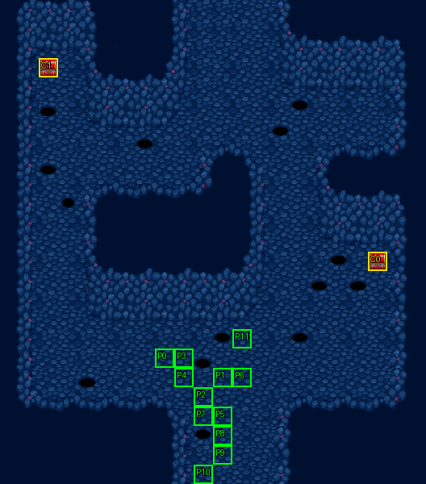

# 第 28 章　異界之封印

<!-- chapter_docs:header -->
| 項目 | 內容 |
| --- | --- |
| 章號／章節索引 | 28／27 |
| 章名（文字區塊 `0x01`） | 異界之封印 |
| 勝利條件（`0x02`） | 敵人全滅 |
| 敗北條件（`0x03`） | 蘭迪斯死亡 |
| 戰場 | `MAP27.DAT`／`MAP27.COD`／`M27.DTL`，22×25 格，我方 slot 12 個，部署記錄 65 筆 |
| 文字區塊 | `FDETXT28.TXT`，11 條 |
| 進入處理（`0x60074`[27]） | `fdps_chapter_28_init`（`0x21590`） |
| 行動後檢查（`0x6028c`[27]） | `fdps_chapter_28_post_action`（`0x3b990`） |
| 勝利處理（`0x60304`[27]） | `fdps_chapter_28_end`（`0x3b9b0`） |
| 地圖資料呼叫的事件處理（`0x601c4`） | slot 44：`fdps_chapter_28_event_deploy_wave_for_turn`（`0x39550`）（回合事件） |
| 過場腳本 | `ICON27.DAT`（開場）、`WIN27.DAT`（勝利） |
| 本章之前的村莊 | 無 |
| 光碟 | 第 2 片（音軌見 [CD 音軌](../program_info/cd_audio.md)） |



戰場全圖（第 0 層與同步捲動的圖層）。框線：黃 `C` 寶箱、橘 `B` 埋藏格、青 `R` 重繪格、洋紅 `E` 有處理函式的格子事件格，字母後的數字是事件碼；綠 `P` 是我方 slot 的起始格。

圖由 `python tools/chapter_docs/chapter_facts.py render-maps` 從遊戲檔重畫到 `chapters/maps/`，`verify-maps` 逐 byte 比對版控中的圖。
<!-- /chapter_docs:header -->

## 概要

本章只能經 [第 27 章](ch27.md) 的隱藏路線進入：打倒魔導王時若蘭迪斯帶著魔精石碎片、法蓮娜帶著反禁制器，法蓮娜就被救下歸隊，但吉歐說封印已經解除、魔神就要來了；異界的入口隨之打開，一行人為了在魔神降臨人間前擊敗牠而踏進異界。開場過場 `ICON27.DAT` 讓全隊從地圖下緣列隊走上來，琴琴被滿地怪物嚇壞，法蓮娜說這裡是異次元界、已經沒有回頭的路；蘭迪斯鼓舞大家，只要戰勝魔神，世界就能恢復原有的秩序與和平，這是唯一的機會（文字 `0x09`）。

戰場是一座由妖鬼族的骷顱兵、幽魂、地獄犬與魔族的黑暗祭司占據的異界迷宮，沒有頭目。第 2、4、6、7、10、12、14、16、18 回合各有三隻怪物從上緣冒出來，第 18 回合之後不再增援。

勝利過場 `WIN27.DAT` 把隊伍排在地圖上端，琴琴歡呼獲勝，費塔加提醒這只是開始、後面的考驗更艱難，蘭迪斯要大家做好心理準備繼續前進（`0x0a`），隨後蘭迪斯先往上走 2 格後退場，其餘九人跟著往上走 2 格，音樂停止。

## 加入與離隊

- 本章沒有人入隊或離隊，也沒有客串單位。入隊的規則與表見 [`assets/characters.md` 的「加入」](../assets/characters.md#加入)。
- **全員上場，法蓮娜歸隊**：名冊此時是第 24 章以來的 12 人，`MAP27` 正好宣告 12 個我方 slot，`fdps_chapter_28_init`（`0x21590`）的開場過場 `ICON27.DAT` 沒有任何 `RETIRE_UNIT`，所以 [第 25 章](ch25.md) 到 [第 27 章](ch27.md) 都被開場過場設為退場的法蓮娜（地圖單位 3）本章回到戰場。
- 勝利過場 `WIN27.DAT` 一開始讓地圖單位 10、11（蘭斯洛特、珊）退場，把他們排除在收場畫面之外。這發生在名冊寫回之後，不影響名冊，下一章照樣從名冊取出兩人。

## 勝敗條件與特殊機制

- **勝敗判定只有共用判定**：`fdps_chapter_28_post_action`（`0x3b990`）只轉呼 `fdps_battle_check_default_end_conditions`（`0x3a2e0`）：場上沒有未退場的陣營 0 單位就過關，單位 0 蘭迪斯退場就敗北（同一次行動兩者都成立時敗北優先），與畫面上的「敵人全滅／蘭迪斯死亡」一致。沒有回合限制、沒有頭目，也沒有要保護的第二個單位。
- **援軍只看回合，全滅就結束**：援軍由回合事件在第 2、4、6、7、10、12、14、16、18 回合的敵方階段前部署（見「處理流程」）。「全滅」只看當下場上的單位，還沒到的援軍不算，所以在第 18 回合前把場上清空就立刻過關，之後的波次不再出現。
- **波次編號是回合數除以 2**：`fdps_chapter_28_event_deploy_wave_for_turn`（`0x39550`）以回合計數器（加 1 之前的值）做向零截斷的整數除法取波次，9 次觸發依序得到波次 1、2、3、3、5、6、7、8、9。第 7 回合把**波次 3 再部署一次**（同樣三隻怪物再出現一組），**波次 4 永遠不出場**。這是原版行為，重建不能「修正」，見 [`rebuild_info/pitfalls.md`](../rebuild_info/pitfalls.md) 的第 28 章援軍一列。
- **起始位置由開場過場決定**：`ICON27.DAT` 的 12 條 `PLACE_UNIT` 把全隊疊在 (11, 24)／(10, 24)，再以九次集體行走推上來，`MAP27.COD` 為每個 slot 給的起始格因此被覆寫。走完後占的仍是 `MAP27.COD` 那 12 格，但人換了位置：蘭迪斯在 (12, 17)（`MAP27.COD` 給 slot 0 的是 (8, 18)），其餘依單位 1–11 分別在 (11, 19)、(12, 19)、(8, 18)、(9, 18)、(9, 19)、(10, 20)、(10, 21)、(11, 21)、(11, 22)、(11, 23)、(10, 24)。地圖上標的 P 格是 `MAP27.COD` 的記錄，不是開戰時的站位。

## 敵人配置

開場的 37 名敵人（波次 0）全是 LV25、AI 0 主動出擊：骷顱兵 10、幽魂 9、地獄犬 14、黑暗祭司 4，分布在我方起始區以北的整片迷宮（左側迴廊、右側通道與上方區域），沒有原地不動的守衛、沒有頭目，也沒有搶寶箱的單位。

援軍每波三隻，同樣是 LV25、AI 0，錨點都在上緣的 (10, 0)、(11, 0)、(12, 0)，以找最近空格的方式放置，錨點被占時落在附近。每次部署後畫面會捲到 (12, 0) 停留 12 幀讓玩家看見援軍。實際出場的是波次 1、2、3、3、5、6、7、8、9，共 27 隻（骷顱兵 7、幽魂 9、地獄犬 11）。波次 4（幽魂 1、地獄犬 2）與波次 FF 的一名骷顱兵沒有任何部署路徑。

<!-- chapter_docs:deployments -->
陣營與死亡腳本的意義見 [`resource_info/map.md`](../resource_info/map.md)，AI 行為（低 4 bit）見 [`program_info/map_ai.md`](../program_info/map_ai.md#行為代碼)；錨點是 `MAPnn.COD` 的座標，開場波次放在錨點上，其餘波次依部署方式放在錨點或最近的空格。單位名是全域文字的「角色編號 + 1」條；角色編號 `3C` 以上的敵兵，數值（`ENEMYDAT.DAT`）與種族、職業見 [`assets/enemies.md`](../assets/enemies.md)，以下的見 [`assets/characters.md`](../assets/characters.md)。

我方起始格：slot 0 (8, 18)、slot 1 (11, 19)、slot 2 (10, 20)、slot 3 (9, 18)、slot 4 (9, 19)、slot 5 (11, 21)、slot 6 (12, 19)、slot 7 (10, 21)、slot 8 (11, 22)、slot 9 (11, 23)、slot 10 (10, 24)、slot 11 (12, 17)。

| 波次 | 陣營 | 單位 | 等級 | 數量 |
| ---: | --- | --- | --- | ---: |
| 0 | 敵方 | `54` 骷顱兵 | 25 | 10 |
| 0 | 敵方 | `69` 幽魂 | 25 | 9 |
| 0 | 敵方 | `6B` 地獄犬 | 25 | 14 |
| 0 | 敵方 | `68` 黑暗祭司 | 25 | 4 |
| 1 | 敵方 | `6B` 地獄犬 | 25 | 2 |
| 1 | 敵方 | `54` 骷顱兵 | 25 | 1 |
| 2 | 敵方 | `69` 幽魂 | 25 | 2 |
| 2 | 敵方 | `6B` 地獄犬 | 25 | 1 |
| 3 | 敵方 | `6B` 地獄犬 | 25 | 1 |
| 3 | 敵方 | `54` 骷顱兵 | 25 | 1 |
| 3 | 敵方 | `69` 幽魂 | 25 | 1 |
| 5 | 敵方 | `54` 骷顱兵 | 25 | 1 |
| 5 | 敵方 | `6B` 地獄犬 | 25 | 2 |
| 6 | 敵方 | `54` 骷顱兵 | 25 | 1 |
| 6 | 敵方 | `69` 幽魂 | 25 | 1 |
| 6 | 敵方 | `6B` 地獄犬 | 25 | 1 |
| 7 | 敵方 | `54` 骷顱兵 | 25 | 1 |
| 7 | 敵方 | `69` 幽魂 | 25 | 1 |
| 7 | 敵方 | `6B` 地獄犬 | 25 | 1 |
| 8 | 敵方 | `69` 幽魂 | 25 | 1 |
| 8 | 敵方 | `54` 骷顱兵 | 25 | 1 |
| 8 | 敵方 | `6B` 地獄犬 | 25 | 1 |
| 9 | 敵方 | `69` 幽魂 | 25 | 2 |
| 9 | 敵方 | `6B` 地獄犬 | 25 | 1 |

### 波次 0

出場：進入戰場時由 `fdps_build_map_unit_array`（`0x22be0`） 部署在錨點上

| # | 陣營 | 單位 | 等級 | AI 行為 | 錨點 | 死亡腳本 |
| ---: | --- | --- | ---: | --- | --- | --- |
| 0 | 敵方 | `54` 骷顱兵 | 25 | 0 主動 | (5, 6) | — |
| 1 | 敵方 | `54` 骷顱兵 | 25 | 0 主動 | (3, 14) | — |
| 2 | 敵方 | `54` 骷顱兵 | 25 | 0 主動 | (16, 15) | — |
| 3 | 敵方 | `54` 骷顱兵 | 25 | 0 主動 | (15, 10) | — |
| 5 | 敵方 | `69` 幽魂 | 25 | 0 主動 | (15, 9) | — |
| 6 | 敵方 | `69` 幽魂 | 25 | 0 主動 | (14, 8) | — |
| 7 | 敵方 | `69` 幽魂 | 25 | 0 主動 | (19, 16) | — |
| 8 | 敵方 | `6B` 地獄犬 | 25 | 0 主動 | (3, 7) | — |
| 9 | 敵方 | `6B` 地獄犬 | 25 | 0 主動 | (4, 6) | — |
| 10 | 敵方 | `6B` 地獄犬 | 25 | 0 主動 | (14, 9) | — |
| 11 | 敵方 | `6B` 地獄犬 | 25 | 0 主動 | (17, 16) | 掉落 `C2` 神聖之水 |
| 12 | 敵方 | `6B` 地獄犬 | 25 | 0 主動 | (2, 14) | — |
| 13 | 敵方 | `6B` 地獄犬 | 25 | 0 主動 | (16, 13) | — |
| 14 | 敵方 | `6B` 地獄犬 | 25 | 0 主動 | (15, 8) | — |
| 15 | 敵方 | `6B` 地獄犬 | 25 | 0 主動 | (3, 12) | — |
| 16 | 敵方 | `68` 黑暗祭司 | 25 | 0 主動 | (18, 15) | — |
| 17 | 敵方 | `68` 黑暗祭司 | 25 | 0 主動 | (15, 7) | 掉落 `B9` 水晶粒 |
| 18 | 敵方 | `68` 黑暗祭司 | 25 | 0 主動 | (2, 11) | — |
| 19 | 敵方 | `68` 黑暗祭司 | 25 | 0 主動 | (13, 3) | — |
| 20 | 敵方 | `6B` 地獄犬 | 25 | 0 主動 | (13, 5) | — |
| 21 | 敵方 | `6B` 地獄犬 | 25 | 0 主動 | (3, 16) | — |
| 22 | 敵方 | `6B` 地獄犬 | 25 | 0 主動 | (4, 17) | — |
| 23 | 敵方 | `6B` 地獄犬 | 25 | 0 主動 | (2, 19) | — |
| 24 | 敵方 | `6B` 地獄犬 | 25 | 0 主動 | (10, 4) | — |
| 25 | 敵方 | `6B` 地獄犬 | 25 | 0 主動 | (6, 7) | — |
| 26 | 敵方 | `54` 骷顱兵 | 25 | 0 主動 | (4, 16) | 掉落 `C2` 神聖之水 |
| 27 | 敵方 | `54` 骷顱兵 | 25 | 0 主動 | (11, 5) | — |
| 28 | 敵方 | `54` 骷顱兵 | 25 | 0 主動 | (6, 8) | — |
| 29 | 敵方 | `54` 骷顱兵 | 25 | 0 主動 | (5, 8) | — |
| 30 | 敵方 | `54` 骷顱兵 | 25 | 0 主動 | (3, 18) | — |
| 31 | 敵方 | `54` 骷顱兵 | 25 | 0 主動 | (2, 17) | — |
| 32 | 敵方 | `69` 幽魂 | 25 | 0 主動 | (11, 3) | — |
| 33 | 敵方 | `69` 幽魂 | 25 | 0 主動 | (17, 14) | — |
| 34 | 敵方 | `69` 幽魂 | 25 | 0 主動 | (2, 16) | — |
| 35 | 敵方 | `69` 幽魂 | 25 | 0 主動 | (2, 13) | — |
| 36 | 敵方 | `69` 幽魂 | 25 | 0 主動 | (4, 8) | — |
| 37 | 敵方 | `69` 幽魂 | 25 | 0 主動 | (12, 4) | 掉落 `C2` 神聖之水 |

### 波次 1

出場：第 2 回合敵方階段前，回合事件 slot 44 呼叫 `fdps_chapter_28_event_deploy_wave_for_turn`（`0x39550`），以回合 ÷ 2 = 1 部署（找最近空格），接著畫面捲到上緣停留 12 幀

| # | 陣營 | 單位 | 等級 | AI 行為 | 錨點 | 死亡腳本 |
| ---: | --- | --- | ---: | --- | --- | --- |
| 38 | 敵方 | `6B` 地獄犬 | 25 | 0 主動 | (10, 0) | — |
| 39 | 敵方 | `6B` 地獄犬 | 25 | 0 主動 | (11, 0) | — |
| 40 | 敵方 | `54` 骷顱兵 | 25 | 0 主動 | (12, 0) | — |

### 波次 2

出場：第 4 回合敵方階段前，回合事件 slot 44 呼叫 `fdps_chapter_28_event_deploy_wave_for_turn`（`0x39550`），以回合 ÷ 2 = 2 部署（找最近空格）

| # | 陣營 | 單位 | 等級 | AI 行為 | 錨點 | 死亡腳本 |
| ---: | --- | --- | ---: | --- | --- | --- |
| 41 | 敵方 | `69` 幽魂 | 25 | 0 主動 | (10, 0) | — |
| 42 | 敵方 | `6B` 地獄犬 | 25 | 0 主動 | (11, 0) | — |
| 43 | 敵方 | `69` 幽魂 | 25 | 0 主動 | (12, 0) | — |

### 波次 3

出場：第 6 回合與第 7 回合敵方階段前各一次：回合事件 slot 44 呼叫 `fdps_chapter_28_event_deploy_wave_for_turn`（`0x39550`），6 ÷ 2 與 7 ÷ 2（向零截斷）都是 3，所以這三隻會出場兩組（找最近空格）

| # | 陣營 | 單位 | 等級 | AI 行為 | 錨點 | 死亡腳本 |
| ---: | --- | --- | ---: | --- | --- | --- |
| 44 | 敵方 | `6B` 地獄犬 | 25 | 0 主動 | (10, 0) | — |
| 45 | 敵方 | `54` 骷顱兵 | 25 | 0 主動 | (11, 0) | — |
| 46 | 敵方 | `69` 幽魂 | 25 | 0 主動 | (12, 0) | — |

### 波次 4

3 筆記錄（#47–#49）永遠不會部署：`fdps_chapter_28_event_deploy_wave_for_turn`（`0x39550`）以回合 ÷ 2 取波次，而 `MAP27` 的回合事件排在 2、4、6、7、10…，沒有第 8、9 回合，第 7 回合截斷成 3，沒有任何呼叫得到 4，見 [S10](../cut_content/story.md#s10-第-28-章波次-4-的三名敵兵)。

### 波次 5

出場：第 10 回合敵方階段前，回合事件 slot 44 呼叫 `fdps_chapter_28_event_deploy_wave_for_turn`（`0x39550`），以回合 ÷ 2 = 5 部署（找最近空格）

| # | 陣營 | 單位 | 等級 | AI 行為 | 錨點 | 死亡腳本 |
| ---: | --- | --- | ---: | --- | --- | --- |
| 50 | 敵方 | `54` 骷顱兵 | 25 | 0 主動 | (10, 0) | — |
| 51 | 敵方 | `6B` 地獄犬 | 25 | 0 主動 | (11, 0) | — |
| 52 | 敵方 | `6B` 地獄犬 | 25 | 0 主動 | (12, 0) | — |

### 波次 6

出場：第 12 回合敵方階段前，回合事件 slot 44 呼叫 `fdps_chapter_28_event_deploy_wave_for_turn`（`0x39550`），以回合 ÷ 2 = 6 部署（找最近空格）

| # | 陣營 | 單位 | 等級 | AI 行為 | 錨點 | 死亡腳本 |
| ---: | --- | --- | ---: | --- | --- | --- |
| 53 | 敵方 | `54` 骷顱兵 | 25 | 0 主動 | (10, 0) | — |
| 54 | 敵方 | `69` 幽魂 | 25 | 0 主動 | (11, 0) | — |
| 55 | 敵方 | `6B` 地獄犬 | 25 | 0 主動 | (12, 0) | — |

### 波次 7

出場：第 14 回合敵方階段前，回合事件 slot 44 呼叫 `fdps_chapter_28_event_deploy_wave_for_turn`（`0x39550`），以回合 ÷ 2 = 7 部署（找最近空格）

| # | 陣營 | 單位 | 等級 | AI 行為 | 錨點 | 死亡腳本 |
| ---: | --- | --- | ---: | --- | --- | --- |
| 56 | 敵方 | `54` 骷顱兵 | 25 | 0 主動 | (10, 0) | — |
| 57 | 敵方 | `69` 幽魂 | 25 | 0 主動 | (11, 0) | — |
| 58 | 敵方 | `6B` 地獄犬 | 25 | 0 主動 | (12, 0) | — |

### 波次 8

出場：第 16 回合敵方階段前，回合事件 slot 44 呼叫 `fdps_chapter_28_event_deploy_wave_for_turn`（`0x39550`），以回合 ÷ 2 = 8 部署（找最近空格）

| # | 陣營 | 單位 | 等級 | AI 行為 | 錨點 | 死亡腳本 |
| ---: | --- | --- | ---: | --- | --- | --- |
| 59 | 敵方 | `69` 幽魂 | 25 | 0 主動 | (10, 0) | — |
| 60 | 敵方 | `54` 骷顱兵 | 25 | 0 主動 | (11, 0) | — |
| 61 | 敵方 | `6B` 地獄犬 | 25 | 0 主動 | (12, 0) | — |

### 波次 9

出場：第 18 回合敵方階段前，回合事件 slot 44 呼叫 `fdps_chapter_28_event_deploy_wave_for_turn`（`0x39550`），以回合 ÷ 2 = 9 部署（找最近空格）

| # | 陣營 | 單位 | 等級 | AI 行為 | 錨點 | 死亡腳本 |
| ---: | --- | --- | ---: | --- | --- | --- |
| 62 | 敵方 | `69` 幽魂 | 25 | 0 主動 | (10, 0) | — |
| 63 | 敵方 | `69` 幽魂 | 25 | 0 主動 | (11, 0) | — |
| 64 | 敵方 | `6B` 地獄犬 | 25 | 0 主動 | (12, 0) | — |

### 波次 FF

1 筆記錄（#4）永遠不會部署：沒有任何呼叫以 255 部署：回合事件處理函式的回合 ÷ 2 最大是 9，`ICON27.DAT`／`WIN27.DAT` 沒有 `DEPLOY_WAVE`，見 [S11](../cut_content/story.md#s11-18-筆波次-0xff-的部署記錄)。
<!-- /chapter_docs:deployments -->

## 寶物

兩個寶箱之外，地獄犬（記錄 11）、骷顱兵（記錄 26）、幽魂（記錄 37）死亡時掉落 `C2` 神聖之水，黑暗祭司（記錄 17）掉落 `B9` 水晶粒，都是開場就在場上的單位；援軍沒有掉落物。本章的處理函式不發任何道具。

<!-- chapter_docs:treasure -->
搜尋的規則（同碼的格共用一筆記錄與一個旗標、背包滿時的交換）見 [`resource_info/map.md`](../resource_info/map.md)。

| 事件碼 | 格 | 內容 |
| ---: | --- | --- |
| 0 | (19, 13) 寶箱 | `D6` 生命之實 |
| 1 | (2, 3) 寶箱 | `D7` 魔力水晶 |

擊倒後掉落（死亡腳本 opcode 0／1，擊殺者須是存活的我方單位）：

| # | 單位 | 波次 | 掉落 |
| ---: | --- | ---: | --- |
| 11 | `6B` 地獄犬 | 0 | 掉落 `C2` 神聖之水 |
| 17 | `68` 黑暗祭司 | 0 | 掉落 `B9` 水晶粒 |
| 26 | `54` 骷顱兵 | 0 | 掉落 `C2` 神聖之水 |
| 37 | `69` 幽魂 | 0 | 掉落 `C2` 神聖之水 |
<!-- /chapter_docs:treasure -->

## 村莊

<!-- chapter_docs:village -->
第 27 章勝利後沒有村莊（`CHAPTER_HAS_NO_VILLAGE`，`src/village.c`），直接進存檔畫面再進本章。
<!-- /chapter_docs:village -->

## 處理流程

### `fdps_chapter_28_init`（`0x21590`）

1. `fdps_chapter_state_reset`（`0x22750`）：從名冊填滿地圖 27 的 12 個我方 slot（名冊正好 12 人，沒有空 slot），部署波次 0 的 37 名敵人，清空觸發旗標與結束碼。
2. `fdps_icon_script_run`（`0x21650`）播 `ICON27.DAT`：淡出、音樂 4，把 12 名隊員放到下緣、淡入，捲動視野並把全隊走到起始位置，最後顯示 `0x09`。腳本沒有 `SWITCH_MAP`、`DEPLOY_WAVE`、`RETIRE_UNIT` 或 `REVIVE_UNIT`。
3. `fdps_show_chapter_title_card`（`0x20c60`）顯示章名卡。
4. `fdps_map_cursor_move_to_unit`（`0x2da50`）把游標放在單位 0 蘭迪斯，也就是過場走完後的 (12, 17)。

本章不呼叫 `fdps_roster_add_character`。

### `fdps_chapter_28_event_deploy_wave_for_turn`（`0x39550`）

`MAP27` 的九筆回合事件（第 2、4、6、7、10、12、14、16、18 回合，陣營階段 0，即敵方階段前）都指向 slot 44 的這一支：

1. `fdps_deploy_wave`（`0x23830`）以目前章節索引（27，即 `MAP27`）、波次「回合計數器 ÷ 2」（有號整數除法，向零截斷）、放置旗標 0（找最近空格）部署。回合計數器在回合事件分派之後才加 1，所以讀到的是剛結束的那個我方階段的回合數。
2. 游標繪製模式設 0（不畫游標），`fdps_map_cursor_move_to`（`0x2d7c0`）把視野移到像素 (0x120, 0)，即格 (12, 0)。
3. 呼叫 `fdps_render_view_frame`（`0x2beb0`）12 次，讓畫面停在上緣 12 幀。
4. 游標繪製模式設回 1。

參數（行動單位）不使用，它的堆疊槽被拿來當停留計數器。捲動與停留不檢查波次有沒有部署出任何單位。

| 回合 | 波次 | 內容 |
| ---: | ---: | --- |
| 2 | 1 | 地獄犬 2、骷顱兵 1 |
| 4 | 2 | 幽魂 2、地獄犬 1 |
| 6 | 3 | 地獄犬、骷顱兵、幽魂各 1 |
| 7 | 3 | 同上，再部署一次 |
| 10 | 5 | 骷顱兵 1、地獄犬 2 |
| 12 | 6 | 骷顱兵、幽魂、地獄犬各 1 |
| 14 | 7 | 骷顱兵、幽魂、地獄犬各 1 |
| 16 | 8 | 幽魂、骷顱兵、地獄犬各 1 |
| 18 | 9 | 幽魂 2、地獄犬 1 |

### `fdps_chapter_28_post_action`（`0x3b990`）

只呼叫 `fdps_battle_check_default_end_conditions`（`0x3a2e0`），沒有其他判定；本章索引 27 不是共用判定特別處理的 `0x10`／`0x15`，所以敗北看的是單位 0 蘭迪斯。

### `fdps_chapter_28_end`（`0x3b9b0`）

標準形狀，見 [`program_info/chapter.md`](../program_info/chapter.md) 的「章節結束」：

1. `fdps_battle_destroy_remaining_enemies`（`0x39e10`）清殘敵。
2. `fdps_roster_write_back_battle_units`（`0x23980`）名冊寫回。
3. `fdps_icon_script_run`（`0x21650`）播 `WIN27.DAT`：地圖單位 10、11 退場，單位 1、2、4–9 復歸（清退場旗標），把 10 人排在地圖上端 (11–14, 1–5)，顯示 `0x0a`，蘭迪斯往上走 2 格後退場，其餘 9 人往上走 2 格，停止音樂。單位 0 與 3（法蓮娜）不在復歸之列。
4. `fdps_roster_revive_fallen_members`（`0x39e70`）陣亡者復活與收費。
5. 章節索引 ← `0x1c`，進入 [第 29 章](ch29.md)。

## 回合事件與格子事件

<!-- chapter_docs:events -->
觸發時機與陣營階段的意義見 [`resource_info/map.md`](../resource_info/map.md)。

| 回合 | 陣營階段 | slot | 處理函式 |
| ---: | --- | ---: | --- |
| 2 | 敵方階段前 | 44 | `fdps_chapter_28_event_deploy_wave_for_turn`（`0x39550`） |
| 4 | 敵方階段前 | 44 | `fdps_chapter_28_event_deploy_wave_for_turn`（`0x39550`） |
| 6 | 敵方階段前 | 44 | `fdps_chapter_28_event_deploy_wave_for_turn`（`0x39550`） |
| 7 | 敵方階段前 | 44 | `fdps_chapter_28_event_deploy_wave_for_turn`（`0x39550`） |
| 10 | 敵方階段前 | 44 | `fdps_chapter_28_event_deploy_wave_for_turn`（`0x39550`） |
| 12 | 敵方階段前 | 44 | `fdps_chapter_28_event_deploy_wave_for_turn`（`0x39550`） |
| 14 | 敵方階段前 | 44 | `fdps_chapter_28_event_deploy_wave_for_turn`（`0x39550`） |
| 16 | 敵方階段前 | 44 | `fdps_chapter_28_event_deploy_wave_for_turn`（`0x39550`） |
| 18 | 敵方階段前 | 44 | `fdps_chapter_28_event_deploy_wave_for_turn`（`0x39550`） |

本章沒有格子事件。
<!-- /chapter_docs:events -->

## 過場腳本

<!-- chapter_docs:scripts -->
格式與每個指令的意義見 [`resource_info/cutscene_script.md`](../resource_info/cutscene_script.md)。`FDETXT28#0xNN` 是本章文字區塊的條目，全文在下方「對話」；切到額外場景之後顯示的文字直接列出（那些區塊的正典是 [`assets/text/scene_text.md`](../assets/text/scene_text.md)）。`u3=我方1` 是地圖單位索引 3 對到我方 slot 1，`u12=MAP02#9` 是 `MAP02.DAT` 第 9 筆部署記錄。

### `ICON27.DAT`

- 開場：`fdps_chapter_28_init`（`0x21590`）
- 267 byte、32 步；起始地圖 27，切換地圖 無，結束於地圖 27

| 偏移 | 指令 | 內容 |
| ---: | --- | --- |
| `0000` | `FADE_OUT` | 淡出，每步 0 ms |
| `0002` | `SET_MUSIC` | 音樂 4（CD 第 5 軌） |
| `0004` | `SET_VIEW_TILE` | 視野直接設到格 (6, 0) |
| `0007` | `PLACE_UNIT` | 放置 u0=我方0 到 (11, 24)，朝下 |
| `000c` | `PLACE_UNIT` | 放置 u1=我方1 到 (11, 24)，朝下 |
| `0011` | `PLACE_UNIT` | 放置 u2=我方2 到 (11, 24)，朝下 |
| `0016` | `PLACE_UNIT` | 放置 u3=我方3 到 (10, 24)，朝下 |
| `001b` | `PLACE_UNIT` | 放置 u4=我方4 到 (10, 24)，朝下 |
| `0020` | `PLACE_UNIT` | 放置 u5=我方5 到 (10, 24)，朝下 |
| `0025` | `PLACE_UNIT` | 放置 u6=我方6 到 (10, 24)，朝下 |
| `002a` | `PLACE_UNIT` | 放置 u7=我方7 到 (10, 24)，朝下 |
| `002f` | `PLACE_UNIT` | 放置 u8=我方8 到 (11, 24)，朝下 |
| `0034` | `PLACE_UNIT` | 放置 u9=我方9 到 (11, 24)，朝下 |
| `0039` | `PLACE_UNIT` | 放置 u10=我方10 到 (11, 24)，朝下 |
| `003e` | `PLACE_UNIT` | 放置 u11=我方11 到 (10, 24)，朝下 |
| `0043` | `FACE_UNITS` | 轉向後停 1 幀：u0=我方0朝上 |
| `0048` | `FADE_IN` | 淡入，每步 20 ms |
| `004a` | `FACE_UNITS` | 轉向後停 12 幀：u0=我方0朝上 |
| `004f` | `SCROLL_VIEW` | 捲動視野到格 (6, 15) |
| `0052` | `FACE_UNITS` | 轉向後停 12 幀：u0=我方0朝上 |
| `0057` | `WALK_UNITS` | 行走 1 格，每步 2 幀：u0=我方0往上、u1=我方1往上、u2=我方2往上、u3=我方3往上、u4=我方4往上、u5=我方5往上 |
| `0067` | `WALK_UNITS` | 行走 1 格，每步 2 幀：u0=我方0往上、u1=我方1往上、u2=我方2往上、u3=我方3往右、u4=我方4往右、u5=我方5往右 |
| `0077` | `WALK_UNITS` | 行走 2 格，每步 2 幀：u0=我方0往上、u1=我方1往上、u2=我方2往上、u3=我方3往上、u4=我方4往上、u5=我方5往上 |
| `0087` | `WALK_UNITS` | 行走 1 格，每步 2 幀：u0=我方0往上、u1=我方1往上、u2=我方2往上、u3=我方3往左、u4=我方4往左、u5=我方5往左、u6=我方6往上、u7=我方7往上 |
| `009b` | `WALK_UNITS` | 行走 1 格，每步 2 幀：u0=我方0往右、u2=我方2往右、u3=我方3往上、u4=我方4往上、u5=我方5往上、u6=我方6往右、u7=我方7往右 |
| `00ad` | `WALK_UNITS` | 行走 1 格，每步 2 幀：u0=我方0往上、u3=我方3往上、u4=我方4往上、u5=我方5往上、u6=我方6往上、u7=我方7往上、u8=我方8往上、u9=我方9往上、u10=我方10往上 |
| `00c3` | `WALK_UNITS` | 行走 1 格，每步 2 幀：u0=我方0往上、u3=我方3往左、u4=我方4往左、u5=我方5往左、u6=我方6往上、u7=我方7往上、u8=我方8往上、u9=我方9往上 |
| `00d7` | `WALK_UNITS` | 行走 1 格，每步 2 幀：u3=我方3往上、u4=我方4往上、u6=我方6往左、u7=我方7往左、u8=我方8往上 |
| `00e5` | `WALK_UNITS` | 行走 1 格，每步 2 幀：u3=我方3往左、u6=我方6往上 |
| `00ed` | `FACE_UNITS` | 轉向後停 40 幀：u0=我方0朝上、u1=我方1朝上、u2=我方2朝上、u3=我方3朝上、u4=我方4朝上、u5=我方5朝上、u6=我方6朝上、u7=我方7朝上、u8=我方8朝上、u9=我方9朝上、u10=我方10朝上、u11=我方11朝上 |
| `0108` | `DRAW_TEXT` | 顯示文字 FDETXT28#0x09 |
| `010a` | `END` | 結束 |

### `WIN27.DAT`

- 勝利：`fdps_chapter_28_end`（`0x3b9b0`）
- 110 byte、28 步；起始地圖 27，切換地圖 無，結束於地圖 27

| 偏移 | 指令 | 內容 |
| ---: | --- | --- |
| `0000` | `SET_VIEW_TILE` | 視野直接設到格 (5, 0) |
| `0003` | `SET_MUSIC` | 音樂 6（CD 第 7 軌） |
| `0005` | `RETIRE_UNIT` | 退場 u10=我方10 |
| `0007` | `RETIRE_UNIT` | 退場 u11=我方11 |
| `0009` | `REVIVE_UNIT` | 復歸 u1=我方1（清狀態） |
| `000b` | `REVIVE_UNIT` | 復歸 u2=我方2（清狀態） |
| `000d` | `REVIVE_UNIT` | 復歸 u4=我方4（清狀態） |
| `000f` | `REVIVE_UNIT` | 復歸 u5=我方5（清狀態） |
| `0011` | `REVIVE_UNIT` | 復歸 u6=我方6（清狀態） |
| `0013` | `REVIVE_UNIT` | 復歸 u7=我方7（清狀態） |
| `0015` | `REVIVE_UNIT` | 復歸 u8=我方8（清狀態） |
| `0017` | `REVIVE_UNIT` | 復歸 u9=我方9（清狀態） |
| `0019` | `PLACE_UNIT` | 放置 u0=我方0 到 (12, 1)，朝下 |
| `001e` | `PLACE_UNIT` | 放置 u1=我方1 到 (11, 2)，朝右 |
| `0023` | `PLACE_UNIT` | 放置 u8=我方8 到 (12, 2)，朝上 |
| `0028` | `PLACE_UNIT` | 放置 u5=我方5 到 (13, 2)，朝左 |
| `002d` | `PLACE_UNIT` | 放置 u2=我方2 到 (11, 3)，朝上 |
| `0032` | `PLACE_UNIT` | 放置 u3=我方3 到 (12, 3)，朝上 |
| `0037` | `PLACE_UNIT` | 放置 u4=我方4 到 (12, 4)，朝上 |
| `003c` | `PLACE_UNIT` | 放置 u6=我方6 到 (13, 4)，朝上 |
| `0041` | `PLACE_UNIT` | 放置 u7=我方7 到 (14, 4)，朝上 |
| `0046` | `PLACE_UNIT` | 放置 u9=我方9 到 (12, 5)，朝上 |
| `004b` | `DRAW_TEXT` | 顯示文字 FDETXT28#0x0a |
| `004d` | `WALK_UNITS` | 行走 2 格，每步 3 幀：u0=我方0往上 |
| `0053` | `RETIRE_UNIT` | 退場 u0=我方0 |
| `0055` | `WALK_UNITS` | 行走 2 格，每步 4 幀：u1=我方1往上、u2=我方2往上、u3=我方3往上、u4=我方4往上、u5=我方5往上、u6=我方6往上、u7=我方7往上、u8=我方8往上、u9=我方9往上 |
| `006b` | `SET_MUSIC` | 停止音樂 |
| `006d` | `END` | 結束 |
<!-- /chapter_docs:scripts -->

## 對話

<!-- chapter_docs:dialogue -->
`FDETXT28.TXT` 全部 11 條，依條目編號排列。每條先列讀取端（顯示它的腳本步驟、處理函式或死亡腳本），再列全文：【名稱】是換說話者（頭像取自括號裡的角色編號；【地圖單位 n】取執行當下第 n 個地圖單位），每一行是一次換行，▼ 是換頁（等按鍵）。`{subst1}`、`{subst2}`、`{number}` 是執行期代入的名稱與數字（[`resource_info/text.md`](../resource_info/text.md)）。

空字串的條目：`0x04`、`0x05`、`0x06`、`0x07`、`0x08`。

### `0x00`

永遠不會顯示：「第廿八章」沒有讀取端：章名卡由 `fdps_show_chapter_title_card`（`0x20c60`）畫 `CHAPTER.SAF` 的圖，本章的處理函式與 `ICON27.DAT`／`WIN27.DAT` 都不畫這一條，見 [S13a（排除清單）](../cut_content/_index.md#排除清單)。

### `0x01`

讀取端：`fdps_draw_save_slot_panel`（`0x24a40`）

```text
異界之封印
```

### `0x02`

讀取端：`fdps_battle_show_win_fail_window`（`0x17ca0`）

```text
敵人全滅
```

### `0x03`

讀取端：`fdps_battle_show_win_fail_window`（`0x17ca0`）

```text
蘭迪斯死亡
```

### `0x09`

讀取端：`ICON27.DAT` `0x108`

```text
【琴琴】（角色 7）
哎呀呀呀～！
怎麼都是怪﹒﹒怪物！
好可怕！
【法蓮娜】（角色 1）
這裡是異次元界！
我們到不該來的地方，
也沒有回頭的路了。
【蘭迪斯】（角色 0）
一定要打倒最終敵人！
不要怕！
我們一定會戰勝的。
▼
只要戰勝了魔神，
世界就可以重新恢復，
原有秩序與和平了。
▼
加油！各位！
這是我們唯一機會了！
```

### `0x0a`

讀取端：`WIN27.DAT` `0x04b`

```text
【琴琴】（角色 7）
耶～！
我們贏了。
【費塔加】（角色 2）
不！
這只是個開始而已。
後面考驗會更艱難！
【蘭迪斯】（角色 0）
不錯！
我們要有心理準備。
繼續前進～！
```
<!-- /chapter_docs:dialogue -->
