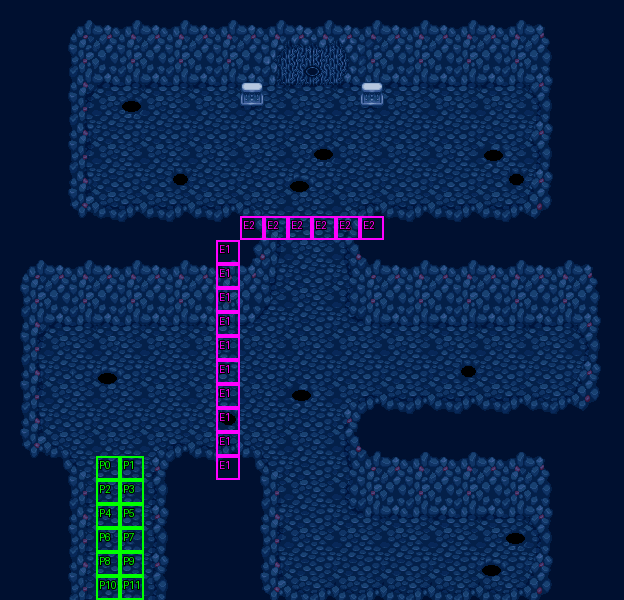

# 第 29 章　守護魔龍

<!-- chapter_docs:header -->
| 項目 | 內容 |
| --- | --- |
| 章號／章節索引 | 29／28 |
| 章名（文字區塊 `0x01`） | 守護魔龍 |
| 勝利條件（`0x02`） | 敵人全滅 |
| 敗北條件（`0x03`） | 蘭迪斯死亡 |
| 戰場 | `MAP28.DAT`／`MAP28.COD`／`M28.DTL`，26×25 格，我方 slot 12 個，部署記錄 80 筆 |
| 文字區塊 | `FDETXT29.TXT`，12 條 |
| 進入處理（`0x60074`[28]） | `fdps_chapter_29_init`（`0x215d0`） |
| 行動後檢查（`0x6028c`[28]） | `fdps_chapter_29_post_action`（`0x3b9f0`） |
| 勝利處理（`0x60304`[28]） | `fdps_chapter_29_end`（`0x3ba10`） |
| 地圖資料呼叫的事件處理（`0x601c4`） | slot 45：`fdps_chapter_29_event_activate_enemy_groups`（`0x395d0`）（格子事件）、slot 46：`fdps_chapter_29_event_activate_all_enemies`（`0x39670`）（格子事件） |
| 過場腳本 | `ICON28.DAT`（開場）、`WIN28.DAT`（勝利） |
| 本章之前的村莊 | 無 |
| 光碟 | 第 2 片（音軌見 [CD 音軌](../program_info/cd_audio.md)） |



戰場全圖（第 0 層與同步捲動的圖層）。框線：黃 `C` 寶箱、橘 `B` 埋藏格、青 `R` 重繪格、洋紅 `E` 有處理函式的格子事件格，字母後的數字是事件碼；綠 `P` 是我方 slot 的起始格。

圖由 `python tools/chapter_docs/chapter_facts.py render-maps` 從遊戲檔重畫到 `chapters/maps/`，`verify-maps` 逐 byte 比對版控中的圖。
<!-- /chapter_docs:header -->

## 概要

隱藏路線的第二章。蘭迪斯一行從左下的通道往上推進，地面劇烈震動，視野一路捲到地圖最上方的房間，兩隻守護魔龍在門前現身（開場過場 `ICON28.DAT`）。法蓮娜說父親提過，這裡是異次元的底層，那兩隻兇惡的龍就是這裡的守護者；亞克看到滿地魔獸有點吃不消，蘭迪斯則說魔神就要復甦、沒有時間休息，催大家前進（文字 `0x09`）。

戰場是一座三層的洞窟：左下是我方的出發通道，中段是橫貫全圖的大廳，右下另有一間房，最上方是魔龍守著的房間，房間北牆正中是一道門。骷髏兵、幽魂、地獄犬分成七群布在各處，大多原地待命，要等我方越過兩條觸發線才一波波動起來（見「勝敗條件與特殊機制」）。

全滅敵人後的勝利過場 `WIN28.DAT` 裡，蘭迪斯、法蓮娜等十人聚到門前，播放 `ICON0084.SAF` 並改寫 (11, 1)–(14, 3) 十二格地形，門打開。法蓮娜說這道門後就是……（`0x0a`），蘭迪斯說這是最終之戰、大家進去吧（`0x0b`），他先走進門內退場，其餘九人跟上。下一章是 [第 30 章](ch30.md)。

## 加入與離隊

本章沒有人加入或離隊，也沒有客串單位。`MAP28.DAT` 宣告 12 個我方 slot，名冊此時正好 12 人（第 24 章珊入隊後就沒有再增加），所以全員上場；入隊規則見 [`assets/characters.md` 的「加入」](../assets/characters.md#加入)。

勝利過場 `WIN28.DAT` 一開始就以 `RETIRE_UNIT` 讓地圖單位 10、11（蘭斯洛特、珊）退場，走進門的是其餘十人；這只是過場的演出，`fdps_chapter_29_end`（`0x3ba10`）在過場之後照常付費復活倒下的隊員，下一章的 `fdps_chapter_30_init`（`0x21610`）重建戰場時兩人照樣上場。

## 勝敗條件與特殊機制

- **勝敗**：`fdps_chapter_29_post_action`（`0x3b9f0`）只轉呼共用判定 `fdps_battle_check_default_end_conditions`（`0x3a2e0`）：場上沒有未退場的敵方單位就過關，單位 0 蘭迪斯退場就敗北。與畫面上的「敵人全滅／蘭迪斯死亡」一致。本章沒有回合限制，也沒有回合事件。
- **第一條觸發線**（事件碼 1，(9, 10)–(9, 19) 一整列）：我方單位移動中走進任一格，行動結束後 `fdps_chapter_29_event_activate_enemy_groups`（`0x395d0`）把單位索引 `0x24`–`0x59`（部署記錄 24–77）的 AI 行為低 4 bit 改成 0（主動出擊），放出中央路口、右側與右下三群。上方房間的兩群（記錄 0–23）與兩隻魔龍（記錄 78、79）不在範圍內，繼續原地待命。
- **第二條觸發線**（事件碼 2，(10, 9)–(15, 9)，上方房間的入口）：`fdps_chapter_29_event_activate_all_enemies`（`0x39670`）把記錄 0–77 全部改成行為 0，兩隻魔龍改成行為 10（道具優先，其次攻擊，否則走向路徑最近的對手）。行為的意義見 [`resource_info/map.md`](../resource_info/map.md)。魔龍的部署記錄沒有攜帶物品，道具那一步實際上用不到。
- 兩個處理函式都先查觸發者的陣營，**只有我方單位**會觸發；敵兵站上或走過觸發格（記錄 24、25、63 的錨點就在觸發格上）什麼都不發生。兩者都沒有一次性旗標，重複觸發只是把同樣的值再寫一次。
- 兩條線都不看回合，也不部署任何單位：80 筆部署記錄全是波次 0，開場就全部在場，所謂「事件」只是讓待命的敵群開始移動。範圍是寫死的單位索引，靠的是本章的單位陣列從不增減（12 個我方 slot 之後緊接 80 筆記錄）。

## 敵人配置

80 名敵兵開場全部在場，全是 LV27 的骷髏兵、幽魂、地獄犬與兩隻 LV30 守護魔龍，數值見 [`assets/enemies.md`](../assets/enemies.md)。依錨點分成七群：

| 群 | 記錄 | 位置 | 開場 AI | 開始行動 |
| --- | --- | --- | --- | --- |
| 中段大廳左 | 72–77 | (5–8, 14–16) | 0 主動 | 開場即出擊 |
| 中段大廳中 | 60–71 | (9–13, 15–19) | 0 主動 | 開場即出擊 |
| 中央路口 | 24–35 | (11–13, 9–13) | 2 原地 | 第一條線 |
| 右側 | 48–59 | (19–23, 13–15) | 2 原地 | 第一條線 |
| 右下房間 | 36–47 | (15–20, 21–23) | 2 原地 | 第一條線 |
| 上方房間左、右 | 0–11、12–23 | (4–10, 4–7)、(16–21, 3–7) | 2 原地 | 第二條線 |
| 守護魔龍 | 78、79 | (10, 3)、(15, 3) | 2 原地 | 第二條線（改行為 10） |

<!-- chapter_docs:deployments -->
陣營與死亡腳本的意義見 [`resource_info/map.md`](../resource_info/map.md)，AI 行為（低 4 bit）見 [`program_info/map_ai.md`](../program_info/map_ai.md#行為代碼)；錨點是 `MAPnn.COD` 的座標，開場波次放在錨點上，其餘波次依部署方式放在錨點或最近的空格。單位名是全域文字的「角色編號 + 1」條；角色編號 `3C` 以上的敵兵，數值（`ENEMYDAT.DAT`）與種族、職業見 [`assets/enemies.md`](../assets/enemies.md)，以下的見 [`assets/characters.md`](../assets/characters.md)。

我方起始格：slot 0 (4, 19)、slot 1 (5, 19)、slot 2 (4, 20)、slot 3 (5, 20)、slot 4 (4, 21)、slot 5 (5, 21)、slot 6 (4, 22)、slot 7 (5, 22)、slot 8 (4, 23)、slot 9 (5, 23)、slot 10 (4, 24)、slot 11 (5, 24)。

| 波次 | 陣營 | 單位 | 等級 | 數量 |
| ---: | --- | --- | --- | ---: |
| 0 | 敵方 | `54` 骷顱兵 | 27 | 34 |
| 0 | 敵方 | `69` 幽魂 | 27 | 19 |
| 0 | 敵方 | `6B` 地獄犬 | 27 | 25 |
| 0 | 敵方 | `70` 守護魔龍 | 30 | 2 |

### 波次 0

出場：進入戰場時由 `fdps_build_map_unit_array`（`0x22be0`） 部署在錨點上

| # | 陣營 | 單位 | 等級 | AI 行為 | 錨點 | 死亡腳本 |
| ---: | --- | --- | ---: | --- | --- | --- |
| 0 | 敵方 | `54` 骷顱兵 | 27 | 2 原地 | (10, 6) | — |
| 1 | 敵方 | `69` 幽魂 | 27 | 2 原地 | (9, 7) | — |
| 2 | 敵方 | `6B` 地獄犬 | 27 | 2 原地 | (9, 5) | — |
| 3 | 敵方 | `69` 幽魂 | 27 | 2 原地 | (6, 6) | — |
| 4 | 敵方 | `6B` 地獄犬 | 27 | 2 原地 | (8, 4) | — |
| 5 | 敵方 | `69` 幽魂 | 27 | 2 原地 | (7, 5) | — |
| 6 | 敵方 | `54` 骷顱兵 | 27 | 2 原地 | (8, 6) | — |
| 7 | 敵方 | `54` 骷顱兵 | 27 | 2 原地 | (5, 7) | — |
| 8 | 敵方 | `6B` 地獄犬 | 27 | 2 原地 | (4, 6) | — |
| 9 | 敵方 | `54` 骷顱兵 | 27 | 2 原地 | (5, 5) | — |
| 10 | 敵方 | `6B` 地獄犬 | 27 | 2 原地 | (7, 4) | — |
| 11 | 敵方 | `54` 骷顱兵 | 27 | 2 原地 | (8, 7) | — |
| 12 | 敵方 | `54` 骷顱兵 | 27 | 2 原地 | (21, 5) | — |
| 13 | 敵方 | `69` 幽魂 | 27 | 2 原地 | (20, 7) | — |
| 14 | 敵方 | `6B` 地獄犬 | 27 | 2 原地 | (19, 6) | — |
| 15 | 敵方 | `69` 幽魂 | 27 | 2 原地 | (20, 5) | — |
| 16 | 敵方 | `6B` 地獄犬 | 27 | 2 原地 | (19, 4) | — |
| 17 | 敵方 | `69` 幽魂 | 27 | 2 原地 | (18, 5) | — |
| 18 | 敵方 | `69` 幽魂 | 27 | 2 原地 | (18, 6) | — |
| 19 | 敵方 | `54` 骷顱兵 | 27 | 2 原地 | (19, 7) | — |
| 20 | 敵方 | `6B` 地獄犬 | 27 | 2 原地 | (17, 7) | — |
| 21 | 敵方 | `54` 骷顱兵 | 27 | 2 原地 | (16, 6) | — |
| 22 | 敵方 | `54` 骷顱兵 | 27 | 2 原地 | (17, 4) | — |
| 23 | 敵方 | `6B` 地獄犬 | 27 | 2 原地 | (20, 3) | — |
| 24 | 敵方 | `69` 幽魂 | 27 | 2 原地 | (12, 9) | — |
| 25 | 敵方 | `6B` 地獄犬 | 27 | 2 原地 | (13, 9) | — |
| 26 | 敵方 | `54` 骷顱兵 | 27 | 2 原地 | (13, 10) | — |
| 27 | 敵方 | `54` 骷顱兵 | 27 | 2 原地 | (12, 10) | — |
| 28 | 敵方 | `6B` 地獄犬 | 27 | 2 原地 | (12, 11) | — |
| 29 | 敵方 | `6B` 地獄犬 | 27 | 2 原地 | (13, 11) | — |
| 30 | 敵方 | `69` 幽魂 | 27 | 2 原地 | (11, 12) | — |
| 31 | 敵方 | `6B` 地獄犬 | 27 | 2 原地 | (13, 12) | — |
| 32 | 敵方 | `6B` 地獄犬 | 27 | 2 原地 | (11, 13) | — |
| 33 | 敵方 | `54` 骷顱兵 | 27 | 2 原地 | (12, 12) | — |
| 34 | 敵方 | `54` 骷顱兵 | 27 | 2 原地 | (12, 13) | — |
| 35 | 敵方 | `54` 骷顱兵 | 27 | 2 原地 | (13, 13) | — |
| 36 | 敵方 | `69` 幽魂 | 27 | 2 原地 | (20, 22) | — |
| 37 | 敵方 | `6B` 地獄犬 | 27 | 2 原地 | (19, 23) | — |
| 38 | 敵方 | `54` 骷顱兵 | 27 | 2 原地 | (19, 22) | — |
| 39 | 敵方 | `6B` 地獄犬 | 27 | 2 原地 | (20, 21) | — |
| 40 | 敵方 | `69` 幽魂 | 27 | 2 原地 | (18, 21) | — |
| 41 | 敵方 | `54` 骷顱兵 | 27 | 2 原地 | (18, 22) | — |
| 42 | 敵方 | `54` 骷顱兵 | 27 | 2 原地 | (17, 23) | — |
| 43 | 敵方 | `6B` 地獄犬 | 27 | 2 原地 | (17, 22) | — |
| 44 | 敵方 | `69` 幽魂 | 27 | 2 原地 | (16, 21) | — |
| 45 | 敵方 | `54` 骷顱兵 | 27 | 2 原地 | (16, 23) | — |
| 46 | 敵方 | `54` 骷顱兵 | 27 | 2 原地 | (18, 23) | — |
| 47 | 敵方 | `54` 骷顱兵 | 27 | 2 原地 | (15, 23) | — |
| 48 | 敵方 | `54` 骷顱兵 | 27 | 2 原地 | (23, 13) | — |
| 49 | 敵方 | `69` 幽魂 | 27 | 2 原地 | (23, 14) | — |
| 50 | 敵方 | `54` 骷顱兵 | 27 | 2 原地 | (23, 15) | — |
| 51 | 敵方 | `54` 骷顱兵 | 27 | 2 原地 | (22, 14) | — |
| 52 | 敵方 | `6B` 地獄犬 | 27 | 2 原地 | (21, 14) | — |
| 53 | 敵方 | `6B` 地獄犬 | 27 | 2 原地 | (21, 13) | — |
| 54 | 敵方 | `54` 骷顱兵 | 27 | 2 原地 | (20, 13) | — |
| 55 | 敵方 | `54` 骷顱兵 | 27 | 2 原地 | (20, 14) | — |
| 56 | 敵方 | `6B` 地獄犬 | 27 | 2 原地 | (20, 15) | — |
| 57 | 敵方 | `54` 骷顱兵 | 27 | 2 原地 | (21, 15) | — |
| 58 | 敵方 | `69` 幽魂 | 27 | 2 原地 | (22, 15) | — |
| 59 | 敵方 | `54` 骷顱兵 | 27 | 2 原地 | (19, 14) | — |
| 60 | 敵方 | `6B` 地獄犬 | 27 | 0 主動 | (11, 17) | — |
| 61 | 敵方 | `6B` 地獄犬 | 27 | 0 主動 | (13, 18) | — |
| 62 | 敵方 | `54` 骷顱兵 | 27 | 0 主動 | (13, 17) | — |
| 63 | 敵方 | `69` 幽魂 | 27 | 0 主動 | (9, 15) | — |
| 64 | 敵方 | `6B` 地獄犬 | 27 | 0 主動 | (11, 15) | — |
| 65 | 敵方 | `69` 幽魂 | 27 | 0 主動 | (11, 16) | — |
| 66 | 敵方 | `54` 骷顱兵 | 27 | 0 主動 | (13, 16) | — |
| 67 | 敵方 | `6B` 地獄犬 | 27 | 0 主動 | (12, 17) | — |
| 68 | 敵方 | `69` 幽魂 | 27 | 0 主動 | (12, 19) | — |
| 69 | 敵方 | `54` 骷顱兵 | 27 | 0 主動 | (10, 17) | — |
| 70 | 敵方 | `54` 骷顱兵 | 27 | 0 主動 | (10, 16) | — |
| 71 | 敵方 | `6B` 地獄犬 | 27 | 0 主動 | (11, 18) | — |
| 72 | 敵方 | `6B` 地獄犬 | 27 | 0 主動 | (5, 14) | — |
| 73 | 敵方 | `54` 骷顱兵 | 27 | 0 主動 | (7, 14) | — |
| 74 | 敵方 | `54` 骷顱兵 | 27 | 0 主動 | (7, 15) | — |
| 75 | 敵方 | `69` 幽魂 | 27 | 0 主動 | (8, 15) | — |
| 76 | 敵方 | `54` 骷顱兵 | 27 | 0 主動 | (8, 16) | — |
| 77 | 敵方 | `69` 幽魂 | 27 | 0 主動 | (6, 16) | — |
| 78 | 敵方 | `70` 守護魔龍 | 30 | 2 原地 | (10, 3) | — |
| 79 | 敵方 | `70` 守護魔龍 | 30 | 2 原地 | (15, 3) | — |
<!-- /chapter_docs:deployments -->

`MAP28.COD` 給我方的起始格在開場過場裡就被改掉：`ICON28.DAT` 把 12 人全放到 (5, 24)，再分批往上走、最後六人往左一格，排成同樣的 (4–5, 19–24) 兩列六排，但人選不同——右列由上而下是蘭迪斯、琴琴、裘娜、布蘭多、蓋亞、珊，左列是法蓮娜、瑪麗安、尤利安、亞克、費塔加、蘭斯洛特（地圖單位 0、8、4、6、7、11 與 3、9、1、2、5、10）。

## 寶物

本章沒有任何可取得的寶物：地圖上沒有寶箱或埋藏格，處理函式也不給道具。

<!-- chapter_docs:treasure -->
本章地圖沒有寶箱或埋藏格。

沒有任何格引用、拿不到的記錄：記錄 0（種類 0、內容 `B6`）、記錄 1（種類 0、內容 `BA`）、記錄 2（種類 0、內容 `BC`）、記錄 3（種類 0、內容 `C2`）、記錄 4（種類 0、內容 `D`）、記錄 5（種類 0、內容 `11F`），見 [I04](../cut_content/items.md#i04-章節地圖上沒有格子引用的寶物記錄)。

本章沒有擊倒掉落。
<!-- /chapter_docs:treasure -->

## 村莊

<!-- chapter_docs:village -->
第 28 章勝利後沒有村莊（`CHAPTER_HAS_NO_VILLAGE`，`src/village.c`），直接進存檔畫面再進本章。
<!-- /chapter_docs:village -->

## 處理流程

### `fdps_chapter_29_init`（`0x215d0`）

1. `fdps_chapter_state_reset`（`0x22750`）：從名冊填滿地圖 28 的 12 個我方 slot，部署全部 80 筆波次 0 的記錄（地圖單位 12–91），清空觸發旗標。
2. `fdps_icon_script_run`（`0x21650`）播 `ICON28.DAT`：先以 `BLINK_UNITS_OUT` 讓兩隻魔龍（u90、u91）退場藏起來；把 12 人放到 (5, 24) 後分批往上走、排成兩列；畫面連續震動、視野一路捲到最上方的房間；`0x298`–`0x2a4` 兩次復歸、再閃爍、再復歸，讓魔龍現身並面向下方；視野捲回，畫 `0x09`。腳本沒有 `SWITCH_MAP` 也沒有 `DEPLOY_WAVE`，結束時 92 個單位的狀態 byte 全是乾淨的。
3. `fdps_show_chapter_title_card`（`0x20c60`）顯示章名卡。
4. `fdps_map_cursor_move_to_unit`（`0x2da50`）把游標放在單位 0（蘭迪斯，過場走到的 (5, 19)）。

### `fdps_chapter_29_post_action`（`0x3b9f0`）

每次行動後執行，全部內容是呼叫 `fdps_battle_check_default_end_conditions`（`0x3a2e0`）。本章的章節索引 28 不是共用判定特別處理的那兩章，敗北看的是單位 0。

### `fdps_chapter_29_event_activate_enemy_groups`（`0x395d0`）

slot 45，由事件碼 1 的十格以「走進」觸發，參數是觸發者的單位索引：

1. `fdps_get_unit_record`（`0x2d210`）取觸發者的記錄，陣營不是 2（我方）就直接返回。
2. 單位索引 `0x24` 到 `0x59`（含）逐一把 AI 行為 byte 的低 4 bit 改成 0，高 4 bit 保留。

### `fdps_chapter_29_event_activate_all_enemies`（`0x39670`）

slot 46，由事件碼 2 的六格以「走進」觸發：

1. 同上，觸發者不是我方就返回。
2. 單位索引 `0x0c` 到 `0x59`（含，記錄 0–77）的行為低 4 bit 改成 0。
3. 單位索引 `0x5a`、`0x5b`（記錄 78、79，兩隻守護魔龍）的行為低 4 bit 改成 10。

### `fdps_chapter_29_end`（`0x3ba10`）

1. `fdps_battle_destroy_remaining_enemies`（`0x39e10`）清掉殘敵（本章以全滅過關，實際上沒有殘敵）。
2. `fdps_roster_write_back_battle_units`（`0x23980`）寫回名冊。
3. `fdps_icon_script_run`（`0x21650`）播 `WIN28.DAT`：蘭斯洛特、珊退場；復歸地圖單位 1、2、4–9；十人放到門前 (10–14, 6–8)；播 `ICON0084.SAF` 並改寫 (11, 1)–(14, 3) 的地形；`0x0a`、`0x0b`；蘭迪斯走進門退場，其餘跟上。
4. `fdps_roster_revive_fallen_members`（`0x39e70`）付費復活倒下的隊員。
5. 章節索引設為 29，下一章是 [第 30 章](ch30.md)。

`WIN28.DAT` 的復歸名單跳過地圖單位 3（法蓮娜）。她在戰鬥中倒下的話，整段過場她都是退場狀態：`PLACE_UNIT` 只改座標、不動退場旗標（[`program_info/cutscene.md`](../program_info/cutscene.md)），`fdps_draw_map_unit`（`0x2cda0`）遇到退場單位直接返回，所以門前只看得到九人，最後的走動也只是推動看不見的座標。她的台詞 `0x0a` 照樣出現：說話者碼指定角色編號 1，`fdps_battle_find_unit_by_character_id`（`0x2dc20`）找不到未退場的法蓮娜，只交出她已退場的記錄，於是訊息視窗改以滑入動畫開啟、不從她的格子縮放，頭像仍是她的（[`program_info/dialog.md`](../program_info/dialog.md#換說話者)）。她本人由之後的 `fdps_roster_revive_fallen_members`（`0x39e70`）與其他倒下的隊員一起付費復活。

## 回合事件與格子事件

<!-- chapter_docs:events -->
觸發時機與陣營階段的意義見 [`resource_info/map.md`](../resource_info/map.md)。

本章沒有回合事件。

| 事件碼 | 格 | 觸發 | slot | 處理函式 |
| ---: | --- | --- | ---: | --- |
| 1 | (9, 10)、(9, 11)、(9, 12)、(9, 13)、(9, 14)、(9, 15)、(9, 16)、(9, 17)、(9, 18)、(9, 19) | 走進 | 45 | `fdps_chapter_29_event_activate_enemy_groups`（`0x395d0`） |
| 2 | (10, 9)、(11, 9)、(12, 9)、(13, 9)、(14, 9)、(15, 9) | 走進 | 46 | `fdps_chapter_29_event_activate_all_enemies`（`0x39670`） |
<!-- /chapter_docs:events -->

## 過場腳本

<!-- chapter_docs:scripts -->
格式與每個指令的意義見 [`resource_info/cutscene_script.md`](../resource_info/cutscene_script.md)。`FDETXT29#0xNN` 是本章文字區塊的條目，全文在下方「對話」；切到額外場景之後顯示的文字直接列出（那些區塊的正典是 [`assets/text/scene_text.md`](../assets/text/scene_text.md)）。`u3=我方1` 是地圖單位索引 3 對到我方 slot 1，`u12=MAP02#9` 是 `MAP02.DAT` 第 9 筆部署記錄。

### `ICON28.DAT`

- 開場：`fdps_chapter_29_init`（`0x215d0`）
- 721 byte、90 步；起始地圖 28，切換地圖 無，結束於地圖 28

| 偏移 | 指令 | 內容 |
| ---: | --- | --- |
| `0000` | `FADE_OUT` | 淡出，每步 20 ms |
| `0002` | `SET_MUSIC` | 音樂 7（CD 第 8 軌） |
| `0004` | `BLINK_UNITS_OUT` | 閃爍後退場：u90=MAP28#78(角色0x70)、u91=MAP28#79(角色0x70) |
| `0008` | `PLACE_UNIT` | 放置 u0=我方0 到 (5, 24)，朝上 |
| `000d` | `PLACE_UNIT` | 放置 u1=我方1 到 (5, 24)，朝上 |
| `0012` | `PLACE_UNIT` | 放置 u2=我方2 到 (5, 24)，朝上 |
| `0017` | `PLACE_UNIT` | 放置 u3=我方3 到 (5, 24)，朝上 |
| `001c` | `PLACE_UNIT` | 放置 u4=我方4 到 (5, 24)，朝上 |
| `0021` | `PLACE_UNIT` | 放置 u5=我方5 到 (5, 24)，朝上 |
| `0026` | `PLACE_UNIT` | 放置 u6=我方6 到 (5, 24)，朝上 |
| `002b` | `PLACE_UNIT` | 放置 u7=我方7 到 (5, 24)，朝上 |
| `0030` | `PLACE_UNIT` | 放置 u8=我方8 到 (5, 24)，朝上 |
| `0035` | `PLACE_UNIT` | 放置 u9=我方9 到 (5, 24)，朝上 |
| `003a` | `PLACE_UNIT` | 放置 u10=我方10 到 (5, 24)，朝上 |
| `003f` | `PLACE_UNIT` | 放置 u11=我方11 到 (5, 24)，朝上 |
| `0044` | `SCROLL_VIEW` | 捲動視野到格 (0, 16) |
| `0047` | `FADE_IN` | 淡入，每步 40 ms |
| `0049` | `WALK_UNITS` | 行走 1 格，每步 4 幀：u0=我方0往上、u1=我方1往上、u2=我方2往上、u3=我方3往上、u4=我方4往上、u5=我方5往上、u6=我方6往上、u7=我方7往上、u8=我方8往上、u9=我方9往上 |
| `0061` | `WALK_UNITS` | 行走 1 格，每步 4 幀：u0=我方0往上、u1=我方1往上、u2=我方2往上、u3=我方3往上、u4=我方4往上、u6=我方6往上、u8=我方8往上、u9=我方9往上 |
| `0075` | `WALK_UNITS` | 行走 1 格，每步 4 幀：u0=我方0往上、u1=我方1往上、u3=我方3往上、u4=我方4往上、u8=我方8往上、u9=我方9往上 |
| `0085` | `WALK_UNITS` | 行走 1 格，每步 4 幀：u0=我方0往上、u3=我方3往上、u8=我方8往上、u9=我方9往上 |
| `0091` | `WALK_UNITS` | 行走 1 格，每步 4 幀：u0=我方0往上、u3=我方3往上 |
| `0099` | `FACE_UNITS` | 轉向後停 25 幀：u0=我方0朝上 |
| `009e` | `WALK_UNITS` | 行走 1 格，每步 4 幀：u3=我方3往左、u9=我方9往左、u1=我方1往左、u2=我方2往左、u5=我方5往左、u10=我方10往左 |
| `00ae` | `FACE_UNITS` | 轉向後停 25 幀：u1=我方1朝上、u2=我方2朝上、u3=我方3朝上、u5=我方5朝上、u9=我方9朝上、u10=我方10朝上 |
| `00bd` | `SHAKE_VIEW` | 視野位移 4 步，每步 2 幀：(6,-6) (12,-12) (18,-18) (24,-24) |
| `00c8` | `SET_VIEW_TILE` | 視野直接設到格 (1, 15) |
| `00cb` | `SHAKE_VIEW` | 視野位移 4 步，每步 2 幀：(6,-6) (12,-12) (18,-18) (24,-24) |
| `00d6` | `SET_VIEW_TILE` | 視野直接設到格 (2, 14) |
| `00d9` | `SHAKE_VIEW` | 視野位移 4 步，每步 2 幀：(6,-6) (12,-12) (18,-18) (24,-24) |
| `00e4` | `SET_VIEW_TILE` | 視野直接設到格 (3, 13) |
| `00e7` | `SHAKE_VIEW` | 視野位移 4 步，每步 2 幀：(6,-6) (12,-12) (18,-18) (24,-24) |
| `00f2` | `SET_VIEW_TILE` | 視野直接設到格 (4, 12) |
| `00f5` | `SHAKE_VIEW` | 視野位移 4 步，每步 2 幀：(6,-6) (12,-12) (18,-18) (24,-24) |
| `0100` | `SET_VIEW_TILE` | 視野直接設到格 (5, 11) |
| `0103` | `SHAKE_VIEW` | 視野位移 4 步，每步 2 幀：(6,-6) (12,-12) (18,-18) (24,-24) |
| `010e` | `SET_VIEW_TILE` | 視野直接設到格 (6, 10) |
| `0111` | `SHAKE_VIEW` | 視野位移 4 步，每步 2 幀：(6,-6) (12,-12) (18,-18) (24,-24) |
| `011c` | `SET_VIEW_TILE` | 視野直接設到格 (7, 9) |
| `011f` | `SHAKE_VIEW` | 視野位移 4 步，每步 2 幀：(0,-6) (0,-12) (0,-18) (0,-24) |
| `012a` | `SET_VIEW_TILE` | 視野直接設到格 (7, 8) |
| `012d` | `SHAKE_VIEW` | 視野位移 4 步，每步 2 幀：(0,-6) (0,-12) (0,-18) (0,-24) |
| `0138` | `SET_VIEW_TILE` | 視野直接設到格 (7, 7) |
| `013b` | `SHAKE_VIEW` | 視野位移 4 步，每步 2 幀：(0,-6) (0,-12) (0,-18) (0,-24) |
| `0146` | `SET_VIEW_TILE` | 視野直接設到格 (7, 6) |
| `0149` | `SHAKE_VIEW` | 視野位移 4 步，每步 2 幀：(0,-6) (0,-12) (0,-18) (0,-24) |
| `0154` | `SET_VIEW_TILE` | 視野直接設到格 (7, 5) |
| `0157` | `SHAKE_VIEW` | 視野位移 4 步，每步 2 幀：(0,-6) (0,-12) (0,-18) (0,-24) |
| `0162` | `SET_VIEW_TILE` | 視野直接設到格 (7, 4) |
| `0165` | `SHAKE_VIEW` | 視野位移 4 步，每步 2 幀：(0,-6) (0,-12) (0,-18) (0,-24) |
| `0170` | `SET_VIEW_TILE` | 視野直接設到格 (7, 3) |
| `0173` | `SHAKE_VIEW` | 視野位移 4 步，每步 2 幀：(0,-6) (0,-12) (0,-18) (0,-24) |
| `017e` | `SET_VIEW_TILE` | 視野直接設到格 (7, 2) |
| `0181` | `SHAKE_VIEW` | 視野位移 4 步，每步 2 幀：(0,-6) (0,-12) (0,-18) (0,-24) |
| `018c` | `SET_VIEW_TILE` | 視野直接設到格 (7, 1) |
| `018f` | `SHAKE_VIEW` | 視野位移 4 步，每步 2 幀：(0,-6) (0,-12) (0,-18) (0,-24) |
| `019a` | `SET_VIEW_TILE` | 視野直接設到格 (7, 0) |
| `019d` | `FACE_UNITS` | 轉向後停 50 幀：u0=我方0朝上 |
| `01a2` | `SHAKE_VIEW` | 視野位移 4 步，每步 1 幀：(0,3) (0,6) (0,6) (0,3) |
| `01ad` | `FACE_UNITS` | 轉向後停 25 幀：u0=我方0朝上 |
| `01b2` | `SHAKE_VIEW` | 視野位移 4 步，每步 1 幀：(0,3) (0,6) (0,6) (0,3) |
| `01bd` | `FACE_UNITS` | 轉向後停 75 幀：u0=我方0朝上 |
| `01c2` | `SHAKE_VIEW` | 視野位移 8 步，每步 1 幀：(-6,0) (-12,0) (-6,0) (0,0) (6,0) (12,0) (6,0) (0,0) |
| `01d5` | `SHAKE_VIEW` | 視野位移 8 步，每步 1 幀：(-6,0) (-12,0) (-6,0) (0,0) (6,0) (12,0) (6,0) (0,0) |
| `01e8` | `SHAKE_VIEW` | 視野位移 8 步，每步 1 幀：(-6,0) (-12,0) (-6,0) (0,0) (6,0) (12,0) (6,0) (0,0) |
| `01fb` | `SHAKE_VIEW` | 視野位移 8 步，每步 1 幀：(-6,0) (-12,0) (-6,0) (0,0) (6,0) (12,0) (6,0) (0,0) |
| `020e` | `SHAKE_VIEW` | 視野位移 8 步，每步 1 幀：(-6,0) (-12,0) (-6,0) (0,0) (6,0) (12,0) (6,0) (0,0) |
| `0221` | `SHAKE_VIEW` | 視野位移 8 步，每步 1 幀：(-6,0) (-12,0) (-6,0) (0,0) (6,0) (12,0) (6,0) (0,0) |
| `0234` | `SHAKE_VIEW` | 視野位移 8 步，每步 2 幀：(-6,0) (-12,0) (-6,0) (0,0) (6,0) (12,0) (6,0) (0,0) |
| `0247` | `SHAKE_VIEW` | 視野位移 8 步，每步 2 幀：(-6,0) (-12,0) (-6,0) (0,0) (6,0) (12,0) (6,0) (0,0) |
| `025a` | `SHAKE_VIEW` | 視野位移 8 步，每步 3 幀：(-6,0) (-12,0) (-6,0) (0,0) (6,0) (12,0) (6,0) (0,0) |
| `026d` | `SHAKE_VIEW` | 視野位移 8 步，每步 4 幀：(-6,0) (-12,0) (-6,0) (0,0) (6,0) (12,0) (6,0) (0,0) |
| `0280` | `SHAKE_VIEW` | 視野位移 8 步，每步 5 幀：(-6,0) (-12,0) (-6,0) (0,0) (6,0) (12,0) (6,0) (0,0) |
| `0293` | `FACE_UNITS` | 轉向後停 25 幀：u0=我方0朝上 |
| `0298` | `REVIVE_UNIT` | 復歸 u90=MAP28#78(角色0x70)（清狀態） |
| `029a` | `REVIVE_UNIT` | 復歸 u91=MAP28#79(角色0x70)（清狀態） |
| `029c` | `BLINK_UNITS_OUT` | 閃爍後退場：u90=MAP28#78(角色0x70)、u91=MAP28#79(角色0x70) |
| `02a0` | `REVIVE_UNIT` | 復歸 u90=MAP28#78(角色0x70)（清狀態） |
| `02a2` | `REVIVE_UNIT` | 復歸 u91=MAP28#79(角色0x70)（清狀態） |
| `02a4` | `FACE_UNITS` | 轉向後停 50 幀：u90=MAP28#78(角色0x70)朝下、u91=MAP28#79(角色0x70)朝下 |
| `02ab` | `SCROLL_VIEW` | 捲動視野到格 (0, 16) |
| `02ae` | `FACE_UNITS` | 轉向後停 50 幀：u0=我方0朝上 |
| `02b3` | `FACE_UNITS` | 轉向後停 12 幀：u0=我方0朝左 |
| `02b8` | `FACE_UNITS` | 轉向後停 25 幀：u3=我方3朝右 |
| `02bd` | `DRAW_TEXT` | 顯示文字 FDETXT29#0x09 |
| `02bf` | `FACE_UNITS` | 轉向後停 25 幀：u0=我方0朝左 |
| `02c4` | `FACE_UNITS` | 轉向後停 12 幀：u0=我方0朝上 |
| `02c9` | `FACE_UNITS` | 轉向後停 25 幀：u3=我方3朝上 |
| `02ce` | `SET_MUSIC` | 停止音樂 |
| `02d0` | `END` | 結束 |

### `WIN28.DAT`

- 勝利：`fdps_chapter_29_end`（`0x3ba10`）
- 208 byte、49 步；起始地圖 28，切換地圖 無，結束於地圖 28

| 偏移 | 指令 | 內容 |
| ---: | --- | --- |
| `0000` | `SET_VIEW_TILE` | 視野直接設到格 (6, 0) |
| `0003` | `SET_MUSIC` | 音樂 9（CD 第 10 軌） |
| `0005` | `RETIRE_UNIT` | 退場 u10=我方10 |
| `0007` | `RETIRE_UNIT` | 退場 u11=我方11 |
| `0009` | `REVIVE_UNIT` | 復歸 u1=我方1（清狀態） |
| `000b` | `REVIVE_UNIT` | 復歸 u2=我方2（清狀態） |
| `000d` | `REVIVE_UNIT` | 復歸 u4=我方4（清狀態） |
| `000f` | `REVIVE_UNIT` | 復歸 u5=我方5（清狀態） |
| `0011` | `REVIVE_UNIT` | 復歸 u6=我方6（清狀態） |
| `0013` | `REVIVE_UNIT` | 復歸 u7=我方7（清狀態） |
| `0015` | `REVIVE_UNIT` | 復歸 u8=我方8（清狀態） |
| `0017` | `REVIVE_UNIT` | 復歸 u9=我方9（清狀態） |
| `0019` | `PLACE_UNIT` | 放置 u0=我方0 到 (12, 6)，朝上 |
| `001e` | `PLACE_UNIT` | 放置 u1=我方1 到 (11, 6)，朝上 |
| `0023` | `PLACE_UNIT` | 放置 u2=我方2 到 (11, 7)，朝上 |
| `0028` | `PLACE_UNIT` | 放置 u3=我方3 到 (12, 7)，朝上 |
| `002d` | `PLACE_UNIT` | 放置 u4=我方4 到 (11, 8)，朝上 |
| `0032` | `PLACE_UNIT` | 放置 u5=我方5 到 (10, 8)，朝上 |
| `0037` | `PLACE_UNIT` | 放置 u6=我方6 到 (12, 8)，朝上 |
| `003c` | `PLACE_UNIT` | 放置 u7=我方7 到 (14, 7)，朝上 |
| `0041` | `PLACE_UNIT` | 放置 u8=我方8 到 (14, 8)，朝上 |
| `0046` | `PLACE_UNIT` | 放置 u9=我方9 到 (13, 8)，朝上 |
| `004b` | `SET_VIEW_TILE` | 視野直接設到格 (6, 0) |
| `004e` | `FACE_UNITS` | 轉向後停 1 幀：u0=我方0朝上 |
| `0053` | `PLAY_SAF` | 播放動畫 ICON0084.SAF |
| `0055` | `SET_MAP_CELL` | 地形層 0 格 (11, 1) = 0x006d |
| `005a` | `SET_MAP_CELL` | 地形層 0 格 (12, 1) = 0x006f |
| `005f` | `SET_MAP_CELL` | 地形層 0 格 (13, 1) = 0x0071 |
| `0064` | `SET_MAP_CELL` | 地形層 0 格 (14, 1) = 0x0073 |
| `0069` | `SET_MAP_CELL` | 地形層 0 格 (11, 2) = 0x0075 |
| `006e` | `SET_MAP_CELL` | 地形層 0 格 (12, 2) = 0x0077 |
| `0073` | `SET_MAP_CELL` | 地形層 0 格 (13, 2) = 0x0079 |
| `0078` | `SET_MAP_CELL` | 地形層 0 格 (14, 2) = 0x007b |
| `007d` | `SET_MAP_CELL` | 地形層 0 格 (11, 3) = 0x007d |
| `0082` | `SET_MAP_CELL` | 地形層 0 格 (12, 3) = 0x007f |
| `0087` | `SET_MAP_CELL` | 地形層 0 格 (13, 3) = 0x0081 |
| `008c` | `SET_MAP_CELL` | 地形層 0 格 (14, 3) = 0x0083 |
| `0091` | `FACE_UNITS` | 轉向後停 50 幀：u0=我方0朝上 |
| `0096` | `DRAW_TEXT` | 顯示文字 FDETXT29#0x0a |
| `0098` | `WALK_UNITS` | 行走 1 格，每步 4 幀：u0=我方0往上 |
| `009e` | `FACE_UNITS` | 轉向後停 10 幀：u0=我方0朝下 |
| `00a3` | `FACE_UNITS` | 轉向後停 20 幀：u0=我方0朝下 |
| `00a8` | `FACE_UNITS` | 轉向後停 8 幀：u0=我方0朝下 |
| `00ad` | `DRAW_TEXT` | 顯示文字 FDETXT29#0x0b |
| `00af` | `WALK_UNITS` | 行走 2 格，每步 3 幀：u0=我方0往上 |
| `00b5` | `RETIRE_UNIT` | 退場 u0=我方0 |
| `00b7` | `WALK_UNITS` | 行走 2 格，每步 4 幀：u1=我方1往上、u2=我方2往上、u3=我方3往上、u4=我方4往上、u5=我方5往上、u6=我方6往上、u7=我方7往上、u8=我方8往上、u9=我方9往上 |
| `00cd` | `SET_MUSIC` | 停止音樂 |
| `00cf` | `END` | 結束 |
<!-- /chapter_docs:scripts -->

## 對話

<!-- chapter_docs:dialogue -->
`FDETXT29.TXT` 全部 12 條，依條目編號排列。每條先列讀取端（顯示它的腳本步驟、處理函式或死亡腳本），再列全文：【名稱】是換說話者（頭像取自括號裡的角色編號；【地圖單位 n】取執行當下第 n 個地圖單位），每一行是一次換行，▼ 是換頁（等按鍵）。`{subst1}`、`{subst2}`、`{number}` 是執行期代入的名稱與數字（[`resource_info/text.md`](../resource_info/text.md)）。

空字串的條目：`0x04`、`0x05`、`0x06`、`0x07`、`0x08`。

### `0x00`

永遠不會顯示：「第廿九章」沒有讀取端：章名卡由 `fdps_show_chapter_title_card`（`0x20c60`）畫 `CHAPTER.SAF` 的圖，本章的處理函式與 `ICON28.DAT`／`WIN28.DAT` 都不畫這一條，見 [S13a（排除清單）](../cut_content/_index.md#排除清單)。

### `0x01`

讀取端：`fdps_draw_save_slot_panel`（`0x24a40`）

```text
守護魔龍
```

### `0x02`

讀取端：`fdps_battle_show_win_fail_window`（`0x17ca0`）

```text
敵人全滅
```

### `0x03`

讀取端：`fdps_battle_show_win_fail_window`（`0x17ca0`）

```text
蘭迪斯死亡
```

### `0x09`

讀取端：`ICON28.DAT` `0x2bd`

```text
【蘭迪斯】（角色 0）
這裡是﹒﹒﹒
【法蓮娜】（角色 1）
我曾聽爸爸提起過，
這裡是異次元的底層。
▼
看！
那兩隻兇惡的龍，
就是這裡的守護者！
【亞克】（角色 4）
還有這麼多魔獸！
真有點感到吃不消！
【蘭迪斯】（角色 0）
但是沒有時間休息了！
魔神就要復甦了！
我們快前進！
```

### `0x0a`

讀取端：`WIN28.DAT` `0x096`

```text
【法蓮娜】（角色 1）
蘭迪斯﹒﹒﹒﹒
在這道門後就是﹒﹒﹒
```

### `0x0b`

讀取端：`WIN28.DAT` `0x0ad`

```text
【蘭迪斯】（角色 0）
走！
這是最終之戰了！
我們進去吧！
```
<!-- /chapter_docs:dialogue -->
