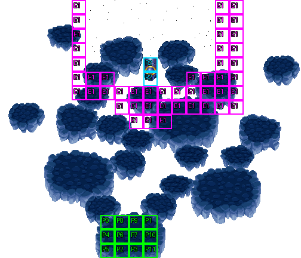

# 第 30 章　最終聖戰

<!-- chapter_docs:header -->
| 項目 | 內容 |
| --- | --- |
| 章號／章節索引 | 30／29 |
| 章名（文字區塊 `0x01`） | 最終聖戰 |
| 勝利條件（`0x02`） | 擊倒平衡之神 |
| 敗北條件（`0x03`） | 蘭迪斯死亡 |
| 戰場 | `MAP29.DAT`／`MAP29.COD`／`M29.DTL`，21×18 格，我方 slot 12 個，部署記錄 7 筆 |
| 文字區塊 | `FDETXT30.TXT`，54 條 |
| 進入處理（`0x60074`[29]） | `fdps_chapter_30_init`（`0x21610`） |
| 行動後檢查（`0x6028c`[29]） | `fdps_chapter_30_post_action`（`0x3ba50`） |
| 勝利處理（`0x60304`[29]） | `fdps_chapter_30_end`（`0x3ba80`） |
| 地圖資料呼叫的事件處理（`0x601c4`） | slot 47：`fdps_chapter_30_event_deploy_wave_4`（`0x39770`）（格子事件）、slot 48：`fdps_chapter_30_event_deploy_wave_2`（`0x39840`）（死亡腳本）、slot 49：`fdps_chapter_30_event_deploy_wave_3`（`0x398c0`）（死亡腳本） |
| 過場腳本 | `ICON29.DAT`（開場）、`GOODEND.DAT`（勝利）、`WIN29.DAT`（勝利） |
| 本章之前的村莊 | 無 |
| 光碟 | 第 2 片（音軌見 [CD 音軌](../program_info/cd_audio.md)） |



戰場全圖（第 0 層與同步捲動的圖層）。框線：黃 `C` 寶箱、橘 `B` 埋藏格、青 `R` 重繪格、洋紅 `E` 有處理函式的格子事件格，字母後的數字是事件碼；綠 `P` 是我方 slot 的起始格。

視差圖層另存一張：

圖由 `python tools/chapter_docs/chapter_facts.py render-maps` 從遊戲檔重畫到 `chapters/maps/`，`verify-maps` 逐 byte 比對版控中的圖。
<!-- /chapter_docs:header -->

## 概要

最後一戰。蘭迪斯一行站在一片浮島上，蘭迪斯要大家往前看（`0x09`）；地面連續震動，平衡之神的巨大身影在眾人頭頂忽隱忽現，最後現身（開場過場 `ICON29.DAT`）。平衡之神說自己能帶來永恆的和平、免於恐懼，質問人類為何要阻擋它復活；蘭迪斯回答那種要用人命不斷堆砌的和平只是另一副枷鎖，指出它雖是神卻並不完美，要它露出真面目（`0x0a`）。平衡之神大怒，要消滅這些「蟲類」，眾人準備戰鬥（`0x0b`、`0x0c`）。只要有人逼近它所在的區塊，珊與尤利安就會發現它召喚出打倒了還會再復活的不死生物（`0x08`）。

平衡之神有三個型態。第一型態倒下時，一個聲音呼喚蘭迪斯的名字——那是被困在怪物軀殼裡當宿主的瑪茜，蘭迪斯的母親；平衡之神驚呼「宿主的意識清醒了」。蘭迪斯這才知道當年拆散父母的就是它，喊著要它還來母親（`0x0f`、`0x10`；第二型態在這兩段對話之間就已原位現身），戰鬥繼續，第二型態再倒下時第三型態現身。

打倒第三型態後進入勝利過場 `WIN29.DAT`：平衡之神嘲笑自己是不死之身，瑪茜要孩子快逃（`0x11`）；隨後瑪茜在體內抓住它唯一的弱點，要把它一起拖回異界、關閉這裡，蘭迪斯挽留不及，母親道別而去（`0x12`）。場景換到地圖 63：索爾王邀蘭斯洛特與珊到王宮作客、琴琴跟裘娜走、布蘭多帶蓋亞回國、費塔加回西大陸、瑪麗安回家鄉、亞克帶著大教皇尤利安回家作客，夥伴們一一道別；最後剩下蘭迪斯與法蓮娜，法蓮娜為自己的謊言道歉，蘭迪斯決心找回母親，兩人約定再會，他說風會告訴她去哪裡找他（`FDETXT64` 的 `0x09`–`0x16`）。接著是片尾名單，每位夥伴一張後日談字幕（`0x20`–`0x2c`），停頓 30 秒後播 `GOODEND.DAT`：蘭迪斯與一群強盜對峙，夥伴們陸續趕到把強盜打倒，最後法蓮娜也來了，眾人一起再次出發（`FDETXT65` 的 `0x09`–`0x13`），遊戲結束。

## 加入與離隊

- 本章沒有人入隊或離隊，也沒有客串單位。名冊是第 1–24 章加入的 12 人，正好填滿 `MAP29` 的 12 個我方 slot，法蓮娜也在其中（開場過場沒有讓任何我方單位退場）。入隊的規則與表見 [`assets/characters.md` 的「加入」](../assets/characters.md#加入)。
- 本章只有在 [第 27 章](ch27.md) 走隱藏路線時才會到：`fdps_chapter_27_end`（`0x3b8f0`）要蘭迪斯帶著 [第 24 章](ch24.md) 的魔精石碎片、法蓮娜帶著 [第 23 章](ch23.md) 的反禁制器，缺一件就在第 27 章播結局並結束程式。
- 勝利處理不做陣亡者復活（見「處理流程」），但 `WIN29.DAT` 開頭會把 12 名我方單位全部復歸，過場裡每個人都在。

## 勝敗條件與特殊機制

- **敗北**：`fdps_chapter_30_post_action`（`0x3ba50`）只做一件事——單位 0 蘭迪斯退場就把結束碼寫成 1。它不呼叫共用判定，所以「敵人全滅」不是過關條件（援軍也清不完）。寫入不看目前的值：打倒第三型態的同一次行動裡蘭迪斯也倒下時，這裡的 1 會蓋掉死亡腳本剛寫的 2，結果是敗北。
- **過關**：畫面上的「擊倒平衡之神」指的是第三型態。三個型態是三筆部署記錄，前兩個的死亡腳本是 opcode 2（呼叫下一個型態的部署處理），第三型態的死亡腳本是 opcode 4、運算元 `0xff`：`fdps_run_death_scripts`（`0x1d990`）不畫文字、直接把結束碼寫成 2。這是本章戰鬥裡唯一會寫 2 的地方。
- **三段平衡之神**：都是 LV40、錨點 (10, 3)、AI 行為 11（法術優先），MV 0，一步都不會走。第一型態倒下時 `fdps_chapter_30_event_deploy_wave_2`（`0x39840`）畫 `0x0f`、換掉 (10, 4)、(10, 5) 兩格重繪格的圖（觸發旗標元素 2；地形類別仍是 6，不可通行）、原位部署第二型態、畫 `0x10`；第二型態倒下時 `fdps_chapter_30_event_deploy_wave_3`（`0x398c0`）不畫字，只原位部署第三型態。數值見 [`assets/enemies.md`](../assets/enemies.md)。
- **援軍觸發格**：平衡之神所在區塊的外圍有 46 個事件碼 1 的格（西側 x = 5 的 y 0–6、東側 x = 15–16 的 y 0–7 兩條縱列，加上南側 y 5–8 的橫帶，見「回合事件與格子事件」的表），觸發時機 0：任一單位移動中走進其中一格，就由 `fdps_chapter_30_event_deploy_wave_4`（`0x39770`）部署波次 4。攻略站說的「進入平衡之神攻擊範圍時」其實是這一圈固定的格。平衡之神不會移動，所以實際上一定是我方走進去。傳送術直接改寫座標（`src/spell.c`），不經逐格移動，落在這些格上不觸發。只觸發一次（借用觸發旗標元素 `0x10`）。
- **打不完的不死生物**：`fdps_chapter_30_revive_wave_4_undead`（`0x10760`）不在事件表裡，而是由 `fdps_map_actor_behavior_step`（`0x10010`）在肖像編號 `0x3c`–`0x3e` 的單位（三個型態的平衡之神）每次輪到行動、進入 AI 行為 11 時先呼叫。它把場上每個已退場的 `55` 白骨戰士與 `6A` 死靈救回：清掉整個狀態 byte、HP 補滿（MP 不補），放到離該種類固定錨點最近的空格——白骨戰士是 (5, 12)，死靈一律是 (15, 13)（連錨點本來在 (16, 13) 的那一隻也一樣）。同距離的空格有好幾個時取列優先掃描的**最後一個**。每救回一隻就移游標、全畫面白閃、在它身上播 `Posion.saf`。沒有次數限制，所以只要平衡之神還在行動，援軍就一直維持四隻；平衡之神的行為見 [`program_info/map_ai.md`](../program_info/map_ai.md)。
- **援軍的經驗值**：打倒不死生物照常有經驗。它們是陣營 0、LV20，死靈與白骨戰士的經驗倍率都是 30，走的是 [`assets/enemies.md`](../assets/enemies.md) 的一般擊殺經驗公式（基數 600 ÷ 攻擊者 LV；物理攻擊的攻擊者肖像編號大於 10、法術的施法者肖像編號大於 8 時，除數的 LV 先加 30）；`fdps_combat_compute_hit_outcome`（`0x19f80`）與 `fdps_unit_award_exp_and_level_up`（`0x1dd30`）都沒有依章節或肖像編號排除的分支，`fdps_chapter_30_revive_wave_4_undead`（`0x10760`）也只改座標、狀態 byte 與 HP，不動等級與陣營，所以復活後再打倒一樣給經驗。拿不到經驗的只有已到等級上限（40，蓋亞 99）的單位與用道具打倒的情形，這對所有敵人都一樣；攻略站「打了也沒經驗值」的說法與程式不符。
- 本章沒有回合限制、沒有保護對象，也沒有隱藏事件。

## 敵人配置

開場時場上只有第一型態平衡之神（波次 1，由開場過場部署）站在北方區塊中央的 (10, 3)，三個型態依序在同一格原位出現。四隻不死生物（波次 4，LV20、AI 0 主動出擊）在有人走進觸發格後出現，找最近的空格放置：兩隻白骨戰士在西南的 (5, 12) 附近，兩隻死靈在東南的 (15, 13)、(16, 13) 附近；之後被打倒就在平衡之神的下一次行動時復活。攻略站寫的「右下與左下各出現兩個」即此。

<!-- chapter_docs:deployments -->
陣營與死亡腳本的意義見 [`resource_info/map.md`](../resource_info/map.md)，AI 行為（低 4 bit）見 [`program_info/map_ai.md`](../program_info/map_ai.md#行為代碼)；錨點是 `MAPnn.COD` 的座標，開場波次放在錨點上，其餘波次依部署方式放在錨點或最近的空格。單位名是全域文字的「角色編號 + 1」條；角色編號 `3C` 以上的敵兵，數值（`ENEMYDAT.DAT`）與種族、職業見 [`assets/enemies.md`](../assets/enemies.md)，以下的見 [`assets/characters.md`](../assets/characters.md)。

我方起始格：slot 0 (7, 15)、slot 1 (10, 15)、slot 2 (8, 17)、slot 3 (9, 17)、slot 4 (7, 16)、slot 5 (7, 17)、slot 6 (8, 16)、slot 7 (9, 16)、slot 8 (8, 15)、slot 9 (9, 15)、slot 10 (10, 16)、slot 11 (10, 17)。

| 波次 | 陣營 | 單位 | 等級 | 數量 |
| ---: | --- | --- | --- | ---: |
| 1 | 敵方 | `3C` 平衡之神 | 40 | 1 |
| 2 | 敵方 | `3D` 平衡之神 | 40 | 1 |
| 3 | 敵方 | `3E` 平衡之神 | 40 | 1 |
| 4 | 敵方 | `55` 白骨戰士 | 20 | 2 |
| 4 | 敵方 | `6A` 死靈 | 20 | 2 |

### 波次 1

出場：開場過場：`fdps_chapter_30_init`（`0x21610`）播的 `ICON29.DAT` 在 `0x1b3` 先部署一次供演出用，`0xb78` 的 `SWITCH_MAP` 重設戰場後由 `0xb7a` 的 `DEPLOY_WAVE` 再部署，第一型態平衡之神放在錨點 (10, 3) 原位，這是戰鬥中留下的那一個

| # | 陣營 | 單位 | 等級 | AI 行為 | 錨點 | 死亡腳本 |
| ---: | --- | --- | ---: | --- | --- | --- |
| 0 | 敵方 | `3C` 平衡之神 | 40 | 11 法術優先 | (10, 3) | 事件 slot 48：`fdps_chapter_30_event_deploy_wave_2`（`0x39840`） |

### 波次 2

出場：第一型態平衡之神（記錄 0）被打倒時，死亡腳本 opcode 2 呼叫 slot 48 的 `fdps_chapter_30_event_deploy_wave_2`（`0x39840`），以原位放置部署在 (10, 3)

| # | 陣營 | 單位 | 等級 | AI 行為 | 錨點 | 死亡腳本 |
| ---: | --- | --- | ---: | --- | --- | --- |
| 1 | 敵方 | `3D` 平衡之神 | 40 | 11 法術優先 | (10, 3) | 事件 slot 49：`fdps_chapter_30_event_deploy_wave_3`（`0x398c0`） |

### 波次 3

出場：第二型態平衡之神（記錄 1）被打倒時，死亡腳本 opcode 2 呼叫 slot 49 的 `fdps_chapter_30_event_deploy_wave_3`（`0x398c0`），以原位放置部署在 (10, 3)

| # | 陣營 | 單位 | 等級 | AI 行為 | 錨點 | 死亡腳本 |
| ---: | --- | --- | ---: | --- | --- | --- |
| 2 | 敵方 | `3E` 平衡之神 | 40 | 11 法術優先 | (10, 3) | 不畫文字，之後過關 |

### 波次 4

出場：任一單位移動中走進 46 個事件碼 1 的格之一（平衡之神所在區塊外圍的 U 形一圈）時，slot 47 的 `fdps_chapter_30_event_deploy_wave_4`（`0x39770`）部署一次（旗標元素 `0x10` 擋住重複），找最近空格放在 (5, 12) 與 (15, 13)、(16, 13) 附近；之後由 `fdps_chapter_30_revive_wave_4_undead`（`0x10760`）反覆復活

| # | 陣營 | 單位 | 等級 | AI 行為 | 錨點 | 死亡腳本 |
| ---: | --- | --- | ---: | --- | --- | --- |
| 3 | 敵方 | `55` 白骨戰士 | 20 | 0 主動 | (5, 12) | — |
| 4 | 敵方 | `55` 白骨戰士 | 20 | 0 主動 | (5, 12) | — |
| 5 | 敵方 | `6A` 死靈 | 20 | 0 主動 | (15, 13) | — |
| 6 | 敵方 | `6A` 死靈 | 20 | 0 主動 | (16, 13) | — |
<!-- /chapter_docs:deployments -->

## 寶物

本章沒有任何處理函式或事件給物品，也沒有可以搜尋的格。

<!-- chapter_docs:treasure -->
本章地圖沒有寶箱或埋藏格。

沒有任何格引用、拿不到的記錄：記錄 0（種類 0、內容 `B9`）、記錄 1（種類 1、內容 `C2`）、記錄 2（種類 1、內容 `D4`）、記錄 3（種類 0、內容 `B9`），見 [I04](../cut_content/items.md#i04-章節地圖上沒有格子引用的寶物記錄)。

本章沒有擊倒掉落。
<!-- /chapter_docs:treasure -->

## 村莊

<!-- chapter_docs:village -->
第 29 章勝利後沒有村莊（`CHAPTER_HAS_NO_VILLAGE`，`src/village.c`），直接進存檔畫面再進本章。
<!-- /chapter_docs:village -->

## 處理流程

### `fdps_chapter_30_init`（`0x21610`）

1. `fdps_chapter_state_reset`（`0x22750`）：以名冊的 12 人填滿 12 個我方 slot。`MAP29` 沒有波次 0 的記錄，所以此時場上只有我方。
2. `fdps_icon_script_run`（`0x21650`）播 `ICON29.DAT`：畫 `0x09`，一連串畫面震動與地圖改寫之間，`0x1b3` 部署波次 1 並讓平衡之神反覆退場、復歸、放回 (10, 3)，畫 `0x0a`–`0x0c`。`0xb78` 的 `SWITCH_MAP` 切到同一張地圖 29，整個戰場重設一次，演出期間的單位與地圖改寫全部丟掉；`0xb7a` 再部署一次波次 1（原位 (10, 3)），`0xb7d` 把觸發旗標元素 0 設為 1 並套用重繪，北方區塊 (6–14, 0–5) 裡事件碼 0 的 46 格重繪格換圖（平衡之神所在的 (10, 3) 由地形類別 5 變成 6），接著全員轉向。重設在旗標之前，所以這個旗標留到戰鬥中。
3. `fdps_show_chapter_title_card`（`0x20c60`）顯示章名卡。
4. `fdps_map_cursor_move_to_unit`（`0x2da50`）把游標放在單位 0 蘭迪斯的起始格 (7, 15)。

### `fdps_chapter_30_post_action`（`0x3ba50`）

每次行動後執行：`fdps_unit_is_retired`（`0x109b0`）問單位 0，退場就把結束碼寫成 1。沒有其他內容，不呼叫 `fdps_battle_check_default_end_conditions`（`0x3a2e0`），也不寫 2。

### `fdps_chapter_30_event_deploy_wave_4`（`0x39770`）

slot 47，由 46 個事件碼 1 的格在單位走進時觸發：

1. 觸發旗標元素 `0x10` 已設就什麼都不做。
2. `fdps_deploy_wave`（`0x23830`）部署波次 4（兩隻白骨戰士、兩隻死靈），找最近空格放置。
3. 游標改成不畫，視野移到 (4, 14) 停 12 幀、再移到 (17, 14) 停 12 幀，讓玩家看到兩處援軍，游標恢復成一般框。
4. 畫 `0x08`（珊與尤利安提醒不死生物會復活）。
5. 設起旗標元素 `0x10`。

不看是哪個單位觸發，也不檢查部署有沒有部署到東西。

### `fdps_chapter_30_event_deploy_wave_2`（`0x39840`）

slot 48，第一型態平衡之神的死亡腳本呼叫它：

1. 畫 `0x0f`（瑪茜的呼喚）。
2. 觸發旗標元素 2 設為 1，`fdps_map_apply_triggered_cell_changes`（`0x2e910`）重繪 (10, 4)、(10, 5) 兩格。
3. `fdps_deploy_wave`（`0x23830`）部署波次 2（第二型態），原位放在 (10, 3)。
4. 畫 `0x10`（瑪茜表明身分、蘭迪斯要平衡之神還來母親）。

沒有旗標擋住重複執行；它只會跑一次，是因為死亡腳本在單位被打倒時只收集一次。

### `fdps_chapter_30_event_deploy_wave_3`（`0x398c0`）

slot 49，第二型態平衡之神的死亡腳本呼叫它：只以 `fdps_deploy_wave`（`0x23830`）部署波次 3（第三型態），原位放在 (10, 3)，不畫任何文字。

### `fdps_chapter_30_revive_wave_4_undead`（`0x10760`）

不經事件表，由 `fdps_map_actor_behavior_step`（`0x10010`）在平衡之神（肖像 `0x3c`–`0x3e`）每次進入 AI 行為 11 時先呼叫，然後平衡之神才照常評估法術與攻擊。對場上每個肖像是 `55` 或 `6A` 且已退場的單位：

1. 重建移動格的佔用標記（只標還在場的單位，所以它原本那一格也算空格）。
2. 從整張地圖找離該種類錨點（`55` 是 (5, 12)，`6A` 是 (15, 13)）曼哈頓距離最近、沒有人站、地形類別小於 5 的格；同距離取最後找到的一格。
3. 把單位座標設到那一格，游標移過去。
4. 調色盤從全白分 65 步淡回（每步 4 ms），`fdps_play_vfs_animation_over_units`（`0x26e00`）在它身上播 `Posion.saf`。
5. 狀態 byte 整個寫成 0、HP 設為上限。

沒有任何計數或旗標，所以每次平衡之神行動時，所有在那之前被打倒的不死生物都會回來。

### `fdps_chapter_30_end`（`0x3ba80`）

1. `fdps_battle_destroy_remaining_enemies`（`0x39e10`）清掉殘敵（仍在場的不死生物）。
2. `fdps_roster_write_back_battle_units`（`0x23980`）寫回名冊。
3. `fdps_icon_script_run`（`0x21650`）播 `WIN29.DAT`：復歸全員、畫 `0x11`、`0x12`，切到地圖 63 播道別，最後切回地圖 29。切回來是必要的：片尾名單靠章節索引等於 `0x1d` 才選本章的字幕，而本區塊也要重新載入才有那些字幕。
4. 強制打開地形資訊面板的選項與遊玩旗標（兩者都設為 1，不還原玩家原本的設定）。
5. `fdps_play_ending_credit_roll`（`0x1ba40`）片尾名單：對名冊 12 人各播一張戰鬥動畫與字幕 `0x20`–`0x2b`，再多播一張固定用角色 `0C` 索爾動畫、字幕 `0x2c` 的卡片。
6. `delay(30000)`：無條件等 30 秒，期間不讀輸入。
7. `fdps_icon_script_run`（`0x21650`）播 `GOODEND.DAT`（在地圖 64 上，文字讀 `FDETXT65`）。
8. 設起離場旗標，程式結束（見 [`program_info/chapter.md`](../program_info/chapter.md)）。

和其他 29 支結束處理不同，它不付費復活陣亡者，也不寫下一章的章節索引。

## 回合事件與格子事件

<!-- chapter_docs:events -->
觸發時機與陣營階段的意義見 [`resource_info/map.md`](../resource_info/map.md)。

本章沒有回合事件。

| 事件碼 | 格 | 觸發 | slot | 處理函式 |
| ---: | --- | --- | ---: | --- |
| 1 | (5, 0)、(15, 0)、(16, 0)、(5, 1)、(15, 1)、(16, 1)、(5, 2)、(15, 2)、(16, 2)、(5, 3)、(15, 3)、(16, 3)、(5, 4)、(15, 4)、(16, 4)、(5, 5)、(6, 5)、(7, 5)、(13, 5)、(14, 5)、(15, 5)、(16, 5)、(5, 6)、(6, 6)、(7, 6)、(8, 6)、(9, 6)、(10, 6)、(11, 6)、(12, 6)、(13, 6)、(14, 6)、(15, 6)、(16, 6)、(8, 7)、(9, 7)、(10, 7)、(11, 7)、(12, 7)、(13, 7)、(14, 7)、(15, 7)、(16, 7)、(9, 8)、(10, 8)、(11, 8) | 走進 | 47 | `fdps_chapter_30_event_deploy_wave_4`（`0x39770`） |

死亡腳本裡的事件與文字：

| # | 單位 | 波次 | 死亡腳本 |
| ---: | --- | ---: | --- |
| 0 | `3C` 平衡之神 | 1 | 事件 slot 48：`fdps_chapter_30_event_deploy_wave_2`（`0x39840`） |
| 1 | `3D` 平衡之神 | 2 | 事件 slot 49：`fdps_chapter_30_event_deploy_wave_3`（`0x398c0`） |
| 2 | `3E` 平衡之神 | 3 | 不畫文字，之後過關 |
<!-- /chapter_docs:events -->

## 過場腳本

`ICON29.DAT` 在 `SWITCH_MAP` 之前的部署、退場、復歸與地圖改寫都只是演出，戰鬥開始時的狀態只由 `0xb78` 的 `SWITCH_MAP` 與其後的 `DEPLOY_WAVE`、`TRIGGER_CELL_EVENT`、`FACE_UNITS` 這四條指令決定（見「處理流程」）。

<!-- chapter_docs:scripts -->
格式與每個指令的意義見 [`resource_info/cutscene_script.md`](../resource_info/cutscene_script.md)。`FDETXT30#0xNN` 是本章文字區塊的條目，全文在下方「對話」；切到額外場景之後顯示的文字直接列出（那些區塊的正典是 [`assets/text/scene_text.md`](../assets/text/scene_text.md)）。`u3=我方1` 是地圖單位索引 3 對到我方 slot 1，`u12=MAP02#9` 是 `MAP02.DAT` 第 9 筆部署記錄。

### `ICON29.DAT`

- 開場：`fdps_chapter_30_init`（`0x21610`）
- 2977 byte、479 步；起始地圖 29，切換地圖 29，結束於地圖 29

| 偏移 | 指令 | 內容 |
| ---: | --- | --- |
| `0000` | `FADE_OUT` | 淡出，每步 40 ms |
| `0002` | `SET_MUSIC` | 音樂 12（CD 第 13 軌） |
| `0004` | `SET_VIEW_TILE` | 視野直接設到格 (4, 10) |
| `0007` | `SET_MAP_CELL` | 地形層 0 格 (10, 4) = 0x0114 |
| `000c` | `SET_MAP_CELL` | 地形層 0 格 (10, 5) = 0x0114 |
| `0011` | `FACE_UNITS` | 轉向後停 1 幀：u0=我方0朝上、u1=我方1朝上、u2=我方2朝上、u3=我方3朝上、u4=我方4朝上、u5=我方5朝上、u6=我方6朝上、u7=我方7朝上、u8=我方8朝上、u9=我方9朝上、u10=我方10朝上、u11=我方11朝上 |
| `002c` | `FADE_IN` | 淡入，每步 40 ms |
| `002e` | `FACE_UNITS` | 轉向後停 15 幀：u0=我方0朝上、u1=我方1朝上、u2=我方2朝上、u3=我方3朝上、u4=我方4朝上、u5=我方5朝上、u6=我方6朝上、u7=我方7朝上、u8=我方8朝上、u9=我方9朝上、u10=我方10朝上、u11=我方11朝上 |
| `0049` | `DRAW_TEXT` | 顯示文字 FDETXT30#0x09 |
| `004b` | `SHAKE_VIEW` | 視野位移 8 步，每步 2 幀：(0,-3) (0,-6) (0,-9) (0,-12) (0,-15) (0,-18) (0,-21) (0,-24) |
| `005e` | `BIAS_PALETTE` | 調色盤偏移 R64 G64 B64 |
| `0062` | `FACE_UNITS` | 轉向後停 4 幀：u0=我方0朝上、u1=我方1朝上、u2=我方2朝上、u3=我方3朝上、u4=我方4朝上、u5=我方5朝上、u6=我方6朝上、u7=我方7朝上、u8=我方8朝上、u9=我方9朝上、u10=我方10朝上、u11=我方11朝上 |
| `007d` | `BIAS_PALETTE` | 調色盤偏移 R0 G0 B0 |
| `0081` | `SET_VIEW_TILE` | 視野直接設到格 (4, 9) |
| `0084` | `SHAKE_VIEW` | 視野位移 8 步，每步 2 幀：(0,-3) (0,-6) (0,-9) (0,-12) (0,-15) (0,-18) (0,-21) (0,-24) |
| `0097` | `BIAS_PALETTE` | 調色盤偏移 R64 G64 B64 |
| `009b` | `FACE_UNITS` | 轉向後停 4 幀：u0=我方0朝上、u1=我方1朝上、u2=我方2朝上、u3=我方3朝上、u4=我方4朝上、u5=我方5朝上、u6=我方6朝上、u7=我方7朝上、u8=我方8朝上、u9=我方9朝上、u10=我方10朝上、u11=我方11朝上 |
| `00b6` | `BIAS_PALETTE` | 調色盤偏移 R0 G0 B0 |
| `00ba` | `SET_VIEW_TILE` | 視野直接設到格 (4, 8) |
| `00bd` | `SHAKE_VIEW` | 視野位移 8 步，每步 2 幀：(0,-3) (0,-6) (0,-9) (0,-12) (0,-15) (0,-18) (0,-21) (0,-24) |
| `00d0` | `SET_VIEW_TILE` | 視野直接設到格 (4, 7) |
| `00d3` | `SHAKE_VIEW` | 視野位移 8 步，每步 2 幀：(0,-3) (0,-6) (0,-9) (0,-12) (0,-15) (0,-18) (0,-21) (0,-24) |
| `00e6` | `SET_VIEW_TILE` | 視野直接設到格 (4, 6) |
| `00e9` | `SHAKE_VIEW` | 視野位移 8 步，每步 2 幀：(0,-3) (0,-6) (0,-9) (0,-12) (0,-15) (0,-18) (0,-21) (0,-24) |
| `00fc` | `SET_VIEW_TILE` | 視野直接設到格 (4, 5) |
| `00ff` | `SHAKE_VIEW` | 視野位移 8 步，每步 2 幀：(0,-3) (0,-6) (0,-9) (0,-12) (0,-15) (0,-18) (0,-21) (0,-24) |
| `0112` | `SET_VIEW_TILE` | 視野直接設到格 (4, 4) |
| `0115` | `SHAKE_VIEW` | 視野位移 8 步，每步 2 幀：(0,-3) (0,-6) (0,-9) (0,-12) (0,-15) (0,-18) (0,-21) (0,-24) |
| `0128` | `BIAS_PALETTE` | 調色盤偏移 R64 G64 B64 |
| `012c` | `FACE_UNITS` | 轉向後停 4 幀：u0=我方0朝上、u1=我方1朝上、u2=我方2朝上、u3=我方3朝上、u4=我方4朝上、u5=我方5朝上、u6=我方6朝上、u7=我方7朝上、u8=我方8朝上、u9=我方9朝上、u10=我方10朝上、u11=我方11朝上 |
| `0147` | `BIAS_PALETTE` | 調色盤偏移 R0 G0 B0 |
| `014b` | `SET_VIEW_TILE` | 視野直接設到格 (4, 3) |
| `014e` | `SHAKE_VIEW` | 視野位移 8 步，每步 2 幀：(0,-3) (0,-6) (0,-9) (0,-12) (0,-15) (0,-18) (0,-21) (0,-24) |
| `0161` | `BIAS_PALETTE` | 調色盤偏移 R64 G64 B64 |
| `0165` | `FACE_UNITS` | 轉向後停 4 幀：u0=我方0朝上、u1=我方1朝上、u2=我方2朝上、u3=我方3朝上、u4=我方4朝上、u5=我方5朝上、u6=我方6朝上、u7=我方7朝上、u8=我方8朝上、u9=我方9朝上、u10=我方10朝上、u11=我方11朝上 |
| `0180` | `BIAS_PALETTE` | 調色盤偏移 R0 G0 B0 |
| `0184` | `SET_VIEW_TILE` | 視野直接設到格 (4, 2) |
| `0187` | `SHAKE_VIEW` | 視野位移 8 步，每步 2 幀：(0,-3) (0,-6) (0,-9) (0,-12) (0,-15) (0,-18) (0,-21) (0,-24) |
| `019a` | `SET_VIEW_TILE` | 視野直接設到格 (4, 1) |
| `019d` | `SHAKE_VIEW` | 視野位移 8 步，每步 2 幀：(0,-3) (0,-6) (0,-9) (0,-12) (0,-15) (0,-18) (0,-21) (0,-24) |
| `01b0` | `SET_VIEW_TILE` | 視野直接設到格 (4, 0) |
| `01b3` | `DEPLOY_WAVE` | 部署 MAP29 波次 1（錨點原位）：#0(角色0x3c) |
| `01b6` | `SET_MAP_CELL` | 地形層 0 格 (6, 0) = 0x00e8 |
| `01bb` | `SET_MAP_CELL` | 地形層 0 格 (7, 0) = 0x00e9 |
| `01c0` | `SET_MAP_CELL` | 地形層 0 格 (8, 0) = 0x00ea |
| `01c5` | `SET_MAP_CELL` | 地形層 0 格 (9, 0) = 0x00eb |
| `01ca` | `SET_MAP_CELL` | 地形層 0 格 (10, 0) = 0x00ec |
| `01cf` | `SET_MAP_CELL` | 地形層 0 格 (11, 0) = 0x00ed |
| `01d4` | `SET_MAP_CELL` | 地形層 0 格 (12, 0) = 0x00ee |
| `01d9` | `SET_MAP_CELL` | 地形層 0 格 (13, 0) = 0x00ef |
| `01de` | `SET_MAP_CELL` | 地形層 0 格 (14, 0) = 0x00f0 |
| `01e3` | `SET_MAP_CELL` | 地形層 0 格 (6, 1) = 0x00f1 |
| `01e8` | `SET_MAP_CELL` | 地形層 0 格 (7, 1) = 0x00f2 |
| `01ed` | `SET_MAP_CELL` | 地形層 0 格 (8, 1) = 0x00f3 |
| `01f2` | `SET_MAP_CELL` | 地形層 0 格 (9, 1) = 0x00f4 |
| `01f7` | `SET_MAP_CELL` | 地形層 0 格 (10, 1) = 0x00f5 |
| `01fc` | `SET_MAP_CELL` | 地形層 0 格 (11, 1) = 0x00f6 |
| `0201` | `SET_MAP_CELL` | 地形層 0 格 (12, 1) = 0x00f7 |
| `0206` | `SET_MAP_CELL` | 地形層 0 格 (13, 1) = 0x00f8 |
| `020b` | `SET_MAP_CELL` | 地形層 0 格 (14, 1) = 0x00f9 |
| `0210` | `SET_MAP_CELL` | 地形層 0 格 (6, 2) = 0x00fa |
| `0215` | `SET_MAP_CELL` | 地形層 0 格 (7, 2) = 0x00fb |
| `021a` | `SET_MAP_CELL` | 地形層 0 格 (8, 2) = 0x00fc |
| `021f` | `SET_MAP_CELL` | 地形層 0 格 (9, 2) = 0x00fd |
| `0224` | `SET_MAP_CELL` | 地形層 0 格 (10, 2) = 0x00fe |
| `0229` | `SET_MAP_CELL` | 地形層 0 格 (11, 2) = 0x00ff |
| `022e` | `SET_MAP_CELL` | 地形層 0 格 (12, 2) = 0x0100 |
| `0233` | `SET_MAP_CELL` | 地形層 0 格 (13, 2) = 0x0101 |
| `0238` | `SET_MAP_CELL` | 地形層 0 格 (14, 2) = 0x0102 |
| `023d` | `SET_MAP_CELL` | 地形層 0 格 (6, 3) = 0x0103 |
| `0242` | `SET_MAP_CELL` | 地形層 0 格 (7, 3) = 0x0104 |
| `0247` | `SET_MAP_CELL` | 地形層 0 格 (9, 3) = 0x0105 |
| `024c` | `SET_MAP_CELL` | 地形層 0 格 (10, 3) = 0x0106 |
| `0251` | `SET_MAP_CELL` | 地形層 0 格 (11, 3) = 0x0107 |
| `0256` | `SET_MAP_CELL` | 地形層 0 格 (13, 3) = 0x0108 |
| `025b` | `SET_MAP_CELL` | 地形層 0 格 (14, 3) = 0x0109 |
| `0260` | `SET_MAP_CELL` | 地形層 0 格 (6, 4) = 0x010a |
| `0265` | `SET_MAP_CELL` | 地形層 0 格 (7, 4) = 0x010b |
| `026a` | `SET_MAP_CELL` | 地形層 0 格 (9, 4) = 0x010c |
| `026f` | `SET_MAP_CELL` | 地形層 0 格 (10, 4) = 0x010d |
| `0274` | `SET_MAP_CELL` | 地形層 0 格 (11, 4) = 0x010e |
| `0279` | `SET_MAP_CELL` | 地形層 0 格 (13, 4) = 0x010f |
| `027e` | `SET_MAP_CELL` | 地形層 0 格 (14, 4) = 0x0110 |
| `0283` | `SET_MAP_CELL` | 地形層 0 格 (9, 5) = 0x0111 |
| `0288` | `SET_MAP_CELL` | 地形層 0 格 (10, 5) = 0x0112 |
| `028d` | `SET_MAP_CELL` | 地形層 0 格 (11, 5) = 0x0113 |
| `0292` | `FACE_UNITS` | 轉向後停 1 幀：u0=我方0朝上、u1=我方1朝上、u2=我方2朝上、u3=我方3朝上、u4=我方4朝上、u5=我方5朝上、u6=我方6朝上、u7=我方7朝上、u8=我方8朝上、u9=我方9朝上、u10=我方10朝上、u11=我方11朝上 |
| `02ad` | `RETIRE_UNIT` | 退場 u12=MAP29#0(角色0x3c) |
| `02af` | `SET_MAP_CELL` | 地形層 0 格 (6, 0) = 0x0000 |
| `02b4` | `SET_MAP_CELL` | 地形層 0 格 (7, 0) = 0x0000 |
| `02b9` | `SET_MAP_CELL` | 地形層 0 格 (8, 0) = 0x0000 |
| `02be` | `SET_MAP_CELL` | 地形層 0 格 (9, 0) = 0x0000 |
| `02c3` | `SET_MAP_CELL` | 地形層 0 格 (10, 0) = 0x0000 |
| `02c8` | `SET_MAP_CELL` | 地形層 0 格 (11, 0) = 0x0000 |
| `02cd` | `SET_MAP_CELL` | 地形層 0 格 (12, 0) = 0x0000 |
| `02d2` | `SET_MAP_CELL` | 地形層 0 格 (13, 0) = 0x0000 |
| `02d7` | `SET_MAP_CELL` | 地形層 0 格 (14, 0) = 0x0000 |
| `02dc` | `SET_MAP_CELL` | 地形層 0 格 (6, 1) = 0x0000 |
| `02e1` | `SET_MAP_CELL` | 地形層 0 格 (7, 1) = 0x0000 |
| `02e6` | `SET_MAP_CELL` | 地形層 0 格 (8, 1) = 0x0000 |
| `02eb` | `SET_MAP_CELL` | 地形層 0 格 (9, 1) = 0x0000 |
| `02f0` | `SET_MAP_CELL` | 地形層 0 格 (10, 1) = 0x0000 |
| `02f5` | `SET_MAP_CELL` | 地形層 0 格 (11, 1) = 0x0000 |
| `02fa` | `SET_MAP_CELL` | 地形層 0 格 (12, 1) = 0x0000 |
| `02ff` | `SET_MAP_CELL` | 地形層 0 格 (13, 1) = 0x0000 |
| `0304` | `SET_MAP_CELL` | 地形層 0 格 (14, 1) = 0x0000 |
| `0309` | `SET_MAP_CELL` | 地形層 0 格 (6, 2) = 0x0000 |
| `030e` | `SET_MAP_CELL` | 地形層 0 格 (7, 2) = 0x0007 |
| `0313` | `SET_MAP_CELL` | 地形層 0 格 (8, 2) = 0x0008 |
| `0318` | `SET_MAP_CELL` | 地形層 0 格 (9, 2) = 0x0009 |
| `031d` | `SET_MAP_CELL` | 地形層 0 格 (10, 2) = 0x0000 |
| `0322` | `SET_MAP_CELL` | 地形層 0 格 (11, 2) = 0x000a |
| `0327` | `SET_MAP_CELL` | 地形層 0 格 (12, 2) = 0x000b |
| `032c` | `SET_MAP_CELL` | 地形層 0 格 (13, 2) = 0x000c |
| `0331` | `SET_MAP_CELL` | 地形層 0 格 (14, 2) = 0x0000 |
| `0336` | `SET_MAP_CELL` | 地形層 0 格 (6, 3) = 0x0010 |
| `033b` | `SET_MAP_CELL` | 地形層 0 格 (7, 3) = 0x0011 |
| `0340` | `SET_MAP_CELL` | 地形層 0 格 (9, 3) = 0x0013 |
| `0345` | `SET_MAP_CELL` | 地形層 0 格 (10, 3) = 0x0000 |
| `034a` | `SET_MAP_CELL` | 地形層 0 格 (11, 3) = 0x0014 |
| `034f` | `SET_MAP_CELL` | 地形層 0 格 (13, 3) = 0x0016 |
| `0354` | `SET_MAP_CELL` | 地形層 0 格 (14, 3) = 0x0000 |
| `0359` | `SET_MAP_CELL` | 地形層 0 格 (6, 4) = 0x001b |
| `035e` | `SET_MAP_CELL` | 地形層 0 格 (7, 4) = 0x001c |
| `0363` | `SET_MAP_CELL` | 地形層 0 格 (9, 4) = 0x001e |
| `0368` | `SET_MAP_CELL` | 地形層 0 格 (10, 4) = 0x0000 |
| `036d` | `SET_MAP_CELL` | 地形層 0 格 (11, 4) = 0x001f |
| `0372` | `SET_MAP_CELL` | 地形層 0 格 (13, 4) = 0x0021 |
| `0377` | `SET_MAP_CELL` | 地形層 0 格 (14, 4) = 0x0022 |
| `037c` | `SET_MAP_CELL` | 地形層 0 格 (9, 5) = 0x002b |
| `0381` | `SET_MAP_CELL` | 地形層 0 格 (10, 5) = 0x0000 |
| `0386` | `SET_MAP_CELL` | 地形層 0 格 (11, 5) = 0x002c |
| `038b` | `FACE_UNITS` | 轉向後停 2 幀：u0=我方0朝上、u1=我方1朝上、u2=我方2朝上、u3=我方3朝上、u4=我方4朝上、u5=我方5朝上、u6=我方6朝上、u7=我方7朝上、u8=我方8朝上、u9=我方9朝上、u10=我方10朝上、u11=我方11朝上 |
| `03a6` | `REVIVE_UNIT` | 復歸 u12=MAP29#0(角色0x3c)（清狀態） |
| `03a8` | `PLACE_UNIT` | 放置 u12=MAP29#0(角色0x3c) 到 (10, 3)，朝下 |
| `03ad` | `SET_MAP_CELL` | 地形層 0 格 (6, 0) = 0x00e8 |
| `03b2` | `SET_MAP_CELL` | 地形層 0 格 (7, 0) = 0x00e9 |
| `03b7` | `SET_MAP_CELL` | 地形層 0 格 (8, 0) = 0x00ea |
| `03bc` | `SET_MAP_CELL` | 地形層 0 格 (9, 0) = 0x00eb |
| `03c1` | `SET_MAP_CELL` | 地形層 0 格 (10, 0) = 0x00ec |
| `03c6` | `SET_MAP_CELL` | 地形層 0 格 (11, 0) = 0x00ed |
| `03cb` | `SET_MAP_CELL` | 地形層 0 格 (12, 0) = 0x00ee |
| `03d0` | `SET_MAP_CELL` | 地形層 0 格 (13, 0) = 0x00ef |
| `03d5` | `SET_MAP_CELL` | 地形層 0 格 (14, 0) = 0x00f0 |
| `03da` | `SET_MAP_CELL` | 地形層 0 格 (6, 1) = 0x00f1 |
| `03df` | `SET_MAP_CELL` | 地形層 0 格 (7, 1) = 0x00f2 |
| `03e4` | `SET_MAP_CELL` | 地形層 0 格 (8, 1) = 0x00f3 |
| `03e9` | `SET_MAP_CELL` | 地形層 0 格 (9, 1) = 0x00f4 |
| `03ee` | `SET_MAP_CELL` | 地形層 0 格 (10, 1) = 0x00f5 |
| `03f3` | `SET_MAP_CELL` | 地形層 0 格 (11, 1) = 0x00f6 |
| `03f8` | `SET_MAP_CELL` | 地形層 0 格 (12, 1) = 0x00f7 |
| `03fd` | `SET_MAP_CELL` | 地形層 0 格 (13, 1) = 0x00f8 |
| `0402` | `SET_MAP_CELL` | 地形層 0 格 (14, 1) = 0x00f9 |
| `0407` | `SET_MAP_CELL` | 地形層 0 格 (6, 2) = 0x00fa |
| `040c` | `SET_MAP_CELL` | 地形層 0 格 (7, 2) = 0x00fb |
| `0411` | `SET_MAP_CELL` | 地形層 0 格 (8, 2) = 0x00fc |
| `0416` | `SET_MAP_CELL` | 地形層 0 格 (9, 2) = 0x00fd |
| `041b` | `SET_MAP_CELL` | 地形層 0 格 (10, 2) = 0x00fe |
| `0420` | `SET_MAP_CELL` | 地形層 0 格 (11, 2) = 0x00ff |
| `0425` | `SET_MAP_CELL` | 地形層 0 格 (12, 2) = 0x0100 |
| `042a` | `SET_MAP_CELL` | 地形層 0 格 (13, 2) = 0x0101 |
| `042f` | `SET_MAP_CELL` | 地形層 0 格 (14, 2) = 0x0102 |
| `0434` | `SET_MAP_CELL` | 地形層 0 格 (6, 3) = 0x0103 |
| `0439` | `SET_MAP_CELL` | 地形層 0 格 (7, 3) = 0x0104 |
| `043e` | `SET_MAP_CELL` | 地形層 0 格 (9, 3) = 0x0105 |
| `0443` | `SET_MAP_CELL` | 地形層 0 格 (10, 3) = 0x0106 |
| `0448` | `SET_MAP_CELL` | 地形層 0 格 (11, 3) = 0x0107 |
| `044d` | `SET_MAP_CELL` | 地形層 0 格 (13, 3) = 0x0108 |
| `0452` | `SET_MAP_CELL` | 地形層 0 格 (14, 3) = 0x0109 |
| `0457` | `SET_MAP_CELL` | 地形層 0 格 (6, 4) = 0x010a |
| `045c` | `SET_MAP_CELL` | 地形層 0 格 (7, 4) = 0x010b |
| `0461` | `SET_MAP_CELL` | 地形層 0 格 (9, 4) = 0x010c |
| `0466` | `SET_MAP_CELL` | 地形層 0 格 (10, 4) = 0x010d |
| `046b` | `SET_MAP_CELL` | 地形層 0 格 (11, 4) = 0x010e |
| `0470` | `SET_MAP_CELL` | 地形層 0 格 (13, 4) = 0x010f |
| `0475` | `SET_MAP_CELL` | 地形層 0 格 (14, 4) = 0x0110 |
| `047a` | `SET_MAP_CELL` | 地形層 0 格 (9, 5) = 0x0111 |
| `047f` | `SET_MAP_CELL` | 地形層 0 格 (10, 5) = 0x0112 |
| `0484` | `SET_MAP_CELL` | 地形層 0 格 (11, 5) = 0x0113 |
| `0489` | `FACE_UNITS` | 轉向後停 3 幀：u0=我方0朝上、u1=我方1朝上、u2=我方2朝上、u3=我方3朝上、u4=我方4朝上、u5=我方5朝上、u6=我方6朝上、u7=我方7朝上、u8=我方8朝上、u9=我方9朝上、u10=我方10朝上、u11=我方11朝上 |
| `04a4` | `RETIRE_UNIT` | 退場 u12=MAP29#0(角色0x3c) |
| `04a6` | `SET_MAP_CELL` | 地形層 0 格 (6, 0) = 0x0000 |
| `04ab` | `SET_MAP_CELL` | 地形層 0 格 (7, 0) = 0x0000 |
| `04b0` | `SET_MAP_CELL` | 地形層 0 格 (8, 0) = 0x0000 |
| `04b5` | `SET_MAP_CELL` | 地形層 0 格 (9, 0) = 0x0000 |
| `04ba` | `SET_MAP_CELL` | 地形層 0 格 (10, 0) = 0x0000 |
| `04bf` | `SET_MAP_CELL` | 地形層 0 格 (11, 0) = 0x0000 |
| `04c4` | `SET_MAP_CELL` | 地形層 0 格 (12, 0) = 0x0000 |
| `04c9` | `SET_MAP_CELL` | 地形層 0 格 (13, 0) = 0x0000 |
| `04ce` | `SET_MAP_CELL` | 地形層 0 格 (14, 0) = 0x0000 |
| `04d3` | `SET_MAP_CELL` | 地形層 0 格 (6, 1) = 0x0000 |
| `04d8` | `SET_MAP_CELL` | 地形層 0 格 (7, 1) = 0x0000 |
| `04dd` | `SET_MAP_CELL` | 地形層 0 格 (8, 1) = 0x0000 |
| `04e2` | `SET_MAP_CELL` | 地形層 0 格 (9, 1) = 0x0000 |
| `04e7` | `SET_MAP_CELL` | 地形層 0 格 (10, 1) = 0x0000 |
| `04ec` | `SET_MAP_CELL` | 地形層 0 格 (11, 1) = 0x0000 |
| `04f1` | `SET_MAP_CELL` | 地形層 0 格 (12, 1) = 0x0000 |
| `04f6` | `SET_MAP_CELL` | 地形層 0 格 (13, 1) = 0x0000 |
| `04fb` | `SET_MAP_CELL` | 地形層 0 格 (14, 1) = 0x0000 |
| `0500` | `SET_MAP_CELL` | 地形層 0 格 (6, 2) = 0x0000 |
| `0505` | `SET_MAP_CELL` | 地形層 0 格 (7, 2) = 0x0007 |
| `050a` | `SET_MAP_CELL` | 地形層 0 格 (8, 2) = 0x0008 |
| `050f` | `SET_MAP_CELL` | 地形層 0 格 (9, 2) = 0x0009 |
| `0514` | `SET_MAP_CELL` | 地形層 0 格 (10, 2) = 0x0000 |
| `0519` | `SET_MAP_CELL` | 地形層 0 格 (11, 2) = 0x000a |
| `051e` | `SET_MAP_CELL` | 地形層 0 格 (12, 2) = 0x000b |
| `0523` | `SET_MAP_CELL` | 地形層 0 格 (13, 2) = 0x000c |
| `0528` | `SET_MAP_CELL` | 地形層 0 格 (14, 2) = 0x0000 |
| `052d` | `SET_MAP_CELL` | 地形層 0 格 (6, 3) = 0x0010 |
| `0532` | `SET_MAP_CELL` | 地形層 0 格 (7, 3) = 0x0011 |
| `0537` | `SET_MAP_CELL` | 地形層 0 格 (9, 3) = 0x0013 |
| `053c` | `SET_MAP_CELL` | 地形層 0 格 (10, 3) = 0x0000 |
| `0541` | `SET_MAP_CELL` | 地形層 0 格 (11, 3) = 0x0014 |
| `0546` | `SET_MAP_CELL` | 地形層 0 格 (13, 3) = 0x0016 |
| `054b` | `SET_MAP_CELL` | 地形層 0 格 (14, 3) = 0x0000 |
| `0550` | `SET_MAP_CELL` | 地形層 0 格 (6, 4) = 0x001b |
| `0555` | `SET_MAP_CELL` | 地形層 0 格 (7, 4) = 0x001c |
| `055a` | `SET_MAP_CELL` | 地形層 0 格 (9, 4) = 0x001e |
| `055f` | `SET_MAP_CELL` | 地形層 0 格 (10, 4) = 0x0000 |
| `0564` | `SET_MAP_CELL` | 地形層 0 格 (11, 4) = 0x001f |
| `0569` | `SET_MAP_CELL` | 地形層 0 格 (13, 4) = 0x0021 |
| `056e` | `SET_MAP_CELL` | 地形層 0 格 (14, 4) = 0x0022 |
| `0573` | `SET_MAP_CELL` | 地形層 0 格 (9, 5) = 0x002b |
| `0578` | `SET_MAP_CELL` | 地形層 0 格 (10, 5) = 0x0000 |
| `057d` | `SET_MAP_CELL` | 地形層 0 格 (11, 5) = 0x002c |
| `0582` | `FACE_UNITS` | 轉向後停 4 幀：u0=我方0朝上、u1=我方1朝上、u2=我方2朝上、u3=我方3朝上、u4=我方4朝上、u5=我方5朝上、u6=我方6朝上、u7=我方7朝上、u8=我方8朝上、u9=我方9朝上、u10=我方10朝上、u11=我方11朝上 |
| `059d` | `REVIVE_UNIT` | 復歸 u12=MAP29#0(角色0x3c)（清狀態） |
| `059f` | `PLACE_UNIT` | 放置 u12=MAP29#0(角色0x3c) 到 (10, 3)，朝下 |
| `05a4` | `SET_MAP_CELL` | 地形層 0 格 (6, 0) = 0x00e8 |
| `05a9` | `SET_MAP_CELL` | 地形層 0 格 (7, 0) = 0x00e9 |
| `05ae` | `SET_MAP_CELL` | 地形層 0 格 (8, 0) = 0x00ea |
| `05b3` | `SET_MAP_CELL` | 地形層 0 格 (9, 0) = 0x00eb |
| `05b8` | `SET_MAP_CELL` | 地形層 0 格 (10, 0) = 0x00ec |
| `05bd` | `SET_MAP_CELL` | 地形層 0 格 (11, 0) = 0x00ed |
| `05c2` | `SET_MAP_CELL` | 地形層 0 格 (12, 0) = 0x00ee |
| `05c7` | `SET_MAP_CELL` | 地形層 0 格 (13, 0) = 0x00ef |
| `05cc` | `SET_MAP_CELL` | 地形層 0 格 (14, 0) = 0x00f0 |
| `05d1` | `SET_MAP_CELL` | 地形層 0 格 (6, 1) = 0x00f1 |
| `05d6` | `SET_MAP_CELL` | 地形層 0 格 (7, 1) = 0x00f2 |
| `05db` | `SET_MAP_CELL` | 地形層 0 格 (8, 1) = 0x00f3 |
| `05e0` | `SET_MAP_CELL` | 地形層 0 格 (9, 1) = 0x00f4 |
| `05e5` | `SET_MAP_CELL` | 地形層 0 格 (10, 1) = 0x00f5 |
| `05ea` | `SET_MAP_CELL` | 地形層 0 格 (11, 1) = 0x00f6 |
| `05ef` | `SET_MAP_CELL` | 地形層 0 格 (12, 1) = 0x00f7 |
| `05f4` | `SET_MAP_CELL` | 地形層 0 格 (13, 1) = 0x00f8 |
| `05f9` | `SET_MAP_CELL` | 地形層 0 格 (14, 1) = 0x00f9 |
| `05fe` | `SET_MAP_CELL` | 地形層 0 格 (6, 2) = 0x00fa |
| `0603` | `SET_MAP_CELL` | 地形層 0 格 (7, 2) = 0x00fb |
| `0608` | `SET_MAP_CELL` | 地形層 0 格 (8, 2) = 0x00fc |
| `060d` | `SET_MAP_CELL` | 地形層 0 格 (9, 2) = 0x00fd |
| `0612` | `SET_MAP_CELL` | 地形層 0 格 (10, 2) = 0x00fe |
| `0617` | `SET_MAP_CELL` | 地形層 0 格 (11, 2) = 0x00ff |
| `061c` | `SET_MAP_CELL` | 地形層 0 格 (12, 2) = 0x0100 |
| `0621` | `SET_MAP_CELL` | 地形層 0 格 (13, 2) = 0x0101 |
| `0626` | `SET_MAP_CELL` | 地形層 0 格 (14, 2) = 0x0102 |
| `062b` | `SET_MAP_CELL` | 地形層 0 格 (6, 3) = 0x0103 |
| `0630` | `SET_MAP_CELL` | 地形層 0 格 (7, 3) = 0x0104 |
| `0635` | `SET_MAP_CELL` | 地形層 0 格 (9, 3) = 0x0105 |
| `063a` | `SET_MAP_CELL` | 地形層 0 格 (10, 3) = 0x0106 |
| `063f` | `SET_MAP_CELL` | 地形層 0 格 (11, 3) = 0x0107 |
| `0644` | `SET_MAP_CELL` | 地形層 0 格 (13, 3) = 0x0108 |
| `0649` | `SET_MAP_CELL` | 地形層 0 格 (14, 3) = 0x0109 |
| `064e` | `SET_MAP_CELL` | 地形層 0 格 (6, 4) = 0x010a |
| `0653` | `SET_MAP_CELL` | 地形層 0 格 (7, 4) = 0x010b |
| `0658` | `SET_MAP_CELL` | 地形層 0 格 (9, 4) = 0x010c |
| `065d` | `SET_MAP_CELL` | 地形層 0 格 (10, 4) = 0x010d |
| `0662` | `SET_MAP_CELL` | 地形層 0 格 (11, 4) = 0x010e |
| `0667` | `SET_MAP_CELL` | 地形層 0 格 (13, 4) = 0x010f |
| `066c` | `SET_MAP_CELL` | 地形層 0 格 (14, 4) = 0x0110 |
| `0671` | `SET_MAP_CELL` | 地形層 0 格 (9, 5) = 0x0111 |
| `0676` | `SET_MAP_CELL` | 地形層 0 格 (10, 5) = 0x0112 |
| `067b` | `SET_MAP_CELL` | 地形層 0 格 (11, 5) = 0x0113 |
| `0680` | `FACE_UNITS` | 轉向後停 5 幀：u0=我方0朝上、u1=我方1朝上、u2=我方2朝上、u3=我方3朝上、u4=我方4朝上、u5=我方5朝上、u6=我方6朝上、u7=我方7朝上、u8=我方8朝上、u9=我方9朝上、u10=我方10朝上、u11=我方11朝上 |
| `069b` | `RETIRE_UNIT` | 退場 u12=MAP29#0(角色0x3c) |
| `069d` | `SET_MAP_CELL` | 地形層 0 格 (6, 0) = 0x0000 |
| `06a2` | `SET_MAP_CELL` | 地形層 0 格 (7, 0) = 0x0000 |
| `06a7` | `SET_MAP_CELL` | 地形層 0 格 (8, 0) = 0x0000 |
| `06ac` | `SET_MAP_CELL` | 地形層 0 格 (9, 0) = 0x0000 |
| `06b1` | `SET_MAP_CELL` | 地形層 0 格 (10, 0) = 0x0000 |
| `06b6` | `SET_MAP_CELL` | 地形層 0 格 (11, 0) = 0x0000 |
| `06bb` | `SET_MAP_CELL` | 地形層 0 格 (12, 0) = 0x0000 |
| `06c0` | `SET_MAP_CELL` | 地形層 0 格 (13, 0) = 0x0000 |
| `06c5` | `SET_MAP_CELL` | 地形層 0 格 (14, 0) = 0x0000 |
| `06ca` | `SET_MAP_CELL` | 地形層 0 格 (6, 1) = 0x0000 |
| `06cf` | `SET_MAP_CELL` | 地形層 0 格 (7, 1) = 0x0000 |
| `06d4` | `SET_MAP_CELL` | 地形層 0 格 (8, 1) = 0x0000 |
| `06d9` | `SET_MAP_CELL` | 地形層 0 格 (9, 1) = 0x0000 |
| `06de` | `SET_MAP_CELL` | 地形層 0 格 (10, 1) = 0x0000 |
| `06e3` | `SET_MAP_CELL` | 地形層 0 格 (11, 1) = 0x0000 |
| `06e8` | `SET_MAP_CELL` | 地形層 0 格 (12, 1) = 0x0000 |
| `06ed` | `SET_MAP_CELL` | 地形層 0 格 (13, 1) = 0x0000 |
| `06f2` | `SET_MAP_CELL` | 地形層 0 格 (14, 1) = 0x0000 |
| `06f7` | `SET_MAP_CELL` | 地形層 0 格 (6, 2) = 0x0000 |
| `06fc` | `SET_MAP_CELL` | 地形層 0 格 (7, 2) = 0x0007 |
| `0701` | `SET_MAP_CELL` | 地形層 0 格 (8, 2) = 0x0008 |
| `0706` | `SET_MAP_CELL` | 地形層 0 格 (9, 2) = 0x0009 |
| `070b` | `SET_MAP_CELL` | 地形層 0 格 (10, 2) = 0x0000 |
| `0710` | `SET_MAP_CELL` | 地形層 0 格 (11, 2) = 0x000a |
| `0715` | `SET_MAP_CELL` | 地形層 0 格 (12, 2) = 0x000b |
| `071a` | `SET_MAP_CELL` | 地形層 0 格 (13, 2) = 0x000c |
| `071f` | `SET_MAP_CELL` | 地形層 0 格 (14, 2) = 0x0000 |
| `0724` | `SET_MAP_CELL` | 地形層 0 格 (6, 3) = 0x0010 |
| `0729` | `SET_MAP_CELL` | 地形層 0 格 (7, 3) = 0x0011 |
| `072e` | `SET_MAP_CELL` | 地形層 0 格 (9, 3) = 0x0013 |
| `0733` | `SET_MAP_CELL` | 地形層 0 格 (10, 3) = 0x0000 |
| `0738` | `SET_MAP_CELL` | 地形層 0 格 (11, 3) = 0x0014 |
| `073d` | `SET_MAP_CELL` | 地形層 0 格 (13, 3) = 0x0016 |
| `0742` | `SET_MAP_CELL` | 地形層 0 格 (14, 3) = 0x0000 |
| `0747` | `SET_MAP_CELL` | 地形層 0 格 (6, 4) = 0x001b |
| `074c` | `SET_MAP_CELL` | 地形層 0 格 (7, 4) = 0x001c |
| `0751` | `SET_MAP_CELL` | 地形層 0 格 (9, 4) = 0x001e |
| `0756` | `SET_MAP_CELL` | 地形層 0 格 (10, 4) = 0x0000 |
| `075b` | `SET_MAP_CELL` | 地形層 0 格 (11, 4) = 0x001f |
| `0760` | `SET_MAP_CELL` | 地形層 0 格 (13, 4) = 0x0021 |
| `0765` | `SET_MAP_CELL` | 地形層 0 格 (14, 4) = 0x0022 |
| `076a` | `SET_MAP_CELL` | 地形層 0 格 (9, 5) = 0x002b |
| `076f` | `SET_MAP_CELL` | 地形層 0 格 (10, 5) = 0x0000 |
| `0774` | `SET_MAP_CELL` | 地形層 0 格 (11, 5) = 0x002c |
| `0779` | `FACE_UNITS` | 轉向後停 7 幀：u0=我方0朝上、u1=我方1朝上、u2=我方2朝上、u3=我方3朝上、u4=我方4朝上、u5=我方5朝上、u6=我方6朝上、u7=我方7朝上、u8=我方8朝上、u9=我方9朝上、u10=我方10朝上、u11=我方11朝上 |
| `0794` | `REVIVE_UNIT` | 復歸 u12=MAP29#0(角色0x3c)（清狀態） |
| `0796` | `PLACE_UNIT` | 放置 u12=MAP29#0(角色0x3c) 到 (10, 3)，朝下 |
| `079b` | `SET_MAP_CELL` | 地形層 0 格 (6, 0) = 0x00e8 |
| `07a0` | `SET_MAP_CELL` | 地形層 0 格 (7, 0) = 0x00e9 |
| `07a5` | `SET_MAP_CELL` | 地形層 0 格 (8, 0) = 0x00ea |
| `07aa` | `SET_MAP_CELL` | 地形層 0 格 (9, 0) = 0x00eb |
| `07af` | `SET_MAP_CELL` | 地形層 0 格 (10, 0) = 0x00ec |
| `07b4` | `SET_MAP_CELL` | 地形層 0 格 (11, 0) = 0x00ed |
| `07b9` | `SET_MAP_CELL` | 地形層 0 格 (12, 0) = 0x00ee |
| `07be` | `SET_MAP_CELL` | 地形層 0 格 (13, 0) = 0x00ef |
| `07c3` | `SET_MAP_CELL` | 地形層 0 格 (14, 0) = 0x00f0 |
| `07c8` | `SET_MAP_CELL` | 地形層 0 格 (6, 1) = 0x00f1 |
| `07cd` | `SET_MAP_CELL` | 地形層 0 格 (7, 1) = 0x00f2 |
| `07d2` | `SET_MAP_CELL` | 地形層 0 格 (8, 1) = 0x00f3 |
| `07d7` | `SET_MAP_CELL` | 地形層 0 格 (9, 1) = 0x00f4 |
| `07dc` | `SET_MAP_CELL` | 地形層 0 格 (10, 1) = 0x00f5 |
| `07e1` | `SET_MAP_CELL` | 地形層 0 格 (11, 1) = 0x00f6 |
| `07e6` | `SET_MAP_CELL` | 地形層 0 格 (12, 1) = 0x00f7 |
| `07eb` | `SET_MAP_CELL` | 地形層 0 格 (13, 1) = 0x00f8 |
| `07f0` | `SET_MAP_CELL` | 地形層 0 格 (14, 1) = 0x00f9 |
| `07f5` | `SET_MAP_CELL` | 地形層 0 格 (6, 2) = 0x00fa |
| `07fa` | `SET_MAP_CELL` | 地形層 0 格 (7, 2) = 0x00fb |
| `07ff` | `SET_MAP_CELL` | 地形層 0 格 (8, 2) = 0x00fc |
| `0804` | `SET_MAP_CELL` | 地形層 0 格 (9, 2) = 0x00fd |
| `0809` | `SET_MAP_CELL` | 地形層 0 格 (10, 2) = 0x00fe |
| `080e` | `SET_MAP_CELL` | 地形層 0 格 (11, 2) = 0x00ff |
| `0813` | `SET_MAP_CELL` | 地形層 0 格 (12, 2) = 0x0100 |
| `0818` | `SET_MAP_CELL` | 地形層 0 格 (13, 2) = 0x0101 |
| `081d` | `SET_MAP_CELL` | 地形層 0 格 (14, 2) = 0x0102 |
| `0822` | `SET_MAP_CELL` | 地形層 0 格 (6, 3) = 0x0103 |
| `0827` | `SET_MAP_CELL` | 地形層 0 格 (7, 3) = 0x0104 |
| `082c` | `SET_MAP_CELL` | 地形層 0 格 (9, 3) = 0x0105 |
| `0831` | `SET_MAP_CELL` | 地形層 0 格 (10, 3) = 0x0106 |
| `0836` | `SET_MAP_CELL` | 地形層 0 格 (11, 3) = 0x0107 |
| `083b` | `SET_MAP_CELL` | 地形層 0 格 (13, 3) = 0x0108 |
| `0840` | `SET_MAP_CELL` | 地形層 0 格 (14, 3) = 0x0109 |
| `0845` | `SET_MAP_CELL` | 地形層 0 格 (6, 4) = 0x010a |
| `084a` | `SET_MAP_CELL` | 地形層 0 格 (7, 4) = 0x010b |
| `084f` | `SET_MAP_CELL` | 地形層 0 格 (9, 4) = 0x010c |
| `0854` | `SET_MAP_CELL` | 地形層 0 格 (10, 4) = 0x010d |
| `0859` | `SET_MAP_CELL` | 地形層 0 格 (11, 4) = 0x010e |
| `085e` | `SET_MAP_CELL` | 地形層 0 格 (13, 4) = 0x010f |
| `0863` | `SET_MAP_CELL` | 地形層 0 格 (14, 4) = 0x0110 |
| `0868` | `SET_MAP_CELL` | 地形層 0 格 (9, 5) = 0x0111 |
| `086d` | `SET_MAP_CELL` | 地形層 0 格 (10, 5) = 0x0112 |
| `0872` | `SET_MAP_CELL` | 地形層 0 格 (11, 5) = 0x0113 |
| `0877` | `FACE_UNITS` | 轉向後停 9 幀：u0=我方0朝上、u1=我方1朝上、u2=我方2朝上、u3=我方3朝上、u4=我方4朝上、u5=我方5朝上、u6=我方6朝上、u7=我方7朝上、u8=我方8朝上、u9=我方9朝上、u10=我方10朝上、u11=我方11朝上 |
| `0892` | `RETIRE_UNIT` | 退場 u12=MAP29#0(角色0x3c) |
| `0894` | `SET_MAP_CELL` | 地形層 0 格 (6, 0) = 0x0000 |
| `0899` | `SET_MAP_CELL` | 地形層 0 格 (7, 0) = 0x0000 |
| `089e` | `SET_MAP_CELL` | 地形層 0 格 (8, 0) = 0x0000 |
| `08a3` | `SET_MAP_CELL` | 地形層 0 格 (9, 0) = 0x0000 |
| `08a8` | `SET_MAP_CELL` | 地形層 0 格 (10, 0) = 0x0000 |
| `08ad` | `SET_MAP_CELL` | 地形層 0 格 (11, 0) = 0x0000 |
| `08b2` | `SET_MAP_CELL` | 地形層 0 格 (12, 0) = 0x0000 |
| `08b7` | `SET_MAP_CELL` | 地形層 0 格 (13, 0) = 0x0000 |
| `08bc` | `SET_MAP_CELL` | 地形層 0 格 (14, 0) = 0x0000 |
| `08c1` | `SET_MAP_CELL` | 地形層 0 格 (6, 1) = 0x0000 |
| `08c6` | `SET_MAP_CELL` | 地形層 0 格 (7, 1) = 0x0000 |
| `08cb` | `SET_MAP_CELL` | 地形層 0 格 (8, 1) = 0x0000 |
| `08d0` | `SET_MAP_CELL` | 地形層 0 格 (9, 1) = 0x0000 |
| `08d5` | `SET_MAP_CELL` | 地形層 0 格 (10, 1) = 0x0000 |
| `08da` | `SET_MAP_CELL` | 地形層 0 格 (11, 1) = 0x0000 |
| `08df` | `SET_MAP_CELL` | 地形層 0 格 (12, 1) = 0x0000 |
| `08e4` | `SET_MAP_CELL` | 地形層 0 格 (13, 1) = 0x0000 |
| `08e9` | `SET_MAP_CELL` | 地形層 0 格 (14, 1) = 0x0000 |
| `08ee` | `SET_MAP_CELL` | 地形層 0 格 (6, 2) = 0x0000 |
| `08f3` | `SET_MAP_CELL` | 地形層 0 格 (7, 2) = 0x0007 |
| `08f8` | `SET_MAP_CELL` | 地形層 0 格 (8, 2) = 0x0008 |
| `08fd` | `SET_MAP_CELL` | 地形層 0 格 (9, 2) = 0x0009 |
| `0902` | `SET_MAP_CELL` | 地形層 0 格 (10, 2) = 0x0000 |
| `0907` | `SET_MAP_CELL` | 地形層 0 格 (11, 2) = 0x000a |
| `090c` | `SET_MAP_CELL` | 地形層 0 格 (12, 2) = 0x000b |
| `0911` | `SET_MAP_CELL` | 地形層 0 格 (13, 2) = 0x000c |
| `0916` | `SET_MAP_CELL` | 地形層 0 格 (14, 2) = 0x0000 |
| `091b` | `SET_MAP_CELL` | 地形層 0 格 (6, 3) = 0x0010 |
| `0920` | `SET_MAP_CELL` | 地形層 0 格 (7, 3) = 0x0011 |
| `0925` | `SET_MAP_CELL` | 地形層 0 格 (9, 3) = 0x0013 |
| `092a` | `SET_MAP_CELL` | 地形層 0 格 (10, 3) = 0x0000 |
| `092f` | `SET_MAP_CELL` | 地形層 0 格 (11, 3) = 0x0014 |
| `0934` | `SET_MAP_CELL` | 地形層 0 格 (13, 3) = 0x0016 |
| `0939` | `SET_MAP_CELL` | 地形層 0 格 (14, 3) = 0x0000 |
| `093e` | `SET_MAP_CELL` | 地形層 0 格 (6, 4) = 0x001b |
| `0943` | `SET_MAP_CELL` | 地形層 0 格 (7, 4) = 0x001c |
| `0948` | `SET_MAP_CELL` | 地形層 0 格 (9, 4) = 0x001e |
| `094d` | `SET_MAP_CELL` | 地形層 0 格 (10, 4) = 0x0000 |
| `0952` | `SET_MAP_CELL` | 地形層 0 格 (11, 4) = 0x001f |
| `0957` | `SET_MAP_CELL` | 地形層 0 格 (13, 4) = 0x0021 |
| `095c` | `SET_MAP_CELL` | 地形層 0 格 (14, 4) = 0x0022 |
| `0961` | `SET_MAP_CELL` | 地形層 0 格 (9, 5) = 0x002b |
| `0966` | `SET_MAP_CELL` | 地形層 0 格 (10, 5) = 0x0000 |
| `096b` | `SET_MAP_CELL` | 地形層 0 格 (11, 5) = 0x002c |
| `0970` | `FACE_UNITS` | 轉向後停 11 幀：u0=我方0朝上、u1=我方1朝上、u2=我方2朝上、u3=我方3朝上、u4=我方4朝上、u5=我方5朝上、u6=我方6朝上、u7=我方7朝上、u8=我方8朝上、u9=我方9朝上、u10=我方10朝上、u11=我方11朝上 |
| `098b` | `REVIVE_UNIT` | 復歸 u12=MAP29#0(角色0x3c)（清狀態） |
| `098d` | `PLACE_UNIT` | 放置 u12=MAP29#0(角色0x3c) 到 (10, 3)，朝下 |
| `0992` | `SET_MAP_CELL` | 地形層 0 格 (6, 0) = 0x00e8 |
| `0997` | `SET_MAP_CELL` | 地形層 0 格 (7, 0) = 0x00e9 |
| `099c` | `SET_MAP_CELL` | 地形層 0 格 (8, 0) = 0x00ea |
| `09a1` | `SET_MAP_CELL` | 地形層 0 格 (9, 0) = 0x00eb |
| `09a6` | `SET_MAP_CELL` | 地形層 0 格 (10, 0) = 0x00ec |
| `09ab` | `SET_MAP_CELL` | 地形層 0 格 (11, 0) = 0x00ed |
| `09b0` | `SET_MAP_CELL` | 地形層 0 格 (12, 0) = 0x00ee |
| `09b5` | `SET_MAP_CELL` | 地形層 0 格 (13, 0) = 0x00ef |
| `09ba` | `SET_MAP_CELL` | 地形層 0 格 (14, 0) = 0x00f0 |
| `09bf` | `SET_MAP_CELL` | 地形層 0 格 (6, 1) = 0x00f1 |
| `09c4` | `SET_MAP_CELL` | 地形層 0 格 (7, 1) = 0x00f2 |
| `09c9` | `SET_MAP_CELL` | 地形層 0 格 (8, 1) = 0x00f3 |
| `09ce` | `SET_MAP_CELL` | 地形層 0 格 (9, 1) = 0x00f4 |
| `09d3` | `SET_MAP_CELL` | 地形層 0 格 (10, 1) = 0x00f5 |
| `09d8` | `SET_MAP_CELL` | 地形層 0 格 (11, 1) = 0x00f6 |
| `09dd` | `SET_MAP_CELL` | 地形層 0 格 (12, 1) = 0x00f7 |
| `09e2` | `SET_MAP_CELL` | 地形層 0 格 (13, 1) = 0x00f8 |
| `09e7` | `SET_MAP_CELL` | 地形層 0 格 (14, 1) = 0x00f9 |
| `09ec` | `SET_MAP_CELL` | 地形層 0 格 (6, 2) = 0x00fa |
| `09f1` | `SET_MAP_CELL` | 地形層 0 格 (7, 2) = 0x00fb |
| `09f6` | `SET_MAP_CELL` | 地形層 0 格 (8, 2) = 0x00fc |
| `09fb` | `SET_MAP_CELL` | 地形層 0 格 (9, 2) = 0x00fd |
| `0a00` | `SET_MAP_CELL` | 地形層 0 格 (10, 2) = 0x00fe |
| `0a05` | `SET_MAP_CELL` | 地形層 0 格 (11, 2) = 0x00ff |
| `0a0a` | `SET_MAP_CELL` | 地形層 0 格 (12, 2) = 0x0100 |
| `0a0f` | `SET_MAP_CELL` | 地形層 0 格 (13, 2) = 0x0101 |
| `0a14` | `SET_MAP_CELL` | 地形層 0 格 (14, 2) = 0x0102 |
| `0a19` | `SET_MAP_CELL` | 地形層 0 格 (6, 3) = 0x0103 |
| `0a1e` | `SET_MAP_CELL` | 地形層 0 格 (7, 3) = 0x0104 |
| `0a23` | `SET_MAP_CELL` | 地形層 0 格 (9, 3) = 0x0105 |
| `0a28` | `SET_MAP_CELL` | 地形層 0 格 (10, 3) = 0x0106 |
| `0a2d` | `SET_MAP_CELL` | 地形層 0 格 (11, 3) = 0x0107 |
| `0a32` | `SET_MAP_CELL` | 地形層 0 格 (13, 3) = 0x0108 |
| `0a37` | `SET_MAP_CELL` | 地形層 0 格 (14, 3) = 0x0109 |
| `0a3c` | `SET_MAP_CELL` | 地形層 0 格 (6, 4) = 0x010a |
| `0a41` | `SET_MAP_CELL` | 地形層 0 格 (7, 4) = 0x010b |
| `0a46` | `SET_MAP_CELL` | 地形層 0 格 (9, 4) = 0x010c |
| `0a4b` | `SET_MAP_CELL` | 地形層 0 格 (10, 4) = 0x010d |
| `0a50` | `SET_MAP_CELL` | 地形層 0 格 (11, 4) = 0x010e |
| `0a55` | `SET_MAP_CELL` | 地形層 0 格 (13, 4) = 0x010f |
| `0a5a` | `SET_MAP_CELL` | 地形層 0 格 (14, 4) = 0x0110 |
| `0a5f` | `SET_MAP_CELL` | 地形層 0 格 (9, 5) = 0x0111 |
| `0a64` | `SET_MAP_CELL` | 地形層 0 格 (10, 5) = 0x0112 |
| `0a69` | `SET_MAP_CELL` | 地形層 0 格 (11, 5) = 0x0113 |
| `0a6e` | `FACE_UNITS` | 轉向後停 13 幀：u0=我方0朝上、u1=我方1朝上、u2=我方2朝上、u3=我方3朝上、u4=我方4朝上、u5=我方5朝上、u6=我方6朝上、u7=我方7朝上、u8=我方8朝上、u9=我方9朝上、u10=我方10朝上、u11=我方11朝上 |
| `0a89` | `DRAW_TEXT` | 顯示文字 FDETXT30#0x0a |
| `0a8b` | `SHAKE_VIEW` | 視野位移 32 步，每步 1 幀：(1,0) (1,-1) (0,-1) (0,0) (-1,0) (-1,1) (0,1) (0,0) (1,0) (1,-1) (0,-1) (0,0) (-1,0) (-1,1) (0,1) (0,0) (1,0) (1,-1) (0,-1) (0,0) (-1,0) (-1,1) (0,1) (0,0) (1,0) (1,-1) (0,-1) (0,0) (-1,0) (-1,1) (0,1) (0,0) |
| `0ace` | `DRAW_TEXT` | 顯示文字 FDETXT30#0x0b |
| `0ad0` | `BIAS_PALETTE` | 調色盤偏移 R64 G64 B64 |
| `0ad4` | `FACE_UNITS` | 轉向後停 6 幀：u0=我方0朝上、u1=我方1朝上、u2=我方2朝上、u3=我方3朝上、u4=我方4朝上、u5=我方5朝上、u6=我方6朝上、u7=我方7朝上、u8=我方8朝上、u9=我方9朝上、u10=我方10朝上、u11=我方11朝上 |
| `0aef` | `BIAS_PALETTE` | 調色盤偏移 R0 G0 B0 |
| `0af3` | `FACE_UNITS` | 轉向後停 8 幀：u0=我方0朝上、u1=我方1朝上、u2=我方2朝上、u3=我方3朝上、u4=我方4朝上、u5=我方5朝上、u6=我方6朝上、u7=我方7朝上、u8=我方8朝上、u9=我方9朝上、u10=我方10朝上、u11=我方11朝上 |
| `0b0e` | `BIAS_PALETTE` | 調色盤偏移 R64 G64 B64 |
| `0b12` | `FACE_UNITS` | 轉向後停 4 幀：u0=我方0朝上、u1=我方1朝上、u2=我方2朝上、u3=我方3朝上、u4=我方4朝上、u5=我方5朝上、u6=我方6朝上、u7=我方7朝上、u8=我方8朝上、u9=我方9朝上、u10=我方10朝上、u11=我方11朝上 |
| `0b2d` | `BIAS_PALETTE` | 調色盤偏移 R0 G0 B0 |
| `0b31` | `SHAKE_VIEW` | 視野位移 32 步，每步 1 幀：(1,0) (1,-1) (0,-1) (0,0) (-1,0) (-1,1) (0,1) (0,0) (1,0) (1,-1) (0,-1) (0,0) (-1,0) (-1,1) (0,1) (0,0) (1,0) (1,-1) (0,-1) (0,0) (-1,0) (-1,1) (0,1) (0,0) (1,0) (1,-1) (0,-1) (0,0) (-1,0) (-1,1) (0,1) (0,0) |
| `0b74` | `DRAW_TEXT` | 顯示文字 FDETXT30#0x0c |
| `0b76` | `FADE_OUT` | 淡出，每步 10 ms |
| `0b78` | `SWITCH_MAP` | 切換地圖 → 29（MAP29，文字 FDETXT30） |
| `0b7a` | `DEPLOY_WAVE` | 部署 MAP29 波次 1（錨點原位）：#0(角色0x3c) |
| `0b7d` | `TRIGGER_CELL_EVENT` | 格子事件旗標 [0] = 1，套用地圖變化 |
| `0b80` | `SET_VIEW_TILE` | 視野直接設到格 (4, 10) |
| `0b83` | `FACE_UNITS` | 轉向後停 1 幀：u0=我方0朝上、u1=我方1朝上、u2=我方2朝上、u3=我方3朝上、u4=我方4朝上、u5=我方5朝上、u6=我方6朝上、u7=我方7朝上、u8=我方8朝上、u9=我方9朝上、u10=我方10朝上、u11=我方11朝上 |
| `0b9e` | `FADE_IN` | 淡入，每步 10 ms |
| `0ba0` | `END` | 結束 |

### `GOODEND.DAT`

- 勝利：`fdps_chapter_30_end`（`0x3ba80`）
- 接在 `WIN29.DAT` 之後播放，起始地圖沿用它的結束地圖
- 525 byte、95 步；起始地圖 29，切換地圖 64，結束於地圖 64

| 偏移 | 指令 | 內容 |
| ---: | --- | --- |
| `0000` | `FADE_OUT` | 淡出，每步 20 ms |
| `0002` | `SWITCH_MAP` | 切換地圖 → 64（MAP64，文字 FDETXT65） |
| `0004` | `DEPLOY_WAVE` | 部署 MAP64 波次 1（錨點原位）：#7(角色0x08)、#8(角色0x09) |
| `0007` | `DEPLOY_WAVE` | 部署 MAP64 波次 2（錨點原位）：#9(角色0x07) |
| `000a` | `DEPLOY_WAVE` | 部署 MAP64 波次 3（錨點原位）：#10(角色0x04) |
| `000d` | `DEPLOY_WAVE` | 部署 MAP64 波次 4（錨點原位）：#11(角色0x03) |
| `0010` | `DEPLOY_WAVE` | 部署 MAP64 波次 5（錨點原位）：#12(角色0x05) |
| `0013` | `DEPLOY_WAVE` | 部署 MAP64 波次 6（錨點原位）：#13(角色0x02) |
| `0016` | `DEPLOY_WAVE` | 部署 MAP64 波次 7（錨點原位）：#14(角色0x06)、#15(角色0x01) |
| `0019` | `PLACE_UNIT` | 放置 u0=MAP64#0(角色0x00) 到 (10, 4)，朝下 |
| `001e` | `PLACE_UNIT` | 放置 u1=MAP64#1(角色0x4d) 到 (5, 4)，朝下 |
| `0023` | `PLACE_UNIT` | 放置 u2=MAP64#2(角色0x4d) 到 (7, 4)，朝下 |
| `0028` | `PLACE_UNIT` | 放置 u3=MAP64#3(角色0x51) 到 (9, 4)，朝下 |
| `002d` | `PLACE_UNIT` | 放置 u4=MAP64#4(角色0x51) 到 (12, 4)，朝下 |
| `0032` | `PLACE_UNIT` | 放置 u5=MAP64#5(角色0x5d) 到 (14, 4)，朝下 |
| `0037` | `PLACE_UNIT` | 放置 u6=MAP64#6(角色0x5d) 到 (18, 8)，朝左 |
| `003c` | `PLACE_UNIT` | 放置 u7=MAP64#7(角色0x08) 到 (4, 4)，朝下 |
| `0041` | `PLACE_UNIT` | 放置 u8=MAP64#8(角色0x09) 到 (5, 4)，朝下 |
| `0046` | `PLACE_UNIT` | 放置 u9=MAP64#9(角色0x07) 到 (7, 4)，朝下 |
| `004b` | `PLACE_UNIT` | 放置 u10=MAP64#10(角色0x04) 到 (9, 4)，朝下 |
| `0050` | `PLACE_UNIT` | 放置 u11=MAP64#11(角色0x03) 到 (12, 4)，朝下 |
| `0055` | `PLACE_UNIT` | 放置 u12=MAP64#12(角色0x05) 到 (15, 4)，朝下 |
| `005a` | `PLACE_UNIT` | 放置 u13=MAP64#13(角色0x02) 到 (19, 7)，朝左 |
| `005f` | `PLACE_UNIT` | 放置 u14=MAP64#14(角色0x06) 到 (7, 14)，朝上 |
| `0064` | `PLACE_UNIT` | 放置 u15=MAP64#15(角色0x01) 到 (12, 14)，朝上 |
| `0069` | `SCROLL_VIEW` | 捲動視野到格 (4, 5) |
| `006c` | `FADE_IN` | 淡入，每步 200 ms |
| `006e` | `WALK_UNITS` | 行走 1 格，每步 1 幀：u0=MAP64#0(角色0x00)往下 |
| `0074` | `WALK_UNITS` | 行走 1 格，每步 1 幀：u0=MAP64#0(角色0x00)往下、u1=MAP64#1(角色0x4d)往下 |
| `007c` | `WALK_UNITS` | 行走 1 格，每步 1 幀：u0=MAP64#0(角色0x00)往下、u1=MAP64#1(角色0x4d)往下、u2=MAP64#2(角色0x4d)往下 |
| `0086` | `WALK_UNITS` | 行走 2 格，每步 1 幀：u0=MAP64#0(角色0x00)往下、u1=MAP64#1(角色0x4d)往下、u2=MAP64#2(角色0x4d)往下、u3=MAP64#3(角色0x51)往下、u4=MAP64#4(角色0x51)往下、u5=MAP64#5(角色0x5d)往下 |
| `0096` | `FACE_UNITS` | 轉向後停 25 幀：u0=MAP64#0(角色0x00)朝上 |
| `009b` | `WALK_UNITS` | 行走 4 格，每步 1 幀：u6=MAP64#6(角色0x5d)往左 |
| `00a1` | `FACE_UNITS` | 轉向後停 12 幀：u0=MAP64#0(角色0x00)朝右 |
| `00a6` | `DRAW_TEXT` | 顯示文字 FDETXT65#0x09 「{speaker char=81}可惡的小子！{br}你竟敢壞了我們的事！{br}你以為你跑得掉嗎？{br}{speaker char=0}你們這些強盜，{br}到處為非作歹，{br}我早想將你除去了！{br}{speaker char=81}哈哈哈！是嗎？{br}你確信你打得贏我們？{br}大家一起上！」 |
| `00a8` | `FACE_UNITS` | 轉向後停 12 幀：u0=MAP64#0(角色0x00)朝上 |
| `00ad` | `WALK_UNITS` | 行走 4 格，每步 1 幀：u14=MAP64#14(角色0x06)往上 |
| `00b3` | `DRAW_TEXT` | 顯示文字 FDETXT65#0x0a 「{speaker char=6}神呀！{br}總算讓我趕上了！」 |
| `00b5` | `FACE_UNITS` | 轉向後停 12 幀：u0=MAP64#0(角色0x00)朝下 |
| `00ba` | `WALK_UNITS` | 行走 1 格，每步 1 幀：u10=MAP64#10(角色0x04)往下 |
| `00c0` | `RETIRE_UNIT` | 退場 u3=MAP64#3(角色0x51) |
| `00c2` | `PLAY_SAF` | 播放動畫 ICON0044.SAF |
| `00c4` | `DRAW_TEXT` | 顯示文字 FDETXT65#0x0b 「{speaker char=4}一個也別讓他們逃跑！」 |
| `00c6` | `FACE_UNITS` | 轉向後停 12 幀：u0=MAP64#0(角色0x00)朝上 |
| `00cb` | `WALK_UNITS` | 行走 1 格，每步 1 幀：u11=MAP64#11(角色0x03)往下 |
| `00d1` | `RETIRE_UNIT` | 退場 u4=MAP64#4(角色0x51) |
| `00d3` | `PLAY_SAF` | 播放動畫 ICON0045.SAF |
| `00d5` | `DRAW_TEXT` | 顯示文字 FDETXT65#0x0c 「{speaker char=3}哈哈哈！這種貨色！{br}再來幾個，{br}結果也是一樣！」 |
| `00d7` | `WALK_UNITS` | 行走 4 格，每步 1 幀：u7=MAP64#7(角色0x08)往下 |
| `00dd` | `FACE_UNITS` | 轉向後停 1 幀：u7=MAP64#7(角色0x08)朝右、u1=MAP64#1(角色0x4d)朝左 |
| `00e4` | `WALK_UNITS` | 行走 2 格，每步 1 幀：u8=MAP64#8(角色0x09)往下 |
| `00ea` | `FACE_UNITS` | 轉向後停 6 幀：u7=MAP64#7(角色0x08)朝上 |
| `00ef` | `DRAW_TEXT` | 顯示文字 FDETXT65#0x0d 「{speaker char=8}快呀！{br}再不快點，{br}敵人就要溜了！{br}{speaker char=9}嗶﹒﹒﹒」 |
| `00f1` | `FACE_UNITS` | 轉向後停 1 幀：u7=MAP64#7(角色0x08)朝右 |
| `00f6` | `WALK_UNITS` | 行走 1 格，每步 1 幀：u8=MAP64#8(角色0x09)往下 |
| `00fc` | `RETIRE_UNIT` | 退場 u1=MAP64#1(角色0x4d) |
| `00fe` | `PLAY_SAF` | 播放動畫 ICON0042.SAF |
| `0100` | `WALK_UNITS` | 行走 1 格，每步 1 幀：u12=MAP64#12(角色0x05)往下 |
| `0106` | `FACE_UNITS` | 轉向後停 6 幀：u5=MAP64#5(角色0x5d)朝上、u6=MAP64#6(角色0x5d)朝上 |
| `010d` | `RETIRE_UNIT` | 退場 u5=MAP64#5(角色0x5d) |
| `010f` | `PLAY_SAF` | 播放動畫 ICON0046.SAF |
| `0111` | `DRAW_TEXT` | 顯示文字 FDETXT65#0x0e 「{speaker char=5}有膽就來吃我一箭！{br}嘻嘻！」 |
| `0113` | `WALK_UNITS` | 行走 2 格，每步 1 幀：u9=MAP64#9(角色0x07)往下 |
| `0119` | `RETIRE_UNIT` | 退場 u2=MAP64#2(角色0x4d) |
| `011b` | `PLAY_SAF` | 播放動畫 ICON0043.SAF |
| `011d` | `FACE_UNITS` | 轉向後停 12 幀：u6=MAP64#6(角色0x5d)朝左 |
| `0122` | `RETIRE_UNIT` | 退場 u6=MAP64#6(角色0x5d) |
| `0124` | `PLAY_SAF` | 播放動畫 ICON0047.SAF |
| `0126` | `FACE_UNITS` | 轉向後停 1 幀：u0=MAP64#0(角色0x00)朝右、u14=MAP64#14(角色0x06)朝右、u10=MAP64#10(角色0x04)朝右、u11=MAP64#11(角色0x03)朝右、u7=MAP64#7(角色0x08)朝右、u8=MAP64#8(角色0x09)朝右、u9=MAP64#9(角色0x07)朝右、u12=MAP64#12(角色0x05)朝下 |
| `0139` | `WALK_UNITS` | 行走 3 格，每步 4 幀：u13=MAP64#13(角色0x02)往左 |
| `013f` | `DRAW_TEXT` | 顯示文字 FDETXT65#0x0f 「{speaker char=2}真是太危險了！{br}凡事要考慮清楚！{br}不要太衝動。」 |
| `0141` | `FACE_UNITS` | 轉向後停 6 幀：u0=MAP64#0(角色0x00)朝上、u14=MAP64#14(角色0x06)朝上、u10=MAP64#10(角色0x04)朝下、u11=MAP64#11(角色0x03)朝下、u7=MAP64#7(角色0x08)朝下、u8=MAP64#8(角色0x09)朝下、u9=MAP64#9(角色0x07)朝下、u12=MAP64#12(角色0x05)朝下 |
| `0154` | `DRAW_TEXT` | 顯示文字 FDETXT65#0x10 「{speaker char=7}嗨！大哥哥！{br}你看看是誰來了～！」 |
| `0156` | `FACE_UNITS` | 轉向後停 1 幀：u0=MAP64#0(角色0x00)朝下、u14=MAP64#14(角色0x06)朝右、u10=MAP64#10(角色0x04)朝下、u11=MAP64#11(角色0x03)朝下、u7=MAP64#7(角色0x08)朝右、u8=MAP64#8(角色0x09)朝下、u9=MAP64#9(角色0x07)朝下、u13=MAP64#13(角色0x02)朝下 |
| `0169` | `WALK_UNITS` | 行走 3 格，每步 4 幀：u15=MAP64#15(角色0x01)往上 |
| `016f` | `WALK_UNITS` | 行走 2 格，每步 1 幀：u0=MAP64#0(角色0x00)往右 |
| `0175` | `WALK_UNITS` | 行走 1 格，每步 1 幀：u0=MAP64#0(角色0x00)往下 |
| `017b` | `FACE_UNITS` | 轉向後停 75 幀：u0=MAP64#0(角色0x00)朝下 |
| `0180` | `FACE_UNITS` | 轉向後停 12 幀：u0=MAP64#0(角色0x00)朝上 |
| `0185` | `DRAW_TEXT` | 顯示文字 FDETXT65#0x11 「{speaker char=0}﹒﹒﹒﹒你們？！{br}﹒﹒法蓮娜？！{br}{speaker char=1}﹒﹒﹒﹒﹒﹒」 |
| `0187` | `WALK_UNITS` | 行走 2 格，每步 2 幀：u12=MAP64#12(角色0x05)往左、u13=MAP64#13(角色0x02)往左、u10=MAP64#10(角色0x04)往右、u9=MAP64#9(角色0x07)往右、u7=MAP64#7(角色0x08)往右、u8=MAP64#8(角色0x09)往右、u14=MAP64#14(角色0x06)往右 |
| `0199` | `WALK_UNITS` | 行走 1 格，每步 2 幀：u12=MAP64#12(角色0x05)往下、u13=MAP64#13(角色0x02)往下、u11=MAP64#11(角色0x03)往下、u10=MAP64#10(角色0x04)往下、u9=MAP64#9(角色0x07)往下、u7=MAP64#7(角色0x08)往下、u8=MAP64#8(角色0x09)往下、u14=MAP64#14(角色0x06)往右 |
| `01ad` | `WALK_UNITS` | 行走 2 格，每步 2 幀：u12=MAP64#12(角色0x05)往下、u11=MAP64#11(角色0x03)往下、u10=MAP64#10(角色0x04)往下、u9=MAP64#9(角色0x07)往下、u7=MAP64#7(角色0x08)往右、u8=MAP64#8(角色0x09)往右 |
| `01bd` | `WALK_UNITS` | 行走 1 格，每步 2 幀：u12=MAP64#12(角色0x05)往下、u9=MAP64#9(角色0x07)往右、u7=MAP64#7(角色0x08)往右、u8=MAP64#8(角色0x09)往右、u13=MAP64#13(角色0x02)往左 |
| `01cb` | `WALK_UNITS` | 行走 1 格，每步 2 幀：u12=MAP64#12(角色0x05)往下、u13=MAP64#13(角色0x02)往下、u9=MAP64#9(角色0x07)往右、u7=MAP64#7(角色0x08)往下、u8=MAP64#8(角色0x09)往下 |
| `01d9` | `WALK_UNITS` | 行走 1 格，每步 2 幀：u9=MAP64#9(角色0x07)往右 |
| `01df` | `FACE_UNITS` | 轉向後停 50 幀：u14=MAP64#14(角色0x06)朝右、u10=MAP64#10(角色0x04)朝下、u11=MAP64#11(角色0x03)朝下、u13=MAP64#13(角色0x02)朝下、u7=MAP64#7(角色0x08)朝右、u8=MAP64#8(角色0x09)朝右、u9=MAP64#9(角色0x07)朝下、u12=MAP64#12(角色0x05)朝左 |
| `01f2` | `FACE_UNITS` | 轉向後停 25 幀：u0=MAP64#0(角色0x00)朝左 |
| `01f7` | `DRAW_TEXT` | 顯示文字 FDETXT65#0x12 「{speaker char=6}前面路途還很遠，{br}我們要去哪裡？{page}蘭迪斯，下決定吧！{br}{speaker char=0}你們大家﹒﹒﹒﹒」 |
| `01f9` | `FACE_UNITS` | 轉向後停 50 幀：u0=MAP64#0(角色0x00)朝下 |
| `01fe` | `FACE_UNITS` | 轉向後停 50 幀：u0=MAP64#0(角色0x00)朝上 |
| `0203` | `DRAW_TEXT` | 顯示文字 FDETXT65#0x13 「{speaker char=0}喔～！{br}我們出發吧～！」 |
| `0205` | `FACE_UNITS` | 轉向後停 50 幀：u0=MAP64#0(角色0x00)朝上 |
| `020a` | `FADE_OUT` | 淡出，每步 200 ms |
| `020c` | `END` | 結束 |

### `WIN29.DAT`

- 勝利：`fdps_chapter_30_end`（`0x3ba80`）
- 2204 byte、397 步；起始地圖 29，切換地圖 63 → 29，結束於地圖 29

| 偏移 | 指令 | 內容 |
| ---: | --- | --- |
| `0000` | `FADE_OUT` | 淡出，每步 20 ms |
| `0002` | `SET_MUSIC` | 音樂 13（CD 第 14 軌） |
| `0004` | `SET_VIEW_TILE` | 視野直接設到格 (4, 3) |
| `0007` | `REVIVE_UNIT` | 復歸 u0=我方0（清狀態） |
| `0009` | `REVIVE_UNIT` | 復歸 u1=我方1（清狀態） |
| `000b` | `REVIVE_UNIT` | 復歸 u2=我方2（清狀態） |
| `000d` | `REVIVE_UNIT` | 復歸 u3=我方3（清狀態） |
| `000f` | `REVIVE_UNIT` | 復歸 u4=我方4（清狀態） |
| `0011` | `REVIVE_UNIT` | 復歸 u5=我方5（清狀態） |
| `0013` | `REVIVE_UNIT` | 復歸 u6=我方6（清狀態） |
| `0015` | `REVIVE_UNIT` | 復歸 u7=我方7（清狀態） |
| `0017` | `REVIVE_UNIT` | 復歸 u8=我方8（清狀態） |
| `0019` | `REVIVE_UNIT` | 復歸 u9=我方9（清狀態） |
| `001b` | `REVIVE_UNIT` | 復歸 u10=我方10（清狀態） |
| `001d` | `REVIVE_UNIT` | 復歸 u11=我方11（清狀態） |
| `001f` | `REVIVE_UNIT` | 復歸 u18（清狀態） |
| `0021` | `PLACE_UNIT` | 放置 u19 到 (10, 3)，朝下 |
| `0026` | `PLACE_UNIT` | 放置 u0=我方0 到 (10, 6)，朝上 |
| `002b` | `PLACE_UNIT` | 放置 u1=我方1 到 (9, 6)，朝上 |
| `0030` | `PLACE_UNIT` | 放置 u2=我方2 到 (9, 7)，朝上 |
| `0035` | `PLACE_UNIT` | 放置 u3=我方3 到 (11, 7)，朝上 |
| `003a` | `PLACE_UNIT` | 放置 u4=我方4 到 (12, 5)，朝上 |
| `003f` | `PLACE_UNIT` | 放置 u5=我方5 到 (12, 4)，朝上 |
| `0044` | `PLACE_UNIT` | 放置 u6=我方6 到 (13, 5)，朝上 |
| `0049` | `PLACE_UNIT` | 放置 u7=我方7 到 (12, 7)，朝上 |
| `004e` | `PLACE_UNIT` | 放置 u8=我方8 到 (6, 6)，朝上 |
| `0053` | `PLACE_UNIT` | 放置 u9=我方9 到 (8, 4)，朝上 |
| `0058` | `PLACE_UNIT` | 放置 u10=我方10 到 (7, 3)，朝上 |
| `005d` | `PLACE_UNIT` | 放置 u11=我方11 到 (7, 4)，朝上 |
| `0062` | `FACE_UNITS` | 轉向後停 1 幀：u0=我方0朝上 |
| `0067` | `SET_MAP_CELL` | 地形層 0 格 (6, 0) = 0x00e8 |
| `006c` | `SET_MAP_CELL` | 地形層 0 格 (7, 0) = 0x00e9 |
| `0071` | `SET_MAP_CELL` | 地形層 0 格 (8, 0) = 0x00ea |
| `0076` | `SET_MAP_CELL` | 地形層 0 格 (9, 0) = 0x00eb |
| `007b` | `SET_MAP_CELL` | 地形層 0 格 (10, 0) = 0x00ec |
| `0080` | `SET_MAP_CELL` | 地形層 0 格 (11, 0) = 0x00ed |
| `0085` | `SET_MAP_CELL` | 地形層 0 格 (12, 0) = 0x00ee |
| `008a` | `SET_MAP_CELL` | 地形層 0 格 (13, 0) = 0x00ef |
| `008f` | `SET_MAP_CELL` | 地形層 0 格 (14, 0) = 0x00f0 |
| `0094` | `SET_MAP_CELL` | 地形層 0 格 (6, 1) = 0x00f1 |
| `0099` | `SET_MAP_CELL` | 地形層 0 格 (7, 1) = 0x00f2 |
| `009e` | `SET_MAP_CELL` | 地形層 0 格 (8, 1) = 0x00f3 |
| `00a3` | `SET_MAP_CELL` | 地形層 0 格 (9, 1) = 0x00f4 |
| `00a8` | `SET_MAP_CELL` | 地形層 0 格 (10, 1) = 0x00f5 |
| `00ad` | `SET_MAP_CELL` | 地形層 0 格 (11, 1) = 0x00f6 |
| `00b2` | `SET_MAP_CELL` | 地形層 0 格 (12, 1) = 0x00f7 |
| `00b7` | `SET_MAP_CELL` | 地形層 0 格 (13, 1) = 0x00f8 |
| `00bc` | `SET_MAP_CELL` | 地形層 0 格 (14, 1) = 0x00f9 |
| `00c1` | `SET_MAP_CELL` | 地形層 0 格 (6, 2) = 0x00fa |
| `00c6` | `SET_MAP_CELL` | 地形層 0 格 (7, 2) = 0x00fb |
| `00cb` | `SET_MAP_CELL` | 地形層 0 格 (8, 2) = 0x00fc |
| `00d0` | `SET_MAP_CELL` | 地形層 0 格 (9, 2) = 0x00fd |
| `00d5` | `SET_MAP_CELL` | 地形層 0 格 (10, 2) = 0x00fe |
| `00da` | `SET_MAP_CELL` | 地形層 0 格 (11, 2) = 0x00ff |
| `00df` | `SET_MAP_CELL` | 地形層 0 格 (12, 2) = 0x0100 |
| `00e4` | `SET_MAP_CELL` | 地形層 0 格 (13, 2) = 0x0101 |
| `00e9` | `SET_MAP_CELL` | 地形層 0 格 (14, 2) = 0x0102 |
| `00ee` | `SET_MAP_CELL` | 地形層 0 格 (6, 3) = 0x0103 |
| `00f3` | `SET_MAP_CELL` | 地形層 0 格 (7, 3) = 0x0104 |
| `00f8` | `SET_MAP_CELL` | 地形層 0 格 (9, 3) = 0x0105 |
| `00fd` | `SET_MAP_CELL` | 地形層 0 格 (10, 3) = 0x0106 |
| `0102` | `SET_MAP_CELL` | 地形層 0 格 (11, 3) = 0x0107 |
| `0107` | `SET_MAP_CELL` | 地形層 0 格 (13, 3) = 0x0108 |
| `010c` | `SET_MAP_CELL` | 地形層 0 格 (14, 3) = 0x0109 |
| `0111` | `SET_MAP_CELL` | 地形層 0 格 (6, 4) = 0x010a |
| `0116` | `SET_MAP_CELL` | 地形層 0 格 (7, 4) = 0x010b |
| `011b` | `SET_MAP_CELL` | 地形層 0 格 (9, 4) = 0x010c |
| `0120` | `SET_MAP_CELL` | 地形層 0 格 (10, 4) = 0x00e6 |
| `0125` | `SET_MAP_CELL` | 地形層 0 格 (11, 4) = 0x010e |
| `012a` | `SET_MAP_CELL` | 地形層 0 格 (13, 4) = 0x010f |
| `012f` | `SET_MAP_CELL` | 地形層 0 格 (14, 4) = 0x0110 |
| `0134` | `SET_MAP_CELL` | 地形層 0 格 (9, 5) = 0x0111 |
| `0139` | `SET_MAP_CELL` | 地形層 0 格 (10, 5) = 0x00e7 |
| `013e` | `SET_MAP_CELL` | 地形層 0 格 (11, 5) = 0x0113 |
| `0143` | `FACE_UNITS` | 轉向後停 1 幀：u0=我方0朝上 |
| `0148` | `FADE_IN` | 淡入，每步 20 ms |
| `014a` | `DRAW_TEXT` | 顯示文字 FDETXT30#0x11 |
| `014c` | `BIAS_PALETTE` | 調色盤偏移 R64 G64 B64 |
| `0150` | `FACE_UNITS` | 轉向後停 4 幀：u0=我方0朝上、u1=我方1朝上、u2=我方2朝上、u3=我方3朝上、u4=我方4朝上、u5=我方5朝上、u6=我方6朝上、u7=我方7朝上、u8=我方8朝上、u9=我方9朝上、u10=我方10朝上、u11=我方11朝上 |
| `016b` | `BIAS_PALETTE` | 調色盤偏移 R0 G0 B0 |
| `016f` | `SHAKE_VIEW` | 視野位移 32 步，每步 1 幀：(1,0) (1,-1) (0,-1) (0,0) (-1,0) (-1,1) (0,1) (0,0) (1,0) (1,-1) (0,-1) (0,0) (-1,0) (-1,1) (0,1) (0,0) (1,0) (1,-1) (0,-1) (0,0) (-1,0) (-1,1) (0,1) (0,0) (1,0) (1,-1) (0,-1) (0,0) (-1,0) (-1,1) (0,1) (0,0) |
| `01b2` | `FACE_UNITS` | 轉向後停 1 幀：u0=我方0朝上、u1=我方1朝上、u2=我方2朝上、u3=我方3朝上、u4=我方4朝上、u5=我方5朝上、u6=我方6朝上、u7=我方7朝上、u8=我方8朝上、u9=我方9朝上、u10=我方10朝上、u11=我方11朝上 |
| `01cd` | `DRAW_TEXT` | 顯示文字 FDETXT30#0x12 |
| `01cf` | `BIAS_PALETTE` | 調色盤偏移 R64 G64 B64 |
| `01d3` | `FACE_UNITS` | 轉向後停 6 幀：u0=我方0朝上、u1=我方1朝上、u2=我方2朝上、u3=我方3朝上、u4=我方4朝上、u5=我方5朝上、u6=我方6朝上、u7=我方7朝上、u8=我方8朝上、u9=我方9朝上、u10=我方10朝上、u11=我方11朝上 |
| `01ee` | `BIAS_PALETTE` | 調色盤偏移 R0 G0 B0 |
| `01f2` | `FACE_UNITS` | 轉向後停 1 幀：u0=我方0朝上 |
| `01f7` | `BIAS_PALETTE` | 調色盤偏移 R64 G64 B64 |
| `01fb` | `FACE_UNITS` | 轉向後停 4 幀：u0=我方0朝上、u1=我方1朝上、u2=我方2朝上、u3=我方3朝上、u4=我方4朝上、u5=我方5朝上、u6=我方6朝上、u7=我方7朝上、u8=我方8朝上、u9=我方9朝上、u10=我方10朝上、u11=我方11朝上 |
| `0216` | `BIAS_PALETTE` | 調色盤偏移 R0 G0 B0 |
| `021a` | `RETIRE_UNIT` | 退場 u19 |
| `021c` | `SET_MAP_CELL` | 地形層 0 格 (6, 0) = 0x0000 |
| `0221` | `SET_MAP_CELL` | 地形層 0 格 (7, 0) = 0x0000 |
| `0226` | `SET_MAP_CELL` | 地形層 0 格 (8, 0) = 0x0000 |
| `022b` | `SET_MAP_CELL` | 地形層 0 格 (9, 0) = 0x0000 |
| `0230` | `SET_MAP_CELL` | 地形層 0 格 (10, 0) = 0x0000 |
| `0235` | `SET_MAP_CELL` | 地形層 0 格 (11, 0) = 0x0000 |
| `023a` | `SET_MAP_CELL` | 地形層 0 格 (12, 0) = 0x0000 |
| `023f` | `SET_MAP_CELL` | 地形層 0 格 (13, 0) = 0x0000 |
| `0244` | `SET_MAP_CELL` | 地形層 0 格 (14, 0) = 0x0000 |
| `0249` | `SET_MAP_CELL` | 地形層 0 格 (6, 1) = 0x0000 |
| `024e` | `SET_MAP_CELL` | 地形層 0 格 (7, 1) = 0x0000 |
| `0253` | `SET_MAP_CELL` | 地形層 0 格 (8, 1) = 0x0000 |
| `0258` | `SET_MAP_CELL` | 地形層 0 格 (9, 1) = 0x0000 |
| `025d` | `SET_MAP_CELL` | 地形層 0 格 (10, 1) = 0x0000 |
| `0262` | `SET_MAP_CELL` | 地形層 0 格 (11, 1) = 0x0000 |
| `0267` | `SET_MAP_CELL` | 地形層 0 格 (12, 1) = 0x0000 |
| `026c` | `SET_MAP_CELL` | 地形層 0 格 (13, 1) = 0x0000 |
| `0271` | `SET_MAP_CELL` | 地形層 0 格 (14, 1) = 0x0000 |
| `0276` | `SET_MAP_CELL` | 地形層 0 格 (6, 2) = 0x0000 |
| `027b` | `SET_MAP_CELL` | 地形層 0 格 (7, 2) = 0x0007 |
| `0280` | `SET_MAP_CELL` | 地形層 0 格 (8, 2) = 0x0008 |
| `0285` | `SET_MAP_CELL` | 地形層 0 格 (9, 2) = 0x0009 |
| `028a` | `SET_MAP_CELL` | 地形層 0 格 (10, 2) = 0x0000 |
| `028f` | `SET_MAP_CELL` | 地形層 0 格 (11, 2) = 0x000a |
| `0294` | `SET_MAP_CELL` | 地形層 0 格 (12, 2) = 0x000b |
| `0299` | `SET_MAP_CELL` | 地形層 0 格 (13, 2) = 0x000c |
| `029e` | `SET_MAP_CELL` | 地形層 0 格 (14, 2) = 0x0000 |
| `02a3` | `SET_MAP_CELL` | 地形層 0 格 (6, 3) = 0x0010 |
| `02a8` | `SET_MAP_CELL` | 地形層 0 格 (7, 3) = 0x0011 |
| `02ad` | `SET_MAP_CELL` | 地形層 0 格 (9, 3) = 0x0013 |
| `02b2` | `SET_MAP_CELL` | 地形層 0 格 (10, 3) = 0x0000 |
| `02b7` | `SET_MAP_CELL` | 地形層 0 格 (11, 3) = 0x0014 |
| `02bc` | `SET_MAP_CELL` | 地形層 0 格 (13, 3) = 0x0016 |
| `02c1` | `SET_MAP_CELL` | 地形層 0 格 (14, 3) = 0x0000 |
| `02c6` | `SET_MAP_CELL` | 地形層 0 格 (6, 4) = 0x001b |
| `02cb` | `SET_MAP_CELL` | 地形層 0 格 (7, 4) = 0x001c |
| `02d0` | `SET_MAP_CELL` | 地形層 0 格 (9, 4) = 0x001e |
| `02d5` | `SET_MAP_CELL` | 地形層 0 格 (10, 4) = 0x0000 |
| `02da` | `SET_MAP_CELL` | 地形層 0 格 (11, 4) = 0x001f |
| `02df` | `SET_MAP_CELL` | 地形層 0 格 (13, 4) = 0x0021 |
| `02e4` | `SET_MAP_CELL` | 地形層 0 格 (14, 4) = 0x0022 |
| `02e9` | `SET_MAP_CELL` | 地形層 0 格 (9, 5) = 0x002b |
| `02ee` | `SET_MAP_CELL` | 地形層 0 格 (10, 5) = 0x0000 |
| `02f3` | `SET_MAP_CELL` | 地形層 0 格 (11, 5) = 0x002c |
| `02f8` | `FACE_UNITS` | 轉向後停 2 幀：u0=我方0朝上、u1=我方1朝上、u2=我方2朝上、u3=我方3朝上、u4=我方4朝上、u5=我方5朝上、u6=我方6朝上、u7=我方7朝上、u8=我方8朝上、u9=我方9朝上、u10=我方10朝上、u11=我方11朝上 |
| `0313` | `REVIVE_UNIT` | 復歸 u18（清狀態） |
| `0315` | `PLACE_UNIT` | 放置 u19 到 (10, 3)，朝下 |
| `031a` | `SET_MAP_CELL` | 地形層 0 格 (6, 0) = 0x00e8 |
| `031f` | `SET_MAP_CELL` | 地形層 0 格 (7, 0) = 0x00e9 |
| `0324` | `SET_MAP_CELL` | 地形層 0 格 (8, 0) = 0x00ea |
| `0329` | `SET_MAP_CELL` | 地形層 0 格 (9, 0) = 0x00eb |
| `032e` | `SET_MAP_CELL` | 地形層 0 格 (10, 0) = 0x00ec |
| `0333` | `SET_MAP_CELL` | 地形層 0 格 (11, 0) = 0x00ed |
| `0338` | `SET_MAP_CELL` | 地形層 0 格 (12, 0) = 0x00ee |
| `033d` | `SET_MAP_CELL` | 地形層 0 格 (13, 0) = 0x00ef |
| `0342` | `SET_MAP_CELL` | 地形層 0 格 (14, 0) = 0x00f0 |
| `0347` | `SET_MAP_CELL` | 地形層 0 格 (6, 1) = 0x00f1 |
| `034c` | `SET_MAP_CELL` | 地形層 0 格 (7, 1) = 0x00f2 |
| `0351` | `SET_MAP_CELL` | 地形層 0 格 (8, 1) = 0x00f3 |
| `0356` | `SET_MAP_CELL` | 地形層 0 格 (9, 1) = 0x00f4 |
| `035b` | `SET_MAP_CELL` | 地形層 0 格 (10, 1) = 0x00f5 |
| `0360` | `SET_MAP_CELL` | 地形層 0 格 (11, 1) = 0x00f6 |
| `0365` | `SET_MAP_CELL` | 地形層 0 格 (12, 1) = 0x00f7 |
| `036a` | `SET_MAP_CELL` | 地形層 0 格 (13, 1) = 0x00f8 |
| `036f` | `SET_MAP_CELL` | 地形層 0 格 (14, 1) = 0x00f9 |
| `0374` | `SET_MAP_CELL` | 地形層 0 格 (6, 2) = 0x00fa |
| `0379` | `SET_MAP_CELL` | 地形層 0 格 (7, 2) = 0x00fb |
| `037e` | `SET_MAP_CELL` | 地形層 0 格 (8, 2) = 0x00fc |
| `0383` | `SET_MAP_CELL` | 地形層 0 格 (9, 2) = 0x00fd |
| `0388` | `SET_MAP_CELL` | 地形層 0 格 (10, 2) = 0x00fe |
| `038d` | `SET_MAP_CELL` | 地形層 0 格 (11, 2) = 0x00ff |
| `0392` | `SET_MAP_CELL` | 地形層 0 格 (12, 2) = 0x0100 |
| `0397` | `SET_MAP_CELL` | 地形層 0 格 (13, 2) = 0x0101 |
| `039c` | `SET_MAP_CELL` | 地形層 0 格 (14, 2) = 0x0102 |
| `03a1` | `SET_MAP_CELL` | 地形層 0 格 (6, 3) = 0x0103 |
| `03a6` | `SET_MAP_CELL` | 地形層 0 格 (7, 3) = 0x0104 |
| `03ab` | `SET_MAP_CELL` | 地形層 0 格 (9, 3) = 0x0105 |
| `03b0` | `SET_MAP_CELL` | 地形層 0 格 (10, 3) = 0x0106 |
| `03b5` | `SET_MAP_CELL` | 地形層 0 格 (11, 3) = 0x0107 |
| `03ba` | `SET_MAP_CELL` | 地形層 0 格 (13, 3) = 0x0108 |
| `03bf` | `SET_MAP_CELL` | 地形層 0 格 (14, 3) = 0x0109 |
| `03c4` | `SET_MAP_CELL` | 地形層 0 格 (6, 4) = 0x010a |
| `03c9` | `SET_MAP_CELL` | 地形層 0 格 (7, 4) = 0x010b |
| `03ce` | `SET_MAP_CELL` | 地形層 0 格 (9, 4) = 0x010c |
| `03d3` | `SET_MAP_CELL` | 地形層 0 格 (10, 4) = 0x00e6 |
| `03d8` | `SET_MAP_CELL` | 地形層 0 格 (11, 4) = 0x010e |
| `03dd` | `SET_MAP_CELL` | 地形層 0 格 (13, 4) = 0x010f |
| `03e2` | `SET_MAP_CELL` | 地形層 0 格 (14, 4) = 0x0110 |
| `03e7` | `SET_MAP_CELL` | 地形層 0 格 (9, 5) = 0x0111 |
| `03ec` | `SET_MAP_CELL` | 地形層 0 格 (10, 5) = 0x00e7 |
| `03f1` | `SET_MAP_CELL` | 地形層 0 格 (11, 5) = 0x0113 |
| `03f6` | `FACE_UNITS` | 轉向後停 3 幀：u0=我方0朝上、u1=我方1朝上、u2=我方2朝上、u3=我方3朝上、u4=我方4朝上、u5=我方5朝上、u6=我方6朝上、u7=我方7朝上、u8=我方8朝上、u9=我方9朝上、u10=我方10朝上、u11=我方11朝上 |
| `0411` | `RETIRE_UNIT` | 退場 u18 |
| `0413` | `SET_MAP_CELL` | 地形層 0 格 (6, 0) = 0x0000 |
| `0418` | `SET_MAP_CELL` | 地形層 0 格 (7, 0) = 0x0000 |
| `041d` | `SET_MAP_CELL` | 地形層 0 格 (8, 0) = 0x0000 |
| `0422` | `SET_MAP_CELL` | 地形層 0 格 (9, 0) = 0x0000 |
| `0427` | `SET_MAP_CELL` | 地形層 0 格 (10, 0) = 0x0000 |
| `042c` | `SET_MAP_CELL` | 地形層 0 格 (11, 0) = 0x0000 |
| `0431` | `SET_MAP_CELL` | 地形層 0 格 (12, 0) = 0x0000 |
| `0436` | `SET_MAP_CELL` | 地形層 0 格 (13, 0) = 0x0000 |
| `043b` | `SET_MAP_CELL` | 地形層 0 格 (14, 0) = 0x0000 |
| `0440` | `SET_MAP_CELL` | 地形層 0 格 (6, 1) = 0x0000 |
| `0445` | `SET_MAP_CELL` | 地形層 0 格 (7, 1) = 0x0000 |
| `044a` | `SET_MAP_CELL` | 地形層 0 格 (8, 1) = 0x0000 |
| `044f` | `SET_MAP_CELL` | 地形層 0 格 (9, 1) = 0x0000 |
| `0454` | `SET_MAP_CELL` | 地形層 0 格 (10, 1) = 0x0000 |
| `0459` | `SET_MAP_CELL` | 地形層 0 格 (11, 1) = 0x0000 |
| `045e` | `SET_MAP_CELL` | 地形層 0 格 (12, 1) = 0x0000 |
| `0463` | `SET_MAP_CELL` | 地形層 0 格 (13, 1) = 0x0000 |
| `0468` | `SET_MAP_CELL` | 地形層 0 格 (14, 1) = 0x0000 |
| `046d` | `SET_MAP_CELL` | 地形層 0 格 (6, 2) = 0x0000 |
| `0472` | `SET_MAP_CELL` | 地形層 0 格 (7, 2) = 0x0007 |
| `0477` | `SET_MAP_CELL` | 地形層 0 格 (8, 2) = 0x0008 |
| `047c` | `SET_MAP_CELL` | 地形層 0 格 (9, 2) = 0x0009 |
| `0481` | `SET_MAP_CELL` | 地形層 0 格 (10, 2) = 0x0000 |
| `0486` | `SET_MAP_CELL` | 地形層 0 格 (11, 2) = 0x000a |
| `048b` | `SET_MAP_CELL` | 地形層 0 格 (12, 2) = 0x000b |
| `0490` | `SET_MAP_CELL` | 地形層 0 格 (13, 2) = 0x000c |
| `0495` | `SET_MAP_CELL` | 地形層 0 格 (14, 2) = 0x0000 |
| `049a` | `SET_MAP_CELL` | 地形層 0 格 (6, 3) = 0x0010 |
| `049f` | `SET_MAP_CELL` | 地形層 0 格 (7, 3) = 0x0011 |
| `04a4` | `SET_MAP_CELL` | 地形層 0 格 (9, 3) = 0x0013 |
| `04a9` | `SET_MAP_CELL` | 地形層 0 格 (10, 3) = 0x0000 |
| `04ae` | `SET_MAP_CELL` | 地形層 0 格 (11, 3) = 0x0014 |
| `04b3` | `SET_MAP_CELL` | 地形層 0 格 (13, 3) = 0x0016 |
| `04b8` | `SET_MAP_CELL` | 地形層 0 格 (14, 3) = 0x0000 |
| `04bd` | `SET_MAP_CELL` | 地形層 0 格 (6, 4) = 0x001b |
| `04c2` | `SET_MAP_CELL` | 地形層 0 格 (7, 4) = 0x001c |
| `04c7` | `SET_MAP_CELL` | 地形層 0 格 (9, 4) = 0x001e |
| `04cc` | `SET_MAP_CELL` | 地形層 0 格 (10, 4) = 0x0000 |
| `04d1` | `SET_MAP_CELL` | 地形層 0 格 (11, 4) = 0x001f |
| `04d6` | `SET_MAP_CELL` | 地形層 0 格 (13, 4) = 0x0021 |
| `04db` | `SET_MAP_CELL` | 地形層 0 格 (14, 4) = 0x0022 |
| `04e0` | `SET_MAP_CELL` | 地形層 0 格 (9, 5) = 0x002b |
| `04e5` | `SET_MAP_CELL` | 地形層 0 格 (10, 5) = 0x0000 |
| `04ea` | `SET_MAP_CELL` | 地形層 0 格 (11, 5) = 0x002c |
| `04ef` | `FACE_UNITS` | 轉向後停 4 幀：u0=我方0朝上、u1=我方1朝上、u2=我方2朝上、u3=我方3朝上、u4=我方4朝上、u5=我方5朝上、u6=我方6朝上、u7=我方7朝上、u8=我方8朝上、u9=我方9朝上、u10=我方10朝上、u11=我方11朝上 |
| `050a` | `REVIVE_UNIT` | 復歸 u18（清狀態） |
| `050c` | `PLACE_UNIT` | 放置 u15 到 (10, 3)，朝下 |
| `0511` | `SET_MAP_CELL` | 地形層 0 格 (6, 0) = 0x00e8 |
| `0516` | `SET_MAP_CELL` | 地形層 0 格 (7, 0) = 0x00e9 |
| `051b` | `SET_MAP_CELL` | 地形層 0 格 (8, 0) = 0x00ea |
| `0520` | `SET_MAP_CELL` | 地形層 0 格 (9, 0) = 0x00eb |
| `0525` | `SET_MAP_CELL` | 地形層 0 格 (10, 0) = 0x00ec |
| `052a` | `SET_MAP_CELL` | 地形層 0 格 (11, 0) = 0x00ed |
| `052f` | `SET_MAP_CELL` | 地形層 0 格 (12, 0) = 0x00ee |
| `0534` | `SET_MAP_CELL` | 地形層 0 格 (13, 0) = 0x00ef |
| `0539` | `SET_MAP_CELL` | 地形層 0 格 (14, 0) = 0x00f0 |
| `053e` | `SET_MAP_CELL` | 地形層 0 格 (6, 1) = 0x00f1 |
| `0543` | `SET_MAP_CELL` | 地形層 0 格 (7, 1) = 0x00f2 |
| `0548` | `SET_MAP_CELL` | 地形層 0 格 (8, 1) = 0x00f3 |
| `054d` | `SET_MAP_CELL` | 地形層 0 格 (9, 1) = 0x00f4 |
| `0552` | `SET_MAP_CELL` | 地形層 0 格 (10, 1) = 0x00f5 |
| `0557` | `SET_MAP_CELL` | 地形層 0 格 (11, 1) = 0x00f6 |
| `055c` | `SET_MAP_CELL` | 地形層 0 格 (12, 1) = 0x00f7 |
| `0561` | `SET_MAP_CELL` | 地形層 0 格 (13, 1) = 0x00f8 |
| `0566` | `SET_MAP_CELL` | 地形層 0 格 (14, 1) = 0x00f9 |
| `056b` | `SET_MAP_CELL` | 地形層 0 格 (6, 2) = 0x00fa |
| `0570` | `SET_MAP_CELL` | 地形層 0 格 (7, 2) = 0x00fb |
| `0575` | `SET_MAP_CELL` | 地形層 0 格 (8, 2) = 0x00fc |
| `057a` | `SET_MAP_CELL` | 地形層 0 格 (9, 2) = 0x00fd |
| `057f` | `SET_MAP_CELL` | 地形層 0 格 (10, 2) = 0x00fe |
| `0584` | `SET_MAP_CELL` | 地形層 0 格 (11, 2) = 0x00ff |
| `0589` | `SET_MAP_CELL` | 地形層 0 格 (12, 2) = 0x0100 |
| `058e` | `SET_MAP_CELL` | 地形層 0 格 (13, 2) = 0x0101 |
| `0593` | `SET_MAP_CELL` | 地形層 0 格 (14, 2) = 0x0102 |
| `0598` | `SET_MAP_CELL` | 地形層 0 格 (6, 3) = 0x0103 |
| `059d` | `SET_MAP_CELL` | 地形層 0 格 (7, 3) = 0x0104 |
| `05a2` | `SET_MAP_CELL` | 地形層 0 格 (9, 3) = 0x0105 |
| `05a7` | `SET_MAP_CELL` | 地形層 0 格 (10, 3) = 0x0106 |
| `05ac` | `SET_MAP_CELL` | 地形層 0 格 (11, 3) = 0x0107 |
| `05b1` | `SET_MAP_CELL` | 地形層 0 格 (13, 3) = 0x0108 |
| `05b6` | `SET_MAP_CELL` | 地形層 0 格 (14, 3) = 0x0109 |
| `05bb` | `SET_MAP_CELL` | 地形層 0 格 (6, 4) = 0x010a |
| `05c0` | `SET_MAP_CELL` | 地形層 0 格 (7, 4) = 0x010b |
| `05c5` | `SET_MAP_CELL` | 地形層 0 格 (9, 4) = 0x010c |
| `05ca` | `SET_MAP_CELL` | 地形層 0 格 (10, 4) = 0x00e6 |
| `05cf` | `SET_MAP_CELL` | 地形層 0 格 (11, 4) = 0x010e |
| `05d4` | `SET_MAP_CELL` | 地形層 0 格 (13, 4) = 0x010f |
| `05d9` | `SET_MAP_CELL` | 地形層 0 格 (14, 4) = 0x0110 |
| `05de` | `SET_MAP_CELL` | 地形層 0 格 (9, 5) = 0x0111 |
| `05e3` | `SET_MAP_CELL` | 地形層 0 格 (10, 5) = 0x00e7 |
| `05e8` | `SET_MAP_CELL` | 地形層 0 格 (11, 5) = 0x0113 |
| `05ed` | `FACE_UNITS` | 轉向後停 5 幀：u0=我方0朝上、u1=我方1朝上、u2=我方2朝上、u3=我方3朝上、u4=我方4朝上、u5=我方5朝上、u6=我方6朝上、u7=我方7朝上、u8=我方8朝上、u9=我方9朝上、u10=我方10朝上、u11=我方11朝上 |
| `0608` | `RETIRE_UNIT` | 退場 u18 |
| `060a` | `SET_MAP_CELL` | 地形層 0 格 (6, 0) = 0x0000 |
| `060f` | `SET_MAP_CELL` | 地形層 0 格 (7, 0) = 0x0000 |
| `0614` | `SET_MAP_CELL` | 地形層 0 格 (8, 0) = 0x0000 |
| `0619` | `SET_MAP_CELL` | 地形層 0 格 (9, 0) = 0x0000 |
| `061e` | `SET_MAP_CELL` | 地形層 0 格 (10, 0) = 0x0000 |
| `0623` | `SET_MAP_CELL` | 地形層 0 格 (11, 0) = 0x0000 |
| `0628` | `SET_MAP_CELL` | 地形層 0 格 (12, 0) = 0x0000 |
| `062d` | `SET_MAP_CELL` | 地形層 0 格 (13, 0) = 0x0000 |
| `0632` | `SET_MAP_CELL` | 地形層 0 格 (14, 0) = 0x0000 |
| `0637` | `SET_MAP_CELL` | 地形層 0 格 (6, 1) = 0x0000 |
| `063c` | `SET_MAP_CELL` | 地形層 0 格 (7, 1) = 0x0000 |
| `0641` | `SET_MAP_CELL` | 地形層 0 格 (8, 1) = 0x0000 |
| `0646` | `SET_MAP_CELL` | 地形層 0 格 (9, 1) = 0x0000 |
| `064b` | `SET_MAP_CELL` | 地形層 0 格 (10, 1) = 0x0000 |
| `0650` | `SET_MAP_CELL` | 地形層 0 格 (11, 1) = 0x0000 |
| `0655` | `SET_MAP_CELL` | 地形層 0 格 (12, 1) = 0x0000 |
| `065a` | `SET_MAP_CELL` | 地形層 0 格 (13, 1) = 0x0000 |
| `065f` | `SET_MAP_CELL` | 地形層 0 格 (14, 1) = 0x0000 |
| `0664` | `SET_MAP_CELL` | 地形層 0 格 (6, 2) = 0x0000 |
| `0669` | `SET_MAP_CELL` | 地形層 0 格 (7, 2) = 0x0007 |
| `066e` | `SET_MAP_CELL` | 地形層 0 格 (8, 2) = 0x0008 |
| `0673` | `SET_MAP_CELL` | 地形層 0 格 (9, 2) = 0x0009 |
| `0678` | `SET_MAP_CELL` | 地形層 0 格 (10, 2) = 0x0000 |
| `067d` | `SET_MAP_CELL` | 地形層 0 格 (11, 2) = 0x000a |
| `0682` | `SET_MAP_CELL` | 地形層 0 格 (12, 2) = 0x000b |
| `0687` | `SET_MAP_CELL` | 地形層 0 格 (13, 2) = 0x000c |
| `068c` | `SET_MAP_CELL` | 地形層 0 格 (14, 2) = 0x0000 |
| `0691` | `SET_MAP_CELL` | 地形層 0 格 (6, 3) = 0x0010 |
| `0696` | `SET_MAP_CELL` | 地形層 0 格 (7, 3) = 0x0011 |
| `069b` | `SET_MAP_CELL` | 地形層 0 格 (9, 3) = 0x0013 |
| `06a0` | `SET_MAP_CELL` | 地形層 0 格 (10, 3) = 0x0000 |
| `06a5` | `SET_MAP_CELL` | 地形層 0 格 (11, 3) = 0x0014 |
| `06aa` | `SET_MAP_CELL` | 地形層 0 格 (13, 3) = 0x0016 |
| `06af` | `SET_MAP_CELL` | 地形層 0 格 (14, 3) = 0x0000 |
| `06b4` | `SET_MAP_CELL` | 地形層 0 格 (6, 4) = 0x001b |
| `06b9` | `SET_MAP_CELL` | 地形層 0 格 (7, 4) = 0x001c |
| `06be` | `SET_MAP_CELL` | 地形層 0 格 (9, 4) = 0x001e |
| `06c3` | `SET_MAP_CELL` | 地形層 0 格 (10, 4) = 0x0000 |
| `06c8` | `SET_MAP_CELL` | 地形層 0 格 (11, 4) = 0x001f |
| `06cd` | `SET_MAP_CELL` | 地形層 0 格 (13, 4) = 0x0021 |
| `06d2` | `SET_MAP_CELL` | 地形層 0 格 (14, 4) = 0x0022 |
| `06d7` | `SET_MAP_CELL` | 地形層 0 格 (9, 5) = 0x002b |
| `06dc` | `SET_MAP_CELL` | 地形層 0 格 (10, 5) = 0x0000 |
| `06e1` | `SET_MAP_CELL` | 地形層 0 格 (11, 5) = 0x002c |
| `06e6` | `FACE_UNITS` | 轉向後停 7 幀：u0=我方0朝上、u1=我方1朝上、u2=我方2朝上、u3=我方3朝上、u4=我方4朝上、u5=我方5朝上、u6=我方6朝上、u7=我方7朝上、u8=我方8朝上、u9=我方9朝上、u10=我方10朝上、u11=我方11朝上 |
| `0701` | `SHAKE_VIEW` | 視野位移 32 步，每步 1 幀：(1,0) (1,-1) (0,-1) (0,0) (-1,0) (-1,1) (0,1) (0,0) (1,0) (1,-1) (0,-1) (0,0) (-1,0) (-1,1) (0,1) (0,0) (1,0) (1,-1) (0,-1) (0,0) (-1,0) (-1,1) (0,1) (0,0) (1,0) (1,-1) (0,-1) (0,0) (-1,0) (-1,1) (0,1) (0,0) |
| `0744` | `PLAY_SAF` | 播放動畫 ICON0039.SAF |
| `0746` | `PLAY_SAF` | 播放動畫 ICON0040.SAF |
| `0748` | `SET_MUSIC` | 停止音樂 |
| `074a` | `FADE_OUT` | 淡出，每步 40 ms |
| `074c` | `SET_MUSIC` | 音樂 14（CD 第 15 軌） |
| `074e` | `SWITCH_MAP` | 切換地圖 → 63（MAP63，文字 FDETXT64） |
| `0750` | `SET_VIEW_TILE` | 視野直接設到格 (9, 2) |
| `0753` | `FACE_UNITS` | 轉向後停 4 幀：u0=MAP63#0(角色0x00)朝下、u1=MAP63#1(角色0x01)朝下、u2=MAP63#2(角色0x02)朝右、u3=MAP63#3(角色0x03)朝右、u4=MAP63#4(角色0x04)朝右、u5=MAP63#5(角色0x05)朝左、u6=MAP63#6(角色0x06)朝右、u7=MAP63#7(角色0x07)朝右、u8=MAP63#8(角色0x08)朝左、u9=MAP63#9(角色0x09)朝上、u10=MAP63#10(角色0x0a)朝上、u11=MAP63#11(角色0x0b)朝上、u12=MAP63#12(角色0x0c)朝上 |
| `0770` | `FADE_IN` | 淡入，每步 40 ms |
| `0772` | `SHAKE_VIEW` | 視野位移 8 步，每步 2 幀：(0,-3) (0,-6) (0,-9) (0,-12) (0,-15) (0,-18) (0,-21) (0,-24) |
| `0785` | `SET_VIEW_TILE` | 視野直接設到格 (9, 1) |
| `0788` | `SHAKE_VIEW` | 視野位移 8 步，每步 2 幀：(0,-3) (0,-6) (0,-9) (0,-12) (0,-15) (0,-18) (0,-21) (0,-24) |
| `079b` | `SET_VIEW_TILE` | 視野直接設到格 (9, 0) |
| `079e` | `FACE_UNITS` | 轉向後停 25 幀：u0=MAP63#0(角色0x00)朝下 |
| `07a3` | `DRAW_TEXT` | 顯示文字 FDETXT64#0x09 「{speaker char=12}事情終於結束了！{br}我為你們送行，{br}也就送到這裡了。{page}有時間的話，{br}記得到我那裡作客！{br}不要忘記了。{page}蘭斯洛特！珊！{br}到我那裡去敘敘舊吧！{br}順便住上一陣子！{br}{speaker char=11}也好！{br}如今小伙子都長大了。{br}該讓他們獨當一面。{br}{speaker char=10}唉～！{br}我們都成老骨頭了～！{br}也該歇歇手了。{page}走吧！走吧！{br}別浪費時間了。{br}我還有尋寶計劃呢！{br}{speaker char=0}謝謝你們！{br}我不會忘記你們的。」 |
| `07a5` | `WALK_UNITS` | 行走 6 格，每步 4 幀：u10=MAP63#10(角色0x0a)往下、u11=MAP63#11(角色0x0b)往下、u12=MAP63#12(角色0x0c)往下 |
| `07af` | `RETIRE_UNIT` | 退場 u10=MAP63#10(角色0x0a) |
| `07b1` | `RETIRE_UNIT` | 退場 u11=MAP63#11(角色0x0b) |
| `07b3` | `RETIRE_UNIT` | 退場 u12=MAP63#12(角色0x0c) |
| `07b5` | `DRAW_TEXT` | 顯示文字 FDETXT64#0x0a 「{speaker char=7}哇！我怎麼辦～！{br}大家都要走了。{br}誰要收留我？嗚嗚～{br}{speaker char=6}要﹒﹒要不要，{br}到我那裡去住一陣子？{br}{speaker char=7}嗚哇！～{br}我才不要住和尚那裡～{br}{speaker char=6}唉﹒﹒﹒﹒{br}{speaker char=3}琴琴，要不要跟我走，{br}我們倆個在競技場裡，{br}一定是對無敵搭檔！{br}{speaker char=7}耶！～{br}真的呀～！好好玩～！{br}我去！我要去～！{br}{speaker char=3}嘻嘻～！{br}賺死了！賺死了！{br}這下子撿到寶了！{br}{speaker char=8}喂！喂！{br}妳不要教壞小孩子！{br}{speaker char=3}我知～道啦！{br}琴琴！{br}我們走吧！{br}{speaker char=7}嗨～！我走了！{br}琴琴要走了！{br}大哥哥，大姐姐！{page}你一定要過的幸福喔！{br}拜拜！」 |
| `07b7` | `WALK_UNITS` | 行走 6 格，每步 4 幀：u7=MAP63#7(角色0x07)往左、u3=MAP63#3(角色0x03)往左 |
| `07bf` | `RETIRE_UNIT` | 退場 u7=MAP63#7(角色0x07) |
| `07c1` | `RETIRE_UNIT` | 退場 u3=MAP63#3(角色0x03) |
| `07c3` | `DRAW_TEXT` | 顯示文字 FDETXT64#0x0b 「{speaker char=1}琴琴真是一個好孩子。{br}希望她忘掉師父的死，{br}堅強的活下去～！{br}{speaker char=0}法蓮娜～﹒﹒{br}{speaker char=8}啊～！{br}我也要離開了～！{br}多虧索爾王的幫忙，{page}我國撤銷我的追捕令，{br}我又可以回去，{br}重新我的飛行研究。{page}蓋亞，{br}跟我一起回去吧！{br}我幫你換顆新電池。{br}{speaker char=4}老伯～！{br}你別把蓋亞拆了，{br}拿去做你的實驗喔！{br}{speaker char=9}嗶嗶嗶嗶～！{br}{speaker char=8}啊呀呀～！{br}你這小子真愛胡說。{br}蓋亞，我們快走吧～！」 |
| `07c5` | `WALK_UNITS` | 行走 6 格，每步 4 幀：u9=MAP63#9(角色0x09)往下、u8=MAP63#8(角色0x08)往下 |
| `07cd` | `RETIRE_UNIT` | 退場 u9=MAP63#9(角色0x09) |
| `07cf` | `RETIRE_UNIT` | 退場 u8=MAP63#8(角色0x08) |
| `07d1` | `DRAW_TEXT` | 顯示文字 FDETXT64#0x0c 「{speaker char=2}蘭迪斯，{br}天下沒有不散的宴席。{br}我要回西大陸了。{page}從今之後﹒﹒﹒﹒{br}{speaker char=0}嗯！我知道，{br}就靠我自己了。{br}是不是？{br}{speaker char=2}嗯，{br}保重了～！再會！{br}{speaker char=0}我們還會再見面嗎？{br}{speaker char=2}﹒﹒﹒﹒﹒」 |
| `07d3` | `WALK_UNITS` | 行走 6 格，每步 4 幀：u2=MAP63#2(角色0x02)往左 |
| `07d9` | `RETIRE_UNIT` | 退場 u2=MAP63#2(角色0x02) |
| `07db` | `DRAW_TEXT` | 顯示文字 FDETXT64#0x0d 「{speaker char=4}就算是道別，{br}他還是一副酷相！{br}真拿他沒辦法～！{br}{speaker char=5}嗯～！大姐姐！{br}我也想回家了！{br}妳要記著瑪麗安喔！{br}{speaker char=1}嗯～！{br}總有一天，{br}我們會去找妳的。{br}{speaker char=5}一定喔～！{br}一定喔～！」 |
| `07dd` | `WALK_UNITS` | 行走 6 格，每步 4 幀：u5=MAP63#5(角色0x05)往下 |
| `07e3` | `RETIRE_UNIT` | 退場 u5=MAP63#5(角色0x05) |
| `07e5` | `DRAW_TEXT` | 顯示文字 FDETXT64#0x0e 「{speaker char=4}蘭迪斯～！{br}認識你們真好！{br}這是我一生裡，{page}最刺激的冒險了！{br}記著！我們是兄弟！{br}有事找我，知道嗎？{br}{speaker char=0}嗯～！再會了！{br}我的兄弟！{br}{speaker char=6}還有﹒﹒還有我，{br}我家在﹒﹒在﹒﹒{br}{speaker char=4}哇哈哈哈～！{br}大教皇，{br}要找你還不容易嗎？{page}走吧！走吧！{br}到我家作客去。{br}我爺爺急著要看，{page}當今教皇的樣子呢～！{br}再見啦！各位！」 |
| `07e7` | `WALK_UNITS` | 行走 6 格，每步 4 幀：u4=MAP63#4(角色0x04)往左、u6=MAP63#6(角色0x06)往左 |
| `07ef` | `RETIRE_UNIT` | 退場 u4=MAP63#4(角色0x04) |
| `07f1` | `RETIRE_UNIT` | 退場 u6=MAP63#6(角色0x06) |
| `07f3` | `FACE_UNITS` | 轉向後停 15 幀：u0=MAP63#0(角色0x00)朝左 |
| `07f8` | `FACE_UNITS` | 轉向後停 15 幀：u1=MAP63#1(角色0x01)朝左 |
| `07fd` | `WALK_UNITS` | 行走 1 格，每步 4 幀：u0=MAP63#0(角色0x00)往下 |
| `0803` | `WALK_UNITS` | 行走 1 格，每步 4 幀：u0=MAP63#0(角色0x00)往左、u1=MAP63#1(角色0x01)往下 |
| `080b` | `FACE_UNITS` | 轉向後停 45 幀：u0=MAP63#0(角色0x00)朝左、u1=MAP63#1(角色0x01)朝左 |
| `0812` | `FACE_UNITS` | 轉向後停 15 幀：u0=MAP63#0(角色0x00)朝右 |
| `0817` | `DRAW_TEXT` | 顯示文字 FDETXT64#0x0f 「{speaker char=0}大家都走了﹒﹒」 |
| `0819` | `WALK_UNITS` | 行走 1 格，每步 4 幀：u0=MAP63#0(角色0x00)往左 |
| `081f` | `FACE_UNITS` | 轉向後停 15 幀：u0=MAP63#0(角色0x00)朝右 |
| `0824` | `DRAW_TEXT` | 顯示文字 FDETXT64#0x10 「{speaker char=1}希望大家都能，{br}生活的很快樂﹒﹒﹒{br}{speaker char=0}咦？{br}妳為什麼哭了﹒﹒{br}{speaker char=1}對不起，{br}看到大家快樂的面容，{br}我感到很嫉妒。{page}我的心中，{br}揮不去父親的陰霾！{br}對不起，{page}我對你們說了謊話！{br}也許我們應該分開，{br}原諒我好嗎？{br}{speaker char=0}不﹒﹒不﹒﹒{br}法蓮娜，不要這樣說！{br}千萬不要！{page}我知道，{br}當我看著妳的眼睛，{br}我就知道一切了﹒﹒{br}{speaker char=1}真的？！﹒﹒{br}{speaker char=0}嗯﹒﹒{br}所以，不要說抱歉，{br}好嗎？！﹒﹒」 |
| `0826` | `FACE_UNITS` | 轉向後停 45 幀：u0=MAP63#0(角色0x00)朝左 |
| `082b` | `WALK_UNITS` | 行走 2 格，每步 3 幀：u0=MAP63#0(角色0x00)往右 |
| `0831` | `DRAW_TEXT` | 顯示文字 FDETXT64#0x11 「{speaker char=0}我已經下定決心了；{br}不管花多少時間，{br}在我有生之年，{page}我一定要找到我母親。{br}{speaker char=1}嗯，{br}祝你早日實現願望。{br}{speaker char=0}法蓮娜﹒﹒﹒﹒﹒{br}{speaker char=1}嗯？{br}{speaker char=0}我們來作個約定好嗎？{br}願意嗎？{br}{speaker char=1}什麼約定？{br}{speaker char=0}再會的約定！{br}{speaker char=1}？！﹒﹒﹒{br}{speaker char=0}不管妳在何處，{br}不管等多久，答應我！{br}讓我再見到妳，{page}那個天真快樂的妳，{br}好嗎？嗯？{br}答應我！{br}{speaker char=1}﹒﹒我答應你﹒﹒﹒{br}雖然我也不知道，{br}這需要多少時間。」 |
| `0833` | `FACE_UNITS` | 轉向後停 50 幀：u0=MAP63#0(角色0x00)朝右 |
| `0838` | `FACE_UNITS` | 轉向後停 15 幀：u0=MAP63#0(角色0x00)朝上、u1=MAP63#1(角色0x01)朝上 |
| `083f` | `WALK_UNITS` | 行走 1 格，每步 2 幀：u0=MAP63#0(角色0x00)往上 |
| `0845` | `DRAW_TEXT` | 顯示文字 FDETXT64#0x12 「{speaker char=0}妳聽！{br}是風的聲音﹒﹒﹒{br}{speaker char=1}是的，{br}我也聽到了！{br}它在催促你啟程呢！」 |
| `0847` | `FACE_UNITS` | 轉向後停 15 幀：u0=MAP63#0(角色0x00)朝下、u1=MAP63#1(角色0x01)朝上 |
| `084e` | `DRAW_TEXT` | 顯示文字 FDETXT64#0x13 「{speaker char=0}妳聽到了！{br}妳也聽到了！{br}謝謝妳們，女武神！{page}我聽到了！{br}我感覺到了！」 |
| `0850` | `FACE_UNITS` | 轉向後停 35 幀：u0=MAP63#0(角色0x00)朝上 |
| `0855` | `FACE_UNITS` | 轉向後停 15 幀：u0=MAP63#0(角色0x00)朝上 |
| `085a` | `WALK_UNITS` | 行走 1 格，每步 4 幀：u0=MAP63#0(角色0x00)往下 |
| `0860` | `FACE_UNITS` | 轉向後停 15 幀：u0=MAP63#0(角色0x00)朝右、u1=MAP63#1(角色0x01)朝左 |
| `0867` | `FACE_UNITS` | 轉向後停 45 幀：u0=MAP63#0(角色0x00)朝右 |
| `086c` | `FACE_UNITS` | 轉向後停 15 幀：u1=MAP63#1(角色0x01)朝左 |
| `0871` | `DRAW_TEXT` | 顯示文字 FDETXT64#0x14 「{speaker char=0}再見了，{br}我會永遠記得妳的。{br}別讓我久等，好嗎？」 |
| `0873` | `FACE_UNITS` | 轉向後停 15 幀：u1=MAP63#1(角色0x01)朝左 |
| `0878` | `WALK_UNITS` | 行走 3 格，每步 2 幀：u0=MAP63#0(角色0x00)往左 |
| `087e` | `FACE_UNITS` | 轉向後停 5 幀：u1=MAP63#1(角色0x01)朝左 |
| `0883` | `DRAW_TEXT` | 顯示文字 FDETXT64#0x15 「{speaker char=1}等一等！﹒﹒﹒﹒{br}蘭迪斯！{br}我要如何去找你？！」 |
| `0885` | `FACE_UNITS` | 轉向後停 20 幀：u0=MAP63#0(角色0x00)朝左 |
| `088a` | `FACE_UNITS` | 轉向後停 15 幀：u0=MAP63#0(角色0x00)朝右 |
| `088f` | `DRAW_TEXT` | 顯示文字 FDETXT64#0x16 「{speaker char=0}風！﹒﹒﹒﹒{br}它會告訴妳的！」 |
| `0891` | `WALK_UNITS` | 行走 3 格，每步 2 幀：u0=MAP63#0(角色0x00)往左 |
| `0897` | `FADE_OUT` | 淡出，每步 200 ms |
| `0899` | `SWITCH_MAP` | 切換地圖 → 29（MAP29，文字 FDETXT30） |
| `089b` | `END` | 結束 |
<!-- /chapter_docs:scripts -->

## 對話

<!-- chapter_docs:dialogue -->
`FDETXT30.TXT` 全部 54 條，依條目編號排列。每條先列讀取端（顯示它的腳本步驟、處理函式或死亡腳本），再列全文：【名稱】是換說話者（頭像取自括號裡的角色編號；【地圖單位 n】取執行當下第 n 個地圖單位），每一行是一次換行，▼ 是換頁（等按鍵）。`{subst1}`、`{subst2}`、`{number}` 是執行期代入的名稱與數字（[`resource_info/text.md`](../resource_info/text.md)）。

空字串的條目：`0x04`、`0x05`、`0x06`、`0x07`、`0x2d`、`0x2e`、`0x2f`、`0x30`、`0x31`、`0x32`、`0x33`、`0x34`、`0x35`。

### `0x00`

永遠不會顯示：章名卡是 `Chapter.saf` 的圖（`fdps_show_chapter_title_card`（`0x20c60`）），存檔面板讀 `0x01`，本章的處理函式與腳本都不畫 `0x00`，見 [S13a（排除清單）](../cut_content/_index.md#排除清單)。

### `0x01`

讀取端：`fdps_draw_save_slot_panel`（`0x24a40`）

```text
最終聖戰
```

### `0x02`

讀取端：`fdps_battle_show_win_fail_window`（`0x17ca0`）

```text
擊倒平衡之神
```

### `0x03`

讀取端：`fdps_battle_show_win_fail_window`（`0x17ca0`）

```text
蘭迪斯死亡
```

### `0x08`

讀取端：`fdps_chapter_30_event_deploy_wave_4`（`0x39770`）

```text
【珊】（角色 10）
平衡之神召喚出不死
生物來了！
【尤利安】（角色 6）
這些不死生物，
打倒了還會再復活的！
大家小心點！
```

### `0x09`

讀取端：`ICON29.DAT` `0x049`

```text
【蘭迪斯】（角色 0）
你們看！
```

### `0x0a`

讀取端：`ICON29.DAT` `0xa89`

```text
【平衡之神】（角色 60）
愚蠢的人類呀！
你們為什麼要抗拒我？
▼
我可以為你們，
帶來永恆的和平，
讓你們免於恐懼。
▼
你們所祈求的，
不都是這些東西嗎？
為何要阻擋我復活？
【蘭迪斯】（角色 0）
哼！
因為我們已經明白，
接受你賜與的東西，
▼
我們需要付出，
比死亡及恐懼，
還要悲慘的代價！
【平衡之神】（角色 60）
哈！哈！哈！
天底下哪有不付代價，
就能坐享其成的事？
【蘭迪斯】（角色 0）
的確是沒有。
但是，就因為沒有，
我們要更慎重考慮。
▼
你要賜給我們的，
是真正的和平？
還是另一副枷鎖？！
▼
尤其你所說的和平，
是要用血淋淋的人命，
不斷地去堆砌的，
▼
這種和平，
能夠維持多久？
我根本就不信！
【平衡之神】（角色 60）
哼！
你們人類很脆弱，
卻偏喜愛多愁善感。
▼
哼！只要能達到目的，
這點小小的犧牲，
又算得了什麼？
【蘭迪斯】（角色 0）
不是這樣的！
你是具有永生的神，
對你而言，
▼
時間一點意義也沒有。
你知道嗎？
對於生老病死的凡人，
▼
一分鐘﹑一秒鐘，
都是他有限生命裡，
最重要的一刻。
▼
要他們去犧牲這些？
謊言！
你不要騙我們了！
▼
你雖然是神，
但是你並不完美！
▼
你就和人類一樣，
有辦不到的事情！
露出你的真面目吧！
【尤利安】（角色 6）
說的好！蘭迪斯！
```

### `0x0b`

讀取端：`ICON29.DAT` `0xace`

```text
【平衡之神】（角色 60）
可惡！
你們這些蟲類～！
我要消滅你們！
```

### `0x0c`

讀取端：`ICON29.DAT` `0xb74`

```text
【尤利安】（角色 6）
哇～！
牠發怒了！
【平衡之神】（角色 60）
你們﹒﹒﹒
死吧﹒﹒﹒
擋我者死﹒﹒﹒
【蘭迪斯】（角色 0）
快！
準備戰鬥！
```

### `0x0d`

永遠不會顯示：第二型態平衡之神（角色 61）的叫陣台詞；它的部署處理 `fdps_chapter_30_event_deploy_wave_3`（`0x398c0`）不畫任何文字，死亡腳本、過場與其他處理函式也不畫這一條，見 [S4](../cut_content/story.md#s4-寫好卻沒被顯示的對白)。

### `0x0e`

永遠不會顯示：第三型態平衡之神（角色 62）喊出鬼動死靈陣的台詞；沒有任何處理函式、死亡腳本或過場畫這一條（第三型態的死亡腳本運算元是 `0xff`，不畫字），見 [S4](../cut_content/story.md#s4-寫好卻沒被顯示的對白)。

### `0x0f`

讀取端：`fdps_chapter_30_event_deploy_wave_2`（`0x39840`）

```text
【瑪茜】（角色 125）
﹒﹒蘭迪斯﹒﹒
﹒蘭迪斯﹒﹒﹒
【平衡之神】（角色 62）
糟了！
宿主的意識清醒了！
【蘭迪斯】（角色 0）
這是什麼聲音？
妳是誰？妳在哪裡？
為什麼知道我的名字？
```

### `0x10`

讀取端：`fdps_chapter_30_event_deploy_wave_2`（`0x39840`）

```text
【瑪茜】（角色 125）
孩子，我是媽媽﹒﹒
﹒瑪茜﹒﹒
我困在怪物的軀殼中
▼
不要緊張，
我現在是用心靈意識，
來跟你交談的﹒﹒
【平衡之神】（角色 62）
胡說～！
【蘭迪斯】（角色 0）
媽媽？
會是媽媽﹒﹒﹒
是媽媽！！
▼
當年拆散我父母，
原來就是你幹的好事！
我不會饒了你的！！
【平衡之神】（角色 62）
哈哈哈～哈！
這種全身都充滿靈力，
謫降在人間的女神，
▼
像這種完美的宿主，
一千年也難找到一個。
我怎能輕易放過呢？
【蘭迪斯】（角色 0）
這也是你所謂的犧牲？
﹒﹒母親被奪去﹒﹒
﹒﹒父親悲傷而死﹒﹒
▼
哈哈哈﹒﹒﹒﹒
你似乎永遠不會明瞭，
也從來不會顧及，
▼
我們這些蟲類，
也是會悲傷！
也是會痛苦～！！
▼
還我母親～！！
```

### `0x11`

讀取端：`WIN29.DAT` `0x14a`

```text
【平衡之神】（角色 62）
哈哈哈～哈！
再掙扎也沒有用！
我是不死之身呀！
▼
就算你能傷得了我，
傷口也會很快癒合！
哈哈哈～哈！
▼
還想再戰嗎？
你還有力量嗎？
【蘭迪斯】（角色 0）
可惡～！
把媽媽還給我！
【平衡之神】（角色 62）
哈哈哈～哈！
現在你該知道，
神與人間差距了吧！
▼
你們是蟲！
死不足惜的螻蟻！
【瑪茜】（角色 125）
孩子！快逃！
```

### `0x12`

讀取端：`WIN29.DAT` `0x1cd`

```text
【平衡之神】（角色 62）
糟糕！！
妳在幹什麼！
住手！
▼
這個身體是我的，
快走開！
【瑪茜】（角色 125）
孩子！
這是牠唯一的弱點！
知道了嗎？
▼
這軀殼是屬於牠的，
但是，
它也是屬於我的。
▼
現在，
我要把牠拖回異界去，
這裡很快就要關閉了！
▼
你們快走，
不要理我！
【蘭迪斯】（角色 0）
媽媽！
我會救妳出來的！
不要離開我！
▼
不要！
媽媽～！
【平衡之神】（角色 62）
可惡！！
快讓開！
你們沒辦法阻止我！
【瑪茜】（角色 125）
蘭迪斯，
我的孩子，
再見了！
【蘭迪斯】（角色 0）
媽媽？！
```

### `0x13`

永遠不會顯示：蘭迪斯與法蓮娜道別的舊稿；`WIN29.DAT` 切到地圖 63 後畫的是改寫成再會約定的 `FDETXT64` `0x11`，本區塊的這條沒有讀取端，見 [S13b（排除清單）](../cut_content/_index.md#排除清單)。

### `0x14`

永遠不會顯示：另一版蘭迪斯與法蓮娜的道別；`WIN29.DAT` 在地圖 63 畫 `FDETXT64` 的條目，沒有任何腳本在地圖 29 上畫這一條，見 [S13b（排除清單）](../cut_content/_index.md#排除清單)。

### `0x15`

永遠不會顯示：`GOODEND.DAT` 開頭就 `SWITCH_MAP` 到地圖 64，畫的是 `FDETXT65` 的 `0x09` 副本；本區塊的這條沒有讀取端，見 [S13b（排除清單）](../cut_content/_index.md#排除清單)。

### `0x16`

永遠不會顯示：`GOODEND.DAT` 在地圖 64 畫的是 `FDETXT65` 的 `0x0a` 副本；本區塊的這條沒有讀取端，見 [S13b（排除清單）](../cut_content/_index.md#排除清單)。

### `0x17`

永遠不會顯示：`GOODEND.DAT` 在地圖 64 畫的是 `FDETXT65` 的 `0x0b` 副本；本區塊的這條沒有讀取端，見 [S13b（排除清單）](../cut_content/_index.md#排除清單)。

### `0x18`

永遠不會顯示：`GOODEND.DAT` 在地圖 64 畫的是 `FDETXT65` 的 `0x0c` 副本；本區塊的這條沒有讀取端，見 [S13b（排除清單）](../cut_content/_index.md#排除清單)。

### `0x19`

永遠不會顯示：`GOODEND.DAT` 在地圖 64 畫的是 `FDETXT65` 的 `0x0d` 副本；片尾名單的字幕基底 `0x19` 只用在章節索引 `0x1a`（第 27 章，讀 `FDETXT27`），本區塊的這條沒有讀取端，見 [S13b（排除清單）](../cut_content/_index.md#排除清單)。

### `0x1a`

永遠不會顯示：`GOODEND.DAT` 在地圖 64 畫的是 `FDETXT65` 的 `0x0e` 副本；本區塊的這條沒有讀取端，見 [S13b（排除清單）](../cut_content/_index.md#排除清單)。

### `0x1b`

永遠不會顯示：`GOODEND.DAT` 在地圖 64 畫的是 `FDETXT65` 的 `0x0f` 副本；本區塊的這條沒有讀取端，見 [S13b（排除清單）](../cut_content/_index.md#排除清單)。

### `0x1c`

永遠不會顯示：`GOODEND.DAT` 在地圖 64 畫的是 `FDETXT65` 的 `0x10` 副本；本區塊的這條沒有讀取端，見 [S13b（排除清單）](../cut_content/_index.md#排除清單)。

### `0x1d`

永遠不會顯示：`GOODEND.DAT` 在地圖 64 畫的是 `FDETXT65` 的 `0x11` 副本；本區塊的這條沒有讀取端，見 [S13b（排除清單）](../cut_content/_index.md#排除清單)。

### `0x1e`

永遠不會顯示：`GOODEND.DAT` 在地圖 64 畫的是 `FDETXT65` 的 `0x12`（那一版多一個換頁）；本區塊的這條沒有讀取端，見 [S13b（排除清單）](../cut_content/_index.md#排除清單)。

### `0x1f`

永遠不會顯示：`GOODEND.DAT` 在地圖 64 畫的是 `FDETXT65` 的 `0x13` 副本；本區塊的這條沒有讀取端，見 [S13b（排除清單）](../cut_content/_index.md#排除清單)。

### `0x20`

讀取端：片尾名單 `fdps_play_ending_credit_roll`（`0x1ba40`）：章節索引 `0x1d` 時字幕取「`0x20` + 名冊索引」，名冊第 1 位蘭迪斯的後日談

```text
為了追尋超越時間與空間的秘
法，蘭迪斯獨自踏上了探索的
旅程。
幾年間的冒險雖然並沒有為他
帶來很大的收穫﹒﹒﹒
持續不斷的鍛鍊卻使他的武藝
更上一層樓。
認識他的人都知道他偶爾會出
神的凝視著遠方，似乎在思念
著哪一個人﹒﹒﹒﹒
```

### `0x21`

讀取端：片尾名單 `fdps_play_ending_credit_roll`（`0x1ba40`）的名冊第 2 位（尤利安）字幕

```text
回到了他一向厭惡的沈悶教廷
之後，尤利安忙於處理荒廢已
久的教廷業務，暫時中止了其
他微服出巡的計畫。
特別是他左近的祭司們為了防
止他再次偷偷溜出去而盯他盯
得很緊，看來他得乖乖的在教
廷待上一陣子了。
```

### `0x22`

讀取端：片尾名單 `fdps_play_ending_credit_roll`（`0x1ba40`）的名冊第 3 位（亞克）字幕

```text
自從與蘭迪斯等人的冒險結束
後，亞克縱馬前往陌生的國度
，繼續他未完的武術與騎士精
神的修練。
據說他剛正不阿的個性與精湛
的武術後來受到某國領主的青
睞，現在受聘擔任騎士團長一
職。
```

### `0x23`

讀取端：片尾名單 `fdps_play_ending_credit_roll`（`0x1ba40`）的名冊第 4 位（法蓮娜）字幕

```text
解散了卡斯噶洛教之後，
法蓮娜使用父親遺下的資產在
宮殿舊址建立了一座魔法學院
自己也潛心研究吉歐留下的魔
法典籍，希望能繼承父親的成
就成為一個偉大的魔法師。
當然了，她這麼做全是為了蘭
迪斯的緣故﹒﹒﹒﹒
```

### `0x24`

讀取端：片尾名單 `fdps_play_ending_credit_roll`（`0x1ba40`）的名冊第 5 位（裘娜）字幕

```text
有著「競技場女王」稱號的她
雖然重操舊業了一陣子，
但她對於劍術的領悟已經超越
了單純對戰鬥的狂熱，
因此她和琴琴合夥開了一家武
館，這兩位不讓鬚眉的女戰士
現在已經有了一大批的男弟子
在遠近傳為盛事。
```

### `0x25`

讀取端：片尾名單 `fdps_play_ending_credit_roll`（`0x1ba40`）的名冊第 6 位（費塔加）字幕

```text
費塔加回到故鄉後，
仍不改他那好管閒事的個性，
據說他最近加入了一支探險隊
要調查黑龍山脈底下的迷宮。
如果他能平安回來的話，
可能又有一堆故事可以說了。
```

### `0x26`

讀取端：片尾名單 `fdps_play_ending_credit_roll`（`0x1ba40`）的名冊第 7 位（布蘭多）字幕

```text
閒下來之後的布蘭多有更多的
時間可以仔細研究蓋亞這個舊
文明留下來的遺物，
即使以他對機械的過人知識仍
無法解開舊文明驚人的科學技
術，但這已對他的研究有很大
的幫助。
如果順利的話，說不定他新設
計的長程飛行器很快就會在羅
特帝亞引起新的騷動﹒﹒﹒﹒
```

### `0x27`

讀取端：片尾名單 `fdps_play_ending_credit_roll`（`0x1ba40`）的名冊第 8 位（蓋亞）字幕

```text
在布蘭多的悉心保養之下，
原本已逐漸老朽的蓋亞得以更
換許多新零件，如今沈默的它
已成為布蘭多的研究對象，
據說布蘭多計畫為它裝上可以
飛行的噴射器，不過若以布蘭
多以往的不良記錄來看，
或許它會寧願待在倉庫裡靜待
時間慢慢流逝吧！
```

### `0x28`

讀取端：片尾名單 `fdps_play_ending_credit_roll`（`0x1ba40`）的名冊第 9 位（琴琴）字幕

```text
現在的琴琴是裘娜開設的武館
裡的武術教師，
由於她過去受教於武神卡里斯
慕名而來的學徒相當多，
現在的她宛如大姐頭一般，
過著忙碌而熱鬧的愉快生活。
```

### `0x29`

讀取端：片尾名單 `fdps_play_ending_credit_roll`（`0x1ba40`）的名冊第 10 位（瑪麗安）字幕

```text
在戰鬥中習得高超箭術的瑪麗
安回到了高原的家鄉，
她已經看過昔日憧憬的廣大世
界，已經心滿意足的她便留在
家鄉以行獵為生。
現在她最大的心願就是找個好
男人結婚，
不過她聞名於外的箭術可能會
嚇走不少心猿意馬的求婚者。
```

### `0x2a`

讀取端：片尾名單 `fdps_play_ending_credit_roll`（`0x1ba40`）的名冊第 11 位（蘭斯洛特）字幕

```text
總是如流雲般的傳奇騎士蘭斯
洛特在索爾王的王宮中作了幾
天客之後，便又悄悄的離開了
。
據說他將去深山中與賢者約拿
相會，這一對老搭檔再次的會
面，或許意味著他們又將要去
調查什麼不為人所知的大秘密
也說不定。
```

### `0x2b`

讀取端：片尾名單 `fdps_play_ending_credit_roll`（`0x1ba40`）的名冊第 12 位（珊）字幕

```text
雖然調查魔晶石的目的半途而
廢，卻意外的結交了蘭迪斯等
好友。
借自法蓮娜的古代魔法典籍讓
她大開眼界！
據說她已開始著手研究古代的
召喚術，只希望向來粗枝大葉
的她不要弄出什麼亂子來就好
﹒﹒﹒﹒﹒﹒﹒﹒
```

### `0x2c`

讀取端：片尾名單 `fdps_play_ending_credit_roll`（`0x1ba40`）在名冊之後多跑的一張（索引 = 名冊人數 12，固定用角色 `0C` 索爾的動畫），畫索爾王的後日談

```text
外出許久的索爾王在遭到大臣
與王妃的集體責難後，
終於認命的待在王宮裡治理堆
積如山的國事。
他那正值好奇年紀的女兒潔西
亞更是整天纏著他不放，
看來身兼國王與一家之長的他
是很難有機會再次馳騁在戰場
上了。
```
<!-- /chapter_docs:dialogue -->
