# 刪減與未用：戰鬥資源

戰鬥與一般資源裡永遠不會被載入或播放的檔案與片段：戰鬥背景、施法動畫、法術特效、SAF 內嵌音效、容器裡的 WAV，以及只放了空殼的特效檔。每條寫程式怎麼組出檔名、實際資料能組出哪些、為什麼組不到這一個。分類的判定規則見 [`_index.md`](_index.md)。

本檔擁有「永遠不會被載入的資源檔」這份清單；[`resource_info/`](../resource_info/_index.md) 只寫格式，不另列。依內容歸屬的例外有兩種：地圖與場景的檔案（缺圖層的地圖、孤兒圖層檔、過場動畫）在劇情與場景的主題檔 `story.md`，只屬於某個角色或敵兵的立繪、頭像與棋子圖示在角色的主題檔 [`units.md`](units.md)。

素材由 `python tools/cut_content/cut_content.py media battle_assets` 從原版遊戲檔重生，產生器是 [`battle_assets_media.py`](../tools/cut_content/battle_assets_media.py)。戰鬥背景存一張 320×200 的 PNG；動畫每格一張 PNG，加一張把所有格排在一起的總覽圖（`-sheet`）；圖一律以 `MISC.VFS` 的 `FIGHT.PAL` 著色，沒有圖層蓋到的像素透明，半透明圖層照不透明畫。音效存 WAV，段號從 0 起算。

## 殘留內容

### B1 六張沒有地形指到的戰鬥背景

分類：殘留內容｜`BACKGRND.VFS` `BACK16`、`BACK31`、`BACK41`、`BACK42`、`BACK51`、`BACK57`；`src/maptile.c` `fdps_map_load_tile_info`（`0x2ba00`）、`src/combat.c` `fdps_combat_play_attack_exchange`（`0x18d60`）、`src/cmbspell.c` `fdps_combat_play_spell_on_targets`（`0x1a4c0`）、`src/ending.c` `fdps_play_ending_credit_roll`（`0x1ba40`）

- **是什麼**：六張完整的戰鬥背景，與其他 57 張一樣是單格的拼圖。

  | 檔 | 畫面 |
  | --- | --- |
  | `BACK16` | 棕色石牆、台階與石板地 |
  | `BACK31` | 荒野沙地，有岩石、枯樹與白骨 |
  | `BACK41` | 藍灰磚牆室內，一根柱子與一扇拱窗 |
  | `BACK42` | 藍灰磚牆室內，兩扇拱窗 |
  | `BACK51` | 棕色大石牆，中間一道門洞 |
  | `BACK57` | 亂石原野，插著掛紅布的骷髏木樁 |

- **選檔邏輯**：`Back%02d.saf` 與 `BackGrnd.vfs` 兩個字面值只有三支函式引用，背景編號只有兩種來源：
  - 攻擊演出取防守方所在格（攻擊方動作第 0 格的前置計數不為 0 時再取攻擊方所在格），法術演出取施法者所在格，都經由 `fdps_map_load_tile_info` 讀第 0 層地形屬性那一列（`+0x11 + 4 × 圖磚編號`）的 `+3` byte，大於 0 就減 1 當背景編號。屬性列的格式見 [`terrain.md`](../resource_info/terrain.md)。
  - 片尾名單以「名單索引 × 3」選背景，索引從 0 跑到名單人數（含，多跑的那一趟是固定的最後一張卡片）。名單只由 12 支章節 init 無條件加入（第 1、2、3、4、7、8、9（兩次）、11、15、19、24 章），沒有減少的寫法，所以片尾一律 12 人，用的是 `BACK00`、`03`…`36` 共 13 張；第 27 章的結局跳過名單第 3 格，少用 `BACK09`。
- **實際取用集合**：`FIELD2.VFS` 全部 69 個 `ATTR*.DAT` 的每一列，`+3` 值出現 0–63，缺 17、25、31、32、37、42、43、52、58；換算後地形指不到的背景是 `BACK16`、`24`、`30`、`31`、`36`、`41`、`42`、`51`、`57`。掃的是每個屬性檔的每一列，比地圖上實際擺出的圖磚還寬，所以這是取用集合的上界。扣掉片尾名單用的 `BACK24`、`30`、`36`，剩下這六張，任何路徑都載入不到。
- **不算的部分**：`BACK24`、`BACK30`、`BACK36` 沒有地形列指到，只在片尾名單出現（第 8、10、12 張卡片）。`BACK28` 與 `BACK30` 逐 byte 相同，是 63 張裡唯一的一組重複，兩張都有路徑。
- 這六張原本對應哪種地形或哪張地圖，資料判斷不出來。

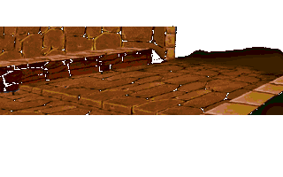 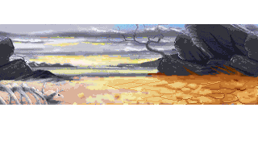 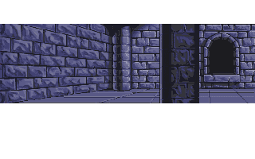
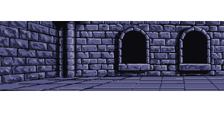 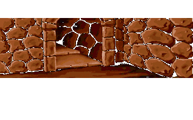 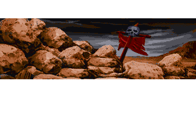

### B2 十一段播不到的施法動畫

分類：殘留內容｜`FIGHT.VFS` `MAGIC003`、`004`、`005`、`006`、`008`、`019`、`021`、`023`、`029`、`064`、`065`；`src/cmbspell.c` `fdps_combat_play_spell_on_targets`（`0x1a4c0`）

- **是什麼**：施法者在戰鬥畫面上的施法動作，11 段都是完整的動畫（9–49 格），除了 `MAGIC004` 都帶自己的音效。
- **選檔邏輯**：`Magic%03d.saf` 在整個程式裡只有 `fdps_combat_play_spell_on_targets` 組名（字面值的引用在 `0x1a81f`），編號是施法者的肖像編號（十進位）。這支函式有兩個呼叫端：玩家的法術指令 `fdps_battle_spell_command`（`0x27c20`）一律走它，AI 的 `fdps_map_actor_cast_chosen_spell`（`0x13c90`）在戰鬥動畫開啟時走它。它一開頭先把只在地圖上演出的法術——`0x0A` 裂地術、`0x0B` 封神裂震、`0x0E`–`0x16`、`0x18` 甦癒術、`0x21` 鎮魂之歌——交給 `fdps_cast_spell_on_targets`（`0x288f0`）後返回（比較鏈在 `0x1a517`），不載入任何 `Magic`。所以一段 `MAGIC` 只有在該肖像的單位會一個不在這組裡的法術時才會播。
- **法術的來源**：單位的已學法術只有六個來源——入隊時 `FRIAPRDA.DAT` 的初始遮罩（`src/roster.c`）、部署記錄的遮罩（`src/deploy.c`）、升級時以目前肖像查 `FRILEVUP.DAT` 的習得索引再查 `GETMGTAB.DAT`（`src/unitstat.c`）、第 1 章結束給主角 `0x00`（`src/chend1.c`）、強化套件只給肖像 9 的蓋亞 `0x1D`（`src/item.c`）、標題示範給單位 1 `0x27`、單位 4 `0x0B`（`src/title.c`）。轉職只換肖像，不動法術（`src/church.c`）。資料表見 [`characters.md`](../assets/characters.md) 與 [`spells.md`](../assets/spells.md)。
- **實際取用集合與為什麼到不了**：這 11 個肖像從六個來源拿得到的法術全在地圖演出的那一組裡，或者一個都沒有：

  | 動畫 | 肖像 | 拿得到的法術 |
  | --- | --- | --- |
  | `MAGIC003` | 3 裘娜／戰士 | 無：初始遮罩 0、習得索引 `0xFF` |
  | `MAGIC004` | 4 亞克／騎士 | 無：同上 |
  | `MAGIC005` | 5 瑪麗安／弓兵 | 無：同上 |
  | `MAGIC006` | 6 尤利安／僧侶 | 初始 `0x0E` 恢復之光；Lv10 `0x11` 封魔咒術、Lv16 `0x0F` 治癒之風、Lv28 `0x10` 痊癒之泉 |
  | `MAGIC008` | 8 布蘭多／技師 | 無：初始遮罩 0，習得表那一筆六組全是 `0xFF` |
  | `MAGIC019` | 19 亞克／聖騎士 | Lv15 `0x10` 痊癒之泉 |
  | `MAGIC021` | 21 尤利安／大僧侶 | Lv5 `0x18` 甦癒術、Lv10 `0x21` 鎮魂之歌，加上轉職前的四個 |
  | `MAGIC023` | 23 布蘭多／機械伯爵 | Lv10 `0x13` 麻痺術 |
  | `MAGIC029` | 29 瑪麗安／狙擊王 | Lv10 `0x12` 腐毒術、Lv20 `0x13` 麻痺術 |
  | `MAGIC064` | 64 塞克斯 | 無：所有部署記錄的遮罩為空 |
  | `MAGIC065` | 65 布魯森 | `0x21` 鎮魂之歌（`MAP24`–`MAP26` 的部署記錄；`MAP44` 那一筆為空） |

  肖像 3、4、5、6、8 在所有 `MAP*.DAT` 的部署記錄遮罩全空；19、21、23、29 沒有部署記錄，只能由 4、6、8、5 轉職進入（`RANKUP.DAT`），轉職前的法術同樣只有地圖演出的或沒有。
- 施法動作做好了、法術分配卻讓這些形態一次都用不上；是動畫照全體可轉職形態一律製作，還是法術分配後來改過，資料判斷不出來。

**MAGIC003**（10 格）

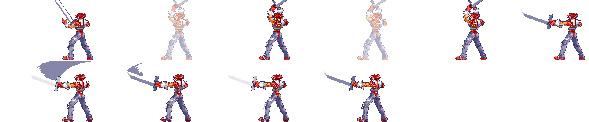

逐格：[f00](media/battle_assets/b2-magic003-f00.png) [f01](media/battle_assets/b2-magic003-f01.png) [f02](media/battle_assets/b2-magic003-f02.png) [f03](media/battle_assets/b2-magic003-f03.png) [f04](media/battle_assets/b2-magic003-f04.png) [f05](media/battle_assets/b2-magic003-f05.png) [f06](media/battle_assets/b2-magic003-f06.png) [f07](media/battle_assets/b2-magic003-f07.png) [f08](media/battle_assets/b2-magic003-f08.png) [f09](media/battle_assets/b2-magic003-f09.png)｜音效：[第 0 段](media/battle_assets/b2-magic003-s0.wav) [第 1 段](media/battle_assets/b2-magic003-s1.wav)

**MAGIC004**（9 格）

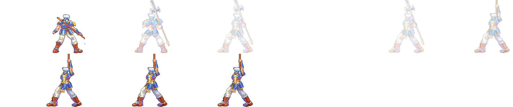

逐格：[f00](media/battle_assets/b2-magic004-f00.png) [f01](media/battle_assets/b2-magic004-f01.png) [f02](media/battle_assets/b2-magic004-f02.png) [f03](media/battle_assets/b2-magic004-f03.png) [f04](media/battle_assets/b2-magic004-f04.png) [f05](media/battle_assets/b2-magic004-f05.png) [f06](media/battle_assets/b2-magic004-f06.png) [f07](media/battle_assets/b2-magic004-f07.png) [f08](media/battle_assets/b2-magic004-f08.png)

**MAGIC005**（16 格）

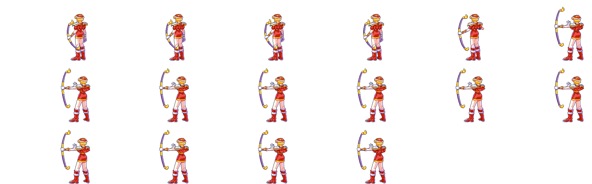

逐格：[f00](media/battle_assets/b2-magic005-f00.png) [f01](media/battle_assets/b2-magic005-f01.png) [f02](media/battle_assets/b2-magic005-f02.png) [f03](media/battle_assets/b2-magic005-f03.png) [f04](media/battle_assets/b2-magic005-f04.png) [f05](media/battle_assets/b2-magic005-f05.png) [f06](media/battle_assets/b2-magic005-f06.png) [f07](media/battle_assets/b2-magic005-f07.png) [f08](media/battle_assets/b2-magic005-f08.png) [f09](media/battle_assets/b2-magic005-f09.png) [f10](media/battle_assets/b2-magic005-f10.png) [f11](media/battle_assets/b2-magic005-f11.png) [f12](media/battle_assets/b2-magic005-f12.png) [f13](media/battle_assets/b2-magic005-f13.png) [f14](media/battle_assets/b2-magic005-f14.png) [f15](media/battle_assets/b2-magic005-f15.png)｜音效：[第 0 段](media/battle_assets/b2-magic005-s0.wav)

**MAGIC006**（21 格）

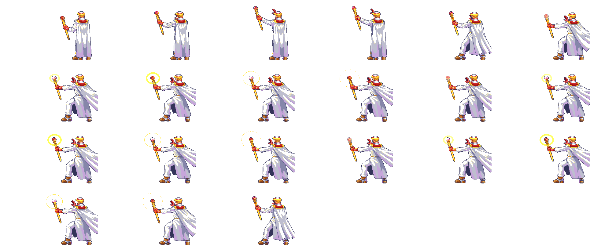

逐格：[f00](media/battle_assets/b2-magic006-f00.png) [f01](media/battle_assets/b2-magic006-f01.png) [f02](media/battle_assets/b2-magic006-f02.png) [f03](media/battle_assets/b2-magic006-f03.png) [f04](media/battle_assets/b2-magic006-f04.png) [f05](media/battle_assets/b2-magic006-f05.png) [f06](media/battle_assets/b2-magic006-f06.png) [f07](media/battle_assets/b2-magic006-f07.png) [f08](media/battle_assets/b2-magic006-f08.png) [f09](media/battle_assets/b2-magic006-f09.png) [f10](media/battle_assets/b2-magic006-f10.png) [f11](media/battle_assets/b2-magic006-f11.png) [f12](media/battle_assets/b2-magic006-f12.png) [f13](media/battle_assets/b2-magic006-f13.png) [f14](media/battle_assets/b2-magic006-f14.png) [f15](media/battle_assets/b2-magic006-f15.png) [f16](media/battle_assets/b2-magic006-f16.png) [f17](media/battle_assets/b2-magic006-f17.png) [f18](media/battle_assets/b2-magic006-f18.png) [f19](media/battle_assets/b2-magic006-f19.png) [f20](media/battle_assets/b2-magic006-f20.png)｜音效：[第 0 段](media/battle_assets/b2-magic006-s0.wav)

**MAGIC008**（14 格）

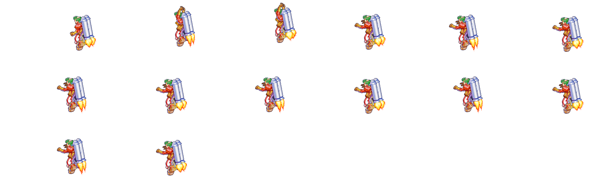

逐格：[f00](media/battle_assets/b2-magic008-f00.png) [f01](media/battle_assets/b2-magic008-f01.png) [f02](media/battle_assets/b2-magic008-f02.png) [f03](media/battle_assets/b2-magic008-f03.png) [f04](media/battle_assets/b2-magic008-f04.png) [f05](media/battle_assets/b2-magic008-f05.png) [f06](media/battle_assets/b2-magic008-f06.png) [f07](media/battle_assets/b2-magic008-f07.png) [f08](media/battle_assets/b2-magic008-f08.png) [f09](media/battle_assets/b2-magic008-f09.png) [f10](media/battle_assets/b2-magic008-f10.png) [f11](media/battle_assets/b2-magic008-f11.png) [f12](media/battle_assets/b2-magic008-f12.png) [f13](media/battle_assets/b2-magic008-f13.png)｜音效：[第 0 段](media/battle_assets/b2-magic008-s0.wav)

**MAGIC019**（30 格）

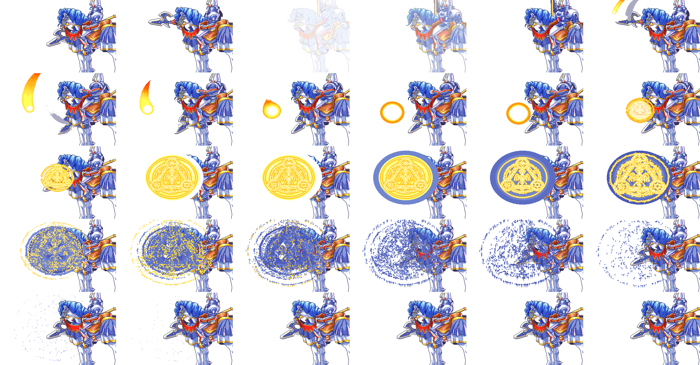

逐格：[f00](media/battle_assets/b2-magic019-f00.png) [f01](media/battle_assets/b2-magic019-f01.png) [f02](media/battle_assets/b2-magic019-f02.png) [f03](media/battle_assets/b2-magic019-f03.png) [f04](media/battle_assets/b2-magic019-f04.png) [f05](media/battle_assets/b2-magic019-f05.png) [f06](media/battle_assets/b2-magic019-f06.png) [f07](media/battle_assets/b2-magic019-f07.png) [f08](media/battle_assets/b2-magic019-f08.png) [f09](media/battle_assets/b2-magic019-f09.png) [f10](media/battle_assets/b2-magic019-f10.png) [f11](media/battle_assets/b2-magic019-f11.png) [f12](media/battle_assets/b2-magic019-f12.png) [f13](media/battle_assets/b2-magic019-f13.png) [f14](media/battle_assets/b2-magic019-f14.png) [f15](media/battle_assets/b2-magic019-f15.png) [f16](media/battle_assets/b2-magic019-f16.png) [f17](media/battle_assets/b2-magic019-f17.png) [f18](media/battle_assets/b2-magic019-f18.png) [f19](media/battle_assets/b2-magic019-f19.png) [f20](media/battle_assets/b2-magic019-f20.png) [f21](media/battle_assets/b2-magic019-f21.png) [f22](media/battle_assets/b2-magic019-f22.png) [f23](media/battle_assets/b2-magic019-f23.png) [f24](media/battle_assets/b2-magic019-f24.png) [f25](media/battle_assets/b2-magic019-f25.png) [f26](media/battle_assets/b2-magic019-f26.png) [f27](media/battle_assets/b2-magic019-f27.png) [f28](media/battle_assets/b2-magic019-f28.png) [f29](media/battle_assets/b2-magic019-f29.png)｜音效：[第 0 段](media/battle_assets/b2-magic019-s0.wav) [第 1 段](media/battle_assets/b2-magic019-s1.wav) [第 2 段](media/battle_assets/b2-magic019-s2.wav)

**MAGIC021**（49 格）

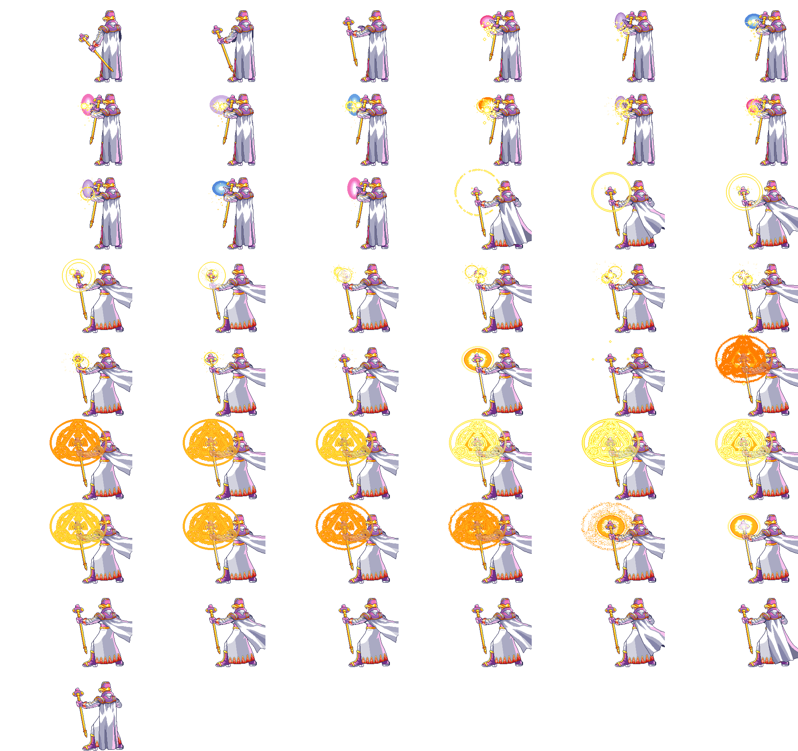

逐格：[f00](media/battle_assets/b2-magic021-f00.png) [f01](media/battle_assets/b2-magic021-f01.png) [f02](media/battle_assets/b2-magic021-f02.png) [f03](media/battle_assets/b2-magic021-f03.png) [f04](media/battle_assets/b2-magic021-f04.png) [f05](media/battle_assets/b2-magic021-f05.png) [f06](media/battle_assets/b2-magic021-f06.png) [f07](media/battle_assets/b2-magic021-f07.png) [f08](media/battle_assets/b2-magic021-f08.png) [f09](media/battle_assets/b2-magic021-f09.png) [f10](media/battle_assets/b2-magic021-f10.png) [f11](media/battle_assets/b2-magic021-f11.png) [f12](media/battle_assets/b2-magic021-f12.png) [f13](media/battle_assets/b2-magic021-f13.png) [f14](media/battle_assets/b2-magic021-f14.png) [f15](media/battle_assets/b2-magic021-f15.png) [f16](media/battle_assets/b2-magic021-f16.png) [f17](media/battle_assets/b2-magic021-f17.png) [f18](media/battle_assets/b2-magic021-f18.png) [f19](media/battle_assets/b2-magic021-f19.png) [f20](media/battle_assets/b2-magic021-f20.png) [f21](media/battle_assets/b2-magic021-f21.png) [f22](media/battle_assets/b2-magic021-f22.png) [f23](media/battle_assets/b2-magic021-f23.png) [f24](media/battle_assets/b2-magic021-f24.png) [f25](media/battle_assets/b2-magic021-f25.png) [f26](media/battle_assets/b2-magic021-f26.png) [f27](media/battle_assets/b2-magic021-f27.png) [f28](media/battle_assets/b2-magic021-f28.png) [f29](media/battle_assets/b2-magic021-f29.png) [f30](media/battle_assets/b2-magic021-f30.png) [f31](media/battle_assets/b2-magic021-f31.png) [f32](media/battle_assets/b2-magic021-f32.png) [f33](media/battle_assets/b2-magic021-f33.png) [f34](media/battle_assets/b2-magic021-f34.png) [f35](media/battle_assets/b2-magic021-f35.png) [f36](media/battle_assets/b2-magic021-f36.png) [f37](media/battle_assets/b2-magic021-f37.png) [f38](media/battle_assets/b2-magic021-f38.png) [f39](media/battle_assets/b2-magic021-f39.png) [f40](media/battle_assets/b2-magic021-f40.png) [f41](media/battle_assets/b2-magic021-f41.png) [f42](media/battle_assets/b2-magic021-f42.png) [f43](media/battle_assets/b2-magic021-f43.png) [f44](media/battle_assets/b2-magic021-f44.png) [f45](media/battle_assets/b2-magic021-f45.png) [f46](media/battle_assets/b2-magic021-f46.png) [f47](media/battle_assets/b2-magic021-f47.png) [f48](media/battle_assets/b2-magic021-f48.png)｜音效：[第 0 段](media/battle_assets/b2-magic021-s0.wav) [第 1 段](media/battle_assets/b2-magic021-s1.wav) [第 2 段](media/battle_assets/b2-magic021-s2.wav)

**MAGIC023**（40 格）

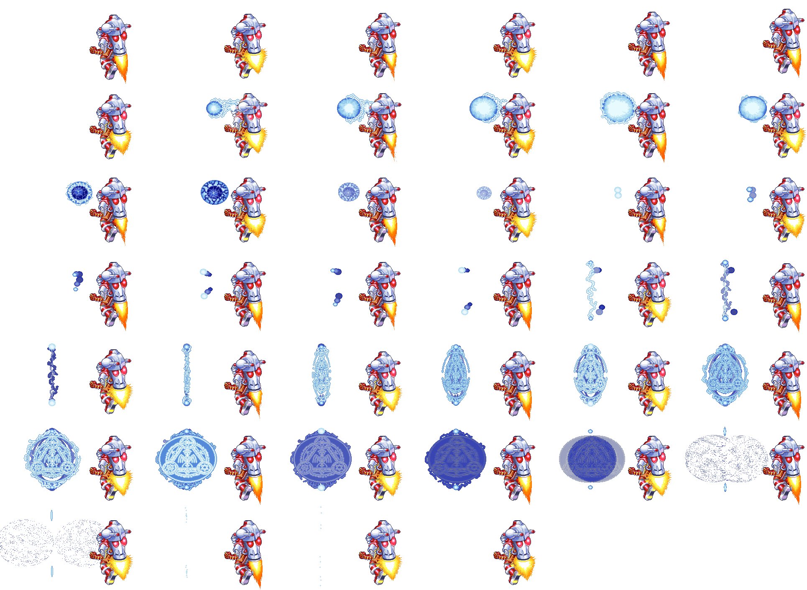

逐格：[f00](media/battle_assets/b2-magic023-f00.png) [f01](media/battle_assets/b2-magic023-f01.png) [f02](media/battle_assets/b2-magic023-f02.png) [f03](media/battle_assets/b2-magic023-f03.png) [f04](media/battle_assets/b2-magic023-f04.png) [f05](media/battle_assets/b2-magic023-f05.png) [f06](media/battle_assets/b2-magic023-f06.png) [f07](media/battle_assets/b2-magic023-f07.png) [f08](media/battle_assets/b2-magic023-f08.png) [f09](media/battle_assets/b2-magic023-f09.png) [f10](media/battle_assets/b2-magic023-f10.png) [f11](media/battle_assets/b2-magic023-f11.png) [f12](media/battle_assets/b2-magic023-f12.png) [f13](media/battle_assets/b2-magic023-f13.png) [f14](media/battle_assets/b2-magic023-f14.png) [f15](media/battle_assets/b2-magic023-f15.png) [f16](media/battle_assets/b2-magic023-f16.png) [f17](media/battle_assets/b2-magic023-f17.png) [f18](media/battle_assets/b2-magic023-f18.png) [f19](media/battle_assets/b2-magic023-f19.png) [f20](media/battle_assets/b2-magic023-f20.png) [f21](media/battle_assets/b2-magic023-f21.png) [f22](media/battle_assets/b2-magic023-f22.png) [f23](media/battle_assets/b2-magic023-f23.png) [f24](media/battle_assets/b2-magic023-f24.png) [f25](media/battle_assets/b2-magic023-f25.png) [f26](media/battle_assets/b2-magic023-f26.png) [f27](media/battle_assets/b2-magic023-f27.png) [f28](media/battle_assets/b2-magic023-f28.png) [f29](media/battle_assets/b2-magic023-f29.png) [f30](media/battle_assets/b2-magic023-f30.png) [f31](media/battle_assets/b2-magic023-f31.png) [f32](media/battle_assets/b2-magic023-f32.png) [f33](media/battle_assets/b2-magic023-f33.png) [f34](media/battle_assets/b2-magic023-f34.png) [f35](media/battle_assets/b2-magic023-f35.png) [f36](media/battle_assets/b2-magic023-f36.png) [f37](media/battle_assets/b2-magic023-f37.png) [f38](media/battle_assets/b2-magic023-f38.png) [f39](media/battle_assets/b2-magic023-f39.png)｜音效：[第 0 段](media/battle_assets/b2-magic023-s0.wav) [第 1 段](media/battle_assets/b2-magic023-s1.wav) [第 2 段](media/battle_assets/b2-magic023-s2.wav) [第 3 段](media/battle_assets/b2-magic023-s3.wav)

**MAGIC029**（35 格）

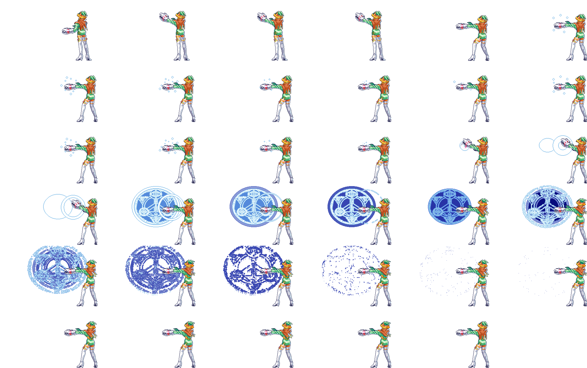

逐格：[f00](media/battle_assets/b2-magic029-f00.png) [f01](media/battle_assets/b2-magic029-f01.png) [f02](media/battle_assets/b2-magic029-f02.png) [f03](media/battle_assets/b2-magic029-f03.png) [f04](media/battle_assets/b2-magic029-f04.png) [f05](media/battle_assets/b2-magic029-f05.png) [f06](media/battle_assets/b2-magic029-f06.png) [f07](media/battle_assets/b2-magic029-f07.png) [f08](media/battle_assets/b2-magic029-f08.png) [f09](media/battle_assets/b2-magic029-f09.png) [f10](media/battle_assets/b2-magic029-f10.png) [f11](media/battle_assets/b2-magic029-f11.png) [f12](media/battle_assets/b2-magic029-f12.png) [f13](media/battle_assets/b2-magic029-f13.png) [f14](media/battle_assets/b2-magic029-f14.png) [f15](media/battle_assets/b2-magic029-f15.png) [f16](media/battle_assets/b2-magic029-f16.png) [f17](media/battle_assets/b2-magic029-f17.png) [f18](media/battle_assets/b2-magic029-f18.png) [f19](media/battle_assets/b2-magic029-f19.png) [f20](media/battle_assets/b2-magic029-f20.png) [f21](media/battle_assets/b2-magic029-f21.png) [f22](media/battle_assets/b2-magic029-f22.png) [f23](media/battle_assets/b2-magic029-f23.png) [f24](media/battle_assets/b2-magic029-f24.png) [f25](media/battle_assets/b2-magic029-f25.png) [f26](media/battle_assets/b2-magic029-f26.png) [f27](media/battle_assets/b2-magic029-f27.png) [f28](media/battle_assets/b2-magic029-f28.png) [f29](media/battle_assets/b2-magic029-f29.png) [f30](media/battle_assets/b2-magic029-f30.png) [f31](media/battle_assets/b2-magic029-f31.png) [f32](media/battle_assets/b2-magic029-f32.png) [f33](media/battle_assets/b2-magic029-f33.png) [f34](media/battle_assets/b2-magic029-f34.png)｜音效：[第 0 段](media/battle_assets/b2-magic029-s0.wav) [第 1 段](media/battle_assets/b2-magic029-s1.wav)

**MAGIC064**（25 格）

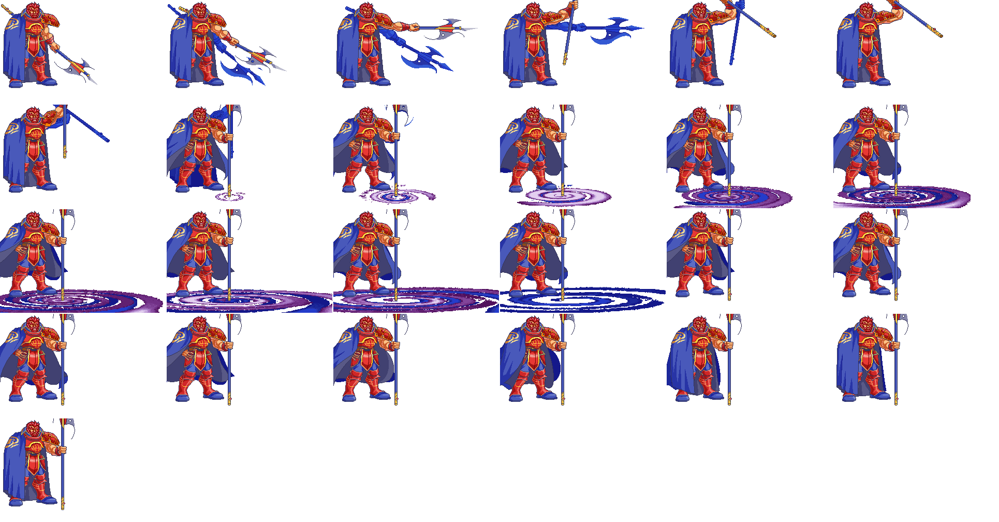

逐格：[f00](media/battle_assets/b2-magic064-f00.png) [f01](media/battle_assets/b2-magic064-f01.png) [f02](media/battle_assets/b2-magic064-f02.png) [f03](media/battle_assets/b2-magic064-f03.png) [f04](media/battle_assets/b2-magic064-f04.png) [f05](media/battle_assets/b2-magic064-f05.png) [f06](media/battle_assets/b2-magic064-f06.png) [f07](media/battle_assets/b2-magic064-f07.png) [f08](media/battle_assets/b2-magic064-f08.png) [f09](media/battle_assets/b2-magic064-f09.png) [f10](media/battle_assets/b2-magic064-f10.png) [f11](media/battle_assets/b2-magic064-f11.png) [f12](media/battle_assets/b2-magic064-f12.png) [f13](media/battle_assets/b2-magic064-f13.png) [f14](media/battle_assets/b2-magic064-f14.png) [f15](media/battle_assets/b2-magic064-f15.png) [f16](media/battle_assets/b2-magic064-f16.png) [f17](media/battle_assets/b2-magic064-f17.png) [f18](media/battle_assets/b2-magic064-f18.png) [f19](media/battle_assets/b2-magic064-f19.png) [f20](media/battle_assets/b2-magic064-f20.png) [f21](media/battle_assets/b2-magic064-f21.png) [f22](media/battle_assets/b2-magic064-f22.png) [f23](media/battle_assets/b2-magic064-f23.png) [f24](media/battle_assets/b2-magic064-f24.png)｜音效：[第 0 段](media/battle_assets/b2-magic064-s0.wav) [第 1 段](media/battle_assets/b2-magic064-s1.wav)

**MAGIC065**（28 格）

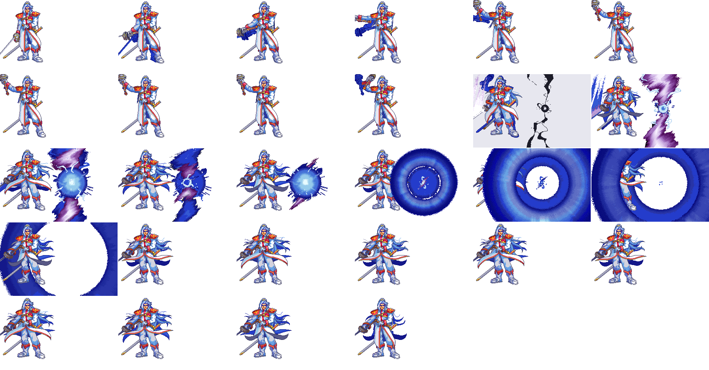

逐格：[f00](media/battle_assets/b2-magic065-f00.png) [f01](media/battle_assets/b2-magic065-f01.png) [f02](media/battle_assets/b2-magic065-f02.png) [f03](media/battle_assets/b2-magic065-f03.png) [f04](media/battle_assets/b2-magic065-f04.png) [f05](media/battle_assets/b2-magic065-f05.png) [f06](media/battle_assets/b2-magic065-f06.png) [f07](media/battle_assets/b2-magic065-f07.png) [f08](media/battle_assets/b2-magic065-f08.png) [f09](media/battle_assets/b2-magic065-f09.png) [f10](media/battle_assets/b2-magic065-f10.png) [f11](media/battle_assets/b2-magic065-f11.png) [f12](media/battle_assets/b2-magic065-f12.png) [f13](media/battle_assets/b2-magic065-f13.png) [f14](media/battle_assets/b2-magic065-f14.png) [f15](media/battle_assets/b2-magic065-f15.png) [f16](media/battle_assets/b2-magic065-f16.png) [f17](media/battle_assets/b2-magic065-f17.png) [f18](media/battle_assets/b2-magic065-f18.png) [f19](media/battle_assets/b2-magic065-f19.png) [f20](media/battle_assets/b2-magic065-f20.png) [f21](media/battle_assets/b2-magic065-f21.png) [f22](media/battle_assets/b2-magic065-f22.png) [f23](media/battle_assets/b2-magic065-f23.png) [f24](media/battle_assets/b2-magic065-f24.png) [f25](media/battle_assets/b2-magic065-f25.png) [f26](media/battle_assets/b2-magic065-f26.png) [f27](media/battle_assets/b2-magic065-f27.png)｜音效：[第 0 段](media/battle_assets/b2-magic065-s0.wav) [第 1 段](media/battle_assets/b2-magic065-s1.wav) [第 2 段](media/battle_assets/b2-magic065-s2.wav)

### B3 敵方版落雷術

分類：殘留內容｜`MISC.VFS` `EB05`、`EL05`（第三段 `EE05` 見 B5）；`src/cmbspell.c` `fdps_combat_play_spell_on_targets`（`0x1a4c0`，陣營比較在 `0x1a675`）

- **是什麼**：落雷術（`0x05`）敵方版三段演出的前兩段。`EB05` 10 格、28,179 byte；`EL05` 12 格、35,162 byte，一道藍白閃電劈下、落點炸開後散成藍色碎點。兩段在第 0、2 格各發同一段 11025 Hz、0.71 秒的音效。
- **選檔邏輯**：法術演出依施法者陣營選前綴，陣營 0（敵方）用 `E`、其餘用 `M`，再以 `%sB%02d`、`%sL%02d`、`%sE%02d` 從 `MISC.VFS` 載入三段。`0x05` 不在地圖演出的那一組裡，所以只要敵方以戰鬥動畫施放落雷術，這三個檔就一定載入。
- **為什麼到不了**：敵方單位的法術只來自部署記錄（`src/deploy.c` 照抄記錄的 `+0x0D`–`+0x10` 與 `+0x19`）。63 個 `MAP*.DAT`（含過場地圖與 `MAP31.DAT` 程式讀不到的 11 筆尾巴）陣營 0 的法術聯集是 `00 01 02 06 07 08 09 0A 0B 0D 0E 0F 10 11 12 14 17 20 21 25`，沒有 `05`；帶 `05` 的只有兩筆，都是陣營 2（`MAP03` 的法蓮娜 Lv8、`MAP23` 的珊 Lv15）。其他途徑也給不到：`GETMGTAB.DAT` 60 筆 × 6 對沒有一對是 `05`，`fdps_set_flag_bit`（`0x282b0`）除了升級以外的四個呼叫點是常數 `0x27`、`0x0B`、`0x1D`、`0x00`，陣營欄的寫入只有照抄部署記錄、設為 2、設為 1，沒有把單位改成陣營 0 的路徑。部署記錄的格式見 [`map.md`](../resource_info/map.md)。

**EB05**（10 格）

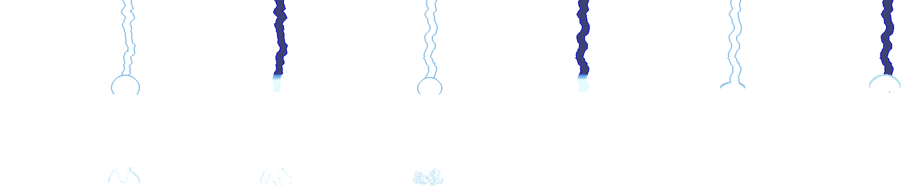

逐格：[f00](media/battle_assets/b3-eb05-f00.png) [f01](media/battle_assets/b3-eb05-f01.png) [f02](media/battle_assets/b3-eb05-f02.png) [f03](media/battle_assets/b3-eb05-f03.png) [f04](media/battle_assets/b3-eb05-f04.png) [f05](media/battle_assets/b3-eb05-f05.png) [f06](media/battle_assets/b3-eb05-f06.png) [f07](media/battle_assets/b3-eb05-f07.png) [f08](media/battle_assets/b3-eb05-f08.png) [f09](media/battle_assets/b3-eb05-f09.png)｜音效：[第 0 段](media/battle_assets/b3-eb05-s0.wav)

**EL05**（12 格）

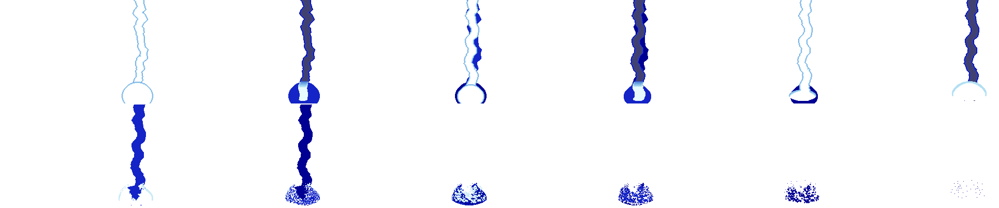

逐格：[f00](media/battle_assets/b3-el05-f00.png) [f01](media/battle_assets/b3-el05-f01.png) [f02](media/battle_assets/b3-el05-f02.png) [f03](media/battle_assets/b3-el05-f03.png) [f04](media/battle_assets/b3-el05-f04.png) [f05](media/battle_assets/b3-el05-f05.png) [f06](media/battle_assets/b3-el05-f06.png) [f07](media/battle_assets/b3-el05-f07.png) [f08](media/battle_assets/b3-el05-f08.png) [f09](media/battle_assets/b3-el05-f09.png) [f10](media/battle_assets/b3-el05-f10.png) [f11](media/battle_assets/b3-el05-f11.png)｜音效：[第 0 段](media/battle_assets/b3-el05-s0.wav)

### B4 永遠不響的 SAF 內嵌音效

分類：殘留內容｜`MISC.VFS` `EMG19` 第 1 段、`EMG33` 第 1 段、`MAG11` 第 0、1 段；`src/sprite.c` `fdps_draw_composite_sprite`（`0x14140`）、`src/spell.c` `fdps_play_spell_11_cutscene`（`0x28610`）

- **是什麼**：四段完整的音效。所屬的動畫都會播，但這四段不會發出聲音。

  | 檔 | 所屬動畫 | 段 | 取樣率 | 長度 |
  | --- | --- | ---: | --- | --- |
  | `EMG19` | 麻痺術（`0x13`）的地圖演出 | 1 | 22050 Hz | 46,318 byte，2.10 秒 |
  | `EMG33` | 鎮魂之歌（`0x21`）的地圖演出 | 1 | 22050 Hz | 14,195 byte，0.64 秒 |
  | `MAG11` | 封神裂震（`0x0B`）的全螢幕演出 | 0 | 11025 Hz | 27,712 byte，2.51 秒 |
  | `MAG11` | 同上 | 1 | 11025 Hz | 18,560 byte，1.68 秒 |

- **發聲邏輯**：SAF 內嵌音效只有一條發聲路徑：`fdps_draw_composite_sprite` 畫完一格、收到非 0 的發聲旗標時，以該格 `+0x00` 的音效編號呼叫 `fdps_sfx_play`（`0x142d0`，全程式唯一的呼叫點在 `0x142bd`）。一段音效要響，必須有畫格指到它，而且那一格要以發聲旗標畫出。畫格的格式見 [`saf.md`](../resource_info/saf.md)。
- **為什麼到不了**：
  - `EMG19` 20 格裡只有第 0 格指第 0 段、第 5 格指第 2 段；`EMG33` 25 格裡只有第 0、2 格指第 0 段。兩個檔的第 1 段沒有任何畫格指到；全部 525 個 SAF 裡沒有畫格指到的音效只有這兩段。同檔其他段會響：地圖演出 `fdps_play_vfs_animation_over_units`（`0x26e00`）在每格第一個 tick 的第一個目標上以旗標 1 畫。
  - `MAG11` 的第 0、15 格分別指第 0、1 段，但 `Mag11.saf` 唯一的載入點 `fdps_play_spell_11_cutscene` 在淡入與主迴圈兩個階段都以旗標 0 畫（`0x2871e`、`0x287cf`），全螢幕動畫全程無聲。封神裂震實際聽得到的聲音在動畫之後：白閃淡回地圖後 25 格震動期間播的 `EarQu.wav`（與裂地術共用），以及接著在目標上播的 `Emg10.saf` 的內嵌音效。

**EMG19** 音效：[第 1 段](media/battle_assets/b4-emg19-s1.wav)

**EMG33** 音效：[第 1 段](media/battle_assets/b4-emg33-s1.wav)

**MAG11** 音效：[第 0 段](media/battle_assets/b4-mag11-s0.wav) [第 1 段](media/battle_assets/b4-mag11-s1.wav)

## 空殼

### B5 17 個 66 byte 的空殼特效

分類：空殼｜`MISC.VFS` `EE05`、`EE06`、`EE07`、`EE23`、`ME03`–`ME07`、`ME26`–`ME28`、`ME30`、`ME31`、`ME34`、`ME35`、`ME39`；`src/cmbspell.c` `fdps_combat_play_spell_on_targets`（`0x1a4c0`）

- **是什麼**：法術演出第三段（`%sE%02d.saf`，收尾）的 17 個檔只有 66 byte：一個沒有圖層的畫格，其他三個 section 全空。16 個逐 byte 相同，唯一的畫格停留 12 tick；`ME34` 停留 15 tick。格式見 [`saf.md`](../resource_info/saf.md) 的空殼檔一節。
- **選檔邏輯**：`fdps_combat_play_spell_on_targets` 對每個不在地圖演出那一組裡的法術，無條件以 `%sE%02d.saf`（前綴規則同 B3，編號是十進位的法術編號）從 `MISC.VFS` 載入第三段，找不到成員會結束程式；第五階段把它播到結束。
- **為什麼沒有內容**：這 17 個法術的第三段只放了一格沒有圖層的畫格。為什麼不讓程式跳過第三段而要放空殼，程式與資料判斷不出來。這 17 個對應的法術（檔名是十進位編號）：3 光之箭、4 聖光柱、5 落雷術、6 奔雷彈、7 暴雷絕擊、23 咒殺術、26 強力衝擊、27 金剛斬、28 獄炎烈破彈、30 流星箭、31 靈彈超必殺、34 超重力黑洞、35 聖龍烈霸斬、39 萬神降臨。播到這一段時背景、目標與施法者照畫，特效層空白 12（或 15）tick。
- **會不會被載入**：16 個會。`ME` 系列 13 個對應的法術都有我方或 NPC 會放，`EE06`、`EE07`、`EE23` 對應的法術有敵方部署記錄帶著。`EE05` 永遠不會載入，理由同 B3。
- 空殼畫不出任何東西，本條沒有素材。

## 被封住的內容

### B7 酒館抽獎頭獎的 Bonus.wav

分類：被封住的內容｜`MISC.VFS` `BONUS.WAV`；`src/vilbar.c` `fdps_run_bonus_lottery`（`0x36460`）

- **是什麼**：`MISC.VFS` 最外層三個 WAV 之一，128,216 byte，11025 Hz、8-bit 單聲道，11.6 秒。
- **選檔邏輯**：`Bonus.wav` 的字面值只被 `fdps_run_bonus_lottery` 引用（`0x36920`、`0x36925`），而且只在發斬鐵劍的頭獎分支裡載入，以 `fdps_audio_start_wav` 播完才往下走。同一場抽獎的轉輪動畫 `BONUS-1.SAF` 與它的內嵌音效照常播放。
- **為什麼到不了**：原版的抽獎永遠只發藥草，頭獎分支與這段音效從不執行；成因見 [`known_bugs.md`](../program_info/known_bugs.md) 第 18 條。獎品那一半（斬鐵劍、水晶粒、兩萬金）屬於道具的主題檔 `items.md`；重建時不能讓它變得拿得到，見 [`pitfalls.md`](../rebuild_info/pitfalls.md) 的酒館抽獎一列。

**BONUS** 音效：[WAV](media/battle_assets/b7-bonus.wav)

## 否定性結論

### B6 其餘音效、基本動畫與混色快取都有人用

分類：否定性結論｜`MISC.VFS`、`MISC.VFS!BASEWAV.VFS`、`MISC.VFS!BASEANI.VFS`；`MER1.TMP`、`MER2.TMP`、`FMER1.TMP`、`FMER2.TMP`

- `BASEWAV.VFS` 的 9 個 WAV——`Beep`、`Chess`、`Equip`、`Incom`、`Miss`、`OpWin`、`OpWin1`、`REST`、`Sure`——全部由 `fdps_play_sfx`（`0x2a1f0`，以名稱從常駐的容器映像取成員）播放，每個都至少有一個呼叫點。
- `MISC.VFS` 最外層的 3 個 WAV 都有播放點：`EarQu`（裂地術與封神裂震的震動，`src/spell.c`；地屬性道具與武器的使用效果，`src/item.c`）、`Levup`（升級，`src/unitstat.c`）、`Bonus`（酒館抽獎頭獎；播放點被原版 bug 封住，見 B7）。
- `BASEANI.VFS` 的 3 個 SAF——`Turn`、`EasyAni`（`src/anim.c`）與 `Explo`（`src/death.c`）——都從啟動時載入的容器映像取用。
- `MISC.VFS` 其餘成員除了 B3 的 `EB05`、`EL05` 與 B5 的 `EE05` 以外，全部有字面名稱或格式字串的載入點。
- 四個 `.TMP` 是啟動時算出的混色快取：`fdps_load_global_resources`（`0x29660`）在 `FMer1.tmp` 不存在時以 `Fight.pal` 算出寫成 `FMER1`／`FMER2`、再以 `Fde.pal` 算出寫成 `MER1`／`MER2`，存在時讀回 `MER1`／`MER2`。四個都會被讀回：`FMER1`／`FMER2` 由攻擊演出、法術演出、教會轉職與片尾名單各以自己那份同名字面值開檔讀回，`MER1`／`MER2` 由啟動與同樣四處讀回。
