# 刪減與未用：劇情與場景

劇情與場景留下的痕跡：沒有路徑的地圖與場景、載入不了的地圖與開不到的圖層檔、過場腳本裡沒人用的機制與動畫、永遠不出場的部署記錄、永遠不會顯示的文字、沒被要求播放的 CD 音軌。分類的判定規則見 [`_index.md`](_index.md)；不屬於任何一類的複本與填錯的資料列在那裡的排除清單。

本頁擁有「永遠不會顯示的文字」：每一條都在文末的[總表](#永遠不會顯示的文字總表)裡歸到一個條目或排除項，[`assets/text/`](../assets/text/_index.md) 不另列。地圖與場景的檔案（缺圖層的地圖、開不到的圖層檔、過場動畫）也歸本頁，其餘永遠不會被載入的資源檔見 [`battle_assets.md`](battle_assets.md)。

夾在 `<!-- story:… -->` 標記之間的對白全文、部署表與總表由 [`tools/cut_content/story.py`](../tools/cut_content/_index.md) 從遊戲檔產生，不手改。對白的寫法：`【名稱】（角色 n）` 是換上肖像編號 n 的說話者（名稱取全域文字第 n + 1 條），每行是遊戲裡的一行，`▼` 是換頁（等按鍵、重畫訊息框）。圖與音效在 `media/story/`，由 `python tools/cut_content/cut_content.py media story` 重生。

## 殘留內容

### S1 地圖 49：索爾被假索爾擒住

分類：殘留內容｜`MAP49.DAT`、`MAP49.COD`、`M49.DTL`、`M490.MPL`、`M490.CEL`、`DSC49.DAT`、`FDETXT50.TXT` `0x09`–`0x0D`；`FDETXT07.TXT` `0x0E`–`0x0F`

- **是什麼**：一段做好的場景。地圖 49 是 14×9 的森林小路，`MAP49.DAT` 有 11 筆部署：索爾（`0x0C`）在左緣，假索爾（`0x75`，說話者 117）、亞雷斯（`0x0E`）與 8 名士兵（`0x62`，台詞裡叫侍衛）在右緣。`FDETXT50` 的 `0x09`–`0x0D` 是整段對白：假索爾設伏、帶出被俘的亞雷斯、以人質逼索爾就擒。第 7 章的區塊 `FDETXT07` 的 `0x0E`／`0x0F` 是同一段的另一版措辭，把前四條壓成兩條，沒有最後的「卑鄙～！」。
- **為什麼到不了**：載入哪張地圖與哪個文字區塊由章節編號（`data_fdps_chapter_current_chapter_id`，`0x69cf4`）決定——`fdps_field_load_chapter_resources`（`0x227e0`）以它組地圖檔名、以它加 1 組文字區塊檔名。寫入它的只有章節結束處理（常數 1–`0x1D`）、標題畫面與示範戰鬥、讀檔還原，以及過場腳本的 `SWITCH_MAP`（`fdps_icon_script_run`，`0x21650`）；66 支腳本的 52 條 `SWITCH_MAP` 沒有一條切到 49，也沒有任何一支腳本在演這一段。`FDETXT07` 的兩條同樣沒有讀取端：第 7 章的處理函式不畫字，`ICON06`、`WIN06` 畫的是 `0x0B`–`0x0D`。
- **暗示**：劇情上它落在第 6 章勝利索爾離隊（`WIN05`）之後、第 8 章勝利費塔加推論「索爾回到羅特帝亞，必定兇多吉少」（`WIN07`，`FDETXT08` `0x0A`）之前，另一版措辭正好放在其間第 7 章的區塊。出貨版裡索爾被擒只剩費塔加的推論。假索爾不是在這裡初登場：第 4 章勝利過場（`WIN03`，`FDETXT40` `0x0A`）他就以回宮國王的身分出場。

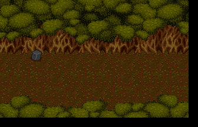

部署記錄（錨點是 `MAP49.COD` 的座標）：

<!-- story:S1-deploy -->
| # | 單位 | 等級 | 波次 | 錨點 | 死亡腳本 |
| ---: | --- | ---: | ---: | --- | --- |
| 0 | `0C` 索爾 | 2 | 0 | (0, 5) | 掉落 `B4` 藥草 |
| 1 | `75` 假索爾 | 2 | 1 | (13, 4) | 掉落 `B4` 藥草 |
| 2 | `0E` 亞雷斯 | 2 | 2 | (13, 5) | 掉落 `B4` 藥草 |
| 3 | `62` 步兵 | 2 | 2 | (13, 4) | 掉落 `B4` 藥草 |
| 4 | `62` 步兵 | 2 | 2 | (14, 5) | 掉落 `B4` 藥草 |
| 5 | `62` 步兵 | 2 | 2 | (13, 6) | 掉落 `B4` 藥草 |
| 6 | `62` 步兵 | 2 | 2 | (12, 5) | 掉落 `B4` 藥草 |
| 7 | `62` 步兵 | 2 | 3 | (12, 5) | 掉落 `B4` 藥草 |
| 8 | `62` 步兵 | 2 | 3 | (12, 5) | 掉落 `B4` 藥草 |
| 9 | `62` 步兵 | 2 | 3 | (12, 5) | 掉落 `B4` 藥草 |
| 10 | `62` 步兵 | 2 | 3 | (12, 5) | 掉落 `B4` 藥草 |
<!-- /story:S1-deploy -->

對白：

<!-- story:S1-text -->
**`FDETXT50` `0x09`**

```text
【假索爾】（角色 117）
哈哈哈～！
你終於來自投羅網了！
我在此恭候好久了！
```

**`FDETXT50` `0x0a`**

```text
【索爾】（角色 12）
哼！
雖然我不知道你是誰，
但是就憑你們幾人，
▼
想抓我？
你們在作夢！
【假索爾】（角色 117）
哈哈哈～！
昔日炎龍騎士團領隊，
現今羅特帝亞的國王，
▼
武藝自然是不凡的。
我要是跟你比武，
可沒有勝的把握。
▼
不過，在動手之前，
我先讓你見一個人！
```

**`FDETXT50` `0x0b`**

```text
【索爾】（角色 12）
亞雷斯？！﹒﹒﹒
你們都被捕了？
【亞雷斯】（角色 14）
索爾！﹒﹒﹒﹒﹒
對不起，全是我疏忽。
查覺時已經太晚了！
【假索爾】（角色 117）
哈哈哈～！
怎麼樣？
知道了嗎？
▼
你要是敢稍作反抗，
我就殺了他們！
你還不乖乖就捕？
【索爾】（角色 12）
呸！卑鄙﹒﹒﹒﹒
```

**`FDETXT50` `0x0c`**

```text
【假索爾】（角色 117）
侍衛，
去把他抓起來！
【步兵】（角色 98）
這個﹒﹒﹒﹒
【假索爾】（角色 117）
不要怕他，
他不會反抗的！
哈哈哈～！
```

**`FDETXT50` `0x0d`**

```text
【索爾】（角色 12）
卑鄙～！
【假索爾】（角色 117）
哈哈哈～！
```

**`FDETXT07` `0x0e`**

```text
【假索爾】（角色 117）
哈哈哈～！
你終於來自投羅網了！
我在此恭候您好久了！
【索爾】（角色 12）
哼！
雖然我不知道你是誰，
但就憑你們，想抓我？
▼
告訴你們，
你們在做夢！
【假索爾】（角色 117）
哈哈哈～！
昔日大名鼎鼎，
炎龍騎士團領隊，
▼
羅特帝亞王國的國王，
武藝自然是不凡的。
我不敢和你比武。
▼
哦！您的手，
請不要放在劍柄上。
我是愛好和平的人。
▼
至少，在動手之前，
我要先讓你見一個人！
```

**`FDETXT07` `0x0f`**

```text
【索爾】（角色 12）
亞雷斯？！
﹒﹒﹒你們都被捕了？
【亞雷斯】（角色 14）
索爾！﹒﹒﹒﹒
對不起！
全是我的疏忽！
▼
等我們查覺時，
已經﹒﹒太晚了﹒﹒
【假索爾】（角色 117）
哈哈哈～！怎麼樣？
你要是敢稍做反抗，
我就殺了他們！
▼
你還不乖乖就捕？
【索爾】（角色 12）
呸！卑鄙﹒﹒﹒﹒
【假索爾】（角色 117）
嘿嘿嘿～！
這叫鬥智不鬥力。
▼
侍衛，
去把他抓起來！
```
<!-- /story:S1-text -->

### S2 地圖 31 與 33：第 1 章開場場景的兩塊獨立版本

分類：殘留內容｜`MAP31.DAT`、`MAP31.COD`、`M31.DTL`、`M310.MPL`、`M310.CEL`、`ATTR310.DAT`、`FDETXT32.TXT`；`M33.DTL`、`M330.MPL`、`M330.CEL`、`ATTR330.DAT`、`FDETXT34.TXT`

- **是什麼**：地圖 31（巴特家屋內，13×20）與地圖 33（夜間的屋外，14×9）各是第 1 章開場地圖 32（26×56）裡一塊的獨立版本，圖面與地圖 32 的屋內、夜間屋外兩塊相同。兩者都帶著開場台詞：地圖 33 的 `FDETXT34` 與地圖 32 實際使用的 `FDETXT33` 逐 byte 相同，地圖 31 的 `FDETXT32` 只有一條多一個「點」字。`MAP31.DAT` 檔頭的部署筆數寫 2，檔案裡卻剛好有 13 筆完整記錄，角色編號與 `MAP32.DAT` 的前 13 筆只差第 9 筆（`0x81` 對 `0x83`）。
- **為什麼到不了**：章節編號的寫入者（同 S1）沒有一個會寫出 31 或 33。就算寫了也載入不了：兩張都沒有 `DSC`，地圖 33 連 `MAP33.DAT`／`MAP33.COD` 都沒有，載入常式遇到缺檔就在 `fdps_vfs_load_entry`（`0x2a140`）結束程式——地圖 31 在讀 `dsc31.dat` 時，地圖 33 更早，在讀 `map33.dat` 時。缺檔的清單見 [`terrain.md`](../resource_info/terrain.md)。
- **暗示**：出貨版的開場（`ICON00`）把屋內與夜間屋外都演在合併的地圖 32 上，兩張獨立地圖與合併的大地圖孰先孰後，資料判斷不出來。`MAP31.DAT` 筆數以外的 11 筆，就算地圖載入得了也不會被讀到：開場部署與 `fdps_deploy_wave` 都只走到檔頭的筆數（[`map.md`](../resource_info/map.md)）。

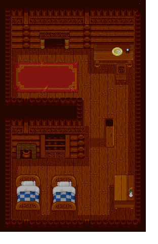 

`MAP31.DAT` 的全部記錄，右欄是 `MAP32.DAT` 同一筆的單位：

<!-- story:S2-deploy -->
| # | 單位 | 等級 | 波次 | 錨點 | 在筆數內 | `MAP32.DAT` 同一筆 |
| ---: | --- | ---: | ---: | --- | --- | --- |
| 0 | `8B` （空白） | 2 | 0 | (2, 6) | 是 | `8B` （空白） |
| 1 | `7E` 巴特 | 2 | 0 | (8, 6) | 是 | `7E` 巴特 |
| 2 | `7D` 瑪茜 | 2 | 1 | — | 否 | `7D` 瑪茜 |
| 3 | `8C` （空白） | 2 | 2 | — | 否 | `8C` （空白） |
| 4 | `8D` （空白） | 2 | 3 | — | 否 | `8D` （空白） |
| 5 | `8E` （空白） | 2 | 4 | — | 否 | `8E` （空白） |
| 6 | `8E` （空白） | 2 | 5 | — | 否 | `8E` （空白） |
| 7 | `8E` （空白） | 2 | 6 | — | 否 | `8E` （空白） |
| 8 | `8E` （空白） | 2 | 7 | — | 否 | `8E` （空白） |
| 9 | `81` （空白） | 2 | 8 | — | 否 | `83` （空白） |
| 10 | `82` （空白） | 2 | 0 | — | 否 | `82` （空白） |
| 11 | `83` （空白） | 2 | 0 | — | 否 | `83` （空白） |
| 12 | `84` （空白） | 2 | 0 | — | 否 | `84` （空白） |

檔長 469 byte＝檔頭 `0x83` ＋ 13 × `0x1a`；檔頭的部署筆數寫 2。`MAP31.COD` 有 2 筆座標。
<!-- /story:S2-deploy -->

文字區塊：

<!-- story:S2-text -->
`FDETXT34.TXT` 與 `FDETXT33.TXT` 逐 byte 相同（1420 byte）。`FDETXT32.TXT` 的 19 條裡只有 `0x0f` 與 `FDETXT33` 不同，其餘逐字相同：

**`FDETXT32` `0x0f`**：地圖 31 的版本

```text
【村長】（角色 120）
慢點！在行動之前，
為了慎重起見，
我們還是要請示我們
▼
的神祇一下﹒﹒﹒
```

**`FDETXT33` `0x0f`**：地圖 32 實際顯示的版本

```text
【村長】（角色 120）
慢！在行動之前，
為了慎重起見，
我們還是要請示我們
▼
的神祇一下﹒﹒﹒
```
<!-- /story:S2-text -->

`FDETXT33` 的全文見 [`scene_text.md`](../assets/text/scene_text.md)。

### S4 寫好卻沒被顯示的對白

分類：殘留內容｜`FDETXT03`、`09`、`19`、`21`、`22`、`24`、`25`、`27`、`30`、`52`、`56` 的 22 條

- **是什麼**：章節區塊與過場區塊裡完整寫好、說話者與換頁都齊的對白，20 段（其中兩段各有一份逐字相同的複本）：
  - `03` `0x0F`：亞克入隊後蘭迪斯與尤利安的歡迎。勝利腳本 `WIN02` 畫完 `0x0E`（亞克「我可以加入你們嗎？」）就停音樂結束。
  - `09` `0x11`（＝`56` `0x0D`）：蓋亞與布蘭多。開場腳本 `ICON08` 在地圖 55 畫到 `56` `0x0C` 就切回地圖 8，接著畫 `09` `0x12`。
  - `19` `0x0B`：蘭斯洛特的入隊宣言。`fdps_chapter_19_event_lancelot_joins`（`0x38180`）部署他之後只畫 `0x0A`。
  - `21` `0x09`（＝`52` `0x09`）：亞克說這裡祀奉的也是平衡之神。`ICON20` 只畫 `21` `0x0A`，`WIN20` 切到地圖 51 後從 `52` `0x0B` 開始畫。
  - `22` `0x0B`：法蓮娜分失魂藥。`WIN21` 只畫 `0x0A`，接著播 `ICON0054.SAF` 就結束。
  - `24` `0x0D`、`0x0F`：珊「來遲一步了」與蘭迪斯的沉默。第 24 章的回合事件（`src/chevt5.c`）畫 `0x0E`、`0x10`–`0x14`，跳過這兩條。
  - `25` `0x0B`–`0x0D`：魔戰將軍撤退與「窮寇莫追」。實際的撤退台詞是 `MAP24.DAT` 記錄 0–2 的死亡腳本（opcode 3）說的 `0x19`–`0x1B`。
  - `27` `0x0C`、`0x0D`：逃出崩塌的神殿、蘭迪斯被打昏。`WIN26` 只畫 `0x0A`、`0x0B`，之後播動畫、切到地圖 62 再切回 26，途中不畫字。
  - `27` `0x15`–`0x18`：四名幹部的臨死台詞。`MAP26.DAT` 記錄 1–4 的死亡腳本是 opcode 2、slot 43（`0x39440`），那支只畫 `0x14`；第 26 章的同樣四人則以 opcode 3 說 `26` `0x0D`–`0x10`。
  - `30` `0x0D`、`0x0E`：第二、第三型態平衡之神（角色 61、62）的叫陣。部署第二型態的 `fdps_chapter_30_event_deploy_wave_3`（`0x398c0`）不畫字，第三型態的死亡腳本運算元是 `0xFF`（不畫字），也沒有過場畫這兩條。
  - `30` `0x13`、`0x14`：另一版的道別。前半與 `WIN29` 在地圖 63 畫的 `FDETXT64` `0x11` 相同，接著蘭迪斯問法蓮娜是不是真的不願意同行、她沉默，蘭迪斯說「我會永遠記得妳的。我走了！」；顯示中的版本改成兩人約定再會。`WIN29` 切到地圖 63 才畫字，沒有腳本在地圖 29 上畫本區塊的這兩條。
- **為什麼到不了**：一條文字條目的讀取端只有四種：過場腳本的 `DRAW_TEXT` 與 `ASK_THREE_WAY`、`src/` 裡以常數或算式取條目的 `fdps_draw_text`（`0x1ff60`）、死亡腳本 opcode 3 以上、村莊畫面與存檔面板讀的前 9 條。每一條都對這四種窮舉過，沒有一個取得到。
- 第 27 章字幕表裡法蓮娜那一格（`27` `0x1C`）也不會顯示，但它是好結局字幕的複本，列在排除清單（S4a）。

<!-- story:S4-text -->
**`FDETXT03` `0x0f`**：亞克入隊後，蘭迪斯與尤利安的歡迎

```text
【蘭迪斯】（角色 0）
太好了！
歡迎之至！亞克！
【尤利安】（角色 6）
太帥了！
我們又多一個生力軍！
```

**`FDETXT09` `0x11`、`FDETXT56` `0x0d`**（2 條逐字相同）：蓋亞與布蘭多

```text
【蓋亞】（角色 9）
嗶﹒﹒吱吱﹒﹒咯咯
【布蘭多】（角色 8）
你是聽我命令來做事？
嘿～！真新鮮！
走，我們出去吧！
【蓋亞】（角色 9）
嗶﹒﹒﹒
```

**`FDETXT19` `0x0b`**：蘭斯洛特的入隊宣言

```text
【蘭斯洛特】（角色 11）
原來你是索爾的朋友。
嗯～
羅特帝亞發生這種事，
▼
身為朋友的我，
也不能袖手旁觀。
▼
我跟你們一起去，
揭發葛斯洛喀教的陰謀
就這樣決定了！
```

**`FDETXT21` `0x09`、`FDETXT52` `0x09`**（2 條逐字相同）：亞克說這裡祀奉平衡之神

```text
【亞克】（角色 4）
聽說這裡祀奉的神，
和葛斯洛喀教的一樣，
都是平衡之神。
▼
也許他們之間，
真的有關聯性，
也說不定？
【蘭迪斯】（角色 0）
是嗎？
那就有調查的必要了！
走！
```

**`FDETXT22` `0x0b`**：法蓮娜分失魂藥

```text
【法蓮娜】（角色 1）
﹒﹒﹒﹒﹒﹒
【瑪麗安】（角色 5）
大姐姐，
妳在想什麼？
【法蓮娜】（角色 1）
？！﹒﹒啊，沒什麼！
我們趕快服藥！
遲了就來不及了！
【琴琴】（角色 7）
大姐姐，
妳為什麼要﹒﹒﹒﹒﹒
【尤利安】（角色 6）
琴琴！
【琴琴】（角色 7）
﹒﹒﹒﹒對不起！
【法蓮娜】（角色 1）
沒關係！
我不會在意的！
這是失魂藥，
▼
大家一人喝一口，
我先喝﹒﹒﹒﹒﹒
```

**`FDETXT24` `0x0d`**：珊來遲一步

```text
【珊】（角色 10）
哎～呀呀呀！
來遲一步了！
```

**`FDETXT24` `0x0f`**：蘭迪斯的沉默

```text
【蘭迪斯】（角色 0）
﹒﹒﹒﹒﹒﹒
```

**`FDETXT25` `0x0b`**：魔戰將軍撤退

```text
【塞克斯】（角色 64）
哎呀～！
敵人厲害！
```

**`FDETXT25` `0x0c`**：魔戰將軍撤退

```text
【塞克斯】（角色 64）
快退回城堡！
```

**`FDETXT25` `0x0d`**：窮寇莫追

```text
【琴琴】（角色 7）
大哥哥！
我們快追進城堡裡！
【費塔加】（角色 2）
不可！窮寇莫追！
這樣冒失地衝進去，
會中敵方埋伏的。
▼
我們還是先休息，
在塔外觀察一陣子，
再繼續進攻。
【蘭迪斯】（角色 0）
好，就這麼辦！
```

**`FDETXT27` `0x0c`**：逃出崩塌的神殿

```text
【蘭迪斯】（角色 0）
法蓮娜～？！
法蓮娜～！！
【法蓮娜】（角色 1）
﹒﹒﹒﹒﹒﹒
【費塔加】（角色 2）
這裡要坍塌了！
快離開！
【蘭迪斯】（角色 0）
放開我！
我要找法蓮娜！
法蓮娜～！！
【費塔加】（角色 2）
來不及了！快出去！
免得白白犧牲！
【費塔加】（角色 2）
放開我！
我要進去！
【費塔加】（角色 2）
﹒﹒﹒那只有得罪了！
裘娜！
把他敲昏！
```

**`FDETXT27` `0x0d`**：被打昏

```text
【亞克】（角色 4）
對不起，
得罪你了！
```

**`FDETXT27` `0x15`**：幹部臨死台詞

```text
【塞克斯】（角色 64）
教主﹒﹒﹒﹒
對不起﹒﹒﹒﹒
```

**`FDETXT27` `0x16`**：幹部臨死台詞

```text
【布魯森】（角色 65）
我﹒﹒﹒﹒
不想死﹒﹒﹒﹒
```

**`FDETXT27` `0x17`**：幹部臨死台詞

```text
【汎拉沛】（角色 66）
這﹒﹒﹒﹒
怎麼可能﹒﹒﹒﹒
```

**`FDETXT27` `0x18`**：幹部臨死台詞

```text
【凱因巴】（角色 67）
不﹒﹒﹒﹒
不可能﹒﹒﹒﹒
```

**`FDETXT30` `0x0d`**：第二型態平衡之神的叫陣

```text
【平衡之神】（角色 61）
可惡﹒﹒﹒
你們這些虫﹒﹒﹒
竟然敢反抗我﹒﹒﹒
▼
讓你們嘗嘗看，
什麼是魔法的威力～！
死吧～！
```

**`FDETXT30` `0x0e`**：第三型態平衡之神喊出鬼動死靈陣

```text
【平衡之神】（角色 62）
可惡﹒﹒﹒
你們要抵抗到底嗎～！
死！你們一定要死！
▼
鬼動死靈陣！
讓你見識它的威力～！
```

**`FDETXT30` `0x13`**：另一版的道別（前半）

```text
【蘭迪斯】（角色 0）
我已經下定決心了；
不管花多少時間，
在我有生之年，
▼
我一定要找到我母親。
【法蓮娜】（角色 1）
嗯，
祝你早日實現願望。
【蘭迪斯】（角色 0）
法蓮娜﹒﹒﹒﹒﹒
【法蓮娜】（角色 1）
嗯？
【蘭迪斯】（角色 0）
大家都還在等妳，
妳真的不願意，
跟我們一起走嗎？
【法蓮娜】（角色 1）
﹒﹒﹒﹒﹒
```

**`FDETXT30` `0x14`**：另一版的道別（後半）

```text
【蘭迪斯】（角色 0）
也許，
旅程要結束了。
【法蓮娜】（角色 1）
嗯﹒﹒﹒
【蘭迪斯】（角色 0）
謝謝妳，
我會永遠記得妳的。
我走了！﹒﹒﹒
【法蓮娜】（角色 1）
﹒﹒﹒﹒﹒
```
<!-- /story:S4-text -->

### S5 過場區塊裡的舊版村莊台詞

分類：殘留內容｜`FDETXT53`、`54`、`57`、`58`、`59`、`60`、`61` 的 `0x00`–`0x08`

- **是什麼**：七個過場地圖的文字區塊是某時期章節區塊的複本，開頭 9 條（章名、勝敗條件、五個村莊畫面的台詞）整組帶著：`53`／`54` 是第 12 章、`57`／`60`／`61` 是第 25 章、`58` 是第 9 章、`59` 是第 20 章。其中幾條是正式版已改寫或刪掉的提示：
  - `FDETXT59`（第 20 章）的密碼謎題：酒館「四位數各不相同、不含零、總和不超過十」、教會「個位大於十位、百位大於千位」、神秘商店「你解開謎題了」。密碼表（`src/village.c` `fdps_check_secret_code_key`，`0x357a0`）第 20 章那一列是 1 3 2 4；謎題的條件本身有六組解。正式版 `FDETXT20` 的村莊台詞沒有密碼提示。
  - `FDETXT53`／`54`（第 12 章）的酒館：「好像先左轉，再往下走，再往右轉」，對應第 12 章的密碼「左下右」；正式版 `FDETXT12` 改成以箭頭狀的神聖符號描繪三角圖案的謎語。
  - `FDETXT57`／`60`／`61`（第 25 章）的武器店：「秘密商店嗎？它在西邊」，對應第 25 章的密碼 WEST，正式版 `FDETXT25` 改成「除非太陽西邊升起」；教會：「如果有英雄徽章，可以轉職為英雄」，正式版的教會換成狂信者之塔的台詞，`FDETXT01`–`30` 裡沒有「英雄徽章」這個詞。
- **為什麼到不了**：村莊的五個畫面只讀「章節索引 + 1」那個區塊的 `0x04`–`0x08`（`fdps_load_field_chapter_resources`，`0x31540`），村莊階段的章節索引恆在 0–29；過場腳本讀這七個區塊都從 `0x09` 起。
- **暗示**：過場地圖的文字區塊是從章節區塊複製出來再改寫的，這七個複製時帶到的是章節區塊當時的版本。其餘過場區塊的開頭 9 條不是章名空白，就是村莊台詞空白。正式版第 19 章酒館的「天河星座中隱藏著奧妙的數字，關鍵握在你手中」是不是某章密碼的提示、指的是哪一章，資料判斷不出來。

<!-- story:S5-text -->
| 區塊 | 章名（`0x01`） | 對應的正式章節區塊 |
| --- | --- | --- |
| `FDETXT53` | 火神的宮殿 | `FDETXT12` |
| `FDETXT54` | 火神的宮殿 | `FDETXT12` |
| `FDETXT57` | 魔戰將軍 | `FDETXT25` |
| `FDETXT58` | 布蘭多與蓋亞 | `FDETXT09` |
| `FDETXT59` | 迷走之隧道 | `FDETXT20` |
| `FDETXT60` | 魔戰將軍 | `FDETXT25` |
| `FDETXT61` | 魔戰將軍 | `FDETXT25` |

**`FDETXT53` `0x04`、`FDETXT54` `0x04`**（2 條逐字相同）：道具店；與正式版 `FDETXT12` `0x04` 只差控制碼（換行、換頁或說話者）

```text
使用魔法道具，
雖然很方便，
但不會得到經驗值。
```

**`FDETXT57` `0x04`、`FDETXT60` `0x04`、`FDETXT61` `0x04`**（3 條逐字相同）：道具店；與正式版 `FDETXT25` `0x04` 逐字相同

```text
終於到決戰的時候了？
▼
```

**`FDETXT58` `0x04`**：道具店；與正式版 `FDETXT09` `0x04` 只差控制碼（換行、換頁或說話者）

```text
這裡是道具店！
```

**`FDETXT59` `0x04`**：道具店；與正式版 `FDETXT20` `0x04` 逐字相同

```text
你們要去西大陸？
沒錯，
這裡是有一條捷徑。
▼
前面那座山裡，
聽說有條隧道，
可以通到那裡。
▼
可是，
很少人會走那條路，
隧道裡實在很危險。
▼
```

**`FDETXT53` `0x05`、`FDETXT54` `0x05`**（2 條逐字相同）：武器店；與正式版 `FDETXT12` `0x05` 逐字相同

```text
對不起！
最近鐵礦貴得離譜，
打不出好武器防具，
▼
請多多包涵！
▼
```

**`FDETXT57` `0x05`、`FDETXT60` `0x05`、`FDETXT61` `0x05`**（3 條逐字相同）：武器店；與正式版 `FDETXT25` `0x05` 不同

```text
秘密商店嗎？
它在西邊。
你看看窗外，
▼
遠遠那座高塔，
就是狂信者之塔。
▼
```

正式版 `FDETXT25` `0x05`：

```text
火神最強的武器？
炎龍劍？不對吧﹒﹒﹒﹒
▼
傳說中火神的最強武器
是真炎龍劍喔。
▼
```

**`FDETXT58` `0x05`**：武器店；與正式版 `FDETXT09` `0x05` 只差控制碼（換行、換頁或說話者）

```text
布蘭多爺爺是大紅人，
你只要報出他的名字，什麼商店也進得去。
▼
```

**`FDETXT59` `0x05`**：武器店；與正式版 `FDETXT20` `0x05` 逐字相同

```text
你好。
▼
```

**`FDETXT53` `0x06`、`FDETXT54` `0x06`**（2 條逐字相同）：酒館；與正式版 `FDETXT12` `0x06` 不同

```text
啊～！你們是武士嗎？
看看你們的武器，
好像不是很適用了。
▼
再這樣下去，
是很危險的。
我聽說城裡，
▼
好像有些地方可以﹒﹒
好像先左轉，
再往下走
▼
再往右轉﹒﹒
算了！
你當作我沒說過。
▼
```

正式版 `FDETXT12` `0x06`：

```text
啊～！你們是武士嗎？
看看你們的武器，
好像不是很適用了。
▼
再這樣下去，
是很危險的。
▼
用箭頭狀的神聖符號，
描繪神秘的三角圖案，
據說有神奇的效果，
▼
試試看吧！
▼
```

**`FDETXT57` `0x06`、`FDETXT60` `0x06`、`FDETXT61` `0x06`**（3 條逐字相同）：酒館；與正式版 `FDETXT25` `0x06` 不同

```text
你們要去狂信者之塔？
聽說去那裡的人，
都是有進無出，
▼
再也沒有回來過，
你們﹒﹒﹒﹒
▼
```

正式版 `FDETXT25` `0x06`：

```text
秘密商店嗎？
要我告訴你？
除非太陽西邊升起。
▼
你看看窗外，
遠遠那座高塔，
就是狂信者之塔。
▼
```

**`FDETXT58` `0x06`**：酒館；與正式版 `FDETXT09` `0x06` 逐字相同

```text
今天城內，
有一場精彩的表演；
布蘭多爺爺，
▼
要舉行他的試飛典禮，
你們可以去參觀參觀。
但是別站太近了，
▼
知道嗎？
他的失事率是很高的！
嘻嘻！
▼
```

**`FDETXT59` `0x06`**：酒館；與正式版 `FDETXT20` `0x06` 不同

```text
你好，
想知道秘密商店，
秘碼是什麼嗎？
▼
它一共四位數，
四位數各自不同，
四位數中不包含零，
▼
總合也不超過十
好啦！
我的提示就這樣了！
▼
剩下的部份，
就看你的了！
▼
```

正式版 `FDETXT20` `0x06`：

```text
嗯，我想起了一件事，
這年頭只聽過，
依山而住會被土埋，
▼
可沒聽過會餓死的··
你們覺得呢？
呵呵呵，有趣吧！
▼
```

**`FDETXT53` `0x07`、`FDETXT54` `0x07`**（2 條逐字相同）：教會；與正式版 `FDETXT12` `0x07` 逐字相同

```text
轉職前的等級，最高只能達到四十級。
▼
```

**`FDETXT57` `0x07`、`FDETXT60` `0x07`、`FDETXT61` `0x07`**（3 條逐字相同）：教會；與正式版 `FDETXT25` `0x07` 不同

```text
如果有英雄徽章，
可以轉職為英雄。
▼
```

正式版 `FDETXT25` `0x07`：

```text
你們要去狂信者之塔？
聽說去那裡的人，
都是有進無出，
▼
再也沒有回來過，
你們﹒﹒﹒﹒
▼
```

**`FDETXT58` `0x07`**：教會；與正式版 `FDETXT09` `0x07` 逐字相同

```text
轉職嗎？
你需要擁有光暗徽章，
才能選非固定職業。
▼
```

**`FDETXT59` `0x07`**：教會；與正式版 `FDETXT20` `0x07` 不同

```text
秘碼嗎？
我只記得個位數，
大於十位數
百位數大於千位數！
▼
```

正式版 `FDETXT20` `0x07`：

```text
····
▼
```

**`FDETXT53` `0x08`、`FDETXT54` `0x08`**（2 條逐字相同）：神秘商店；與正式版 `FDETXT12` `0x08` 逐字相同

```text
這裡的東西很貴！錢要帶得夠喔！
▼
```

**`FDETXT57` `0x08`、`FDETXT60` `0x08`、`FDETXT61` `0x08`**（3 條逐字相同）：神秘商店；與正式版 `FDETXT25` `0x08` 逐字相同

```text
你有沒有在戰場上，
撿到秘密寶物過？
▼
```

**`FDETXT58` `0x08`**：神秘商店；與正式版 `FDETXT09` `0x08` 不同

```text
這裡有新奇的武器，
買了不會吃虧喲！
▼
```

正式版 `FDETXT09` `0x08`：

```text
這裡有新奇的東西，
買了不會吃虧喲！
▼
```

**`FDETXT59` `0x08`**：神秘商店；與正式版 `FDETXT20` `0x08` 不同

```text
你解開謎題了！
真是聰明！
▼
```

正式版 `FDETXT20` `0x08`：

```text
知道嗎？
火神做的武器雖然都非常強，
但是只給看的上眼的人！
▼
```
<!-- /story:S5-text -->

### S6 `ICON0032.SAF`：沒有腳本播放的開寶箱動畫

分類：殘留內容｜`ICONANI.VFS` `ICON0032.SAF`；`src/icon.c` `fdps_icon_script_run`（`0x21650`）opcode `0x06`

- **是什麼**：14 格的「光化成寶箱再打開」動畫，每格都有一個 14×9 cell 的全螢幕圖層，把第 11 號地圖在視野格 (1, 2) 的藍色神殿背景（石磚地板與上方的龍形浮雕）畫了進去。第 12 章勝利腳本 `WIN11` 先把視野設到格 (1, 2)，再播 `ICON0033`——同一段演出、同一個時刻，但 `ICON0033` 只有小圖層，背景由地圖提供。兩者都是 14 格，`ICON0032` 的第 6 格在 `ICON0033` 裡沒有對應，`ICON0033` 的第 8 格（開箱後的一個閃光相位）在 `ICON0032` 裡也沒有；最後兩格停留 2＋6 tick 對 4＋15 tick；第 1 格的音效是一段 11025 Hz、9184 取樣的音效，全部 525 個 SAF 裡只有這裡有，第 7 格的開箱音效則與 `ICON0033` 那一段相同。
- **為什麼到不了**：載入 `Icon%04d.saf` 的唯一途徑是過場 opcode 6（字串在 `0x61984`，只被 `fdps_icon_script_run` 引用），66 支腳本的運算元涵蓋其餘 66 個 SAF，唯獨沒有 `0x20`。
- **暗示**：兩者是替同一個時刻做的兩個版本，孰先孰後資料判斷不出來。`ICONANI.VFS` 的 SAF 編號另有缺口：0025、0027、0034、0035、0048、0049、0052、0057、0059–0069、0077、0078，最大是 0087；缺口只是編號，沒有內容。

整段（左到右、上到下）：

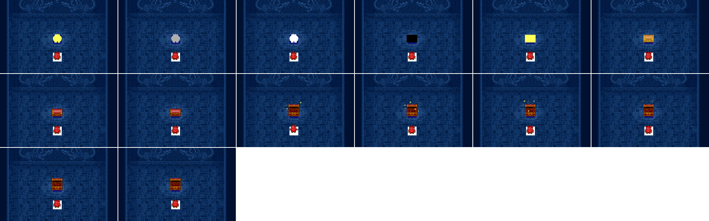

比對用的 `ICON0033`（`WIN11` 播的版本，背景是地圖本身，這裡是透明）：

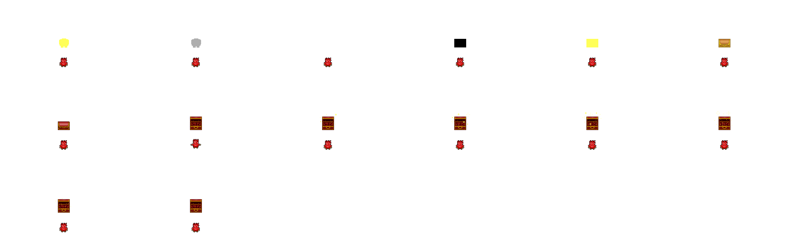

逐格：

<!-- story:S6-media -->
| 格 | 停留（tick） | 音效 | 圖 |
| ---: | ---: | --- | --- |
| 0 | 2 | — | 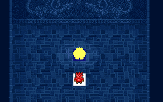 |
| 1 | 2 | [s0](media/story/s6-icon0032-s0.wav) | 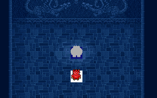 |
| 2 | 2 | — | 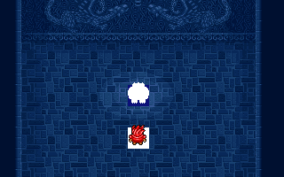 |
| 3 | 2 | — | 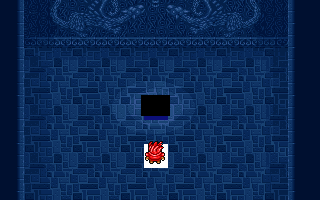 |
| 4 | 2 | — | 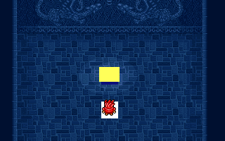 |
| 5 | 2 | — | 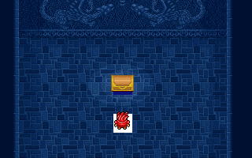 |
| 6 | 2 | — | 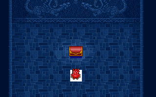 |
| 7 | 2 | [s1](media/story/s6-icon0032-s1.wav) |  |
| 8 | 2 | — |  |
| 9 | 2 | — |  |
| 10 | 2 | — | 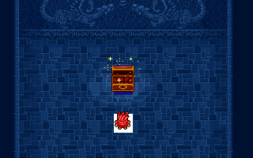 |
| 11 | 2 | — | 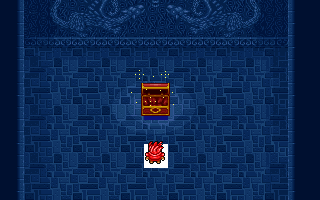 |
| 12 | 2 | — |  |
| 13 | 6 | — | 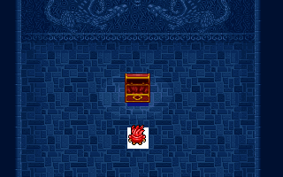 |

- `s0`：11025 Hz、8 bit、9184 取樣（[`s6-icon0032-s0.wav`](media/story/s6-icon0032-s0.wav)）
- `s1`：22050 Hz、8 bit、24000 取樣（[`s6-icon0032-s1.wav`](media/story/s6-icon0032-s1.wav)）
<!-- /story:S6-media -->

### S8 兩首沒被要求播放的 CD 音軌

分類：殘留內容｜`src/cdaudio.c` `fdps_cd_verify_disc_and_play_track`（`0x30cc0`）的章節音軌表（`0x304a0`）、`fdps_cd_set_music_track`（`0x30bf0`）；光碟 1 第 12 軌、光碟 2 第 16 軌

- **是什麼**：光碟 1 的第 12 軌（73.45 秒，音樂索引 `0x0B`）與光碟 2 的第 16 軌（286.33 秒，音樂索引 `0x0F`）。光碟 1 有 22 軌、光碟 2 有 16 軌；音樂索引加 1 就是音軌號，播放時不分光碟（[`cd_audio.md`](../program_info/cd_audio.md)）。
- **為什麼到不了**：要求播放音樂的只有標題畫面（索引 1）、村莊（索引 2）、片尾字幕（索引 1）、過場 opcode 7 與章節音軌表；播區段與播整片的兩支 MSCDEX 包裝沒有呼叫者。章節音軌表 30 列 × 2 格裡沒有 `0x0B` 與 `0x0F`。腳本裡 `0x0B` 只出現在 `WIN21`（第 22 章）與 `ICON24`（第 25 章），`0x0F` 只出現在 `ICON06`、`ICON08`、`WIN06`、`WIN09`、`WIN14`（第 7、9、10、15 章）；而章節索引 `0x12` 以上一定放著光碟 2、以下一定放著光碟 1（`fdps_cd_verify_disc_and_play_track` 不放行錯的光碟）。所以索引 `0x0B` 只在光碟 2 上播到它的第 12 軌、`0x0F` 只在光碟 1 上播到它的第 16 軌，兩片光碟各有一軌從來沒被要求。
- **暗示**：光碟 2 的第 15 軌在光碟 2 上只由第 30 章勝利腳本 `WIN29` 播放。第 16 軌與它的左右聲道平均音量曲線相關係數是 0.72（0.25 秒窗；0.1 秒窗 0.66、1 秒窗 0.78），在光碟 2 其他音軌中最高；波形相關只有 0.15，不是同一份錄音。兩軌是什麼曲子，資料判斷不出來，身分由試聽確認。

音軌轉成的 WAV 體積大，不進版控，以下列指令從光碟映像重生到 `media/cdda/`（44.1 kHz、16 bit、立體聲，CD-DA 取樣原樣寫出）：

```
python tools/cut_content/story.py cdda [--disc1 FDPS_DISC_1.cue] [--disc2 FDPS_DISC_2.cue]
```

產出 `disc1-track12.wav`、`disc2-track16.wav`，以及比對用的 `disc2-track15.wav`。

### S11 18 筆波次 `0xFF` 的部署記錄

分類：殘留內容｜`src/deploy.c` `fdps_deploy_wave`（`0x23830`）；`MAP03.DAT`、`MAP04.DAT`、`MAP07.DAT`、`MAP08.DAT`、`MAP23.DAT`、`MAP27.DAT`

- **是什麼**：6 張戰場上 18 筆完整的部署記錄（單位、等級、裝備、錨點都有），波次 byte（`+0x15`）是 `0xFF`。
- **為什麼到不了**：`fdps_deploy_wave` 以零延伸的波次 byte 與參數比對相等才部署，`0xFF` 只有以 255 呼叫才會出場，而沒有任何路徑以 255 呼叫：章節事件的常數波次最大 15；過場腳本的波次運算元是 1–20，其中 `0xFF` 會換成 opcode `0x63` 三選一問出的答案（1–3）；這 6 張地圖上唯一以回合計數算波次的是第 28 章的 slot 44（回合 ÷ 2），只在第 18 回合以前觸發，最大 9。沒有程式寫部署記錄的 `+0x15`。
- 各章的章節頁列敵人時，這些記錄只寫一行連到這裡。

<!-- story:S11-deploy -->
| 章 | 地圖 | # | 單位 | 等級 | 錨點 |
| ---: | --- | ---: | --- | ---: | --- |
| 4 | `MAP03.DAT` | 27 | `58` 騎兵 | 6 | (9, 21) |
| 4 | `MAP03.DAT` | 28 | `58` 騎兵 | 6 | (9, 21) |
| 4 | `MAP03.DAT` | 32 | `66` 魔導士 | 8 | (21, 18) |
| 5 | `MAP04.DAT` | 10 | `58` 騎兵 | 7 | (0, 16) |
| 5 | `MAP04.DAT` | 11 | `58` 騎兵 | 7 | (2, 14) |
| 5 | `MAP04.DAT` | 12 | `5D` 弓兵 | 7 | (2, 13) |
| 8 | `MAP07.DAT` | 6 | `66` 魔導士 | 13 | (20, 21) |
| 8 | `MAP07.DAT` | 10 | `5D` 弓兵 | 12 | (21, 21) |
| 9 | `MAP08.DAT` | 1 | `5D` 弓兵 | 13 | (16, 11) |
| 24 | `MAP23.DAT` | 72 | `50` 野蠻戰士 | 15 | (4, 16) |
| 24 | `MAP23.DAT` | 73 | `50` 野蠻戰士 | 15 | (4, 16) |
| 24 | `MAP23.DAT` | 74 | `50` 野蠻戰士 | 15 | (4, 16) |
| 24 | `MAP23.DAT` | 75 | `50` 野蠻戰士 | 15 | (4, 16) |
| 24 | `MAP23.DAT` | 76 | `50` 野蠻戰士 | 15 | (4, 16) |
| 24 | `MAP23.DAT` | 77 | `50` 野蠻戰士 | 15 | (4, 16) |
| 24 | `MAP23.DAT` | 78 | `50` 野蠻戰士 | 15 | (4, 16) |
| 24 | `MAP23.DAT` | 79 | `50` 野蠻戰士 | 15 | (4, 16) |
| 28 | `MAP27.DAT` | 4 | `54` 骷顱兵 | 25 | (18, 17) |

共 18 筆。
<!-- /story:S11-deploy -->

### S12 `M09.CEL`：開不到的地圖 09 圖磚表

分類：殘留內容｜`FIELD1.VFS` `M09.CEL`；`src/rsrc.c` `fdps_field_load_chapter_resources`（`0x227e0`）

- **是什麼**：一張完整、可解碼的 96 格 24×24 圖磚表，檔頭與 `M090.CEL` 相同。90 格與 `M090.CEL` 同索引逐像素相同；第 91–95 格是空的，`M090.CEL` 在那裡放了 4 格新圖磚與第 36 格的複本，而 `M090.MPL` 用到其中的 91、93、95；第 33 格是任何其他圖磚表都沒有的圖，`M090.CEL` 在那一格改放第 20 格的複本（`M090.MPL` 不用它）。
- **為什麼到不了**：圖磚表以 `m%02d%d.cel`（地圖編號兩位加圖層一位）組名，地圖 09 的第 0 層得到 `m090.cel`；VFS 查找是整名比對；`FDPS.LE` 沒有其他字串指向 `M09.CEL`。拿它畫地圖 09 會在 91、93、95 缺圖。容器格式與圖磚表的清點見 [`cel.md`](../resource_info/cel.md)。
- **暗示**：它符合 `M090.CEL` 較早版本的樣子——少了地圖實際用到的新圖磚——但檔案本身沒有能證明先後的東西。

`M09.CEL`（左到右、上到下，第 0 格在左上）：

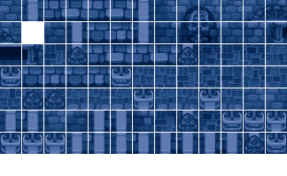

比對用的 `M090.CEL`：

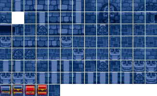

## 空殼

### S3 地圖 30：只有一個全空的文字區塊

分類：空殼｜`FIELD.VFS` `FDETXT31.TXT`

- **是什麼**：以地圖編號命名的整組資源裡，地圖 30 只有文字區塊 `FDETXT31.TXT`（36 byte）：offset 表 9 筆，每筆都只有結束碼，9 條全是空字串。
- **為什麼沒有內容**：沒有 `M30.DTL`、`M30n.MPL`／`.CEL`、`ATTR30n.DAT`、`MAP30.DAT`／`.COD`、`DSC30.DAT`，也沒有任何章節結束處理或過場腳本把章節編號寫成 30（第 30 章的 `fdps_chapter_30_end`（`0x3ba80`）不寫章節編號，打完回標題）。這個區塊永遠不會載入，就算載入也沒有字。
- **暗示**：地圖編號 30 夾在最後一張戰場（29）與過場場景（31 起）之間；66 個文字區塊從 `FDETXT00` 排到 `FDETXT65` 沒有缺號，所以這個編號留下一個空殼區塊。

### S7 過場 opcode 8：播放 `Icon%04d.wav` 的機制，沒有任何 WAV

分類：空殼｜`src/icon.c` `fdps_icon_script_run`（`0x21650`）opcode `0x08`；字串 `Icon%04d.wav`（`0x61994`）

- **是什麼**：opcode 8 以運算元組出 `Icon%04d.wav`，從 `IconAni.vfs` 以 `fdps_vfs_load_file_or_exit`（`0x29400`）載入、交給 `fdps_audio_start_wav`（`0x30a00`）播一次；一次腳本執行最多保留 20 段緩衝，第 21 段起只組名、不載入也不播，腳本結束時才逐一釋放。機制完整。
- **為什麼沒有內容**：66 支過場腳本沒有一支用到 opcode 8；`ICONANI.VFS` 的 133 個成員是 66 個 `.DAT` 與 67 個 `.SAF`，沒有任何 `.WAV`，整個檔案裡也沒有 RIFF 標頭。其他容器的 WAV（`MISC.VFS` 3 個、其內 `BASEWAV.VFS` 9 個）沒有 `Icon` 開頭的，opcode 8 也不讀那些容器。
- **暗示**：過場腳本原本可以在演出中播 WAV（例如語音或專用音效），出貨時一段也沒有放進去；要播的是什麼，判斷不出來。opcode 表見 [`cutscene_script.md`](../resource_info/cutscene_script.md)。

### S17 `ATTR151.DAT`：地圖 15 沒有的第 1 層的屬性表

分類：空殼｜`FIELD2.VFS` `ATTR151.DAT`；`src/rsrc.c` `fdps_field_load_chapter_resources`（`0x227e0`）

- **是什麼**：地圖 15（第 16 章戰場）第 1 層的圖磚屬性表：785 byte、192 列，118 列的地形類別是 6，其餘 74 列全 0；檔頭與有第 1 層的 `ATTR071.DAT`、`ATTR291.DAT` 相同。
- **為什麼沒有內容**：場景圖層依 `DSC` 宣告的層數逐層載入 `MPL`、`CEL`、`ATTR`，而 `DSC15.DAT` 只宣告一層，所以這個檔永遠不會載入；它要描述的那一層也不存在——沒有 `M151.MPL`、`M151.CEL`。只剩屬性表，沒有圖磚與圖面。有第 1 層的地圖是 05、07、29、63（[`terrain.md`](../resource_info/terrain.md)）。
- **暗示**：地圖 15 曾經準備過第二個圖層，或這個檔是從別張地圖的第 1 層屬性表帶過來的；是哪一種，判斷不出來。

## 被封住的內容

### S10 第 28 章波次 4 的三名敵兵

分類：被封住的內容｜`src/chevt6.c` `fdps_chapter_28_event_deploy_wave_for_turn`（`0x39550`）；`MAP27.DAT` 記錄 47–49

- **是什麼**：第 28 章戰場 `MAP27.DAT` 的波次 4：幽魂 1 名、地獄犬 2 名，LV25，錨點在上緣。
- **為什麼到不了**：回合表在第 2、4、6、7、10、12、14、16、18 回合呼叫 slot 44，處理函式以「回合 ÷ 2」（帶號除法、向零截斷）當波次：第 6、7 回合都算成 3，波次 3 部署兩次（`fdps_deploy_wave` 不記錄部署過哪一波），沒有一個回合算得出 4；過場腳本與其他處理函式也不部署地圖 27 的波次 4。內容與觸發的路徑都在，是排程與取整讓它永遠不出場。
- **暗示**：回合表的其他列都是偶數回合，唯獨第 7 回合；那一列若是第 8 回合，÷ 2 正好是 4。是回合表寫錯還是算式寫錯，判斷不出來。
- 依功能等價，重建版照樣封住，不能「修好」它，見 [`pitfalls.md`](../rebuild_info/pitfalls.md) 的第 28 章援軍一列。

<!-- story:S10-deploy -->
| 回合 | 事件 slot | 部署的波次（回合 ÷ 2） |
| ---: | ---: | ---: |
| 2 | 44 | 1 |
| 4 | 44 | 2 |
| 6 | 44 | 3 |
| 7 | 44 | 3 |
| 10 | 44 | 5 |
| 12 | 44 | 6 |
| 14 | 44 | 7 |
| 16 | 44 | 8 |
| 18 | 44 | 9 |

| # | 單位 | 等級 | 波次 | 錨點 |
| ---: | --- | ---: | ---: | --- |
| 44 | `6B` 地獄犬 | 25 | 3 | (10, 0) |
| 45 | `54` 骷顱兵 | 25 | 3 | (11, 0) |
| 46 | `69` 幽魂 | 25 | 3 | (12, 0) |
| 47 | `69` 幽魂 | 25 | 4 | (10, 0) |
| 48 | `6B` 地獄犬 | 25 | 4 | (11, 0) |
| 49 | `6B` 地獄犬 | 25 | 4 | (12, 0) |
<!-- /story:S10-deploy -->

## 前作遺留

### S14 全域文字第 0 條的字模列

分類：前作遺留｜`FIELD.VFS` `FDETXT00.TXT` `0x000`

- **是什麼**：一整列數字與大寫英文字母「0123456789ABCDEFGHIJKLMNOPQRSTUVWXYZ」，也就是字模索引 0–`0x23` 依序排開。
- **為什麼沒作用**：沒有讀取端。名稱表的起點都大於 0，系統訊息也沒有寫死條目 0（[`global_text.md`](../assets/text/global_text.md)）。
- **來歷**：前作 FD2 的共用文字（`FDTXT.DAT` 第 0 項）第 0 頁是同一列字，FD2 的名稱表同樣從第 1 頁起算，那一頁在 FD2 知識庫裡也沒有讀取端。FDPS 把它原封不動帶了過來。

<!-- story:S14-text -->
**`FDETXT00` `0x00`**

```text
0123456789ABCDEFGHIJKLMNOPQRSTUVWXYZ
```
<!-- /story:S14-text -->

## 否定性結論

### S13 章節處理表沒有多餘格、沒有空殼處理函式、影片與分支都用得到

分類：否定性結論｜`src/chapter.c` 的四張處理表（`0x60074`、`0x601c4`、`0x6028c`、`0x60304`）；`src/chinit*.c`、`src/chend*.c`、`src/chpost*.c`；`src/title.c`、`src/ending.c`

- 初始化、行動後檢查、結束三張章節表各剛好 30 格、一章一格，表後緊接的是字串、下一張表或 Miles AIL 的全域變數，沒有第 31 格；腳本事件表（`0x601c4`）50 格全是互不相同的非零處理函式。
- 沒有空殼處理函式：30 支初始化都播開場腳本、畫章名卡，30 支結束都播勝利腳本。行動後檢查只呼叫預設勝敗判定的剛好 10 章（第 2、7、12、13、14、16、18、21、28、29 章），那是這幾章本來就沒有特殊條件；第 1、12 章沒有事件處理函式，也不算空殼。
- 三部影片都會播：標題畫面輪流播 `FD1`、`FD2`，`End` 在第 27 章一般結局與第 30 章播；兩片光碟的根目錄也只有這三組 `.VID`／`.AUD`。
- 結局與勇者徽章兩條分支都走得到：神的聖印在第 16 章流浪工匠事件交給蘭迪斯，第 18 章換成勇者徽章；魔精石碎片在第 24 章挖得到，反禁制器在第 23 章由法蓮娜擊殺死神換得，第 27 章兩件齊備就進隱藏路線。兩邊的另一條都是預設路徑。
- 章節區塊的章名文字（S13a）、搬到過場區塊後留下的舊稿（S13b）、`MAP02.DAT` 第 255 回合的回合事件（S13c）確實存在但不屬於任何一類，列在排除清單。

## 永遠不會顯示的文字總表

每一條有內容卻永遠不會顯示的文字條目，歸屬的條目或排除項。「說明」欄是複本與舊稿在顯示中最接近的一條。空字串不列；只有空字串的 `FDETXT31` 是 S3。

<!-- story:text-index -->
| 區塊 | 條目 | 歸屬 | 說明 |
| --- | --- | --- | --- |
| `FDETXT00` | `0x00` | [S14](#s14-全域文字第-0-條的字模列) |  |
| `FDETXT01` | `0x00` | S13a（[排除清單](_index.md#排除清單)） |  |
| `FDETXT01` | `0x04` | S15（[排除清單](_index.md#排除清單)） | 最接近 `FDETXT09` `0x04`（相符 100%） |
| `FDETXT01` | `0x05` | S15（[排除清單](_index.md#排除清單)） | 最接近 `FDETXT19` `0x05`（相符 100%） |
| `FDETXT01` | `0x06` | S15（[排除清單](_index.md#排除清單)） | 最接近 `FDETXT02` `0x06`（相符 100%） |
| `FDETXT01` | `0x0e` | S13b（[排除清單](_index.md#排除清單)） | 最接近 `FDETXT37` `0x0b`（相符 60%） |
| `FDETXT02` | `0x00` | S13a（[排除清單](_index.md#排除清單)） |  |
| `FDETXT03` | `0x00` | S13a（[排除清單](_index.md#排除清單)） |  |
| `FDETXT03` | `0x0f` | [S4](#s4-寫好卻沒被顯示的對白) |  |
| `FDETXT04` | `0x00` | S13a（[排除清單](_index.md#排除清單)） |  |
| `FDETXT05` | `0x00` | S13a（[排除清單](_index.md#排除清單)） |  |
| `FDETXT06` | `0x00` | S13a（[排除清單](_index.md#排除清單)） |  |
| `FDETXT06` | `0x0b` | S13b（[排除清單](_index.md#排除清單)） | 與 `FDETXT47` `0x09` 逐字相同 |
| `FDETXT06` | `0x0c` | S13b（[排除清單](_index.md#排除清單)） | 與 `FDETXT47` `0x0a` 只差控制碼（換行、換頁或說話者） |
| `FDETXT07` | `0x00` | S13a（[排除清單](_index.md#排除清單)） |  |
| `FDETXT07` | `0x09` | S13b（[排除清單](_index.md#排除清單)） | 與 `FDETXT48` `0x0b` 逐字相同 |
| `FDETXT07` | `0x0a` | S13b（[排除清單](_index.md#排除清單)） | 與 `FDETXT48` `0x0c` 只差控制碼（換行、換頁或說話者） |
| `FDETXT07` | `0x0e`–`0x0f` | [S1](#s1-地圖-49索爾被假索爾擒住) |  |
| `FDETXT08` | `0x00` | S13a（[排除清單](_index.md#排除清單)） |  |
| `FDETXT08` | `0x09` | S13b（[排除清單](_index.md#排除清單)） | 最接近 `FDETXT49` `0x0b`（相符 99%） |
| `FDETXT09` | `0x00` | S13a（[排除清單](_index.md#排除清單)） |  |
| `FDETXT09` | `0x09` | S13b（[排除清單](_index.md#排除清單)） | 與 `FDETXT55` `0x09` 逐字相同 |
| `FDETXT09` | `0x0a` | S13b（[排除清單](_index.md#排除清單)） | 與 `FDETXT55` `0x0a` 逐字相同 |
| `FDETXT09` | `0x0b` | S13b（[排除清單](_index.md#排除清單)） | 與 `FDETXT55` `0x0b` 逐字相同 |
| `FDETXT09` | `0x0c` | S13b（[排除清單](_index.md#排除清單)） | 與 `FDETXT55` `0x0c` 逐字相同 |
| `FDETXT09` | `0x0d` | S13b（[排除清單](_index.md#排除清單)） | 與 `FDETXT56` `0x09` 逐字相同 |
| `FDETXT09` | `0x0e` | S13b（[排除清單](_index.md#排除清單)） | 與 `FDETXT56` `0x0a` 逐字相同 |
| `FDETXT09` | `0x0f` | S13b（[排除清單](_index.md#排除清單)） | 與 `FDETXT56` `0x0b` 逐字相同 |
| `FDETXT09` | `0x10` | S13b（[排除清單](_index.md#排除清單)） | 與 `FDETXT56` `0x0c` 逐字相同 |
| `FDETXT09` | `0x11` | [S4](#s4-寫好卻沒被顯示的對白) |  |
| `FDETXT09` | `0x14` | S13b（[排除清單](_index.md#排除清單)） | 與 `FDETXT58` `0x09` 只差控制碼（換行、換頁或說話者） |
| `FDETXT09` | `0x15` | S13b（[排除清單](_index.md#排除清單)） | 與 `FDETXT58` `0x0a` 逐字相同 |
| `FDETXT09` | `0x16` | S13b（[排除清單](_index.md#排除清單)） | 與 `FDETXT58` `0x0b` 逐字相同 |
| `FDETXT10` | `0x00` | S13a（[排除清單](_index.md#排除清單)） |  |
| `FDETXT10` | `0x09` | S13b（[排除清單](_index.md#排除清單)） | 最接近 `FDETXT38` `0x09`（相符 99%） |
| `FDETXT10` | `0x0a` | S13b（[排除清單](_index.md#排除清單)） | 與 `FDETXT38` `0x0a` 逐字相同 |
| `FDETXT10` | `0x0b` | S13b（[排除清單](_index.md#排除清單)） | 與 `FDETXT38` `0x0b` 逐字相同 |
| `FDETXT10` | `0x0c` | S13b（[排除清單](_index.md#排除清單)） | 最接近 `FDETXT39` `0x09`（相符 100%） |
| `FDETXT10` | `0x0d` | S13b（[排除清單](_index.md#排除清單)） | 與 `FDETXT39` `0x0a` 只差控制碼（換行、換頁或說話者） |
| `FDETXT10` | `0x0e` | S13b（[排除清單](_index.md#排除清單)） | 與 `FDETXT39` `0x0b` 逐字相同 |
| `FDETXT10` | `0x0f` | S13b（[排除清單](_index.md#排除清單)） | 與 `FDETXT39` `0x0c` 只差控制碼（換行、換頁或說話者） |
| `FDETXT10` | `0x10` | S13b（[排除清單](_index.md#排除清單)） | 與 `FDETXT39` `0x0d` 逐字相同 |
| `FDETXT10` | `0x11` | S13b（[排除清單](_index.md#排除清單)） | 與 `FDETXT38` `0x0c` 逐字相同 |
| `FDETXT11` | `0x00` | S13a（[排除清單](_index.md#排除清單)） |  |
| `FDETXT12` | `0x00` | S13a（[排除清單](_index.md#排除清單)） |  |
| `FDETXT12` | `0x09` | S13b（[排除清單](_index.md#排除清單)） | 與 `FDETXT53` `0x09` 逐字相同 |
| `FDETXT12` | `0x0a` | S13b（[排除清單](_index.md#排除清單)） | 與 `FDETXT54` `0x09` 逐字相同 |
| `FDETXT12` | `0x0b` | S13b（[排除清單](_index.md#排除清單)） | 與 `FDETXT54` `0x0a` 逐字相同 |
| `FDETXT13` | `0x00` | S13a（[排除清單](_index.md#排除清單)） |  |
| `FDETXT14` | `0x00` | S13a（[排除清單](_index.md#排除清單)） |  |
| `FDETXT15` | `0x00` | S13a（[排除清單](_index.md#排除清單)） |  |
| `FDETXT16` | `0x00` | S13a（[排除清單](_index.md#排除清單)） |  |
| `FDETXT17` | `0x00` | S13a（[排除清單](_index.md#排除清單)） |  |
| `FDETXT18` | `0x00` | S13a（[排除清單](_index.md#排除清單)） |  |
| `FDETXT18` | `0x0f` | S13b（[排除清單](_index.md#排除清單)） | 最接近 `FDETXT46` `0x09`（相符 98%） |
| `FDETXT19` | `0x00` | S13a（[排除清單](_index.md#排除清單)） |  |
| `FDETXT19` | `0x0b` | [S4](#s4-寫好卻沒被顯示的對白) |  |
| `FDETXT19` | `0x0c` | S13b（[排除清單](_index.md#排除清單)） | 與 `FDETXT45` `0x09` 只差控制碼（換行、換頁或說話者） |
| `FDETXT20` | `0x00` | S13a（[排除清單](_index.md#排除清單)） |  |
| `FDETXT20` | `0x09` | S13b（[排除清單](_index.md#排除清單)） | 與 `FDETXT59` `0x09` 逐字相同 |
| `FDETXT20` | `0x0a` | S13b（[排除清單](_index.md#排除清單)） | 與 `FDETXT59` `0x0a` 逐字相同 |
| `FDETXT20` | `0x0b` | S13b（[排除清單](_index.md#排除清單)） | 與 `FDETXT59` `0x0b` 逐字相同 |
| `FDETXT20` | `0x0c` | S13b（[排除清單](_index.md#排除清單)） | 最接近 `FDETXT59` `0x0c`（相符 99%） |
| `FDETXT20` | `0x0d` | S13b（[排除清單](_index.md#排除清單)） | 與 `FDETXT59` `0x0d` 逐字相同 |
| `FDETXT21` | `0x00` | S13a（[排除清單](_index.md#排除清單)） |  |
| `FDETXT21` | `0x09` | [S4](#s4-寫好卻沒被顯示的對白) |  |
| `FDETXT21` | `0x0b` | S13b（[排除清單](_index.md#排除清單)） | 與 `FDETXT52` `0x0b` 逐字相同 |
| `FDETXT21` | `0x0c` | S13b（[排除清單](_index.md#排除清單)） | 與 `FDETXT52` `0x0c` 逐字相同 |
| `FDETXT21` | `0x0d` | S13b（[排除清單](_index.md#排除清單)） | 與 `FDETXT52` `0x0d` 逐字相同 |
| `FDETXT21` | `0x0e` | S13b（[排除清單](_index.md#排除清單)） | 與 `FDETXT52` `0x0e` 逐字相同 |
| `FDETXT21` | `0x0f` | S13b（[排除清單](_index.md#排除清單)） | 與 `FDETXT52` `0x0f` 只差控制碼（換行、換頁或說話者） |
| `FDETXT21` | `0x10` | S13b（[排除清單](_index.md#排除清單)） | 與 `FDETXT52` `0x10` 逐字相同 |
| `FDETXT21` | `0x11` | S13b（[排除清單](_index.md#排除清單)） | 與 `FDETXT52` `0x11` 逐字相同 |
| `FDETXT21` | `0x12` | S13b（[排除清單](_index.md#排除清單)） | 與 `FDETXT52` `0x12` 逐字相同 |
| `FDETXT21` | `0x13` | S13b（[排除清單](_index.md#排除清單)） | 與 `FDETXT52` `0x13` 只差控制碼（換行、換頁或說話者） |
| `FDETXT22` | `0x00` | S13a（[排除清單](_index.md#排除清單)） |  |
| `FDETXT22` | `0x0b` | [S4](#s4-寫好卻沒被顯示的對白) |  |
| `FDETXT23` | `0x00` | S13a（[排除清單](_index.md#排除清單)） |  |
| `FDETXT23` | `0x0e` | S13b（[排除清單](_index.md#排除清單)） | 與 `FDETXT51` `0x09` 逐字相同 |
| `FDETXT23` | `0x0f` | S13b（[排除清單](_index.md#排除清單)） | 與 `FDETXT51` `0x0a` 逐字相同 |
| `FDETXT23` | `0x10` | S13b（[排除清單](_index.md#排除清單)） | 與 `FDETXT51` `0x0b` 逐字相同 |
| `FDETXT23` | `0x11` | S13b（[排除清單](_index.md#排除清單)） | 與 `FDETXT51` `0x0c` 逐字相同 |
| `FDETXT23` | `0x12` | S13b（[排除清單](_index.md#排除清單)） | 與 `FDETXT51` `0x0d` 逐字相同 |
| `FDETXT23` | `0x13` | S13b（[排除清單](_index.md#排除清單)） | 與 `FDETXT51` `0x0e` 只差控制碼（換行、換頁或說話者） |
| `FDETXT24` | `0x00` | S13a（[排除清單](_index.md#排除清單)） |  |
| `FDETXT24` | `0x0d` | [S4](#s4-寫好卻沒被顯示的對白) |  |
| `FDETXT24` | `0x0f` | [S4](#s4-寫好卻沒被顯示的對白) |  |
| `FDETXT25` | `0x00` | S13a（[排除清單](_index.md#排除清單)） |  |
| `FDETXT25` | `0x09` | S13b（[排除清單](_index.md#排除清單)） | 與 `FDETXT57` `0x09` 逐字相同 |
| `FDETXT25` | `0x0b`–`0x0d` | [S4](#s4-寫好卻沒被顯示的對白) |  |
| `FDETXT25` | `0x0e` | S13b（[排除清單](_index.md#排除清單)） | 最接近 `FDETXT60` `0x0b`（相符 54%） |
| `FDETXT25` | `0x0f` | S13b（[排除清單](_index.md#排除清單)） | 與 `FDETXT60` `0x0c` 逐字相同 |
| `FDETXT25` | `0x10` | S13b（[排除清單](_index.md#排除清單)） | 與 `FDETXT51` `0x0d` 逐字相同 |
| `FDETXT25` | `0x11` | S13b（[排除清單](_index.md#排除清單)） | 與 `FDETXT60` `0x0f` 逐字相同 |
| `FDETXT26` | `0x00` | S13a（[排除清單](_index.md#排除清單)） |  |
| `FDETXT27` | `0x00` | S13a（[排除清單](_index.md#排除清單)） |  |
| `FDETXT27` | `0x0c`–`0x0d` | [S4](#s4-寫好卻沒被顯示的對白) |  |
| `FDETXT27` | `0x13` | S13b（[排除清單](_index.md#排除清單)） | 最接近 `FDETXT62` `0x09`（相符 85%） |
| `FDETXT27` | `0x15`–`0x18` | [S4](#s4-寫好卻沒被顯示的對白) |  |
| `FDETXT27` | `0x1c` | S4a（[排除清單](_index.md#排除清單)） |  |
| `FDETXT28` | `0x00` | S13a（[排除清單](_index.md#排除清單)） |  |
| `FDETXT29` | `0x00` | S13a（[排除清單](_index.md#排除清單)） |  |
| `FDETXT30` | `0x00` | S13a（[排除清單](_index.md#排除清單)） |  |
| `FDETXT30` | `0x0d`–`0x0e` | [S4](#s4-寫好卻沒被顯示的對白) |  |
| `FDETXT30` | `0x13`–`0x14` | [S4](#s4-寫好卻沒被顯示的對白) |  |
| `FDETXT30` | `0x15` | S13b（[排除清單](_index.md#排除清單)） | 與 `FDETXT65` `0x09` 逐字相同 |
| `FDETXT30` | `0x16` | S13b（[排除清單](_index.md#排除清單)） | 與 `FDETXT65` `0x0a` 逐字相同 |
| `FDETXT30` | `0x17` | S13b（[排除清單](_index.md#排除清單)） | 與 `FDETXT65` `0x0b` 逐字相同 |
| `FDETXT30` | `0x18` | S13b（[排除清單](_index.md#排除清單)） | 與 `FDETXT65` `0x0c` 逐字相同 |
| `FDETXT30` | `0x19` | S13b（[排除清單](_index.md#排除清單)） | 與 `FDETXT65` `0x0d` 逐字相同 |
| `FDETXT30` | `0x1a` | S13b（[排除清單](_index.md#排除清單)） | 與 `FDETXT65` `0x0e` 逐字相同 |
| `FDETXT30` | `0x1b` | S13b（[排除清單](_index.md#排除清單)） | 與 `FDETXT65` `0x0f` 逐字相同 |
| `FDETXT30` | `0x1c` | S13b（[排除清單](_index.md#排除清單)） | 與 `FDETXT65` `0x10` 逐字相同 |
| `FDETXT30` | `0x1d` | S13b（[排除清單](_index.md#排除清單)） | 與 `FDETXT65` `0x11` 逐字相同 |
| `FDETXT30` | `0x1e` | S13b（[排除清單](_index.md#排除清單)） | 與 `FDETXT65` `0x12` 只差控制碼（換行、換頁或說話者） |
| `FDETXT30` | `0x1f` | S13b（[排除清單](_index.md#排除清單)） | 與 `FDETXT65` `0x13` 逐字相同 |
| `FDETXT32` | `0x09`–`0x12` | [S2](#s2-地圖-31-與-33第-1-章開場場景的兩塊獨立版本) |  |
| `FDETXT34` | `0x09`–`0x12` | [S2](#s2-地圖-31-與-33第-1-章開場場景的兩塊獨立版本) |  |
| `FDETXT41` | `0x00`–`0x03` | 待判定 |  |
| `FDETXT41` | `0x09` | S15（[排除清單](_index.md#排除清單)） | 與 `FDETXT53` `0x09` 逐字相同 |
| `FDETXT41` | `0x16` | S15（[排除清單](_index.md#排除清單)） | 與 `FDETXT54` `0x09` 逐字相同 |
| `FDETXT42` | `0x00`–`0x03` | 待判定 |  |
| `FDETXT42` | `0x09` | S15（[排除清單](_index.md#排除清單)） | 與 `FDETXT53` `0x09` 逐字相同 |
| `FDETXT42` | `0x0a` | S15（[排除清單](_index.md#排除清單)） | 與 `FDETXT41` `0x0a` 逐字相同 |
| `FDETXT42` | `0x0b` | S15（[排除清單](_index.md#排除清單)） | 與 `FDETXT41` `0x0b` 逐字相同 |
| `FDETXT42` | `0x0c` | S15（[排除清單](_index.md#排除清單)） | 與 `FDETXT41` `0x0c` 逐字相同 |
| `FDETXT42` | `0x0d` | S15（[排除清單](_index.md#排除清單)） | 與 `FDETXT41` `0x0d` 逐字相同 |
| `FDETXT42` | `0x0e` | S15（[排除清單](_index.md#排除清單)） | 與 `FDETXT41` `0x0e` 逐字相同 |
| `FDETXT42` | `0x0f` | S15（[排除清單](_index.md#排除清單)） | 與 `FDETXT41` `0x0f` 逐字相同 |
| `FDETXT42` | `0x10` | S15（[排除清單](_index.md#排除清單)） | 與 `FDETXT41` `0x10` 逐字相同 |
| `FDETXT42` | `0x11` | S15（[排除清單](_index.md#排除清單)） | 與 `FDETXT41` `0x11` 逐字相同 |
| `FDETXT42` | `0x12` | S15（[排除清單](_index.md#排除清單)） | 與 `FDETXT41` `0x12` 逐字相同 |
| `FDETXT42` | `0x13` | S15（[排除清單](_index.md#排除清單)） | 與 `FDETXT41` `0x13` 逐字相同 |
| `FDETXT42` | `0x14` | S15（[排除清單](_index.md#排除清單)） | 與 `FDETXT41` `0x14` 逐字相同 |
| `FDETXT42` | `0x15` | S15（[排除清單](_index.md#排除清單)） | 與 `FDETXT41` `0x15` 逐字相同 |
| `FDETXT42` | `0x16` | S15（[排除清單](_index.md#排除清單)） | 與 `FDETXT54` `0x09` 逐字相同 |
| `FDETXT43` | `0x00`–`0x03` | 待判定 |  |
| `FDETXT43` | `0x09` | S15（[排除清單](_index.md#排除清單)） | 與 `FDETXT53` `0x09` 逐字相同 |
| `FDETXT43` | `0x0a` | S15（[排除清單](_index.md#排除清單)） | 與 `FDETXT41` `0x0a` 逐字相同 |
| `FDETXT43` | `0x0b` | S15（[排除清單](_index.md#排除清單)） | 與 `FDETXT41` `0x0b` 逐字相同 |
| `FDETXT43` | `0x0c` | S15（[排除清單](_index.md#排除清單)） | 與 `FDETXT41` `0x0c` 逐字相同 |
| `FDETXT43` | `0x0d` | S15（[排除清單](_index.md#排除清單)） | 與 `FDETXT41` `0x0d` 逐字相同 |
| `FDETXT43` | `0x0e` | S15（[排除清單](_index.md#排除清單)） | 與 `FDETXT41` `0x0e` 逐字相同 |
| `FDETXT43` | `0x0f` | S15（[排除清單](_index.md#排除清單)） | 與 `FDETXT41` `0x0f` 逐字相同 |
| `FDETXT43` | `0x10` | S15（[排除清單](_index.md#排除清單)） | 與 `FDETXT41` `0x10` 逐字相同 |
| `FDETXT43` | `0x11` | S15（[排除清單](_index.md#排除清單)） | 與 `FDETXT41` `0x11` 逐字相同 |
| `FDETXT43` | `0x12` | S15（[排除清單](_index.md#排除清單)） | 與 `FDETXT41` `0x12` 逐字相同 |
| `FDETXT43` | `0x13` | S15（[排除清單](_index.md#排除清單)） | 與 `FDETXT41` `0x13` 逐字相同 |
| `FDETXT43` | `0x14` | S15（[排除清單](_index.md#排除清單)） | 與 `FDETXT41` `0x14` 逐字相同 |
| `FDETXT43` | `0x15` | S15（[排除清單](_index.md#排除清單)） | 與 `FDETXT41` `0x15` 逐字相同 |
| `FDETXT43` | `0x16` | S15（[排除清單](_index.md#排除清單)） | 與 `FDETXT54` `0x09` 逐字相同 |
| `FDETXT44` | `0x00`–`0x03` | 待判定 |  |
| `FDETXT45` | `0x00`–`0x03` | 待判定 |  |
| `FDETXT46` | `0x00`–`0x03` | 待判定 |  |
| `FDETXT47` | `0x00`–`0x03` | 待判定 |  |
| `FDETXT48` | `0x00`–`0x03` | 待判定 |  |
| `FDETXT49` | `0x00`–`0x03` | 待判定 |  |
| `FDETXT50` | `0x00`–`0x03` | 待判定 |  |
| `FDETXT50` | `0x09`–`0x0d` | [S1](#s1-地圖-49索爾被假索爾擒住) |  |
| `FDETXT51` | `0x00`–`0x03` | 待判定 |  |
| `FDETXT52` | `0x00`–`0x03` | 待判定 |  |
| `FDETXT52` | `0x09` | [S4](#s4-寫好卻沒被顯示的對白) |  |
| `FDETXT52` | `0x0a` | S15（[排除清單](_index.md#排除清單)） | 與 `FDETXT21` `0x0a` 逐字相同 |
| `FDETXT53` | `0x00`–`0x08` | [S5](#s5-過場區塊裡的舊版村莊台詞) |  |
| `FDETXT54` | `0x00`–`0x08` | [S5](#s5-過場區塊裡的舊版村莊台詞) |  |
| `FDETXT55` | `0x00`–`0x03` | 待判定 |  |
| `FDETXT56` | `0x00`–`0x03` | 待判定 |  |
| `FDETXT56` | `0x0d` | [S4](#s4-寫好卻沒被顯示的對白) |  |
| `FDETXT57` | `0x00`–`0x08` | [S5](#s5-過場區塊裡的舊版村莊台詞) |  |
| `FDETXT58` | `0x00`–`0x08` | [S5](#s5-過場區塊裡的舊版村莊台詞) |  |
| `FDETXT59` | `0x00`–`0x08` | [S5](#s5-過場區塊裡的舊版村莊台詞) |  |
| `FDETXT59` | `0x0e` | S15（[排除清單](_index.md#排除清單)） | 最接近 `FDETXT20` `0x0e`（相符 99%） |
| `FDETXT59` | `0x0f` | S15（[排除清單](_index.md#排除清單)） | 與 `FDETXT20` `0x0f` 逐字相同 |
| `FDETXT59` | `0x10` | S15（[排除清單](_index.md#排除清單)） | 與 `FDETXT20` `0x10` 逐字相同 |
| `FDETXT59` | `0x11` | S15（[排除清單](_index.md#排除清單)） | 與 `FDETXT20` `0x11` 逐字相同 |
| `FDETXT60` | `0x00`–`0x08` | [S5](#s5-過場區塊裡的舊版村莊台詞) |  |
| `FDETXT61` | `0x00`–`0x08` | [S5](#s5-過場區塊裡的舊版村莊台詞) |  |
| `FDETXT62` | `0x00`–`0x03` | 待判定 |  |
| `FDETXT62` | `0x0b` | S15（[排除清單](_index.md#排除清單)） | 最接近 `FDETXT16` `0x09`（相符 86%） |
| `FDETXT63` | `0x00`–`0x03` | 待判定 |  |
| `FDETXT63` | `0x09`–`0x0b` | 待判定 |  |
| `FDETXT64` | `0x00`–`0x03` | 待判定 |  |
| `FDETXT64` | `0x17` | S15（[排除清單](_index.md#排除清單)） | 與 `FDETXT65` `0x09` 逐字相同 |
| `FDETXT64` | `0x18` | S15（[排除清單](_index.md#排除清單)） | 與 `FDETXT65` `0x0a` 逐字相同 |
| `FDETXT64` | `0x19` | S15（[排除清單](_index.md#排除清單)） | 與 `FDETXT65` `0x0b` 逐字相同 |
| `FDETXT64` | `0x1a` | S15（[排除清單](_index.md#排除清單)） | 與 `FDETXT65` `0x0c` 逐字相同 |
| `FDETXT64` | `0x1b` | S15（[排除清單](_index.md#排除清單)） | 與 `FDETXT65` `0x0d` 逐字相同 |
| `FDETXT64` | `0x1c` | S15（[排除清單](_index.md#排除清單)） | 與 `FDETXT65` `0x0e` 逐字相同 |
| `FDETXT64` | `0x1d` | S15（[排除清單](_index.md#排除清單)） | 與 `FDETXT65` `0x0f` 逐字相同 |
| `FDETXT64` | `0x1e` | S15（[排除清單](_index.md#排除清單)） | 與 `FDETXT65` `0x10` 逐字相同 |
| `FDETXT64` | `0x1f` | S15（[排除清單](_index.md#排除清單)） | 與 `FDETXT65` `0x11` 逐字相同 |
| `FDETXT64` | `0x20` | S15（[排除清單](_index.md#排除清單)） | 與 `FDETXT65` `0x12` 只差控制碼（換行、換頁或說話者） |
| `FDETXT64` | `0x21` | S15（[排除清單](_index.md#排除清單)） | 與 `FDETXT65` `0x13` 逐字相同 |
| `FDETXT65` | `0x00`–`0x03` | 待判定 |  |
<!-- /story:text-index -->
