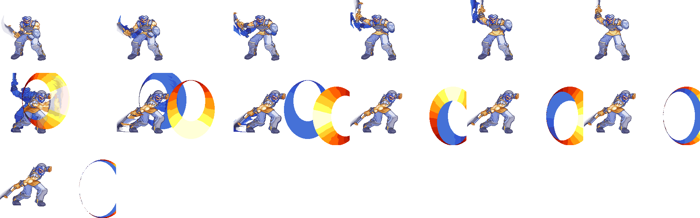
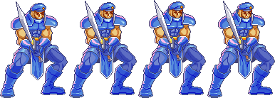
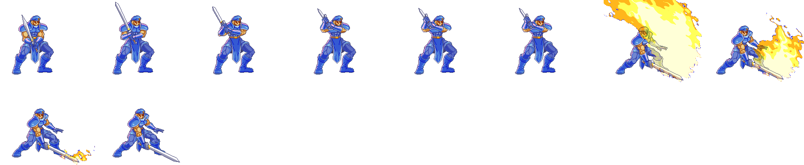
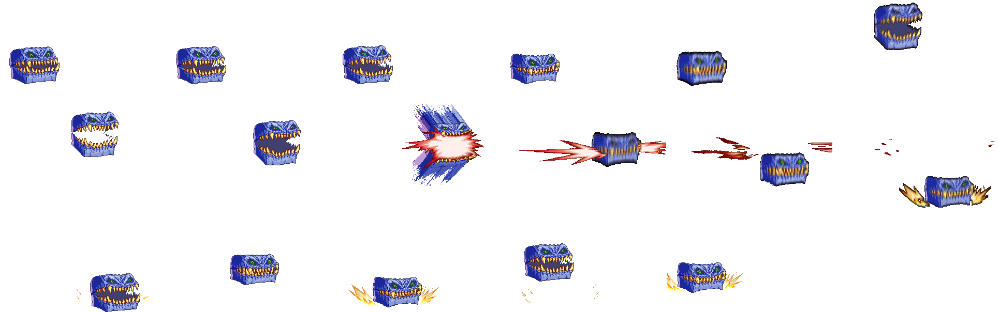

# 刪減與未用：角色、敵人、職業

角色、敵兵與職業留下的痕跡：做好了頭像、棋子圖示、戰鬥動畫或數值卻從未上場的角色與敵兵，沒有單位使用的職業，沒有轉職路線指向的成長資料，指向空記錄的習得索引。每條寫它在哪些資料檔、內容有多完整、為什麼沒有任何遊戲路徑到得了。分類的判定規則見 [`_index.md`](_index.md)；其實有在用的資料與不屬於任何一類的缺檔列在那裡的排除清單，不在這裡。

名稱取 `FDETXT00.TXT` 第「角色編號 + 1」條（單位）與第「`0xA1` + 職業代碼」條（職業），見 [`global_text.md`](../assets/text/global_text.md)。角色編號就是肖像編號，也是 `FACE.CEL` 的頭像索引、`ICON.CEL` 的棋子圖示群組（每組 12 格）與戰鬥動畫 `STAND%03d.SAF`／`ACT%03d.SAF` 的十進位編號；編號小於 `0x3C` 查 `FRIAPRDA.DAT`／`FRILEVUP.DAT`，以上查 `ENEMYDAT.DAT` 第「編號 − `0x3C`」筆（[`characters.md`](../assets/characters.md)、[`enemies.md`](../assets/enemies.md)）。

一個單位的角色編號只有三個來源：地圖部署記錄（`fdps_deploy_unit`，`0x232b0`，`src/deploy.c`）、入隊（`fdps_roster_add_character`，`0x23bc0`，`src/roster.c`，呼叫端只傳常數 `00`–`0C`）與教會轉職（`fdps_church_promote_unit`，`0x34c10`，`src/church.c`，寫入 `RANKUP.DAT` 路線的型態）。職業代碼（單位記錄 `+0x20`）同樣只在這三處寫入，分別抄 `FRIAPRDA.DAT`／`ENEMYDAT.DAT`、`FRIAPRDA.DAT` 與 `RANKUP.DAT`。下面說「沒有來源」時，指的就是這三處都不會產生該值；部署記錄的普查涵蓋 `FIELD.VFS` 的 63 個 `MAP%02d.DAT`（缺 30、33），連 `MAP31.DAT` 筆數以外的記錄也算在內。

素材由 [`tools/cut_content/`](../tools/cut_content/_index.md) 從原版遊戲檔重生：`python tools/cut_content/cut_content.py media units`。頭像與棋子圖示以 `FDE.PAL` 算圖，戰鬥動畫以 `FIGHT.PAL` 算圖；動畫每格照遊戲的合成方式畫在 320×200 的戰鬥畫面上，再裁到能容納整段動畫所有格的最小框，所以同一段動畫的各格位置互相對齊。棋子圖示一張圖排 12 格，順序就是群組內的格號。

## 殘留內容

### U01 四種從未部署的敵兵

分類：殘留內容｜`ENEMYDAT.DAT` 第 27、32、50、51 筆（`+0x10E`、`+0x140`、`+0x1F4`、`+0x1FE`）；`FACE.CEL`、`ICON.CEL`；`FIGHT.VFS` `STAND087`／`092`／`110`／`111.SAF`、`FIGACT.VFS` `ACT087`／`092`／`110`／`111.SAF`

- **是什麼**：角色編號 `57` 傭兵戰士、`5C` 禁衛隊、`6E` 寶箱怪、`6F` 寶箱妖精四種敵兵。名字、頭像、12 格棋子圖示（兩種寶箱各有開蓋的畫格）、戰鬥的待機動畫 `STAND` 與攻擊動畫 `ACT` 全部齊全，攻擊動畫各帶一段內嵌音效。`ENEMYDAT.DAT` 的四筆是同一列 `01 02 12 00 00 05 02 01 04 1E`（種族 `01` 妖鬼、職業 `02` 劍帝、HP 係數 18、AP 5、DP 2、DX 1、MV 4、經驗倍率 30），這一列也是第 57–67、69–90 筆共用的樣板列，所以數值不是為這四種敵兵各自調的，但套上去就能部署與戰鬥。
- **為什麼到不了**：63 個 `MAP%02d.DAT` 的全部部署記錄沒有一筆的角色編號是這四個值——`0x3C`–`0x9C` 之間只有這四個從未出現；入隊與轉職只產生 `00`–`0C` 與 `0F`–`21`。過場腳本不會自己帶角色編號建立單位，只能以 `DEPLOY_WAVE` 部署地圖的部署記錄（`src/icon.c`）。對白的說話者代碼 `-0x11` 在場上找不到指定角色時會直接拿運算元當頭像，但 66 個 `FDETXT` 沒有任何一個運算元是這四個值，所以頭像也不會在對話框出現。攻擊動畫裡的四段音效只存在於這幾個檔（`ACT110` 與 `ACT111` 共用同一段），遊戲中聽不到。
- **暗示**：兩種寶箱怪是會開蓋咬人的擬態寶箱，傭兵戰士與禁衛隊是一般的人類兵種。它們的動畫與圖示都是專門繪製的成品，卻共用過場演員的樣板數值，說明設計停在數值還沒調、關卡還沒放的階段；原本打算放在哪一章，資料判斷不出來。以 `FIGHT.PAL` 算圖時，戰鬥動畫的寶箱怪是藍色、寶箱妖精是紅色，與頭像和棋子圖示（寶箱怪紅、寶箱妖精藍）顛倒。

**傭兵戰士（`57`，`ENEMYDAT.DAT` 第 27 筆）**

 

- `STAND087` 逐格：[f00](media/units/u01-stand087-f00.png)、[f01](media/units/u01-stand087-f01.png)、[f02](media/units/u01-stand087-f02.png)、[f03](media/units/u01-stand087-f03.png)
- `ACT087` 逐格：[f00](media/units/u01-act087-f00.png)、[f01](media/units/u01-act087-f01.png)、[f02](media/units/u01-act087-f02.png)、[f03](media/units/u01-act087-f03.png)、[f04](media/units/u01-act087-f04.png)、[f05](media/units/u01-act087-f05.png)、[f06](media/units/u01-act087-f06.png)、[f07](media/units/u01-act087-f07.png)、[f08](media/units/u01-act087-f08.png)、[f09](media/units/u01-act087-f09.png)、[f10](media/units/u01-act087-f10.png)、[f11](media/units/u01-act087-f11.png)、[f12](media/units/u01-act087-f12.png)
- `ACT087` 音效（11,025 Hz、8-bit、0.95 秒）：[s0](media/units/u01-act087-s0.wav)

**禁衛隊（`5C`，`ENEMYDAT.DAT` 第 32 筆）**

 

- `STAND092` 逐格：[f00](media/units/u01-stand092-f00.png)、[f01](media/units/u01-stand092-f01.png)、[f02](media/units/u01-stand092-f02.png)、[f03](media/units/u01-stand092-f03.png)
- `ACT092` 逐格：[f00](media/units/u01-act092-f00.png)、[f01](media/units/u01-act092-f01.png)、[f02](media/units/u01-act092-f02.png)、[f03](media/units/u01-act092-f03.png)、[f04](media/units/u01-act092-f04.png)、[f05](media/units/u01-act092-f05.png)、[f06](media/units/u01-act092-f06.png)、[f07](media/units/u01-act092-f07.png)、[f08](media/units/u01-act092-f08.png)、[f09](media/units/u01-act092-f09.png)
- `ACT092` 音效（11,025 Hz、8-bit、0.68 秒）：[s0](media/units/u01-act092-s0.wav)

**寶箱怪（`6E`，`ENEMYDAT.DAT` 第 50 筆）**

 

- `STAND110` 逐格：[f00](media/units/u01-stand110-f00.png)、[f01](media/units/u01-stand110-f01.png)、[f02](media/units/u01-stand110-f02.png)、[f03](media/units/u01-stand110-f03.png)
- `ACT110` 逐格：[f00](media/units/u01-act110-f00.png)、[f01](media/units/u01-act110-f01.png)、[f02](media/units/u01-act110-f02.png)、[f03](media/units/u01-act110-f03.png)、[f04](media/units/u01-act110-f04.png)、[f05](media/units/u01-act110-f05.png)、[f06](media/units/u01-act110-f06.png)、[f07](media/units/u01-act110-f07.png)、[f08](media/units/u01-act110-f08.png)、[f09](media/units/u01-act110-f09.png)、[f10](media/units/u01-act110-f10.png)、[f11](media/units/u01-act110-f11.png)、[f12](media/units/u01-act110-f12.png)、[f13](media/units/u01-act110-f13.png)、[f14](media/units/u01-act110-f14.png)、[f15](media/units/u01-act110-f15.png)、[f16](media/units/u01-act110-f16.png)
- `ACT110` 音效（11,025 Hz、8-bit、0.82 秒）：[s0](media/units/u01-act110-s0.wav)

**寶箱妖精（`6F`，`ENEMYDAT.DAT` 第 51 筆）**

 

- `STAND111` 逐格：[f00](media/units/u01-stand111-f00.png)、[f01](media/units/u01-stand111-f01.png)、[f02](media/units/u01-stand111-f02.png)、[f03](media/units/u01-stand111-f03.png)
- `ACT111` 逐格：[f00](media/units/u01-act111-f00.png)、[f01](media/units/u01-act111-f01.png)、[f02](media/units/u01-act111-f02.png)、[f03](media/units/u01-act111-f03.png)、[f04](media/units/u01-act111-f04.png)、[f05](media/units/u01-act111-f05.png)、[f06](media/units/u01-act111-f06.png)、[f07](media/units/u01-act111-f07.png)、[f08](media/units/u01-act111-f08.png)、[f09](media/units/u01-act111-f09.png)、[f10](media/units/u01-act111-f10.png)、[f11](media/units/u01-act111-f11.png)、[f12](media/units/u01-act111-f12.png)、[f13](media/units/u01-act111-f13.png)、[f14](media/units/u01-act111-f14.png)、[f15](media/units/u01-act111-f15.png)、[f16](media/units/u01-act111-f16.png)、[f17](media/units/u01-act111-f17.png)
- `ACT111` 音效（與 `ACT110` 同一段）：[s0](media/units/u01-act111-s0.wav)

### U02 肖像 52：只有頭像與棋子圖示的角色

分類：殘留內容｜`FACE.CEL` 第 52 張；`ICON.CEL` 群組 52（第 624–635 格）；`FRIAPRDA.DAT` `+0x4E0`、`FRILEVUP.DAT` `+0x23C`

- **是什麼**：藍髮、金色額環（中央一顆紅寶石）、淺色領巾、紅色高領披風的青年，頭像與 12 格棋子圖示（藍長髮、紅衣，四個方向的走路動作）都是完成品，而前後的第 48–51、53–58 張頭像都是空白。
- **為什麼到不了**：沒有任何來源產生角色編號 `34`：部署記錄、入隊常數、`RANKUP.DAT` 的轉職型態都沒有這個值，66 個 `FDETXT` 的說話者代碼也沒有指名它。它也沒有別的東西可用：名字（`FDETXT00` 第 `0x35` 條）是空字串，`FIGHT.VFS`／`FIGACT.VFS`／`MISC.VFS` 沒有 `STAND052`、`ACT052`、`MAGIC052`。
- **不算的部分**：`FRIAPRDA.DAT` 索引 `34` 與 `02` 費塔加逐 byte 相同，但那是 `32`–`3A` 整段依序複製 `00`–`08` 的一部分（見 U07），不是為這個角色準備的數值；`FRILEVUP.DAT` 索引 `34` 全是 0。名字空白也不是它獨有，`0x10` 以後大多數單位名條目都是空的。
- **暗示**：一名畫好了頭像與棋子圖示、還沒有名字、數值與戰鬥動畫的角色。他原本是誰、打算在哪裡登場，資料判斷不出來。

 

### U03 棋子圖示群組 57、58：沒有頭像的兩組棋子

分類：殘留內容｜`ICON.CEL` 群組 57（第 684–695 格）、群組 58（第 696–707 格）

- **是什麼**：兩組完整的 12 格棋子圖示。群組 57 是刺蝟狀藍髮、棕色衣服的角色，群組 58 是綠髮、紅衣，四個方向各三格走路動作俱全。
- **為什麼到不了**：載入棋子圖示群組的只有 `fdps_cache_cel_sprite_group`（`0x23050`，`src/rsrc.c`），它的七個呼叫端全部以部署記錄的角色編號或單位的肖像編號當群組索引，而沒有任何來源產生 `39`、`3A`。兩者的頭像（`FACE.CEL` 第 57、58 張）各只有 200 byte、解出來沒有任何像素，名字（`FDETXT00` 第 `0x3A`、`0x3B` 條）是空字串，也沒有 `STAND`／`ACT`／`MAGIC057`、`058`。
- **暗示**：兩組棋子沒有對應的頭像、名字與動畫，只佔了角色編號 `39`、`3A` 的位置。群組 57、58 不是另外畫的角色：群組 57 與群組 79（野武士 `4F` 的棋子，`ICON.CEL` `+0x49864`）12 格只差 51 個像素，幾乎全在胸前飾紋（金色改成紅色），群組 58 與群組 80（野蠻戰士 `50`，`+0x4a975`）只差同一處飾紋的 34 個像素；兩組連同群組 81（狂戰士 `51`）共五組的 12 格輪廓逐格相同，都是同一套武士敵兵棋子的變色版。

### U04 頭像 131、140：只有過場演員、從不說話

分類：殘留內容｜`FACE.CEL` 第 131、140 張；`MAP32.DAT`、`MAP34.DAT`、`MAP47.DAT`、`MAP54.DAT` 的部署記錄

- **是什麼**：頭像 131 是戴帽留鬍子的中年村民，140 是尖耳、綠色翅膀的藍髮妖精少女，兩張都是完成的頭像。
- **為什麼到不了**：畫頭像的 `fdps_load_and_draw_portrait`（`0x177d0`，`src/msgwin.c`）只有三個呼叫端：兩種對話框與戰場上的狀態面板。帶這兩個角色編號的單位只由過場腳本部署在過場地圖 32、34、47、54（`ICON00` 經過 32、34，`ICON06` 與 `WIN24` 經過 47，`ICON08` 經過 54），這些地圖都在腳本中途切走，玩家無法操作、打不開狀態面板；對應的文字區塊 `FDETXT33`／`35`／`48`／`55` 沒有指名它們的說話者代碼 `-0x11`，會用 `-0x12`（以地圖單位索引指名）的只有地圖 7、9、15、35，那些地圖沒有這兩個角色。其餘畫頭像的呼叫都帶固定常數，不是這兩個值。所以兩個演員會在過場裡走動，頭像卻永遠不會出現。`MAP31.DAT` 筆數以外的記錄裡也有這兩個角色，但那些記錄不會被部署。
- **暗示**：兩名演員替過場畫了頭像，最後的劇本沒有讓他們開口。
- 頭像 159 是 `FACE.CEL` 的最後一張，本身沒有任何顯示路徑：63 個 `MAP%02d.DAT` 的部署記錄（連筆數以外的也算）角色編號最大只到 `9C`，入隊與轉職也不產生 `9F`，66 個 `FDETXT` 沒有 `-0x11` 159，畫頭像的固定常數也沒有這個值。但同一張圖以頭像 137 在第 1 章的勝利過場顯示（`fdps_chapter_01_end`，`0x3a410`，執行 `WIN00.DAT`，切到地圖 36 後由 `FDETXT37` 第 `0x09` 條以 `-0x11` 137 讓角色 `89` 向亞雷斯大臣報告國王離宮），所以沒有內容因此看不到，不算刪減。

 

### U05 沒有單位使用的職業 1C、1E、23

分類：殘留內容｜`PROMAP.DAT` `+0x122`、`+0x136`、`+0x168`；`PROEQU.DAT` `+0xA8`、`+0xB4`、`+0xD2`；`FDETXT00` 第 `0xBD`、`0xBF`、`0xC4` 條

- **是什麼**：職業 `1C` 魔導戰士、`1E` 重裝武士、`23` 傭兵有完整的職業資料：`PROMAP.DAT` 的地形消耗、暴擊率與魔抗，`PROEQU.DAT` 的可裝備類型，職業名也在文字表裡。各職業的數值見 [`classes.md`](../assets/classes.md)。
- **為什麼到不了**：單位記錄的職業代碼（`+0x20`）只有四個 byte 寫入點——`fdps_deploy_unit` 我方與敵方兩個分支（`0x234e4`、`0x235d4`）、`fdps_roster_add_character` 內的 `0x23d58`、`fdps_church_promote_unit` 內的 `0x34d1d`——分別抄 `FRIAPRDA.DAT`、`ENEMYDAT.DAT`、`FRIAPRDA.DAT` 與 `RANKUP.DAT`，而三張表的職業代碼欄位都沒有 `1C`、`1E`、`23`。存檔與戰場／隊伍之間的整筆複製只搬運既有的值。
- **不能確定的部分**：`MAP46`、`MAP52`、`MAP55` 有角色編號 `97`–`9C` 的部署記錄，超出 `ENEMYDAT.DAT` 的 91 筆，部署時職業代碼讀的是表尾之外的堆積內容；至少 `MAP46` 會在第 6 章勝利過場 `WIN05.DAT` 被部署。那個值只有執行期才知道，理論上可能碰巧等於這三個代碼之一，但那是越界讀取的偶然值，演員在過場中只轉向、行走、退場，不構成對這三個職業的使用。
- **暗示**：三個職業的數值與可裝備類型都填好了，卻沒有任何角色、敵兵或轉職路線用到，是做好了職業、沒有做出使用者。職業 `27` 不在這裡，它是沒有內容的表尾列，見 U10。

### U06 FRILEVUP 型態 22：沒有轉職路線指向的成長資料

分類：殘留內容｜`FRILEVUP.DAT` `+0x176`；`GETMGTAB.DAT` `+0x198`

- **是什麼**：一筆填滿的成長資料：`0A 14 06 0F 08 0C 0A 0E 06 0A 22`，也就是每級 AP 10–19、DP 6–14、DX 8–11、HP 10–13、MP 6–9（上界排他，`fdps_level_up_apply_stat_gain`，`src/unitstat.c`）。它的 DX 成長是其他所有型態的兩倍以上——其餘 59 筆最多到 4。習得索引 `22` 指向 `GETMGTAB.DAT` 第 `22` 筆，那一筆 12 byte 全是 `FF`，沒有任何法術。
- **為什麼到不了**：成長列以單位當下的肖像編號查（`fdps_get_growth_record`，`0x18ae0`，四個呼叫端：升級、部署、入隊、轉職）。能把單位帶進某個轉職型態的只有 `RANKUP.DAT` 的路線，它的 36 個路線槽進入的型態只有 `0F`–`21` 與空槽的 `00`；部署記錄的我方側角色編號只有 `00`–`0E`、`23`–`27`、`3B`；入隊只傳 `00`–`0C`。沒有任何一處產生 `22`。
- **暗示**：`0F`–`21` 是九名可轉職人物的轉職型態，`22` 緊接在最後一個之後、數值又像高階型態，像是一個沒有接上路線的轉職型態；名字（`FDETXT00` 第 `0x23` 條）是空字串，要給誰用、什麼職業，資料判斷不出來。

### U07 FRIAPRDA 索引 15、1F：像強化版蘭斯洛特的數值列

分類：殘留內容｜`FRIAPRDA.DAT` `+0x1F8`、`+0x2E8`；`+0x4B0`–`+0x587`

- **是什麼**：索引 `15` 與 `1F` 兩筆逐 byte 相同，全表只有這兩筆是這一列：職業 `08` 聖騎士、LV 15、HP 640、MP 200、MV 9、AP 340、DP 280、DX 140，配備 `2D`／`69`，法術遮罩有 `06` 奔雷彈。職業、配備與法術都和 `0B` 蘭斯洛特相同（蘭斯洛特是 HP 420、MP 0、MV 8、AP 220、DP 140、DX 60），基礎值高得多。另外索引 `32`–`3A` 九筆依序是 `00`–`08` 的逐 byte 複本（`09`–`0B` 沒有複本），對應的 `FRILEVUP.DAT` 列全是 0。
- **為什麼到不了**：這張表只經 `fdps_get_character_base_record`（`0x18ab0`，`src/table.c`）讀取，它只有兩個呼叫端：部署（角色編號小於 `0x3C` 時）與入隊。63 個 `MAP%02d.DAT` 的部署記錄裡小於 `0x3C` 的角色編號只有 `00`–`0E`、`23`–`27`、`3B`，入隊只傳 `00`–`0C`，從不落在 `15`、`1F` 或 `32`–`3A`。這兩個索引是 `RANKUP.DAT` 帶尤利安進大僧侶、帶琴琴進武神的轉職型態（`FRILEVUP.DAT` 的同號列是它們的成長），但轉職只重讀 `FRILEVUP.DAT`，不讀 `FRIAPRDA.DAT`。
- **不能確定的部分**：`15`、`1F` 是「另一版蘭斯洛特」只是依數值形狀推論，沒有程式或文字佐證；`32`–`3A` 的複本更像製表時的填充列。兩者是做好的內容還是資料製作的殘跡、該歸殘留內容還是排除，資料本身區分不了；依開發者決定歸殘留內容，著眼於 `15`／`1F` 是與全表其他列都不同的完整數值列。

### U17 敵方職業的可裝備類型：填了內容卻從不被查

分類：殘留內容｜`PROEQU.DAT` `+0x9C`–`+0xD7`（職業 `1A`–`23`）；`src/unititem.c` `fdps_unit_can_equip_item`（`0x25fe0`）

- **是什麼**：`PROEQU.DAT` 替只有敵兵會是的職業也填了可裝備類型：`1A` 魔神 `0E`、`1B` 魔導王 `04 1E 1F 20 21`、`1D` 武士 `02 1A 1B 1C`、`1F` 飛兵 `03 1A 1B 1C`、`20` 妖魔 `02 0D 0F 11 1A 2D`、`21` 守護獸 `0F 10 2D`、`22` 將軍 `03 04 10 13 16`。這些職業都有已部署的敵兵（魔導王吉歐、平衡之神、野武士、塞克斯等，見 [`classes.md`](../assets/classes.md)）。
- **為什麼到不了**：`PROEQU.DAT` 唯一的讀取路徑是 `fdps_unit_can_equip_item` 經 `fdps_get_class_equip_record`（`0x18ba0`，`src/table.c`），它的四個呼叫點是裝備視窗（`src/unititem.c`，戰場上只在我方階段、村莊選單也只給隊員）與商店的購買對象（`src/shop.c`、`src/shopdraw.c`）。隊員的職業碼只來自 `FRIAPRDA.DAT`（最大 `19`）與 `RANKUP.DAT`（最大 `18`），所以第 `1A` 列以後永遠不會被查；敵兵的裝備由部署記錄直接寫進背包，不經這項檢查。
- **不在這裡的部分**：`1C`、`1E`、`23` 三列是沒有任何單位使用的職業，寫在 U05；`20`、`21` 准許的類型 `2D` 不對應任何物品，寫在道具頁的 [I08](items.md)。
- **暗示**：職業表把敵方職業也當成可以裝備物品的職業來填，而遊戲只替隊員做裝備檢查。這些列是替敵兵持有裝備預備的完整資料，還是只是表格照格式填滿，資料本身無法區分；依開發者決定歸殘留內容（遊戲自己的資料表裡做好卻沒有路徑的內容）。

## 空殼

### U08 布蘭多／技師的習得索引指向空記錄

分類：空殼｜`FRILEVUP.DAT` `+0x62`；`GETMGTAB.DAT` `+0x60`

- **是什麼**：`FRILEVUP.DAT` 第 `08` 筆（布蘭多的初級型態，技師）的習得索引是 `08`，指向 `GETMGTAB.DAT` 第 `08` 筆，那一筆 12 byte 全是 `FF`。
- **為什麼沒有內容**：升級時 `fdps_unit_award_exp_and_level_up`（`src/unitstat.c`）只在習得索引不是 `FF` 時查表，逐對比較記錄裡的等級與單位等級，命中才授予法術；等級上限 `0x28` 到不了 `FF`，所以全 `FF` 的記錄永遠不命中，技師實際上不學法術。其他不學法術的可玩型態（`03`、`04`、`05`、`07`、`09`、`0B`、`16`、`1F`）都直接把習得索引填 `FF`，讓升級流程跳過查表。U06 的型態 `22` 也是同樣的情形：習得索引 `22` 指向全 `FF` 的第 `22` 筆。
- **暗示**：布蘭多的兩個轉職型態都會學法術（`17` 機械伯爵 Lv10 學 `13`，`20` 機械大師 Lv12 學 `1C`），技師可能原本也打算學法術。但也可能只是照「習得索引等於自身編號」的慣例填入、從沒打算給內容；資料本身區分不了空殼與資料填寫慣例；依開發者決定歸空殼，著眼於它指向一筆預留卻沒有內容的記錄。

### U12 ICON.CEL 的 20 組空白棋子圖示群組

分類：空殼｜`ICON.CEL` 群組 34、40–51、53–56、157–159

- **是什麼**：`ICON.CEL` 的 160 組棋子圖示（每組 12 格、24×24）裡，群組 34、40–51、53–56、157–159（角色編號 `22`、`28`–`33`、`35`–`38`、`9D`–`9F`）共 20 組的 12 格全是空白：每格 24 byte，24 列各是一個跳過整列 24 欄的指令 `D7`，沒有任何像素（群組 34 第 0 格在 `+0x27BE4`）。其餘 140 組都有圖。
- **為什麼沒有內容**：這張圖以角色編號當群組索引、依序排滿 160 組，這 20 組只佔住編號的位置，沒有畫任何東西。它們也不會被載入：載入棋子圖示群組的 `fdps_cache_cel_sprite_group`（`0x23050`，`src/rsrc.c`）的七個呼叫端都以部署記錄的角色編號或單位的肖像編號當索引，而部署記錄的角色編號只有 `00`–`0E`、`23`–`27`、`3B`–`56`、`58`–`5B`、`5D`–`6D`、`70`–`9C`，入隊只傳 `00`–`0C`，轉職只產生 `0F`–`21`，都不是這 20 個值。
- **暗示**：空白群組與周邊條目的分布對得上：群組 34 就是 U06 那筆沒有轉職路線指向的成長型態 `22`，它連棋子圖示都沒有；群組 40–58（角色編號 `28`–`3A`）只有 U02 的群組 52 與 U03 的群組 57、58 有圖；`9D`–`9F` 在表尾，`ENEMYDAT.DAT` 的 91 筆只到 `96`，部署記錄只到 `9C`。同一批編號在 `FACE.CEL` 裡除了 159（與 137 逐 byte 相同，見 U04）以外也都是空白頭像，兩張圖都是以角色編號編排、留了位置的表。這些位置原本是預留的還是抽掉了圖，資料本身無法區分；依開發者決定歸空殼。

## 否定性結論

### U10 我方角色、法術、轉職路線與敵兵樣板列都有用途

分類：否定性結論｜`src/roster.c` `fdps_roster_add_character`（`0x23bc0`）與 `src/chinit1.c`、`src/chinit1b.c`、`src/chinit2.c` 的呼叫端；`src/church.c` `fdps_church_promote_unit`（`0x34c10`）；`RANKUP.DAT`、`GETMGTAB.DAT`、`PROMAP.DAT`、`ENEMYDAT.DAT`

- 12 名我方角色（`00`–`0B`）全部會在章節開場入隊：`fdps_roster_add_character` 的 24 個呼叫點裡，12 個在標題畫面示範戰，另外 12 個分布在第 1、2、3、4、7、8、9（兩人）、11、15、19、24 章的 init，都在函式開頭、不在任何條件分支裡。
- 40 個法術全部有人使用。38 個玩家拿得到（入隊時的法術遮罩、各型態的 `GETMGTAB.DAT` 習得、第 1 章結束時的固定授予與強化套件）；`0D` 鬼動死靈陣（第 27 章魔導王吉歐、第 30 章第三段平衡之神）與 `17` 咒殺術（第 19 章開場的 7 名 LV18 暗魔導士、第 23 章的死神）是敵方專用。
- `RANKUP.DAT` 沒有斷掉的路線：走得到的路線都指向有成長列、有 `STAND` 動畫、職業有效的型態。第 1–8 筆的第 4 條路線（勇者徽章）是全零的空槽，但轉職時只有肖像 `00` 蘭迪斯能選這條路線（`src/church.c`），其他人走不到。
- 職業 `27` 是 `PROMAP.DAT` 41 列的最後一列，內容與 `24` 那一列相同（八個地形消耗都是 `FF`、暴擊 0、魔抗補數 `0x64`），沒有名稱，`PROEQU.DAT` 只到 `23` 所以也沒有可裝備類型，也沒有任何單位使用。它沒有做好的內容，不是殘留內容。
- 沒有任何角色只靠到不了的部署記錄撐著：只出現在不部署的波次（第 4、5、8、9、24 章的波次 255，第 28 章的波次 4 與 255，見 [`chapters/`](../chapters/_index.md)）、筆數以外的記錄，或不會被載入的地圖 31、49 上的角色編號一個也沒有，所以 U01 以外沒有別的敵兵或角色是「有部署記錄卻從未上場」。地圖 32 以後有 `MAPnn.DAT` 的過場地圖，除了 49 每一張都有過場腳本以 `SWITCH_MAP` 切過去，而 66 支腳本每一支都有章節處理函式呼叫（地圖 33 沒有 `MAP33.DAT`；各圖由哪支腳本切入見 [`assets/text/scene_text.md`](../assets/text/scene_text.md) 的總表）。
- `ENEMYDAT.DAT` 第 57–67、69–90 筆共 33 筆是同一列樣板（`01 02 12 00 00 05 02 01 04 1E`），全部有用途：大多是過場地圖的演員，第 58、59 筆是第 8 章戰場上要護送逃走的 4 名村民，第 57、85 筆是第 18、4 章戰役地圖上被開場腳本撤下的演員。第 68 筆不是樣板，是第 15 章的勝利條件單位（肖像 `80`）。
